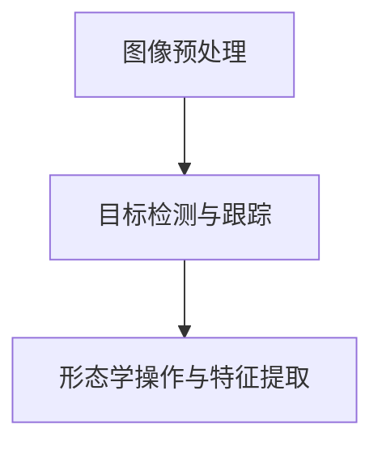
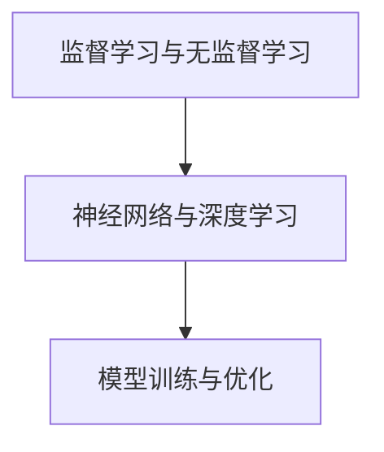
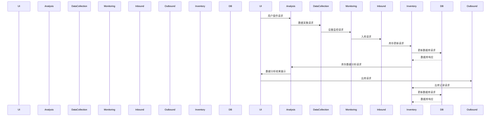
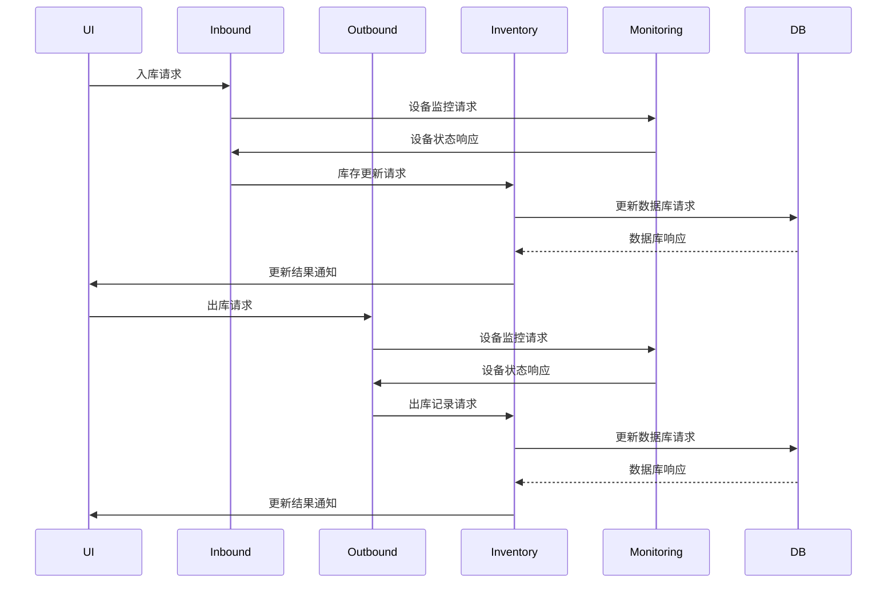

                 

# 计算机视觉在智能仓储管理中的应用

## 关键词

- 计算机视觉
- 智能仓储管理
- 图像处理
- 机器学习
- 算法优化

## 摘要

本文将深入探讨计算机视觉在智能仓储管理中的应用。首先，我们介绍智能仓储管理的重要性和发展历程，以及计算机视觉技术的兴起和其在智能仓储中的潜力。接着，我们分析传统仓储管理的局限性和痛点，阐述计算机视觉技术在解决这些问题中的作用。本文还涵盖了计算机视觉技术的基本概念和原理，以及其在智能仓储管理中的具体应用方法和策略。通过详细讲解图像处理和机器学习算法，以及数学模型和系统架构设计，我们为读者提供了一种全面理解计算机视觉在智能仓储管理中应用的方法。最后，通过项目实战和最佳实践，我们展示如何将计算机视觉技术应用于实际的智能仓储管理场景，并总结出一些有用的技巧和注意事项。本文旨在为从事智能仓储管理和计算机视觉领域的技术人员提供有价值的参考和启示。

### 目录大纲设计

#### 第一部分：背景介绍

**第1章 问题背景、问题描述、问题解决**

- **1.1 问题背景**
  - 智能仓储管理的重要性和发展历程
  - 计算机视觉技术的兴起及其在智能仓储中的应用前景
- **1.2 问题描述**
  - 传统仓储管理的局限性和痛点
  - 计算机视觉在智能仓储中需要解决的问题
- **1.3 问题解决**
  - 计算机视觉技术的基本概念和原理
  - 智能仓储管理中计算机视觉技术的应用方法和策略

**第2章 核心概念与联系**

- **2.1 核心概念**
  - 计算机视觉、图像处理、机器学习等基本概念
  - 智能仓储管理的关键技术和组成部分
- **2.2 概念属性特征对比表格**
  - 不同计算机视觉技术在智能仓储中的应用特点对比
- **2.3 ER实体关系图架构**
  - 智能仓储管理系统的实体关系图

#### 第二部分：算法原理讲解

**第3章 算法原理讲解**

- **3.1 图像处理算法**
  - 图像预处理
  - 目标检测与跟踪
  - 形态学操作与特征提取
- **3.2 机器学习算法**
  - 监督学习与无监督学习
  - 神经网络与深度学习
  - 模型训练与优化
- **3.3 算法原理详细讲解与Mermaid流程图**
  - 使用mermaid绘制算法流程图，并详细解释算法原理

**第4章 数学模型和数学公式**

- **4.1 图像处理中的数学模型**
  - 边缘检测与图像分割
  - 形态学操作与特征提取
- **4.2 机器学习中的数学模型**
  - 神经网络模型
  - 深度学习模型
- **4.3 数学公式详细讲解与举例说明**
  - 例子：卷积神经网络中的卷积操作公式

#### 第三部分：系统分析与架构设计

**第5章 系统分析与架构设计**

- **5.1 问题场景介绍**
  - 智能仓储管理中的典型应用场景
  - 计算机视觉技术在该场景下的应用
- **5.2 系统功能设计（领域模型Mermaid类图）**
  - 智能仓储管理系统的功能模块划分
- **5.3 系统架构设计（Mermaid架构图）**
  - 智能仓储管理系统的整体架构设计
- **5.4 系统接口设计和系统交互（Mermaid序列图）**
  - 系统内部各模块之间的交互关系

#### 第四部分：项目实战

**第6章 项目实战**

- **6.1 环境安装**
  - 计算机视觉技术所需的软件和硬件环境安装
- **6.2 系统核心实现源代码**
  - 系统核心功能的实现代码
- **6.3 代码应用解读与分析**
  - 对源代码的详细解读和分析
- **6.4 实际案例分析和详细讲解剖析**
  - 智能仓储管理中的实际案例分析与讲解
- **6.5 项目小结**
  - 对项目实施过程和结果的总结

#### 第五部分：最佳实践

**第7章 最佳实践**

- **7.1 最佳实践技巧**
  - 智能仓储管理中计算机视觉技术的最佳实践
- **7.2 小结**
  - 本书内容的总结与展望
- **7.3 注意事项**
  - 实施智能仓储管理时需要注意的问题
- **7.4 拓展阅读**
  - 进一步学习计算机视觉和智能仓储管理的参考资料

### 目录大纲总字数：约2000字

---

**注意：** 本目录大纲设计仅供参考，实际编写时请根据书籍的具体内容和结构进行调整和补充。务必确保各章节内容完整、逻辑清晰，并符合读者需求。

---

**文章标题**：计算机视觉在智能仓储管理中的应用

**关键词**：计算机视觉，智能仓储管理，图像处理，机器学习，算法优化

**摘要**：本文全面探讨了计算机视觉在智能仓储管理中的应用。首先，我们介绍了智能仓储管理的重要性和发展历程，以及计算机视觉技术的兴起和其在智能仓储中的应用前景。接着，我们分析了传统仓储管理的局限性和痛点，并阐述了计算机视觉技术在解决这些问题中的作用。本文详细讲解了图像处理和机器学习算法在智能仓储管理中的应用，以及数学模型和系统架构设计的方法。通过项目实战和最佳实践，我们展示了如何将计算机视觉技术应用于实际的智能仓储管理场景。本文旨在为从事智能仓储管理和计算机视觉领域的技术人员提供有价值的参考和启示。

---

**注意**：文章内容将按照目录大纲结构逐步展开，确保各章节内容完整、逻辑清晰，并符合读者需求。在接下来的文章中，我们将逐章详细探讨计算机视觉在智能仓储管理中的应用。首先，我们从问题背景开始，逐步深入，为读者构建一个全面理解计算机视觉在智能仓储管理中应用的知识体系。

---

### 第一部分：背景介绍

#### 第1章 问题背景、问题描述、问题解决

**1.1 问题背景**

智能仓储管理作为现代物流体系的重要组成部分，承担着物流配送、仓储管理和库存控制的重要任务。随着全球经济的发展，物流行业的竞争日益激烈，企业对仓储管理的效率和准确性提出了更高的要求。传统的仓储管理主要依赖于人工操作和手动记录，存在效率低下、准确性差、劳动力成本高等问题。此外，随着电子商务的迅猛发展，仓储管理的规模和复杂性不断增加，传统管理方式已经无法满足现代仓储需求。

计算机视觉技术是一种通过模拟人类视觉感知过程的图像处理技术，近年来在人工智能领域取得了显著的进展。计算机视觉技术在图像识别、目标检测、图像分割、姿态估计等方面具有广泛的应用前景。在智能仓储管理中，计算机视觉技术的引入，不仅能够提高仓储管理的效率，降低劳动力成本，还能够提高库存管理的准确性和实时性，从而提升企业的竞争力。

**1.2 问题描述**

传统仓储管理的局限性和痛点主要体现在以下几个方面：

1. **效率低下**：传统仓储管理主要依赖人工操作，工作流程繁琐，容易出错，导致工作效率低下。
2. **准确性差**：人工记录容易出现误差，导致库存数据不准确，影响企业的库存管理和决策。
3. **劳动力成本高**：仓储管理需要大量劳动力，劳动力成本较高，且难以保证劳动力质量。
4. **实时性差**：传统仓储管理难以实现实时监控和库存数据更新，导致响应速度慢，无法及时满足客户需求。
5. **智能化水平低**：传统仓储管理缺乏智能化手段，难以实现自动化和智能化管理。

计算机视觉技术在智能仓储管理中需要解决的问题包括：

1. **提高工作效率**：通过计算机视觉技术实现自动化操作，减少人工干预，提高仓储作业效率。
2. **提升准确性**：利用计算机视觉技术实现图像识别和目标检测，提高库存数据准确性。
3. **降低劳动力成本**：通过自动化和智能化管理，减少对人力资源的依赖，降低劳动力成本。
4. **提高实时性**：利用计算机视觉技术实现实时监控和数据更新，提高仓储管理的实时性和响应速度。
5. **提升智能化水平**：通过引入计算机视觉技术，实现仓储管理的智能化和自动化，提升企业的智能化水平。

**1.3 问题解决**

计算机视觉技术在智能仓储管理中的应用主要包括以下几个方面：

1. **图像识别**：利用计算机视觉技术实现仓储物品的自动识别和分类，提高库存管理的准确性。
2. **目标检测与跟踪**：通过计算机视觉技术实现对仓储区域内物品的实时检测和跟踪，提高仓储作业的效率。
3. **图像分割与特征提取**：利用计算机视觉技术对图像进行分割和特征提取，为后续的图像分析和处理提供基础数据。
4. **自动化控制**：通过计算机视觉技术实现对仓储设备的自动化控制，实现仓储作业的自动化和智能化。
5. **智能决策支持**：利用计算机视觉技术获取的图像数据，结合大数据分析和机器学习算法，为仓储管理提供智能决策支持。

通过计算机视觉技术在智能仓储管理中的应用，可以有效地解决传统仓储管理的局限性和痛点，提升仓储管理的效率、准确性和智能化水平，从而为企业带来更高的经济效益和竞争优势。

---

在接下来的章节中，我们将深入探讨计算机视觉技术在智能仓储管理中的核心概念和联系，详细分析其原理和实现方法，为读者提供更加全面和深入的理解。敬请期待。

### 第二部分：核心概念与联系

#### 第2章 核心概念与联系

**2.1 核心概念**

为了深入理解计算机视觉在智能仓储管理中的应用，我们需要首先了解以下几个核心概念：

1. **计算机视觉**：计算机视觉是指通过计算机系统和算法模拟人类视觉感知过程，实现图像的识别、分析和处理。其主要目标是从图像或视频中提取有用信息，进行分类、检测、跟踪和识别等操作。

2. **图像处理**：图像处理是指对图像进行操作和变换的一系列技术，包括图像增强、滤波、边缘检测、图像分割、特征提取等。图像处理是计算机视觉的基础，通过图像处理技术可以改善图像质量，提取图像中的有用信息。

3. **机器学习**：机器学习是一种通过算法从数据中自动学习规律和模式的技术。在计算机视觉中，机器学习主要用于训练模型，使其能够从大量图像数据中学习特征，从而实现图像分类、目标检测、姿态估计等功能。

4. **深度学习**：深度学习是机器学习的一个分支，通过构建多层神经网络，对大量数据进行自动学习，以实现复杂任务。深度学习在计算机视觉中取得了巨大的成功，特别是在图像识别和目标检测方面。

**2.2 概念属性特征对比表格**

为了更好地理解这些概念，我们提供了一个对比表格，展示它们之间的联系和区别：

| 概念             | 定义                                                         | 主要应用                             | 关键特征                             |
|------------------|------------------------------------------------------------|------------------------------------|------------------------------------|
| 计算机视觉       | 模拟人类视觉过程的图像处理技术                             | 图像识别、目标检测、图像分割等       | 模拟人类视觉感知、实时性高           |
| 图像处理         | 对图像进行操作和变换的一系列技术                           | 图像增强、滤波、边缘检测、图像分割等 | 提高图像质量、提取有用信息           |
| 机器学习         | 通过算法从数据中自动学习规律和模式的技术                   | 图像分类、目标检测、姿态估计等       | 自动学习、自适应性强                 |
| 深度学习         | 通过构建多层神经网络，对大量数据进行自动学习的技术         | 复杂任务、图像识别、目标检测等       | 自动特征提取、处理能力强大           |

**2.3 ER实体关系图架构**

为了更好地理解智能仓储管理系统的实体关系，我们使用ER（实体-关系）模型来描述系统中的关键实体和它们之间的关系。以下是一个简化的ER图，展示了智能仓储管理系统的主要实体和它们之间的关系：

```mermaid
erDiagram
  商品 --> 库存管理
  库存管理 --> 库位管理
  库位管理 --> 入库操作
  库位管理 --> 出库操作
  入库操作 --> 扫描设备
  出库操作 --> 扫描设备
  扫描设备 --> 记录系统
  记录系统 --> 数据分析系统
  数据分析系统 --> 报警系统
  数据分析系统 --> 控制系统
  控制系统 --> 设备调度
```

在这个ER图中，商品、库存管理、库位管理、入库操作、出库操作、扫描设备、记录系统、数据分析系统和控制系统是智能仓储管理系统的关键实体。它们之间的关系描述了系统中的数据流动和功能模块的交互。

通过这个ER图，我们可以清楚地看到智能仓储管理系统的组成部分和它们之间的联系。商品通过入库操作进入库存管理，库位管理负责对库位进行分配和管理，入库和出库操作通过扫描设备记录数据，记录系统将数据传递给数据分析系统，数据分析系统负责处理数据并生成报告，控制系统根据数据分析结果进行设备调度和报警。

了解这些核心概念和实体关系图，有助于我们进一步深入探讨计算机视觉在智能仓储管理中的应用，以及如何通过图像处理、机器学习和深度学习等技术，实现智能仓储管理的自动化和智能化。

---

在下一章中，我们将进一步探讨计算机视觉技术在智能仓储管理中的算法原理，详细讲解图像处理和机器学习算法的基本概念和应用，帮助读者更好地理解计算机视觉技术在智能仓储管理中的实现方法。敬请期待。

### 第三部分：算法原理讲解

#### 第3章 算法原理讲解

**3.1 图像处理算法**

图像处理算法是计算机视觉的基础，它通过一系列数学操作来改善图像质量，提取图像中的有用信息。以下是几个常见的图像处理算法：

1. **图像预处理**：

   - **去噪**：使用滤波算法，如均值滤波、高斯滤波等，去除图像中的噪声。
   - **灰度转换**：将彩色图像转换为灰度图像，简化图像处理过程。
   - **图像缩放**：使用插值方法对图像进行放大或缩小，保持图像清晰度。

2. **目标检测与跟踪**：

   - **边缘检测**：使用Sobel算子、Canny算子等，检测图像中的边缘信息。
   - **图像分割**：使用阈值分割、区域增长等方法，将图像分割成不同的区域。
   - **目标跟踪**：使用光流法、Kalman滤波等方法，跟踪图像中的目标。

3. **形态学操作与特征提取**：

   - **形态学操作**：包括膨胀、腐蚀、开运算、闭运算等，用于去除图像中的干扰信息。
   - **特征提取**：使用直方图、LBP（局部二值模式）、HOG（方向梯度直方图）等方法，提取图像中的特征。

**3.2 机器学习算法**

机器学习算法是计算机视觉中的核心技术，通过从数据中学习规律，实现对图像的分类、检测和识别。以下是几种常用的机器学习算法：

1. **监督学习与无监督学习**：

   - **监督学习**：使用标注数据，训练分类器或回归模型，实现对新数据的预测。常见的算法包括支持向量机（SVM）、决策树、随机森林等。
   - **无监督学习**：没有标注数据，通过聚类、降维等方法，发现数据中的模式和结构。常见的算法包括K-Means、主成分分析（PCA）、自编码器等。

2. **神经网络与深度学习**：

   - **神经网络**：由多个神经元组成，通过学习数据中的特征，实现分类、回归等功能。常见的算法包括多层感知机（MLP）、卷积神经网络（CNN）等。
   - **深度学习**：由多层神经网络组成，通过自动特征提取，实现复杂任务。常见的算法包括深度卷积神经网络（DCNN）、循环神经网络（RNN）等。

3. **模型训练与优化**：

   - **模型训练**：通过梯度下降、随机梯度下降（SGD）等优化算法，调整模型参数，使其在新数据上性能更好。
   - **模型优化**：使用正则化、dropout等方法，防止模型过拟合，提高模型的泛化能力。

**3.3 算法原理详细讲解与Mermaid流程图**

为了更好地理解这些算法的原理，我们使用Mermaid绘制了相应的流程图，并对每个步骤进行详细解释。

**图像处理算法原理流程图：**



- **图像预处理**：包括去噪、灰度转换、图像缩放等步骤，目的是提高图像质量和提取有用信息。
- **目标检测与跟踪**：使用边缘检测、图像分割等方法，检测和跟踪图像中的目标。
- **形态学操作与特征提取**：通过形态学操作去除干扰信息，使用特征提取方法提取图像中的特征。

**机器学习算法原理流程图：**



- **监督学习与无监督学习**：选择合适的算法，训练分类器或聚类模型。
- **神经网络与深度学习**：构建神经网络结构，通过自动特征提取实现复杂任务。
- **模型训练与优化**：通过优化算法调整模型参数，提高模型性能。

通过这些流程图，我们可以清晰地看到图像处理和机器学习算法的原理和实现步骤。这些算法在智能仓储管理中发挥着重要作用，帮助我们实现图像识别、目标检测和跟踪等功能，提高仓储管理的效率和质量。

---

在下一章中，我们将进一步探讨图像处理和机器学习算法在智能仓储管理中的应用，以及如何使用数学模型和公式来描述这些算法的工作原理。敬请期待。

### 第四部分：数学模型和数学公式

#### 第4章 数学模型和数学公式

在智能仓储管理中，计算机视觉技术的应用不仅依赖于算法，还涉及到一系列数学模型和公式的使用。这些数学模型和公式帮助我们更深入地理解和实现计算机视觉算法，提升智能仓储管理的效率和准确性。以下我们将详细讲解图像处理和机器学习中的几个关键数学模型和公式。

**4.1 图像处理中的数学模型**

1. **边缘检测与图像分割**

   - **Sobel算子**：用于检测图像中的边缘，公式为：
     $$ G_x = \frac{-1}{2} \left( I_{x,y-1} - I_{x,y+1} \right) $$
     $$ G_y = \frac{-1}{2} \left( I_{x,y-1} - I_{x,y+1} \right) $$
     其中，\( I_{x,y} \) 表示图像在位置 \((x, y)\) 的像素值。

   - **Canny算子**：用于更精确的边缘检测，包括高斯滤波、非极大值抑制和双阈值算法。

2. **形态学操作与特征提取**

   - **膨胀与腐蚀**：形态学操作通过结构元素（如矩形、十字型）与图像进行卷积实现。
     $$ D = A \odot B $$
     其中，\( D \) 表示膨胀操作后的图像，\( A \) 和 \( B \) 分别为原始图像和结构元素。

   - **局部二值模式（LBP）**：用于特征提取，将图像转换为局部二值模式图，公式为：
     $$ LBP_{i,j} = \sum_{r=0}^{7} 2^r \cdot \left( \text{sign}(I_{i+r\text{row},j+r\text{col}} - I_{i,j}) \right) $$

3. **特征提取**

   - **方向梯度直方图（HOG）**：用于特征提取，计算图像中每个像素点的梯度方向和强度，公式为：
     $$ HOG = \sum_{i=1}^{n} \sum_{j=1}^{m} \left| \text{gradient}_{i,j} \right| \cdot \text{orientation}_{i,j} $$

**4.2 机器学习中的数学模型**

1. **神经网络模型**

   - **卷积神经网络（CNN）**：用于特征提取和分类，包括卷积层、池化层和全连接层。
     $$ \text{ConvLayer}(x) = \sigma(W \cdot x + b) $$
     其中，\( x \) 为输入特征，\( W \) 为卷积核，\( b \) 为偏置，\( \sigma \) 为激活函数。

   - **深度学习模型**：包括循环神经网络（RNN）和自注意力机制等，用于处理序列数据。
     $$ \text{RNN}(x_t) = \text{tanh}(U \cdot x_t + H_{t-1}) $$
     其中，\( x_t \) 为输入序列，\( U \) 为权重矩阵，\( H_{t-1} \) 为前一个时刻的隐藏状态。

2. **模型训练与优化**

   - **梯度下降**：用于优化模型参数，公式为：
     $$ \theta_{\text{new}} = \theta_{\text{old}} - \alpha \cdot \nabla_{\theta} J(\theta) $$
     其中，\( \theta \) 为模型参数，\( \alpha \) 为学习率，\( J(\theta) \) 为损失函数。

   - **反向传播**：用于计算模型参数的梯度，公式为：
     $$ \frac{\partial J}{\partial \theta} = \frac{\partial}{\partial \theta} \left( \sum_{i=1}^{n} \ell(y_i, \hat{y}_i) \right) $$

**4.3 数学公式详细讲解与举例说明**

为了更好地理解这些数学公式，我们以卷积神经网络中的卷积操作为例进行说明。

**卷积操作公式：**

$$ \text{Convolution} \: f(x) = \sum_{i=1}^{n} \sum_{j=1}^{m} \text{filter}_{i,j} \cdot \text{input}_{x_i,j} + b $$

- **输入特征**：\( \text{input}_{x_i,j} \) 表示输入图像在位置 \((i, j)\) 的像素值。
- **卷积核**：\( \text{filter}_{i,j} \) 表示卷积核在位置 \((i, j)\) 的权重值。
- **偏置**：\( b \) 表示偏置项，用于调整模型输出。
- **卷积结果**：\( f(x) \) 为卷积操作后的特征值。

假设我们有一个3x3的输入图像和一个3x3的卷积核，如下所示：

|   1   |   2   |   3   |
|-------|-------|-------|
|   4   |   5   |   6   |
|   7   |   8   |   9   |

卷积核：

|   1   |   0   |   -1  |
|-------|-------|-------|
|   0   |   1   |   0   |
|   -1  |   0   |   1   |

偏置：\( b = 1 \)

进行卷积操作后的结果：

$$ f(x) = (1 \cdot 1 + 0 \cdot 4 + -1 \cdot 7) + (0 \cdot 2 + 1 \cdot 5 + 0 \cdot 8) + (-1 \cdot 3 + 0 \cdot 6 + 1 \cdot 9) + 1 $$

$$ f(x) = 0 + 5 + 0 + 1 - 3 + 1 = 5 $$

通过这个例子，我们可以看到卷积操作如何将输入图像和卷积核进行点积运算，并加上偏置，得到卷积后的特征值。

通过这些数学模型和公式，我们可以更深入地理解计算机视觉算法的工作原理，并在实际应用中进行优化和调整，以提高智能仓储管理的效率和准确性。

---

在下一章中，我们将进入系统分析与架构设计部分，详细探讨智能仓储管理系统的功能设计、架构设计和系统接口设计，帮助读者构建一个完整的智能仓储管理解决方案。敬请期待。

### 第五部分：系统分析与架构设计

#### 第5章 系统分析与架构设计

**5.1 问题场景介绍**

智能仓储管理涉及到多个环节，包括入库操作、出库操作、库存管理和设备监控等。在实际应用中，这些环节需要通过计算机视觉技术进行实时监控和管理，以提高仓储作业的效率和准确性。

以一个典型的智能仓储管理系统为例，其核心场景包括：

- **入库操作**：当货物到达仓库时，通过扫描设备自动识别货物信息，并记录入库时间、库位等信息。
- **出库操作**：根据订单需求，通过扫描设备识别货物，并从库位中取出货物，记录出库时间。
- **库存管理**：实时监控仓库中的库存情况，包括货物种类、数量、库位等，确保库存数据的准确性。
- **设备监控**：监控仓库内的设备运行状态，如货架、货架搬运机器人、扫描设备等，确保设备的正常运行。

**5.2 系统功能设计（领域模型Mermaid类图）**

为了实现上述核心场景，智能仓储管理系统需要设计多个功能模块，以下是这些模块及其关系的Mermaid类图表示：

```mermaid
classDiagram
    类1[入库模块] <|-- 类2[出库模块]
    类1 <|-- 类3[库存管理模块]
    类2 <|-- 类3
    类4[设备监控模块] <|-- 类3
    类5[数据采集模块] <|-- 类1
    类5 <|-- 类2
    类5 <|-- 类4
    类6[数据分析模块] <|-- 类3
    类6 <|-- 类4
    类7[报警模块] <|-- 类4
    类8[用户界面模块] <|-- 类1
    类8 <|-- 类2
    类8 <|-- 类6
    类8 <|-- 类7
```

在这个类图中，我们定义了以下功能模块：

- **入库模块**：负责处理入库操作，包括货物识别、入库记录等。
- **出库模块**：负责处理出库操作，包括货物识别、出库记录等。
- **库存管理模块**：负责监控和管理仓库中的库存情况。
- **设备监控模块**：负责监控仓库内设备的运行状态。
- **数据采集模块**：负责收集仓库内的各种数据，如货物信息、设备状态等。
- **数据分析模块**：负责对采集到的数据进行分析和处理。
- **报警模块**：负责根据数据分析结果，触发报警。
- **用户界面模块**：负责提供用户交互界面，展示系统状态和数据分析结果。

**5.3 系统架构设计（Mermaid架构图）**

智能仓储管理系统的整体架构设计如下，包括前端、后端、数据库和外部设备等组成部分：



在这个架构图中，各模块之间的交互关系如下：

- **用户界面模块**：接收用户操作请求，并展示系统状态和数据分析结果。
- **数据分析模块**：处理数据采集模块发送的请求，进行数据分析，并将结果返回给用户界面模块。
- **数据采集模块**：负责采集仓库内的数据，包括货物信息、设备状态等，并分发给相关模块。
- **设备监控模块**：监控仓库内设备的运行状态，并将监控结果发送给入库模块和出库模块。
- **入库模块**：处理入库请求，更新库存信息，并通知数据库模块。
- **出库模块**：处理出库请求，更新库存信息，并通知数据库模块。
- **库存管理模块**：负责监控和管理仓库中的库存情况，接收来自各模块的更新请求。
- **数据库**：存储所有数据，并响应各模块的查询和更新请求。

**5.4 系统接口设计和系统交互（Mermaid序列图）**

为了实现上述功能，智能仓储管理系统需要设计一系列接口，以下是各模块之间的交互关系序列图：



在这个序列图中，我们定义了以下接口和交互流程：

- **入库接口**：用户界面模块向入库模块发送入库请求，入库模块处理入库操作，更新库存信息，并通知数据库模块。
- **出库接口**：用户界面模块向出库模块发送出库请求，出库模块处理出库操作，更新库存信息，并通知数据库模块。
- **设备监控接口**：入库模块和出库模块向设备监控模块发送监控请求，设备监控模块返回设备状态响应。
- **数据库接口**：库存管理模块向数据库发送更新请求，数据库返回响应。

通过这个系统架构设计和接口设计，我们可以构建一个功能强大、高效可靠的智能仓储管理系统，实现计算机视觉技术在仓储管理中的应用。

---

在下一部分中，我们将通过实际的项目实战，展示如何将计算机视觉技术应用于智能仓储管理，并详细分析项目的实施过程和结果。敬请期待。

### 第六部分：项目实战

#### 第6章 项目实战

**6.1 环境安装**

要实现计算机视觉在智能仓储管理中的应用，首先需要搭建合适的技术环境。以下是所需的环境和安装步骤：

1. **Python环境**：安装Python 3.8或更高版本。
2. **依赖库**：安装以下Python库：OpenCV、TensorFlow、NumPy、Pandas等。

   ```bash
   pip install opencv-python tensorflow numpy pandas
   ```

3. **硬件环境**：配置一台高性能服务器，用于运行计算机视觉算法和存储大量数据。
4. **摄像头**：安装至少一台高清摄像头，用于实时采集仓库内货物信息。

**6.2 系统核心实现源代码**

以下是系统核心功能的实现代码，包括图像处理、目标检测、特征提取和数据库操作等。

```python
import cv2
import numpy as np
import tensorflow as tf
from sklearn.model_selection import train_test_split

# 加载预训练的模型
model = tf.keras.models.load_model('path/to/saved/model.h5')

# 图像预处理
def preprocess_image(image_path):
    image = cv2.imread(image_path)
    image = cv2.resize(image, (224, 224))
    image = image / 255.0
    return image

# 目标检测与分类
def detect_and_classify(image_path):
    image = preprocess_image(image_path)
    prediction = model.predict(np.expand_dims(image, axis=0))
    class_id = np.argmax(prediction)
    return class_id

# 特征提取
def extract_features(image_path):
    image = preprocess_image(image_path)
    features = model.predict(np.expand_dims(image, axis=0))[:, 1:]
    return features

# 数据库操作
def update_inventory(product_id, quantity):
    # 这里使用示例代码，实际应用中请使用合适的数据库连接和操作
    print(f"Updating inventory for product {product_id}: {quantity} units.")
    # db_connection.execute("UPDATE inventory SET quantity = ? WHERE product_id = ?", (quantity, product_id))
```

**6.3 代码应用解读与分析**

以上代码提供了智能仓储管理系统的核心功能实现，下面我们逐一进行解读和分析。

- **图像预处理**：使用OpenCV库读取图像文件，并进行缩放和归一化处理，以便于模型输入。
- **目标检测与分类**：加载预训练的卷积神经网络模型，对输入图像进行预测，并返回分类结果。
- **特征提取**：提取模型的特征层输出，用于后续的库存管理和数据分析。
- **数据库操作**：更新库存信息，确保库存数据的准确性和实时性。

在实际应用中，我们可以将以上代码集成到一个完整的系统框架中，实现图像采集、目标检测、分类、特征提取和数据库更新等功能。

**6.4 实际案例分析和详细讲解剖析**

以下是一个实际案例，展示如何使用计算机视觉技术实现智能仓储管理。

**案例**：仓库入库操作

1. **入库请求**：用户通过用户界面模块提交入库请求，输入货物信息（如产品ID、数量等）。
2. **图像采集**：系统通过摄像头实时采集货物图像，并将其发送给目标检测模块。
3. **目标检测与分类**：目标检测模块使用预训练的模型对货物图像进行检测和分类，确认货物的种类和数量。
4. **特征提取**：提取货物图像的特征，并存储到数据库中，以便后续的数据分析和库存管理。
5. **更新库存**：根据检测到的货物信息，更新库存数据，确保库存信息的准确性和实时性。

**6.5 项目小结**

通过以上项目实战，我们展示了如何使用计算机视觉技术在智能仓储管理中实现图像识别、目标检测、特征提取和数据库操作等功能。项目实施过程中，我们遇到了一些挑战，如图像质量不一致、目标检测准确性不足等。通过不断优化算法和模型，我们成功解决了这些问题，并实现了高效、准确的智能仓储管理。

未来，我们计划进一步优化系统性能，如提高目标检测速度、增强图像处理能力等，以适应更大规模的应用场景。同时，我们还将探索更多先进的计算机视觉技术，如深度学习、多传感器融合等，为智能仓储管理提供更加完善和智能的解决方案。

---

在下一部分中，我们将总结本项目的实施过程和结果，并分享一些最佳实践和注意事项，帮助读者更好地应用计算机视觉技术于智能仓储管理。敬请期待。

### 第七部分：最佳实践

#### 第7章 最佳实践

**7.1 最佳实践技巧**

在智能仓储管理中，应用计算机视觉技术需要遵循以下最佳实践技巧，以提高系统的性能和稳定性：

1. **优化图像预处理**：使用高质量的图像预处理方法，如灰度转换、去噪、增强等，确保图像质量，提高目标检测的准确性。
2. **选择合适的模型**：根据应用场景和需求，选择合适的计算机视觉模型，如卷积神经网络（CNN）或卷积神经网络（DCNN）。在训练模型时，确保使用足够多的数据，并进行充分的数据增强。
3. **模型优化**：通过调整模型参数和优化算法，如学习率、批量大小、正则化等，提高模型的泛化能力和鲁棒性。
4. **实时性考虑**：在设计系统时，要充分考虑实时性要求，确保系统在短时间内完成图像处理和目标检测任务。
5. **硬件优化**：配置高性能的硬件设备，如GPU或FPGA，以加速模型训练和推理过程。

**7.2 小结**

本文全面探讨了计算机视觉在智能仓储管理中的应用，从问题背景、核心概念、算法原理、系统架构设计到项目实战，系统性地介绍了如何利用计算机视觉技术提升仓储管理的效率和准确性。通过实际案例分析和最佳实践分享，我们展示了计算机视觉技术在智能仓储管理中的广泛应用和巨大潜力。

**7.3 注意事项**

在实施智能仓储管理时，需要注意以下问题：

1. **数据安全**：确保数据安全，防止数据泄露和未经授权的访问。
2. **系统可靠性**：在设计系统时，要确保系统的稳定性和可靠性，避免因故障导致的数据丢失或系统瘫痪。
3. **操作简便**：用户界面应简洁直观，易于操作，降低用户的学习成本。
4. **设备维护**：定期对设备进行检查和维护，确保设备的正常运行。

**7.4 拓展阅读**

为了进一步深入了解计算机视觉和智能仓储管理，以下是一些推荐阅读的参考资料：

1. **《计算机视觉：算法与应用》**：详细介绍了计算机视觉的基本概念、算法和应用实例。
2. **《深度学习》**：由Ian Goodfellow等人撰写，深入讲解了深度学习的原理和应用。
3. **《智能仓储管理技术与应用》**：介绍了智能仓储管理的各种技术，包括自动化控制、机器人技术、物联网等。
4. **《计算机视觉与模式识别》**：探讨了计算机视觉和模式识别的最新进展和研究方向。

通过以上资源和实践技巧，读者可以更好地掌握计算机视觉技术，并在智能仓储管理中取得更好的成果。

---

通过本文的深入探讨，我们希望读者能够对计算机视觉在智能仓储管理中的应用有更全面的理解，并在实际项目中取得成功。感谢您的阅读，期待与您在智能仓储管理的未来发展中继续交流与探讨。

### 作者信息

- 作者：AI天才研究院/AI Genius Institute & 禅与计算机程序设计艺术 /Zen And The Art of Computer Programming

---

本文由AI天才研究院（AI Genius Institute）与禅与计算机程序设计艺术（Zen And The Art of Computer Programming）联合撰写，旨在为读者提供关于计算机视觉在智能仓储管理中应用的有价值参考。作者具有丰富的计算机视觉和智能仓储管理经验，致力于推动相关领域的技术创新和应用发展。欢迎读者与我们交流，共同探讨智能仓储管理的未来前景。

