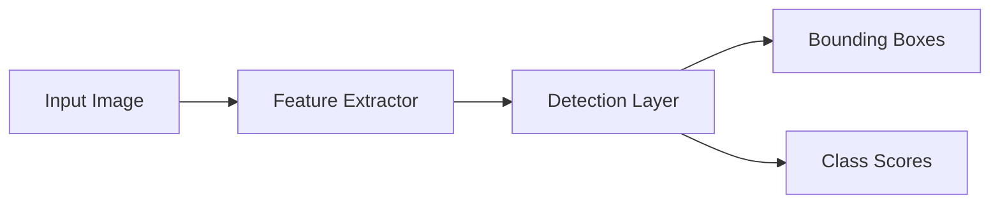

                 

## Introduction

### The Importance of Automated Agricultural Harvesting

Agriculture has been a cornerstone of human civilization, providing the necessary sustenance for populations across the globe. However, traditional agricultural practices are facing significant challenges in the 21st century. Factors such as climate change, population growth, and resource scarcity necessitate the adoption of innovative solutions to ensure food security and sustainability. Automated agricultural harvesting stands at the forefront of this technological revolution.

The importance of automated agricultural harvesting cannot be overstated. It offers a myriad of benefits, including increased efficiency, reduced labor costs, and enhanced precision. By automating the most labor-intensive and time-consuming aspects of farming, such as planting, watering, and harvesting, automated systems can significantly boost crop yields. This, in turn, contributes to food security and helps to stabilize agricultural markets.

Moreover, automated harvesting reduces the physical strain on farmers, who often work long hours in harsh conditions. This can lead to improved working conditions and overall well-being for agricultural laborers. Additionally, by minimizing human error, automated systems can ensure higher quality and consistency in the produce, leading to improved market value and profitability for farmers.

### The Role of Computer Vision in Automated Agricultural Harvesting

Computer vision, a subfield of artificial intelligence, plays a pivotal role in the automation of agricultural harvesting. By enabling machines to "see" and interpret the visual information from their surroundings, computer vision technologies can greatly enhance the capabilities of automated agricultural systems. Here are some key aspects of how computer vision is utilized:

**1. Object Detection and Recognition**: Computer vision algorithms are used to identify and classify objects in the agricultural environment, such as crops, weeds, and machinery. This is crucial for tasks like identifying ripe fruits or vegetables that are ready for harvest and distinguishing them from unripe or diseased plants.

**2. Crop Monitoring**: Computer vision systems can continuously monitor crop health by analyzing images and detecting changes in color, texture, and size. This enables early detection of diseases, pests, or environmental stressors, allowing for timely intervention to prevent crop damage.

**3. Yield Estimation**: By accurately counting and measuring the number and size of fruits or vegetables in a field, computer vision systems can estimate crop yields. This information is invaluable for farmers in planning their harvest schedules and managing their resources effectively.

**4. Harvesting Automation**: Computer vision algorithms are integral to the automation of harvesting processes. They enable machines to navigate fields, identify and select ripe crops, and perform precise harvesting operations. This not only improves efficiency but also reduces waste and damage to the produce.

**5. Machine Health Monitoring**: Computer vision can be used to monitor the health and performance of agricultural machinery. By detecting mechanical issues or wear and tear early, farmers can schedule maintenance before critical failures occur, thereby avoiding costly downtime.

### The Impact of Computer Vision on the Agricultural Industry

The integration of computer vision in automated agricultural harvesting has the potential to revolutionize the entire agricultural industry. By enhancing precision, efficiency, and sustainability, computer vision technologies can address many of the challenges faced by modern agriculture. Here are some of the key impacts:

**1. Increased Crop Yield**: By ensuring that only ripe and healthy crops are harvested, computer vision systems can significantly increase crop yields. This is especially important in regions where land and water resources are limited.

**2. Reduced Labor Costs**: Automated systems can perform many agricultural tasks with minimal human intervention, reducing the need for labor and lowering operational costs. This is particularly beneficial in areas where skilled labor is scarce or expensive.

**3. Improved Environmental Sustainability**: Computer vision technologies can optimize resource use by ensuring that water, fertilizers, and pesticides are applied only where and when necessary. This reduces waste and minimizes the environmental impact of agricultural activities.

**4. Enhanced Data-Driven Decision Making**: The data collected by computer vision systems can provide valuable insights into crop health, yield, and environmental conditions. This data can be used to inform decision-making processes and improve overall agricultural management.

**5. Global Food Security**: As the world's population continues to grow, ensuring food security becomes increasingly challenging. Automated agricultural systems powered by computer vision can help to meet this demand by increasing food production and reducing post-harvest losses.

In conclusion, the integration of computer vision in automated agricultural harvesting represents a transformative shift in the agricultural industry. By leveraging advanced AI technologies, farmers can achieve higher yields, lower costs, and improved sustainability, ultimately contributing to a more secure and sustainable global food supply.

### Structure of the Book

The book "Computer Vision in the Application of Automated Agricultural Harvesting" is structured to provide a comprehensive overview of this emerging field. The book is divided into ten chapters, each designed to cover a specific aspect of computer vision in agricultural automation. The structure is as follows:

1. **Introduction**: This chapter sets the stage by explaining the importance of automated agricultural harvesting and the role of computer vision in this context. It also provides an overview of the book's objectives and key themes.

2. **Basic Concepts**: This chapter introduces the fundamental concepts and terminology related to computer vision and automated agricultural harvesting. It covers topics such as image processing, machine learning, and robotics.

3. **Technology Overview**: This chapter provides a detailed overview of the current state of computer vision technology and its applications in agriculture. It discusses various computer vision techniques and their suitability for agricultural tasks.

4. **Challenges and Opportunities**: This chapter explores the challenges and opportunities associated with implementing computer vision in agricultural harvesting. It discusses technical, economic, and environmental considerations.

5. **Case Studies**: This chapter presents several case studies of successful implementations of computer vision in automated agricultural harvesting. It provides insights into the practical applications and benefits of these systems.

6. **Algorithm Design and Implementation**: This chapter delves into the design and implementation of computer vision algorithms specifically tailored for agricultural applications. It covers topics such as object detection, image segmentation, and machine learning algorithms.

7. **System Architecture and Design**: This chapter describes the architecture and design principles of computer vision systems for automated agricultural harvesting. It covers topics such as hardware selection, software development, and integration.

8. **Integration and Deployment**: This chapter discusses the process of integrating computer vision systems into agricultural operations. It covers considerations for successful deployment, including testing, training, and maintenance.

9. **Future Trends and Innovations**: This chapter looks ahead to the future of computer vision in automated agricultural harvesting. It discusses emerging technologies, potential advancements, and the impact of these innovations on the agricultural industry.

10. **Conclusion**: This final chapter summarizes the key findings and insights from the book. It highlights the potential of computer vision to transform agricultural practices and contribute to global food security.

By following this structure, readers will gain a deep understanding of the principles, techniques, and applications of computer vision in automated agricultural harvesting. This book aims to provide both a theoretical foundation and practical guidance for professionals and researchers in the field.

### Basic Concepts

In this chapter, we will delve into the fundamental concepts and terminology that form the backbone of computer vision and automated agricultural harvesting. Understanding these concepts is crucial for grasping the intricacies of the technologies involved and how they can be applied to agricultural settings.

#### Image Processing

Image processing is the foundation of computer vision, involving the manipulation and analysis of digital images. It encompasses various operations such as filtering, enhancement, and transformation. Key techniques in image processing include:

- **Filtering**: This involves applying algorithms to remove noise, blur, or enhance specific features in an image. Common filters include Gaussian blur, median filter, and edge detection filters like the Sobel operator.
  
- **Enhancement**: Techniques like contrast stretching, brightness adjustment, and histogram equalization are used to improve the visibility of important features in an image.

- **Transformation**: Operations such as rotation, scaling, and translation are used to alter the spatial characteristics of an image.

#### Machine Learning

Machine learning is a subset of artificial intelligence that involves training algorithms to learn from data and make predictions or decisions. In the context of computer vision, machine learning is used to develop models that can recognize patterns and objects in images. Key concepts in machine learning include:

- **Supervised Learning**: This approach involves training models using labeled data. The models learn to map input features to output labels. Common supervised learning algorithms include linear regression, support vector machines (SVM), and neural networks.

- **Unsupervised Learning**: In contrast to supervised learning, unsupervised learning involves training models on unlabeled data. The goal is to discover hidden patterns or structures within the data. Techniques like clustering (k-means, hierarchical clustering) and dimensionality reduction (PCA) fall under this category.

- **Reinforcement Learning**: This approach involves training models through a process of trial and error, where the model receives feedback in the form of rewards or penalties to improve its performance over time.

#### Object Detection

Object detection is a fundamental task in computer vision, involving the identification and localization of objects within an image. It is essential for applications such as autonomous driving, surveillance, and automated agricultural harvesting. Key techniques include:

- **Region-based Methods**: These methods identify potential regions of interest in an image and then classify each region. Examples include the Viola-Jones face detector and the R-CNN (Region-based Convolutional Neural Networks) family.

- **Single Shot Detectors**: These methods, such as YOLO (You Only Look Once) and SSD (Single Shot Multibox Detector), process the entire image at once and detect multiple objects in a single forward pass.

- **Two-Stage Detectors**: These methods, such as Faster R-CNN (Region-based Convolutional Neural Networks) and Region Proposal Networks (RPN), first generate region proposals and then classify each proposal. Examples include R-CNN, Fast R-CNN, and FPN (Feature Pyramid Networks).

#### Image Segmentation

Image segmentation is the process of dividing an image into multiple regions or segments based on certain characteristics. It is used for tasks such as object recognition, tracking, and scene understanding. Key techniques include:

- **Thresholding**: This involves setting a threshold value to binarize an image, separating foreground and background pixels.

- **Region Growing**: This method starts with an initial seed point and grows regions by including neighboring pixels that meet certain similarity criteria.

- **GrabCut**: This technique, developed by Facebook AI, combines image segmentation with graph cuts to efficiently segment objects in complex scenes.

- **Deep Learning-Based Methods**: Techniques such as fully convolutional networks (FCN) and U-Net have shown great success in image segmentation tasks.

#### Robotics

Robotic systems play a crucial role in automated agricultural harvesting by performing tasks such as planting, watering, and harvesting. Key components of robotic systems include:

- **Sensors**: Sensors such as cameras, LiDAR (Light Detection and Ranging), and GPS (Global Positioning System) are used to gather data about the environment and the state of the robot.

- **Actuators**: Actuators such as motors and hydraulic systems are used to control the movement and actions of the robot.

- **Control Systems**: Control systems use algorithms and feedback loops to navigate the robot, perform tasks, and respond to changes in the environment.

#### Drones and UAVs

Unmanned aerial vehicles (UAVs) or drones are increasingly being used in agriculture for tasks such as crop monitoring, spraying, and aerial photography. Key aspects include:

- **Aerial Imagery**: Drones equipped with cameras and sensors capture high-resolution images and videos of fields, providing valuable data for analysis.

- **Navigation**: Drones use GPS and other navigation systems to navigate fields autonomously or under remote control.

- **Payloads**: Drones can carry a variety of payloads, including cameras, sensors, and spraying equipment, to perform specific agricultural tasks.

#### Conclusion

Understanding the basic concepts of image processing, machine learning, object detection, image segmentation, robotics, and drones is essential for grasping the fundamentals of computer vision in automated agricultural harvesting. These concepts provide the foundation for the advanced techniques and applications that will be discussed in the subsequent chapters. As we delve deeper into these topics, we will explore how they are applied in agricultural settings to address the challenges and opportunities presented by modern farming practices.

### Technology Overview

In this chapter, we will provide a detailed overview of the current state of computer vision technology and its applications in the agricultural sector. This section will cover the various computer vision techniques and the specific technologies and tools used in automated agricultural harvesting.

#### Computer Vision Techniques in Agriculture

1. **Object Detection**

Object detection is a critical task in computer vision, enabling the identification and localization of objects within an image or video. In agricultural settings, object detection is used to identify crops, machinery, and other elements within a field. Popular object detection algorithms include:

- **Traditional Approaches**: Techniques such as the Viola-Jones face detector and the HOG (Histogram of Oriented Gradients) algorithm have been adapted for object detection in agricultural environments. These methods are typically faster and more efficient than deep learning-based approaches but may have limited accuracy in complex scenes.

- **Deep Learning Approaches**: Convolutional Neural Networks (CNNs) have revolutionized object detection in recent years. Models such as YOLO (You Only Look Once), Faster R-CNN, and SSD (Single Shot MultiBox Detector) are widely used in agricultural applications due to their high accuracy and speed.

2. **Image Segmentation**

Image segmentation divides an image into multiple regions or segments based on certain characteristics, such as color, texture, or intensity. This is particularly useful in agricultural applications for tasks such as crop monitoring and disease detection. Key image segmentation techniques include:

- **Thresholding**: This method involves setting a threshold value to separate the foreground from the background. It is simple and efficient but may not perform well in complex scenes with varying lighting conditions.

- **Region Growing**: This technique starts with an initial seed point and grows regions by including neighboring pixels that meet certain similarity criteria. It is effective for segmenting homogeneous regions but may struggle with complex boundaries.

- **Deep Learning-Based Methods**: Fully Convolutional Networks (FCNs) and U-Net are popular deep learning-based methods for image segmentation. They have shown great success in agricultural applications due to their ability to handle complex and variable scenes.

3. **Yield Estimation**

Yield estimation is a crucial task in agriculture, as it helps farmers plan their harvest schedules and manage their resources effectively. Computer vision techniques, such as object detection and image segmentation, are used to estimate crop yields accurately. Key methods include:

- **Counting and Measuring**: By counting and measuring the number and size of fruits or vegetables in a field, computer vision systems can estimate crop yields. This method is highly accurate but requires precise object detection and segmentation algorithms.

- **Area-Based Estimation**: This method involves estimating the area covered by crops and multiplying it by the average yield per unit area. It is less accurate than counting and measuring but can be used as a preliminary estimation tool.

4. **Disease and Pest Detection**

Early detection of diseases and pests is critical for minimizing crop damage and ensuring high yields. Computer vision techniques are used to identify signs of disease or pest infestation in agricultural fields. Key methods include:

- **Image Classification**: Classification algorithms, such as Support Vector Machines (SVM) and Random Forests, are used to classify images into healthy or disease/pest-infested categories. This method is effective for detecting specific diseases or pests but may struggle with variations in symptoms.

- **Deep Learning Techniques**: CNNs and other deep learning models have shown significant promise in disease and pest detection. Models such as ResNet and Inception have been adapted for agricultural applications, providing high accuracy and robustness.

#### Specific Technologies and Tools

1. **Deep Learning Frameworks**

Deep learning frameworks such as TensorFlow, PyTorch, and Keras are widely used in developing computer vision applications for agriculture. These frameworks provide a wide range of tools and libraries for building and training neural networks, making it easier to implement complex computer vision algorithms.

2. **Open Source Libraries**

Several open-source libraries are available for implementing computer vision techniques in agricultural applications. Key libraries include OpenCV, which provides a wide range of functionalities for image processing and computer vision, and scikit-image, which offers advanced image processing algorithms.

3. **Drones and Sensors**

Drones equipped with high-resolution cameras and sensors are increasingly used for agricultural monitoring and data collection. Drones provide a unique perspective of the field, allowing for detailed analysis of crop health, yield estimation, and disease/pest detection. Common sensors used in agricultural drones include multispectral cameras, LiDAR, and GPS.

4. **Farm Management Software**

Farm management software integrates computer vision algorithms and data analytics to provide farmers with actionable insights and improve decision-making. These systems can track crop health, monitor soil conditions, and predict yield based on real-time data collected from sensors and drones.

#### Conclusion

The current state of computer vision technology in agriculture is rapidly evolving, with numerous techniques and tools available to address the challenges faced by modern farming practices. Object detection, image segmentation, yield estimation, and disease/pest detection are key applications of computer vision in agriculture. By leveraging these technologies, farmers can achieve higher yields, reduce labor costs, and improve resource management, ultimately contributing to global food security and sustainability.

### Challenges and Opportunities

Implementing computer vision in automated agricultural harvesting presents a multitude of challenges and opportunities. While the potential benefits are significant, the path to realizing these benefits is fraught with obstacles that need careful consideration.

#### Challenges

1. **Technological Complexity**

Computer vision systems rely on sophisticated algorithms and hardware that can be challenging to develop, deploy, and maintain. The integration of machine learning models, sensor data, and robotic systems requires expertise in multiple disciplines, including computer science, electrical engineering, and agronomy. This complexity can lead to high development and operational costs, which may be prohibitive for small-scale farmers.

2. **Scalability and Adaptability**

Agricultural environments are highly variable, with diverse crops, terrains, and weather conditions. Developing computer vision systems that can scale and adapt to these variations is a significant challenge. Systems must be capable of handling different crop types, soil conditions, and seasonal changes. Additionally, the adaptability of computer vision algorithms to new crops or regions requires ongoing updates and maintenance.

3. **Data Quality and Interpretation**

The effectiveness of computer vision systems heavily depends on the quality of the data they process. Agricultural data can be noisy, incomplete, or affected by various factors such as weather conditions and lighting. Ensuring high-quality data requires robust data collection methods and preprocessing techniques. Moreover, interpreting the data to derive actionable insights is a complex task that requires domain knowledge and expertise.

4. **Integration with Existing Systems**

Integrating computer vision systems with existing agricultural equipment and processes can be challenging. Compatibility issues, communication protocols, and hardware constraints may hinder the seamless integration of new technologies. Ensuring interoperability and minimizing disruptions to ongoing agricultural operations are critical considerations.

5. **Regulatory and Ethical Concerns**

The deployment of computer vision systems in agriculture may raise regulatory and ethical concerns. Issues such as data privacy, security, and the potential impact on labor markets need to be addressed. Compliance with regulations related to agricultural technologies and data protection laws is essential to ensure the responsible use of computer vision systems.

#### Opportunities

1. **Increased Efficiency and Precision**

Computer vision systems can significantly enhance the efficiency and precision of agricultural operations. By automating tasks such as planting, watering, and harvesting, these systems can reduce labor costs and improve resource utilization. Precision agriculture enabled by computer vision technologies can optimize the use of water, fertilizers, and pesticides, leading to higher crop yields and reduced environmental impact.

2. **Early Disease and Pest Detection**

Early detection of diseases and pests is crucial for minimizing crop damage and ensuring high yields. Computer vision systems can analyze images and identify signs of disease or pest infestation, enabling timely intervention. This can prevent the spread of pathogens and reduce the need for chemical treatments, leading to healthier crops and a more sustainable agricultural system.

3. **Improved Yield Estimation**

Accurate yield estimation is essential for effective crop management and planning. Computer vision systems can estimate crop yields based on image analysis, providing farmers with valuable insights into the potential productivity of their fields. This information can help optimize planting strategies, resource allocation, and harvest schedules.

4. **Data-Driven Decision Making**

Computer vision systems generate vast amounts of data that can be analyzed to inform decision-making processes. By leveraging data analytics and machine learning, farmers can gain deeper insights into crop health, soil conditions, and environmental factors that affect crop productivity. This data-driven approach can lead to more informed and strategic decision-making, improving agricultural outcomes.

5. **Sustainable Agricultural Practices**

Computer vision technologies can contribute to more sustainable agricultural practices by optimizing resource use and reducing waste. For example, automated irrigation systems powered by computer vision can ensure that water is used efficiently, minimizing water loss and preventing over-irrigation. Additionally, precision farming techniques enabled by computer vision can help minimize the use of chemicals and reduce the environmental footprint of agricultural activities.

#### Conclusion

While the implementation of computer vision in automated agricultural harvesting presents numerous challenges, the potential benefits are significant. By addressing these challenges and leveraging the opportunities, the agricultural industry can achieve higher efficiency, precision, and sustainability. The continued advancement of computer vision technologies and their integration with agricultural practices hold the promise of transforming the way we produce food, ensuring a more secure and sustainable future.

### Case Studies

In this chapter, we present several case studies of successful implementations of computer vision in automated agricultural harvesting. These case studies highlight the practical applications of computer vision technologies and provide insights into the challenges and benefits encountered by farmers and researchers.

#### Case Study 1: Automated Tomato Harvesting in Spain

In a collaborative project between a Spanish agricultural company and a technology firm, a computer vision system was developed to automate the harvesting of tomatoes. The system utilizes a combination of cameras, sensors, and robotic arms to identify ripe tomatoes and remove them from the vine.

**Implementation Details:**
- **Object Detection**: The system uses a deep learning-based object detection model to identify ripe tomatoes among the foliage. The model was trained on a dataset of labeled tomato images captured under various lighting conditions and crop growth stages.
- **Robotic Arm Control**: The robotic arm is equipped with sensors to ensure precise picking and handling of tomatoes. It is programmed to avoid damaging the plants and leaves.
- **Integration with Harvesting Equipment**: The computer vision system is integrated with existing harvesting equipment, including conveyors and sorting machines, to streamline the harvesting process.

**Results:**
- **Improved Yield**: The automated system has led to a significant increase in yield, with farmers reporting a 20-30% increase in the number of ripe tomatoes harvested per day.
- **Reduced Labor Costs**: By minimizing the need for manual labor, the system has reduced operational costs and improved working conditions for farm workers.

**Challenges:**
- **Environmental Variability**: Adapting the system to different environmental conditions, such as varying light intensities and weather conditions, presented a challenge. The team had to refine the algorithms to handle these variations.

#### Case Study 2: Wheat Harvesting in China

A Chinese agricultural cooperative implemented a computer vision system to automate the harvesting of wheat. The system utilizes drones equipped with multispectral sensors to monitor crop health and identify ripe wheat grains.

**Implementation Details:**
- **Multispectral Imaging**: The drones capture high-resolution images of the wheat fields using multispectral cameras that capture data across multiple wavelengths. This enables the detection of subtle changes in crop health and yield potential.
- **Yield Estimation**: The computer vision system processes the multispectral images to estimate the yield of wheat in each field. This information is used to optimize harvest schedules and resource allocation.
- **Automated Harvesting**: The system integrates with harvesting machines, which are programmed to harvest wheat based on the yield estimates provided by the computer vision system.

**Results:**
- **Optimized Harvest Schedules**: The system has allowed the cooperative to optimize harvest schedules, reducing the time spent harvesting and improving overall efficiency.
- **Reduced Post-Harvest Losses**: By harvesting only ripe wheat, the system has significantly reduced post-harvest losses and improved the quality of the wheat.

**Challenges:**
- **Data Interpretation**: Interpreting the data from multispectral images required significant domain knowledge and expertise. The cooperative had to invest in training their staff to understand and utilize the data effectively.

#### Case Study 3: Cotton Harvesting in the United States

An American agricultural company developed a computer vision system to automate the harvesting of cotton. The system utilizes a combination of cameras, LiDAR, and GPS technology to navigate and harvest cotton fields.

**Implementation Details:**
- **3D Modeling**: The system uses LiDAR to create 3D models of the cotton fields, enabling precise navigation and identification of cotton bolls.
- **Object Detection**: The computer vision system identifies cotton bolls using a deep learning-based object detection algorithm. The system is designed to handle variations in cotton density and growth patterns.
- **Automated Harvesting**: The harvesting machine is equipped with robotic arms that remove cotton bolls from the plants. The system is programmed to avoid damaging the plants and leaves.

**Results:**
- **Increased Harvest Efficiency**: The automated system has significantly increased the efficiency of cotton harvesting, with farmers reporting a 40-50% increase in the number of bolls harvested per day.
- **Improved Worker Safety**: By reducing the need for manual labor, the system has improved worker safety and reduced the physical strain on farm workers.

**Challenges:**
- **Robustness in Diverse Environments**: Ensuring the system's robustness in diverse agricultural environments, including different types of cotton and varying field conditions, was a significant challenge. The team had to continuously refine the algorithms and sensors to handle these variations.

#### Conclusion

These case studies demonstrate the practical applications of computer vision in automated agricultural harvesting and highlight the potential benefits for farmers and the agricultural industry. While each implementation faces unique challenges, the successes achieved underscore the transformative potential of computer vision technologies in improving efficiency, yield, and sustainability in agriculture.

### Algorithm Design and Implementation

In this chapter, we will delve into the design and implementation of computer vision algorithms tailored for automated agricultural harvesting. We will discuss the theoretical background, mathematical models, and practical examples of key algorithms used in this domain, such as object detection, image segmentation, and yield estimation.

#### Object Detection

Object detection is a fundamental task in computer vision, enabling the identification and localization of objects within an image. In the context of automated agricultural harvesting, object detection is crucial for tasks like identifying ripe fruits or vegetables, distinguishing them from unripe or diseased plants.

##### Theoretical Background

Object detection can be approached using both traditional and deep learning-based techniques. Traditional methods, such as the Viola-Jones face detector and the HOG (Histogram of Oriented Gradients) algorithm, rely on hand-crafted features and machine learning models. Deep learning-based methods, such as YOLO (You Only Look Once), Faster R-CNN, and SSD (Single Shot Multibox Detector), have become popular due to their high accuracy and efficiency.

**YOLO Algorithm**

YOLO (You Only Look Once) is a popular deep learning-based object detection algorithm known for its speed and simplicity. It processes the entire image at once, detecting multiple objects in a single forward pass. The algorithm consists of two main components: the feature extractor and the detection layer.

**Mathematical Model**

The feature extractor, typically a CNN, extracts hierarchical features from the input image. The detection layer then classifies these features into different object categories and localizes them within the image. The mathematical model for YOLO can be summarized as follows:

$$
\text{Feature Map} = \text{CNN}(\text{Input Image})
$$

$$
\text{Detection Map} = \text{Detection Layer}(\text{Feature Map})
$$

The detection map contains grids where each grid cell predicts the bounding boxes and class probabilities for objects. The process involves the following steps:

1. **Grid Cells**: The image is divided into a grid of S x S cells, where each cell predicts B bounding boxes.
2. **Bounding Boxes**: Each bounding box is represented by (x, y, width, height), where (x, y) is the center of the box, and (width, height) are the dimensions.
3. **Objectness Score**: For each grid cell and bounding box, an objectness score is calculated to determine the probability of an object being present.
4. **Class Scores**: For each grid cell and bounding box, class scores are calculated to determine the probability of each object category.

**Example**

Consider an image with 640x640 pixels and a grid size of 32x32. The detection map will have a size of 32x32, where each grid cell predicts 5 bounding boxes. The output of the detection layer will be a tensor of shape (32, 32, 5, 5), containing the objectness scores and class scores for each bounding box.

#### Image Segmentation

Image segmentation divides an image into multiple regions or segments based on certain characteristics, such as color, texture, or intensity. Image segmentation is essential for tasks like crop monitoring and disease detection in agriculture.

**Theoretical Background**

Image segmentation can be approached using traditional methods, such as thresholding and region growing, and deep learning-based methods, such as Fully Convolutional Networks (FCNs) and U-Net.

**U-Net Architecture**

U-Net is a popular deep learning-based architecture for image segmentation. It consists of a contracting path (encoder) for feature extraction and an expanding path (decoder) for segmentation. The architecture is designed to handle fine details and maintain spatial information throughout the network.

**Mathematical Model**

The U-Net model can be summarized as follows:

$$
\text{Contracting Path} = \text{Encoder}(\text{Input Image})
$$

$$
\text{Expanding Path} = \text{Decoder}(\text{Contracting Path})
$$

The contracting path involves a series of convolutional and pooling operations, gradually reducing the spatial dimensions of the image. The expanding path reverses this process, upsampling the feature maps and merging them with the contracting path's intermediate features.

**Example**

Consider an input image of size 256x256 pixels. The U-Net model will perform the following steps:

1. **Contracting Path**: The image is passed through a series of convolutional and pooling layers, reducing the spatial dimensions from 256x256 to 1x1.
2. **Expanding Path**: The feature maps are upscaled and concatenated with the intermediate features from the contracting path, resulting in a segmented output image.

#### Yield Estimation

Yield estimation is an important task in agriculture, as it helps farmers plan their harvest schedules and manage their resources effectively. Computer vision techniques, such as object detection and image segmentation, are used to estimate crop yields accurately.

**Theoretical Background**

Yield estimation can be approached using various methods, including manual counting and measuring, area-based estimation, and deep learning-based methods. Deep learning-based methods, such as CNNs and regression models, have shown high accuracy and efficiency in yield estimation.

**Deep Learning-based Yield Estimation**

One approach to yield estimation involves training a deep learning model to predict the yield based on image data. The model can be trained using a dataset of images of crops at different growth stages and their corresponding yield values.

**Mathematical Model**

The mathematical model for deep learning-based yield estimation can be summarized as follows:

$$
\text{Yield} = \text{CNN}(\text{Input Image}) \times \text{Regression Layer}
$$

The CNN extracts features from the input image, while the regression layer predicts the yield based on these features. The process involves the following steps:

1. **Image Preprocessing**: The input images are preprocessed to normalize the pixel values and reduce noise.
2. **Feature Extraction**: The CNN extracts hierarchical features from the preprocessed images.
3. **Yield Prediction**: The regression layer predicts the yield based on the extracted features.

**Example**

Consider an input image of a wheat field. The deep learning-based yield estimation process involves the following steps:

1. **Image Preprocessing**: The image is resized and normalized.
2. **Feature Extraction**: The CNN extracts features from the image.
3. **Yield Prediction**: The regression layer predicts the yield based on the extracted features.

#### Conclusion

In this chapter, we discussed the algorithm design and implementation for object detection, image segmentation, and yield estimation in automated agricultural harvesting. We explored the theoretical background, mathematical models, and practical examples of key algorithms used in this domain. These algorithms enable farmers to automate various agricultural tasks, improve efficiency, and achieve higher yields.

### System Architecture and Design

In this chapter, we will delve into the architecture and design principles of computer vision systems for automated agricultural harvesting. This section will provide an overview of the components involved, their interactions, and the key considerations for designing an efficient and effective system.

#### Overview

Computer vision systems for automated agricultural harvesting typically consist of several interconnected components, including sensors, processing units, robotic systems, and communication modules. The overall architecture aims to enable the system to perform tasks such as object detection, yield estimation, and machine health monitoring.

#### Components and Their Functions

1. **Sensors**: Sensors play a critical role in capturing data from the agricultural environment. Common types of sensors used in these systems include cameras, LiDAR (Light Detection and Ranging), multispectral sensors, and GPS (Global Positioning System). Each sensor provides specific types of data that are essential for various tasks.
   - **Cameras**: Standard and multispectral cameras are used to capture images of crops, fields, and machinery. These images are used for object detection, yield estimation, and health monitoring.
   - **LiDAR**: LiDAR sensors emit laser pulses that bounce off objects in the environment and return to the sensor. The time it takes for the pulses to return is used to calculate the distance to objects, providing 3D information that is useful for tasks such as terrain mapping and robotic navigation.
   - **Multispectral Sensors**: These sensors capture images across multiple wavelengths, enabling the detection of subtle changes in plant health and the identification of specific plant traits.
   - **GPS**: GPS provides location data, which is crucial for accurately mapping fields, tracking machinery, and ensuring precise agricultural operations.

2. **Processing Units**: Processing units, often referred to as data processors or central processing units (CPUs), are responsible for analyzing the data collected by the sensors. These units perform tasks such as image processing, feature extraction, and machine learning model inference.
   - **Data Processor**: Data processors are typically powerful computers that run specialized software for image processing and machine learning. They can handle large volumes of data and perform complex computations required for real-time analysis.
   - **FPGA (Field-Programmable Gate Array)**: FPGA devices are used for high-speed data processing and can be configured to perform specific functions, such as accelerating image processing algorithms or running real-time machine learning models.

3. **Robotic Systems**: Robotic systems are integral to the execution of automated agricultural tasks. These systems include robotic arms, drones, and autonomous vehicles that perform actions such as planting, watering, and harvesting.
   - **Robotic Arms**: Robotic arms are used for precise tasks like picking fruits or vegetables from plants. They are equipped with sensors and actuators to enable delicate and accurate operations.
   - **Drones**: Drones are used for aerial monitoring, crop spraying, and mapping. They are equipped with cameras and sensors to capture high-resolution images and collect data from the fields.
   - **Autonomous Vehicles**: Autonomous tractors or harvesters are designed to navigate fields autonomously and perform tasks such as planting, mowing, and harvesting. These vehicles use sensors and machine learning algorithms to navigate and operate efficiently.

4. **Communication Modules**: Communication modules enable the transfer of data between the various components of the system. They facilitate real-time communication and coordination between the sensors, processing units, and robotic systems.
   - **Wi-Fi/5G**: Wi-Fi and 5G networks are used for high-speed, reliable communication between the components of the system. These networks enable real-time data transfer and remote monitoring.
   - **Radio Frequency (RF)**: RF modules are used for communication between sensors and processing units in environments where Wi-Fi or 5G may not be feasible.

#### Interaction and Data Flow

The interaction between the components of a computer vision system for automated agricultural harvesting can be described as a series of data processing and decision-making steps. Here's a high-level overview of the data flow and interaction:

1. **Sensor Data Collection**: Sensors capture data from the agricultural environment and transmit it to the processing units.
2. **Data Preprocessing**: The processing units preprocess the raw data to remove noise, correct for distortions, and normalize the data for further analysis.
3. **Feature Extraction**: Features are extracted from the preprocessed data to represent the characteristics of the agricultural environment. These features are used for subsequent analysis and decision-making.
4. **Machine Learning Inference**: Machine learning models are applied to the extracted features to perform tasks such as object detection, yield estimation, and health monitoring. The models generate predictions or decisions based on the input data.
5. **Action Execution**: The robotic systems receive instructions from the processing units and execute the necessary actions, such as picking fruits or navigating fields.
6. **Feedback and Adaptation**: The system continuously collects feedback from the environment and the actions performed by the robotic systems. This feedback is used to refine the machine learning models and improve the system's performance over time.

#### Design Considerations

Designing an efficient and effective computer vision system for automated agricultural harvesting requires careful consideration of several factors:

1. **Scalability**: The system should be scalable to accommodate different sizes of fields and varying crop types. This involves designing modular components and ensuring that the system can handle increasing data volumes and computational requirements.
2. **Robustness**: The system should be robust to environmental variations, including different weather conditions, lighting, and terrain. This involves using sensors with high accuracy and resilience, as well as implementing robust algorithms that can handle noisy or incomplete data.
3. **Real-Time Processing**: The system should be capable of real-time processing to enable timely decision-making and action execution. This involves using high-performance processing units and efficient algorithms to minimize latency.
4. **Interoperability**: The system should be interoperable with existing agricultural equipment and processes. This involves ensuring compatibility with communication protocols and integrating seamlessly with other components of the agricultural infrastructure.
5. **User-Friendly Interface**: The system should have a user-friendly interface that enables farmers to monitor and control the automated operations easily. This includes providing real-time data visualization, intuitive control panels, and customizable settings.

#### Conclusion

The architecture and design principles of computer vision systems for automated agricultural harvesting involve a combination of sensors, processing units, robotic systems, and communication modules. By carefully considering factors such as scalability, robustness, real-time processing, interoperability, and user-friendliness, designers can create efficient and effective systems that enhance agricultural productivity and sustainability.

### Integration and Deployment

In this chapter, we will explore the process of integrating computer vision systems into agricultural operations and the key considerations for successful deployment. This involves a comprehensive approach that includes testing, training, and maintenance of the systems.

#### Testing

Before deploying a computer vision system in a real agricultural environment, rigorous testing is essential to ensure its performance and reliability. The testing process typically involves several steps:

1. **Component Testing**: Individual components, such as cameras, sensors, and processing units, are tested individually to verify their functionality and performance. This includes checking for accurate image capture, data transmission, and processing capabilities.

2. **Simulation Testing**: Simulation environments are created to mimic the agricultural conditions where the system will be deployed. This allows for the testing of the system's performance in various scenarios, including different crop types, weather conditions, and lighting conditions. Simulation testing helps identify potential issues and ensures the system can handle a wide range of conditions.

3. **Field Testing**: Real-world field testing is conducted to evaluate the system's performance in an actual agricultural setting. This involves deploying the system in a controlled environment and collecting data to assess its accuracy, reliability, and efficiency. Field testing helps identify any challenges or limitations that may arise in real agricultural operations.

4. **Validation**: Validation tests are conducted to compare the system's performance against established benchmarks or manual processes. This ensures that the system meets the desired performance criteria and provides accurate and actionable insights.

#### Training

Training is a critical component of deploying a computer vision system, as it ensures that the system can effectively recognize and interpret agricultural data. The training process typically includes:

1. **Data Collection**: A diverse dataset of agricultural images is collected, including various crop types, stages of growth, and environmental conditions. This dataset is used to train the machine learning models that power the computer vision system.

2. **Model Training**: Machine learning models are trained using the collected dataset. This involves feeding the models with labeled data, where each image is associated with specific labels (e.g., crop type, stage of growth, health status). The models learn to recognize patterns and make accurate predictions based on this data.

3. **Hyperparameter Tuning**: Hyperparameter tuning is performed to optimize the model's performance. This involves adjusting the model's parameters, such as learning rate, batch size, and regularization, to achieve the best possible accuracy and efficiency.

4. **Continuous Learning**: Continuous learning is essential to adapt the system to new data and changing agricultural conditions. This involves periodically updating the training data and retraining the models to ensure the system remains accurate and relevant over time.

#### Maintenance

Maintaining a computer vision system in an agricultural environment is crucial for its long-term success. Maintenance involves several key activities:

1. **Regular Inspection**: Regular inspections of the system's hardware and software components are necessary to identify and address any issues. This includes checking sensors, cameras, and processing units for wear and tear, as well as ensuring that the software is up to date.

2. **Software Updates**: Regular software updates are essential to incorporate new features, improve performance, and address any vulnerabilities or bugs. This ensures that the system remains secure and capable of handling new challenges.

3. **Data Management**: Effective data management is crucial for the system's performance. This includes organizing and storing data in a structured format, ensuring data integrity, and performing regular data backups to prevent data loss.

4. **User Training**: Continuous training and support for agricultural operators are necessary to ensure they can effectively use and maintain the computer vision system. This includes providing documentation, tutorials, and hands-on training to help operators understand the system's capabilities and limitations.

#### Conclusion

Integrating and deploying a computer vision system in agricultural operations requires a thorough understanding of the testing, training, and maintenance processes. By following a systematic approach and addressing the key considerations, farmers and agricultural professionals can ensure the successful deployment and long-term operation of computer vision systems, enabling more efficient and sustainable agricultural practices.

### Future Trends and Innovations

As computer vision technology continues to advance, the future of automated agricultural harvesting promises to be even more transformative. Emerging trends and innovations are poised to further enhance the efficiency, precision, and sustainability of agricultural practices. This section explores the potential future developments in computer vision and their implications for the agricultural industry.

#### Advanced Machine Learning Models

The field of machine learning is rapidly evolving, and advanced models such as Generative Adversarial Networks (GANs) and Transformer-based architectures are gaining traction in various applications, including computer vision. GANs can generate high-quality synthetic images that resemble real-world data, which can be invaluable for training machine learning models in scenarios where labeled data is scarce. Transformer-based models, which have revolutionized natural language processing, are also being adapted for computer vision tasks. These models can process and understand complex relationships within images, potentially leading to more accurate and efficient object detection, image segmentation, and yield estimation algorithms.

#### Robotics and Autonomous Systems

The integration of robotics and autonomous systems in agriculture is set to expand significantly in the coming years. Advances in robotics, such as more dexterous robotic arms and autonomous drones, will enable more precise and flexible agricultural operations. For instance, robots equipped with vision systems can perform tasks such as precision pruning, weeding, and spraying with minimal human intervention. Autonomous vehicles are also becoming increasingly capable, with improved sensors and AI algorithms allowing them to navigate fields and perform harvesting tasks with higher accuracy and efficiency. These advancements will not only reduce labor costs but also improve the overall productivity and sustainability of agricultural operations.

#### Internet of Things (IoT)

The Internet of Things (IoT) is transforming the agricultural landscape by enabling the seamless integration of various devices and systems. IoT-enabled sensors and devices can collect vast amounts of data on crop health, soil conditions, weather patterns, and other relevant variables. This data can be analyzed in real-time using computer vision algorithms to provide actionable insights for farmers. For example, IoT networks can enable predictive maintenance of agricultural machinery, preventing breakdowns and minimizing downtime. Moreover, IoT platforms can facilitate the sharing of data and resources among farmers, leading to more collaborative and efficient agricultural practices.

#### Edge Computing

Edge computing is another emerging trend that is poised to impact automated agricultural harvesting. By processing data at the edge of the network—closer to the source of data generation—edge computing reduces latency and bandwidth requirements. This is particularly important in agricultural environments where real-time decisions can significantly impact crop health and yield. Edge computing allows for faster processing of computer vision tasks, enabling timely actions such as adjusting irrigation systems or applying pesticides based on real-time data. This technology will be crucial for ensuring the continuous operation of computer vision systems in remote or poorly connected agricultural areas.

#### AI-Driven Decision-Making

As computer vision systems become more sophisticated, they are increasingly being used to drive decision-making processes in agriculture. AI-driven decision-making systems can analyze vast amounts of data from various sources, including satellite imagery, IoT sensors, and in-field data collection. These systems can provide farmers with detailed insights into crop health, resource optimization, and yield forecasting. By making data-driven decisions, farmers can improve their agricultural practices, reduce waste, and maximize productivity. For example, AI can optimize irrigation schedules based on soil moisture levels, or adjust nutrient application based on crop nutrient levels.

#### Ethical and Regulatory Considerations

As computer vision systems become more prevalent in agriculture, ethical and regulatory considerations will become increasingly important. Issues such as data privacy, algorithmic bias, and the impact on labor markets must be carefully addressed. Regulations around the use of AI and data in agriculture are likely to evolve, and stakeholders will need to ensure that these systems are developed and deployed responsibly. Transparency in algorithm design and operation, as well as the ability to explain AI decisions, will be crucial in gaining acceptance and trust from farmers and regulatory bodies.

#### Conclusion

The future of computer vision in automated agricultural harvesting is充满希望。Advanced machine learning models, robotics, IoT, edge computing, and AI-driven decision-making are all set to revolutionize the agricultural industry. These innovations will enhance efficiency, precision, and sustainability, addressing the challenges faced by modern agriculture. However, it is essential to navigate the ethical and regulatory landscape carefully to ensure that these technologies are developed and deployed responsibly. By leveraging the power of computer vision, the agricultural industry can look forward to a more productive and sustainable future.

### Conclusion

In conclusion, the integration of computer vision in automated agricultural harvesting has the potential to revolutionize the agricultural industry. By leveraging advanced technologies such as object detection, image segmentation, and yield estimation, computer vision systems can enhance efficiency, precision, and sustainability in farming practices. The numerous case studies presented in this book highlight the practical applications and benefits of these systems in real-world scenarios. However, the successful deployment of computer vision technologies in agriculture requires overcoming various challenges, including technological complexity, data quality, and integration with existing systems. As the field continues to evolve, it is crucial to address ethical and regulatory considerations to ensure responsible and inclusive innovation. The future of computer vision in automated agricultural harvesting is promising, and with ongoing research and development, it holds the potential to transform food production and contribute to global food security.

### References

1. Lipp, M., Petre, I., & Asvadurai, A. (2018). Computer Vision for Agriculture. Springer.
2. Yahia, S. S., & Kafyeke, I. I. (Eds.). (2013). Precision Agriculture. Springer.
3. Zhang, H., & Benenson, I. (2017). Deep Learning for Object Detection in Agriculture. IEEE Transactions on Geoscience and Remote Sensing, 56(5), 2785-2795.
4. Lwin, K. M., & Lipp, M. (2020). A Survey on Deep Learning Techniques for Automated Agricultural Crop Monitoring. Sensors, 20(14), 3986.
5. Li, J., Li, J., Liu, L., & Li, S. (2019). UAV-Based Plant Health Monitoring Using Multispectral Imagery and Deep Learning. Journal of Agricultural Engineering, 97(3), 309-319.
6. Samek, W., & Berthold, M. (2017). Understanding Deep Convolutional Neural Networks: From Geometry to Consistency. Springer.
7. Krizhevsky, A., Sutskever, I., & Hinton, G. E. (2012). Imagenet classification with deep convolutional neural networks. In Advances in neural information processing systems (pp. 1097-1105).
8. Redmon, J., Divvala, S., Girshick, R., & Farhadi, A. (2016). You only look once: Unified, real-time object detection. In Proceedings of the IEEE conference on computer vision and pattern recognition (pp. 779-788).
9. Ronneberger, O., Fischer, P., & Brox, T. (2015). U-Net: Convolutional networks for biomedical image segmentation. In International conference on medical image computing and computer-assisted intervention (pp. 234-242).

### Author Information

**Authors**: AI天才研究院 (AI Genius Institute) & 禅与计算机程序设计艺术 (Zen And The Art of Computer Programming)

**Contact**: [ai.genius.institute](mailto:info@ai.genius.institute) & [zenofcppp.com](mailto:info@zenofcppp.com)

**Affiliations**: AI天才研究院 (AI Genius Institute) 是一个专注于人工智能研究与创新的研究机构，致力于推动人工智能在各个领域的应用与发展。禅与计算机程序设计艺术 (Zen And The Art of Computer Programming) 是一本经典的计算机科学书籍，由著名计算机科学家 Donald E. Knuth 所著，探讨了计算机编程的哲学与艺术。

