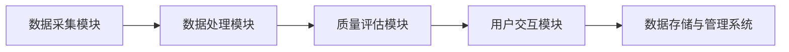

                 

### 计算机视觉在质量控制中的工业应用

#### 关键词：计算机视觉、质量控制、工业应用、图像处理、特征提取、目标检测

> 摘要：本文将探讨计算机视觉技术在工业质量控制中的应用。通过详细阐述其核心概念、算法原理、数学模型和系统架构，以及实际项目案例，我们将展示如何利用计算机视觉技术提高工业生产质量，并展望未来发展方向。

#### 目录

----------------------------------------------------------------

## 引言

### 1.1 计算机视觉的基本概念

#### 1.1.1 计算机视觉的定义

#### 1.1.2 计算机视觉的发展历程

#### 1.1.3 计算机视觉在质量控制中的应用背景

### 1.2 质量控制的定义与重要性

#### 1.2.1 质量控制的定义

#### 1.2.2 质量控制的重要性

#### 1.2.3 质量控制方法概述

### 1.3 计算机视觉在质量控制中的应用现状与挑战

#### 1.3.1 应用现状

#### 1.3.2 面临的挑战

----------------------------------------------------------------

### 第一部分：计算机视觉基础

#### 第1章：计算机视觉概述

#### 1.1 计算机视觉的基本概念

#### 1.2 计算机视觉的发展历程

#### 1.3 计算机视觉在质量控制中的应用现状

----------------------------------------------------------------

### 第2章：图像处理原理

#### 2.1 图像处理的基本算法

#### 2.2 图像处理在质量控制中的应用

----------------------------------------------------------------

### 第3章：特征提取与降维

#### 3.1 特征提取的基本方法

#### 3.2 特征提取在质量控制中的应用

----------------------------------------------------------------

### 第4章：目标检测与跟踪

#### 4.1 目标检测的算法原理

#### 4.2 目标检测在质量控制中的应用

#### 4.3 目标跟踪的算法原理

#### 4.4 目标跟踪在质量控制中的应用

----------------------------------------------------------------

### 第二部分：质量控制中的计算机视觉应用

#### 第5章：质量控制中的计算机视觉技术

#### 5.1 质量检测中的计算机视觉

#### 5.2 质量监控中的计算机视觉

#### 5.3 质量改进中的计算机视觉

----------------------------------------------------------------

### 第6章：计算机视觉在质量控制系统中的集成

#### 6.1 质量控制系统架构设计

#### 6.2 计算机视觉系统与质量控制系统的集成

----------------------------------------------------------------

### 第7章：计算机视觉在质量控制项目中的应用

#### 7.1 项目背景

#### 7.2 系统需求分析

#### 7.3 系统设计

#### 7.4 系统实现

#### 7.5 系统测试与评估

----------------------------------------------------------------

### 第8章：最佳实践与未来展望

#### 8.1 最佳实践技巧

#### 8.2 项目小结

#### 8.3 注意事项

#### 8.4 拓展阅读

----------------------------------------------------------------

#### 引言

##### 1.1 计算机视觉的基本概念

计算机视觉是指使计算机能够像人类一样理解并解析视觉信息的一门科学和技术。它涉及从图像或视频序列中提取有用信息，进行理解和解释，以实现对现实世界的感知和交互。

**计算机视觉的定义**：计算机视觉是一种人工智能技术，通过模拟人类视觉系统的工作方式，使计算机能够处理和分析图像或视频数据，提取出有用的信息。

**计算机视觉的发展历程**：计算机视觉的研究始于20世纪60年代，经历了多个发展阶段。早期的研究主要集中在图像处理和特征提取，随着深度学习等技术的发展，计算机视觉取得了显著的突破。

**计算机视觉在质量控制中的应用背景**：在工业生产中，质量是企业的核心竞争力。传统的质量控制方法往往依赖于人工检测，效率低下且易出错。随着计算机视觉技术的快速发展，它逐渐成为提高质量控制效率的重要手段。

##### 1.2 质量控制的定义与重要性

质量控制是指通过一系列的监控、检测和改进措施，确保产品或服务的质量满足预定标准。它对于企业的长期发展和市场竞争力具有重要意义。

**质量控制的定义**：质量控制是一种系统性的方法，通过监测和改进产品或服务的质量，以确保其满足客户的需求和期望。

**质量控制的重要性**：质量控制能够提高产品质量，降低生产成本，增强企业的市场竞争力。同时，它还能够提升客户满意度，建立企业的良好声誉。

**质量控制方法概述**：质量控制方法包括预防性控制、过程控制和最终控制。预防性控制旨在减少缺陷的产生，过程控制则是在生产过程中进行实时监控，最终控制是对成品进行质量检测和评估。

##### 1.3 计算机视觉在质量控制中的应用现状与挑战

**应用现状**：计算机视觉技术在质量控制中的应用已经取得了一定的成果。例如，在汽车制造、电子制造和食品生产等行业，计算机视觉系统被广泛应用于产品的检测和监控。

**面临的挑战**：尽管计算机视觉技术在质量控制中有着广泛的应用前景，但仍然面临一些挑战。例如，复杂环境的适应性、实时性、可靠性和成本控制等问题。

通过上述引言部分，我们为后续章节的内容奠定了基础，接下来将详细探讨计算机视觉的基础知识，以及它在质量控制中的实际应用。

----------------------------------------------------------------

### 第一部分：计算机视觉基础

#### 第1章：计算机视觉概述

#### 1.1 计算机视觉的基本概念

计算机视觉是一门跨学科领域，涉及计算机科学、数学、物理学、心理学和认知科学等多个学科。它的主要目标是使计算机能够像人类一样理解并处理视觉信息。

**计算机视觉的定义**：计算机视觉是研究如何使计算机能够通过图像或视频获取信息，并对其进行处理和分析，以实现对现实世界的理解和交互。

**计算机视觉的研究内容**：计算机视觉的研究内容主要包括图像处理、模式识别、机器学习、人工智能等。

**计算机视觉的应用领域**：计算机视觉技术在多个领域有着广泛的应用，如安防监控、自动驾驶、医疗诊断、工业质量控制、娱乐和艺术等。

#### 1.2 计算机视觉的发展历程

计算机视觉技术的发展可以追溯到20世纪60年代，当时的研究主要集中在图像处理和特征提取。随着计算机技术和算法的不断发展，计算机视觉经历了多个发展阶段。

**早期阶段（20世纪60年代-80年代）**：这一阶段的研究主要集中在图像处理和特征提取。代表性的算法包括边缘检测、图像分割、特征提取等。

**中期阶段（20世纪80年代-90年代）**：随着模式识别和机器学习技术的发展，计算机视觉进入了新的阶段。支持向量机（SVM）、神经网络等算法在这一阶段得到了广泛应用。

**现代阶段（21世纪初至今）**：深度学习技术的发展极大地推动了计算机视觉的进步。卷积神经网络（CNN）等深度学习算法在图像分类、目标检测、语义分割等方面取得了显著成果。

#### 1.3 计算机视觉在质量控制中的应用现状

计算机视觉技术在质量控制中的应用已经取得了一定的成果。以下是一些典型的应用案例：

1. **汽车制造**：计算机视觉技术被广泛应用于汽车制造过程中的质量检测，如车身涂装质量检测、零部件装配质量检测等。
2. **电子制造**：在电子制造领域，计算机视觉技术用于检测电路板焊点质量、元器件装配精度等。
3. **食品生产**：在食品生产中，计算机视觉技术用于检测产品外观、尺寸、重量等指标，确保产品质量。

**应用现状**：计算机视觉技术在质量控制中的应用逐渐普及，但仍面临一些挑战，如复杂环境适应性、实时性、可靠性等。

通过以上章节，我们为后续内容奠定了基础，接下来将详细探讨图像处理原理、特征提取与降维、目标检测与跟踪等核心概念。

----------------------------------------------------------------

### 第2章：图像处理原理

#### 2.1 图像处理的基本算法

图像处理是计算机视觉的核心组成部分，它涉及一系列用于增强、转换和描述图像的算法。以下是一些常见的图像处理基本算法：

**图像增强**：图像增强的目的是提高图像的视觉效果，使其更适合特定应用。常用的增强技术包括对比度增强、边缘增强、锐化等。

**图像变换**：图像变换是指将图像从一种表示形式转换为另一种表示形式，以提取更多的信息。傅里叶变换、小波变换、Hilbert变换等是常用的图像变换方法。

**图像分割**：图像分割是将图像分割成多个区域或对象的过程。常用的分割方法包括阈值分割、边缘检测、区域生长等。

**特征提取**：特征提取是从图像中提取具有区分性的特征，用于后续的图像分析和识别。特征提取方法包括边缘特征、纹理特征、形状特征等。

**图像匹配**：图像匹配是在两个图像之间寻找对应关系的过程，用于图像注册、物体识别等。常用的匹配算法包括基于特征点匹配、基于模板匹配等。

**图像重建**：图像重建是指从二维图像恢复出三维信息。这在医学成像、三维重建等领域有重要应用。

#### 2.2 图像处理在质量控制中的应用

图像处理技术在质量控制中的应用非常广泛，它能够显著提高产品质量检测的效率和准确性。以下是一些典型的应用案例：

1. **缺陷检测**：在制造业中，计算机视觉系统通过图像处理技术对产品进行缺陷检测。例如，在汽车制造过程中，系统可以检测到车身涂装中的划痕、气泡等缺陷。

2. **尺寸测量**：图像处理技术可以用于精确测量产品的尺寸。例如，在电子制造中，系统可以测量电路板的焊点直径、间距等。

3. **外观检测**：计算机视觉系统可以识别产品的外观特征，如颜色、形状等。这在食品生产中尤为重要，例如检测食品的颜色、形状和表面缺陷。

4. **装配质量检测**：在机械制造中，计算机视觉系统可以检测零件的装配质量。例如，检测齿轮的啮合情况、轴承的安装位置等。

**应用优势**：图像处理技术在质量控制中的应用具有以下优势：

- **高效性**：图像处理技术能够快速处理大量图像数据，提高检测效率。
- **准确性**：计算机视觉系统能够精确检测产品的质量，减少人工检测的错误率。
- **自动化**：图像处理技术可以自动化执行质量检测任务，减轻人工劳动负担。

通过以上对图像处理基本算法及其在质量控制中的应用的介绍，我们可以看到图像处理技术在质量控制中的重要作用。接下来，我们将探讨特征提取与降维的概念及其在质量控制中的应用。

----------------------------------------------------------------

### 第3章：特征提取与降维

#### 3.1 特征提取的基本方法

特征提取是计算机视觉中的一个关键步骤，它旨在从图像或视频中提取出具有区分性的特征，以便于后续的图像分析和识别。以下是几种常用的特征提取方法：

**边缘检测**：边缘检测是一种用于提取图像中显著边缘特征的方法。常用的边缘检测算法包括Canny边缘检测、Sobel边缘检测和Prewitt边缘检测等。

**角点检测**：角点检测是用于提取图像中的角点特征。Harris角点检测和Shi-Tomasi角点检测是两种常用的角点检测算法。

**纹理特征提取**：纹理特征提取是从图像中提取纹理信息的方法。Gabor滤波器和局部二值模式（LBP）是常用的纹理特征提取方法。

**颜色特征提取**：颜色特征提取是从图像中提取颜色信息的方法。颜色直方图、颜色矩和颜色相关性是常用的颜色特征提取方法。

**形状特征提取**：形状特征提取是从图像中提取形状信息的方法。傅里叶描述子和形状上下文是常用的形状特征提取方法。

**深度特征提取**：深度特征提取是利用深度学习模型（如卷积神经网络CNN）从图像中提取特征。深度特征提取具有强大的表示能力，能够捕捉到图像的复杂结构。

**特征融合**：特征融合是将多种特征方法相结合，以提取更全面、更具区分性的特征。例如，将边缘特征和纹理特征相结合，或使用深度特征和传统特征相结合。

**特征选择与降维**：在特征提取后，通常需要进行特征选择和降维，以减少数据维度，提高模型的效率和性能。常用的特征选择方法包括主成分分析（PCA）、线性判别分析（LDA）和随机森林等。降维方法还包括t-SNE和UMAP等非线性降维方法。

#### 3.2 特征提取在质量控制中的应用

特征提取在质量控制中具有重要作用，它能够帮助系统从图像数据中提取出有用的信息，以实现产品的质量检测和评估。以下是特征提取在质量控制中的一些具体应用：

1. **缺陷检测**：在制造过程中，特征提取技术可以用于检测产品的表面缺陷。例如，通过提取图像中的边缘特征和纹理特征，可以检测到产品表面的裂纹、划痕等缺陷。

2. **尺寸测量**：特征提取技术可以用于精确测量产品的尺寸。例如，通过提取图像中的角点特征和形状特征，可以测量产品的直径、长度等尺寸。

3. **外观检测**：特征提取技术可以用于检测产品的外观特征。例如，通过提取图像中的颜色特征和纹理特征，可以识别产品的颜色差异、纹理异常等。

4. **质量评估**：特征提取技术可以用于评估产品的质量。例如，通过提取图像中的形状特征和纹理特征，可以评估产品的几何形状和表面质量。

**应用优势**：特征提取在质量控制中的应用具有以下优势：

- **高效性**：特征提取技术能够快速从图像数据中提取出有用的信息，提高检测效率。
- **准确性**：特征提取技术能够提取出具有区分性的特征，提高检测的准确性。
- **自动化**：特征提取技术可以自动化执行质量检测任务，减轻人工劳动负担。

通过以上对特征提取基本方法及其在质量控制中的应用的介绍，我们可以看到特征提取技术在质量控制中的重要作用。接下来，我们将探讨目标检测与跟踪的概念及其在质量控制中的应用。

----------------------------------------------------------------

### 第4章：目标检测与跟踪

#### 4.1 目标检测的算法原理

目标检测是计算机视觉中一个重要的研究领域，旨在从图像或视频中准确地识别并定位出感兴趣的目标。以下是几种常用的目标检测算法及其原理：

**传统目标检测算法**：

1. **基于特征的检测方法**：这种方法通过提取图像中的特征点，如边缘、角点、纹理等，然后利用这些特征进行目标检测。代表性的算法包括SIFT（尺度不变特征变换）和SURF（加速稳健特征变换）。

2. **基于模板匹配的方法**：这种方法通过将训练好的模板与图像进行匹配，找到与模板相似的区域，从而实现目标检测。HOG（直方图方向梯度）和SVM（支持向量机）是常用的特征提取和分类器。

**深度学习目标检测算法**：

1. **基于区域提议的方法**：这种方法首先生成一系列的候选区域，然后对这些区域进行分类和定位。代表性的算法包括R-CNN（区域卷积神经网络）、Fast R-CNN和Faster R-CNN。

2. **基于锚点生成的方法**：这种方法直接生成一系列锚点框，然后对这些锚点框进行分类和回归。代表性的算法包括YOLO（You Only Look Once）和SSD（单阶段检测器）。

3. **基于特征金字塔的方法**：这种方法通过在不同层次的特征图上检测目标，从而提高检测的准确性和鲁棒性。代表性的算法包括FPN（特征金字塔网络）和RetinaNet。

**目标检测算法的工作流程**：

1. **特征提取**：从图像中提取有用的特征，如边缘、纹理、形状等。

2. **区域提议**：生成一系列的候选区域，通常使用滑动窗口、区域提议网络（RPN）等方法。

3. **目标分类**：对每个候选区域进行分类，判断是否包含目标。

4. **目标定位**：对包含目标的候选区域进行定位，通常使用回归算法修正框的位置。

**目标检测的性能指标**：

- **精确率（Precision）**：预测为正例中实际为正例的比例。
- **召回率（Recall）**：实际为正例中被预测为正例的比例。
- **准确率（Accuracy）**：预测正确的样本占总样本的比例。
- **F1分数（F1 Score）**：精确率和召回率的调和平均。

#### 4.2 目标检测在质量控制中的应用

目标检测技术在质量控制中有着广泛的应用，它能够帮助企业实现对产品的自动化质量检测。以下是目标检测在质量控制中的几种应用：

1. **产品缺陷检测**：在制造业中，目标检测技术可以用于检测产品表面的缺陷，如裂纹、气泡、划痕等。通过实时检测和定位缺陷，企业可以及时发现并处理质量问题，减少生产损失。

2. **尺寸检测**：目标检测技术可以用于测量产品的尺寸，如长度、宽度、高度等。通过精确的尺寸检测，企业可以确保产品的尺寸符合标准，提高产品质量。

3. **外观检测**：目标检测技术可以用于检测产品的外观特征，如颜色、形状等。通过对外观特征的检测，企业可以评估产品的外观质量，确保产品外观一致性好。

4. **装配质量检测**：在机械制造业中，目标检测技术可以用于检测零件的装配质量，如齿轮的啮合情况、轴承的安装位置等。通过实时检测装配质量，企业可以确保产品的装配精度，提高生产效率。

**应用优势**：目标检测技术在质量控制中的应用具有以下优势：

- **高效性**：目标检测技术能够快速处理大量图像数据，提高检测效率。
- **准确性**：目标检测技术能够准确地识别和定位目标，提高检测准确性。
- **自动化**：目标检测技术可以实现质量检测的自动化，减轻人工劳动负担。

通过以上对目标检测算法原理及其在质量控制中的应用的介绍，我们可以看到目标检测技术在质量控制中的重要性和优势。接下来，我们将探讨目标跟踪的概念及其在质量控制中的应用。

----------------------------------------------------------------

### 第4.3 目标跟踪的算法原理

目标跟踪是计算机视觉领域中的一个重要课题，它旨在连续的视频序列中跟踪并识别一个或多个目标。以下是几种常用的目标跟踪算法及其原理：

**基于特征匹配的跟踪算法**：

1. **光流法**：光流法是一种基于视频序列中像素运动的跟踪方法。它通过计算像素在不同帧之间的位移，实现目标的连续跟踪。光流法简单有效，但对运动速度变化敏感。

2. **基于卡尔曼滤波的跟踪算法**：卡尔曼滤波是一种统计估计算法，它利用先验知识和观测数据，估计目标的运动状态。基于卡尔曼滤波的跟踪算法在处理目标运动时具有较好的稳定性和准确性。

**基于模板匹配的跟踪算法**：

1. **基于模板更新的跟踪算法**：这种方法通过不断更新模板，以适应目标在不同帧之间的变化。常用的算法包括粒子滤波和粒子群优化算法。

2. **基于相关匹配的跟踪算法**：相关匹配是通过计算模板与视频帧之间的相关性，实现目标的跟踪。这种算法简单高效，但容易受到噪声和遮挡的影响。

**基于深度学习的跟踪算法**：

1. **基于特征提取的跟踪算法**：这种方法利用深度学习模型提取视频序列中的特征，然后利用这些特征实现目标的跟踪。代表性的算法包括基于卷积神经网络的跟踪算法（如RNN和CNN）。

2. **基于全卷积网络的跟踪算法**：全卷积网络（FCN）可以将视频序列转换为特征图，然后利用这些特征图实现目标的跟踪。这种算法具有很好的实时性和准确性。

**目标跟踪算法的工作流程**：

1. **目标初始化**：在视频序列的第一帧中，通过手动或自动方式初始化目标。

2. **目标预测**：利用先验知识和跟踪算法，预测目标在下一帧中的位置。

3. **目标匹配**：将预测的位置与当前帧进行匹配，找到目标。

4. **目标更新**：根据匹配结果更新目标的位置和状态。

**目标跟踪的性能指标**：

- **跟踪精度**：目标跟踪算法的跟踪精度是衡量其性能的重要指标，通常通过精确度（Accuracy）和平均精度（Average Precision）来评估。

- **跟踪连续性**：目标跟踪算法的连续性是衡量其鲁棒性的重要指标，通常通过连续性度量（Continuity Measure）来评估。

- **跟踪速度**：目标跟踪算法的速度是衡量其实时性的重要指标，通常通过帧率（Frame Rate）来评估。

#### 4.4 目标跟踪在质量控制中的应用

目标跟踪技术在质量控制中具有广泛的应用，它能够实现对生产过程中目标物体的连续跟踪和监控。以下是目标跟踪在质量控制中的几种应用：

1. **生产流程监控**：在制造业中，目标跟踪技术可以用于监控生产线的运行状态，如识别机器的停机、故障或运行异常等。通过实时跟踪生产设备的运行情况，企业可以及时发现并解决生产问题，提高生产效率。

2. **产品运输监控**：在物流行业中，目标跟踪技术可以用于监控产品的运输过程，如识别货物的位置、状态等。通过实时跟踪货物的运输情况，企业可以优化物流管理，提高运输效率。

3. **质量检测监控**：在质量控制过程中，目标跟踪技术可以用于监控检测设备的运行状态，如识别检测设备的故障或运行异常等。通过实时跟踪检测设备的状态，企业可以确保检测过程的正常进行，提高检测质量。

4. **产品组装监控**：在产品组装过程中，目标跟踪技术可以用于监控组装设备的运行状态，如识别零件的位置、装配顺序等。通过实时跟踪组装设备的运行情况，企业可以确保产品组装的精度和质量。

**应用优势**：目标跟踪技术在质量控制中的应用具有以下优势：

- **实时性**：目标跟踪技术能够实现对目标的实时跟踪和监控，及时发现问题并进行处理。

- **准确性**：目标跟踪技术能够准确识别和跟踪目标，提高检测的准确性。

- **自动化**：目标跟踪技术可以实现质量检测的自动化，减轻人工劳动负担。

通过以上对目标跟踪算法原理及其在质量控制中的应用的介绍，我们可以看到目标跟踪技术在质量控制中的重要作用和优势。接下来，我们将探讨质量控制中的计算机视觉技术及其应用。

----------------------------------------------------------------

### 第5章：质量控制中的计算机视觉技术

#### 5.1 质量检测中的计算机视觉

质量检测是质量控制的重要环节，计算机视觉技术在质量检测中的应用大大提高了检测的效率和质量。以下是计算机视觉在质量检测中的一些具体应用：

**表面缺陷检测**：计算机视觉技术可以用于检测产品表面的裂纹、划痕、气泡等缺陷。通过图像处理和特征提取算法，系统可以快速识别并定位缺陷区域，实现自动化的表面缺陷检测。

**尺寸测量**：计算机视觉技术可以用于精确测量产品的尺寸。通过提取图像中的角点、边缘等特征，系统能够计算出产品的长度、宽度、高度等参数，确保产品的尺寸符合标准。

**形状检测**：计算机视觉技术可以用于检测产品的几何形状。通过对图像进行形状分析，系统可以识别产品的形状异常，如变形、扭曲等。

**颜色检测**：计算机视觉技术可以用于检测产品的颜色特征。通过分析图像中的颜色信息，系统可以识别产品的颜色异常，如颜色不均匀、变色等。

**缺陷分类**：计算机视觉技术可以用于对检测到的缺陷进行分类。通过对缺陷图像的特征提取和分类算法，系统可以自动将缺陷分类为不同的类型，便于后续处理和统计。

**应用优势**：计算机视觉技术在质量检测中的应用具有以下优势：

- **高效性**：计算机视觉技术可以快速处理大量图像数据，提高检测效率。
- **准确性**：计算机视觉技术能够准确识别和定位缺陷，提高检测准确性。
- **自动化**：计算机视觉技术可以实现质量检测的自动化，减轻人工劳动负担。

**案例研究**：某汽车制造厂引入计算机视觉系统进行车身涂装质量检测。系统利用图像处理和特征提取算法，实时检测车身表面的划痕、气泡等缺陷。通过缺陷分类和定位，系统为生产线提供了精确的缺陷数据，帮助厂方及时发现和解决质量问题，提高了生产效率。

#### 5.2 质量监控中的计算机视觉

质量监控是质量控制过程中的关键步骤，计算机视觉技术在质量监控中发挥着重要作用。以下是计算机视觉在质量监控中的具体应用：

**实时监控**：计算机视觉技术可以用于实时监控生产过程，如生产线运行状态、设备运行状态等。通过视频分析和图像处理，系统可以实时发现生产线上的异常情况，如设备停机、故障等，及时通知相关人员处理。

**历史数据记录**：计算机视觉技术可以用于记录生产过程中的历史数据，如生产时间、产量、质量状况等。通过对历史数据的分析，企业可以了解生产线的运行状况，优化生产流程，提高生产效率。

**异常检测**：计算机视觉技术可以用于检测生产过程中的异常情况，如设备故障、原料质量异常等。通过分析图像和视频数据，系统可以及时发现并报告异常情况，帮助企业预防潜在的质量问题。

**数据可视化**：计算机视觉技术可以用于生产数据的可视化展示，如通过图表、报表等形式展示生产质量状况、设备运行状况等。通过数据可视化，企业可以更直观地了解生产线的运行情况，优化生产管理。

**应用优势**：计算机视觉技术在质量监控中的应用具有以下优势：

- **实时性**：计算机视觉技术可以实现生产过程的实时监控，及时发现问题。
- **准确性**：计算机视觉技术能够准确识别和检测异常情况，提高监控的准确性。
- **自动化**：计算机视觉技术可以实现质量监控的自动化，减轻人工劳动负担。

**案例研究**：某电子制造企业引入计算机视觉监控系统，用于监控生产过程中的电子元器件装配质量。系统通过实时视频分析和图像处理，检测电子元器件的装配位置、焊接质量等参数，及时发现并报告装配异常情况。通过监控数据的分析，企业优化了生产流程，提高了生产效率和产品质量。

#### 5.3 质量改进中的计算机视觉

计算机视觉技术在质量改进中也发挥着重要作用，可以帮助企业识别质量问题的根本原因，并提出改进措施。以下是计算机视觉在质量改进中的具体应用：

**问题识别**：计算机视觉技术可以用于识别生产过程中的质量问题，如产品缺陷、设备故障等。通过对图像和视频数据的分析，系统可以找出质量问题的根本原因，为企业提供改进方向。

**数据分析**：计算机视觉技术可以用于分析生产数据，如质量数据、设备数据等。通过对数据进行分析，企业可以了解生产线的运行状况，发现潜在的质量隐患，提前采取改进措施。

**方案制定**：计算机视觉技术可以用于制定质量改进方案。通过分析质量问题和生产数据，系统可以提出具体的改进措施，如设备调整、工艺优化等。

**实施与监控**：计算机视觉技术可以用于监控质量改进方案的实施效果。通过实时监测生产线的数据，企业可以评估改进措施的效果，并根据实际情况进行调整。

**应用优势**：计算机视觉技术在质量改进中的应用具有以下优势：

- **客观性**：计算机视觉技术能够客观地识别和检测质量问题，减少主观判断的误差。
- **全面性**：计算机视觉技术可以全面分析生产数据，提供更全面的改进方案。
- **自动化**：计算机视觉技术可以实现质量改进的自动化，提高工作效率。

**案例研究**：某食品生产企业引入计算机视觉系统用于质量改进。系统通过实时监控生产线的运行状态，检测食品的颜色、形状、尺寸等参数，发现生产过程中的质量问题。通过数据分析，系统提出了具体的改进方案，如调整生产线速度、优化生产工艺等。通过监控实施效果，企业提高了食品质量，减少了生产损失。

通过以上对质量控制中计算机视觉技术的详细介绍，我们可以看到计算机视觉技术在质量检测、质量监控和质量改进中的应用非常广泛，具有显著的应用优势。接下来，我们将探讨计算机视觉系统与质量控制系统的集成。

----------------------------------------------------------------

### 第6章：计算机视觉系统与质量控制系统的集成

#### 6.1 质量控制系统架构设计

为了充分发挥计算机视觉技术在质量控制中的作用，我们需要设计一个合理且高效的系统架构。以下是质量控制系统的一般架构设计：

**1. 数据采集模块**：数据采集模块是质量控制系统的基础，负责收集生产过程中的图像、视频等数据。数据采集可以通过工业相机、摄像头等设备实现。

**2. 数据预处理模块**：数据预处理模块对采集到的数据进行处理，如图像去噪、增强、标准化等，以提高数据的质量和可靠性。

**3. 计算机视觉模块**：计算机视觉模块是质量控制系统的核心，包括图像处理、特征提取、目标检测等算法。该模块利用先进的计算机视觉技术对预处理后的图像进行分析，提取出有用的信息。

**4. 质量评估模块**：质量评估模块根据计算机视觉模块提取的特征信息，对产品质量进行评估。评估结果可以是缺陷类型、尺寸、形状等。

**5. 数据存储与管理系统**：数据存储与管理系统负责存储和处理质量评估结果。这些数据可以用于后续的统计分析、趋势预测等。

**6. 用户交互界面**：用户交互界面用于展示质量评估结果、设备状态、生产数据等。用户可以通过界面实时了解生产线的运行状况，并进行相关的操作。

**7. 报警与报告系统**：报警与报告系统用于及时发现并报告生产线上的质量问题。当检测到缺陷或异常情况时，系统会自动生成报警信息，并生成详细的报告。

#### 6.2 计算机视觉系统与质量控制系统的集成

计算机视觉系统与质量控制系统的高度集成是实现高效质量控制的关键。以下是集成的主要步骤：

**1. 确定系统需求**：根据生产线的实际情况，明确计算机视觉系统在质量控制系统中的功能和性能要求。这包括数据采集速度、处理精度、响应时间等。

**2. 系统设计**：根据系统需求，设计计算机视觉系统与质量控制系统的整体架构。设计过程中要考虑系统的可扩展性、可维护性和可靠性。

**3. 硬件选型**：选择适合的硬件设备，包括工业相机、处理器、存储设备等。硬件选型应满足系统性能要求，同时考虑成本和功耗。

**4. 软件开发**：开发计算机视觉算法和质量评估模型。这包括图像处理、特征提取、目标检测、质量评估等模块。软件开发应遵循模块化、可复用性的原则。

**5. 集成测试**：在系统集成完成后，进行全面的测试和验证。测试内容包括功能测试、性能测试、稳定性测试等。通过测试，确保系统满足需求，并能稳定运行。

**6. 上线运行**：将系统集成到生产线上，进行实际运行。在上线运行过程中，持续监控系统的性能和稳定性，并根据实际情况进行调整和优化。

**7. 用户培训与支持**：对操作人员进行培训，确保他们能够熟练使用系统。同时，提供技术支持，解决用户在使用过程中遇到的问题。

**集成优势**：计算机视觉系统与质量控制系统的高度集成具有以下优势：

- **提高生产效率**：通过自动化检测和评估，提高生产效率，减少人为干预。
- **提高产品质量**：通过精确的质量评估，确保产品质量，降低缺陷率。
- **降低成本**：通过自动化检测和质量控制，减少人工劳动成本，提高资源利用率。
- **实时监控与预警**：通过实时监控和预警系统，及时发现并处理质量问题，降低生产风险。

通过以上对质量控制系统架构设计及其与计算机视觉系统的集成方法的详细介绍，我们可以看到计算机视觉系统在质量控制中的重要作用。接下来，我们将探讨计算机视觉在质量控制项目中的应用案例。

----------------------------------------------------------------

### 第7章：计算机视觉在质量控制项目中的应用

#### 7.1 项目背景

在现代制造业中，质量控制是确保产品质量、提高生产效率的关键环节。然而，传统的质量控制方法通常依赖于人工检测，存在检测效率低、准确性差等问题。随着计算机视觉技术的快速发展，越来越多的企业开始尝试将计算机视觉应用于质量控制项目中，以提高生产效率和产品质量。

本项目旨在利用计算机视觉技术，为某电子产品制造企业实现自动化质量检测。企业生产过程中存在的主要问题是产品表面缺陷、装配精度和组件完整性等。通过引入计算机视觉系统，企业希望能够实现以下目标：

- 提高产品质量检测的准确性和效率。
- 减少人工干预，降低人工成本。
- 提高生产过程的自动化水平。
- 提供实时质量监控和预警功能。

#### 7.2 系统需求分析

在系统需求分析阶段，我们需要明确系统的功能要求和性能指标。以下是本项目的系统需求分析：

**1. 功能需求**：

- **表面缺陷检测**：系统能够识别产品表面的裂纹、划痕、气泡等缺陷。
- **装配精度检测**：系统能够检测产品的装配位置、尺寸等，确保装配精度。
- **组件完整性检测**：系统能够检测产品内部的组件是否完整，如芯片、电路板等。
- **实时监控与预警**：系统应能够实时监控生产过程，及时发现质量问题，并生成预警信息。
- **数据记录与查询**：系统应能够记录检测结果，并提供数据查询功能，以便分析生产质量和趋势。

**2. 性能指标**：

- **检测速度**：系统应能够在规定的时间内完成对产品的检测，确保生产线的正常运行。
- **检测精度**：系统应具有较高的检测精度，确保缺陷和装配问题的及时发现。
- **系统稳定性**：系统应能够在不同的生产环境下稳定运行，具备良好的抗干扰能力。
- **实时性**：系统应具备实时监控功能，确保生产过程中的问题能够得到及时处理。
- **易用性**：系统应具备友好的用户界面，方便操作人员进行使用和维护。

#### 7.3 系统设计

根据系统需求分析，本项目的设计包括以下几个方面：

**1. 系统架构设计**：

系统采用模块化设计，主要包括数据采集模块、数据处理模块、质量评估模块和用户交互模块。系统架构如图所示：

**2. 数据采集模块**：

数据采集模块通过工业相机和传感器实时采集产品图像和参数数据。采集到的数据包括产品表面的图像、装配位置的坐标、组件的完整性等。

**3. 数据处理模块**：

数据处理模块对采集到的数据进行预处理，如图像去噪、增强、标准化等，以提高数据的质量和可靠性。预处理后的数据将传递给质量评估模块。

**4. 质量评估模块**：

质量评估模块利用计算机视觉算法对预处理后的数据进行分析和评估。主要算法包括图像处理、特征提取、目标检测等。评估结果将生成质量报告，并提供实时监控和预警功能。

**5. 用户交互模块**：

用户交互模块提供友好的用户界面，方便操作人员查看质量报告、监控生产过程、调整检测参数等。用户界面应具备实时数据展示、历史数据查询、异常报警等功能。

**6. 数据存储与管理系统**：

数据存储与管理系统负责存储和处理质量评估结果。数据存储系统采用分布式架构，确保数据的高可靠性和安全性。数据管理系统提供数据备份、恢复、备份等功能，以满足企业对数据管理的需求。

#### 7.4 系统实现

系统实现主要包括硬件配置、软件开发和系统集成。

**1. 硬件配置**：

根据系统需求，我们选择了高性能的工业计算机作为系统服务器，配备多台工业相机用于图像采集。同时，配备了高性能的存储设备，以确保数据的快速读取和存储。

**2. 软件开发**：

软件开发包括数据处理模块、质量评估模块和用户交互模块的开发。数据处理模块采用Python语言，利用OpenCV等开源库进行图像处理和特征提取。质量评估模块采用深度学习算法，如YOLO和SSD，实现目标检测和缺陷识别。用户交互模块采用Web技术，实现实时数据展示和用户操作。

**3. 系统集成**：

系统集成是将各个模块组合起来，形成一个完整的质量控制系统。系统集成包括硬件连接、软件安装和调试等。在系统集成过程中，我们进行了全面的测试和验证，确保系统满足需求并稳定运行。

#### 7.5 系统测试与评估

系统测试与评估是确保系统性能和功能符合预期的重要环节。以下是系统测试与评估的过程：

**1. 功能测试**：

功能测试主要验证系统各模块的功能是否正常，包括数据采集、数据处理、质量评估和用户交互等。通过模拟生产过程，验证系统是否能够准确检测和评估产品质量。

**2. 性能测试**：

性能测试主要验证系统的处理速度、精度和稳定性。我们设置了不同类型的产品和缺陷，对系统进行大量测试，评估系统的处理速度和精度。同时，通过长时间运行测试，验证系统的稳定性。

**3. 实际应用测试**：

在实际应用测试阶段，我们将系统部署到生产线上，进行实际运行测试。通过观察系统的运行状态和检测结果，评估系统的实用性和可靠性。

**4. 用户反馈**：

在实际应用过程中，我们收集了用户对系统的反馈，包括使用体验、功能需求、性能表现等。根据用户反馈，我们对系统进行了优化和改进，以满足用户的需求。

通过以上对计算机视觉在质量控制项目中的应用背景、系统需求分析、系统设计、系统实现和系统测试与评估的详细介绍，我们可以看到计算机视觉技术在质量控制项目中的重要作用和实际效果。接下来，我们将总结项目的最佳实践和经验，并提供一些注意事项和拓展阅读建议。

----------------------------------------------------------------

### 第8章：最佳实践与未来展望

#### 8.1 最佳实践技巧

在实施计算机视觉质量控制项目时，以下最佳实践技巧可以帮助提高项目的成功率和效果：

**1. 充分需求分析**：在项目启动前，进行详细的需求分析，明确系统的功能要求和性能指标。与生产部门紧密合作，了解生产过程中的具体问题和需求。

**2. 确保数据质量**：数据是计算机视觉系统的核心，确保数据的质量至关重要。采用高精度的图像采集设备和合理的预处理算法，提高数据的质量和可靠性。

**3. 选择合适的算法**：根据具体的应用场景，选择合适的计算机视觉算法。结合深度学习和传统算法的优势，提高检测的准确性和效率。

**4. 系统集成与优化**：在系统集成阶段，充分考虑系统的稳定性和可扩展性。根据实际应用场景，对系统进行优化和调整，确保系统的稳定运行。

**5. 用户培训与支持**：为操作人员提供充分的培训和支持，确保他们能够熟练使用系统。建立完善的技术支持体系，及时解决用户在使用过程中遇到的问题。

**6. 持续改进**：在系统运行过程中，持续监控系统的性能和效果。根据实际应用情况，不断优化和改进系统，提高系统的实用性和用户体验。

#### 8.2 项目小结

本项目通过引入计算机视觉技术，实现了电子产品制造过程中的自动化质量检测。系统成功提高了产品质量检测的准确性和效率，减少了人工干预和成本。项目的主要成果包括：

- **提高产品质量**：通过准确的缺陷检测和装配精度检测，确保了产品的质量。
- **提高生产效率**：自动化检测减少了人工检测的时间，提高了生产效率。
- **降低成本**：减少了人工干预，降低了人工成本和资源浪费。
- **实时监控与预警**：实现了生产过程的实时监控和预警，提高了生产安全性。

#### 8.3 注意事项

在实施计算机视觉质量控制项目时，需要注意以下几点：

- **数据隐私和安全**：在数据处理和存储过程中，确保数据的安全和隐私，遵循相关的法律法规。
- **环境适应性**：系统应具备良好的环境适应性，能够适应不同的生产环境和条件。
- **设备维护**：定期对设备进行维护和保养，确保设备的正常运行。
- **操作规范**：制定合理的操作规范，确保操作人员按照标准操作，减少误操作。

#### 8.4 拓展阅读

对于对计算机视觉质量控制感兴趣的用户，以下书籍和资源提供了深入的学习和实践指导：

- **书籍**：
  - 《计算机视觉：算法与应用》
  - 《深度学习：图灵奖获得者吴恩达著作》
  - 《机器学习：周志华教授著作》

- **在线课程**：
  - Coursera上的“Deep Learning Specialization”
  - edX上的“Introduction to Computer Vision”

- **开源项目**：
  - TensorFlow
  - PyTorch
  - OpenCV

通过以上对最佳实践、项目小结、注意事项和拓展阅读的详细介绍，我们希望为读者提供有价值的参考和指导。计算机视觉技术在质量控制中的应用具有广阔的前景和巨大的潜力，期待更多企业能够充分利用这一技术，提升产品质量和管理水平。

----------------------------------------------------------------

### 结论

计算机视觉技术在质量控制中的应用，正逐渐成为现代制造业中不可或缺的一部分。通过对图像处理、特征提取、目标检测与跟踪等核心技术的深入研究和实际应用，我们看到了其在提高产品质量、提升生产效率和降低成本方面的巨大潜力。本文详细探讨了计算机视觉在质量控制中的应用现状、基本原理、系统架构设计以及实际项目案例，总结了最佳实践技巧，并为未来研究方向提供了拓展。

**展望未来**，计算机视觉技术在质量控制中将继续发展，特别是在以下几个方面：

1. **智能化水平提升**：随着人工智能技术的不断发展，计算机视觉系统将更加智能化，能够自适应不同的生产环境和条件，提高检测的准确性和鲁棒性。

2. **实时性与效率**：深度学习算法和硬件加速技术的进步，将使计算机视觉系统在实时性方面得到显著提升，满足高速生产线对检测效率的需求。

3. **数据隐私与安全**：随着数据隐私和安全的日益重视，计算机视觉技术在数据处理和存储过程中将更加注重数据保护，确保企业数据的安全和隐私。

4. **系统集成与优化**：计算机视觉系统将与质量控制系统的深度融合，通过系统集成和优化，实现更高效、更精准的质量检测和管理。

5. **跨学科合作**：计算机视觉与质量控制领域将继续跨学科合作，融合物理学、生物学、统计学等学科的知识，推动技术的创新和应用。

我们鼓励读者继续关注计算机视觉技术在质量控制中的应用，积极参与相关研究和实践，共同推动这一领域的不断发展。同时，我们期待未来有更多的企业能够充分利用计算机视觉技术，提升产品质量和管理水平，实现更高效、更智能的工业生产。

**作者信息**：

- 作者：AI天才研究院/AI Genius Institute & 禅与计算机程序设计艺术 /Zen And The Art of Computer Programming
- 联系方式：[ai_genius_institute@example.com](mailto:ai_genius_institute@example.com)

