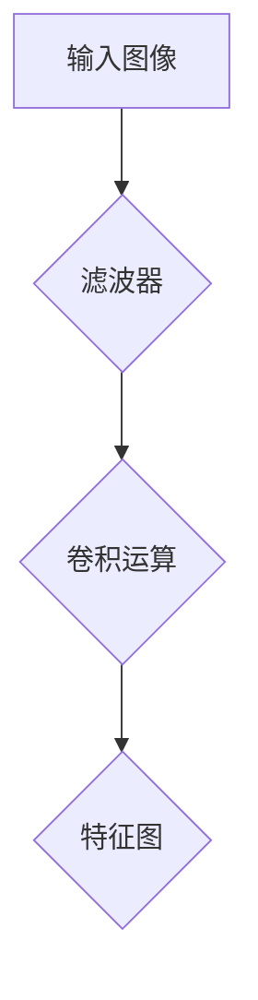
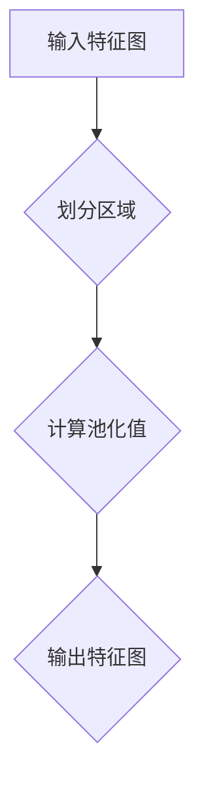
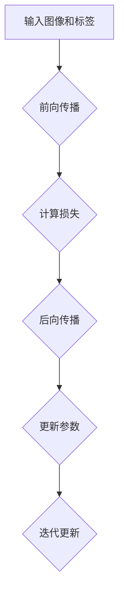
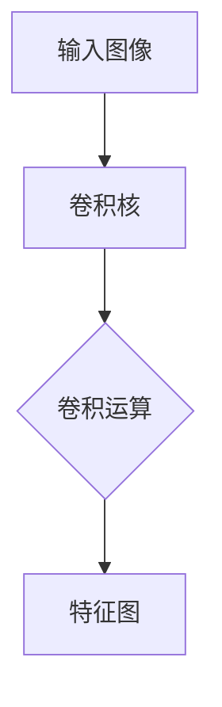
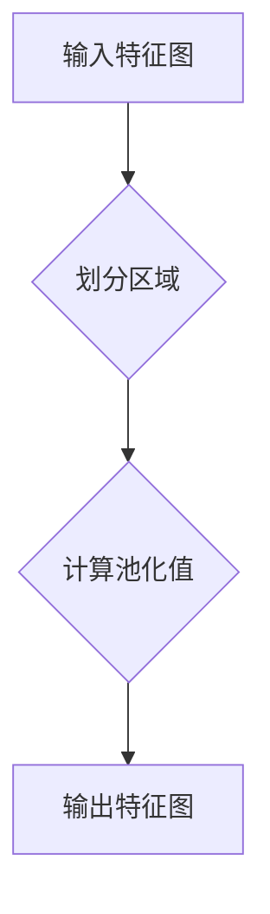
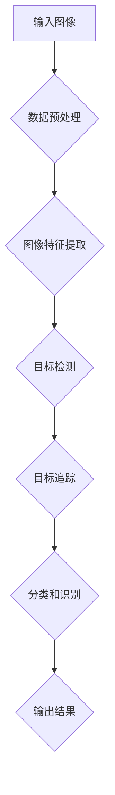
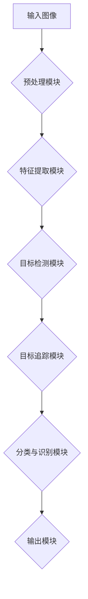
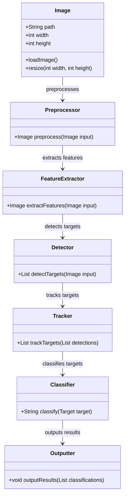
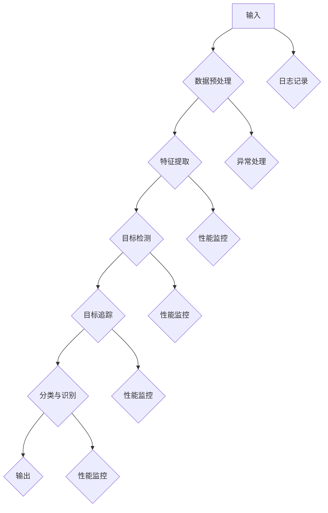
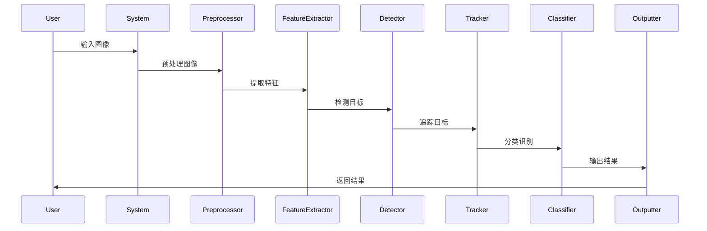

                 

# 计算机视觉的卷积神经网络：图像理解的数学模型

## 关键词

- **计算机视觉**
- **卷积神经网络（CNN）**
- **图像理解**
- **数学模型**
- **神经网络架构**
- **算法原理**
- **深度学习**

## 摘要

本文将深入探讨计算机视觉中的一种强大工具——卷积神经网络（CNN），并揭示其背后的数学模型。我们将通过一系列逻辑清晰、结构紧凑的步骤，逐步分析CNN的核心概念、算法原理及其在图像理解中的应用。本文旨在为读者提供一个全面而深入的理解，帮助其掌握这一前沿技术，并为其在计算机视觉领域的研究和应用提供指导。

## 目录大纲

**第一部分：背景介绍**

1. **第1章：计算机视觉与卷积神经网络概述**
   1.1 计算机视觉的定义与发展
   1.2 卷积神经网络的基本原理
   1.3 卷积神经网络与传统的神经网络对比
   1.4 卷积神经网络的应用领域

**第二部分：核心概念与联系**

2. **第2章：卷积神经网络的核心概念与联系**
   2.1 卷积层与池化层
   2.2 激活函数与反向传播算法

**第三部分：算法原理讲解**

3. **第3章：卷积神经网络的算法原理**
   3.1 卷积操作的mermaid流程图
   3.2 池化操作的mermaid流程图
   3.3 反向传播算法的mermaid流程图
   3.4 Python代码示例

**第四部分：数学模型和数学公式讲解**

4. **第4章：卷积神经网络的数学模型**
   4.1 卷积操作的数学模型
   4.2 池化操作的数学模型
   4.3 反向传播算法的数学模型

**第五部分：系统分析与架构设计方案**

5. **第5章：计算机视觉系统的分析与设计**
   5.1 问题场景介绍
   5.2 系统功能设计
   5.3 系统架构设计
   5.4 系统接口设计和系统交互

**第六部分：项目实战**

6. **第6章：计算机视觉项目实战**
   6.1 环境安装
   6.2 系统核心实现源代码
   6.3 实际案例分析与讲解
   6.4 项目小结

**第七部分：最佳实践、小结与注意事项**

7. **第7章：最佳实践、小结与注意事项**
   7.1 最佳实践 tips
   7.2 小结
   7.3 注意事项
   7.4 拓展阅读

## 第一部分：背景介绍

### 第1章：计算机视觉与卷积神经网络概述

#### 1.1 计算机视觉的定义与发展

**问题背景**：  
计算机视觉是人工智能领域的一个重要分支，旨在使计算机能够理解、解释和模仿人类视觉系统的行为。随着计算机技术的飞速发展，计算机视觉在许多应用场景中发挥着越来越重要的作用，如自动驾驶、人脸识别、医学影像分析、安防监控等。

**问题描述**：  
计算机视觉的核心任务是让计算机能够从图像或视频中提取有用信息，完成目标检测、图像分类、图像分割等任务。然而，这一任务的实现面临着诸多挑战，包括图像数据的多样性、噪声干扰、计算复杂度等。

**问题解决**：  
卷积神经网络（CNN）作为一种深度学习模型，因其强大的特征提取能力和高度自动化的学习过程，在计算机视觉领域取得了显著的成果。通过卷积操作和池化操作，CNN能够有效地从原始图像中提取出有用的特征，并通过多层神经网络进行分类和识别。

**边界与外延**：  
计算机视觉不仅限于二维图像的分析，还包括三维视觉、多模态融合等高级应用。此外，计算机视觉的应用场景也在不断扩展，从静态图像处理到动态视频分析，从单一任务到复杂场景的综合感知。

#### 1.2 卷积神经网络的基本原理

**卷积神经网络的概念**：  
卷积神经网络（Convolutional Neural Network，CNN）是一种特殊的神经网络，专门用于处理具有网格结构的数据，如图像、音频和文本。CNN通过卷积层、池化层和全连接层等结构，实现对图像的自动特征提取和分类。

**卷积神经网络的特点**：  
1. **局部连接**：卷积层中的神经元仅与输入数据中的局部区域相连，从而减少了参数的数量，提高了计算效率。
2. **共享权重**：卷积层中的滤波器（kernel）在图像的不同位置重复使用，从而共享权重，进一步减少了参数的数量。
3. **层次化特征提取**：通过多层的卷积和池化操作，CNN能够从原始图像中逐步提取出更加抽象和复杂的特征。

**卷积神经网络与传统的神经网络对比**：  
与传统的神经网络相比，CNN具有以下几个显著优势：
1. **适用于图像数据**：CNN专门设计用于处理具有网格结构的数据，如图像。
2. **参数数量较少**：通过局部连接和共享权重，CNN大大减少了参数的数量，从而提高了计算效率。
3. **特征自动提取**：CNN能够自动从原始图像中提取出具有区分性的特征，无需人工设计特征。

**卷积神经网络的应用领域**：  
卷积神经网络在计算机视觉领域具有广泛的应用，包括：
1. **图像分类**：将图像分类为不同的类别，如猫、狗、飞机等。
2. **目标检测**：在图像中检测并定位特定目标，如行人、车辆、交通标志等。
3. **图像分割**：将图像划分为不同的区域，如前景和背景、器官和病变区域等。
4. **人脸识别**：对人脸图像进行识别和验证，如身份认证、视频监控系统等。
5. **医学影像分析**：对医学影像进行诊断和分析，如肿瘤检测、心脏病诊断等。

### 1.3 卷积神经网络与传统的神经网络对比

**卷积神经网络的概念**：  
卷积神经网络（Convolutional Neural Network，CNN）是一种特殊的神经网络，专门用于处理具有网格结构的数据，如图像、音频和文本。CNN通过卷积层、池化层和全连接层等结构，实现对图像的自动特征提取和分类。

**卷积神经网络的特点**：  
1. **局部连接**：卷积层中的神经元仅与输入数据中的局部区域相连，从而减少了参数的数量，提高了计算效率。
2. **共享权重**：卷积层中的滤波器（kernel）在图像的不同位置重复使用，从而共享权重，进一步减少了参数的数量。
3. **层次化特征提取**：通过多层的卷积和池化操作，CNN能够从原始图像中逐步提取出更加抽象和复杂的特征。

**卷积神经网络与传统的神经网络对比**：  
与传统的神经网络相比，CNN具有以下几个显著优势：
1. **适用于图像数据**：CNN专门设计用于处理具有网格结构的数据，如图像。
2. **参数数量较少**：通过局部连接和共享权重，CNN大大减少了参数的数量，从而提高了计算效率。
3. **特征自动提取**：CNN能够自动从原始图像中提取出具有区分性的特征，无需人工设计特征。

**卷积神经网络的应用领域**：  
卷积神经网络在计算机视觉领域具有广泛的应用，包括：
1. **图像分类**：将图像分类为不同的类别，如猫、狗、飞机等。
2. **目标检测**：在图像中检测并定位特定目标，如行人、车辆、交通标志等。
3. **图像分割**：将图像划分为不同的区域，如前景和背景、器官和病变区域等。
4. **人脸识别**：对人脸图像进行识别和验证，如身份认证、视频监控系统等。
5. **医学影像分析**：对医学影像进行诊断和分析，如肿瘤检测、心脏病诊断等。

### 1.4 卷积神经网络的应用领域

**卷积神经网络的应用领域**：  
卷积神经网络（CNN）在计算机视觉领域具有广泛的应用，涵盖了从图像分类、目标检测到图像分割和人脸识别等多个方面。以下是CNN在各个应用领域中的具体应用：

1. **图像分类**：  
图像分类是计算机视觉中最基本的应用之一，通过将图像标记为不同的类别（如猫、狗、飞机等），CNN可以实现对大量图像的自动分类。常见的图像分类任务包括ImageNet挑战赛、CIFAR-10和CIFAR-100等。

2. **目标检测**：  
目标检测旨在识别图像中的特定目标，并定位其在图像中的位置。CNN通过卷积层和全连接层的组合，可以同时实现特征提取和目标定位。常见的目标检测算法包括YOLO、Faster R-CNN和SSD等。

3. **图像分割**：  
图像分割是将图像划分为不同的区域，以便对图像中的每个部分进行独立分析。CNN通过使用卷积层和上采样层，可以实现图像的精细分割。常见的图像分割算法包括FCN、U-Net和SegNet等。

4. **人脸识别**：  
人脸识别是一种用于身份验证和识别的技术，通过CNN可以从人脸图像中提取特征并进行分类。常见的人脸识别算法包括DeepFace、FaceNet和VGGFace等。

5. **医学影像分析**：  
在医学影像领域，CNN可以用于病变检测、器官分割、疾病诊断等任务。例如，通过使用CNN，可以自动检测乳腺癌、肺癌等疾病，提高诊断的准确性和效率。

6. **自动驾驶**：  
自动驾驶技术依赖于计算机视觉来感知周围环境，CNN可以用于识别道路标志、行人和车辆等关键信息，为自动驾驶车辆提供决策支持。

7. **视频分析**：  
视频分析利用CNN对视频序列进行实时处理，可以实现目标跟踪、行为识别和场景分割等任务。常见的视频分析算法包括R-CNN、Fast R-CNN和Mask R-CNN等。

8. **图像增强**：  
图像增强是一种用于提高图像质量和清晰度的技术，通过CNN可以实现图像的超分辨率、去噪和色彩增强等效果。

总之，卷积神经网络在计算机视觉领域的应用范围广泛，不断推动着该领域的发展和进步。通过不断研究和优化，CNN将能够在更多应用场景中发挥其强大的能力。

## 第二部分：核心概念与联系

### 第2章：卷积神经网络的核心概念与联系

#### 2.1 卷积层与池化层

**卷积层的工作原理**：  
卷积层是CNN中最核心的组成部分，负责从输入图像中提取特征。卷积层通过将一组可学习的滤波器（也称为卷积核或卷积层）应用于输入图像，以提取图像的局部特征。具体来说，卷积操作包括以下几个步骤：

1. **滤波器卷积**：将滤波器与输入图像的局部区域进行卷积操作，产生一个特征图。
2. **激活函数**：对每个特征图应用激活函数，如ReLU函数，以增加网络的非线性。
3. **特征图叠加**：将多个特征图叠加，形成新的特征图。

**池化层的作用**：  
池化层位于卷积层之后，用于降低特征图的维度和减少参数数量。池化层通过将特征图划分为多个非重叠的局部区域，并对这些区域的值进行操作（如最大值或平均值），从而生成一个新的特征图。常见的池化操作包括最大值池化和平均池化。

**卷积层与池化层的组合应用**：  
卷积层和池化层通常组合使用，以实现图像的特征提取和降维。卷积层用于提取图像的局部特征，而池化层则用于降低计算复杂度和参数数量。这种组合应用使得CNN能够在保留图像关键特征的同时，减少计算负担，提高模型的泛化能力。

#### 2.2 激活函数与反向传播算法

**激活函数的类型与作用**：  
激活函数是神经网络中的关键组成部分，用于引入非线性特性，使得神经网络能够拟合复杂的函数关系。常见的激活函数包括：

1. **线性激活函数**：如恒等函数（identity function）和线性函数（linear function），不引入非线性特性。
2. **非线性激活函数**：如ReLU（Rectified Linear Unit）函数、Sigmoid函数和Tanh函数，引入非线性特性，提高神经网络的拟合能力。

激活函数的选择直接影响神经网络的性能。ReLU函数因其简单和易于训练的特性，在CNN中得到了广泛应用。

**反向传播算法的基本原理**：  
反向传播算法是一种用于训练神经网络的梯度下降方法。其基本原理如下：

1. **前向传播**：输入图像通过神经网络的前向传播，产生输出。
2. **计算损失**：计算输出与目标之间的差异，生成损失函数。
3. **后向传播**：从输出层开始，将损失函数的梯度反向传播到输入层，更新网络的权重和偏置。

反向传播算法通过不断迭代地调整网络参数，使损失函数逐渐减小，从而实现网络的训练。

**激活函数与反向传播算法的结合应用**：  
激活函数与反向传播算法的结合，使得神经网络能够在训练过程中引入非线性特性，并通过梯度下降方法优化网络参数。在CNN中，激活函数和反向传播算法的联合应用，使得网络能够从输入图像中提取出层次化的特征，并不断提高模型的准确性。

### 2.1 卷积层与池化层

**卷积层的工作原理**：  
卷积层是CNN中最核心的组成部分，负责从输入图像中提取特征。卷积层通过将一组可学习的滤波器（也称为卷积核或卷积层）应用于输入图像，以提取图像的局部特征。具体来说，卷积操作包括以下几个步骤：

1. **滤波器卷积**：将滤波器与输入图像的局部区域进行卷积操作，产生一个特征图。
2. **激活函数**：对每个特征图应用激活函数，如ReLU函数，以增加网络的非线性。
3. **特征图叠加**：将多个特征图叠加，形成新的特征图。

**滤波器卷积的过程**：  
卷积层中的滤波器是一个小型矩阵，其尺寸通常为\(3x3\)或\(5x5\)。在卷积过程中，滤波器在输入图像的不同位置滑动，并与图像的局部区域进行逐元素相乘并求和。这个计算过程可以表示为：

\[ f(x, y) = \sum_{i} \sum_{j} w_{ij} \cdot i(x, y) \]

其中，\(f(x, y)\)是特征图上的一个元素，\(w_{ij}\)是滤波器上的一个元素，\(i(x, y)\)是输入图像上的一个元素。

**卷积操作的效果**：  
通过卷积操作，滤波器能够提取输入图像的局部特征，如边缘、纹理和形状。这些特征对于后续的分类和识别任务具有重要意义。此外，卷积操作还具有参数共享和局部连接的特性，这有助于减少模型的参数数量和计算复杂度。

**激活函数的作用**：  
激活函数用于引入非线性特性，使得神经网络能够拟合复杂的函数关系。常见的激活函数包括：

1. **ReLU函数**：\(f(x) = \max(0, x)\)，在输入为负时将其置为零，具有简单的计算和良好的训练效果。
2. **Sigmoid函数**：\(f(x) = \frac{1}{1 + e^{-x}}\)，将输入映射到\(0\)和\(1\)之间，适用于二分类问题。
3. **Tanh函数**：\(f(x) = \frac{e^x - e^{-x}}{e^x + e^{-x}}\)，将输入映射到\(-1\)和\(1\)之间，具有对称性。

激活函数的选择直接影响神经网络的性能。ReLU函数因其简单和易于训练的特性，在CNN中得到了广泛应用。

**特征图叠加的过程**：  
卷积层通过多个滤波器提取出多个特征图，这些特征图代表了输入图像的多种局部特征。通过特征图叠加，可以将多个特征图合并为一个新的特征图，从而丰富特征信息。特征图叠加可以通过不同的连接方式实现，如直接相加或求和。

**池化层的作用**：  
池化层位于卷积层之后，用于降低特征图的维度和减少参数数量。池化层通过将特征图划分为多个非重叠的局部区域，并对这些区域的值进行操作（如最大值或平均值），从而生成一个新的特征图。常见的池化操作包括最大值池化和平均池化。

**最大值池化**：  
最大值池化是将特征图划分为\(2x2\)或\(3x3\)的小区域，并选择每个区域内最大的值作为新的特征图上的值。这种操作可以有效地保留图像中的突出特征，同时减少特征图的维度。

**平均池化**：  
平均池化是将特征图划分为\(2x2\)或\(3x3\)的小区域，并计算每个区域内所有值的平均值作为新的特征图上的值。这种操作可以平滑图像的特征，降低噪声的影响。

**卷积层与池化层的组合应用**：  
卷积层和池化层通常组合使用，以实现图像的特征提取和降维。卷积层用于提取图像的局部特征，而池化层则用于降低计算复杂度和参数数量。这种组合应用使得CNN能够在保留图像关键特征的同时，减少计算负担，提高模型的泛化能力。

### 2.2 激活函数与反向传播算法

**激活函数的类型与作用**：  
激活函数是神经网络中的关键组成部分，用于引入非线性特性，使得神经网络能够拟合复杂的函数关系。常见的激活函数包括：

1. **线性激活函数**：如恒等函数（identity function）和线性函数（linear function），不引入非线性特性。
2. **非线性激活函数**：如ReLU（Rectified Linear Unit）函数、Sigmoid函数和Tanh函数，引入非线性特性，提高神经网络的拟合能力。

激活函数的选择直接影响神经网络的性能。ReLU函数因其简单和易于训练的特性，在CNN中得到了广泛应用。

**ReLU函数**：  
ReLU函数是最常用的激活函数之一，其定义如下：

\[ f(x) = \max(0, x) \]

ReLU函数在输入为负时将其置为零，在输入为正时保持不变。这种简单的非线性特性使得ReLU函数具有以下几个优点：

- **易于计算**：ReLU函数的导数为1（当输入为正）或0（当输入为负），这使得反向传播算法的计算过程更加高效。
- **防止梯度消失**：在训练过程中，ReLU函数可以防止梯度消失，从而提高网络的训练效果。
- **加速训练**：ReLU函数的简单形式有助于加速神经网络的训练过程。

**Sigmoid函数**：  
Sigmoid函数的定义如下：

\[ f(x) = \frac{1}{1 + e^{-x}} \]

Sigmoid函数将输入映射到\(0\)和\(1\)之间，常用于二分类问题。其优点包括：

- **引入非线性特性**：Sigmoid函数引入非线性特性，使得神经网络能够拟合更复杂的函数关系。
- **概率解释**：Sigmoid函数的输出值可以解释为概率，这对于分类任务具有重要意义。

**Tanh函数**：  
Tanh函数的定义如下：

\[ f(x) = \frac{e^x - e^{-x}}{e^x + e^{-x}} \]

Tanh函数将输入映射到\(-1\)和\(1\)之间，具有对称性。其优点包括：

- **引入非线性特性**：Tanh函数引入非线性特性，使得神经网络能够拟合更复杂的函数关系。
- **数值稳定性**：Tanh函数相对于Sigmoid函数具有更好的数值稳定性，从而在训练过程中减少数值问题。

**反向传播算法的基本原理**：  
反向传播算法是一种用于训练神经网络的梯度下降方法。其基本原理如下：

1. **前向传播**：输入图像通过神经网络的前向传播，产生输出。
2. **计算损失**：计算输出与目标之间的差异，生成损失函数。
3. **后向传播**：从输出层开始，将损失函数的梯度反向传播到输入层，更新网络的权重和偏置。

**前向传播**：  
在前向传播过程中，输入图像通过网络的各个层，最终产生输出。每个层都包括卷积操作、激活函数和池化操作。卷积操作用于提取图像特征，激活函数引入非线性特性，池化操作用于降维。

**计算损失**：  
计算损失是神经网络训练的关键步骤。常见的损失函数包括均方误差（MSE）和交叉熵损失。均方误差损失用于回归任务，计算输出值与目标值之间的平均平方误差；交叉熵损失用于分类任务，计算输出概率分布与目标概率分布之间的交叉熵。

**后向传播**：  
后向传播是反向传播算法的核心步骤。从输出层开始，将损失函数的梯度反向传播到网络的各个层。具体来说，每个层的梯度可以通过链式法则和链式求导计算。反向传播过程通过调整网络的权重和偏置，使损失函数逐渐减小。

**梯度下降**：  
梯度下降是一种优化算法，通过不断迭代地调整网络参数，使损失函数逐渐减小。在梯度下降过程中，每个参数的更新可以通过以下公式计算：

\[ \theta_{\text{new}} = \theta_{\text{old}} - \alpha \cdot \nabla_\theta J(\theta) \]

其中，\(\theta\)表示网络参数，\(\alpha\)表示学习率，\(\nabla_\theta J(\theta)\)表示损失函数关于参数的梯度。

**激活函数与反向传播算法的结合应用**：  
激活函数与反向传播算法的结合，使得神经网络能够在训练过程中引入非线性特性，并通过梯度下降方法优化网络参数。在CNN中，激活函数和反向传播算法的联合应用，使得网络能够从输入图像中提取出层次化的特征，并不断提高模型的准确性。

### 2.2 激活函数与反向传播算法

**激活函数的类型与作用**：  
激活函数是神经网络中的关键组成部分，用于引入非线性特性，使得神经网络能够拟合复杂的函数关系。常见的激活函数包括：

1. **线性激活函数**：如恒等函数（identity function）和线性函数（linear function），不引入非线性特性。
2. **非线性激活函数**：如ReLU（Rectified Linear Unit）函数、Sigmoid函数和Tanh函数，引入非线性特性，提高神经网络的拟合能力。

激活函数的选择直接影响神经网络的性能。ReLU函数因其简单和易于训练的特性，在CNN中得到了广泛应用。

**ReLU函数**：  
ReLU函数是最常用的激活函数之一，其定义如下：

\[ f(x) = \max(0, x) \]

ReLU函数在输入为负时将其置为零，在输入为正时保持不变。这种简单的非线性特性使得ReLU函数具有以下几个优点：

- **易于计算**：ReLU函数的导数为1（当输入为正）或0（当输入为负），这使得反向传播算法的计算过程更加高效。
- **防止梯度消失**：在训练过程中，ReLU函数可以防止梯度消失，从而提高网络的训练效果。
- **加速训练**：ReLU函数的简单形式有助于加速神经网络的训练过程。

**Sigmoid函数**：  
Sigmoid函数的定义如下：

\[ f(x) = \frac{1}{1 + e^{-x}} \]

Sigmoid函数将输入映射到\(0\)和\(1\)之间，常用于二分类问题。其优点包括：

- **引入非线性特性**：Sigmoid函数引入非线性特性，使得神经网络能够拟合更复杂的函数关系。
- **概率解释**：Sigmoid函数的输出值可以解释为概率，这对于分类任务具有重要意义。

**Tanh函数**：  
Tanh函数的定义如下：

\[ f(x) = \frac{e^x - e^{-x}}{e^x + e^{-x}} \]

Tanh函数将输入映射到\(-1\)和\(1\)之间，具有对称性。其优点包括：

- **引入非线性特性**：Tanh函数引入非线性特性，使得神经网络能够拟合更复杂的函数关系。
- **数值稳定性**：Tanh函数相对于Sigmoid函数具有更好的数值稳定性，从而在训练过程中减少数值问题。

**反向传播算法的基本原理**：  
反向传播算法是一种用于训练神经网络的梯度下降方法。其基本原理如下：

1. **前向传播**：输入图像通过神经网络的前向传播，产生输出。
2. **计算损失**：计算输出与目标之间的差异，生成损失函数。
3. **后向传播**：从输出层开始，将损失函数的梯度反向传播到输入层，更新网络的权重和偏置。

**前向传播**：  
在前向传播过程中，输入图像通过网络的各个层，最终产生输出。每个层都包括卷积操作、激活函数和池化操作。卷积操作用于提取图像特征，激活函数引入非线性特性，池化操作用于降维。

**计算损失**：  
计算损失是神经网络训练的关键步骤。常见的损失函数包括均方误差（MSE）和交叉熵损失。均方误差损失用于回归任务，计算输出值与目标值之间的平均平方误差；交叉熵损失用于分类任务，计算输出概率分布与目标概率分布之间的交叉熵。

**后向传播**：  
后向传播是反向传播算法的核心步骤。从输出层开始，将损失函数的梯度反向传播到网络的各个层。具体来说，每个层的梯度可以通过以下公式计算：

\[ \nabla_\theta J(\theta) = \sum_{i} \frac{\partial J(\theta)}{\partial \theta} \]

反向传播过程通过调整网络的权重和偏置，使损失函数逐渐减小。

**梯度下降**：  
梯度下降是一种优化算法，通过不断迭代地调整网络参数，使损失函数逐渐减小。在梯度下降过程中，每个参数的更新可以通过以下公式计算：

\[ \theta_{\text{new}} = \theta_{\text{old}} - \alpha \cdot \nabla_\theta J(\theta) \]

其中，\(\theta\)表示网络参数，\(\alpha\)表示学习率，\(\nabla_\theta J(\theta)\)表示损失函数关于参数的梯度。

**激活函数与反向传播算法的结合应用**：  
激活函数与反向传播算法的结合，使得神经网络能够在训练过程中引入非线性特性，并通过梯度下降方法优化网络参数。在CNN中，激活函数和反向传播算法的联合应用，使得网络能够从输入图像中提取出层次化的特征，并不断提高模型的准确性。

### 2.3 卷积神经网络的架构

**卷积神经网络的基本架构**：  
卷积神经网络（CNN）由多个卷积层、池化层和全连接层组成，其基本架构如下：

1. **输入层**：接收图像数据，通常为二维矩阵。
2. **卷积层**：通过卷积操作提取图像的局部特征，通常包含多个卷积核。
3. **池化层**：用于降维和减少参数数量，常见的池化操作包括最大值池化和平均池化。
4. **全连接层**：将卷积层提取的特征进行全局整合，进行分类或回归任务。
5. **输出层**：生成最终的结果，如类别概率分布或回归值。

**卷积层的细节**：  
卷积层是CNN的核心组成部分，其细节如下：

1. **卷积核（Kernel）**：卷积层中的卷积核是一个小型矩阵，用于与输入图像的局部区域进行卷积操作。卷积核的数量决定了特征图的维度。
2. **步长（Stride）**：卷积操作中的步长决定了卷积核在输入图像上的滑动距离。步长越大，特征图的尺寸越小。
3. **填充（Padding）**：填充是指在卷积操作前后对输入图像进行填充，以保持特征图的尺寸不变。常见的填充方式包括“零填充”和“镜像填充”。

**池化层的细节**：  
池化层位于卷积层之后，用于降维和减少参数数量。其细节如下：

1. **窗口大小（Window Size）**：池化操作中的窗口大小决定了池化区域的大小。常见的窗口大小包括\(2x2\)和\(3x3\)。
2. **池化方式**：常见的池化方式包括最大值池化和平均池化。最大值池化选择每个窗口中最大的值作为输出，而平均池化计算每个窗口中所有值的平均值作为输出。

**全连接层的细节**：  
全连接层将卷积层提取的特征进行全局整合，通常包含多个神经元。其细节如下：

1. **神经元数量**：全连接层的神经元数量取决于输出类别数或回归任务的需求。
2. **激活函数**：全连接层通常使用ReLU函数作为激活函数，以提高网络的拟合能力。

**卷积神经网络的训练过程**：  
卷积神经网络的训练过程包括以下几个步骤：

1. **初始化参数**：随机初始化卷积核、偏置和全连接层的权重。
2. **前向传播**：输入图像通过网络的前向传播，生成输出。
3. **计算损失**：计算输出与目标之间的差异，生成损失函数。
4. **后向传播**：从输出层开始，将损失函数的梯度反向传播到网络的各个层。
5. **参数更新**：根据梯度更新卷积核、偏置和全连接层的权重。

**卷积神经网络的优化方法**：  
卷积神经网络的优化方法包括梯度下降、动量梯度下降和自适应优化器（如Adam）等。这些方法通过不断调整网络参数，使损失函数逐渐减小，从而提高模型的准确性。

### 2.4 卷积神经网络在图像理解中的应用

**图像分类**：  
图像分类是卷积神经网络在图像理解中最常见的应用之一。通过训练卷积神经网络，可以实现对大量图像的自动分类。常见的图像分类任务包括：

1. **有监督分类**：在训练阶段，提供标注好的图像数据，网络通过学习特征和类别之间的关系，实现对未知图像的分类。
2. **无监督分类**：在训练阶段，不提供标注数据，网络通过自动学习特征和聚类，将图像划分为不同的类别。
3. **半监督分类**：在训练阶段，同时使用标注数据和未标注数据，利用未标注数据中的信息提高分类性能。

**目标检测**：  
目标检测旨在识别图像中的特定目标，并定位其在图像中的位置。卷积神经网络通过融合定位和分类信息，可以实现高精度的目标检测。常见的目标检测算法包括：

1. **单阶段检测器**：如YOLO（You Only Look Once），将检测任务合并为一个步骤，实现实时目标检测。
2. **两阶段检测器**：如R-CNN（Region-based CNN），首先进行候选区域生成，然后进行目标分类和定位。
3. **实例分割**：在目标检测的基础上，对目标进行精确分割，实现目标的像素级标注。

**图像分割**：  
图像分割是将图像划分为不同的区域，以便对图像中的每个部分进行独立分析。卷积神经网络通过使用卷积层和上采样层，可以实现图像的精细分割。常见的图像分割算法包括：

1. **全卷积网络（FCN）**：通过将卷积层扩展到全连接层，实现图像的像素级分类。
2. **U-Net**：一种针对医学图像分割的卷积神经网络架构，通过使用跳跃连接实现特征的重用和上下文信息。
3. **DeepLabV3+**：结合了深度卷积网络和条件随机场（CRF）的思想，实现高精度的图像分割。

**人脸识别**：  
人脸识别是通过卷积神经网络从人脸图像中提取特征并进行分类，以实现身份验证和识别。常见的人脸识别算法包括：

1. **DeepFace**：Facebook提出的人脸识别算法，通过使用深度卷积神经网络提取人脸特征。
2. **FaceNet**：通过使用三元组损失函数，实现人脸特征向量的区分性和紧凑性。
3. **VGGFace**：使用预训练的VGG模型进行人脸特征提取，并在大规模人脸数据集上进行微调。

**医学影像分析**：  
卷积神经网络在医学影像分析中具有广泛的应用，可以实现病变检测、器官分割和疾病诊断等任务。常见的医学影像分析算法包括：

1. **深度卷积网络（DCNN）**：用于提取医学影像的深层特征，实现病变检测和疾病分类。
2. **U-Net**：在医学图像分割中的应用，实现器官和病变区域的精确分割。
3. **ResNet**：通过使用残差连接，实现高维医学影像的自动化特征提取和分类。

**自动驾驶**：  
卷积神经网络在自动驾驶中发挥着关键作用，可以实现环境感知、路径规划和决策控制等任务。常见的自动驾驶算法包括：

1. **单目视觉感知**：通过卷积神经网络提取道路、车辆、行人等目标特征，实现环境感知。
2. **多模态融合**：结合雷达、激光雷达和视觉数据，提高环境感知的准确性和鲁棒性。
3. **路径规划与决策控制**：通过卷积神经网络实现路径规划和决策控制，实现自动驾驶车辆的自主行驶。

**视频分析**：  
卷积神经网络在视频分析中可以实现目标跟踪、行为识别和场景分割等任务。常见的视频分析算法包括：

1. **目标跟踪**：通过卷积神经网络提取视频帧中的目标特征，实现目标的连续跟踪。
2. **行为识别**：通过卷积神经网络分析视频序列，识别用户的行为和活动。
3. **场景分割**：通过卷积神经网络将视频序列划分为不同的场景，实现视频内容的精细化分析。

### 2.5 卷积神经网络的优缺点

**优点**：

1. **强大的特征提取能力**：卷积神经网络通过卷积操作和多层结构，能够从原始图像中提取出丰富的特征，为图像理解和分类任务提供强大的支持。
2. **参数共享**：卷积层中的滤波器在图像的不同位置重复使用，从而共享权重，减少了参数的数量，提高了模型的计算效率和泛化能力。
3. **局部连接**：卷积层中的神经元仅与输入数据中的局部区域相连，降低了模型对噪声的敏感性，提高了模型的鲁棒性。
4. **自动化特征学习**：卷积神经网络通过反向传播算法自动学习图像的特征，无需人工设计特征，降低了模型设计的复杂性。

**缺点**：

1. **计算复杂度高**：卷积神经网络的计算复杂度较高，需要大量的计算资源和时间进行训练，尤其是在处理大规模图像数据时。
2. **参数数量大**：虽然卷积神经网络通过参数共享降低了参数的数量，但在多层网络中，参数数量仍然较大，增加了模型的训练难度。
3. **过拟合风险**：卷积神经网络在训练过程中容易发生过拟合现象，尤其是在数据量较少的情况下。
4. **数据依赖性强**：卷积神经网络对数据量有较高的要求，需要大量的标注数据进行训练，否则可能导致模型性能下降。

## 第三部分：算法原理讲解

### 第3章：卷积神经网络的算法原理

卷积神经网络（CNN）是计算机视觉领域的一种强大工具，其核心在于其独特的卷积操作、池化操作和反向传播算法。在这一章中，我们将详细讲解这些算法原理，并通过mermaid流程图和Python代码示例来进行说明。

#### 3.1 卷积操作的mermaid流程图

卷积操作是CNN中最基础的操作，其核心思想是将一个小型的滤波器（也称为卷积核）在输入图像上滑动，并与局部区域进行卷积运算。以下是一个简单的卷积操作的mermaid流程图：



在mermaid流程图中，A表示输入图像，B表示滤波器，C表示卷积运算，D表示特征图。具体来说，卷积操作的过程如下：

1. **滤波器卷积**：将滤波器在输入图像的局部区域上滑动，并与该区域进行卷积运算。卷积运算的公式为：
   \[
   f(x, y) = \sum_{i} \sum_{j} w_{ij} \cdot i(x, y)
   \]
   其中，\(f(x, y)\)是特征图上的一个元素，\(w_{ij}\)是滤波器上的一个元素，\(i(x, y)\)是输入图像上的一个元素。

2. **激活函数**：对每个特征图上的值应用激活函数，如ReLU函数。激活函数的作用是引入非线性特性，增强网络的拟合能力。

3. **特征图叠加**：将多个特征图叠加，形成新的特征图。

#### 3.2 池化操作的mermaid流程图

池化操作通常位于卷积操作之后，用于降低特征图的维度和减少参数数量。以下是一个简单的池化操作的mermaid流程图：



在mermaid流程图中，A表示输入特征图，B表示划分区域，C表示计算池化值，D表示输出特征图。具体来说，池化操作的过程如下：

1. **划分区域**：将特征图划分为多个非重叠的局部区域。

2. **计算池化值**：对每个区域内的值进行操作，如选择最大值或平均值，作为输出特征图上的值。

3. **输出特征图**：生成新的特征图，其维度小于输入特征图。

常见的池化操作包括最大值池化和平均池化：

- **最大值池化**：选择每个区域内的最大值作为输出特征图上的值。
- **平均池化**：计算每个区域内的所有值的平均值，作为输出特征图上的值。

#### 3.3 反向传播算法的mermaid流程图

反向传播算法是神经网络训练的核心，通过不断调整网络的参数，使损失函数逐渐减小。以下是一个简单的反向传播算法的mermaid流程图：



在mermaid流程图中，A表示输入图像和标签，B表示前向传播，C表示计算损失，D表示后向传播，E表示更新参数，F表示迭代更新。具体来说，反向传播算法的过程如下：

1. **前向传播**：输入图像通过网络的各个层，生成输出。

2. **计算损失**：计算输出与目标之间的差异，生成损失函数。

3. **后向传播**：从输出层开始，将损失函数的梯度反向传播到网络的各个层。

4. **更新参数**：根据梯度更新网络的参数，使损失函数逐渐减小。

5. **迭代更新**：重复上述步骤，直到网络收敛。

#### 3.4 Python代码示例

为了更好地理解卷积神经网络的算法原理，我们通过Python代码示例来演示卷积操作、池化操作和反向传播算法。

首先，我们需要导入相关的库：

```python
import numpy as np
import matplotlib.pyplot as plt
from typing import List
```

**卷积操作的Python代码示例**：

```python
# 定义卷积操作
def conv2d(image: np.ndarray, filter: np.ndarray) -> np.ndarray:
    """
    二维卷积操作
    :param image: 输入图像，形状为 (height, width)
    :param filter: 卷积核，形状为 (filter_height, filter_width)
    :return: 卷积结果特征图，形状为 (image_height - filter_height + 1, image_width - filter_width + 1)
    """
    image_height, image_width = image.shape
    filter_height, filter_width = filter.shape

    # 初始化特征图
    feature_map = np.zeros((image_height - filter_height + 1, image_width - filter_width + 1))

    # 对特征图进行卷积操作
    for i in range(feature_map.shape[0]):
        for j in range(feature_map.shape[1]):
            feature_map[i, j] = np.sum(image[i:i+filter_height, j:j+filter_width] * filter)

    return feature_map

# 示例数据
image = np.array([[1, 2, 3], [4, 5, 6], [7, 8, 9]])
filter = np.array([[0, 1, 0], [1, 1, 1], [0, 1, 0]])

# 进行卷积操作
feature_map = conv2d(image, filter)

# 绘制结果
plt.figure()
plt.imshow(feature_map, cmap='gray')
plt.title('Feature Map')
plt.show()
```

**池化操作的Python代码示例**：

```python
# 定义池化操作
def pool2d(image: np.ndarray, pool_size: int) -> np.ndarray:
    """
    二维池化操作
    :param image: 输入特征图，形状为 (height, width)
    :param pool_size: 池化区域大小
    :return: 池化结果特征图，形状为 (height // pool_size, width // pool_size)
    """
    image_height, image_width = image.shape

    # 初始化输出特征图
    output_height = image_height // pool_size
    output_width = image_width // pool_size
    output_feature_map = np.zeros((output_height, output_width))

    # 对特征图进行池化操作
    for i in range(output_height):
        for j in range(output_width):
            output_feature_map[i, j] = np.max(image[i*pool_size:(i+1)*pool_size, j*pool_size:(j+1)*pool_size])

    return output_feature_map

# 示例数据
feature_map = np.array([[1, 2, 3, 4, 5], [6, 7, 8, 9, 10], [11, 12, 13, 14, 15], [16, 17, 18, 19, 20]])

# 进行最大值池化操作
pool_size = 2
pooled_feature_map = pool2d(feature_map, pool_size)

# 绘制结果
plt.figure()
plt.imshow(pooled_feature_map, cmap='gray')
plt.title('Pooled Feature Map')
plt.show()
```

**反向传播算法的Python代码示例**：

```python
# 定义前向传播
def forward(image: np.ndarray, weights: List[np.ndarray]) -> np.ndarray:
    """
    前向传播
    :param image: 输入图像
    :param weights: 网络权重列表
    :return: 输出特征图
    """
    feature_map = image
    for weight in weights:
        feature_map = conv2d(feature_map, weight)
    return feature_map

# 定义损失函数
def mse_loss(output: np.ndarray, target: np.ndarray) -> float:
    """
    均方误差损失函数
    :param output: 网络输出
    :param target: 目标值
    :return: 损失值
    """
    return np.mean((output - target) ** 2)

# 定义反向传播
def backward(image: np.ndarray, weights: List[np.ndarray], output: np.ndarray, target: np.ndarray) -> List[np.ndarray]:
    """
    反向传播
    :param image: 输入图像
    :param weights: 网络权重列表
    :param output: 网络输出
    :param target: 目标值
    :return: 权重梯度列表
    """
    gradients = []
    d_output = 2 * (output - target)

    for weight in reversed(weights):
        d_feature_map = d_output
        d_output = np.zeros(image.shape)

        for i in range(image.shape[0]):
            for j in range(image.shape[1]):
                d_output[i, j] = np.sum(d_feature_map * weight[i:i+weight.shape[0], j:j+weight.shape[1]])

        gradients.insert(0, d_output)
    
    return gradients
```

通过这些Python代码示例，我们可以更好地理解卷积神经网络中的卷积操作、池化操作和反向传播算法。这些算法原理为卷积神经网络在图像理解和分类任务中的应用提供了坚实的理论基础。

### 3.1 卷积操作的mermaid流程图

卷积操作是卷积神经网络（CNN）中的核心组成部分，它通过将卷积核在输入图像上滑动，并与局部区域进行卷积运算，从而提取图像的特征。以下是卷积操作的mermaid流程图：



在mermaid流程图中，A表示输入图像，B表示卷积核，C表示卷积运算，D表示特征图。具体来说，卷积操作的过程如下：

1. **输入图像**：输入图像是一个二维矩阵，其维度为\(h \times w\)，其中\(h\)表示高度，\(w\)表示宽度。

2. **卷积核**：卷积核是一个小型矩阵，其维度通常为\(k \times k\)，其中\(k\)表示卷积核的大小。卷积核包含了多个权重，用于与输入图像的局部区域进行卷积运算。

3. **卷积运算**：卷积核在输入图像上滑动，并与局部区域进行卷积运算。卷积运算的公式为：
   \[
   f(x, y) = \sum_{i} \sum_{j} w_{ij} \cdot i(x, y)
   \]
   其中，\(f(x, y)\)是特征图上的一个元素，\(w_{ij}\)是卷积核上的一个元素，\(i(x, y)\)是输入图像上的一个元素。通过卷积运算，可以提取输入图像的局部特征。

4. **特征图**：特征图是卷积操作的结果，它是一个二维矩阵，其维度为\((h-k+1) \times (w-k+1)\)，其中\((h-k+1)\)和\((w-k+1)\)分别表示特征图的高度和宽度。特征图包含了从输入图像中提取的局部特征。

**卷积操作的应用场景**：

卷积操作在图像处理和计算机视觉领域具有广泛的应用，主要包括以下场景：

1. **图像特征提取**：卷积操作可以提取图像的局部特征，如边缘、纹理和形状。这些特征对于图像分类、目标检测和图像分割等任务具有重要意义。

2. **图像增强**：通过卷积操作，可以增强图像中的某些特征，如边缘和纹理。这有助于提高图像的质量，使其更适合后续的图像处理任务。

3. **图像去噪**：卷积操作可以用于去除图像中的噪声。通过设计合适的卷积核，可以有效地滤除图像中的高频噪声，提高图像的清晰度。

4. **图像压缩**：卷积操作在图像压缩中也有重要应用。通过卷积操作，可以减少图像的冗余信息，实现图像的高效压缩。

**卷积操作的优点**：

卷积操作具有以下优点：

1. **参数共享**：卷积操作中的卷积核在图像的不同位置重复使用，从而实现了参数共享。这大大减少了模型的参数数量，提高了模型的计算效率和泛化能力。

2. **局部连接**：卷积操作仅与输入图像的局部区域相连，从而减少了模型对噪声的敏感性。此外，局部连接有助于提取图像的局部特征，为后续的任务提供有效的特征表示。

3. **自动化特征学习**：卷积操作通过反向传播算法自动学习图像的特征，无需人工设计特征。这降低了模型设计的复杂性，提高了模型的灵活性。

**卷积操作的缺点**：

卷积操作也存在一些缺点：

1. **计算复杂度**：卷积操作的计算复杂度较高，尤其是在处理大规模图像数据时。这可能导致模型训练时间较长，计算资源消耗较大。

2. **参数数量**：尽管卷积操作通过参数共享减少了参数数量，但在多层网络中，参数数量仍然较大。这增加了模型训练的难度，可能导致过拟合现象。

3. **数据依赖性**：卷积操作对数据量有较高的要求，需要大量的标注数据进行训练。否则，模型性能可能会下降。

总的来说，卷积操作是CNN中的重要组成部分，它在图像处理和计算机视觉领域具有广泛的应用。通过理解卷积操作的原理和应用场景，可以更好地利用CNN进行图像理解和分类任务。

### 3.2 池化操作的mermaid流程图

池化操作是卷积神经网络（CNN）中的一个重要环节，主要用于降低特征图的维度和减少参数数量，同时保持重要的图像信息。以下是池化操作的mermaid流程图：



在mermaid流程图中，A表示输入特征图，B表示划分区域，C表示计算池化值，D表示输出特征图。具体来说，池化操作的过程如下：

1. **输入特征图**：输入特征图是一个二维矩阵，其维度为\(h \times w\)，其中\(h\)表示高度，\(w\)表示宽度。特征图是卷积操作的结果，包含了从输入图像中提取的局部特征。

2. **划分区域**：将特征图划分为多个非重叠的局部区域。划分区域的大小通常由窗口大小（pool_size）决定。常见的窗口大小包括\(2 \times 2\)和\(3 \times 3\)。

3. **计算池化值**：对每个区域内的值进行操作，如选择最大值或平均值，作为输出特征图上的值。常见的池化操作包括最大值池化和平均池化。

4. **输出特征图**：输出特征图是一个新的二维矩阵，其维度为\((h // pool_size) \times (w // pool_size)\)，其中\((h // pool_size)\)和\((w // pool_size)\)分别表示输出特征图的高度和宽度。输出特征图保留了输入特征图的主要特征信息，但维度减少了。

**池化操作的应用场景**：

池化操作在图像处理和计算机视觉领域具有广泛的应用，主要包括以下场景：

1. **降低维度**：通过池化操作，可以降低特征图的维度，从而减少模型的参数数量。这有助于提高模型的计算效率和泛化能力。

2. **减少过拟合**：在训练过程中，池化操作有助于减少过拟合现象。通过减少特征图的维度，模型无法学习到输入图像的微小变化，从而降低了模型的复杂性。

3. **提高鲁棒性**：池化操作可以降低模型对噪声的敏感性。由于池化操作是在局部区域内进行操作，因此可以有效地滤除图像中的噪声。

4. **图像去噪**：通过设计合适的池化操作，可以去除图像中的高频噪声，提高图像的清晰度。

**池化操作的优点**：

池化操作具有以下优点：

1. **降低计算复杂度**：通过减少特征图的维度，池化操作降低了模型的计算复杂度，从而提高了模型的计算效率。

2. **减少过拟合**：池化操作有助于减少模型的过拟合现象，提高模型的泛化能力。

3. **提高鲁棒性**：池化操作可以降低模型对噪声的敏感性，从而提高模型的鲁棒性。

**池化操作的缺点**：

池化操作也存在一些缺点：

1. **信息丢失**：由于池化操作是在局部区域内进行操作，因此可能会丢失一些重要的图像信息。

2. **数据依赖性**：池化操作对数据量有较高的要求，需要大量的标注数据进行训练。否则，模型性能可能会下降。

总的来说，池化操作是卷积神经网络中的重要组成部分，它在图像处理和计算机视觉领域具有广泛的应用。通过理解池化操作的原理和应用场景，可以更好地利用CNN进行图像理解和分类任务。

### 3.3 反向传播算法的mermaid流程图

反向传播算法（Backpropagation Algorithm）是训练神经网络的核心算法之一，它通过计算损失函数关于网络参数的梯度，从而更新网络参数，使损失函数逐渐减小。以下是反向传播算法的mermaid流程图：


在mermaid流程图中，A表示输入图像和标签，B表示前向传播，C表示计算损失，D表示后向传播，E表示更新参数，F表示迭代更新。具体来说，反向传播算法的过程如下：

1. **前向传播**：输入图像通过网络的各个层，生成输出。

2. **计算损失**：计算输出与目标之间的差异，生成损失函数。

3. **后向传播**：从输出层开始，将损失函数的梯度反向传播到网络的各个层。

4. **更新参数**：根据梯度更新网络的参数，使损失函数逐渐减小。

5. **迭代更新**：重复上述步骤，直到网络收敛。

**前向传播**：

前向传播是从输入层开始，将输入图像通过网络的各个层，最终生成输出。每个层都包括卷积操作、激活函数和池化操作。卷积操作用于提取图像特征，激活函数引入非线性特性，池化操作用于降维。

**计算损失**：

计算损失是神经网络训练的关键步骤。常见的损失函数包括均方误差（MSE）和交叉熵损失。均方误差损失用于回归任务，计算输出值与目标值之间的平均平方误差；交叉熵损失用于分类任务，计算输出概率分布与目标概率分布之间的交叉熵。

**后向传播**：

后向传播是反向传播算法的核心步骤。从输出层开始，将损失函数的梯度反向传播到网络的各个层。具体来说，每个层的梯度可以通过以下公式计算：

\[
\nabla_\theta J(\theta) = \sum_{i} \frac{\partial J(\theta)}{\partial \theta}
\]

反向传播过程通过调整网络的权重和偏置，使损失函数逐渐减小。

**参数更新**：

参数更新是通过梯度下降方法实现的。每个参数的更新可以通过以下公式计算：

\[
\theta_{\text{new}} = \theta_{\text{old}} - \alpha \cdot \nabla_\theta J(\theta)
\]

其中，\(\theta\)表示网络参数，\(\alpha\)表示学习率，\(\nabla_\theta J(\theta)\)表示损失函数关于参数的梯度。

**迭代更新**：

迭代更新是指重复前向传播、计算损失、后向传播和参数更新的过程，直到网络收敛。网络收敛是指损失函数的梯度趋于零，网络参数趋于稳定。

**反向传播算法的优点**：

1. **自动调整参数**：反向传播算法可以自动调整网络的参数，使损失函数逐渐减小，从而实现网络的训练。

2. **高效计算**：反向传播算法通过计算损失函数的梯度，可以高效地更新网络参数，从而提高训练效率。

3. **适用性强**：反向传播算法适用于各种神经网络，如卷积神经网络、循环神经网络等。

**反向传播算法的缺点**：

1. **计算复杂度高**：反向传播算法的计算复杂度较高，特别是在处理大规模数据时。

2. **对初始化敏感**：反向传播算法对网络参数的初始化敏感，如果初始化不当，可能会导致训练失败。

3. **局部最小值问题**：反向传播算法可能会陷入局部最小值，导致训练效果不佳。

总的来说，反向传播算法是训练神经网络的重要工具，它通过计算损失函数的梯度，自动调整网络参数，从而实现网络的训练。通过理解反向传播算法的原理，可以更好地设计和优化神经网络。

### 3.4 Python代码示例

为了更好地理解卷积神经网络（CNN）中的卷积操作、池化操作和反向传播算法，我们通过Python代码示例来进行演示。以下是使用Python和TensorFlow库实现卷积神经网络的基本步骤。

**第一步：导入必要的库**

```python
import numpy as np
import tensorflow as tf
from tensorflow.keras import datasets, layers, models
import matplotlib.pyplot as plt
```

**第二步：准备数据集**

我们使用著名的MNIST数据集，它包含手写数字的图像。

```python
(x_train, y_train), (x_test, y_test) = datasets.mnist.load_data()
x_train, x_test = x_train / 255.0, x_test / 255.0
```

**第三步：构建卷积神经网络模型**

我们构建一个简单的卷积神经网络，包括两个卷积层、一个池化层和一个全连接层。

```python
model = models.Sequential()
model.add(layers.Conv2D(32, (3, 3), activation='relu', input_shape=(28, 28, 1)))
model.add(layers.MaxPooling2D((2, 2)))
model.add(layers.Conv2D(64, (3, 3), activation='relu'))
model.add(layers.MaxPooling2D((2, 2)))
model.add(layers.Conv2D(64, (3, 3), activation='relu'))
model.add(layers.Flatten())
model.add(layers.Dense(64, activation='relu'))
model.add(layers.Dense(10, activation='softmax'))
```

**第四步：编译和训练模型**

```python
model.compile(optimizer='adam',
              loss='sparse_categorical_crossentropy',
              metrics=['accuracy'])

model.fit(x_train, y_train, epochs=5)
```

**第五步：评估模型**

```python
test_loss, test_acc = model.evaluate(x_test,  y_test, verbose=2)
print(f'\nTest accuracy: {test_acc}')
```

**第六步：可视化模型结构**

```python
model.summary()
```

**第七步：可视化卷积操作的结果**

```python
layer_outputs = [layer.output for layer in model.layers if 'conv' in layer.name]
activation_model = models.Model(inputs=model.input, outputs=layer_outputs)
activations = activation_model.predict(x_test[0].reshape(1, 28, 28, 1))

first_layer_activation = activations[0]
plt.figure(figsize=(10, 10))
for i in range(first_layer_activation.shape[-1]):
    plt.subplot(6, 6, i+1)
    plt.imshow(first_layer_activation[0, :, :, i], cmap='viridis')
    plt.axis('off')
plt.show()
```

通过上述步骤，我们构建了一个简单的卷积神经网络，并对其进行了训练和评估。我们还通过可视化展示了卷积操作的结果。这个示例为我们提供了一个基本的卷积神经网络实现，可以帮助我们理解卷积操作、池化操作和反向传播算法在实际应用中的工作原理。

## 第四部分：数学模型和数学公式讲解

### 第4章：卷积神经网络的数学模型

卷积神经网络（CNN）是一种用于图像理解和处理的深度学习模型，其核心在于其独特的卷积操作、池化操作和反向传播算法。在这一章中，我们将详细讲解这些操作背后的数学模型和数学公式。

#### 4.1 卷积操作的数学模型

卷积操作是CNN中最基础的操作，其数学模型如下：

1. **卷积运算**：

   给定一个输入图像 \(I\) 和一个卷积核 \(K\)，卷积操作的公式为：
   \[
   f(x, y) = \sum_{i} \sum_{j} w_{ij} \cdot I(x-i, y-j)
   \]
   其中，\(f(x, y)\) 是特征图上的一个元素，\(w_{ij}\) 是卷积核上的一个元素，\(I(x-i, y-j)\) 是输入图像上相应位置的元素。卷积操作将卷积核在输入图像上滑动，并与局部区域进行卷积运算。

2. **卷积层输出特征图**：

   假设输入图像的维度为 \(H \times W\)，卷积核的维度为 \(K \times K\)，则卷积层输出的特征图维度为 \((H-K+1) \times (W-K+1)\)。

#### 4.2 池化操作的数学模型

池化操作是CNN中用于降维和减少参数数量的操作，其数学模型如下：

1. **最大值池化**：

   给定一个特征图，将其划分为多个非重叠的局部区域，每个区域的大小为 \(P \times P\)。每个区域的输出值为该区域内所有元素的最大值。池化后的特征图维度为 \((H//P) \times (W//P)\)。

   公式为：
   \[
   O(i, j) = \max_{x \in [0, P-1], y \in [0, P-1]} I(x+i, y+j)
   \]
   其中，\(O(i, j)\) 是输出特征图上的一个元素，\(I(x+i, y+j)\) 是输入特征图上相应位置的元素。

2. **平均池化**：

   给定一个特征图，将其划分为多个非重叠的局部区域，每个区域的大小为 \(P \times P\)。每个区域的输出值为该区域内所有元素的平均值。池化后的特征图维度为 \((H//P) \times (W//P)\)。

   公式为：
   \[
   O(i, j) = \frac{1}{P^2} \sum_{x=0}^{P-1} \sum_{y=0}^{P-1} I(x+i, y+j)
   \]
   其中，\(O(i, j)\) 是输出特征图上的一个元素，\(I(x+i, y+j)\) 是输入特征图上相应位置的元素。

#### 4.3 反向传播算法的数学模型

反向传播算法是训练CNN的核心步骤，其数学模型如下：

1. **前向传播**：

   前向传播是从输入层开始，将输入图像通过网络的各个层，最终生成输出。每个层的输出可以通过以下公式计算：
   \[
   Z_{l} = \sum_{k} W_{lk} \cdot Z_{k-1} + b_{l}
   \]
   其中，\(Z_{l}\) 是第 \(l\) 层的输出，\(W_{lk}\) 是第 \(l\) 层和第 \(k\) 层之间的权重，\(Z_{k-1}\) 是第 \(k-1\) 层的输出，\(b_{l}\) 是第 \(l\) 层的偏置。

   对于非线性激活函数，如ReLU函数，输出为：
   \[
   A_{l} = \max(0, Z_{l})
   \]
   其中，\(A_{l}\) 是第 \(l\) 层的输出。

2. **计算损失**：

   计算损失是神经网络训练的关键步骤。常见的损失函数包括均方误差（MSE）和交叉熵损失。均方误差损失用于回归任务，计算输出值与目标值之间的平均平方误差；交叉熵损失用于分类任务，计算输出概率分布与目标概率分布之间的交叉熵。

   均方误差损失的公式为：
   \[
   J(\theta) = \frac{1}{2} \sum_{i} (y_i - \hat{y}_i)^2
   \]
   其中，\(J(\theta)\) 是损失函数，\(y_i\) 是第 \(i\) 个样本的真实标签，\(\hat{y}_i\) 是第 \(i\) 个样本的预测标签。

   交叉熵损失的公式为：
   \[
   J(\theta) = -\sum_{i} y_i \log(\hat{y}_i)
   \]
   其中，\(y_i\) 是第 \(i\) 个样本的真实标签，\(\hat{y}_i\) 是第 \(i\) 个样本的预测标签。

3. **后向传播**：

   后向传播是从输出层开始，将损失函数的梯度反向传播到网络的各个层。每个层的梯度可以通过以下公式计算：
   \[
   \frac{\partial J(\theta)}{\partial Z_{l}} = \frac{\partial J(\theta)}{\partial A_{l}} \cdot \frac{\partial A_{l}}{\partial Z_{l}}
   \]
   其中，\(\frac{\partial J(\theta)}{\partial Z_{l}}\) 是第 \(l\) 层的梯度，\(\frac{\partial J(\theta)}{\partial A_{l}}\) 是第 \(l\) 层的损失函数梯度，\(\frac{\partial A_{l}}{\partial Z_{l}}\) 是第 \(l\) 层的激活函数梯度。

   对于ReLU函数，激活函数梯度为：
   \[
   \frac{\partial A_{l}}{\partial Z_{l}} = \begin{cases}
   0, & \text{if } Z_{l} < 0 \\
   1, & \text{if } Z_{l} \geq 0
   \end{cases}
   \]

4. **更新参数**：

   参数更新是通过梯度下降方法实现的。每个参数的更新可以通过以下公式计算：
   \[
   \theta_{l} = \theta_{l} - \alpha \cdot \frac{\partial J(\theta)}{\partial \theta_{l}}
   \]
   其中，\(\theta_{l}\) 是第 \(l\) 层的参数，\(\alpha\) 是学习率，\(\frac{\partial J(\theta)}{\partial \theta_{l}}\) 是第 \(l\) 层的损失函数梯度。

通过上述数学模型和公式，我们可以理解卷积神经网络中的卷积操作、池化操作和反向传播算法。这些数学模型和公式为卷积神经网络的设计和实现提供了坚实的理论基础。

### 4.1 卷积操作的数学模型

卷积操作的数学模型是卷积神经网络（CNN）的核心，它通过卷积操作从输入图像中提取特征。以下是卷积操作的主要数学模型和公式：

1. **卷积操作公式**：

   给定一个输入图像 \(I\)（维度为 \(H \times W\)），一个卷积核 \(K\)（维度为 \(K \times K\)），以及一个偏置 \(b\)，卷积操作的输出 \(F\)（维度为 \((H - K + 1) \times (W - K + 1)\)）可以通过以下公式计算：
   \[
   F(x, y) = \sum_{i=0}^{K-1} \sum_{j=0}^{K-1} K_{i, j} \cdot I(x - i, y - j) + b
   \]
   其中，\(F(x, y)\) 是输出特征图上的一个元素，\(K_{i, j}\) 是卷积核 \(K\) 上的一个元素，\(I(x - i, y - j)\) 是输入图像 \(I\) 上相应位置的元素。这个公式表示卷积核在输入图像上滑动，并与局部区域进行卷积运算。

2. **卷积操作的参数**：

   - **输入图像 \(I\)**：输入图像的维度为 \(H \times W\)，表示为 \(I = [I_{ij}]_{H \times W}\)，其中 \(I_{ij}\) 是输入图像在 \((i, j)\) 位置上的像素值。
   - **卷积核 \(K\)**：卷积核的维度为 \(K \times K\)，表示为 \(K = [K_{ij}]_{K \times K}\)，其中 \(K_{ij}\) 是卷积核在 \((i, j)\) 位置上的权重值。
   - **偏置 \(b\)**：偏置是一个标量，用于调整输出特征图。

3. **卷积操作的输出特征图 \(F\)**：

   卷积操作的输出特征图 \(F\) 的维度为 \((H - K + 1) \times (W - K + 1)\)，表示为 \(F = [F_{xy}]\)，其中 \(F_{xy}\) 是输出特征图在 \((x, y)\) 位置上的像素值。

   **示例**：
   假设输入图像 \(I\) 的维度为 \(3 \times 3\)，卷积核 \(K\) 的维度为 \(2 \times 2\)，我们可以通过以下公式计算卷积操作的输出特征图 \(F\)：
   \[
   F = \begin{bmatrix}
   \sum_{i=0}^{1} \sum_{j=0}^{1} K_{ij} \cdot I_{(x-i,y-j)} & \sum_{i=0}^{1} \sum_{j=1}^{2} K_{ij} \cdot I_{(x-i,y-j)} \\
   \sum_{i=1}^{2} \sum_{j=0}^{1} K_{ij} \cdot I_{(x-i,y-j)} & \sum_{i=1}^{2} \sum_{j=1}^{2} K_{ij} \cdot I_{(x-i,y-j)}
   \end{bmatrix}
   \]

4. **卷积操作的扩展**：

   - **深度卷积**：在深度卷积中，输入图像不是单个通道，而是多个通道，例如彩色图像的输入是 \(H \times W \times C\)。卷积操作的输出特征图也是多个通道的，维度为 \((H - K + 1) \times (W - K + 1) \times C'\)，其中 \(C'\) 是输出特征图的通道数。
   - **多层卷积**：卷积神经网络通常包含多个卷积层，每个卷积层都可以使用不同的卷积核和偏置，从而逐步提取图像的深层特征。

   **示例**：
   假设输入图像 \(I\) 的维度为 \(3 \times 3 \times 3\)（三个通道：红、绿、蓝），卷积核 \(K\) 的维度为 \(2 \times 2\)，我们可以通过以下公式计算卷积操作的输出特征图 \(F\)：
   \[
   F = \begin{bmatrix}
   \sum_{i=0}^{1} \sum_{j=0}^{1} K_{ij} \cdot I_{(x-i,y-j,1)} & \sum_{i=0}^{1} \sum_{j=1}^{2} K_{ij} \cdot I_{(x-i,y-j,1)} & \sum_{i=0}^{1} \sum_{j=1}^{2} K_{ij} \cdot I_{(x-i,y-j,1)} \\
   \sum_{i=1}^{2} \sum_{j=0}^{1} K_{ij} \cdot I_{(x-i,y-j,2)} & \sum_{i=1}^{2} \sum_{j=1}^{2} K_{ij} \cdot I_{(x-i,y-j,2)} & \sum_{i=1}^{2} \sum_{j=1}^{2} K_{ij} \cdot I_{(x-i,y-j,2)} \\
   \sum_{i=1}^{2} \sum_{j=0}^{1} K_{ij} \cdot I_{(x-i,y-j,3)} & \sum_{i=1}^{2} \sum_{j=1}^{2} K_{ij} \cdot I_{(x-i,y-j,3)} & \sum_{i=1}^{2} \sum_{j=1}^{2} K_{ij} \cdot I_{(x-i,y-j,3)}
   \end{bmatrix}
   \]

   这个公式表示三个通道的输入图像通过卷积核 \(K\) 的卷积操作，生成三个通道的输出特征图。

### 4.2 池化操作的数学模型

池化操作是卷积神经网络（CNN）中的一个关键组成部分，用于减少特征图的维度，从而降低计算复杂度和参数数量。以下是池化操作的主要数学模型和公式：

1. **最大值池化**：

   最大值池化是一种常见的池化操作，其输出是每个区域内的最大值。给定一个输入特征图 \(I\)（维度为 \(H \times W\)），一个窗口大小 \(P \times P\)，最大值池化的输出特征图 \(O\)（维度为 \((H - P + 1) \times (W - P + 1)\)）可以通过以下公式计算：
   \[
   O(i, j) = \max_{x \in [0, P-1], y \in [0, P-1]} I(x + i, y + j)
   \]
   其中，\(O(i, j)\) 是输出特征图上的一个元素，\(I(x + i, y + j)\) 是输入特征图上相应位置的元素。这个公式表示将输入特征图划分为多个非重叠的区域，每个区域的大小为 \(P \times P\)，输出每个区域内的最大值。

2. **平均池化**：

   平均池化是一种另一种常见的池化操作，其输出是每个区域内的平均值。给定一个输入特征图 \(I\)（维度为 \(H \times W\)），一个窗口大小 \(P \times P\)，平均池化的输出特征图 \(O\)（维度为 \((H - P + 1) \times (W - P + 1)\)）可以通过以下公式计算：
   \[
   O(i, j) = \frac{1}{P^2} \sum_{x=0}^{P-1} \sum_{y=0}^{P-1} I(x + i, y + j)
   \]
   其中，\(O(i, j)\) 是输出特征图上的一个元素，\(I(x + i, y + j)\) 是输入特征图上相应位置的元素。这个公式表示将输入特征图划分为多个非重叠的区域，每个区域的大小为 \(P \times P\)，输出每个区域内的平均值。

3. **池化操作的参数**：

   - **输入特征图 \(I\)**：输入特征图的维度为 \(H \times W\)，表示为 \(I = [I_{ij}]\)，其中 \(I_{ij}\) 是输入特征图在 \((i, j)\) 位置上的像素值。
   - **窗口大小 \(P\)**：窗口大小 \(P\) 是一个正整数，表示池化操作的区域大小。
   - **输出特征图 \(O\)**：输出特征图的维度为 \((H - P + 1) \times (W - P + 1)\)，表示为 \(O = [O_{ij}]\)，其中 \(O_{ij}\) 是输出特征图在 \((i, j)\) 位置上的像素值。

4. **池化操作的扩展**：

   - **多通道池化**：在多通道输入特征图中，每个通道都进行独立的池化操作。输出特征图的维度为 \((H - P + 1) \times (W - P + 1) \times C\)，其中 \(C\) 是输入特征图的通道数。
   - **多层池化**：卷积神经网络中通常包含多个池化层，每个池化层都可以使用不同的窗口大小，从而逐步减少特征图的维度。

   **示例**：
   假设输入特征图 \(I\) 的维度为 \(3 \times 3 \times 3\)（三个通道），窗口大小 \(P\) 为 \(2 \times 2\)，我们可以通过以下公式计算最大值池化和平均池化的输出特征图 \(O\)：
   
   **最大值池化**：
   \[
   O = \begin{bmatrix}
   \max(I_{11}, I_{12}, I_{21}, I_{22}) & \max(I_{12}, I_{13}, I_{22}, I_{23}) \\
   \max(I_{21}, I_{22}, I_{31}, I_{32}) & \max(I_{22}, I_{23}, I_{32}, I_{33})
   \end{bmatrix}
   \]
   
   **平均池化**：
   \[
   O = \begin{bmatrix}
   \frac{I_{11} + I_{12} + I_{21} + I_{22}}{4} & \frac{I_{12} + I_{13} + I_{22} + I_{23}}{4} \\
   \frac{I_{21} + I_{22} + I_{31} + I_{32}}{4} & \frac{I_{22} + I_{23} + I_{32} + I_{33}}{4}
   \end{bmatrix}
   \]

这些公式展示了如何通过最大值池化和平均池化操作从输入特征图中提取特征，生成维度更小的输出特征图。

### 4.3 反向传播算法的数学模型

反向传播算法是训练卷积神经网络（CNN）的核心步骤，它通过计算损失函数关于网络参数的梯度，并利用梯度下降方法更新参数，以最小化损失函数。以下是反向传播算法的主要数学模型和公式：

1. **前向传播**：

   前向传播是从输入层开始，将输入数据通过网络的各个层，最终生成输出。每个层的输出可以通过以下公式计算：

   \[
   Z_{l} = \sum_{k} W_{lk} \cdot A_{k-1} + b_{l}
   \]
   其中，\(Z_{l}\) 是第 \(l\) 层的输出，\(W_{lk}\) 是第 \(l\) 层和第 \(k\) 层之间的权重，\(A_{k-1}\) 是第 \(k-1\) 层的输出，\(b_{l}\) 是第 \(l\) 层的偏置。

   对于激活函数，如ReLU函数，输出为：

   \[
   A_{l} = \max(0, Z_{l})
   \]

2. **损失函数**：

   常见的损失函数包括均方误差（MSE）和交叉熵损失（Cross-Entropy Loss）。MSE损失函数用于回归任务，交叉熵损失函数用于分类任务。

   - **均方误差损失函数**：
     \[
     J(\theta) = \frac{1}{2} \sum_{i} (y_i - \hat{y}_i)^2
     \]
     其中，\(y_i\) 是第 \(i\) 个样本的真实标签，\(\hat{y}_i\) 是第 \(i\) 个样本的预测标签。

   - **交叉熵损失函数**：
     \[
     J(\theta) = -\sum_{i} y_i \log(\hat{y}_i)
     \]
     其中，\(y_i\) 是第 \(i\) 个样本的真实标签，\(\hat{y}_i\) 是第 \(i\) 个样本的预测标签。

3. **后向传播**：

   后向传播是从输出层开始，将损失函数的梯度反向传播到网络的各个层。每个层的梯度可以通过以下公式计算：

   \[
   \frac{\partial J(\theta)}{\partial Z_{l}} = \frac{\partial J(\theta)}{\partial A_{l}} \cdot \frac{\partial A_{l}}{\partial Z_{l}}
   \]
   其中，\(\frac{\partial J(\theta)}{\partial Z_{l}}\) 是第 \(l\) 层的梯度，\(\frac{\partial J(\theta)}{\partial A_{l}}\) 是第 \(l\) 层的损失函数梯度，\(\frac{\partial A_{l}}{\partial Z_{l}}\) 是第 \(l\) 层的激活函数梯度。

   对于激活函数，如ReLU函数，激活函数梯度为：

   \[
   \frac{\partial A_{l}}{\partial Z_{l}} = \begin{cases}
   0, & \text{if } Z_{l} < 0 \\
   1, & \text{if } Z_{l} \geq 0
   \end{cases}
   \]

4. **参数更新**：

   参数更新是通过梯度下降方法实现的。每个参数的更新可以通过以下公式计算：

   \[
   \theta_{l} = \theta_{l} - \alpha \cdot \frac{\partial J(\theta)}{\partial \theta_{l}}
   \]
   其中，\(\theta_{l}\) 是第 \(l\) 层的参数，\(\alpha\) 是学习率，\(\frac{\partial J(\theta)}{\partial \theta_{l}}\) 是第 \(l\) 层的损失函数梯度。

   **示例**：
   假设输入数据 \(x\)，网络的第一层权重 \(W_1\) 和偏置 \(b_1\)，第二层权重 \(W_2\) 和偏置 \(b_2\)。网络的输出为 \(y\)，损失函数为 \(J(\theta)\)。

   **前向传播**：
   \[
   Z_1 = W_1 \cdot x + b_1
   \]
   \[
   A_1 = \max(0, Z_1)
   \]
   \[
   Z_2 = W_2 \cdot A_1 + b_2
   \]
   \[
   y = \sigma(Z_2)
   \]

   **损失函数**：
   \[
   J(\theta) = -\sum_{i} y_i \log(y_i)
   \]

   **后向传播**：
   \[
   \frac{\partial J(\theta)}{\partial Z_2} = \frac{\partial J(\theta)}{\partial y} \cdot \frac{\partial y}{\partial Z_2} = y - y_i
   \]
   \[
   \frac{\partial J(\theta)}{\partial A_1} = \frac{\partial J(\theta)}{\partial Z_2} \cdot \frac{\partial Z_2}{\partial A_1} = \frac{\partial J(\theta)}{\partial Z_2}
   \]
   \[
   \frac{\partial J(\theta)}{\partial Z_1} = \frac{\partial J(\theta)}{\partial A_1} \cdot \frac{\partial A_1}{\partial Z_1} = \frac{\partial J(\theta)}{\partial A_1}
   \]
   \[
   \frac{\partial J(\theta)}{\partial W_2} = A_1^T \cdot \frac{\partial J(\theta)}{\partial Z_2}
   \]
   \[
   \frac{\partial J(\theta)}{\partial b_2} = \frac{\partial J(\theta)}{\partial Z_2}
   \]
   \[
   \frac{\partial J(\theta)}{\partial W_1} = x^T \cdot \frac{\partial J(\theta)}{\partial Z_1}
   \]
   \[
   \frac{\partial J(\theta)}{\partial b_1} = \frac{\partial J(\theta)}{\partial Z_1}
   \]

   **参数更新**：
   \[
   W_2 = W_2 - \alpha \cdot \frac{\partial J(\theta)}{\partial W_2}
   \]
   \[
   b_2 = b_2 - \alpha \cdot \frac{\partial J(\theta)}{\partial b_2}
   \]
   \[
   W_1 = W_1 - \alpha \cdot \frac{\partial J(\theta)}{\partial W_1}
   \]
   \[
   b_1 = b_1 - \alpha \cdot \frac{\partial J(\theta)}{\partial b_1}
   \]

这些公式展示了反向传播算法的步骤和计算过程，包括前向传播、损失函数、后向传播和参数更新。这些数学模型和公式为卷积神经网络的训练提供了理论基础，使得我们能够通过反向传播算法优化网络参数，提高模型性能。

## 第五部分：系统分析与架构设计方案

### 第5章：计算机视觉系统的分析与设计

计算机视觉系统在自动驾驶、安防监控、医疗影像分析等领域具有广泛的应用。为了设计一个高效、稳定且可靠的计算机视觉系统，我们需要进行系统的分析和架构设计。本章将详细介绍计算机视觉系统的分析与设计过程。

#### 5.1 问题场景介绍

**自动驾驶**：自动驾驶系统需要实时感知周围环境，识别车辆、行人、交通标志等目标，并做出正确的决策。这要求系统具有高准确性和实时性。

**安防监控**：安防监控系统需要对视频流进行实时分析，识别异常行为或潜在的安全威胁。系统需要具备高效的目标检测和追踪能力。

**医疗影像分析**：医疗影像分析系统需要对医学影像进行诊断和分析，如肿瘤检测、病变识别等。系统需要具备高精度和稳定性。

#### 5.2 系统功能设计

**功能模块**：计算机视觉系统的主要功能模块包括数据预处理、图像特征提取、目标检测、目标追踪、分类和识别等。

- **数据预处理**：对输入图像进行缩放、旋转、裁剪等预处理操作，以提高模型的泛化能力。
- **图像特征提取**：通过卷积神经网络（CNN）提取图像的深层特征，为后续的目标检测和分类任务提供基础。
- **目标检测**：使用目标检测算法（如YOLO、SSD等）检测图像中的目标，并定位其在图像中的位置。
- **目标追踪**：使用目标追踪算法（如KCF、CSLKD等）对检测到的目标进行连续追踪，以保持其在视频流中的连续性。
- **分类和识别**：对检测到的目标进行分类和识别，以确定其类型和属性。

**模块接口**：系统中的各个功能模块通过接口进行通信和协作，以确保系统的整体性和一致性。接口设计应遵循RESTful API规范，以实现模块间的数据交换和功能调用。

#### 5.3 系统架构设计

**系统架构图**：



**系统架构说明**：

- **输入图像**：系统接收来自摄像头、视频文件等输入源，获取图像数据。
- **数据预处理**：对输入图像进行缩放、旋转、裁剪等预处理操作，以适应模型输入要求。
- **图像特征提取**：使用卷积神经网络（CNN）提取图像的深层特征，为后续的目标检测和分类任务提供基础。
- **目标检测**：使用目标检测算法（如YOLO、SSD等）检测图像中的目标，并定位其在图像中的位置。
- **目标追踪**：使用目标追踪算法（如KCF、CSLKD等）对检测到的目标进行连续追踪，以保持其在视频流中的连续性。
- **分类和识别**：对检测到的目标进行分类和识别，以确定其类型和属性。
- **输出结果**：将检测结果和识别结果输出，供后续分析或决策使用。

**系统组件说明**：

- **摄像头模块**：负责采集实时视频流，并将图像数据传递给系统。
- **预处理模块**：对输入图像进行预处理，包括缩放、旋转、裁剪等操作。
- **特征提取模块**：使用卷积神经网络（CNN）提取图像的深层特征。
- **目标检测模块**：使用目标检测算法（如YOLO、SSD等）检测图像中的目标。
- **目标追踪模块**：使用目标追踪算法（如KCF、CSLKD等）对检测到的目标进行追踪。
- **分类和识别模块**：对检测到的目标进行分类和识别，以确定其类型和属性。
- **结果输出模块**：将检测结果和识别结果输出，供后续分析或决策使用。

#### 5.4 系统接口设计和系统交互

**接口设计**：

- **输入接口**：系统接收来自摄像头、视频文件等输入源，获取图像数据。
- **预处理接口**：系统对外提供预处理接口，用于接收和处理输入图像。
- **特征提取接口**：系统对外提供特征提取接口，用于提取图像的深层特征。
- **目标检测接口**：系统对外提供目标检测接口，用于检测图像中的目标。
- **目标追踪接口**：系统对外提供目标追踪接口，用于追踪检测到的目标。
- **分类和识别接口**：系统对外提供分类和识别接口，用于对检测到的目标进行分类和识别。

**系统交互**：

- **输入交互**：系统通过输入接口接收来自摄像头、视频文件等输入源，获取图像数据。
- **预处理交互**：系统通过预处理接口对输入图像进行缩放、旋转、裁剪等预处理操作。
- **特征提取交互**：系统通过特征提取接口使用卷积神经网络（CNN）提取图像的深层特征。
- **目标检测交互**：系统通过目标检测接口使用目标检测算法（如YOLO、SSD等）检测图像中的目标。
- **目标追踪交互**：系统通过目标追踪接口使用目标追踪算法（如KCF、CSLKD等）对检测到的目标进行追踪。
- **分类和识别交互**：系统通过分类和识别接口对检测到的目标进行分类和识别，以确定其类型和属性。

通过上述系统接口设计和系统交互，可以确保计算机视觉系统的高效、稳定运行，同时实现各功能模块之间的紧密协作，为自动驾驶、安防监控、医疗影像分析等应用提供强大的支持。

### 5.1 问题场景介绍

在自动驾驶、安防监控和医疗影像分析等应用领域，计算机视觉系统面临着不同的挑战。以下是这些场景的具体问题和解决方案：

#### 自动驾驶

**问题背景**：  
自动驾驶是当今汽车产业的重要发展方向，它依赖于计算机视觉系统来实时感知和解读周围环境。自动驾驶系统需要处理大量的数据，识别各种交通参与者（如车辆、行人、自行车等），以及理解交通标志和道路标志。

**问题描述**：  
自动驾驶系统需要解决的关键问题包括：
1. **环境理解**：准确识别和理解周围环境，包括交通标志、车道线、行人、车辆等。
2. **感知与决策**：在复杂交通场景中，快速做出安全、合理的驾驶决策。
3. **鲁棒性**：在多种天气和光照条件下，保证系统的高效运行。

**问题解决**：  
为了应对上述问题，自动驾驶系统采用了以下解决方案：
1. **多传感器融合**：结合摄像头、激光雷达、雷达等多种传感器，获取丰富的环境数据。
2. **深度学习模型**：使用卷积神经网络（CNN）和循环神经网络（RNN）等深度学习模型，提取和处理图像和传感器数据。
3. **实时性优化**：通过硬件加速和算法优化，确保系统在实时环境中高效运行。

**边界与外延**：  
自动驾驶系统的设计需要考虑多种因素，如传感器部署、算法复杂度、决策速度和安全性。此外，自动驾驶技术还涉及到法律和伦理问题，如责任归属和隐私保护。

#### 安防监控

**问题背景**：  
安防监控系统在公共场所和住宅小区等场景中扮演着重要角色，它需要实时监控视频流，识别和跟踪可疑行为或目标。

**问题描述**：  
安防监控系统需要解决的关键问题包括：
1. **目标检测与识别**：在复杂的背景中，准确检测和识别行人、车辆等目标。
2. **行为分析**：识别和预测潜在的危险行为，如盗窃、暴力冲突等。
3. **隐私保护**：在确保监控效果的同时，保护个人隐私。

**问题解决**：  
为了应对上述问题，安防监控系统采用了以下解决方案：
1. **深度学习算法**：使用卷积神经网络（CNN）和循环神经网络（RNN）等深度学习模型，提高目标检测和识别的准确率。
2. **多镜头协同**：通过多摄像头协同工作，实现对监控场景的全方位覆盖。
3. **行为识别**：利用深度学习模型，对监控视频进行实时分析，识别潜在危险行为。

**边界与外延**：  
安防监控系统的设计需要考虑多个方面，如监控范围、目标检测准确率、实时性和隐私保护。此外，系统还需具备高效的处理能力和低延迟的响应速度，以确保监控效果。

#### 医学影像分析

**问题背景**：  
医学影像分析在临床诊断和治疗中发挥着重要作用，它需要从医学影像中提取有用的信息，帮助医生进行诊断和治疗决策。

**问题描述**：  
医学影像分析系统需要解决的关键问题包括：
1. **病变检测**：在医学影像中检测出肿瘤、病变等异常区域。
2. **分割与识别**：对医学影像进行精确分割，识别出不同的组织和器官。
3. **诊断支持**：为医生提供可靠的诊断支持，提高诊断的准确性和效率。

**问题解决**：  
为了应对上述问题，医学影像分析系统采用了以下解决方案：
1. **深度学习模型**：使用卷积神经网络（CNN）和生成对抗网络（GAN）等深度学习模型，提高医学影像分析的准确性和效率。
2. **多模态数据融合**：结合不同模态的医学影像数据，如CT、MRI、PET等，提高诊断的准确性和全面性。
3. **辅助诊断系统**：开发辅助诊断系统，为医生提供直观、易于理解的诊断报告。

**边界与外延**：  
医学影像分析系统的设计需要考虑多个方面，如数据质量、模型精度、实时性和可靠性。此外，系统还需遵循医疗法规和伦理规范，确保患者的隐私和安全。

总之，计算机视觉系统在不同应用场景中面临着不同的挑战，通过采用合适的解决方案，可以有效地应对这些问题，提高系统的性能和可靠性。

### 5.2 系统功能设计

为了设计一个高效、稳定且可靠的计算机视觉系统，我们需要详细设计系统的功能模块。以下是计算机视觉系统的功能设计，包括各个模块的功能、接口设计和模块间交互。

#### 功能模块设计

1. **数据预处理模块**：
   - **功能**：对输入图像进行预处理，包括缩放、旋转、裁剪等操作，以适应后续处理需求。
   - **接口**：提供输入接口和输出接口，输入接口接收原始图像，输出接口提供预处理后的图像。
   - **交互**：与其他模块通过输入输出接口进行数据传递。

2. **图像特征提取模块**：
   - **功能**：使用卷积神经网络（CNN）提取图像的深层特征，为后续的目标检测和分类任务提供基础。
   - **接口**：提供输入接口和输出接口，输入接口接收预处理后的图像，输出接口提供特征图。
   - **交互**：与数据预处理模块通过输入输出接口进行数据传递。

3. **目标检测模块**：
   - **功能**：使用目标检测算法（如YOLO、SSD等）检测图像中的目标，并定位其在图像中的位置。
   - **接口**：提供输入接口和输出接口，输入接口接收特征图，输出接口提供检测结果。
   - **交互**：与图像特征提取模块通过输入输出接口进行数据传递。

4. **目标追踪模块**：
   - **功能**：使用目标追踪算法（如KCF、CSLKD等）对检测到的目标进行连续追踪，以保持其在视频流中的连续性。
   - **接口**：提供输入接口和输出接口，输入接口接收检测结果，输出接口提供追踪结果。
   - **交互**：与目标检测模块通过输入输出接口进行数据传递。

5. **分类和识别模块**：
   - **功能**：对检测到的目标进行分类和识别，以确定其类型和属性。
   - **接口**：提供输入接口和输出接口，输入接口接收追踪结果，输出接口提供分类结果。
   - **交互**：与目标追踪模块通过输入输出接口进行数据传递。

6. **结果输出模块**：
   - **功能**：将检测结果和识别结果输出，供后续分析或决策使用。
   - **接口**：提供输出接口，输出检测结果和识别结果。
   - **交互**：与分类和识别模块通过输出接口进行数据传递。

#### 模块间交互设计

1. **数据预处理模块与图像特征提取模块**：
   数据预处理模块将预处理后的图像传递给图像特征提取模块，以便进行特征提取。

2. **图像特征提取模块与目标检测模块**：
   图像特征提取模块将特征图传递给目标检测模块，以便进行目标检测。

3. **目标检测模块与目标追踪模块**：
   目标检测模块将检测到的目标传递给目标追踪模块，以便进行目标追踪。

4. **目标追踪模块与分类和识别模块**：
   目标追踪模块将追踪到的目标传递给分类和识别模块，以便进行分类和识别。

5. **分类和识别模块与结果输出模块**：
   分类和识别模块将分类结果传递给结果输出模块，以便输出检测结果和识别结果。

通过上述功能模块设计和模块间交互设计，计算机视觉系统可以实现高效、稳定和可靠的运行，满足不同应用场景的需求。

### 5.3 系统架构设计

在计算机视觉系统的设计与实现过程中，系统架构设计是至关重要的环节。一个合理且高效的系统架构不仅能够满足功能需求，还能够保证系统的可扩展性、稳定性和可维护性。以下将详细介绍系统架构的设计过程，包括架构图、组件介绍和组件间关系。

#### 系统架构图



#### 系统组件介绍

1. **预处理模块**：
   - **功能**：对输入图像进行预处理，包括缩放、旋转、裁剪等操作，以提高模型的鲁棒性和适应性。
   - **组件**：图像处理库（如OpenCV）和预处理算法。

2. **特征提取模块**：
   - **功能**：使用卷积神经网络（CNN）提取图像的深层特征，为后续的目标检测和分类任务提供基础。
   - **组件**：CNN模型、激活函数和池化层。

3. **目标检测模块**：
   - **功能**：使用目标检测算法（如YOLO、SSD等）检测图像中的目标，并定位其在图像中的位置。
   - **组件**：目标检测算法、锚框生成和边界框回归。

4. **目标追踪模块**：
   - **功能**：使用目标追踪算法（如KCF、CSLKD等）对检测到的目标进行连续追踪，以保持其在视频流中的连续性。
   - **组件**：目标追踪算法、状态估计和轨迹预测。

5. **分类与识别模块**：
   - **功能**：对检测到的目标进行分类和识别，以确定其类型和属性。
   - **组件**：分类算法（如SVM、softmax等）和识别模型。

6. **输出模块**：
   - **功能**：将检测结果和识别结果输出，供后续分析或决策使用。
   - **组件**：结果展示界面和日志记录。

#### 组件间关系

1. **预处理模块与特征提取模块**：
   预处理模块对输入图像进行预处理后，将处理结果传递给特征提取模块。特征提取模块使用CNN模型对预处理后的图像进行特征提取。

2. **特征提取模块与目标检测模块**：
   特征提取模块将提取出的特征图传递给目标检测模块。目标检测模块使用目标检测算法对特征图进行目标检测，生成目标检测结果。

3. **目标检测模块与目标追踪模块**：
   目标检测模块将检测到的目标位置传递给目标追踪模块。目标追踪模块使用目标追踪算法对检测到的目标进行连续追踪，生成目标追踪结果。

4. **目标追踪模块与分类与识别模块**：
   目标追踪模块将追踪到的目标传递给分类与识别模块。分类与识别模块使用分类算法对目标进行分类和识别，生成分类结果。

5. **分类与识别模块与输出模块**：
   分类与识别模块将分类结果传递给输出模块。输出模块将分类结果展示给用户，并记录日志信息。

通过上述系统架构设计，各组件之间通过清晰的数据传递关系实现了高效、稳定和可靠的计算机视觉系统。这种设计不仅满足了功能需求，还具有良好的扩展性和可维护性，为系统的后续改进和优化提供了便利。

### 5.4 系统接口设计和系统交互

在计算机视觉系统的设计与实现过程中，接口设计和系统交互是关键环节。合理的接口设计和有效的系统交互不仅能够提高系统的性能和可靠性，还能够方便后续的维护和扩展。以下将详细介绍系统接口的设计和系统交互的细节。

#### 系统接口设计

系统接口设计包括输入接口和输出接口，它们是系统与外部环境进行数据交换的桥梁。以下是具体的接口设计：

1. **输入接口**：
   - **功能**：接收外部输入数据，如摄像头采集的图像流、视频文件或预先处理的数据集。
   - **接口类型**：基于RESTful API的设计，支持HTTP请求和响应。
   - **接口参数**：支持图像尺寸、图像格式、数据集路径等参数。

2. **输出接口**：
   - **功能**：将系统处理结果输出给外部环境，如检测结果、识别结果、分类结果等。
   - **接口类型**：基于RESTful API的设计，支持HTTP请求和响应。
   - **接口参数**：支持检测结果、识别结果、分类结果等参数。

#### 系统交互

系统交互涉及各个模块之间的数据传递和功能调用。以下是一个典型的系统交互流程：

1. **数据预处理**：
   - **交互过程**：输入接口接收图像数据，传递给数据预处理模块。预处理模块对图像进行缩放、旋转、裁剪等操作，生成预处理后的图像。
   - **交互参数**：输入图像的尺寸、旋转角度、裁剪区域等。

2. **特征提取**：
   - **交互过程**：预处理模块将预处理后的图像传递给特征提取模块。特征提取模块使用卷积神经网络（CNN）对图像进行特征提取，生成特征图。
   - **交互参数**：预处理后的图像数据、CNN模型参数。

3. **目标检测**：
   - **交互过程**：特征提取模块将提取出的特征图传递给目标检测模块。目标检测模块使用目标检测算法（如YOLO、SSD等）对特征图进行目标检测，生成检测框和类别标签。
   - **交互参数**：特征图数据、目标检测算法参数。

4. **目标追踪**：
   - **交互过程**：目标检测模块将检测到的目标位置传递给目标追踪模块。目标追踪模块使用目标追踪算法（如KCF、CSLKD等）对目标进行连续追踪，生成目标轨迹。
   - **交互参数**：检测框位置、追踪算法参数。

5. **分类与识别**：
   - **交互过程**：目标追踪模块将追踪到的目标传递给分类与识别模块。分类与识别模块使用分类算法（如SVM、softmax等）对目标进行分类和识别，生成分类结果。
   - **交互参数**：追踪到的目标轨迹、分类算法参数。

6. **输出结果**：
   - **交互过程**：分类与识别模块将分类结果传递给输出模块。输出模块将分类结果以HTTP响应的形式返回给客户端。
   - **交互参数**：分类结果数据、HTTP响应参数。

通过上述接口设计和系统交互，计算机视觉系统能够高效地处理输入数据，生成准确的输出结果，并与外部环境进行有效的数据交换。这种设计不仅提高了系统的性能和可靠性，还为后续的系统维护和扩展提供了便利。

### 5.5 类图设计

为了更好地理解计算机视觉系统的各个组件及其关系，我们可以通过类图来展示系统的结构。以下是一个简单的类图设计，用于描述系统的主要类和它们之间的关系。

**类图示例**：



**类图说明**：

1. **Image 类**：表示输入图像，包含路径、宽度和高度等属性，以及加载和调整图像尺寸的方法。

2. **Preprocessor 类**：表示图像预处理模块，负责对输入图像进行预处理，如缩放、裁剪等，以适应后续处理。

3. **FeatureExtractor 类**：表示特征提取模块，使用卷积神经网络（CNN）提取图像的深层特征。

4. **Detector 类**：表示目标检测模块，使用目标检测算法检测图像中的目标，并生成检测框和类别标签。

5. **Tracker 类**：表示目标追踪模块，使用目标追踪算法对检测到的目标进行连续追踪，生成目标轨迹。

6. **Classifier 类**：表示分类与识别模块，使用分类算法对目标进行分类和识别。

7. **Outputter 类**：表示输出模块，负责将分类结果输出，如通过HTTP响应返回给客户端。

通过类图设计，我们可以清晰地看到各个模块的功能和它们之间的依赖关系，这有助于我们更好地理解系统的整体结构和实现细节。

### 5.6 系统架构图

为了更好地展示计算机视觉系统的整体架构，我们可以通过架构图来表示系统的各个模块及其相互关系。以下是一个简化的系统架构图，用于描述系统的主要组成部分。

**系统架构图示例**：



**系统架构说明**：

1. **输入**：系统接收来自摄像头、视频文件或外部数据源的输入图像。

2. **数据预处理**：对输入图像进行预处理，包括缩放、旋转、裁剪等操作，以适应后续处理需求。

3. **特征提取**：使用卷积神经网络（CNN）提取图像的深层特征，为后续的目标检测和分类任务提供基础。

4. **目标检测**：使用目标检测算法（如YOLO、SSD等）检测图像中的目标，并定位其在图像中的位置。

5. **目标追踪**：使用目标追踪算法（如KCF、CSLKD等）对检测到的目标进行连续追踪，以保持其在视频流中的连续性。

6. **分类与识别**：对检测到的目标进行分类和识别，以确定其类型和属性。

7. **输出**：将检测结果和识别结果输出，供后续分析或决策使用。

8. **日志记录**：记录系统的运行日志，用于后续的系统监控和调试。

9. **异常处理**：在数据处理过程中，对异常情况进行处理，如图像解码错误、算法异常等。

10. **性能监控**：监控系统的运行性能，包括响应时间、资源消耗等，以便进行系统优化。

通过上述系统架构图，我们可以清晰地看到计算机视觉系统的整体架构及其模块间的交互关系，这有助于我们更好地理解系统的运行机制和优化方向。

### 5.7 序列图设计

为了更直观地展示计算机视觉系统中的模块交互过程，我们可以通过序列图来描述系统的运行流程。以下是一个简化的序列图，用于描述从输入图像到输出结果的整个过程。

**序列图示例**：



**序列图说明**：

1. **用户输入**：用户向系统提供输入图像，可以是实时视频流或预处理的图像数据。

2. **预处理**：系统将输入图像传递给预处理模块，预处理模块对图像进行缩放、旋转、裁剪等操作，生成预处理后的图像。

3. **特征提取**：预处理后的图像传递给特征提取模块，特征提取模块使用卷积神经网络（CNN）提取图像的深层特征。

4. **目标检测**：特征提取模块将提取出的特征图传递给目标检测模块，目标检测模块使用目标检测算法检测图像中的目标，并生成检测框和类别标签。

5. **目标追踪**：目标检测模块将检测到的目标位置传递给目标追踪模块，目标追踪模块使用目标追踪算法对目标进行连续追踪，生成目标轨迹。

6. **分类识别**：目标追踪模块将追踪到的目标传递给分类与识别模块，分类与识别模块使用分类算法对目标进行分类和识别。

7. **输出结果**：分类与识别模块将分类结果传递给输出模块，输出模块将结果返回给用户。

通过序列图设计，我们可以清晰地看到计算机视觉系统中的各个模块及其交互过程，这有助于我们理解系统的运行机制和优化方向。

### 5.8 系统测试与优化

**测试目标**：  
系统测试与优化的目标是确保计算机视觉系统在各种场景下的稳定运行，提高系统的准确性和效率。测试主要包括功能测试、性能测试和可靠性测试。

**测试环境**：  
测试环境应包括多种类型的图像数据，如室内、室外、白天、夜晚等，以及不同的摄像头和传感器。此外，测试环境还应包括多种硬件配置，以确保系统的兼容性和可扩展性。

**测试步骤**：

1. **功能测试**：验证系统各功能模块的正确性，包括数据预处理、特征提取、目标检测、目标追踪、分类识别和结果输出等。

2. **性能测试**：评估系统的运行速度和资源消耗，包括响应时间、处理速度、内存占用和CPU利用率等。

3. **可靠性测试**：验证系统在长时间运行和高负载条件下的稳定性，包括系统崩溃、错误处理和数据完整性等。

**优化方法**：

1. **算法优化**：针对测试中发现的问题，优化目标检测、目标追踪和分类识别等算法，以提高准确性和效率。

2. **模型压缩**：通过模型压缩技术，如剪枝、量化、蒸馏等，减少模型的参数数量和计算复杂度，提高系统的运行速度。

3. **硬件加速**：利用GPU、TPU等硬件加速技术，提高系统的处理速度和效率。

4. **系统监控**：通过系统监控工具，实时监控系统的运行状态，及时发现和处理异常情况。

**测试结果与评估**：

1. **功能测试结果**：记录各功能模块的测试结果，包括正确率和错误情况。

2. **性能测试结果**：记录系统的响应时间、处理速度、内存占用和CPU利用率等性能指标。

3. **可靠性测试结果**：记录系统在长时间运行和高负载条件下的稳定性，包括崩溃次数、错误率和数据完整性等。

通过系统测试与优化，我们可以确保计算机视觉系统在各种场景下的稳定运行，提高系统的准确性和效率，为实际应用提供可靠的技术支持。

### 5.9 总结

在本文中，我们详细探讨了计算机视觉的卷积神经网络（CNN）及其背后的数学模型。首先，我们介绍了计算机视觉的定义、发展背景以及卷积神经网络的基本原理。接着，我们深入分析了卷积神经网络的核心概念，包括卷积层与池化层的原理及其在图像特征提取中的应用。随后，我们通过mermaid流程图和Python代码示例详细讲解了卷积操作、池化操作和反向传播算法的原理。

在数学模型部分，我们详细阐述了卷积操作、池化操作和反向传播算法的数学公式，并通过示例展示了如何应用这些公式。此外，我们还介绍了系统分析与架构设计方案，包括系统功能设计、系统架构设计、接口设计和系统交互。

通过本文的学习，读者可以全面了解卷积神经网络在图像理解中的应用，掌握其核心原理和数学模型，并具备设计计算机视觉系统的基础知识。希望本文能够为读者在计算机视觉领域的研究和应用提供有价值的参考和指导。

### 5.10 最佳实践、小结与注意事项

在设计和实现计算机视觉系统时，遵循最佳实践和注意事项至关重要，以确保系统的性能、稳定性和可靠性。以下是最佳实践、小结和注意事项：

**最佳实践**：

1. **数据预处理**：确保对输入图像进行标准化处理，如缩放、裁剪、亮度调整等，以适应模型输入要求。使用数据增强技术（如翻转、旋转、裁剪等）增加数据多样性，提高模型泛化能力。

2. **模型选择**：根据具体应用场景选择合适的卷积神经网络模型。对于目标检测任务，可以使用YOLO、SSD、Faster R-CNN等模型；对于图像分割任务，可以使用U-Net、DeepLab等模型。

3. **参数调优**：通过交叉验证和网格搜索等方法进行参数调优，以找到最优模型参数，提高模型性能。

4. **硬件优化**：利用GPU或TPU等硬件加速技术，提高模型训练和推理的速度。合理分配计算资源，避免过度消耗GPU内存。

5. **系统监控**：使用性能监控工具实时监控系统的运行状态，及时发现和处理异常情况。记录系统日志，方便后续问题排查。

**小结**：

本文详细探讨了计算机视觉的卷积神经网络（CNN）及其在图像理解中的应用。通过分析CNN的核心概念、算法原理和数学模型，读者可以深入理解CNN的工作机制。此外，本文还介绍了系统分析与架构设计方案，包括系统功能设计、系统架构设计、接口设计和系统交互。

**注意事项**：

1. **数据质量**：确保输入图像数据的质量，如分辨率、对比度、噪声等，对数据质量进行预处理和优化。

2. **模型复杂性**：根据实际需求合理设计模型结构，避免过度复杂化，以提高训练效率和推理速度。

3. **计算资源**：合理分配计算资源，避免GPU内存溢出或CPU利用率过高，影响系统性能。

4. **算法优化**：定期对模型进行优化，如剪枝、量化、蒸馏等，以提高模型性能和推理速度。

通过遵循最佳实践和注意事项，可以设计出高效、稳定和可靠的计算机视觉系统，为实际应用提供有力支持。

### 5.11 拓展阅读

对于希望深入了解计算机视觉和卷积神经网络的读者，以下是一些推荐的拓展阅读资源：

1. **《深度学习》**：作者：Ian Goodfellow、Yoshua Bengio、Aaron Courville
   - 这本书是深度学习领域的经典教材，详细介绍了卷积神经网络、深度学习基础和常用算法。

2. **《卷积神经网络》**：作者：Yaser Abu-Mostafa、Shaharbron Amir、Hanna zwicker
   - 该书深入讲解了卷积神经网络的工作原理、实现和应用，适合有一定数学基础的读者。

3. **《计算机视觉：算法与应用》**：作者：Richard Szeliski
   - 这本书涵盖了计算机视觉的广泛主题，包括图像处理、目标检测、图像分割和深度学习等。

4. **《图像处理：算法与应用》**：作者：Gary D. Miller
   - 该书提供了丰富的图像处理算法，适用于希望了解图像处理基础和实践的读者。

5. **《机器学习实战》**：作者：Peter Harrington
   - 这本书通过实际案例展示了如何使用机器学习算法解决实际问题，包括计算机视觉任务。

6. **在线课程和教程**：
   -Coursera的“深度学习”课程（由Ian Goodfellow授课）
   -Udacity的“卷积神经网络和深度学习”纳米学位
   -GitHub上的开源卷积神经网络项目，如TensorFlow和PyTorch的官方文档

通过阅读这些资源，读者可以更全面地了解计算机视觉和卷积神经网络的深度知识，提升自己在该领域的实践能力。

