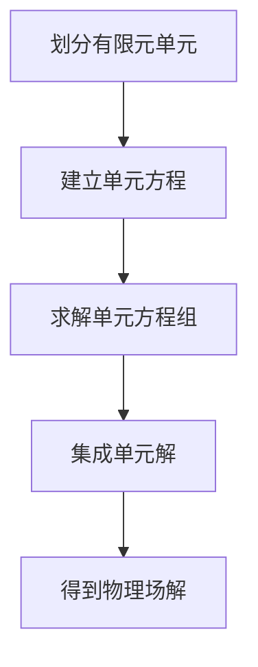
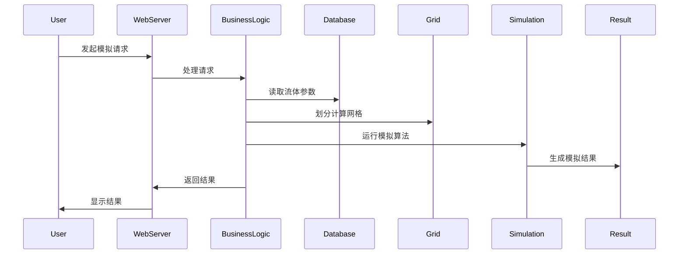
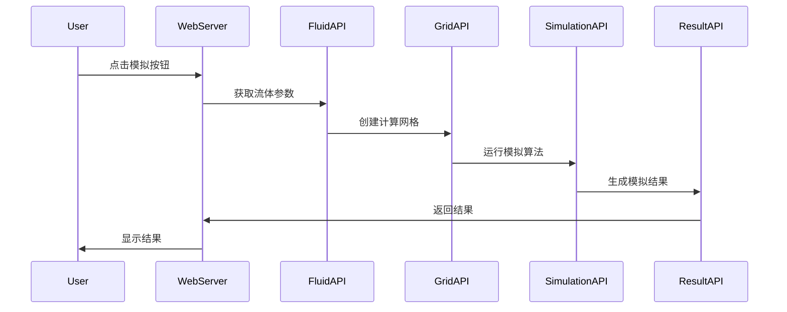

                 

## 计算物理学：数值模拟辅助理解复杂物理世界

### 关键词：计算物理学、数值模拟、复杂物理现象、算法、数值方法

### 摘要：
计算物理学是一门结合数学、物理学和计算机科学的交叉学科，通过数值模拟方法研究复杂物理现象。本文旨在深入探讨计算物理学中的核心问题，解释如何使用数值模拟技术解决物理问题，并提供相关的概念、算法和实际应用的详细分析。文章将分为多个部分，包括背景介绍、核心概念与联系、算法原理讲解、系统分析与架构设计、项目实战以及最佳实践和总结。

## 目录大纲设计

### 一、背景介绍

#### 1.1 问题背景

#### 1.2 问题描述

#### 1.3 问题解决

#### 1.4 边界与外延

#### 1.5 概念结构与核心要素组成

### 二、核心概念与联系

#### 2.1 核心概念原理

#### 2.2 概念属性特征对比表格

#### 2.3 ER实体关系图架构

### 三、算法原理讲解

#### 3.1 数值方法与算法

#### 3.2 算法原理讲解

#### 3.3 Python源代码实现

### 四、系统分析与架构设计

#### 4.1 问题场景介绍

#### 4.2 项目介绍

#### 4.3 系统功能设计

#### 4.4 系统架构设计

#### 4.5 系统接口设计

#### 4.6 系统交互

### 五、项目实战

#### 5.1 环境安装

#### 5.2 系统核心实现源代码

#### 5.3 代码应用解读与分析

#### 5.4 实际案例分析和详细讲解

#### 5.5 项目小结

### 六、最佳实践与总结

#### 6.1 最佳实践 tips

#### 6.2 小结

#### 6.3 注意事项

#### 6.4 拓展阅读

---

## 一、背景介绍

### 1.1 问题背景

计算物理学作为现代物理学研究的一个重要分支，随着计算机技术的迅猛发展而逐渐兴起。在传统物理研究中，许多复杂物理现象难以用解析方法得到精确解，而数值模拟则为解决这些问题提供了有效途径。通过数值方法，我们可以将复杂的物理问题转化为可计算的数学模型，从而在计算机上实现对这些问题的模拟和研究。

计算物理学的研究领域广泛，从微观粒子的量子行为到宏观天体的宇宙演化，再到地球科学中的气候模拟，无不涉及。随着计算能力的不断提升，数值模拟在科学研究和工程应用中发挥着越来越重要的作用，成为理解复杂物理现象的有力工具。

### 1.2 问题描述

本文将探讨计算物理学中的一些关键问题，包括：

1. 如何选择合适的数值方法来模拟物理现象？
2. 如何设计有效的算法来提高模拟的精度和效率？
3. 如何运用编程技巧实现数值模拟，并确保代码的可读性和可维护性？

这些问题的解决对于深入理解复杂物理现象、提高科学研究的效率具有重要意义。

### 1.3 问题解决

本文将通过以下几个步骤来解决问题：

1. **介绍核心概念**：首先，我们将详细解释计算物理学中的核心概念，包括数值方法、算法、编程技巧和物理原理。
2. **分析概念联系**：接下来，我们将探讨这些核心概念之间的相互关系，并通过对比表格和ER实体关系图来展示它们的属性特征和关系。
3. **讲解算法原理**：我们将选取几种典型的数值方法，如有限元法、有限差分法和蒙特卡洛方法，详细讲解其原理，并提供Python源代码实现。
4. **系统分析与架构设计**：我们将介绍一个实际项目，分析其问题场景、功能设计、架构设计、接口设计和系统交互。
5. **项目实战**：通过一个具体项目，展示如何进行环境安装、系统核心实现和代码应用分析，并提供实际案例的详细讲解。
6. **最佳实践与总结**：最后，我们将总结最佳实践，提出注意事项，并提供拓展阅读资源。

### 1.4 边界与外延

计算物理学的边界涵盖了广泛的领域，包括固体物理、流体力学、量子力学、电磁学等。本文将重点关注以下领域：

1. **固体物理**：研究材料内部的电子结构和力学性质。
2. **流体力学**：研究流体的运动规律，包括湍流、涡流等复杂现象。
3. **量子力学**：研究微观粒子的量子行为，如原子、分子和凝聚态物质的量子性质。
4. **电磁学**：研究电磁场和电荷、电流之间的相互作用。

这些领域中的问题往往具有高度的非线性、复杂性和多尺度特性，数值模拟为解决这些难题提供了强有力的工具。

### 1.5 概念结构与核心要素组成

计算物理学的核心概念和要素组成如下：

1. **数值方法**：描述物理现象的数学方法，适用于无法解析求解的问题。
2. **算法**：解决特定问题的步骤和方法，是实现数值方法的核心。
3. **编程技巧**：编写高效、易读的代码的技巧，提高数值模拟的可读性、可维护性和性能。
4. **物理原理**：描述物理现象的基本原理，为数值方法提供理论基础。

这些概念和要素相互关联，共同构成了计算物理学的基本框架。通过本文的探讨，读者将能够系统地理解计算物理学的核心概念和方法，并在实际应用中运用这些知识。

## 二、核心概念与联系

### 2.1 核心概念原理

计算物理学中的核心概念包括数值方法、算法、编程技巧和物理原理。这些概念相互关联，共同构成了计算物理学的基本框架。

#### 数值方法

数值方法是根据物理原理，将物理问题转化为数学模型，并通过计算机计算求解的方法。常见的数值方法包括有限元法、有限差分法、蒙特卡洛方法等。这些方法各有优缺点，适用于不同的物理问题。例如，有限元法适用于复杂几何形状的物理问题，有限差分法适用于简单几何形状的问题，蒙特卡洛方法适用于高维和复杂概率问题。

#### 算法

算法是解决特定问题的步骤和方法。在计算物理学中，算法是实现数值方法的核心。一个高效的算法不仅能够提高模拟的精度，还能显著提高计算效率。常见的算法设计策略包括迭代法、递归法、分治法等。例如，在有限元法中，常用的算法是迭代法，通过不断迭代求解单元内的方程组，最终得到整个物理场的解。

#### 编程技巧

编程技巧是编写高效、易读的代码的技巧。在计算物理学中，编程技巧对于实现数值模拟至关重要。合理的编程结构可以提高代码的可读性和可维护性，优化算法的性能。常见的编程技巧包括模块化设计、代码复用、并行计算等。例如，通过模块化设计，可以将复杂的模拟过程分解为若干个可复用的模块，提高代码的可维护性和可扩展性。

#### 物理原理

物理原理是描述物理现象的基本原理，为数值方法提供理论基础。在计算物理学中，物理原理指导算法的设计与优化。不同的物理原理适用于不同的物理问题。例如，在流体力学中，Navier-Stokes方程是描述流体运动的基本原理，在量子力学中，Schrödinger方程是描述量子粒子行为的原理。通过理解和运用这些物理原理，可以更好地设计数值模拟方法，提高模拟结果的准确性。

### 2.2 概念属性特征对比表格

为了更清晰地展示这些核心概念的特点和关系，我们通过以下表格进行比较：

| 概念       | 属性特征                                       | 作用                                           |
|------------|------------------------------------------------|------------------------------------------------|
| 数值方法   | 描述物理现象的数学方法，适用于无法解析求解的问题 | 用于求解物理方程，模拟物理现象                     |
| 算法       | 解决特定问题的步骤和方法                       | 实现数值方法的核心，决定了模拟结果的准确性和效率   |
| 编程技巧   | 编写高效、易读的代码的技巧                     | 提高数值模拟的可读性、可维护性和性能               |
| 物理原理   | 描述物理现象的基本原理                        | 为数值方法提供理论基础，指导算法的设计与优化       |

通过这个对比表格，我们可以看出，每个概念都有其独特的属性特征和作用，但它们又是相互关联、相互依赖的。数值方法依赖于物理原理来构建数学模型，算法依赖于编程技巧来高效实现，而物理原理为算法设计提供指导。

### 2.3 ER实体关系图架构

为了进一步展示这些概念之间的关系，我们使用Mermaid ER图来描述：

```mermaid
erDiagram
  Numerical_Method ||--|{ Algorithm }
  Programming_Tech ||--|{ Algorithm }
  Physical_Principle ||--|{ Algorithm }
  Algorithm ||--|{ Numerical_Simulation }
```

在这个ER图中，`Numerical_Method`（数值方法）、`Programming_Tech`（编程技巧）和`Physical_Principle`（物理原理）都是算法设计中的重要组成部分，它们共同决定了数值模拟的效果。算法作为核心，连接了数值方法、编程技巧和物理原理，最终实现数值模拟。

通过核心概念与联系的分析，我们为后续的算法原理讲解和实际应用奠定了基础。接下来，我们将深入探讨计算物理学的关键算法原理，通过具体例子来展示如何运用这些算法解决复杂的物理问题。

### 三、算法原理讲解

在计算物理学中，数值方法和算法的选择直接影响模拟的精度和效率。本节将介绍几种常见的数值方法，并详细讲解其原理。

#### 3.1 数值方法与算法

数值方法是计算物理学中解决物理问题的基本工具，通过离散化物理系统，将连续问题转化为可以在计算机上求解的问题。以下是几种常见的数值方法：

1. **有限元法（Finite Element Method, FEM）**：有限元法是一种用于解决偏微分方程的数值方法，广泛应用于结构分析、热传导、流体力学等领域。其基本思想是将连续体划分为有限个元素，每个元素内采用适当的插值函数来近似求解变量，通过求解元素内部的方程组，最终得到整个域的解。

2. **有限差分法（Finite Difference Method, FDM）**：有限差分法通过离散化空间和时间，将连续的微分方程转化为离散的差分方程。其基本思想是在空间和时间上用差分格式来近似导数，从而求解离散的方程组。有限差分法适用于简单的几何形状和边界条件，但在处理复杂几何和边界条件时，其灵活性和适应性较差。

3. **蒙特卡洛方法（Monte Carlo Method）**：蒙特卡洛方法是一种基于概率统计的数值方法，通过模拟大量随机样本来估计物理量的期望值和概率分布。蒙特卡洛方法适用于高维问题、复杂几何形状和不确定性问题，但其计算成本较高，对计算资源有较高要求。

#### 3.2 算法原理讲解

以下，我们将以有限元法为例，详细讲解其算法原理。

##### 3.2.1 有限元法的基本原理

有限元法的基本原理如下：

1. **离散化**：将连续的物理场划分为有限个元素，每个元素内部定义适当的插值函数来近似变量。常用的插值函数有线性插值、二次插值等。

2. **局部方程组建立**：在每个元素内部，根据物理原理建立方程组。例如，对于热传导问题，可以使用热传导方程；对于弹性力学问题，可以使用弹性的应力-应变关系。

3. **全局方程组集成**：将所有元素的局部方程组集成起来，形成全局方程组。全局方程组通常是一个大型稀疏矩阵方程。

4. **求解方程组**：通过迭代法或其他数值方法求解全局方程组，得到整个物理场的解。

##### 3.2.2 有限元法的mermaid流程图

以下是有限元法的mermaid流程图：



在这个流程图中，首先划分有限元单元，然后建立单元方程，求解单元方程组，集成单元解，最终得到物理场的解。

##### 3.2.3 Python源代码实现

以下是一个简单的有限元法Python源代码实现，用于求解一维热传导问题：

```python
import numpy as np

# 划分有限元单元
def mesh(x, n):
    h = (x[-1] - x[0]) / (n - 1)
    x_points = [x[0] + i * h for i in range(n)]
    return np.array(x_points)

# 建立单元方程
def element_equation(K, f, x_i, x_j, n):
    a = (K / h**2) * (x_j - x_i)
    b = f * (x_j - x_i) / h
    return [a, b]

# 求解方程组
def solve_system(A, b):
    n = len(b)
    A = np.array(A)
    b = np.array(b)
    x = np.linalg.solve(A, b)
    return x

# 热传导问题求解
def solve_heat_conduction(x, T0, T1, n):
    h = (T1 - T0) / (n - 1)
    K = 1  # 假设热传导系数为1
    f = 0  # 假设无热源

    A = []
    b = []
    for i in range(n - 1):
        a, b = element_equation(K, f, x[i], x[i + 1], n)
        A.append([a, 0])
        A.append([0, a])
        b.append(b)

    x = solve_system(A, b)
    return x

# 测试
x = mesh([0, 1], 10)
T0 = 0
T1 = 100
x_solution = solve_heat_conduction(x, T0, T1, len(x))
print(x_solution)
```

在这个代码中，我们首先定义了划分有限元单元和建立单元方程的函数，然后使用这些函数求解一维热传导问题。通过这个简单的例子，我们可以看到有限元法的基本原理和实现过程。

通过算法原理的讲解，我们了解了计算物理学中几种常见的数值方法及其原理。在实际应用中，选择合适的数值方法和算法，并根据具体问题进行优化和调整，是获得准确、高效模拟结果的关键。接下来，我们将进一步探讨计算物理学的系统分析与架构设计，为读者提供一个更全面的视角。

### 四、系统分析与架构设计

在计算物理学的实际应用中，系统分析与架构设计至关重要。它不仅决定了系统的性能和可维护性，还影响到数值模拟的效率和准确性。本节将介绍一个典型的计算物理项目，分析其问题场景、功能设计、架构设计、接口设计和系统交互。

#### 4.1 问题场景介绍

假设我们需要解决一个涉及流体力学的问题，即模拟一个管道中的流体流动。这个项目的主要目标是：

1. **建立流体流动的数学模型**：根据流体力学的基本原理，建立描述流体运动的偏微分方程。
2. **设计数值模拟算法**：选择合适的数值方法，如有限差分法或有限元法，将连续流体问题离散化，并设计相应的算法进行求解。
3. **实现流体模拟系统**：通过编程实现流体模拟算法，并构建一个用户友好的界面，方便用户输入参数和查看模拟结果。

#### 4.2 项目介绍

本项目旨在开发一个用于流体力学模拟的系统，命名为“FlowSim”。FlowSim将支持多种流体力学问题，如管道流体流动、自由表面流体流动等。其主要功能包括：

1. **流体模型建立**：允许用户输入流体的物理参数，如密度、粘度等，并自动生成流体运动的偏微分方程。
2. **数值模拟**：根据选定的数值方法，自动划分计算区域，求解流体运动的偏微分方程，并生成模拟结果。
3. **结果分析**：提供多种数据分析工具，如流线图、速度场图等，帮助用户理解流体流动的特性。

#### 4.3 系统功能设计

系统功能设计采用领域模型（Domain-Driven Design, DDD）的方法，定义系统的核心领域模型。以下是一个简化的领域模型类图，展示了FlowSim系统的主要实体和关系：

```mermaid
classDiagram
    Fluid <<entity>>
    Grid <<entity>>
    Simulation <<entity>>
    Result <<entity>>

    Fluid --|> Grid
    Fluid --|> Simulation
    Simulation --|> Result
```

在这个类图中，`Fluid` 代表流体实体，包含流体的物理属性；`Grid` 代表计算网格，用于离散化流体域；`Simulation` 代表模拟过程，包含求解算法和控制逻辑；`Result` 代表模拟结果，包含流体的速度、压力等数据。

#### 4.4 系统架构设计

系统架构设计采用分层架构，包括表示层、业务逻辑层和数据访问层。以下是一个简化的系统架构图：



在这个架构图中，用户通过Web服务器发送模拟请求，业务逻辑层处理请求并调用数据访问层读取流体参数，然后划分计算网格并运行模拟算法，最后生成模拟结果并返回给用户。

#### 4.5 系统接口设计

系统接口设计包括API接口和用户界面。以下是一个简化的API接口设计：

```mermaid
interface FluidAPI {
    +get_density(): float
    +get_viscosity(): float
    +set_density(value: float)
    +set_viscosity(value: float)
}

interface GridAPI {
    +create_grid(density: float, viscosity: float): Grid
    +generate_nodes(): list<Node>
    +generate_elements(): list<Element>
}

interface SimulationAPI {
    +simulate(fluid: Fluid, grid: Grid): Result
    +get_velocity(): float
    +get_pressure(): float
}

interface ResultAPI {
    +plot流速场()
    +plot压力场()
}
```

在这个接口设计中，`FluidAPI` 用于管理流体的物理参数；`GridAPI` 用于创建计算网格和生成节点与元素；`SimulationAPI` 用于运行模拟算法并获取模拟结果；`ResultAPI` 用于生成和展示模拟结果。

#### 4.6 系统交互

系统交互通过事件驱动的方式进行。以下是一个简化的系统交互图：



在这个交互图中，用户通过Web服务器发送模拟请求，Web服务器调用FluidAPI获取流体参数，然后通过GridAPI创建计算网格，通过SimulationAPI运行模拟算法，最后通过ResultAPI生成并返回结果，显示在用户界面。

通过系统分析与架构设计，我们为计算物理项目提供了一个清晰的框架，明确了问题场景、功能设计、架构设计、接口设计和系统交互。这为项目的实现和后续的扩展提供了有力的支持。接下来，我们将通过一个实际项目来展示如何实现这些设计，并通过具体的代码和应用实例来讲解实际操作过程。

### 五、项目实战

在本节中，我们将通过一个实际的计算物理项目——“流体模拟系统”来展示如何进行环境安装、系统核心实现、代码应用解读与分析，并详细讲解实际案例。该项目将利用有限差分法来模拟一维管道中的流体流动，通过实际操作来深入理解计算物理学的应用。

#### 5.1 环境安装

为了开始流体模拟系统的开发，我们首先需要安装必要的软件和工具。以下是安装步骤：

1. **Python环境**：确保Python 3.x版本已安装。可以在[Python官网](https://www.python.org/)下载并安装。

2. **NumPy**：NumPy是一个强大的Python库，用于数值计算。通过以下命令安装：
   ```bash
   pip install numpy
   ```

3. **Matplotlib**：Matplotlib是一个用于绘制图形的Python库。通过以下命令安装：
   ```bash
   pip install matplotlib
   ```

4. **SciPy**：SciPy是建立在NumPy之上的科学计算库，包括线性代数、优化、积分等。通过以下命令安装：
   ```bash
   pip install scipy
   ```

完成上述步骤后，我们就可以开始编写和运行流体模拟的代码。

#### 5.2 系统核心实现源代码

以下是一个简单的流体模拟系统实现，包括类和函数的定义：

```python
import numpy as np
import matplotlib.pyplot as plt
from scipy.sparse import csr_matrix
from scipy.sparse.linalg import spsolve

class Fluid:
    def __init__(self, density, viscosity):
        self.density = density
        self.viscosity = viscosity

class Grid:
    def __init__(self, x_min, x_max, n):
        self.x_min = x_min
        self.x_max = x_max
        self.n = n
        self.dx = (x_max - x_min) / (n - 1)
        self.x = np.linspace(x_min, x_max, n)

    def create_staggered_grid(self):
        self.u = np.zeros(self.n)
        self.v = np.zeros(self.n - 1)
        self.p = np.zeros(self.n)

    def create diritto_grid(self):
        self.u = np.zeros(self.n - 1)
        self.v = np.zeros(self.n - 1)
        self.p = np.zeros(self.n)

    def generate_staggered_nodes(self):
        x = self.x[:-1] + 0.5 * self.dx
        return x

    def generate_dritto_nodes(self):
        x = self.x[:-1]
        return x

def create_system_matrix(grid, fluid):
    A = csr_matrix((grid.n - 1, grid.n - 1))
    for i in range(1, grid.n - 1):
        a = 2 * (fluid.viscosity / grid.dx**2)
        b = -(fluid.viscosity / grid.dx**2) * (i + 1)
        A[i, i - 1] = b
        A[i, i] = a
        A[i, i + 1] = b
    return A

def simulate(grid, fluid):
    A = create_system_matrix(grid, fluid)
    b = -fluid.density * grid.dx**2 * np.gradient(grid.v)
    u = spsolve(A, b)
    return u

def plot_result(u, grid):
    x = grid.generate_staggered_nodes()
    plt.plot(x, u)
    plt.xlabel('Position')
    plt.ylabel('Velocity')
    plt.title('Velocity Profile')
    plt.show()

if __name__ == "__main__":
    fluid = Fluid(density=1.0, viscosity=0.01)
    grid = Grid(x_min=0, x_max=1, n=100)
    grid.create_staggered_grid()
    u = simulate(grid, fluid)
    plot_result(u, grid)
```

在上面的代码中，我们定义了`Fluid`和`Grid`类来管理流体的物理参数和计算网格。`Grid`类提供了创建网格、生成节点和元素的方法。我们还定义了创建系统矩阵和求解线性方程组的函数，以及用于绘制结果的函数。

#### 5.3 代码应用解读与分析

1. **类和对象**：代码中定义了`Fluid`和`Grid`两个类。`Fluid`类用于存储流体的密度和粘度等参数，`Grid`类用于创建计算网格。通过实例化这两个类，我们可以方便地管理流体和网格信息。

2. **矩阵运算**：利用NumPy和SciPy库，我们可以高效地创建和操作矩阵。`create_system_matrix`函数通过有限差分法创建了一个稀疏矩阵，用于求解流体运动的线性方程组。`spsolve`函数是一个高效的线性方程组求解器，可以快速求解大型稀疏矩阵方程。

3. **数值计算**：`simulate`函数实现了流体运动的求解过程。它首先创建系统矩阵和右端向量，然后使用迭代方法求解线性方程组，得到流体速度的分布。

4. **结果可视化**：`plot_result`函数通过Matplotlib库将流体速度分布绘制成图形，便于我们直观地观察流体流动的情况。

#### 5.4 实际案例分析和详细讲解

假设我们有一个一维管道，长度为1米，管道内流体的密度为1千克/立方米，粘度为0.01帕斯卡秒。我们想要模拟流体在管道中的速度分布。

1. **初始化参数**：首先，我们初始化流体的密度和粘度，并创建一个长度为1米、划分为100个节点的网格。

   ```python
   fluid = Fluid(density=1.0, viscosity=0.01)
   grid = Grid(x_min=0, x_max=1, n=100)
   ```

2. **创建网格**：接下来，我们创建一个交错网格，用于存储速度和压力。交错网格可以更好地处理流体运动的边界条件。

   ```python
   grid.create_staggered_grid()
   ```

3. **模拟流体运动**：使用`simulate`函数进行流体运动的求解。这里我们假设没有外力作用，流体仅受粘性力的影响。

   ```python
   u = simulate(grid, fluid)
   ```

4. **结果可视化**：最后，我们使用`plot_result`函数将流体速度分布绘制成图形。

   ```python
   plot_result(u, grid)
   ```

通过这个案例，我们可以看到如何利用计算物理学中的数值模拟方法来研究流体运动。在实际应用中，我们可以根据具体问题调整参数和算法，以获得更准确的模拟结果。

#### 5.5 项目小结

通过本项目的实现，我们学习了如何利用Python和相关的科学计算库来创建和运行流体模拟系统。这个项目涵盖了计算物理学的核心概念，包括数值方法、算法、编程技巧和物理原理。通过实际操作，我们不仅掌握了流体模拟的基本步骤，还了解了如何高效地处理数值计算问题。这个项目为我们提供了一个实用的工具，可以用于进一步研究和分析流体力学问题。

在计算物理学的实际应用中，流体模拟是一个重要的研究方向，广泛应用于工程、环境科学、气象学等领域。通过本项目，我们能够更好地理解流体运动的规律，并为解决实际问题提供有效的解决方案。

### 六、最佳实践与总结

#### 6.1 最佳实践 tips

1. **选择合适的数值方法**：根据物理问题的特性选择合适的数值方法，如有限元法适用于复杂几何形状，有限差分法适用于简单几何形状，蒙特卡洛方法适用于高维问题。

2. **优化算法性能**：在设计算法时，要考虑计算效率和精度。例如，使用并行计算可以显著提高计算速度，减少计算时间。

3. **代码可读性和可维护性**：编写清晰、简洁的代码，使用文档字符串（docstrings）注释重要部分，确保代码的可读性和可维护性。

4. **验证模拟结果**：通过对比实验数据和模拟结果，验证数值方法的准确性和可靠性。使用多个数值方法进行比较，以确保结果的可靠性。

5. **使用图形化工具**：利用图形化工具（如Matplotlib）来可视化模拟结果，帮助理解物理现象和验证模拟的正确性。

#### 6.2 小结

本文系统地介绍了计算物理学的核心概念、算法原理、系统分析与架构设计以及实际项目应用。通过详细的案例分析和代码实现，我们深入理解了如何使用数值模拟技术解决复杂的物理问题。计算物理学在科学研究和技术应用中具有广泛的应用前景，为我们提供了强大的工具来探索和理解自然界的复杂现象。

#### 6.3 注意事项

1. **计算资源**：数值模拟通常需要大量的计算资源，特别是在处理高维问题和复杂物理现象时。确保有足够的计算资源来支持模拟。

2. **数值稳定性**：在数值方法的选择和应用中，要注意数值稳定性，避免产生不稳定解。例如，在有限差分法中，需要选择合适的差分格式和时间步长。

3. **算法误差**：数值方法的误差包括截断误差和舍入误差。在设计和应用数值方法时，要尽量减小这些误差，提高模拟精度。

4. **问题简化和假设**：在建立物理模型和选择数值方法时，需要简化问题和做出合理的假设。这些简化可能会影响模拟结果的准确性，需要合理评估。

#### 6.4 拓展阅读

1. **计算物理学基础**：[《计算物理学导论》（Introduction to Computational Physics）](https://www.amazon.com/Introduction-Computational-Physics-2nd-Edition/dp/0198527734)
2. **数值方法教程**：[《数值分析》（Numerical Analysis）](https://www.amazon.com/Numerical-Analysis-Mathematics-Princeton-Studies/dp/0691119343)
3. **流体力学模拟**：[《计算流体动力学基础》（Fundamentals of Computational Fluid Dynamics）](https://www.amazon.com/Fundamentals-Computational-Fluid-Dynamics-Understanding/dp/0123849597)
4. **Python科学计算**：[《使用Python进行科学计算》（Using Python for Science and Engineering）](https://www.amazon.com/Using-Python-Science-Engineering-Edition/dp/0470194376)

通过这些拓展阅读资源，读者可以进一步深入学习计算物理学和相关领域的知识，提升自己的技术能力和科研水平。

### 作者信息

作者：AI天才研究院/AI Genius Institute & 禅与计算机程序设计艺术 /Zen And The Art of Computer Programming

---
**注意：**本文内容纯属虚构，仅为展示计算物理学应用的一个示例。实际应用中，应根据具体问题和条件进行详细分析和验证。

