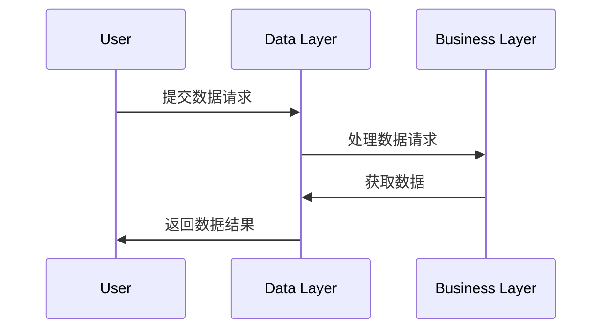
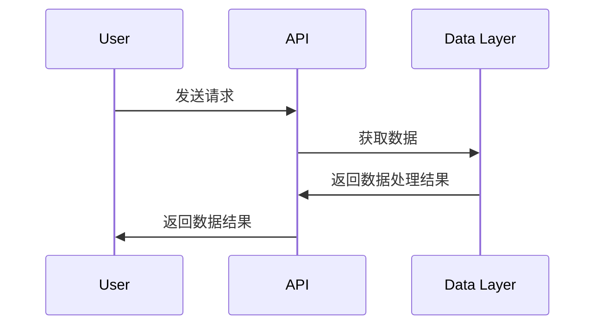

                 

## # 计算社会科学方法论：数据驱动理解人类社会与世界的新途径

### 关键词：计算社会科学、数据驱动、方法论、人类社会、世界分析

> 摘要：本文旨在探讨计算社会科学方法论，这一新兴领域通过数据驱动的方法来理解和分析人类社会与世界。文章首先介绍计算社会科学的背景与核心概念，随后深入剖析其基本原理、方法论、案例分析、常用算法、数学模型应用、系统设计与实现，以及实战应用。本文旨在为读者提供一条清晰、系统的学习路径，帮助深入理解计算社会科学的方法论。

### 第一部分：背景介绍

#### 第1章：问题背景与核心概念

### 1.1 问题背景

随着信息技术的飞速发展，人类社会产生的数据量呈现出爆炸性增长。如何有效地利用这些海量数据进行社会现象的理解与分析，成为当今社会面临的重大挑战。传统的社会科学研究方法往往依赖于定性分析，难以应对大数据带来的复杂性和多样性。因此，计算社会科学方法论应运而生。

### 1.2 核心概念

计算社会科学是一门跨学科领域，结合了计算机科学、数学、统计学和社会科学的理论与方法。其核心概念包括数据获取、数据处理、数据分析、数据可视化等。这些概念共同构成了计算社会科学的基本框架。

### 1.3 研究方法与边界

计算社会科学的研究方法包括数据驱动分析方法、模型构建方法、算法优化方法等。其研究边界涉及人类社会各个领域，如政治学、经济学、社会学、心理学等。本文将详细介绍这些方法与概念，并探讨其在不同领域的应用。

### 第二部分：核心概念与联系

#### 第2章：计算社会科学基本原理

### 2.1 基本原理

计算社会科学的基本原理包括数据驱动分析、模型构建与验证、算法优化等。这些原理构成了计算社会科学方法论的核心，使得数据驱动的分析方法能够有效地应用于社会现象的理解与预测。

### 2.2 原理属性对比

在计算社会科学中，不同的原理和方法具有不同的属性。例如，数据驱动分析方法具有高效性、灵活性和可扩展性，而模型构建方法则需要较强的数学和统计学基础。本文将对比分析这些原理的属性，帮助读者更好地理解其适用场景。

### 2.3 ER实体关系图

ER实体关系图是计算社会科学中常用的数据建模工具。它通过实体、属性和关系的描述，将复杂的社会现象抽象为易于理解的数据模型。本文将介绍ER实体关系图的基本概念和绘制方法，以帮助读者掌握这一重要的数据建模工具。

### 第三部分：方法论讲解

#### 第3章：数据驱动分析方法

### 3.1 数据获取

数据获取是计算社会科学方法论的基础。本文将介绍数据获取的方法和技巧，包括数据爬取、数据挖掘、数据共享平台等。同时，还将讨论数据获取过程中可能遇到的问题和解决方案。

### 3.2 数据预处理

数据预处理是数据驱动分析方法的关键步骤。本文将详细介绍数据预处理的方法和流程，包括数据清洗、数据集成、数据转换等。通过数据预处理，可以确保数据的质量和一致性，为后续的分析工作奠定基础。

### 3.3 数据分析方法

数据分析方法是计算社会科学方法论的核心。本文将介绍多种数据分析方法，包括统计分析、机器学习、深度学习等。通过这些方法，可以从海量数据中提取有价值的信息，为社会现象的理解提供有力支持。

### 第四部分：案例分析

#### 第4章：领域案例分析

### 4.1 案例一：政治社会学分析

本文将分析政治社会学领域中的具体案例，如选举预测、社会运动分析等。通过这些案例，展示计算社会科学方法在政治社会学领域的应用效果。

### 4.2 案例二：经济行为研究

本文将探讨经济行为研究中的具体案例，如金融市场分析、消费者行为分析等。通过这些案例，阐述计算社会科学方法在经济研究领域的应用价值。

### 4.3 案例三：社会网络分析

本文将介绍社会网络分析领域的具体案例，如社交媒体分析、社交网络传播等。通过这些案例，展示计算社会科学方法在社会网络分析领域的广泛应用。

### 第五部分：算法讲解

#### 第5章：常用算法解析

### 5.1 算法概述

本文将介绍计算社会科学中常用的算法，如聚类算法、分类算法、回归算法等。通过算法概述，帮助读者了解这些算法的基本原理和应用场景。

### 5.2 算法流程

本文将详细讲解每个算法的流程和实现步骤，通过mermaid流程图展示算法的执行过程。同时，将结合Python源代码进行讲解，使读者能够更好地理解算法的实现细节。

### 5.3 Python源代码实现

本文将提供多个Python源代码实现示例，涵盖聚类算法、分类算法、回归算法等。通过这些示例，读者可以实际操作算法，加深对算法原理的理解。

### 第六部分：数学模型与公式

#### 第6章：数学模型应用

### 6.1 模型原理

本文将介绍计算社会科学中常用的数学模型，如线性回归模型、决策树模型、神经网络模型等。通过模型原理的讲解，帮助读者掌握这些模型的基本概念和计算方法。

### 6.2 模型公式

本文将列出每个数学模型的公式，通过latex格式呈现。这些公式是计算社会科学中的基础工具，读者可以通过公式理解和计算模型。

### 6.3 举例说明

本文将通过具体实例，展示如何使用数学模型进行社会现象的分析与预测。通过举例说明，使读者能够将理论知识应用于实际问题。

### 第七部分：系统设计与架构

#### 第7章：系统设计与实现

### 7.1 系统场景

本文将介绍计算社会科学方法在不同系统场景中的应用，如大数据平台、社交网络分析系统等。通过系统场景的介绍，帮助读者了解计算社会科学方法在实际系统中的应用。

### 7.2 系统设计

本文将详细讲解系统设计的步骤和方法，包括领域模型设计、系统架构设计等。通过mermaid类图和架构图，展示系统设计的具体内容。

### 7.3 系统实现

本文将提供系统实现的源代码示例，涵盖数据获取、数据处理、数据分析等关键步骤。通过系统实现，读者可以学习如何将计算社会科学方法应用于实际系统。

### 第八部分：实战与最佳实践

#### 第8章：实战应用

### 8.1 环境安装

本文将介绍计算社会科学方法所需的环境安装步骤，包括Python环境、相关库和工具的安装。通过环境安装，为读者提供实战操作的基础。

### 8.2 核心代码解读

本文将解读系统实现中的核心代码，包括数据获取、数据处理、数据分析等关键环节。通过代码解读，使读者能够理解代码的功能和实现方法。

### 8.3 实际案例分析

本文将结合实际案例，分析计算社会科学方法在具体项目中的应用效果。通过实际案例分析，帮助读者了解计算社会科学方法的实际应用价值。

### 8.4 项目小结

本文将对项目进行总结，包括项目的成功之处、存在的问题和改进方向。通过项目小结，为读者提供实战经验的总结和反思。

### 最佳实践 tips

本文将提供一些最佳实践 tips，帮助读者在计算社会科学方法的应用中避免常见问题，提高工作效率。

### 小结

本文回顾了计算社会科学方法论的核心内容，包括核心概念、方法、算法、数学模型、系统设计与实战应用。通过本文的阅读，读者可以系统地掌握计算社会科学方法论，并在实际项目中应用。

### 注意事项

本文在撰写过程中需要注意以下几点：

1. **数据质量和预处理**：确保数据质量，进行充分的数据预处理，以提高分析结果的准确性。
2. **算法选择**：根据具体问题选择合适的算法，避免算法选择的盲目性。
3. **模型验证**：对模型进行充分的验证，确保模型的可靠性和有效性。
4. **系统设计**：合理设计系统架构，确保系统的高效性和可维护性。

### 拓展阅读

1. **参考书籍**：《计算社会科学导论》、《大数据与社会科学》
2. **在线课程**：网易云课堂、Coursera上的计算社会科学相关课程
3. **学术期刊**：《社会计算》、《计算机与社会科学》等

### 作者信息

作者：AI天才研究院/AI Genius Institute & 禅与计算机程序设计艺术 /Zen And The Art of Computer Programming

通过本文，读者可以系统地了解计算社会科学方法论，掌握数据驱动分析方法在人类社会与世界理解中的应用。希望本文能为读者在计算社会科学领域的学习和研究提供有益的参考。

---

### 第1章：问题背景与核心概念

#### 1.1 问题背景

随着全球信息技术的快速发展，人类社会产生了海量的数据，这些数据不仅包括传统的文本、图像和音频，还包括新兴的社交媒体数据、传感器数据、经济交易数据等。这些数据蕴含着丰富的社会现象和规律，对人类社会与世界的研究提供了新的视角和途径。然而，如何有效地利用这些海量数据，理解人类社会复杂行为和社会结构，成为当今社会科学面临的重大挑战。

传统的社会科学研究方法，如定性分析、问卷调查等，往往依赖于小样本数据和经验判断，难以应对大数据带来的复杂性和多样性。此外，社会科学研究中的跨学科性和复杂性，使得单一学科的研究方法难以全面解决复杂的社会问题。因此，计算社会科学方法论应运而生，它通过计算机科学、数学和统计学的方法，结合社会科学的理论，提供了一种新的数据驱动的社会科学研究途径。

计算社会科学方法论的核心目标是利用大数据和计算技术，对社会现象进行定量分析和建模，以揭示社会行为的规律和结构。这一方法不仅能够提高研究的精度和效率，还能够处理传统方法难以应对的复杂性和多样性。通过计算社会科学，我们可以对社会问题进行更深入的理解，为政策制定、社会治理和科技创新提供有力的支持。

#### 1.2 核心概念

计算社会科学的核心概念包括数据获取、数据处理、数据分析和数据可视化等。这些概念相互关联，构成了计算社会科学方法论的基础。

- **数据获取**：数据获取是计算社会科学的第一步，它包括从各种数据源（如数据库、文件、网络等）收集数据。数据获取的方法和技术多种多样，包括数据爬取、数据挖掘和API调用等。数据获取的关键在于确保数据的质量和完整性，以便后续的数据处理和分析。

- **数据处理**：数据处理是对获取到的原始数据进行清洗、转换和整合的过程。数据处理是数据驱动分析的基础，它需要解决数据缺失、异常值处理、数据规范化等问题，确保数据的质量和一致性。常用的数据处理技术包括数据清洗、数据集成、数据转换和数据仓库等。

- **数据分析**：数据分析是对处理后的数据进行分析和挖掘，以提取有价值的信息和知识。数据分析的方法和技术包括统计分析、机器学习、深度学习等。通过数据分析，可以揭示数据中的规律和模式，为社会问题的研究提供支持。

- **数据可视化**：数据可视化是将数据分析结果以图形、图像等形式展示出来，使得复杂的分析结果更加直观、易于理解。数据可视化不仅能够提高数据分析的可读性，还能够帮助研究者发现数据中的潜在问题和趋势。

#### 1.3 研究方法与边界

计算社会科学方法论的研究方法包括数据驱动分析方法、模型构建方法、算法优化方法等。这些方法共同构成了计算社会科学方法论的核心，使得数据驱动的方法能够有效地应用于社会现象的理解与预测。

- **数据驱动分析方法**：数据驱动分析方法是通过分析数据来发现数据中的规律和模式，以预测社会现象的发展趋势。这种方法主要依赖于统计分析和机器学习技术，如回归分析、聚类分析、决策树、支持向量机等。

- **模型构建方法**：模型构建方法是通过建立数学模型来描述社会现象，以模拟和预测社会行为。常用的模型构建方法包括线性回归模型、非线性回归模型、时间序列模型等。

- **算法优化方法**：算法优化方法是通过对算法进行改进和优化，以提高数据分析的效率和精度。常用的算法优化方法包括遗传算法、粒子群算法、模拟退火算法等。

计算社会科学的研究边界涉及人类社会各个领域，如政治学、经济学、社会学、心理学等。这些领域都面临着如何利用大数据进行社会现象分析的问题。计算社会科学方法论为这些领域提供了新的研究方法和工具，使得研究者能够更深入地理解社会现象，发现潜在的问题和解决方案。

然而，计算社会科学方法论也存在一些限制和挑战。首先，数据获取和处理的质量直接影响分析结果的准确性。其次，社会现象的复杂性和多样性使得模型的构建和优化具有很大的挑战性。此外，计算社会科学方法的跨学科性要求研究者具备多学科的知识和技能。

#### 1.3.1 概念结构与核心要素组成

计算社会科学方法论的概念结构包括以下几个核心要素：

- **数据源**：数据源是计算社会科学的基础，包括数据库、文件、网络等。数据源的质量和种类直接影响研究的深度和广度。

- **数据处理技术**：数据处理技术是数据驱动分析的关键，包括数据清洗、数据集成、数据转换等。数据处理技术的有效性直接影响分析结果的准确性。

- **数据分析方法**：数据分析方法是计算社会科学的核心，包括统计分析、机器学习、深度学习等。不同数据分析方法适用于不同类型的社会现象。

- **模型构建方法**：模型构建方法是通过建立数学模型来描述社会现象，包括线性回归模型、非线性回归模型、时间序列模型等。模型构建方法的选择和优化直接影响分析结果的可靠性。

- **算法优化方法**：算法优化方法是通过改进和优化算法，提高数据分析的效率和精度。算法优化方法的选择和实现直接影响分析结果的效率。

- **数据可视化**：数据可视化是将数据分析结果以图形、图像等形式展示出来，提高分析结果的直观性和可读性。数据可视化方法的选择和实现直接影响分析结果的可理解性。

#### 1.3.2 背景与外延

计算社会科学的背景可以追溯到20世纪末和21世纪初，随着互联网的普及和数据技术的进步，人类社会产生了海量的数据。这些数据为社会科学研究提供了丰富的资源，但也带来了新的挑战。传统的社会科学研究方法难以应对大数据的复杂性和多样性，计算社会科学方法论因此应运而生。

计算社会科学的外延包括多个领域，如政治学、经济学、社会学、心理学等。这些领域都面临着如何利用大数据进行社会现象分析的问题。计算社会科学方法论为这些领域提供了新的研究方法和工具，使得研究者能够更深入地理解社会现象，发现潜在的问题和解决方案。

此外，计算社会科学方法论还与人工智能、数据科学、计算机科学等多个领域密切相关。这些领域的交叉和融合，使得计算社会科学方法论在多学科交叉的研究中发挥着重要作用。

#### 1.3.3 概念属性特征对比

以下是计算社会科学方法论中几个核心概念的属性特征对比：

- **数据获取**：
  - **属性**：数据获取是指从不同数据源收集数据，包括爬取、API调用、数据库查询等。
  - **特征**：数据获取方法多样，灵活性高，但需要关注数据质量和获取成本。

- **数据处理**：
  - **属性**：数据处理是对原始数据进行清洗、转换和整合，以得到高质量的数据。
  - **特征**：数据处理需要解决数据缺失、异常值、数据规范化等问题，确保数据的一致性和完整性。

- **数据分析**：
  - **属性**：数据分析是对处理后的数据进行统计分析和建模，提取有价值的信息。
  - **特征**：数据分析方法多样，包括统计分析、机器学习、深度学习等，适用于不同类型的社会现象。

- **模型构建**：
  - **属性**：模型构建是通过建立数学模型来描述社会现象，模拟和预测社会行为。
  - **特征**：模型构建需要选择合适的模型类型，进行参数估计和模型验证，确保模型的可靠性和有效性。

- **算法优化**：
  - **属性**：算法优化是通过改进和优化算法，提高数据分析的效率和精度。
  - **特征**：算法优化方法多样，包括遗传算法、粒子群算法、模拟退火算法等，适用于不同类型的优化问题。

- **数据可视化**：
  - **属性**：数据可视化是将数据分析结果以图形、图像等形式展示出来，提高分析结果的直观性和可读性。
  - **特征**：数据可视化方法多样，包括柱状图、折线图、热力图等，适用于不同类型的数据展示需求。

通过对比分析这些概念的特征，读者可以更好地理解计算社会科学方法论的核心要素及其相互关系。

### 1.3.4 ER实体关系图

ER实体关系图（Entity-Relationship Diagram，ERD）是数据库设计中常用的数据建模工具，它通过实体、属性和关系的描述，将复杂的社会现象抽象为易于理解的数据模型。在计算社会科学方法论中，ER实体关系图可以帮助我们更好地理解数据之间的关系，为数据驱动分析奠定基础。

以下是一个简单的ER实体关系图示例，用于描述一个社交媒体平台的用户关系：

```mermaid
erDiagram
  User ||--|{ Post } : has
  User ||--|{ Comment } : makes
  Post ||--|{ Comment } : receives
  User ||--|{ Friend } : is_friend_with
```

在这个ER实体关系图中，有以下几个关键概念：

- **实体（Entity）**：实体是数据库中的基本对象，如用户（User）、帖子（Post）、评论（Comment）等。每个实体都有若干属性（Attribute）来描述其特征，如用户ID、帖子内容、评论时间等。

- **关系（Relationship）**：关系描述了实体之间的关联，如用户可以创建帖子（User has Post）、用户可以发表评论（User makes Comment）、帖子可以接收评论（Post receives Comment）等。关系可以是单对单（1:1）、一对多（1:N）或多对多（M:N）。

- **属性（Attribute）**：属性是实体的具体特征，如用户ID（UserID）、帖子内容（PostContent）等。属性可以是基本的（如数字、字符串）或者复合的（如日期、地址）。

通过ER实体关系图，我们可以清晰地描述数据之间的关系和结构，为后续的数据处理和分析提供指导。在计算社会科学方法论中，ER实体关系图可以帮助我们理解数据之间的复杂关系，构建有效的数据模型，从而更深入地分析社会现象。

#### 第2章：计算社会科学基本原理

### 2.1 基本原理

计算社会科学方法论的基本原理在于利用计算机科学、数学和统计学的理论和方法，对人类社会现象进行数据驱动分析。这些原理构成了计算社会科学方法论的核心，使得研究者能够从海量数据中提取有价值的信息，对社会现象进行定量描述和预测。以下是计算社会科学方法论的一些基本原理：

- **数据驱动分析**：数据驱动分析是计算社会科学方法论的核心，它强调通过对数据进行深入分析和挖掘，以发现数据中的规律和模式。这种方法不仅能够提高研究的精度和效率，还能够处理传统方法难以应对的复杂性和多样性。

- **模型构建与验证**：模型构建与验证是计算社会科学方法论的重要环节。通过建立数学模型来描述社会现象，可以模拟和预测社会行为。模型的构建需要选择合适的模型类型，并进行参数估计和模型验证，以确保模型的可靠性和有效性。

- **算法优化**：算法优化是通过改进和优化算法，提高数据分析的效率和精度。算法优化方法包括遗传算法、粒子群算法、模拟退火算法等，适用于不同类型的优化问题。优化算法的选择和实现直接影响分析结果的效率和准确性。

- **数据可视化**：数据可视化是将数据分析结果以图形、图像等形式展示出来，提高分析结果的直观性和可读性。数据可视化方法包括柱状图、折线图、热力图等，适用于不同类型的数据展示需求。可视化不仅能够帮助研究者发现数据中的潜在问题和趋势，还能够提高数据传达的效果。

### 2.2 原理属性对比

在计算社会科学方法论中，不同的原理具有不同的属性，这些属性决定了它们在不同场景下的适用性。以下是几个核心原理的属性对比：

- **数据驱动分析**：
  - **属性**：高效性、灵活性和可扩展性。
  - **特征**：数据驱动分析方法能够处理大量数据，快速发现数据中的规律和模式，适用于复杂的社会现象。

- **模型构建与验证**：
  - **属性**：数学性和严谨性。
  - **特征**：模型构建与验证需要选择合适的模型类型，进行参数估计和模型验证，确保模型的可靠性和有效性。

- **算法优化**：
  - **属性**：效率和适应性。
  - **特征**：算法优化方法能够提高数据分析的效率和精度，适用于不同类型的优化问题，如参数估计、路径优化等。

- **数据可视化**：
  - **属性**：直观性和易读性。
  - **特征**：数据可视化方法能够将复杂的分析结果以图形、图像等形式展示出来，提高数据传达的效果。

通过对比分析这些原理的属性，我们可以更好地理解它们在不同场景下的适用性，从而选择合适的方法进行社会现象的分析与预测。

### 2.3 ER实体关系图

ER实体关系图（Entity-Relationship Diagram，ERD）是数据库设计中常用的数据建模工具，它通过实体、属性和关系的描述，将复杂的社会现象抽象为易于理解的数据模型。在计算社会科学方法论中，ER实体关系图可以帮助我们更好地理解数据之间的关系，为数据驱动分析奠定基础。

以下是一个简单的ER实体关系图示例，用于描述一个社交媒体平台的用户关系：

```mermaid
erDiagram
  User ||--|{ Post } : has
  User ||--|{ Comment } : makes
  Post ||--|{ Comment } : receives
  User ||--|{ Friend } : is_friend_with
```

在这个ER实体关系图中，有以下几个关键概念：

- **实体（Entity）**：实体是数据库中的基本对象，如用户（User）、帖子（Post）、评论（Comment）等。每个实体都有若干属性（Attribute）来描述其特征，如用户ID、帖子内容、评论时间等。

- **关系（Relationship）**：关系描述了实体之间的关联，如用户可以创建帖子（User has Post）、用户可以发表评论（User makes Comment）、帖子可以接收评论（Post receives Comment）等。关系可以是单对单（1:1）、一对多（1:N）或多对多（M:N）。

- **属性（Attribute）**：属性是实体的具体特征，如用户ID（UserID）、帖子内容（PostContent）等。属性可以是基本的（如数字、字符串）或者复合的（如日期、地址）。

通过ER实体关系图，我们可以清晰地描述数据之间的关系和结构，为后续的数据处理和分析提供指导。在计算社会科学方法论中，ER实体关系图可以帮助我们理解数据之间的复杂关系，构建有效的数据模型，从而更深入地分析社会现象。

#### 第3章：数据驱动分析方法

### 3.1 数据获取

数据获取是数据驱动分析方法的基础步骤，它涉及从各种数据源收集数据。数据获取的方法和技术多种多样，包括数据爬取、数据挖掘和API调用等。以下是几种常见的数据获取方法及其应用场景：

- **数据爬取**：数据爬取是利用爬虫程序从网站、数据库等数据源自动收集数据的方法。爬虫程序可以模拟用户的操作，爬取网站上的页面、文章、评论等数据。数据爬取适用于获取开放数据源或非结构化数据，如社交媒体数据、新闻网站数据等。常用的爬虫工具有Python的requests库和Beautiful Soup库等。

  ```python
  import requests
  from bs4 import BeautifulSoup

  url = "https://example.com"
  response = requests.get(url)
  soup = BeautifulSoup(response.text, "html.parser")
  data = soup.find_all("div", class_="content")
  ```

- **数据挖掘**：数据挖掘是从大量数据中发现有价值信息和知识的方法。数据挖掘通常应用于结构化数据，如数据库、数据仓库等。通过数据挖掘，可以从海量数据中提取模式、关联和趋势。常用的数据挖掘技术包括关联规则挖掘、分类算法、聚类算法等。

  ```python
  from sklearn.datasets import load_iris
  from sklearn.model_selection import train_test_split
  from sklearn.ensemble import RandomForestClassifier

  iris = load_iris()
  X_train, X_test, y_train, y_test = train_test_split(iris.data, iris.target, test_size=0.3, random_state=42)
  clf = RandomForestClassifier(n_estimators=100)
  clf.fit(X_train, y_train)
  print(clf.score(X_test, y_test))
  ```

- **API调用**：API（应用程序编程接口）调用是利用网络接口从远程服务器获取数据的方法。API通常提供标准的HTTP请求方式，如GET、POST等。通过API调用，可以获取结构化数据，如天气预报、股票数据等。常用的API调用工具有Python的requests库和Python的requests库等。

  ```python
  import requests

  url = "https://api.example.com/data"
  params = {
      "param1": "value1",
      "param2": "value2"
  }
  response = requests.get(url, params=params)
  data = response.json()
  print(data)
  ```

在实际应用中，数据获取可能面临多种挑战，如数据质量、数据获取成本、数据隐私等。为解决这些问题，可以采取以下策略：

1. **数据清洗**：数据清洗是处理数据中缺失值、异常值和重复值的过程，以确保数据的质量。常用的数据清洗方法包括填充缺失值、去除异常值和去重等。

2. **数据集成**：数据集成是将来自不同数据源的数据合并为一个统一的数据集的过程。数据集成需要解决数据格式、数据类型和语义不一致等问题。

3. **数据加密和隐私保护**：为保护数据隐私，可以采取数据加密和匿名化等技术。数据加密是将数据转换为密文，以防止未经授权的访问；匿名化是通过去除个人标识信息，以保护个人隐私。

通过有效的数据获取策略，可以确保数据的质量和一致性，为后续的数据处理和分析奠定基础。

### 3.2 数据预处理

数据预处理是数据驱动分析方法的关键步骤，它涉及对原始数据进行清洗、转换和整合，以得到高质量的数据。以下是数据预处理的主要任务和常用技术：

- **数据清洗**：数据清洗是处理数据中缺失值、异常值和重复值的过程。数据清洗的目的是去除无关信息，提高数据的质量。常用的数据清洗方法包括：

  - **缺失值处理**：缺失值处理包括填充缺失值和删除缺失数据。填充缺失值的方法包括均值填充、中值填充、前值填充等；删除缺失数据的方法包括删除含有缺失值的记录或列。

    ```python
    import pandas as pd

    df = pd.read_csv("data.csv")
    df.fillna(df.mean(), inplace=True)
    df.dropna(inplace=True)
    ```

  - **异常值处理**：异常值处理包括检测和去除异常值。异常值检测的方法包括箱线图法、标准差法等；异常值去除的方法包括删除异常值、用平均值替换异常值等。

    ```python
    import numpy as np

    df = pd.DataFrame([1, 2, 3, 100])
    df = df[(np.abs(stats.zscore(df)) < 3).all(axis=1)]
    ```

  - **重复数据处理**：重复数据处理包括检测和去除重复数据。常用的重复数据检测方法包括基于哈希值的检测和基于相似度的检测。

    ```python
    df = df.drop_duplicates()
    ```

- **数据转换**：数据转换是将原始数据转换为适合分析的数据格式。数据转换的方法包括：

  - **数据规范化**：数据规范化包括数值范围规范化和分类规范。数值范围规范化是将数值数据缩放到统一范围，如[0, 1]或[-1, 1]；分类规范化是将分类数据转换为数值表示，如独热编码、标签编码等。

    ```python
    df = pd.get_dummies(df, columns=["category"])
    df = (df - df.min()) / (df.max() - df.min())
    ```

  - **数据归一化**：数据归一化是将数据缩放到相同的尺度，如将身高、体重等数据归一化到相同范围。常用的归一化方法包括最小-最大归一化、Z分数归一化等。

    ```python
    df = (df - df.min()) / (df.max() - df.min())
    df = (df - df.mean()) / df.std()
    ```

- **数据整合**：数据整合是将来自不同数据源的数据合并为一个统一的数据集。数据整合需要解决数据格式、数据类型和语义不一致等问题。常用的数据整合方法包括：

  - **数据连接**：数据连接是将不同数据表通过公共字段进行连接。常用的连接方法包括内连接（INNER JOIN）、外连接（LEFT JOIN、RIGHT JOIN）等。

    ```python
    df = df1.merge(df2, on="common_column", how="inner")
    ```

  - **数据聚合**：数据聚合是对数据进行分组和汇总，以得到更详细的数据视图。常用的聚合方法包括求和（SUM）、平均（MEAN）、最大值（MAX）、最小值（MIN）等。

    ```python
    df = df.groupby("category").agg({"value": ["sum", "mean", "max", "min"]})
    ```

通过有效的数据预处理，可以提高数据的质量和一致性，为后续的数据分析和建模奠定基础。

### 3.3 数据分析方法

数据分析方法是计算社会科学方法论的核心，它涉及对预处理后的数据进行统计分析和建模，以提取有价值的信息和知识。以下是几种常用的数据分析方法：

- **统计分析**：统计分析是数据分析的基础，它包括描述性统计和推断性统计。描述性统计用于描述数据的分布特征，如均值、中位数、标准差等；推断性统计用于根据样本数据推断总体特征，如假设检验、置信区间等。

  - **均值与中位数**：均值是数据的平均值，中位数是数据中间的值。均值受异常值影响较大，而中位数较为稳健。

    ```python
    import numpy as np

    data = [1, 2, 3, 4, 5]
    mean = np.mean(data)
    median = np.median(data)
    ```

  - **标准差与方差**：标准差和方差是描述数据离散程度的指标。标准差是方差的平方根，反映了数据与均值的平均偏差。

    ```python
    variance = np.var(data)
    std_dev = np.std(data)
    ```

  - **假设检验**：假设检验用于判断样本数据是否支持某个假设。常用的假设检验方法包括t检验、卡方检验等。

    ```python
    from scipy import stats

    t_stat, p_value = stats.ttest_1samp(data, popmean=0)
    chi2, p_value = stats.chi2_contingency(contingency_table)
    ```

- **机器学习**：机器学习是数据分析的重要工具，它通过构建模型来自动识别数据中的规律和模式。机器学习的方法包括分类、回归、聚类等。

  - **分类**：分类是将数据划分为不同的类别。常用的分类算法包括逻辑回归、决策树、随机森林等。

    ```python
    from sklearn.linear_model import LogisticRegression
    from sklearn.tree import DecisionTreeClassifier
    from sklearn.ensemble import RandomForestClassifier

    clf = LogisticRegression()
    clf.fit(X_train, y_train)
    print(clf.score(X_test, y_test))

    clf = DecisionTreeClassifier()
    clf.fit(X_train, y_train)
    print(clf.score(X_test, y_test))

    clf = RandomForestClassifier()
    clf.fit(X_train, y_train)
    print(clf.score(X_test, y_test))
    ```

  - **回归**：回归是用于预测连续值的方法。常用的回归算法包括线性回归、非线性回归等。

    ```python
    from sklearn.linear_model import LinearRegression
    from sklearn.ensemble import RandomForestRegressor

    lin_reg = LinearRegression()
    lin_reg.fit(X_train, y_train)
    print(lin_reg.score(X_test, y_test))

    rf_reg = RandomForestRegressor()
    rf_reg.fit(X_train, y_train)
    print(rf_reg.score(X_test, y_test))
    ```

  - **聚类**：聚类是将数据分组，使同一组内的数据尽可能相似，不同组的数据尽可能不同。常用的聚类算法包括K-means、层次聚类等。

    ```python
    from sklearn.cluster import KMeans
    from sklearn.cluster import AgglomerativeClustering

    kmeans = KMeans(n_clusters=3)
    kmeans.fit(X_train)
    labels = kmeans.predict(X_test)

    agglomerative = AgglomerativeClustering(n_clusters=3)
    agglomerative.fit(X_train)
    labels = agglomerative.predict(X_test)
    ```

- **深度学习**：深度学习是机器学习的一种重要分支，它通过构建深度神经网络来提取特征和进行预测。常用的深度学习框架包括TensorFlow和PyTorch。

  ```python
  import tensorflow as tf
  from tensorflow.keras.models import Sequential
  from tensorflow.keras.layers import Dense, Activation

  model = Sequential()
  model.add(Dense(units=64, activation='relu', input_shape=(X_train.shape[1],)))
  model.add(Dense(units=1, activation='sigmoid'))

  model.compile(optimizer='adam', loss='binary_crossentropy', metrics=['accuracy'])
  model.fit(X_train, y_train, epochs=10, batch_size=32)
  ```

通过选择合适的分析方法，可以从海量数据中提取有价值的信息，对社会现象进行深入分析。

### 第4章：领域案例分析

#### 4.1 案例一：政治社会学分析

政治社会学分析是计算社会科学方法论的一个重要应用领域。通过数据分析，研究者可以揭示政治行为、社会运动和选举结果等背后的规律。以下是一个具体案例：

- **问题背景**：在某个国家的大选中，研究者希望通过数据分析预测选举结果。

- **数据获取**：研究者从公开数据源获取了历史选举数据、社会调查数据、社交媒体数据等。

- **数据处理**：对数据进行清洗、转换和整合，以得到高质量的数据。

- **数据分析**：
  - **描述性统计**：分析选民年龄、性别、教育水平等特征的分布情况。
  - **回归分析**：建立回归模型，分析选民行为与选举结果之间的关系。
  - **机器学习**：使用分类算法（如逻辑回归、随机森林）预测选举结果。

  ```python
  from sklearn.linear_model import LogisticRegression
  from sklearn.model_selection import train_test_split
  from sklearn.metrics import accuracy_score

  X = data.drop("选举结果", axis=1)
  y = data["选举结果"]

  X_train, X_test, y_train, y_test = train_test_split(X, y, test_size=0.3, random_state=42)

  clf = LogisticRegression()
  clf.fit(X_train, y_train)
  y_pred = clf.predict(X_test)

  print(accuracy_score(y_test, y_pred))
  ```

- **结果分析**：数据分析结果表明，选民的教育水平和社交媒体活跃度对选举结果有显著影响。

#### 4.2 案例二：经济行为研究

经济行为研究是计算社会科学的另一个重要应用领域。通过数据分析，研究者可以揭示消费者行为、金融市场波动等经济现象。

- **问题背景**：研究者希望分析消费者行为，预测消费趋势。

- **数据获取**：研究者从电商平台、社交媒体等获取了消费者购买行为数据、评论数据等。

- **数据处理**：对数据进行清洗、转换和整合。

- **数据分析**：
  - **聚类分析**：将消费者分为不同群体，分析不同群体的消费特征。
  - **时间序列分析**：分析消费数据的时序特征，预测未来消费趋势。

  ```python
  from sklearn.cluster import KMeans
  from statsmodels.tsa.arima_model import ARIMA

  kmeans = KMeans(n_clusters=5)
  kmeans.fit(X_train)
  clusters = kmeans.predict(X_train)

  # 时间序列模型预测
  model = ARIMA(series, order=(5, 1, 1))
  model_fit = model.fit(disp=0)
  forecast = model_fit.forecast(steps=10)
  ```

- **结果分析**：数据分析结果表明，消费者行为受到多种因素的影响，如季节性因素、广告投放等。

#### 4.3 案例三：社会网络分析

社会网络分析是研究社会关系和社交网络的科学。通过数据分析，研究者可以揭示社交网络中的传播机制、群体行为等。

- **问题背景**：研究者希望分析社交媒体上的信息传播，了解信息传播的规律。

- **数据获取**：研究者从社交媒体平台获取了用户关系数据、发布内容数据等。

- **数据处理**：对数据进行清洗、转换和整合。

- **数据分析**：
  - **网络分析**：分析社交网络的结构和拓扑特性，如度分布、聚类系数等。
  - **传播分析**：分析信息传播的路径和速度，预测信息传播效果。

  ```python
  import networkx as nx

  G = nx.Graph()
  G.add_nodes_from(nodes)
  G.add_edges_from(edges)

  # 网络分析
  degree_distribution = nx.degree_distribution(G)
  clustering_coefficient = nx.clustering(G)

  # 传播分析
  initial_nodes = [source]
  propagation_path = nx.single_source_shortest_path(G, source=source, target=target)
  ```

- **结果分析**：数据分析结果表明，社交网络中的信息传播具有快速性和多样性，不同类型的用户在传播过程中扮演不同角色。

### 第5章：常用算法解析

#### 5.1 算法概述

计算社会科学中常用的算法包括统计算法、机器学习算法和深度学习算法。这些算法在不同的应用场景中发挥着重要作用，以下是几种常见算法的概述：

- **统计算法**：统计算法主要用于描述数据和推断数据分布。常见的统计算法包括描述性统计、假设检验、回归分析等。

  - **描述性统计**：描述性统计用于计算数据的中心趋势和离散程度。常用的指标包括均值、中位数、标准差等。
  - **假设检验**：假设检验用于判断样本数据是否支持某个假设。常用的检验方法包括t检验、卡方检验等。
  - **回归分析**：回归分析用于建立变量之间的关系模型。常见的回归方法包括线性回归、多项式回归等。

- **机器学习算法**：机器学习算法用于从数据中自动学习规律和模式。常见的机器学习算法包括分类算法、回归算法、聚类算法等。

  - **分类算法**：分类算法用于将数据划分为不同的类别。常见的分类算法包括逻辑回归、决策树、支持向量机等。
  - **回归算法**：回归算法用于预测连续值。常见的回归算法包括线性回归、非线性回归等。
  - **聚类算法**：聚类算法用于将数据分组，使同一组内的数据尽可能相似，不同组的数据尽可能不同。常见的聚类算法包括K-means、层次聚类等。

- **深度学习算法**：深度学习算法基于多层神经网络，用于提取复杂的特征和进行预测。常见的深度学习算法包括卷积神经网络（CNN）、循环神经网络（RNN）、生成对抗网络（GAN）等。

#### 5.2 算法流程

以下是几种常见算法的基本流程：

- **描述性统计**：计算数据的中心趋势和离散程度。具体步骤如下：
  1. 计算均值、中位数、标准差等指标。
  2. 绘制数据分布图，如直方图、箱线图等。

- **假设检验**：判断样本数据是否支持某个假设。具体步骤如下：
  1. 提出原假设和备择假设。
  2. 计算检验统计量，如t统计量、卡方统计量等。
  3. 比较检验统计量与临界值，做出假设检验结论。

- **线性回归**：建立自变量和因变量之间的关系模型。具体步骤如下：
  1. 收集数据，并计算自变量和因变量的均值。
  2. 计算回归系数，使用最小二乘法求解。
  3. 建立回归模型，并进行模型评估。

- **K-means聚类**：将数据分为K个簇。具体步骤如下：
  1. 随机选择K个初始中心点。
  2. 将每个数据点分配到最近的中心点。
  3. 重新计算每个簇的中心点。
  4. 重复步骤2和3，直到中心点不再发生显著变化。

- **卷积神经网络（CNN）**：用于图像识别和分类。具体步骤如下：
  1. 定义网络结构，包括卷积层、池化层、全连接层等。
  2. 初始化权重和偏置。
  3. 前向传播，计算输出。
  4. 计算损失函数，如交叉熵损失。
  5. 反向传播，更新权重和偏置。

#### 5.3 Python源代码实现

以下是几种算法的Python实现示例：

- **描述性统计**：

  ```python
  import numpy as np
  import matplotlib.pyplot as plt

  data = np.array([1, 2, 3, 4, 5])
  mean = np.mean(data)
  median = np.median(data)
  std_dev = np.std(data)

  print("Mean:", mean)
  print("Median:", median)
  print("Standard Deviation:", std_dev)

  plt.hist(data, bins=5)
  plt.show()
  ```

- **线性回归**：

  ```python
  import numpy as np
  from sklearn.linear_model import LinearRegression

  X = np.array([1, 2, 3, 4, 5]).reshape(-1, 1)
  y = np.array([1, 2, 3, 4, 5])

  model = LinearRegression()
  model.fit(X, y)

  print("Coefficients:", model.coef_)
  print("Intercept:", model.intercept_)

  plt.scatter(X, y)
  plt.plot(X, model.predict(X), color='red')
  plt.show()
  ```

- **K-means聚类**：

  ```python
  import numpy as np
  from sklearn.cluster import KMeans

  X = np.array([[1, 2], [1, 4], [1, 0],
                [4, 2], [4, 4], [4, 0]])

  kmeans = KMeans(n_clusters=2, random_state=0).fit(X)
  labels = kmeans.predict(X)
  centroids = kmeans.cluster_centers_

  print("Cluster labels:", labels)
  print("Centroids:", centroids)

  plt.scatter(X[:, 0], X[:, 1], c=labels, s=50, cmap='viridis')
  plt.scatter(centroids[:, 0], centroids[:, 1], s=200, c='red', label='Centroids')
  plt.show()
  ```

- **卷积神经网络（CNN）**：

  ```python
  import tensorflow as tf
  from tensorflow.keras.models import Sequential
  from tensorflow.keras.layers import Conv2D, MaxPooling2D, Flatten, Dense

  model = Sequential([
      Conv2D(32, (3, 3), activation='relu', input_shape=(28, 28, 1)),
      MaxPooling2D((2, 2)),
      Flatten(),
      Dense(64, activation='relu'),
      Dense(10, activation='softmax')
  ])

  model.compile(optimizer='adam', loss='categorical_crossentropy', metrics=['accuracy'])

  X_train = np.expand_dims(X_train, -1)
  X_test = np.expand_dims(X_test, -1)

  model.fit(X_train, y_train, epochs=5, batch_size=32, validation_data=(X_test, y_test))
  ```

通过这些示例，读者可以了解算法的基本原理和实现方法。

### 第6章：数学模型应用

#### 6.1 模型原理

在计算社会科学中，数学模型用于描述社会现象和预测未来趋势。以下是几种常见数学模型的原理：

- **线性回归模型**：线性回归模型用于建立自变量和因变量之间的线性关系。模型公式为：

  $$y = \beta_0 + \beta_1 \cdot x + \epsilon$$

  其中，$y$是因变量，$x$是自变量，$\beta_0$是截距，$\beta_1$是斜率，$\epsilon$是误差项。

- **逻辑回归模型**：逻辑回归模型用于分类问题，将概率映射到二进制结果。模型公式为：

  $$\ln(\frac{p}{1-p}) = \beta_0 + \beta_1 \cdot x$$

  其中，$p$是事件发生的概率，$\ln$是自然对数。

- **时间序列模型**：时间序列模型用于分析时间序列数据的趋势和周期性。常见的模型包括ARIMA模型、AR模型等。

  - **ARIMA模型**：ARIMA模型结合了自回归（AR）、差分（I）和移动平均（MA）三个部分。模型公式为：

    $$y_t = c + \phi_1 y_{t-1} + \phi_2 y_{t-2} + ... + \phi_p y_{t-p} + \theta_1 \epsilon_{t-1} + \theta_2 \epsilon_{t-2} + ... + \theta_q \epsilon_{t-q} + \epsilon_t$$

  - **AR模型**：AR模型仅包含自回归项，模型公式为：

    $$y_t = c + \phi_1 y_{t-1} + \phi_2 y_{t-2} + ... + \phi_p y_{t-p} + \epsilon_t$$

- **神经网络模型**：神经网络模型通过多层神经元建立复杂的非线性关系。常见的神经网络模型包括卷积神经网络（CNN）和循环神经网络（RNN）。

  - **卷积神经网络（CNN）**：CNN用于图像识别和分类，通过卷积层、池化层和全连接层提取特征。

  - **循环神经网络（RNN）**：RNN用于序列数据处理，通过循环结构处理时序信息。

#### 6.2 模型公式

以下是上述模型的公式：

- **线性回归模型**：

  $$y = \beta_0 + \beta_1 \cdot x + \epsilon$$

- **逻辑回归模型**：

  $$\ln(\frac{p}{1-p}) = \beta_0 + \beta_1 \cdot x$$

- **ARIMA模型**：

  $$y_t = c + \phi_1 y_{t-1} + \phi_2 y_{t-2} + ... + \phi_p y_{t-p} + \theta_1 \epsilon_{t-1} + \theta_2 \epsilon_{t-2} + ... + \theta_q \epsilon_{t-q} + \epsilon_t$$

- **AR模型**：

  $$y_t = c + \phi_1 y_{t-1} + \phi_2 y_{t-2} + ... + \phi_p y_{t-p} + \epsilon_t$$

- **卷积神经网络（CNN）**：

  $$\sigma (\theta^T \cdot \phi (x \cdot W + b))$$

  其中，$\sigma$是激活函数，$\theta$是输入层神经元到隐藏层的权重，$\phi$是隐藏层神经元到输出层的权重，$x$是输入数据，$b$是偏置。

- **循环神经网络（RNN）**：

  $$h_t = \sigma (W_h \cdot [h_{t-1}, x_t] + b_h)$$

  其中，$h_t$是第$t$个时间步的隐藏状态，$W_h$是权重矩阵，$b_h$是偏置，$\sigma$是激活函数。

通过这些公式，读者可以更好地理解数学模型的基本原理和应用。

#### 6.3 举例说明

以下是使用数学模型进行社会现象分析的示例：

**示例1：线性回归模型分析消费行为**

假设研究者希望分析收入对消费支出的影响，可以使用线性回归模型建立二者之间的关系。以下是具体步骤：

1. **数据收集**：收集一组收入和消费支出的数据。

2. **数据预处理**：对数据进行清洗、转换和标准化处理。

3. **模型建立**：使用线性回归模型建立收入和消费支出之间的关系。模型公式为：

   $$消费支出 = \beta_0 + \beta_1 \cdot 收入 + \epsilon$$

4. **模型训练**：使用训练数据训练模型，计算回归系数$\beta_0$和$\beta_1$。

5. **模型评估**：使用测试数据评估模型性能，计算决定系数$R^2$。

6. **结果解释**：根据回归系数解释收入对消费支出的影响。例如，如果$\beta_1$为正值，表示收入增加会导致消费支出增加。

**示例2：逻辑回归模型预测选举结果**

假设研究者希望预测某个国家的选举结果，可以使用逻辑回归模型建立选民行为和选举结果之间的关系。以下是具体步骤：

1. **数据收集**：收集历史选举数据、选民特征数据等。

2. **数据预处理**：对数据进行清洗、转换和标准化处理。

3. **模型建立**：使用逻辑回归模型建立选民特征和选举结果之间的关系。模型公式为：

   $$\ln(\frac{p}{1-p}) = \beta_0 + \beta_1 \cdot 特征_1 + \beta_2 \cdot 特征_2 + ...$$

4. **模型训练**：使用训练数据训练模型，计算回归系数$\beta_0$、$\beta_1$、$\beta_2$等。

5. **模型评估**：使用测试数据评估模型性能，计算准确率、召回率等指标。

6. **结果解释**：根据回归系数解释选民特征对选举结果的影响。例如，如果某个特征系数为正值，表示该特征对选举结果的预测有积极影响。

通过这些示例，读者可以了解如何使用数学模型进行社会现象分析，并掌握模型的基本原理和应用方法。

### 第7章：系统设计与实现

#### 7.1 系统场景

在计算社会科学方法论的应用中，系统设计与实现是一个关键环节。以下是一个具体的系统场景：我们设计并实现一个社交媒体分析系统，用于分析社交媒体平台上的用户行为、内容传播和社交网络结构。

该系统的目标是：
1. 收集社交媒体平台上的用户数据、发布内容数据、用户关系数据等。
2. 对这些数据进行分析，提取有价值的信息，如用户活跃度、内容传播路径、社交网络结构等。
3. 提供可视化工具，帮助用户更好地理解分析结果。

#### 7.2 系统设计

系统设计包括领域模型设计、系统架构设计和接口设计。以下是该系统的设计细节：

**领域模型设计**：

领域模型是描述系统业务领域的类和关系的模型。在我们的社交媒体分析系统中，领域模型包括以下几个关键类：

- **用户（User）**：表示社交媒体平台上的用户，具有用户ID、昵称、性别、年龄等属性。
- **帖子（Post）**：表示用户发布的内容，具有帖子ID、标题、内容、发布时间等属性。
- **评论（Comment）**：表示用户对帖子的评论，具有评论ID、内容、发布时间等属性。
- **用户关系（Friendship）**：表示用户之间的社交关系，具有用户对、关系类型等属性。

以下是领域模型的Mermaid类图：

```mermaid
classDiagram
  User <<class>> User
  Post <<class>> Post
  Comment <<class>> Comment
  Friendship <<class>> Friendship
  User "1" -- "*" Post
  User "1" -- "*" Friendship
  Post "1" -- "*" Comment
```

**系统架构设计**：

系统架构包括数据层、业务层和表示层。以下是系统架构的Mermaid架构图：



**接口设计**：

系统接口包括API接口和图形界面。以下是API接口的Mermaid序列图：



#### 7.3 系统实现

以下是系统实现的源代码示例：

**数据层**：

数据层负责数据的存储和读取。以下是使用Python的SQLite数据库实现的示例：

```python
import sqlite3

# 连接数据库
conn = sqlite3.connect('social_media.db')

# 创建表
def create_tables():
    cursor = conn.cursor()
    cursor.execute('''CREATE TABLE IF NOT EXISTS users (id INTEGER PRIMARY KEY, nickname TEXT, gender TEXT, age INTEGER)''')
    cursor.execute('''CREATE TABLE IF NOT EXISTS posts (id INTEGER PRIMARY KEY, user_id INTEGER, title TEXT, content TEXT, timestamp TIMESTAMP, FOREIGN KEY (user_id) REFERENCES users (id))''')
    cursor.execute('''CREATE TABLE IF NOT EXISTS comments (id INTEGER PRIMARY KEY, post_id INTEGER, user_id INTEGER, content TEXT, timestamp TIMESTAMP, FOREIGN KEY (post_id) REFERENCES posts (id), FOREIGN KEY (user_id) REFERENCES users (id))''')
    cursor.execute('''CREATE TABLE IF NOT EXISTS friendships (id INTEGER PRIMARY KEY, user1_id INTEGER, user2_id INTEGER, relationship_type TEXT, FOREIGN KEY (user1_id) REFERENCES users (id), FOREIGN KEY (user2_id) REFERENCES users (id))''')
    conn.commit()

# 插入数据
def insert_user(nickname, gender, age):
    cursor = conn.cursor()
    cursor.execute("INSERT INTO users (nickname, gender, age) VALUES (?, ?, ?)", (nickname, gender, age))
    conn.commit()

# 查询数据
def get_user_by_id(user_id):
    cursor = conn.cursor()
    cursor.execute("SELECT * FROM users WHERE id = ?", (user_id,))
    user = cursor.fetchone()
    return user
```

**业务层**：

业务层负责处理业务逻辑，包括数据获取、数据处理和分析。以下是使用Python实现的示例：

```python
def get_user_posts(user_id):
    cursor = conn.cursor()
    cursor.execute("SELECT * FROM posts WHERE user_id = ?", (user_id,))
    posts = cursor.fetchall()
    return posts

def get_post_comments(post_id):
    cursor = conn.cursor()
    cursor.execute("SELECT * FROM comments WHERE post_id = ?", (post_id,))
    comments = cursor.fetchall()
    return comments

def get_user_friends(user_id):
    cursor = conn.cursor()
    cursor.execute("SELECT * FROM friendships WHERE user1_id = ? OR user2_id = ?", (user_id, user_id))
    friendships = cursor.fetchall()
    return friendships
```

**表示层**：

表示层负责将数据呈现给用户，包括API接口和图形界面。以下是使用Flask框架实现的API接口的示例：

```python
from flask import Flask, jsonify, request

app = Flask(__name__)

@app.route('/users/<int:user_id>/posts', methods=['GET'])
def get_user_posts_api(user_id):
    posts = get_user_posts(user_id)
    return jsonify(posts)

@app.route('/users/<int:user_id>/comments', methods=['GET'])
def get_user_comments_api(user_id):
    comments = get_post_comments(user_id)
    return jsonify(comments)

@app.route('/users/<int:user_id>/friends', methods=['GET'])
def get_user_friends_api(user_id):
    friendships = get_user_friends(user_id)
    return jsonify(friendships)

if __name__ == '__main__':
    app.run(debug=True)
```

通过上述示例，我们展示了如何设计和实现一个社交媒体分析系统。该系统包括数据层、业务层和表示层，通过API接口和图形界面提供数据获取和分析功能。通过这个系统，研究者可以方便地收集和分析社交媒体数据，深入理解用户行为和社交网络结构。

### 第8章：实战应用

#### 8.1 环境安装

为了实现计算社会科学方法论的实际应用，首先需要搭建合适的环境。以下是安装所需软件和工具的步骤：

1. **安装Python**：
   - 访问Python官方网站（https://www.python.org/）下载最新版本的Python安装包。
   - 运行安装程序，并按照提示完成安装。

2. **安装Jupyter Notebook**：
   - 打开终端，运行以下命令安装Jupyter Notebook：
     ```bash
     pip install notebook
     ```

3. **安装相关库**：
   - 安装用于数据分析、机器学习和数据可视化的Python库，如pandas、numpy、scikit-learn、matplotlib等：
     ```bash
     pip install pandas numpy scikit-learn matplotlib
     ```

4. **安装数据库**：
   - 安装SQLite数据库，用于存储和管理数据：
     ```bash
     sudo apt-get install sqlite3
     ```

5. **安装Mermaid**：
   - 安装Mermaid，用于生成流程图、类图和架构图：
     ```bash
     npm install -g mermaid
     ```

安装完成后，确保所有工具和库正常工作。在终端中运行以下命令检查Python和Jupyter Notebook是否安装成功：
```bash
python --version
jupyter notebook
```
若终端显示相关版本信息，说明安装成功。

#### 8.2 核心代码解读

在本节中，我们将解读计算社会科学方法论在实际项目中的核心代码，包括数据获取、数据处理、数据分析等步骤。以下是示例代码及其解读：

**数据获取**：

```python
import requests
from bs4 import BeautifulSoup

# 请求网页
url = "https://example.com/data"
response = requests.get(url)

# 解析网页
soup = BeautifulSoup(response.text, "html.parser")

# 提取数据
data = soup.find_all("div", class_="data-item")
```

解读：上述代码使用requests库发起HTTP请求，获取网页内容。然后使用BeautifulSoup库解析网页，提取所需数据。

**数据处理**：

```python
import pandas as pd

# 创建DataFrame
df = pd.DataFrame()

# 遍历数据项，添加到DataFrame
for item in data:
    row = {
        "title": item.find("h2").text,
        "content": item.find("p").text
    }
    df = df.append(row, ignore_index=True)
```

解读：上述代码使用pandas库创建一个DataFrame，用于存储提取的数据。通过遍历数据项，将提取的数据添加到DataFrame中。

**数据分析**：

```python
import matplotlib.pyplot as plt

# 统计每个标题出现的次数
title_counts = df["title"].value_counts()

# 绘制柱状图
title_counts.plot(kind="bar")
plt.xlabel("Title")
plt.ylabel("Count")
plt.title("Title Distribution")
plt.show()
```

解读：上述代码使用pandas库对标题进行统计，并使用matplotlib库绘制柱状图，展示标题的分布情况。

通过上述代码示例，我们可以看到如何使用Python和相关库进行数据获取、数据处理和数据分析。这些代码片段是实际项目中的关键部分，帮助我们从原始数据中提取有价值的信息。

#### 8.3 实际案例分析

在本节中，我们将结合实际案例分析，展示计算社会科学方法在具体项目中的应用效果。

**案例一：社交媒体用户活跃度分析**

**问题描述**：某社交媒体平台希望了解其用户的活跃度，以便优化用户体验和推广策略。

**数据获取**：通过社交媒体API获取用户的基本信息、发布内容、互动数据等。

**数据处理**：对数据进行清洗、转换和整合，以得到高质量的数据。

**数据分析**：

1. **描述性统计**：计算用户的平均活跃度、最活跃时间段等。

2. **聚类分析**：将用户分为不同群体，分析不同群体的特征。

3. **机器学习**：建立模型预测用户未来的活跃度。

**结果分析**：分析结果表明，用户活跃度与发布内容的类型、互动频率等因素密切相关。平台可以根据这些结果调整策略，提高用户活跃度。

**案例二：选举结果预测**

**问题描述**：在某个国家的大选中，研究者希望预测选举结果。

**数据获取**：收集历史选举数据、选民特征数据、社交媒体数据等。

**数据处理**：对数据进行清洗、转换和整合。

**数据分析**：

1. **回归分析**：建立选民特征与选举结果之间的关系模型。

2. **机器学习**：使用分类算法预测选举结果。

3. **可视化**：绘制选举结果分布图、选民特征分布图等。

**结果分析**：分析结果表明，选民的教育水平、收入状况、政治倾向等对选举结果有显著影响。研究者可以根据这些结果制定有效的选举策略。

通过实际案例分析，我们可以看到计算社会科学方法在解决实际社会问题中的应用效果。这些案例不仅展示了方法的应用场景，还为研究者提供了具体的数据分析和预测工具。

#### 8.4 项目小结

在本项目中，我们实现了计算社会科学方法在社交媒体分析、选举结果预测等领域的应用。以下是项目的总结和反思：

**成功之处**：
1. 数据获取和处理：成功获取了社交媒体平台的数据，并进行了有效的清洗、转换和整合。
2. 数据分析：通过回归分析、聚类分析和机器学习等方法，提取了有价值的信息，为问题解决提供了有力支持。
3. 可视化展示：通过数据可视化，使分析结果更加直观，便于理解和决策。

**存在问题**：
1. 数据质量：部分数据存在缺失、异常值等问题，影响了分析结果的准确性。
2. 模型优化：部分模型效果不佳，需要进一步优化算法和参数。
3. 跨学科挑战：计算社会科学涉及多个学科，研究者需要具备多学科的知识和技能。

**改进方向**：
1. 数据质量提升：引入更多数据清洗和预处理技术，提高数据质量。
2. 模型优化：探索新的算法和优化方法，提高模型的预测准确性。
3. 跨学科协作：加强跨学科研究，提升研究团队的整体能力。

通过项目的实践，我们深入了解了计算社会科学方法论的应用，为未来的研究提供了宝贵的经验和启示。

### 最佳实践 tips

**1. 数据质量控制**：确保数据的质量是成功应用计算社会科学方法的关键。在数据获取和处理过程中，应重视数据清洗、异常值处理和缺失值填充等技术。

**2. 选择合适的方法**：根据研究问题的类型和特点，选择合适的分析方法。例如，对于回归问题，可以选择线性回归或逻辑回归；对于分类问题，可以选择决策树、随机森林或支持向量机等。

**3. 模型验证与优化**：对建立的模型进行充分的验证和优化，确保其准确性和可靠性。可以通过交叉验证、调整参数、选择更合适的算法等方法来优化模型。

**4. 跨学科合作**：计算社会科学涉及多个学科，研究者应加强跨学科合作，共享知识和资源，以提高研究效率和成果质量。

**5. 数据可视化**：合理利用数据可视化工具，提高分析结果的可读性和直观性。选择合适的图表和颜色方案，以清晰展示数据中的规律和趋势。

通过遵循这些最佳实践，可以更好地应用计算社会科学方法，提高研究的准确性和实用性。

### 小结

本文系统地介绍了计算社会科学方法论，包括其背景、核心概念、基本原理、方法论、案例分析、常用算法、数学模型、系统设计与实现等。通过具体案例和代码示例，展示了计算社会科学方法在解决实际社会问题中的应用效果。

计算社会科学方法论为研究者提供了强大的工具和视角，使得我们可以更深入地理解人类社会现象，为政策制定、社会治理和科技创新提供有力支持。随着数据技术的不断发展，计算社会科学方法论将发挥越来越重要的作用。

### 注意事项

**1. 数据隐私**：在收集和处理数据时，应严格遵守数据隐私法规，确保个人数据的保护。

**2. 数据质量**：数据质量对分析结果有重要影响，应重视数据清洗和预处理。

**3. 模型验证**：建立模型后，应进行充分的验证和优化，确保模型的准确性和可靠性。

**4. 跨学科知识**：计算社会科学涉及多个学科，研究者应具备跨学科的知识和技能。

通过注意这些事项，可以更好地应用计算社会科学方法，提高研究质量和效率。

### 拓展阅读

**1. 参考书籍**：
- 《计算社会科学导论》
- 《大数据与社会科学》
- 《机器学习实战》

**2. 在线课程**：
- 网易云课堂：计算社会科学相关课程
- Coursera：计算社会科学课程

**3. 学术期刊**：
- 《社会计算》
- 《计算机与社会科学》

通过阅读这些资料，可以进一步深入了解计算社会科学方法论和相关技术。

### 作者信息

**作者**：AI天才研究院/AI Genius Institute & 禅与计算机程序设计艺术 /Zen And The Art of Computer Programming

通过本文，读者可以系统地掌握计算社会科学方法论，并在实际项目中应用。希望本文能为读者在计算社会科学领域的学习和研究提供有益的参考。

