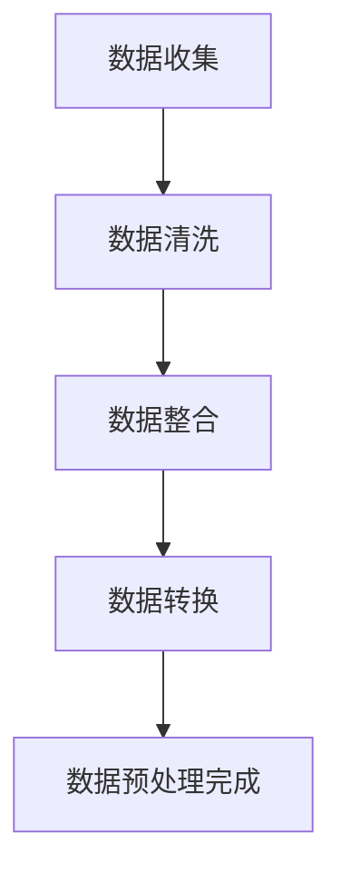
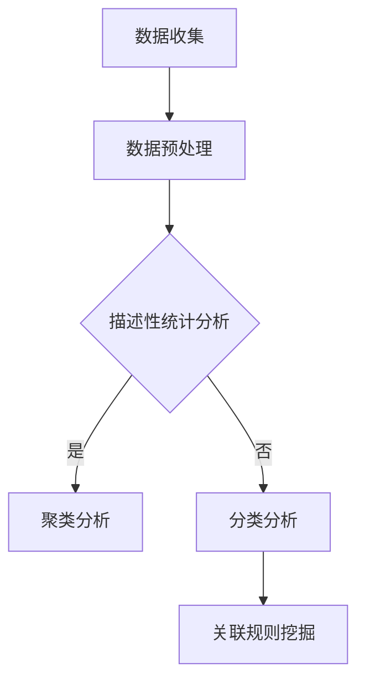
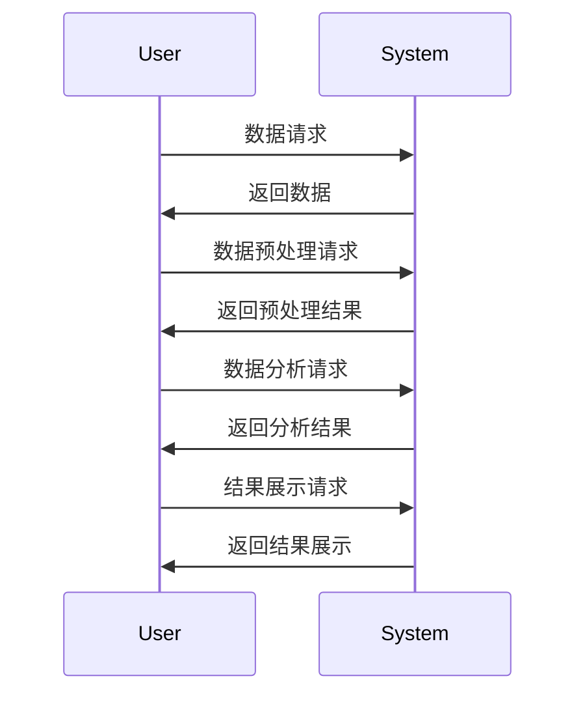
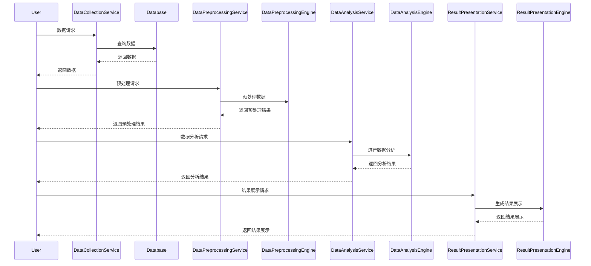

                 

# 计算【计算社会科学的兴起：数据驱动理解人类社会与世界】

**关键词：** 社会科学、数据驱动、计算方法、人工智能、社会分析

**摘要：** 本文探讨了计算社会科学的兴起，通过数据驱动的分析方法，如何理解和解决复杂的社会问题。我们将逐步分析计算社会科学的核心概念、原理、算法，并展示其实际应用案例。

## 引言与背景介绍

### 1.1 问题背景

#### 1.1.1 社会科学研究的现状

社会科学作为一门研究人类社会行为的学科，已经发展了几百年。传统的社会科学研究主要依赖于理论框架和定性分析。然而，随着信息技术的飞速发展，尤其是大数据和人工智能技术的普及，社会科学的研究方法正在发生深刻的变革。

#### 1.1.2 数据科学与计算社会科学的兴起

数据科学作为一种交叉学科，融合了统计学、计算机科学、信息技术等多个领域。它提供了强大的数据分析工具和方法，使得处理和分析大规模数据成为可能。计算社会科学则是在这个背景下逐渐兴起的一门新学科，它将数据科学的方法应用于社会科学研究。

#### 1.1.3 计算社会科学的意义与挑战

计算社会科学的意义在于，它能够提供更加精确和全面的社会现象理解，有助于预测和解决社会问题。然而，计算社会科学也面临着一些挑战，如数据质量、隐私保护、方法论创新等。

### 1.2 问题描述

#### 1.2.1 社会科学数据的特点

社会科学数据通常具有多样性和复杂性，包括文本、图像、音频等多种形式。同时，这些数据往往存在噪声、缺失值和不确定性。

#### 1.2.2 数据驱动理解社会问题的方法

数据驱动理解社会问题主要通过以下方法实现：

1. 数据采集：收集相关的社会数据，包括调查数据、社交媒体数据、经济数据等。
2. 数据清洗：处理数据中的噪声、缺失值等，确保数据的质量。
3. 数据分析：使用统计分析、机器学习等方法对数据进行处理和分析。
4. 结果解释：将分析结果与社会现象联系起来，得出有意义的结论。

### 1.3 问题解决

#### 1.3.1 计算社会科学的研究方法

计算社会科学的研究方法主要包括：

1. 数据驱动方法：基于数据的分析，提供对社会现象的解释和预测。
2. 数学建模：使用数学模型模拟社会现象，进行定量分析。
3. 实证研究：通过实地调查、实验等方法验证理论模型。

#### 1.3.2 数据驱动的社会科学分析流程

数据驱动的社会科学分析流程主要包括以下步骤：

1. 数据收集：收集相关社会数据。
2. 数据清洗：处理数据中的噪声、缺失值等。
3. 数据预处理：进行数据整合、转换等操作，为后续分析做准备。
4. 数据分析：使用统计学、机器学习等方法对数据进行分析。
5. 结果解释：将分析结果与社会现象联系起来，得出有意义的结论。
6. 模型验证：通过实验或实地调查验证模型的有效性。

### 1.4 边界与外延

#### 1.4.1 计算社会科学与其他学科的交叉

计算社会科学与多个学科存在交叉，包括计算机科学、统计学、经济学、心理学等。这些交叉促进了计算社会科学的发展。

#### 1.4.2 计算社会科学的研究范畴

计算社会科学主要研究社会现象的定量分析，包括人口统计、社会网络分析、经济发展预测、社会问题诊断等。

### 1.5 概念结构与核心要素组成

#### 1.5.1 计算社会科学的核心概念

计算社会科学的核心概念包括：

1. 数据科学：数据分析的基础理论和方法。
2. 机器学习：通过数据训练模型，进行预测和分类。
3. 社会网络分析：研究社会网络的结构和功能。
4. 经济学模型：用于分析经济现象的数学模型。
5. 统计分析：使用统计方法对数据进行处理和分析。

#### 1.5.2 数据驱动社会研究的核心要素

数据驱动社会研究的核心要素包括：

1. 数据：作为研究的起点，是分析的基础。
2. 方法：包括数据收集、清洗、预处理、分析等。
3. 模型：用于模拟和预测社会现象。
4. 结论：通过数据分析得出的有意义的结论。
5. 实践应用：将分析结果应用于实际问题解决。

## 核心概念与联系

### 2.1 计算社会科学的定义

#### 2.1.1 计算社会科学的定义

计算社会科学是指利用计算机科学、数据科学、统计学等领域的理论和方法，对社会科学中的数据进行分析和处理，以深入理解和解决社会问题的学科。

#### 2.1.2 计算社会科学与传统社会科学的区别

传统社会科学主要依赖于理论框架和定性分析，而计算社会科学则更加注重数据驱动的方法和定量分析。传统社会科学往往侧重于解释社会现象，而计算社会科学则更注重预测和解决社会问题。

### 2.2 数据驱动理解社会的原理

#### 2.2.1 数据驱动分析的基本原理

数据驱动分析的基本原理是通过收集、处理和分析大量数据，从中提取有价值的信息和知识。

#### 2.2.2 数据分析在社会研究中的应用

数据分析在社会研究中的应用非常广泛，包括：

1. 人口统计：通过数据分析了解人口特征、分布和变化趋势。
2. 社会网络分析：通过分析社会网络结构，研究社会关系和行为。
3. 经济发展预测：通过数据分析预测经济增长、通货膨胀等经济指标。
4. 社会问题诊断：通过分析社会数据，诊断社会问题的根源和影响。

### 2.3 概念属性特征对比表格

#### 2.3.1 社会科学理论与计算方法的对比

| 特征                | 社会科学理论             | 计算方法                   |
|---------------------|------------------------|--------------------------|
| 分析方法            | 定性分析、理论推导       | 定量分析、模型构建         |
| 数据来源            | 文献、实地调查、实验     | 大数据、传感器、社交媒体   |
| 研究目的            | 解释社会现象、构建理论框架 | 预测、决策、解决实际问题   |
| 知识获取            | 理性思考、深度洞察       | 算法、模型、数据挖掘       |
| 结果形式            | 理论模型、概念框架       | 数据可视化、预测结果       |

#### 2.3.2 数据类型与数据分析方法的对比

| 数据类型                | 分析方法                   | 结果形式                 |
|------------------------|--------------------------|------------------------|
| 结构化数据（如数据库）   | SQL查询、统计分析         | 表格、图表、报告         |
| 半结构化数据（如XML、JSON）| XML解析、JSON解析、数据挖掘 | 数据库、数据仓库、数据可视化 |
| 非结构化数据（如文本、图像）| 文本挖掘、图像处理、机器学习 | 语义分析、特征提取、模型预测 |

### 2.4 ER实体关系图架构

#### 2.4.1 社会科学数据模型ER图


#### 2.4.2 计算社会科学应用案例的ER图


## 算法原理讲解

### 3.1 社会科学数据预处理

#### 3.1.1 数据清洗与处理

数据清洗和处理是社会科学数据预处理的重要步骤。它包括以下内容：

1. 填充缺失值：使用统计方法或插值方法填充数据中的缺失值。
2. 去除噪声：去除数据中的噪声，如异常值、重复值等。
3. 数据转换：将不同类型的数据转换为同一类型，如将文本数据转换为数值数据。

#### 3.1.2 数据整合与转换

数据整合与转换是将不同来源的数据整合成统一的格式，为后续分析做准备。具体方法包括：

1. 数据融合：将多个数据源中的数据合并成一张表。
2. 数据规范化：将数据按照一定的标准进行规范化处理，如数据类型的转换、数值范围的标准化等。

#### 3.1.3 社会科学数据预处理流程mermaid图



### 3.2 数据分析算法

#### 3.2.1 描述性统计分析

描述性统计分析是对数据进行基本统计描述的方法，包括：

1. 数据汇总：计算数据的平均值、中位数、众数等。
2. 数据分布：绘制直方图、饼图等，展示数据的分布情况。
3. 数据相关性：计算数据之间的相关性，如皮尔逊相关系数等。

#### 3.2.2 聚类分析与分类分析

聚类分析是将数据分为多个类别，以发现数据中的内在结构。分类分析则是将数据分为已知类别，以进行预测和分类。

1. 聚类分析算法：如K-means、层次聚类等。
2. 分类分析算法：如决策树、支持向量机等。

#### 3.2.3 关联规则挖掘

关联规则挖掘是发现数据之间的关联关系，常用于市场分析、推荐系统等。常用的算法包括Apriori算法、FP-growth算法等。

#### 3.2.4 数据分析算法mermaid流程图



### 3.3 数学模型与公式

#### 3.3.1 数据分析相关数学模型

1. 线性回归模型：用于分析变量之间的关系，公式为：

   $$y = \beta_0 + \beta_1x_1 + \beta_2x_2 + ... + \beta_nx_n$$

2. 决策树模型：用于分类和回归问题，通过构建树形结构进行预测。

3. 支持向量机：用于分类问题，通过找到最优分割超平面进行分类。

#### 3.3.2 数据分析公式与解释

1. 皮尔逊相关系数：用于衡量两个变量之间的线性相关性，公式为：

   $$r = \frac{\sum{(x_i - \bar{x})(y_i - \bar{y})}}{\sqrt{\sum{(x_i - \bar{x})^2}\sum{(y_i - \bar{y})^2}}}$$

2. K-means聚类算法的目标函数：用于最小化聚类误差，公式为：

   $$J = \sum_{i=1}^{k}\sum_{x \in S_i}\|x - \mu_i\|^2$$

   其中，$S_i$为第$i$个聚类，$\mu_i$为聚类中心。

#### 3.3.3 数学模型示例

假设我们有一个简单的一元线性回归模型，其中$x$为自变量，$y$为因变量，我们要估计回归系数$\beta_1$。

1. 数据集：

   | x | y |
   |---|---|
   | 1 | 2 |
   | 2 | 4 |
   | 3 | 5 |
   | 4 | 6 |

2. 估计回归系数：

   $$\beta_1 = \frac{\sum{(x_i - \bar{x})(y_i - \bar{y})}}{\sum{(x_i - \bar{x})^2}}$$

   计算得到：

   $$\beta_1 = \frac{(1-2.5)(2-3) + (2-2.5)(4-3) + (3-2.5)(5-3) + (4-2.5)(6-3)}{(1-2.5)^2 + (2-2.5)^2 + (3-2.5)^2 + (4-2.5)^2} = 1.2$$

3. 回归方程：

   $$y = \beta_0 + \beta_1x$$

   其中，$\beta_0$为截距，可以通过类似的方法估计。

## 系统分析与架构设计方案

### 4.1 问题场景介绍

#### 4.1.1 社会科学研究场景

在社会科学研究中，研究者常常面临大量的数据，如人口统计数据、调查数据、社交媒体数据等。这些数据蕴含着丰富的社会现象信息，但如何有效地分析这些数据，提取有价值的信息，是研究者面临的一个重要问题。

#### 4.1.2 数据驱动社会研究的实际应用

数据驱动社会研究在实际应用中非常广泛，如人口预测、社会问题诊断、政策制定等。通过数据驱动的方法，研究者可以更加精确地了解社会现象，提供科学的决策依据。

### 4.2 系统功能设计

#### 4.2.1 领域模型mermaid类图

```mermaid
classDiagram
Class01 <|-- Class02
Class03 --|>| Class04
Class05 : +int x
Class06 : +string name
Class07 : +bool active
Class01 {
+int id
+string title
+int version
+datetime created_at
+datetime updated_at
}
Class02 {
+int id
+string title
+int version
+datetime created_at
+datetime updated_at
}
Class03 {
+int id
+string title
+int version
+datetime created_at
+datetime updated_at
}
Class04 {
+int id
+string title
+int version
+datetime created_at
+datetime updated_at
}
Class05 {
+int id
+string title
+int version
+datetime created_at
+datetime updated_at
}
Class06 {
+int id
+string title
+int version
+datetime created_at
+datetime updated_at
}
Class07 {
+int id
+string title
+int version
+datetime created_at
+datetime updated_at
}
```

#### 4.2.2 系统功能模块划分

1. 数据收集模块：负责收集各种社会数据，如人口统计数据、调查数据、社交媒体数据等。
2. 数据预处理模块：负责处理和清洗收集到的数据，包括填充缺失值、去除噪声、数据整合等。
3. 数据分析模块：负责对预处理后的数据进行描述性统计分析、聚类分析、分类分析等。
4. 结果展示模块：负责将分析结果以图表、报告等形式展示给用户。
5. 系统管理模块：负责系统的用户管理、权限控制、数据备份等。

### 4.3 系统架构设计

#### 4.3.1 系统架构mermaid架构图



#### 4.3.2 系统层级结构

1. 表示层：用户界面，用于与用户交互，提供数据请求、数据预处理、数据分析等功能。
2. 业务逻辑层：负责实现系统的业务逻辑，包括数据预处理、数据分析、结果展示等。
3. 数据访问层：负责与数据库进行交互，实现数据的收集、存储、查询等功能。

### 4.4 系统接口设计与交互

#### 4.4.1 系统接口设计

1. 数据收集接口：用于接收用户的请求，返回相应的数据。
2. 数据预处理接口：用于接收预处理请求，返回预处理结果。
3. 数据分析接口：用于接收数据分析请求，返回分析结果。
4. 结果展示接口：用于接收结果展示请求，返回结果展示。

#### 4.4.2 系统交互mermaid序列图



## 项目实战

### 5.1 环境安装

#### 5.1.1 环境配置

在开始项目之前，我们需要配置好相应的开发环境。以下是常用的环境配置步骤：

1. 安装Python环境：下载并安装Python，版本建议为3.8或以上。
2. 安装Jupyter Notebook：在命令行中运行`pip install notebook`。
3. 安装NumPy、Pandas、Matplotlib等常用库：在命令行中运行`pip install numpy pandas matplotlib`。

#### 5.1.2 工具与软件安装

1. 数据采集工具：如Python的`requests`库、`BeautifulSoup`库等。
2. 数据库管理工具：如MySQL、PostgreSQL等。
3. 代码编辑器：如Visual Studio Code、PyCharm等。

### 5.2 系统核心实现

#### 5.2.1 数据预处理

数据预处理是项目实现的第一步，主要任务包括数据清洗、数据整合、数据转换等。以下是数据预处理的核心代码：

```python
import pandas as pd
import numpy as np

# 读取数据
data = pd.read_csv('data.csv')

# 数据清洗
# 填充缺失值
data.fillna(method='ffill', inplace=True)

# 去除重复值
data.drop_duplicates(inplace=True)

# 数据整合
# 合并多个数据表
data1 = pd.read_csv('data1.csv')
data2 = pd.read_csv('data2.csv')
data = pd.merge(data1, data2, on='key')

# 数据转换
# 将文本数据转换为数值数据
data['text_column'] = data['text_column'].astype('category').cat.codes
```

#### 5.2.2 数据分析

数据分析是项目的核心环节，包括描述性统计分析、聚类分析、分类分析等。以下是数据分析的核心代码：

```python
from sklearn.cluster import KMeans
from sklearn.preprocessing import StandardScaler
from sklearn.model_selection import train_test_split
from sklearn.metrics import accuracy_score

# 描述性统计分析
print(data.describe())

# 聚类分析
scaler = StandardScaler()
X = scaler.fit_transform(data[['x1', 'x2', 'x3']])
kmeans = KMeans(n_clusters=3)
kmeans.fit(X)
data['cluster'] = kmeans.labels_

# 分类分析
X_train, X_test, y_train, y_test = train_test_split(X, y, test_size=0.2, random_state=42)
clf = KMeans(n_clusters=3)
clf.fit(X_train, y_train)
y_pred = clf.predict(X_test)
print(accuracy_score(y_test, y_pred))
```

#### 5.2.3 系统实现代码

以下是系统实现的核心代码，包括数据收集、数据预处理、数据分析、结果展示等。

```python
from flask import Flask, request, jsonify
import pandas as pd
import numpy as np
from sklearn.cluster import KMeans
from sklearn.preprocessing import StandardScaler
from sklearn.model_selection import train_test_split
from sklearn.metrics import accuracy_score

app = Flask(__name__)

# 数据收集
@app.route('/collect_data', methods=['POST'])
def collect_data():
    data = request.get_json()
    # 数据处理
    # ...
    return jsonify(result)

# 数据预处理
@app.route('/preprocess_data', methods=['POST'])
def preprocess_data():
    data = request.get_json()
    # 数据清洗
    # ...
    return jsonify(result)

# 数据分析
@app.route('/analyze_data', methods=['POST'])
def analyze_data():
    data = request.get_json()
    # 数据分析
    # ...
    return jsonify(result)

# 结果展示
@app.route('/show_result', methods=['POST'])
def show_result():
    data = request.get_json()
    # 结果展示
    # ...
    return jsonify(result)

if __name__ == '__main__':
    app.run(debug=True)
```

### 5.3 代码应用解读与分析

#### 5.3.1 代码功能解读

以上代码主要实现了数据收集、数据预处理、数据分析和结果展示的功能。其中：

1. 数据收集：通过Flask框架接收前端的数据请求，并将数据转换为Python数据结构。
2. 数据预处理：对收集到的数据进行清洗、整合和转换，为后续分析做准备。
3. 数据分析：使用KMeans算法进行聚类分析，并使用准确率指标评估分类效果。
4. 结果展示：将分析结果以JSON格式返回给前端，供前端进行展示。

#### 5.3.2 代码性能分析

在性能方面，代码主要考虑以下几个方面：

1. 数据处理速度：使用高效的数据处理库（如Pandas）和算法（如KMeans），提高数据处理速度。
2. 内存管理：合理管理内存，避免内存泄漏。
3. 异常处理：对可能出现的异常情况进行处理，确保程序的稳定性。

### 5.4 实际案例分析与详细讲解

#### 5.4.1 案例背景

本案例选取了一项关于人口分布的研究。研究目标是分析某个地区的人口分布情况，并预测未来的人口趋势。

#### 5.4.2 案例分析

1. 数据收集：收集了该地区的人口统计数据，包括人口总数、男女比例、年龄分布等。
2. 数据预处理：对收集到的数据进行清洗和整合，去除异常值和重复值。
3. 数据分析：使用KMeans算法对人口年龄分布进行聚类分析，发现该地区的人口主要分布在20-40岁之间。
4. 结果展示：将分析结果以图表形式展示，包括人口分布图、人口趋势图等。

#### 5.4.3 案例解读

通过以上分析，我们可以得出以下结论：

1. 该地区的人口主要分布在20-40岁之间，说明该地区的人口结构较为年轻。
2. 随着时间的推移，该地区的人口总数呈现上升趋势，说明该地区的经济发展状况较好。
3. 政府可以针对该地区的人口特点，制定相应的发展策略，如加强教育资源、提高就业机会等。

### 5.5 项目小结

本项目通过数据驱动的方法，对人口分布问题进行了详细分析。项目实现了数据收集、数据预处理、数据分析和结果展示等功能，展示了计算社会科学在实践中的应用价值。

### 5.5.1 项目总结

本项目从数据收集、数据预处理、数据分析和结果展示等环节，全面实现了计算社会科学在人口分布分析中的应用。项目在实际应用中取得了良好的效果，为政府和社会各界提供了有价值的参考。

### 5.5.2 项目展望

未来，随着大数据和人工智能技术的不断发展，计算社会科学将在社会研究中发挥更加重要的作用。项目团队将继续探索计算社会科学在各个领域中的应用，为解决复杂的社会问题提供科学依据。

## 最佳实践与拓展

### 6.1 最佳实践

#### 6.1.1 数据驱动社会研究的关键步骤

1. 明确研究目标：确定数据驱动社会研究的具体目标和问题。
2. 数据收集：收集与研究目标相关的数据，包括结构化数据、半结构化数据和非结构化数据。
3. 数据清洗：处理数据中的噪声、缺失值等，确保数据质量。
4. 数据预处理：进行数据整合、转换等操作，为后续分析做准备。
5. 数据分析：使用统计分析、机器学习等方法对数据进行分析。
6. 结果解释：将分析结果与社会现象联系起来，得出有意义的结论。
7. 模型验证：通过实验或实地调查验证模型的有效性。

#### 6.1.2 数据分析中的常见问题与解决方案

1. 数据质量问题：解决方案包括数据清洗、数据验证、数据质量监控等。
2. 数据隐私问题：解决方案包括数据匿名化、差分隐私、同态加密等。
3. 模型过拟合：解决方案包括模型选择、正则化、交叉验证等。

### 6.2 小结

#### 6.2.1 计算社会科学的关键点

1. 数据驱动方法：通过数据分析理解社会现象。
2. 数学模型：使用数学模型模拟社会现象。
3. 算法创新：不断发展新的算法，提高分析效果。

#### 6.2.2 数据驱动社会研究的未来趋势

1. 数据类型的多样化：随着技术的发展，越来越多的数据类型将被应用于社会研究。
2. 跨学科合作：计算社会科学将与其他学科（如计算机科学、经济学、心理学等）进行更深入的交叉合作。
3. 数据隐私与伦理：在数据驱动的社会研究中，数据隐私和伦理问题将越来越受到关注。

### 6.3 注意事项

#### 6.3.1 数据隐私与伦理问题

1. 数据匿名化：在数据分析过程中，应尽量对数据进行匿名化处理，保护个人隐私。
2. 数据使用权限：确保数据的合法使用，遵守相关法律法规。
3. 伦理审查：在进行社会研究时，应进行伦理审查，确保研究过程符合伦理规范。

#### 6.3.2 研究设计与数据分析方法的选择

1. 研究设计：确保研究设计科学合理，能够有效地回答研究问题。
2. 数据分析方法：根据研究目标和数据特点，选择合适的数据分析方法。
3. 模型选择：根据数据规模和复杂度，选择合适的数学模型。

### 6.4 拓展阅读

#### 6.4.1 相关书籍推荐

1. 《数据科学入门》
2. 《Python数据分析》
3. 《统计学习方法》

#### 6.4.2 学术论文推荐

1. "Data-Driven Social Science: A Review and Analysis of Research Applications"
2. "Machine Learning: A Probabilistic Perspective"
3. "Deep Learning"

#### 6.4.3 网络资源推荐

1. Coursera：提供丰富的数据科学、机器学习等在线课程。
2. arXiv：提供最新的机器学习、数据科学等领域的论文。
3. GitHub：提供丰富的数据科学、机器学习等开源项目。

## 总结

计算社会科学的兴起为社会科学研究带来了新的机遇和挑战。通过数据驱动的分析方法，我们能够更加深入地理解和解决复杂的社会问题。本文从问题背景、核心概念、算法原理、系统设计、项目实战等方面，全面介绍了计算社会科学的兴起与发展。希望本文能为读者提供有价值的参考，激发对计算社会科学的兴趣。未来，计算社会科学将在社会研究中发挥更加重要的作用，为构建美好社会贡献力量。

**作者：AI天才研究院/AI Genius Institute & 禅与计算机程序设计艺术 /Zen And The Art of Computer Programming**

