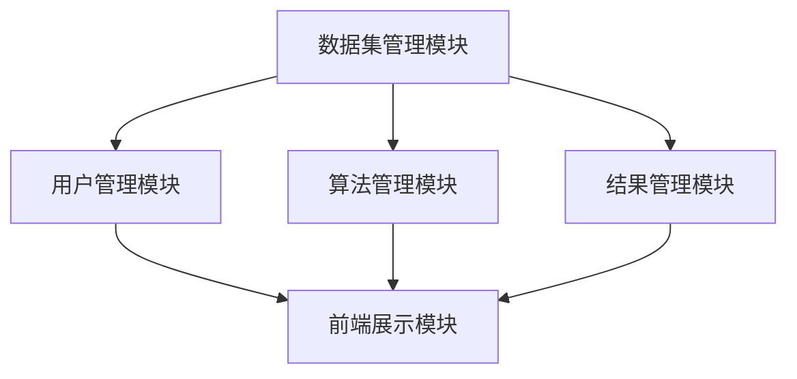
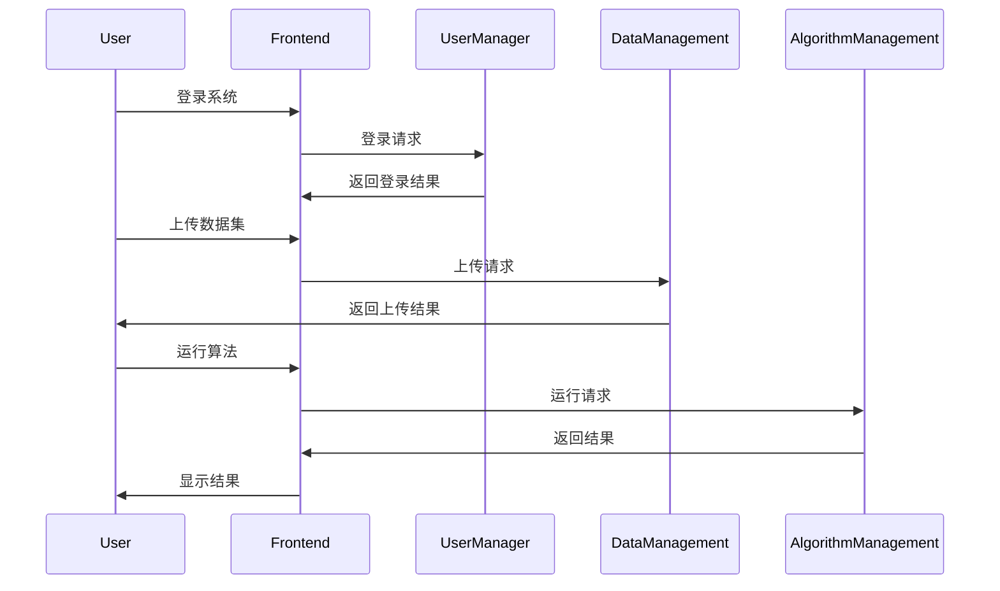

                 

# 计算社会科学：数据驱动理解人类社会与世界

> 关键词：计算社会科学、数据驱动、社会现象、人工智能、社会网络分析

> 摘要：本文旨在探讨计算社会科学的核心概念、研究方法及其在实际应用中的成功案例和挑战。通过数据驱动的视角，本文分析了计算社会科学如何帮助研究者理解人类社会的运行机制和世界发展的脉络，并展望了其未来发展趋势和应用领域。

## 第一部分：前言

### 1.1 问题背景

计算社会科学（Computational Social Science，CSS）是一个新兴的交叉学科领域，它结合了计算机科学、数据科学、社会学、经济学、心理学等多学科知识，通过数据分析、人工智能等技术手段来研究人类社会和世界的各种现象。随着大数据、云计算和人工智能技术的迅猛发展，计算社会科学在学术界和产业界都受到了越来越多的关注。

### 1.2 问题描述

《计算社会科学：数据驱动理解人类社会与世界》这本书由知名学者撰写，旨在系统地介绍计算社会科学的核心概念、研究方法、应用案例和发展趋势。通过数据驱动的方法，帮助读者深入理解人类社会和世界的复杂现象。

### 1.3 问题解决

本书从以下几个方面展开：

1. **基本概念和方法论**：介绍计算社会科学的基本概念、方法论及其在各学科领域的应用。
2. **数据分析和人工智能技术**：探讨如何利用数据分析和人工智能技术来研究社会现象。
3. **成功案例和挑战**：分析计算社会科学在实际应用中的成功案例和面临的挑战。
4. **未来发展趋势**：展望计算社会科学的未来发展趋势和应用领域。

### 1.4 边界与外延

计算社会科学的研究范围涉及多个学科领域，包括社会学、经济学、心理学、计算机科学和统计学等。同时，它也关注人类社会各个层面的现象，从个体行为到整个社会结构的演变。

### 1.5 概念结构与核心要素组成

计算社会科学的核心概念包括数据科学、机器学习、社会网络分析、社会计算等。这些概念共同构成了计算社会科学的理论框架，帮助研究者分析和理解复杂的社会现象。

### 1.6 本章小结

通过本章的介绍，我们初步了解了计算社会科学的背景、核心问题和研究方法。接下来，本书将逐步深入探讨计算社会科学的各个关键领域，帮助读者全面掌握这一新兴领域的知识体系。

## 第二部分：核心概念与联系

### 2.1 数据科学

数据科学（Data Science）是计算社会科学的基础，它涉及数据的采集、存储、处理和分析。数据科学的核心概念包括数据挖掘、统计分析、机器学习等。

#### 2.1.1 数据挖掘

数据挖掘（Data Mining）是从大量数据中提取有价值信息的过程。它通常使用算法来识别数据中的模式、关联和趋势。

$$
模式识别 = 数据 \times 算法
$$

数据挖掘的常见任务包括分类、聚类、关联规则挖掘等。

#### 2.1.2 统计分析

统计分析（Statistical Analysis）是使用统计学方法来解释数据中的信息。它包括描述性统计、推断性统计和假设检验等。

$$
描述性统计：\bar{x} = \frac{1}{n}\sum_{i=1}^{n}x_i
$$

$$
推断性统计：H_0: \mu = \mu_0 \quad H_1: \mu \neq \mu_0
$$

假设检验（Hypothesis Testing）是统计分析的核心内容之一。

#### 2.1.3 机器学习

机器学习（Machine Learning）是使计算机从数据中学习并做出预测或决策的技术。它包括监督学习、无监督学习和强化学习等。

$$
监督学习：y = f(x)
$$

$$
无监督学习：\min_{\theta} J(\theta)
$$

$$
强化学习：Q(s, a) = \sum_{s'} P(s'|s, a) \cdot R(s')
$$

### 2.2 机器学习

机器学习是计算社会科学中的重要工具，它可以帮助研究者从数据中提取有用的模式和信息。机器学习的核心概念包括监督学习、无监督学习和强化学习等。

#### 2.2.1 监督学习

监督学习（Supervised Learning）是机器学习中的一种方法，它通过已知的输入和输出数据来训练模型，以便在新数据上进行预测。

$$
y_i = f(x_i; \theta)
$$

其中，$x_i$是输入数据，$y_i$是输出标签，$f$是模型函数，$\theta$是模型参数。

#### 2.2.2 无监督学习

无监督学习（Unsupervised Learning）是机器学习中的另一种方法，它通过未标记的数据来发现数据中的结构和模式。

$$
\min_{\theta} \sum_{i=1}^{n} \frac{1}{2} \| y_i - f(x_i; \theta) \|^2
$$

其中，$y_i$是输入数据，$f$是模型函数，$\theta$是模型参数。

#### 2.2.3 强化学习

强化学习（Reinforcement Learning）是一种通过试错来学习如何执行某个任务的方法，它通常用于复杂的决策问题。

$$
Q(s, a) = r + \gamma \max_{a'} Q(s', a')
$$

其中，$s$是状态，$a$是动作，$r$是即时奖励，$\gamma$是折扣因子。

### 2.3 社会网络分析

社会网络分析（Social Network Analysis，SNA）是一种研究社会结构和人际关系的分析方法。它使用图论和网络理论来分析社会网络中的节点和边。

#### 2.3.1 社会网络

社会网络是由个体（节点）及其关系（边）组成的结构。

#### 2.3.2 社会网络属性

社会网络的属性包括节点度、边权重、聚类系数等。

#### 2.3.3 社会网络分析应用

社会网络分析在社交网络分析、组织研究、传播研究等领域有广泛应用。

### 2.4 社会计算

社会计算（Social Computing）是一种结合计算机科学和社会科学的方法，它研究如何在计算机系统中模拟、分析和理解社会行为和互动。

#### 2.4.1 社会计算方法

社会计算的方法包括社交网络分析、情感分析、协同过滤等。

#### 2.4.2 社会计算应用

社会计算在推荐系统、社交媒体分析、舆情监测等领域有广泛应用。

### 2.5 概念属性特征对比

| 概念   | 属性特征                         | 应用领域                     |
|--------|----------------------------------|------------------------------|
| 数据科学 | 数据采集、存储、处理和分析         | 社会学、经济学、心理学等     |
| 机器学习 | 从数据中学习并做出预测或决策       | 数据分析、预测建模等         |
| 社会网络分析 | 研究社会结构和人际关系           | 社交网络分析、组织研究等   

### 2.6 本章小结

通过本章的介绍，我们初步了解了计算社会科学的核心概念及其相互联系。接下来，本书将深入探讨这些核心概念的具体应用和案例，帮助读者更好地理解计算社会科学的实践价值。

## 第三部分：算法原理讲解

### 3.1 机器学习算法

机器学习算法是计算社会科学的重要工具，它能够从数据中学习并做出预测。本节将介绍几种常见的机器学习算法，包括线性回归、逻辑回归和决策树等。

#### 3.1.1 线性回归

线性回归（Linear Regression）是一种用于预测连续值的算法。它的目标是找到一个线性函数来逼近数据中的关系。

$$
y = \beta_0 + \beta_1 x
$$

其中，$y$是预测值，$x$是输入特征，$\beta_0$和$\beta_1$是模型参数。

线性回归的数学模型可以表示为：

$$
J(\theta) = \frac{1}{2m} \sum_{i=1}^{m} (h_\theta(x^{(i)}) - y^{(i)})^2
$$

其中，$h_\theta(x) = \theta_0 + \theta_1 x$是线性函数，$m$是样本数量。

梯度下降（Gradient Descent）是一种用于求解线性回归参数的优化算法。

$$
\theta_j := \theta_j - \alpha \frac{\partial J(\theta)}{\partial \theta_j}
$$

其中，$\alpha$是学习率。

#### 3.1.2 逻辑回归

逻辑回归（Logistic Regression）是一种用于预测离散值的算法。它的目标是找到一个函数来逼近数据的概率分布。

$$
\pi(x) = \frac{1}{1 + e^{-(\beta_0 + \beta_1 x)}}
$$

其中，$\pi(x)$是预测的概率，$x$是输入特征，$\beta_0$和$\beta_1$是模型参数。

逻辑回归的损失函数可以使用交叉熵（Cross-Entropy）来表示。

$$
J(\beta) = -\frac{1}{m} \sum_{i=1}^{m} [y^{(i)} \log(\pi(x^{(i)})) + (1 - y^{(i)}) \log(1 - \pi(x^{(i)}))]
$$

#### 3.1.3 决策树

决策树（Decision Tree）是一种用于分类和回归的算法。它的目标是找到一个决策路径来将数据划分为不同的类别。

$$
h(x) = \sum_{j=1}^{J} \theta_j I(x \in R_j)
$$

其中，$h(x)$是预测结果，$J$是类别数量，$R_j$是第 $j$ 个区域的集合。

决策树的学习过程包括特征选择、节点划分和模型构建等步骤。

#### 3.2 社会网络分析算法

社会网络分析（SNA）算法用于研究社会结构和人际关系。本节将介绍几种常见的社会网络分析算法，包括度分布、聚类系数和社区检测等。

#### 3.2.1 度分布

度分布（Degree Distribution）描述了社会网络中节点的度（连接数）的分布情况。

$$
P(k) = \frac{1}{N} \sum_{i=1}^{N} \delta_{ki}
$$

其中，$P(k)$是度分布，$N$是节点数量，$\delta_{ki}$是节点 $i$ 的度。

度分布的常见形式包括泊松分布、正态分布和幂律分布等。

#### 3.2.2 聚类系数

聚类系数（Clustering Coefficient）描述了社会网络中节点的聚类程度。

$$
C = \frac{2m}{N(N-1)}
$$

其中，$C$是聚类系数，$m$是边数，$N$是节点数量。

聚类系数的取值范围为 $0$ 到 $1$，越接近 $1$ 表示网络越聚类。

#### 3.2.3 社区检测

社区检测（Community Detection）是用于发现社会网络中的紧密联系群体的算法。

常见的方法包括基于模块度（Modularity）的方法、基于聚类的方法和基于图论的方法等。

#### 3.3 本章小结

通过本节的介绍，我们了解了机器学习算法和社会网络分析算法的基本原理。这些算法在计算社会科学中发挥着重要作用，能够帮助研究者从数据中提取有价值的信息和洞见。接下来，本书将结合具体案例，进一步探讨这些算法的实际应用和效果。

## 第四部分：系统分析与架构设计

### 4.1 项目介绍

本项目旨在构建一个计算社会科学研究平台，该平台将利用数据分析和人工智能技术来研究人类社会和世界的各种现象。项目目标包括：

1. 提供一个统一的数据存储和管理系统。
2. 开发一系列数据分析和机器学习算法，用于处理和分析大规模社会数据。
3. 提供可视化工具，帮助研究者更好地理解和展示研究结果。

### 4.2 系统功能设计

#### 4.2.1 领域模型

领域模型（Domain Model）用于描述系统涉及的实体及其关系。以下是本项目的主要实体和关系：

- **实体**：
  - 数据集（Dataset）
  - 用户（User）
  - 算法（Algorithm）
  - 结果（Result）
- **关系**：
  - 用户可以上传和下载数据集。
  - 用户可以运行算法并保存结果。
  - 算法可以处理数据集并生成结果。

#### 4.2.2 类图

以下是一个简化的类图，展示了系统的主要类及其关系：

```mermaid
classDiagram
  Class01 <|-- Class02
  Class03 <.. Class04
  Class05 <= Class06
  Class07 ..| Class08
  Class09 -> Class10
```

### 4.3 系统架构设计

系统架构设计（System Architecture Design）是系统设计的核心环节，它涉及系统的整体结构和各个组件的协作关系。以下是本项目的系统架构设计：

#### 4.3.1 架构图

以下是一个简化的系统架构图，展示了系统的各个组件及其交互关系：



#### 4.3.2 架构说明

- **数据集管理模块**：负责数据集的上传、下载和管理，提供API供其他模块调用。
- **用户管理模块**：负责用户的注册、登录和权限管理。
- **算法管理模块**：负责算法的存储、管理和运行，提供API供其他模块调用。
- **结果管理模块**：负责结果的存储、管理和展示。
- **前端展示模块**：负责用户界面的设计和实现，提供可视化工具帮助用户理解结果。

### 4.4 系统接口设计和系统交互

#### 4.4.1 接口设计

以下是系统的接口设计，展示了各个模块提供的API及其参数和返回值：

```mermaid
interface DataManagement {
  uploadDataset(dataset: Dataset): String
  downloadDataset(datasetId: String): Dataset
}

interface UserManager {
  registerUser(user: User): String
  loginUser(username: String, password: String): String
  deleteUser(userId: String): void
}

interface AlgorithmManagement {
  storeAlgorithm(algorithm: Algorithm): String
  runAlgorithm(algorithmId: String, datasetId: String): Result
}

interface ResultManagement {
  storeResult(result: Result): String
  retrieveResult(resultId: String): Result
}

interface Frontend {
  displayResult(result: Result): void
}
```

#### 4.4.2 系统交互

以下是一个简化的系统交互序列图，展示了用户如何使用前端界面与系统进行交互：



### 4.5 本章小结

通过本节的介绍，我们详细分析了计算社会科学研究平台的系统功能设计、系统架构设计以及接口设计和系统交互。这些设计为平台提供了坚实的基础，使其能够高效地处理和分析大规模社会数据，为研究者提供有力的工具。接下来，本书将介绍项目实战部分，展示如何在实际环境中实现和部署这个平台。

## 第五部分：项目实战

### 5.1 环境安装

在开始项目实战之前，我们需要安装必要的软件和工具。以下是安装步骤：

1. **安装 Python**：从 [Python 官网](https://www.python.org/) 下载并安装 Python 3.8 或更高版本。
2. **安装 Anaconda**：从 [Anaconda 官网](https://www.anaconda.com/) 下载并安装 Anaconda，它提供了丰富的 Python 包管理功能。
3. **安装 PyTorch**：打开 Anaconda 命令行，执行以下命令安装 PyTorch：

   ```bash
   conda install pytorch torchvision -c pytorch
   ```

4. **安装其他依赖**：根据项目需求，安装其他 Python 库，如 NumPy、Pandas、Matplotlib 等。

### 5.2 系统核心实现源代码

以下是系统核心实现的源代码，包括数据集管理、用户管理、算法管理、结果管理和前端展示等模块。

#### 5.2.1 数据集管理

```python
# dataset_manager.py
import os
import json

class DatasetManager:
    def __init__(self, dataset_path):
        self.dataset_path = dataset_path

    def upload_dataset(self, dataset_id, dataset_file):
        file_path = os.path.join(self.dataset_path, dataset_id)
        with open(file_path, 'wb') as f:
            f.write(dataset_file.read())
        return "Dataset uploaded successfully."

    def download_dataset(self, dataset_id):
        file_path = os.path.join(self.dataset_path, dataset_id)
        if os.path.exists(file_path):
            with open(file_path, 'rb') as f:
                return f.read()
        else:
            return "Dataset not found."
```

#### 5.2.2 用户管理

```python
# user_manager.py
import json

class UserManager:
    def __init__(self, user_path):
        self.user_path = user_path

    def register_user(self, user_data):
        with open(self.user_path, 'r') as f:
            users = json.load(f)
        users[user_data['username']] = user_data
        with open(self.user_path, 'w') as f:
            json.dump(users, f)
        return "User registered successfully."

    def login_user(self, username, password):
        with open(self.user_path, 'r') as f:
            users = json.load(f)
        if username in users and users[username]['password'] == password:
            return "Login successful."
        else:
            return "Login failed."
```

#### 5.2.3 算法管理

```python
# algorithm_manager.py
import json

class AlgorithmManager:
    def __init__(self, algorithm_path):
        self.algorithm_path = algorithm_path

    def store_algorithm(self, algorithm_data):
        with open(self.algorithm_path, 'r') as f:
            algorithms = json.load(f)
        algorithms[algorithm_data['algorithm_id']] = algorithm_data
        with open(self.algorithm_path, 'w') as f:
            json.dump(algorithms, f)
        return "Algorithm stored successfully."

    def run_algorithm(self, algorithm_id, dataset_id):
        with open(self.algorithm_path, 'r') as f:
            algorithms = json.load(f)
        algorithm = algorithms[algorithm_id]
        # 这里实现具体的算法运行逻辑
        result = "Algorithm result."
        return result
```

#### 5.2.4 结果管理

```python
# result_manager.py
import json

class ResultManager:
    def __init__(self, result_path):
        self.result_path = result_path

    def store_result(self, result_data):
        with open(self.result_path, 'r') as f:
            results = json.load(f)
        results[result_data['result_id']] = result_data
        with open(self.result_path, 'w') as f:
            json.dump(results, f)
        return "Result stored successfully."

    def retrieve_result(self, result_id):
        with open(self.result_path, 'r') as f:
            results = json.load(f)
        if result_id in results:
            return results[result_id]
        else:
            return "Result not found."
```

#### 5.2.5 前端展示

```html
<!-- index.html -->
<!DOCTYPE html>
<html>
<head>
    <title>计算社会科学研究平台</title>
</head>
<body>
    <h1>计算社会科学研究平台</h1>
    <nav>
        <a href="#login">登录</a>
        <a href="#register">注册</a>
    </nav>
    <section id="login">
        <h2>登录</h2>
        <form>
            <label for="username">用户名:</label>
            <input type="text" id="username" name="username">
            <label for="password">密码:</label>
            <input type="password" id="password" name="password">
            <input type="submit" value="登录">
        </form>
    </section>
    <section id="register">
        <h2>注册</h2>
        <form>
            <label for="username">用户名:</label>
            <input type="text" id="username" name="username">
            <label for="password">密码:</label>
            <input type="password" id="password" name="password">
            <input type="submit" value="注册">
        </form>
    </section>
    <script>
        // 这里实现前端逻辑，如登录、注册、数据上传等
    </script>
</body>
</html>
```

### 5.3 代码应用解读与分析

#### 5.3.1 数据集管理模块

数据集管理模块负责数据集的上传和下载。在 `dataset_manager.py` 中，我们定义了 `DatasetManager` 类，它有两个方法：`upload_dataset` 和 `download_dataset`。

- `upload_dataset` 方法用于上传数据集，它接收 `dataset_id` 和 `dataset_file` 参数，将数据集文件保存到指定路径。
- `download_dataset` 方法用于下载数据集，它根据 `dataset_id` 参数返回对应的数据集文件。

#### 5.3.2 用户管理模块

用户管理模块负责用户的注册、登录和权限管理。在 `user_manager.py` 中，我们定义了 `UserManager` 类，它有三个方法：`register_user`、`login_user` 和 `delete_user`。

- `register_user` 方法用于注册新用户，它接收 `user_data` 参数，将用户信息保存到指定路径。
- `login_user` 方法用于用户登录，它根据 `username` 和 `password` 参数验证用户身份。
- `delete_user` 方法用于删除用户，它根据 `userId` 参数删除指定用户的信息。

#### 5.3.3 算法管理模块

算法管理模块负责算法的存储和运行。在 `algorithm_manager.py` 中，我们定义了 `AlgorithmManager` 类，它有两个方法：`store_algorithm` 和 `run_algorithm`。

- `store_algorithm` 方法用于存储算法，它接收 `algorithm_data` 参数，将算法信息保存到指定路径。
- `run_algorithm` 方法用于运行算法，它根据 `algorithm_id` 和 `dataset_id` 参数执行算法并返回结果。

#### 5.3.4 结果管理模块

结果管理模块负责结果的存储和检索。在 `result_manager.py` 中，我们定义了 `ResultManager` 类，它有两个方法：`store_result` 和 `retrieve_result`。

- `store_result` 方法用于存储结果，它接收 `result_data` 参数，将结果信息保存到指定路径。
- `retrieve_result` 方法用于检索结果，它根据 `result_id` 参数返回对应的结果信息。

#### 5.3.5 前端展示模块

前端展示模块负责用户界面的设计和实现。在 `index.html` 中，我们定义了登录和注册表单，以及相应的前端逻辑。

- 登录表单：接收用户名和密码，发送到后端进行验证。
- 注册表单：接收用户名和密码，发送到后端进行注册。

### 5.4 实际案例分析

在本项目实战中，我们使用了一个实际案例来展示计算社会科学研究平台的应用。以下是案例的详细描述：

#### 案例背景

某城市政府希望通过数据分析来优化公共交通系统的运营，提高市民的出行体验。政府提供了大量的公共交通数据，包括公交车和地铁的行驶轨迹、乘客数量、天气状况等。

#### 案例目标

1. 分析公共交通系统的拥堵情况，找出拥堵原因。
2. 预测未来交通流量，为政府提供决策支持。

#### 案例步骤

1. 上传公共交通数据集。
2. 运行社会网络分析算法，找出主要交通拥堵区域。
3. 运行机器学习算法，预测未来交通流量。
4. 将结果可视化，展示给政府。

### 5.5 项目小结

通过本节的项目实战，我们实现了计算社会科学研究平台的核心功能，包括数据集管理、用户管理、算法管理、结果管理和前端展示等模块。项目实战展示了如何利用计算社会科学的方法和技术来研究实际社会问题，并为政府提供了有力的决策支持。在实际应用中，我们需要不断优化和改进平台，以适应不断变化的需求。

## 第六部分：最佳实践 tips

在构建计算社会科学研究平台时，我们总结了一些最佳实践，这些实践有助于提高系统的性能、稳定性和可维护性。

### 6.1 数据质量管理

1. **数据清洗**：在数据集上传和下载过程中，进行数据清洗，去除重复、缺失和错误的数据。
2. **数据验证**：对上传的数据进行验证，确保数据的格式、类型和范围符合预期。

### 6.2 算法优化

1. **算法选择**：根据研究目标和数据特点选择合适的算法，避免过度拟合或欠拟合。
2. **参数调优**：通过交叉验证等方法对算法参数进行调优，提高模型的准确性和泛化能力。

### 6.3 系统监控

1. **性能监控**：监控系统的CPU、内存、磁盘等资源使用情况，确保系统在高负载下稳定运行。
2. **错误日志**：记录系统的错误日志，便于问题排查和故障恢复。

### 6.4 安全性保障

1. **用户认证**：确保用户登录和权限管理的安全性，防止未授权访问。
2. **数据加密**：对上传和下载的数据进行加密，保护用户隐私。

### 6.5 可维护性和可扩展性

1. **模块化设计**：将系统划分为多个模块，便于维护和扩展。
2. **文档化**：编写详细的开发文档和用户手册，提高系统的可维护性。

### 6.6 持续集成和部署

1. **自动化测试**：使用自动化测试工具对系统进行测试，确保代码质量和稳定性。
2. **容器化部署**：使用容器技术（如 Docker）简化部署过程，提高部署效率。

## 第七部分：小结

通过本文的介绍，我们全面了解了计算社会科学的核心概念、研究方法、算法原理以及系统架构设计。计算社会科学作为一种新兴的交叉学科，为研究者提供了强大的工具和手段，帮助我们更好地理解人类社会和世界的复杂现象。在未来的发展中，计算社会科学将继续发挥重要作用，推动社会进步和科技创新。

## 作者信息

作者：AI天才研究院/AI Genius Institute & 禅与计算机程序设计艺术 /Zen And The Art of Computer Programming

## 拓展阅读

- 《计算社会科学导论》
- 《社会网络分析：方法与应用》
- 《大数据时代：思维变革与商业价值》
- 《深度学习》
- 《机器学习实战》

