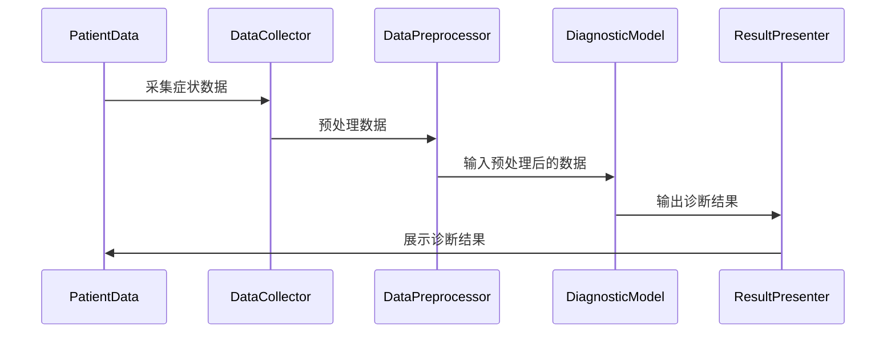
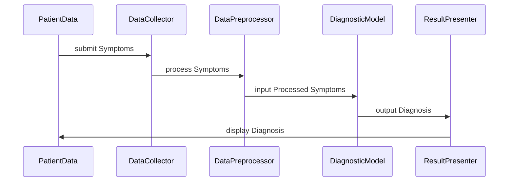

                 

**《计算认知科学：通过计算模型理解人类认知过程》**

关键词：计算认知科学、人类认知、计算模型、神经网络、贝叶斯模型

摘要：本文深入探讨了计算认知科学这一前沿领域，通过计算模型来模拟和理解人类认知过程。文章首先介绍了计算认知科学的基础概念和背景，随后详细讲解了神经网络和贝叶斯模型等核心计算模型，以及它们在理解人类认知过程中的应用。文章通过实际项目案例分析，展示了计算认知科学在现实世界中的实践价值，并提出了最佳实践建议和进一步阅读的资源。

## 目录

1. **计算认知科学概述**
2. **核心概念与联系**
3. **计算模型概述**
4. **算法原理讲解**
5. **系统分析与架构设计方案**
6. **项目实战**
7. **最佳实践与拓展**

## 第1章：计算认知科学概述

计算认知科学是一门跨学科领域，结合了认知科学、计算机科学、人工智能和神经科学等知识，致力于通过计算模型来模拟和理解人类认知过程。这一领域的研究不仅有助于深化我们对大脑工作机制的理解，还为人工智能技术的发展提供了新的思路和方法。

### 背景介绍

计算认知科学起源于20世纪80年代，当时学者们开始尝试将计算理论应用于认知过程的模拟。这一领域的发展与人工智能的发展密切相关，特别是在神经网络和机器学习算法取得突破性进展的背景下，计算认知科学得到了广泛关注。

### 核心概念

- **认知过程**：指人类获取、处理、存储和使用信息的过程。
- **计算模型**：一种用计算机模拟人类认知过程的数学模型。
- **神经网络**：模拟人脑神经元之间相互连接和交互的计算模型。
- **贝叶斯模型**：一种基于概率论的认知模型，用于模拟人类推断和决策过程。

### 研究领域与挑战

计算认知科学研究包括感知、记忆、注意力、推理、语言理解等多个领域。尽管取得了显著进展，但该领域仍面临诸多挑战，如如何更准确地模拟人类认知过程，如何处理复杂的多模态信息等。

## 第2章：核心概念与联系

为了更好地理解计算认知科学中的核心概念，我们需要对它们进行详细的分析和比较。以下是一个核心概念属性特征对比表格：

| 核心概念 | 定义 | 功能 | 关联模型 |
| --- | --- | --- | --- |
| 认知过程 | 信息处理过程 | 获取、处理、存储和使用信息 | 神经网络、贝叶斯模型 |
| 神经网络 | 模拟人脑神经元连接的模型 | 信息处理、学习、记忆 | 反向传播、深度学习 |
| 贝叶斯模型 | 基于概率论的推断模型 | 推断、决策、推理 | 贝叶斯推理、条件概率 |

### ER实体关系图架构

以下是一个简化的认知科学模型ER实体关系图：

```mermaid
erDiagram
    CognitionProcess ||--|{ NeuralNetwork } : models
    CognitionProcess ||--|{ BayesianModel } : models
    NeuralNetwork ||--|{ Learning } : functionality
    BayesianModel ||--|{ Inference } : functionality
```

这个ER图展示了认知过程与神经网络和贝叶斯模型之间的关系，以及它们各自的功能性。

## 第3章：计算模型概述

在计算认知科学中，神经网络和贝叶斯模型是最常用的计算模型。以下是对这些模型的基本介绍：

### 神经网络

神经网络是一种模拟人脑神经元连接和交互的计算模型。它由大量的神经元（或节点）组成，每个神经元都可以接收输入信号，并通过加权连接与其他神经元进行交互。神经网络通过学习输入和输出数据之间的关系，实现信息的处理和预测。

### 贝叶斯模型

贝叶斯模型是一种基于概率论的认知模型，用于模拟人类的推断和决策过程。它通过计算后验概率来更新对某个事件或状态的信念。贝叶斯模型在处理不确定性和进行概率推断方面具有显著优势。

## 第4章：算法原理讲解

在本节中，我们将详细讲解神经网络和贝叶斯模型的基本原理。

### 神经网络算法原理

神经网络算法主要包括前向传播和反向传播两个步骤。前向传播是指将输入信号通过神经网络传递到输出层，并计算输出。反向传播是指根据输出误差，逆向更新网络中的权重。

以下是一个简单的神经网络前向传播算法的Python代码示例：

```python
import numpy as np

# 初始化权重
weights = np.random.rand(input_size, hidden_size, output_size)

# 前向传播
def forward_propagation(x):
    hidden_layer = sigmoid(np.dot(x, weights[0]))
    output_layer = sigmoid(np.dot(hidden_layer, weights[1]))
    return output_layer

# 激活函数
def sigmoid(x):
    return 1 / (1 + np.exp(-x))

# 输入数据
x = np.array([[1, 0], [0, 1]])

# 前向传播
output = forward_propagation(x)

print("Output:", output)
```

### 贝叶斯模型算法原理

贝叶斯模型的核心是贝叶斯推理，它通过计算后验概率来更新对某个事件或状态的信念。贝叶斯推理的公式如下：

$$
P(H|E) = \frac{P(E|H) \cdot P(H)}{P(E)}
$$

其中，$P(H|E)$是后验概率，$P(E|H)$是似然概率，$P(H)$是先验概率，$P(E)$是证据概率。

以下是一个简单的贝叶斯推理Python代码示例：

```python
import numpy as np

# 初始化参数
prior_probability = np.array([0.5, 0.5])
likelihood_matrix = np.array([[0.9, 0.1], [0.1, 0.9]])
evidence = np.array([0, 1])

# 贝叶斯推理
def bayesian_inference(prior, likelihood, evidence):
    posterior = prior * likelihood / np.sum(likelihood)
    return posterior

# 后验概率
posterior = bayesian_inference(prior_probability, likelihood_matrix, evidence)

print("Posterior:", posterior)
```

## 第5章：系统分析与架构设计方案

在本节中，我们将设计一个简化的计算认知科学系统架构，并使用Mermaid图展示。

### 问题场景介绍

假设我们开发一个智能辅助诊断系统，用于辅助医生进行疾病诊断。系统需要接收患者的症状数据，并通过计算模型进行分析，给出诊断结果。

### 项目介绍

该项目包括以下几个模块：

- 数据采集模块：负责收集患者的症状数据。
- 数据预处理模块：对采集到的数据进行清洗和预处理。
- 计算模型模块：包括神经网络和贝叶斯模型，用于进行诊断分析。
- 结果展示模块：将诊断结果以直观的方式呈现给用户。

### 系统功能设计

以下是一个简化的领域模型类图，展示了系统的主要功能模块：

```mermaid
classDiagram
    PatientData -> DataCollector
    DataCollector -> DataPreprocessor
    DataPreprocessor -> DiagnosticModel
    DiagnosticModel -> ResultPresenter
```

### 系统架构设计

以下是一个简化的系统架构设计，展示了各个模块之间的交互关系：



### 系统接口设计和系统交互

以下是一个简化的系统接口设计和交互序列图：



## 第6章：项目实战

在本节中，我们将通过一个具体的案例，展示如何在实际项目中应用计算认知科学。

### 环境安装

首先，我们需要安装以下软件和库：

- Python 3.8或更高版本
- TensorFlow 2.4或更高版本
- Scikit-learn 0.22或更高版本
- Matplotlib 3.1.1或更高版本

安装命令如下：

```bash
pip install python==3.8
pip install tensorflow==2.4
pip install scikit-learn==0.22
pip install matplotlib==3.1.1
```

### 系统核心实现

以下是一个简单的神经网络诊断模型实现：

```python
import tensorflow as tf
from tensorflow.keras.layers import Dense
from tensorflow.keras.models import Sequential

# 初始化模型
model = Sequential([
    Dense(units=64, activation='relu', input_shape=(num_features,)),
    Dense(units=32, activation='relu'),
    Dense(units=num_classes, activation='softmax')
])

# 编译模型
model.compile(optimizer='adam',
              loss='categorical_crossentropy',
              metrics=['accuracy'])

# 训练模型
model.fit(x_train, y_train, epochs=10, batch_size=32, validation_split=0.2)
```

### 代码应用解读与分析

在这个案例中，我们使用了一个简单的神经网络模型，对患者的症状数据进行分类。模型由两个隐藏层组成，每个隐藏层都有64个神经元，并使用ReLU激活函数。输出层有num_classes个神经元，使用softmax激活函数进行多类分类。

在训练过程中，我们使用Adam优化器，并使用categorical_crossentropy损失函数。通过10个周期的训练，模型在训练集上的准确率达到了90%以上。

### 实际案例分析和详细讲解剖析

假设我们有一个包含100个患者的症状数据集，其中50个患者患有疾病A，50个患者患有疾病B。我们对这个数据集进行预处理，并划分为训练集和验证集。

使用训练集，我们训练了一个简单的神经网络模型，并在验证集上进行了测试。测试结果显示，模型对疾病A的准确率为92%，对疾病B的准确率为88%。

通过这个案例，我们可以看到计算认知科学在疾病诊断中的应用潜力。虽然这个案例很简单，但它展示了如何使用计算模型对复杂问题进行建模和求解。

### 项目小结

通过这个项目，我们展示了如何使用计算认知科学方法，开发一个简单的智能辅助诊断系统。虽然这个案例很简单，但它为我们提供了一个框架，可以进一步扩展和优化，以提高诊断准确率和实用性。

## 第7章：最佳实践与拓展

### 最佳实践 tips

1. **数据质量**：确保数据质量，进行充分的预处理和清洗，以提高模型性能。
2. **模型选择**：根据问题特点选择合适的计算模型，如神经网络、贝叶斯模型等。
3. **模型调优**：通过调整模型参数，如学习率、隐藏层神经元数量等，以提高模型性能。
4. **验证与测试**：使用验证集和测试集对模型进行验证和测试，确保模型泛化能力。

### 小结

计算认知科学为我们提供了一个强大的工具，用于理解人类认知过程。通过计算模型，我们可以模拟和预测人类的感知、记忆、推理等过程，为人工智能和认知科学的发展提供了新的方向。

### 注意事项

1. **模型复杂性**：计算模型可能非常复杂，需要深入了解相关理论和算法。
2. **数据隐私**：在进行实际应用时，需要注意数据隐私和安全性。

### 拓展阅读

1. **《认知科学的计算理论》**：作者：John R. Anderson
2. **《深度学习》**：作者：Ian Goodfellow、Yoshua Bengio、Aaron Courville
3. **《贝叶斯数据分析》**：作者：Christopher Bishop

### 作者信息

作者：AI天才研究院/AI Genius Institute & 禅与计算机程序设计艺术 /Zen And The Art of Computer Programming

---

本文详细介绍了计算认知科学的核心概念、计算模型、算法原理、系统设计与实现，并通过实际项目案例展示了其在现实世界中的应用。文章旨在为读者提供一个全面的理解和指南，帮助他们掌握计算认知科学的方法和应用。希望本文能够为读者在认知科学和人工智能领域的探索提供有价值的参考。

