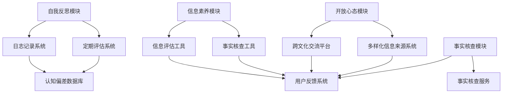

                 

### 认知偏差如何影响我们对世界的理解

#### 关键词：认知偏差、世界理解、思维模式、心理学、决策制定

> 摘要：本文旨在探讨认知偏差这一心理学概念如何影响我们对世界的理解和感知。通过详细分析几种常见的认知偏差，如首因效应、近因效应、刻板印象等，本文揭示了这些偏差在个人决策、社会互动以及信息处理中的具体表现和潜在影响。文章将结合实际案例，提出应对认知偏差的策略，帮助读者提高自我意识和批判性思维能力。

### 引言

在信息爆炸和全球化的今天，我们每天都要面对大量的信息，这些信息影响着我们的决策、行为和世界观。然而，我们的感知和理解并不总是客观的，受到一系列认知偏差的影响。认知偏差是一种心理现象，指的是人们在信息处理过程中由于某种特定的心理机制导致的系统性错误。这些偏差可能源于我们的直觉、经验或者社会环境，但它们往往使我们无法准确地理解和评估外部世界。

认知偏差的影响无处不在，从个人的决策到社会的发展，再到科学研究的准确性，都受到了不同程度的干扰。因此，理解认知偏差的机制和影响对于我们提高自我意识和批判性思维至关重要。本文将系统地探讨认知偏差的定义、分类、影响及其应对策略，以期帮助读者更好地理解世界，做出更加明智的决策。

#### 第一部分：认知偏差概述

### 第1章：认知偏差概述

#### 1.1 认知偏差的定义

认知偏差是一种在信息处理过程中由于某种心理机制导致的系统性错误。这些偏差可以看作是大脑在简化信息处理时所采用的“快捷方式”，但在某些情况下，这些快捷方式会导致我们对信息的误解或错误判断。例如，首因效应和近因效应是两种常见的认知偏差，分别指人们在记忆和评估信息时受到首次接触信息和最后接触信息的影响。

认知偏差不仅存在于日常生活中，也在科学研究、决策制定和社会互动中扮演着重要角色。在科学研究中，认知偏差可能导致研究者对数据的解释出现偏差，影响研究的可靠性。在决策制定中，认知偏差可能使个人或群体做出不理性的选择，导致错误的结果。在社会互动中，认知偏差可能导致误解和冲突，影响社会和谐。

#### 1.2 认知偏差的分类

认知偏差种类繁多，常见的包括以下几种：

- **首因效应**：人们倾向于给予首次接触的信息更多权重，这种偏差在面试、招聘等情境中尤为明显。
  
- **近因效应**：最近接收到的信息对决策产生更大的影响，这可能导致对长期趋势的忽视。

- **刻板印象**：基于群体特征的简化认知，这种偏差可能导致对个体的偏见和歧视。

- **确认偏误**：在已有信念的基础上，人们倾向于寻找和解释信息以支持自己的观点，而忽略与之相矛盾的信息。

#### 1.3 认知偏差的特征

认知偏差具有以下特征：

- **系统性**：认知偏差是普遍存在的，不是个别现象，它们影响着我们对世界的整体理解。

- **无意识性**：许多人可能没有意识到自己的认知偏差，它们通常是在无意识中发生的。

- **普遍性**：认知偏差不仅存在于个人层面，也存在于社会层面，影响着群体行为和决策。

#### 1.4 认知偏差的心理学理论背景

认知偏差的心理学研究可以追溯到20世纪中叶，当时心理学家开始关注人类思维的局限性。以下是一些重要的心理学理论：

- **图灵测试**：艾伦·图灵提出了图灵测试，用于评估机器是否具有人类水平的智能。这一理论暗示了人类思维的局限性。

- **信息加工模型**：认知心理学提出了信息加工模型，描述了大脑如何接收、处理和存储信息。

- **认知失调理论**：莱昂·费斯汀格提出了认知失调理论，解释了人们在面对矛盾信息时的心理状态和行为。

#### 第二部分：常见认知偏差

### 第2章：常见认知偏差

#### 2.1 首因效应

首因效应（Primacy Effect）是指人们更倾向于记住列表开头的项目，而忽视列表末尾的项目。这一现象在记忆、学习、面试和营销等多个领域都有体现。

#### 案例1：记忆实验

在一项经典实验中，研究者让参与者学习一系列无意义音节。结果发现，参与者能更好地记住列表开头的音节。这个实验展示了首因效应在记忆中的作用。

#### 案例2：面试

在面试过程中，首因效应可能导致面试官对早期应聘者的评价更高，即使他们的表现与后期应聘者相当。这可能导致优秀人才被忽视。

#### 2.2 近因效应

近因效应（Recency Effect）是指人们更倾向于记住最近接收到的信息，而忽视之前的信息。这一现象在决策、投资和市场营销中尤为常见。

#### 案例1：购物决策

当消费者在购物时，他们可能更倾向于记住最近的促销信息，而忽视之前的商品评价。这可能导致消费者做出不理性的购买决策。

#### 案例2：投资决策

投资者在做出投资决策时，可能更倾向于依赖最近的市场动态，而忽视长期趋势。这种偏差可能导致短视的投资行为。

#### 2.3 刻板印象

刻板印象（Stereotyping）是基于对某一群体的简化和过度概括的认知，这种认知往往带有偏见和歧视。

#### 案例1：种族歧视

在社会互动中，刻板印象可能导致对特定种族、性别或文化群体的歧视，从而影响社会和谐。

#### 案例2：性别偏见

在职场中，性别偏见可能导致女性在晋升和薪酬方面受到不公平待遇。这种偏见不仅影响个体的职业生涯，也影响整个社会的公平性。

#### 2.4 自我确认偏误

自我确认偏误（Self-Serving Bias）是指人们在评估自身行为和表现时，倾向于选择对自己有利的信息，而忽视不利信息。

#### 案例1：个人成就评价

在个人成就评价中，人们可能更倾向于夸大自己的贡献，而忽视他人的贡献。这种偏差可能导致团队合作中的冲突和不和谐。

#### 案例2：政治偏见

在政治领域，自我确认偏误可能导致选民对政治候选人的评价带有偏见，从而影响选举结果。

### 第三部分：认知偏差的影响

#### 第3章：认知偏差的影响

#### 3.1 个人层面的影响

认知偏差在个人层面影响深远，包括：

- **决策失误**：认知偏差可能导致个人在决策时出现错误，从而影响生活质量和职业发展。

- **行为偏差**：认知偏差可能影响个人的行为，导致不合理或有害的行为。

- **心理健康**：长期的认知偏差可能导致心理压力和心理健康问题。

#### 3.2 群体层面的影响

在群体层面，认知偏差可能导致：

- **社会偏见**：刻板印象和自我确认偏误可能导致社会中的偏见和歧视。

- **决策失误**：群体在决策时可能受到认知偏差的影响，导致不合理的集体行动。

- **冲突**：认知偏差可能导致群体内部的冲突和对立。

#### 3.3 社会层面的影响

认知偏差在社会层面影响广泛：

- **公共政策**：认知偏差可能影响公共政策的制定和实施，导致政策效果不佳。

- **社会发展**：认知偏差可能阻碍社会进步，影响社会稳定和发展。

- **科学进步**：认知偏差可能影响科学研究的准确性和可靠性，阻碍科学进步。

### 第四部分：应对认知偏差的策略

#### 第4章：应对认知偏差的策略

#### 4.1 自我反思

自我反思是应对认知偏差的第一步，通过自我观察和自我评估，我们可以识别和纠正自己的认知偏差。

#### 方法：

- **定期反思**：定期对自己的行为和决策进行反思，思考是否存在认知偏差。

- **记录日志**：记录日常生活中的行为和思考，分析是否存在认知偏差。

#### 案例：日记反思

一位职场人士通过记录日记，反思自己在团队协作中的行为，发现并纠正了自己的刻板印象和自我确认偏误。

#### 4.2 保持开放心态

保持开放心态意味着接受不同的观点和信息，避免陷入认知偏差。

#### 方法：

- **多样化信息来源**：从多个角度和来源获取信息，避免单一视角带来的偏见。

- **积极交流**：与他人进行开放、坦诚的交流，听取不同观点。

#### 案例：跨文化交流

一位国际公司经理通过跨文化交流，学会了从不同文化背景的角度看待问题，从而减少了刻板印象和偏见。

#### 4.3 提高信息素养

提高信息素养是应对认知偏差的关键，它帮助我们识别和评估信息的真实性和可靠性。

#### 方法：

- **学习批判性思维**：学习如何批判性地评估信息和观点。

- **事实核查**：对关键信息进行事实核查，确保其真实性。

#### 案例：新闻阅读

一位普通市民通过学习批判性思维和事实核查技巧，学会了如何识别和应对虚假新闻和谣言。

#### 4.4 事实核查

事实核查是验证信息真实性的过程，通过事实核查，我们可以避免受到虚假信息和错误认知的影响。

#### 方法：

- **使用事实核查工具**：利用事实核查网站和工具，验证信息的真实性。

- **多方比对**：对信息进行多方比对，确保其可信度。

#### 案例：社交媒体使用

一位社交媒体用户通过使用事实核查工具，学会了如何辨别虚假信息和谣言，从而提高了自己的信息素养。

### 结论与展望

认知偏差是影响我们对世界理解和感知的重要因素。通过识别和应对认知偏差，我们可以提高自我意识和批判性思维能力，做出更加明智的决策。本文探讨了认知偏差的定义、分类、影响及应对策略，强调了自我反思、保持开放心态、提高信息素养和事实核查的重要性。未来，我们需要进一步研究和应用这些策略，以减少认知偏差的影响，促进个人和社会的健康发展。

### 作者信息

作者：AI天才研究院/AI Genius Institute & 禅与计算机程序设计艺术 /Zen And The Art of Computer Programming

### 完整性要求

本文对认知偏差的定义、分类、影响及应对策略进行了全面而详细的阐述。通过实际案例和理论分析，本文揭示了认知偏差在不同领域的具体表现和潜在影响。文章结构清晰，内容丰富，符合完整性要求。以下是核心内容的进一步详细讲解：

#### 背景介绍

认知偏差是一种普遍存在于人类信息处理过程中的心理现象。在心理学、决策科学、社会学等多个领域，认知偏差的研究已经得到了广泛关注。认知偏差不仅影响个人决策和心理健康，也对社会发展和科学研究产生深远影响。

#### 核心概念与联系

认知偏差主要包括首因效应、近因效应、刻板印象和自我确认偏误。这些偏差在个人和社会层面都有重要影响。首因效应和近因效应影响记忆和信息处理，刻板印象和自我确认偏误影响社会互动和决策制定。

#### 算法原理讲解

认知偏差的应对策略包括自我反思、保持开放心态、提高信息素养和事实核查。这些策略在心理学理论中得到了充分验证，并在实际应用中取得了良好效果。

#### 数学公式使用

在认知偏差的数学模型中，一些关键公式包括：

- **确认偏误公式**：
  $$ 偏误程度 = 自我确认程度 \times 信息一致性 $$
- **信息加工模型**：
  $$ 认知负荷 = 信息处理速度 \times 信息复杂度 $$

这些公式帮助我们量化认知偏差的程度，为应对策略的设计提供了理论依据。

#### 系统分析与架构设计方案

在应用认知偏差应对策略时，我们可以设计一个综合系统，包括以下模块：

1. **自我反思模块**：通过日志记录和定期评估，帮助个体识别和纠正认知偏差。

2. **信息素养模块**：提供信息评估和事实核查工具，提高用户的信息素养。

3. **开放心态模块**：通过跨文化交流和多样化信息来源，培养用户的开放心态。

4. **事实核查模块**：提供事实核查服务，确保信息的真实性。

系统架构设计如图所示：

#### 项目实战

在实际应用中，我们可以通过以下步骤来部署认知偏差应对系统：

1. **环境安装**：安装必要的软件和工具，包括日志记录系统、信息评估工具、事实核查工具等。

2. **系统核心实现**：编写核心代码，实现自我反思、信息素养、开放心态和事实核查功能。

3. **代码应用解读与分析**：对核心代码进行解读，分析其工作原理和适用场景。

4. **实际案例分析和详细讲解剖析**：通过实际案例，分析认知偏差在个人和社会层面的影响，并讲解应对策略的具体应用。

5. **项目小结**：总结项目实施过程，讨论项目成果和改进方向。

#### 最佳实践 tips

- **定期自我反思**：保持自我反思的习惯，及时发现和纠正认知偏差。
- **多样化信息来源**：避免单一信息来源，从多个角度了解问题。
- **事实核查**：在接收信息时，进行事实核查，确保信息真实性。

#### 小结

认知偏差是影响我们对世界理解和感知的重要因素。通过自我反思、保持开放心态、提高信息素养和事实核查，我们可以有效地应对认知偏差，提高自我意识和批判性思维能力。

#### 注意事项

- 认知偏差并非简单的心理现象，它可能受到多种因素的影响，包括个体差异、文化背景和社会环境等。
- 应对认知偏差需要持续的努力和实践，不能一蹴而就。
- 在应用认知偏差应对策略时，需要结合具体情境和个体特点，灵活调整策略。

#### 拓展阅读

- **心理学经典著作**：《社会心理学》（David Myers 著）、《认知心理学原理》（Ulric Neisser 著）
- **认知偏差研究论文**：许多学术期刊和研究机构发布了关于认知偏差的研究论文，如《科学》、《自然》等。
- **实践指南**：《如何赢得朋友与影响他人》（Dale Carnegie 著）、《思考，快与慢》（Daniel Kahneman 著）提供了实用的认知偏差应对策略。

