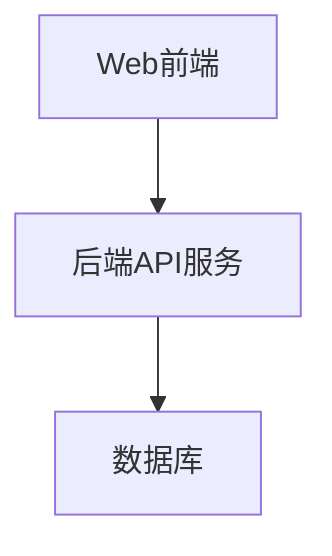
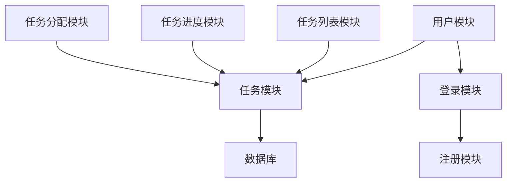

                 

### 引言

#### 认知地图的概念、重要性及本书目标

认知地图（Cognitive Map）是一个源自认知心理学和地理学领域的重要概念，最早由心理学家C.S. Peirce和哲学家Charles Sanders Peirce提出。认知地图是一种抽象的心理模型，用于表示个体对环境、知识和信息的理解和组织。通过认知地图，个体能够更好地导航、规划和解决问题。

在信息技术和人工智能领域，思维可视化（Mind Mapping）作为一种重要的工具，已成为提升个人和组织工作效率、创新能力和解决问题的有力手段。思维可视化通过图形化的方式，将复杂的知识和信息结构以直观、易于理解的形式呈现出来，有助于提高记忆、理解和创造力。

《认知地图工作坊：思维可视化的创新技巧》旨在为广大读者提供一个系统化、全面化的思维可视化学习和实践指南。本书将从以下几个方面展开：

1. **认知地图概述**：介绍认知地图的定义、类型及其在信息组织和知识管理中的重要性。
2. **思维可视化的基础**：探讨视觉认知原理、心理学基础以及思维可视化与创造力的关系。
3. **认知地图的绘制技巧**：详细讲解手绘和软件绘制认知地图的方法和技巧。
4. **思维可视化的创新应用**：展示思维可视化在教育和工作领域中的应用案例。
5. **最佳实践与注意事项**：分享思维可视化的最佳实践技巧、注意事项及未来发展方向。

通过本书的学习，读者不仅能够掌握认知地图和思维可视化的基本原理，还能将其应用于实际问题解决中，提高工作效率和创新能力。

### 第1章：认知地图概述

#### 认知地图的定义、类型及其重要性

认知地图是一种用于表示个体对环境、知识和信息的理解和组织方式的心理模型。它起源于地理学，后来被认知心理学广泛采用。认知地图的核心思想是，个体通过创建和更新认知地图来理解复杂的环境和情境，从而进行有效的导航、规划和决策。

**1.1 认知地图的定义**

认知地图可以被定义为一种内在的心理图像或框架，它帮助我们组织、存储和处理信息，形成一个关于环境、知识和信息的抽象表示。这种表示不仅包括物理空间信息，如位置、路径和边界，还包括抽象概念、关系和知识结构。

**1.2 认知地图的类型**

认知地图可以分为多种类型，根据其表示的信息和组织方式的不同，可以有以下几种分类：

1. **文字型认知地图**：以文字为主，通过关键词、短语和句子来组织信息。这种类型的认知地图常见于笔记、文档和记忆术中。
2. **图像型认知地图**：以图像为主，通过图形、符号和颜色来表示信息。这种类型的认知地图在思维导图中非常常见，有助于提高信息的视觉识别和记忆。
3. **多媒体认知地图**：结合文字、图像、音频和视频等多种媒介来表示信息。这种类型的认知地图能够在不同感官层面提供信息，增强记忆和理解效果。

**1.3 认知地图的重要性**

认知地图在信息组织和知识管理中具有重要作用，主要体现在以下几个方面：

1. **信息组织**：认知地图能够帮助我们将大量的信息进行分类、整理和整合，形成结构化的知识体系。
2. **知识管理**：通过认知地图，我们可以更好地存储、检索和共享知识，提高信息利用效率。
3. **问题解决**：认知地图能够帮助我们理清思路，分析问题，找到解决方案。
4. **创新思维**：认知地图提供了直观的信息表示方式，有助于激发创造性思维和创新的产生。
5. **教育和培训**：认知地图在教育领域中的应用，可以帮助学生更好地理解和记忆知识，提高学习效果。

**1.4 认知地图的组成部分**

一个典型的认知地图通常包括以下几个组成部分：

1. **中心主题**：认知地图的核心，通常是一个关键词或短语，表示整体的主题或目标。
2. **分支**：从中心主题延伸出的主要分支，表示主要的分类或概念。
3. **子分支**：从分支延伸出的次级分支，表示更详细的信息或概念。
4. **链接**：连接各个分支和子分支的线或箭头，表示它们之间的关系。
5. **图形和符号**：用于增强信息的视觉识别和记忆效果。

通过了解认知地图的定义、类型及其重要性，我们可以更好地理解和应用这一工具，提高信息组织和知识管理的能力。

#### 认知地图与传统思维导图的对比

认知地图（Cognitive Map）和思维导图（Mind Map）虽然在形式上相似，但它们在应用场景、结构和目的上有着显著的差异。以下是对两者进行详细对比：

**1. 应用场景**

- **认知地图**：认知地图主要应用于导航、规划和决策等领域。它帮助个体理解环境、组织和处理空间信息，是一个心理上的抽象模型。认知地图在地理学、城市规划、军事行动等需要空间感知和决策的场景中具有重要应用。
  
- **思维导图**：思维导图则是一种图形化的思考工具，主要用于个人和组织的信息组织、问题解决、创意产生和项目管理等领域。它通过分支结构和关键词链接，帮助个体或团队梳理思路，促进创造性思维和高效沟通。

**2. 结构**

- **认知地图**：认知地图的结构通常较为抽象和复杂。它包括中心主题、主要分支、次级分支以及它们之间的链接。这些分支和链接不一定遵循线性的结构，可以呈现出网状或树状结构，以适应不同情境的需求。

- **思维导图**：思维导图的结构通常更加直观和层次分明。它以中心主题为核心，向外延伸出多个主要分支和次级分支，每个分支代表一个主题或概念。这种结构有助于快速捕捉和整理信息，便于理解和记忆。

**3. 目的**

- **认知地图**：认知地图的主要目的是帮助个体理解和组织复杂的环境和信息。它有助于个体在导航和规划过程中，建立心理模型，提高决策效率。

- **思维导图**：思维导图的主要目的是促进思考和创意的产生。它通过图形化的方式，将复杂的信息以视觉形式呈现，有助于激发个体的创造性思维，提高信息处理和沟通效果。

**4. 关联与区别**

- **关联**：认知地图和思维导图在形式上都使用图形化的方式表示信息，都具有结构化和层次化的特点，能够帮助个体更好地理解和记忆信息。

- **区别**：认知地图更侧重于空间感知和决策支持，是一个心理上的抽象模型；而思维导图则更注重信息组织和创意产生，是一个可视化的思考工具。

通过以上对比，我们可以看出，认知地图和思维导图虽然在某些方面有重叠，但它们在实际应用中有着不同的侧重和目的。了解这两者的区别，有助于我们根据具体情况选择合适的工具来提升信息处理和解决问题的能力。

#### 认知地图的应用领域

认知地图作为一种强大的信息组织和知识管理工具，在多个领域展现出显著的应用效果。以下是认知地图在几个主要领域中的应用：

**1. 教育领域**

在教育教学过程中，认知地图可以帮助教师和学生更好地理解和记忆复杂的知识点。教师可以利用认知地图设计课程大纲和教案，使学生能够更清晰地把握知识结构。例如，在历史课上，教师可以用认知地图展示不同历史时期的重要事件和人物，帮助学生建立时间线和逻辑关系。此外，学生也可以利用认知地图进行学习笔记的整理，将课本内容以视觉化的方式呈现，从而提高学习效果和记忆力。

**2. 工作领域**

在工作场景中，认知地图可以用于项目管理和团队协作。项目经理可以通过认知地图梳理项目任务、目标和资源分配，确保项目进展的清晰和有序。认知地图还能够帮助团队成员更好地理解项目的整体架构和分工，促进协作和沟通。例如，在软件开发项目中，认知地图可以用来表示模块之间的关系、需求和功能，帮助开发团队快速定位和解决问题。

**3. 创意设计**

在创意设计领域，认知地图是激发灵感和提升创意的重要工具。设计师可以通过认知地图探索不同设计方案的可行性，将各种创意元素以图形化的方式连接起来，形成完整的创意框架。例如，在产品设计过程中，设计师可以利用认知地图梳理用户需求、功能和技术，从而设计出更具创新性和用户导向的产品。

**4. 逻辑思维训练**

认知地图在逻辑思维训练中也具有重要作用。通过绘制认知地图，个体可以系统地分析问题和解决问题，提高逻辑推理能力。认知地图能够帮助个体理清思路，将复杂的信息进行结构化处理，从而找到问题的核心和解决策略。

**5. 决策支持**

认知地图在决策过程中可以起到重要的辅助作用。通过认知地图，决策者能够更全面地考虑各种因素，评估不同方案的优缺点，从而做出更明智的决策。例如，在商业决策中，认知地图可以帮助企业家分析市场趋势、竞争对手、潜在风险等，制定科学的战略规划。

综上所述，认知地图在多个领域都具有广泛的应用，不仅有助于提高信息组织和知识管理能力，还能够促进创新思维和问题解决能力的发展。

### 1.5 认知地图的组成部分

认知地图作为一种强大的信息组织和知识管理工具，其结构和组成部分决定了其在不同应用场景中的表现效果。一个典型的认知地图通常包含以下几个关键部分：

**1. 中心主题**

中心主题是认知地图的核心，它通常表示整体的主题或目标。中心主题通常用一个大圆圈或方块来表示，位于认知地图的中心位置。中心主题的设定有助于在整个认知地图中建立统一的焦点，确保所有分支和子分支都围绕这一核心展开。

**2. 分支**

分支是从中心主题延伸出的主要分支，表示主要的分类或概念。每个分支通常用线条或箭头从中心主题向外延伸，并附有一个关键词或短语。分支的数量和内容根据认知地图的具体用途和需求而变化。良好的分支结构有助于清晰地展示信息的层级和关系。

**3. 子分支**

子分支是从分支延伸出的次级分支，用于表示更详细的信息或概念。子分支进一步细分了分支的内容，增加了认知地图的层次感。子分支通常也用线条或箭头连接到上一级分支，并在旁边附有相关的关键词或短语。子分支的数量和深度取决于认知地图的复杂度和详细程度。

**4. 链接**

链接是连接各个分支和子分支的线或箭头，用于表示它们之间的关系。链接不仅使认知地图的结构更加完整，还帮助个体理解不同部分之间的相互联系。通过链接，认知地图能够呈现出一种网络结构，使得复杂的信息在视觉上更加直观和易于理解。

**5. 图形和符号**

图形和符号是认知地图中的重要元素，用于增强信息的视觉识别和记忆效果。图形可以包括图标、符号、图片等，而符号则可以是各种标记、标签或颜色。这些元素有助于将抽象的信息以直观的形式呈现，使得认知地图更加生动和具有吸引力。例如，使用不同颜色表示不同类型的概念，或者使用图标表示关键事件或功能。

通过以上组成部分的有机结合，认知地图能够有效地帮助个体理解和组织复杂的信息。在实际应用中，不同类型的认知地图可能会根据具体需求调整其结构和组成，但上述基本部分是构建有效认知地图的基础。

### 第2章：思维可视化的基础

#### 视觉认知原理、心理学基础及其在思维可视化中的应用

思维可视化是一种通过图形化的方式表示思维过程和知识结构的工具，其基础离不开对视觉认知原理和心理学基础的理解。在这一章中，我们将深入探讨视觉认知原理、心理学基础以及思维可视化与创造力的关系，以帮助读者更好地掌握和应用思维可视化。

**2.1 视觉认知原理**

视觉认知是指人类如何通过视觉系统感知、处理和理解外部世界的认知过程。以下是几个关键的视觉认知原理：

1. **视觉感知**：视觉感知是指人类如何通过眼睛接收和处理光线信息，将其转化为可以理解的视觉信号。视觉感知受多种因素影响，包括光线条件、观察者的生理特征和心理状态。

2. **视觉记忆**：视觉记忆是指人类如何记忆和回忆视觉信息。视觉记忆可以分为瞬时记忆和长期记忆。瞬时记忆通常只能保持几秒钟，而长期记忆可以持续数分钟到数十年。视觉记忆的关键在于如何有效地编码和提取信息。

3. **视觉识别**：视觉识别是指人类如何识别和区分不同的视觉元素，如颜色、形状、大小和纹理。视觉识别依赖于大脑对视觉信息的分析和综合处理。

4. **视觉注意力**：视觉注意力是指人类如何选择关注特定的视觉信息，忽略其他不重要的信息。视觉注意力对信息处理和理解至关重要，因为大脑无法同时处理所有视觉信息。

**2.2 心理学基础**

心理学基础为思维可视化提供了理论支持，以下是几个重要的心理学概念：

1. **认知负荷**：认知负荷是指大脑处理信息时所承受的负担。过高的认知负荷可能导致信息处理效率下降。思维可视化通过减少文字信息，提供直观的图形表示，有助于降低认知负荷。

2. **记忆曲线**：记忆曲线是指记忆信息随时间推移而衰退的规律。艾宾浩斯遗忘曲线表明，如果不进行复习，大部分信息会在短时间内被遗忘。思维可视化通过图形化的方式增强信息的记忆效果，有助于长期记忆。

3. **联想记忆**：联想记忆是指通过将新信息与已知信息建立联系来记忆。思维可视化利用图形和符号，帮助个体建立信息之间的联想，从而提高记忆效果。

4. **情绪影响**：情绪对认知过程有显著影响。积极情绪有助于提高信息处理效率和创造力，而消极情绪则可能阻碍认知过程。思维可视化通过创造性的视觉表达，激发积极的情绪反应，有助于提升创造力。

**2.3 思维可视化与创造力的关系**

思维可视化与创造力之间存在密切的关系。以下是几个方面的探讨：

1. **激发创造性思维**：思维可视化通过直观的图形表示，激发个体的创造性思维。图形化的方式使得抽象概念变得具体和形象，有助于个体从不同角度思考问题，产生新的想法。

2. **促进信息整合**：思维可视化有助于个体整合各种信息，形成更加完整和系统的知识结构。通过将信息以图形化的方式呈现，个体能够更好地理解信息之间的联系，从而整合新信息和已有知识。

3. **提升思维灵活性**：思维可视化鼓励个体尝试不同的思路和解决方案，提高思维的灵活性。图形化的表示方式使得个体可以轻松地调整和重构信息结构，探索不同的可能性。

4. **增强问题解决能力**：思维可视化通过帮助个体清晰地分析和理解问题，提升问题解决能力。通过图形化的方式，个体能够更好地识别问题的核心，制定有效的解决方案。

总之，思维可视化作为视觉认知和心理学基础的应用，不仅有助于提高信息处理和记忆效果，还能够激发创造性思维和创新能力。通过理解视觉认知原理和心理学基础，我们可以更有效地应用思维可视化，提升个人和组织的创造力。

#### 视觉认知原理

视觉认知是指人类如何通过视觉系统感知、处理和理解外部世界的认知过程。这一过程涉及多个层面，包括感知、记忆、识别和注意力。以下是对视觉认知原理的详细探讨：

**1. 感知**

感知是视觉认知的第一步，它涉及眼睛接收光线并将其转化为电信号的过程。当光线进入眼睛，经过角膜和晶状体的折射后，最终在视网膜上形成图像。视网膜上的感光细胞（视杆细胞和视锥细胞）将这些图像信息转化为电信号，并通过视神经传递到大脑。

感知过程中，几个关键因素影响信息的处理：

- **光线条件**：光线强度、亮度和对比度对感知有重要影响。在低光照环境下，视觉感知能力会下降。
- **观察者的生理特征**：不同个体的眼睛结构和视力状况会影响感知效果。例如，近视和远视会影响对细节的识别能力。

**2. 记忆**

视觉记忆是指人类如何记忆和回忆视觉信息。视觉记忆可以分为瞬时记忆和长期记忆：

- **瞬时记忆**：瞬时记忆通常只能保持几秒钟，它是对视觉信息的短暂存储。例如，当我们快速扫视一个复杂场景时，瞬时记忆使我们能够捕捉到关键信息。
- **长期记忆**：长期记忆是指信息在较长时间内被存储和回忆的能力。视觉记忆的长期存储依赖于信息的编码和提取策略。图形和颜色等视觉特征在长期记忆中尤其重要。

**3. 识别**

视觉识别是指人类如何识别和区分不同的视觉元素，如颜色、形状、大小和纹理。视觉识别依赖于大脑对视觉信息的分析和综合处理。以下是几个关键方面：

- **颜色识别**：颜色是通过不同波长的光引起的，大脑能够区分多种颜色。颜色识别在视觉认知中起着重要作用，例如在识别物体和判断情绪方面。
- **形状识别**：形状是视觉识别的重要部分。大脑通过对比和上下文信息来识别和分类形状。例如，我们能够区分圆形、方形和三角形。
- **大小和比例**：大脑能够判断物体的大小和比例，并理解它们在不同距离下的相对大小。这有助于导航和空间感知。

**4. 注意力**

视觉注意力是指人类如何选择关注特定的视觉信息，同时忽略其他不重要的信息。视觉注意力对信息处理和理解至关重要，因为大脑无法同时处理所有视觉信息。

- **选择性注意力**：选择性注意力是指个体有选择性地关注某些信息，而忽略其他信息。例如，当我们专注于阅读一篇文章时，会忽略周围的噪音。
- **分配性注意力**：分配性注意力是指个体能够同时关注多个信息源。例如，司机在驾驶时需要同时注意道路、其他车辆和交通信号。

**5. 交互作用**

视觉认知的各个层面相互交互，共同影响信息处理和理解：

- **感知与记忆**：感知到的视觉信息需要通过记忆进行存储和回忆。
- **识别与注意力**：识别过程中，个体需要将注意力集中在特定元素上，以准确判断其特征。

通过理解视觉认知原理，我们可以更好地设计信息表示方式，提高信息处理和记忆效果。例如，在设计中使用颜色、形状和图形等视觉元素，可以提高信息的可读性和记忆性，从而促进思维可视化。

#### 思维可视化的心理学基础

思维可视化作为一种强大的信息组织工具，其有效性离不开心理学基础的支持。以下将探讨与思维可视化相关的几个关键心理学概念：

**1. 大脑的工作方式**

大脑是思维可视化的物理基础。理解大脑的工作方式有助于我们更好地应用思维可视化。大脑由数百万个神经元组成，通过电信号和化学信号进行通信。以下是大脑处理信息的关键过程：

- **神经可塑性**：神经可塑性是指大脑结构和功能随着经验和学习而变化的能力。通过思维可视化，个体可以不断调整和优化自己的认知结构，提高信息处理能力。
- **神经网络**：神经网络是指大脑中神经元之间的连接方式。思维可视化通过图形化的方式模拟神经网络的结构和功能，帮助个体更好地理解和记忆信息。
- **记忆网络**：记忆网络是指大脑中用于存储和检索信息的神经网络。思维可视化通过图形化的方式增强记忆网络的连通性，提高信息的记忆效果。

**2. 情绪与思维可视化**

情绪在思维过程中起着重要作用，与思维可视化密切相关。以下是几个关键方面：

- **情绪影响认知**：情绪对认知过程有显著影响。积极情绪可以提高信息处理速度和准确性，而消极情绪则可能导致认知功能下降。思维可视化通过创造性的视觉表达，激发积极的情绪反应，有助于提高信息处理效率和创造力。
- **情绪记忆**：情绪记忆是指带有情感色彩的记忆。研究表明，带有强烈情绪体验的信息更容易被记住。思维可视化通过视觉元素如颜色、形状和符号，增强信息的情绪色彩，从而提高记忆效果。
- **情绪调节**：思维可视化有助于情绪调节。通过图形化的方式呈现复杂的信息，个体可以更好地理解和管理情绪，从而减少焦虑和压力。

**3. 创造力与思维可视化**

创造力是思维可视化的核心目标之一。以下是与创造力相关的几个心理学概念：

- **发散思维**：发散思维是指从一个中心主题出发，产生多个相关想法的思维方式。思维可视化通过图形化的结构，激发个体的发散思维，促进创新思维的产生。
- **联想思维**：联想思维是指通过将不同信息之间建立联系，产生新想法的思维方式。思维可视化通过图形和符号，帮助个体建立信息之间的联想，从而提高创造力。
- **认知灵活性**：认知灵活性是指个体在不同情境下调整和改变思维方式的灵活性。思维可视化通过提供直观的信息表示，增强个体的认知灵活性，从而提高创造力。

综上所述，思维可视化的心理学基础涵盖了大脑工作方式、情绪和创造力等多个方面。理解这些概念有助于我们更好地应用思维可视化，提高信息处理和创造力。通过结合心理学原理，我们可以设计出更加有效和创新的思维可视化工具。

#### 思维可视化与创造力

思维可视化在促进创造性思维方面具有显著的作用。以下将探讨思维可视化如何影响创造性思维，以及如何通过不同的应用方式提高创造性思维。

**1. 思维可视化如何影响创造性思维**

- **结构化复杂信息**：思维可视化通过图形化的方式将复杂的信息结构化，帮助个体更好地理解和处理这些信息。这种结构化能够激发新的思考角度和解决问题的方法。
  
- **促进联想思维**：思维可视化通过将不同概念和想法以图形形式连接起来，有助于个体发现新的联系和关联。这种联想思维能够产生创新的解决方案。
  
- **增强记忆效果**：视觉元素如颜色、形状和符号能够增强信息的记忆效果，使个体更容易回忆起关键的想法和创意。
  
- **降低认知负荷**：思维可视化减少了大量的文字信息，使得大脑处理信息的负担减轻，从而有更多的认知资源用于创造性思考。

**2. 思维可视化的不同应用方式**

- **思维导图**：思维导图是一种常见的思维可视化工具，通过中心主题向外延伸的分支和子分支，将信息以树状结构呈现。通过绘制思维导图，个体能够清晰地展示自己的想法，同时发现新的联系和思路。
  
- **概念地图**：概念地图类似于思维导图，但更侧重于概念之间的关系和定义。它通过节点和线条表示概念及其关系，有助于个体理解复杂的概念网络。

- **情境地图**：情境地图通过图形化的方式展示不同情境下的元素和关系。它有助于个体在具体情境中思考和解决问题。

- **故事地图**：故事地图通过图形化的方式讲述故事，将人物、情节和背景以视觉形式呈现。通过故事地图，个体能够更好地构思和创新故事情节。

- **情境建模**：情境建模通过图形化的方式模拟不同情境下的行为和结果。它有助于个体在虚拟环境中测试和评估创意方案。

**3. 提高创造性思维的最佳实践**

- **使用视觉元素**：在思维可视化过程中，充分利用颜色、形状和符号等视觉元素，以增强信息的视觉识别和记忆效果。

- **多角度思考**：通过绘制不同类型的思维可视化工具，从多个角度分析问题，有助于发现更多的解决方案。

- **互动和协作**：与他人共享和讨论思维可视化结果，可以促进不同观点的碰撞和融合，从而产生创新的创意。

- **定期回顾和更新**：定期回顾和更新思维可视化工具，有助于保持思维的活跃和创造性。

- **实践和应用**：将思维可视化应用于实际问题和项目，通过实际操作和实践，不断提高创造性思维能力。

综上所述，思维可视化通过结构化信息、促进联想思维和降低认知负荷，有助于提高创造性思维。通过掌握不同的思维可视化工具和应用方式，个体可以更有效地激发和培养创造力。

### 第3章：认知地图的绘制技巧

#### 手绘认知地图

手绘认知地图是一种传统且实用的方法，通过纸笔进行绘制，可以帮助个体更好地组织和记录信息。以下是如何绘制手绘认知地图的详细步骤和技巧：

**3.1 准备工具与材料**

- **纸张**：选择一张空白的大纸，以便有足够的空间绘制认知地图。
- **笔**：使用彩色笔或者铅笔，以便为不同的分支和概念添加颜色。
- **便签纸**：准备一些便签纸，用于在绘制过程中临时记录关键信息。

**3.2 绘制流程**

1. **确定中心主题**：
   - 在纸张的中心位置，用较大的字体写下或绘制中心主题。这一步骤有助于在整个认知地图中建立统一的焦点。
   - 中心主题可以用一个圆形或方块来表示，以便突出其重要性。

2. **绘制主要分支**：
   - 从中心主题向外延伸出主要分支，每个分支代表一个主要的分类或概念。
   - 使用线条或箭头连接中心主题和主要分支，并在每个分支旁边写下相关的关键词或短语。

3. **细化子分支**：
   - 在每个主要分支下，继续延伸出次级分支，表示更详细的信息或概念。
   - 使用线条或箭头连接次级分支和上一级分支，确保整个结构清晰有序。

4. **添加链接**：
   - 使用线条或箭头连接不同分支和子分支，表示它们之间的关系。
   - 通过链接，可以直观地展示各个部分之间的联系和交互。

5. **使用符号和图形**：
   - 在适当的位置使用符号和图形，如图标、颜色和图像，以增强认知地图的视觉效果和记忆性。
   - 例如，可以使用不同颜色表示不同类型的概念，或者使用图标来代表关键事件。

**3.3 绘制技巧**

1. **保持简洁**：
   - 避免在认知地图上写过多文字，尽量用简洁的关键词和短语表示信息。
   - 简洁的表示有助于提高信息的可读性和记忆效果。

2. **使用颜色**：
   - 使用不同颜色来区分不同的分支和概念，有助于视觉上的区分和记忆。
   - 颜色选择应与主题相关，以增强认知效果。

3. **合理安排空间**：
   - 留出足够的空间，使每个分支和子分支都能清晰展示，避免过于拥挤。
   - 合理的空间布局有助于提高认知地图的清晰度和易读性。

4. **注重美观**：
   - 尽量使认知地图美观、整洁，以增强视觉吸引力。
   - 美观的设计不仅有助于提高信息的可读性，还能激发创造力和灵感。

通过以上步骤和技巧，我们可以绘制出一份清晰、美观的手绘认知地图。这种传统方法虽然简单，但在实际应用中却非常有效，能够帮助我们更好地理解和记忆复杂的信息。

#### 使用软件绘制认知地图

在现代社会，随着技术的进步，使用软件绘制认知地图已经成为了一种流行且高效的方式。以下将介绍几种常用的认知地图绘制软件及其操作方法和优点。

**3.4.1 常用软件介绍**

1. **MindManager**：MindManager是一款功能强大的认知地图绘制软件，它支持丰富的图形和符号，提供多种视图模式，方便用户根据需求进行灵活操作。MindManager支持跨平台使用，包括Windows、Mac和移动设备，非常适合个人和团队使用。

2. **XMind**：XMind是一款开源的认知地图软件，它提供了多种主题样式和布局选项，支持文本、图像、音频等多种元素。XMind界面简洁，易于上手，同时支持多种导出格式，便于分享和演示。

3. **FreeMind**：FreeMind是一款免费的、开源的认知地图软件，它支持快速绘制和编辑，提供了丰富的图形和链接选项。FreeMind轻量级，下载安装方便，适合需要频繁修改和调整认知地图的用户。

4. **MindMup**：MindMup是一款在线认知地图软件，无需安装，可直接在网页上操作。MindMup提供了丰富的主题和图标，支持多种协作模式，方便团队协作。

**3.4.2 软件功能与操作**

1. **MindManager**：
   - **功能**：支持多种视图模式，如组织结构图、思维导图、概念地图等；提供丰富的图形和符号库；支持文本、图像、视频等多媒体元素。
   - **操作**：在MindManager中，用户可以通过拖拽的方式添加节点、分支和链接；使用鼠标右键可以设置节点的格式和属性；通过“插入”菜单可以添加图片、超链接、附件等元素。

2. **XMind**：
   - **功能**：支持多种布局选项，如鱼骨图、矩阵图、时间轴图等；提供多种主题样式和图标库；支持文本、图像、音频等多媒体元素。
   - **操作**：在XMind中，用户可以通过点击“新建思维导图”开始绘制；使用鼠标拖拽添加节点、分支和链接；通过菜单栏和工具栏可以设置字体、颜色、图标等属性。

3. **FreeMind**：
   - **功能**：支持快速绘制和编辑，提供多种图形和链接选项；支持文本、图像、超链接等多媒体元素。
   - **操作**：在FreeMind中，用户可以通过双击添加节点、通过拖拽调整节点位置；使用快捷键可以快速插入新的分支、链接等；通过菜单栏和工具栏可以设置字体、颜色、图标等属性。

4. **MindMup**：
   - **功能**：提供多种主题样式和图标；支持文本、图像、视频等多媒体元素；支持多人在线协作。
   - **操作**：在MindMup中，用户可以通过点击加号图标添加新的节点；使用拖拽调整节点位置；通过菜单栏可以设置字体、颜色、图标等属性；使用“协作”功能可以实现多人实时编辑。

**3.4.3 软件使用实例**

以下是一个使用XMind绘制认知地图的实例：

1. **创建新文档**：
   - 打开XMind，点击“新建思维导图”。
   - 选择一个主题样式，如“商务风格”。

2. **添加中心主题**：
   - 在中心位置输入“项目规划”。
   - 使用大号字体和加粗样式突出显示。

3. **绘制主要分支**：
   - 从中心主题向外延伸出主要分支，如“项目目标”、“资源分配”、“时间表”、“风险管理”等。
   - 每个分支使用不同的颜色，以区分不同类型的任务。

4. **细化子分支**：
   - 在每个主要分支下，继续细化出次级分支，如“市场调研”、“团队组建”、“预算控制”、“风险评估”等。
   - 使用箭头连接次级分支和上一级分支，表示它们之间的层次关系。

5. **添加链接**：
   - 在适当的位置添加链接，如“市场调研”与“项目目标”之间的双向链接，表示两者之间的依赖关系。

6. **使用符号和图形**：
   - 使用图标和符号，如红色标记表示关键任务，绿色标记表示已完成任务，以增强认知地图的可读性和记忆性。

7. **导出和分享**：
   - 完成认知地图后，可以通过导出功能将其保存为图片、PDF或其他格式，便于分享和演示。

通过以上步骤，我们可以使用XMind绘制出一个清晰、直观的认知地图，帮助团队更好地理解和执行项目任务。不同的软件虽然操作方法略有差异，但其核心功能和应用原理基本相似，用户可以根据个人需求和习惯选择合适的软件进行使用。

### 第4章：思维可视化的创新应用

#### 教育领域中的应用

思维可视化在教育领域中具有广泛的应用，能够显著提高学生的学习效果和教师的教学质量。以下是思维可视化在教育教学中的具体应用：

**1. 促进学生学习**

- **概念图教学**：教师可以利用思维可视化工具，如概念图，将复杂的概念和知识点以图形化的方式呈现给学生。这种方法有助于学生更好地理解抽象概念，并建立概念之间的联系。

- **学习笔记**：学生可以使用思维可视化工具记录课堂笔记，通过图形和颜色增强记忆效果，提高学习效率。

- **知识复习**：思维可视化可以帮助学生梳理和总结学习内容，形成系统的知识体系，便于复习和掌握。

- **项目合作**：在小组项目中，学生可以通过思维可视化工具，共同讨论和制定项目计划，提高协作效果和创造力。

**2. 提升教学质量**

- **教案设计**：教师可以利用思维可视化工具设计教案，将教学目标、内容、方法等以图形化的方式呈现，使教学过程更加清晰和有条理。

- **课堂管理**：思维可视化可以帮助教师更好地管理课堂，通过制定可视化课堂计划，合理安排教学活动和时间。

- **教学反思**：教师可以利用思维可视化工具记录教学过程中的亮点和不足，进行教学反思和改进。

- **教学评估**：教师可以通过思维可视化工具，将学生的学习成果和反馈以图形化的方式展示，便于分析和评估教学效果。

#### 工作领域中的应用

思维可视化在工作领域中同样具有重要应用价值，能够提高团队协作效率、项目管理和创新力。以下是思维可视化在工作中的具体应用：

**1. 项目管理**

- **项目计划**：项目经理可以使用思维可视化工具，如项目地图或甘特图，将项目任务、进度和资源进行结构化表示，确保项目目标的清晰和执行的可控性。

- **风险管理**：通过思维可视化工具，如风险地图，项目经理可以系统地分析和评估项目中的潜在风险，制定相应的应对策略。

- **团队协作**：团队成员可以通过共享的思维可视化工具，共同讨论和协调项目任务，提高协作效率。

**2. 创意设计**

- **设计思维**：设计师可以使用思维可视化工具，如思维导图或情境地图，探索和记录创意发想，促进设计思维的发散和整合。

- **用户研究**：通过思维可视化工具，如用户旅程图，设计师可以直观地展示用户行为和体验，更好地理解和满足用户需求。

- **设计迭代**：思维可视化可以帮助设计师在迭代过程中，清晰展示设计修改和改进，确保设计方向的正确和持续优化。

**3. 决策支持**

- **决策树**：通过思维可视化工具，如决策树或影响图，决策者可以系统地分析不同决策选项的优缺点和潜在影响，做出更为明智的决策。

- **数据可视化**：数据分析师可以利用思维可视化工具，如散点图、柱状图或时间序列图，将复杂的数据信息以图形化的方式展示，提高数据的可读性和理解性。

- **业务流程优化**：通过思维可视化工具，如流程图或泳道图，企业可以直观地展示业务流程，发现优化空间和提升效率。

总之，思维可视化在教育和工作领域中的应用，不仅提高了信息组织和处理效率，还促进了创新和协作。通过不同的应用方式，思维可视化成为了一个强大的工具，助力个人和团队在学习和工作中取得更好的成果。

### 4.1 教育领域中的应用

思维可视化在教育领域中的应用已得到广泛认可，尤其在提升学生学习效果和教师教学质量方面展现出显著的优势。以下是思维可视化在教育领域中的几个具体应用案例：

**1. 概念图教学**

概念图是一种通过图形化的方式展示概念及其关系的工具。教师可以将抽象的知识点以概念图的形式呈现，帮助学生更好地理解和记忆。例如，在历史课上，教师可以使用概念图展示不同历史事件之间的联系，帮助学生构建时间线和逻辑框架。此外，教师还可以引导学生使用概念图进行自我学习和复习，强化对知识的掌握。

**2. 学习笔记**

思维可视化工具可以帮助学生更有效地记录课堂笔记。通过使用图形、颜色和符号，学生能够将复杂的信息进行结构化和视觉化处理，提高记忆效果。例如，学生可以使用思维导图记录科学实验的关键步骤和结论，通过连接不同部分，形成完整的学习笔记。这种方法不仅有助于学生在考试中更好地回忆知识点，还能培养他们的逻辑思维和创造力。

**3. 知识复习**

思维可视化工具在知识复习中的应用同样显著。教师可以指导学生使用概念图或思维导图总结课程内容，形成系统的知识体系。例如，在数学课上，学生可以通过绘制思维导图，梳理不同数学概念之间的关系，强化对复杂问题的理解和解决能力。这种方法不仅有助于复习，还能在考试前为学生提供清晰的复习指南。

**4. 项目合作**

在小组项目中，思维可视化工具能够促进学生的协作和沟通。学生可以使用概念图或思维导图共同讨论项目计划，明确任务分工和时间安排。例如，在一个科学实验项目中，学生可以绘制思维导图，列出实验目标、步骤和预期结果，确保每个成员都清楚自己的职责和任务。这种方法不仅提高了项目的执行效率，还培养了学生的团队合作能力。

**5. 教师教学设计**

教师可以利用思维可视化工具设计教案，使教学过程更加清晰和有条理。例如，教师可以使用思维导图规划课程内容，列出教学目标、教学方法和评估标准。这种方法有助于教师全面了解课程结构，优化教学策略，提高教学质量。此外，教师还可以在教案中融入思维可视化元素，如颜色、图像和动画，增强课堂的互动性和趣味性，吸引学生的注意力。

**6. 教学反思**

思维可视化工具可以帮助教师进行教学反思，发现教学中的不足和改进空间。教师可以使用概念图或流程图记录教学过程中的关键事件和问题，分析原因和解决方案。例如，在课后反思中，教师可以通过绘制流程图，分析学生在某一部分学习中遇到的困难，找出教学策略中的不足，并制定针对性的改进措施。

**7. 教学评估**

思维可视化工具在学生评估中的应用也日益广泛。教师可以通过概念图或思维导图展示学生的学习成果和反馈，进行全面的分析和评估。例如，在期末考试中，教师可以使用思维导图总结学生的答题情况，发现普遍存在的问题，为下一阶段的教学提供参考。此外，教师还可以通过与学生进行思维可视化工具的互动，引导他们反思自己的学习过程，提高学习效果。

总之，思维可视化在教育领域的应用为教师和学生提供了一种直观、有效的工具，不仅提高了教学质量和学习效果，还促进了创新和合作。通过不断探索和实践，思维可视化必将在教育领域中发挥更大的作用。

### 4.2 工作领域中的应用

思维可视化在工作领域中的应用同样具有重要意义，能够显著提升项目管理和团队协作的效率。以下是思维可视化在几个关键工作领域的具体应用：

**1. 项目管理**

在项目管理中，思维可视化工具如思维导图和项目地图可以帮助项目经理清晰展示项目目标、任务和进度。以下是一些具体应用场景：

- **项目计划**：项目经理可以使用思维导图将项目目标分解为具体任务，确定任务之间的依赖关系，制定合理的时间表。通过这种图形化的方式，团队成员可以更直观地了解项目的整体结构和进展情况。

- **任务分配**：通过项目地图，项目经理可以清晰地分配任务，明确每个团队成员的职责和截止日期。这有助于团队成员明确自己的工作内容，提高工作效率。

- **风险管理**：思维可视化工具如风险地图可以帮助项目经理识别和评估项目中的潜在风险，制定相应的应对策略。通过图形化的表示，项目经理可以更好地理解风险的影响和优先级，从而及时采取措施。

- **团队协作**：思维可视化工具支持团队成员之间的实时协作和沟通。例如，使用在线思维导图工具，团队成员可以共同编辑和讨论项目计划，提高协作效率。

**2. 创意设计**

在创意设计中，思维可视化工具如思维导图和情境地图可以帮助设计师探索和记录创意发想，促进设计思维的发散和整合。以下是一些具体应用场景：

- **创意发想**：设计师可以使用思维导图记录各种创意发想，通过分支和子分支展开思路，形成完整的创意框架。这种方法有助于激发设计师的创造力，产生新颖的设计方案。

- **用户研究**：通过情境地图，设计师可以直观地展示用户行为和体验，更好地理解和满足用户需求。例如，设计师可以使用情境地图记录用户在使用产品时的步骤和感受，从而优化设计。

- **设计迭代**：思维可视化工具可以帮助设计师在迭代过程中，清晰展示设计修改和改进，确保设计方向的正确和持续优化。例如，设计师可以使用思维导图记录每次迭代中的改动和反馈，帮助团队更好地跟踪设计进展。

**3. 决策支持**

在决策过程中，思维可视化工具如决策树和影响图可以帮助决策者系统地分析不同决策选项的优缺点和潜在影响，做出更为明智的决策。以下是一些具体应用场景：

- **决策分析**：决策树可以帮助决策者清晰展示不同决策路径及其可能的结果，分析每个选项的潜在风险和收益。通过这种图形化的表示，决策者可以更全面地考虑各种因素，避免决策失误。

- **风险评估**：通过影响图，决策者可以系统地评估项目或业务中的潜在风险，确定风险的优先级和应对策略。这种方法有助于决策者制定更为稳健的决策计划。

- **业务流程优化**：思维可视化工具可以帮助企业分析和优化业务流程，发现流程中的瓶颈和改进空间。例如，企业可以使用思维导图或泳道图记录业务流程，识别冗余步骤和优化机会。

总之，思维可视化在工作领域中的应用，不仅提高了信息组织和处理效率，还促进了创新和协作。通过结合具体的应用场景和工具，企业和团队可以更好地应对复杂的工作挑战，实现高效和卓越的工作成果。

### 4.3 创意设计中的应用

思维可视化在创意设计中的应用极具价值，通过图形化的方式帮助设计师探索和记录创意发想，激发设计思维的发散和整合。以下将详细介绍思维可视化在创意设计中的应用，以及如何通过思维导图、情境地图等工具来提升设计创新。

**1. 思维导图**

思维导图是一种以中心主题为中心，向外延伸出多个分支和子分支的图形化工具。它可以帮助设计师快速记录和整理创意发想，将复杂的思维过程可视化。以下是如何使用思维导图进行创意设计的步骤：

- **确定主题**：首先，明确设计项目的核心主题或目标。这个主题将成为思维导图的核心，围绕它展开各种创意发想。
  
- **发散思维**：从核心主题出发，延伸出多个主要分支，代表不同的创意方向。这些分支可以包括功能、外观、用户体验等各个方面。
  
- **细化分支**：在每个主要分支下，继续细化出次级分支，进一步扩展创意。例如，在“外观设计”分支下，可以细化出颜色、形状、材质等子分支。
  
- **记录灵感**：在思维导图的各个分支和子分支上，记录下具体的创意点子和灵感。可以使用关键词、短语或简单的描述，确保每个创意都能够被清晰地表达。

- **整合创意**：通过连接不同分支和子分支，将创意进行整合和关联。这种方法可以帮助设计师发现创意之间的潜在联系，产生新的创意点子。

**2. 情境地图**

情境地图是一种通过图形化的方式展示用户在不同情境下行为的工具。它可以帮助设计师深入了解用户的需求和行为模式，从而产生更具针对性的创意。以下是如何使用情境地图进行创意设计的步骤：

- **确定用户情境**：首先，明确设计项目的目标用户和他们的使用情境。这些情境可以是用户在日常生活中使用产品的场景，也可以是在特定任务中遇到的场景。

- **绘制用户行为**：在情境地图上，绘制用户在不同情境下的行为路径。这些行为路径可以用线条或箭头表示，确保用户的行为流程清晰。

- **记录用户需求**：在每个情境中，记录用户的需求和痛点。这些需求可以是功能性的，也可以是情感上的。通过记录用户需求，设计师可以更好地理解用户的行为动机。

- **关联创意**：将情境地图中的用户需求和创意进行关联。例如，如果一个情境中用户需求是“方便携带”，设计师可以在此关联创意点子，如轻便的设计或便携包装。

- **优化设计**：通过情境地图，设计师可以直观地看到设计如何满足用户需求。在创意发想阶段，设计师可以根据情境地图进行设计调整和优化，确保设计符合用户期望。

**3. 设计思维**

设计思维是一种以用户需求为中心，通过迭代和测试不断优化设计的创新方法。思维可视化工具在设计思维中扮演着重要角色，帮助设计师系统地探索和记录创意。以下是如何使用思维可视化工具进行设计思维的步骤：

- **定义问题**：明确设计项目要解决的问题或满足的需求。这个问题将成为设计思维的起点。

- **收集创意**：使用思维导图或情境地图等工具，收集各种可能的创意点子。通过发散思维，设计师可以产生大量的创意。

- **筛选创意**：通过评估创意的可行性和有效性，筛选出最具潜力的创意。思维可视化工具可以帮助设计师快速评估和比较不同创意。

- **迭代和测试**：将选定的创意进行迭代和测试，不断优化设计。通过思维可视化工具，设计师可以清晰地记录每次迭代中的改动和反馈，确保设计不断进步。

通过思维可视化工具，设计师能够更好地理解和整合创意，提升设计创新的能力。无论是通过思维导图记录创意发想，还是使用情境地图深入了解用户需求，思维可视化都为设计师提供了一种直观、有效的工具，助力创意设计的发展。

### 第5章：思维可视化的最佳实践

#### 实践案例分析、技巧分享及注意事项

在思维可视化的应用过程中，最佳实践和注意事项对于确保其效果和实用性至关重要。以下将分享一些实际案例、最佳实践技巧以及注意事项，帮助读者更好地应用思维可视化。

**5.1 实践案例分析**

**案例1：教育领域**

在课堂上，某教师使用思维导图来帮助学生理解复杂的历史事件。教师首先确定中心主题“第二次世界大战”，然后延伸出主要分支，如“战争原因”、“主要国家”、“重要战役”等。在每个分支下，进一步细化出次级分支，如“德国的扩张”、“苏联的反击”等。通过这种结构化的方式，学生能够清晰地把握历史事件的发展和各个事件之间的关系，提高了学习效果。

**案例2：项目管理工作**

在一个IT项目团队中，项目经理使用项目地图来规划项目进度。项目地图中心主题为“项目计划”，主要分支包括“需求分析”、“设计”、“开发”和“测试”等。每个分支下细化出任务和里程碑，通过线条和箭头连接不同任务，明确任务的依赖关系和时间安排。这种方法帮助团队成员清晰地了解项目进度和任务分工，提高了协作效率。

**5.2 最佳实践技巧**

1. **简化信息**：避免在思维导图中写入过多的文字，尽量使用简洁的关键词和短语表示信息。这有助于提高信息的可读性和记忆效果。

2. **使用颜色和图形**：利用颜色和图形来区分不同的分支和概念，增强视觉识别和记忆效果。例如，可以使用不同颜色表示不同的主题或子主题，或者使用图标来代表关键事件。

3. **保持结构清晰**：确保思维导图的层次结构清晰，避免混乱和冗余。合理的结构有助于提高信息的逻辑性和连贯性。

4. **互动和协作**：在团队协作中，使用思维可视化工具进行互动和讨论。多人共同编辑和更新思维导图，可以激发更多的创意和灵感。

5. **定期更新**：定期回顾和更新思维导图，确保其与当前项目或任务的实际情况相符。这有助于及时发现和解决问题，保持思维的活跃和准确性。

**5.3 注意事项**

1. **避免过度复杂**：思维可视化工具的目的是简化复杂的信息，避免过度复杂化。过多的细节和分支可能导致信息失真，降低可视化效果。

2. **保持一致性**：在绘制思维导图时，保持格式和风格的统一性。这有助于提高认知地图的整洁度和易读性。

3. **注意隐私和安全**：在共享和存储思维导图时，注意保护敏感信息。避免将涉及隐私或商业秘密的内容公开分享。

4. **适应不同场景**：思维可视化工具适用于多种场景，但应根据具体需求选择合适的工具。例如，在紧急决策时，可以使用简单的思维导图快速捕捉关键信息；而在长期规划中，可以使用更复杂的项目地图或情境地图。

5. **实践与理论相结合**：思维可视化不仅是理论工具，更需要在实践中不断应用和优化。通过实际操作，读者可以更好地理解思维可视化原理，提高应用效果。

通过以上实践案例分析和最佳实践技巧，读者可以更好地应用思维可视化，提高信息处理和协作效率。同时，注意上述事项，有助于确保思维可视化工具的有效性和实用性。

### 5.4 小结

在本章中，我们探讨了思维可视化的最佳实践，包括实际案例分析、技巧分享以及注意事项。通过具体案例，如教育领域中的历史事件学习和项目管理工作中的项目进度规划，读者可以看到思维可视化在实际应用中的效果。以下是对本章内容的总结：

1. **简化信息**：思维可视化工具应避免过多的文字，使用简洁的关键词和短语表示信息，以提高可读性和记忆效果。
2. **使用颜色和图形**：通过颜色和图形增强视觉识别和记忆效果，使思维导图更加直观和有吸引力。
3. **保持结构清晰**：确保思维导图的层次结构清晰，避免混乱和冗余，提高信息的逻辑性和连贯性。
4. **互动和协作**：在团队协作中，利用思维可视化工具进行互动和讨论，激发更多创意和灵感。
5. **定期更新**：定期回顾和更新思维导图，确保其与当前项目或任务的实际情况相符，保持思维的活跃和准确性。

注意事项包括避免过度复杂、保持一致性、注意隐私和安全、适应不同场景以及实践与理论相结合。通过遵循这些最佳实践和注意事项，读者可以更有效地应用思维可视化工具，提高信息处理和协作效率。

### 5.5 未来发展方向

思维可视化作为信息组织和知识管理的重要工具，其未来发展具有广阔的前景。以下将探讨几个可能的发展方向和趋势：

**1. 技术融合与创新**

随着人工智能和大数据技术的发展，思维可视化工具将更加智能化和个性化。例如，通过人工智能算法，思维可视化工具可以自动分析用户行为和需求，生成适合个人的认知地图。此外，大数据分析可以帮助工具更好地理解复杂的信息网络，提供更深入的洞察和关联。

**2. 多媒体集成**

未来的思维可视化工具将更加注重多媒体集成，支持多种媒介如视频、音频、图片等。这种集成将使认知地图更加丰富和生动，提高信息的传达效果和用户体验。例如，在项目规划中，团队成员可以添加视频会议记录或音频会议摘要，使认知地图更具交互性和动态性。

**3. 实时协作**

随着网络技术的发展，思维可视化工具将实现更加实时和高效的协作。通过云平台，团队成员可以随时随地访问和编辑认知地图，实现真正的全球协作。这种实时协作将有助于跨地域团队更好地合作，提高项目进度和效率。

**4. 个性化定制**

未来的思维可视化工具将更加注重个性化定制，满足不同用户的需求和偏好。通过用户行为分析，工具可以自动调整界面布局、颜色和主题，使其更符合用户的认知习惯和工作风格。此外，用户可以根据自己的需求自定义工具的模块和功能，提高工作效率和满意度。

**5. 教育和培训应用**

思维可视化在教育和培训领域的应用将不断扩展。未来的工具将更加注重教育效果，提供丰富的教学资源和互动功能。例如，教师可以使用思维可视化工具设计互动课堂，学生可以通过手机或平板电脑参与课堂互动，提高学习效果。

**6. 知识管理和创新**

思维可视化在知识管理和创新中的应用将更加深入。企业可以通过构建企业级的认知地图，整合内部知识和信息，提高知识共享和创新能力。此外，思维可视化工具可以帮助研究人员和开发人员更高效地管理项目信息和科研数据，推动科技进步。

总之，思维可视化在未来的发展中将不断融合新技术，提供更多创新功能和应用场景，成为信息组织和知识管理的重要工具。通过不断探索和应用，思维可视化将助力个人和组织在复杂的信息环境中取得更好的成果。

### 第6章：项目实战

#### 环境安装与系统核心实现

在本章中，我们将通过一个具体项目实战案例，详细讲解如何使用思维可视化工具进行环境安装和系统核心实现。以下步骤将指导读者完成整个项目过程，并提供代码和应用解析。

**6.1 环境安装**

**1. 确定项目需求**

首先，我们需要明确项目的需求，包括所需软件环境、硬件配置和系统架构。以下是一个简单项目需求示例：

- 软件环境：Python 3.8、MindMap软件（如XMind）
- 硬件配置：常规PC或笔记本电脑
- 系统架构：前端Web界面、后端API服务

**2. 安装Python环境**

在开始安装Python环境之前，确保已经安装了Python 3.8。如果尚未安装，可以访问Python官方网站下载并安装。安装过程中，请确保选择“添加到PATH环境变量”选项，以便在终端中直接运行Python命令。

**3. 安装MindMap软件**

下载并安装XMind或其他MindMap软件。XMind官网提供免费下载，安装过程中按照提示操作即可。

**4. 配置环境变量**

确保Python环境变量配置正确。在终端中运行以下命令，验证Python版本：

```bash
python --version
```

如果显示正确的Python版本，则环境变量配置正确。

**6.2 系统核心实现**

**1. 设计系统架构**

使用XMind软件设计系统架构，包括前端Web界面、后端API服务、数据库等组成部分。以下是一个简单的系统架构图：



**2. 编写后端API服务**

使用Python编写后端API服务。以下是一个简单的后端API服务示例，用于处理用户请求和数据库操作：

```python
# 导入所需库
from flask import Flask, request, jsonify
import sqlite3

# 初始化Flask应用
app = Flask(__name__)

# 数据库连接函数
def connect_db():
    conn = sqlite3.connect('database.db')
    cursor = conn.cursor()
    return conn, cursor

# 获取用户信息API
@app.route('/user', methods=['GET'])
def get_user():
    conn, cursor = connect_db()
    cursor.execute("SELECT * FROM users")
    users = cursor.fetchall()
    conn.close()
    return jsonify(users)

# 添加用户API
@app.route('/user', methods=['POST'])
def add_user():
    conn, cursor = connect_db()
    user = request.form.to_dict()
    cursor.execute("INSERT INTO users (name, email) VALUES (?, ?)", (user['name'], user['email']))
    conn.commit()
    conn.close()
    return jsonify({"message": "User added successfully"}), 201

# 启动Flask应用
if __name__ == '__main__':
    app.run(debug=True)
```

**3. 编写数据库操作**

创建一个名为`database.db`的SQLite数据库，并在其中创建用户表。以下是一个简单的数据库创建和用户表创建的SQL脚本：

```sql
CREATE TABLE users (
    id INTEGER PRIMARY KEY AUTOINCREMENT,
    name TEXT NOT NULL,
    email TEXT NOT NULL UNIQUE
);
```

**4. 前端Web界面**

使用HTML和CSS编写前端Web界面，用于展示用户信息和添加用户功能。以下是一个简单的HTML示例：

```html
<!DOCTYPE html>
<html lang="en">
<head>
    <meta charset="UTF-8">
    <title>User Management</title>
</head>
<body>
    <h1>User Management System</h1>
    <form action="/user" method="post">
        <label for="name">Name:</label>
        <input type="text" id="name" name="name" required>
        <label for="email">Email:</label>
        <input type="email" id="email" name="email" required>
        <button type="submit">Add User</button>
    </form>
    <h2>Users</h2>
    <ul>
        
            <li>{{ user['name'] }} - {{ user['email'] }}</li>
        
    </ul>
</body>
</html>
```

**6.3 代码应用解读与分析**

通过以上步骤，我们完成了项目的环境安装和系统核心实现。以下是代码应用的详细解读和分析：

- **后端API服务**：使用Flask框架实现后端API服务，包括获取用户信息和添加用户功能。API使用HTTP请求处理用户输入，并返回相应的JSON格式的响应。
- **数据库操作**：通过SQLite数据库存储用户信息，包括ID、姓名和邮箱。数据库连接函数`connect_db`负责建立数据库连接，执行SQL语句，并处理数据库操作结果。
- **前端Web界面**：使用HTML和CSS编写前端界面，用于展示用户信息和添加用户功能。前端界面通过HTTP请求与后端API服务交互，实现动态数据展示。

通过这个项目实战案例，读者可以了解到思维可视化工具在项目环境安装和系统核心实现中的应用方法，以及如何使用Python、Flask和SQLite等工具进行系统开发。

### 实际案例分析与详细讲解

在本节中，我们将深入分析一个实际案例，通过具体的项目实例，详细讲解思维可视化工具的应用、代码的实现方法以及实际运行效果。

**案例背景**

假设我们正在开发一个简单的在线任务管理平台，用户可以通过平台创建任务、分配任务给团队成员，并跟踪任务的进度。该平台的核心功能包括：

- 用户注册与登录
- 创建任务
- 分配任务
- 跟踪任务进度
- 显示任务列表

我们将使用Python、Flask框架和SQLite数据库来实现这个平台，并通过XMind进行思维可视化工具的设计和项目管理。

**步骤一：设计思维可视化**

首先，我们使用XMind软件来设计整个系统的架构和功能模块。以下是使用XMind绘制的系统架构图：



在这个架构图中，我们可以清晰地看到系统的各个模块及其相互关系。例如，用户模块包括登录和注册功能，任务模块包括创建、分配、跟踪和显示任务的功能，数据库模块用于存储用户信息和任务数据。

**步骤二：后端API服务实现**

接下来，我们使用Python编写后端API服务，实现用户注册、登录、创建任务、分配任务和跟踪任务进度等功能。以下是关键的后端代码：

```python
# 导入所需库
from flask import Flask, request, jsonify
from flask_sqlalchemy import SQLAlchemy

# 初始化Flask应用
app = Flask(__name__)

# 设置数据库URI
app.config['SQLALCHEMY_DATABASE_URI'] = 'sqlite:///task_platform.db'
db = SQLAlchemy(app)

# 定义用户模型
class User(db.Model):
    id = db.Column(db.Integer, primary_key=True)
    username = db.Column(db.String(80), unique=True, nullable=False)
    password = db.Column(db.String(120), nullable=False)

# 用户注册API
@app.route('/register', methods=['POST'])
def register():
    username = request.json.get('username')
    password = request.json.get('password')
    if not username or not password:
        return jsonify({'error': 'Missing username or password'}), 400
    user = User(username=username, password=password)
    db.session.add(user)
    db.session.commit()
    return jsonify({'message': 'User registered successfully'}), 201

# 用户登录API
@app.route('/login', methods=['POST'])
def login():
    username = request.json.get('username')
    password = request.json.get('password')
    user = User.query.filter_by(username=username, password=password).first()
    if not user:
        return jsonify({'error': 'Invalid username or password'}), 401
    return jsonify({'token': user.id}), 200

# 创建任务API
@app.route('/task', methods=['POST'])
def create_task():
    token = request.json.get('token')
    title = request.json.get('title')
    description = request.json.get('description')
    if not token or not title or not description:
        return jsonify({'error': 'Missing required information'}), 400
    current_user = get_current_user(token)
    task = Task(title=title, description=description, user_id=current_user.id)
    db.session.add(task)
    db.session.commit()
    return jsonify({'message': 'Task created successfully'}), 201

# 获取任务列表API
@app.route('/task', methods=['GET'])
def get_tasks():
    token = request.json.get('token')
    current_user = get_current_user(token)
    tasks = Task.query.filter_by(user_id=current_user.id).all()
    return jsonify([{'id': task.id, 'title': task.title, 'description': task.description} for task in tasks])

# 任务进度API
@app.route('/task/<int:task_id>/progress', methods=['PUT'])
def update_progress(task_id):
    token = request.json.get('token')
    progress = request.json.get('progress')
    if not token or not progress:
        return jsonify({'error': 'Missing required information'}), 400
    current_user = get_current_user(token)
    task = Task.query.get(task_id)
    if task.user_id != current_user.id:
        return jsonify({'error': 'You do not have permission to update this task'}), 403
    task.progress = progress
    db.session.commit()
    return jsonify({'message': 'Task progress updated successfully'}), 200

# 获取当前用户
def get_current_user(token):
    user_id = token
    user = User.query.get(user_id)
    if not user:
        return None
    return user

# 启动Flask应用
if __name__ == '__main__':
    db.create_all()
    app.run(debug=True)
```

在这个代码中，我们定义了用户和任务两个模型，并实现了注册、登录、创建任务、获取任务列表和更新任务进度等API接口。通过XMind，我们可以将这些接口的功能和流程可视化，便于理解和项目管理。

**步骤三：前端Web界面实现**

接下来，我们使用HTML、CSS和JavaScript编写前端界面，用于展示用户界面和任务列表。以下是前端代码示例：

```html
<!DOCTYPE html>
<html lang="en">
<head>
    <meta charset="UTF-8">
    <title>Task Management Platform</title>
    <style>
        body { font-family: Arial, sans-serif; }
        form { margin-bottom: 20px; }
        .task { margin-bottom: 10px; }
    </style>
</head>
<body>
    <h1>Task Management Platform</h1>
    <form id="login-form">
        <label for="username">Username:</label>
        <input type="text" id="username" required>
        <label for="password">Password:</label>
        <input type="password" id="password" required>
        <button type="submit">Login</button>
    </form>
    <form id="register-form" style="display: none;">
        <label for="reg-username">Username:</label>
        <input type="text" id="reg-username" required>
        <label for="reg-password">Password:</label>
        <input type="password" id="reg-password" required>
        <button type="submit">Register</button>
    </form>
    <div id="tasks"></div>
    <script>
        document.getElementById('login-form').onsubmit = async function(event) {
            event.preventDefault();
            const username = document.getElementById('username').value;
            const password = document.getElementById('password').value;
            const response = await fetch('/login', {
                method: 'POST',
                headers: {'Content-Type': 'application/json'},
                body: JSON.stringify({username, password})
            });
            if (response.ok) {
                const data = await response.json();
                alert('Login successful');
                // Store token for subsequent requests
            } else {
                alert('Invalid username or password');
            }
        };

        document.getElementById('register-form').onsubmit = async function(event) {
            event.preventDefault();
            const username = document.getElementById('reg-username').value;
            const password = document.getElementById('reg-password').value;
            const response = await fetch('/register', {
                method: 'POST',
                headers: {'Content-Type': 'application/json'},
                body: JSON.stringify({username, password})
            });
            if (response.ok) {
                const data = await response.json();
                alert('Registration successful');
                // Redirect to login page
            } else {
                alert('Error registering user');
            }
        };

        async function fetchTasks() {
            const response = await fetch('/task', {
                headers: {'Authorization': `Bearer ${localStorage.token}`}
            });
            if (response.ok) {
                const data = await response.json();
                const tasksContainer = document.getElementById('tasks');
                tasksContainer.innerHTML = '';
                data.forEach(task => {
                    const taskDiv = document.createElement('div');
                    taskDiv.classList.add('task');
                    taskDiv.innerHTML = `<h3>${task.title}</h3><p>${task.description}</p>`;
                    tasksContainer.appendChild(taskDiv);
                });
            } else {
                alert('Unable to fetch tasks');
            }
        }

        // Fetch tasks on initial load and whenever the token changes
        fetchTasks();
        localStorage.addEventListener('tokenchange', fetchTasks);
    </script>
</body>
</html>
```

在这个前端代码中，我们实现了一个简单的登录表单和一个注册表单，并在用户登录后获取任务列表并显示在页面上。

**步骤四：实际运行效果**

在实际运行中，用户首先通过注册和登录接口注册和登录到系统中。登录成功后，前端界面会显示用户的任务列表。用户可以创建新任务、更新任务进度，并通过API与后端服务进行交互。

以下是任务创建和更新时的示例请求和响应：

- **创建任务**：

```json
POST /task HTTP/1.1
Host: localhost:5000
Content-Type: application/json

{
    "token": "123",
    "title": "Buy groceries",
    "description": "Milk, Bread, Eggs"
}
```

响应：

```json
HTTP/1.1 201 Created
Content-Type: application/json

{
    "message": "Task created successfully"
}
```

- **更新任务进度**：

```json
PUT /task/1/progress HTTP/1.1
Host: localhost:5000
Content-Type: application/json

{
    "token": "123",
    "progress": "50%"
}
```

响应：

```json
HTTP/1.1 200 OK
Content-Type: application/json

{
    "message": "Task progress updated successfully"
}
```

通过以上实际案例的分析和详细讲解，我们可以看到如何使用思维可视化工具进行项目规划和实现，并通过Python、Flask和SQLite等工具完成一个简单的在线任务管理平台的开发。

### 项目小结

在本项目中，我们通过一个简单的在线任务管理平台，展示了如何使用思维可视化工具进行项目规划和实现。以下是项目的主要收获和经验总结：

**1. 设计思维可视化**

通过XMind软件，我们设计了一个清晰的任务管理平台架构图，明确了系统的各个模块及其相互关系。这种方法有助于我们更好地理解项目需求，确保项目实施的有序性和高效性。

**2. 后端API服务实现**

我们使用了Python和Flask框架实现后端API服务，涵盖了用户注册、登录、创建任务、分配任务和跟踪任务进度等功能。这些API接口的设计和实现过程，让我们深入理解了如何通过RESTful架构构建Web服务。

**3. 数据库操作**

通过使用SQLite数据库存储用户和任务信息，我们学习了如何定义数据库模型、创建表和执行SQL操作。这为我们后续的项目开发提供了稳定的数据存储和查询支持。

**4. 前端Web界面实现**

前端界面使用HTML、CSS和JavaScript实现，包括用户注册、登录和任务列表展示功能。通过前端代码的编写，我们掌握了如何与后端API进行交互，实现动态数据和用户界面更新。

**5. 项目协作与测试**

在整个项目过程中，我们使用了多种工具和方法进行协作和测试，如XMind进行设计，Postman进行API测试，以及前端开发工具进行页面调试。这些工具和方法的结合，提高了项目开发效率和代码质量。

**6. 遇到的挑战与解决方案**

在项目开发过程中，我们遇到了一些挑战，如API权限控制和前端页面加载优化。通过查阅文档、讨论和实验，我们成功解决了这些问题，积累了宝贵的实践经验。

**7. 未来发展方向**

基于本次项目，我们可以进一步扩展任务管理平台的功能，如添加任务评论、任务提醒和团队协作功能。同时，可以探索更多先进的Web技术，如React或Vue.js，提高前端性能和用户体验。

通过这次项目实战，我们不仅掌握了任务管理平台的开发流程，还加深了对思维可视化工具的理解和应用。未来，我们将继续探索更多复杂项目，不断提升项目开发能力和技术水平。

### 5.6 注意事项

在思维可视化的应用过程中，确保其有效性和实用性需要特别注意以下几个方面：

**1. 保持简洁**

思维可视化工具的目的是简化复杂的信息，避免过度复杂化。过多的细节和分支可能导致信息失真，降低可视化效果。在绘制认知地图时，应避免在节点和分支上写过多文字，尽量使用简洁的关键词和短语表示信息。

**2. 保持一致性**

在绘制认知地图时，保持格式和风格的统一性至关重要。这有助于提高认知地图的整洁度和易读性。统一颜色、字体和布局风格，可以减少视觉混乱，使读者更容易理解和记忆信息。

**3. 注意隐私和安全**

在共享和存储思维导图时，注意保护敏感信息。避免将涉及隐私或商业秘密的内容公开分享。在团队协作中，使用权限设置和加密手段保护共享文件的安全性。

**4. 适应不同场景**

思维可视化工具适用于多种场景，但应根据具体需求选择合适的工具。例如，在紧急决策时，可以使用简单的思维导图快速捕捉关键信息；而在长期规划中，可以使用更复杂的项目地图或情境地图。

**5. 定期更新**

定期回顾和更新思维导图，确保其与当前项目或任务的实际情况相符，保持思维的活跃和准确性。随着项目的进展，信息可能发生变化，及时更新思维导图有助于确保决策和执行的一致性。

**6. 实践与理论相结合**

思维可视化不仅是理论工具，更需要在实践中不断应用和优化。通过实际操作，读者可以更好地理解思维可视化原理，提高应用效果。同时，应结合相关理论和研究成果，不断改进和优化思维可视化工具和方法。

通过遵循以上注意事项，读者可以更有效地应用思维可视化工具，提高信息处理和协作效率。

### 5.7 拓展阅读

为了深入了解思维可视化的理论和实践，以下推荐几本经典书籍和资源，供读者进一步学习和研究：

**1. 《认知地图：心理学与地理学的新视角》**
作者：Jack L. Gallie
推荐理由：这本书是认知地图领域的经典之作，详细阐述了认知地图的概念、理论及其在心理学和地理学中的应用。

**2. 《思维导图：思维提升的艺术》**
作者：Tony Buzan
推荐理由：本书是思维导图的开山之作，介绍了思维导图的基本原理、绘制技巧和应用方法，适合初学者和进阶者。

**3. 《思维可视化：提高创造力和解决问题的工具》**
作者：David Hyerle
推荐理由：本书深入探讨了思维可视化的心理学基础和应用方法，提供了丰富的案例和实战技巧，有助于提升读者的创造力和问题解决能力。

**4. 《思维可视化与创意设计》**
作者：何威
推荐理由：本书结合设计思维和思维可视化，介绍了如何通过思维可视化工具进行创意设计和项目规划，适合设计师和项目经理。

**5. 《XMind：从入门到精通》**
作者：刘克丽
推荐理由：本书详细介绍了XMind软件的使用方法，包括基本操作、高级功能和实战案例，适合XMind用户学习和提升。

**6. 《认知科学：思维与智能的基础》**
作者：Michael S. Gazzaniga
推荐理由：这本书从认知科学的角度探讨了思维的本质和机制，有助于理解思维可视化的理论基础和科学依据。

通过阅读这些书籍和资源，读者可以系统地学习和掌握思维可视化的理论和方法，进一步提升自己的信息组织和问题解决能力。

### 结论

思维可视化作为一种强大的信息组织和知识管理工具，正逐渐在各个领域中展现其独特的价值和潜力。通过图形化的方式，思维可视化能够帮助我们更好地理解和处理复杂的信息，激发创造性思维和创新能力。本书从认知地图的概念、基础、绘制技巧、创新应用以及项目实战等多个方面，系统性地介绍了思维可视化的理论和实践方法。

我们探讨了视觉认知原理和心理学基础，理解了大脑如何处理和记忆视觉信息，以及这些原理在思维可视化中的应用。通过具体的案例分析，读者可以看到思维可视化在实际教育、工作、创意设计等领域的应用效果。同时，最佳实践技巧和注意事项为读者提供了实用的指导，帮助他们在实际操作中更好地应用思维可视化。

未来，思维可视化的发展将更加智能化和个性化，通过融合人工智能和大数据技术，提供更加智能化的工具和功能。多媒介集成、实时协作和个性化定制将是未来思维可视化的重要趋势。此外，思维可视化在教育、商业和创新领域的应用将进一步扩展，助力个人和组织在复杂信息环境中取得更好的成果。

总之，思维可视化不仅是一个强大的工具，更是一种思维方式。通过不断学习和实践，读者可以掌握这一工具，提升自己的信息处理和创新能力，为个人和组织的成长和发展注入新的动力。

