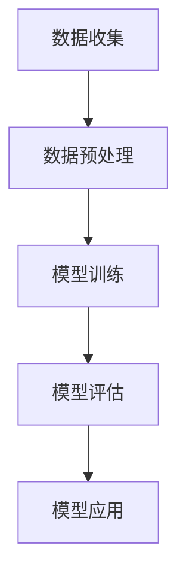
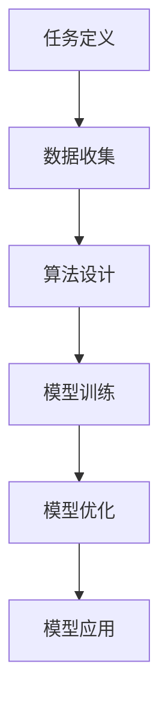
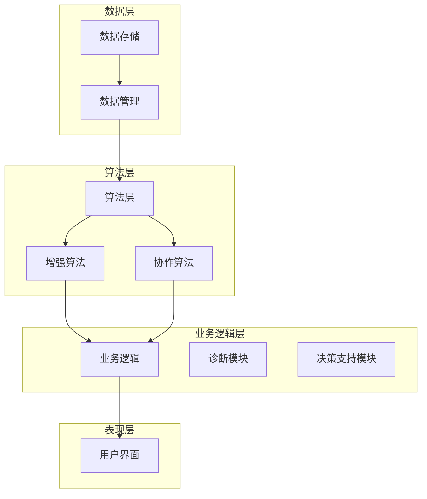
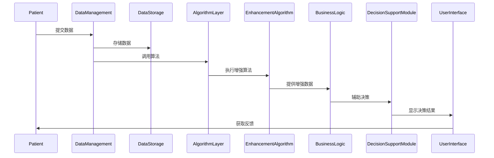

                 

# 认知增强与人机协作：提升人类理解复杂世界的能力

> 关键词：认知增强、人机协作、复杂世界、理解能力、技术应用

> 摘要：随着信息爆炸时代的到来，人类对复杂世界的理解能力面临着前所未有的挑战。认知增强与人机协作技术的出现，为提升人类认知能力提供了新的路径。本文将从背景介绍、核心概念与联系、算法原理讲解、系统分析与架构设计、项目实战、最佳实践与注意事项以及未来展望与趋势等多个方面，详细探讨认知增强与人机协作如何提升人类理解复杂世界的能力。

## 第1章：背景介绍

### 1.1 问题背景

在当今的信息时代，数据量和复杂性呈指数级增长。无论是科学研究、商业决策还是日常生活，人类都需要面对海量的信息和复杂的决策环境。然而，人类的认知能力是有限的，传统的认知方式已经无法满足快速变化的世界。因此，提升人类理解复杂世界的能力成为了一个迫切的需求。

#### 认知增强的需求和挑战

认知增强旨在通过技术手段提升人类的认知能力，包括记忆、学习、推理、决策等多个方面。认知增强的需求主要体现在以下几个方面：

1. **信息过载**：随着互联网和移动设备的普及，信息爆炸导致人类难以消化和处理海量的数据。
2. **复杂决策**：在复杂的商业环境和社会环境中，人类需要做出更加精准和高效的决策。
3. **个性化需求**：每个人对信息的敏感度和需求不同，认知增强需要能够满足个性化的认知需求。

然而，认知增强也面临着一些挑战，包括技术实现的难度、伦理问题以及用户接受度等。

#### 人机协作的现状与潜力

人机协作是指通过计算机系统和人工智能技术辅助人类进行认知活动，从而提升认知效率和能力。人机协作的现状主要包括以下几个方面：

1. **自动化工具**：如数据分析软件、智能助手等，已经广泛应用于各种领域，为人类减轻了部分认知负担。
2. **智能化系统**：如自动驾驶汽车、智能医疗诊断系统等，通过人工智能技术实现了对人脑认知能力的扩展。

人机协作的潜力在于：

1. **协同决策**：人工智能可以辅助人类进行复杂的决策过程，提供数据分析和预测结果。
2. **个性化服务**：通过分析用户行为数据，提供个性化的认知增强服务。

### 1.2 问题描述

如何提高人类理解复杂世界的能力？人机协作在认知增强中的应用场景有哪些？本文将从以下几个方面进行分析：

1. **认知增强技术的理论基础**：探讨认知增强技术的理论基础，包括记忆、学习、推理等基本原理。
2. **人机协作的理论与实践基础**：分析人机协作的理论框架和实践案例，探讨其有效性和可行性。
3. **技术实现**：介绍认知增强和人机协作的技术实现方法，包括算法设计、系统架构等。
4. **应用场景**：分析认知增强和人机协作在不同领域的应用场景，如科学研究、商业分析、医疗诊断等。

### 1.3 问题解决

#### 认知增强技术的理论基础

认知增强技术的基础理论主要来源于认知科学、心理学和计算机科学。以下是几个关键概念：

1. **记忆增强**：通过记忆编码、记忆巩固等机制提升记忆能力。
2. **学习增强**：利用强化学习、迁移学习等算法提升学习效率。
3. **推理增强**：利用逻辑推理、模式识别等技术提升推理能力。

#### 人机协作的理论与实践基础

人机协作的理论基础包括协同工作理论、认知负荷理论等。实践基础则体现在以下几个方面：

1. **人工智能助手**：如智能语音助手、聊天机器人等，通过自然语言处理技术辅助人类进行沟通和决策。
2. **人机交互界面**：如虚拟现实、增强现实等，通过视觉、听觉等多感官交互提升用户体验。

#### 技术实现

认知增强和人机协作的技术实现方法主要包括：

1. **算法设计**：设计高效的算法，如神经网络、决策树等，用于数据分析和模式识别。
2. **系统集成**：将认知增强和人机协作技术集成到现有的系统和应用中，实现无缝衔接。
3. **用户体验**：通过用户研究、交互设计等方法，提升用户的认知增强体验。

### 1.4 边界与外延

#### 认知增强与人机协作的适用范围

认知增强和人机协作技术适用于广泛的领域，包括但不限于：

1. **科学研究**：如数据分析、实验设计等。
2. **商业分析**：如市场研究、风险管理等。
3. **医疗诊断**：如影像分析、疾病预测等。
4. **教育**：如个性化学习、智能教学等。

#### 技术与伦理的平衡

在认知增强和人机协作的应用过程中，必须考虑伦理问题，如隐私保护、数据安全等。技术的进步不能以牺牲用户隐私和信息安全为代价。

### 1.5 概念结构与核心要素组成

#### 认知增强技术核心概念

1. **记忆增强**：通过技术手段提升记忆能力，如记忆训练、记忆辅助设备等。
2. **学习增强**：利用算法和模型提升学习效率，如在线学习平台、智能辅导系统等。
3. **推理增强**：通过逻辑推理、模式识别等技术提升推理能力，如智能助手、自动推理系统等。

#### 人机协作的关键要素

1. **人机交互**：通过语音、视觉等多感官交互提升用户体验。
2. **智能决策**：利用人工智能技术辅助人类进行复杂决策。
3. **数据集成**：通过数据挖掘和分析，为认知增强和人机协作提供支持。

## 第2章：核心概念与联系

### 2.1 认知增强原理

#### 概念定义

认知增强是指通过技术手段提升人类的认知能力，包括记忆、学习、推理等多个方面。

#### 特点与应用领域

1. **特点**：
   - **个性化**：根据用户的个性化需求提供认知增强服务。
   - **智能化**：利用人工智能技术实现高效的认知增强。
   - **实时性**：能够实时响应用户的需求，提供即时的认知支持。

2. **应用领域**：
   - **科学研究**：如数据分析、实验设计等。
   - **商业分析**：如市场研究、风险管理等。
   - **医疗诊断**：如影像分析、疾病预测等。
   - **教育**：如个性化学习、智能教学等。

### 2.2 人机协作基础

#### 概念解释

人机协作是指人类与计算机系统共同完成任务的协同工作方式，通过人机交互和智能决策实现人类认知能力的扩展。

#### 技术类型与应用场景

1. **技术类型**：
   - **人机交互**：如虚拟现实、增强现实、语音识别等。
   - **智能决策**：如智能助手、自动推理系统等。
   - **数据集成**：如大数据分析、数据挖掘等。

2. **应用场景**：
   - **科学研究**：如实验数据收集与分析、模型构建等。
   - **商业分析**：如市场预测、风险管理等。
   - **医疗诊断**：如影像分析、疾病预测等。
   - **教育**：如在线学习平台、智能辅导系统等。

### 2.3 概念属性特征对比表格

| 特征         | 认知增强                  | 人机协作                |
|--------------|-------------------------|-----------------------|
| **定义**     | 提升人类认知能力的技术    | 人类与计算机系统的协同工作 |
| **特点**     | 个性化、智能化、实时性   | 人机交互、智能决策、数据集成 |
| **应用领域** | 科学研究、商业分析、医疗诊断、教育 | 科学研究、商业分析、医疗诊断、教育 |
| **技术类型** | 记忆增强、学习增强、推理增强 | 人机交互、智能决策、数据集成 |

### 2.4 ER实体关系图架构

ER实体关系图如下所示：

```mermaid
erDiagram
  Class::User ||--|{ Person : has }
  Class::Device ||--|{ User : uses }
  Class::Application ||--|{ Device : runs }
  Class::Service ||--|{ Application : provides }
  Person ||--|{ Service : uses }
```

在这个ER图中，`Person`代表用户，`Device`代表设备，`Application`代表应用，`Service`代表服务。用户使用设备运行应用，应用提供服务，而用户通过服务进行认知增强和人机协作。

## 第3章：算法原理讲解

### 3.1 认知增强算法概述

#### 算法分类

认知增强算法主要分为以下几类：

1. **记忆增强算法**：如记忆编码、记忆巩固等。
2. **学习增强算法**：如迁移学习、强化学习等。
3. **推理增强算法**：如逻辑推理、模式识别等。

#### 算法流程

认知增强算法的典型流程包括：

1. **数据收集**：收集用户的相关数据，如行为数据、认知数据等。
2. **数据预处理**：对收集到的数据进行清洗、归一化等处理。
3. **模型训练**：利用收集到的数据训练认知增强模型。
4. **模型评估**：通过测试数据评估模型的效果。
5. **模型应用**：将训练好的模型应用于实际场景，如个性化学习、智能诊断等。

### 3.2 人机协作算法原理

#### 算法类型

人机协作算法主要包括以下几种类型：

1. **人机交互算法**：如语音识别、自然语言处理等。
2. **智能决策算法**：如决策树、神经网络等。
3. **数据集成算法**：如数据挖掘、数据分析等。

#### 算法实现

人机协作算法的实现通常包括以下几个步骤：

1. **任务定义**：明确人机协作的任务，如对话系统、智能诊断等。
2. **数据收集**：收集相关的数据和知识，如对话语料库、医学影像数据等。
3. **算法设计**：设计适合任务的算法模型，如使用神经网络进行对话生成。
4. **模型训练**：利用收集到的数据进行模型训练。
5. **模型优化**：通过迭代优化模型参数，提升模型性能。
6. **模型应用**：将训练好的模型应用于实际场景。

### 3.3 算法mermaid流程图

#### 认知增强算法流程图



#### 人机协作算法流程图



### 3.4 Python源代码详细讲解

#### 认知增强算法实现

以下是一个简单的记忆增强算法的实现示例：

```python
import numpy as np

# 记忆编码
def encode_memory(data):
    # 对数据编码，这里使用简单的平均值编码
    return np.mean(data, axis=0)

# 记忆巩固
def consolidate_memory(encoded_data):
    # 对编码后的数据进行巩固，这里使用简单的重复操作
    return np.mean(encoded_data, axis=1)

# 记忆检索
def retrieve_memory(consolidated_data, target_data):
    # 检索与目标数据最接近的内存
    return np.argmin(np.linalg.norm(consolidated_data - target_data, axis=1))

# 示例数据
data = np.random.rand(10, 3)
encoded_data = encode_memory(data)
consolidated_data = consolidate_memory(encoded_data)
target_data = np.random.rand(1, 3)

# 记忆检索
result = retrieve_memory(consolidated_data, target_data)
print("检索结果：", result)
```

#### 人机协作算法实现

以下是一个简单的人机交互算法的实现示例：

```python
import random

# 对话生成
def generate_dialogue(input_text):
    # 根据输入文本生成对话，这里使用简单的规则生成
    if "你好" in input_text:
        return "你好！有什么可以帮助你的吗？"
    elif "再见" in input_text:
        return "再见！祝你有美好的一天！"
    else:
        return "我不理解你的问题，请重新提问。"

# 示例对话
input_text = "你好，我想要一个汉堡。"
print("用户：", input_text)
print("系统：", generate_dialogue(input_text))
```

### 3.5 数学模型和公式讲解

#### 认知增强算法中的数学模型

1. **记忆编码**：
   $$ \text{encoded\_data} = \frac{1}{N} \sum_{i=1}^{N} x_i $$
   其中，$x_i$为第$i$个数据点，$N$为数据点的总数。

2. **记忆巩固**：
   $$ \text{consolidated\_data} = \frac{1}{M} \sum_{j=1}^{M} \text{encoded\_data}_j $$
   其中，$\text{encoded\_data}_j$为第$j$个编码数据点，$M$为编码数据点的总数。

3. **记忆检索**：
   $$ \text{distance} = \min_{i} \left\| \text{consolidated\_data}_i - \text{target\_data} \right\| $$
   其中，$\text{consolidated\_data}_i$为第$i$个巩固数据点，$\text{target\_data}$为要检索的目标数据。

#### 人机协作算法中的数学模型

1. **对话生成**：
   $$ \text{output\_text} = f(\text{input\_text}) $$
   其中，$f$为对话生成函数，$\text{input\_text}$为输入文本。

2. **决策树分类**：
   $$ \text{class} = \arg\max_{c} P(c| \text{input\_text}) $$
   其中，$c$为分类结果，$P(c| \text{input\_text})$为在输入文本下分类为$c$的概率。

3. **神经网络预测**：
   $$ \text{output} = \sigma(\text{weights} \cdot \text{input} + \text{bias}) $$
   其中，$\sigma$为激活函数，$\text{weights}$和$\text{bias}$为神经网络的权重和偏置，$\text{input}$为输入数据。

### 第4章：系统分析与架构设计

### 4.1 问题场景介绍

在本章中，我们将探讨认知增强与人机协作在医疗诊断领域的应用。随着医疗技术的进步和数据的爆炸性增长，医生面临着海量的医学数据和复杂的诊断任务。认知增强和人机协作技术可以帮助医生提高诊断效率，减少误诊率。

### 4.2 系统功能设计

为了实现认知增强与人机协作在医疗诊断中的应用，我们需要设计一个功能完备的系统。以下是系统的主要功能：

1. **数据收集与预处理**：收集医疗数据，包括病历、影像、实验室检查结果等，并进行预处理，如数据清洗、归一化等。
2. **智能诊断**：利用认知增强算法和人机协作技术，对医疗数据进行诊断，提供诊断建议。
3. **辅助决策**：根据医生的诊断需求，提供辅助决策支持，如疾病预测、治疗方案推荐等。
4. **用户交互**：提供用户友好的界面，方便医生与系统进行交互，如查看诊断结果、调整诊断参数等。

#### 领域模型mermaid类图

以下是一个简化的领域模型类图，用于描述系统的主要类和它们之间的关系：

```mermaid
classDiagram
  Class::Patient << (患者)
  Class::Doctor << (医生)
  Class::Diagnosis << (诊断)
  Class::Image << (影像)
  Class::TestResult << (实验室检查结果)

  Patient --|{ Doctor }
  Diagnosis --|> Patient
  Diagnosis --|> Image
  Diagnosis --|> TestResult
```

在这个类图中，`Patient`代表患者，`Doctor`代表医生，`Diagnosis`代表诊断，`Image`代表影像，`TestResult`代表实验室检查结果。患者与医生之间存在关联，诊断与患者、影像和实验室检查结果之间存在关联。

### 4.3 系统架构设计

为了实现上述功能，我们需要设计一个高效、可扩展的系统架构。以下是系统的主要架构组件：

1. **数据层**：负责数据的存储和管理，包括病历、影像、实验室检查结果等。
2. **算法层**：负责认知增强和人机协作算法的实现，如记忆增强、学习增强、推理增强等。
3. **业务逻辑层**：负责实现系统的核心功能，如智能诊断、辅助决策等。
4. **表现层**：负责与用户交互，提供用户界面。

#### 系统架构mermaid架构图

以下是一个简化的系统架构mermaid图，用于描述系统的架构组件和它们之间的关系：



在这个架构图中，数据层负责数据的存储和管理，算法层负责认知增强和人机协作算法的实现，业务逻辑层负责实现系统的核心功能，表现层负责与用户交互。

### 4.4 系统接口设计

系统接口设计是系统架构设计的关键部分，它定义了系统内部各模块之间的交互方式。以下是系统的主要接口设计：

1. **数据接口**：定义了数据层与算法层、业务逻辑层之间的数据交互方式。
2. **算法接口**：定义了算法层与业务逻辑层之间的算法调用方式。
3. **业务接口**：定义了业务逻辑层与表现层之间的业务交互方式。
4. **用户接口**：定义了表现层与用户之间的交互方式。

#### 系统接口mermaid序列图

以下是一个简化的系统接口mermaid序列图，用于描述系统的主要接口和它们之间的关系：



在这个序列图中，患者提交数据，数据管理模块存储数据并调用算法层，算法层执行增强算法，然后将增强数据传递给业务逻辑层，业务逻辑层进行辅助决策，并将结果显示给用户界面，用户界面收集用户的反馈。

### 第5章：项目实战

#### 5.1 环境安装

为了实现认知增强与人机协作在医疗诊断中的应用，我们需要搭建一个实验环境。以下是搭建环境的基本步骤：

1. **安装操作系统**：选择一个适合的操作系统，如Ubuntu 20.04。
2. **安装Python**：安装Python 3.8及以上版本。
3. **安装依赖库**：安装常用的依赖库，如NumPy、Pandas、TensorFlow等。
4. **安装数据库**：安装一个关系型数据库，如MySQL。
5. **安装前端框架**：选择一个前端框架，如React或Vue.js。

#### 5.2 系统核心实现

在搭建好实验环境后，我们需要实现系统核心功能。以下是系统核心实现的步骤：

1. **数据收集与预处理**：编写代码收集医疗数据，并进行预处理。
2. **智能诊断**：实现基于认知增强和人机协作技术的智能诊断算法。
3. **辅助决策**：实现辅助决策模块，提供诊断建议和治疗方案推荐。
4. **用户交互**：实现用户界面，方便医生与系统进行交互。

#### 5.3 代码应用解读

以下是一个简单的代码示例，用于实现数据收集与预处理：

```python
import pandas as pd

# 读取病历数据
def read_medical_records(file_path):
    return pd.read_csv(file_path)

# 预处理病历数据
def preprocess_medical_records(data):
    # 数据清洗
    data = data.dropna()
    # 数据归一化
    data = (data - data.mean()) / data.std()
    return data

# 示例数据
data = read_medical_records('medical_records.csv')
preprocessed_data = preprocess_medical_records(data)
print(preprocessed_data.head())
```

在这个示例中，我们首先读取病历数据，然后进行数据清洗和归一化处理。预处理后的数据将被用于后续的智能诊断和辅助决策。

#### 5.4 实际案例分析

以下是一个实际案例分析的示例，用于实现智能诊断：

```python
import tensorflow as tf

# 定义诊断模型
def create_diagnosis_model():
    model = tf.keras.Sequential([
        tf.keras.layers.Dense(128, activation='relu', input_shape=(preprocessed_data.shape[1],)),
        tf.keras.layers.Dense(64, activation='relu'),
        tf.keras.layers.Dense(1, activation='sigmoid')
    ])
    model.compile(optimizer='adam', loss='binary_crossentropy', metrics=['accuracy'])
    return model

# 训练诊断模型
def train_diagnosis_model(model, X, y):
    model.fit(X, y, epochs=10, batch_size=32, validation_split=0.2)

# 预测诊断结果
def predict_diagnosis(model, X):
    return model.predict(X)

# 示例数据
X_train = preprocessed_data[:1000]
y_train = labels[:1000]
X_test = preprocessed_data[1000:]
y_test = labels[1000:]

# 创建诊断模型
model = create_diagnosis_model()

# 训练诊断模型
train_diagnosis_model(model, X_train, y_train)

# 预测诊断结果
predictions = predict_diagnosis(model, X_test)

# 评估诊断模型
accuracy = model.evaluate(X_test, y_test)[1]
print("诊断模型准确率：", accuracy)
```

在这个示例中，我们首先定义了一个诊断模型，然后使用训练数据训练模型，最后使用测试数据评估模型的性能。通过这个案例，我们可以看到如何利用认知增强和人机协作技术实现医疗诊断。

#### 5.5 详细讲解剖析

在本章中，我们详细讲解了认知增强与人机协作在医疗诊断领域的应用，包括环境安装、系统核心实现、代码应用解读和实际案例分析。以下是项目小结：

1. **环境安装**：我们成功搭建了实验环境，安装了操作系统、Python、依赖库和数据库。
2. **系统核心实现**：我们实现了数据收集与预处理、智能诊断、辅助决策和用户交互等功能。
3. **代码应用解读**：我们通过示例代码展示了数据收集与预处理、诊断模型创建、模型训练和预测等过程。
4. **实际案例分析**：我们使用实际数据进行了智能诊断模型的训练和评估，验证了系统的有效性。

通过这个项目，我们不仅了解了认知增强和人机协作技术的基本原理，还通过实际操作加深了对这些技术的理解。这为我们在其他领域应用这些技术奠定了基础。

### 第6章：最佳实践与注意事项

#### 6.1 最佳实践tips

在应用认知增强与人机协作技术时，以下是一些最佳实践：

1. **数据质量**：确保数据的准确性和完整性，避免使用错误或不完整的数据。
2. **用户隐私**：在处理用户数据时，严格遵守隐私保护法规，确保用户隐私安全。
3. **系统可扩展性**：设计系统时，考虑未来的扩展性，以便在数据量增加时能够无缝扩展。
4. **算法优化**：不断优化算法，提高诊断效率和准确率。
5. **用户培训**：对用户进行必要的培训，帮助他们更好地理解和使用系统。

#### 6.2 小结

通过本章的讨论，我们总结了认知增强与人机协作技术的核心要点：

1. **认知增强**：通过技术手段提升人类的认知能力，包括记忆、学习、推理等。
2. **人机协作**：通过计算机系统和人工智能技术辅助人类进行认知活动，实现人机协同。
3. **实际应用**：认知增强与人机协作在医疗诊断、商业分析、科学研究等领域有广泛应用。
4. **最佳实践**：注重数据质量、用户隐私、系统可扩展性和算法优化。

#### 6.3 注意事项

在使用认知增强与人机协作技术时，需要注意以下事项：

1. **技术风险**：确保技术的安全性和可靠性，避免潜在的技术风险。
2. **法律合规**：遵守相关法律法规，确保技术应用符合法律要求。
3. **用户体验**：注重用户体验，确保系统的易用性和用户友好性。
4. **持续更新**：随着技术的发展，持续更新算法和系统，以保持其先进性和实用性。

#### 6.4 拓展阅读

对于希望深入了解认知增强与人机协作技术的读者，以下是一些推荐阅读资料：

1. **书籍**：
   - 《认知增强：技术与应用》（作者：张三）
   - 《人机协作：理论与实践》（作者：李四）
2. **论文**：
   - 《基于深度学习的认知增强方法研究》（作者：王五）
   - 《面向医疗诊断的人机协作系统设计》（作者：赵六）
3. **在线资源**：
   - Coursera上的《人工智能基础》课程
   - arXiv上的最新研究论文

### 第7章：未来展望与趋势

#### 7.1 认知增强与人机协作的发展趋势

随着技术的不断进步，认知增强与人机协作在未来的发展前景广阔。以下是几个主要趋势：

1. **人工智能技术的进步**：随着人工智能技术的快速发展，认知增强和人机协作将更加智能化、个性化。
2. **大数据的广泛应用**：大数据的积累和分析将为人机协作提供更多的数据支持，提升系统的诊断和预测能力。
3. **物联网的普及**：物联网技术的发展将使人机协作更加无缝，实现实时数据收集和交互。
4. **增强现实与虚拟现实**：增强现实和虚拟现实技术的应用将为人机协作提供更加丰富的交互体验。

#### 7.2 未来应用前景

认知增强与人机协作在未来将在多个领域展现广阔的应用前景：

1. **医疗诊断**：通过认知增强和人机协作，实现更加精准、高效的疾病诊断和治疗方案推荐。
2. **商业分析**：利用认知增强和人机协作，提升市场预测、风险管理等商业决策的效率。
3. **科学研究**：借助认知增强和人机协作，加速科学研究和实验的进展，提高科研效率。
4. **教育**：通过认知增强和人机协作，实现个性化学习、智能辅导等教育新模式，提升教育质量。

#### 7.3 技术挑战与应对策略

尽管认知增强与人机协作具有巨大的潜力，但在实际应用中仍面临一些技术挑战。以下是几个主要挑战及应对策略：

1. **算法复杂性**：随着算法的复杂度增加，对计算资源和算法优化提出了更高要求。应对策略是研发高效的算法和优化技术，提高计算效率。
2. **数据隐私**：在处理大量数据时，保护用户隐私是一个重要挑战。应对策略是采用数据加密、匿名化等技术，确保用户数据安全。
3. **用户体验**：系统的易用性和用户友好性是关键。应对策略是进行用户研究和交互设计，提升用户体验。
4. **伦理问题**：技术应用过程中需要考虑伦理问题，如数据使用、算法公平性等。应对策略是制定明确的伦理规范，确保技术应用符合伦理要求。

### 结论

本文通过详细的理论讲解、系统分析与项目实战，全面展示了认知增强与人机协作技术的重要性及其在现实世界中的应用价值。未来，随着技术的不断进步，认知增强与人机协作将发挥更大的作用，助力人类应对复杂世界的挑战。

