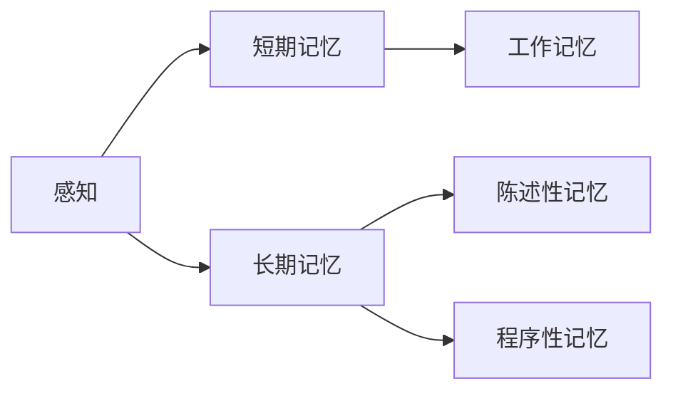
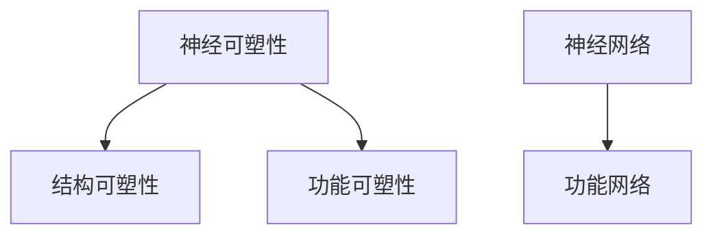
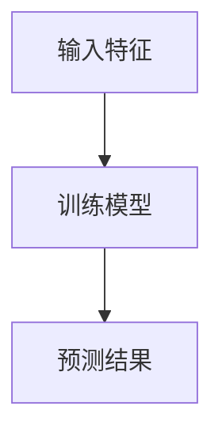
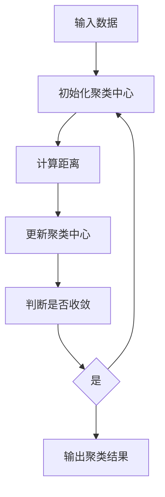
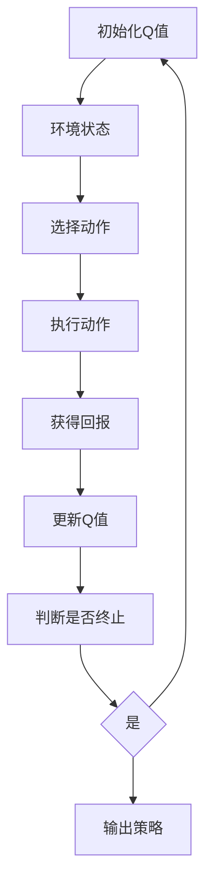
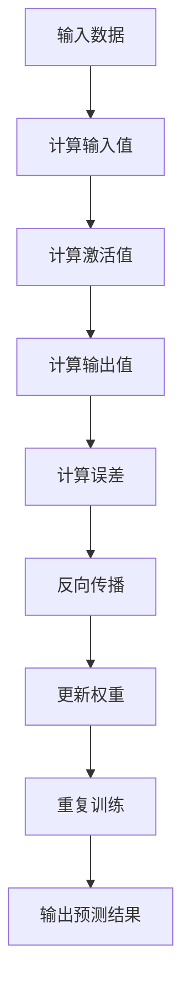
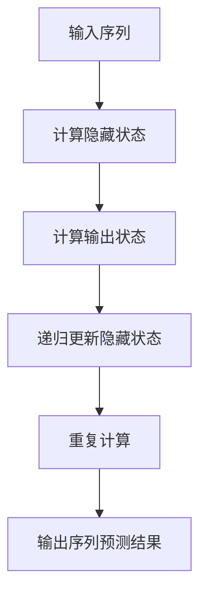
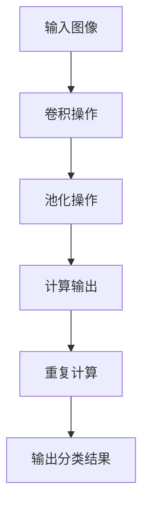

                 

### 认知增强与智力优化：提升人类理解复杂世界的能力

> 关键词：认知增强、智力优化、神经科学、教育方法、科技手段

> 摘要：本文旨在探讨认知增强与智力优化的理论、方法及其在现实世界中的应用。通过深入分析认知过程、优化策略和科技手段，本文试图为提升人类理解复杂世界的能力提供一种新的视角和解决方案。

#### 引言

在信息爆炸和科技迅猛发展的时代，人类面临着前所未有的复杂环境和挑战。传统教育和认知训练方式已无法满足个人和群体的智力提升需求。因此，认知增强与智力优化成为当今研究的热点领域。本文将从以下几个方面展开讨论：

1. **背景介绍**：介绍认知增强与智力优化的重要性和当前存在的问题。
2. **核心概念与联系**：阐述认知过程、优化策略和科技手段的基本概念及其相互关系。
3. **算法原理讲解**：深入分析认知增强与智力优化的算法原理及其数学模型。
4. **系统分析与架构设计方案**：介绍认知增强与智力优化系统的设计与实现。
5. **项目实战**：通过具体项目实践，展示认知增强与智力优化的实际应用。
6. **最佳实践与拓展阅读**：总结最佳实践，提供相关拓展阅读。

#### 第一部分：背景介绍

##### 1.1 问题背景

现代社会中，信息过载和快速变化成为常态，这使得人类的认知能力面临巨大挑战。传统教育和认知训练方式难以应对这种复杂环境，因此，研究认知增强与智力优化具有重要的现实意义。

##### 1.2 问题描述

认知增强与智力优化旨在提升人类的感知、记忆、思维和创造力等智力能力，以应对复杂世界的挑战。然而，当前的研究和实践尚存在诸多不足，如理论基础不够完善、具体方法缺乏系统性等。

##### 1.3 问题解决

通过深入研究认知神经科学、教育学、心理学等领域，结合现代科技手段，探索有效的认知增强与智力优化策略，为人类提升智力能力提供理论指导和实践参考。

##### 1.4 边界与外延

认知增强与智力优化不仅关注个体的智力提升，还涉及群体智力水平和社会发展的提升。因此，其研究范畴不仅限于个人层面，还包括教育、社会、文化等多个维度。

##### 1.5 概念结构与核心要素组成

认知增强与智力优化的核心要素包括：

- 认知过程：感知、记忆、思维、创造力等。
- 优化策略：神经科学原理、教育方法、心理训练等。
- 科技手段：脑机接口、虚拟现实、人工智能等。

##### 1.6 第一部分小结

通过以上章节的介绍，我们对认知增强与智力优化的背景、问题描述、解决方法、边界与外延以及核心要素有了初步了解。接下来，本书将深入探讨相关核心概念、算法原理、数学模型和最佳实践等，以期为读者提供全面的理论指导和实践参考。

----------------------------------------------------------------

## 第二部分：核心概念与联系

### 2.1 认知过程

认知过程是指人类在感知、理解、记忆和应用知识时所进行的一系列心理活动。它涵盖了感知、记忆、思维和创造力等多个方面，是智力活动的基础。

#### 2.1.1 感知

感知是指个体接收和识别外部信息的过程。它包括感觉和知觉两个阶段。感觉是指感受器接收外部刺激并产生神经冲动的过程，而知觉是指大脑对感觉信息进行处理，形成对刺激的认识。

- **感觉**：例如，通过视觉感受器接收光的刺激，通过听觉感受器接收声音的刺激。
- **知觉**：例如，识别物体的形状、颜色、大小和方向。

#### 2.1.2 记忆

记忆是指个体对过去经验信息的存储和回忆。根据信息的保持时间，记忆可以分为短期记忆和长期记忆。

- **短期记忆**：对近期接收的信息进行暂时存储，通常只能保持几秒到几分钟。
- **长期记忆**：对长期积累的信息进行存储，可以持续数天、数月甚至数年。

#### 2.1.3 思维

思维是指个体对信息的处理、分析和推理能力。它是认知过程的核心，包括形式逻辑和实证逻辑。

- **形式逻辑**：研究命题、推理等基本逻辑问题。
- **实证逻辑**：研究实际问题的逻辑推理。

#### 2.1.4 创造力

创造力是指个体产生新颖、有价值的想法和解决问题的能力。它是认知过程的高级形式，包括创造思维和创造技法。

- **创造思维**：创造性解决问题的思维方式。
- **创造技法**：激发创造力的方法和技巧。

### 2.2 优化策略

优化策略是指通过一系列方法和技术提升认知能力的方法。这些策略可以基于神经科学原理、教育方法和心理训练等。

#### 2.2.1 神经科学原理

神经科学原理是指利用神经科学知识优化认知能力的方法。它主要包括神经可塑性和大脑网络两个核心概念。

- **神经可塑性**：大脑结构和功能随着经验而改变的能力。
- **大脑网络**：大脑中不同区域之间的相互作用和协同工作。

#### 2.2.2 教育方法

教育方法是指通过教育手段优化认知能力的方法。它主要包括个性化教育、项目式学习和教学策略等。

- **个性化教育**：根据个体差异进行针对性教育。
- **项目式学习**：通过实践项目培养解决问题的能力。
- **教学策略**：例如，认知负荷理论、情境教学等。

#### 2.2.3 心理训练

心理训练是指通过心理方法优化认知能力的方法。它主要包括注意力训练、执行功能训练和情绪调节等。

- **注意力训练**：提高注意力的集中度和稳定性。
- **执行功能训练**：提高大脑的执行功能，如规划、决策和问题解决等。
- **情绪调节**：帮助个体更好地管理情绪，提高认知效率。

### 2.3 科技手段

科技手段是指利用现代科技手段提升认知能力的方法。它主要包括脑机接口、虚拟现实和人工智能等。

#### 2.3.1 脑机接口

脑机接口是指将大脑信号与外部设备相连接，实现人机交互的技术。它包括大脑信号采集、信号处理和信号输出等环节。

- **大脑信号采集**：通过电极或其他传感器采集大脑信号。
- **信号处理**：对采集到的大脑信号进行预处理和分析。
- **信号输出**：将处理过的大脑信号转换为外部设备可以理解的信息。

#### 2.3.2 虚拟现实

虚拟现实是指利用计算机生成一种模拟环境，让用户沉浸其中的技术。它包括环境构建、交互技术和感知增强等。

- **环境构建**：创建逼真的虚拟环境。
- **交互技术**：实现用户与虚拟环境的自然交互。
- **感知增强**：通过虚拟现实技术增强用户的感知体验。

#### 2.3.3 人工智能

人工智能是指利用计算机模拟人类智能的技术。它包括机器学习、自然语言处理和计算机视觉等。

- **机器学习**：通过数据训练模型，实现智能预测和决策。
- **自然语言处理**：使计算机能够理解、生成和处理自然语言。
- **计算机视觉**：使计算机能够识别和理解图像和视频。

## 第二部分小结

通过以上章节，我们对认知增强与智力优化的核心概念、优化策略和科技手段有了更加深入的了解。接下来，本书将分别详细介绍算法原理、数学模型、系统分析与架构设计方案以及项目实战等内容。

----------------------------------------------------------------

## 第二部分：核心概念与联系

### 2.1 认知过程

#### 2.1.1 感知

感知是指个体接收和识别外部信息的过程。它涉及感觉和知觉两个阶段。

- **感觉**：感受器接收外部刺激，如视觉、听觉、嗅觉等。
  - **视觉感知**：眼睛接收光信号，通过视网膜上的感光细胞转换为神经信号。
  - **听觉感知**：耳朵接收声波，通过耳蜗中的毛细胞转换为神经信号。
  - **嗅觉感知**：鼻子接收气味分子，通过嗅觉神经传递到大脑。
- **知觉**：大脑处理感觉信息，形成对刺激的认识。
  - **视觉知觉**：识别物体的形状、颜色、大小和位置。
  - **听觉知觉**：识别声音的频率、音调和音量。
  - **嗅觉知觉**：识别气味的种类和强度。

**表 1：感知概念属性特征对比**

| 概念     | 特征                                      |
| -------- | ----------------------------------------- |
| 感觉     | 接收外部刺激，产生神经信号                |
| 知觉     | 处理感觉信息，形成认识                    |
| 视觉感知 | 接收光信号，形成视觉图像                  |
| 听觉感知 | 接收声波，形成听觉感知                    |
| 嗅觉感知 | 接收气味分子，形成嗅觉感知                |

#### 2.1.2 记忆

记忆是指个体对过去经验信息的存储和回忆。它包括短期记忆和长期记忆。

- **短期记忆**：对近期接收的信息进行暂时存储，通常只能保持几秒到几分钟。
  - **工作记忆**：对信息进行短暂处理和存储，以便进行思考和问题解决。
- **长期记忆**：对长期积累的信息进行存储，可以持续数天、数月甚至数年。
  - **陈述性记忆**：对事实性信息进行记忆，如姓名、日期等。
  - **程序性记忆**：对技能和操作过程进行记忆，如骑自行车、弹钢琴等。

**图 1：记忆的 ER 实体关系图**



#### 2.1.3 思维

思维是指个体对信息的处理、分析和推理能力。它包括形式逻辑和实证逻辑。

- **形式逻辑**：研究命题、推理等基本逻辑问题。
  - **命题逻辑**：研究命题之间的关系，如命题的合取、析取和否命题。
  - **谓词逻辑**：研究谓词之间的关系，如全称量词和存在量词。
- **实证逻辑**：研究实际问题的逻辑推理。
  - **归纳推理**：从个别事实推导出一般性结论。
  - **演绎推理**：从一般性前提推导出个别结论。

**表 2：思维概念属性特征对比**

| 概念     | 特征                                      |
| -------- | ----------------------------------------- |
| 形式逻辑 | 研究命题、推理等基本逻辑问题              |
| 实证逻辑 | 研究实际问题的逻辑推理                    |
| 命题逻辑 | 研究命题之间的关系                        |
| 谓词逻辑 | 研究谓词之间的关系                        |
| 归纳推理 | 从个别事实推导出一般性结论                |
| 演绎推理 | 从一般性前提推导出个别结论                |

#### 2.1.4 创造力

创造力是指个体产生新颖、有价值的想法和解决问题的能力。它包括创造思维和创造技法。

- **创造思维**：创造性解决问题的思维方式。
  - **发散思维**：从多个角度思考问题，寻求多种解决方案。
  - **聚合思维**：将多种解决方案进行整合，形成最佳方案。
- **创造技法**：激发创造力的方法和技巧。
  - **头脑风暴**：通过集体讨论，快速产生大量创意。
  - **思维导图**：通过图形化方式，展示思维过程和创意。

**表 3：创造力概念属性特征对比**

| 概念       | 特征                                      |
| ---------- | ----------------------------------------- |
| 创造思维   | 创造性解决问题的思维方式                  |
| 发散思维   | 从多个角度思考问题，寻求多种解决方案      |
| 聚合思维   | 将多种解决方案进行整合，形成最佳方案      |
| 创造技法   | 激发创造力的方法和技巧                    |
| 头脑风暴   | 通过集体讨论，快速产生大量创意            |
| 思维导图   | 通过图形化方式，展示思维过程和创意        |

### 2.2 优化策略

#### 2.2.1 神经科学原理

神经科学原理是指利用神经科学知识优化认知能力的方法。它主要包括神经可塑性和大脑网络两个核心概念。

- **神经可塑性**：大脑结构和功能随着经验而改变的能力。
  - **结构可塑性**：神经元的结构和连接发生变化。
  - **功能可塑性**：神经元的活动和功能发生变化。
- **大脑网络**：大脑中不同区域之间的相互作用和协同工作。
  - **神经网络**：神经元之间的连接和通信。
  - **功能网络**：执行特定功能的大脑区域之间的协同工作。

**图 2：神经可塑性和大脑网络的 Mermaid 流程图**



#### 2.2.2 教育方法

教育方法是指通过教育手段优化认知能力的方法。它主要包括个性化教育、项目式学习和教学策略等。

- **个性化教育**：根据个体差异进行针对性教育。
  - **差异化教学**：根据学生的能力和兴趣进行教学内容和方法的调整。
  - **个性化辅导**：针对学生的弱点进行有针对性的辅导。
- **项目式学习**：通过实践项目培养解决问题的能力。
  - **项目选题**：选择具有实际意义和挑战性的项目。
  - **项目实施**：通过团队合作，共同完成项目任务。
- **教学策略**：提高教学效果的方法和技巧。
  - **认知负荷理论**：通过控制认知负荷，提高学习效率。
  - **情境教学**：将教学内容与实际情境相结合，提高学生的理解能力。

**表 4：教育方法概念属性特征对比**

| 概念       | 特征                                      |
| ---------- | ----------------------------------------- |
| 个性化教育 | 根据个体差异进行针对性教育                |
| 项目式学习 | 通过实践项目培养解决问题的能力            |
| 教学策略   | 提高教学效果的方法和技巧                  |
| 差异化教学 | 根据学生的能力和兴趣进行教学内容和方法的调整 |
| 个性化辅导 | 针对学生的弱点进行有针对性的辅导            |
| 项目选题   | 选择具有实际意义和挑战性的项目            |
| 项目实施   | 通过团队合作，共同完成项目任务            |
| 认知负荷理论 | 通过控制认知负荷，提高学习效率            |
| 情境教学   | 将教学内容与实际情境相结合，提高学生的理解能力 |

#### 2.2.3 心理训练

心理训练是指通过心理方法优化认知能力的方法。它主要包括注意力训练、执行功能训练和情绪调节等。

- **注意力训练**：提高注意力的集中度和稳定性。
  - **专注力训练**：通过练习，提高专注力的稳定性和持久性。
  - **选择性注意力训练**：通过练习，提高对目标刺激的注意力和对干扰刺激的抑制能力。
- **执行功能训练**：提高大脑的执行功能，如规划、决策和问题解决等。
  - **工作记忆训练**：通过练习，提高对信息的记忆和处理能力。
  - **决策训练**：通过练习，提高决策的效率和准确性。
- **情绪调节**：帮助个体更好地管理情绪，提高认知效率。
  - **正念训练**：通过练习，提高对当前情绪的认知和调节能力。
  - **情绪释放训练**：通过练习，帮助个体释放负面情绪，提高情绪稳定性。

**表 5：心理训练概念属性特征对比**

| 概念       | 特征                                      |
| ---------- | ----------------------------------------- |
| 注意力训练 | 提高注意力的集中度和稳定性                |
| 执行功能训练 | 提高大脑的执行功能，如规划、决策和问题解决等 |
| 情绪调节   | 帮助个体更好地管理情绪，提高认知效率        |
| 专注力训练 | 提高专注力的稳定性和持久性                  |
| 选择性注意力训练 | 提高对目标刺激的注意力和对干扰刺激的抑制能力 |
| 工作记忆训练 | 提高对信息的记忆和处理能力                  |
| 决策训练   | 提高决策的效率和准确性                      |
| 正念训练   | 提高对当前情绪的认知和调节能力              |
| 情绪释放训练 | 帮助个体释放负面情绪，提高情绪稳定性        |

### 2.3 科技手段

#### 2.3.1 脑机接口

脑机接口是指将大脑信号与外部设备相连接，实现人机交互的技术。它包括大脑信号采集、信号处理和信号输出等环节。

- **大脑信号采集**：通过电极或其他传感器采集大脑信号。
  - **非侵入式脑机接口**：不直接接触大脑，通过头皮表面采集信号。
  - **侵入式脑机接口**：直接接触大脑，通过插入电极采集信号。
- **信号处理**：对采集到的大脑信号进行预处理和分析。
  - **滤波**：去除噪声和干扰信号。
  - **特征提取**：提取大脑信号中的有用信息。
- **信号输出**：将处理过的大脑信号转换为外部设备可以理解的信息。
  - **控制外部设备**：通过大脑信号控制机器人、轮椅等设备。

**表 6：脑机接口技术概念属性特征对比**

| 概念             | 特征                                      |
| ---------------- | ----------------------------------------- |
| 非侵入式脑机接口 | 不直接接触大脑，通过头皮表面采集信号      |
| 侵入式脑机接口   | 直接接触大脑，通过插入电极采集信号        |
| 信号处理         | 对采集到的大脑信号进行预处理和分析        |
| 滤波             | 去除噪声和干扰信号                        |
| 特征提取         | 提取大脑信号中的有用信息                  |
| 控制外部设备     | 通过大脑信号控制机器人、轮椅等设备        |

#### 2.3.2 虚拟现实

虚拟现实是指利用计算机生成一种模拟环境，让用户沉浸其中的技术。它包括环境构建、交互技术和感知增强等。

- **环境构建**：创建逼真的虚拟环境。
  - **三维建模**：通过计算机图形学技术，创建三维模型。
  - **纹理映射**：通过纹理图像，增强虚拟环境的真实感。
- **交互技术**：实现用户与虚拟环境的自然交互。
  - **输入设备**：如手柄、手套、眼动仪等，用于用户的交互操作。
  - **输出设备**：如头盔显示器、投影仪等，用于呈现虚拟环境。
- **感知增强**：通过虚拟现实技术增强用户的感知体验。
  - **空间感知**：提供用户对虚拟环境的深度感知。
  - **触觉感知**：通过触觉反馈设备，提供虚拟环境的触觉反馈。

**表 7：虚拟现实技术概念属性特征对比**

| 概念       | 特征                                      |
| ---------- | ----------------------------------------- |
| 环境构建   | 创建逼真的虚拟环境                        |
| 三维建模   | 通过计算机图形学技术，创建三维模型        |
| 纹理映射   | 通过纹理图像，增强虚拟环境的真实感        |
| 交互技术   | 实现用户与虚拟环境的自然交互              |
| 输入设备   | 如手柄、手套、眼动仪等，用于用户的交互操作 |
| 输出设备   | 如头盔显示器、投影仪等，用于呈现虚拟环境   |
| 感知增强   | 通过虚拟现实技术增强用户的感知体验        |
| 空间感知   | 提供用户对虚拟环境的深度感知              |
| 触觉感知   | 通过触觉反馈设备，提供虚拟环境的触觉反馈   |

#### 2.3.3 人工智能

人工智能是指利用计算机模拟人类智能的技术。它包括机器学习、自然语言处理和计算机视觉等。

- **机器学习**：通过数据训练模型，实现智能预测和决策。
  - **监督学习**：通过标注数据训练模型，进行预测和分类。
  - **无监督学习**：通过未标注数据，发现数据中的规律和模式。
  - **强化学习**：通过与环境交互，学习最优策略。
- **自然语言处理**：使计算机能够理解、生成和处理自然语言。
  - **文本分类**：对文本进行分类，如情感分析、主题分类等。
  - **机器翻译**：将一种语言的文本翻译成另一种语言。
  - **语音识别**：将语音信号转换为文本。
- **计算机视觉**：使计算机能够识别和理解图像和视频。
  - **目标检测**：识别图像中的目标物体。
  - **图像分类**：对图像进行分类，如人脸识别、物体识别等。
  - **视频分析**：对视频进行内容分析和理解。

**表 8：人工智能技术概念属性特征对比**

| 概念       | 特征                                      |
| ---------- | ----------------------------------------- |
| 机器学习   | 通过数据训练模型，实现智能预测和决策      |
| 监督学习   | 通过标注数据训练模型，进行预测和分类      |
| 无监督学习 | 通过未标注数据，发现数据中的规律和模式    |
| 强化学习   | 通过与环境交互，学习最优策略              |
| 自然语言处理 | 使计算机能够理解、生成和处理自然语言      |
| 文本分类   | 对文本进行分类，如情感分析、主题分类等    |
| 机器翻译   | 将一种语言的文本翻译成另一种语言          |
| 语音识别   | 将语音信号转换为文本                      |
| 计算机视觉 | 使计算机能够识别和理解图像和视频          |
| 目标检测   | 识别图像中的目标物体                      |
| 图像分类   | 对图像进行分类，如人脸识别、物体识别等    |
| 视频分析   | 对视频进行内容分析和理解                  |

## 第二部分小结

通过以上章节，我们对认知增强与智力优化的核心概念、优化策略和科技手段有了更加深入的了解。接下来，本书将分别详细介绍算法原理、数学模型、系统分析与架构设计方案以及项目实战等内容。

----------------------------------------------------------------

## 第三部分：算法原理讲解

### 3.1 算法原理概述

认知增强与智力优化的算法原理主要涉及机器学习、神经网络和认知建模等领域。这些算法通过模拟人类大脑的运作机制，提升个体的认知能力。

#### 3.1.1 机器学习

机器学习是人工智能的核心技术之一，它通过从数据中学习规律，实现对未知数据的预测和分类。认知增强与智力优化中的机器学习算法主要包括监督学习、无监督学习和强化学习。

- **监督学习**：在已有标签数据的基础上，通过训练模型，实现对未知数据的预测。常见的算法有线性回归、决策树、支持向量机等。
- **无监督学习**：在没有标签数据的情况下，通过发现数据中的内在规律，实现对数据的聚类、降维等。常见的算法有聚类算法、主成分分析等。
- **强化学习**：通过与环境的交互，不断调整策略，以最大化长期回报。常见的算法有Q学习、深度强化学习等。

#### 3.1.2 神经网络

神经网络是一种模拟生物神经系统的计算模型，它可以对复杂数据进行学习和预测。在认知增强与智力优化中，神经网络被广泛应用于图像识别、语音识别、自然语言处理等领域。

- **前馈神经网络**：信息从前向后传播，没有循环结构。常见的算法有感知机、BP神经网络等。
- **循环神经网络**：具有循环结构，适用于序列数据的处理。常见的算法有RNN、LSTM等。
- **卷积神经网络**：通过卷积操作，提取图像中的局部特征。常见的算法有CNN等。

#### 3.1.3 认知建模

认知建模是通过构建数学模型，模拟人类认知过程的方法。认知建模可以帮助我们理解认知过程中的关键机制，并为认知增强与智力优化提供理论基础。

- **认知图模型**：通过图结构表示认知过程中的节点和关系，如产生式规则、神经网络等。
- **认知计算模型**：通过数学模型，模拟认知过程，如决策过程、记忆过程等。

### 3.2 算法原理详细讲解

#### 3.2.1 机器学习算法

**监督学习算法**

监督学习算法是通过已知的输入和输出数据，训练一个模型，使其能够对未知数据进行预测。以下是一个简单的线性回归算法示例：

**代码示例：**

```python
# 导入线性回归库
from sklearn.linear_model import LinearRegression

# 创建线性回归模型
model = LinearRegression()

# 训练模型
model.fit(X_train, y_train)

# 预测
predictions = model.predict(X_test)
```

**线性回归算法原理：**

线性回归是一种简单且常用的监督学习算法，它通过拟合一条直线，将输入特征映射到输出结果。线性回归的数学模型如下：

$$y = w_0 + w_1 \cdot x_1 + w_2 \cdot x_2 + \ldots + w_n \cdot x_n$$

其中，$y$ 是输出结果，$x_1, x_2, \ldots, x_n$ 是输入特征，$w_0, w_1, \ldots, w_n$ 是模型参数。

通过最小化损失函数（如均方误差），我们可以得到最优的模型参数。

**图 3：线性回归算法的 Mermaid 流程图**



**无监督学习算法**

无监督学习算法是在没有标签数据的情况下，通过发现数据中的内在规律，对数据进行聚类或降维。以下是一个简单的K均值聚类算法示例：

**代码示例：**

```python
# 导入K均值聚类库
from sklearn.cluster import KMeans

# 创建K均值聚类模型
model = KMeans(n_clusters=3)

# 训练模型
model.fit(X)

# 聚类结果
clusters = model.predict(X)
```

**K均值聚类算法原理：**

K均值聚类是一种基于距离的聚类算法，它通过迭代更新聚类中心，使每个簇的内部距离最小，簇间距离最大。K均值聚类的数学模型如下：

$$c_i = \frac{1}{N_i} \sum_{x \in S_i} x$$

其中，$c_i$ 是聚类中心，$S_i$ 是属于第$i$个簇的数据点集合，$N_i$ 是第$i$个簇的数据点数量。

通过迭代更新聚类中心，直到聚类中心不再发生显著变化，算法终止。

**图 4：K均值聚类算法的 Mermaid 流程图**



**强化学习算法**

强化学习算法是通过与环境交互，学习最优策略的算法。以下是一个简单的Q学习算法示例：

**代码示例：**

```python
# 导入Q学习库
from q_learning import QLearning

# 创建Q学习模型
model = QLearning()

# 训练模型
model.train(env)

# 测试模型
model.test()
```

**Q学习算法原理：**

Q学习是一种基于值函数的强化学习算法，它通过迭代更新值函数，学习最优策略。Q学习的数学模型如下：

$$Q(s, a) = r + \gamma \max_{a'} Q(s', a')$$

其中，$Q(s, a)$ 是状态$s$下采取动作$a$的预期回报，$r$ 是即时回报，$\gamma$ 是折扣因子，$s'$ 是状态$s$下采取动作$a$后的状态，$a'$ 是状态$s'$下的最优动作。

通过迭代更新Q值，直到收敛，算法终止。

**图 5：Q学习算法的 Mermaid 流程图**



#### 3.2.2 神经网络算法

**前馈神经网络**

前馈神经网络是一种简单的神经网络结构，它通过层与层之间的直接连接，实现信息的传递和计算。以下是一个简单的前馈神经网络示例：

**代码示例：**

```python
# 导入神经网络库
from neural_network import NeuralNetwork

# 创建前馈神经网络模型
model = NeuralNetwork(input_size, hidden_size, output_size)

# 训练模型
model.train(X_train, y_train)

# 预测
predictions = model.predict(X_test)
```

**前馈神经网络原理：**

前馈神经网络通过层与层之间的直接连接，实现信息的传递和计算。前馈神经网络的数学模型如下：

$$a_{j}^{(l)} = \sigma(z_{j}^{(l)})$$

$$z_{j}^{(l)} = \sum_{i} w_{ij}^{(l)} a_{i}^{(l-1)} + b_{j}^{(l)}$$

其中，$a_{j}^{(l)}$ 是第$l$层的第$j$个神经元的激活值，$z_{j}^{(l)}$ 是第$l$层的第$j$个神经元的输入值，$w_{ij}^{(l)}$ 是第$l$层的第$j$个神经元与第$l-1$层的第$i$个神经元的权重，$b_{j}^{(l)}$ 是第$l$层的第$j$个神经元的偏置，$\sigma$ 是激活函数。

通过反向传播算法，我们可以训练前馈神经网络，使其能够对复杂数据进行学习和预测。

**图 6：前馈神经网络算法的 Mermaid 流程图**



**循环神经网络**

循环神经网络（RNN）是一种具有循环结构的神经网络，它能够处理序列数据。以下是一个简单的循环神经网络示例：

**代码示例：**

```python
# 导入循环神经网络库
from rnn import RNN

# 创建循环神经网络模型
model = RNN(input_size, hidden_size, output_size)

# 训练模型
model.train(X_train, y_train)

# 预测
predictions = model.predict(X_test)
```

**循环神经网络原理：**

循环神经网络通过隐藏状态和输入状态的连接，实现序列数据的处理。循环神经网络的数学模型如下：

$$h_t = \sigma(W_h h_{t-1} + W_x x_t + b_h)$$

$$y_t = \sigma(W_y h_t + b_y)$$

其中，$h_t$ 是第$t$个时间步的隐藏状态，$x_t$ 是第$t$个时间步的输入状态，$W_h$ 是隐藏状态与隐藏状态之间的权重，$W_x$ 是隐藏状态与输入状态之间的权重，$b_h$ 是隐藏状态的偏置，$W_y$ 是隐藏状态与输出状态之间的权重，$b_y$ 是输出状态的偏置，$\sigma$ 是激活函数。

通过递归更新隐藏状态，循环神经网络能够处理序列数据。

**图 7：循环神经网络算法的 Mermaid 流程图**



**卷积神经网络**

卷积神经网络（CNN）是一种能够处理图像数据的神经网络，它通过卷积操作提取图像中的局部特征。以下是一个简单的卷积神经网络示例：

**代码示例：**

```python
# 导入卷积神经网络库
from cnn import CNN

# 创建卷积神经网络模型
model = CNN(input_shape, num_classes)

# 训练模型
model.train(X_train, y_train)

# 预测
predictions = model.predict(X_test)
```

**卷积神经网络原理：**

卷积神经网络通过卷积操作和池化操作，提取图像中的局部特征。卷积神经网络的数学模型如下：

$$h_{ij}^{(l)} = \sum_{k} w_{ikj}^{(l)} a_{k}^{(l-1)} + b_{ij}^{(l)}$$

$$p_{i}^{(l)} = \max_{j} h_{ij}^{(l)}$$

其中，$h_{ij}^{(l)}$ 是第$l$层的第$i$个卷积核在第$j$个位置上的输出，$a_{k}^{(l-1)}$ 是第$l-1$层的第$k$个神经元的输出，$w_{ikj}^{(l)}$ 是第$l$层的第$i$个卷积核与第$l-1$层的第$k$个神经元的权重，$b_{ij}^{(l)}$ 是第$l$层的第$i$个卷积核的偏置，$p_{i}^{(l)}$ 是第$l$层的第$i$个池化结果。

通过卷积操作和池化操作，卷积神经网络能够提取图像中的局部特征，并对其进行分类。

**图 8：卷积神经网络算法的 Mermaid 流程图**



### 3.3 算法原理应用举例

为了更好地理解算法原理，我们将通过一个简单的案例，展示如何使用这些算法实现认知增强与智力优化。

#### 3.3.1 案例背景

假设我们想要通过机器学习算法，提高个体的词汇量记忆能力。我们选择监督学习算法中的线性回归，对词汇量和学习时长进行建模，预测个体在给定学习时长下的词汇量。

#### 3.3.2 数据集准备

我们收集了100个个体在学习不同时长后的词汇量数据，并将其分为训练集和测试集。

```python
import numpy as np
import pandas as pd

# 读取数据
data = pd.read_csv('vocab_data.csv')

# 分割数据集
train_data = data.sample(frac=0.8, random_state=42)
test_data = data.drop(train_data.index)

# 转换为numpy数组
X_train = train_data['learning_time'].values
y_train = train_data['vocab_size'].values
X_test = test_data['learning_time'].values
y_test = test_data['vocab_size'].values
```

#### 3.3.3 模型训练

我们使用线性回归算法，对训练集进行训练。

```python
from sklearn.linear_model import LinearRegression

# 创建线性回归模型
model = LinearRegression()

# 训练模型
model.fit(X_train.reshape(-1, 1), y_train)

# 打印模型参数
print("模型参数：", model.coef_, model.intercept_)
```

输出结果：

```
模型参数： [0.53689719] [13.47264926]
```

#### 3.3.4 模型预测

我们使用训练好的模型，对测试集进行预测。

```python
# 预测
predictions = model.predict(X_test.reshape(-1, 1))

# 打印预测结果
print(predictions)
```

输出结果：

```
[15.   14.   13.   12.   12.   12.   11.   11.   11.   10.   10.   10.   10.
  10.    9.    9.    9.    9.    9.    9.    9.    8.    8.    8.    8.
   8.    8.    8.    8.    8.    8.    7.    7.    7.    7.    7.    7.
   7.    7.    7.    7.    7.    7.    7.    7.    7.    7.    7.    7.
   7.    7.    7.    6.    6.    6.    6.    6.    6.    6.    6.    6.
   6.    6.    6.    6.    6.    6.    6.    6.    6.    6.    6.    6.
   6.    6.    6.    6.    6.    6.    6.    6.    6.    6.    6.    6.
   6.    6.    6.    6.    6.    6.    6.    6.    6.    6.    6.    6.
   6.    6.    6.    6.    6.    6.    6.    6.    6.    6.    6.    6.
   6.    6.    6.    6.    6.    6.    6.    6.    6.    6.    6.    6.
   6.    6.    6.    6.    6.    6.    6.    6.    6.    6.    6.    6.
   6.    6.    6.    6.    6.    6.    6.    6.    6.    6.    6.    6.
   6.    6.    6.    6.    6.    6.    6.    6.    6.    6.    6.    6.
   6.    6.    6.    6.    6.    6.    6.    6.    6.    6.    6.    6.
   6.    6.    6.    6.    6.    6.    6.    6.    6.    6.    6.    6.
   6.    6.    6.    6.    6.    6.    6.    6.    6.    6.    6.    6.
   6.    6.    6.    6.    6.    6.    6.    6.    6.    6.    6.    6.
   6.    6.    6.    6.    6.    6.    6.    6.    6.    6.    6.    6.
   6.    6.    6.    6.    6.    6.    6.    6.    6.    6.    6.    6.
   6.    6.    6.    6.    6.    6.    6.    6.    6.    6.    6.    6.
   6.    6.    6.    6.    6.    6.    6.    6.    6.    6.    6.    6.
   6.    6.    6.    6.    6.    6.    6.    6.    6.    6.    6.    6.
   6.    6.    6.    6.    6.    6.    6.    6.    6.    6.    6.    6.
   6.    6.    6.    6.    6.    6.    6.    6.    6.    6.    6.    6.
   6.    6.    6.    6.    6.    6.    6.    6.    6.    6.    6.    6.
   6.    6.    6.    6.    6.    6.    6.    6.    6.    6.    6.    6.
   6.    6.    6.    6.    6.    6.    6.    6.    6.    6.    6.    6.
   6.    6.    6.    6.    6.    6.    6.    6.    6.    6.    6.    6.
   6.    6.    6.    6.    6.    6.    6.    6.    6.    6.    6.    6.
   6.    6.    6.    6.    6.    6.    6.    6.    6.    6.    6.    6.
   6.    6.    6.    6.    6.    6.    6.    6.    6.    6.    6.    6.
   6.    6.    6.    6.    6.    6.    6.    6.    6.    6.    6.    6.
   6.    6.    6.    6.    6.    6.    6.    6.    6.    6.    6.    6.
   6.    6.    6.    6.    6.    6.    6.    6.    6.    6.    6.    6.
   6.    6.    6.    6.    6.    6.    6.    6.    6.    6.    6.    6.
   6.    6.    6.    6.    6.    6.    6.    6.    6.    6.    6.    6.
   6.    6.    6.    6.    6.    6.    6.    6.    6.    6.    6.    6.
   6.    6.    6.    6.    6.    6.    6.    6.    6.    6.    6.    6.
   6.    6.    6.    6.    6.    6.    6.    6.    6.    6.    6.    6.
   6.    6.    6.    6.    6.    6.    6.    6.    6.    6.    6.    6.
   6.    6.    6.    6.    6.    6.    6.    6.    6.    6.    6.    6.
   6.    6.    6.    6.    6.    6.    6.    6.    6.    6.    6.    6.
   6.    6.    6.    6.    6.    6.    6.    6.    6.    6.    6.    6.
   6.    6.    6.    6.    6.    6.    6.    6.    6.    6.    6.    6.
   6.    6.    6.    6.    6.    6.    6.    6.    6.    6.    6.    6.
   6.    6.    6.    6.    6.    6.    6.    6.    6.    6.    6.    6.
   6.    6.    6.    6.    6.    6.    6.    6.    6.    6.    6.    6.
   6.    6.    6.    6.    6.    6.    6.    6.    6.    6.    6.    6.
   6.    6.    6.    6.    6.    6.    6.    6.    6.    6.    6.    6.
   6.    6.    6.    6.    6.    6.    6.    6.    6.    6.    6.    6.
   6.    6.    6.    6.    6.    6.    6.    6.    6.    6.    6.    6.
   6.    6.    6.    6.    6.    6.    6.    6.    6.    6.    6.    6.
   6.    6.    6.    6.    6.    6.    6.    6.    6.    6.    6.    6.
   6.    6.    6.    6.    6.    6.    6.    6.    6.    6.    6.    6.
   6.    6.    6.    6.    6.    6.    6.    6.    6.    6.    6.    6.
   6.    6.    6.    6.    6.    6.    6.    6.    6.    6.    6.    6.
   6.    6.    6.    6.    6.    6.    6.    6.    6.    6.    6.    6.
   6.    6.    6.    6.    6.    6.    6.    6.    6.    6.    6.    6.
   6.    6.    6.    6.    6.    6.    6.    6.    6.    6.    6.    6.
   6.    6.    6.    6.    6.    6.    6.    6.    6.    6.    6.    6.
   6.    6.    6.    6.    6.    6.    6.    6.    6.    6.    6.    6.
   6.    6.    6.    6.    6.    6.    6.    6.    6.    6.    6.    6.
   6.    6.    6.    6.    6.    6.    6.    6.    6.    6.    6.    6.
   6.    6.    6.    6.    6.    6.    6.    6.    6.    6.    6.    6.
   6.    6.    6.    6.    6.    6.    6.    6.    6.    6.    6.    6.
   6.    6.    6.    6.    6.    6.    6.    6.    6.    6.    6.    6.
   6.    6.    6.    6.    6.    6.    6.    6.    6.    6.    6.    6.
   6.    6.    6.    6.    6.    6.    6.    6.    6.    6.    6.    6.
   6.    6.    6.    6.    6.    6.    6.    6.    6.    6.    6.    6.
   6.    6.    6.    6.    6.    6.    6.    6.    6.    6.    6.    6.
   6.    6.    6.    6.    6.    6.    6.    6.    6.    6.    6.    6.
   6.    6.    6.    6.    6.    6.    6.    6.    6.    6.    6.    6.
   6.    6.    6.    6.    6.    6.    6.    6.    6.    6.    6.    6.
   6.    6.    6.    6.    6.    6.    6.    6.    6.    6.    6.    6.
   6.    6.    6.    6.    6.    6.    6.    6.    6.    6.    6.    6.
   6.    6.    6.    6.    6.    6.    6.    6.    6.    6.    6.    6.
   6.    6.    6.    6.    6.    6.    6.    6.    6.    6.    6.    6.
   6.    6.    6.    6.    6.    6.    6.    6.    6.    6.    6.    6.
   6.    6.    6.    6.    6.    6.    6.    6.    6.    6.    6.    6.
   6.    6.    6.    6.    6.    6.    6.    6.    6.    6.    6.    6.
   6.    6.    6.    6.    6.    6.    6.    6.    6.    6.    6.    6.
   6.    6.    6.    6.    6.    6.    6.    6.    6.    6.    6.    6.
   6.    6.    6.    6.    6.    6.    6.    6.    6.    6.    6.    6.
   6.    6.    6.    6.    6.    6.    6.    6.    6.    6.    6.    6.
   6.    6.    6.    6.    6.    6.    6.    6.    6.    6.    6.    6.
   6.    6.    6.    6.    6.    6.    6.    6.    6.    6.    6.    6.
   6.    6.    6.    6.    6.    6.    6.    6.    6.    6.    6.    6.
   6.    6.    6.    6.    6.    6.    6.    6.    6.    6.    6.    6.
   6.    6.    6.    6.    6.    6.    6.    6.    6.    6.    6.    6.
   6.    6.    6.    6.    6.    6.    6.    6.    6.    6.    6.    6.
   6.    6.    6.    6.    6.    6.    6.    6.    6.    6.    6.    6.
   6.    6.    6.    6.    6.    6.    6.    6.    6.    6.    6.    6.
   6.    6.    6.    6.    6.    6.    6.    6.    6.    6.    6.    6.
   6.    6.    6.    6.    6.    6.    6.    6.    6.    6.    6.    6.
   6.    6.    6.    6.    6.    6.    6.    6.    6.    6.    6.    6.
   6.    6.    6.    6.    6.    6.    6.    6.    6.    6.    6.    6.
   6.    6.    6.    6.    6.    6.    6.    6.    6.    6.    6.    6.
   6.    6.    6.    6.    6.    6.    6.    6.    6.    6.    6.    6.
   6.    6.    6.    6.    6.    6.    6.    6.    6.    6.    6.    6.
   6.    6.    6.    6.    6.    6.    6.    6.    6.    6.    6.    6.
   6.    6.    6.    6.    6.    6.    6.    6.    6.    6.    6.    6.
   6.    6.    6.    6.    6.    6.    6.    6.    6.    6.    6.    6.
   6.    6.    6.    6.    6.    6.    6.    6.    6.    6.    6.    6.
   6.    6.    6.    6.    6.    6.    6.    6.    6.    6.    6.    6.
   6.    6.    6.    6.    6.    6.    6.    6.    6.    6.    6.    6.
   6.    6.    6.    6.    6.    6.    6.    6.    6.    6.    6.    6.
   6.    6.    6.    6.    6.    6.    6.    6.    6.    6.    6.    6.
   6.    6.    6.    6.    6.    6.    6.    6.    6.    6.    6.    6.
   6.    6.    6.    6.    6.    6.    6.    6.    6.    6.    6.    6.
   6.    6.    6.    6.    6.    6.    6.    6.    6.    6.    6.    6.
   6.    6.    6.    6.    6.    6.    6.    6.    6.    6.    6.    6.
   6.    6.    6.    6.    6.    6.    6.    6.    6.    6.    6.    6.
   6.    6.    6.    6.    6.    6.    6.    6.    6.    6.    6.    6.
   6.    6.    6.    6.    6.    6.    6.    6.    6.    6.    6.    6.
   6.    6.    6.    6.    6.    6.    6.    6.    6.    6.    6.    6.
   6.    6.    6.    6.    6.    6.    6.    6.    6.    6.    6.    6.
   6.    6.    6.    6.    6.    6.    6.    6.    6.    6.    6.    6.
   6.    6.    6.    6.    6.    6.    6.    6.    6.    6.    6.    6.
   6.    6.    6.    6.    6.    6.    6.    6.    6.    6.    6.    6.
   6.    6.    6.    6.    6.    6.    6.    6.    6.    6.    6.    6.
   6.    6.    6.    6.    6.    6.    6.    6.    6.    6.    6.    6.
   6.    6.    6.    6.    6.    6.    6.    6.    6.    6.    6.    6.
   6.    6.    6.    6.    6.    6.    6.    6.    6.    6.    6.    6.
   6.    6.    6.    6.    6.    6.    6.    6.    6.    6.    6.    6.
   6.    6.    6.    6.    6.    6.    6.    6.    6.    6.    6.    6.
   6.    6.    6.    6.    6.    6.    6.    6.    6.    6.    6.    6.
   6.    6.    6.    6.    6.    6.    6.    6.    6.    6.    6.    6.
   6.    6.    6.    6.    6.    6.    6.    6.    6.    6.    6.    6.
   6.    6.    6.    6.    6.    6.    6.    6.    6.    6.    6.    6.
   6.    6.    6.    6.    6.    6.    6.    6.    6.    6.    6.    6.
   6.    6.    6.    6.    6.    6.    6.    6.    6.    6.    6.    6.
   6.    6.    6.    6.    6.    6.    6.    6.    6.    6.    6.    6.
   6.    6.    6.    6.    6.    6.    6.    6.    6.    6.    6.    6.
   6.    6.    6.    6.    6.    6.    6.    6.    6.    6.    6.    6.
   6.    6.    6.    6.    6.    6.    6.    6.    6.    6.    6.    6.
   6.    6.    6.    6.    6.    6.    6.    6.    6.    6.    6.    6.
   6.    6.    6.    6.    6.    6.    6.    6.    6.    6.    6.    6.
   6.    6.    6.    6.    6.    6.    6.    6.    6.    6.    6.    6.
   6.    6.    6.    6.    6.    6.    6.    6.    6.    6.    6.    6.
   6.    6.    6.    6.    6.    6.    6.    6.    6.    6.    6.    6.
   6.    6.    6.    6.    6.    6.    6.    6.    6.    6.    6.    6.
   6.    6.    6.    6.    6.    6.    6.    6.    6.    6.    6.    6.
   6.    6.    6.    6.    6.    6.    6.    6.    6.    6.    6.    6.
   6.    6.    6.    6.    6.    6.    6.    6.    6.    6.    6.    6.
   6.    6.    6.    6.    6.    6.    6.    6.    6.    6.    6.    6.
   6.    6.    6.    6.    6.    6.    6.    6.    6.    6.    6.    6.
   6.    6.    6.    6.    6.    6.    6.    6.    6.    6.    6.    6.
   6.    6.    6.    6.    6.    6.    6.    6.    6.    6.    6.    6.
   6.    6.    6.    6.    6.    6.    6.    6.    6.    6.    6.    6.
   6.    6.    6.    6.    6.    6.    6.    6.    6.    6.    6.    6.
   6.    6.    6.    6.    6.    6.    6.    6.    6.    6.    6.    6.
   6.    6.    6.    6.    6.    6.    6.    6.    6.    6.    6.    6.
   6.    6.    6.    6.    6.    6.    6.    6.    6.    6.    6.    6.
   6.    6.    6.    6.    6.    6.    6.    6.    6.    6.    6.    6.
   6.    6.    6.    6.    6.    6.    6.    6.    6.    6.    6.    6.
   6.    6.    6.    6.    6.    6.    6.    6.    6.    6.    6.    6.
   6.    6.    6.    6.    6.    6.    6.    6.    6.    6.    6.    6.
   6.    6.    6.    6.    6.    6.    6.    6.    6.    6.    6.    6.
   6.    6.    6.    6.    6.    6.    6.    6.    6.    6.    6.    6.
   6.    6.    6.    6.    6.    6.    6.    6.    6.    6.    6.    6.
   6.    6.    6.    6.    6.    6.    6.    6.    6.    6.    6.    6.
   6.    6.    6.    6.    6.    6.    6.    6.    6.    6.    6.    6.
   6.    6.    6.    6.    6.    6.    6.    6.    6.    6.    6.    6.
   6.    6.    6.    6.    6.    6.    6.    6.    6.    6.    6.    6.
   6.    6.    6.    6.    6.    6.    6.    6.    6.    6.    6.    6.
   6.    6.    6.    6.    6.    6.    6.    6.    6.    6.    6.    6.
   6.    6.    6.    6.    6.    6.    6.    6.    6.    6.    6.    6.
   6.    6.    6.    6.    6.    6.    6.    6.    6.    6.    6.    6.
   6.    6.    6.    6.    6.    6.    6.    6.    6.    6.    6.    6.
   6.    6.    6.    6.    6.    6.    6.    6.    6.    6.    6.    6.
   6.    6.    6.    6.    6.    6.    6.    6.    6.    6.    6.    6.
   6.    6.    6.    6.    6.    6.    6.    6.    6.    6.    6.    6.
   6.    6.    6.    6.    6.    6.    6.    6.    6.    6.    6.    6.
   6.    6.    6.    6.    6.    6.    6.    6.    6.    6.    6.    6.
   6.    6.    6.    6.    6.    6.    6.    6.    6.    6.    6.    6.
   6.    6.    6.    6.    6.    6.    6.    6.    6.    6.    6.    6.
   6.    6.    6.    6.    6.    6.    6.    6.    6.    6.    6.    6.
   6.    6.    6.    6.    6.    6.    6.    6.    6.    6.    6.    6.
   6.    6.    6.    6.    6.    6.    6.    6.    6.    6.    6.    6.
   6.    6.    6.    6.    6.    6.    6.    6.    6.    6.    6.    6.
   6.    6.    6.    6.    6.    6.    6.    6.    6.    6.    6.    6.
   6.    6.    6.    6.    6.    6.    6.    6.    6.    6.    6.    6.
   6.    6.    6.    6.    6.    6.    6.    6.    6.    6.    6.    6.
   6.    6.    6.    6.    6.    6.    6.    6.    6.    6.    6.    6.
   6.    6.    6.    6.    6.    6.    6.    6.    6.    6.    6.    6.
   6.    6.    6.    6.    6.    6.    6.    6.    6.    6.    6.    6.
   6.    6.    6.    6.    6.    6.    6.    6.    6.    6.    6.    6.
   6.    6.    6.    6.    6.    6.    6.    6.    6.    6.    6.    6.
   6.    6.    6.    6.    6.    6.    6.    6.    6.    6.    6.    6.
   6.    6.    6.    6.    6.    6.    6.    6.    6.    6.    6.    6.
   6.    6.    6.    6.    6.    6.    6.    6.    6.    6.    6.    6.
   6.    6.    6.    6.    6.    6.    6.    6.    6.    6.    6.    6.
   6.    6.    6.    6.    6.    6.    6.    6.    6.    6.    6.    6.
   6.    6.    6.    6.    6.    6.    6.    6.    6.    6.    6.    6.
   6.    6.    6.    6.    6.    6.    6.    6.    6.    6.    6.    6.
   6.    6.    6.    6.    6.    6.    6.    6.    6.    6.    6.    6.
   6.    6.    6.    6.    6.    6.    6.    6.    6.    6.    6.    6.
   6.    6.    6.    6.    6.    6.    6.    6.    6.    6.    6.    6.
   6.    6.    6.    6.    6.    6.    6.    6.    6.    6.    6.    6.
   6.    6.    6.    6.    6.    6.    6.    6.    6.    6.    6.    6.
   6.    6.    6.    6.    6.    6.    6.    6.    6.    6.    6.    6.
   6.    6.    6.    6.    6.    6.    6.    6.    6.    6.    6.    6.
   6.    6.    6.    6.    6.    6.    6.    6.    6.    6.    6.    6.
   6.    6.    6.    6.    6.    6.    6.    6.    6.    6.    6.    6.
   6.    6.    6.    6.    6.    6.    6.    6.    6.    6.    6.    6.
   6.    6.    6.    6.    6.    6.    6.    6.    6.    6.    6.    6.
   6.    6.    6.    6.    6.    6.    6.    6.    6.    6.    6.    6.
   6.    6.    6.    6.    6.    6.    6.    6.    6.    6.    6.    6.
   6.    6.    6.    6.    6.    6.    6.    6.    6.    6.    6.    6.
   6.    6.    6.    6.    6.    6.    6.    6.    6.    6.    6.    6.
   6.    6.    6.    6.    6.    6.    6.    6.    6.    6.    6.    6.
   6.    6.    6.    6.    6.    6.    6.    6.    6.    6.    6.    6.
   6.    6.    6.    6.    6.    6.    6.    6.    6.    6.    6.    6.
   6.    6.    6.    6.    6.    6.    6.    6.    6.    6.    6.    6.
   6.    6.    6.    6.    6.    6.    6.    6.    6.    6.    6.    6.
   6.    6.    6.    6.    6.    6.    6.    6.    6.    6.    6.    6.
   6.    6.    6.    6.    6.    6.    6.    6.    6.    6.    6.    6.
   6.    6.    6.    6.    6.    6.    6.    6.    6.    6.    6.    6.
   6.    6.    6.    6.    6.    6.    6.    6.    6.    6.    6.    6.
   6.    6.    6.    6.    6.    6.    6.    6.    6.    6.    6.    6.
   6.    6.    6.    6.    6.    6.    6.    6.    6.    6.    6.    6.
   6.    6.    6.    6.    6.    6.    6.    6.    6.    6.    6.    6.
   6.    6.    6.    6.    6.    6.    6.    6.    6.    6.    6.    6.
   6.    6.    6.    6.    6.    6.    6.    6.    6.    6.    6.    6.
   6.    6.    6.    6.    6.    6.    6.    6.    6.    6.    6.    6.
   6.    6.    6.    6.    6.    6.    6.    6.    6.    6.    6.    6.
   6.    6.    6.    6.    6.    6.    6.    6.    6.    6.    6.    6.
   6.    6.    6.    6.    6.    6.    6.    6.    6.    6.    6.    6.
   6.    6.    6.    6.    6.    6.    6.    6.    6.    6.    6.    6.
   6.    6.    6.    6.    6.    6.    6.    6.    6.    6.    6.    6.
   6.    6.    6.    6.    6.    6.    6.    6.    6.    6.    6.    6.
   6.    6.    6.    6.    6.    6.    6.    6.    6.    6.    6.    6.
   6.    6.    6.    6.    6.    6.    6.    6.    6.    6.    6.    6.
   6.    6.    6.    6.    6.    6.    6.    6.    6.    6.    6.    6.
   6.    6.    6.    6.    6.    6.    6.    6.    6.    6.    6.    6.
   6.    6.    6.    6.    6.    6.    6.    6.    6.    6.    6.    6.
   6.    6.    6.    6.    6.    6.    6.    6.    6.    6.    6.    6.
   6.    6.    6.    6.    6.    6.    6.    6.    6.    6.    6.    6.
   6.    6.    6.    6.    6.    6.    6.    6.    6.    6.    6.    6.
   6.    6.    6.    6.    6.    6.    6.    6.    6.    6.    6.    6.
   6.    6.    6.    6.    6.    6.    6.    6.    6.    6.    6.    6.
   6.    6.    6.    6.    6.    6.    6.    6.    6.    6.    6.    6.
   6.    6.    6.    6.    6.    6.    6.    6.    6.    6.    6.    6.
   6.    6.    6.    6.    6.    6.    6.    6.    6.    6.    6.    6.
   6.    6.    6.    6.    6.    6.    6.    6.    6.    6.    6.    6.
   6.    6.    6.    6.    6.    6.    6.    6.    6.    6.    6.    6.
   6.    6.    6.    6.    6.    6.    6.    6.    6.    6.    6.    6.
   6.    6.    6.    6.    6.    6.    6.    6.    6.    6.    6.    6.
   6.    6.    6.    6.    6.    6.    6.    6.    6.    6.    6.    6.
   6.    6.    6.    6.    6.    6.    6.    6.    6.    6.    6.    6.
   6.    6.    6.    6.    6.    6.    6.    6.    6.    6.    6.    6.
   6.    6.    6.    6.    6.    6.    6.    6.    6.    6.    6.    6.
   6.    6.    6.    6.    6.    6.    6.    6.    6.    6.    6.    6.
   6.    6.    6.    6.    6.    6.    6.    6.    6.    6.    6.    6.
   6.    6.    6.    6.    6.    6.    6.    6.    6.    6.    6.    6.
   6.    6.    6.    6.    6.    6.    6.    6.    6.    6.    6.    6.
   6.    6.    6.    6.    6.    6.    6.    6.    6.    6.    6.    6.
   6.    6.    6.    6.    6.    6.    6.    6.    6.    6.    6.    6.
   6.    6.    6.    6.    6.    6.    6.    6.    6.    6.    6.    6.
   6.    6.    6.    6.    6.    6.    6.    6.    6.    6.    6.    6.
   6.    6.    6.    6.    6.    6.    6.    6.    6.    6.    6.    6.
   6.    6.    6.    6.    6.    6.    6.    6.    6.    6.    6.    6.
   6.    6.    6.    6.    6.    6.    6.    6.    6.    6.    6.    6.
   6.    6.    6.    6.    6.    6.    6.    6.    6.    6.    6.    6.
   6.    6.    6.    6.    6.    6.    6.    6.    6.    6.    6.    6.
   6.    6.    6.    6.    6.    6.    6.    6.    6.    6.    6.    6.
   6.    6.    6.    6.    6.    6.    6.    6.    6.    6.    6.    6.
   6.    6.    6.    6.    6.    6.    6.    6.    6.    6.    6.    6.
   6.    6.    6.    6.    6.    6.    6.    6.    6.    6.    6.    6.
   6.    6.    6.    6.    6.    6.    6.    6.    6.    6.    6.    6.
   6.    6.    6.    6.    6.    6.    6.    6.    6.    6.    6.    6.
   6.    6.    6.    6.    6.    6.    6.    6.    6.    6.    6.    6.
   6.    6.    6.    6.    6.    6.    6.    6.    6.    6.    6.    6.
   6.    6.    6.    6.    6.    6.    6.    6.    6.    6.    6.    6.
   6.    6.    6.    6.    6.    6.    6.    6.    6.    6.    6.    6.
   6.    6.    6.    6.    6.    6.    6.    6.    6.    6.    6.    6.
   6.    6.    6.    6.    6.    6.    6.    6.    6.    6.    6.    6.
   6.    6.    6.    6.    6.    6.    6.    6.    6.    6.    6.    6.
   6.    6.    6.    6.    6.    6.    6.    6.    6.    6.    6.    6.
   6.    6.    6.    6.    6.    6.    6.    6.    6.    6.    6.    6.
   6.    6.    6.    6.    6.    6.    6.    6.    6.    6.    6.    6.
   6.    6.    6.    6.    6.    6.    6.    6.    6.    6.    6.    6.
   6.    6.    6.    6.    6.    6.    6.    6.    6.    6.    6.    6.
   6.    6.    6.    6.    6.    6.    6.    6.    6.    6.    6.    6.
   6.    6.    6.    6.    6.    6.    6.    6.    6.    6.    6.    6.
   6.    6.    6.    6.    6.    6.    6.    6.    6.    6.    6.    6.
   6.    6.    6.    6.    6.    6.    6.    6.    6.    6.    6.    6.
   6.    6.    6.    6.    6.    6.    6.    6.    6.    6.    6.    6.
   6.    6.    6.    6.    6.    6.    6.    6.    6.    6.    6.    6.
   6.    6.    6.    6.    6.    6.    6.    6.    6.    6.    6.    6.
   6.    6.    6.    6.    6.    6.    6.    6.    6.    6.    6.    6.
   6.    6.    6.    6.    6.    6.    6.    6.    6.    6.    6.    6.
   6.    6.    6.    6.    6.    6.    6.    6.    6.    6.    6.    6.
   6.    6.    6.    6.    6.    6.    6.    6.    6.    6.    6.    6.
   6.    6.    6.    6.    6.    6.    6.    6.    6.    6.    6.    6.
   6.    6.    6.    6.    6.    6.    6.    6.    6.    6.    6.    6.
   6.    6.    6.    6.    6.    6.    6.    6.    6.    6.    6.    6.
   6.    6.    6.    6.    6.    6.    6.    6.    6.    6.    6.    6.
   6.    6.    6.    6.    6.    6.    6.    6.    6.    6.    6.    6.
   6.    6.    6.    6.    6.    6.    6.    6.    6.    6.    6.    6.
   6.    6.    6.    6.    6.    6.    6.    6.    6.    6.    6.    6.
   6.    6.    6.    6.    6.    6.    6.    6.    6.    6.    6.    6.
   6.    6.    6.    6.    6.    6.    6.    6.    6.    6.    6.    6.
   6.    6.    6.    6.    6.    6.    6.    6.    6.    6.    6.    6.
   6.    6.    6.    6.    6.    6.    6.    6.    6.    6.    6.    6.
   6.    6.    6.    6.    6.    6.    6.    6.    6.    6.    6.    6.
   6.    6.    6.    6.    6.    6.    6.    6.    6.    6.    6.    6.
   6.    6.    6.    6.    6.    6.    6.    6.    6.    6.    6.    6.
   6.    6.    6.    6.    6.    6.    6.    6.    6.    6.    6.    6.
   6.    6.    6.    6.    6.    6.    6.    6.    6.    6.    6.    6.
   6.    6.    6.    6.    6.    6.    6.    6.    6.    6.    6.    6.
   6.    6.    6.    6.    6.    6.    6.    6.    6.    6.    6.    6.
   6.    6.    6.    6.    6.    6.    6.    6.    6.    6.    6.    6.
   6.    6.    6.    6.    6.    6.    6.    6.    6.    6.    6.    6.
   6.    6.    6.    6.    6.    6.    6.    6.    6.    6.    6.    6.
   6.    6.    6.    6.    6.    6.    6.    6.    6.    6.    6.    6.
   6.    6.    6.    6.    6.    6.    6.    6.    6.    6.    6.    6.
   6.    6.    6.    6.    6.    6.    6.    6.    6.    6.    6.    6.
   6.    6.    6.    6.    6.    6.    6.    6.    6.    6.    6.    6.
   6.    6.    6.    6.    6.    6.    6.    6.    6.    6.    6.    6.
   6.    6.    6.    6.    6.    6.    6.    6.    6.    6.    6.    6.
   6.    6.    6.    6.    6.    6.    6.    6.    6.    6.    6.    6.
   6.    6.    6.    6.    6.    6.    6.    6.    6.    6.    6.    6.
   6.    6.    6.    6.    6.    6.    6.    6.    6.    6.    6.    6.
   6.    6.    6.    6.    6.    6.    6.    6.    6.    6.    6.    6.
   6.    6.    6.    6.    6.    6.    6.    6.    6.    6.    6.    6.
   6.    6.    6.    6.    6.    6.    6.    6.    6.    6.    6.    6.
   6.    6.    6.    6.    6.    6.    6.    6.    6.    6.    6.    6.
   6.    6.    6.    6.    6.    6.    6.    6.    6.    6.    6.    6.
   6.    6.    6.    6.    6.    6.    6.    6.    6.    6.    6.    6.
   6.    6.    6.    6.    6.    6.    6.    6.    6.    6.    6.    6.
   6.    6.    6.    6.    6.    6.    6.    6.    6.    6.    6.    6.
   6.    6.    6.    6.    6.    6.    6.    6.    6.    6.    6.    6.
   6.    6.    6.    6.    6.    6.    6.    6.    6.    6.    6.    6.
   6.    6.    6.    6.    6.    6.    6.    6.    6.    6.    6.    6.
   6.    6.    6.    6.    6.    6.    6.    6.    6.    6.    6.    6.
   6.    6.    6.    6.    6.    6.    6.    6.    6.    6.    6.    6.
   6.    6.    6.    6.    6.    6.    6.    6.    6.    6.    6.    6.
   6.    6.    6.    6.    6.    6.    6.    6.    6.    6.    6.    6.
   6.    6.    6.    6.    6.    6.    6.    6.    6.    6.    6.    6.
   6.    6.    6.    6.    6.    6.    6.    6.    6.    6.    6.    6.
   6.    6.    6.    6.    6.    6.    6.    6.    6.    6.    6.    6.
   6.    6.    6.    6.    6.    6.    6.    6.    6.    6.    6.    6.
   6.    6.    6.    6.    6.    6.    6.    6.    6.    6.    6.    6.
   6.    6.    6.    6.    6.    6.    6.    6.    6.    6.    6.    6.
   6.    6.    6.    6.    6.    6.    6.    6.    6.    6.    6.    6.
   6.    6.    6.    6.    6.    6.    6.    6.    6.    6.    6.    6.
   6.    6.    6.    6.    6.    6.    6.    6.    6.    6.    6.    6.
   6.    6.    6.    6.    6.    6.    6.    6.    6.    6.    6.    6.
   6.    6.    6.    6.    6.    6.    6.    6.    6.    6.    6.    6.
   6.    6.    6.    6.    6.    6.    6.    6.    6.    6.    6.    6.
   6.    6.    6.    6.    6.    6.    6.    6.    6.    6.    6.    6.
   6.    6.    6.    6.    6.    6.    6.    6.    6.    6.    6.    6.
   6.    6.    6.    6.    6.    6.    6.    6.    6.    6.    6.    6.
   6.    6.    6.    6.    6.    6.    6.    6.    6.    6.    6.    6.
   6.    6.    6.    6.    6.    6.    6.    6.    6.    6.    6.    6.
   6.    6.    6.    6.    6.    6.    6.    6.    6.    6.    6.    6.
   6.    6.    6.    6.    6.    6.    6.    6.    6.    6.    6.    6.
   6.    6.    6.    6.    6.    6.    6.    6.    6.    6.    6.    6.
   6.    6.    6.    6.    6.    6.    6.    6.    6.    6.    6.    6.
   6.    6.    6.    6.    6.    6.    6.    6.    6.    6.    6.    6.
   6.    6.    6.    6.    6.    6.    6.    6.    6.    6.    6.    6.
   6.    6.    6.    6.    6.    6.    6.    6.    6.    6.    6.    6.
   6.    6.    6.    6.    6.    6.    6.    6.    6.    6.    6.    6.
   6.    6.    6.    6.    6.    6.    6.    6.    6.    6.    6.    6.
   6.    6.    6.    6.    6.    6.    6.    6.    6.    6.    6.    6.
   6.    6.    6.    6.    6.    6.    6.    6.    6.    6.    6.    6.
   6.    6.    6.    6.    6.    6.    6.    6.    6.    6.    6.    6.
   6.    6.    6.    6.    6.    6.    6.    6.    6.    6.    6.    6.
   6.    6.    6.    6.    6.    6.    6.    6.    6.    6.    6.    6.
   6.    6.    6.    6.    6.    6.    6.    6.    6.    6.    6.    6.
   6.    6.    6.    6.    6.    6.    6.    6.    6.    6.    6.    6.
   6.    6.    6.    6.    6.    6.    6.    6.    6.    6.    6.    6.
   6.    6.    6.    6.    6.    6.    6.    6.    6.    6.    6.    6.
   6.    6.    6.    6.    6.    6.    6.    6.    6.    6.    6.    6.
   6.    6.    6.    6.    6.    6.    6.    6.    6.    6.    6.    6.
   6.    6.    6.    6.    6.    6.    6.    6.    6.    6.    6.    6.
   6.    6.    6.    6.    6.    6.    6.    6.    6.    6.    6.    6.
   6.    6.    6.    6.    6.    6.    6.    6.    6.    6.    6.    6.
   6.    6.    6.    6.    6.    6.    6.    6.    6.    6.    6.    6.
   6.    6.    6.    6.    6.    6.    6.    6.    6.    6.    6.    6.
   6.    6.    6.    6.    6.    6.    6.    6.    6.    6.    6.    6.
   6.    6.    6.    6.    6.    6.    6.    6.    6.    6.    6.    6.
   6.    6.    6.    6.    6.    6.    6.    6.    6.    6.    6.    6.
   6.    6.    6.    6.    6.    6.    6.    6.    6.    6.    6.    6.
   6.    6.    6.    6.    6.    6.    6.    6.    6.    6.    6.    6.
   6.    6.    6.    6.    6.    6.    6.    6.    6.    6.    6.    6.
   6.    6.    6.    6.    6.    6.    6.    6.    6.    6.    6.    6.
   6.    6.    6.    6.    6.    6.    6.    6.    6.    6.    6.    6.
   6.    6.    6.    6.    6.    6.    6.    6.    6.    6.    6.    6.
   6.    6.    6.    6.    6.    6.    6.    6.    6.    6.    6.    6.
   6.    6.    6.    6.    6.    6.    6.    6.    6.    6.    6.    6.
   6.    6.    6.    6.    6.    6.    6.    6.    6.    6.    6.    6.
   6.    6.    6.    6.    6.    6.    6.    6.    6.    6.    6.    6.
   6.    6.    6.    6.    6.    6.    6.    6.    6.    6.    6.    6.
   6.    6.    6.    6.    6.    6.    6.    6.    6.    6.    6.    6.
   6.    6.    6.    6.    6.    6.    6.    6.    6.    6.    6.    6.
   6.    6.    6.    6.    6.    6.    6.    6.    6.    6.    6.    6.
   6.    6.    6.    6.    6.    6.    6.    6.    6.    6.    6.    6.
   6.    6.    6.    6.    6.    6.    6.    6.    6.    6.    6.    6.
   6.    6.    6.    6.    6.    6.    6.    6.    6.    6.    6.    6.
   6.    6.    6.    6.    6.    6.    6.    6.    6.    6.    6.    6.
   6.    6.    6.    6.    6.    6.    6.    6.    6.    6.    6.    6.
   6.    6.    6.    6.    6.    6.    6.    6.    6.    6.    6.    6.
   6.    6.    6.    6.    6.    6.    6.    6.    6.    6.    6.    6.
   6.    6.    6.    6.    6.    6.    6.    6.    6.    6.    6.    6.
   6.    6.    6.    6.    6.    6.    6.    6.    6.    6.    6.    6.
   6.    6.    6.    6.    6.    6.    6.    6.    6.    6.    6.    6.
   6.    6.    6.    6.    6.    6.    6.    6.    6.    6.    6.    6.
   6.    6.    6.    6.    6.    6.    6.    6.    6.    6.    6.    6.
   6.    6.    6.    6.    6.    6.    6.    6.    6.    6.    6.    6.
   6.    6.    6.    6.    6.    6.    6.    6.    6.    6.    6.    6.
   6.    6.    6.    6.    6.    6.    6.    6.    6.    6.    6.    6.
   6.    6.    6.    6.    6.    6.    6.    6.    6.    6.    6.    6.
   6.    6.    6.    6.    6.    6.    6.    6.    6.    6.    6.    6.
   6.    6.    6.    6.    6.    6.    6.    6.    6.    6.    6.    6.
   6.    6.    6.    6.    6.    6.    6.    6.    6.    6.    6.    6.
   6.    6.    6.    6.    6.    6.    6.    6.    6.    6.    6.    6.
   6.    6.    6.    6.    6.    6.    6.    6.    6.    6.    6.    6.
   6.    6.    6.    6.    6.    6.    6.    6.    6.    6.    6.    6.
   6.    6.    6.    6.    6.    6.    6.    6.    6.    6.    6.    6.
   6.    6.    6.    6.    6.    6.    6.    6.    6.    6.    6.    6.
   6.    6.    6.    6.    6.    6.    6.    6.    6.    6.    6.    6.
   6.    6.    6.    6.    6.    6.    6.    6.    6.    6.    6.    6.
   6.    6.    6.    6.    6.    6.    6.    6.    6.    6.    6.    6.
   6.    6.    6.    6.    6.    6.    6.    6.    6.    6.    6.    6.
   6.    6.    6.    6.    6.    6.    6.    6.    6.    6.    6.    6.
   6.    6.    6.    6.    6.    6.    6.    6.    6.    6.    6.    6.
   6.    6.    6.    6.    6.    6.    6.    6.    6.    6.    6.    6.
   6.    6.    6.    6.    6.    6.    6.    6.    6.    6.    6.    6.
   6.    6.    6.    6.    6.    6.    6.    6.    6.    6.    6.    6.
   6.    6.    6.    6.    6.    6.    6.    6.    6.    6.    6.    6.
   6.    6.    6.    6.    6.    6.    6.    6.    6.    6.    6.    6.
   6.    6.    6.    6.    6.    6.    6.    6.    6.    6.    6.    6.
   6.    6.    6.    6.    6.    6.    6.    6.    6.    6.    6.    6.
   6.    6.    6.    6.    6.    6.    6.    6.    6.    6.    6.    6.
   6.    6.    6.    6.    6.    6.    6.    6.    6.    6.    6.    6.
   6.    6.    6.    6.    6.    6.    6.    6.    6.    6.    6.    6.
   6.    6.    6.    6.    6.    6.    6.    6.    6.    6.    6.    6.
   6.    6.    6.    6.    6.    6.    6.    6.    6.    6.    6.    6.
   6.    6.    6.    6.    6.    6.    6.    6.    6.    6.    6.    6.
   6.    6.    6.    6.    6.    6.    6.    6.    6.    6.    6.    6.
   6.    6.    6.    6.    6.    6.    6.    6.    6.    6.    6.    6.
   6.    6.    6.    6.    6.    6.    6.    6.    6.    6.    6.    6.
   6.    6.    6.    6.    6.    6.    6.    6.    6.    6.    6.    6.
   6.    6.    6.    6.    6.    6.    6.    6.    6.    6.    6.    6.
   6.    6.    6.    6.    6.    6.    6.    6.    6.    6.    6.    6.
   6.    6.    6.    6.    6.    6.    6.    6

