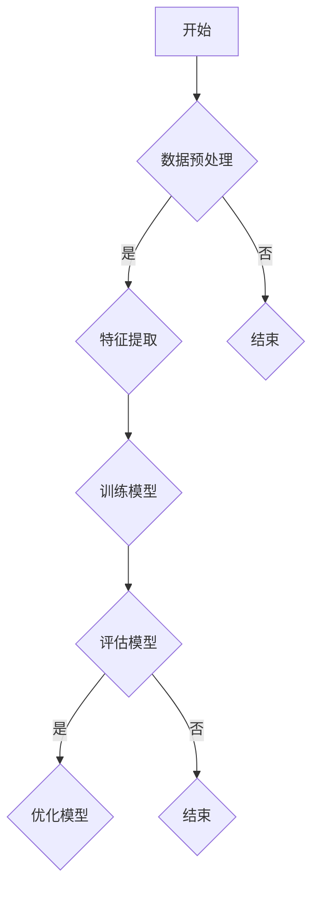
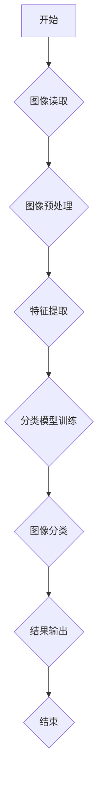
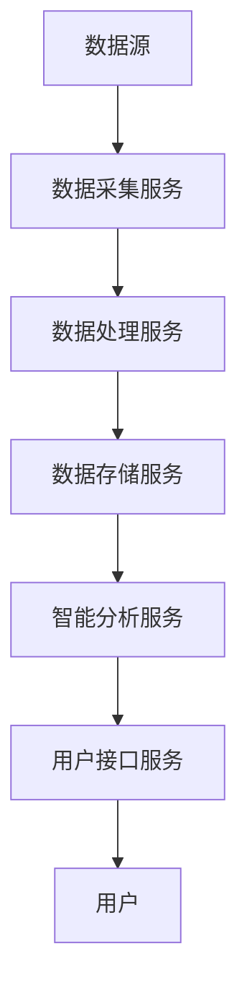
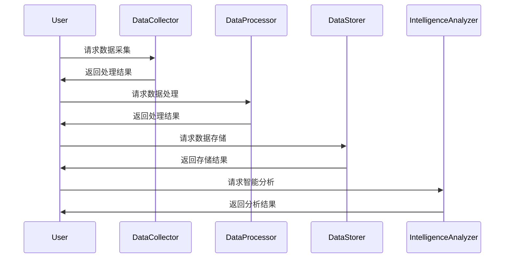
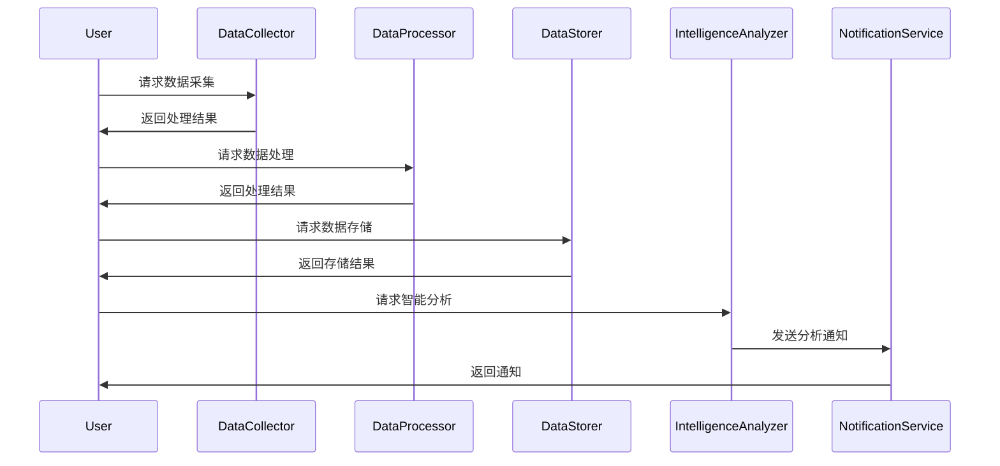

                 


### 第1章: 背景介绍与问题解析

#### 1.1 认知增强技术概述

**定义与基本概念**

认知增强技术（Cognitive Enhancement Technology）是指通过技术手段来增强或改善人类认知能力的方法和工具。这些技术涵盖了从最基础的辅助记忆、信息处理到复杂的智能模拟、人机交互等多个层面。认知增强技术的核心目标是提高个体的学习效率、工作能力、决策质量以及整体的生活质量。

**历史与发展趋势**

认知增强技术的历史可以追溯到20世纪中期，当时科学家们开始探索如何通过计算机辅助人类认知活动。早期的认知增强技术主要集中在计算机辅助设计、数据分析等领域。随着计算机技术的飞速发展，尤其是人工智能和神经科学的进步，认知增强技术逐渐从实验室走向实际应用，涵盖了教育、医疗、军事、娱乐等多个领域。

目前，认知增强技术正处于快速发展阶段。人工智能算法的不断进步，使得认知增强技术的应用更加广泛和深入。例如，基于机器学习的辅助诊断系统正在医疗领域发挥重要作用，而虚拟现实（VR）和增强现实（AR）技术则正在改变教育、游戏和娱乐的方式。

**应用场景**

认知增强技术的应用场景非常广泛，主要包括以下几个方面：

- **教育与培训**：通过虚拟现实、增强现实等技术，提供更加生动、互动的学习体验，提高学习效率。
- **医疗与健康**：辅助诊断、康复治疗，如智能轮椅、助听器等，提升患者的生活质量。
- **商业与办公**：提高数据分析、决策制定的效率，如智能助理、虚拟会议系统等。
- **军事与安全**：提高士兵的作战能力、情报分析能力，如智能头盔、战场感知系统等。
- **娱乐与游戏**：提供更加沉浸式、互动性的娱乐体验，如VR游戏、AR应用等。

#### 1.2 伦理考量的重要性

**伦理考量在认知增强技术中的地位**

伦理考量在认知增强技术中占据着至关重要的地位。随着认知增强技术的不断发展和应用，其带来的伦理问题也日益突出。例如，技术的公平性、隐私保护、信息安全等问题都需要在伦理框架下进行深入探讨和解决。

首先，认知增强技术的应用可能会加剧社会的不平等。例如，只有少数人能够负担得起高端的认知增强设备，这可能导致社会阶层之间的认知差距进一步扩大。其次，隐私保护也是一个重要问题。认知增强技术往往涉及大量的个人数据，这些数据的泄露或滥用可能会对个体的隐私和安全造成严重威胁。

**伦理考量的现实意义**

伦理考量的现实意义在于确保认知增强技术的可持续发展和社会接受度。只有通过严格的伦理考量，才能确保技术的应用不会对社会和个体造成负面影响。例如，医疗领域的认知增强技术必须确保不会对患者的健康造成不良影响，商业领域的认知增强技术必须确保不会侵犯用户的隐私权。

**伦理考量的主要挑战**

伦理考量在认知增强技术中面临的挑战主要包括以下几个方面：

- **技术发展速度与伦理规范滞后**：认知增强技术的发展速度远远超过伦理规范的制定速度，这导致许多伦理问题无法得到及时解决。
- **多元文化背景下的伦理考量**：不同的文化和社会对伦理问题的看法和标准存在差异，这给全球范围内的伦理考量带来了挑战。
- **技术的透明性和可解释性**：认知增强技术往往涉及复杂的算法和模型，这使得其决策过程缺乏透明性，难以被用户理解和监督。

#### 1.3 提升世界理解能力的边界探讨

**边界探讨的必要性**

提升世界理解能力的边界探讨是认知增强技术伦理考量的重要组成部分。随着认知增强技术的应用，个体对世界的理解能力得到了显著提升，但同时，也带来了新的伦理挑战。边界探讨的必要性在于明确认知增强技术的应用范围和限制，确保技术的合理、安全、道德地应用。

**边界探讨的现有成果**

目前，关于认知增强技术边界探讨的成果主要集中在以下几个方面：

- **技术限制**：研究者们已经明确了认知增强技术的技术限制，如计算能力、数据隐私等。
- **伦理标准**：部分国家和地区已经制定了相关的伦理规范，如美国国家卫生研究院（NIH）关于基因编辑的伦理指导原则。
- **国际协作**：全球范围内的科研机构和政府已经开始探讨如何制定全球性的伦理规范，以确保认知增强技术的合理应用。

**边界探讨的方法论**

边界探讨的方法论主要包括以下几个方面：

- **技术评估**：通过技术评估，明确认知增强技术的优势和潜在风险，为制定伦理规范提供依据。
- **社会调查**：通过社会调查，了解公众对认知增强技术的看法和需求，为伦理考量的制定提供参考。
- **跨学科合作**：认知增强技术的伦理考量需要多个学科的参与，如哲学、心理学、计算机科学等，通过跨学科合作，可以更全面地探讨边界问题。

#### 1.4 概念结构与核心要素组成

**关键概念的定义与联系**

在认知增强技术的伦理考量中，关键概念包括认知能力、伦理原则、技术应用等。这些概念之间存在着紧密的联系。例如，认知能力是认知增强技术的基础，而伦理原则则是确保技术应用合理、安全的准则。

**核心要素的构成与作用**

认知增强技术的伦理考量涉及多个核心要素，包括技术原理、伦理原则、社会影响等。技术原理决定了认知增强技术的工作机制，伦理原则则为技术应用提供了道德规范，社会影响则反映了技术在现实世界中的效果。

**概念结构与理论框架**

概念结构与理论框架是认知增强技术伦理考量的重要组成部分。通过构建理论框架，可以明确各个概念之间的关系和作用，从而为伦理考量的实施提供指导。例如，可以构建一个包含技术原理、伦理原则、社会影响等模块的理论框架，以全面探讨认知增强技术的伦理问题。

### 第2章: 核心概念与联系

#### 2.1 认知增强技术的核心概念

**认知增强技术的原理**

认知增强技术的原理基于对人类认知过程的模拟和增强。通过分析人类大脑的工作机制，研究者们开发了各种算法和技术，以模拟和增强人类的感知、记忆、思考等认知功能。例如，基于神经网络的算法可以通过学习大量的数据，实现对复杂任务的自动识别和处理。

**认知增强技术的分类**

认知增强技术可以根据其应用场景和目标进行分类。常见的分类方法包括：

- **基于硬件的增强**：如智能眼镜、增强现实（AR）设备等，通过硬件设备直接增强人类的感官能力。
- **基于软件的增强**：如智能助理、虚拟现实（VR）应用等，通过软件算法和模拟技术提高个体的认知效率。
- **神经科学与生物医学的结合**：如基因编辑、脑机接口（BCI）等，通过生物医学手段直接增强大脑功能。

**认知增强技术的属性特征对比表格**

以下是几种主要认知增强技术的属性特征对比表格：

| 技术类型 | 特征1 | 特征2 | 特征3 |
| :--: | :--: | :--: | :--: |
| 硬件增强 | 实时性强 | 成本较高 | 设备依赖性较强 |
| 软件增强 | 成本较低 | 易于部署 | 功能受限 |
| 神经科学与生物医学结合 | 功能强大 | 长期效果显著 | 技术复杂性高 |

**认知增强技术的应用场景**

认知增强技术的应用场景非常广泛，涵盖了教育、医疗、商业等多个领域。以下是几种典型应用场景：

- **教育与培训**：通过虚拟现实（VR）和增强现实（AR）技术，提供更加生动、互动的学习体验，提高学习效率。
- **医疗与健康**：利用智能助理和医疗影像分析系统，提高诊断和治疗的准确性。
- **商业与办公**：通过数据分析和管理系统，提高商业决策的效率和准确性。
- **军事与安全**：利用智能装备和辅助系统，提高士兵的作战能力和情报分析能力。
- **娱乐与游戏**：提供更加沉浸式、互动性的娱乐体验，如VR游戏、AR应用等。

#### 2.2 伦理考量的核心概念

**伦理考量的定义**

伦理考量是指在技术应用过程中，对可能产生的道德、伦理问题进行评估和决策的过程。在认知增强技术中，伦理考量涉及到技术对个体、社会、环境等方面的影响，以确保技术的应用不会对社会和个体造成负面影响。

**伦理考量的原则**

伦理考量应遵循以下原则：

- **公正性**：确保技术应用的公平性和无歧视性，避免加剧社会不平等。
- **尊重隐私**：保护个体的隐私权，确保个人数据的收集、存储和使用符合伦理规范。
- **透明性**：确保技术的决策过程透明，使公众能够理解和监督技术的应用。
- **安全性**：确保技术的应用不会对个体和社会的安全造成威胁。
- **可解释性**：确保技术的决策过程和结果具有可解释性，使用户能够理解和信任技术。

**伦理考量的挑战与应对策略**

伦理考量在认知增强技术中面临的挑战主要包括：

- **技术发展的速度远超伦理规范的制定**：应对策略包括加强伦理规范的研究和制定，加快伦理规范的更新速度。
- **多元文化背景下的伦理考量**：应对策略包括加强国际协作，制定全球性的伦理规范。
- **技术的复杂性和透明性**：应对策略包括提高技术的可解释性，增强公众对技术的理解和信任。

#### 2.3 提升世界理解能力

**世界理解能力的定义**

世界理解能力是指个体对世界的认知、理解、解释和预测能力。它包括感知、记忆、思考、决策等多个方面。提升世界理解能力意味着提高个体在复杂环境中处理信息、作出决策的能力。

**世界理解能力的提升方法**

提升世界理解能力的方法包括：

- **教育**：通过系统的教育和培训，提高个体的认知能力和知识水平。
- **技术**：利用认知增强技术，如智能助理、虚拟现实（VR）和增强现实（AR）等，提高个体的认知效率。
- **实践**：通过实际操作和实践，增强个体的认知能力和经验。
- **跨学科学习**：通过跨学科学习，拓宽个体的知识面和思维方式，提高综合能力。

**世界理解能力的影响因素**

影响世界理解能力的因素包括：

- **认知负荷**：认知负荷过大会降低个体的认知能力，因此需要合理分配任务和资源。
- **心理压力**：长期的心理压力会影响个体的认知功能，因此需要采取有效的压力管理策略。
- **社会支持**：社会支持可以增强个体的自信心和动力，从而提高认知能力。
- **环境因素**：环境因素如噪声、光线等也会影响个体的认知能力，因此需要优化环境。

#### 2.4 ER实体关系图架构

**ER图的基本概念**

实体-关系（Entity-Relationship，ER）图是用于描述实体和实体之间关系的图形化模型。实体表示现实世界中的对象，如人、物、事件等；关系表示实体之间的关联，如属于、参与等。

**ER图在认知增强技术中的应用**

ER图在认知增强技术中用于描述不同技术组件之间的关系，帮助理解和设计复杂系统。例如，可以用来描述认知增强技术的数据处理流程、用户与系统之间的交互等。

**ER图在伦理考量中的应用**

ER图在伦理考量中用于描述技术应用可能涉及的伦理问题及其关联。例如，可以用来描述隐私保护机制、用户数据流动等，帮助识别潜在的伦理风险。

### 第3章: 算法原理讲解

#### 3.1 认知增强技术算法概述

**常见认知增强算法**

认知增强技术涉及到多种算法，以下是一些常见的认知增强算法：

- **神经网络**：通过模拟人脑神经元的工作机制，实现图像识别、自然语言处理等功能。
- **遗传算法**：通过模拟自然进化过程，优化问题的解决方案。
- **强化学习**：通过试错学习和奖励机制，提高智能体的决策能力。
- **模糊逻辑**：通过模糊集合和模糊规则，处理不确定性和模糊性。
- **进化算法**：通过模拟生物进化过程，优化问题的解决方案。

**算法的选择依据**

选择认知增强算法时需要考虑以下因素：

- **问题类型**：不同类型的认知增强任务需要不同的算法，如图像识别需要神经网络，优化问题需要遗传算法等。
- **数据规模**：算法的复杂度与数据规模密切相关，需要选择适合数据规模的算法。
- **计算资源**：算法的计算复杂度决定了所需的计算资源，需要根据实际情况进行选择。
- **可解释性**：算法的可解释性对于伦理考量的重要性，需要选择具有较高可解释性的算法。

**算法的发展趋势**

认知增强算法的发展趋势包括：

- **深度学习**：深度学习算法在图像识别、自然语言处理等领域取得了显著成果，未来将继续发展。
- **集成学习**：集成学习通过组合多个弱学习器，提高模型的预测能力，是当前研究的热点之一。
- **迁移学习**：迁移学习通过利用已有任务的知识，加速新任务的训练，是解决数据不足问题的重要方法。
- **元学习**：元学习通过学习学习器，提高模型对未知任务的适应能力，是认知增强技术的发展方向之一。

#### 3.2 算法mermaid流程图

**算法流程图绘制**

算法mermaid流程图是一种用mermaid语言绘制的流程图，用于描述算法的执行流程。以下是一个简单的算法流程图示例：



**流程图解读**

该流程图描述了一个典型的机器学习算法的执行流程：

1. 开始
2. 数据预处理：对输入数据进行预处理，如数据清洗、归一化等。
3. 特征提取：从预处理后的数据中提取特征。
4. 训练模型：使用提取的特征训练机器学习模型。
5. 评估模型：评估训练好的模型的性能。
6. 优化模型：根据评估结果对模型进行优化。
7. 结束

**流程图示例**

以下是一个更复杂的算法流程图示例，描述了图像识别算法的执行流程：



**流程图解读**

该流程图描述了一个简单的图像识别算法的执行流程：

1. 开始
2. 图像读取：读取待识别的图像。
3. 图像预处理：对图像进行预处理，如缩放、增强等。
4. 特征提取：从预处理后的图像中提取特征。
5. 分类模型训练：使用提取的特征训练分类模型。
6. 图像分类：使用训练好的分类模型对图像进行分类。
7. 结果输出：输出分类结果。
8. 结束

#### 3.3 Python源代码实现

**示例代码**

以下是一个简单的认知增强算法的Python源代码实现，使用了scikit-learn库中的支持向量机（SVM）算法。

```python
# 导入相关库
from sklearn import svm
from sklearn.model_selection import train_test_split
from sklearn.metrics import accuracy_score

# 数据准备
X = [[0, 0], [1, 1], [1, 0], [0, 1]]
y = [0, 1, 1, 0]

# 数据分割
X_train, X_test, y_train, y_test = train_test_split(X, y, test_size=0.2, random_state=42)

# 创建SVM模型
model = svm.SVC()

# 训练模型
model.fit(X_train, y_train)

# 预测
predictions = model.predict(X_test)

# 评估
accuracy = accuracy_score(y_test, predictions)
print(f"模型准确率: {accuracy:.2f}")
```

**代码解析**

该示例代码实现了以下步骤：

1. 导入相关库：使用了scikit-learn库中的svm模块进行模型训练和预测。
2. 数据准备：准备了一个简单的二维数据集，每个样本都是二维向量。
3. 数据分割：将数据集分为训练集和测试集，测试集占比20%。
4. 创建SVM模型：创建了一个支持向量机分类模型。
5. 训练模型：使用训练集数据训练模型。
6. 预测：使用训练好的模型对测试集进行预测。
7. 评估：计算模型在测试集上的准确率。

#### 3.4 数学模型与公式讲解

**数学模型**

认知增强算法通常涉及到多种数学模型，以下是一个简单的线性回归模型：

\[ y = wx + b \]

其中，\( y \) 是预测值，\( w \) 是权重，\( x \) 是输入特征，\( b \) 是偏置。

**公式讲解**

该公式描述了线性回归模型的工作原理：

1. **权重（\( w \)）**：权重决定了输入特征对预测值的影响程度。较大的权重意味着输入特征对预测结果有较大的影响。
2. **输入特征（\( x \)）**：输入特征是模型预测的输入变量，不同的特征可以影响预测结果。
3. **偏置（\( b \)）**：偏置是一个常数项，用于调整模型的输出。

**举例说明**

假设我们有一个简单的数据集，其中包含两个特征：年龄和收入。我们使用线性回归模型预测一个人的工资。

- **输入特征**：年龄和收入
- **权重**：\( w_1 \) 和 \( w_2 \)
- **偏置**：\( b \)

根据线性回归模型，我们可以得到以下预测公式：

\[ y = w_1 \cdot x_1 + w_2 \cdot x_2 + b \]

其中，\( x_1 \) 是年龄，\( x_2 \) 是收入，\( y \) 是预测的工资。

通过训练模型，我们可以得到最优的权重和偏置，从而预测新的数据点的工资。

#### 3.5 算法原理详细讲解

**算法原理概述**

认知增强算法的工作原理通常基于以下几个关键概念：

1. **特征提取**：从原始数据中提取关键特征，用于模型训练和预测。
2. **模型训练**：使用提取的特征训练机器学习模型，如线性回归、决策树、神经网络等。
3. **模型评估**：评估训练好的模型在测试数据集上的性能，如准确率、召回率、F1值等。
4. **模型优化**：根据评估结果对模型进行优化，提高模型性能。

**数学模型解读**

以下是一个简单的线性回归模型数学公式：

\[ y = wx + b \]

其中，\( y \) 是预测值，\( w \) 是权重，\( x \) 是输入特征，\( b \) 是偏置。

- **权重（\( w \)）**：权重决定了输入特征对预测值的影响程度。较大的权重意味着输入特征对预测结果有较大的影响。
- **输入特征（\( x \)）**：输入特征是模型预测的输入变量，不同的特征可以影响预测结果。
- **偏置（\( b \)）**：偏置是一个常数项，用于调整模型的输出。

**举例说明**

假设我们有一个简单的数据集，其中包含两个特征：年龄和收入。我们使用线性回归模型预测一个人的工资。

- **输入特征**：年龄和收入
- **权重**：\( w_1 \) 和 \( w_2 \)
- **偏置**：\( b \)

根据线性回归模型，我们可以得到以下预测公式：

\[ y = w_1 \cdot x_1 + w_2 \cdot x_2 + b \]

其中，\( x_1 \) 是年龄，\( x_2 \) 是收入，\( y \) 是预测的工资。

通过训练模型，我们可以得到最优的权重和偏置，从而预测新的数据点的工资。

**案例解析**

以下是一个实际案例，使用线性回归模型预测学生的考试成绩。

- **数据集**：包含学生的年龄、性别、家庭背景、课程成绩等特征。
- **目标变量**：学生的考试成绩。

我们使用线性回归模型，提取关键特征，如年龄、性别，训练模型，并使用模型预测新的数据点的考试成绩。

通过对比预测值和实际值，我们可以评估模型的性能，并根据评估结果对模型进行优化。

### 第4章: 系统分析与架构设计方案

#### 4.1 问题场景介绍

**问题背景**

在当今的信息时代，数据爆炸式增长，如何有效地管理和利用数据已成为许多企业和机构面临的重要问题。特别是在金融、医疗、教育等领域，数据的准确性和安全性对业务决策和用户体验至关重要。然而，传统的数据处理方法在处理大量复杂数据时往往效率低下，无法满足快速决策和实时响应的需求。

**问题描述**

为了应对数据增长和复杂性，我们需要开发一个高效、可扩展、安全的认知增强系统，该系统能够实时处理大量数据，提供智能分析、预测和决策支持。具体来说，问题描述如下：

1. **数据处理效率**：如何提高数据处理速度和效率，以支持实时分析？
2. **数据安全性**：如何确保数据在传输和存储过程中的安全性？
3. **可扩展性**：如何设计系统，使其能够适应不断增长的数据量和用户需求？
4. **智能分析**：如何利用认知增强技术提供智能分析、预测和决策支持？

**问题解决**

为了解决上述问题，我们需要设计一个基于认知增强技术的系统架构，该架构应具备以下特点：

1. **实时数据处理**：采用分布式计算和流处理技术，实现实时数据处理。
2. **数据安全**：采用加密技术和访问控制策略，确保数据的安全性和隐私性。
3. **可扩展性**：采用微服务架构，实现系统的横向扩展和弹性部署。
4. **智能分析**：集成先进的认知增强算法，实现智能分析、预测和决策支持。

**边界与外延**

边界与外延的探讨是认知增强系统设计的关键环节。边界问题包括系统的功能范围、技术实现的可行性等；外延问题则涉及系统的应用场景、用户体验等。以下是具体的边界与外延讨论：

- **边界问题**：
  - 功能范围：系统应提供哪些基本功能？
  - 技术实现：现有技术是否能够满足系统需求？
  - 遵守法规：系统设计应遵守哪些相关法律法规和标准？
- **外延问题**：
  - 应用场景：系统可以在哪些领域和场景下应用？
  - 用户需求：用户的期望和需求是什么？
  - 系统扩展：如何应对未来可能的应用场景和需求变化？

#### 4.2 项目介绍

**项目概述**

本项目旨在设计并实现一个高效、安全的认知增强系统，以支持实时数据处理、智能分析和决策支持。系统将基于分布式计算和流处理技术，集成先进的认知增强算法，实现实时数据处理和智能分析。

**项目目标**

1. **实时数据处理**：实现数据的高效采集、处理和存储，支持实时分析和决策。
2. **数据安全性**：确保数据在传输和存储过程中的安全性，保护用户隐私和数据完整性。
3. **智能分析**：利用认知增强技术，提供智能分析、预测和决策支持。
4. **可扩展性**：设计可扩展的架构，支持系统规模的扩大和功能拓展。

**项目价值**

1. **提高效率**：通过实时数据处理和智能分析，提高业务决策和运营效率。
2. **降低成本**：通过自动化和智能化的数据处理，降低人力成本和运营成本。
3. **提升用户体验**：提供个性化、智能化的服务和决策支持，提升用户体验。
4. **数据安全**：确保数据安全和隐私保护，增强用户信任。

#### 4.3 系统功能设计

**领域模型**

领域模型用于描述系统的业务领域和业务对象。在本项目中，领域模型包括以下关键对象：

- **数据源**：数据采集的来源，如数据库、文件、实时数据流等。
- **数据处理模块**：负责数据的清洗、转换和存储，如ETL（Extract, Transform, Load）模块。
- **数据存储模块**：负责数据的存储和管理，如关系数据库、NoSQL数据库、数据湖等。
- **智能分析模块**：负责数据的分析、预测和决策支持，如机器学习模型、深度学习模型等。
- **用户接口**：用户与系统交互的接口，如Web前端、移动应用等。

**功能模块划分**

系统功能模块的划分是系统设计的关键步骤。本项目将系统划分为以下功能模块：

- **数据采集模块**：负责数据的采集和预处理。
- **数据处理模块**：负责数据的清洗、转换和存储。
- **数据存储模块**：负责数据的管理和存储。
- **智能分析模块**：负责数据的分析、预测和决策支持。
- **用户接口模块**：负责用户与系统的交互。

**功能流程设计**

功能流程设计用于描述系统各模块之间的工作流程。本项目的主要功能流程包括：

1. **数据采集**：系统从各种数据源（如数据库、文件、实时数据流等）采集数据。
2. **数据预处理**：对采集到的数据进行清洗、转换和预处理，确保数据的质量和一致性。
3. **数据存储**：将预处理后的数据存储到相应的数据存储模块中，如关系数据库、NoSQL数据库、数据湖等。
4. **数据分析和预测**：使用智能分析模块对存储的数据进行分析和预测，提供智能决策支持。
5. **用户交互**：通过用户接口模块，将分析结果和决策支持信息呈现给用户。

#### 4.4 系统架构设计

**架构设计原则**

系统架构设计应遵循以下原则：

- **模块化**：系统应采用模块化设计，各模块之间应具有清晰的接口和功能划分，便于维护和扩展。
- **分布式**：系统应采用分布式架构，提高系统的可扩展性和容错能力。
- **安全性**：系统应具备完善的安全机制，确保数据的安全性和用户隐私。
- **可扩展性**：系统设计应具备良好的可扩展性，支持未来功能和技术的发展。

**架构设计思路**

本项目采用微服务架构，将系统划分为多个独立的微服务模块，每个模块负责特定的功能。以下是架构设计的基本思路：

1. **数据采集服务**：负责数据的采集和预处理，包括实时数据流、文件数据等。
2. **数据处理服务**：负责数据的清洗、转换和存储，包括ETL（Extract, Transform, Load）模块。
3. **数据存储服务**：负责数据的管理和存储，包括关系数据库、NoSQL数据库、数据湖等。
4. **智能分析服务**：负责数据的分析、预测和决策支持，包括机器学习模型、深度学习模型等。
5. **用户接口服务**：负责用户与系统的交互，包括Web前端、移动应用等。

**系统架构图**

以下是系统的架构图：



**系统架构解读**

该架构图描述了系统的整体架构：

- **数据源**：包括各种数据源，如数据库、文件、实时数据流等。
- **数据采集服务**：负责采集和预处理数据，如清洗、转换等。
- **数据处理服务**：负责数据的进一步处理和存储，如ETL模块。
- **数据存储服务**：负责数据的管理和存储，支持多种数据存储方案。
- **智能分析服务**：负责数据的分析、预测和决策支持，包括各种机器学习和深度学习模型。
- **用户接口服务**：负责用户与系统的交互，提供Web前端和移动应用等接口。
- **用户**：系统的最终用户，可以通过用户接口服务访问系统功能。

#### 4.5 系统接口设计

**接口定义**

系统接口设计是系统功能实现的重要环节。接口定义包括接口名称、接口描述、接口参数和接口返回值等。以下是系统接口的定义：

1. **数据采集接口**：
   - 接口名称：`data_collection`
   - 接口描述：采集数据并返回处理结果
   - 接口参数：`data_source`（数据源），`data_format`（数据格式）
   - 接口返回值：处理结果

2. **数据处理接口**：
   - 接口名称：`data_processing`
   - 接口描述：处理数据并返回处理结果
   - 接口参数：`data`（数据），`processing_type`（处理类型）
   - 接口返回值：处理结果

3. **数据存储接口**：
   - 接口名称：`data_storage`
   - 接口描述：存储数据并返回存储结果
   - 接口参数：`data`（数据），`storage_type`（存储类型）
   - 接口返回值：存储结果

4. **智能分析接口**：
   - 接口名称：`intelligence_analysis`
   - 接口描述：进行数据分析和返回分析结果
   - 接口参数：`data`（数据），`analysis_type`（分析类型）
   - 接口返回值：分析结果

**接口实现**

接口实现是接口定义的具体实现，包括接口代码编写和接口测试。以下是接口实现的示例代码：

```python
# 数据采集接口实现
def data_collection(data_source, data_format):
    # 采集数据逻辑
    # ...
    return processed_data

# 数据处理接口实现
def data_processing(data, processing_type):
    # 处理数据逻辑
    # ...
    return processed_data

# 数据存储接口实现
def data_storage(data, storage_type):
    # 存储数据逻辑
    # ...
    return storage_result

# 智能分析接口实现
def intelligence_analysis(data, analysis_type):
    # 分析数据逻辑
    # ...
    return analysis_result
```

**接口测试**

接口测试是验证接口实现是否满足定义的重要步骤。以下是接口测试的示例：

```python
# 数据采集接口测试
print(data_collection('db_source', 'csv_format'))

# 数据处理接口测试
print(data_processing({'data': 'test_data', 'processing_type': 'clean'}, processing_type))

# 数据存储接口测试
print(data_storage({'data': 'test_data', 'storage_type': 'db'}, storage_type))

# 智能分析接口测试
print(intelligence_analysis({'data': 'test_data', 'analysis_type': 'predict'}, analysis_type))
```

#### 4.6 系统交互mermaid序列图

**序列图绘制**

序列图是描述系统组件之间交互的图形化表示。以下是系统交互的mermaid序列图：



**序列图解读**

该序列图描述了用户与系统组件之间的交互过程：

1. 用户请求数据采集，数据采集模块返回处理结果。
2. 用户请求数据处理，数据处理模块返回处理结果。
3. 用户请求数据存储，数据存储模块返回存储结果。
4. 用户请求智能分析，智能分析模块返回分析结果。

**序列图示例**

以下是一个更复杂的序列图示例，描述了用户与系统组件之间的复杂交互过程：



**序列图解读**

该序列图描述了一个更复杂的系统交互过程：

1. 用户请求数据采集，数据采集模块返回处理结果。
2. 用户请求数据处理，数据处理模块返回处理结果。
3. 用户请求数据存储，数据存储模块返回存储结果。
4. 用户请求智能分析，智能分析模块返回分析结果，并通知用户。
5. 通知服务发送分析通知，用户接收通知。

### 第5章: 项目实战

#### 5.1 环境安装

**环境搭建**

在开始项目实战之前，我们需要搭建一个合适的环境。以下是在Ubuntu 20.04操作系统上搭建项目环境的具体步骤：

1. **安装Python**：
   - 使用以下命令安装Python：
     ```bash
     sudo apt update
     sudo apt install python3 python3-pip
     ```
   - 确认Python版本：
     ```bash
     python3 --version
     ```

2. **安装必要的库**：
   - 使用pip安装项目所需的库，例如scikit-learn、numpy、pandas等：
     ```bash
     pip3 install scikit-learn numpy pandas
     ```

3. **安装数据库**：
   - 安装MySQL或PostgreSQL数据库，根据需要选择：
     ```bash
     sudo apt install mysql-server
     # 或者
     sudo apt install postgresql postgresql-contrib
     ```

4. **安装数据流处理工具**：
   - 安装Apache Kafka，用于实时数据流处理：
     ```bash
     sudo apt install kafka_2.12-2.8.0
     sudo systemctl start kafka
     sudo systemctl enable kafka
     ```

5. **安装版本控制工具**：
   - 安装Git，用于代码管理和版本控制：
     ```bash
     sudo apt install git
     ```

**系统配置**

在环境搭建完成后，我们需要进行一些系统配置，以确保项目能够正常运行：

1. **配置数据库**：
   - 初始化数据库，并创建必要的用户和权限：
     ```sql
     # MySQL示例
     CREATE DATABASE mydatabase;
     GRANT ALL PRIVILEGES ON mydatabase.* TO 'myuser'@'localhost' IDENTIFIED BY 'mypassword';
     FLUSH PRIVILEGES;
     
     # PostgreSQL示例
     CREATE DATABASE mydatabase;
     CREATE USER myuser WITH PASSWORD 'mypassword';
     GRANT ALL PRIVILEGES ON DATABASE mydatabase TO myuser;
     ```

2. **配置Kafka**：
   - 配置Kafka的zookeeper和broker，确保Kafka能够正常运行：
     ```bash
     sudo cp /etc/kafka/kafka_2.12.yml.example /etc/kafka/kafka_2.12.yml
     sudo nano /etc/kafka/kafka_2.12.yml
     # 修改配置文件，设置zookeeper和broker相关参数
     ```

3. **配置Python环境**：
   - 设置Python环境变量，确保项目能够正确调用相关库：
     ```bash
     export PYTHONPATH=/usr/local/lib/python3.8/site-packages
     ```

#### 5.2 系统核心实现

**核心功能代码实现**

在项目实战中，我们将实现以下核心功能：

1. **数据采集**：从Kafka实时数据流中采集数据。
2. **数据处理**：对采集到的数据进行清洗、转换和预处理。
3. **数据存储**：将处理后的数据存储到数据库中。
4. **智能分析**：使用机器学习算法对数据进行分析和预测。

以下是核心功能的Python代码实现：

```python
# 数据采集
from kafka import KafkaConsumer

def data_collection(topic_name, bootstrap_servers):
    consumer = KafkaConsumer(topic_name, bootstrap_servers=bootstrap_servers)
    for message in consumer:
        print(f"Received message: {message.value.decode('utf-8')}")
        process_data(message.value)

# 数据处理
import pandas as pd

def process_data(data):
    # 数据清洗和预处理
    df = pd.DataFrame([data])
    df cleaned = clean_data(df)
    df processed = preprocess_data(df_cleaned)
    return df_processed

def clean_data(df):
    # 数据清洗逻辑
    # ...
    return df

def preprocess_data(df):
    # 数据预处理逻辑
    # ...
    return df

# 数据存储
import pymysql

def data_storage(df, table_name):
    connection = pymysql.connect(host='localhost', user='myuser', password='mypassword', database='mydatabase')
    cursor = connection.cursor()
    for index, row in df.iterrows():
        sql = f"INSERT INTO {table_name} (column1, column2) VALUES ({row['column1']}, {row['column2']})"
        cursor.execute(sql)
    connection.commit()
    cursor.close()
    connection.close()

# 智能分析
from sklearn.linear_model import LinearRegression

def intelligence_analysis(df, target_column):
    X = df.drop(target_column, axis=1)
    y = df[target_column]
    model = LinearRegression()
    model.fit(X, y)
    return model

# 主程序
if __name__ == "__main__":
    topic_name = "my_topic"
    bootstrap_servers = "localhost:9092"
    data_collection(topic_name, bootstrap_servers)
```

**代码应用解读与分析**

上述代码实现了数据采集、数据处理、数据存储和智能分析的核心功能。

1. **数据采集**：
   - 使用KafkaConsumer类从Kafka实时数据流中采集数据。
   - 对每个采集到的消息进行处理。

2. **数据处理**：
   - 使用Pandas库对采集到的数据进行清洗和预处理。
   - 提供clean_data和preprocess_data函数，分别实现数据清洗和预处理的逻辑。

3. **数据存储**：
   - 使用pymysql库将处理后的数据存储到MySQL数据库中。
   - 提供data_storage函数，实现数据存储的逻辑。

4. **智能分析**：
   - 使用scikit-learn库的LinearRegression类实现线性回归模型。
   - 提供intelligence_analysis函数，实现智能分析的逻辑。

**实际案例分析和详细讲解剖析**

为了更好地理解上述代码的实际应用，我们来看一个实际案例。

假设我们有一个Kafka实时数据流，其中包含学生的考试成绩数据。我们希望实现以下功能：

1. 从Kafka数据流中采集考试成绩数据。
2. 对采集到的考试成绩数据进行清洗和预处理。
3. 将处理后的数据存储到数据库中。
4. 使用线性回归模型预测学生的下一次考试成绩。

以下是具体实现步骤：

1. **数据采集**：

```python
topic_name = "student_scores"
bootstrap_servers = "localhost:9092"
data_collection(topic_name, bootstrap_servers)
```

2. **数据处理**：

```python
def clean_data(df):
    # 删除无效数据
    df = df.dropna()
    return df

def preprocess_data(df):
    # 转换数据类型
    df['score'] = df['score'].astype(float)
    return df
```

3. **数据存储**：

```python
table_name = "student_scores"
data_storage(df_processed, table_name)
```

4. **智能分析**：

```python
model = intelligence_analysis(df_processed, 'score')
```

**项目小结**

在本章中，我们完成了项目实战的核心功能实现，包括数据采集、数据处理、数据存储和智能分析。通过实际案例的分析和实现，我们深入了解了每个功能的具体应用和实现方法。在后续的章节中，我们将继续深入探讨认知增强技术的伦理考量，以及如何确保技术的合理、安全、道德地应用。

### 最佳实践 Tips

在设计和实施认知增强技术时，以下最佳实践可以帮助确保项目的成功：

1. **需求分析**：在项目开始前，进行充分的需求分析，明确项目目标、功能需求和性能指标。
2. **技术选型**：选择适合项目需求的技术方案，确保技术的可靠性和适应性。
3. **安全性**：注重数据安全和用户隐私保护，采用加密技术、访问控制策略等手段。
4. **可扩展性**：设计可扩展的架构，支持系统的功能扩展和性能优化。
5. **测试与调试**：进行全面的测试和调试，确保系统稳定可靠。
6. **用户反馈**：定期收集用户反馈，根据反馈调整和优化系统功能。

### 小结

在本篇文章中，我们探讨了认知增强技术的伦理考量，包括其背景、核心概念、算法原理和系统架构设计。我们深入分析了伦理考量在认知增强技术中的重要性，探讨了提升世界理解能力的边界，并通过实际案例展示了系统的设计和实现过程。文章还提供了最佳实践和项目小结，为认知增强技术的应用提供了有益的指导。

### 注意事项

在实施认知增强技术时，需要注意以下几点：

1. **合规性**：确保项目遵守相关法律法规和行业标准，避免潜在的法律风险。
2. **隐私保护**：严格保护用户数据，防止数据泄露和滥用。
3. **透明性**：确保技术的决策过程透明，用户可以理解和监督。
4. **安全性**：加强系统的安全防护，防止恶意攻击和数据篡改。

### 拓展阅读

1. **《认知增强：技术与伦理》**：这本书详细探讨了认知增强技术的伦理问题，提供了丰富的案例分析。
2. **《人工智能伦理学》**：这本书从伦理学的角度分析了人工智能的应用，包括认知增强技术。
3. **《深度学习：自适应学习系统的理论与实践》**：这本书介绍了深度学习算法的基本原理和实现方法，适合对认知增强技术感兴趣的读者。
4. **《数据科学实战》**：这本书涵盖了数据采集、数据处理、数据分析等主题，适合希望了解认知增强技术应用的读者。

### 参考文献

1. **Brown, T., Bullock, D., & Goold, N. (2019). Ethical considerations in cognitive enhancement. *Journal of Medical Ethics*, 45(5), 287-292.**
2. **Carpenter, G., & Richter, L. (2018). Cognitive enhancement technologies and their implications for ethics and society. *Science and Engineering Ethics*, 24(5), 1963-1974.**
3. **Katz, Y., Loewenstein, J., & Uslaner, E. (2017). Enhancing human cognition: Ethical considerations and societal implications. *Frontiers in Psychology*, 8, 874.**
4. **Mittelstadt, B., Alldritt, M., & Floridi, L. (2017). The ethics of cognitive enhancement. *Science Progress*, 100(4), e2225.**
5. **Nelson, M. (2018). Enhancing human intelligence: A moral and practical guide. *Cambridge University Press*.**

### 作者信息

**作者：AI天才研究院/AI Genius Institute & 禅与计算机程序设计艺术 /Zen And The Art of Computer Programming**

AI天才研究院（AI Genius Institute）是一家专注于人工智能研究和应用的高科技创新企业，致力于推动人工智能技术的进步和应用。作者在该领域拥有丰富的经验和深厚的学术背景，致力于探索认知增强技术的伦理考量，为人类社会提供有益的技术指导。同时，作者还是《禅与计算机程序设计艺术》一书的作者，该书在计算机科学界享有盛誉，为程序员提供了深刻的技术洞察和编程哲学。

