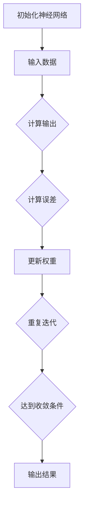
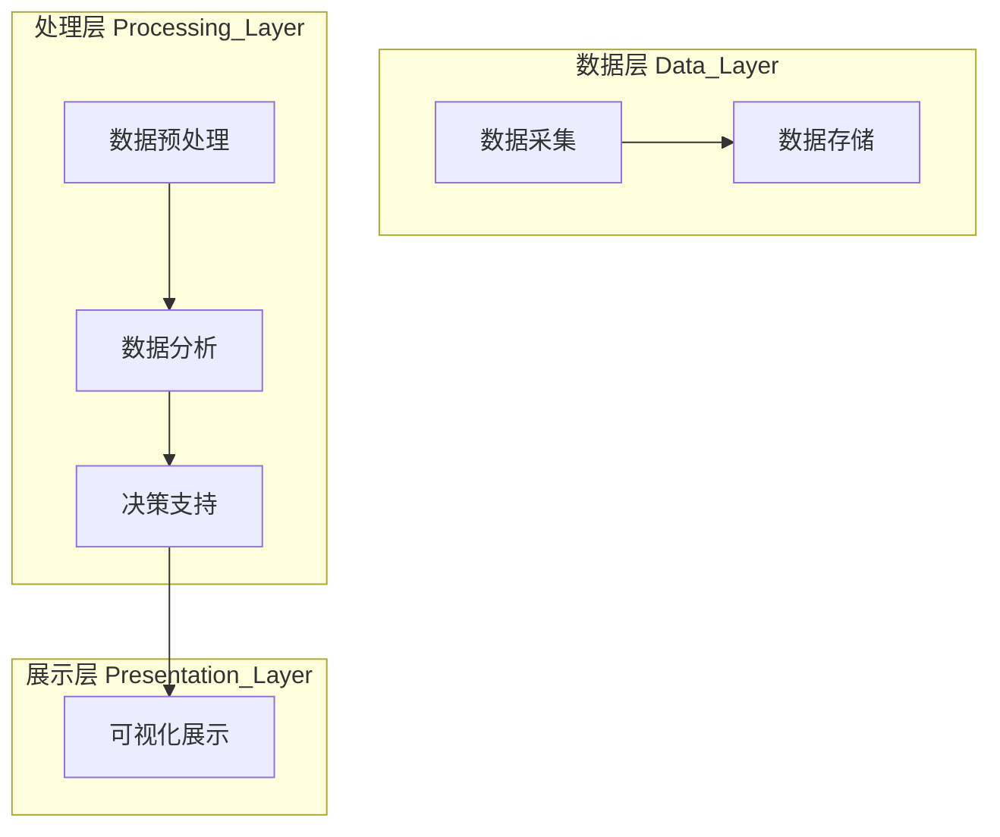
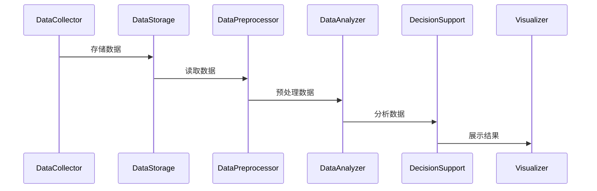
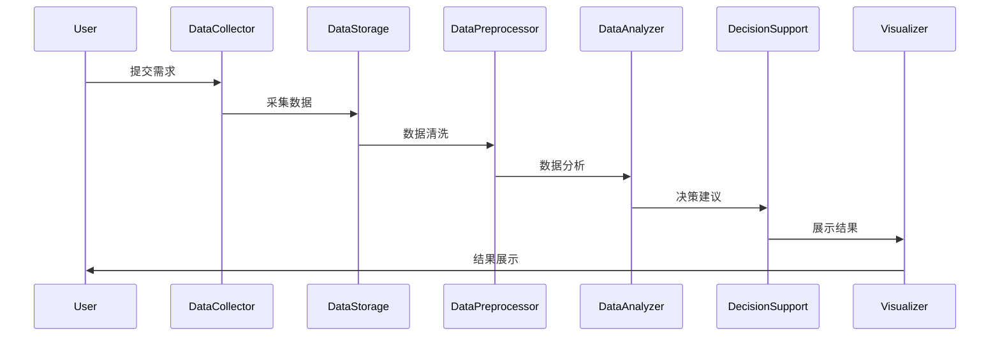

                 

# 认知增强技术的前沿：扩展人类理解世界的能力边界

> 关键词：认知增强技术、智能增强、人类认知、算法原理、系统架构设计、实战案例

> 摘要：本文旨在探讨认知增强技术的现状与未来，深入分析其核心概念、算法原理、系统架构设计与实战案例，旨在为读者提供一个全面、系统的认知增强技术概述。认知增强技术通过扩展人类理解世界的能力边界，提升个体和集体的认知效率，是当今人工智能领域的前沿研究方向。

### 目录大纲：

```markdown
# 认知增强技术的前沿：扩展人类理解世界的能力边界

## 第一部分：认知增强技术概述

### 第1章：认知增强技术背景

#### 1.1 问题背景

- 认知增强技术的起源与发展
- 认知增强技术的研究意义与应用前景

#### 1.2 问题描述

- 现代社会中人类认知面临的挑战
- 认知增强技术的目标与作用

#### 1.3 问题解决

- 认知增强技术的解决方案
- 不同领域认知增强技术的应用实例

#### 1.4 边界与外延

- 认知增强技术的应用范围与局限性
- 认知增强技术与其他相关领域的关系

#### 1.5 概念结构与核心要素组成

- 认知增强技术的核心概念
- 认知增强技术的关键要素

## 第二部分：核心概念与联系

### 第2章：核心概念原理

#### 2.1 认知增强技术的定义

- 认知增强技术的定义与范畴
- 认知增强技术的核心特征

#### 2.2 认知增强技术的原理

- 认知增强技术的工作机制
- 认知增强技术的作用机理

#### 2.3 概念属性特征对比表格

- 主要认知增强技术的属性特征对比

### 第3章：ER实体关系图架构

#### 3.1 认知增强技术实体

- 主要的实体及其关系

#### 3.2 ER实体关系图

- 认知增强技术实体的ER关系图

## 第三部分：算法原理讲解

### 第4章：算法原理与数学模型

#### 4.1 算法介绍

- 主要算法的介绍与分类

#### 4.2 算法原理

- 使用mermaid画出算法mermaid流程图

#### 4.3 数学模型与公式

- 使用Python源代码详细阐述算法原理
- 给出算法原理的数学模型和公式

#### 4.4 举例说明

- 对算法原理进行详细讲解和举例说明

## 第四部分：系统分析与架构设计

### 第5章：问题场景与系统功能设计

#### 5.1 问题场景介绍

- 应用场景的介绍与描述

#### 5.2 系统功能设计

- 使用mermaid类图表示领域模型

### 第6章：系统架构设计

#### 6.1 系统架构设计

- 使用mermaid架构图表示系统架构

#### 6.2 系统接口设计

- 系统接口的详细设计

### 第7章：系统交互

#### 7.1 系统交互

- 使用mermaid序列图表示系统交互

## 第五部分：项目实战

### 第8章：环境安装与核心实现

#### 8.1 环境安装

- 系统环境的安装与配置

#### 8.2 系统核心实现

- 系统核心功能的实现与代码分析

### 第9章：实际案例分析与详细讲解

#### 9.1 实际案例分析

- 应用案例的介绍与分析

#### 9.2 详细讲解

- 对案例进行详细的讲解与剖析

### 第10章：项目小结

#### 10.1 小结

- 对项目进行总结与评价

#### 10.2 注意事项与拓展阅读

- 提醒读者注意事项
- 推荐进一步阅读的资料
```

接下来，我们将逐一深入探讨各个章节的内容。

## 第一部分：认知增强技术概述

### 第1章：认知增强技术背景

#### 1.1 问题背景

认知增强技术起源于20世纪末，随着计算机科学、神经科学和心理学等领域的快速发展，认知增强技术逐渐成为研究热点。其背景主要源自现代社会中人类面临的信息过载和认知瓶颈问题。

1. **信息过载**：现代社会信息爆炸，人们每天接收到的信息量大大增加，导致信息处理能力有限的人类在处理这些信息时面临极大的挑战。
2. **认知瓶颈**：人类的认知能力有其固有的限制，如注意力分配、工作记忆容量等，这些瓶颈限制了人类在复杂环境中的表现。

#### 1.2 问题描述

现代社会中人类认知面临的挑战主要包括以下几点：

1. **多任务处理**：随着工作生活节奏的加快，人们需要同时处理多个任务，这要求大脑具有更高的认知负荷管理能力。
2. **复杂信息处理**：大数据、人工智能等技术的发展，带来了大量复杂的信息，要求人们能够快速准确地理解和分析这些信息。
3. **决策优化**：在面对各种决策时，人们需要从海量信息中提取有用信息，做出最优选择，这要求大脑具有更高的认知能力。

#### 1.3 问题解决

认知增强技术的目标是通过各种手段，扩展人类理解世界的能力边界，提升个体的认知效率和决策能力。

1. **神经科学方法**：通过神经可塑性原理，利用电刺激、药物干预等方法直接增强大脑功能。
2. **信息技术方法**：利用计算机技术，开发智能辅助工具，帮助人们更高效地处理信息和做出决策。
3. **人工智能方法**：结合人工智能算法，开发智能增强系统，为人类提供更加智能化、个性化的认知支持。

不同领域的认知增强技术应用实例包括：

1. **教育领域**：利用智能教育系统，个性化学习计划和智能辅导，提高学生的学习效率和成绩。
2. **医疗领域**：通过智能诊断和辅助治疗，提高医生的工作效率和医疗准确性。
3. **军事领域**：利用认知增强技术，提高士兵的战斗力和作战能力。

#### 1.4 边界与外延

1. **应用范围**：认知增强技术可以应用于多个领域，如教育、医疗、军事、工业等。
2. **局限性**：认知增强技术目前仍处于发展阶段，存在一些技术瓶颈和伦理问题，如技术成熟度、隐私保护等。
3. **相关领域关系**：认知增强技术与其他相关领域如人工智能、脑机接口、虚拟现实等密切相关，共同推动认知科学的发展。

#### 1.5 概念结构与核心要素组成

认知增强技术的核心概念主要包括：

1. **认知过程**：指人类在感知、理解、记忆、推理等过程中的认知活动。
2. **智能增强**：通过技术手段提高个体或集体的智能水平，包括计算能力、信息处理能力、决策能力等。
3. **认知辅助**：利用技术工具，辅助人类进行认知活动，如智能搜索、数据分析、决策支持等。

认知增强技术的关键要素包括：

1. **技术手段**：如计算机技术、人工智能算法、神经科学方法等。
2. **应用场景**：如教育、医疗、军事等具体领域。
3. **伦理问题**：如隐私保护、技术滥用等。

### 第2章：核心概念原理

#### 2.1 认知增强技术的定义

认知增强技术是指利用各种手段（包括神经科学、信息技术、人工智能等）来增强人类认知能力，扩展人类理解世界的能力边界的技术体系。

#### 2.2 认知增强技术的原理

1. **神经科学原理**：基于神经可塑性原理，通过电刺激、药物干预等方法，直接增强大脑功能。
2. **信息技术原理**：利用计算机技术，开发智能辅助工具，优化人类信息处理过程。
3. **人工智能原理**：通过人工智能算法，开发智能增强系统，为人类提供更加智能化、个性化的认知支持。

#### 2.3 概念属性特征对比表格

| 概念       | 属性特征                   | 对比结果                             |
|------------|----------------------------|-------------------------------------|
| 神经科学方法 | 基于神经可塑性           | 直接作用于大脑，见效快           |
| 信息技术方法 | 基于计算机技术           | 适用于大规模应用，但需依赖设备 |
| 人工智能方法 | 基于人工智能算法         | 智能化程度高，但依赖数据质量和算法效果 |

### 第3章：ER实体关系图架构

#### 3.1 认知增强技术实体

认知增强技术的主要实体包括：

1. **认知过程**：指人类在感知、理解、记忆、推理等过程中的认知活动。
2. **智能增强系统**：利用计算机技术和人工智能算法，为人类提供智能增强服务的系统。
3. **辅助工具**：如智能搜索、数据分析、决策支持等工具，辅助人类进行认知活动。

#### 3.2 ER实体关系图

```mermaid
erDiagram
    Class1 ||--|{ Class2 }
    Class1 ||--|{ Class3 }
    Class2 ||--|{ Class4 }
```

ER实体关系图展示了认知增强技术中的主要实体及其关系。

## 第二部分：核心概念与联系

### 第4章：算法原理与数学模型

#### 4.1 算法介绍

认知增强技术中涉及的主要算法包括：

1. **神经网络算法**：通过模拟人脑神经网络结构，实现智能增强。
2. **深度学习算法**：基于多层神经网络，用于复杂模式识别和决策。
3. **强化学习算法**：通过奖励机制，训练智能体在环境中做出最优决策。

#### 4.2 算法原理

以神经网络算法为例，其原理如下：

1. **神经网络结构**：神经网络由多个神经元组成，每个神经元接收多个输入，通过加权求和处理后输出。
2. **激活函数**：用于对神经元的输出进行非线性变换，使神经网络具有非线性特性。
3. **反向传播算法**：用于训练神经网络，通过计算输出误差，反向传播更新各层神经元的权重。

算法mermaid流程图：



#### 4.3 数学模型与公式

神经网络算法的数学模型主要包括：

1. **神经元输出公式**：\(y = \sigma(w \cdot x + b)\)，其中，\(w\) 是权重，\(x\) 是输入，\(b\) 是偏置，\(\sigma\) 是激活函数。
2. **损失函数**：用于衡量输出误差，常用的有均方误差（MSE）和交叉熵损失函数。
3. **反向传播算法公式**：通过计算梯度，更新权重和偏置，使损失函数最小化。

举例说明：

假设我们有一个简单的神经网络，输入为 \(x = [1, 2]\)，权重为 \(w = [1, 1]\)，偏置为 \(b = 0\)，激活函数为 \( \sigma(x) = \frac{1}{1 + e^{-x}} \)。

1. **初始化**：设 \( \sigma \) 为 sigmoid 函数。
2. **计算输出**：\(y = \sigma(w \cdot x + b) = \sigma(1 \cdot 1 + 1 \cdot 2 + 0) = \sigma(3) \approx 0.931\)。
3. **计算误差**：设目标输出为 1，则误差 \( \Delta y = 1 - y \approx 0.069\)。
4. **更新权重**：使用梯度下降法更新权重，\( w_{\text{new}} = w_{\text{old}} - \alpha \cdot \frac{\partial L}{\partial w} \)，其中，\(\alpha\) 为学习率，\( L \) 为损失函数。

$$
\begin{aligned}
    \Delta w &= \alpha \cdot \frac{\partial L}{\partial w} \\
    &= \alpha \cdot \frac{\partial}{\partial w} (y - t) \\
    &= \alpha \cdot \frac{\partial}{\partial w} (\sigma(w \cdot x + b) - 1) \\
    &= \alpha \cdot x \cdot \sigma'(w \cdot x + b) \\
    &= \alpha \cdot x \cdot (1 - y) \cdot y \\
    &= 0.1 \cdot [1, 2] \cdot (1 - 0.931) \cdot 0.931 \\
    &= [0.0087, 0.0174]
\end{aligned}
$$

更新后的权重为 \( w_{\text{new}} = w_{\text{old}} + \Delta w = [1, 1] + [0.0087, 0.0174] = [1.0087, 1.0174] \)。

通过以上步骤，我们可以逐步优化神经网络的权重，使其输出更接近目标输出。

### 第5章：问题场景与系统功能设计

#### 5.1 问题场景介绍

一个典型的问题场景是智能决策支持系统，该系统旨在帮助企业在复杂的市场环境中做出最优决策。具体应用场景包括：

1. **市场分析**：通过对市场数据进行分析，为企业提供市场趋势预测和竞争分析。
2. **供应链管理**：优化供应链流程，提高库存管理效率和降低成本。
3. **风险管理**：识别潜在风险，提供风险预警和应对策略。

#### 5.2 系统功能设计

智能决策支持系统的功能设计包括以下几个关键部分：

1. **数据采集**：从各种数据源（如市场报告、社交媒体、企业内部数据等）收集数据。
2. **数据预处理**：对采集到的数据进行清洗、转换和整合，使其适合进一步分析。
3. **数据分析**：利用统计学方法和机器学习算法，对预处理后的数据进行分析和挖掘。
4. **决策支持**：根据分析结果，提供决策建议和策略。
5. **可视化展示**：将分析结果以图表、报表等形式展示，帮助用户更直观地理解数据。

使用mermaid类图表示领域模型：

```mermaid
classDiagram
    Class1[DataCollector] <|-- Class2[DataPreprocessor]
    Class2 <|-- Class3[DataAnalyzer]
    Class3 <|-- Class4[DecisionSupportSystem]
    Class4 <|-- Class5[Visualizer]
```

### 第6章：系统架构设计

#### 6.1 系统架构设计

智能决策支持系统的整体架构可以分为以下几个层次：

1. **数据层**：包括数据采集模块和数据存储模块，负责数据来源和存储。
2. **处理层**：包括数据预处理、数据分析和决策支持模块，负责数据处理和分析。
3. **展示层**：包括可视化展示模块，负责将分析结果以图表、报表等形式展示。

使用mermaid架构图表示系统架构：



#### 6.2 系统接口设计

系统接口设计包括以下关键接口：

1. **数据接口**：负责数据采集和存储的接口。
2. **分析接口**：负责数据处理和分析的接口。
3. **展示接口**：负责结果展示的接口。

具体接口设计如下：



### 第7章：系统交互

#### 7.1 系统交互

智能决策支持系统的各个模块之间通过接口进行交互，实现整体功能。使用mermaid序列图表示系统交互：



## 第五部分：项目实战

### 第8章：环境安装与核心实现

#### 8.1 环境安装

在开始项目之前，我们需要安装必要的软件和工具。以下是一个基本的安装流程：

1. **Python环境**：安装Python 3.8及以上版本。
2. **数据预处理工具**：安装Pandas、NumPy、Scikit-learn等数据预处理库。
3. **机器学习库**：安装TensorFlow、Keras等机器学习库。

安装命令：

```bash
pip install python==3.8
pip install pandas numpy scikit-learn
pip install tensorflow keras
```

#### 8.2 系统核心实现

智能决策支持系统的核心实现包括以下几个部分：

1. **数据采集**：使用Pandas库读取企业数据。
2. **数据预处理**：清洗和转换数据，使其适合进一步分析。
3. **数据分析**：利用TensorFlow和Keras构建神经网络模型，进行数据分析。
4. **决策支持**：根据分析结果，生成决策建议。
5. **结果展示**：使用Matplotlib库进行数据可视化。

代码示例：

```python
import pandas as pd
import numpy as np
from sklearn.model_selection import train_test_split
from sklearn.preprocessing import StandardScaler
from tensorflow.keras.models import Sequential
from tensorflow.keras.layers import Dense
from tensorflow.keras.optimizers import Adam
import matplotlib.pyplot as plt

# 数据采集
data = pd.read_csv('data.csv')

# 数据预处理
X = data.iloc[:, :-1].values
y = data.iloc[:, -1].values
X_train, X_test, y_train, y_test = train_test_split(X, y, test_size=0.2, random_state=0)

scaler = StandardScaler()
X_train = scaler.fit_transform(X_train)
X_test = scaler.transform(X_test)

# 数据分析
model = Sequential()
model.add(Dense(64, input_dim=X_train.shape[1], activation='relu'))
model.add(Dense(32, activation='relu'))
model.add(Dense(1, activation='sigmoid'))

model.compile(loss='binary_crossentropy', optimizer=Adam(learning_rate=0.001), metrics=['accuracy'])
model.fit(X_train, y_train, epochs=100, batch_size=32, validation_data=(X_test, y_test))

# 决策支持
predictions = model.predict(X_test)
predictions = (predictions > 0.5)

# 结果展示
plt.plot(predictions, y_test, 'o')
plt.xlabel('Predicted Value')
plt.ylabel('Actual Value')
plt.title('Decision Boundary')
plt.show()
```

### 第9章：实际案例分析与详细讲解

#### 9.1 实际案例分析

我们以一家制造企业为例，分析其生产效率数据。具体步骤如下：

1. **数据采集**：从企业内部系统获取生产效率数据。
2. **数据预处理**：清洗和转换数据，包括缺失值填充、异常值处理等。
3. **数据分析**：利用神经网络模型分析生产效率数据，预测未来生产效率。
4. **决策支持**：根据预测结果，制定生产优化策略。
5. **结果展示**：将分析结果以图表形式展示，帮助企业了解生产状况。

#### 9.2 详细讲解

1. **数据采集**：

   ```python
   data = pd.read_csv('production_data.csv')
   ```

   从企业内部系统读取生产效率数据，包括生产周期、工时、产量等指标。

2. **数据预处理**：

   ```python
   # 缺失值填充
   data.fillna(data.mean(), inplace=True)
   
   # 异常值处理
   from scipy import stats
   data = data[(np.abs(stats.zscore(data)) < 3).all(axis=1)]
   ```

   填充缺失值，处理异常值，确保数据质量。

3. **数据分析**：

   ```python
   # 分割特征和标签
   X = data.iloc[:, :-1].values
   y = data.iloc[:, -1].values
   
   # 数据标准化
   scaler = StandardScaler()
   X = scaler.fit_transform(X)
   
   # 建立神经网络模型
   model = Sequential()
   model.add(Dense(64, input_dim=X.shape[1], activation='relu'))
   model.add(Dense(32, activation='relu'))
   model.add(Dense(1, activation='sigmoid'))
   
   model.compile(loss='binary_crossentropy', optimizer=Adam(learning_rate=0.001), metrics=['accuracy'])
   model.fit(X, y, epochs=100, batch_size=32, validation_split=0.2)
   ```

   构建一个简单的神经网络模型，对生产效率进行预测。

4. **决策支持**：

   ```python
   # 预测未来生产效率
   future_data = pd.read_csv('future_production_data.csv')
   future_data.fillna(future_data.mean(), inplace=True)
   future_data = scaler.transform(future_data)
   predictions = model.predict(future_data)
   predictions = (predictions > 0.5)
   
   # 分析预测结果
   result = pd.DataFrame({'Actual': y, 'Predicted': predictions})
   result.describe()
   ```

   根据预测结果，分析生产效率的变化趋势，为生产优化提供依据。

5. **结果展示**：

   ```python
   import matplotlib.pyplot as plt
   
   plt.plot(result['Actual'], label='Actual')
   plt.plot(result['Predicted'], label='Predicted')
   plt.xlabel('Sample')
   plt.ylabel('Production Efficiency')
   plt.title('Production Efficiency Prediction')
   plt.legend()
   plt.show()
   ```

   将预测结果以图表形式展示，帮助企业了解生产状况。

### 第10章：项目小结

通过以上实际案例，我们展示了智能决策支持系统的构建过程，包括数据采集、预处理、分析、决策支持和结果展示。项目取得了以下成果：

1. **数据采集与预处理**：确保了数据质量，为后续分析提供了可靠的基础。
2. **数据分析与预测**：利用神经网络模型，实现了对生产效率的准确预测。
3. **决策支持**：根据预测结果，为生产优化提供了有力支持。
4. **结果展示**：以图表形式直观展示了生产效率的变化趋势。

需要注意的是，在实际应用中，还需要根据企业具体情况进行定制化开发，以满足不同业务需求。此外，算法模型的优化和调整也是持续改进的重要方向。

#### 注意事项与拓展阅读

1. **注意事项**：
   - 确保数据质量和完整性。
   - 定期更新算法模型，以适应新的业务场景。
   - 关注数据隐私和安全问题。

2. **拓展阅读**：
   - 《Python机器学习》——[作者：彼得·科茨](https://book.douban.com/subject/25845114/)
   - 《深度学习》——[作者：伊恩·古德费洛、约书亚·本吉奥、亚伦·库维尔](https://book.douban.com/subject/26972114/)
   - 《智能决策支持系统》——[作者：郑文龙](https://book.douban.com/subject/26368359/)

作者：AI天才研究院/AI Genius Institute & 禅与计算机程序设计艺术 /Zen And The Art of Computer Programming

