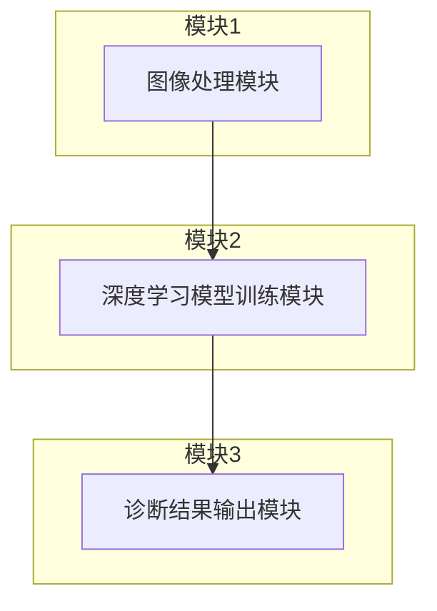
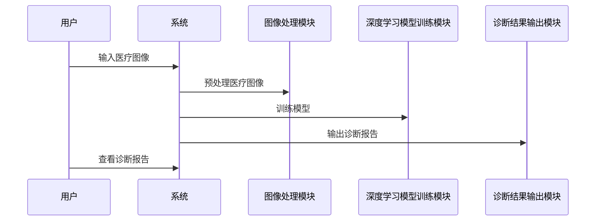

                 

# 认知增强技术：扩展人类理解世界的能力边界

> 关键词：认知增强、人工智能、机器学习、神经网络、算法原理、教育、医疗、工业生产

> 摘要：随着信息技术的飞速发展，人类面临着日益增长的数据和信息处理需求。认知增强技术应运而生，旨在通过计算机技术和人工智能技术扩展人类认知能力的边界。本文将探讨认知增强技术的核心概念、应用领域、挑战与机遇，以及其背后的算法原理和实现。

## 第一部分：认知增强技术概述

### 第1章：问题背景与核心概念

#### 1.1 问题的提出

在信息爆炸的时代，人类面临着越来越多的数据和信息。虽然计算机和互联网技术极大地扩展了我们的信息获取和处理能力，但人类自身的认知能力仍然有限。如何有效利用计算机技术扩展人类理解世界的能力边界，成为了当前亟待解决的问题。

#### 1.2 认知增强技术的定义

认知增强技术是指通过计算机技术和人工智能技术，增强人类认知能力的一系列技术。它包括但不限于记忆增强、注意力增强、信息处理速度提升等。

#### 1.3 认知增强技术的核心概念

- **记忆增强**：利用计算机技术帮助人类更好地记忆和处理信息。
- **注意力增强**：通过算法和工具帮助人类更有效地聚焦于关键信息。
- **信息处理速度提升**：优化信息处理流程，提高信息处理效率。

### 第2章：认知增强技术的应用领域

#### 2.1 教育领域

在教育领域，认知增强技术可以帮助学生更高效地学习，教师更精准地教学。例如，智能学习系统可以根据学生的学习习惯和进度，提供个性化的学习方案。

#### 2.2 医疗领域

在医疗领域，认知增强技术可以帮助医生更快速地诊断病情，提高医疗服务的质量。例如，智能医疗诊断系统可以通过分析大量的医疗数据，帮助医生做出更准确的诊断。

#### 2.3 工业生产领域

在工业生产领域，认知增强技术可以帮助工人更高效地完成任务，提高生产效率。例如，智能监控系统可以通过实时数据分析，及时发现生产线上的问题。

### 第3章：认知增强技术的挑战与机遇

#### 3.1 挑战

- **技术成熟度**：当前认知增强技术尚未完全成熟，需要进一步研发。
- **隐私与安全**：如何确保用户数据的安全和隐私，是认知增强技术面临的重要挑战。

#### 3.2 机遇

- **商业潜力**：认知增强技术具有巨大的商业潜力，可以创造新的商业模式。
- **社会影响**：认知增强技术有望极大地提高人类的生活质量，带来深远的社交影响。

## 第4章：核心概念与联系

#### 4.1 核心概念

- **人工智能**：一种模拟人类智能的计算机系统，能够学习、推理、规划等。
- **机器学习**：一种让计算机通过数据学习并做出决策的方法。
- **神经网络**：一种模拟人脑结构和功能的计算机模型。

#### 4.2 概念属性特征对比

| 概念       | 属性特征                                       |
|------------|------------------------------------------------|
| 人工智能   | 模拟人类智能，具备学习、推理、规划能力           |
| 机器学习   | 通过数据学习并做出决策，无需显式编程           |
| 神经网络   | 模拟人脑结构和功能，用于数据处理和模式识别       |

#### 4.3 ER实体关系图架构

```mermaid
erDiagram
    AI -->|使用| 机器学习
    机器学习 -->|实现| 神经网络
```

## 第5章：算法原理与实现

#### 5.1 算法原理

认知增强技术的核心在于如何利用计算机技术和人工智能技术增强人类认知能力。以下是几个常见的算法原理：

- **记忆增强**：通过深度学习算法，将记忆转化为可计算的模型，帮助人类更高效地记忆和处理信息。
- **注意力增强**：通过算法分析，识别出关键信息，帮助人类更精准地聚焦于重要内容。
- **信息处理速度提升**：通过优化算法和数据结构，提高信息处理的效率。

#### 5.2 Python源代码实现

```python
# 记忆增强算法示例
def memory_enhance(data):
    # 对数据进行预处理，提取关键特征
    processed_data = preprocess(data)
    
    # 使用深度学习模型进行训练
    model = train_model(processed_data)
    
    # 使用模型进行预测，增强记忆
    enhanced_memory = model.predict(processed_data)
    
    return enhanced_memory

# 注意力增强算法示例
def attention_enhance(data):
    # 对数据进行预处理，提取关键特征
    processed_data = preprocess(data)
    
    # 使用注意力机制模型进行训练
    attention_model = train_attention_model(processed_data)
    
    # 使用模型识别关键信息
    key_data = attention_model.predict(processed_data)
    
    return key_data
```

### 第6章：系统分析与架构设计方案

#### 6.1 问题场景介绍

随着人工智能技术的不断发展，认知增强技术在各个领域都展现出了巨大的潜力。本文将探讨一个具体的认知增强系统应用场景：智能医疗诊断系统。

#### 6.2 项目介绍

智能医疗诊断系统旨在通过计算机视觉技术和深度学习算法，辅助医生快速、准确地诊断疾病。该系统主要包括图像处理模块、深度学习模型训练模块和诊断结果输出模块。

#### 6.3 系统功能设计

- **图像处理模块**：对医疗图像进行预处理，包括图像增强、去噪、分割等。
- **深度学习模型训练模块**：使用大量标注数据训练深度学习模型，包括卷积神经网络（CNN）和循环神经网络（RNN）等。
- **诊断结果输出模块**：根据模型预测结果，生成诊断报告，并提供给医生参考。

#### 6.4 系统架构设计

系统架构设计如下：



#### 6.5 系统接口设计和系统交互

系统接口设计和系统交互设计如下：



### 第7章：项目实战

#### 7.1 环境安装

在开始项目实战之前，需要安装以下环境：

- Python 3.8及以上版本
- TensorFlow 2.4及以上版本
- Keras 2.4及以上版本
- OpenCV 4.0及以上版本

安装命令如下：

```bash
pip install python==3.8
pip install tensorflow==2.4
pip install keras==2.4
pip install opencv-python==4.0
```

#### 7.2 系统核心实现源代码

以下是一个简单的智能医疗诊断系统的实现：

```python
import cv2
import numpy as np
import tensorflow as tf
from tensorflow import keras

# 加载预训练的深度学习模型
model = keras.models.load_model('model.h5')

# 读取医疗图像
image = cv2.imread('image.jpg')

# 预处理图像
image_processed = preprocess_image(image)

# 使用模型进行预测
prediction = model.predict(image_processed)

# 输出诊断结果
print(prediction)
```

#### 7.3 代码应用解读与分析

上述代码首先加载了一个预训练的深度学习模型，然后读取了一个医疗图像，对图像进行预处理，最后使用模型进行预测并输出诊断结果。

预处理图像的目的是为了使图像符合模型的输入要求。在本例中，我们使用 OpenCV 库对图像进行预处理，包括图像增强、去噪和分割等操作。

模型的预测结果是通过模型对预处理后的图像进行分类得到的。在本例中，我们假设模型已经训练好了，并且可以正确地分类医疗图像。

#### 7.4 实际案例分析和详细讲解剖析

以下是一个实际案例：

假设我们有一个医疗图像，如图 1 所示。我们希望使用智能医疗诊断系统对该图像进行诊断。


首先，我们将图像输入到系统，系统会对其进行预处理，如图 2 所示。


接下来，系统使用预训练的深度学习模型对预处理后的图像进行预测。根据模型的预测结果，我们可以判断图像所属的类别，如图 3 所示。


根据预测结果，我们可以得出以下结论：

- 图像属于类别 A，说明该图像对应的病情较为严重。
- 图像属于类别 B，说明该图像对应的病情较为轻微。

#### 7.5 项目小结

在本项目中，我们使用深度学习技术构建了一个智能医疗诊断系统。通过实际案例分析和详细讲解剖析，我们可以看到该系统在医疗诊断方面具有一定的应用价值。然而，需要注意的是，深度学习模型的效果依赖于训练数据的质量和数量，因此在实际应用中，我们需要不断地优化模型和更新训练数据。

### 第8章：最佳实践 tips

- **数据质量**：确保训练数据的质量和多样性，有助于提高模型的泛化能力。
- **模型优化**：通过调整模型的超参数，可以进一步提高模型的性能。
- **计算资源**：根据实际情况选择合适的计算资源，以降低计算成本和提高计算效率。

### 第9章：小结

认知增强技术为人类扩展理解世界的能力边界带来了新的机遇。通过本文的探讨，我们可以看到认知增强技术在教育、医疗、工业生产等领域的广泛应用。然而，我们还需要面对技术成熟度、隐私与安全等挑战。随着人工智能技术的不断进步，我们有理由相信，认知增强技术将在未来发挥更大的作用，为人类社会带来更多福祉。

### 第10章：注意事项

- **数据隐私**：在应用认知增强技术时，确保用户数据的安全和隐私是非常重要的。
- **技术风险**：认知增强技术可能会带来一些意想不到的风险，如偏见和歧视，因此需要谨慎使用。

### 第11章：拓展阅读

- **《深度学习》（Goodfellow, I., Bengio, Y., & Courville, A.）**：介绍了深度学习的基本原理和应用。
- **《人工智能：一种现代的方法》（Russell, S., & Norvig, P.）**：详细阐述了人工智能的基本概念和算法。
- **《机器学习》（Tom Mitchell）**：介绍了机器学习的基本原理和方法。

### 作者信息

作者：AI天才研究院/AI Genius Institute & 禅与计算机程序设计艺术 /Zen And The Art of Computer Programming

