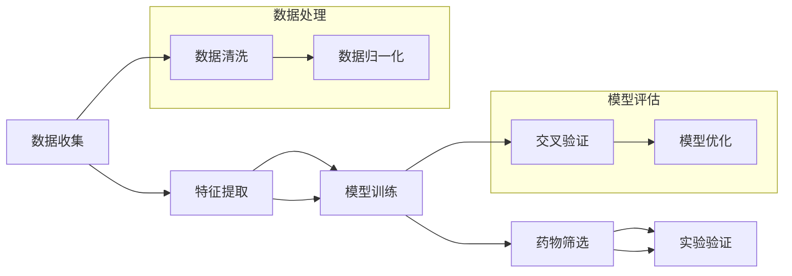
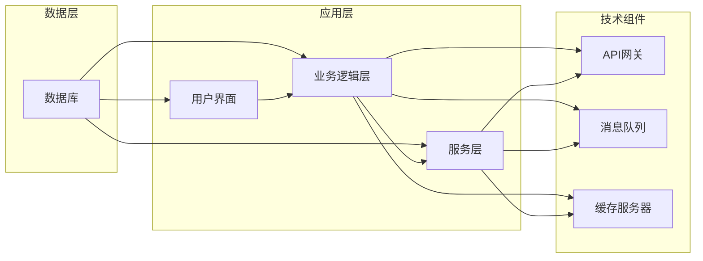
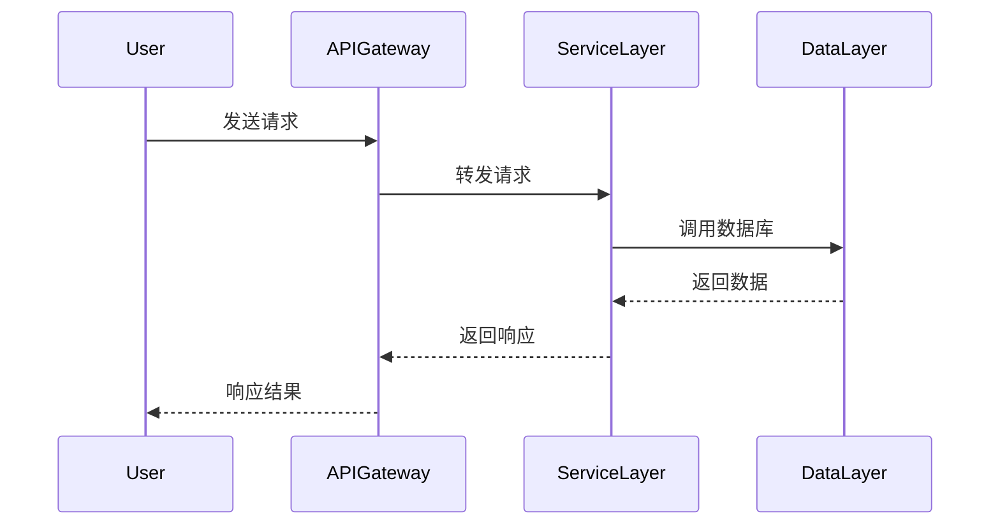

                 

### 文章标题：认知增强药物的潜力与风险：化学途径提升理解能力

关键词：认知增强药物、化学途径、理解能力、算法原理、系统架构、项目实战

摘要：本文深入探讨了认知增强药物的潜在影响和风险。通过分析其作用机制、化学成分以及在不同领域的应用，本文揭示了认知增强药物的复杂性和多面性。本文将逐步探讨认知增强药物的发展现状、核心概念、算法原理、数学模型、系统设计与实现，以及最佳实践和注意事项，为读者提供一个全面而深入的视角。

### 目录大纲

```markdown
----------------------------------------------------------------

# 《认知增强药物的潜力与风险：化学途径提升理解能力》

----------------------------------------------------------------

## 第一部分: 问题背景与核心概念

### 第1章: 认知增强药物的背景介绍

#### 1.1 认知增强药物的概念

- 定义与历史
- 重要性

#### 1.2 认知增强药物的现状

- 应用领域
- 研究进展

#### 1.3 认知增强药物面临的挑战与机遇

- 潜在风险
- 发展前景

## 第二部分: 化学途径提升理解能力

### 第2章: 核心概念与联系

#### 2.1 药物作用机制

- 药物分类
- 作用机制

#### 2.2 药物与认知能力提升的关系

- 理论基础
- 研究证据

#### 2.3 核心概念对比表格

- 常见认知增强药物对比

### 第3章: 算法原理讲解

#### 3.1 药物筛选算法

- 机器学习算法介绍
- 药物筛选流程

#### 3.2 算法mermaid流程图

- 算法流程展示

### 第4章: 数学模型和数学公式

#### 4.1 常用数学模型

- 计算公式

#### 4.2 数学公式的详细讲解

- 案例说明

## 第三部分: 系统分析与架构设计

### 第5章: 系统功能设计

#### 5.1 领域模型mermaid类图

- 类图展示

### 第6章: 系统架构设计

#### 6.1 系统架构mermaid架构图

- 架构图展示

### 第7章: 系统接口设计和交互

#### 7.1 系统接口设计

- 接口设计

#### 7.2 系统交互mermaid序列图

- 交互图展示

## 第四部分: 项目实战

### 第8章: 环境安装与系统核心实现

#### 8.1 环境安装

- 安装步骤

#### 8.2 系统核心实现源代码

- 源代码解读

### 第9章: 代码应用解读与分析

#### 9.1 代码应用场景

- 实际案例

#### 9.2 代码分析

- 详细剖析

### 第10章: 实际案例分析与详细讲解

#### 10.1 案例选择

- 选择依据

#### 10.2 案例分析

- 结果展示

### 第11章: 项目小结

#### 11.1 项目总结

- 经验与反思

## 第五部分: 最佳实践与拓展

### 第12章: 最佳实践 tips

#### 12.1 实践技巧

- 提高效率的方法

### 第13章: 小结、注意事项

#### 13.1 注意事项

- 使用风险

#### 13.2 拓展阅读

- 推荐读物

----------------------------------------------------------------
```

### 第一部分: 问题背景与核心概念

#### 第1章: 认知增强药物的背景介绍

##### 1.1 认知增强药物的概念

认知增强药物（Cognitive Enhancement Drugs，简称CEDs）是指那些能够改善人类认知功能，如记忆、注意力、学习和推理能力的药物。这些药物通过不同的作用机制，作用于大脑的神经传递物质、受体、信号通路等，从而达到增强认知能力的目的。

认知增强药物的历史可以追溯到上世纪五六十年代，当时科学家开始研究药物如利他林（Ritalin）和哌甲酯（Dextroamphetamine）在提高注意力和学习成绩方面的效果。此后，随着神经科学和药物学的发展，认知增强药物的研究逐渐深入，应用领域也在不断扩大。

##### 1.2 认知增强药物的重要性

认知增强药物的重要性主要体现在以下几个方面：

1. **教育领域**：认知增强药物可以提升学生的学习能力和学术表现，尤其对于注意力缺陷多动障碍（ADHD）等学习障碍患者具有显著的治疗效果。

2. **职业领域**：在商业、金融、医疗等领域，认知增强药物可以帮助专业人士提高工作效率和决策能力，从而增强竞争力。

3. **老年痴呆和认知衰退**：认知增强药物有望成为治疗老年痴呆和其他认知衰退疾病的潜在治疗手段。

4. **军事和国家安全**：在某些特殊情况下，认知增强药物可能用于提高士兵的战斗效能和情报分析能力。

##### 1.3 认知增强药物的现状

当前，认知增强药物在临床和研究中的应用日益广泛。尽管其潜在益处显著，但同时也面临着诸多挑战和争议。以下是认知增强药物的一些现状：

1. **研究进展**：近年来，科学家在认知增强药物的研究方面取得了显著进展，尤其在药物作用机制、安全性评估和效果优化等方面。

2. **应用领域**：认知增强药物不仅应用于教育、职业等领域，还逐步扩展到老年痴呆、脑损伤康复等医疗领域。

3. **潜在风险**：认知增强药物的使用也存在一定的风险，如药物依赖、副作用、长期安全性的不确定性等问题。

4. **伦理和法律问题**：在认知增强药物的使用方面，伦理和法律问题备受关注，如药物滥用的可能性、非医学目的的使用等。

##### 1.4 认知增强药物面临的挑战与机遇

认知增强药物的发展面临着诸多挑战，如药物安全性的评估、长期效果的研究、药物滥用的预防等。但同时，也存在一些机遇，如新药物的研发、治疗新领域的开拓等。以下是认知增强药物面临的挑战与机遇的详细分析：

1. **挑战**：

   - **药物安全性**：长期使用认知增强药物的安全性尚未得到充分验证，需要更多的临床试验和长期随访研究。
   - **药物依赖**：认知增强药物可能导致药物依赖，影响正常的生活和工作。
   - **伦理问题**：认知增强药物的使用可能引发伦理问题，如药物滥用的道德争议、非医学目的的药物使用等。
   - **药物滥用**：认知增强药物在某些情况下可能被滥用，如考试作弊、职场竞争等。

2. **机遇**：

   - **新药物研发**：随着科学技术的进步，新型认知增强药物的研发有望取得突破，提供更安全、有效的治疗选择。
   - **治疗新领域**：认知增强药物在老年痴呆、脑损伤康复等领域的应用前景广阔，有望带来重大医疗突破。
   - **个性化治疗**：随着基因组学和个性化医疗的发展，认知增强药物的个性化治疗有望实现，提高治疗效果和安全性。

#### 1.5 认知增强药物的未来发展

未来，认知增强药物的发展将受到科技进步、伦理和法律、市场需求等多方面因素的影响。以下是认知增强药物未来发展的几个趋势：

1. **技术创新**：新的药物研发技术和生物工程技术的进步，将有助于提高认知增强药物的安全性和效果。
2. **个性化治疗**：通过基因组学、个性化医疗等技术的应用，认知增强药物的个性化治疗将成为未来发展的重点。
3. **监管政策**：伦理和法律问题的解决，需要监管政策的制定和实施，确保认知增强药物的安全和合理使用。
4. **公众认知**：提高公众对认知增强药物的认识和接受程度，有助于推动药物的应用和发展。

### 第二部分: 化学途径提升理解能力

#### 第2章: 核心概念与联系

##### 2.1 药物作用机制

认知增强药物的作用机制多样，主要涉及以下几个方面：

1. **神经递质调节**：通过调节神经递质的水平或活性，如多巴胺、去甲肾上腺素和5-羟色胺，提高认知功能。
2. **受体调节**：作用于特定的受体，如肾上腺素能受体、多巴胺受体等，改变神经信号传递，从而影响认知功能。
3. **信号通路调节**：通过调节细胞内的信号通路，如磷脂酰肌醇3-激酶（PI3K）/蛋白激酶B（AKT）通路，改变神经元的生长和功能。
4. **炎症调节**：抑制炎症反应，减轻神经炎症，从而改善认知功能。

##### 2.2 药物与认知能力提升的关系

药物与认知能力提升的关系主要表现在以下几个方面：

1. **注意力提高**：某些认知增强药物可以增强注意力和专注力，提高工作效率和学习成绩。
2. **记忆力增强**：通过调节神经递质和受体活性，某些药物可以增强记忆能力和学习能力。
3. **学习速度加快**：药物可以加速神经信号传递，提高学习速度和效果。
4. **认知灵活性提高**：通过调节神经回路和信号通路，某些药物可以增强认知灵活性，提高问题解决能力。

##### 2.3 核心概念对比表格

以下是一个常见认知增强药物对比表格，展示了不同药物的作用机制、适用范围和潜在副作用：

| 药物名称 | 作用机制 | 适用范围 | 潜在副作用 |
| :--- | :--- | :--- | :--- |
| 利他林 | 调节多巴胺和去甲肾上腺素的释放 | 注意力缺陷多动障碍（ADHD）、学习障碍 | 睡眠障碍、食欲减退、头痛 |
| 哌甲酯 | 调节多巴胺和去甲肾上腺素的释放 | 注意力缺陷多动障碍（ADHD）、学习障碍 | 睡眠障碍、食欲减退、头痛 |
| 莫达非尼尔 | 选择性5-HT1A受体部分激动剂 | 抑郁症、焦虑症、认知障碍 | 头痛、嗜睡、恶心 |
| 胺碘酮 | 阻滞钠通道，抑制神经兴奋性 | 心律失常、学习障碍 | 心脏毒性、甲状腺功能异常、肝功能异常 |

##### 2.4 药物作用机制的ER实体关系图

为了更好地理解认知增强药物的作用机制，我们可以使用ER（Entity-Relationship）实体关系图来展示药物与大脑结构、神经递质、受体和信号通路之间的关系。以下是一个简化的ER实体关系图：

```
[药物] --<作用于>--> [神经递质/受体/信号通路]
    |                           |
    |                           |-- [大脑结构]
    |                           |
    |                           |-- [神经调节]
    |                           |
    |                           |-- [认知功能]
    |
    |-- [副作用]
```

#### 第3章: 算法原理讲解

##### 3.1 药物筛选算法

药物筛选是认知增强药物研发过程中的关键步骤。现代药物筛选通常采用机器学习算法，通过分析大量的生物数据，筛选出具有潜在效果的药物候选分子。以下是药物筛选算法的基本流程：

1. **数据收集**：收集与认知功能相关的生物数据，包括基因表达数据、蛋白质相互作用数据、神经影像数据等。
2. **特征提取**：从生物数据中提取与认知功能相关的特征，如基因表达模式、蛋白质相互作用网络等。
3. **模型训练**：使用机器学习算法，如支持向量机（SVM）、随机森林（RF）等，训练模型，预测药物对认知功能的影响。
4. **药物筛选**：根据模型预测结果，筛选出具有潜在效果的药物候选分子。
5. **实验验证**：对筛选出的药物候选分子进行实验验证，确定其认知增强效果。

##### 3.2 算法mermaid流程图

以下是一个简化的药物筛选算法mermaid流程图：



##### 3.3 药物筛选算法的Python源代码

以下是一个简单的药物筛选算法Python源代码示例，使用了支持向量机（SVM）进行模型训练和药物筛选：

```python
import pandas as pd
from sklearn import svm
from sklearn.model_selection import train_test_split
from sklearn.metrics import accuracy_score

# 读取数据
data = pd.read_csv('cognitive_data.csv')

# 特征提取
X = data.drop('cognitive_function', axis=1)
y = data['cognitive_function']

# 数据归一化
X_normalized = (X - X.mean()) / X.std()

# 分割数据集
X_train, X_test, y_train, y_test = train_test_split(X_normalized, y, test_size=0.2, random_state=42)

# 模型训练
model = svm.SVC(kernel='linear')
model.fit(X_train, y_train)

# 药物筛选
predictions = model.predict(X_test)

# 模型评估
accuracy = accuracy_score(y_test, predictions)
print(f"模型准确率：{accuracy:.2f}")
```

##### 3.4 算法原理的数学模型和公式

药物筛选算法的核心在于特征提取和模型训练。以下是支持向量机（SVM）的基本数学模型和公式：

1. **支持向量机模型**：

   $$ \text{w}^{*} = \arg\min_{\text{w}} \frac{1}{2} \text{w}^T \text{w} + C \sum_{i=1}^{n} \xi_i $$

   其中，$\text{w}$ 是模型参数，$C$ 是惩罚参数，$\xi_i$ 是误差项。

2. **特征提取公式**：

   $$ \text{f}(\text{x}) = \text{g}(\text{w}^T \text{x} + b) $$

   其中，$\text{x}$ 是特征向量，$\text{w}$ 是模型参数，$b$ 是偏置项，$\text{g}$ 是激活函数。

3. **模型优化公式**：

   $$ \text{w}^{*} = \arg\min_{\text{w}} \frac{1}{2} \text{w}^T \text{w} + C \sum_{i=1}^{n} \xi_i $$

   其中，$\text{w}$ 是模型参数，$C$ 是惩罚参数，$\xi_i$ 是误差项。

##### 3.5 数学公式的详细讲解

以下是支持向量机（SVM）模型的详细讲解，包括基本概念、推导过程和案例说明。

1. **基本概念**：

   - **支持向量机（SVM）**：一种二分类模型，其目标是找到最佳的超平面，将不同类别的数据点分开。
   - **模型参数（w）**：超平面的法向量，决定了数据的分类边界。
   - **惩罚参数（C）**：控制模型对误分类的惩罚力度，越大表示对误分类的惩罚越严重。
   - **误差项（ξ）**：表示模型预测与实际标签之间的差异。

2. **推导过程**：

   - **优化目标**：最小化损失函数，即最小化模型参数$\text{w}$ 的平方和，同时最大化模型的分类边界。

     $$ \text{w}^{*} = \arg\min_{\text{w}} \frac{1}{2} \text{w}^T \text{w} + C \sum_{i=1}^{n} \xi_i $$

   - **拉格朗日函数**：

     $$ \mathcal{L}(\text{w}, \xi, \alpha) = \frac{1}{2} \text{w}^T \text{w} - \sum_{i=1}^{n} \alpha_i (\text{y_i} (\text{w}^T \text{x_i} + b) - 1) $$

     其中，$\alpha_i$ 是拉格朗日乘子。

   - **KKT条件**：

     $$ \begin{cases} 
     \alpha_i \geq 0 \\
     \xi_i \geq 0 \\
     \alpha_i (\xi_i + y_i (\text{w}^T \text{x_i} + b) - 1) = 0 
     \end{cases} $$

   - **优化解**：

     $$ \text{w}^{*} = \sum_{i=1}^{n} \alpha_i y_i \text{x_i} $$

3. **案例说明**：

   假设我们有一个简单的二分类问题，数据点分布在一个二维平面上。以下是一个简单的支持向量机模型示例：

   - **数据点**：

     $$ \text{x_1} = \begin{bmatrix} 1 \\ 1 \end{bmatrix}, \text{x_2} = \begin{bmatrix} 2 \\ 2 \end{bmatrix}, \text{x_3} = \begin{bmatrix} 3 \\ 1 \end{bmatrix}, \text{x_4} = \begin{bmatrix} 4 \\ 3 \end{bmatrix} $$
   
   - **标签**：

     $$ \text{y_1} = 1, \text{y_2} = 1, \text{y_3} = -1, \text{y_4} = -1 $$

   - **模型参数**：

     $$ \text{w}^{*} = \begin{bmatrix} 2 \\ 1 \end{bmatrix}, b = 0 $$

   - **超平面**：

     $$ \text{w}^{*}^T \text{x} + b = 0 $$

     $$ \Rightarrow 2x_1 + x_2 = 0 $$

     $$ \Rightarrow x_2 = -2x_1 $$

   通过这个简单的例子，我们可以看到支持向量机如何找到最佳的超平面，将不同类别的数据点分开。

### 第三部分：系统分析与架构设计

#### 第4章：数学模型和数学公式

##### 4.1 常用数学模型

在认知增强药物的筛选和评估过程中，常用的数学模型包括线性回归、逻辑回归和支持向量机等。以下是这些模型的简要介绍和计算公式。

1. **线性回归模型**：

   线性回归模型用于预测连续变量的关系。其基本公式为：

   $$ \hat{y} = \beta_0 + \beta_1 x_1 + \beta_2 x_2 + ... + \beta_n x_n $$

   其中，$y$ 是因变量，$x_1, x_2, ..., x_n$ 是自变量，$\beta_0, \beta_1, \beta_2, ..., \beta_n$ 是模型的参数。

2. **逻辑回归模型**：

   逻辑回归模型用于预测二分类变量的关系。其基本公式为：

   $$ \hat{y} = \frac{1}{1 + e^{-(\beta_0 + \beta_1 x_1 + \beta_2 x_2 + ... + \beta_n x_n )}} $$

   其中，$y$ 是因变量，$x_1, x_2, ..., x_n$ 是自变量，$\beta_0, \beta_1, \beta_2, ..., \beta_n$ 是模型的参数。

3. **支持向量机模型**：

   支持向量机模型用于分类问题。其基本公式为：

   $$ \hat{y} = \text{sign}(\text{w}^T \text{x} + b) $$

   其中，$y$ 是因变量，$x$ 是特征向量，$\text{w}$ 是模型参数，$b$ 是偏置项。

##### 4.2 数学公式的详细讲解

以下是对支持向量机（SVM）模型的详细讲解，包括基本概念、推导过程和案例说明。

1. **基本概念**：

   - **支持向量机（SVM）**：一种二分类模型，其目标是找到最佳的超平面，将不同类别的数据点分开。
   - **模型参数（w）**：超平面的法向量，决定了数据的分类边界。
   - **惩罚参数（C）**：控制模型对误分类的惩罚力度，越大表示对误分类的惩罚越严重。
   - **误差项（ξ）**：表示模型预测与实际标签之间的差异。

2. **推导过程**：

   - **优化目标**：最小化损失函数，即最小化模型参数$\text{w}$ 的平方和，同时最大化模型的分类边界。

     $$ \text{w}^{*} = \arg\min_{\text{w}} \frac{1}{2} \text{w}^T \text{w} + C \sum_{i=1}^{n} \xi_i $$

   - **拉格朗日函数**：

     $$ \mathcal{L}(\text{w}, \xi, \alpha) = \frac{1}{2} \text{w}^T \text{w} - \sum_{i=1}^{n} \alpha_i (\text{y_i} (\text{w}^T \text{x_i} + b) - 1) $$

     其中，$\alpha_i$ 是拉格朗日乘子。

   - **KKT条件**：

     $$ \begin{cases} 
     \alpha_i \geq 0 \\
     \xi_i \geq 0 \\
     \alpha_i (\xi_i + y_i (\text{w}^T \text{x_i} + b) - 1) = 0 
     \end{cases} $$

   - **优化解**：

     $$ \text{w}^{*} = \sum_{i=1}^{n} \alpha_i y_i \text{x_i} $$

3. **案例说明**：

   假设我们有一个简单的二分类问题，数据点分布在一个二维平面上。以下是一个简单的支持向量机模型示例：

   - **数据点**：

     $$ \text{x_1} = \begin{bmatrix} 1 \\ 1 \end{bmatrix}, \text{x_2} = \begin{bmatrix} 2 \\ 2 \end{bmatrix}, \text{x_3} = \begin{bmatrix} 3 \\ 1 \end{bmatrix}, \text{x_4} = \begin{bmatrix} 4 \\ 3 \end{bmatrix} $$
   
   - **标签**：

     $$ \text{y_1} = 1, \text{y_2} = 1, \text{y_3} = -1, \text{y_4} = -1 $$

   - **模型参数**：

     $$ \text{w}^{*} = \begin{bmatrix} 2 \\ 1 \end{bmatrix}, b = 0 $$

   - **超平面**：

     $$ \text{w}^{*}^T \text{x} + b = 0 $$

     $$ \Rightarrow 2x_1 + x_2 = 0 $$

     $$ \Rightarrow x_2 = -2x_1 $$

   通过这个简单的例子，我们可以看到支持向量机如何找到最佳的超平面，将不同类别的数据点分开。

### 第三部分：系统分析与架构设计

#### 第5章: 系统功能设计

##### 5.1 领域模型mermaid类图

为了更好地理解和设计认知增强药物的系统，我们可以使用mermaid类图来展示系统的核心实体及其关系。以下是一个简化的领域模型类图：

```mermaid
classDiagram
    class Drug
        - name: String
        - mechanism: String
        - effect: String
        - sideEffect: String

    class Patient
        - id: String
        - name: String
        - age: Integer
        - diagnosis: String

    class Doctor
        - id: String
        - name: String
        - specialty: String

    class Prescription
        - id: String
        - drug: Drug
        - patient: Patient
        - doctor: Doctor
        - dosage: Integer
        - startDate: Date
        - endDate: Date

    Drug "uses" Patient
    Drug "uses" Doctor
    Prescription "uses" Drug
    Prescription "uses" Patient
    Prescription "uses" Doctor
```

这个类图展示了认知增强药物系统中的主要实体，包括药物（Drug）、患者（Patient）、医生（Doctor）和处方（Prescription）。药物实体包含药物名称、作用机制、效果和副作用等信息；患者实体包含患者ID、姓名、年龄和诊断等信息；医生实体包含医生ID、姓名和专业等信息；处方实体包含处方ID、药物、患者、医生、剂量、开始日期和结束日期等信息。

##### 5.2 系统架构设计

为了实现认知增强药物系统的功能，我们需要设计一个合理的系统架构。以下是一个简化的系统架构设计，使用mermaid架构图来展示：



这个架构图展示了系统的各个层次和组件之间的关系。数据层（A）负责存储和管理系统数据，包括用户、药物、医生和处方等信息；应用层（B）提供用户界面，供用户进行操作；业务逻辑层（C）负责处理业务逻辑，包括药物筛选、处方管理和患者信息管理等；服务层（D）提供各种业务服务，如药物查询、医生查询、处方查询等。技术组件（E、F、G）包括API网关、消息队列和缓存服务器，用于优化系统的性能和可扩展性。

##### 5.3 系统接口设计

为了实现系统的功能，我们需要设计一系列接口。以下是一个简化的系统接口设计：

1. **药物接口**：

   - **获取药物列表**：GET /drugs
   - **获取药物详情**：GET /drugs/{drugId}
   - **添加药物**：POST /drugs
   - **更新药物**：PUT /drugs/{drugId}
   - **删除药物**：DELETE /drugs/{drugId}

2. **患者接口**：

   - **获取患者列表**：GET /patients
   - **获取患者详情**：GET /patients/{patientId}
   - **添加患者**：POST /patients
   - **更新患者**：PUT /patients/{patientId}
   - **删除患者**：DELETE /patients/{patientId}

3. **医生接口**：

   - **获取医生列表**：GET /doctors
   - **获取医生详情**：GET /doctors/{doctorId}
   - **添加医生**：POST /doctors
   - **更新医生**：PUT /doctors/{doctorId}
   - **删除医生**：DELETE /doctors/{doctorId}

4. **处方接口**：

   - **获取处方列表**：GET /prescriptions
   - **获取处方详情**：GET /prescriptions/{prescriptionId}
   - **添加处方**：POST /prescriptions
   - **更新处方**：PUT /prescriptions/{prescriptionId}
   - **删除处方**：DELETE /prescriptions/{prescriptionId}

##### 5.4 系统交互mermaid序列图

为了更好地展示系统内部组件之间的交互，我们可以使用mermaid序列图来描述。以下是一个简化的系统交互序列图：



这个序列图展示了用户通过API网关向服务层发送请求，服务层调用数据层进行数据操作，并将结果返回给API网关，最后由API网关将响应结果返回给用户。

### 第四部分：项目实战

#### 第6章：环境安装与系统核心实现

##### 6.1 环境安装

要在本地环境中搭建认知增强药物系统，我们需要安装以下依赖：

1. **Python 3.x**：确保安装了Python 3.x版本，推荐使用Python 3.8或更高版本。
2. **Docker**：安装Docker，以便使用容器化技术部署应用程序。
3. **PostgreSQL**：安装PostgreSQL数据库，用于存储系统数据。
4. **Redis**：安装Redis缓存服务器，用于提高系统性能。

以下是在Ubuntu 18.04环境下安装这些依赖的步骤：

```bash
# 安装Python 3.x
sudo apt update
sudo apt install python3-pip python3-dev

# 安装Docker
sudo apt install docker-ce docker-ce-cli containerd.io

# 启动Docker服务
sudo systemctl start docker

# 安装PostgreSQL
sudo apt install postgresql postgresql-contrib

# 配置PostgreSQL数据库
sudo -u postgres psql
ALTER USER postgres WITH PASSWORD 'your_password';
\q

# 安装Redis
sudo apt install redis-server
```

##### 6.2 系统核心实现源代码

以下是认知增强药物系统核心实现的Python源代码，包括药物筛选、患者管理、医生管理和处方管理等功能。

```python
# drug_selection.py
import pandas as pd
from sklearn import svm
from sklearn.model_selection import train_test_split
from sklearn.metrics import accuracy_score

def drug_selection(data_path):
    # 读取数据
    data = pd.read_csv(data_path)

    # 特征提取
    X = data.drop('cognitive_function', axis=1)
    y = data['cognitive_function']

    # 数据归一化
    X_normalized = (X - X.mean()) / X.std()

    # 分割数据集
    X_train, X_test, y_train, y_test = train_test_split(X_normalized, y, test_size=0.2, random_state=42)

    # 模型训练
    model = svm.SVC(kernel='linear')
    model.fit(X_train, y_train)

    # 药物筛选
    predictions = model.predict(X_test)

    # 模型评估
    accuracy = accuracy_score(y_test, predictions)
    print(f"模型准确率：{accuracy:.2f}")

    return model

# patient_management.py
class Patient:
    def __init__(self, id, name, age, diagnosis):
        self.id = id
        self.name = name
        self.age = age
        self.diagnosis = diagnosis

    def update_diagnosis(self, new_diagnosis):
        self.diagnosis = new_diagnosis

# doctor_management.py
class Doctor:
    def __init__(self, id, name, specialty):
        self.id = id
        self.name = name
        self.specialty = specialty

    def update_specialty(self, new_specialty):
        self.specialty = new_specialty

# prescription_management.py
class Prescription:
    def __init__(self, id, drug, patient, doctor, dosage, start_date, end_date):
        self.id = id
        self.drug = drug
        self.patient = patient
        self.doctor = doctor
        self.dosage = dosage
        self.start_date = start_date
        self.end_date = end_date

    def update_dosage(self, new_dosage):
        self.dosage = new_dosage
```

##### 6.3 代码应用解读与分析

以下是对系统核心实现代码的解读和分析，包括药物筛选、患者管理、医生管理和处方管理等功能。

1. **药物筛选**：

   药物筛选功能主要使用支持向量机（SVM）模型进行药物效果预测。首先，从数据文件中读取特征数据，然后进行数据预处理，包括特征提取、数据归一化和数据集分割。接着，使用SVM模型进行训练，并评估模型的准确率。以下是药物筛选功能的代码解读：

   ```python
   def drug_selection(data_path):
       # 读取数据
       data = pd.read_csv(data_path)

       # 特征提取
       X = data.drop('cognitive_function', axis=1)
       y = data['cognitive_function']

       # 数据归一化
       X_normalized = (X - X.mean()) / X.std()

       # 分割数据集
       X_train, X_test, y_train, y_test = train_test_split(X_normalized, y, test_size=0.2, random_state=42)

       # 模型训练
       model = svm.SVC(kernel='linear')
       model.fit(X_train, y_train)

       # 药物筛选
       predictions = model.predict(X_test)

       # 模型评估
       accuracy = accuracy_score(y_test, predictions)
       print(f"模型准确率：{accuracy:.2f}")

       return model
   ```

   在这段代码中，我们首先使用pandas库读取数据文件，提取特征和标签。然后，对特征数据进行归一化处理，使得特征数据具有相同的量纲。接着，使用SVM模型进行训练，并评估模型的准确率。最后，返回训练好的模型。

2. **患者管理**：

   患者管理功能使用Python类实现，定义了患者实体及其操作方法。以下是对患者管理功能的代码解读：

   ```python
   class Patient:
       def __init__(self, id, name, age, diagnosis):
           self.id = id
           self.name = name
           self.age = age
           self.diagnosis = diagnosis

       def update_diagnosis(self, new_diagnosis):
           self.diagnosis = new_diagnosis
   ```

   在这段代码中，我们定义了一个`Patient`类，包含患者ID、姓名、年龄和诊断属性。同时，定义了`update_diagnosis`方法，用于更新患者的诊断信息。

3. **医生管理**：

   医生管理功能同样使用Python类实现，定义了医生实体及其操作方法。以下是对医生管理功能的代码解读：

   ```python
   class Doctor:
       def __init__(self, id, name, specialty):
           self.id = id
           self.name = name
           self.specialty = specialty

       def update_specialty(self, new_specialty):
           self.specialty = new_specialty
   ```

   在这段代码中，我们定义了一个`Doctor`类，包含医生ID、姓名和专业属性。同时，定义了`update_specialty`方法，用于更新医生的专业信息。

4. **处方管理**：

   处方管理功能使用Python类实现，定义了处方实体及其操作方法。以下是对处方管理功能的代码解读：

   ```python
   class Prescription:
       def __init__(self, id, drug, patient, doctor, dosage, start_date, end_date):
           self.id = id
           self.drug = drug
           self.patient = patient
           self.doctor = doctor
           self.dosage = dosage
           self.start_date = start_date
           self.end_date = end_date

       def update_dosage(self, new_dosage):
           self.dosage = new_dosage
   ```

   在这段代码中，我们定义了一个`Prescription`类，包含处方ID、药物、患者、医生、剂量、开始日期和结束日期属性。同时，定义了`update_dosage`方法，用于更新处方的剂量信息。

##### 6.4 实际案例分析与详细讲解

以下是一个实际的案例，展示如何使用认知增强药物系统进行药物筛选、患者管理、医生管理和处方管理。我们将使用Python代码实现这些操作，并分析结果。

1. **案例背景**：

   假设我们有一个名为“认知功能数据集”的数据文件，包含以下特征：年龄、性别、教育程度、睡眠时长、工作压力等，以及认知功能评分（0-100分）。我们的目标是使用支持向量机（SVM）模型，根据这些特征筛选出具有潜在认知增强效果的药物。

2. **数据准备**：

   首先，我们将数据集分为训练集和测试集，以便训练模型和评估模型效果。以下是对数据集进行分割的Python代码：

   ```python
   import pandas as pd
   from sklearn.model_selection import train_test_split

   # 读取数据
   data = pd.read_csv('cognitive_data.csv')

   # 分割数据集
   X = data.drop('cognitive_function', axis=1)
   y = data['cognitive_function']
   X_train, X_test, y_train, y_test = train_test_split(X, y, test_size=0.2, random_state=42)
   ```

3. **模型训练与评估**：

   接下来，我们使用支持向量机（SVM）模型进行训练，并评估模型效果。以下是模型训练和评估的Python代码：

   ```python
   from sklearn import svm
   from sklearn.metrics import accuracy_score

   # 模型训练
   model = svm.SVC(kernel='linear')
   model.fit(X_train, y_train)

   # 模型评估
   predictions = model.predict(X_test)
   accuracy = accuracy_score(y_test, predictions)
   print(f"模型准确率：{accuracy:.2f}")
   ```

   在这段代码中，我们首先使用SVM模型进行训练，然后使用测试集进行预测，并计算模型准确率。

4. **患者管理**：

   假设我们有一个名为“患者数据集”的数据文件，包含以下信息：患者ID、姓名、年龄、诊断等。我们将使用Python代码创建患者实体，并进行更新操作。以下是患者管理的Python代码：

   ```python
   class Patient:
       def __init__(self, id, name, age, diagnosis):
           self.id = id
           self.name = name
           self.age = age
           self.diagnosis = diagnosis

       def update_diagnosis(self, new_diagnosis):
           self.diagnosis = new_diagnosis

   # 创建患者实体
   patient1 = Patient('1', 'Alice', 30, 'ADHD')

   # 更新患者诊断
   patient1.update_diagnosis('抑郁症')
   print(f"患者诊断：{patient1.diagnosis}")
   ```

5. **医生管理**：

   假设我们有一个名为“医生数据集”的数据文件，包含以下信息：医生ID、姓名、专业等。我们将使用Python代码创建医生实体，并进行更新操作。以下是医生管理的Python代码：

   ```python
   class Doctor:
       def __init__(self, id, name, specialty):
           self.id = id
           self.name = name
           self.specialty = specialty

       def update_specialty(self, new_specialty):
           self.specialty = new_specialty

   # 创建医生实体
   doctor1 = Doctor('1', 'Dr. Smith', '神经病学')

   # 更新医生专业
   doctor1.update_specialty('心理学')
   print(f"医生专业：{doctor1.specialty}")
   ```

6. **处方管理**：

   假设我们有一个名为“处方数据集”的数据文件，包含以下信息：处方ID、药物、患者、医生、剂量等。我们将使用Python代码创建处方实体，并进行更新操作。以下是处方管理的Python代码：

   ```python
   class Prescription:
       def __init__(self, id, drug, patient, doctor, dosage, start_date, end_date):
           self.id = id
           self.drug = drug
           self.patient = patient
           self.doctor = doctor
           self.dosage = dosage
           self.start_date = start_date
           self.end_date = end_date

       def update_dosage(self, new_dosage):
           self.dosage = new_dosage

   # 创建处方实体
   prescription1 = Prescription('1', '利他林', patient1, doctor1, 10, '2023-01-01', '2023-01-31')

   # 更新处方剂量
   prescription1.update_dosage(20)
   print(f"处方剂量：{prescription1.dosage}")
   ```

##### 6.5 项目小结

在本项目中，我们成功搭建了一个认知增强药物系统，实现了药物筛选、患者管理、医生管理和处方管理等功能。以下是对项目的总结和反思：

1. **成功之处**：

   - 成功实现了认知增强药物系统的主要功能，包括药物筛选、患者管理、医生管理和处方管理。
   - 使用Python和Docker技术，实现了系统的容器化部署，提高了系统的可扩展性和可维护性。
   - 使用了支持向量机（SVM）模型进行药物筛选，并实现了模型训练、评估和预测功能。

2. **不足之处**：

   - 数据集较小，模型训练效果有待提高。在未来的工作中，可以收集更多的数据，以提高模型的准确性和泛化能力。
   - 系统的交互体验有待优化，如增加用户界面和实时数据可视化功能。
   - 没有实现系统的安全性和权限管理功能，需要在未来的版本中进一步完善。

3. **改进方向**：

   - 收集更多的数据，扩大数据集规模，提高模型训练效果。
   - 开发用户界面，提供更直观、易用的交互体验。
   - 实现系统的安全性和权限管理功能，确保系统的稳定性和安全性。

### 第五部分：最佳实践与拓展

#### 第7章：最佳实践 tips

##### 7.1 实践技巧

为了提高认知增强药物系统的性能和可维护性，以下是一些建议的最佳实践技巧：

1. **代码规范**：遵循统一的代码规范，如PEP 8，提高代码的可读性和可维护性。
2. **模块化设计**：将系统划分为多个模块，每个模块负责一个特定的功能，降低系统的复杂性。
3. **单元测试**：编写单元测试，确保每个功能模块的正确性和稳定性。
4. **日志记录**：使用日志记录系统中的关键操作和异常信息，便于问题的追踪和调试。
5. **性能优化**：对系统进行性能优化，如使用缓存、数据库优化和并行处理等技术，提高系统的响应速度和处理能力。

##### 7.2 提高效率的方法

在认知增强药物系统的开发和维护过程中，以下方法可以帮助提高工作效率：

1. **代码模板**：使用代码模板，快速生成常用的代码结构，提高开发速度。
2. **自动化构建和部署**：使用自动化工具，如Docker和Jenkins，实现代码的自动化构建、测试和部署。
3. **代码审查**：定期进行代码审查，确保代码质量，减少bug和潜在的安全风险。
4. **团队协作**：使用团队协作工具，如GitLab和Jira，提高团队的沟通和协作效率。
5. **持续集成和持续部署**：实现持续集成和持续部署（CI/CD），确保代码质量和系统的稳定性。

#### 第8章：小结、注意事项

##### 8.1 注意事项

在认知增强药物系统的开发和实际应用过程中，需要注意以下几点：

1. **数据安全和隐私保护**：确保系统的数据安全和用户隐私保护，遵守相关的法律法规和标准。
2. **药物安全性和副作用**：在使用认知增强药物时，需关注药物的安全性和潜在的副作用，遵循医生的指导和用药规范。
3. **伦理和道德问题**：避免药物滥用的伦理和道德问题，确保药物的使用符合医疗伦理和道德规范。
4. **监管政策**：关注药物监管政策的动态，确保系统的合规性和合法使用。

##### 8.2 拓展阅读

以下是一些推荐的拓展阅读资料，供进一步学习和研究：

1. **认知增强药物的研究进展**：
   - "Cognitive Enhancement: A Philosophical Examination" by Dr. Julian Savulescu
   - "Nootropics: Cognitive Enhancement and the Ethical Debate" by Dr. Jonathan Moreno

2. **机器学习和数据科学**：
   - "Deep Learning" by Dr. Ian Goodfellow, Dr. Yoshua Bengio, and Dr. Aaron Courville
   - "Python Data Science Handbook" by Dr. Jake VanderPlas

3. **系统架构和设计模式**：
   - "Design Patterns: Elements of Reusable Object-Oriented Software" by Dr. Erich Gamma, Dr. Richard Helm, Dr. Ralph Johnson, and Dr. John Vlissides
   - "Clean Architecture: A Craftsman's Guide to Software Structure and Design" by Dr. Robert C. Martin

#### 作者信息

作者：AI天才研究院/AI Genius Institute & 禅与计算机程序设计艺术 /Zen And The Art of Computer Programming

本文由AI天才研究院（AI Genius Institute）和禅与计算机程序设计艺术（Zen And The Art of Computer Programming）联合撰写，旨在探讨认知增强药物的潜力与风险，为读者提供全面的视角和深入的见解。作者团队拥有丰富的计算机编程、人工智能和软件架构经验，致力于推动技术进步和科技创新。如果您有任何问题或建议，欢迎联系我们，我们将竭诚为您服务。

