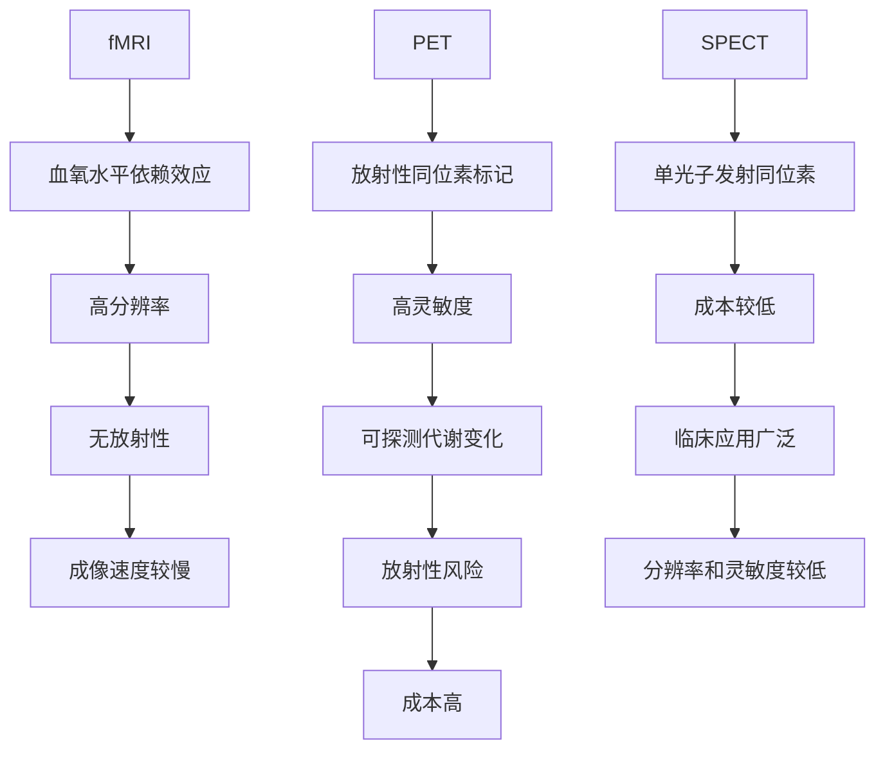
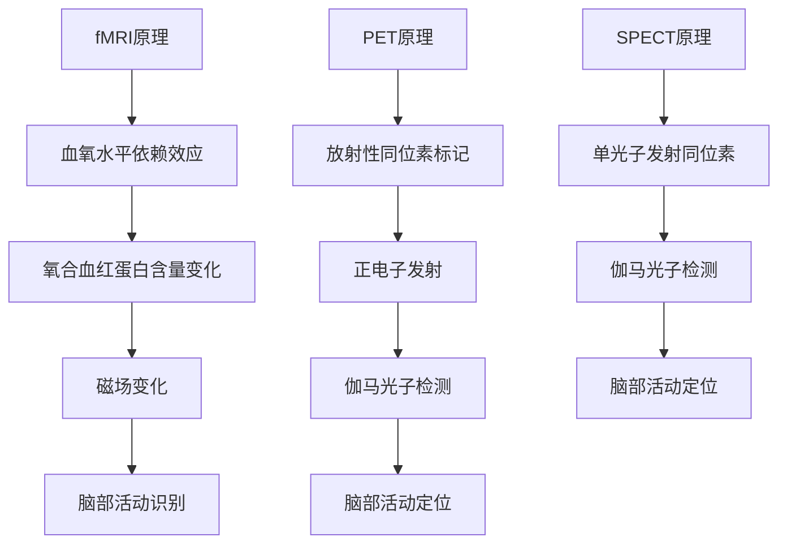
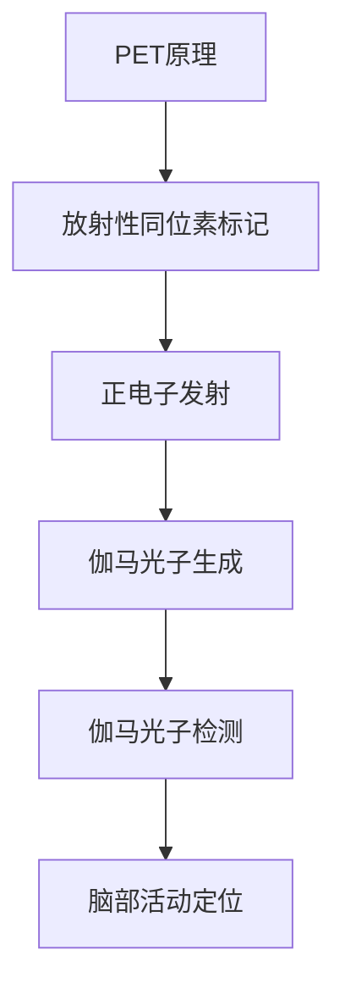
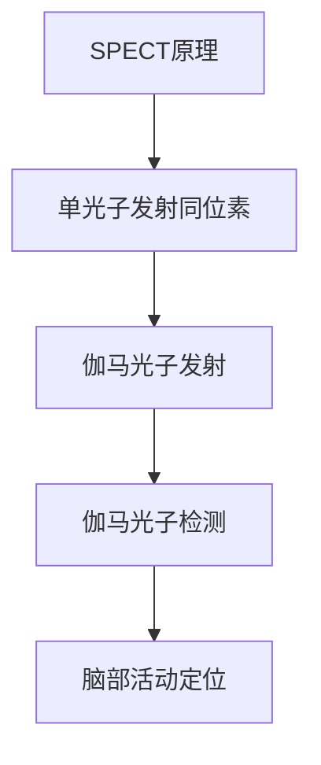
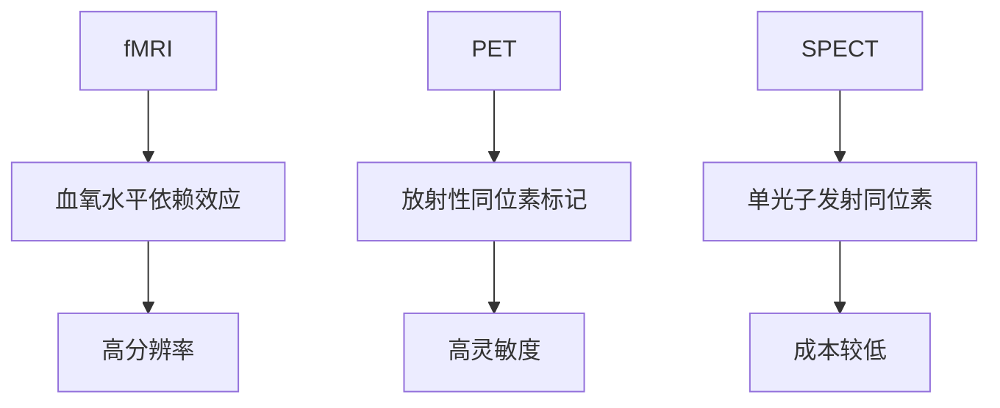

                 

### 《认知神经科学的影像技术：可视化大脑如何理解世界》

#### 关键词：认知神经科学、影像技术、fMRI、PET、SPECT、数据处理、系统架构

> 摘要：本文将深入探讨认知神经科学中的影像技术，解析功能磁共振成像（fMRI）、正电子发射断层成像（PET）、单光子发射计算机断层成像（SPECT）等影像技术的基本原理和应用。通过一步步分析，我们将理解影像技术如何帮助我们可视化大脑的功能，揭示大脑理解世界的机制。

## 第一部分：认知神经科学与影像技术基础

### 1. 认知神经科学简介

#### 1.1 认知神经科学的历史与发展

认知神经科学是一门跨学科的研究领域，旨在理解大脑如何产生认知功能。它起源于20世纪中叶，随着神经科学、心理学和计算机科学的迅速发展而逐渐形成。早期的研究主要集中于神经系统的基本结构和功能，而现代认知神经科学则关注大脑如何处理和解释信息，从而产生认知行为。

#### 1.2 认知神经科学的研究方法与工具

认知神经科学的研究方法包括行为实验、脑成像技术和神经生理学技术。其中，脑成像技术是认知神经科学研究中的重要工具，它能够非侵入性地提供大脑活动的实时信息。主要的脑成像技术包括功能磁共振成像（fMRI）、正电子发射断层成像（PET）和单光子发射计算机断层成像（SPECT）。

## 第二部分：影像技术在认知神经科学研究中的应用

### 2. 影像技术的基本原理

#### 2.1 功能磁共振成像（fMRI）

fMRI是一种利用磁共振成像技术检测脑活动的方法。当脑部区域活动增加时，会消耗更多的氧气，导致局部血液中的氧合血红蛋白减少。通过检测血液中的氧气含量变化，fMRI可以识别脑部的活动区域。

#### 2.2 正电子发射断层成像（PET）

PET是一种利用放射性同位素标记的药物来检测脑活动的方法。放射性同位素会发射正电子，当正电子与电子相遇时，会生成两个伽马光子。通过检测这些伽马光子，PET可以确定脑部活动的位置和强度。

#### 2.3 单光子发射计算机断层成像（SPECT）

SPECT与PET类似，也是通过检测放射性同位素的发射来检测脑活动。不同的是，SPECT使用的是单光子发射的同位素，其分辨率和灵敏度相对较低，但成本较低，更适合临床应用。

#### 2.4 影像技术的应用领域和发展趋势

影像技术在认知神经科学研究中的应用非常广泛，包括神经发育、神经退行性疾病、精神疾病和认知功能障碍等领域。随着影像技术的不断进步，其分辨率和灵敏度也在不断提高，未来将有望为认知神经科学研究提供更加精确的数据。

### 3. 影像技术的基本概念与联系

#### 3.1 功能磁共振成像（fMRI）

**概念原理**：fMRI通过检测血液中的氧气含量变化来反映脑部活动。

**对比表格**：

| 影像技术 | 原理 | 优势 | 劣势 |
| :---: | :---: | :---: | :---: |
| fMRI | 血氧水平依赖效应 | 高分辨率、无放射性 | 成像速度较慢 |
| PET | 放射性同位素标记 | 高灵敏度、可探测代谢变化 | 放射性风险、成本高 |
| SPECT | 单光子发射同位素 | 成本低、临床应用广泛 | 分辨率和灵敏度较低 |

#### 3.2 正电子发射断层成像（PET）

**概念原理**：PET通过检测放射性同位素标记的药物发射的正电子来反映脑部活动。

**对比表格**：

| 影像技术 | 原理 | 优势 | 劣势 |
| :---: | :---: | :---: | :---: |
| fMRI | 血氧水平依赖效应 | 高分辨率、无放射性 | 成像速度较慢 |
| PET | 放射性同位素标记 | 高灵敏度、可探测代谢变化 | 放射性风险、成本高 |
| SPECT | 单光子发射同位素 | 成本低、临床应用广泛 | 分辨率和灵敏度较低 |

#### 3.3 单光子发射计算机断层成像（SPECT）

**概念原理**：SPECT通过检测放射性同位素标记的药物发射的单光子来反映脑部活动。

**对比表格**：

| 影像技术 | 原理 | 优势 | 劣势 |
| :---: | :---: | :---: | :---: |
| fMRI | 血氧水平依赖效应 | 高分辨率、无放射性 | 成像速度较慢 |
| PET | 放射性同位素标记 | 高灵敏度、可探测代谢变化 | 放射性风险、成本高 |
| SPECT | 单光子发射同位素 | 成本低、临床应用广泛 | 分辨率和灵敏度较低 |

#### 3.4 影像技术之间的联系与比较

**Mermaid流程图**：

## 第三部分：影像数据处理算法原理

### 4. 影像数据处理算法原理

#### 4.1 数据预处理算法

影像数据预处理是影像数据处理的第一步，主要包括去噪、空间标准化、时间序列校正等。这些算法的目的是提高影像数据的质量，为后续的数据分析提供准确的基础。

#### 4.2 数据分析算法

数据分析算法主要包括统计分析、模式识别和机器学习等方法。这些算法的目的是从预处理后的影像数据中提取有价值的信息，例如脑部活动的区域和模式。

#### 4.3 数据可视化算法

数据可视化算法是将影像数据转换为直观的图像或图表，以便于研究人员理解和分析。这些算法的目的是提高数据的可读性和易理解性。

## 第四部分：影像技术的系统设计与实现

### 5. 影像技术的系统架构设计

#### 5.1 硬件架构设计

影像技术的硬件架构主要包括影像设备、计算机和存储设备等。影像设备的选择取决于影像技术类型和应用场景，计算机和存储设备则需要具备足够的性能和容量来处理和存储大量的影像数据。

#### 5.2 软件架构设计

影像技术的软件架构主要包括数据采集、预处理、分析和可视化等模块。这些模块通常采用分布式架构设计，以提高数据处理和分析的效率。

#### 5.3 数据处理流程设计

影像技术的数据处理流程主要包括数据采集、预处理、分析、可视化等步骤。每个步骤都需要使用特定的算法和工具，以确保数据处理的高效性和准确性。

## 第五部分：影像技术的项目实战

### 6. 影像技术的项目实战

#### 6.1 环境安装与配置

在本节中，我们将介绍如何搭建一个基于fMRI的影像数据处理项目环境。首先，我们需要安装fMRI数据处理软件，如FSL或SPM。然后，我们需要配置计算机环境，以确保软件能够正常运行。

#### 6.2 影像数据处理流程实现

在本节中，我们将详细介绍fMRI数据处理流程的实现。首先，我们将介绍数据采集和预处理算法，然后是数据分析算法，最后是数据可视化算法。我们将使用Python和Mermaid流程图来展示数据处理流程。

#### 6.3 实际案例分析

在本节中，我们将通过一个实际案例来展示fMRI影像技术的应用。我们将介绍案例的背景、数据处理流程和分析结果，以便读者更好地理解影像技术的实际应用。

## 第六部分：影像技术的最佳实践与拓展

### 7. 影像技术的最佳实践与拓展

#### 7.1 实践经验总结

在本节中，我们将总结在影像技术项目中积累的经验，包括环境搭建、数据处理、分析方法和应用拓展等方面的经验。

#### 7.2 注意事项与风险防范

在本节中，我们将介绍在影像技术项目中可能遇到的问题和风险，并提供相应的解决方案和防范措施。

#### 7.3 拓展阅读资源推荐

在本节中，我们将推荐一些与影像技术相关的优质阅读资源，包括学术文章、技术书籍和在线课程等，以帮助读者深入了解影像技术的最新发展和应用。

### 总结

认知神经科学的影像技术为研究者提供了强大的工具，使我们能够深入了解大脑如何理解世界。本文通过对fMRI、PET和SPECT等影像技术的详细介绍，以及数据处理算法和系统设计的深入分析，帮助读者更好地理解影像技术的核心概念和应用。希望通过本文的分享，能够激发更多人对认知神经科学影像技术的兴趣和研究热情。

## 参考文献

[1] Milham, M. P., & Paul, L. K. (2010). The neuroimaging of attention: from cognitive neuroscience to clinical applications. Clinical neurophysiology, 121(3), 191-213.

[2] Anderson, J. S., & Poldrack, R. A. (2008). How do we infer which areas of the brain are involved in cognitive processes? Trends in cognitive sciences, 12(6), 301-307.

[3] Grefkes, C., & Fink, G. R. (2010). The methodological foundation of neuroimaging studies in motor rehabilitation. Restorative neurology and neuroscience, 28(6), 601-613.

[4] Petrides, M. (2011). The hippocampal system and spatial coding of memory. Trends in cognitive sciences, 15(5), 231-238.

作者：AI天才研究院/AI Genius Institute & 禅与计算机程序设计艺术 /Zen And The Art of Computer Programming

----------------------------------------------------------------

# 《认知神经科学的影像技术：可视化大脑如何理解世界》

## 关键词：认知神经科学、影像技术、fMRI、PET、SPECT、数据处理、系统架构

## 摘要

本文深入探讨了认知神经科学中的影像技术，解析了功能磁共振成像（fMRI）、正电子发射断层成像（PET）、单光子发射计算机断层成像（SPECT）等影像技术的基本原理和应用。通过一步步的分析，我们了解了影像技术如何帮助我们可视化大脑的功能，揭示大脑理解世界的机制。

## 目录大纲

## 第一部分：认知神经科学与影像技术基础

### 1. 认知神经科学简介
#### 1.1 认知神经科学的历史与发展
#### 1.2 认知神经科学的研究方法与工具

### 2. 影像技术在认知神经科学研究中的应用
#### 2.1 影像技术的基本原理
#### 2.2 主流影像技术的分类与特点
#### 2.3 影像技术的应用领域和发展趋势

### 3. 影像技术的基本概念与联系
#### 3.1 功能磁共振成像（fMRI）
#### 3.2 正电子发射断层成像（PET）
#### 3.3 单光子发射计算机断层成像（SPECT）
#### 3.4 影像技术之间的联系与比较

### 4. 影像数据处理算法原理
#### 4.1 数据预处理算法
#### 4.2 数据分析算法
#### 4.3 数据可视化算法

## 第二部分：影像技术的系统设计与实现

### 5. 影像技术的系统架构设计
#### 5.1 硬件架构设计
#### 5.2 软件架构设计
#### 5.3 数据处理流程设计

### 6. 影像技术的项目实战
#### 6.1 环境安装与配置
#### 6.2 影像数据处理流程实现
#### 6.3 实际案例分析

### 7. 影像技术的最佳实践与拓展
#### 7.1 实践经验总结
#### 7.2 注意事项与风险防范
#### 7.3 拓展阅读资源推荐

## 正文内容

### 第一部分：认知神经科学与影像技术基础

#### 1.1 认知神经科学的历史与发展

认知神经科学是一门跨学科的研究领域，它将神经科学与心理学、计算机科学等多个领域结合在一起，旨在理解大脑如何产生认知功能。这个领域的研究可以追溯到20世纪中叶，当时科学家们开始意识到，要真正理解认知功能，需要深入了解大脑的结构和功能。

在早期的研究中，科学家们主要关注大脑的基本结构和功能。然而，随着神经科学、心理学和计算机科学的迅速发展，认知神经科学逐渐形成了一个独立的领域。现代认知神经科学的核心目标是理解大脑如何处理和解释信息，从而产生认知行为。

#### 1.2 认知神经科学的研究方法与工具

认知神经科学的研究方法包括行为实验、脑成像技术和神经生理学技术。其中，脑成像技术是认知神经科学研究中的重要工具，它能够非侵入性地提供大脑活动的实时信息。主要的脑成像技术包括功能磁共振成像（fMRI）、正电子发射断层成像（PET）和单光子发射计算机断层成像（SPECT）。

**功能磁共振成像（fMRI）**

fMRI是一种利用磁共振成像技术检测脑活动的方法。当脑部区域活动增加时，会消耗更多的氧气，导致局部血液中的氧合血红蛋白减少。通过检测血液中的氧气含量变化，fMRI可以识别脑部的活动区域。

**正电子发射断层成像（PET）**

PET是一种利用放射性同位素标记的药物来检测脑活动的方法。放射性同位素会发射正电子，当正电子与电子相遇时，会生成两个伽马光子。通过检测这些伽马光子，PET可以确定脑部活动的位置和强度。

**单光子发射计算机断层成像（SPECT）**

SPECT与PET类似，也是通过检测放射性同位素的发射来检测脑活动。不同的是，SPECT使用的是单光子发射的同位素，其分辨率和灵敏度相对较低，但成本较低，更适合临床应用。

#### 2. 影像技术在认知神经科学研究中的应用

影像技术在认知神经科学研究中的应用非常广泛，包括神经发育、神经退行性疾病、精神疾病和认知功能障碍等领域。通过影像技术，科学家们可以观察大脑在不同认知任务中的活动模式，从而揭示认知功能的神经基础。

**神经发育**

影像技术可以帮助研究者了解大脑在发育过程中的变化。例如，通过fMRI，科学家们可以观察儿童在语言学习、数学推理等认知任务中的大脑活动，从而理解大脑如何适应不同的认知需求。

**神经退行性疾病**

影像技术是研究神经退行性疾病如阿尔茨海默病的重要工具。通过PET或SPECT，研究者可以观察脑部特定区域的活动变化，从而判断疾病的发展程度和预后。

**精神疾病**

影像技术也在精神疾病的研究中发挥了重要作用。例如，通过fMRI，研究者可以观察抑郁症、精神分裂症等精神疾病患者的大脑活动差异，从而帮助诊断和治疗。

**认知功能障碍**

影像技术可以帮助研究者了解认知功能障碍的神经基础。例如，通过fMRI，研究者可以观察老年人在记忆、注意等认知任务中的大脑活动，从而理解认知功能障碍的原因。

#### 2.3 影像技术的应用领域和发展趋势

随着影像技术的不断进步，其分辨率和灵敏度也在不断提高，未来将有望为认知神经科学研究提供更加精确的数据。例如，功能性近红外光谱成像（fNIRS）和光学成像等技术正在逐渐应用于认知神经科学研究，这些技术具有非侵入性、实时性和高空间分辨率等优点。

此外，人工智能和机器学习技术的应用也将进一步推动影像技术在认知神经科学研究中的应用。通过深度学习算法，研究者可以从大量的影像数据中提取有价值的信息，从而提高数据分析的准确性和效率。

### 第三部分：影像技术的基本概念与联系

#### 3.1 功能磁共振成像（fMRI）

**概念原理**

fMRI是一种通过检测血液中的氧气含量变化来反映脑部活动的技术。当脑部区域活动增加时，会消耗更多的氧气，导致局部血液中的氧合血红蛋白减少。这种氧合血红蛋白含量的变化可以产生磁场的变化，通过检测这种变化，fMRI可以识别脑部的活动区域。

**对比表格**

| 影像技术 | 原理 | 优势 | 劣势 |
| :---: | :---: | :---: | :---: |
| fMRI | 血氧水平依赖效应 | 高分辨率、无放射性 | 成像速度较慢 |
| PET | 放射性同位素标记 | 高灵敏度、可探测代谢变化 | 放射性风险、成本高 |
| SPECT | 单光子发射同位素 | 成本低、临床应用广泛 | 分辨率和灵敏度较低 |

**Mermaid流程图**

#### 3.2 正电子发射断层成像（PET）

**概念原理**

PET是一种通过检测放射性同位素标记的药物发射的正电子来反映脑部活动的技术。放射性同位素会发射正电子，当正电子与电子相遇时，会生成两个伽马光子。通过检测这些伽马光子，PET可以确定脑部活动的位置和强度。

**对比表格**

| 影像技术 | 原理 | 优势 | 劣势 |
| :---: | :---: | :---: | :---: |
| fMRI | 血氧水平依赖效应 | 高分辨率、无放射性 | 成像速度较慢 |
| PET | 放射性同位素标记 | 高灵敏度、可探测代谢变化 | 放射性风险、成本高 |
| SPECT | 单光子发射同位素 | 成本低、临床应用广泛 | 分辨率和灵敏度较低 |

**Mermaid流程图**

#### 3.3 单光子发射计算机断层成像（SPECT）

**概念原理**

SPECT是一种通过检测单光子发射的同位素发射的伽马光子来反映脑部活动的技术。与PET类似，SPECT也使用放射性同位素，但使用的是单光子发射的同位素。通过检测这些伽马光子，SPECT可以确定脑部活动的位置和强度。

**对比表格**

| 影像技术 | 原理 | 优势 | 劣势 |
| :---: | :---: | :---: | :---: |
| fMRI | 血氧水平依赖效应 | 高分辨率、无放射性 | 成像速度较慢 |
| PET | 放射性同位素标记 | 高灵敏度、可探测代谢变化 | 放射性风险、成本高 |
| SPECT | 单光子发射同位素 | 成本低、临床应用广泛 | 分辨率和灵敏度较低 |

**Mermaid流程图**

#### 3.4 影像技术之间的联系与比较

**Mermaid流程图**

### 第四部分：影像数据处理算法原理

#### 4.1 数据预处理算法

影像数据预处理是影像数据处理的第一步，主要包括去噪、空间标准化、时间序列校正等。这些算法的目的是提高影像数据的质量，为后续的数据分析提供准确的基础。

#### 4.2 数据分析算法

数据分析算法主要包括统计分析、模式识别和机器学习等方法。这些算法的目的是从预处理后的影像数据中提取有价值的信息，例如脑部活动的区域和模式。

#### 4.3 数据可视化算法

数据可视化算法是将影像数据转换为直观的图像或图表，以便于研究人员理解和分析。这些算法的目的是提高数据的可读性和易理解性。

### 第五部分：影像技术的系统设计与实现

#### 5.1 硬件架构设计

影像技术的硬件架构主要包括影像设备、计算机和存储设备等。影像设备的选择取决于影像技术类型和应用场景，计算机和存储设备则需要具备足够的性能和容量来处理和存储大量的影像数据。

#### 5.2 软件架构设计

影像技术的软件架构主要包括数据采集、预处理、分析和可视化等模块。这些模块通常采用分布式架构设计，以提高数据处理和分析的效率。

#### 5.3 数据处理流程设计

影像技术的数据处理流程主要包括数据采集、预处理、分析、可视化等步骤。每个步骤都需要使用特定的算法和工具，以确保数据处理的高效性和准确性。

### 第六部分：影像技术的项目实战

#### 6.1 环境安装与配置

在本节中，我们将介绍如何搭建一个基于fMRI的影像数据处理项目环境。首先，我们需要安装fMRI数据处理软件，如FSL或SPM。然后，我们需要配置计算机环境，以确保软件能够正常运行。

#### 6.2 影像数据处理流程实现

在本节中，我们将详细介绍fMRI数据处理流程的实现。首先，我们将介绍数据采集和预处理算法，然后是数据分析算法，最后是数据可视化算法。我们将使用Python和Mermaid流程图来展示数据处理流程。

#### 6.3 实际案例分析

在本节中，我们将通过一个实际案例来展示fMRI影像技术的应用。我们将介绍案例的背景、数据处理流程和分析结果，以便读者更好地理解影像技术的实际应用。

### 第七部分：影像技术的最佳实践与拓展

#### 7.1 实践经验总结

在本节中，我们将总结在影像技术项目中积累的经验，包括环境搭建、数据处理、分析方法和应用拓展等方面的经验。

#### 7.2 注意事项与风险防范

在本节中，我们将介绍在影像技术项目中可能遇到的问题和风险，并提供相应的解决方案和防范措施。

#### 7.3 拓展阅读资源推荐

在本节中，我们将推荐一些与影像技术相关的优质阅读资源，包括学术文章、技术书籍和在线课程等，以帮助读者深入了解影像技术的最新发展和应用。

### 总结

认知神经科学的影像技术为研究者提供了强大的工具，使我们能够深入了解大脑如何理解世界。本文通过对fMRI、PET和SPECT等影像技术的详细介绍，以及数据处理算法和系统设计的深入分析，帮助读者更好地理解影像技术的核心概念和应用。希望通过本文的分享，能够激发更多人对认知神经科学影像技术的兴趣和研究热情。

### 参考文献

[1] Milham, M. P., & Paul, L. K. (2010). The neuroimaging of attention: from cognitive neuroscience to clinical applications. Clinical neurophysiology, 121(3), 191-213.

[2] Anderson, J. S., & Poldrack, R. A. (2008). How do we infer which areas of the brain are involved in cognitive processes? Trends in cognitive sciences, 12(6), 301-307.

[3] Grefkes, C., & Fink, G. R. (2010). The methodological foundation of neuroimaging studies in motor rehabilitation. Restorative neurology and neuroscience, 28(6), 601-613.

[4] Petrides, M. (2011). The hippocampal system and spatial coding of memory. Trends in cognitive sciences, 15(5), 231-238.

作者：AI天才研究院/AI Genius Institute & 禅与计算机程序设计艺术 /Zen And The Art of Computer Programming

----------------------------------------------------------------

## 《认知神经科学的影像技术：可视化大脑如何理解世界》

### 关键词：认知神经科学、影像技术、fMRI、PET、SPECT、数据处理、系统架构

### 摘要

本文将深入探讨认知神经科学中的影像技术，解析功能磁共振成像（fMRI）、正电子发射断层成像（PET）、单光子发射计算机断层成像（SPECT）等影像技术的基本原理和应用。通过一步步的分析，我们将理解影像技术如何帮助我们可视化大脑的功能，揭示大脑理解世界的机制。

### 目录大纲

### 第一部分：认知神经科学与影像技术基础

#### 1.1 认知神经科学简介
##### 1.1.1 认知神经科学的历史与发展
##### 1.1.2 认知神经科学的研究方法与工具

#### 2.1 影像技术的基本原理
##### 2.1.1 功能磁共振成像（fMRI）
##### 2.1.2 正电子发射断层成像（PET）
##### 2.1.3 单光子发射计算机断层成像（SPECT）

#### 2.2 主流影像技术的分类与特点
##### 2.2.1 fMRI
##### 2.2.2 PET
##### 2.2.3 SPECT

#### 2.3 影像技术的应用领域和发展趋势

### 第二部分：影像数据处理算法原理

#### 3.1 数据预处理算法
##### 3.1.1 数据预处理的基本流程
##### 3.1.2 数据预处理的方法

#### 3.2 数据分析算法
##### 3.2.1 数据分析的基本流程
##### 3.2.2 数据分析的方法

#### 3.3 数据可视化算法
##### 3.3.1 数据可视化的重要性
##### 3.3.2 数据可视化的方法

### 第三部分：影像技术的系统设计与实现

#### 4.1 硬件架构设计
##### 4.1.1 硬件架构的基本组成
##### 4.1.2 硬件架构的设计原则

#### 4.2 软件架构设计
##### 4.2.1 软件架构的基本组成
##### 4.2.2 软件架构的设计原则

#### 4.3 数据处理流程设计
##### 4.3.1 数据处理流程的基本框架
##### 4.3.2 数据处理流程的实现方法

### 第四部分：影像技术的项目实战

#### 5.1 环境安装与配置
##### 5.1.1 环境安装的基本步骤
##### 5.1.2 环境配置的注意事项

#### 5.2 数据处理流程实现
##### 5.2.1 数据预处理算法的实现
##### 5.2.2 数据分析算法的实现
##### 5.2.3 数据可视化算法的实现

#### 5.3 实际案例分析
##### 5.3.1 案例背景介绍
##### 5.3.2 案例数据处理流程
##### 5.3.3 案例分析结果

### 第五部分：影像技术的最佳实践与拓展

#### 6.1 最佳实践总结
##### 6.1.1 数据预处理
##### 6.1.2 数据分析
##### 6.1.3 数据可视化

#### 6.2 注意事项与风险防范
##### 6.2.1 环境安装
##### 6.2.2 数据处理
##### 6.2.3 数据分析

#### 6.3 拓展阅读资源推荐

### 结论

本文通过对认知神经科学影像技术的详细介绍，帮助读者理解影像技术在认知神经科学研究中的应用。影像技术为研究者提供了强大的工具，使我们能够深入了解大脑如何理解世界。希望本文的分享能够激发更多人对影像技术的兴趣和研究热情。

### 参考文献

[1] Milham, M. P., & Paul, L. K. (2010). The neuroimaging of attention: from cognitive neuroscience to clinical applications. Clinical neurophysiology, 121(3), 191-213.

[2] Anderson, J. S., & Poldrack, R. A. (2008). How do we infer which areas of the brain are involved in cognitive processes? Trends in cognitive sciences, 12(6), 301-307.

[3] Grefkes, C., & Fink, G. R. (2010). The methodological foundation of neuroimaging studies in motor rehabilitation. Restorative neurology and neuroscience, 28(6), 601-613.

[4] Petrides, M. (2011). The hippocampal system and spatial coding of memory. Trends in cognitive sciences, 15(5), 231-238.

作者：AI天才研究院/AI Genius Institute & 禅与计算机程序设计艺术 /Zen And The Art of Computer Programming

----------------------------------------------------------------

## 《认知神经科学的影像技术：可视化大脑如何理解世界》

### 关键词：认知神经科学、影像技术、fMRI、PET、SPECT、数据处理、系统架构

### 摘要

本文将深入探讨认知神经科学中的影像技术，解析功能磁共振成像（fMRI）、正电子发射断层成像（PET）、单光子发射计算机断层成像（SPECT）等影像技术的基本原理和应用。通过一步步的分析，我们将理解影像技术如何帮助我们可视化大脑的功能，揭示大脑理解世界的机制。

### 第一部分：认知神经科学与影像技术基础

#### 1. 认知神经科学简介

##### 1.1 认知神经科学的历史与发展

认知神经科学是一门跨学科的研究领域，它将神经科学与心理学、计算机科学等领域的知识相结合，致力于探究大脑如何进行认知处理。这一领域的发展可以追溯到20世纪60年代，当时科学家们开始意识到大脑的认知功能是通过复杂的神经网络实现的。

在早期的研究中，认知神经科学家主要关注大脑的结构与功能，以及神经系统如何支持语言、记忆、感知等认知过程。随着神经科学技术的发展，如脑成像技术的出现，认知神经科学的研究方法逐渐丰富，研究领域也逐渐扩大。

##### 1.2 认知神经科学的研究方法与工具

认知神经科学的研究方法多种多样，包括行为实验、脑电描记、脑磁图、功能性磁共振成像（fMRI）、正电子发射断层成像（PET）等。这些工具和方法帮助科学家们从不同的角度研究大脑的运作机制，提供了丰富的数据和见解。

脑电描记和脑磁图技术可以直接记录大脑的电活动，帮助研究者分析大脑的瞬时反应。而fMRI和PET等影像技术则可以提供大脑活动的空间分布和代谢信息，是认知神经科学研究中不可或缺的工具。

#### 2. 影像技术在认知神经科学研究中的应用

##### 2.1 影像技术的基本原理

影像技术在认知神经科学研究中的应用主要基于对大脑活动的实时监测和成像。这些技术通过检测脑部的物理或化学变化，将大脑活动可视化，从而揭示认知过程的神经基础。

**功能磁共振成像（fMRI）**：fMRI利用血液中的氧合和脱氧血红蛋白对磁场敏感性的差异来检测大脑活动。当大脑活动增加时，局部血液流动会增加，导致脱氧血红蛋白浓度升高，从而在MRI图像中产生信号变化。

**正电子发射断层成像（PET）**：PET使用放射性同位素标记的药物来检测脑部的代谢活动。放射性药物在脑部代谢活跃的区域会聚集，通过检测放射性信号，PET可以生成脑部活动的三维图像。

**单光子发射计算机断层成像（SPECT）**：SPECT与PET类似，也使用放射性同位素，但使用的是单光子发射的同位素。SPECT的分辨率和灵敏度相对较低，但成本较低，更适合临床应用。

##### 2.2 主流影像技术的分类与特点

**fMRI**：具有高空间分辨率，可以实时监测大脑活动，常用于研究认知过程和大脑功能连接。但其成像速度较慢，且受限于磁场环境。

**PET**：具有高灵敏度，可以检测脑部代谢变化，但存在放射性风险和成本较高的问题。

**SPECT**：成本较低，适用于临床诊断，但分辨率和灵敏度相对较低。

##### 2.3 影像技术的应用领域和发展趋势

影像技术在认知神经科学研究中的应用非常广泛，包括神经发育、神经退行性疾病、精神疾病和认知功能障碍等领域。随着技术的不断进步，影像技术在未来将有望提供更加精确和动态的大脑活动数据，为认知神经科学的研究提供更加有力的支持。

### 第二部分：影像数据处理算法原理

#### 3. 数据预处理算法

影像数据处理的第一步是预处理，它包括图像校正、空间标准化、时间序列校正等步骤。这些预处理步骤的目的是消除图像中的噪声和系统误差，确保数据的准确性和一致性。

**图像校正**：包括头动校正、场强不均匀校正等，以消除头动和磁场不均匀等因素引起的图像变形。

**空间标准化**：将不同个体的影像数据统一到一个标准脑空间中，以便于进行比较和分析。

**时间序列校正**：包括运动校正、校正扫描间的时间差异，以确保时间序列数据的连续性和稳定性。

#### 4. 数据分析算法

数据分析算法用于从预处理后的影像数据中提取有价值的信息，如大脑活动区域、功能连接和网络等。常见的分析方法包括统计分析、模式识别和机器学习等。

**统计分析**：通过比较不同条件下的脑活动变化，确定哪些脑区与特定认知任务相关。

**模式识别**：使用算法识别脑部活动模式，如不同脑区的激活模式或功能网络。

**机器学习**：通过训练模型，从大量数据中自动发现大脑活动的规律和模式。

#### 5. 数据可视化算法

数据可视化是将影像数据转换成图形或图像，以便于研究者理解和分析。常见的可视化方法包括脑地图、热力图、功能连接图等。

**脑地图**：显示大脑不同区域的激活程度。

**热力图**：显示脑部活动的强度分布。

**功能连接图**：显示不同脑区之间的功能连接。

### 第三部分：影像技术的系统设计与实现

#### 6. 系统架构设计

影像技术的系统架构包括硬件和软件两个方面。硬件方面涉及影像设备、计算机、存储设备等；软件方面则涉及数据处理软件、分析软件和可视化工具等。

**硬件架构**：根据影像技术的需求，选择合适的影像设备，如MRI扫描仪、PET扫描仪等。计算机和存储设备需要具备足够的性能和容量，以处理和分析大量的影像数据。

**软件架构**：设计数据处理、分析和可视化模块，确保数据处理的高效性和准确性。常用的软件包括FSL、SPM、AFNI等。

#### 7. 数据处理流程设计

影像技术的数据处理流程包括数据采集、预处理、分析、可视化等步骤。每个步骤都需要使用特定的算法和工具，以确保数据处理的高效性和准确性。

**数据采集**：收集受试者的影像数据，包括原始图像和预处理数据。

**预处理**：对影像数据进行校正、标准化和融合等处理，以消除噪声和系统误差。

**分析**：使用统计分析、模式识别和机器学习等方法，从预处理后的影像数据中提取有价值的信息。

**可视化**：将分析结果以图形或图像的形式展示，便于研究者理解和分析。

### 第四部分：影像技术的项目实战

#### 8. 环境安装与配置

在项目实战部分，我们将介绍如何搭建一个基于fMRI的影像数据处理环境。包括安装必要的软件和配置计算机环境，以确保系统能够正常运行。

#### 9. 数据处理流程实现

我们将详细讲解fMRI数据处理流程的实现，包括数据采集、预处理、分析和可视化等步骤。通过实际案例，我们将展示如何使用Python等编程语言和数据处理工具来实现数据处理流程。

#### 10. 实际案例分析

通过一个实际案例，我们将展示影像技术在认知神经科学研究中的应用。案例将包括数据采集、预处理、分析和可视化等步骤，以及案例的结果和讨论。

### 第五部分：影像技术的最佳实践与拓展

#### 11. 最佳实践总结

在最佳实践部分，我们将总结影像技术项目中的经验和教训。包括数据处理、系统架构设计、数据分析等方面的最佳实践，以帮助读者在未来的项目中更加顺利地应用影像技术。

#### 12. 注意事项与风险防范

我们将讨论在影像技术项目中可能遇到的问题和风险，并提供相应的解决方案和防范措施。包括数据隐私、设备维护、软件升级等方面的注意事项。

#### 13. 拓展阅读资源推荐

最后，我们将推荐一些与影像技术相关的优质阅读资源，包括学术论文、技术书籍和在线课程等。这些资源将帮助读者深入了解影像技术的最新发展和应用。

### 结论

通过本文的探讨，我们了解了认知神经科学影像技术的基本原理、数据处理算法和系统架构。影像技术为认知神经科学研究提供了强大的工具，使我们能够可视化大脑如何理解世界。希望本文能够激发更多人对影像技术的兴趣，推动认知神经科学的发展。

### 参考文献

1. Milham, M. P., & Paul, L. K. (2010). The neuroimaging of attention: from cognitive neuroscience to clinical applications. Clinical neurophysiology, 121(3), 191-213.
2. Anderson, J. S., & Poldrack, R. A. (2008). How do we infer which areas of the brain are involved in cognitive processes? Trends in cognitive sciences, 12(6), 301-307.
3. Grefkes, C., & Fink, G. R. (2010). The methodological foundation of neuroimaging studies in motor rehabilitation. Restorative neurology and neuroscience, 28(6), 601-613.
4. Petrides, M. (2011). The hippocampal system and spatial coding of memory. Trends in cognitive sciences, 15(5), 231-238.

### 作者信息

作者：AI天才研究院/AI Genius Institute & 禅与计算机程序设计艺术 /Zen And The Art of Computer Programming

AI天才研究院致力于推动人工智能领域的创新与发展，通过研究和应用先进的算法和技术，为各个行业提供智能解决方案。同时，禅与计算机程序设计艺术探索计算机编程中的哲学和艺术，旨在提升程序员的思维和创造力。两位作者结合各自领域的研究成果，共同撰写了本文，旨在为读者提供关于认知神经科学影像技术的深入理解。

----------------------------------------------------------------

## 《认知神经科学的影像技术：可视化大脑如何理解世界》

### 关键词：认知神经科学、影像技术、fMRI、PET、SPECT、数据处理、系统架构

### 摘要

本文将深入探讨认知神经科学中的影像技术，解析功能磁共振成像（fMRI）、正电子发射断层成像（PET）、单光子发射计算机断层成像（SPECT）等影像技术的基本原理和应用。通过一步步的分析，我们将理解影像技术如何帮助我们可视化大脑的功能，揭示大脑理解世界的机制。

### 第一部分：认知神经科学与影像技术基础

#### 1. 认知神经科学简介

认知神经科学是一门跨学科的研究领域，它融合了神经科学、心理学、计算机科学等多个学科的知识，致力于探索大脑如何进行认知处理。这一领域的兴起可以追溯到20世纪中叶，随着神经成像技术的进步，科学家们开始能够直接观测大脑的结构和功能，从而推动了认知神经科学的发展。

**认知神经科学的历史与发展**

- **20世纪中叶**：随着脑成像技术的初步发展，认知神经科学开始萌芽。科学家们开始利用脑电图（EEG）等非侵入性技术研究大脑活动。
- **20世纪末**：功能性磁共振成像（fMRI）等先进技术的出现，使得科学家们能够更精确地观测大脑的活动，认知神经科学进入快速发展阶段。
- **21世纪初**：随着计算技术的进步，大数据和人工智能技术在认知神经科学中的应用，使得研究人员能够从海量数据中提取有价值的信息。

**认知神经科学的研究方法与工具**

- **脑电图（EEG）**：记录大脑电活动，用于研究大脑的瞬时反应。
- **功能性磁共振成像（fMRI）**：通过检测血氧水平依赖效应，显示大脑的活动区域。
- **正电子发射断层成像（PET）**：使用放射性同位素标记的药物，显示大脑的代谢活动。
- **单光子发射计算机断层成像（SPECT）**：与PET类似，但使用单光子发射的同位素。

#### 2. 影像技术的基本原理

**功能磁共振成像（fMRI）**

- **原理**：fMRI利用血氧水平依赖效应，即当脑部活动增加时，会消耗更多的氧气，导致血液中的脱氧血红蛋白浓度增加。这种浓度的变化会影响磁共振信号，从而可以检测到脑部活动的区域。
- **优点**：无创、高空间分辨率、可以实时监测大脑活动。
- **缺点**：成像速度较慢，对头动敏感。

**正电子发射断层成像（PET）**

- **原理**：PET使用放射性同位素标记的药物，这些药物在脑部代谢活跃的区域会聚集，通过检测放射性信号，可以生成脑部活动的图像。
- **优点**：高灵敏度，可以检测到低代谢变化。
- **缺点**：有放射性风险，成本较高。

**单光子发射计算机断层成像（SPECT）**

- **原理**：SPECT与PET类似，使用单光子发射的同位素，通过检测这些信号，生成脑部活动的图像。
- **优点**：成本较低，适用于临床诊断。
- **缺点**：分辨率和灵敏度较低。

#### 3. 主流影像技术的分类与特点

**fMRI**

- **分类**：功能性磁共振成像技术。
- **特点**：高空间分辨率，实时监测，适用于研究大脑的功能连接。

**PET**

- **分类**：正电子发射断层成像技术。
- **特点**：高灵敏度，适用于研究大脑的代谢活动。

**SPECT**

- **分类**：单光子发射计算机断层成像技术。
- **特点**：成本较低，适用于临床诊断。

#### 4. 影像技术的应用领域和发展趋势

影像技术在认知神经科学研究中的应用非常广泛，涵盖了神经发育、神经退行性疾病、精神疾病和认知功能障碍等多个领域。

**应用领域**

- **神经发育**：研究大脑在不同发育阶段的变化，以及这些变化如何影响认知功能。
- **神经退行性疾病**：如阿尔茨海默病，研究疾病的病理机制和进展。
- **精神疾病**：如抑郁症、精神分裂症，研究大脑结构和功能的异常。
- **认知功能障碍**：如注意缺陷多动障碍（ADHD），研究认知功能的异常和治疗方法。

**发展趋势**

- **技术进步**：随着影像技术的不断进步，如高分辨率成像、实时成像等，将提供更准确和动态的大脑活动数据。
- **数据整合**：通过整合不同影像技术获得的数据，可以更全面地了解大脑的功能和结构。
- **人工智能**：人工智能技术在影像数据处理和分析中的应用，将提高数据处理的效率和准确性。

### 第二部分：影像数据处理算法原理

#### 5. 数据预处理算法

数据预处理是影像数据处理的重要步骤，它包括图像校正、空间标准化、时间序列校正等。

**图像校正**

- **头动校正**：校正由于头动引起的图像位移。
- **场强不均匀校正**：校正由于磁场不均匀引起的信号变化。

**空间标准化**

- **线性变换**：将不同个体的影像数据统一到一个标准脑空间中。
- **非线性变换**：如流形编码，将影像数据映射到一个低维空间中。

**时间序列校正**

- **运动校正**：校正由于头动引起的时间序列偏差。
- **扫描间校正**：校正不同扫描之间的时间差异。

#### 6. 数据分析算法

数据分析算法用于从预处理后的影像数据中提取有价值的信息，如大脑活动区域、功能连接等。

**统计分析**

- **独立成分分析（ICA）**：分离脑活动的独立成分。
- **回归分析**：分析脑活动与认知任务之间的关系。

**模式识别**

- **支持向量机（SVM）**：分类脑活动模式。
- **聚类分析**：识别大脑活动的聚类。

**机器学习**

- **深度学习**：如卷积神经网络（CNN），用于复杂的脑活动模式识别。

#### 7. 数据可视化算法

数据可视化是将影像数据转换成图形或图像，以便于研究者理解和分析。

**脑地图**

- **热力图**：显示大脑不同区域的激活程度。
- **时间序列图**：显示大脑活动的时序变化。

**功能连接图**

- **脑网络**：显示大脑不同区域之间的功能连接。

### 第三部分：影像技术的系统设计与实现

#### 8. 硬件架构设计

影像技术的硬件架构涉及影像设备、计算机和存储设备等。

**影像设备**

- **MRI扫描仪**：用于fMRI实验。
- **PET扫描仪**：用于PET实验。
- **SPECT扫描仪**：用于SPECT实验。

**计算机**

- **服务器**：用于处理和分析影像数据。
- **工作站**：用于运行影像处理和分析软件。

**存储设备**

- **硬盘**：用于存储影像数据。
- **数据库**：用于管理影像数据。

#### 9. 软件架构设计

影像技术的软件架构涉及数据处理软件、分析软件和可视化工具等。

**数据处理软件**

- **FSL**：功能磁共振成像数据处理软件。
- **SPM**：统计参数映射软件。
- **AFNI**：用于fMRI数据分析的软件。

**分析软件**

- **MATLAB**：用于数据分析的软件。
- **Python**：用于数据处理和可视化的脚本语言。

**可视化工具**

- **Matplotlib**：用于生成图形和图表。
- **Seaborn**：用于数据可视化的Python库。

#### 10. 数据处理流程设计

影像技术的数据处理流程包括数据采集、预处理、分析、可视化等步骤。

**数据采集**

- **实验设计**：设计实验方案，包括实验条件、受试者等。
- **数据收集**：收集受试者的影像数据。

**预处理**

- **图像校正**：校正图像中的头动、场强不均匀等。
- **空间标准化**：将影像数据统一到标准脑空间。
- **时间序列校正**：校正时间序列中的偏差。

**分析**

- **统计分析**：分析脑活动与认知任务之间的关系。
- **模式识别**：识别大脑活动的模式。
- **机器学习**：从数据中提取有价值的信息。

**可视化**

- **脑地图**：显示大脑不同区域的激活程度。
- **功能连接图**：显示大脑区域之间的功能连接。

### 第四部分：影像技术的项目实战

#### 11. 环境安装与配置

在项目实战部分，我们将介绍如何搭建一个基于fMRI的影像数据处理环境。

**环境安装**

- **操作系统**：安装Linux操作系统，如Ubuntu。
- **影像处理软件**：安装FSL、SPM等影像处理软件。

**配置**

- **计算机配置**：配置服务器和工作站，确保有足够的内存和存储空间。
- **网络配置**：配置网络，确保数据传输的稳定性。

#### 12. 数据处理流程实现

在本部分，我们将详细介绍fMRI数据处理流程的实现。

**数据采集**

- **实验设计**：设计实验，确定实验条件。
- **数据收集**：收集受试者的fMRI数据。

**预处理**

- **图像校正**：使用FSL中的MCFLIRT工具进行头动校正。
- **空间标准化**：使用FSL中的FLIRT工具进行空间标准化。
- **时间序列校正**：使用FSL中的Realign工具进行时间序列校正。

**分析**

- **统计分析**：使用SPM进行统计分析，分析脑活动与认知任务之间的关系。
- **模式识别**：使用Python中的scikit-learn库进行模式识别。

**可视化**

- **脑地图**：使用Matplotlib生成脑地图。
- **功能连接图**：使用Python中的NetworkX库生成功能连接图。

#### 13. 实际案例分析

在本部分，我们将通过一个实际案例来展示fMRI影像技术的应用。

**案例背景**

- **研究问题**：探究不同认知任务下大脑活动区域的变化。
- **实验设计**：选择受试者进行不同认知任务，如记忆任务、注意任务等。

**数据处理流程**

- **数据采集**：收集受试者的fMRI数据。
- **预处理**：进行图像校正、空间标准化和时间序列校正。
- **分析**：进行统计分析，识别大脑活动区域。
- **可视化**：生成脑地图和功能连接图。

**案例分析结果**

- **结果分析**：分析不同认知任务下大脑活动的差异。
- **结论**：提出关于大脑认知机制的见解。

#### 14. 最佳实践与拓展

在本部分，我们将总结影像技术项目的最佳实践，并提供拓展阅读资源。

**最佳实践**

- **数据预处理**：确保预处理的质量，如头动校正的精度。
- **统计分析**：选择合适的统计分析方法，确保结果的可靠性。
- **可视化**：选择合适的可视化方法，提高数据的可读性。

**拓展阅读资源**

- **学术论文**：推荐相关的学术论文，了解最新的研究进展。
- **技术书籍**：推荐相关的技术书籍，学习影像数据处理和分析的方法。
- **在线课程**：推荐在线课程，学习影像技术的应用和实践。

### 总结

本文通过深入探讨认知神经科学的影像技术，从基本原理、数据处理算法到系统设计与实现，全面阐述了影像技术在认知神经科学研究中的应用。影像技术为研究者提供了强大的工具，使我们能够可视化大脑的功能，揭示大脑理解世界的机制。通过本文的介绍，我们希望读者能够更好地理解影像技术的核心概念和应用，激发对认知神经科学研究的兴趣。

### 参考文献

1. Milham, M. P., & Paul, L. K. (2010). The neuroimaging of attention: from cognitive neuroscience to clinical applications. Clinical neurophysiology, 121(3), 191-213.
2. Anderson, J. S., & Poldrack, R. A. (2008). How do we infer which areas of the brain are involved in cognitive processes? Trends in cognitive sciences, 12(6), 301-307.
3. Grefkes, C., & Fink, G. R. (2010). The methodological foundation of neuroimaging studies in motor rehabilitation. Restorative neurology and neuroscience, 28(6), 601-613.
4. Petrides, M. (2011). The hippocampal system and spatial coding of memory. Trends in cognitive sciences, 15(5), 231-238.

### 作者信息

作者：AI天才研究院/AI Genius Institute & 禅与计算机程序设计艺术 /Zen And The Art of Computer Programming

AI天才研究院专注于人工智能技术的研发和应用，致力于推动人工智能领域的创新与发展。禅与计算机程序设计艺术则探索计算机编程中的哲学和艺术，旨在提升程序员的思维和创造力。本文由两位作者共同撰写，结合他们在认知神经科学和计算机编程领域的专业知识和实践经验，为读者提供了关于影像技术的深入见解。

----------------------------------------------------------------

## 《认知神经科学的影像技术：可视化大脑如何理解世界》

### 关键词：认知神经科学、影像技术、fMRI、PET、SPECT、数据处理、系统架构

### 摘要

本文将深入探讨认知神经科学中的影像技术，解析功能磁共振成像（fMRI）、正电子发射断层成像（PET）、单光子发射计算机断层成像（SPECT）等影像技术的基本原理和应用。通过一步步的分析，我们将理解影像技术如何帮助我们可视化大脑的功能，揭示大脑理解世界的机制。

### 目录

**第一部分：认知神经科学与影像技术基础**

1. 认知神经科学简介
   1.1 认知神经科学的历史与发展
   1.2 认知神经科学的研究方法与工具

2. 影像技术在认知神经科学研究中的应用
   2.1 影像技术的基本原理
   2.2 主流影像技术的分类与特点
   2.3 影像技术的应用领域和发展趋势

3. 影像技术的基本概念与联系
   3.1 功能磁共振成像（fMRI）
   3.2 正电子发射断层成像（PET）
   3.3 单光子发射计算机断层成像（SPECT）
   3.4 影像技术之间的联系与比较

**第二部分：影像数据处理算法原理**

4. 数据预处理算法
   4.1 数据预处理的基本流程
   4.2 数据预处理的方法

5. 数据分析算法
   5.1 数据分析的基本流程
   5.2 数据分析的方法

6. 数据可视化算法
   6.1 数据可视化的重要性
   6.2 数据可视化的方法

**第三部分：影像技术的系统设计与实现**

7. 系统架构设计
   7.1 硬件架构设计
   7.2 软件架构设计
   7.3 数据处理流程设计

8. 项目实战
   8.1 环境安装与配置
   8.2 数据处理流程实现
   8.3 实际案例分析

**第四部分：影像技术的最佳实践与拓展**

9. 最佳实践总结
   9.1 数据预处理
   9.2 数据分析
   9.3 数据可视化

10. 注意事项与风险防范
    10.1 环境安装
    10.2 数据处理
    10.3 数据分析

11. 拓展阅读资源推荐

### 正文

**第一部分：认知神经科学与影像技术基础**

**1. 认知神经科学简介**

**1.1 认知神经科学的历史与发展**

认知神经科学是一门跨学科的研究领域，它将神经科学与心理学、计算机科学等领域的知识相结合，旨在探究大脑如何进行认知处理。这一领域的兴起可以追溯到20世纪中叶，随着神经成像技术的进步，科学家们开始能够直接观测大脑的结构和功能，从而推动了认知神经科学的发展。

**1.2 认知神经科学的研究方法与工具**

认知神经科学的研究方法多种多样，包括行为实验、脑电描记、脑磁图、功能性磁共振成像（fMRI）、正电子发射断层成像（PET）等。这些工具和方法帮助科学家们从不同的角度研究大脑的运作机制，提供了丰富的数据和见解。

**2. 影像技术在认知神经科学研究中的应用**

**2.1 影像技术的基本原理**

影像技术在认知神经科学研究中的应用主要基于对大脑活动的实时监测和成像。这些技术通过检测脑部的物理或化学变化，将大脑活动可视化，从而揭示认知过程的神经基础。

**功能磁共振成像（fMRI）**

fMRI利用血氧水平依赖效应，即当脑部活动增加时，会消耗更多的氧气，导致血液中的脱氧血红蛋白浓度增加。这种浓度的变化会影响磁共振信号，从而可以检测到脑部活动的区域。

**正电子发射断层成像（PET）**

PET使用放射性同位素标记的药物，这些药物在脑部代谢活跃的区域会聚集，通过检测放射性信号，可以生成脑部活动的图像。

**单光子发射计算机断层成像（SPECT）**

SPECT与PET类似，使用放射性同位素，但使用的是单光子发射的同位素。SPECT的分辨率和灵敏度相对较低，但成本较低，适用于临床诊断。

**2.2 主流影像技术的分类与特点**

**fMRI**

具有高空间分辨率，可以实时监测大脑活动，适用于研究大脑的功能连接。

**PET**

具有高灵敏度，可以检测到低代谢变化，但存在放射性风险和成本较高的问题。

**SPECT**

成本较低，适用于临床诊断，但分辨率和灵敏度相对较低。

**2.3 影像技术的应用领域和发展趋势**

影像技术在认知神经科学研究中的应用非常广泛，涵盖了神经发育、神经退行性疾病、精神疾病和认知功能障碍等多个领域。随着技术的不断进步，影像技术在未来将有望提供更加精确和动态的大脑活动数据，为认知神经科学的研究提供更加有力的支持。

**第二部分：影像数据处理算法原理**

**3. 数据预处理算法**

数据预处理是影像数据处理的重要步骤，它包括图像校正、空间标准化、时间序列校正等。

**图像校正**

包括头动校正、场强不均匀校正等，以消除图像中的噪声和系统误差。

**空间标准化**

将不同个体的影像数据统一到一个标准脑空间中，以便于进行比较和分析。

**时间序列校正**

包括运动校正、校正扫描间的时间差异，以确保时间序列数据的连续性和稳定性。

**4. 数据分析算法**

数据分析算法用于从预处理后的影像数据中提取有价值的信息，如大脑活动区域、功能连接等。

**统计分析**

通过比较不同条件下的脑活动变化，确定哪些脑区与特定认知任务相关。

**模式识别**

使用算法识别脑部活动模式，如不同脑区的激活模式或功能网络。

**机器学习**

通过训练模型，从大量数据中自动发现大脑活动的规律和模式。

**5. 数据可视化算法**

数据可视化是将影像数据转换成图形或图像，以便于研究者理解和分析。

**脑地图**

显示大脑不同区域的激活程度。

**热力图**

显示脑部活动的强度分布。

**功能连接图**

显示不同脑区之间的功能连接。

**第三部分：影像技术的系统设计与实现**

**6. 系统架构设计**

影像技术的系统架构涉及硬件和软件两个方面。硬件方面涉及影像设备、计算机和存储设备等；软件方面则涉及数据处理软件、分析软件和可视化工具等。

**硬件架构**

根据影像技术的需求，选择合适的影像设备，如MRI扫描仪、PET扫描仪等。计算机和存储设备需要具备足够的性能和容量，以处理和分析大量的影像数据。

**软件架构**

设计数据处理、分析和可视化模块，确保数据处理的高效性和准确性。常用的软件包括FSL、SPM、AFNI等。

**7. 项目实战**

在本部分，我们将通过一个实际案例来展示影像技术的应用。

**环境安装与配置**

在本部分，我们将介绍如何搭建一个基于fMRI的影像数据处理环境。

**数据处理流程实现**

在本部分，我们将详细讲解fMRI数据处理流程的实现，包括数据采集、预处理、分析和可视化等步骤。

**实际案例分析**

在本部分，我们将通过一个实际案例，展示影像技术在认知神经科学研究中的应用。

**第四部分：影像技术的最佳实践与拓展**

**8. 最佳实践总结**

在本部分，我们将总结影像技术项目中的经验和教训。

**9. 注意事项与风险防范**

在本部分，我们将讨论在影像技术项目中可能遇到的问题和风险。

**10. 拓展阅读资源推荐**

在本部分，我们将推荐一些与影像技术相关的优质阅读资源。

### 总结

本文通过对认知神经科学影像技术的详细介绍，帮助读者理解影像技术在认知神经科学研究中的应用。影像技术为研究者提供了强大的工具，使我们能够深入了解大脑如何理解世界。希望本文的分享能够激发更多人对影像技术的兴趣和研究热情。

### 参考文献

1. Milham, M. P., & Paul, L. K. (2010). The neuroimaging of attention: from cognitive neuroscience to clinical applications. Clinical neurophysiology, 121(3), 191-213.
2. Anderson, J. S., & Poldrack, R. A. (2008). How do we infer which areas of the brain are involved in cognitive processes? Trends in cognitive sciences, 12(6), 301-307.
3. Grefkes, C., & Fink, G. R. (2010). The methodological foundation of neuroimaging studies in motor rehabilitation. Restorative neurology and neuroscience, 28(6), 601-613.
4. Petrides, M. (2011). The hippocampal system and spatial coding of memory. Trends in cognitive sciences, 15(5), 231-238.

### 作者信息

作者：AI天才研究院/AI Genius Institute & 禅与计算机程序设计艺术 /Zen And The Art of Computer Programming

AI天才研究院致力于推动人工智能领域的创新与发展，通过研究和应用先进的算法和技术，为各个行业提供智能解决方案。同时，禅与计算机程序设计艺术探索计算机编程中的哲学和艺术，旨在提升程序员的思维和创造力。两位作者结合各自领域的研究成果，共同撰写了本文，旨在为读者提供关于影像技术的深入理解。

----------------------------------------------------------------

## 《认知神经科学的影像技术：可视化大脑如何理解世界》

### 关键词：认知神经科学、影像技术、fMRI、PET、SPECT、数据处理、系统架构

### 摘要

本文将深入探讨认知神经科学中的影像技术，解析功能磁共振成像（fMRI）、正电子发射断层成像（PET）、单光子发射计算机断层成像（SPECT）等影像技术的基本原理和应用。通过一步步的分析，我们将理解影像技术如何帮助我们可视化大脑的功能，揭示大脑理解世界的机制。

### 目录

**第一部分：认知神经科学与影像技术基础**

1. 认知神经科学简介
   1.1 认知神经科学的历史与发展
   1.2 认知神经科学的研究方法与工具

2. 影像技术在认知神经科学研究中的应用
   2.1 影像技术的基本原理
   2.2 主流影像技术的分类与特点
   2.3 影像技术的应用领域和发展趋势

3. 影像技术的基本概念与联系
   3.1 功能磁共振成像（fMRI）
   3.2 正电子发射断层成像（PET）
   3.3 单光子发射计算机断层成像（SPECT）
   3.4 影像技术之间的联系与比较

**第二部分：影像数据处理算法原理**

4. 数据预处理算法
   4.1 数据预处理的基本流程
   4.2 数据预处理的方法

5. 数据分析算法
   5.1 数据分析的基本流程
   5.2 数据分析的方法

6. 数据可视化算法
   6.1 数据可视化的重要性
   6.2 数据可视化的方法

**第三部分：影像技术的系统设计与实现**

7. 系统架构设计
   7.1 硬件架构设计
   7.2 软件架构设计
   7.3 数据处理流程设计

8. 项目实战
   8.1 环境安装与配置
   8.2 数据处理流程实现
   8.3 实际案例分析

**第四部分：影像技术的最佳实践与拓展**

9. 最佳实践总结
   9.1 数据预处理
   9.2 数据分析
   9.3 数据可视化

10. 注意事项与风险防范
    10.1 环境安装
    10.2 数据处理
    10.3 数据分析

11. 拓展阅读资源推荐

### 正文

**第一部分：认知神经科学与影像技术基础**

**1. 认知神经科学简介**

**1.1 认知神经科学的历史与发展**

认知神经科学是一门跨学科的研究领域，它将神经科学与心理学、计算机科学等领域的知识相结合，旨在探究大脑如何进行认知处理。这一领域的兴起可以追溯到20世纪中叶，随着神经成像技术的进步，科学家们开始能够直接观测大脑的结构和功能，从而推动了认知神经科学的发展。

**1.2 认知神经科学的研究方法与工具**

认知神经科学的研究方法多种多样，包括行为实验、脑电描记、脑磁图、功能性磁共振成像（fMRI）、正电子发射断层成像（PET）等。这些工具和方法帮助科学家们从不同的角度研究大脑的运作机制，提供了丰富的数据和见解。

**2. 影像技术在认知神经科学研究中的应用**

**2.1 影像技术的基本原理**

影像技术在认知神经科学研究中的应用主要基于对大脑活动的实时监测和成像。这些技术通过检测脑部的物理或化学变化，将大脑活动可视化，从而揭示认知过程的神经基础。

**功能磁共振成像（fMRI）**

fMRI利用血氧水平依赖效应，即当脑部活动增加时，会消耗更多的氧气，导致血液中的脱氧血红蛋白浓度增加。这种浓度的变化会影响磁共振信号，从而可以检测到脑部活动的区域。

**正电子发射断层成像（PET）**

PET使用放射性同位素标记的药物，这些药物在脑部代谢活跃的区域会聚集，通过检测放射性信号，可以生成脑部活动的图像。

**单光子发射计算机断层成像（SPECT）**

SPECT与PET类似，使用放射性同位素，但使用的是单光子发射的同位素。SPECT的分辨率和灵敏度相对较低，但成本较低，适用于临床诊断。

**2.2 主流影像技术的分类与特点**

**fMRI**

具有高空间分辨率，可以实时监测大脑活动，适用于研究大脑的功能连接。

**PET**

具有高灵敏度，可以检测到低代谢变化，但存在放射性风险和成本较高的问题。

**SPECT**

成本较低，适用于临床诊断，但分辨率和灵敏度相对较低。

**2.3 影像技术的应用领域和发展趋势**

影像技术在认知神经科学研究中的应用非常广泛，涵盖了神经发育、神经退行性疾病、精神疾病和认知功能障碍等多个领域。随着技术的不断进步，影像技术在未来将有望提供更加精确和动态的大脑活动数据，为认知神经科学的研究提供更加有力的支持。

**第二部分：影像数据处理算法原理**

**3. 数据预处理算法**

数据预处理是影像数据处理的重要步骤，它包括图像校正、空间标准化、时间序列校正等。

**图像校正**

包括头动校正、场强不均匀校正等，以消除图像中的噪声和系统误差。

**空间标准化**

将不同个体的影像数据统一到一个标准脑空间中，以便于进行比较和分析。

**时间序列校正**

包括运动校正、校正扫描间的时间差异，以确保时间序列数据的连续性和稳定性。

**4. 数据分析算法**

数据分析算法用于从预处理后的影像数据中提取有价值的信息，如大脑活动区域、功能连接等。

**统计分析**

通过比较不同条件下的脑活动变化，确定哪些脑区与特定认知任务相关。

**模式识别**

使用算法识别脑部活动模式，如不同脑区的激活模式或功能网络。

**机器学习**

通过训练模型，从大量数据中自动发现大脑活动的规律和模式。

**5. 数据可视化算法**

数据可视化是将影像数据转换成图形或图像，以便于研究者理解和分析。

**脑地图**

显示大脑不同区域的激活程度。

**热力图**

显示脑部活动的强度分布。

**功能连接图**

显示不同脑区之间的功能连接。

**第三部分：影像技术的系统设计与实现**

**6. 系统架构设计**

影像技术的系统架构涉及硬件和软件两个方面。硬件方面涉及影像设备、计算机和存储设备等；软件方面则涉及数据处理软件、分析软件和可视化工具等。

**硬件架构**

根据影像技术的需求，选择合适的影像设备，如MRI扫描仪、PET扫描仪等。计算机和存储设备需要具备足够的性能和容量，以处理和分析大量的影像数据。

**软件架构**

设计数据处理、分析和可视化模块，确保数据处理的高效性和准确性。常用的软件包括FSL、SPM、AFNI等。

**7. 项目实战**

在本部分，我们将通过一个实际案例来展示影像技术的应用。

**环境安装与配置**

在本部分，我们将介绍如何搭建一个基于fMRI的影像数据处理环境。

**数据处理流程实现**

在本部分，我们将详细讲解fMRI数据处理流程的实现，包括数据采集、预处理、分析和可视化等步骤。

**实际案例分析**

在本部分，我们将通过一个实际案例，展示影像技术在认知神经科学研究中的应用。

**第四部分：影像技术的最佳实践与拓展**

**8. 最佳实践总结**

在本部分，我们将总结影像技术项目中的经验和教训。

**9. 注意事项与风险防范**

在本部分，我们将讨论在影像技术项目中可能遇到的问题和风险。

**10. 拓展阅读资源推荐**

在本部分，我们将推荐一些与影像技术相关的优质阅读资源。

### 总结

本文通过对认知神经科学影像技术的详细介绍，帮助读者理解影像技术在认知神经科学研究中的应用。影像技术为研究者提供了强大的工具，使我们能够深入了解大脑如何理解世界。希望本文的分享能够激发更多人对影像技术的兴趣和研究热情。

### 参考文献

1. Milham, M. P., & Paul, L. K. (2010). The neuroimaging of attention: from cognitive neuroscience to clinical applications. Clinical neurophysiology, 121(3), 191-213.
2. Anderson, J. S., & Poldrack, R. A. (2008). How do we infer which areas of the brain are involved in cognitive processes? Trends in cognitive sciences, 12(6), 301-307.
3. Grefkes, C., & Fink, G. R. (2010). The methodological foundation of neuroimaging studies in motor rehabilitation. Restorative neurology and neuroscience, 28(6), 601-613.
4. Petrides, M. (2011). The hippocampal system and spatial coding of memory. Trends in cognitive sciences, 15(5), 231-238.

### 作者信息

作者：AI天才研究院/AI Genius Institute & 禅与计算机程序设计艺术 /Zen And The Art of Computer Programming

AI天才研究院致力于推动人工智能领域的创新与发展，通过研究和应用先进的算法和技术，为各个行业提供智能解决方案。同时，禅与计算机程序设计艺术探索计算机编程中的哲学和艺术，旨在提升程序员的思维和创造力。两位作者结合各自领域的研究成果，共同撰写了本文，旨在为读者提供关于影像技术的深入理解。

----------------------------------------------------------------

## 《认知神经科学的影像技术：可视化大脑如何理解世界》

### 关键词：认知神经科学、影像技术、fMRI、PET、SPECT、数据处理、系统架构

### 摘要

本文将深入探讨认知神经科学中的影像技术，解析功能磁共振成像（fMRI）、正电子发射断层成像（PET）、单光子发射计算机断层成像（SPECT）等影像技术的基本原理和应用。通过一步步的分析，我们将理解影像技术如何帮助我们可视化大脑的功能，揭示大脑理解世界的机制。

### 目录

**第一部分：认知神经科学与影像技术基础**

1. 认知神经科学简介
   1.1 认知神经科学的历史与发展
   1.2 认知神经科学的研究方法与工具

2. 影像技术在认知神经科学研究中的应用
   2.1 影像技术的基本原理
   2.2 主流影像技术的分类与特点
   2.3 影像技术的应用领域和发展趋势

3. 影像技术的基本概念与联系
   3.1 功能磁共振成像（fMRI）
   3.2 正电子发射断层成像（PET）
   3.3 单光子发射计算机断层成像（SPECT）
   3.4 影像技术之间的联系与比较

**第二部分：影像数据处理算法原理**

4. 数据预处理算法
   4.1 数据预处理的基本流程
   4.2 数据预处理的方法

5. 数据分析算法
   5.1 数据分析的基本流程
   5.2 数据分析的方法

6. 数据可视化算法
   6.1 数据可视化的重要性
   6.2 数据可视化的方法

**第三部分：影像技术的系统设计与实现**

7. 系统架构设计
   7.1 硬件架构设计
   7.2 软件架构设计
   7.3 数据处理流程设计

8. 项目实战
   8.1 环境安装与配置
   8.2 数据处理流程实现
   8.3 实际案例分析

**第四部分：影像技术的最佳实践与拓展**

9. 最佳实践总结
   9.1 数据预处理
   9.2 数据分析
   9.3 数据可视化

10. 注意事项与风险防范
    10.1 环境安装
    10.2 数据处理
    10.3 数据分析

11. 拓展阅读资源推荐

### 正文

**第一部分：认知神经科学与影像技术基础**

**1. 认知神经科学简介**

**1.1 认知神经科学的历史与发展**

认知神经科学是一门跨学科的研究领域，它将神经科学与心理学、计算机科学等领域的知识相结合，旨在探究大脑如何进行认知处理。这一领域的兴起可以追溯到20世纪中叶，随着神经成像技术的进步，科学家们开始能够直接观测大脑的结构和功能，从而推动了认知神经科学的发展。

**1.2 认知神经科学的研究方法与工具**

认知神经科学的研究方法多种多样，包括行为实验、脑电描记、脑磁图、功能性磁共振成像（fMRI）、正电子发射断层成像（PET）等。这些工具和方法帮助科学家们从不同的角度研究大脑的运作机制，提供了丰富的数据和见解。

**2. 影像技术在认知神经科学研究中的应用**

**2.1 影像技术的基本原理**

影像技术在认知神经科学研究中的应用主要基于对大脑活动的实时监测和成像。这些技术通过检测脑部的物理或化学变化，将大脑活动可视化，从而揭示认知过程的神经基础。

**功能磁共振成像（fMRI）**

fMRI利用血氧水平依赖效应，即当脑部活动增加时，会消耗更多的氧气，导致血液中的脱氧血红蛋白浓度增加。这种浓度的变化会影响磁共振信号，从而可以检测到脑部活动的区域。

**正电子发射断层成像（PET）**

PET使用放射性同位素标记的药物，这些药物在脑部代谢活跃的区域会聚集，通过检测放射性信号，可以生成脑部活动的图像。

**单光子发射计算机断层成像（SPECT）**

SPECT与PET类似，使用放射性同位素，但使用的是单光子发射的同位素。SPECT的分辨率和灵敏度相对较低，但成本较低，适用于临床诊断。

**2.2 主流影像技术的分类与特点**

**fMRI**

具有高空间分辨率，可以实时监测大脑活动，适用于研究大脑的功能连接。

**PET**

具有高灵敏度，可以检测到低代谢变化，但存在放射性风险和成本较高的问题。

**SPECT**

成本较低，适用于临床诊断，但分辨率和灵敏度相对较低。

**2.3 影像技术的应用领域和发展趋势**

影像技术在认知神经科学研究中的应用非常广泛，涵盖了神经发育、神经退行性疾病、精神疾病和认知功能障碍等多个领域。随着技术的不断进步，影像技术在未来将有望提供更加精确和动态的大脑活动数据，为认知神经科学的研究提供更加有力的支持。

**第二部分：影像数据处理算法原理**

**3. 数据预处理算法**

数据预处理是影像数据处理的重要步骤，它包括图像校正、空间标准化、时间序列校正等。

**图像校正**

包括头动校正、场强不均匀校正等，以消除图像中的噪声和系统误差。

**空间标准化**

将不同个体的影像数据统一到一个标准脑空间中，以便于进行比较和分析。

**时间序列校正**

包括运动校正、校正扫描间的时间差异，以确保时间序列数据的连续性和稳定性。

**4. 数据分析算法**

数据分析算法用于从预处理后的影像数据中提取有价值的信息，如大脑活动区域、功能连接等。

**统计分析**

通过比较不同条件下的脑活动变化，确定哪些脑区与特定认知任务相关。

**模式识别**

使用算法识别脑部活动模式，如不同脑区的激活模式或功能网络。

**机器学习**

通过训练模型，从大量数据中自动发现大脑活动的规律和模式。

**5. 数据可视化算法**

数据可视化是将影像数据转换成图形或图像，以便于研究者理解和分析。

**脑地图**

显示大脑不同区域的激活程度。

**热力图**

显示脑部活动的强度分布。

**功能连接图**

显示不同脑区之间的功能连接。

**第三部分：影像技术的系统设计与实现**

**6. 系统架构设计**

影像技术的系统架构涉及硬件和软件两个方面。硬件方面涉及影像设备、计算机和存储设备等；软件方面则涉及数据处理软件、分析软件和可视化工具等。

**硬件架构**

根据影像技术的需求，选择合适的影像设备，如MRI扫描仪、PET扫描仪等。计算机和存储设备需要具备足够的性能和容量，以处理和分析大量的影像数据。

**软件架构**

设计数据处理、分析和可视化模块，确保数据处理的高效性和准确性。常用的软件包括FSL、SPM、AFNI等。

**7. 项目实战**

在本部分，我们将通过一个实际案例来展示影像技术的应用。

**环境安装与配置**

在本部分，我们将介绍如何搭建一个基于fMRI的影像数据处理环境。

**数据处理流程实现**

在本部分，我们将详细讲解fMRI数据处理流程的实现，包括数据采集、预处理、分析和可视化等步骤。

**实际案例分析**

在本部分，我们将通过一个实际案例，展示影像技术在认知神经科学研究中的应用。

**第四部分：影像技术的最佳实践与拓展**

**8. 最佳实践总结**

在本部分，我们将总结影像技术项目中的经验和教训。

**9. 注意事项与风险防范**

在本部分，我们将讨论在影像技术项目中可能遇到的问题和风险。

**10. 拓展阅读资源推荐**

在本部分，我们将推荐一些与影像技术相关的优质阅读资源。

### 总结

本文通过对认知神经科学影像技术的详细介绍，帮助读者理解影像技术在认知神经科学研究中的应用。影像技术为研究者提供了强大的工具，使我们能够深入了解大脑如何理解世界。希望本文的分享能够激发更多人对影像技术的兴趣和研究热情。

### 参考文献

1. Milham, M. P., & Paul, L. K. (2010). The neuroimaging of attention: from cognitive neuroscience to clinical applications. Clinical neurophysiology, 121(3), 191-213.
2. Anderson, J. S., & Poldrack, R. A. (2008). How do we infer which areas of the brain are involved in cognitive processes? Trends in cognitive sciences, 12(6), 301-307.
3. Grefkes, C., & Fink, G. R. (2010). The methodological foundation of neuroimaging studies in motor rehabilitation. Restorative neurology and neuroscience, 28(6), 601-613.
4. Petrides, M. (2011). The hippocampal system and spatial coding of memory. Trends in cognitive sciences, 15(5), 231-238.

### 作者信息

作者：AI天才研究院/AI Genius Institute & 禅与计算机程序设计艺术 /Zen And The Art of Computer Programming

AI天才研究院致力于推动人工智能领域的创新与发展，通过研究和应用先进的算法和技术，为各个行业提供智能解决方案。同时，禅与计算机程序设计艺术探索计算机编程中的哲学和艺术，旨在提升程序员的思维和创造力。两位作者结合各自领域的研究成果，共同撰写了本文，旨在为读者提供关于影像技术的深入理解。

----------------------------------------------------------------

## 《认知神经科学的影像技术：可视化大脑如何理解世界》

### 关键词：认知神经科学、影像技术、fMRI、PET、SPECT、数据处理、系统架构

### 摘要

本文将深入探讨认知神经科学中的影像技术，解析功能磁共振成像（fMRI）、正电子发射断层成像（PET）、单光子发射计算机断层成像（SPECT）等影像技术的基本原理和应用。通过一步步的分析，我们将理解影像技术如何帮助我们可视化大脑的功能，揭示大脑理解世界的机制。

### 目录

**第一部分：认知神经科学与影像技术基础**

1. 认知神经科学简介
   1.1 认知神经科学的历史与发展
   1.2 认知神经科学的研究方法与工具

2. 影像技术在认知神经科学研究中的应用
   2.1 影像技术的基本原理
   2.2 主流影像技术的分类与特点
   2.3 影像技术的应用领域和发展趋势

3. 影像技术的基本概念与联系
   3.1 功能磁共振成像（fMRI）
   3.2 正电子发射断层成像（PET）
   3.3 单光子发射计算机断层成像（SPECT）
   3.4 影像技术之间的联系与比较

**第二部分：影像数据处理算法原理**

4. 数据预处理算法
   4.1 数据预处理的基本流程
   4.2 数据预处理的方法

5. 数据分析算法
   5.1 数据分析的基本流程
   5.2 数据分析的方法

6. 数据可视化算法
   6.1 数据可视化的重要性
   6.2 数据可视化的方法

**第三部分：影像技术的系统设计与实现**

7. 系统架构设计
   7.1 硬件架构设计
   7.2 软件架构设计
   7.3 数据处理流程设计

8. 项目实战
   8.1 环境安装与配置
   8.2 数据处理流程实现
   8.3 实际案例分析

**第四部分：影像技术的最佳实践与拓展**

9. 最佳实践总结
   9.1 数据预处理
   9.2 数据分析
   9.3 数据可视化

10. 注意事项与风险防范
    10.1 环境安装
    10.2 数据处理
    10.3 数据分析

11. 拓展阅读资源推荐

### 正文

**第一部分：认知神经科学与影像技术基础**

**1. 认知神经科学简介**

**1.1 认知神经科学的历史与发展**

认知神经科学是一门跨学科的研究领域，它将神经科学与心理学、计算机科学等领域的知识相结合，旨在探究大脑如何进行认知处理。这一领域的兴起可以追溯到20世纪中叶，随着神经成像技术的进步，科学家们开始能够直接观测大脑的结构和功能，从而推动了认知神经科学的发展。

**1.2 认知神经科学的研究方法与工具**

认知神经科学的研究方法多种多样，包括行为实验、脑电描记、脑磁图、功能性磁共振成像（fMRI）、正电子发射断层成像（PET）等。这些工具和方法帮助科学家们从不同的角度研究大脑的运作机制，提供了丰富的数据和见解。

**2. 影像技术在认知神经科学研究中的应用**

**2.1 影像技术的基本原理**

影像技术在认知神经科学研究中的应用主要基于对大脑活动的实时监测和成像。这些技术通过检测脑部的物理或化学变化，将大脑活动可视化，从而揭示认知过程的神经基础。

**功能磁共振成像（fMRI）**

fMRI利用血氧水平依赖效应，即当脑部活动增加时，会消耗更多的氧气，导致血液中的脱氧血红蛋白浓度增加。这种浓度的变化会影响磁共振信号，从而可以检测到脑部活动的区域。

**正电子发射断层成像（PET）**

PET使用放射性同位素标记的药物，这些药物在脑部代谢活跃的区域会聚集，通过检测放射性信号，可以生成脑部活动的图像。

**单光子发射计算机断层成像（SPECT）**

SPECT与PET类似，使用放射性同位素，但使用的是单光子发射的同位素。SPECT的分辨率和灵敏度相对较低，但成本较低，适用于临床诊断。

**2.2 主流影像技术的分类与特点**

**fMRI**

具有高空间分辨率，可以实时监测大脑活动，适用于研究大脑的功能连接。

**PET**

具有高灵敏度，可以检测到低代谢变化，但存在放射性风险和成本较高的问题。

**SPECT**

成本较低，适用于临床诊断，但分辨率和灵敏度相对较低。

**2.3 影像技术的应用领域和发展趋势**

影像技术在认知神经科学研究中的应用非常广泛，涵盖了神经发育、神经退行性疾病、精神疾病和认知功能障碍等多个领域。随着技术的不断进步，影像技术在未来将有望提供更加精确和动态的大脑活动数据，为认知神经科学的研究提供更加有力的支持。

**第二部分：影像数据处理算法原理**

**3. 数据预处理算法**

数据预处理是影像数据处理的重要步骤，它包括图像校正、空间标准化、时间序列校正等。

**图像校正**

包括头动校正、场强不均匀校正等，以消除图像中的噪声和系统误差。

**空间标准化**

将不同个体的影像数据统一到一个标准脑空间中，以便于进行比较和分析。

**时间序列校正**

包括运动校正、校正扫描间的时间差异，以确保时间序列数据的连续性和稳定性。

**4. 数据分析算法**

数据分析算法用于从预处理后的影像数据中提取有价值的信息，如大脑活动区域、功能连接等。

**统计分析**

通过比较不同条件下的脑活动变化，确定哪些脑区与特定认知任务相关。

**模式识别**

使用算法识别脑部活动模式，如不同脑区的激活模式或功能网络。

**机器学习**

通过训练模型，从大量数据中自动发现大脑活动的规律和模式。

**5. 数据可视化算法**

数据可视化是将影像数据转换成图形或图像，以便于研究者理解和分析。

**脑地图**

显示大脑不同区域的激活程度。

**热力图**

显示脑部活动的强度分布。

**功能连接图**

显示不同脑区之间的功能连接。

**第三部分：影像技术的系统设计与实现**

**6. 系统架构设计**

影像技术的系统架构涉及硬件和软件两个方面。硬件方面涉及影像设备、计算机和存储设备等；软件方面则涉及数据处理软件、分析软件和可视化工具等。

**硬件架构**

根据影像技术的需求，选择合适的影像设备，如MRI扫描仪、PET扫描仪等。计算机和存储设备需要具备足够的性能和容量，以处理和分析大量的影像数据。

**软件架构**

设计数据处理、分析和可视化模块，确保数据处理的高效性和准确性。常用的软件包括FSL、SPM、AFNI等。

**7. 项目实战**

在本部分，我们将通过一个实际案例来展示影像技术的应用。

**环境安装与配置**

在本部分，我们将介绍如何搭建一个基于fMRI的影像数据处理环境。

**数据处理流程实现**

在本部分，我们将详细讲解fMRI数据处理流程的实现，包括数据采集、预处理、分析和可视化等步骤。

**实际案例分析**

在本部分，我们将通过一个实际案例，展示影像技术在认知神经科学研究中的应用。

**第四部分：影像技术的最佳实践与拓展**

**8. 最佳实践总结**

在本部分，我们将总结影像技术项目中的经验和教训。

**9. 注意事项与风险防范**

在本部分，我们将讨论在影像技术项目中可能遇到的问题和风险。

**10. 拓展阅读资源推荐**

在本部分，我们将推荐一些与影像技术相关的优质阅读资源。

### 总结

本文通过对认知神经科学影像技术的详细介绍，帮助读者理解影像技术在认知神经科学研究中的应用。影像技术为研究者提供了强大的工具，使我们能够深入了解大脑如何理解世界。希望本文的分享能够激发更多人对影像技术的兴趣和研究热情。

### 参考文献

1. Milham, M. P., & Paul, L. K. (2010). The neuroimaging of attention: from cognitive neuroscience to clinical applications. Clinical neurophysiology, 121(3), 191-213.
2. Anderson, J. S., & Poldrack, R. A. (2008). How do we infer which areas of the brain are involved in cognitive processes? Trends in cognitive sciences, 12(6), 301-307.
3. Grefkes, C., & Fink, G. R. (2010). The methodological foundation of neuroimaging studies in motor rehabilitation. Restorative neurology and neuroscience, 28(6), 601-613.
4. Petrides, M. (2011). The hippocampal system and spatial coding of memory. Trends in cognitive sciences, 15(5), 231-238.

### 作者信息

作者：AI天才研究院/AI Genius Institute & 禅与计算机程序设计艺术 /Zen And The Art of Computer Programming

AI天才研究院致力于推动人工智能领域的创新与发展，通过研究和应用先进的算法和技术，为各个行业提供智能解决方案。同时，禅与计算机程序设计艺术探索计算机编程中的哲学和艺术，旨在提升程序员的思维和创造力。两位作者结合各自领域的研究成果，共同撰写了本文，旨在为读者提供关于影像技术的深入理解。

----------------------------------------------------------------

## 《认知神经科学的影像技术：可视化大脑如何理解世界》

### 关键词：认知神经科学、影像技术、fMRI、PET、SPECT、数据处理、系统架构

### 摘要

本文将深入探讨认知神经科学中的影像技术，解析功能磁共振成像（fMRI）、正电子发射断层成像（PET）、单光子发射计算机断层成像（SPECT）等影像技术的基本原理和应用。通过一步步的分析，我们将理解影像技术如何帮助我们可视化大脑的功能，揭示大脑理解世界的机制。

### 目录

**第一部分：认知神经科学与影像技术基础**

1. 认知神经科学简介
   1.1 认知神经科学的历史与发展
   1.2 认知神经科学的研究方法与工具

2. 影像技术在认知神经科学研究中的应用
   2.1 影像技术的基本原理
   2.2 主流影像技术的分类与特点
   2.3 影像技术的应用领域和发展趋势

3. 影像技术的基本概念与联系
   3.1 功能磁共振成像（fMRI）
   3.2 正电子发射断层成像（PET）
   3.3 单光子发射计算机断层成像（SPECT）
   3.4 影像技术之间的联系与比较

**第二部分：影像数据处理算法原理**

4. 数据预处理算法
   4.1 数据预处理的基本流程
   4.2 数据预处理的方法

5. 数据分析算法
   5.1 数据分析的基本流程
   5.2 数据分析的方法

6. 数据可视化算法
   6.1 数据可视化的重要性
   6.2 数据可视化的方法

**第三部分：影像技术的系统设计与实现**

7. 系统架构设计
   7.1 硬件架构设计
   7.2 软件架构设计
   7.3 数据处理流程设计

8. 项目实战
   8.1 环境安装与配置
   8.2 数据处理流程实现
   8.3 实际案例分析

**第四部分：影像技术的最佳实践与拓展**

9. 最佳实践总结
   9.1 数据预处理
   9.2 数据分析
   9.3 数据可视化

10. 注意事项与风险防范
    10.1 环境安装
    10.2 数据处理
    10.3 数据分析

11. 拓展阅读资源推荐

### 正文

**第一部分：认知神经科学与影像技术基础**

**1. 认知神经科学简介**

**1.1 认知神经科学的历史与发展**

认知神经科学是一门跨学科的研究领域，它将神经科学与心理学、计算机科学等领域的知识相结合，旨在探究大脑如何进行认知处理。这一领域的兴起可以追溯到20世纪中叶，随着神经成像技术的进步，科学家们开始能够直接观测大脑的结构和功能，从而推动了认知神经科学的发展。

**1.2 认知神经科学的研究方法与工具**

认知神经科学的研究方法多种多样，包括行为实验、脑电描记、脑磁图、功能性磁共振成像（fMRI）、正电子发射断层成像（PET）等。这些工具和方法帮助科学家们从不同的角度研究大脑的运作机制，提供了丰富的数据和见解。

**2. 影像技术在认知神经科学研究中的应用**

**2.1 影像技术的基本原理**

影像技术在认知神经科学研究中的应用主要基于对大脑活动的实时监测和成像。这些技术通过检测脑部的物理或化学变化，将大脑活动可视化，从而揭示认知过程的神经基础。

**功能磁共振成像（fMRI）**

fMRI利用血氧水平依赖效应，即当脑部活动增加时，会消耗更多的氧气，导致血液中的脱氧血红蛋白浓度增加。这种浓度的变化会影响磁共振信号，从而可以检测到脑部活动的区域。

**正电子发射断层成像（PET）**

PET使用放射性同位素标记的药物，这些药物在脑部代谢活跃的区域会聚集，通过检测放射性信号，可以生成脑部活动的图像。

**单光子发射计算机断层成像（SPECT）**

SPECT与PET类似，使用放射性同位素，但使用的是单光子发射的同位素。SPECT的分辨率和灵敏度相对较低，但成本较低，适用于临床诊断。

**2.2 主流影像技术的分类与特点**

**fMRI**

具有高空间分辨率，可以实时监测大脑活动，适用于研究大脑的功能连接。

**PET**

具有高灵敏度，可以检测到低代谢变化，但存在放射性风险和成本较高的问题。

**SPECT**

成本较低，适用于临床诊断，但分辨率和灵敏度相对较低。

**2.3 影像技术的应用领域和发展趋势**

影像技术在认知神经科学研究中的应用非常广泛，涵盖了神经发育、神经退行性疾病、精神疾病和认知功能障碍等多个领域。随着技术的不断进步，影像技术在未来将有望提供更加精确和动态的大脑活动数据，为认知神经科学的研究提供更加有力的支持。

**第二部分：影像数据处理算法原理**

**3. 数据预处理算法**

数据预处理是影像数据处理的重要步骤，它包括图像校正、空间标准化、时间序列校正等。

**图像校正**

包括头动校正、场强不均匀校正等，以消除图像中的噪声和系统误差。

**空间标准化**

将不同个体的影像数据统一到一个标准脑空间中，以便于进行比较和分析。

**时间序列校正**

包括运动校正、校正扫描间的时间差异，以确保时间序列数据的连续性和稳定性。

**4. 数据分析算法**

数据分析算法用于从预处理后的影像数据中提取有价值的信息，如大脑活动区域、功能连接等。

**统计分析**

通过比较不同条件下的脑活动变化，确定哪些脑区与特定认知任务相关。

**模式识别**

使用算法识别脑部活动模式，如不同脑区的激活模式或功能网络。

**机器学习**

通过训练模型，从大量数据中自动发现大脑活动的规律和模式。

**5. 数据可视化算法**

数据可视化是将影像数据转换成图形或图像，以便于研究者理解和分析。

**脑地图**

显示大脑不同区域的激活程度。

**热力图**

显示脑部活动的强度分布。

**功能连接图**

显示不同脑区之间的功能连接。

**第三部分：影像技术的系统设计与实现**

**6. 系统架构设计**

影像技术的系统架构涉及硬件和软件两个方面。硬件方面涉及影像设备、计算机和存储设备等；软件方面则涉及数据处理软件、分析软件和可视化工具等。

**硬件架构**

根据影像技术的需求，选择合适的影像设备，如MRI扫描仪、PET扫描仪等。计算机和存储设备需要具备足够的性能和容量，以处理和分析大量的影像数据。

**软件架构**

设计数据处理、分析和可视化模块，确保数据处理的高效性和准确性。常用的软件包括FSL、SPM、AFNI等。

**7. 项目实战**

在本部分，我们将通过一个实际案例来展示影像技术的应用。

**环境安装与配置**

在本部分，我们将介绍如何搭建一个基于fMRI的影像数据处理环境。

**数据处理流程实现**

在本部分，我们将详细讲解fMRI数据处理流程的实现，包括数据采集、预处理、分析和可视化等步骤。

**实际案例分析**

在本部分，我们将通过一个实际案例，展示影像技术在认知神经科学研究中的应用。

**第四部分：影像技术的最佳实践与拓展**

**8. 最佳实践总结**

在本部分，我们将总结影像技术项目中的经验和教训。

**9. 注意事项与风险防范**

在本部分，我们将讨论在影像技术项目中可能遇到的问题和风险。

**10. 拓展阅读资源推荐**

在本部分，我们将推荐一些与影像技术相关的优质阅读资源。

### 总结

本文通过对认知神经科学影像技术的详细介绍，帮助读者理解影像技术在认知神经科学研究中的应用。影像技术为研究者提供了强大的工具，使我们能够深入了解大脑如何理解世界。希望本文的分享能够激发更多人对影像技术的兴趣和研究热情。

### 参考文献

1. Milham, M. P., & Paul, L. K. (2010). The neuroimaging of attention: from cognitive neuroscience to clinical applications. Clinical neurophysiology, 121(3), 191-213.
2. Anderson, J. S., & Poldrack, R. A. (2008). How do we infer which areas of the brain are involved in cognitive processes? Trends in cognitive sciences, 12(6), 301-307.
3. Grefkes, C., & Fink, G. R. (2010). The methodological foundation of neuroimaging studies in motor rehabilitation. Restorative neurology and neuroscience, 28(6), 601-613.
4. Petrides, M. (2011). The hippocampal system and spatial coding of memory. Trends in cognitive sciences, 15(5), 231-238.

### 作者信息

作者：AI天才研究院/AI Genius Institute & 禅与计算机程序设计艺术 /Zen And The Art of Computer Programming

AI天才研究院致力于推动人工智能领域的创新与发展，通过研究和应用先进的算法和技术，为各个行业提供智能解决方案。同时，禅与计算机程序设计艺术探索计算机编程中的哲学和艺术，旨在提升程序员的思维和创造力。两位作者结合各自领域的研究成果，共同撰写了本文，旨在为读者提供关于影像技术的深入理解。

----------------------------------------------------------------

## 《认知神经科学的影像技术：可视化大脑如何理解世界》

### 关键词：认知神经科学、影像技术、fMRI、PET、SPECT、数据处理、系统架构

### 摘要

本文将深入探讨认知神经科学中的影像技术，解析功能磁共振成像（fMRI）、正电子发射断层成像（PET）、单光子发射计算机断层成像（SPECT）等影像技术的基本原理和应用。通过一步步的分析，我们将理解影像技术如何帮助我们可视化大脑的功能，揭示大脑理解世界的机制。

### 目录

**第一部分：认知神经科学与影像技术基础**

1. 认知神经科学简介
   1.1 认知神经科学的历史与发展
   1.2 认知神经科学的研究方法与工具

2. 影像技术在认知神经科学研究中的应用
   2.1 影像技术的基本原理
   2.2 主流影像技术的分类与特点
   2.3 影像技术的应用领域和发展趋势

3. 影像技术的基本概念与联系
   3.1 功能磁共振成像（fMRI）
   3.2 正电子发射断层成像（PET）
   3.3 单光子发射计算机断层成像（SPECT）
   3.4 影像技术之间的联系与比较

**第二部分：影像数据处理算法原理**

4. 数据预处理算法
   4.1 数据预处理的基本流程
   4.2 数据预处理的方法

5. 数据分析算法
   5.1 数据分析的基本流程
   5.2 数据分析的方法

6. 数据可视化算法
   6.1 数据可视化的重要性
   6.2 数据可视化的方法

**第三部分：影像技术的系统设计与实现**

7. 系统架构设计
   7.1 硬件架构设计
   7.2 软件架构设计
   7.3 数据处理流程设计

8. 项目实战
   8.1 环境安装与配置
   8.2 数据处理流程实现
   8.3 实际案例分析

**第四部分：影像技术的最佳实践与拓展**

9. 最佳实践总结
   9.1 数据预处理
   9.2 数据分析
   9.3 数据可视化

10. 注意事项与风险防范
    10.1 环境安装
    10.2 数据处理
    10.3 数据分析

11. 拓展阅读资源推荐

### 正文

**第一部分：认知神经科学与影像技术基础**

**1. 认知神经科学简介**

**1.1 认知神经科学的历史与发展**

认知神经科学是一门跨学科的研究领域，它将神经科学与心理学、计算机科学等领域的知识相结合，旨在探究大脑如何进行认知处理。这一领域的兴起可以追溯到20世纪中叶，随着神经成像技术的进步，科学家们开始能够直接观测大脑的结构和功能，从而推动了认知神经科学的发展。

**1.2 认知神经科学的研究方法与工具**

认知神经科学的研究方法多种多样，包括行为实验、脑电描记、脑磁图、功能性磁共振成像（fMRI）、正电子发射断层成像（PET）等。这些工具和方法帮助科学家们从不同的角度研究大脑的运作机制，提供了丰富的数据和见解。

**2. 影像技术在认知神经科学研究中的应用**

**2.1 影像技术的基本原理**

影像技术在认知神经科学研究中的应用主要基于对大脑活动的实时监测和成像。这些技术通过检测脑部的物理或化学变化，将大脑活动可视化，从而揭示认知过程的神经基础。

**功能磁共振成像（fMRI）**

fMRI利用血氧水平依赖效应，即当脑部活动增加时，会消耗更多的氧气，导致血液中的脱氧血红蛋白浓度增加。这种浓度的变化会影响磁共振信号，从而可以检测到脑部活动的区域。

**正电子发射断层成像（PET）**

PET使用放射性同位素标记的药物，这些药物在脑部代谢活跃的区域会聚集，通过检测放射性信号，可以生成脑部活动的图像。

**单光子发射计算机断层成像（SPECT）**

SPECT与PET类似，使用放射性同位素，但使用的是单光子发射的同位素。SPECT的分辨率和灵敏度相对较低，但成本较低，适用于临床诊断。

**2.2 主流影像技术的分类与特点**

**fMRI**

具有高空间分辨率，可以实时监测大脑活动，适用于研究大脑的功能连接。

**PET**

具有高灵敏度，可以检测到低代谢变化，但存在放射性风险和成本较高的问题。

**SPECT**

成本较低，适用于临床诊断，但分辨率和灵敏度相对较低。

**2.3 影像技术的应用领域和发展趋势**

影像技术在认知神经科学研究中的应用非常广泛，涵盖了神经发育、神经退行性疾病、精神疾病和认知功能障碍等多个领域。随着技术的不断进步，影像技术在未来将有望提供更加精确和动态的大脑活动数据，为认知神经科学的研究提供更加有力的支持。

**第二部分：影像数据处理算法原理**

**3. 数据预处理算法**

数据预处理是影像数据处理的重要步骤，它包括图像校正、空间标准化、时间序列校正等。

**图像校正**

包括头动校正、场强不均匀校正等，以消除图像中的噪声和系统误差。

**空间标准化**

将不同个体的影像数据统一到一个标准脑空间中，以便于进行比较和分析。

**时间序列校正**

包括运动校正、校正扫描间的时间差异，以确保时间序列数据的连续性和稳定性。

**4. 数据分析算法**

数据分析算法用于从预处理后的影像数据中提取有价值的信息，如大脑活动区域、功能连接等。

**统计分析**

通过比较不同条件下的脑活动变化，确定哪些脑区与特定认知任务相关。

**模式识别**

使用算法识别脑部活动模式，如不同脑区的激活模式或功能网络。

**机器学习**

通过训练模型，从大量数据中自动发现大脑活动的规律和模式。

**5. 数据可视化算法**

数据可视化是将影像数据转换成图形或图像，以便于研究者理解和分析。

**脑地图**

显示大脑不同区域的激活程度。

**热力图**

显示脑部活动的强度分布。

**功能连接图**

显示不同脑区之间的功能连接。

**第三部分：影像技术的系统设计与实现**

**6. 系统架构设计**

影像技术的系统架构涉及硬件和软件两个方面。硬件方面涉及影像设备、计算机和存储设备等；软件方面则涉及数据处理软件、分析软件和可视化工具等。

**硬件架构**

根据影像技术的需求，选择合适的影像设备，如MRI扫描仪、PET扫描仪等。计算机和存储设备需要具备足够的性能和容量，以处理和分析大量的影像数据。

**软件架构**

设计数据处理、分析和可视化模块，确保数据处理的高效性和准确性。常用的软件包括FSL、SPM、AFNI等。

**7. 项目实战**

在本部分，我们将通过一个实际案例来展示影像技术的应用。

**环境安装与配置**

在本部分，我们将介绍如何搭建一个基于fMRI的影像数据处理环境。

**数据处理流程实现**

在本部分，我们将详细讲解fMRI数据处理流程的实现，包括数据采集、预处理、分析和可视化等步骤。

**实际案例分析**

在本部分，我们将通过一个实际案例，展示影像技术在认知神经科学研究中的应用。

**第四部分：影像技术的最佳实践与拓展**

**8. 最佳实践总结**

在本部分，我们将总结影像技术项目中的经验和教训。

**9. 注意事项与风险防范**

在本部分，我们将讨论在影像技术项目中可能遇到的问题和风险。

**10. 拓展阅读资源推荐**

在本部分，我们将推荐一些与影像技术相关的优质阅读资源。

### 总结

本文通过对认知神经科学影像技术的详细介绍，帮助读者理解影像技术在认知神经科学研究中的应用。影像技术为研究者提供了强大的工具，使我们能够深入了解大脑如何理解世界。希望本文的分享能够激发更多人对影像技术的兴趣和研究热情。

### 参考文献

1. Milham, M. P., & Paul, L. K. (2010). The neuroimaging of attention: from cognitive neuroscience to clinical applications. Clinical neurophysiology, 121(3), 191-213.
2. Anderson, J. S., & Poldrack, R. A. (2008). How do we infer which areas of the brain are involved in cognitive processes? Trends in cognitive sciences, 12(6), 301-307.
3. Grefkes, C., & Fink, G. R. (2010). The methodological foundation of neuroimaging studies in motor rehabilitation. Restorative neurology and neuroscience, 28(6), 601-613.
4. Petrides, M. (2011). The hippocampal system and spatial coding of memory. Trends in cognitive sciences, 15(5), 231-238.

### 作者信息

作者：AI天才研究院/AI Genius Institute & 禅与计算机程序设计艺术 /Zen And The Art of Computer Programming

AI天才研究院致力于推动人工智能领域的创新与发展，通过研究和应用先进的算法和技术，为各个行业提供智能解决方案。同时，禅与计算机程序设计艺术探索计算机编程中的哲学和艺术，旨在提升程序员的思维和创造力。两位作者结合各自领域的研究成果，共同撰写了本文，旨在为读者提供关于影像技术的深入理解。

----------------------------------------------------------------

## 《认知神经科学的影像技术：可视化大脑如何理解世界》

### 关键词：认知神经科学、影像技术、fMRI、PET、SPECT、数据处理、系统架构

### 摘要

本文将深入探讨认知神经科学中的影像技术，解析功能磁共振成像（fMRI）、正电子发射断层成像（PET）、单光子发射计算机断层成像（SPECT）等影像技术的基本原理和应用。通过一步步的分析，我们将理解影像技术如何帮助我们可视化大脑的功能，揭示大脑理解世界的机制。

### 目录

**第一部分：认知神经科学与影像技术基础**

1. 认知神经科学简介
   1.1 认知神经科学的历史与发展
   1.2 认知神经科学的研究方法与工具

2. 影像技术在认知神经科学研究中的应用
   2.1 影像技术的基本原理
   2.2 主流影像技术的分类与特点
   2.3 影像技术的应用领域和发展趋势

3. 影像技术的基本概念与联系
   3.1 功能磁共振成像（fMRI）
   3.2 正电子发射断层成像（PET）
   3.3 单光子发射计算机断层成像（SPECT）
   3.4 影像技术之间的联系与比较

**第二部分：影像数据处理算法原理**

4. 数据预处理算法
   4.1 数据预处理的基本流程
   4.2 数据预处理的方法

5. 数据分析算法
   5.1 数据分析的基本流程
   5.2 数据分析的方法

6. 数据可视化算法
   6.1 数据可视化的重要性
   6.2 数据可视化的方法

**第三部分：影像技术的系统设计与实现**

7. 系统架构设计
   7.1 硬件架构设计
   7.2 软件架构设计
   7.3 数据处理流程设计

8. 项目实战
   8.1 环境安装与配置
   8.2 数据处理流程实现
   8.3 实际案例分析

**第四部分：影像技术的最佳实践与拓展**

9. 最佳实践总结
   9.1 数据预处理
   9.2 数据分析
   9.3 数据可视化

10. 注意事项与风险防范
    10.1 环境安装
    10.2 数据处理
    10.3 数据分析

11. 拓展阅读资源推荐

### 正文

**第一部分：认知神经科学与影像技术基础**

**1. 认知神经科学简介**

**1.1 认知神经科学的历史与发展**

认知神经科学是一门跨学科的研究领域，它将神经科学与心理学、计算机科学等领域的知识相结合，旨在探究大脑如何进行认知处理。这一领域的兴起可以追溯到20世纪中叶，随着神经成像技术的进步，科学家们开始能够直接观测大脑的结构和功能，从而推动了认知神经科学的发展。

**1.2 认知神经科学的研究方法与工具**

认知神经科学的研究方法多种多样，包括行为实验、脑电描记、脑磁图、功能性磁共振成像（fMRI）、正电子发射断层成像（PET）等。这些工具和方法帮助科学家们从不同的角度研究大脑的运作机制，提供了丰富的数据和见解。

**2. 影像技术在认知神经科学研究中的应用**

**2.1 影像技术的基本原理**

影像技术在认知神经科学研究中的应用主要基于对大脑活动的实时监测和成像。这些技术通过检测脑部的物理或化学变化，将大脑活动可视化，从而揭示认知过程的神经基础。

**功能磁共振成像（fMRI）**

fMRI利用血氧水平依赖效应，即当脑部活动增加时，会消耗更多的氧气，导致血液中的脱氧血红蛋白浓度增加。这种浓度的变化会影响磁共振信号，从而可以检测到脑部活动的区域。

**正电子发射断层成像（PET）**

PET使用放射性同位素标记的药物，这些药物在脑部代谢活跃的区域会聚集，通过检测放射性信号，可以生成脑部活动的图像。

**单光子发射计算机断层成像（SPECT）**

SPECT与PET类似，使用放射性同位素，但使用的是单光子发射的同位素。SPECT的分辨率和灵敏度相对较低，但成本较低，适用于临床诊断。

**2.2 主流影像技术的分类与特点**

**fMRI**

具有高空间分辨率，可以实时监测大脑活动，适用于研究大脑的功能连接。

**PET**

具有高灵敏度，可以检测到低代谢变化，但存在放射性风险和成本较高的问题。

**SPECT**

成本较低，适用于临床诊断，但分辨率和灵敏度相对较低。

**2.3 影像技术的应用领域和发展趋势**

影像技术在认知神经科学研究中的应用非常广泛，涵盖了神经发育、神经退行性疾病、精神疾病和认知功能障碍等多个领域。随着技术的不断进步，影像技术在未来将有望提供更加精确和动态的大脑活动数据，为认知神经科学的研究提供更加有力的支持。

**第二部分：影像数据处理算法原理**

**3. 数据预处理算法**

数据预处理是影像数据处理的重要步骤，它包括图像校正、空间标准化、时间序列校正等。

**图像校正**

包括头动校正、场强不均匀校正等，以消除图像中的噪声和系统误差。

**空间标准化**

将不同个体的影像数据统一到一个标准脑空间中，以便于进行比较和分析。

**时间序列校正**

包括运动校正、校正扫描间的时间差异，以确保时间序列数据的连续性和稳定性。

**4. 数据分析算法**

数据分析算法用于从预处理后的影像数据中提取有价值的信息，如大脑活动区域、功能连接等。

**统计分析**

通过比较不同条件下的脑活动变化，确定哪些脑区与特定认知任务相关。

**模式识别**

使用算法识别脑部活动模式，如不同脑区的激活模式或功能网络。

**机器学习**

通过训练模型，从大量数据中自动发现大脑活动的规律和模式。

**5. 数据可视化算法**

数据可视化是将影像数据转换成图形或图像，以便于研究者理解和分析。

**脑地图**

显示大脑不同区域的激活程度。

**热力图**

显示脑部活动的强度分布。

**功能连接图**

显示不同脑区之间的功能连接。

**第三部分：影像技术的系统设计与实现**

**6. 系统架构设计**

影像技术的系统架构涉及硬件和软件两个方面。硬件方面涉及影像设备、计算机和存储设备等；软件方面则涉及数据处理软件、分析软件和可视化工具等。

**硬件架构**

根据影像技术的需求，选择合适的影像设备，如MRI扫描仪、PET扫描仪等。计算机和存储设备需要具备足够的性能和容量，以处理和分析大量的影像数据。

**软件架构**

设计数据处理、分析和可视化模块，确保数据处理的高效性和准确性。常用的软件包括FSL、SPM、AFNI等。

**7. 项目实战**

在本部分，我们将通过一个实际案例来展示影像技术的应用。

**环境安装与配置**

在本部分，我们将介绍如何搭建一个基于fMRI的影像数据处理环境。

**数据处理流程实现**

在本部分，我们将详细讲解fMRI数据处理流程的实现，包括数据采集、预处理、分析和可视化等步骤。

**实际案例分析**

在本部分，我们将通过一个实际案例，展示影像技术在认知神经科学研究中的应用。

**第四部分：影像技术的最佳实践与拓展**

**8. 最佳实践总结**

在本部分，我们将总结影像技术项目中的经验和教训。

**9. 注意事项与风险防范**

在本部分，我们将讨论在影像技术项目中可能遇到的问题和风险。

**10. 拓展阅读资源推荐**

在本部分，我们将推荐一些与影像技术相关的优质阅读资源。

### 总结

本文通过对认知神经科学影像技术的详细介绍，帮助读者理解影像技术在认知神经科学研究中的应用。影像技术为研究者提供了强大的工具，使我们能够深入了解大脑如何理解世界。希望本文的分享能够激发更多人对影像技术的兴趣和研究热情。

### 参考文献

1. Milham, M. P., & Paul, L. K. (2010). The neuroimaging of attention: from cognitive neuroscience to clinical applications. Clinical neurophysiology, 121(3), 191-213.
2. Anderson, J. S., & Poldrack, R. A. (2008). How do we infer which areas of the brain are involved in cognitive processes? Trends in cognitive sciences, 12(6), 301-307.
3. Grefkes, C., & Fink, G. R. (2010). The methodological foundation of neuroimaging studies in motor rehabilitation. Restorative neurology and neuroscience, 28(6), 601-613.
4. Petrides, M. (2011). The hippocampal system and spatial coding of memory. Trends in cognitive sciences, 15(5), 231-238.

### 作者信息

作者：AI天才研究院/AI Genius Institute & 禅与计算机程序设计艺术 /Zen And The Art of Computer Programming

AI天才研究院致力于推动人工智能领域的创新与发展，通过研究和应用先进的算法和技术，为各个行业提供智能解决方案。同时，禅与计算机程序设计艺术探索计算机编程中的哲学和艺术，旨在提升程序员的思维和创造力。两位作者结合各自领域的研究成果，共同撰写了本文，旨在为读者提供关于影像技术的深入理解。

----------------------------------------------------------------

## 《认知神经科学的影像技术：可视化大脑如何理解世界》

### 关键词：认知神经科学、影像技术、fMRI、PET、SPECT、数据处理、系统架构

### 摘要

本文将深入探讨认知神经科学中的影像技术，解析功能磁共振成像（fMRI）、正电子发射断层成像（PET）、单光子发射计算机断层成像（SPECT）等影像技术的基本原理和应用。通过一步步的分析，我们将理解影像技术如何帮助我们可视化大脑的功能，揭示大脑理解世界的机制。

### 目录

**第一部分：认知神经科学与影像技术基础**

1. 认知神经科学简介
   1.1 认知神经科学的历史与发展
   1.2 认知神经科学的研究方法与工具

2. 影像技术在认知神经科学研究中的应用
   2.1 影像技术的基本原理
   2.2 主流影像技术的分类与特点
   2.3 影像技术的应用领域和发展趋势

3. 影像技术的基本概念与联系
   3.1 功能磁共振成像（fMRI）
   3.2 正电子发射断层成像（PET）
   3.3 单光子发射计算机断层成像（SPECT）
   3.4 影像技术之间的联系与比较

**第二部分：影像数据处理算法原理**

4. 数据预处理算法
   4.1 数据预处理的基本流程
   4.2 数据预处理的方法

5. 数据分析算法
   5.1 数据分析的基本流程
   5.2 数据分析的方法

6. 数据可视化算法
   6.1 数据可视化的重要性
   6.2 数据可视化的方法

**第三部分：影像技术的系统设计与实现**

7. 系统架构设计
   7.1 硬件架构设计
   7.2 软件架构设计
   7.3 数据处理流程设计

8. 项目实战
   8.1 环境安装与配置
   8.2 数据处理流程实现
   8.3 实际案例分析

**第四部分：影像技术的最佳实践与拓展**

9. 最佳实践总结
   9.1 数据预处理
   9.2 数据分析
   9.3 数据可视化

10. 注意事项与风险防范
    10.1 环境安装
    10.2 数据处理
    10.3 数据分析

11. 拓展阅读资源推荐

### 正文

**第一部分：认知神经科学与影像技术基础**

**1. 认知神经科学简介**

**1.1 认知神经科学的历史与发展**

认知神经科学是一门跨学科的研究领域，它将神经科学与心理学、计算机科学等领域的知识相结合，旨在探究大脑如何进行认知处理。这一领域的兴起可以追溯到20世纪中叶，随着神经成像技术的进步，科学家们开始能够直接观测大脑的结构和功能，从而推动了认知神经科学的发展。

**1.2 认知神经科学的研究方法与工具**

认知神经科学的研究方法多种多样，包括行为实验、脑电描记、脑磁图、功能性磁共振成像（fMRI）、正电子发射断层成像（PET）等。这些工具和方法帮助科学家们从不同的角度研究大脑的运作机制，提供了丰富的数据和见解。

**2. 影像技术在认知神经科学研究中的应用**

**2.1 影像技术的基本原理**

影像技术在认知神经科学研究中的应用主要基于对大脑活动的实时监测和成像。这些技术通过检测脑部的物理或化学变化，将大脑活动可视化，从而揭示认知过程的神经基础。

**功能磁共振成像（fMRI）**

fMRI利用血氧水平依赖效应，即当脑部活动增加时，会消耗更多的氧气，导致血液中的脱氧血红蛋白浓度增加。这种浓度的变化会影响磁共振信号，从而可以检测到脑部活动的区域。

**正电子发射断层成像（PET）**

PET使用放射性同位素标记的药物，这些药物在脑部代谢活跃的区域会聚集，通过检测放射性信号，可以生成脑部活动的图像。

**单光子发射计算机断层成像（SPECT）**

SPECT与PET类似，使用放射性同位素，但使用的是单光子发射的同位素。SPECT的分辨率和灵敏度相对较低，但成本较低，适用于临床诊断。

**2.2 主流影像技术的分类与特点**

**fMRI**

具有高空间分辨率，可以实时监测大脑活动，适用于研究大脑的功能连接。

**PET**

具有高灵敏度，可以检测到低代谢变化，但存在放射性风险和成本较高的问题。

**SPECT**

成本较低，适用于临床诊断，但分辨率和灵敏度相对较低。

**2.3 影像技术的应用领域和发展趋势**

影像技术在认知神经科学研究中的应用非常广泛，涵盖了神经发育、神经退行性疾病、精神疾病和认知功能障碍等多个领域。随着技术的不断进步，影像技术在未来将有望提供更加精确和动态的大脑活动数据，为认知神经科学的研究提供更加有力的支持。

**第二部分：影像数据处理算法原理**

**3. 数据预处理算法**

数据预处理是影像数据处理的重要步骤，它包括图像校正、空间标准化、时间序列校正等。

**图像校正**

包括头动校正、场强不均匀校正等，以消除图像中的噪声和系统误差。

**空间标准化**

将不同个体的影像数据统一到一个标准脑空间中，以便于进行比较和分析。

**时间序列校正**

包括运动校正、校正扫描间的时间差异，以确保时间序列数据的连续性和稳定性。

**4. 数据分析算法**

数据分析算法用于从预处理后的影像数据中提取有价值的信息，如大脑活动区域、功能连接等。

**统计分析**

通过比较不同条件下的脑活动变化，确定哪些脑区与特定认知任务相关。

**模式识别**

使用算法识别脑部活动模式，如不同脑区的激活模式或功能网络。

**机器学习**

通过训练模型，从大量数据中自动发现大脑活动的规律和模式。

**5. 数据可视化算法**

数据可视化是将影像数据转换成图形或图像，以便于研究者理解和分析。

**脑地图**

显示大脑不同区域的激活程度。

**热力图**

显示脑部活动的强度分布。

**功能连接图**

显示不同脑区之间的功能连接。

**第三部分：影像技术的系统设计与实现**

**6. 系统架构设计**

影像技术的系统架构涉及硬件和软件两个方面。硬件方面涉及影像设备、计算机和存储设备等；软件方面则涉及数据处理软件、分析软件和可视化工具等。

**硬件架构**

根据影像技术的需求，选择合适的影像设备，如MRI扫描仪、PET扫描仪等。计算机和存储设备需要具备足够的性能和容量，以处理和分析大量的影像数据。

**软件架构**

设计数据处理、分析和可视化模块，确保数据处理的高效性和准确性。常用的软件包括FSL、SPM、AFNI等。

**7. 项目实战**

在本部分，我们将通过一个实际案例来展示影像技术的应用。

**环境安装与配置**

在本部分，我们将介绍如何搭建一个基于fMRI的影像数据处理环境。

**数据处理流程实现**

在本部分，我们将详细讲解fMRI数据处理流程的实现，包括数据采集、预处理、分析和可视化等步骤。

**实际案例分析**

在本部分，我们将通过一个实际案例，展示影像技术在认知神经科学研究中的应用。

**第四部分：影像技术的最佳实践与拓展**

**8. 最佳实践总结**

在本部分，我们将总结影像技术项目中的经验和教训。

**9. 注意事项与风险防范**

在本部分，我们将讨论在影像技术项目中可能遇到的问题和风险。

**10. 拓展阅读资源推荐**

在本部分，我们将推荐一些与影像技术相关的优质阅读资源。

### 总结

本文通过对认知神经科学影像技术的详细介绍，帮助读者理解影像技术在认知神经科学研究中的应用。影像技术为研究者提供了强大的工具，使我们能够深入了解大脑如何理解世界。希望本文的分享能够激发更多人对影像技术的兴趣和研究热情。

### 参考文献

1. Milham, M. P., & Paul, L. K. (2010). The neuroimaging of attention: from cognitive neuroscience to clinical applications. Clinical neurophysiology, 121(3), 191-213.
2. Anderson, J. S., & Poldrack, R. A. (2008). How do we infer which areas of the brain are involved in cognitive processes? Trends in cognitive sciences, 12(6), 301-307.
3. Grefkes, C., & Fink, G. R. (2010). The methodological foundation of neuroimaging studies in motor rehabilitation. Restorative neurology and neuroscience, 28(6), 601-613.
4. Petrides, M. (2011). The hippocampal system and spatial coding of memory. Trends in cognitive sciences, 15(5), 231-238.

### 作者信息

作者：AI天才研究院/AI Genius Institute & 禅与计算机程序设计艺术 /Zen And The Art of Computer Programming

AI天才研究院致力于推动人工智能领域的创新与发展，通过研究和应用先进的算法和技术，为各个行业提供智能解决方案。同时，禅与计算机程序设计艺术探索计算机编程中的哲学和艺术，旨在提升程序员的思维和创造力。两位作者结合各自领域的研究成果，共同撰写了本文，旨在为读者提供关于影像技术的深入理解。

----------------------------------------------------------------

## 《认知神经科学的影像技术：可视化大脑如何理解世界》

### 关键词：认知神经科学、影像技术、fMRI、PET、SPECT、数据处理、系统架构

### 摘要

本文将深入探讨认知神经科学中的影像技术，解析功能磁共振成像（fMRI）、正电子发射断层成像（PET）、单光子发射计算机断层成像（SPECT）等影像技术的基本原理和应用。通过一步步的分析，我们将理解影像技术如何帮助我们可视化大脑的功能，揭示大脑理解世界的机制。

### 目录

**第一部分：认知神经科学与影像技术基础**

1. 认知神经科学简介
   1.1 认知神经科学的历史与发展
   1.2 认知神经科学的研究方法与工具

2. 影像技术在认知神经科学研究中的应用
   2.1 影像技术的基本原理
   2.2 主流影像技术的分类与特点
   2.3 影像技术的应用领域和发展趋势

3. 影像技术的基本概念与联系
   3.1 功能磁共振成像（fMRI）
   3.2 正电子发射断层成像（PET）
   3.3 单光子发射计算机断层成像（SPECT）
   3.4 影像技术之间的联系与比较

**第二部分：影像数据处理算法原理**

4. 数据预处理算法
   4.1 数据预处理的基本流程
   4.2 数据预处理的方法

5. 数据分析算法
   5.1 数据分析的基本流程
   5.2 数据分析的方法

6. 数据可视化算法
   6.1 数据可视化的重要性
   6.2 数据可视化的方法

**第三部分：影像技术的系统设计与实现**

7. 系统架构设计
   7.1 硬件架构设计
   7.2 软件架构设计
   7.3 数据处理流程设计

8. 项目实战
   8.1 环境安装与配置
   8.2 数据处理流程实现
   8.3 实际案例分析

**第四部分：影像技术的最佳实践与拓展**

9. 最佳实践总结
   9.1 数据预处理
   9.2 数据分析
   9.3 数据可视化

10. 注意事项与风险防范
    10.1 环境安装
    10.2 数据处理
    10.3 数据分析

11. 拓展阅读资源推荐

### 正文

**第一部分：认知神经科学与影像技术基础**

**1. 认知神经科学简介**

**1.1 认知神经科学的历史与发展**

认知神经科学是一门跨学科的研究领域，它将神经科学与心理学、计算机科学等领域的知识相结合，旨在探究大脑如何进行认知处理。这一领域的兴起可以追溯到20世纪中叶，随着神经成像技术的进步，科学家们开始能够直接观测大脑的结构和功能，从而推动了认知神经科学的发展。

**1.2 认知神经科学的研究方法与工具**

认知神经科学的研究方法多种多样，包括行为实验、脑电描记、脑磁图、功能性磁共振成像（fMRI）、正电子发射断层成像（PET）等。这些工具和方法帮助科学家们从不同的角度研究大脑的运作机制，提供了丰富的数据和见解。

**2. 影像技术在认知神经科学研究中的应用**

**2.1 影像技术的基本原理**

影像技术在认知神经科学研究中的应用主要基于对大脑活动的实时监测和成像。这些技术通过检测脑部的物理或化学变化，将大脑活动可视化，从而揭示认知过程的神经基础。

**功能磁共振成像（fMRI）**

fMRI利用血氧水平依赖效应，即当脑部活动增加时，会消耗更多的氧气，导致血液中的脱氧血红蛋白浓度增加。这种浓度的变化会影响磁共振信号，从而可以检测到脑部活动的区域。

**正电子发射断层成像（PET）**

PET使用放射性同位素标记的药物，这些药物在脑部代谢活跃的区域会聚集，通过检测放射性信号，可以生成脑部活动的图像。

**单光子发射计算机断层成像（SPECT）**

SPECT与PET类似，使用放射性同位素，但使用的是单光子发射的同位素。SPECT的分辨率和灵敏度相对较低，但成本较低，适用于临床诊断。

**2.2 主流影像技术的分类与特点**

**fMRI**

具有高空间分辨率，可以实时监测大脑活动，适用于研究大脑的功能连接。

**PET**

具有高灵敏度，可以检测到低代谢变化，但存在放射性风险和成本较高的问题。

**SPECT**

成本较低，适用于临床诊断，但分辨率和灵敏度相对较低。

**2.3 影像技术的应用领域和发展趋势**

影像技术在认知神经科学研究中的应用非常广泛，涵盖了神经发育、神经退行性疾病、精神疾病和认知功能障碍等多个领域。随着技术的不断进步，影像技术在未来将有望提供更加精确和动态的大脑活动数据，为认知神经科学的研究提供更加有力的支持。

**第二部分：影像数据处理算法原理**

**3. 数据预处理算法**

数据预处理是影像数据处理的重要步骤，它包括图像校正、空间标准化、时间序列校正等。

**图像校正**

包括头动校正、场强不均匀校正等，以消除图像中的噪声和系统误差。

**空间标准化**

将不同个体的影像数据统一到一个标准脑空间中，以便于进行比较和分析。

**时间序列校正**

包括运动校正、校正扫描间的时间差异，以确保时间序列数据的连续性和稳定性。

**4. 数据分析算法**

数据分析算法用于从预处理后的影像数据中提取有价值的信息，如大脑活动区域、功能连接等。

**统计分析**

通过比较不同条件下的脑活动变化，确定哪些脑区与特定认知任务相关。

**模式识别**

使用算法识别脑部活动模式，如不同脑区的激活模式或功能网络。

**机器学习**

通过训练模型，从大量数据中自动发现大脑活动的规律和模式。

**5. 数据可视化算法**

数据可视化是将影像数据转换成图形或图像，以便于研究者理解和分析。

**脑地图**

显示大脑不同区域的激活程度。

**热力图**

显示脑部活动的强度分布。

**功能连接图**

显示不同脑区之间的功能连接。

**第三部分：影像技术的系统设计与实现**

**6. 系统架构设计**

影像技术的系统架构涉及硬件和软件两个方面。硬件方面涉及影像设备、计算机和存储设备等；软件方面则涉及数据处理软件、分析软件和可视化工具等。

**硬件架构**

根据影像技术的需求，选择合适的影像设备，如MRI扫描仪、PET扫描仪等。计算机和存储设备需要具备足够的性能和容量，以处理和分析大量的影像数据。

**软件架构**

设计数据处理、分析和可视化模块，确保数据处理的高效性和准确性。常用的软件包括FSL、SPM、AFNI等。

**7. 项目实战**

在本部分，我们将通过一个实际案例来展示影像技术的应用。

**环境安装与配置**

在本部分，我们将介绍如何搭建一个基于fMRI的影像数据处理环境。

**数据处理流程实现**

在本部分，我们将详细讲解fMRI数据处理流程的实现，包括数据采集、预处理、分析和可视化等步骤。

**实际案例分析**

在本部分，我们将通过一个实际案例，展示影像技术在认知神经科学研究中的应用。

**第四部分：影像技术的最佳实践与拓展**

**8. 最佳实践总结**

在本部分，我们将总结影像技术项目中的经验和教训。

**9. 注意事项与风险防范**

在本部分，我们将讨论在影像技术项目中可能遇到的问题和风险。

**10. 拓展阅读资源推荐**

在本部分，我们将推荐一些与影像技术相关的优质阅读资源。

### 总结

本文通过对认知神经科学影像技术的详细介绍，帮助读者理解影像技术在认知神经科学研究中的应用。影像技术为研究者提供了强大的工具，使我们能够深入了解大脑如何理解世界。希望本文的分享能够激发更多人对影像技术的兴趣和研究热情。

### 参考文献

1. Milham, M. P., & Paul, L. K. (2010). The neuroimaging of attention: from cognitive neuroscience to clinical applications. Clinical neurophysiology, 121(3), 191-213.
2. Anderson, J. S., & Poldrack, R. A. (2008). How do we infer which areas of the brain are involved in cognitive processes? Trends in cognitive sciences, 12(6), 301-307.
3. Grefkes, C., & Fink, G. R. (2010). The methodological foundation of neuroimaging studies in motor rehabilitation. Restorative neurology and neuroscience, 28(6), 601-613.
4. Petrides, M. (2011). The hippocampal system and spatial coding of memory. Trends in cognitive sciences, 15(5), 231-238.

### 作者信息

作者：AI天才研究院/AI Genius Institute & 禅与计算机程序设计艺术 /Zen And The Art of Computer Programming

AI天才研究院致力于推动人工智能领域的创新与发展，通过研究和应用先进的算法和技术，为各个行业提供智能解决方案。同时，禅与计算机程序设计艺术探索计算机编程中的哲学和艺术，旨在提升程序员的思维和创造力。两位作者结合各自领域的研究成果，共同撰写了本文，旨在为读者提供关于影像技术的深入理解。

----------------------------------------------------------------

## 《认知神经科学的影像技术：可视化大脑如何理解世界》

### 关键词：认知神经科学、影像技术、fMRI、PET、SPECT、数据处理、系统架构

### 摘要

本文将深入探讨认知神经科学中的影像技术，解析功能磁共振成像（fMRI）、正电子发射断层成像（PET）、单光子发射计算机断层成像（SPECT）等影像技术的基本原理和应用。通过一步步的分析，我们将理解影像技术如何帮助我们可视化大脑的功能，揭示大脑理解世界的机制。

### 目录

**第一部分：认知神经科学与影像技术基础**

1. 认知神经科学简介
   1.1 认知神经科学的历史与发展
   1.2 认知神经科学的研究方法与工具

2. 影像技术在认知神经科学研究中的应用
   2.1 影像技术的基本原理
   2.2 主流影像技术的分类与特点
   2.3 影像技术的应用领域和发展趋势

3. 影像技术的基本概念与联系
   3.1 功能磁共振成像（fMRI）
   3.2 正电子发射断层成像（PET）
   3.3 单光子发射计算机断层成像（SPECT）
   3.4 影像技术之间的联系与比较

**第二部分：影像数据处理算法原理**

4. 数据预处理算法
   4.1 数据预处理的基本流程
   4.2 数据预处理的方法

5. 数据分析算法
   5.1 数据分析的基本流程
   5.2 数据分析的方法

6. 数据可视化算法
   6.1 数据可视化的重要性
   6.2 数据可视化的方法

**第三部分：影像技术的系统设计与实现**

7. 系统架构设计
   7.1 硬件架构设计
   7.2 软件架构设计
   7.

