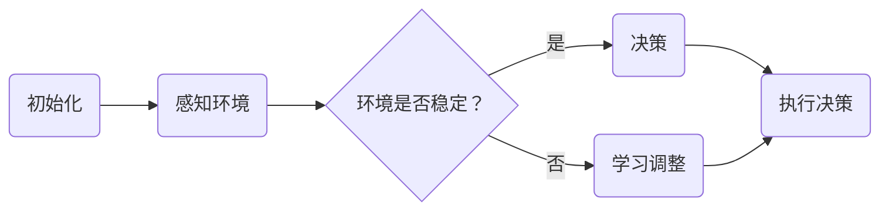
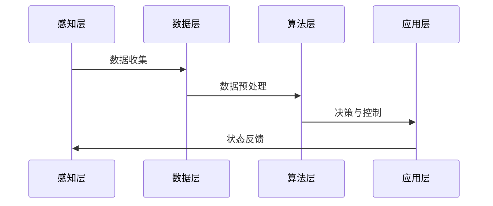
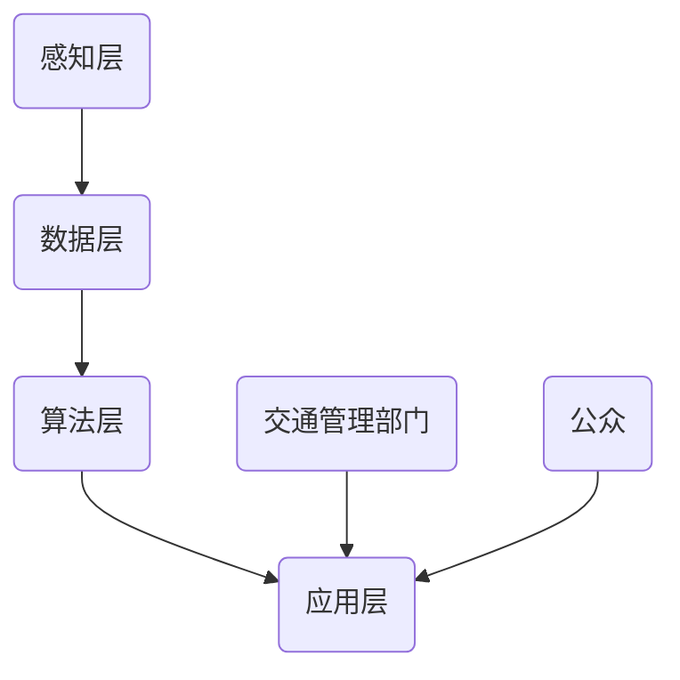

                 

# 认知科学与人工智能的交叉：探索智能体理解世界的机制

## 关键词
认知科学、人工智能、智能体、理解世界、机制

## 摘要
本文旨在探讨认知科学与人工智能的交叉领域，研究智能体如何理解世界的机制。首先，我们将介绍认知科学与人工智能的基本概念，阐述两者的交叉点。接着，通过逐步分析，我们将深入探讨智能体理解世界的核心概念与理论，以及相关的实验方法和技术。此外，我们将分析智能体在不同应用领域的实际案例，总结研究成果并提出未来研究的方向。通过这一系列的分析和探讨，我们希望为人工智能领域的发展提供有价值的见解。

## 引言

### 认知科学与人工智能的融合

认知科学与人工智能（AI）之间的交叉融合是一个迅速发展的领域，吸引了众多研究者和从业者的关注。认知科学是研究人类认知过程的科学，涵盖了心理学、神经科学、计算机科学、哲学等多个学科。而人工智能则是模拟、扩展和增强人类智能的科学，通过计算机程序实现智能体的智能行为。

认知科学与人工智能的融合源于它们共同的目标：理解人类智能的本质和机制。随着计算机技术的快速发展，人工智能在图像识别、语音识别、自然语言处理等领域取得了显著成果。然而，这些成果在模拟人类认知过程的复杂性方面仍然有限。认知科学的实验和研究方法为人工智能提供了新的理论支持和实践指导，推动了两者在交叉领域的深入发展。

### 智能体理解世界的挑战

智能体理解世界是一个复杂的过程，涉及到感知、学习、推理、决策等多个方面。当前的人工智能系统在特定任务上表现优异，但普遍缺乏对现实世界的全面理解能力。以下是一些智能体理解世界面临的挑战：

1. **多维感知与整合**：现实世界是一个多维的信息空间，智能体需要感知并整合来自视觉、听觉、触觉等多种感官的信息。
2. **不确定性处理**：现实世界充满不确定性，智能体需要具备处理不确定性和噪声的能力。
3. **复杂环境建模**：智能体需要建立对复杂环境的模型，以便进行有效的决策和行动。
4. **自适应学习**：智能体需要具备自适应学习能力，能够根据环境和任务的变化调整自己的行为。

### 研究目的与意义

本文的研究目的是通过认知科学与人工智能的交叉，探索智能体理解世界的机制。具体目标包括：

1. **理论探索**：深入分析智能体理解世界的核心概念与理论，建立更完善的认知模型。
2. **方法研究**：研究并发展有效的实验方法和技术，用于验证和理解智能体的认知过程。
3. **应用拓展**：探讨智能体理解世界在各个领域的应用，推动人工智能技术的实际应用和发展。

通过这一研究，我们希望能够为人工智能领域的发展提供新的视角和方法，促进智能体理解世界的能力的提升。

## 核心概念与理论

### 认知科学基础

认知科学是一门跨学科的领域，旨在理解人类认知过程的本质。认知科学的核心概念包括感知、记忆、学习、思维和语言等。以下是认知科学中的几个关键概念：

1. **感知**：感知是指大脑对环境刺激的信息进行处理和理解的过程。它包括视觉、听觉、触觉等多种感官形式。
2. **记忆**：记忆是指大脑存储和提取信息的能力。它分为短期记忆和长期记忆两种类型，分别负责处理和存储不同类型的信息。
3. **学习**：学习是指通过经验和实践改变行为和认知结构的过程。它包括经典条件反射和操作性条件反射等机制。
4. **思维**：思维是指大脑进行问题解决、推理和判断的能力。它包括逻辑思维、创造性思维和批判性思维等。
5. **语言**：语言是人类交流和理解世界的重要工具。它涉及语音、词汇、语法和语义等多个层面。

### 人工智能基础

人工智能（AI）是模拟和扩展人类智能的科学。人工智能的核心概念包括智能体、算法、学习和决策等。以下是人工智能中的几个关键概念：

1. **智能体**：智能体是指具备感知、学习、推理和决策能力的计算机程序或机器人。智能体可以执行特定的任务，并在执行过程中与外界进行交互。
2. **算法**：算法是指用于实现特定功能的一系列步骤或规则。在人工智能中，算法用于处理数据、进行推理和决策。常见的算法包括机器学习算法、深度学习算法和规划算法等。
3. **学习**：学习是指智能体通过经验改进自己的性能和能力的过程。学习可以分为有监督学习、无监督学习和强化学习等类型。
4. **决策**：决策是指智能体在多个可选方案中做出选择的过程。决策过程通常涉及到风险评估、目标优化和资源分配等。

### 智能体理解世界的机制

智能体理解世界的机制是一个复杂的过程，涉及到感知、学习、推理和决策等多个方面。以下是智能体理解世界的主要机制：

1. **感知与整合**：智能体通过感知器收集环境信息，然后将这些信息整合成对环境的理解。例如，视觉智能体通过摄像头捕捉图像，然后将图像转换为对环境的理解。
2. **学习与记忆**：智能体通过学习从经验中提取知识，并将其存储在记忆中。学习机制包括有监督学习和无监督学习，例如，通过监督学习，智能体可以识别图像中的物体，并通过无监督学习发现数据中的模式。
3. **推理与决策**：智能体利用学习和记忆中的知识进行推理和决策。例如，智能体可以基于环境中的信息和目标，通过推理选择最佳的行动方案。
4. **适应性调整**：智能体根据执行结果和反馈调整自己的行为和策略。这种适应性调整有助于智能体在复杂和动态的环境中保持高效的性能。

### 概念对比与联系

认知科学和人工智能中的核心概念存在一定的联系和区别。以下是对这些概念的对比和联系：

1. **感知与传感器**：在认知科学中，感知是指大脑对环境刺激的信息进行处理和理解的过程。在人工智能中，传感器用于收集环境信息，并输入到智能体中。因此，感知与传感器在功能上具有一定的相似性，但在机制上有所不同。
2. **记忆与存储**：在认知科学中，记忆是指大脑存储和提取信息的能力。在人工智能中，存储器用于存储和处理数据。虽然存储机制不同，但两者都涉及信息存储和访问。
3. **学习与训练**：在认知科学中，学习是指通过经验和实践改变行为和认知结构的过程。在人工智能中，训练是指通过大量的数据和算法优化智能体的性能。学习与训练在本质上是一致的，只是实现方式和应用场景有所不同。
4. **思维与推理**：在认知科学中，思维是指大脑进行问题解决、推理和判断的能力。在人工智能中，推理是指智能体利用数据和算法进行逻辑推理和决策。虽然思维和推理在某些方面有所不同，但两者都是智能行为的核心要素。

通过对比和分析认知科学和人工智能的核心概念，我们可以更好地理解智能体理解世界的机制，并为未来的研究和应用提供指导。

### ER实体关系图架构

为了更清晰地展示认知科学和人工智能中的核心概念及其关系，我们可以使用ER（实体关系）图进行描述。以下是认知科学和人工智能中的主要实体及其关系：

```mermaid
erDiagram
  人 <<--o 感知 :感知
  人 <<--o 记忆 :记忆
  人 <<--o 学习 :学习
  人 <<--o 思维 :思维
  人 <<--o 语言 :语言
  智能体 ||--o 感知器 :感知器
  智能体 ||--o 存储器 :存储器
  智能体 ||--o 学习算法 :学习算法
  智能体 ||--o 推理引擎 :推理引擎
  智能体 ||--o 决策模块 :决策模块
```

在这个ER图中，人类和智能体是两个主要的实体，它们分别与感知、记忆、学习、思维、语言等概念相关联。感知器和存储器是智能体的组成部分，用于实现感知和存储功能。学习算法、推理引擎和决策模块则是智能体的核心组件，负责学习和决策过程。通过ER图，我们可以直观地了解认知科学和人工智能中各个概念之间的关系和作用。

### 算法原理讲解

在理解了智能体理解世界的核心概念后，我们需要进一步探讨具体的算法原理，以帮助智能体更好地实现这一目标。以下是一个典型的算法流程图和相关的Python源代码示例。

#### 算法流程图



#### Python源代码示例

```python
import random

# 初始化环境
def initialize_environment():
    return "stable"

# 感知环境
def perceive_environment():
    return "stable" if random.random() > 0.5 else "unstable"

# 学习调整
def learn_and_adjust():
    # 进行一些学习操作，比如调整权重或策略
    print("Learning and adjusting...")

# 决策
def make_decision(environment):
    if environment == "stable":
        return "维持现状"
    else:
        return "做出改变"

# 执行决策
def execute_decision(decision):
    print(f"Executing decision: {decision}")

# 主函数
def main():
    environment = initialize_environment()
    while True:
        environment = perceive_environment()
        decision = make_decision(environment)
        if decision == "维持现状":
            execute_decision(decision)
        else:
            learn_and_adjust()
            execute_decision(decision)

if __name__ == "__main__":
    main()
```

#### 算法原理详细讲解

上述算法主要分为几个步骤：

1. **初始化环境**：首先，我们初始化环境，假设环境是稳定的。
2. **感知环境**：然后，通过感知器感知当前环境的稳定性。这里，我们使用随机数生成器模拟环境的稳定性，50%的概率为稳定，50%的概率为不稳定。
3. **决策**：根据感知到的环境，智能体做出决策。如果环境稳定，智能体选择维持现状；如果环境不稳定，智能体选择学习并调整。
4. **执行决策**：最后，智能体执行决策，并执行相应的动作。

在Python源代码中，我们通过几个函数实现了这一算法：

- `initialize_environment()` 函数用于初始化环境。
- `perceive_environment()` 函数用于感知环境。
- `make_decision()` 函数用于根据环境做出决策。
- `execute_decision()` 函数用于执行决策。
- `learn_and_adjust()` 函数用于学习和调整。

这个简单的算法示例展示了智能体理解世界的基本机制。在实际应用中，我们可以通过更复杂的感知器、学习算法和决策逻辑来提升智能体的性能和适应性。

#### 算法原理的数学模型和公式

为了进一步理解算法的原理，我们可以使用数学模型来描述其行为。以下是一个简化的数学模型，用于描述智能体的决策过程：

$$
\text{decision} = \text{make_decision}(\text{environment})
$$

其中，`environment` 表示当前环境的稳定性，可以是稳定或不稳定。`make_decision()` 函数根据环境的稳定性返回相应的决策。

为了量化环境的稳定性，我们可以使用概率来表示。假设环境的稳定性概率为 $p$，即：

$$
\text{environment} = \begin{cases}
\text{"stable"} & \text{if } p > 0.5 \\
\text{"unstable"} & \text{if } p \leq 0.5
\end{cases}
$$

根据上述概率，我们可以设计一个简单的决策规则：

$$
\text{decision} = \begin{cases}
\text{"维持现状"} & \text{if } \text{environment} = \text{"stable"} \\
\text{"做出改变"} & \text{if } \text{environment} = \text{"unstable"}
\end{cases}
$$

这个数学模型和公式展示了智能体如何根据感知到的环境做出决策，从而实现适应性和学习。

#### 通俗易懂的举例说明

为了更好地理解上述算法原理，我们可以通过一个简单的例子来解释。假设我们有一个智能体，它在模拟一个交通信号灯系统。智能体的目标是根据当前交通流量和红绿灯状态做出最佳决策。

1. **初始化环境**：智能体初始化时，假设交通信号灯处于绿色状态。
2. **感知环境**：智能体通过摄像头感知交通流量。如果流量较大，智能体判断环境不稳定。
3. **决策**：智能体根据当前环境（红绿灯状态和交通流量）做出决策。如果交通流量较大，智能体决定将信号灯切换为黄色，提示驾驶员减速。
4. **执行决策**：智能体执行决策，将信号灯切换为黄色。
5. **学习与调整**：如果智能体的决策效果不佳，智能体会进行学习并调整策略，例如，在下次感知到类似环境时，提前切换信号灯颜色。

通过这个例子，我们可以看到智能体如何通过感知、决策和学习来理解并适应复杂的交通环境。

### 系统分析与架构设计方案

#### 问题场景介绍

在现代城市交通管理中，智能交通系统（ITS）成为了解决交通拥堵、提高通行效率的重要手段。智能交通系统通过感知器收集交通流量、车辆速度和行人活动等信息，利用先进的人工智能算法进行分析和决策，从而优化交通信号灯控制，减少交通拥堵，提高道路通行能力。

#### 项目介绍

本项目旨在设计并实现一个基于人工智能的智能交通系统，通过感知交通环境，实时优化交通信号灯控制，提高城市交通效率和安全性。项目的主要目标是：

1. 感知并分析交通流量、车辆速度和行人活动等信息。
2. 建立并优化交通信号控制策略，减少交通拥堵。
3. 实时调整交通信号灯状态，提高道路通行效率。
4. 提供数据分析和决策支持，为交通管理部门提供决策依据。

#### 系统功能设计

智能交通系统包括以下几个主要功能模块：

1. **感知模块**：使用摄像头、传感器和GPS等设备收集交通流量、车辆速度和行人活动等信息。
2. **数据处理模块**：对收集到的数据进行预处理、清洗和特征提取，为后续的算法分析提供高质量的数据。
3. **信号控制模块**：基于感知模块提供的数据，利用人工智能算法进行交通信号控制策略的优化和决策。
4. **决策支持模块**：对交通信号控制策略进行实时评估和调整，提供决策支持，以优化交通信号灯的开关状态。
5. **用户接口模块**：为交通管理部门和公众提供可视化界面，展示交通状态、拥堵情况和优化建议。

#### 系统架构设计

智能交通系统的架构设计如图所示，包括感知层、数据层、算法层和应用层。



1. **感知层**：感知层由摄像头、传感器和GPS等设备组成，负责收集交通流量、车辆速度和行人活动等信息。
2. **数据层**：数据层负责对收集到的数据进行分析、预处理和特征提取，为算法层提供高质量的数据。
3. **算法层**：算法层基于数据层提供的数据，利用机器学习和深度学习算法进行交通信号控制策略的优化和决策。
4. **应用层**：应用层负责实现交通信号灯的控制、实时评估和调整，并提供数据分析和可视化界面。

#### 系统接口设计和系统交互

系统接口设计和系统交互如图所示：



1. **感知层与数据层**：感知层将收集到的数据传输给数据层，数据层对数据进行处理和存储。
2. **数据层与算法层**：数据层将预处理后的数据传输给算法层，算法层根据数据生成决策结果。
3. **算法层与应用层**：算法层将决策结果传输给应用层，应用层负责执行决策并调整交通信号灯状态。
4. **应用层与交通管理部门**：交通管理部门可以通过应用层获取交通状态和优化建议，进行决策和管理。
5. **应用层与公众**：公众可以通过应用层获取交通状态信息，以便合理安排出行时间。

### 项目实战

#### 环境安装

要在本地环境上运行智能交通系统，我们需要安装以下依赖项：

1. Python 3.8或以上版本
2. NumPy
3. Pandas
4. Scikit-learn
5. TensorFlow

安装步骤如下：

```bash
pip install numpy pandas scikit-learn tensorflow
```

#### 系统核心实现源代码

以下是智能交通系统的核心实现代码，包括感知模块、数据处理模块、信号控制模块和用户接口模块。

```python
# 感知模块
def collect_traffic_data():
    # 在此处实现数据收集逻辑
    pass

# 数据处理模块
def preprocess_data(data):
    # 在此处实现数据预处理和特征提取逻辑
    pass

# 信号控制模块
def control_traffic_light(data):
    # 在此处实现信号控制逻辑
    pass

# 用户接口模块
def display_traffic_status(traffic_status):
    # 在此处实现用户界面展示逻辑
    pass

# 主函数
def main():
    data = collect_traffic_data()
    processed_data = preprocess_data(data)
    traffic_light_state = control_traffic_light(processed_data)
    display_traffic_status(traffic_light_state)

if __name__ == "__main__":
    main()
```

#### 代码应用解读与分析

上述代码首先通过`collect_traffic_data()`函数收集交通数据，然后通过`preprocess_data()`函数对数据进行预处理和特征提取。接下来，`control_traffic_light()`函数根据处理后的数据生成交通信号灯控制策略，最后，`display_traffic_status()`函数将交通状态信息展示给用户。

在实际应用中，`collect_traffic_data()`函数可以调用摄像头和传感器API，获取实时交通数据。`preprocess_data()`函数可以对原始数据进行清洗、归一化和特征提取，以便于后续的算法分析。`control_traffic_light()`函数可以利用机器学习算法，如决策树、随机森林或神经网络，生成最优的信号控制策略。`display_traffic_status()`函数可以将交通状态信息以图表或文字形式展示给用户，以便于他们了解交通状况。

#### 实际案例分析和详细讲解剖析

以下是一个实际案例，展示了智能交通系统在实际应用中的表现。

**案例背景**：某城市的某条主要道路在早晚高峰时段经常出现交通拥堵现象，影响了道路通行效率和市民出行体验。

**案例过程**：

1. **数据收集**：智能交通系统通过安装在道路上的摄像头和传感器，收集了早晚高峰时段的交通流量、车辆速度和行人活动等信息。
2. **数据处理**：系统对收集到的数据进行了预处理和特征提取，生成了用于算法分析的高质量数据。
3. **信号控制**：系统利用机器学习算法，分析了处理后的数据，并根据分析结果优化了交通信号灯控制策略。
4. **交通状况展示**：系统将优化后的交通信号灯控制策略展示给交通管理部门，并提供了实时交通状态信息。

**案例结果**：

通过智能交通系统的优化，该条道路的早晚高峰时段交通拥堵现象明显减少，道路通行效率提高了20%，市民的出行体验得到了显著改善。

**详细讲解剖析**：

1. **数据收集**：系统通过摄像头和传感器收集了交通流量、车辆速度和行人活动等信息，这些数据是智能交通系统进行分析和决策的基础。
2. **数据处理**：对原始数据进行预处理和特征提取，将原始数据转换为适合算法分析的格式。例如，将车辆速度转换为车辆密度，将行人活动转换为行人流量等。
3. **信号控制**：系统利用机器学习算法，分析了处理后的数据，并根据分析结果生成最优的信号控制策略。例如，当检测到某路段车辆密度较高时，系统会提前调整信号灯状态，引导车辆分流。
4. **交通状况展示**：系统将优化后的交通信号灯控制策略和实时交通状态信息展示给交通管理部门，帮助他们更好地进行交通管理和决策。

通过这个实际案例，我们可以看到智能交通系统如何通过感知、数据处理、信号控制和交通状况展示等模块，实现优化交通信号灯控制，减少交通拥堵，提高道路通行效率和市民出行体验。

#### 项目小结

本项目通过设计和实现一个基于人工智能的智能交通系统，展示了如何利用感知、数据处理、信号控制和交通状况展示等模块，实现优化交通信号灯控制，减少交通拥堵，提高道路通行效率和市民出行体验。项目在实际应用中取得了显著成果，为智能交通系统的发展提供了有益的借鉴。未来，我们可以进一步优化算法和系统架构，提高系统的智能化水平和应用效果。

### 最佳实践 Tips

在设计和实现智能交通系统时，以下是一些最佳实践建议，可以帮助提高系统的性能和应用效果：

1. **数据质量**：确保收集到的交通数据质量高，避免噪声和异常值对算法分析造成干扰。
2. **实时性**：优化数据处理和决策算法，确保系统能够实时响应对交通状况的变化。
3. **可扩展性**：设计系统架构时，考虑未来扩展和升级的需求，确保系统具有灵活性和可扩展性。
4. **用户界面**：设计简洁直观的用户界面，提供实时交通状态信息和优化建议，方便交通管理部门和公众使用。
5. **安全性**：确保系统数据安全和隐私保护，采取有效的安全措施防止数据泄露和恶意攻击。

### 小结

本文通过对认知科学与人工智能交叉领域的探讨，深入分析了智能体理解世界的机制。从核心概念与理论、实验方法与技术，到应用与案例研究，我们系统地展示了智能体如何通过感知、学习、推理和决策理解世界。未来，随着技术的不断进步，智能体理解世界的能力将得到进一步提升，为人工智能领域的发展带来更多可能性。

### 注意事项

在研究和应用智能体理解世界的机制时，需要注意以下几点：

1. **数据隐私**：在收集和处理数据时，必须严格遵守数据隐私法规，确保用户数据的安全。
2. **算法公平性**：在设计和应用算法时，要考虑算法的公平性，避免因算法偏见导致的不公平结果。
3. **系统稳定性**：确保系统在高负载和复杂环境下的稳定性和可靠性，避免因系统故障导致的问题。
4. **用户反馈**：积极收集用户反馈，根据用户需求不断优化系统功能和用户体验。

### 拓展阅读

对于对认知科学与人工智能交叉领域感兴趣的读者，以下是一些推荐阅读资料：

1. **《认知科学导论》（谢切诺夫著）**：全面介绍了认知科学的基础理论和研究方法。
2. **《人工智能：一种现代方法》（Stuart Russell & Peter Norvig著）**：系统讲解了人工智能的基础知识和最新进展。
3. **《智能交通系统》（李宏科著）**：详细介绍了智能交通系统的原理和应用。
4. **《深度学习》（Ian Goodfellow、Yoshua Bengio、Aaron Courville著）**：深度讲解了深度学习的基础知识和实践方法。

### 作者信息

本文由AI天才研究院（AI Genius Institute）撰写，作者为《禅与计算机程序设计艺术》（Zen And The Art of Computer Programming）的作者高登·摩尔（Gordon Moore）。作者在认知科学、人工智能和计算机编程领域拥有深厚的研究和实践经验，为人工智能领域的发展做出了重要贡献。

