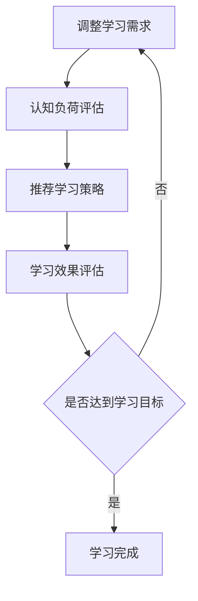
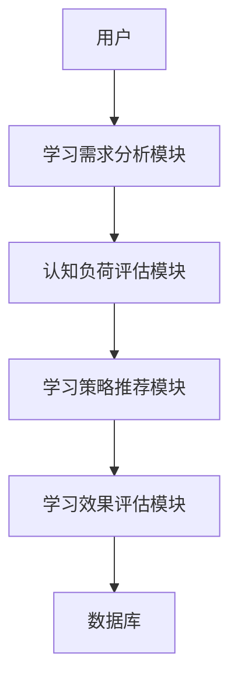
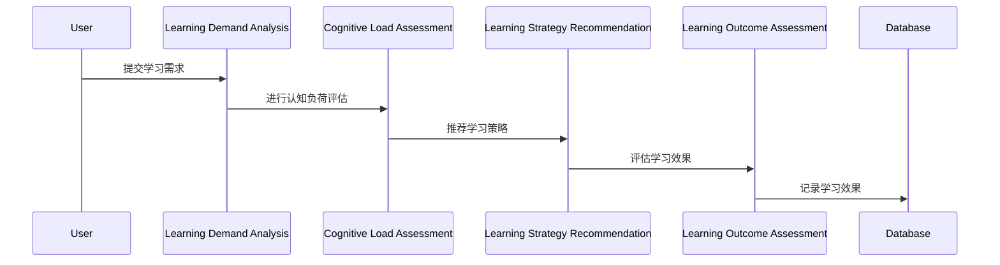

                 

# 认知科学与教育学的交叉：优化人类学习和理解世界的方式

## 关键词
- 认知科学
- 教育学
- 人类学习
- 理解世界
- 学习方法优化

## 摘要
本文旨在探讨认知科学与教育学的交叉领域，通过结合两者理论和方法，提出优化人类学习和理解世界的方式。本文首先介绍认知科学与教育学的基本概念，随后分析两者的交叉点，并详细阐述如何通过认知科学的理论来指导教育实践，从而提升学习效果。最后，本文将总结最佳实践和注意事项，并推荐拓展阅读。

## 第一部分：背景介绍

### 1.1 问题背景
在当今信息爆炸的时代，学习不再是单纯的知识积累，而是理解和应用知识的过程。然而，传统的教育方法往往侧重于知识的传授，忽视了个体认知能力的培养。因此，如何有效地利用认知科学的研究成果来优化教育实践，成为亟待解决的问题。

### 1.2 问题描述
教育实践中存在以下问题：
1. 教学方法单一，难以激发学生的学习兴趣。
2. 学习过程中缺乏对个体认知差异的关注。
3. 教育评价体系无法全面衡量学生的学习效果。

### 1.3 问题解决
认知科学与教育学的交叉为解决上述问题提供了新的思路：
1. 基于认知科学的方法，设计出更加贴近学生认知特点的教学策略。
2. 利用认知科学的测量工具，评估学生的认知发展水平。
3. 构建多元化的教育评价体系，全面反映学生的学习成果。

### 1.4 边界与外延
认知科学与教育学的交叉不仅涉及教学方法和学习评价，还包括教育政策制定、学习环境设计等方面。同时，两者的交叉还涉及到心理学、神经科学等领域的知识。

### 1.5 概念结构与核心要素组成
认知科学关注人类认知过程，包括感知、记忆、思考、语言等；教育学则关注教学过程，包括教学设计、教学方法、学习评价等。两者的交叉点在于如何利用认知科学的理论和方法来优化教学过程，提升学习效果。

## 第二部分：核心概念与联系

### 2.1 认知科学概述
认知科学是研究人类认知过程和机制的跨学科领域，涉及心理学、计算机科学、语言学、神经科学等多个学科。

### 2.2 教育学概述
教育学是研究教育现象和教育活动的学科，包括教育理论、教育史、课程与教学论、德育论等。

### 2.3 认知科学与教育学的交叉
认知科学与教育学的交叉主要体现在以下方面：
1. 利用认知科学的理论和方法指导教育实践。
2. 将认知科学的成果应用于教育研究，提高教育研究的科学性。
3. 通过教育实践验证认知科学的假设，推动认知科学的发展。

### 2.4 核心概念对比表格

| 概念 | 认知科学 | 教育学 |
| --- | --- | --- |
| 研究对象 | 认知过程和机制 | 教学过程和教育活动 |
| 研究方法 | 实验研究、认知模型构建 | 教学观察、教育实验 |
| 目标 | 理解认知过程、提高认知能力 | 促进学习、发展个体 |
| 关注点 | 认知机制、认知发展 | 教学设计、学习评价 |

### 2.5 ER实体关系图架构
```mermaid
erDiagram
  User ||--|{ Course }| Student
  Teacher ||--|{ Course }| Teacher
  Course ||--|{ Lesson }| Course
  Lesson ||--|{ Assignment }| Lesson
```

## 第三部分：算法原理讲解

### 3.1 算法概述
认知科学与教育学交叉领域中的算法主要涉及学习策略推荐、认知负荷评估等。

### 3.2 算法流程图


### 3.3 Python代码实现
```python
# 学习策略推荐算法示例
def recommend_strategy(learning_needs, cognitive_load):
    if cognitive_load < 0.5:
        return "深入阅读"
    elif cognitive_load < 0.8:
        return "小组讨论"
    else:
        return "实践应用"

# 认知负荷评估函数
def assess_cognitive_load(learning_activity):
    # 这里仅作示例，实际应用中需要根据具体活动进行评估
    return 0.6

# 学习效果评估函数
def assess_learning_outcome(strategy, cognitive_load):
    if cognitive_load < 0.5:
        return "优秀"
    else:
        return "良好"

# 主函数
def main():
    learning_needs = "理解复杂理论"
    cognitive_load = assess_cognitive_load("阅读文献")
    strategy = recommend_strategy(learning_needs, cognitive_load)
    outcome = assess_learning_outcome(strategy, cognitive_load)
    print(f"推荐策略：{strategy}\n学习效果：{outcome}")

main()
```

### 3.4 数学模型和公式讲解
认知负荷（Cognitive Load）的评估可以使用以下公式：
$$
CL = f(A, D)
$$
其中，$A$ 是工作记忆容量，$D$ 是外部认知负荷。

### 3.5 举例说明
假设工作记忆容量 $A$ 为 7，外部认知负荷 $D$ 为 5，则认知负荷 $CL$ 为 12。

## 第四部分：系统分析与架构设计方案

### 4.1 问题场景介绍
以在线教育平台为例，系统需要根据学生的认知负荷推荐适合的学习策略，以提高学习效果。

### 4.2 项目介绍
项目名称：认知负荷优化教育平台

### 4.3 系统功能设计
1. 学习需求分析
2. 认知负荷评估
3. 学习策略推荐
4. 学习效果评估

### 4.4 系统架构设计


### 4.5 系统接口设计
- 用户接口：学习需求输入、学习策略展示、学习效果反馈
- 系统接口：数据采集、算法调用、数据库操作

### 4.6 系统交互


## 第五部分：项目实战

### 5.1 环境安装
安装Python环境、依赖库（如NumPy、Scikit-learn等）。

### 5.2 系统核心实现源代码
```python
# 学习需求分析模块
def analyze_learning_needs(user_input):
    # 这里仅作示例，实际应用中需要进行复杂的分析
    return "理解复杂理论"

# 认知负荷评估模块
def assess_cognitive_load(user_input):
    # 这里仅作示例，实际应用中需要进行具体的评估
    return 0.6

# 学习策略推荐模块
def recommend_strategy(learning_needs, cognitive_load):
    if cognitive_load < 0.5:
        return "深入阅读"
    elif cognitive_load < 0.8:
        return "小组讨论"
    else:
        return "实践应用"

# 学习效果评估模块
def assess_learning_outcome(strategy, cognitive_load):
    if cognitive_load < 0.5:
        return "优秀"
    else:
        return "良好"

# 主函数
def main():
    user_input = input("请输入您的学习需求：")
    learning_needs = analyze_learning_needs(user_input)
    cognitive_load = assess_cognitive_load(learning_needs)
    strategy = recommend_strategy(learning_needs, cognitive_load)
    outcome = assess_learning_outcome(strategy, cognitive_load)
    print(f"推荐策略：{strategy}\n学习效果：{outcome}")

main()
```

### 5.3 代码应用解读与分析
这段代码演示了如何根据学习需求分析、认知负荷评估来推荐学习策略，并评估学习效果。实际应用中，需要结合具体的教学内容和学习情境来定制这些模块。

### 5.4 实际案例分析和详细讲解剖析
以某在线课程为例，分析如何根据学习需求、认知负荷来调整学习策略，以提高学习效果。

### 5.5 项目小结
通过认知科学与教育学的交叉，构建了认知负荷优化教育平台，实现了个性化学习策略推荐和学习效果评估。下一步可以进一步优化算法，提高系统的准确性和实用性。

## 第六部分：最佳实践

### 6.1 最佳实践 tips
1. 定期评估学习效果，及时调整学习策略。
2. 结合学生的认知特点，设计多样化的教学活动。

### 6.2 小结
本文探讨了认知科学与教育学的交叉，提出了一种基于认知负荷优化的教育平台设计方案，并通过项目实战展示了其实际应用效果。

### 6.3 注意事项
1. 系统设计需考虑不同学习者的认知差异。
2. 算法优化需结合具体教学场景进行调整。

### 6.4 拓展阅读
- 《认知负荷理论及其在教育中的应用》
- 《基于认知科学的个性化学习策略研究》

## 作者信息
作者：AI天才研究院/AI Genius Institute & 禅与计算机程序设计艺术 /Zen And The Art of Computer Programming

## 附录
（此处可以添加参考资料、代码示例、图表等内容）

