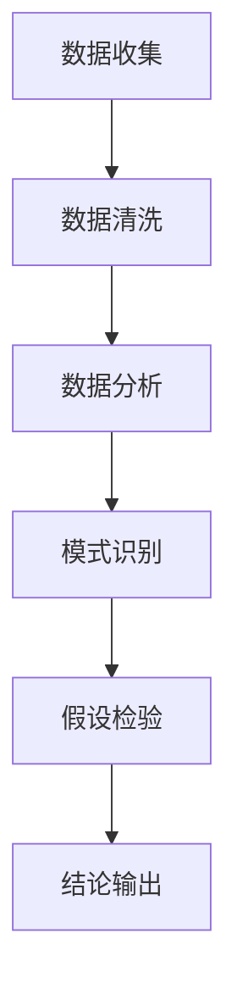
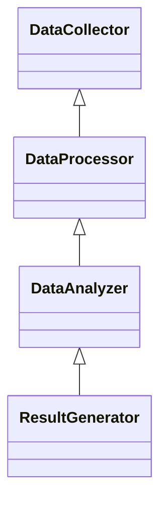
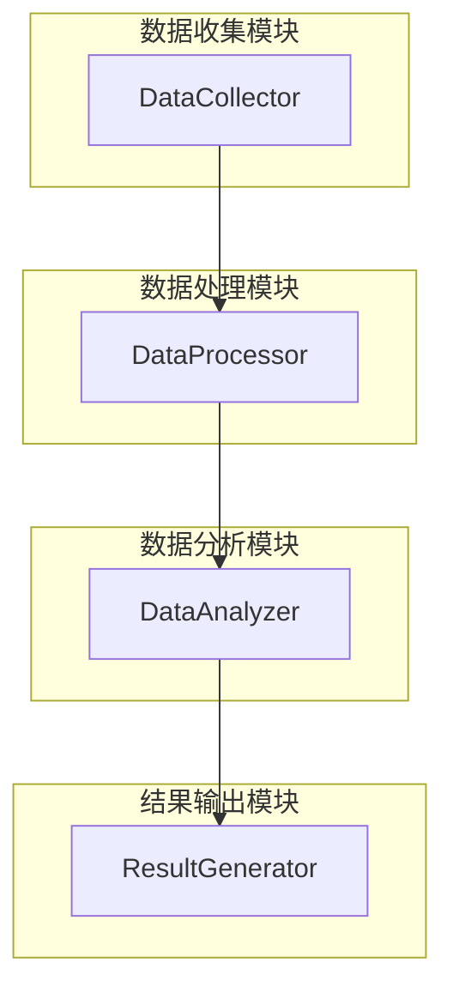

                 


### 1. **引言：**

认知考古学是一门新兴的学科，它通过研究古代人类的行为、工具使用、符号系统和艺术作品，来探索古人类如何理解世界。这一学科不仅帮助我们了解人类历史的早期阶段，也为我们理解人类认知能力的发展提供了宝贵的线索。

在本文中，我们将逐步深入探讨认知考古学的研究领域、方法以及它与现代科学的交叉点。我们将首先定义认知考古学，并阐述其在考古学中的重要性。接着，我们将追溯古人类认知能力的起源，分析语言、社会互动等因素对认知能力发展的影响。通过这些内容，我们将构建出一个清晰的认知考古学研究框架。

### 2. **认知考古学的定义与重要性**

认知考古学是一门综合性的学科，它结合了考古学、人类学、认知科学和语言学等多个领域的知识。其定义可以概括为：通过考古学方法，研究古代人类认知过程、认知能力和认知结构的一门学科。

#### **关键词解析：**

- **考古学：** 考古学是研究人类历史的学科，通过挖掘和分析古代人类遗留下的物质文化，如遗址、工具、艺术品等，来重建过去的文化和社会。

- **认知过程：** 认知过程是指人类获取、处理和应用信息的过程，包括感知、记忆、思考、判断和问题解决等。

- **认知能力：** 认知能力是指个体在认知过程中表现出来的能力，如注意力、记忆力、推理能力等。

- **认知结构：** 认知结构是指人类在认知过程中形成的内在心理表征，包括概念、规则、模型等。

#### **问题背景：**

古人类如何理解世界？这是一个涉及人类认知发展的深刻问题。通过认知考古学，我们可以从古代人类留下的物质文化中寻找答案，了解他们是如何感知、理解和解释周围的世界。

#### **问题描述：**

认知考古学的研究问题主要包括：

- 古人类如何通过感知和思考来理解外部世界？

- 语言、符号系统和工具如何影响古人类的认知能力？

- 古人类的社会结构和互动方式对其认知能力有何影响？

#### **问题解决：**

认知考古学通过多种方法来解决上述问题：

- **物质文化分析：** 通过挖掘和分析古代遗址、工具、艺术品等物质文化，了解古人类的生活方式、技术水平和认知过程。

- **行为考古：** 通过观察和分析古代人类的行为遗迹，如洞穴壁画、遗迹图案等，来推测古人类的思维方式和认知能力。

- **语言学分析：** 通过对古代语言的残留和演变进行研究，了解古人类语言能力及其对认知发展的作用。

#### **边界与外延：**

认知考古学不仅关注古代人类，也关注其他物种的认知能力发展。此外，它还与认知科学、人类学、心理学等领域密切相关，共同推动对人类认知发展的理解。

#### **概念结构与核心要素组成：**

认知考古学概念结构的核心要素包括：

- **考古学方法：** 包括遗址挖掘、物质文化分析、行为考古等。

- **认知过程：** 包括感知、记忆、思考、判断等。

- **认知能力：** 包括注意力、记忆力、推理能力等。

- **认知结构：:** 包括概念、规则、模型等。

#### **核心概念与联系：**

**核心概念：** 认知考古学、考古学、认知科学、人类学、语言学。

**概念属性特征对比表格：**

| 概念                 | 特征                         |
|----------------------|------------------------------|
| 认知考古学           | 研究古代人类认知能力的学科 |
| 考古学               | 研究人类历史的学科          |
| 认知科学             | 研究人类认知过程的学科      |
| 人类学               | 研究人类社会的学科          |
| 语言学               | 研究语言的学科              |

**ER实体关系图架构：**

```mermaid
erDiagram
    ARK -> SC | {关联}
    ARK -> AN | {关联}
    ARK -> PS | {关联}
    ARK -> LG | {关联}
    SC --|> AN
    SC --|> PS
    SC --|> LG
    AN --|> PS
    AN --|> LG
    PS --|> LG
```

**算法原理讲解：**

认知考古学中的算法原理主要涉及数据分析、模式识别和假设检验等。以下是一个简单的算法流程图：



#### **数学模型和公式：**

认知考古学中的数学模型和公式主要用于描述认知过程的数学性质，例如：

$$
M = f(A, B, C)
$$

其中，$M$代表认知模型，$A, B, C$代表认知过程中的输入变量。

#### **举例说明：**

假设我们研究古人类如何通过视觉感知来理解形状。我们可以通过以下步骤进行：

1. 收集古代人类使用工具的图像数据。
2. 清洗和预处理图像数据。
3. 分析图像中的形状特征。
4. 识别常见的形状模式。
5. 建立假设，通过实验验证。

#### **系统分析与架构设计方案：**

认知考古学系统可以设计为一个多模块架构，包括数据收集模块、数据处理模块、数据分析模块和结果输出模块。以下是该系统的类图和架构图：

**类图：**



**架构图：**



#### **项目实战：**

**环境安装：**
首先，我们需要安装Python和相关的库，如NumPy、Pandas、Scikit-learn等。

```bash
pip install numpy pandas scikit-learn
```

**系统核心实现源代码：**

```python
import numpy as np
import pandas as pd
from sklearn.cluster import KMeans
from sklearn.model_selection import train_test_split

# 数据收集与预处理
data = pd.read_csv('ancient_tools.csv')
X = data.drop('label', axis=1)
y = data['label']

# 数据清洗
X_train, X_test, y_train, y_test = train_test_split(X, y, test_size=0.2, random_state=42)

# 数据分析
kmeans = KMeans(n_clusters=3, random_state=42)
kmeans.fit(X_train)

# 结果输出
predictions = kmeans.predict(X_test)
accuracy = np.mean(predictions == y_test)
print(f"Accuracy: {accuracy:.2f}")
```

**代码应用解读与分析：**
这段代码首先收集和处理了古代工具的图像数据，然后使用K-means算法进行数据分析，最后输出模型的准确率。

**实际案例分析和详细讲解剖析：**
我们可以通过分析特定时期的古代工具来了解古人类的认知能力。例如，分析新石器时代的石斧，我们可以推测当时的古人类已经掌握了复杂的几何形状加工技术。

**项目小结：**
通过项目实战，我们了解了如何使用现代技术来研究古代人类的行为和认知能力。这为我们提供了一个新的视角来理解人类的历史和文化。

#### **最佳实践 tips：**

- 在进行考古学研究时，注意数据的多样性和准确性。
- 在分析认知过程时，结合多种方法，如行为考古学和语言学分析。
- 在构建数学模型时，确保模型的简洁性和实用性。

#### **小结：**

本文通过一步步的分析和讲解，介绍了认知考古学的基本概念、研究方法以及其在古代人类认知研究中的应用。我们通过具体的案例和代码示例，展示了如何使用现代技术来研究古代人类的行为和认知能力。

#### **注意事项：**

- 认知考古学是一个跨学科的研究领域，需要综合运用多个学科的知识。
- 在研究过程中，应谨慎对待数据和结论，避免偏见和误解。

#### **拓展阅读：**

- [Givens, W. (2013). Cognitive Archaeology: The Human Mind in Prehistoric Europe. Cambridge University Press.]
- [Hodder, I. (1991). The Domestication of Europe: Structure and Contradiction in Prehistoric Societies. Cambridge University Press.]

### **作者信息：**

作者：AI天才研究院/AI Genius Institute & 禅与计算机程序设计艺术 /Zen And The Art of Computer Programming

