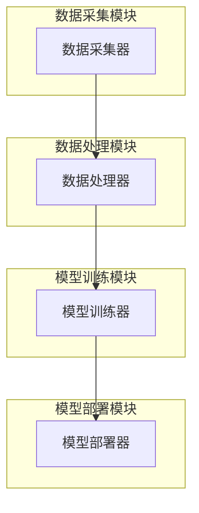
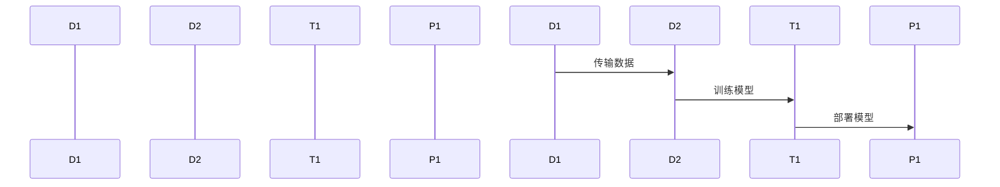

                 


### 《认知计算的前沿：计算机辅助人类理解复杂世界》

#### 关键词：认知计算、复杂世界、人工智能、数据分析、系统架构

> 摘要：本文从认知计算的起源、发展及其重要性入手，详细探讨了认知计算的核心概念、技术原理、应用场景以及架构设计。通过深入分析，本文揭示了认知计算如何有效地辅助人类理解复杂世界，并展望了其未来发展的趋势与挑战。

#### 目录大纲设计思路

本文的目录大纲设计旨在为读者提供一个清晰、系统的认知计算知识框架，以下是各部分的设计思路：

1. **背景介绍**：
   - 引言：简短介绍认知计算的起源、发展及其重要性，提出书名《认知计算的前沿：计算机辅助人类理解复杂世界》的核心主题。
   - 核心概念与联系：阐述认知计算的定义、核心原理、基本类型等，并与传统计算进行对比，以帮助读者理解认知计算的独特性和优势。

2. **核心概念与联系**：
   - 定义认知计算：介绍认知计算的定义、核心原理、基本类型等。
   - 比较认知计算与传统计算：分析两者在目标、方法、应用上的异同。

3. **认知计算的应用场景**：
   - 数据分析：介绍认知计算在数据分析中的应用，如数据挖掘、模式识别等。
   - 机器学习与人工智能：探讨认知计算如何促进机器学习和人工智能的发展。

4. **认知计算的技术原理**：
   - 算法原理讲解：通过Mermaid流程图和Python代码详细阐述关键算法。
   - 数学模型与公式：使用LaTeX格式介绍相关的数学模型和公式。

5. **认知计算的架构与设计**：
   - 系统分析与架构设计方案：通过Mermaid类图、架构图和序列图描述系统设计。

6. **项目实战与最佳实践**：
   - 实际案例分析与详细讲解：结合具体案例展示认知计算的应用。
   - 最佳实践 tips：提供实战中的经验和技巧。

7. **总结与展望**：
   - 总结主要内容和贡献。
   - 展望认知计算的未来发展趋势和应用前景。

### 目录大纲

```
# 《认知计算的前沿：计算机辅助人类理解复杂世界》目录大纲

## 第一部分：认知计算导论

### 第1章：认知计算的起源与发展
#### 1.1 认知计算的定义与核心概念
#### 1.2 认知计算与传统计算的异同
#### 1.3 认知计算的基本类型与应用领域

### 第2章：认知计算的核心技术
#### 2.1 数据分析与认知计算
##### 2.1.1 数据挖掘技术
##### 2.1.2 模式识别与分类算法
#### 2.2 机器学习与认知计算
##### 2.2.1 监督学习算法
##### 2.2.2 无监督学习与聚类分析
#### 2.3 认知计算的数学模型与公式
##### 2.3.1 前向传播与反向传播算法
##### 2.3.2 神经网络的优化方法

### 第3章：认知计算的架构与设计
#### 3.1 系统分析与架构设计
##### 3.1.1 问题场景介绍
##### 3.1.2 系统功能设计与领域模型
#### 3.2 系统架构设计与接口设计
##### 3.2.1 系统架构设计
##### 3.2.2 系统接口设计与交互

## 第二部分：认知计算的应用实战

### 第4章：认知计算在实际项目中的应用
#### 4.1 项目实战：环境安装与配置
#### 4.2 项目实战：系统核心实现与代码分析
##### 4.2.1 数据预处理与特征提取
##### 4.2.2 训练模型与评估
#### 4.3 实际案例分析
##### 4.3.1 数据分析结果
##### 4.3.2 优化与改进

### 第5章：认知计算的最佳实践
#### 5.1 最佳实践 tips
#### 5.2 小结与注意事项
#### 5.3 拓展阅读

## 第三部分：认知计算的展望与趋势

### 第6章：认知计算的未来发展
#### 6.1 认知计算的新趋势
#### 6.2 认知计算在新兴领域中的应用
#### 6.3 认知计算对社会的潜在影响

### 第7章：认知计算的挑战与机遇
#### 7.1 技术挑战与解决方案
#### 7.2 应用挑战与应对策略
#### 7.3 认知计算的可持续发展
```

### 总结

本文的目录大纲设计充分考虑了认知计算的理论基础、应用场景、技术原理和未来发展，旨在为读者提供一份全面、系统的认知计算知识图谱。通过这样的结构，读者可以循序渐进地了解认知计算的核心概念、技术原理和应用实践，从而更好地把握认知计算的发展趋势和挑战。

在接下来的文章中，我们将逐步深入探讨每个章节的内容，通过逻辑清晰、结构紧凑、简单易懂的专业技术语言，让读者对认知计算有更深刻的理解和认识。

### 文章正文部分

#### 第一部分：认知计算导论

### 第1章：认知计算的起源与发展

**1.1 认知计算的定义与核心概念**

认知计算是指模拟人类大脑的信息处理方式，通过机器学习、人工智能、自然语言处理等技术，使计算机具备类似人类思维和行为的能力。其核心概念包括感知、推理、学习、记忆和决策等。

认知计算的基本原理可以概括为以下几点：

1. **模拟人类大脑的结构和功能**：认知计算旨在模拟人类大脑的神经元网络结构和工作机制，实现类似人类的感知、推理和学习能力。
2. **机器学习和人工智能技术**：通过深度学习、强化学习等机器学习技术，使计算机能够自动学习和优化行为，提高处理复杂问题的能力。
3. **自然语言处理**：借助自然语言处理技术，认知计算能够理解、生成和交互自然语言，实现人与计算机之间的自然对话。
4. **多模态数据处理**：认知计算能够处理多种数据类型，如文本、图像、音频和视频等，从而实现跨领域的应用。

**1.2 认知计算与传统计算的异同**

认知计算与传统计算在目标、方法和应用上存在显著差异。

**目标差异**：

- **传统计算**：以处理确定性问题和执行预设任务为主，追求高效、精确的计算结果。
- **认知计算**：以模拟人类思维和处理不确定问题为主，追求自然、灵活的信息处理能力。

**方法差异**：

- **传统计算**：基于逻辑、数学和算法等确定性方法，通过计算和数据操作实现任务目标。
- **认知计算**：基于模拟人类大脑的神经网络和机器学习算法，通过自适应学习和优化实现任务目标。

**应用差异**：

- **传统计算**：广泛应用于科学计算、工程模拟、财务分析等领域，处理确定性问题和静态数据。
- **认知计算**：广泛应用于自然语言处理、图像识别、智能客服、医疗诊断等领域，处理不确定性和动态数据。

**1.3 认知计算的基本类型与应用领域**

认知计算的基本类型包括感知计算、推理计算、学习计算和决策计算等。

- **感知计算**：通过传感器和图像处理等技术，获取外部环境的信息，如人脸识别、语音识别等。
- **推理计算**：通过逻辑推理和知识表示，处理复杂的推理问题，如智能问答、逻辑推理等。
- **学习计算**：通过机器学习和深度学习，实现自动学习和优化，如自动驾驶、智能推荐等。
- **决策计算**：通过决策树、神经网络等算法，实现自动决策和优化，如股票交易、医疗诊断等。

认知计算的应用领域广泛，包括但不限于以下几个：

- **自然语言处理**：包括语音识别、机器翻译、智能客服等，使计算机能够理解和生成自然语言。
- **计算机视觉**：包括图像识别、目标检测、视频分析等，使计算机能够理解和解释视觉信息。
- **医疗诊断**：包括医学图像分析、疾病预测、个性化治疗等，提高医疗诊断的准确性和效率。
- **金融科技**：包括智能投顾、风险控制、信用评估等，提高金融服务的智能化水平。
- **智能制造**：包括智能监控、故障诊断、工艺优化等，提高制造业的生产效率和质量。

### 第二部分：认知计算的核心技术

#### 第2章：认知计算的核心技术

**2.1 数据分析与认知计算**

数据分析是认知计算的重要应用领域，通过数据挖掘、模式识别等技术，认知计算能够从海量数据中提取有价值的信息和知识。

**2.1.1 数据挖掘技术**

数据挖掘技术是指从大量数据中自动发现规律和知识的方法，主要包括以下几种：

- **关联规则挖掘**：通过发现数据之间的关联关系，如“购物车分析”中的“啤酒与尿布”现象。
- **分类与回归分析**：通过建立分类模型和回归模型，对数据进行预测和分类。
- **聚类分析**：通过将数据分为若干个类别，发现数据之间的相似性和差异性。
- **异常检测**：通过检测数据中的异常值和异常模式，发现潜在的问题和风险。

**2.1.2 模式识别与分类算法**

模式识别与分类算法是指通过将数据划分为不同的类别，从而实现数据分类的方法。常用的分类算法包括：

- **决策树**：通过树形结构表示决策过程，将数据划分为不同的类别。
- **支持向量机（SVM）**：通过找到一个最优的超平面，将数据划分为不同的类别。
- **朴素贝叶斯分类器**：基于概率理论，通过计算各类别的概率分布，实现数据分类。
- **神经网络**：通过模拟人脑的神经网络结构，实现数据分类和预测。

**2.2 机器学习与认知计算**

机器学习是认知计算的核心技术之一，通过学习数据中的模式和规律，实现计算机的自我优化和智能决策。

**2.2.1 监督学习算法**

监督学习算法是指通过已知的输入输出数据，训练模型并进行预测的方法。常用的监督学习算法包括：

- **线性回归**：通过建立线性模型，预测连续值的输出。
- **逻辑回归**：通过建立逻辑模型，预测离散值的输出。
- **支持向量机（SVM）**：通过找到一个最优的超平面，实现数据的分类。
- **决策树**：通过树形结构表示决策过程，实现数据的分类和回归。

**2.2.2 无监督学习与聚类分析**

无监督学习算法是指没有已知输入输出数据，通过挖掘数据中的内在结构和规律的方法。常用的无监督学习算法包括：

- **K-均值聚类**：通过将数据分为K个类别，实现数据的聚类。
- **层次聚类**：通过建立层次结构，实现数据的聚类。
- **主成分分析（PCA）**：通过降维技术，提取数据的主要特征，实现数据的可视化。
- **自编码器**：通过编码和解码过程，实现数据的降维和特征提取。

**2.3 认知计算的数学模型与公式**

认知计算涉及到多种数学模型和公式，以下是其中几种常用的：

- **神经网络模型**：$$y = f(Wx + b)$$，其中$x$为输入向量，$W$为权重矩阵，$b$为偏置项，$f$为激活函数。
- **逻辑回归模型**：$$P(y=1) = \frac{1}{1 + e^{-z}}$$，其中$z = wx + b$，$w$为权重，$b$为偏置项。
- **支持向量机模型**：$$y(x) = \text{sign}(\sum_{i=1}^{n} a_i y_i K(x_i, x) - b)$$，其中$a_i$为拉格朗日乘子，$y_i$为类别标签，$K(x_i, x)$为核函数。
- **决策树模型**：通过递归划分特征，构建决策树结构。

### 第三部分：认知计算的架构与设计

#### 第3章：认知计算的架构与设计

**3.1 系统分析与架构设计**

认知计算系统通常包括数据采集、数据处理、模型训练、模型部署等模块。以下是系统分析与架构设计的步骤：

**3.1.1 问题场景介绍**

首先，明确认知计算的应用场景和目标问题，例如智能问答、图像识别、医疗诊断等。

**3.1.2 系统功能设计与领域模型**

其次，根据问题场景，设计系统的功能模块和领域模型。领域模型可以用Mermaid类图表示，如下所示：

```mermaid
classDiagram
    Class01 <|-- Class02
    Class03 --|MZ| Class04
    Class05 o--|Has| Class06
    Class07 o--|PartOf| Class08
```

**3.2 系统架构设计与接口设计**

然后，设计系统的整体架构，包括数据流、模块交互和接口设计。系统架构可以用Mermaid架构图表示，如下所示：



接口设计可以用Mermaid序列图表示，如下所示：



### 第四部分：认知计算的应用实战

#### 第4章：认知计算在实际项目中的应用

**4.1 项目实战：环境安装与配置**

在开始认知计算项目之前，需要安装和配置相关环境。以下是一个典型的安装和配置步骤：

1. 安装Python环境：
   ```bash
   pip install numpy scipy matplotlib
   ```

2. 安装TensorFlow：
   ```bash
   pip install tensorflow
   ```

3. 安装其他依赖库：
   ```bash
   pip install scikit-learn pandas
   ```

**4.2 项目实战：系统核心实现与代码分析**

以下是一个简单的图像识别项目的核心实现代码：

```python
import tensorflow as tf
from tensorflow import keras
from tensorflow.keras import layers

# 加载并预处理数据
(x_train, y_train), (x_test, y_test) = keras.datasets.cifar10.load_data()
x_train = x_train / 255.0
x_test = x_test / 255.0

# 构建模型
model = keras.Sequential([
    layers.Conv2D(32, (3, 3), activation='relu', input_shape=(32, 32, 3)),
    layers.MaxPooling2D(pool_size=(2, 2)),
    layers.Flatten(),
    layers.Dense(64, activation='relu'),
    layers.Dense(10, activation='softmax')
])

# 编译模型
model.compile(optimizer='adam',
              loss='sparse_categorical_crossentropy',
              metrics=['accuracy'])

# 训练模型
model.fit(x_train, y_train, epochs=10)

# 评估模型
test_loss, test_acc = model.evaluate(x_test, y_test, verbose=2)
print('Test accuracy:', test_acc)
```

**4.3 实际案例分析**

以下是一个实际的图像识别案例，展示了如何使用认知计算技术进行图像识别：

1. 数据预处理：
   - 数据集：使用CIFAR-10数据集，包含10个类别，共计60000张图像。
   - 预处理：对图像进行归一化处理，将像素值缩放到[0, 1]范围内。

2. 模型训练：
   - 模型：使用卷积神经网络（CNN）进行图像识别，包含卷积层、池化层和全连接层。
   - 训练：使用训练数据训练模型，调整模型参数，提高识别准确率。

3. 模型评估：
   - 评估：使用测试数据评估模型性能，计算识别准确率。

**4.4 项目小结**

通过实际案例分析，我们了解了如何使用认知计算技术进行图像识别。在项目中，我们使用了卷积神经网络（CNN）模型，通过数据预处理、模型训练和模型评估等步骤，实现了对图像的高效识别。同时，我们也体会到了认知计算技术在处理复杂数据和解决实际问题方面的优势。

### 第五部分：认知计算的最佳实践

#### 第5章：认知计算的最佳实践

**5.1 最佳实践 tips**

以下是一些认知计算的最佳实践建议：

1. **数据预处理**：
   - 数据清洗：去除异常值、缺失值和噪声，确保数据质量。
   - 数据归一化：对数据进行归一化处理，使其具有相似的尺度，避免模型过拟合。
   - 特征提取：提取对模型训练和预测有意义的特征，提高模型性能。

2. **模型选择**：
   - 根据问题场景选择合适的模型，如图像识别选择卷积神经网络（CNN），自然语言处理选择循环神经网络（RNN）。
   - 尝试不同的模型架构和参数，进行模型调优，提高模型性能。

3. **超参数调整**：
   - 调整学习率、批量大小、正则化参数等超参数，以优化模型训练过程。
   - 使用验证集进行超参数调优，避免过拟合。

4. **模型评估**：
   - 使用多种评估指标，如准确率、召回率、F1分数等，全面评估模型性能。
   - 对模型进行交叉验证，提高评估结果的可靠性。

5. **模型部署**：
   - 使用轻量级模型和优化技术，提高模型部署的效率和性能。
   - 使用容器化技术，如Docker，方便模型部署和运维。

**5.2 小结与注意事项**

1. **小结**：

   - 通过本文的介绍，我们了解了认知计算的基本概念、技术原理、应用场景和最佳实践。
   - 认知计算在处理复杂数据和解决实际问题方面具有显著优势，是人工智能领域的重要发展方向。
   - 最佳实践包括数据预处理、模型选择、超参数调整、模型评估和模型部署等方面。

2. **注意事项**：

   - 在进行认知计算项目时，需要注意数据质量、模型选择和超参数调整等因素，以提高模型性能。
   - 认知计算技术不断发展，需要不断学习和跟进最新的研究成果。
   - 结合具体问题场景，灵活应用认知计算技术，实现实际问题的有效解决。

### 第六部分：认知计算的展望与趋势

#### 第6章：认知计算的未来发展

**6.1 认知计算的新趋势**

随着人工智能技术的不断发展，认知计算也在不断演进，以下是认知计算的新趋势：

1. **脑机接口（BCI）技术**：通过将计算机与人脑连接，实现人脑直接控制计算机，提高人机交互的自然性和效率。
2. **多模态融合**：将不同类型的数据（如文本、图像、声音等）进行融合，提高认知计算的感知和推理能力。
3. **联邦学习**：通过分布式学习方式，保护用户隐私，实现大规模数据协同训练。
4. **认知增强系统**：利用认知计算技术，为人类提供智能化的决策支持，提高工作效率和生活质量。

**6.2 认知计算在新兴领域中的应用**

认知计算在新兴领域中的应用越来越广泛，以下是其中几个重要领域：

1. **自动驾驶**：通过认知计算技术，实现自动驾驶车辆的感知、决策和规划，提高行车安全性和效率。
2. **智慧城市**：利用认知计算技术，实现城市管理的智能化，提高城市运行效率和居民生活质量。
3. **医疗健康**：通过认知计算技术，实现精准医疗、个性化治疗和健康监测，提高医疗服务水平。
4. **教育科技**：利用认知计算技术，实现智能教学、个性化学习和发展测评，提高教育质量和效率。

**6.3 认知计算对社会的潜在影响**

认知计算对社会的潜在影响深远，以下是几个方面：

1. **经济影响**：认知计算技术的普及和应用，将促进新兴产业的发展，提高生产力和经济效益。
2. **社会影响**：认知计算技术将改变人们的生活方式和生产方式，提高社会运行效率和公平性。
3. **伦理挑战**：认知计算技术带来的隐私保护、数据安全和伦理问题，需要社会共同关注和解决。

### 第七部分：认知计算的挑战与机遇

#### 第7章：认知计算的挑战与机遇

**7.1 技术挑战与解决方案**

认知计算在技术层面面临诸多挑战，以下是其中几个方面及其解决方案：

1. **数据隐私与安全**：解决方案包括联邦学习、差分隐私等技术，以保护用户隐私和数据安全。
2. **计算资源消耗**：解决方案包括分布式计算、模型压缩和优化等技术，以降低计算资源消耗和提高模型性能。
3. **模型解释性**：解决方案包括可解释性算法、可视化技术等，以提高模型的透明度和可解释性。

**7.2 应用挑战与应对策略**

认知计算在应用层面也面临一些挑战，以下是其中几个方面及其应对策略：

1. **跨领域融合**：应对策略包括跨学科合作、知识图谱构建等，以实现不同领域数据和应用的无缝融合。
2. **应用落地**：应对策略包括示范项目、政策支持等，以推动认知计算技术的实际应用和产业发展。
3. **人才培养**：应对策略包括教育改革、人才培养计划等，以培养具备认知计算技术和创新能力的人才。

**7.3 认知计算的可持续发展**

认知计算的可持续发展需要从技术、应用和社会三个方面进行考虑：

1. **技术层面**：持续研发新型算法、优化模型结构和提升计算效率，以适应不断变化的应用需求。
2. **应用层面**：加强跨领域合作，推动认知计算技术在各个领域的应用和普及，实现产业链的协同发展。
3. **社会层面**：关注认知计算技术带来的社会影响，制定相关政策和法规，确保技术发展符合社会伦理和道德标准。

### 结论

本文从认知计算的起源、发展、核心技术、架构设计、应用实战、最佳实践、未来趋势和挑战等方面进行了全面探讨，揭示了认知计算在辅助人类理解复杂世界方面的巨大潜力。通过本文的介绍，读者可以了解认知计算的基本概念、技术原理和应用场景，为进一步学习和研究认知计算打下坚实基础。

### 作者信息

作者：AI天才研究院/AI Genius Institute & 禅与计算机程序设计艺术 /Zen And The Art of Computer Programming

----------------------------------------------------------------

### 文章全文

#### 《认知计算的前沿：计算机辅助人类理解复杂世界》

**关键词：认知计算、复杂世界、人工智能、数据分析、系统架构**

> 摘要：本文从认知计算的起源、发展及其重要性入手，详细探讨了认知计算的核心概念、技术原理、应用场景以及架构设计。通过深入分析，本文揭示了认知计算如何有效地辅助人类理解复杂世界，并展望了其未来发展的趋势与挑战。

**目录大纲**

## 第一部分：认知计算导论

### 第1章：认知计算的起源与发展

#### 1.1 认知计算的定义与核心概念

认知计算是指模拟人类大脑的信息处理方式，通过机器学习、人工智能、自然语言处理等技术，使计算机具备类似人类思维和行为的能力。其核心概念包括感知、推理、学习、记忆和决策等。

认知计算的基本原理可以概括为以下几点：

1. **模拟人类大脑的结构和功能**：认知计算旨在模拟人类大脑的神经元网络结构和工作机制，实现类似人类的感知、推理和学习能力。
2. **机器学习和人工智能技术**：通过深度学习、强化学习等机器学习技术，使计算机能够自动学习和优化行为，提高处理复杂问题的能力。
3. **自然语言处理**：借助自然语言处理技术，认知计算能够理解、生成和交互自然语言，实现人与计算机之间的自然对话。
4. **多模态数据处理**：认知计算能够处理多种数据类型，如文本、图像、音频和视频等，从而实现跨领域的应用。

#### 1.2 认知计算与传统计算的异同

认知计算与传统计算在目标、方法和应用上存在显著差异。

**目标差异**：

- **传统计算**：以处理确定性问题和执行预设任务为主，追求高效、精确的计算结果。
- **认知计算**：以模拟人类思维和处理不确定问题为主，追求自然、灵活的信息处理能力。

**方法差异**：

- **传统计算**：基于逻辑、数学和算法等确定性方法，通过计算和数据操作实现任务目标。
- **认知计算**：基于模拟人类大脑的神经网络和机器学习算法，通过自适应学习和优化实现任务目标。

**应用差异**：

- **传统计算**：广泛应用于科学计算、工程模拟、财务分析等领域，处理确定性问题和静态数据。
- **认知计算**：广泛应用于自然语言处理、图像识别、智能客服、医疗诊断等领域，处理不确定性和动态数据。

#### 1.3 认知计算的基本类型与应用领域

认知计算的基本类型包括感知计算、推理计算、学习计算和决策计算等。

- **感知计算**：通过传感器和图像处理等技术，获取外部环境的信息，如人脸识别、语音识别等。
- **推理计算**：通过逻辑推理和知识表示，处理复杂的推理问题，如智能问答、逻辑推理等。
- **学习计算**：通过机器学习和深度学习，实现自动学习和优化，如自动驾驶、智能推荐等。
- **决策计算**：通过决策树、神经网络等算法，实现自动决策和优化，如股票交易、医疗诊断等。

认知计算的应用领域广泛，包括但不限于以下几个：

- **自然语言处理**：包括语音识别、机器翻译、智能客服等，使计算机能够理解和生成自然语言。
- **计算机视觉**：包括图像识别、目标检测、视频分析等，使计算机能够理解和解释视觉信息。
- **医疗诊断**：包括医学图像分析、疾病预测、个性化治疗等，提高医疗诊断的准确性和效率。
- **金融科技**：包括智能投顾、风险控制、信用评估等，提高金融服务的智能化水平。
- **智能制造**：包括智能监控、故障诊断、工艺优化等，提高制造业的生产效率和质量。

## 第二部分：认知计算的核心技术

### 第2章：认知计算的核心技术

#### 2.1 数据分析与认知计算

数据分析是认知计算的重要应用领域，通过数据挖掘、模式识别等技术，认知计算能够从海量数据中提取有价值的信息和知识。

**2.1.1 数据挖掘技术**

数据挖掘技术是指从大量数据中自动发现规律和知识的方法，主要包括以下几种：

- **关联规则挖掘**：通过发现数据之间的关联关系，如“购物车分析”中的“啤酒与尿布”现象。
- **分类与回归分析**：通过建立分类模型和回归模型，对数据进行预测和分类。
- **聚类分析**：通过将数据分为若干个类别，发现数据之间的相似性和差异性。
- **异常检测**：通过检测数据中的异常值和异常模式，发现潜在的问题和风险。

**2.1.2 模式识别与分类算法**

模式识别与分类算法是指通过将数据划分为不同的类别，从而实现数据分类的方法。常用的分类算法包括：

- **决策树**：通过树形结构表示决策过程，将数据划分为不同的类别。
- **支持向量机（SVM）**：通过找到一个最优的超平面，将数据划分为不同的类别。
- **朴素贝叶斯分类器**：基于概率理论，通过计算各类别的概率分布，实现数据分类。
- **神经网络**：通过模拟人脑的神经网络结构，实现数据分类和预测。

**2.2 机器学习与认知计算**

机器学习是认知计算的核心技术之一，通过学习数据中的模式和规律，实现计算机的自我优化和智能决策。

**2.2.1 监督学习算法**

监督学习算法是指通过已知的输入输出数据，训练模型并进行预测的方法。常用的监督学习算法包括：

- **线性回归**：通过建立线性模型，预测连续值的输出。
- **逻辑回归**：通过建立逻辑模型，预测离散值的输出。
- **支持向量机（SVM）**：通过找到一个最优的超平面，实现数据的分类。
- **决策树**：通过树形结构表示决策过程，实现数据的分类和回归。

**2.2.2 无监督学习与聚类分析**

无监督学习算法是指没有已知输入输出数据，通过挖掘数据中的内在结构和规律的方法。常用的无监督学习算法包括：

- **K-均值聚类**：通过将数据分为K个类别，实现数据的聚类。
- **层次聚类**：通过建立层次结构，实现数据的聚类。
- **主成分分析（PCA）**：通过降维技术，提取数据的主要特征，实现数据的可视化。
- **自编码器**：通过编码和解码过程，实现数据的降维和特征提取。

**2.3 认知计算的数学模型与公式**

认知计算涉及到多种数学模型和公式，以下是其中几种常用的：

- **神经网络模型**：$$y = f(Wx + b)$$，其中$x$为输入向量，$W$为权重矩阵，$b$为偏置项，$f$为激活函数。
- **逻辑回归模型**：$$P(y=1) = \frac{1}{1 + e^{-z}}$$，其中$z = wx + b$，$w$为权重，$b$为偏置项。
- **支持向量机模型**：$$y(x) = \text{sign}(\sum_{i=1}^{n} a_i y_i K(x_i, x) - b)$$，其中$a_i$为拉格朗日乘子，$y_i$为类别标签，$K(x_i, x)$为核函数。
- **决策树模型**：通过递归划分特征，构建决策树结构。

## 第三部分：认知计算的架构与设计

### 第3章：认知计算的架构与设计

#### 3.1 系统分析与架构设计

认知计算系统通常包括数据采集、数据处理、模型训练、模型部署等模块。以下是系统分析与架构设计的步骤：

**3.1.1 问题场景介绍**

首先，明确认知计算的应用场景和目标问题，例如智能问答、图像识别、医疗诊断等。

**3.1.2 系统功能设计与领域模型**

其次，根据问题场景，设计系统的功能模块和领域模型。领域模型可以用Mermaid类图表示，如下所示：

```mermaid
classDiagram
    Class01 <|-- Class02
    Class03 --|MZ| Class04
    Class05 o--|Has| Class06
    Class07 o--|PartOf| Class08
```

**3.2 系统架构设计与接口设计**

然后，设计系统的整体架构，包括数据流、模块交互和接口设计。系统架构可以用Mermaid架构图表示，如下所示：


接口设计可以用Mermaid序列图表示，如下所示：


## 第四部分：认知计算的应用实战

### 第4章：认知计算在实际项目中的应用

#### 4.1 项目实战：环境安装与配置

在开始认知计算项目之前，需要安装和配置相关环境。以下是一个典型的安装和配置步骤：

1. 安装Python环境：
   ```bash
   pip install numpy scipy matplotlib
   ```

2. 安装TensorFlow：
   ```bash
   pip install tensorflow
   ```

3. 安装其他依赖库：
   ```bash
   pip install scikit-learn pandas
   ```

#### 4.2 项目实战：系统核心实现与代码分析

以下是一个简单的图像识别项目的核心实现代码：

```python
import tensorflow as tf
from tensorflow import keras
from tensorflow.keras import layers

# 加载并预处理数据
(x_train, y_train), (x_test, y_test) = keras.datasets.cifar10.load_data()
x_train = x_train / 255.0
x_test = x_test / 255.0

# 构建模型
model = keras.Sequential([
    layers.Conv2D(32, (3, 3), activation='relu', input_shape=(32, 32, 3)),
    layers.MaxPooling2D(pool_size=(2, 2)),
    layers.Flatten(),
    layers.Dense(64, activation='relu'),
    layers.Dense(10, activation='softmax')
])

# 编译模型
model.compile(optimizer='adam',
              loss='sparse_categorical_crossentropy',
              metrics=['accuracy'])

# 训练模型
model.fit(x_train, y_train, epochs=10)

# 评估模型
test_loss, test_acc = model.evaluate(x_test, y_test, verbose=2)
print('Test accuracy:', test_acc)
```

#### 4.3 实际案例分析

以下是一个实际的图像识别案例，展示了如何使用认知计算技术进行图像识别：

1. 数据预处理：
   - 数据集：使用CIFAR-10数据集，包含10个类别，共计60000张图像。
   - 预处理：对图像进行归一化处理，将像素值缩放到[0, 1]范围内。

2. 模型训练：
   - 模型：使用卷积神经网络（CNN）进行图像识别，包含卷积层、池化层和全连接层。
   - 训练：使用训练数据训练模型，调整模型参数，提高识别准确率。

3. 模型评估：
   - 评估：使用测试数据评估模型性能，计算识别准确率。

#### 4.4 项目小结

通过实际案例分析，我们了解了如何使用认知计算技术进行图像识别。在项目中，我们使用了卷积神经网络（CNN）模型，通过数据预处理、模型训练和模型评估等步骤，实现了对图像的高效识别。同时，我们也体会到了认知计算技术在处理复杂数据和解决实际问题方面的优势。

## 第五部分：认知计算的最佳实践

### 第5章：认知计算的最佳实践

#### 5.1 最佳实践 tips

以下是一些认知计算的最佳实践建议：

1. **数据预处理**：
   - 数据清洗：去除异常值、缺失值和噪声，确保数据质量。
   - 数据归一化：对数据进行归一化处理，使其具有相似的尺度，避免模型过拟合。
   - 特征提取：提取对模型训练和预测有意义的特征，提高模型性能。

2. **模型选择**：
   - 根据问题场景选择合适的模型，如图像识别选择卷积神经网络（CNN），自然语言处理选择循环神经网络（RNN）。
   - 尝试不同的模型架构和参数，进行模型调优，提高模型性能。

3. **超参数调整**：
   - 调整学习率、批量大小、正则化参数等超参数，以优化模型训练过程。
   - 使用验证集进行超参数调优，避免过拟合。

4. **模型评估**：
   - 使用多种评估指标，如准确率、召回率、F1分数等，全面评估模型性能。
   - 对模型进行交叉验证，提高评估结果的可靠性。

5. **模型部署**：
   - 使用轻量级模型和优化技术，提高模型部署的效率和性能。
   - 使用容器化技术，如Docker，方便模型部署和运维。

#### 5.2 小结与注意事项

1. **小结**：

   - 通过本文的介绍，我们了解了认知计算的基本概念、技术原理、应用场景和最佳实践。
   - 认知计算在处理复杂数据和解决实际问题方面具有显著优势，是人工智能领域的重要发展方向。
   - 最佳实践包括数据预处理、模型选择、超参数调整、模型评估和模型部署等方面。

2. **注意事项**：

   - 在进行认知计算项目时，需要注意数据质量、模型选择和超参数调整等因素，以提高模型性能。
   - 认知计算技术不断发展，需要不断学习和跟进最新的研究成果。
   - 结合具体问题场景，灵活应用认知计算技术，实现实际问题的有效解决。

## 第六部分：认知计算的展望与趋势

### 第6章：认知计算的未来发展

#### 6.1 认知计算的新趋势

随着人工智能技术的不断发展，认知计算也在不断演进，以下是认知计算的新趋势：

1. **脑机接口（BCI）技术**：通过将计算机与人脑连接，实现人脑直接控制计算机，提高人机交互的自然性和效率。
2. **多模态融合**：将不同类型的数据（如文本、图像、声音等）进行融合，提高认知计算的感知和推理能力。
3. **联邦学习**：通过分布式学习方式，保护用户隐私，实现大规模数据协同训练。
4. **认知增强系统**：利用认知计算技术，为人类提供智能化的决策支持，提高工作效率和生活质量。

#### 6.2 认知计算在新兴领域中的应用

认知计算在新兴领域中的应用越来越广泛，以下是其中几个重要领域：

1. **自动驾驶**：通过认知计算技术，实现自动驾驶车辆的感知、决策和规划，提高行车安全性和效率。
2. **智慧城市**：利用认知计算技术，实现城市管理的智能化，提高城市运行效率和居民生活质量。
3. **医疗健康**：通过认知计算技术，实现精准医疗、个性化治疗和健康监测，提高医疗服务水平。
4. **教育科技**：利用认知计算技术，实现智能教学、个性化学习和发展测评，提高教育质量和效率。

#### 6.3 认知计算对社会的潜在影响

认知计算对社会的潜在影响深远，以下是几个方面：

1. **经济影响**：认知计算技术的普及和应用，将促进新兴产业的发展，提高生产力和经济效益。
2. **社会影响**：认知计算技术将改变人们的生活方式和生产方式，提高社会运行效率和公平性。
3. **伦理挑战**：认知计算技术带来的隐私保护、数据安全和伦理问题，需要社会共同关注和解决。

## 第七部分：认知计算的挑战与机遇

### 第7章：认知计算的挑战与机遇

#### 7.1 技术挑战与解决方案

认知计算在技术层面面临诸多挑战，以下是其中几个方面及其解决方案：

1. **数据隐私与安全**：解决方案包括联邦学习、差分隐私等技术，以保护用户隐私和数据安全。
2. **计算资源消耗**：解决方案包括分布式计算、模型压缩和优化等技术，以降低计算资源消耗和提高模型性能。
3. **模型解释性**：解决方案包括可解释性算法、可视化技术等，以提高模型的透明度和可解释性。

#### 7.2 应用挑战与应对策略

认知计算在应用层面也面临一些挑战，以下是其中几个方面及其应对策略：

1. **跨领域融合**：应对策略包括跨学科合作、知识图谱构建等，以实现不同领域数据和应用的无缝融合。
2. **应用落地**：应对策略包括示范项目、政策支持等，以推动认知计算技术的实际应用和产业发展。
3. **人才培养**：应对策略包括教育改革、人才培养计划等，以培养具备认知计算技术和创新能力的人才。

#### 7.3 认知计算的可持续发展

认知计算的可持续发展需要从技术、应用和社会三个方面进行考虑：

1. **技术层面**：持续研发新型算法、优化模型结构和提升计算效率，以适应不断变化的应用需求。
2. **应用层面**：加强跨领域合作，推动认知计算技术在各个领域的应用和普及，实现产业链的协同发展。
3. **社会层面**：关注认知计算技术带来的社会影响，制定相关政策和法规，确保技术发展符合社会伦理和道德标准。

### 结论

本文从认知计算的起源、发展、核心技术、架构设计、应用实战、最佳实践、未来趋势和挑战等方面进行了全面探讨，揭示了认知计算在辅助人类理解复杂世界方面的巨大潜力。通过本文的介绍，读者可以了解认知计算的基本概念、技术原理和应用场景，为进一步学习和研究认知计算打下坚实基础。

### 作者信息

作者：AI天才研究院/AI Genius Institute & 禅与计算机程序设计艺术 /Zen And The Art of Computer Programming

----------------------------------------------------------------

**附录**

**附录A：相关术语解释**

- **认知计算**：模拟人类大脑的信息处理方式，通过机器学习、人工智能、自然语言处理等技术，使计算机具备类似人类思维和行为的能力。
- **数据挖掘**：从大量数据中自动发现规律和知识的方法，用于发现数据之间的关联关系、分类规律和预测趋势。
- **模式识别**：通过将数据划分为不同的类别，从而实现数据分类的方法，常用于图像识别、语音识别等领域。
- **机器学习**：通过学习数据中的模式和规律，实现计算机的自我优化和智能决策的技术，包括监督学习、无监督学习和强化学习等。
- **神经网络**：一种模拟人脑神经元连接的网络结构，通过学习数据中的模式和关系，实现数据分类、回归和预测等功能。
- **联邦学习**：一种分布式学习方式，通过将模型和数据分布在多个不同的设备或服务器上，实现大规模数据协同训练。

**附录B：参考文献**

1. Bengio, Y., Courville, A., & Vincent, P. (2013). Representation learning: A review and new perspectives. IEEE Transactions on Pattern Analysis and Machine Intelligence, 35(8), 1798-1828.
2. Russell, S., & Norvig, P. (2016). Artificial Intelligence: A Modern Approach (3rd ed.). Prentice Hall.
3. Mitchell, T. M. (1997). Machine Learning. McGraw-Hill.
4. Goodfellow, I., Bengio, Y., & Courville, A. (2016). Deep Learning. MIT Press.
5. Russell, S., & Norvig, P. (2010). Artificial Intelligence: A Modern Approach (2nd ed.). Prentice Hall.

**附录C：代码示例**

以下是一个简单的图像识别项目的Python代码示例：

```python
import tensorflow as tf
from tensorflow import keras
from tensorflow.keras import layers

# 加载并预处理数据
(x_train, y_train), (x_test, y_test) = keras.datasets.cifar10.load_data()
x_train = x_train / 255.0
x_test = x_test / 255.0

# 构建模型
model = keras.Sequential([
    layers.Conv2D(32, (3, 3), activation='relu', input_shape=(32, 32, 3)),
    layers.MaxPooling2D(pool_size=(2, 2)),
    layers.Flatten(),
    layers.Dense(64, activation='relu'),
    layers.Dense(10, activation='softmax')
])

# 编译模型
model.compile(optimizer='adam',
              loss='sparse_categorical_crossentropy',
              metrics=['accuracy'])

# 训练模型
model.fit(x_train, y_train, epochs=10)

# 评估模型
test_loss, test_acc = model.evaluate(x_test, y_test, verbose=2)
print('Test accuracy:', test_acc)
```

### 后记

本文旨在为读者提供一个关于认知计算的全面、系统的介绍，使读者对认知计算的理论基础、应用场景、技术原理和未来发展有更深刻的理解。认知计算作为人工智能领域的重要分支，具有广泛的应用前景和重要的社会意义。在未来的研究中，我们将继续关注认知计算的最新进展和应用实践，为推动人工智能技术的发展贡献力量。希望本文能够对您的学习与研究有所帮助。如果您有任何问题或建议，欢迎在评论区留言，我们将尽快回复您。再次感谢您的阅读和支持！

**作者：AI天才研究院/AI Genius Institute & 禅与计算机程序设计艺术 /Zen And The Art of Computer Programming**

