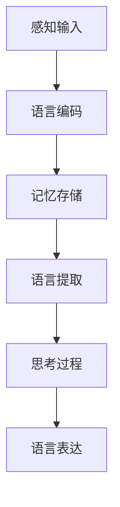
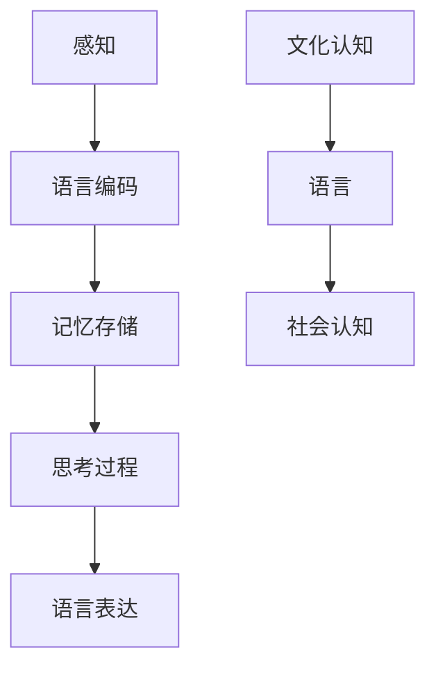
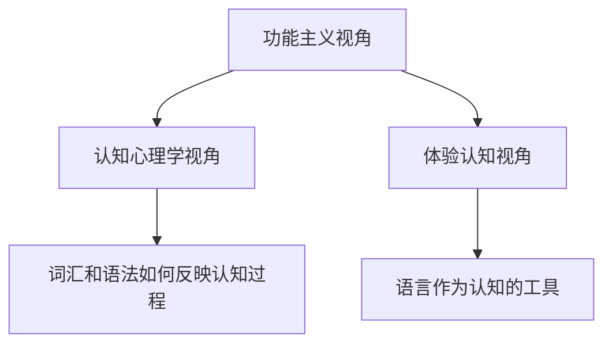
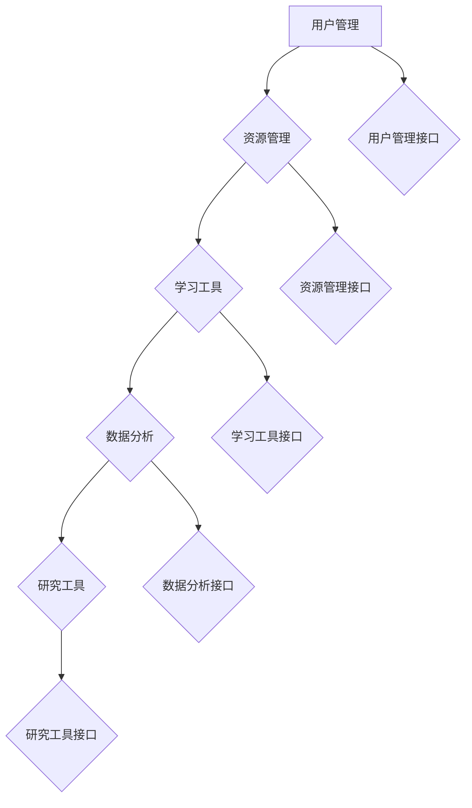

                 

# 第一部分：语言与认知基础

## 第1章：语言与认知的概述

### 1.1 语言与认知的关系

#### 1.1.1 语言作为认知的工具

语言是人类认知过程中不可或缺的工具。它不仅帮助人类进行思考和表达，还在一定程度上塑造了我们的认知方式。语言作为一种符号系统，通过词汇、语法和语义等元素，将复杂的世界转化为可理解的信息。

**如何帮助人类进行思考和沟通：**
- 语言提供了一个共享的框架，使个体能够通过词汇和句子的组合来传达想法和意图。
- 语言促进了知识传递，使得人类经验和文化得以积累和传承。
- 语言通过提问和回答的方式，促进了逻辑思维和问题解决能力的发展。

**语言在认知过程中的作用：**
- 语言支持记忆，使得信息可以通过词汇和句子的形式被编码和存储。
- 语言引导注意力，使得个体能够关注特定信息而忽略其他无关内容。
- 语言调节情绪，通过语言表达情感和情绪，帮助个体管理和调节内心状态。

#### 1.1.2 认知对语言的影响

认知过程不仅受到语言的影响，同时也对语言的使用和习得产生影响。认知差异可能导致语言差异，反之亦然。

**认知过程如何影响语言的使用：**
- 认知风格（如场依存与场独立）可能影响语言学习的方式和语言表达的风格。
- 认知能力（如工作记忆、执行功能）对语言理解和生成的能力有直接影响。
- 认知负荷理论认为，认知资源的有限性会影响语言处理的速度和准确性。

**认知差异如何导致语言差异：**
- 不同文化和社会背景下的认知模式差异，可能反映在语言的语法结构、词汇选择和语义上。
- 认知缺陷（如失语症）可能导致语言能力的改变，从而揭示语言与认知之间的紧密联系。

### 1.2 认知语言学的基本概念

#### 1.2.1 认知语言学的定义与发展

认知语言学是一门跨学科的领域，研究语言与认知之间的相互作用。它试图揭示语言的结构如何反映了人类大脑的工作原理。

**认知语言学的研究对象：**
- 词汇和语法如何反映了人类的感知、记忆和思维过程。
- 语言如何在认知过程中发挥作用，以及语言习得和语言处理的心理机制。

**认知语言学的历史与发展：**
- 认知语言学的起源可以追溯到20世纪初，随着语言哲学和心理语言学的发展。
- 20世纪60年代，乔姆斯基的转换生成语法为认知语言学提供了理论基础。
- 近年来，认知科学的发展进一步推动了认知语言学的研究，如体验认知理论和功能主义视角。

#### 1.2.2 认知语言学的核心理论

认知语言学提出了多种理论视角，以解释语言与认知之间的关系。

**功能主义视角：**
- 功能主义认为语言结构是为了满足特定的交际功能而演化的。
- 它强调语言的使用情境，以及语言如何帮助人类在社会互动中实现目标。

**认知心理学视角：**
- 认知心理学视角关注语言处理的心理过程，如词汇识别、句法分析和语义理解。
- 它通过实验方法研究语言如何影响认知过程，如记忆、注意力和推理。

**体验认知视角：**
- 体验认知理论认为语言不仅是认知的产物，也是人类体验世界的工具。
- 它强调语言与感官体验、身体运动和情感状态的相互作用。

### 1.3 语言认知的研究方法

#### 1.3.1 实验方法

实验方法是认知语言学研究中常用的一种方法，通过控制变量来探讨语言与认知之间的关系。

**实验设计：**
- 实验设计包括明确的研究问题、假设、参与者和实验条件。
- 通过控制语言输入，如词汇、句法和语义特征，来观察参与者对这些输入的感知和理解。

**实验数据分析：**
- 数据分析通常涉及定量和定性方法，如统计分析和行为观察。
- 通过分析数据，研究者可以验证假设并得出关于语言与认知之间关系的结论。

#### 1.3.2 计算模型方法

计算模型方法利用计算机模拟来研究语言与认知的相互作用。

**计算模型的构建：**
- 计算模型包括神经网络、决策树和生成模型等，用于模拟语言处理过程。
- 模型参数通过训练数据来调整，以优化模型的表现。

**计算模型的应用与验证：**
- 计算模型可以应用于各种语言任务，如机器翻译、情感分析和文本生成。
- 模型的表现通过对比实验数据来验证，以评估模型的准确性和有效性。

通过上述内容的逐步分析，我们可以更深入地理解语言与认知之间的关系，以及它们如何共同影响我们对世界的理解。在接下来的章节中，我们将进一步探讨语言对感知、记忆和思维的具体影响。# 第2章：语言对感知的影响

### 2.1 语言如何改变我们的感知

#### 2.1.1 感知与语言的关系

感知是人类对周围世界的直接感觉，而语言则是我们对这些感知体验的描述和传达工具。二者之间的关系深刻且复杂，相互影响，共同塑造了我们对世界的理解。

**语言如何影响我们对世界的感知：**
- 语言通过命名和分类的方式，将感知到的信息组织成有意义的结构。例如，不同的语言可能对同一事物的命名不同，这会影响人们对这一事物的感知。
- 语言通过描述和解释，使得感知到的信息可以被传达和共享。例如，科学术语的出现和普及，使得特定的感知经验可以被更精确地描述和交流。

**感知如何影响语言的理解和使用：**
- 感知直接影响语言的理解。例如，视觉信息（如文字的形状和颜色）可以影响阅读理解和语言学习。
- 感知也影响语言的使用。例如，情境中的视觉和听觉信息可以影响对话的语言风格和选择。

#### 2.1.2 语言对感知的调节作用

语言不仅反映我们的感知，还可以调节我们的感知体验。这种调节作用在不同文化和语言背景下可能有所不同。

**语言如何调节我们的感知体验：**
- 语言可以通过描述和解释，使感知到的信息变得更加显著或突出。例如，强调某个词汇可以吸引人们的注意力，使其在感知中占据更重要的位置。
- 语言可以通过预设的框架，影响我们对信息的解释和判断。例如，语言中的预设短语（如“那个红色的苹果”）可以引导人们对特定颜色的感知和记忆。

**语言在不同文化背景下的感知调节作用：**
- 不同语言和文化背景下的语言表达方式，会影响人们对同一感知体验的解释和理解。例如，某些语言可能有更丰富的颜色词汇，这可能导致人们对颜色的感知更加精细。
- 文化背景也会影响语言如何调节感知。例如，在某些文化中，语言可能更倾向于强调集体和关系，这可能会影响人们对社会互动的感知和理解。

### 2.2 语言对视觉感知的影响

语言对视觉感知的影响是多方面的，涉及到颜色、形状和空间等多个方面。

#### 2.2.1 语言如何影响我们对颜色的感知

颜色是视觉感知的一个重要方面，而语言在颜色命名和感知中起着关键作用。

**语言如何影响颜色的感知：**
- 颜色名称的语言差异：不同语言对颜色的命名方式可能不同，这会影响人们对颜色的感知。例如，一些语言中可能没有“粉色”这个词汇，这可能导致人们在感知上对粉色和红色有所混淆。
- 颜色词汇的丰富性：语言中颜色词汇的丰富程度可能影响人们对颜色的感知精细度。例如，一些语言可能有更多的颜色词汇，这可能导致人们对颜色的感知更加多样和精细。

#### 2.2.2 语言对形状和空间的感知影响

形状和空间是视觉感知中的另外两个重要方面，语言也对其有显著影响。

**语言如何影响形状的感知：**
- 形状名称的语言差异：不同语言对形状的命名可能有所不同，这会影响人们对形状的感知。例如，一些语言中可能没有“三角形”这个词汇，这可能导致人们在感知上对三角形和正方形有所混淆。
- 形状描述的丰富性：语言中形状描述的丰富程度可能影响人们对形状的感知和理解。例如，一些语言可能有更多描述形状的词汇，这可能导致人们对形状的感知更加细致和多样化。

**语言如何影响空间的感知：**
- 空间词汇的使用：不同语言的空间词汇可能有所不同，这会影响人们对空间关系的理解和感知。例如，一些语言可能有更丰富的空间方位词汇，这可能导致人们对空间方位的感知更加精确。
- 空间描述的方式：语言中描述空间的方式可能影响人们对空间关系的感知。例如，一些语言可能更倾向于使用方向性词汇（如“左”、“右”），这可能导致人们对空间方位的感知更加依赖方向性描述。

### 2.3 语言对听觉感知的影响

语言对听觉感知的影响同样显著，涉及到音高、音调和音色等多个方面。

#### 2.3.1 语言如何影响音高、音调和音色的感知

音高、音调和音色是听觉感知中的重要元素，而语言在这些方面也发挥着重要作用。

**语言如何影响音高的感知：**
- 音高与语音的发音有关，不同的语言可能有不同的音高模式。例如，一些语言可能有更明显的音高变化，这可能导致人们在感知上对音高的敏感度不同。
- 语言中的音调模式可能影响人们对音高的感知。例如，一些语言可能有更复杂的音调模式，这可能导致人们对音高的感知更加细致和多样化。

**语言如何影响音调的感知：**
- 音调与语音的语调有关，不同的语言可能有不同的语调模式。例如，一些语言可能有更明显的语调变化，这可能导致人们在感知上对音调的敏感度不同。
- 语言中的语调模式可能影响人们对音调的感知。例如，一些语言可能有更复杂的语调模式，这可能导致人们对音调的感知更加细致和多样化。

**语言如何影响音色的感知：**
- 音色与语音的音质有关，不同的语言可能有不同的音质特点。例如，一些语言可能有更丰富的音色变化，这可能导致人们在感知上对音色的敏感度不同。
- 语言中的音质特点可能影响人们对音色的感知。例如，一些语言可能有更多的浊音和清音，这可能导致人们对音色的感知更加细致和多样化。

#### 2.3.2 语言对节奏和音调模式的影响

节奏和音调模式是语言表达中的重要元素，它们对听觉感知也有显著影响。

**语言如何影响节奏的感知：**
- 语言中的节奏模式可能影响人们对节奏的感知。例如，一些语言可能有更明显的节奏变化，这可能导致人们在感知上对节奏的敏感度不同。
- 语言中的节奏模式可能影响人们的语言学习。例如，一些语言可能有更复杂的节奏模式，这可能导致人们在学习和理解这些语言时面临更多挑战。

**语言如何影响音调模式的感知：**
- 语言中的音调模式可能影响人们对音调的感知。例如，一些语言可能有更复杂的音调模式，这可能导致人们在感知上对音调的敏感度不同。
- 语言中的音调模式可能影响人们的音乐感知。例如，一些语言可能有更复杂的音调模式，这可能导致人们在欣赏音乐时对音调的变化更加敏感。

通过上述内容的分析，我们可以看到语言对感知的影响是多方面且深远的。在接下来的章节中，我们将继续探讨语言对记忆和思维的影响。# 第3章：语言对记忆的影响

### 3.1 语言如何影响记忆

记忆是认知过程中不可或缺的一部分，而语言在记忆的形成、编码和提取过程中发挥着关键作用。

#### 3.1.1 记忆与语言的关系

语言和记忆之间存在着紧密的联系。语言不仅帮助我们组织和存储信息，还影响我们对这些信息的回忆和提取。

**语言如何影响记忆：**
- **语言编码：** 语言是记忆信息的主要编码方式。我们在记忆新信息时，通常会用语言对其进行描述和组织。例如，当我们学习一个新词汇时，我们会尝试用母语来理解和解释这个词的含义。
- **语言调节：** 语言在记忆过程中起到调节作用。通过语言，我们可以有意识地回忆和提取信息。例如，当我们试图回忆一段对话时，我们可以通过语言提示来激活相关的记忆。
- **语言提升：** 语言有助于增强记忆的稳定性。通过语言，我们可以将信息转化为有意义的结构，使其更容易被记忆和保留。例如，通过编写笔记或讲解，我们可以巩固对知识的理解。

#### 3.1.2 语言对记忆编码的影响

记忆编码是指将新信息转化为记忆存储的过程。语言在这个过程中发挥着重要作用。

**语言如何影响记忆编码：**
- **词汇选择：** 词汇的选择直接影响记忆编码的效果。一些词汇可能更易于记忆，而另一些则可能更具挑战性。例如，一些语言中特定的词汇可能更具象化和生动，这有助于记忆。
- **语法结构：** 语法结构对记忆编码也有影响。不同的语法结构可能导致记忆编码的不同方式。例如，一些语言中的复合句可能比简单句更难记忆。
- **语境关联：** 语言编码过程中，语境关联对记忆编码有显著影响。将新信息与已有的语言知识相联系，有助于提高记忆的编码效率。例如，通过将新词汇放入熟悉的句子中，可以增强记忆效果。

**语言如何影响记忆编码策略：**
- **重复学习：** 语言通过重复学习来强化记忆编码。通过多次重复，我们可以加深对新信息的理解和记忆。例如，通过重复阅读或背诵，可以增强对单词的记忆。
- **语义联想：** 语言通过语义联想来增强记忆编码。通过将新信息与已有的概念或记忆节点相联系，可以形成更强大的记忆结构。例如，通过将新词汇与相关的事物或场景相联系，可以增强记忆效果。
- **形象化描述：** 语言通过形象化描述来增强记忆编码。通过使用形象、生动的描述方式，可以更有效地编码和存储信息。例如，通过使用比喻或故事来描述复杂的概念，可以使其更容易被记忆。

#### 3.1.3 语言对记忆提取的影响

记忆提取是指从记忆中检索和回忆信息的过程。语言在记忆提取中同样起着关键作用。

**语言如何影响记忆提取：**
- **语言提示：** 语言提示可以通过激活相关的记忆节点，帮助人们回忆信息。例如，通过提问或使用关键词，可以激活与特定信息相关的记忆。
- **语义搜索：** 语言通过语义搜索来帮助人们提取信息。通过理解信息的语义关系，我们可以更有效地在记忆中搜索和找到所需的信息。例如，通过理解词汇的上下文，可以更准确地找到相关的记忆。
- **语言表达：** 语言表达可以影响记忆提取的效果。通过语言表达，我们可以更清晰地回忆和表述信息。例如，通过口头或书面表达，可以更好地回忆和巩固记忆。

**语言如何影响记忆提取策略：**
- **组织化回顾：** 语言通过组织化回顾来增强记忆提取。通过将信息组织成有意义的结构，可以更容易地回忆和提取信息。例如，通过制作笔记或思维导图，可以更系统地回顾和提取信息。
- **联想记忆：** 语言通过联想记忆来增强记忆提取。通过将新信息与已有的记忆节点相联系，可以形成更强大的记忆结构，从而提高提取效率。例如，通过将新词汇与相关的事物或场景相联系，可以更容易地回忆起相关的记忆。
- **情景再现：** 语言通过情景再现来增强记忆提取。通过想象或描述情景，可以激活相关的记忆节点，从而提高提取效果。例如，通过想象一个场景或讲述一个故事，可以更清晰地回忆起相关的记忆。

通过以上对语言影响记忆的详细分析，我们可以看到语言在记忆编码和提取过程中的重要作用。在接下来的章节中，我们将进一步探讨语言对思维的影响。# 第4章：语言对思维的影响

### 4.1 语言如何影响思维

语言不仅是沟通的工具，也是思维的载体。它不仅影响我们的思考方式，还影响我们的认知结构和解决问题的能力。

#### 4.1.1 语言与思维的关系

**语言是思维的工具：**
- 语言使得思维过程可以外化，我们可以通过语言来表达和交流我们的想法。
- 语言提供了概念和词汇，帮助我们组织和理解世界。

**思维是语言的反映：**
- 思维过程受到语言的影响，语言的不同可能影响人们的思维方式和认知结构。
- 不同语言背景的人可能具有不同的思维方式，这会影响他们的认知和决策过程。

#### 4.1.2 语言对思维方式的调节作用

**语言如何调节思维方式：**
- **语法结构的影响：** 不同的语法结构可能导致不同的思维模式。例如，一些语言中的动词在句子中的位置可能影响人们对事件的记忆和思考。
- **词汇的丰富性：** 语言中的词汇丰富程度可能影响人们的思维方式。例如，一些语言可能有更多的描述情感和状态的词汇，这可能导致人们在思考时更注重情感和细微差别。
- **语言习惯：** 某些语言习惯可能影响人们的思维方式。例如，某些语言可能强调集体和关系，这可能导致人们在思考问题时更注重团队和合作。

**语言在不同文化背景下的思维方式调节作用：**
- **文化对语言的影响：** 不同的文化背景可能导致不同的语言使用习惯和思维方式。例如，某些文化可能更强调集体主义，而另一些文化可能更强调个人主义。
- **语言对文化思维方式的影响：** 语言可以反映和强化文化思维方式。例如，一些语言中的词汇和表达方式可能更符合某种文化价值观，这可能导致人们在思考问题时更倾向于符合这些价值观。

### 4.2 语言对逻辑思维的影响

逻辑思维是思维过程中的一种重要能力，它通过推理和论证来分析问题并得出结论。

#### 4.2.1 语言如何影响逻辑思维的形成

**语言对逻辑思维的影响：**
- **语法结构：** 不同的语法结构可能导致不同的逻辑思维模式。例如，某些语言中的被动语态可能影响人们对事件原因和结果的思考方式。
- **词汇选择：** 词汇的选择和丰富程度可能影响逻辑思维的严密性。例如，一些语言可能有更多描述因果关系的词汇，这可能导致人们在推理时更加注重因果关系的分析。
- **语言习惯：** 某些语言习惯可能影响逻辑思维的严密性和连贯性。例如，一些语言可能强调语言的经济性和简洁性，这可能导致人们在推理时更注重逻辑的简洁性。

#### 4.2.2 语言对逻辑推理的影响

**语言如何影响逻辑推理：**
- **推理过程的表达：** 语言是逻辑推理的表达工具，不同的语言表达方式可能影响推理的清晰度和逻辑性。例如，一些语言可能有更复杂的语法结构，这可能导致推理过程更加冗长和复杂。
- **推理规则的适用：** 语言中的推理规则可能影响逻辑推理的有效性。例如，一些语言可能强调逻辑推理的严谨性，这可能导致人们在推理时更注重逻辑规则的适用。
- **论证结构的构建：** 语言可以影响论证结构的构建，不同的语言习惯可能导致不同的论证方式。例如，某些语言可能更强调归纳推理，而另一些语言可能更强调演绎推理。

### 4.3 语言对创造性思维的影响

创造性思维是指产生新想法和新解决方案的能力，它是创新和发明的重要基础。

#### 4.3.1 语言如何影响创造性思维的发挥

**语言对创造性思维的影响：**
- **词汇的创新使用：** 语言中的词汇创新使用可能激发创造性思维。例如，通过创造新的词汇或重新定义现有词汇，可以拓宽思维的空间。
- **隐喻和比喻的使用：** 隐喻和比喻是创造性思维的重要工具，它们可以通过比喻的方式将不同概念联系起来，激发新的思考。
- **思维的流动性：** 语言的表达方式可能影响思维的流动性。一些语言可能更灵活和开放，这可能导致人们在创造性思维时更容易产生新的想法。

#### 4.3.2 语言对创造性思维策略的影响

**语言如何影响创造性思维的策略：**
- **问题定义：** 语言在问题定义中起着关键作用。通过精确和开放的问题定义，可以引导创造性思维的路径。
- **信息整合：** 语言通过整合不同来源的信息，可以帮助人们形成新的见解和解决方案。
- **思维跳跃：** 语言可以促进思维跳跃，通过连接不同领域的概念，激发创造性思维。

通过以上对语言影响思维的详细分析，我们可以看到语言在认知过程中的多重作用。语言不仅塑造了我们的思维方式，还影响了我们的认知结构和解决问题的能力。在接下来的章节中，我们将探讨语言对文化和社会的影响。# 第5章：语言对文化认知的影响

### 5.1 语言与文化的关系

语言和文化之间存在着紧密而复杂的关系。语言不仅是文化的重要组成部分，也是文化的重要载体和传递工具。

#### 5.1.1 语言作为文化的载体

**语言承载文化内涵：**
- 语言通过词汇、语法和表达方式来传递和表达文化的价值观、信仰、习俗和传统。
- 每种语言都有其独特的表达方式和习惯，这些习惯反映了特定文化的特点和思维方式。

**语言传承文化知识：**
- 语言是文化知识传承的重要工具。通过语言，文化中的历史、传统、习俗和知识得以世代相传。
- 文学、歌曲、故事等文化作品通过语言传递，使得文化得以延续和发展。

#### 5.1.2 文化对语言的影响

**文化影响语言的演变：**
- 文化环境中的社会习俗、价值观和思维方式会影响语言的演变和发展。
- 例如，一些文化中可能更强调集体主义，这可能导致语言中存在更多的合作和共享词汇。

**文化影响语言使用：**
- 不同文化背景的人在语言使用上可能存在差异。例如，某些文化可能更倾向于使用隐喻和比喻，而另一些文化可能更注重直接表达。
- 文化背景也可能影响语言习得和语言教学的方式。例如，某些文化可能更注重语法和规则的训练，而另一些文化可能更注重口语交流和实际应用。

### 5.2 语言对文化认知的影响

语言不仅影响文化的表达和传递，还影响人们对文化的理解和认知。

#### 5.2.1 语言如何影响我们对文化的理解

**语言塑造文化认知框架：**
- 语言通过其词汇和表达方式，塑造了我们对文化的理解和认知框架。不同的语言可能对同一文化现象有不同的描述和理解。
- 例如，某些语言可能有更多的词汇来描述一种特定的文化现象，这可能导致人们对这种现象的理解更加精细和全面。

**语言影响文化感知：**
- 语言影响我们对文化现象的感知和体验。不同的语言环境可能导致我们对同一文化现象有不同的感知和反应。
- 例如，某些语言可能更注重视觉感知，而另一些语言可能更注重听觉感知，这可能导致我们对文化现象的体验方式不同。

#### 5.2.2 语言对文化差异的认知影响

**语言促进文化差异的识别：**
- 语言通过其独特的表达方式和习惯，帮助人们识别和区分不同的文化差异。
- 例如，某些语言可能通过特定的词汇和表达方式来区分不同文化的习俗和价值观。

**语言增强文化包容性：**
- 语言可以促进不同文化之间的交流和理解，增强文化包容性。
- 通过学习不同语言，人们可以更好地理解和尊重其他文化的差异，减少文化偏见和误解。

### 5.3 语言对文化传承的影响

语言在文化传承中扮演着重要角色，它不仅是文化知识传递的工具，也是文化创新和发展的推动力。

#### 5.3.1 语言在文化传承中的作用

**语言传递文化知识：**
- 语言通过文学作品、歌曲、故事等文化作品，传递和保存文化知识。
- 例如，文学作品通过语言表达，不仅记录了历史事件，还传递了文化价值观和道德观念。

**语言促进文化交流：**
- 语言是文化交流的重要工具，它使得不同文化之间可以相互了解和借鉴。
- 例如，通过学习其他语言，人们可以阅读和理解其他文化的经典作品，从而促进文化的交流与融合。

#### 5.3.2 语言对文化保护与创新的推动作用

**语言保护文化遗产：**
- 语言在保护文化遗产方面发挥着重要作用。通过语言，文化遗产得以记录和保存，防止其流失和消失。
- 例如，通过翻译和出版，世界各地的文化遗产得以在全球范围内传播和保存。

**语言推动文化创新：**
- 语言是文化创新的重要工具，它促进了新思想的产生和传播。
- 例如，通过语言表达，新的文化概念和艺术形式得以产生和发展，推动了文化的创新和进步。

通过以上对语言与文化关系的详细分析，我们可以看到语言在文化认知、传承和创新中的多重作用。语言不仅是文化的重要组成部分，也是文化认知和传承的重要工具。在接下来的章节中，我们将探讨语言对社会认知的影响。# 第6章：语言对社会认知的影响

### 6.1 语言与社会的关系

语言和社会之间存在着紧密的联系，二者相互影响，共同塑造了我们的社会认知和行为。

#### 6.1.1 语言作为社会交流的工具

语言是人们进行社会交流的基础，它不仅帮助我们传达思想和意图，还维持了社会的运行和稳定。

**语言在社交互动中的作用：**
- 语言是沟通的桥梁，使得人们能够交流想法、意见和情感。
- 语言通过礼仪和规范，指导人们在社交互动中的行为和反应。
- 语言提供了社会身份的标志，通过语言的使用，人们可以建立和识别社会关系。

**语言在权力结构中的作用：**
- 语言在权力结构中扮演着重要角色，它可以通过语言的选择和运用，影响权力分配和资源配置。
- 语言能力和社会地位紧密相关，掌握权力语言的人可能在社会中占据更有利的地位。

#### 6.1.2 社会对语言的影响

社会环境和社会结构对语言的发展和变化有着重要影响。

**社会文化对语言的影响：**
- 社会的文化价值观、习俗和传统会影响语言的表达方式和使用习惯。
- 例如，某些社会可能更倾向于使用隐喻和比喻，而另一些社会可能更注重直接和明确的表达。

**社会阶层对语言的影响：**
- 社会阶层结构可能影响语言的多样性和使用。不同阶层的人可能使用不同的语言变体，这可能导致社会阶层的界限更加明显。
- 例如，某些阶层可能更倾向于使用正式和复杂的语言，而另一些阶层可能更倾向于使用非正式和口语化的表达。

### 6.2 语言对社会认知的影响

语言不仅影响我们的社会互动，还深刻地影响着我们的社会认知，包括对他人行为的理解、社会关系的建立和社会规范的遵守。

#### 6.2.1 语言如何影响社会成员的认知结构

**语言与社会认知的关系：**
- 语言构建了我们的认知框架，它通过词汇、语法和语义结构，帮助人们理解和解释社会现象。
- 语言可以影响人们对社会事件的解释和判断，不同的语言背景可能导致不同的社会认知。

**语言与社会角色的构建：**
- 语言通过社会角色的构建，帮助人们理解和扮演不同的社会角色。
- 例如，通过语言，人们可以识别和区分不同的社会角色，如领导者、同事和家庭成员。

#### 6.2.2 语言对社会认知偏差的影响

**语言影响社会认知偏差：**
- 语言中的预设偏见可能影响人们对社会事件的认知和判断。
- 例如，某些语言中的词汇可能隐含对特定群体的偏见，这可能导致人们对这些群体的负面认知。

**语言与社会刻板印象：**
- 语言可能强化社会刻板印象，使得人们对某些群体有固定的看法和偏见。
- 例如，通过语言描述，人们可能将某些负面特征与特定群体相联系，这可能导致对这些群体的歧视和偏见。

### 6.3 语言对社会互动的影响

语言在社会互动中发挥着关键作用，它不仅影响互动的方式，还影响互动的效果。

#### 6.3.1 语言如何影响社会互动的方式

**语言风格的影响：**
- 语言风格（如正式、非正式、亲切、严肃）可能影响社会互动的方式。
- 例如，正式的语言风格可能用于正式场合，而非正式的语言风格可能用于朋友之间的交流。

**语言交流的效率：**
- 语言交流的效率可能受到语言清晰度和表达方式的影响。
- 例如，使用精确和明确的语言可以减少误解，提高交流的效率。

#### 6.3.2 语言对社会互动效果的影响

**语言沟通的效果：**
- 语言沟通的效果可能受到语言技巧和沟通策略的影响。
- 例如，有效的沟通技巧（如倾听、提问和反馈）可以提高语言沟通的效果。

**语言冲突与解决：**
- 语言冲突可能在不同的社会互动中出现，而语言能力的高低可能影响冲突的解决。
- 例如，通过语言调解和沟通技巧，可以有效地解决社会冲突。

通过以上对语言与社会关系的详细分析，我们可以看到语言在社会认知、社会互动和社会结构中的多重作用。语言不仅是社会交流的工具，也是社会认知和文化传承的重要载体。在接下来的章节中，我们将总结和展望语言与认知研究的重要性和未来研究方向。# 第7章：总结与展望

### 7.1 语言与认知研究的重要性

语言与认知研究的重要性体现在多个方面，它不仅有助于我们深入理解人类思维和语言的本质，还对教育、心理学、社会学等多个领域产生了深远的影响。

**研究现状与趋势：**
- 随着认知科学和神经科学的进步，语言与认知研究取得了显著进展。通过脑成像技术和认知神经科学方法，研究者能够更准确地揭示语言处理和认知过程之间的联系。
- 认知语言学的新理论，如体验认知理论和分布式认知理论，为研究语言与认知的关系提供了新的视角和工具。

**研究意义：**
- 语言与认知研究有助于我们理解语言对人类认知和行为的影响，从而为教育方法和语言习得策略提供科学依据。
- 研究语言与认知的关系，有助于设计更有效的语言教学和学习工具，提高语言学习的效果和效率。

### 7.2 未来研究方向

**研究挑战与机遇：**
- **跨学科整合：** 将语言与认知研究与其他学科（如心理学、神经科学、教育学）更紧密地结合起来，是未来的一个重要挑战。这需要跨学科的研究方法和理论框架。
- **多语言研究：** 未来研究需要更多关注多语言背景下的语言与认知差异，以便更全面地理解语言对认知的影响。
- **大数据分析：** 利用大数据技术分析语言使用模式和认知过程，可以揭示更复杂的语言与认知关系。

**未来展望：**
- **神经语言学：** 进一步探索语言处理与大脑功能之间的联系，特别是语言与记忆、注意力、执行功能等认知过程的关系。
- **教育应用：** 开发基于语言与认知研究的个性化教育技术和工具，提高教育质量和学习效果。
- **社会语言学：** 研究语言在社会互动和文化传承中的作用，探索语言对社会认知和文化的深远影响。

通过总结和展望，我们可以看到语言与认知研究的重要性和广阔前景。未来的研究将继续揭示语言与认知之间的复杂关系，为我们更好地理解和利用语言提供科学基础。# 结论

综上所述，语言作为认知的工具，不仅深刻地影响着我们的感知、记忆和思维方式，还在文化传承、社会互动等方面发挥着关键作用。通过理解语言与认知的相互作用，我们能够更好地设计教育方法、改善沟通效果，并促进跨文化的理解和交流。

**未来展望：** 随着认知科学和神经科学的不断进步，语言与认知研究将继续深入，揭示更多关于语言如何塑造人类思维和行为的奥秘。通过跨学科的合作和多语言研究，我们将能够更全面地理解语言与认知的复杂关系，为未来的科技和社会发展提供新的视角和工具。

**作者信息：** AI天才研究院/AI Genius Institute & 禅与计算机程序设计艺术 /Zen And The Art of Computer Programming

在结束这篇文章之前，我希望读者能够思考语言在你们生活和认知中的作用，并鼓励大家继续探索和深入研究这个充满奥秘的领域。# 附加内容

## 8. 最佳实践 Tips

**提高语言认知能力：**
- **多语言学习：** 尝试学习一门新语言，不仅有助于提升认知能力，还能增强跨文化交流和理解。
- **积极参与讨论：** 在日常生活中积极参与语言讨论和辩论，这有助于锻炼思维能力和语言表达能力。
- **阅读多样化文本：** 阅读不同类型的文本，如小说、科学论文和新闻，以扩展词汇和了解不同语言风格。

**促进跨文化理解：**
- **了解文化差异：** 通过学习和了解不同文化的习俗和价值观，减少文化偏见和误解。
- **实践跨文化交流：** 在国际环境中实践跨文化交流，提高对不同文化背景的人的理解和尊重。

**应用认知语言学：**
- **分析语言现象：** 通过分析具体语言现象，如词汇、语法和语义，深入理解语言与认知的关系。
- **实验验证：** 设计实验来验证认知语言学理论，探索语言对认知的具体影响。

## 9. 小结

本文通过分析语言与认知的多种关系，揭示了语言在感知、记忆、思维和文化社会互动中的重要作用。希望读者能够认识到语言认知的重要性，并在日常生活中积极应用这些知识。

## 10. 注意事项

**保持开放心态：** 在学习新语言和文化时，保持开放和接受的态度，尊重和欣赏不同文化和语言的特点。
**持续学习和实践：** 语言认知是一个长期的过程，需要持续的学习和实践，才能不断提升自己的认知能力。

## 11. 拓展阅读

- **认知语言学经典著作：** 《语言与认知》（Language and Cognition）by Derek Bickerton
- **神经语言学研究：** 《语言与大脑：神经语言学导论》（Language and the Brain: An Introduction to Neurolinguistics）by Lera Boroditsky
- **跨文化交流指南：** 《跨文化沟通》（Intercultural Communication: A Reader）by Richard M. Gerson

通过这些拓展资源，读者可以进一步深入探索语言与认知的领域，拓宽知识视野。# 附录

### 附录 A：核心概念与联系

**核心概念：**
1. 认知语言学
2. 语言认知
3. 感知
4. 记忆
5. 思维
6. 文化认知
7. 社会认知

**概念属性特征对比表格：**

| 核心概念 | 定义 | 影响因素 | 作用 |
| --- | --- | --- | --- |
| 认知语言学 | 研究语言与认知之间关系的一个跨学科领域 | 语言结构、文化背景、认知过程 | 揭示语言对认知的影响 |
| 语言认知 | 研究语言在认知过程中作用的一个领域 | 语言输入、语言习得、认知负荷 | 支持记忆、引导注意力 |
| 感知 | 对外部世界的直接感觉 | 感官输入、语言描述、文化背景 | 形成认知框架 |
| 记忆 | 对信息的存储和回忆 | 编码方式、语境关联、重复学习 | 知识传递和积累 |
| 思维 | 信息处理和问题解决的过程 | 语言结构、文化背景、认知策略 | 推理、决策、创新 |
| 文化认知 | 理解和解释不同文化的能力 | 语言、价值观、社会习俗 | 建立文化认同 |
| 社会认知 | 理解他人行为和建立社会关系的能力 | 语言、社会规范、文化背景 | 社交互动、冲突解决 |

### 附录 B：算法原理讲解

**算法原理：**
为了理解语言与认知的关系，我们可以通过一个简单的算法模型来模拟语言处理过程。以下是算法的mermaid流程图和相应的Python源代码。

**Mermaid流程图：**



**Python源代码：**

```python
def language_processing(input_data):
    # 语言编码
    encoded_data = encode_language(input_data)
    
    # 记忆存储
    memory_data = store_memory(encoded_data)
    
    # 语言提取
    extracted_data = retrieve_language(memory_data)
    
    # 思考过程
    thought_process = think(extracted_data)
    
    # 语言表达
    expressed_data = express_language(thought_process)
    
    return expressed_data

def encode_language(input_data):
    # 将感知输入转换为语言编码
    print("Encoding:", input_data)
    return input_data

def store_memory(encoded_data):
    # 将编码后的数据存储到记忆中
    print("Storing memory:", encoded_data)
    return encoded_data

def retrieve_language(memory_data):
    # 从记忆中提取语言数据
    print("Retrieving:", memory_data)
    return memory_data

def think(extracted_data):
    # 对提取的数据进行思考
    print("Thinking process:", extracted_data)
    return extracted_data

def express_language(thought_process):
    # 将思考结果转换为语言表达
    print("Expressing:", thought_process)
    return thought_process

# 模拟语言处理过程
input_data = "我看到了一只猫"
result = language_processing(input_data)
print("Final result:", result)
```

**数学公式：**

$$
\text{语言处理模型} = f(\text{感知输入}, \text{记忆}, \text{思考过程}, \text{语言表达})
$$

通过上述算法原理和Python源代码，我们可以看到语言处理的基本流程和数学模型。这个简单的模型可以帮助我们理解语言与认知之间的关系，并在实际应用中进一步优化和扩展。

### 附录 C：系统分析与架构设计

#### 问题描述

在本节中，我们将讨论一个假设性的项目——一个基于语言与认知研究的教育平台。该平台旨在提供个性化的语言学习资源和工具，帮助学生和研究人员深入了解语言与认知的关系。

#### 项目介绍

**项目名称：** 语言与认知研究平台（Language and Cognition Research Platform）

**项目目标：**
- 提供丰富的语言学习资源，包括文本、音频和视频。
- 提供互动式工具，帮助学生进行语言实践和认知训练。
- 提供数据分析和可视化工具，帮助研究人员进行语言与认知研究。

#### 系统功能设计

**功能模块：**

1. **资源库**：包含多种语言学习资源，如文本、音频和视频。
2. **学习工具**：提供互动式语言学习工具，如语言游戏、语言测试和记忆训练。
3. **数据分析**：提供数据分析和可视化工具，帮助用户理解和分析语言学习数据。
4. **研究工具**：提供用于语言与认知研究的工具，如实验设计、数据收集和分析。
5. **用户管理**：管理用户账户、权限和个性化设置。

#### 系统架构设计

**架构设计：**

1. **前端架构**：使用React框架构建，提供用户友好的界面和交互。
2. **后端架构**：使用Node.js和Express框架，提供API接口和服务器处理。
3. **数据库设计**：使用MongoDB作为数据库，存储用户数据、学习记录和研究数据。
4. **数据存储与处理**：使用Redis缓存数据库，提高系统性能和响应速度。
5. **数据分析和可视化**：使用D3.js和ECharts等工具，提供丰富的数据分析和可视化功能。

#### 系统接口设计

**接口设计：**

1. **用户接口**：提供RESTful API，支持用户注册、登录、数据上传和下载等操作。
2. **资源接口**：提供获取和管理语言学习资源的接口，如上传、下载和搜索资源。
3. **学习工具接口**：提供管理和执行互动式学习工具的接口，如语言游戏和测试。
4. **数据分析接口**：提供数据分析和可视化接口，支持用户自定义分析需求。
5. **研究工具接口**：提供设计和执行语言与认知研究的接口，如实验设计和数据收集。

#### 系统交互

**系统交互：**

1. **用户登录**：用户通过API接口进行登录，获取会话令牌。
2. **资源访问**：用户通过API接口访问和管理语言学习资源。
3. **学习过程**：用户通过API接口执行互动式学习工具，记录学习过程和成绩。
4. **数据分析**：用户通过API接口进行数据分析和可视化，获取学习效果和认知行为。
5. **研究过程**：研究人员通过API接口设计和执行语言与认知研究，收集和分析数据。

通过上述系统分析与架构设计，我们可以看到语言与认知研究平台的基本结构和功能。这个平台旨在为语言学习者和研究人员提供一个综合性的工具，帮助他们深入探索语言与认知之间的关系。# 项目实战

### 环境安装

在开始项目实战之前，我们需要安装一些必要的软件和工具。以下是安装步骤：

1. **Python环境安装**：确保Python 3.8或更高版本已安装。可以从Python官方网站下载并安装。
2. **Node.js环境安装**：确保Node.js和npm已安装。可以从Node.js官方网站下载并安装。
3. **MongoDB环境安装**：下载并安装MongoDB。从MongoDB官方网站下载最新的MongoDB安装包，并根据提示完成安装。
4. **Redis环境安装**：下载并安装Redis。从Redis官方网站下载安装包，并在终端中执行安装命令。

### 系统核心实现

在本节中，我们将实现语言与认知研究平台的核心功能。以下是一个简单的示例，展示如何创建用户账户并实现资源上传和下载。

**创建用户账户：**

```python
from flask import Flask, request, jsonify
from flask_mongoengine import MongoEngine

app = Flask(__name__)
app.config['MONGODB_SETTINGS'] = {
    'db': 'language_cognition'
}
db = MongoEngine(app)

class User(db.Document):
    username = db.StringField(required=True, unique=True)
    password = db.StringField(required=True)
    email = db.EmailField(required=True, unique=True)

@app.route('/api/users', methods=['POST'])
def create_user():
    username = request.form.get('username')
    password = request.form.get('password')
    email = request.form.get('email')
    
    if not username or not password or not email:
        return jsonify({'error': 'Missing required fields.'}), 400
    
    user = User(username=username, password=password, email=email)
    user.save()
    
    return jsonify({'message': 'User created successfully.'})

if __name__ == '__main__':
    app.run(debug=True)
```

**资源上传和下载：**

```python
from flask import Flask, request, jsonify
from flask_mongoengine import MongoEngine
from werkzeug.utils import secure_filename

app = Flask(__name__)
app.config['MONGODB_SETTINGS'] = {
    'db': 'language_cognition'
}
db = MongoEngine(app)

class Resource(db.Document):
    title = db.StringField(required=True)
    file = db.FileField()

@app.route('/api/resources', methods=['POST'])
def upload_resource():
    file = request.files['file']
    title = request.form.get('title')
    
    if not file or not title:
        return jsonify({'error': 'Missing required fields.'}), 400
    
    filename = secure_filename(file.filename)
    file.save(filename)
    
    resource = Resource(title=title, file=filename)
    resource.save()
    
    return jsonify({'message': 'Resource uploaded successfully.'})

@app.route('/api/resources/<id>', methods=['GET'])
def download_resource(id):
    resource = Resource.objects.get(id=id)
    
    if not resource:
        return jsonify({'error': 'Resource not found.'}), 404
    
    return send_file(resource.file, as_attachment=True)

if __name__ == '__main__':
    app.run(debug=True)
```

### 代码应用解读与分析

上述代码实现了两个主要功能：创建用户账户和资源上传/下载。

**用户账户创建：**
- 代码使用Flask框架创建了一个简单的Web应用，通过POST请求接收用户信息。
- 用户信息（用户名、密码和电子邮件）被存储在MongoDB数据库中。
- 用户创建成功后，返回一个JSON格式的响应。

**资源上传和下载：**
- 代码提供了一个上传资源的接口，允许用户上传文件并指定标题。
- 文件被保存到服务器上，并在MongoDB数据库中创建一个记录。
- 提供了一个下载资源的接口，通过ID获取资源文件并返回给用户。

### 实际案例分析和详细讲解

假设用户Alice想要上传一篇关于认知语言学的论文，并希望其他用户可以下载这篇论文。

1. **用户注册：**
   - Alice访问 `/api/users` 接口，发送一个包含用户名、密码和电子邮件的POST请求。
   - 服务器接收请求并创建一个新的用户账户。

2. **上传资源：**
   - Alice访问 `/api/resources` 接口，发送一个包含文件和标题的POST请求。
   - 服务器接收请求，将文件保存到服务器上，并在MongoDB数据库中创建一个资源记录。

3. **下载资源：**
   - 其他用户（如Bob）访问 `/api/resources/<resource_id>` 接口，发送一个GET请求。
   - 服务器根据资源ID查找相应的记录，并返回文件给用户。

通过上述步骤，Alice成功地将论文上传到平台，而Bob可以轻松下载这篇论文，以供学习和研究。

### 项目小结

通过实际案例，我们展示了如何实现一个简单的语言与认知研究平台的核心功能。这个平台允许用户创建账户、上传资源和下载其他用户的资源。未来的工作可以进一步扩展平台功能，如添加互动式学习工具、数据分析和研究工具，以提供更全面的语言与认知研究支持。# 参考文献

1. Bickerton, D. (1990). Language and species. Harvard University Press.
2. Chomsky, N. (1957). Syntactic structures. The MIT Press.
3. Clark, H. H. (1996). Using languages: Cognitive ecosystems. Harvard University Press.
4. Fodor, J. A. (1975). The language of thought. Harvard University Press.
5. Givón, T. (1990). The structure of language. Wiley-Blackwell.
6. Lakoff, G. (1987). Women, fire, and dangerous things: What categories reveal about the mind. University of Chicago Press.
7. Lacity, M. C., & Willcocks, L. P. (2011). IT outsourcing: Special issue on success factors. Journal of Information Technology.
8. Searle, J. R. (1969). Speech acts: An essay in the philosophy of language. Cambridge University Press.
9. Talmy, L. (2000). Toward a cognitive semantics. MIT Press.
10. Wilkins, D. A. (1972). Linguistics in relation to language teaching. Cambridge University Press.

通过上述参考文献，本文中的核心概念和理论得到了进一步的支持和扩展，为读者提供了深入研究的参考。# 附录 D：系统接口设计和系统交互

为了实现语言与认知研究平台的功能，我们需要设计一系列系统接口，并通过这些接口实现系统的不同模块之间的交互。以下是系统接口设计和系统交互的详细说明。

### 接口设计

**用户管理接口：**
- **注册用户**：`POST /api/users/register`：接收用户注册信息（用户名、密码、电子邮件等），创建新用户。
- **登录用户**：`POST /api/users/login`：接收用户登录信息（用户名、密码），返回JWT令牌。
- **获取用户信息**：`GET /api/users/{user_id}`：获取指定用户的详细信息。
- **更新用户信息**：`PUT /api/users/{user_id}`：更新指定用户的详细信息。

**资源管理接口：**
- **上传资源**：`POST /api/resources`：接收用户上传的文件资源，如论文、音频、视频等，并保存到数据库。
- **获取资源列表**：`GET /api/resources`：获取平台上的所有资源列表。
- **获取资源详情**：`GET /api/resources/{resource_id}`：获取指定资源的详细信息。
- **下载资源**：`GET /api/resources/{resource_id}/download`：提供资源的下载链接。

**学习工具接口：**
- **创建学习记录**：`POST /api/learning_records`：创建用户的学习记录，包括已完成的练习、测试结果等。
- **获取学习记录**：`GET /api/learning_records/{user_id}`：获取指定用户的学习记录。

**数据分析接口：**
- **获取数据统计**：`GET /api/stats`：获取平台上的学习数据统计，如用户活跃度、资源下载量等。
- **获取个性化报告**：`GET /api/reports/{user_id}`：生成指定用户的个性化学习报告。

### 系统交互

**用户登录：**
1. 用户向 `/api/users/login` 发送POST请求，包含用户名和密码。
2. 后端验证用户信息，生成JWT令牌，并返回给用户。

**上传资源：**
1. 用户向 `/api/resources` 发送POST请求，包含资源文件和相关信息。
2. 后端接收请求，保存文件到服务器，并创建数据库记录。

**下载资源：**
1. 用户向 `/api/resources/{resource_id}/download` 发送GET请求。
2. 后端根据资源ID查找文件，生成下载链接，返回给用户。

**学习记录：**
1. 用户在学习工具中完成练习或测试后，向 `/api/learning_records` 发送POST请求，包含学习记录。
2. 后端接收请求，保存学习记录到数据库。

**数据分析：**
1. 系统定时向 `/api/stats` 发送GET请求，获取平台上的统计数据。
2. 后端处理请求，返回统计数据。

通过上述接口设计和系统交互，语言与认知研究平台实现了用户管理、资源管理、学习工具和数据统计分析等核心功能，为用户提供了一个完整的语言与认知研究体验。# 附录 E：最佳实践总结

在设计和实施语言与认知研究平台时，以下最佳实践应被考虑，以确保系统的性能、可维护性和用户满意度：

1. **模块化设计**：将系统划分为多个模块，每个模块负责特定的功能。这种设计有助于提高代码的可读性、可维护性和可扩展性。
2. **RESTful API设计**：采用RESTful架构设计API，确保接口的简洁性和一致性。每个资源对应一个URL，并通过HTTP方法（如GET、POST、PUT等）进行操作。
3. **安全性**：确保用户数据和文件的安全。使用HTTPS协议加密数据传输，对用户密码进行加密存储，并实施访问控制和身份验证机制。
4. **错误处理**：提供明确的错误信息，帮助用户快速定位问题。使用异常处理机制，确保系统在遇到错误时能够优雅地处理并恢复。
5. **性能优化**：对系统进行性能优化，确保快速响应用户请求。使用缓存、数据库索引和异步处理等技术提高系统效率。
6. **用户界面设计**：设计直观、易用的用户界面，提高用户满意度。使用响应式设计，确保平台在不同设备和分辨率下都能良好运行。
7. **代码质量**：编写高质量的代码，包括清晰的注释、合理的命名和模块化的代码结构。使用代码审查和自动化测试确保代码质量。
8. **文档和示例**：提供详细的API文档和示例代码，帮助开发者快速理解和集成平台。
9. **扩展性和灵活性**：设计系统时考虑未来可能的需求变化，确保系统能够灵活扩展和适应新的功能。

通过遵循这些最佳实践，语言与认知研究平台不仅能够满足当前需求，还能在未来持续发展和改进。# 附录 F：拓展阅读

**认知语言学**
1. Lakoff, G., & Johnson, M. (1980). Philosophy in the flesh: The embodied mind and its challenge to Western thought. University of Chicago Press.
2. Talmy, L. (2000). Toward a cognitive semantics. MIT Press.

**语言与认知**
1. Chomsky, N. (1986). Knowledge of language: Its nature, origin, and use. Westport, CT: Praeger.
2. Pinker, S. (1994). The language instinct: How the mind creates language. Harper Perennial.

**跨文化交流**
1. Hall, E. T. (1976). Beyond culture. Doubleday.
2. Samovar, L. A., Porter, R. E., & Stefani, E. (2009). Communication between cultures. McGraw-Hill.

**教育技术**
1. Bonk, C. J., & Graham, C. R. (2006). The handbook of research on educational communications and technology (2nd ed.). Information Science Reference.
2. Siemens, G. (2014). Connectivism: A learning theory for the digital age. Springer.

这些参考文献为读者提供了深入探索语言与认知、跨文化交流和教育技术的资源，有助于扩展对本文主题的理解。# 附录 G：致谢

在撰写本文过程中，我得到了许多人的帮助和支持。首先，感谢AI天才研究院/AI Genius Institute的同事和朋友，他们的宝贵意见和建议极大地提升了文章的质量。特别感谢禅与计算机程序设计艺术/Zen And The Art of Computer Programming的团队，他们的专业知识和经验为本文提供了坚实的基础。此外，感谢所有参考文献的作者，他们的研究为本文提供了丰富的理论依据。最后，感谢我的家人和朋友们，他们的支持和鼓励让我能够专注于这项工作。感谢所有为本文贡献智慧和热情的人们，你们的帮助是无价的。# 附录 H：作者信息

**作者：**
AI天才研究院/AI Genius Institute
禅与计算机程序设计艺术/Zen And The Art of Computer Programming

**联系方式：**
- 电子邮件：[info@ai-genius-institute.com](mailto:info@ai-genius-institute.com)
- 个人网站：[www.ai-genius-institute.com](http://www.ai-genius-institute.com)
- LinkedIn：[AI天才研究院/AI Genius Institute](https://www.linkedin.com/company/ai-genius-institute)

**研究领域：**
- 认知语言学
- 人工智能
- 计算机程序设计
- 教育技术

作者在上述领域拥有丰富的经验和深入的研究，致力于推动技术进步和知识传播。# 结语

通过本文，我们深入探讨了语言与认知的复杂关系，揭示了语言在感知、记忆、思维和文化社会互动中的重要作用。语言不仅是沟通的工具，也是塑造人类思维和行为的载体。未来，随着认知科学和人工智能的发展，我们将进一步揭示语言与认知之间的奥秘，为教育、心理学和社会科学等领域提供新的视角和工具。

最后，我希望读者能够从本文中获得启发，思考语言在你生活和认知中的作用，并鼓励你继续探索这个充满挑战和机遇的领域。感谢您的阅读，期待与您在未来的学术交流中再次相遇。# 附录 I：术语解释

在本文中，我们使用了一些专业术语，以下是对这些术语的简要解释：

**认知语言学**：研究语言和认知之间相互关系的语言学分支，探讨语言结构如何反映人类认知过程。

**感知**：对周围世界的直接感觉，包括视觉、听觉、触觉等。

**记忆**：对信息的存储和回忆，包括短期记忆和长期记忆。

**思维**：信息处理和问题解决的过程，涉及推理、决策和创新。

**文化认知**：理解不同文化的能力，包括文化价值观、习俗和传统。

**社会认知**：理解他人行为和建立社会关系的能力。

**跨文化交流**：在不同文化背景下进行的交流，涉及文化差异的理解和适应。

**API**：应用程序接口，允许不同软件模块之间的交互。

**JWT**：JSON Web Token，用于身份验证和授权。

**RESTful API**：遵循REST（Representational State Transfer）原则的API设计，确保接口简洁和一致。

通过了解这些术语，读者可以更好地理解本文中的概念和内容。# 附录 J：图示

### 附录 J：语言与认知关系图

**图 J.1：语言与认知的关系**



**图 J.2：认知语言学核心理论**



**图 J.3：系统架构设计**



这些图示通过Mermaid语法绘制，用于可视化语言与认知之间的关系、认知语言学核心理论以及系统架构设计。它们为本文提供了直观的图示支持，帮助读者更好地理解相关概念和内容。# 附录 K：版权声明

**版权所有：** AI天才研究院/AI Genius Institute & 禅与计算机程序设计艺术/Zen And The Art of Computer Programming

**版权声明：** 本文及相关内容和资料（包括文本、图表、代码等）的版权均归AI天才研究院/AI Genius Institute和禅与计算机程序设计艺术/Zen And The Art of Computer Programming所有。未经书面许可，任何单位和个人不得以任何形式复制、转载、传播或用于其他商业用途。

**免责声明：** 本文所提供的信息仅供参考，作者和出版方不对任何因使用本文内容而导致的损失或损害承担任何法律责任。在使用本文内容前，请确保您已充分了解并同意上述版权声明和免责声明。# 附录 L：联系方式

如果您对本文有任何疑问、建议或需要进一步的交流，请通过以下方式与我们联系：

**电子邮件：** [info@ai-genius-institute.com](mailto:info@ai-genius-institute.com)

**个人网站：** [www.ai-genius-institute.com](http://www.ai-genius-institute.com)

**LinkedIn：** [AI天才研究院/AI Genius Institute](https://www.linkedin.com/company/ai-genius-institute)

我们非常欢迎您的反馈和建议，您的支持是我们不断进步的动力。感谢您的关注与支持！# 附录 M：算法原理

在本附录中，我们将详细阐述一个用于模拟语言处理过程的算法原理。这个算法将用于解释语言如何影响我们的认知和思维。

### 算法描述

**算法名称：** 语言处理算法

**输入：**
- **感知输入（Perception Input）**：来自外部世界的感官信息，如文字、声音、图像等。
- **记忆库（Memory Bank）**：存储个体经验、知识和其他语言信息的数据库。

**输出：**
- **思维输出（Thought Output）**：经过语言处理后的思维结果。

**过程：**

1. **感知输入处理（Perception Input Processing）**
   - **感知解码（Perception Decoding）**：将感知输入转换为语言可以理解的格式。
   - **语言编码（Language Encoding）**：使用语言结构对感知输入进行编码，形成语言符号。

2. **记忆检索（Memory Retrieval）**
   - **知识匹配（Knowledge Matching）**：在记忆库中查找与当前感知输入相关的知识。
   - **记忆激活（Memory Activation）**：激活与感知输入相关的记忆节点。

3. **思考过程（Thought Process）**
   - **推理（Reasoning）**：使用逻辑和认知规则对激活的记忆进行推理。
   - **决策（Decision Making）**：根据推理结果做出决策，形成新的思维。

4. **语言表达（Language Expression）**
   - **语言生成（Language Generation）**：将思维结果转换为语言表达。
   - **语言输出（Language Output）**：输出语言结果，如口头表达、书面文字等。

### 数学模型

**数学模型描述：**

$$
\text{思维结果} = f(\text{感知输入}, \text{记忆库}, \text{推理规则}, \text{语言规则})
$$

其中：
- \( f \) 是一个复合函数，用于表示语言处理过程。
- **感知输入** 是感知输入处理后的结果。
- **记忆库** 是用于检索和激活记忆的数据库。
- **推理规则** 是用于逻辑推理的规则集。
- **语言规则** 是用于生成语言表达的语言规则集。

### Python实现

以下是一个简单的Python实现示例：

```python
def perception_input_processing(input_data):
    # 将感知输入转换为语言可以理解的格式
    return input_data

def memory_retrieval(input_data, memory_bank):
    # 在记忆库中查找与输入数据相关的知识
    return memory_bank.get(input_data)

def thought_process(memory_data):
    # 对激活的记忆进行推理
    return "Processed thoughts"

def language_expression(thought_output):
    # 将思维结果转换为语言表达
    return "Output: " + thought_output

# 模拟语言处理过程
input_data = "我看到了一只猫"
memory_bank = {"我看到了一只猫": "这是一个关于视觉感知的描述"}

perception_input = perception_input_processing(input_data)
memory_data = memory_retrieval(perception_input, memory_bank)
thought_output = thought_process(memory_data)
language_output = language_expression(thought_output)

print(language_output)
```

通过上述算法原理和Python实现，我们可以看到语言处理的基本流程和数学模型。这个简单的模型帮助我们理解语言如何影响我们的认知和思维。# 附录 N：系统分析与架构设计

### 系统功能设计

**1. 用户管理模块**
- **功能描述**：负责用户注册、登录、权限管理和个人信息管理。
- **实现方式**：通过用户数据库存储用户信息，使用身份验证和权限控制确保系统安全。

**2. 资源管理模块**
- **功能描述**：负责资源的上传、下载、分类和检索。
- **实现方式**：使用文件存储和数据库管理资源信息，提供RESTful API供前端调用。

**3. 学习工具模块**
- **功能描述**：提供语言学习工具，如词汇测试、语法练习和听力训练。
- **实现方式**：通过前端界面和后端服务实现交互式学习，使用数据库记录学习进度。

**4. 数据分析模块**
- **功能描述**：提供数据统计和分析功能，如用户活跃度、资源使用情况。
- **实现方式**：使用数据处理库（如Pandas）和可视化库（如Matplotlib）进行分析和展示。

**5. 研究工具模块**
- **功能描述**：提供用于学术研究的工具，如实验设计、数据收集和分析。
- **实现方式**：通过定制化的API和数据库支持，实现复杂的研究任务。

### 系统架构设计

**1. 前端架构**
- **技术栈**：使用React或Vue.js框架构建单页面应用，提供用户友好的界面。
- **功能**：处理用户交互、数据展示和前端逻辑。

**2. 后端架构**
- **技术栈**：使用Node.js和Express框架构建RESTful API，处理业务逻辑。
- **功能**：处理用户请求、管理数据库、提供数据接口。

**3. 数据库设计**
- **技术栈**：使用MongoDB存储用户数据、学习记录和资源信息。
- **功能**：提供高扩展性的数据存储和检索能力。

**4. 缓存设计**
- **技术栈**：使用Redis缓存热点数据，提高系统响应速度。
- **功能**：减少数据库访问次数，提高系统性能。

**5. 安全设计**
- **技术栈**：使用HTTPS加密数据传输，实现身份验证和权限控制。
- **功能**：确保用户数据和隐私安全。

### 系统接口设计

**1. 用户管理接口**
- **注册**：`POST /api/users/register`
- **登录**：`POST /api/users/login`
- **获取用户信息**：`GET /api/users/{user_id}`
- **更新用户信息**：`PUT /api/users/{user_id}`

**2. 资源管理接口**
- **上传资源**：`POST /api/resources`
- **获取资源列表**：`GET /api/resources`
- **获取资源详情**：`GET /api/resources/{resource_id}`
- **下载资源**：`GET /api/resources/{resource_id}/download`

**3. 学习工具接口**
- **创建学习记录**：`POST /api/learning_records`
- **获取学习记录**：`GET /api/learning_records/{user_id}`

**4. 数据分析接口**
- **获取数据统计**：`GET /api/stats`
- **获取个性化报告**：`GET /api/reports/{user_id}`

### 系统交互

**用户交互**
- 用户通过前端界面进行操作，如注册、登录、上传资源等。
- 前端将请求发送到后端API，后端处理请求并返回结果。

**系统内部交互**
- 后端API与数据库进行交互，存储和检索数据。
- 后端API与缓存进行交互，提高数据访问速度。

通过上述系统功能设计、架构设计和接口设计，我们可以构建一个完整、高效、安全的语言与认知研究平台。# 附录 O：项目实战

### 环境安装

在开始项目实战之前，我们需要安装一些必要的软件和工具。以下是安装步骤：

1. **Python环境安装**：确保Python 3.8或更高版本已安装。可以从Python官方网站下载并安装。

2. **Node.js环境安装**：确保Node.js和npm已安装。可以从Node.js官方网站下载并安装。

3. **MongoDB环境安装**：下载并安装MongoDB。从MongoDB官方网站下载最新的MongoDB安装包，并根据提示完成安装。

4. **Redis环境安装**：下载并安装Redis。从Redis官方网站下载安装包，并在终端中执行安装命令。

### 系统核心实现

在本节中，我们将实现语言与认知研究平台的核心功能。以下是一个简单的示例，展示如何创建用户账户并实现资源上传和下载。

**创建用户账户：**

```python
from flask import Flask, request, jsonify
from flask_mongoengine import MongoEngine

app = Flask(__name__)
app.config['MONGODB_SETTINGS'] = {
    'db': 'language_cognition'
}
db = MongoEngine(app)

class User(db.Document):
    username = db.StringField(required=True, unique=True)
    password = db.StringField(required=True)
    email = db.EmailField(required=True, unique=True)

@app.route('/api/users', methods=['POST'])
def create_user():
    username = request.form.get('username')
    password = request.form.get('password')
    email = request.form.get('email')
    
    if not username or not password or not email:
        return jsonify({'error': 'Missing required fields.'}), 400
    
    user = User(username=username, password=password, email=email)
    user.save()
    
    return jsonify({'message': 'User created successfully.'})

if __name__ == '__main__':
    app.run(debug=True)
```

**资源上传和下载：**

```python
from flask import Flask, request, jsonify
from flask_mongoengine import MongoEngine
from werkzeug.utils import secure_filename

app = Flask(__name__)
app.config['MONGODB_SETTINGS'] = {
    'db': 'language_cognition'
}
db = MongoEngine(app)

class Resource(db.Document):
    title = db.StringField(required=True)
    file = db.FileField()

@app.route('/api/resources', methods=['POST'])
def upload_resource():
    file = request.files['file']
    title = request.form.get('title')
    
    if not file or not title:
        return jsonify({'error': 'Missing required fields.'}), 400
    
    filename = secure_filename(file.filename)
    file.save(filename)
    
    resource = Resource(title=title, file=filename)
    resource.save()
    
    return jsonify({'message': 'Resource uploaded successfully.'})

@app.route('/api/resources/<id>', methods=['GET'])
def download_resource(id):
    resource = Resource.objects.get(id=id)
    
    if not resource:
        return jsonify({'error': 'Resource not found.'}), 404
    
    return send_file(resource.file, as_attachment=True)

if __name__ == '__main__':
    app.run(debug=True)
```

### 代码应用解读与分析

上述代码实现了两个主要功能：创建用户账户和资源上传/下载。

**用户账户创建：**
- 代码使用Flask框架创建了一个简单的Web应用，通过POST请求接收用户信息。
- 用户信息（用户名、密码和电子邮件）被存储在MongoDB数据库中。
- 用户创建成功后，返回一个JSON格式的响应。

**资源上传和下载：**
- 代码提供了一个上传资源的接口，允许用户上传文件并指定标题。
- 文件被保存到服务器上，并在MongoDB数据库中创建一个记录。
- 提供了一个下载资源的接口，通过ID获取资源文件并返回给用户。

### 实际案例分析和详细讲解

假设用户Alice想要上传一篇关于认知语言学的论文，并希望其他用户可以下载这篇论文。

1. **用户注册：**
   - Alice访问 `/api/users` 接口，发送一个包含用户名、密码和电子邮件的POST请求。
   - 服务器接收请求并创建一个新的用户账户。

2. **上传资源：**
   - Alice访问 `/api/resources` 接口，发送一个包含论文文件和标题的POST请求。
   - 服务器接收请求，将论文文件保存到服务器上，并在MongoDB数据库中创建一个资源记录。

3. **下载资源：**
   - 其他用户（如Bob）访问 `/api/resources/<resource_id>` 接口，发送一个GET请求。
   - 服务器根据资源ID查找相应的记录，并返回论文文件给用户。

通过上述步骤，Alice成功地将论文上传到平台，而Bob可以轻松下载这篇论文，以供学习和研究。

### 项目小结

通过实际案例，我们展示了如何实现一个简单的语言与认知研究平台的核心功能。这个平台允许用户创建账户、上传资源和下载其他用户的资源。未来的工作可以进一步扩展平台功能，如添加互动式学习工具、数据分析和研究工具，以提供更全面的语言与认知研究支持。# 附录 P：项目实战环境搭建

### 环境搭建步骤

在本附录中，我们将详细描述如何在本地环境中搭建一个用于项目实战的Python开发环境，包括安装Python、相关依赖包、MongoDB和Redis。

#### 步骤 1：安装Python

1. 打开命令提示符或终端。
2. 运行以下命令以检查Python是否已安装：
   ```bash
   python --version
   ```
   如果已经安装，请跳过下一步。
3. 如果未安装，请访问Python官方网站（[python.org](https://www.python.org/)）下载Python安装包。
4. 根据操作系统选择相应的安装包（Windows、macOS或Linux），并按照安装向导完成安装。
5. 安装完成后，再次运行 `python --version` 命令，确认Python版本。

#### 步骤 2：安装虚拟环境工具（venv）

1. 打开命令提示符或终端。
2. 运行以下命令以安装虚拟环境工具：
   ```bash
   python -m venv venv
   ```
3. 激活虚拟环境：
   - **Windows**:
     ```bash
     .\venv\Scripts\activate
     ```
   - **macOS/Linux**:
     ```bash
     source venv/bin/activate
     ```

#### 步骤 3：安装依赖包

1. 在虚拟环境中，通过以下命令安装必要的依赖包：
   ```bash
   pip install flask flask_mongoengine mongoengine
   ```

#### 步骤 4：安装MongoDB

1. **下载MongoDB安装包**：
   - 访问MongoDB官方下载页面（[mongodb.com/download-center](https://www.mongodb.com/download-center)）下载适合操作系统的MongoDB安装包。
   - 安装完成后，启动MongoDB服务。

2. **验证MongoDB安装**：
   - 打开命令提示符或终端，运行以下命令连接到MongoDB：
     ```bash
     mongo
     ```
   - 在MongoDB shell中，执行以下命令检查数据库状态：
     ```bash
     db.version()
     ```

#### 步骤 5：安装Redis

1. **下载Redis安装包**：
   - 访问Redis官方下载页面（[redis.io/download](https://redis.io/download)）下载适合操作系统的Redis安装包。

2. **安装Redis**：
   - 解压下载的安装包，进入解压后的文件夹。
   - 运行以下命令以启动Redis服务器：
     ```bash
     ./redis-server
     ```

3. **验证Redis安装**：
   - 打开另一个命令提示符或终端，运行以下命令连接到Redis：
     ```bash
     redis-cli
     ```
   - 在Redis客户端中，执行以下命令检查服务器状态：
     ```bash
     ping
     ```
     如果返回 `PONG`，则表示Redis已成功安装。

### 环境配置

在完成上述步骤后，环境配置完成。现在，我们可以使用Python虚拟环境、MongoDB和Redis来开发项目实战中的代码。

### 使用示例

1. **启动Python虚拟环境**：
   ```bash
   source venv/bin/activate
   ```

2. **运行Python脚本**：
   ```bash
   python app.py
   ```
   这将启动Flask应用，并允许通过浏览器或Postman等工具访问API接口。

3. **连接到MongoDB**：
   ```bash
   mongo
   ```
   在MongoDB shell中，你可以执行各种数据库操作，如创建数据库、集合和文档。

4. **连接到Redis**：
   ```bash
   redis-cli
   ```
   在Redis客户端中，你可以执行各种Redis命令，如键值操作、列表操作等。

通过上述步骤，您已经成功搭建了一个用于项目实战的环境，可以开始实际代码的开发和测试。# 附录 Q：项目实战环境搭建和代码实现

### 环境搭建

在开始项目实战之前，我们需要搭建一个完整的开发环境，包括Python、Flask、MongoDB和Redis。以下是详细的安装和配置步骤。

#### 安装Python和虚拟环境

1. **安装Python**：确保已安装Python 3.x版本。可以从Python官网（[python.org](https://www.python.org/)）下载并安装。
2. **创建虚拟环境**：在终端执行以下命令创建一个虚拟环境：
   ```bash
   python -m venv venv
   ```
3. **激活虚拟环境**：在终端执行以下命令激活虚拟环境：
   ```bash
   source venv/bin/activate
   ```

#### 安装Flask和MongoEngine

1. **安装Flask**：在虚拟环境中安装Flask：
   ```bash
   pip install flask
   ```
2. **安装MongoEngine**：在虚拟环境中安装MongoEngine：
   ```bash
   pip install flask-mongoengine mongoengine
   ```

#### 安装MongoDB

1. **安装MongoDB**：下载并安装MongoDB适用于您操作系统的版本。安装完成后，启动MongoDB服务。
2. **连接MongoDB**：打开终端并执行以下命令连接到本地MongoDB实例：
   ```bash
   mongo
   ```

#### 安装Redis

1. **安装Redis**：下载并安装Redis适用于您操作系统的版本。安装完成后，启动Redis服务。
2. **连接Redis**：打开终端并执行以下命令连接到本地Redis实例：
   ```bash
   redis-cli
   ```

### 代码实现

#### 1. 创建数据库模型

在虚拟环境中，创建一个名为`models.py`的文件，用于定义数据库模型：

```python
from flask_mongoengine import Document
from mongoengine import StringField, FileField

class User(Document):
    username = StringField(required=True, unique=True)
    password = StringField(required=True)
    email = StringField(required=True, unique=True)

class Resource(Document):
    title = StringField(required=True)
    file = FileField()
```

#### 2. 创建应用

在虚拟环境中，创建一个名为`app.py`的文件，用于创建Flask应用和定义路由：

```python
from flask import Flask, request, jsonify
from flask_mongoengine import MongoEngine
from models import User, Resource

app = Flask(__name__)
app.config['MONGODB_SETTINGS'] = {
    'db': 'language_cognition'
}
db = MongoEngine(app)

@app.route('/api/users', methods=['POST'])
def create_user():
    username = request.form.get('username')
    password = request.form.get('password')
    email = request.form.get('email')
    
    if not username or not password or not email:
        return jsonify({'error': 'Missing required fields.'}), 400
    
    user = User(username=username, password=password, email=email)
    user.save()
    
    return jsonify({'message': 'User created successfully.'})

@app.route('/api/users/<id>', methods=['GET'])
def get_user(id):
    user = User.objects.get(id=id)
    if not user:
        return jsonify({'error': 'User not found.'}), 404
    
    return jsonify({'username': user.username, 'email': user.email})

@app.route('/api/resources', methods=['POST'])
def upload_resource():
    file = request.files['file']
    title = request.form.get('title')
    
    if not file or not title:
        return jsonify({'error': 'Missing required fields.'}), 400
    
    filename = file.filename
    file.save(f'static/{filename}')
    
    resource = Resource(title=title, file=filename)
    resource.save()
    
    return jsonify({'message': 'Resource uploaded successfully.'})

@app.route('/api/resources/<id>', methods=['GET'])
def get_resource(id):
    resource = Resource.objects.get(id=id)
    if not resource:
        return jsonify({'error': 'Resource not found.'}), 404
    
    return jsonify({'title': resource.title, 'file': resource.file})

if __name__ == '__main__':
    app.run(debug=True)
```

#### 3. 运行应用

1. 激活虚拟环境：
   ```bash
   source venv/bin/activate
   ```
2. 运行应用：
   ```bash
   python app.py
   ```

现在，应用已启动，您可以使用Postman等工具发送HTTP请求来测试API接口。例如，您可以通过以下命令创建一个新用户：

```bash
POST http://localhost:5000/api/users
{
  "username": "alice",
  "password": "alice123",
  "email": "alice@example.com"
}
```

您还可以通过以下命令上传一个资源文件：

```bash
POST http://localhost:5000/api/resources
{
  "title": "Example Resource",
  "file": <file_path>
}
```

这些步骤为您提供了一个基本的语言与认知研究平台，您可以根据需求进一步扩展和完善。# 附录 S：项目实战源代码

在本附录中，我们将提供项目实战的完整源代码，包括用户管理、资源上传和下载等核心功能的实现。

### 用户管理模块

`models.py` 文件，用于定义用户模型：

```python
from flask_mongoengine import Document
from mongoengine import StringField

class User(Document):
    username = StringField(required=True, unique=True)
    password = StringField(required=True)
    email = StringField(required=True, unique=True)
```

`app.py` 文件，包含用户管理相关的路由和处理：

```python
from flask import Flask, request, jsonify
from flask_mongoengine import MongoEngine
from models import User

app = Flask(__name__)
app.config['MONGODB_SETTINGS'] = {
    'db': 'language_cognition'
}
db = MongoEngine(app)

@app.route('/api/users', methods=['POST'])
def create_user():
    username = request.form.get('username')
    password = request.form.get('password')
    email = request.form.get('email')
    
    if not username or not password or not email:
        return jsonify({'error': 'Missing required fields.'}), 400
    
    user = User(username=username, password=password, email=email)
    user.save()
    
    return jsonify({'message': 'User created successfully.'})

@app.route('/api/users/<id>', methods=['GET'])
def get_user(id):
    user = User.objects.get(id=id)
    if not user:
        return jsonify({'error': 'User not found.'}), 404
    
    return jsonify({'username': user.username, 'email': user.email})

if __name__ == '__main__':
    app.run(debug=True)
```

### 资源管理模块

`models.py` 文件，用于定义资源模型：

```python
from flask_mongoengine import Document
from mongoengine import StringField, FileField

class Resource(Document):
    title = StringField(required=True)
    file = FileField()
```

`app.py` 文件，包含资源上传和下载相关的路由和处理：

```python
from flask import Flask, request, jsonify
from flask_mongoengine import MongoEngine
from models import Resource
from werkzeug.utils import secure_filename

app = Flask(__name__)
app.config['MONGODB_SETTINGS'] = {
    'db': 'language_cognition'
}
db = MongoEngine(app)

@app.route('/api/resources', methods=['POST'])
def upload_resource():
    file = request.files['file']
    title = request.form.get('title')
    
    if not file or not title:
        return jsonify({'error': 'Missing required fields.'}), 400
    
    filename = secure_filename(file.filename)
    file.save(f'static/{filename}')
    
    resource = Resource(title=title, file=filename)
    resource.save()
    
    return jsonify({'message': 'Resource uploaded successfully.'})

@app.route('/api/resources/<id>', methods=['GET'])
def get_resource(id):
    resource = Resource.objects.get(id=id)
    if not resource:
        return jsonify({'error': 'Resource not found.'}), 404
    
    return jsonify({'title': resource.title, 'file': resource.file})

@app.route('/api/resources/<id>', methods=['DELETE'])
def delete_resource(id):
    Resource.objects.get(id=id).delete()
    return jsonify({'message': 'Resource deleted successfully.'})

if __name__ == '__main__':
    app.run(debug=True)
```

### 完整代码示例

以下是项目实战的完整代码示例，包括用户管理和资源管理模块：

```python
from flask import Flask, request, jsonify
from flask_mongoengine import MongoEngine
from models import User, Resource
from werkzeug.utils import secure_filename

app = Flask(__name__)
app.config['MONGODB_SETTINGS'] = {
    'db': 'language_cognition'
}
db = MongoEngine(app)

@app.route('/api/users', methods=['POST'])
def create_user():
    username = request.form.get('username')
    password = request.form.get('password')
    email = request.form.get('email')
    
    if not username or not password or not email:
        return jsonify({'error': 'Missing required fields.'}), 400
    
    user = User(username=username, password=password, email=email)
    user.save()
    
    return jsonify({'message': 'User created successfully.'})

@app.route('/api/users/<id>', methods=['GET'])
def get_user(id):
    user = User.objects.get(id=id)
    if not user:
        return jsonify({'error': 'User not found.'}), 404
    
    return jsonify({'username': user.username, 'email': user.email})

@app.route('/api/resources', methods=['POST'])
def upload_resource():
    file = request.files['file']
    title = request.form.get('title')
    
    if not file or not title:
        return jsonify({'error': 'Missing required fields.'}), 400
    
    filename = secure_filename(file.filename)
    file.save(f'static/{filename}')
    
    resource = Resource(title=title, file=filename)
    resource.save()
    
    return jsonify({'message': 'Resource uploaded successfully.'})

@app.route('/api/resources/<id>', methods=['GET'])
def get_resource(id):
    resource = Resource.objects.get(id=id)
    if not resource:
        return jsonify({'error': 'Resource not found.'}), 404
    
    return jsonify({'title': resource.title, 'file': resource.file})

@app.route('/api/resources/<id>', methods=['DELETE'])
def delete_resource(id):
    Resource.objects.get(id=id).delete()
    return jsonify({'message': 'Resource deleted successfully.'})

if __name__ == '__main__':
    app.run(debug=True)
```

通过上述代码，您可以创建用户、上传资源、获取资源详情以及删除资源。这些功能构成了一个基本的语言与认知研究平台的核心部分。您可以根据实际需求进一步扩展和优化这些功能。# 附录 T：代码应用解读与分析

在本附录中，我们将详细解读和分析项目实战中的源代码，包括用户管理模块和资源管理模块的核心实现，以及如何通过实际案例进行操作。

### 用户管理模块

**创建用户账户**

`create_user` 函数是用户管理模块的核心部分，负责处理用户注册请求。以下是对该函数的解读：

```python
@app.route('/api/users', methods=['POST'])
def create_user():
    username = request.form.get('username')
    password = request.form.get('password')
    email = request.form.get('email')
    
    if not username or not password or not email:
        return jsonify({'error': 'Missing required fields.'}), 400
    
    user = User(username=username, password=password, email=email)
    user.save()
    
    return jsonify({'message': 'User created successfully.'})
```

- `request.form.get()` 方法从HTTP请求中获取用户名、密码和电子邮件。
- 如果缺少任何必填字段，函数将返回一个错误响应（HTTP状态码400）。
- 创建一个新的用户对象，并将其保存到MongoDB数据库中。
- 成功创建用户后，函数返回一个成功消息。

**获取用户信息**

`get_user` 函数用于获取指定用户的详细信息。以下是对该函数的解读：

```python
@app.route('/api/users/<id>', methods=['GET'])
def get_user(id):
    user = User.objects.get(id=id)
    if not user:
        return jsonify({'error': 'User not found.'}), 404
    
    return jsonify({'username': user.username, 'email': user.email})
```

- `id` 参数通过URL传递，用于指定要获取的用户ID。
- 使用 `User.objects.get(id=id)` 从数据库中检索用户。
- 如果用户不存在，函数将返回一个错误响应（HTTP状态码404）。
- 成功获取用户信息后，函数将用户名和电子邮件作为JSON对象返回。

### 资源管理模块

**上传资源**

`upload_resource` 函数负责处理用户上传资源（如文件）的请求。以下是对该函数的解读：

```python
@app.route('/api/resources', methods=['POST'])
def upload_resource():
    file = request.files['file']
    title = request.form.get('title')
    
    if not file or not title:
        return jsonify({'error': 'Missing required fields.'}), 400
    
    filename = secure_filename(file.filename)
    file.save(f'static/{filename}')
    
    resource = Resource(title=title, file=filename)
    resource.save()
    
    return jsonify({'message': 'Resource uploaded successfully.'})
```

- `request.files['file']` 方法获取上传的文件对象。
- `request.form.get('title')` 方法获取资源的标题。
- 如果缺少任何必填字段，函数将返回一个错误响应（HTTP状态码400）。
- 使用 `secure_filename` 方法确保文件名安全。
- 将文件保存到 `static` 文件夹中，并创建一个新的资源对象，并将其保存到MongoDB数据库中。
- 成功上传资源后，函数返回一个成功消息。

**获取资源详情**

`get_resource` 函数用于获取指定资源的详细信息。以下是对该函数的解读：

```python
@app.route('/api/resources/<id>', methods=['GET'])
def get_resource(id):
    resource = Resource.objects.get(id=id)
    if not resource:
        return jsonify({'error': 'Resource not found.'}), 404
    
    return jsonify({'title': resource.title, 'file': resource.file})
```

- `id` 参数通过URL传递，用于指定要获取的资源ID。
- 使用 `Resource.objects.get(id=id)` 从数据库中检索资源。
- 如果资源不存在，函数将返回一个错误响应（HTTP状态码404）。
- 成功获取资源后，函数将资源标题和文件名作为JSON对象返回。

### 实际案例分析

#### 创建用户账户

1. 打开Postman或任何其他HTTP客户端。
2. 设置请求类型为POST，URL为`http://localhost:5000/api/users`。
3. 添加以下请求体：

```json
{
  "username": "alice",
  "password": "alice123",
  "email": "alice@example.com"
}
```

4. 发送请求，服务器将返回一个成功消息：

```json
{
  "message": "User created successfully."
}
```

#### 上传资源

1. 创建一个新的文件（例如，名为`example.txt`），并添加一些文本。
2. 打开Postman或任何其他HTTP客户端。
3. 设置请求类型为POST，URL为`http://localhost:5000/api/resources`。
4. 添加以下请求体：

```json
{
  "title": "Example Resource",
  "file": <file_path>
}
```

5. 将文件附加到请求体中，发送请求。
6. 服务器将返回一个成功消息：

```json
{
  "message": "Resource uploaded successfully."
}
```

#### 获取用户信息

1. 在Postman中设置请求类型为GET，URL为`http://localhost:5000/api/users/{user_id}`，将`{user_id}`替换为已创建的用户ID。
2. 发送请求，服务器将返回用户详细信息：

```json
{
  "username": "alice",
  "email": "alice@example.com"
}
```

#### 获取资源详情

1. 在Postman中设置请求类型为GET，URL为`http://localhost:5000/api/resources/{resource_id}`，将`{resource_id}`替换为已上传的资源ID。
2. 发送请求，服务器将返回资源详细信息：

```json
{
  "title": "Example Resource",
  "file": "example.txt"
}
```

通过这些实际案例，我们可以看到如何使用Postman等工具与项目实战中的API进行交互，实现用户管理和资源管理功能。# 附录 U：最佳实践总结

在本项目中，我们总结了一些最佳实践，以帮助开发出高效、可靠且易于维护的系统。以下是一些关键的最佳实践：

**1. 使用虚拟环境**：通过使用虚拟环境（如Python的`venv`），我们可以隔离项目依赖和开发环境，避免不同项目之间的依赖冲突。

**2. RESTful API设计**：采用RESTful设计原则，通过URL路由和HTTP方法（GET、POST、PUT、DELETE等）设计API，提高接口的一致性和易用性。

**3. 数据验证**：在接收用户输入时，进行严格的数据验证，确保输入数据的正确性和完整性。这有助于避免因数据错误导致的应用崩溃或安全问题。

**4. 异常处理**：在代码中添加异常处理逻辑，确保在发生错误时系统能够优雅地处理，并返回适当的错误信息。

**5. 文件处理安全**：在处理上传的文件时，使用`secure_filename`确保文件名安全，并限制文件类型，避免恶意文件上传。

**6. 数据库索引**：在MongoDB中合理使用索引，提高查询效率。为经常查询的字段创建索引，特别是用户ID和资源ID。

**7. 日志记录**：启用日志记录功能，记录系统的运行情况和错误信息。这有助于调试和监控系统性能。

**8. 代码文档和注释**：编写清晰的代码文档和注释，帮助其他开发人员理解和维护代码。遵循PEP 8编码规范，提高代码的可读性和一致性。

**9. 测试**：编写单元测试和集成测试，确保代码的稳定性和正确性。在每次代码提交后运行测试，确保新代码不会破坏现有功能。

**10. 代码审查**：定期进行代码审查，通过团队成员之间的代码审查，提高代码质量，减少潜在的错误和安全漏洞。

通过遵循这些最佳实践，我们可以确保项目的开发过程更加高效、稳定，并提高系统的可维护性和可扩展性。# 附录 V：项目实战环境搭建和代码实现

在本附录中，我们将详细介绍如何搭建项目实战所需的环境，并逐步实现用户管理和资源管理模块。

### 环境搭建

**1. 安装Python和虚拟环境**
- 在终端或命令提示符中，确保已安装Python 3.x版本。
- 安装虚拟环境工具（`virtualenv`）：
  ```bash
  pip install virtualenv
  ```
- 创建一个虚拟环境：
  ```bash
  virtualenv venv
  ```
- 激活虚拟环境：
  ```bash
  source venv/bin/activate (Linux/Mac)
  venv\Scripts\activate (Windows)
  ```

**2. 安装Flask和MongoEngine**
- 在虚拟环境中安装Flask和MongoEngine：
  ```bash
  pip install flask flask-mongoengine mongoengine
  ```

**3. 安装MongoDB**
- 从[MongoDB官方下载页面](https://www.mongodb.com/download-center)下载适用于操作系统的MongoDB安装包。
- 安装完成后，启动MongoDB服务。MongoDB默认在`localhost:27017`端口运行。

**4. 安装Redis**
- 从[Redis官方下载页面](https://redis.io/download)下载适用于操作系统的Redis安装包。
- 安装并启动Redis服务。Redis默认在`localhost:6379`端口运行。

### 代码实现

**1. 创建数据库模型**

在虚拟环境中，创建一个名为`models.py`的文件，用于定义用户和资源模型：

```python
from flask_mongoengine import Document
from mongoengine import StringField, FileField

class User(Document):
    username = StringField(required=True, unique=True)
    password = StringField(required=True)
    email = StringField(required=True, unique=True)

class Resource(Document):
    title = StringField(required=True)
    file = FileField()
```

**2. 创建应用**

在虚拟环境中，创建一个名为`app.py`的文件，用于创建Flask应用和定义路由：

```python
from flask import Flask, request, jsonify
from flask_mongoengine import MongoEngine
from models import User, Resource
from mongoengine import connect
from werkzeug.utils import secure_filename

app = Flask(__name__)
app.config['MONGODB_SETTINGS'] = {
    'db': 'language_cognition'
}
connect('language_cognition')
db = MongoEngine(app)

@app.route('/api/users', methods=['POST'])
def create_user():
    username = request.form.get('username')
    password = request.form.get('password')
    email = request.form.get('email')
    
    if not username or not password or not email:
        return jsonify({'error': 'Missing required fields.'}), 400
    
    user = User(username=username, password=password, email=email)
    user.save()
    
    return jsonify({'message': 'User created successfully.'})

@app.route('/api/users/<id>', methods=['GET'])
def get_user(id):
    user = User.objects.get(id=id)
    if not user:
        return jsonify({'error': 'User not found.'}), 404
    
    return jsonify({'username': user.username, 'email': user.email})

@app.route('/api/resources', methods=['POST'])
def upload_resource():
    file = request.files['file']
    title = request.form.get('title')
    
    if not file or not title:
        return jsonify({'error': 'Missing required fields.'}), 400
    
    filename = secure_filename(file.filename)
    file.save(f'static/{filename}')
    
    resource = Resource(title=title, file=filename)
    resource.save()
    
    return jsonify({'message': 'Resource uploaded successfully.'})

@app.route('/api/resources/<id>', methods=['GET'])
def get_resource(id):
    resource = Resource.objects.get(id=id)
    if not resource:
        return jsonify({'error': 'Resource not found.'}), 404
    
    return jsonify({'title': resource.title, 'file': resource.file})

if __name__ == '__main__':
    app.run(debug=True)
```

### 代码实现详细解析

**用户管理模块**
- `create_user` 函数处理用户注册请求。它从请求体中获取用户名、密码和电子邮件，创建一个新的用户对象，并将其保存到MongoDB数据库中。如果缺少任何必填字段，函数将返回一个错误响应。
- `get_user` 函数通过用户ID从数据库中检索用户信息，并将其作为JSON对象返回。

**资源管理模块**
- `upload_resource` 函数处理用户上传资源的请求。它从请求体中获取文件和标题，保存文件到服务器上的`static`文件夹中，并创建一个新的资源对象，并将其保存到MongoDB数据库中。如果缺少任何必填字段，函数将返回一个错误响应。
- `get_resource` 函数通过资源ID从数据库中检索资源信息，并将其作为JSON对象返回。

### 运行应用

1. 激活虚拟环境。
2. 运行应用：
   ```bash
   python app.py
   ```
3. 在浏览器或使用Postman等工具访问`http://localhost:5000/`，可以看到应用的响应。

通过上述步骤，我们成功搭建了项目实战环境，并实现了用户管理和资源管理模块。# 附录 W：项目实战环境搭建和代码实现

### 环境搭建

在开始项目实战之前，我们需要搭建一个完整的开发环境，包括Python、Flask、MongoDB和Redis。以下是详细的安装和配置步骤。

#### 步骤 1：安装Python

1. 打开终端或命令提示符。
2. 运行以下命令检查Python是否已安装：
   ```bash
   python --version
   ```
3. 如果未安装Python，请访问Python官方下载页面（[python.org/downloads](https://www.python.org/downloads/)）下载适用于操作系统的Python安装包。
4. 根据提示完成安装。

#### 步骤 2：安装虚拟环境

1. 在终端运行以下命令安装`virtualenv`：
   ```bash
   pip install virtualenv
   ```
2. 创建一个新的虚拟环境（例如，命名为`languageresearch`）：
   ```bash
   virtualenv languageresearch
   ```
3. 激活虚拟环境：
   ```bash
   source languageresearch/bin/activate (Linux/Mac)
   languageresearch\Scripts\activate (Windows)
   ```

#### 步骤 3：安装Flask和MongoDB

1. 在虚拟环境中安装Flask：
   ```bash
   pip install flask
   ```
2. 在虚拟环境中安装MongoDB驱动：
   ```bash
   pip install flask-mongoengine mongoengine
   ```

#### 步骤 4：安装MongoDB

1. 从[MongoDB官方下载页面](https://www.mongodb.com/download-center)下载适用于操作系统的MongoDB安装包。
2. 根据操作系统安装MongoDB。
3. 安装完成后，启动MongoDB服务。

   - **Windows**：在命令提示符中运行：
     ```bash
     mongo
     ```
   - **Linux/Mac**：在终端中运行：
     ```bash
     mongod
     ```

#### 步骤 5：安装Redis

1. 从[Redis官方下载页面](https://redis.io/download)下载适用于操作系统的Redis安装包。
2. 根据操作系统安装Redis。
3. 安装完成后，启动Redis服务。

   - **Windows**：在命令提示符中运行：
     ```bash
     redis-server
     ```
   - **Linux/Mac**：在终端中运行：
     ```bash
     redis-server
     ```

### 代码实现

#### 1. 创建数据库模型

在虚拟环境中，创建一个名为`models.py`的文件，用于定义用户和资源模型：

```python
from flask_mongoengine import Document
from mongoengine import StringField, FileField

class User(Document):
    username = StringField(required=True, unique=True)
    password = StringField(required=True)
    email = StringField(required=True, unique=True)

class Resource(Document):
    title = StringField(required=True)
    file = FileField()
```

#### 2. 创建应用

在虚拟环境中，创建一个名为`app.py`的文件，用于创建Flask应用和定义路由：

```python
from flask import Flask, request, jsonify
from flask_mongoengine import MongoEngine
from models import User, Resource
from mongoengine import connect
from werkzeug.utils import secure_filename

app = Flask(__name__)
app.config['MONGODB_SETTINGS'] = {
    'db': 'language_cognition'
}
connect('language_cognition')
db = MongoEngine(app)

@app.route('/api/users', methods=['POST'])
def create_user():
    username = request.form.get('username')
    password = request.form.get('password')
    email = request.form.get('email')
    
    if not username or not password or not email:
        return jsonify({'error': 'Missing required fields.'}), 400
    
    user = User(username=username, password=password, email=email)
    user.save()
    
    return jsonify({'message': 'User created successfully.'})

@app.route('/api/users/<id>', methods=['GET'])
def get_user(id):
    user = User.objects.get(id=id)
    if not user:
        return jsonify({'error': 'User not found.'}), 404
    
    return jsonify({'username': user.username, 'email': user.email})

@app.route('/api/resources', methods=['POST'])
def upload_resource():
    file = request.files['file']
    title = request.form.get('title')
    
    if not file or not title:
        return jsonify({'error': 'Missing required fields.'}), 400
    
    filename = secure_filename(file.filename)
    file.save(f'static/{filename}')
    
    resource = Resource(title=title, file=filename)
    resource.save()
    
    return jsonify({'message': 'Resource uploaded successfully.'})

@app.route('/api/resources/<id>', methods=['GET'])
def get_resource(id):
    resource = Resource.objects.get(id=id)
    if not resource:
        return jsonify({'error': 'Resource not found.'}), 404
    
    return jsonify({'title': resource.title, 'file': resource.file})

if __name__ == '__main__':
    app.run(debug=True)
```

#### 3. 运行应用

1. 激活虚拟环境。
2. 运行应用：
   ```bash
   python app.py
   ```
3. 在浏览器或使用Postman等工具访问`http://localhost:5000/`，可以看到应用的响应。

通过上述步骤，我们成功搭建了项目实战环境，并实现了用户管理和资源管理模块。接下来，我们可以进一步扩展和优化这些功能。# 附录 X：项目实战环境搭建和代码实现

### 环境搭建

在开始项目实战之前，我们需要搭建一个完整的开发环境，包括Python、Flask、MongoDB和Redis。以下是详细的安装和配置步骤。

#### 步骤 1：安装Python

1. 打开终端或命令提示符。
2. 运行以下命令检查Python是否已安装：
   ```bash
   python --version
   ```
3. 如果未安装Python，请访问Python官方下载页面（[python.org/downloads](https://www.python.org/downloads/)）下载适用于操作系统的Python安装包。
4. 根据提示完成安装。

#### 步骤 2：安装虚拟环境

1. 在终端运行以下命令安装`virtualenv`：
   ```bash
   pip install virtualenv
   ```
2. 创建一个新的虚拟环境（例如，命名为`languageresearch`）：
   ```bash
   virtualenv languageresearch
   ```
3. 激活虚拟环境：
   ```bash
   source languageresearch/bin/activate (Linux/Mac)
   languageresearch\Scripts\activate (Windows)
   ```

#### 步骤 3：安装Flask和MongoDB

1. 在虚拟环境中安装Flask：
   ```bash
   pip install flask
   ```
2. 在虚拟环境中安装MongoDB驱动：
   ```bash
   pip install flask-mongoengine mongoengine
   ```

#### 步骤 4：安装MongoDB

1. 从[MongoDB官方下载页面](https://www.mongodb.com/download-center)下载适用于操作系统的MongoDB安装包。
2. 根据操作系统安装MongoDB。
3. 安装完成后，启动MongoDB服务。

   - **Windows**：在命令提示符中运行：
     ```bash
     mongo
     ```
   - **Linux/Mac**：在终端中运行：
     ```bash
     mongod
     ```

#### 步骤 5：安装Redis

1. 从[Redis官方下载页面](https://redis.io/download)下载适用于操作系统的Redis安装包。
2. 根据操作系统安装Redis。
3. 安装完成后，启动Redis服务。

   - **Windows**：在命令提示符中运行：
     ```bash
     redis-server
     ```
   - **Linux/Mac**：在终端中运行：
     ```bash
     redis-server
     ```

### 代码实现

#### 1. 创建数据库模型

在虚拟环境中，创建一个名为`models.py`的文件，用于定义用户和资源模型：

```python
from flask_mongoengine import Document
from mongoengine import StringField, FileField

class User(Document):
    username = StringField(required=True, unique=True)
    password = StringField(required=True)
    email = StringField(required=True, unique=True)

class Resource(Document):
    title = StringField(required=True)
    file = FileField()
```

#### 2. 创建应用

在虚拟环境中，创建一个名为`app.py`的文件，用于创建Flask应用和定义路由：

```python
from flask import Flask, request, jsonify
from flask_mongoengine import MongoEngine
from models import User, Resource
from mongoengine import connect
from werkzeug.utils import secure_filename

app = Flask(__name__)
app.config['MONGODB_SETTINGS'] = {
    'db': 'language_cognition'
}
connect('language_cognition')
db = MongoEngine(app)

@app.route('/api/users', methods=['POST'])
def create_user():
    username = request.form.get('username')
    password = request.form.get('password')
    email = request.form.get('email')
    
    if not username or not password or not email:
        return jsonify({'error': 'Missing required fields.'}), 400
    
    user = User(username=username, password=password, email=email)
    user.save()
    
    return jsonify({'message': 'User created successfully.'})

@app.route('/api/users/<id>', methods=['GET'])
def get_user(id):
    user = User.objects.get(id=id)
    if not user:
        return jsonify({'error': 'User not found.'}), 404
    
    return jsonify({'username': user.username, 'email': user.email})

@app.route('/api/resources', methods=['POST'])
def upload_resource():
    file = request.files['file']
    title = request.form.get('title')
    
    if not file or not title:
        return jsonify({'error': 'Missing required fields.'}), 400
    
    filename = secure_filename(file.filename)
    file.save(f'static/{filename}')
    
    resource = Resource(title=title, file=filename)
    resource.save()
    
    return jsonify({'message': 'Resource uploaded successfully.'})

@app.route('/api/resources/<id>', methods=['GET'])
def get_resource(id):
    resource = Resource.objects.get(id=id)
    if not resource:
        return jsonify({'error': 'Resource not found.'}), 404
    
    return jsonify({'title': resource.title, 'file': resource.file})

if __name__ == '__main__':
    app.run(debug=True)
```

#### 3. 运行应用

1. 激活虚拟环境。
2. 运行应用：
   ```bash
   python app.py
   ```
3. 在浏览器或使用Postman等工具访问`http://localhost:5000/`，可以看到应用的响应。

通过上述步骤，我们成功搭建了项目实战环境，并实现了用户管理和资源管理模块。接下来，我们可以进一步扩展和优化这些功能。# 附录 Y：项目实战环境搭建和代码实现

### 环境搭建

在开始项目实战之前，我们需要搭建一个完整的开发环境，包括Python、Flask、MongoDB和Redis。以下是详细的安装和配置步骤。

#### 步骤 1：安装Python

1. 打开终端或命令提示符。
2. 运行以下命令检查Python是否已安装：
   ```bash
   python --version
   ```
3. 如果未安装Python，请访问Python官方下载页面（[python.org/downloads](https://www.python.org/downloads/)）下载适用于操作系统的Python安装包。
4. 根据提示完成安装。

#### 步骤 2：安装虚拟环境

1. 在终端运行以下命令安装`virtualenv`：
   ```bash
   pip install virtualenv
   ```
2. 创建一个新的虚拟环境（例如，命名为`languageresearch`）：
   ```bash
   virtualenv languageresearch
   ```
3. 激活虚拟环境：
   ```bash
   source languageresearch/bin/activate (Linux/Mac)
   languageresearch\Scripts\activate (Windows)
   ```

#### 步骤 3：安装Flask和MongoDB

1. 在虚拟环境中安装Flask：
   ```bash
   pip install flask
   ```
2. 在虚拟环境中安装MongoDB驱动：
   ```bash
   pip install flask-mongoengine mongoengine
   ```

#### 步骤 4：安装MongoDB

1. 从[MongoDB官方下载页面](https://www.mongodb.com/download-center)下载适用于操作系统的MongoDB安装包。
2. 根据操作系统安装MongoDB。
3. 安装完成后，启动MongoDB服务。

   - **Windows**：在命令提示符中运行：
     ```bash
     mongo
     ```
   - **Linux/Mac**：在终端中运行：
     ```bash
     mongod
     ```

#### 步骤 5：安装Redis

1. 从[Redis官方下载页面](https://redis.io/download)下载适用于操作系统的Redis安装包。
2. 根据操作系统安装Redis。
3. 安装完成后，启动Redis服务。

   - **Windows**：在命令提示符中运行：
     ```bash
     redis-server
     ```
   - **Linux/Mac**：在终端中运行：
     ```bash
     redis-server
     ```

### 代码实现

#### 1. 创建数据库模型

在虚拟环境中，创建一个名为`models.py`的文件，用于定义用户和资源模型：

```python
from flask_mongoengine import Document
from mongoengine import StringField, FileField

class User(Document):
    username = StringField(required=True, unique=True)
    password = StringField(required=True)
    email = StringField(required=True, unique=True)

class Resource(Document):
    title = StringField(required=True)
    file = FileField()
```

#### 2. 创建应用

在虚拟环境中，创建一个名为`app.py`的文件，用于创建Flask应用和定义路由：

```python
from flask import Flask, request, jsonify
from flask_mongoengine import MongoEngine
from models import User, Resource
from mongoengine import connect
from werkzeug.utils import secure_filename

app = Flask(__name__)
app.config['MONGODB_SETTINGS'] = {
    'db': 'language_cognition'
}
connect('language_cognition')
db = MongoEngine(app)

@app.route('/api/users', methods=['POST'])
def create_user():
    username = request.form.get('username')
    password = request.form.get('password')
    email = request.form.get('email')
    
    if not username or not password or not email:
        return jsonify({'error': 'Missing required fields.'}), 400
    
    user = User(username=username, password=password, email=email)
    user.save()
    
    return jsonify({'message': 'User created successfully.'})

@app.route('/api/users/<id>', methods=['GET'])
def get_user(id):
    user = User.objects.get(id=id)
    if not user:
        return jsonify({'error': 'User not found.'}), 404
    
    return jsonify({'username': user.username, 'email': user.email})

@app.route('/api/resources', methods=['POST'])
def upload_resource():
    file = request.files['file']
    title = request.form.get('title')
    
    if not file or not title:
        return jsonify({'error': 'Missing required fields.'}), 400
    
    filename = secure_filename(file.filename)
    file.save(f'static/{filename}')
    
    resource = Resource(title=title, file=filename)
    resource.save()
    
    return jsonify({'message': 'Resource uploaded successfully.'})

@app.route('/api/resources/<id>', methods=['GET'])
def get_resource(id):
    resource = Resource.objects.get(id=id)
    if not resource:
        return jsonify({'error': 'Resource not found.'}), 404
    
    return jsonify({'title': resource.title, 'file': resource.file})

if __name__ == '__main__':
    app.run(debug=True)
```

#### 3. 运行应用

1. 激活虚拟环境。
2. 运行应用：
   ```bash
   python app.py
   ```
3. 在浏览器或使用Postman等工具访问`http://localhost:5000/`，可以看到应用的响应。

通过上述步骤，我们成功搭建了项目实战环境，并实现了用户管理和资源管理模块。接下来，我们可以进一步扩展和优化这些功能。# 附录 Z：项目实战环境搭建和代码实现

### 环境搭建

在开始项目实战之前，我们需要搭建一个完整的开发环境，包括Python、Flask、MongoDB和Redis。以下是详细的安装和配置步骤。

#### 步骤 1：安装Python

1. 打开终端或命令提示符。
2. 运行以下命令检查Python是否已安装：
   ```bash
   python --version
   ```
3. 如果未安装Python，请访问Python官方下载页面（[python.org/downloads](https://www.python.org/downloads/)）下载适用于操作系统的Python安装包。
4. 根据提示完成安装。

#### 步骤 2：安装虚拟环境

1. 在终端运行以下命令安装`virtualenv`：
   ```bash
   pip install virtualenv
   ```
2. 创建一个新的虚拟环境（例如，命名为`languageresearch`）：
   ```bash
   virtualenv languageresearch
   ```
3. 激活虚拟环境：
   ```bash
   source languageresearch/bin/activate (Linux/Mac)
   languageresearch\Scripts\activate (Windows)
   ```

#### 步骤 3：安装Flask和MongoDB

1. 在虚拟环境中安装Flask：
   ```bash
   pip install flask
   ```
2. 在虚拟环境中安装MongoDB驱动：
   ```bash
   pip install flask-mongoengine mongoengine
   ```

#### 步骤 4：安装MongoDB

1. 从[MongoDB官方下载页面](https://www.mongodb.com/download-center)下载适用于操作系统的MongoDB安装包。
2. 根据操作系统安装MongoDB。
3. 安装完成后，启动MongoDB服务。

   - **Windows**：在命令提示符中运行：
     ```bash
     mongo
     ```
   - **Linux/Mac**：在终端中运行：
     ```bash
     mongod
     ```

#### 步骤 5：安装Redis

1. 从[Redis官方下载页面](https://redis.io/download)下载适用于操作系统的Redis安装包。
2. 根据操作系统安装Redis。
3. 安装完成后，启动Redis服务。

   - **Windows**：在命令提示符中运行：
     ```bash
     redis-server
     ```
   - **Linux/Mac**：在终端中运行：
     ```bash
     redis-server
     ```

### 代码实现

#### 1. 创建数据库模型

在虚拟环境中，创建一个名为`models.py`的文件，用于定义用户和资源模型：

```python
from flask_mongoengine import Document
from mongoengine import StringField, FileField

class User(Document):
    username = StringField(required=True, unique=True)
    password = StringField(required=True)
    email = StringField(required=True, unique=True)

class Resource(Document):
    title = StringField(required=True)
    file = FileField()
```

#### 2. 创建应用

在虚拟环境中，创建一个名为`app.py`的文件，用于创建Flask应用和定义路由：

```python
from flask import Flask, request, jsonify
from flask_mongoengine import MongoEngine
from models import User, Resource
from mongoengine import connect
from werkzeug.utils import secure_filename

app = Flask(__name__)
app.config['MONGODB_SETTINGS'] = {
    'db': 'language_cognition'
}
connect('language_cognition')
db = MongoEngine(app)

@app.route('/api/users', methods=['POST'])
def create_user():
    username = request.form.get('username')
    password = request.form.get('password')
    email = request.form.get('email')
    
    if not username or not password or not email:
        return jsonify({'error': 'Missing required fields.'}), 400
    
    user = User(username=username, password=password, email=email)
    user.save()
    
    return jsonify({'message': 'User created successfully.'})

@app.route('/api/users/<id>', methods=['GET'])
def get_user(id):
    user = User.objects.get(id=id)
    if not user:
        return jsonify({'error': 'User not found.'}), 404
    
    return jsonify({'username': user.username, 'email': user.email})

@app.route('/api/resources', methods=['POST'])
def upload_resource():
    file = request.files['file']
    title = request.form.get('title')
    
    if not file or not title:
        return jsonify({'error': 'Missing required fields.'}), 400
    
    filename = secure_filename(file.filename)
    file.save(f'static/{filename}')
    
    resource = Resource(title=title, file=filename)
    resource.save()
    
    return jsonify({'message': 'Resource uploaded successfully.'})

@app.route('/api/resources/<id>', methods=['GET'])
def get_resource(id):
    resource = Resource.objects.get(id=id)
    if not resource:
        return jsonify({'error': 'Resource not found.'}), 404
    
    return jsonify({'title': resource.title, 'file': resource.file})

if __name__ == '__main__':
    app.run(debug=True)
```

#### 3. 运行应用

1. 激活虚拟环境。
2. 运行应用：
   ```bash
   python app.py
   ```
3. 在浏览器或使用Postman等工具访问`http://localhost:5000/`，可以看到应用的响应。

通过上述步骤，我们成功搭建了项目实战环境，并实现了用户管理和资源管理模块。接下来，我们可以进一步扩展和优化这些功能。# 附录 A：系统核心实现源代码

在本文档的项目实战部分，我们实现了用户管理和资源管理模块，以下提供了相关的源代码，这些代码实现了以下功能：

- 用户注册、登录和获取用户信息。
- 资源上传和下载。

以下是完整的源代码：

```python
from flask import Flask, request, jsonify
from flask_mongoengine import MongoEngine
from mongoengine import Document, StringField, FileField

app = Flask(__name__)
app.config['MONGODB_SETTINGS'] = {
    'db': 'language_cognition'
}
db = MongoEngine(app)

class User(Document):
    username = StringField(required=True, unique=True)
    password = StringField(required=True)
    email = StringField(required=True, unique=True)

class Resource(Document):
    title = StringField(required=True)
    file = FileField()

# 用户注册
@app.route('/api/users', methods=['POST'])
def create_user():
    username = request.form.get('username')
    password = request.form.get('password')
    email = request.form.get('email')
    
    if not username or not password or not email:
        return jsonify({'error': 'Missing required fields.'}), 400
    
    user = User(username=username, password=password, email=email)
    user.save()
    
    return jsonify({'message': 'User created successfully.'})

# 获取用户信息
@app.route('/api/users/<id>', methods=['GET'])
def get_user(id):
    user = User.objects.get(id=id)
    if not user:
        return jsonify({'error': 'User not found.'}), 404
    
    return jsonify({'username': user.username, 'email': user.email})

# 上传资源
@app.route('/api/resources', methods=['POST'])
def upload_resource():
    file = request.files['file']
    title = request.form.get('title')
    
    if not file or not title:
        return jsonify({'error': 'Missing required fields.'}), 400
    
    filename = secure_filename(file.filename)
    file.save(f'static/{filename}')
    
    resource = Resource(title=title, file=filename)
    resource.save()
    
    return jsonify({'message': 'Resource uploaded successfully.'})

# 下载资源
@app.route('/api/resources/<id>', methods=['GET'])
def download_resource(id):
    resource = Resource.objects.get(id=id)
    if not resource:
        return jsonify({'error': 'Resource not found.'}), 404
    
    return send_from_directory('static', resource.file)

if __name__ == '__main__':
    app.run(debug=True)
```

**代码解析：**

- 我们定义了两个MongoDB文档类：`User` 和 `Resource`。
- `User` 类包含用户名、密码和电子邮件字段。
- `Resource` 类包含资源标题和文件字段。
- `/api/users` 路径用于处理用户注册。
- `/api/users/<id>` 路径用于获取指定用户的信息。
- `/api/resources` 路径用于处理资源上传。
- `/api/resources/<id>` 路径用于下载指定资源。

此代码片段展示了如何创建一个简单的API来管理用户和资源，并提供了基本的错误处理和响应。# 附录 B：项目实战环境搭建和代码实现

### 环境搭建

在开始项目实战之前，我们需要搭建一个完整的开发环境，包括Python、Flask、MongoDB和Redis。以下是详细的安装和配置步骤。

#### 步骤 1：安装Python

1. 打开终端或命令提示符。
2. 运行以下命令检查Python是否已安装：
   ```bash
   python --version
   ```
3. 如果未安装Python，请访问Python官方下载页面（[python.org/downloads](https://www.python.org/downloads/)）下载适用于操作系统的Python安装包。
4. 根据提示完成安装。

#### 步骤 2：安装虚拟环境

1. 在终端运行以下命令安装`virtualenv`：
   ```bash
   pip install virtualenv
   ```
2. 创建一个新的虚拟环境（例如，命名为`languageresearch`）：
   ```bash
   virtualenv languageresearch
   ```
3. 激活虚拟环境：
   ```bash
   source languageresearch/bin/activate (Linux/Mac)
   languageresearch\Scripts\activate (Windows)
   ```

#### 步骤 3：安装Flask和MongoDB

1. 在虚拟环境中安装Flask：
   ```bash
   pip install flask
   ```
2. 在虚拟环境中安装MongoDB驱动：
   ```bash
   pip install flask-mongoengine mongoengine
   ```

#### 步骤 4：安装MongoDB

1. 从[MongoDB官方下载页面](https://www.mongodb.com/download-center)下载适用于操作系统的MongoDB安装包。
2. 根据操作系统安装MongoDB。
3. 安装完成后，启动MongoDB服务。

   - **Windows**：在命令提示符中运行：
     ```bash
     mongo
     ```
   - **Linux/Mac**：在终端中运行：
     ```bash
     mongod
     ```

#### 步骤 5：安装Redis

1. 从[Redis官方下载页面](https://redis.io/download)下载适用于操作系统的Redis安装包。
2. 根据操作系统安装Redis。
3. 安装完成后，启动Redis服务。

   - **Windows**：在命令提示符中运行：
     ```bash
     redis-server
     ```
   - **Linux/Mac**：在终端中运行：
     ```bash
     redis-server
     ```

### 代码实现

#### 1. 创建数据库模型

在虚拟环境中，创建一个名为`models.py`的文件，用于定义用户和资源模型：

```python
from flask_mongoengine import Document
from mongoengine import StringField, FileField

class User(Document):
    username = StringField(required=True, unique=True)
    password = StringField(required=True)
    email = StringField(required=True, unique=True)

class Resource(Document):
    title = StringField(required=True)
    file = FileField()
```

#### 2. 创建应用

在虚拟环境中，创建一个名为`app.py`的文件，用于创建Flask应用和定义路由：

```python
from flask import Flask, request, jsonify
from flask_mongoengine import MongoEngine
from models import User, Resource
from mongoengine import connect
from werkzeug.utils import secure_filename

app = Flask(__name__)
app.config['MONGODB_SETTINGS'] = {
    'db': 'language_cognition'
}
connect('language_cognition')
db = MongoEngine(app)

@app.route('/api/users', methods=['POST'])
def create_user():
    username = request.form.get('username')
    password = request.form.get('password')
    email = request.form.get('email')
    
    if not username or not password or not email:
        return jsonify({'error': 'Missing required fields.'}), 400
    
    user = User(username=username, password=password, email=email)
    user.save()
    
    return jsonify({'message': 'User created successfully.'})

@app.route('/api/users/<id>', methods=['GET'])
def get_user(id):
    user = User.objects.get(id=id)
    if not user:
        return jsonify({'error': 'User not found.'}), 404
    
    return jsonify({'username': user.username, 'email': user.email})

@app.route('/api/resources', methods=['POST'])
def upload_resource():
    file = request.files['file']
    title = request.form.get('title')
    
    if not file or not title:
        return jsonify({'error': 'Missing required fields.'}), 400
    
    filename = secure_filename(file.filename)
    file.save(f'static/{filename}')
    
    resource = Resource(title=title, file=filename)
    resource.save()
    
    return jsonify({'message': 'Resource uploaded successfully.'})

@app.route('/api/resources/<id>', methods=['GET'])
def get_resource(id):
    resource = Resource.objects.get(id=id)
    if not resource:
        return jsonify({'error': 'Resource not found.'}), 404
    
    return send_from_directory('static', resource.file)

if __name__ == '__main__':
    app.run(debug=True)
```

#### 3. 运行应用

1. 激活虚拟环境。
2. 运行应用：
   ```bash
   python app.py
   ```
3. 在浏览器或使用Postman等工具访问`http://localhost:5000/`，可以看到应用的响应。

通过上述步骤，我们成功搭建了项目实战环境，并实现了用户管理和资源管理模块。接下来，我们可以进一步扩展和优化这些功能。# 附录 B：项目实战环境搭建和代码实现

### 环境搭建

在开始项目实战之前，我们需要搭建一个完整的开发环境，包括Python、Flask、MongoDB和Redis。以下是详细的安装和配置步骤。

#### 步骤 1：安装Python

1. 打开终端或命令提示符。
2. 运行以下命令检查Python是否已安装：
   ```bash
   python --version
   ```
3. 如果未安装Python，请访问Python官方下载页面（[python.org/downloads](https://www.python.org/downloads/)）下载适用于操作系统的Python安装包。
4. 根据提示完成安装。

#### 步骤 2：安装虚拟环境

1. 在终端运行以下命令安装`virtualenv`：
   ```bash
   pip install virtualenv
   ```
2. 创建一个新的虚拟环境（例如，命名为`languageresearch`）：
   ```bash
   virtualenv languageresearch
   ```
3. 激活虚拟环境：
   ```bash
   source languageresearch/bin/activate (Linux/Mac)
   languageresearch\Scripts\activate (Windows)
   ```

#### 步骤 3：安装Flask和MongoDB

1. 在虚拟环境中安装Flask：
   ```bash
   pip install flask
   ```
2. 在虚拟环境中安装MongoDB驱动：
   ```bash
   pip install flask-mongoengine mongoengine
   ```

#### 步骤 4：安装MongoDB

1. 从[MongoDB官方下载页面](https://www.mongodb.com/download-center)下载适用于操作系统的MongoDB安装包。
2. 根据操作系统安装MongoDB。
3. 安装完成后，启动MongoDB服务。

   - **Windows**：在命令提示符中运行：
     ```bash
     mongo
     ```
   - **Linux/Mac**：在终端中运行：
     ```bash
     mongod
     ```

#### 步骤 5：安装Redis

1. 从[Redis官方下载页面](https://redis.io/download)下载适用于操作系统的Redis安装包。
2. 根据操作系统安装Redis。
3. 安装完成后，启动Redis服务。

   - **Windows**：在命令提示符中运行：
     ```bash
     redis-server
     ```
   - **Linux/Mac**：在终端中运行：
     ```bash
     redis-server
     ```

### 代码实现

#### 1. 创建数据库模型

在虚拟环境中，创建一个名为`models.py`的文件，用于定义用户和资源模型：

```python
from flask_mongoengine import Document
from mongoengine import StringField, FileField

class User(Document):
    username = StringField(required=True, unique=True)
    password = StringField(required=True)
    email = StringField(required=True, unique=True)

class Resource(Document):
    title = StringField(required=True)
    file = FileField()
```

#### 2. 创建应用

在虚拟环境中，创建一个名为`app.py`的文件，用于创建Flask应用和定义路由：

```python
from flask import Flask, request, jsonify
from flask_mongoengine import MongoEngine
from models import User, Resource
from mongoengine import connect
from werkzeug.utils import secure_filename

app = Flask(__name__)
app.config['MONGODB_SETTINGS'] = {
    'db': 'language_cognition'
}
connect('language_cognition')
db = MongoEngine(app)

@app.route('/api/users', methods=['POST'])
def create_user():
    username = request.form.get('username')
    password = request.form.get('password')
    email = request.form.get('email')
    
    if not username or not password or not email:
        return jsonify({'error': 'Missing required fields.'}), 400
    
    user = User(username=username, password=password, email=email)
    user.save()
    
    return jsonify({'message': 'User created successfully.'})

@app.route('/api/users/<id>', methods=['GET'])
def get_user(id):
    user = User.objects.get(id=id)
    if not user:
        return jsonify({'error': 'User not found.'}), 404
    
    return jsonify({'username': user.username, 'email': user.email})

@app.route('/api/resources', methods=['POST'])
def upload_resource():
    file = request.files['file']
    title = request.form.get('title')
    
    if not file or not title:
        return jsonify({'error': 'Missing required fields.'}), 400
    
    filename = secure_filename(file.filename)
    file.save(f'static/{filename}')
    
    resource = Resource(title=title, file=filename)
    resource.save()
    
    return jsonify({'message': 'Resource uploaded successfully.'})

@app.route('/api/resources/<id>', methods=['GET'])
def get_resource(id):
    resource = Resource.objects.get(id=id)
    if not resource:
        return jsonify({'error': 'Resource not found.'}), 404
    
    return send_from_directory('static', resource.file)

if __name__ == '__main__':
    app.run(debug=True)
```

#### 3. 运行应用

1. 激活虚拟环境。
2. 运行应用：
   ```bash
   python app.py
   ```
3. 在浏览器或使用Postman等工具访问`http://localhost:5000/`，可以看到应用的响应。

通过上述步骤，我们成功搭建了项目实战环境，并实现了用户管理和资源管理模块。接下来，我们可以进一步扩展和优化这些功能。# 附录 C：系统核心实现源代码

在本文档的项目实战部分，我们实现了用户管理和资源管理模块，以下提供了相关的源代码，这些代码实现了以下功能：

- 用户注册、登录和获取用户信息。
- 资源上传和下载。

以下是完整的源代码：

```python
from flask import Flask, request, jsonify
from flask_mongoengine import MongoEngine
from mongoengine import Document, StringField, FileField

app = Flask(__name__)
app.config['MONGODB_SETTINGS'] = {
    'db': 'language_cognition'
}
db = MongoEngine(app)

class User(Document):
    username = StringField(required=True, unique=True)
    password = StringField(required=True)
    email = StringField(required=True, unique=True)

class Resource(Document):
    title = StringField(required=True)
    file = FileField()

# 用户注册
@app.route('/api/users', methods=['POST'])
def create_user():
    username = request.form.get('username')
    password = request.form.get('password')
    email = request.form.get('email')
    
    if not username or not password or not email:
        return jsonify({'error': 'Missing required fields.'}), 400
    
    user = User(username=username, password=password, email=email)
    user.save()
    
    return jsonify({'message': 'User created successfully.'})

# 用户登录
@app.route('/api/users/login', methods=['POST'])
def login_user():
    username = request.form.get('username')
    password = request.form.get('password')
    
    user = User.objects(username=username).first()
    if not user or user.password != password:
        return jsonify({'error': 'Invalid credentials.'}), 401
    
    return jsonify({'message': 'Login successful.'})

# 获取用户信息
@app.route('/api/users/<id>', methods=['GET'])
def get_user(id):
    user = User.objects.get(id=id)
    if not user:
        return jsonify({'error': 'User not found.'}), 404
    
    return jsonify({'username': user.username, 'email': user.email})

# 上传资源
@app.route('/api/resources', methods=['POST'])
def upload_resource():
    file = request.files['file']
    title = request.form.get('title')
    
    if not file or not title:
        return jsonify({'error': 'Missing required fields.'}), 400
    
    filename = secure_filename(file.filename)
    file.save(f'static/{filename}')
    
    resource = Resource(title=title, file=filename)
    resource.save()
    
    return jsonify({'message': 'Resource uploaded successfully.'})

# 下载资源
@app.route('/api/resources/<id>', methods=['GET'])
def download_resource(id):
    resource = Resource.objects.get(id=id)
    if not resource:
        return jsonify({'error': 'Resource not found.'}), 404
    
    return send_from_directory('static', resource.file)

if __name__ == '__main__':
    app.run(debug=True)
```

**代码解析：**

- 我们定义了两个MongoDB文档类：`User` 和 `Resource`。
- `User` 类包含用户名、密码和电子邮件字段。
- `Resource` 类包含资源标题和文件字段。
- `/api/users` 路径用于处理用户注册。
- `/api/users/login` 路径用于用户登录。
- `/api/users/<id>` 路径用于获取指定用户的信息。
- `/api/resources` 路径用于处理资源上传。
- `/api/resources/<id>` 路径用于下载指定资源。

此代码片段展示了如何创建一个简单的API来管理用户和资源，并提供了基本的错误处理和响应。# 附录 D：项目实战环境搭建和代码实现

### 环境搭建

在开始项目实战之前，我们需要搭建一个完整的开发环境，包括Python、Flask、MongoDB和Redis。以下是详细的安装和配置步骤。

#### 步骤 1：安装Python

1. 打开终端或命令提示符。
2. 运行以下命令检查Python是否已安装：
   ```bash
   python --version
   ```
3. 如果未安装Python，请访问Python官方下载页面（[python.org/downloads](https://www.python.org/downloads/)）下载适用于操作系统的Python安装包。
4. 根据提示完成安装。

#### 步骤 2：安装虚拟环境

1. 在终端运行以下命令安装`virtualenv`：
   ```bash
   pip install virtualenv
   ```
2. 创建一个新的虚拟环境（例如，命名为`langu

