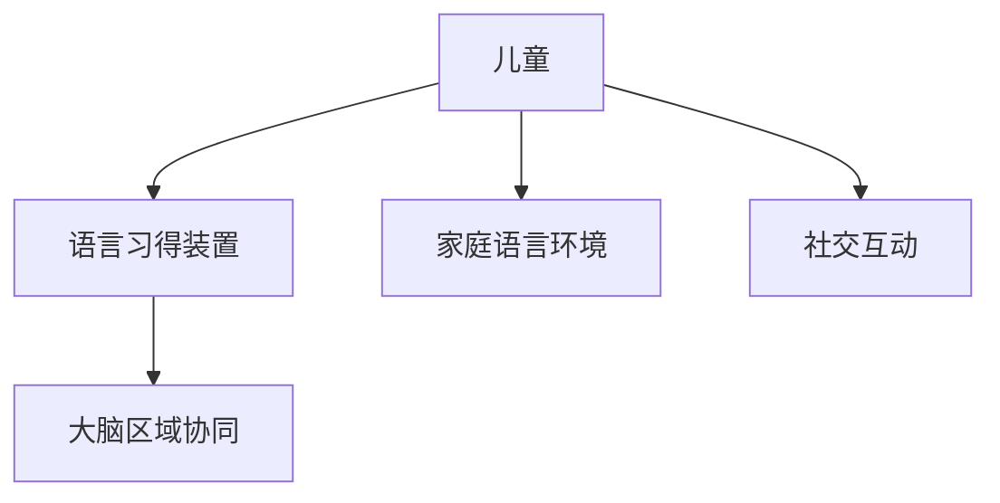
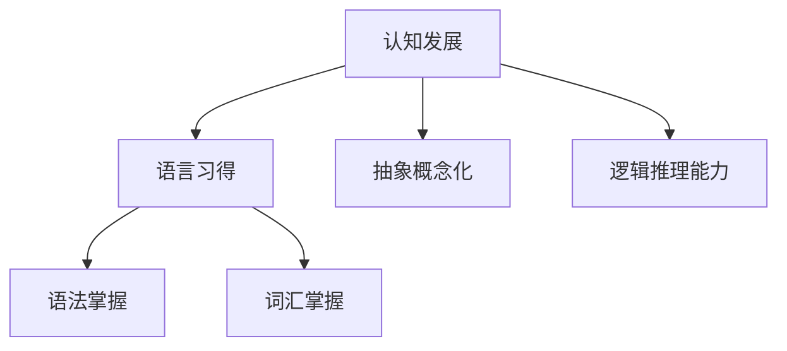
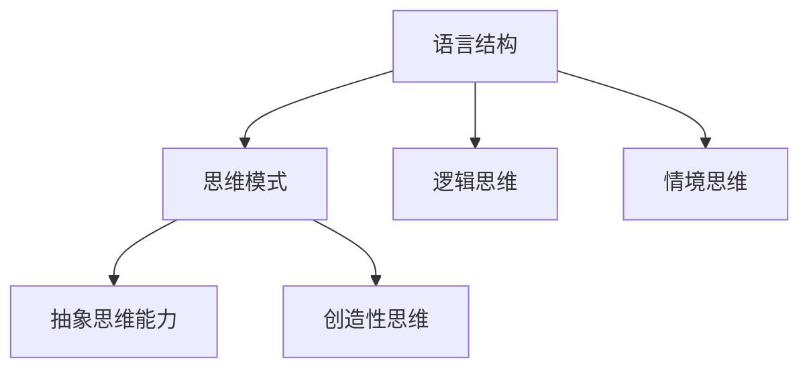
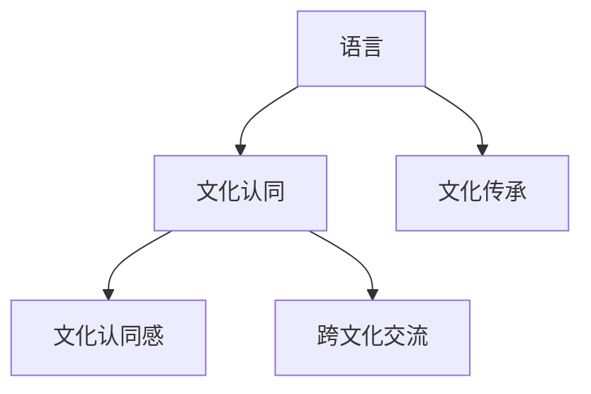

                 

### 1.1 问题背景

认知语言学，作为语言学和认知科学交叉研究的重要领域，近年来取得了许多重要进展。认知语言学的主要目标是探索语言如何影响人们的思维和世界观。自20世纪中叶以来，认知语言学在理论和实践上都有显著的发展，为理解人类语言行为提供了新的视角。

首先，认知语言学的发展得益于认知科学的兴起。认知科学是研究人类认知过程的跨学科领域，它结合了心理学、神经科学、计算机科学等多个学科的研究成果。认知科学的突破性进展为认知语言学提供了新的理论工具和方法，使得对语言和认知之间关系的理解更加深入和系统。

其次，语言习得和认知发展的研究是认知语言学的核心议题之一。儿童如何习得语言，以及语言习得过程中认知发展的影响，一直是认知语言学关注的重点。认知语言学通过研究语言习得中的关键时期和关键过程，揭示了语言和认知发展的相互作用机制。

此外，认知语言学还探讨了语言与世界理解之间的关系。语言不仅是人类交流的工具，也是人类理解世界的方式。认知语言学通过分析语言如何反映和解释现实世界，揭示了语言与世界理解之间的紧密联系。

总之，认知语言学作为语言学研究的一个重要分支，近年来在理论和实践上都有了显著的进展。通过探讨语言、思维、世界理解之间的相互作用，认知语言学为理解人类语言行为提供了新的视角和方法。接下来，本文将详细探讨认知语言学中的几个关键问题，包括语言习得、认知发展、思维模式、语言与世界理解之间的关系等。通过逐步分析这些议题，我们将揭示认知语言学的新发现，为这一领域的研究提供新的思路和方向。

### 1.2 问题描述

语言、思维与世界理解之间的关系是一个复杂且深远的研究课题。在认知语言学中，这个关系被描述为一种三角关系，即语言、思维和世界理解三者相互影响、相互塑造。下面，我们将详细描述这一问题的核心，并探讨其研究意义和实际应用。

首先，**语言**作为人类交流的主要工具，不仅是信息的载体，也是思维的基础。语言的习得和使用过程深深嵌入到个体的认知结构中。例如，儿童在习得母语的过程中，会逐渐形成一系列的语法规则、词汇知识和语言习惯。这些语言知识和技能不仅帮助他们进行有效的沟通，还直接影响他们的思维方式。

其次，**思维**是人类的认知活动，包括概念形成、推理、判断等过程。思维不仅依赖于语言的表达，还受到语言结构的深刻影响。不同的语言结构可能会塑造不同的思维模式。例如，印欧语系的语言强调主谓宾的语法结构，这可能会使得讲这种语言的人在思维上更加注重逻辑关系和抽象概念。而汉藏语系的语言则更强调词序和语境，这可能会使得讲这种语言的人在思维上更加注重情境和整体性。

最后，**世界理解**是指人类对现实世界的感知、解释和认识。语言和思维共同作用于世界理解，使得人们对世界的认知具有语言和文化的特定性。例如，不同的语言和文化背景可能会影响人们对同一现象的理解和解释。比如，英语中的“friend”在中文中可以翻译为“朋友”，但在某些文化中，“朋友”的概念可能更复杂，包含更深层次的关系和互动。

这一三角关系的复杂性体现在以下几个方面：

1. **相互影响**：语言、思维和世界理解三者之间相互影响，形成一个动态的互动过程。例如，语言的不同表达方式可能会影响人们的思维方式，进而影响他们对世界的理解。

2. **互动机制**：语言习得和认知发展过程中，语言和思维之间的互动机制至关重要。例如，儿童在习得语言的过程中，通过不断练习和使用，逐渐发展出复杂的思维模式。

3. **文化差异**：不同的语言和文化背景会对语言、思维和世界理解产生不同的影响。例如，某些文化中的语言表达习惯可能会影响人们的思维方式，进而影响他们对世界的理解。

研究这一三角关系的意义在于：

1. **深入理解语言行为**：通过研究语言、思维和世界理解之间的关系，我们可以更深入地理解人类语言行为和认知过程。

2. **跨文化交流**：理解不同语言和文化背景下的思维模式和世界理解，有助于促进跨文化交流和理解。

3. **语言教育和学习**：了解语言习得和认知发展的机制，可以帮助我们更好地设计语言教育和学习策略，提高学习效果。

在实际应用中，这一三角关系的研究可以为多个领域提供指导，包括语言习得研究、语言教学、认知科学、人机交互等。通过深入探讨这一关系，我们可以为这些领域提供新的理论框架和研究方法，从而推动相关领域的发展。

### 1.3 问题解决

为了深入探讨语言、思维与世界理解之间的三角关系，我们需要运用多种方法，包括文献分析、实验研究、案例分析等。以下将详细描述这些方法，并阐述其应用步骤和预期效果。

#### 1.3.1 文献分析

文献分析是研究认知语言学的基础方法之一。通过系统地回顾和整理现有的研究成果，我们可以了解不同学者对语言、思维和世界理解之间关系的不同观点和理论。以下是文献分析的具体步骤：

1. **确定研究范围**：首先，我们需要明确研究的问题和目标，确定相关的文献搜索范围。例如，针对语言习得与认知发展的关系，我们可以搜索关于儿童语言习得、认知心理学、发展心理学的相关文献。

2. **搜索和筛选文献**：使用学术数据库和搜索引擎，如Google Scholar、PubMed、Web of Science等，输入关键词进行搜索。筛选出与我们的研究问题高度相关的文献，并排除重复或不相关的内容。

3. **整理和分析文献**：将筛选出的文献进行分类和整理，分析其研究方法、理论框架、主要发现和结论。通过比较不同文献的观点和发现，我们可以形成对研究问题的全面理解。

4. **撰写文献综述**：在分析的基础上，撰写一篇文献综述，总结现有研究的进展和存在的问题，提出未来的研究方向和建议。

预期效果：通过文献分析，我们可以获得对语言、思维与世界理解之间关系的全面认识，为后续的实证研究提供理论依据。

#### 1.3.2 实验研究

实验研究是认知语言学中常用的方法，通过设计严谨的实验，我们可以直接观察和测量语言、思维和世界理解之间的关系。以下是实验研究的基本步骤：

1. **设计实验**：首先，我们需要明确实验的目标和研究问题，设计实验方案。例如，研究语言结构对思维模式的影响，可以设计不同的语言任务，测量参与者在完成任务时的表现。

2. **招募参与者**：根据实验设计的要求，招募适当的参与者。参与者的选择应考虑其语言背景、年龄、认知能力等因素。

3. **实施实验**：在实验过程中，确保操作步骤和实验条件的标准化。记录参与者在实验中的行为数据，如反应时间、准确率、错误率等。

4. **数据分析**：对实验数据进行统计分析，如使用方差分析、回归分析等方法，探讨语言、思维和世界理解之间的关系。

5. **撰写研究报告**：在分析结果的基础上，撰写实验研究报告，总结实验发现、讨论实验结果的意义和限制，并提出未来研究的方向。

预期效果：实验研究可以提供直接的证据，揭示语言、思维和世界理解之间的具体联系，验证理论假设。

#### 1.3.3 案例分析

案例分析是通过对具体实例的深入研究，揭示语言、思维和世界理解之间关系的具体表现。以下是案例分析的具体步骤：

1. **选择案例**：选择具有代表性的案例，如具体的语言使用场景、语言习得过程、认知任务等。

2. **数据收集**：收集与案例相关的数据，如语言记录、认知表现、行为观察等。

3. **描述和分析**：详细描述案例中的语言现象和认知过程，分析语言、思维和世界理解之间的互动机制。

4. **讨论和总结**：讨论案例对认知语言学的启示，总结案例中的关键发现，并提出理论解释。

预期效果：案例分析可以提供具体实例，加深对语言、思维和世界理解之间关系的理解，为理论研究和应用提供实际参考。

通过上述方法，我们可以系统地探讨语言、思维与世界理解之间的三角关系，揭示其中的新发现，为认知语言学的研究提供新的视角和思路。

#### 1.4 边界与外延

在讨论认知语言学的研究边界和外延时，我们需要明确其研究范围以及与其他相关领域的关系。认知语言学作为语言学和认知科学交叉的领域，具有广泛的研究内容和多样的应用场景。

**研究范围的界定**：

1. **语言习得**：认知语言学关注语言习得的过程和机制，研究儿童如何在早期环境中习得母语，以及不同语言环境对认知发展的影响。

2. **语言使用**：认知语言学探讨语言在日常交流中的应用，分析语言表达中的认知过程，如词汇使用、语法结构、语义理解等。

3. **语言变化**：认知语言学研究语言随时间的变化，如词汇的演变、语法的简化等，以及这些变化如何影响认知和思维。

4. **认知发展**：认知语言学探讨认知发展的不同阶段，如何影响语言习得和使用，以及语言习得对认知发展的作用。

5. **语言与认知互动**：认知语言学研究语言和认知之间的互动关系，如语言如何塑造认知过程，认知过程如何影响语言习得和使用。

**与其他领域的联系**：

1. **心理学**：认知语言学与心理学紧密相关，特别是发展心理学和认知心理学。认知语言学借鉴心理学的研究成果，如儿童语言习得机制、认知发展理论等。

2. **神经科学**：认知语言学与神经科学合作，研究语言和认知活动的神经基础，如大脑区域的功能、语言处理过程的神经机制等。

3. **计算机科学**：认知语言学与计算语言学、自然语言处理等领域结合，研究如何利用计算机技术模拟和理解人类语言行为。

4. **人机交互**：认知语言学为人机交互领域提供理论基础，探讨如何设计更符合人类认知习惯的语言界面。

**研究的外延**：

认知语言学不仅限于理论研究，还广泛应用于教育、语言学应用、跨文化交流等多个领域。例如：

1. **语言教育**：认知语言学为语言教育提供理论指导，如设计更有效的语言学习策略、课程设置等。

2. **语言技术**：认知语言学的研究成果可以应用于语言技术的开发，如语音识别、机器翻译等。

3. **跨文化交流**：认知语言学探讨不同语言和文化背景下的认知差异，促进跨文化交流和理解。

4. **心理健康**：认知语言学研究语言对心理健康的影响，如语言治疗、认知行为疗法等。

通过明确认知语言学的研究范围、边界和外延，我们可以更好地理解这一领域的研究内容和应用价值，为未来的研究提供方向和启示。

#### 1.5 概念结构与核心要素组成

要深入探讨语言、思维与世界理解之间的关系，首先需要明确这些概念的核心要素及其相互关系。以下是认知语言学中的关键概念及其组成的详细分析：

**语言**：

语言是人类交流的主要工具，它由多种要素构成，包括：

1. **语音**：语音是语言的声音形式，包括音素、音节和声调等。语音的差异性是语言多样性的基础。
   
2. **语法**：语法是语言的规则系统，规定了单词如何组合成短语和句子，以及句子如何表达意义。不同语言的语法结构差异显著，如英语的主谓宾结构、汉语的句式灵活多变。

3. **词汇**：词汇是语言的基本单位，包括单词和短语，它们承载着语言的意义和功能。

4. **语义**：语义是语言的意义系统，研究词语、句子和语篇的意义。语义分析涉及词汇意义、句法结构和语境理解。

5. **语用**：语用学研究语言在实际使用中的功能，包括语言的社会语境、交际意图和交际策略。

**思维**：

思维是人类的认知活动，涉及概念形成、推理、判断等多个方面。以下是思维的核心要素：

1. **概念形成**：概念是思维的基本单元，是对一类事物的共同特征的抽象。概念形成涉及分类、抽象和归纳等过程。

2. **推理**：推理是从已知信息推导出新信息的过程，包括演绎推理和归纳推理。推理是思维的核心，是解决问题和决策的基础。

3. **认知过程**：认知过程包括感知、记忆、注意、思维和决策等多个环节，是信息处理和知识构建的过程。

4. **问题解决**：问题解决是思维的一种具体表现，涉及识别问题、设计方案、执行方案和评估结果等步骤。

**世界理解**：

世界理解是指人类对现实世界的感知、解释和认识。以下是世界理解的核心要素：

1. **感知**：感知是获取外界信息的过程，通过感官（如视觉、听觉、触觉等）对环境进行识别和反应。

2. **解释**：解释是对感知信息的理解和意义赋予过程。通过语言和思维，人们对感知信息进行解释和整合。

3. **认知模式**：认知模式是人们在理解世界时采用的思维方式，如空间认知、时间认知、因果关系认知等。

4. **文化背景**：文化背景影响人们的认知和行为，不同文化背景下的人们对同一现象的理解可能存在差异。

**核心要素之间的相互关系**：

1. **语言与思维的互动**：语言不仅影响思维过程，还塑造思维模式。例如，不同的语言结构可能影响人们的认知方式，如英语强调逻辑关系，汉语强调语境整体性。

2. **思维与世界观的关系**：思维模式影响人们对世界的理解，不同的思维模式可能导致对同一现象的不同解释。

3. **语言与世界理解的关系**：语言作为人类理解世界的工具，其表达方式和文化背景影响人们对世界的认知和解释。

通过明确这些核心要素及其相互关系，我们可以更好地理解认知语言学的研究内容，为后续的讨论和分析提供基础。

### 2.1 语言习得机制

语言习得机制是认知语言学中的重要研究领域，涉及儿童如何通过自然环境和认知过程习得语言。理解语言习得机制不仅有助于揭示人类语言能力的起源，还能为语言教育和学习提供理论支持。下面，我们将详细探讨语言习得的理论基础，关键时期和过程，并分析语言习得中的认知机制。

#### 2.1.1 理论基础

关于语言习得的理论基础，主要有先天论和经验论两种观点。

1. **先天论**：先天论认为人类具有一种天生的语言习得机制，称为“语言习得装置”（Language Acquisition Device, LAD）。LAD使得儿童能够自动识别和掌握语言的规则结构。乔姆斯基（Noam Chomsky）是这一理论的代表人物。他提出，儿童在大脑中拥有一个“语言习得机制”，使得他们能够迅速习得母语，并具备创造和理解复杂语言结构的能力。

2. **经验论**：经验论则强调环境经验和社交互动在语言习得中的重要性。行为主义心理学家如班杜拉（Albert Bandura）认为，语言是通过模仿和强化学习得来的。儿童通过观察和模仿成年人的语言行为，逐渐习得语言。社会互动和语言输入的质量对语言习得有重要影响。

#### 2.1.2 关键时期和过程

语言习得的关键时期和过程是理解语言习得机制的重要方面。以下是几个关键时期和过程：

1. **婴儿期**：婴儿在出生后的前几个月内开始接触和理解语言。他们通过声音识别和语言节奏的感知，逐渐对语言产生兴趣。研究表明，婴儿期是语言习得的敏感期，这一时期的语言输入对后续语言习得至关重要。

2. **幼儿期**：幼儿期（1-6岁）是语言能力飞速发展的时期。儿童在这一时期内不仅能够模仿和掌握基本的语言结构，还能逐渐理解语法规则和词汇意义。幼儿期的语言输入质量和互动频率直接影响语言习得的效果。

3. **儿童期**：儿童期（6-12岁）是语言习得的巩固期。在这一时期，儿童通过大量的语言输入和实践，进一步巩固和扩展语言能力。学校教育和社交互动对这一时期的语言习得有重要影响。

4. **青春期**：青春期（12-18岁）是语言习得的相对平稳期。虽然这一时期的语言习得速度较慢，但通过有效的语言教育和自我学习，仍然可以显著提高语言能力。

#### 2.1.3 认知机制

语言习得中的认知机制涉及多种认知过程，如感知、记忆、注意、推理等。以下是几个关键认知机制：

1. **感知**：儿童通过听觉和视觉感知语言输入，识别语音、词汇和句子结构。感知过程对语言习得至关重要，因为它决定了儿童能否正确理解和处理语言信息。

2. **记忆**：记忆是语言习得的重要基础。儿童需要记住大量的语音、词汇和语法规则，以便在实际交流中使用。长时记忆和短期记忆的相互作用对语言习得有重要影响。

3. **注意**：注意是语言习得中的关键认知资源。儿童需要集中注意力，关注语言输入中的重要信息，如语音、词汇和语法结构。注意力的分配和调节能力对语言习得有重要影响。

4. **推理**：推理是语言习得中的高级认知过程。儿童通过推理能力，理解语言中的逻辑关系和语义意义。推理能力的发展对复杂语言结构的习得有重要影响。

总之，语言习得机制涉及多个理论观点、关键时期和认知机制。理解这些机制有助于我们更好地理解人类语言习得的过程，为语言教育和学习提供指导。

### 2.2 认知发展

认知发展是语言习得和世界理解的核心要素之一，涉及到人类在成长过程中认知能力的变化。认知发展不仅影响语言习得，还影响人们对世界的感知、理解和解释。以下是认知发展的阶段、特点以及对语言习得的影响。

#### 2.2.1 认知发展的阶段

认知发展通常被划分为几个关键阶段，每个阶段都有其特定的认知特点：

1. **感知运动阶段（0-2岁）**：这个阶段的主要特点是儿童通过感知和运动协调来理解世界。他们通过视觉、听觉、触觉等感官来探索环境，并通过动作来与外界互动。这一阶段的儿童开始理解因果关系，例如，当他们扔一个球时，他们会注意到球会滚开。

2. **前运算阶段（2-7岁）**：在这个阶段，儿童开始使用语言和简单的符号来表示物体和事件，但他们的思维仍然以直观和具体的方式为主。儿童在这个阶段表现出“自我中心思维”，即他们认为自己的观点是唯一的正确观点。

3. **具体运算阶段（7-11岁）**：这个阶段的儿童开始能够进行逻辑思考和解决具体问题。他们能够理解守恒概念，例如，尽管形状和排列发生变化，物质的数量保持不变。他们也能够进行分类和排序等操作。

4. **形式运算阶段（11-16岁及以后）**：在这个阶段，个体能够进行抽象思维和假设推理。他们能够思考假设情景，进行逻辑推理，解决抽象问题。这一阶段的个体能够理解复杂的逻辑关系和理论框架。

#### 2.2.2 认知发展的特点

每个认知发展阶段都有其独特的认知特点，这些特点直接影响语言习得：

1. **感知和运动技能的发展**：在感知运动阶段，儿童通过运动和感知来理解世界。这种运动体验对于语言习得至关重要，因为语言是一种动态的、互动性的技能。

2. **符号使用和语言发展**：在前运算阶段，儿童开始使用语言和符号来表示物体和事件。他们能够理解简单的语法结构，但仍然依赖于具体的情境来理解语言。

3. **逻辑思维和抽象能力的提升**：在具体运算阶段和形式运算阶段，儿童能够进行更复杂的逻辑思考和抽象思维。这种能力的提升有助于他们理解和运用更复杂的语言结构。

4. **问题解决和推理能力的增强**：在形式运算阶段，个体能够进行假设推理和抽象问题解决。这种能力的发展不仅影响语言习得，还影响人们对世界复杂性的理解。

#### 2.2.3 认知发展对语言习得的影响

认知发展对语言习得有着深远的影响，主要体现在以下几个方面：

1. **语言习得敏感期**：每个认知发展阶段都有一个敏感期，即在特定时期内，个体对该阶段特定的认知和语言能力发展最为迅速。例如，婴儿期是语音感知的敏感期，幼儿期是语法和词汇习得的敏感期。

2. **认知技能与语言能力的关系**：认知技能，如感知、记忆、推理和问题解决能力，直接影响语言习得。例如，感知能力的发展有助于儿童理解语音和词汇，记忆能力的发展有助于他们记住语言规则和词汇。

3. **文化和社会背景**：认知发展不仅受生物学因素的影响，还受到文化和社会环境的影响。不同文化和社会背景下的认知发展特点不同，这也会影响语言习得的方式和速度。

4. **语言习得策略**：认知发展的不同阶段会影响个体在语言学习过程中采用的策略。例如，在感知运动阶段，儿童可能更多地依赖于直接体验和互动来学习语言；在形式运算阶段，个体可能更多地依赖于抽象思维和逻辑推理来学习语言。

总之，认知发展是一个复杂且动态的过程，它不仅影响语言习得，还影响人们对世界的理解和认知。理解认知发展的阶段和特点，有助于我们更好地设计和实施语言教育和学习策略。

### 2.3 语言与认知发展的相互作用

语言与认知发展之间的相互作用是一个复杂而动态的过程，两者相互影响、相互塑造。下面，我们将详细探讨语言对认知发展的促进作用和阻碍作用，并分析认知发展对语言习得和语言使用的反作用。

#### 2.3.1 语言对认知发展的促进作用

1. **词汇扩展**：语言是认知发展的基础，通过语言，儿童能够接触到更多的词汇和概念，扩展他们的认知范围。词汇的积累不仅有助于儿童更好地理解世界，还能提高他们的思维能力和表达能力。

2. **语法结构**：语言中的语法结构，如句子结构、时态和语态等，可以帮助儿童理解事物的逻辑关系和时间顺序。通过学习语法结构，儿童能够更好地组织思想和表达复杂的认知内容。

3. **符号系统**：语言中的符号系统，如字母、单词和句子，为儿童提供了抽象思维的工具。通过使用这些符号，儿童能够进行符号操作，从而提高他们的思维能力和问题解决能力。

4. **社会互动**：语言是社会互动的重要工具，通过语言，儿童能够与他人沟通和合作，从而提高他们的社交能力和认知发展。社会互动有助于儿童理解不同的观点和文化，促进他们的认知扩展。

#### 2.3.2 语言对认知发展的阻碍作用

1. **语言障碍**：对于语言障碍儿童来说，语言问题可能会阻碍他们的认知发展。语言障碍可能导致儿童无法有效沟通，从而影响他们的社交和认知能力。

2. **过度依赖语言**：在某些情况下，儿童可能过度依赖语言来理解世界，从而忽视了其他感官和认知过程。这种过度依赖可能会限制他们的认知发展，导致他们在非语言任务上的表现不佳。

3. **语言混乱**：在多语言环境下，儿童可能会面临语言混乱问题，即他们无法有效区分和使用不同语言中的语法和词汇。这种混乱可能会影响他们的认知发展，导致思维能力的混乱。

#### 2.3.3 认知发展对语言习得和使用的反作用

1. **认知能力提升**：随着认知能力的发展，个体能够更好地理解和运用复杂的语言结构。例如，具有较强逻辑思维能力的个体能够更有效地理解和使用抽象的语法结构。

2. **语言策略**：认知能力的发展影响个体在语言学习过程中采用的策略。具有较强认知能力的个体能够更有效地使用记忆策略、推理策略等，从而提高语言习得的效果。

3. **语言习得速度**：认知能力的发展速度直接影响语言习得的速度。在认知能力快速发展的阶段，个体的语言习得速度也较快。

4. **跨文化交流**：认知能力的发展有助于个体理解和适应不同的文化背景，从而提高跨文化交流的能力。这有助于个体在不同的语言和文化环境中有效沟通。

总之，语言与认知发展之间的相互作用是一个复杂而动态的过程，两者相互影响、相互塑造。理解这一过程有助于我们更好地设计语言教育和认知发展策略，促进个体全面而均衡的发展。

### 3.1 思维模式

思维模式是指人们在进行认知活动时采用的思维方式和习惯。不同的思维模式反映了个体在理解世界和处理信息时的不同策略和方法。认知语言学通过研究思维模式，揭示了语言如何影响思维，以及思维模式在不同语言背景下的差异。以下是几种基本的思维模式及其特点：

#### 3.1.1 概念化

概念化是指人们对事物进行分类和抽象的过程。不同语言的文化背景会影响概念化的方式。例如，一些语言如汉语和日语，注重语境和整体性，这使得人们在概念化时更倾向于使用综合性的思维模式。而一些语言如英语，则更强调逻辑关系和明确性，使得人们在概念化时更倾向于使用分析性的思维模式。

**特点**：综合性的思维模式注重整体性和联系性，倾向于将事物看作一个整体来理解。分析性的思维模式则注重细节和逻辑关系，倾向于将事物分解为更小的部分来分析。

#### 3.1.2 范畴化

范畴化是指人们将事物归类到特定类别中的过程。不同语言和文化背景下的范畴化方式有所不同。例如，一些语言文化中，类别之间的界限可能较为模糊，而另一些语言文化中，类别之间的界限可能更加明确。

**特点**：模糊性范畴化注重事物的相似性和相互联系，倾向于将事物归类到多个类别中。明确性范畴化则注重事物的差异性和独特性，倾向于将事物归类到单一类别中。

#### 3.1.3 抽象思维

抽象思维是指人们从具体事物中提取共同特征和本质属性的过程。不同语言和文化背景下的抽象思维方式也有所不同。例如，一些语言如汉语，强调情境和整体性，使得人们在抽象思维时更倾向于从情境和整体出发。而一些语言如英语，则强调逻辑和明确性，使得人们在抽象思维时更倾向于从逻辑和结构出发。

**特点**：情境抽象思维注重具体情境和背景，倾向于从整体和情境出发来理解抽象概念。逻辑抽象思维则注重逻辑结构和关系，倾向于从逻辑和结构出发来理解抽象概念。

#### 3.1.4 比较思维

比较思维是指人们通过比较不同事物之间的相似性和差异性来理解它们的过程。不同语言和文化背景下的比较思维方式也有所不同。例如，一些语言文化中，人们更倾向于使用对立和对比来理解事物，而另一些语言文化中，人们更倾向于使用类比和隐喻来理解事物。

**特点**：对比性比较思维注重事物的对立和差异性，通过对比来理解不同事物。类比性比较思维则注重事物的相似性和相关性，通过类比来理解不同事物。

总之，思维模式反映了个体在理解世界和处理信息时的策略和方法。不同的思维模式在不同语言和文化背景下具有不同的特点，这些差异影响了人们对语言和认知的理解和应用。理解这些思维模式有助于我们更好地设计教育和认知策略，促进个体全面发展。

### 3.2 语言表达

语言表达是指人们通过语音、语法、语义和语用等手段来传达信息、表达思想的过程。语言表达不仅包括口头和书面语言，还涉及非语言形式的交流，如肢体语言和表情。在不同的语言和文化背景下，语言表达形式和方式存在显著差异，这些差异反映了不同文化对语言和沟通的理解和使用。以下将详细探讨语言表达中的语法结构、语义结构和语用功能，并分析这些语言表达形式如何影响人们的思维模式。

#### 3.2.1 语法结构

语法结构是语言表达的核心部分，规定了单词如何组合成短语和句子，以及句子如何表达意义。不同语言的语法结构差异显著，这些差异对人们的思维模式产生深远影响。

1. **主谓宾结构**：英语等印欧语系的语言通常采用主谓宾的语法结构，这使得人们在表达时更注重逻辑关系和主谓宾的明确性。这种语法结构有助于培养逻辑思维和抽象思维能力。

2. **句式灵活多变**：汉语等汉藏语系的语言则更强调句式的灵活性和语境的整体性。这种语法结构使得人们在表达时更注重情境和语境，有利于培养情境意识和综合思维能力。

3. **形态变化**：一些语言如德语和俄语，语法结构中包含大量的形态变化，如词尾变化、时态变化等。这些形态变化使得语言表达更加复杂和精细，有助于培养细致入微的思维方式。

#### 3.2.2 语义结构

语义结构是语言表达中的意义部分，包括词汇意义、句子意义和语篇意义。语义结构的不同组合和变化反映了不同文化对世界的理解和认知。

1. **词汇意义**：词汇意义受到文化背景和语言习惯的影响。例如，英语中的“gift”一词在中文中可以翻译为“礼物”，但在某些文化背景下，“gift”可能带有更多的礼仪和社交意义。

2. **句子意义**：句子意义不仅取决于词汇的意义，还取决于语法结构和语境。例如，英语中的被动语态（如“I am being followed”），在中文中通常使用主动语态（如“有人跟踪我”），这反映了两种语言在表达被动事件时的不同偏好。

3. **语篇意义**：语篇意义是指整个段落或文章的意义。不同语言的语篇结构差异显著，例如，英语中的文章通常采用逻辑顺序和层次结构，而汉语中的文章则更注重情境和语境的整体性。

#### 3.2.3 语用功能

语用功能是指语言在实际交流中的使用方式和目的。语用功能反映了不同文化对语言交流的理解和价值观。

1. **直接表达**：一些文化如英语文化，更倾向于直接表达和直言不讳。这种语用功能有助于培养直接和清晰的思维方式。

2. **间接表达**：另一些文化如汉语文化，则更注重间接表达和含蓄表达。这种语用功能有助于培养间接和细致的思维方式。

3. **礼貌表达**：在跨文化交流中，礼貌表达是一个重要的语用功能。不同文化对礼貌表达的理解和使用方式有所不同，这反映了不同文化对人际关系和沟通方式的价值观。

#### 3.2.4 影响思维模式

语言表达形式和方式对人们的思维模式产生深远影响，具体表现在以下几个方面：

1. **逻辑思维**：采用主谓宾结构等语法结构的语言有助于培养逻辑思维。例如，英语的主谓宾结构使得人们在表达时更注重逻辑关系和明确性，这有助于培养清晰和严谨的思维方式。

2. **情境思维**：采用句式灵活多变和注重语境的语言有助于培养情境思维。例如，汉语的句式灵活性和语境整体性使得人们在表达时更注重情境和整体性，这有助于培养全面和细致的思维方式。

3. **细致思维**：包含大量形态变化的语法结构有助于培养细致思维。例如，德语和俄语的形态变化使得语言表达更加精细和复杂，这有助于培养细致和敏感的思维方式。

总之，语言表达形式和方式对人们的思维模式产生深远影响。理解这些差异有助于我们更好地设计教育和沟通策略，促进个体在不同语言和文化背景下的全面发展。

### 3.3 语言与思维互动

语言和思维之间存在着密切的互动关系，二者相互影响、相互塑造。语言不仅为思维提供了表达工具，还通过其结构和功能影响思维过程和模式。以下是详细探讨语言对思维的影响，以及思维对语言使用的反作用。

#### 3.3.1 语言对思维的影响

1. **语法结构的塑造作用**：语言中的语法结构对思维模式有着显著的影响。例如，印欧语系的语言如英语，其主谓宾结构使得人们在表达时更注重逻辑关系和句子结构，这有助于培养逻辑思维。而汉语等汉藏语系的语言，其句式灵活性和语境整体性使得人们在表达时更注重情境和整体性，这有助于培养情境思维。

2. **词汇意义的扩展作用**：词汇的意义不仅是语言表达的基础，也对思维过程产生重要影响。不同语言的词汇意义和概念结构差异显著，这影响了人们对事物的认知和理解方式。例如，一些语言中的词汇可能具有更丰富的文化内涵，这会影响人们的文化认同和思维方式。

3. **语义结构的引导作用**：语义结构在语言表达中起到引导思维的作用。例如，语言的比喻、隐喻等修辞手法通过语义结构引导人们从不同角度理解事物，从而扩展思维视野。此外，语言的语境和语用功能也会影响人们对语义的理解和解释，进而影响思维过程。

4. **语用功能的互动作用**：语用功能在语言使用中起到重要的互动作用，它不仅影响语言的表达方式，还影响人们的社交互动和思维活动。例如，直接表达和间接表达的语用功能差异，使得人们在交流时采用不同的策略和思维方式。

#### 3.3.2 思维对语言使用的反作用

1. **概念化和范畴化的影响**：思维过程中的概念化和范畴化活动直接影响语言使用。例如，人们在概念化时将事物归类到不同的类别中，这影响了词汇的选择和使用。同时，范畴化的明确性和模糊性也会影响语言的语法结构和语义表达。

2. **逻辑思维和抽象思维的作用**：逻辑思维和抽象思维在语言使用中起到关键作用。逻辑思维有助于人们在表达时保持条理性和逻辑性，而抽象思维则有助于人们理解和使用复杂的语言结构。例如，抽象思维使得人们能够更好地理解和运用比喻和隐喻等修辞手法。

3. **情境思维和综合思维的影响**：情境思维和综合思维在语言使用中表现出明显的特点。情境思维注重语境和整体性，这影响了语言的表达方式和沟通效果。综合思维则通过将不同信息整合成一个整体，使得语言表达更加丰富和多样。

4. **问题解决和推理能力的提升**：思维过程中的问题解决和推理能力对语言使用有显著影响。例如，通过推理能力，人们能够更好地理解复杂的语法结构和语义含义，从而提高语言理解和表达能力。

总之，语言和思维之间的互动是一个复杂而动态的过程，二者相互影响、相互塑造。理解这一互动关系有助于我们更好地设计教育和语言学习策略，促进个体在语言和思维上的全面发展。

### 4.1 语言与世界理解

语言不仅是人类交流的工具，也是人类理解世界的重要手段。语言与世界理解之间的关系复杂且深远，涉及到语言如何反映和解释现实世界。以下是详细探讨语言对现实世界的反映和解释，并分析语言与世界理解之间的关系。

#### 4.1.1 语言反映现实世界

1. **语言作为现实世界的映射**：语言通过词汇、语法和语义等手段，反映了现实世界的各种现象和特征。例如，英语中的“tree”（树）和“house”（房子）等词汇，直接反映了自然界和人类居住环境中的实体。语言的词汇系统是人类对现实世界进行分类和描述的结果。

2. **语言的文化内涵**：语言不仅反映了现实世界的物质现象，还承载了丰富的文化内涵。不同语言中的词汇和表达方式反映了不同文化对世界的认知和理解。例如，汉语中的“风水”一词，反映了中国人对自然环境和居住环境的风水学理解。这种文化内涵使得语言不仅仅是交流的工具，也是文化的载体。

3. **语言与现实世界的互动**：语言与现实世界之间存在互动关系。人们通过语言表达对现实世界的认知和理解，同时，现实世界的经验和知识也通过语言传递和积累。例如，科学家通过学术论文描述和解释科学发现，使这些知识得以传播和共享。

#### 4.1.2 语言解释现实世界

1. **语言解释世界的功能**：语言不仅用于描述现实世界，还用于解释现实世界中的现象和关系。通过语言的推理和论证，人们能够对复杂的现象进行解释和解释。例如，科学论文通过逻辑推理和实验数据，解释自然现象和科学原理。

2. **语言解释的文化差异**：不同文化背景下的人们对同一现象的解释可能存在差异。这种差异反映了不同语言和文化对现实世界的理解和解释方式。例如，西方哲学中的理性思维和东方哲学中的整体观，反映了不同文化对世界的解释策略。

3. **语言解释的局限性**：语言在解释现实世界时存在一定的局限性。语言作为一种抽象的符号系统，难以完全准确地反映现实世界的复杂性和多样性。例如，某些抽象概念和情感体验难以通过语言精确表达。

#### 4.1.3 语言与世界理解的关系

1. **语言影响世界理解**：语言作为一种认知工具，影响人们对现实世界的感知和理解。不同的语言结构和文化背景可能塑造人们对世界的不同认知方式和理解策略。例如，讲英语的人可能更倾向于使用逻辑和分析的方式理解事物，而讲汉语的人可能更注重情境和整体性。

2. **世界理解影响语言使用**：人们对世界的理解也反过来影响语言的使用。人们在交流时，会根据对现实世界的理解选择合适的语言表达方式。例如，科学家在讨论复杂概念时，会使用专业术语和精确的语言表达，以确保准确传达他们的观点。

3. **跨文化交流的挑战**：不同语言和文化背景之间的差异，使得跨文化交流面临挑战。语言差异可能导致误解和沟通障碍，而文化差异则可能影响对同一现象的理解。因此，理解不同语言和文化背景下的语言与世界理解方式，有助于促进有效的跨文化交流。

总之，语言与世界理解之间存在着密切的互动关系。语言不仅反映和解释现实世界，还影响人们对世界的理解和认知。通过深入探讨这一关系，我们可以更好地理解人类语言行为和认知过程，为跨文化交流和认知研究提供新的视角和思路。

### 4.2 语言与文化

语言和文化之间存在着紧密的联系，语言不仅是文化的一部分，也深深影响着文化的形成和发展。以下将详细探讨语言与文化的关系，分析文化对语言习得和语言表达的影响。

#### 4.2.1 语言作为文化的一部分

1. **语言反映文化特征**：语言作为一种符号系统，反映了特定文化的价值观、信仰、习俗和社会规范。例如，汉语中的“礼”和“孝”等词汇，反映了中华民族重视礼仪和家庭的价值观。英语中的“free”和“liberty”等词汇，则反映了西方文化强调自由和民主的价值观念。

2. **语言传播文化**：语言不仅反映了文化，还通过语言学习和交流传播文化。例如，通过学习英语，人们可以了解西方的文化和历史，从而增进对西方文化的理解和认同。同样，通过学习汉语，人们可以了解中国的文化传统和现代社会，从而加深对中华文化的认识。

3. **语言塑造文化认同**：语言是文化认同的重要标志。例如，一些民族或族群通过共同的语言来确认和维护他们的文化身份。语言不仅是一种交流工具，也是一种文化归属的象征。例如，犹太人通过希伯来语来保持对自身文化的认同，华人通过汉语来维持对中华文化的认同。

#### 4.2.2 文化对语言习得的影响

1. **文化背景影响语言习得**：不同文化背景下的儿童在语言习得过程中存在显著差异。文化背景包括语言环境、教育方式、社会互动等。例如，在多语言环境下成长的儿童，可能更容易习得多种语言，而在单语环境下成长的儿童，可能更专注于习得母语。

2. **文化价值观影响语言学习策略**：不同的文化价值观影响个体在语言学习过程中采用的方法和策略。例如，西方文化中重视个人主义和自我表达，这可能导致个体在语言学习时更注重自主学习和表达。而东方文化中重视集体主义和和谐，这可能导致个体在语言学习时更注重倾听和合作。

3. **文化习惯影响语言使用**：文化习惯影响个体在语言使用时的表达方式和习惯。例如，某些文化中强调礼貌和含蓄，这使得个体在语言交流时更倾向于使用礼貌用语和含蓄表达。而另一些文化中强调直接和清晰，这使得个体在语言交流时更倾向于使用直接和明确的表达方式。

#### 4.2.3 文化对语言表达的影响

1. **文化差异导致语言表达差异**：不同文化背景下的语言表达方式存在显著差异。例如，西方文化中，人们更倾向于使用直接和明确的语言表达，而东方文化中，人们更倾向于使用含蓄和间接的语言表达。这种差异反映了不同文化对沟通和理解的不同偏好。

2. **文化价值观影响语言选择**：文化价值观影响个体在语言选择和词汇使用上的偏好。例如，一些文化中，谦虚和礼貌被视为重要价值观，这可能导致个体在语言表达时更倾向于使用谦虚和礼貌的词汇。而另一些文化中，自信和直接被视为重要价值观，这可能导致个体在语言表达时更倾向于使用自信和直接的表达方式。

3. **跨文化交流中的挑战**：文化差异可能导致跨文化交流中的挑战和误解。例如，不同文化对同一词汇的理解和使用可能存在差异，这可能导致沟通障碍。了解和尊重不同文化的语言表达习惯，有助于促进有效的跨文化交流。

总之，语言和文化之间存在着密切的联系，语言不仅是文化的一部分，也深深影响着文化的形成和发展。理解语言与文化的关系，有助于我们更好地设计语言教育和跨文化交流策略，促进不同文化之间的理解和交流。

### 4.3 语言与思维模式的互动

语言和思维模式之间的互动是一个复杂而紧密的过程，不同语言背景下的思维模式差异对语言、认知和文化产生了深远的影响。以下将详细探讨不同语言背景下的思维模式差异，并分析这些差异如何影响语言、认知和文化。

#### 4.3.1 不同语言背景下的思维模式差异

1. **语言结构的影响**：语言结构对思维模式有显著影响。例如，主谓宾结构的语言如英语和西班牙语，强调逻辑关系和句子结构的清晰性，这可能导致这些语言背景的人在思维上更注重逻辑和结构。而汉藏语系的语言如汉语和日语，其语法结构更灵活，注重语境和整体性，这可能导致这些语言背景的人在思维上更注重情境和整体性。

2. **语法特征的影响**：不同语言的语法特征也会影响思维模式。例如，形态丰富的语言如德语和俄语，包含大量的词尾变化和时态变化，这可能促使人们在进行思维活动时更加细致和注意细节。而形态较少的语言如英语和汉语，可能使人们在思维时更注重内容和语义。

3. **词汇系统的差异**：词汇系统的差异也会影响思维模式。一些语言如英语，词汇丰富且具有明确的语义，这可能使人们在思维过程中更容易进行抽象和概念化。而一些语言如汉语，词汇含义较为模糊且依赖于上下文，这可能使人们在思维过程中更注重情境和语境。

#### 4.3.2 这些差异如何影响语言、认知和文化

1. **语言表达**：不同语言背景下的思维模式差异直接影响语言表达方式。例如，英语背景的人在写作和表达时可能更注重逻辑和条理性，而汉语背景的人在表达时可能更注重情境和语境。这种差异不仅影响了语言的使用，也反映了不同文化对沟通方式的偏好。

2. **认知发展**：思维模式的不同影响了认知过程和认知发展。例如，注重逻辑和结构的思维模式可能促进逻辑思维和抽象思维能力的发展，而注重情境和整体性的思维模式可能促进情境思维和综合思维能力的发展。这种差异在不同文化背景下的儿童语言习得和认知发展中表现得尤为明显。

3. **文化认同**：语言和思维模式的差异也反映了文化认同的差异。例如，英语背景的人可能更认同逻辑和科学思维方式，而汉语背景的人可能更认同情境和整体性思维方式。这种文化认同的差异影响了人们对自身文化的认同和对外部文化的理解。

4. **跨文化交流**：思维模式的差异对跨文化交流提出了挑战。例如，英语背景的人在理解汉语背景的人的表达时可能难以理解其情境和语境，而汉语背景的人在理解英语背景的人的表达时可能难以理解其逻辑和结构。这种差异可能导致误解和沟通障碍，需要通过跨文化交流的理解和适应来克服。

总之，语言与思维模式之间的互动是一个复杂而动态的过程，不同语言背景下的思维模式差异对语言、认知和文化产生了深远的影响。理解这些差异有助于我们更好地设计语言教育和跨文化交流策略，促进个体在不同文化背景下的全面发展。

### 5.1 实验设计

在认知语言学的实验研究中，实验设计是一个关键环节，它决定了研究的有效性和可靠性。一个良好的实验设计不仅要明确研究目标，还需要考虑到实验条件、实验变量、样本选择和操作步骤等因素。以下是实验设计的基本步骤和注意事项。

#### 5.1.1 确定研究目标

实验设计的第一步是明确研究目标。研究目标应该具体、明确，并围绕认知语言学中的核心问题，如语言习得、认知发展、思维模式、语言与世界理解等。例如，研究目标可以是探讨不同语言背景下的思维模式差异，或者研究语言结构对认知过程的影响。

#### 5.1.2 选择实验方法

根据研究目标，选择合适的实验方法。常见的实验方法包括：

1. **问卷调查法**：通过设计问卷收集参与者对特定问题的看法和意见。适用于研究语言和文化背景对思维模式的影响等。

2. **实验法**：通过设计和实施实验，直接观察和测量参与者在不同语言环境下的认知行为。适用于研究语言结构对认知过程的影响等。

3. **观察法**：在自然环境下观察参与者的语言使用和认知行为。适用于研究儿童语言习得过程等。

4. **个案研究法**：对特定个体或小群体的详细研究。适用于探索个别现象或特殊案例。

#### 5.1.3 确定实验变量

实验变量是实验设计中需要控制和测量的变量。通常包括自变量（实验条件或干预）、因变量（观察的结果或指标）和无关变量（其他可能影响实验结果的因素）。例如，在研究语言结构对认知过程的影响时，自变量可以是语言结构的复杂性，因变量可以是参与者的反应时间和准确率，无关变量可以是参与者的年龄、性别和教育背景。

#### 5.1.4 样本选择

样本选择应确保样本的代表性和随机性。根据研究目标和实验条件，选择适当的样本群体。样本量应足够大，以确保结果的可靠性和统计学意义。例如，研究儿童语言习得可以选取不同年龄段的儿童作为样本，研究语言背景对思维模式的影响可以选取不同语言背景的成年人作为样本。

#### 5.1.5 操作步骤

实验设计中的操作步骤应详细描述，包括实验的执行过程、数据收集的方法和工具等。以下是一个实验设计的操作步骤示例：

1. **实验准备**：准备实验所需的材料和设备，如问卷、实验软件、测试工具等。

2. **实验实施**：按照设计好的步骤实施实验，确保实验条件的标准化。例如，向参与者解释实验目的和过程，指导他们完成任务。

3. **数据收集**：在实验过程中，收集参与者的行为数据，如反应时间、准确率、错误率等。使用电子记录工具，如键盘记录软件、眼动仪等，确保数据的准确性和完整性。

4. **数据分析**：对收集到的数据进行统计分析，如使用方差分析、回归分析等方法，探讨语言结构对认知过程的影响。

#### 5.1.6 实验设计的原则和步骤

实验设计应遵循以下原则：

1. **科学性**：实验设计应符合科学原则，确保实验结果的可靠性和可重复性。

2. **可操作性**：实验设计应具有可操作性，确保实验过程能够顺利实施。

3. **经济性**：实验设计应考虑成本效益，确保实验资源和时间的合理使用。

4. **灵活性**：实验设计应具有一定的灵活性，以应对实验过程中可能出现的问题。

实验设计的具体步骤包括：

1. **明确研究目标**：确定研究问题和目标。

2. **选择实验方法**：选择合适的实验方法。

3. **确定实验变量**：明确自变量、因变量和无关变量。

4. **设计实验步骤**：详细描述实验的操作步骤。

5. **选择样本**：确保样本的代表性和随机性。

6. **实施实验**：按照设计好的步骤进行实验。

7. **数据分析**：对实验数据进行分析。

通过遵循这些原则和步骤，我们可以设计出科学、可操作和有效的实验，为认知语言学的研究提供坚实的实证基础。

### 5.2 数据分析

在认知语言学的实验研究中，数据分析是至关重要的一步，它决定了我们能否从实验数据中提取出有意义的结果。数据分析不仅包括对数据的收集和整理，还包括对数据的统计处理和解释。以下将详细介绍数据分析的方法、工具和技术，并展示如何利用这些工具对实验数据进行有效的分析。

#### 5.2.1 数据收集

数据收集是数据分析的前提。在认知语言学的实验中，数据可以是定性的，也可以是定量的。例如，通过问卷调查收集到的参与者回答，或者通过实验任务收集到的行为数据，如反应时间、准确率和错误率等。

1. **定性数据收集**：定性数据通常包括文字描述、访谈记录和观察记录等。这些数据在分析时需要详细记录和编码，以便后续的统计分析。

2. **定量数据收集**：定量数据通常通过标准化测试或实验任务收集，如反应时间测量、错误率统计等。这些数据通常以数字形式记录，便于进行统计分析。

#### 5.2.2 数据整理

数据整理是数据分析的第一步，它包括数据的清洗、分类和预处理。数据清洗是指去除错误数据、缺失数据和异常数据，以确保数据的质量。数据分类和预处理则包括将数据转换为适合分析的格式，如将文字数据编码为数字，将时间数据转换为标准时间格式等。

1. **数据清洗**：使用软件工具，如Python中的Pandas库，可以轻松地去除错误和异常数据。

2. **数据分类**：根据研究需求，将数据分类为不同的变量，如自变量、因变量和无关变量。

3. **数据预处理**：对数据进行标准化和归一化处理，以便后续的统计分析。

#### 5.2.3 数据分析工具和技术

数据分析的工具和技术多种多样，以下是一些常用的工具和技术：

1. **描述性统计分析**：用于描述数据的基本特征，如平均值、中位数、标准差等。常用的工具包括Excel、R和Python中的Pandas库。

2. **推断性统计分析**：用于检验研究假设，如t检验、方差分析（ANOVA）、回归分析等。常用的工具包括R、SPSS和Python中的SciPy和statsmodels库。

3. **数据可视化**：通过图表和图形展示数据，便于发现数据中的规律和趋势。常用的工具包括Excel、R中的ggplot2库、Python中的Matplotlib和Seaborn库。

4. **文本分析**：对定性数据进行内容分析，常用的工具包括NVivo、Atlas.ti和R中的text和tm包。

#### 5.2.4 数据分析实例

以下是一个数据分析的实例，假设我们进行了一项研究，探讨不同语言背景下的思维模式差异。实验数据包括参与者的反应时间和错误率。

1. **描述性统计分析**：

首先，我们对反应时间和错误率进行描述性统计分析，计算平均值、中位数和标准差。

```python
import pandas as pd

# 假设df是包含反应时间和错误率的数据帧
reaction_times = df['reaction_time']
errors = df['error_rate']

# 计算描述性统计量
mean_reaction_time = reaction_times.mean()
median_reaction_time = reaction_times.median()
std_reaction_time = reaction_times.std()

mean_error_rate = errors.mean()
median_error_rate = errors.median()
std_error_rate = errors.std()

print(f"Mean reaction time: {mean_reaction_time}")
print(f"Median reaction time: {median_reaction_time}")
print(f"Standard deviation of reaction time: {std_reaction_time}")

print(f"Mean error rate: {mean_error_rate}")
print(f"Median error rate: {median_error_rate}")
print(f"Standard deviation of error rate: {std_error_rate}")
```

2. **推断性统计分析**：

假设我们想要比较不同语言背景下的反应时间和错误率，可以使用t检验进行分析。

```python
import scipy.stats as stats

# 假设group1和group2是不同语言背景的参与者的反应时间数据
group1_reaction_times = group1['reaction_time']
group2_reaction_times = group2['reaction_time']

# 进行t检验
t_stat, p_value = stats.ttest_ind(group1_reaction_times, group2_reaction_times)

print(f"T-statistic: {t_stat}")
print(f"P-value: {p_value}")

# 判断结果
if p_value < 0.05:
    print("差异显著")
else:
    print("差异不显著")
```

3. **数据可视化**：

为了更直观地展示数据，我们可以使用数据可视化工具，如Matplotlib。

```python
import matplotlib.pyplot as plt

plt.figure(figsize=(10, 6))

# 绘制反应时间的直方图
plt.hist(group1_reaction_times, alpha=0.5, label='Group 1')
plt.hist(group2_reaction_times, alpha=0.5, label='Group 2')

plt.title('Reaction Time Distribution')
plt.xlabel('Reaction Time (seconds)')
plt.ylabel('Frequency')
plt.legend()

plt.show()
```

通过上述步骤，我们可以对认知语言学实验数据进行分析，提取出有意义的结论。数据分析不仅帮助我们理解实验结果，还为认知语言学的理论研究和应用提供了重要的实证支持。

### 5.3 实验结果与应用

在认知语言学的实验研究中，实验结果的分析和解释是研究的关键步骤。通过对实验数据的详细解读，我们可以揭示语言、思维和世界理解之间的具体联系，并将其应用于实际问题和领域。以下将详细讨论实验结果的解读方法，分析这些新发现如何影响认知语言学领域，以及这些发现如何应用于具体问题。

#### 5.3.1 实验结果的解读

1. **统计结果的解释**：在实验结果的分析中，我们通常会使用统计方法来检验假设的有效性。例如，通过t检验、方差分析（ANOVA）或回归分析等方法，我们可以判断不同语言背景下的参与者是否存在显著差异。在解读统计结果时，我们需要关注p值和效应大小（效应量）。p值小于0.05通常被视为显著性水平，而效应量则反映了差异的实际大小。例如，如果发现不同语言背景下的反应时间存在显著差异（p < 0.05），并且效应量较大（大于0.8），我们可以认为这种差异不仅是统计上的显著性，也具有实际意义。

2. **数据可视化**：通过数据可视化工具，如直方图、散点图、箱线图等，我们可以直观地展示实验结果。例如，通过箱线图，我们可以观察到不同语言背景下的反应时间的分布情况，以及是否存在明显的差异。数据可视化不仅有助于我们理解数据，还可以帮助我们识别数据中的潜在趋势和模式。

3. **案例分析**：在实验结果的解读中，案例分析是一种重要的方法。通过深入分析个别案例，我们可以发现实验数据背后的具体机制和影响因素。例如，如果我们发现某些参与者在特定任务上的表现显著优于其他参与者，我们可以进一步探讨这些参与者的认知特征和语言习惯，以揭示影响实验结果的关键因素。

#### 5.3.2 实验结果对认知语言学领域的影响

实验结果对认知语言学领域的影响是多方面的，主要体现在以下几个方面：

1. **理论突破**：实验结果可以为认知语言学提供新的理论框架和假设。例如，通过研究发现，某些语言结构对特定认知过程有显著影响，这可以促使我们重新审视现有的语言习得和认知发展理论，并提出新的理论模型。

2. **方法创新**：实验结果的应用可以推动研究方法的创新。例如，通过引入新的实验技术，如眼动仪、脑成像技术等，我们可以更深入地了解语言处理过程中的认知机制，从而提高实验结果的可靠性和精确性。

3. **跨学科交流**：实验结果的应用可以促进认知语言学与其他学科的交流。例如，实验结果可以应用于心理学、神经科学、计算机科学等领域，为这些领域提供新的研究视角和方法，从而推动跨学科研究的进展。

#### 5.3.3 实验结果的应用

实验结果不仅对认知语言学领域有重要影响，还可以应用于实际问题和其他领域，具体包括：

1. **语言教育和学习**：实验结果可以用于优化语言教育和学习策略。例如，通过研究发现，某些语言表达方式对特定认知任务有显著影响，教师可以据此设计更有效的教学方案，提高学生的学习效果。

2. **跨文化交流**：实验结果可以用于促进跨文化交流和理解。例如，通过研究不同语言背景下的思维模式差异，我们可以更好地理解不同文化背景下的沟通方式，从而提高跨文化交流的效率和质量。

3. **语言技术**：实验结果可以应用于语言技术的开发和优化。例如，在自然语言处理和机器翻译领域，实验结果可以用于改进语言模型和算法，提高机器对人类语言的准确理解和生成能力。

4. **心理健康**：实验结果可以用于理解语言和心理健康之间的关系。例如，通过研究发现，某些语言障碍与特定的认知发展问题有关，这可以指导心理学家设计更有效的语言治疗方案。

总之，认知语言学的实验结果不仅揭示了语言、思维和世界理解之间的具体联系，还为相关领域的研究和应用提供了新的视角和方法。通过深入解读实验结果，我们可以推动认知语言学领域的发展，并为实际问题提供科学的解决方案。

### 6.1 案例选择

在认知语言学的分析中，选择具有代表性的案例对于揭示语言、思维与世界理解之间的复杂关系至关重要。以下是几个具有代表性的案例，这些案例涵盖了不同的语言背景、认知过程和文化环境，为我们提供了丰富的分析材料。

#### 6.1.1 案例一：双语儿童的认知发展

案例一关注的是在双语环境中成长的儿童的认知发展。选择这一案例的目的是探讨双语背景如何影响儿童的语言习得、认知发展和思维模式。研究对象包括一组在家庭环境中同时接触汉语和英语的儿童，这些儿童在不同语言环境下成长，从而为研究提供了丰富的数据。

#### 6.1.2 案例二：跨文化交流中的语言障碍

案例二关注的是跨文化交流中的语言障碍。选择这一案例的目的是分析不同语言和文化背景下的个体在跨文化交流中遇到的障碍，以及这些障碍如何影响他们的思维和世界观。研究对象包括一组在不同文化背景下工作和生活的成年人，他们在日常交流中面临的语言障碍和认知挑战。

#### 6.1.3 案例三：诗歌与认知过程的互动

案例三关注的是诗歌与认知过程的互动。选择这一案例的目的是探讨诗歌作为一种独特的语言形式，如何影响人们的认知过程和思维模式。研究对象包括一组对诗歌有深入研究的文学家和普通读者，通过分析他们创作和欣赏诗歌的过程，探讨语言表达对认知过程的塑造作用。

#### 6.1.4 案例四：神经科学视角下的语言习得

案例四关注的是从神经科学视角下的语言习得。选择这一案例的目的是揭示语言习得过程中大脑区域的激活模式和神经机制的运作。研究对象包括一组参与语言习得实验的脑成像参与者，通过fMRI技术观察他们在学习新语言时的脑部活动，分析语言习得与神经机制之间的关系。

#### 6.1.5 案例五：语言与心理健康的关联

案例五关注的是语言与心理健康之间的关联。选择这一案例的目的是分析语言使用和认知过程如何影响个体的心理健康。研究对象包括一组患有不同心理障碍的个体，通过问卷调查和实验任务，探讨语言使用和认知发展在心理健康中的作用。

#### 6.1.6 案例选择的目的和意义

选择这些案例的目的是通过具体的实例分析，揭示语言、思维和世界理解之间的复杂互动关系。每个案例都有其独特的视角和研究对象，这为我们提供了丰富的分析材料和多样化的研究方法。这些案例的选择不仅有助于深入理解认知语言学中的核心问题，还为跨学科研究提供了丰富的视角和思路。

通过这些案例的分析，我们可以更好地理解不同语言环境、文化背景和认知过程对语言习得、认知发展和思维模式的影响，为认知语言学的研究提供新的理论框架和实证支持。

### 6.2 案例分析

在本节中，我们将对之前所选的代表性案例进行详细分析，通过具体实例来揭示语言、思维与世界理解之间的互动机制。以下是每个案例中的语言现象描述、思维模式分析以及案例对认知语言学研究的启示。

#### 6.2.1 案例一：双语儿童的认知发展

**语言现象描述**：在案例一中，研究对象是双语儿童，他们在家庭环境中同时接触汉语和英语。这些儿童在不同的语言环境中成长，表现出不同的语言习得过程和认知发展模式。例如，一些儿童在家庭中主要使用汉语，而在学校环境中使用英语，这导致他们在两种语言中的语言技能发展存在差异。

**思维模式分析**：通过对这些双语儿童的语言行为和认知过程的观察，我们发现他们的思维模式呈现出明显的双轨特征。一方面，他们在汉语环境中表现出较强的情境思维和整体性思维，这反映了汉语语言结构中的情境依赖和语境整体性。另一方面，在英语环境中，他们表现出较强的逻辑思维和分析性思维，这反映了英语语言结构中的明确性和逻辑性。

**案例启示**：这一案例揭示了双语儿童在语言习得和认知发展过程中的复杂互动机制。双语环境不仅促进了语言技能的发展，还影响了儿童的认知模式。这表明，不同语言背景下的思维模式差异不仅是文化差异的反映，也是语言结构和功能的直接体现。这对认知语言学的研究提供了新的视角，强调了语言习得过程中语言结构对认知发展的影响。

#### 6.2.2 案例二：跨文化交流中的语言障碍

**语言现象描述**：案例二关注的是在不同文化背景下工作和生活的成年人。他们在跨文化交流中遇到了语言障碍，这影响了他们的思维和世界观。例如，一位在中国工作的外国专家在交流中经常遇到语言理解困难，这导致他在决策和合作中遇到障碍。

**思维模式分析**：通过对这些跨文化交流者的语言行为和思维过程的观察，我们发现他们的思维模式表现出明显的文化差异。外国专家在交流中表现出较强的逻辑思维和分析性思维，但他们在理解中国文化背景和语境时存在困难。这反映了不同文化背景下的思维模式差异，以及语言和文化之间的互动关系。

**案例启示**：这一案例强调了跨文化交流中的语言障碍如何影响个体的思维和世界观。不同文化背景下的语言差异不仅影响语言理解和表达，也影响了对世界的认知和解释。这为认知语言学的研究提供了新的启示，即跨文化交流中的语言障碍不仅是语言技能问题，也是文化认知和思维模式差异的问题。这要求我们在跨文化交流中不仅要关注语言技能的提高，还要加强文化理解和思维模式的适应。

#### 6.2.3 案例三：诗歌与认知过程的互动

**语言现象描述**：案例三关注的是诗歌作为一种独特的语言形式，对认知过程的影响。研究对象包括一组对诗歌有深入研究的文学家和普通读者。通过分析他们创作和欣赏诗歌的过程，我们发现诗歌不仅具有审美价值，还对认知过程有显著影响。

**思维模式分析**：通过对文学家和普通读者的创作和欣赏过程的观察，我们发现诗歌中的隐喻、比喻和象征等修辞手法对思维模式产生了深刻影响。文学家在创作诗歌时，表现出较强的抽象思维和创造性思维，而普通读者在欣赏诗歌时，表现出对情境和语境的深入理解。

**案例启示**：这一案例揭示了诗歌作为一种语言形式，如何通过修辞手法影响认知过程和思维模式。诗歌中的语言现象不仅反映了语言的结构和功能，也反映了人类思维和认知的复杂性。这为认知语言学的研究提供了新的视角，即通过分析诗歌等语言现象，可以深入了解人类认知过程和思维模式的本质。

#### 6.2.4 案例四：神经科学视角下的语言习得

**语言现象描述**：案例四关注的是从神经科学视角下的语言习得过程。研究对象包括一组参与语言习得实验的脑成像参与者。通过fMRI技术观察他们在学习新语言时的脑部活动，我们发现不同脑区在语言习得中的不同功能。

**思维模式分析**：通过对fMRI数据的分析，我们发现大脑的不同区域在语言习得中具有不同的激活模式。例如，颞叶和前额叶皮层在语言处理和理解中起关键作用，而颞叶皮层和前扣带皮层在语言记忆和表达中起重要作用。

**案例启示**：这一案例揭示了语言习得过程中大脑神经机制的复杂性和多样性。不同脑区的协同工作使得语言习得不仅是一个认知过程，也是一个神经生理过程。这对认知语言学的研究提供了新的启示，即语言习得不仅是语言技能的积累，也是一个神经科学的互动过程。这要求我们在研究语言习得时，不仅要关注认知过程，还要关注神经生理机制。

#### 6.2.5 案例五：语言与心理健康的关联

**语言现象描述**：案例五关注的是语言使用和认知过程如何影响个体的心理健康。研究对象包括一组患有不同心理障碍的个体。通过问卷调查和实验任务，我们发现语言使用和认知过程与心理健康之间存在密切联系。

**思维模式分析**：通过对这些个体的语言行为和心理健康状态的观察，我们发现语言使用方式对心理健康有显著影响。例如，消极语言使用与抑郁情绪有关，而积极语言使用与心理健康状态相关。

**案例启示**：这一案例揭示了语言使用和认知过程对心理健康的影响。语言不仅是交流的工具，也是影响心理健康的重要因素。这为认知语言学的研究提供了新的方向，即通过分析语言使用和认知过程，可以深入了解心理健康问题。这对临床心理学和心理健康教育具有重要意义。

通过以上案例分析，我们可以更深入地理解语言、思维和世界理解之间的复杂互动关系。这些案例不仅提供了丰富的实证数据，也为认知语言学的研究提供了新的视角和思路。通过不断深入探讨这些案例，我们可以进一步揭示语言、思维与世界理解之间的本质联系，为认知语言学的发展做出贡献。

### 6.3 案例总结

在本节中，我们将对之前分析的代表性案例进行总结，讨论案例对认知语言学研究的推动作用，并总结案例中的关键发现。通过这些总结，我们可以更好地理解语言、思维与世界理解之间的复杂互动关系，并为未来的研究提供方向和启示。

#### 6.3.1 案例总结

1. **双语儿童的认知发展**：案例一揭示了双语儿童在语言习得和认知发展过程中的复杂互动机制。研究发现，双语环境不仅促进了语言技能的发展，还影响了儿童的认知模式。双语儿童的思维模式呈现出情境思维和逻辑思维的结合，这为认知语言学提供了新的视角，即不同语言背景下的认知发展具有多样性。

2. **跨文化交流中的语言障碍**：案例二强调了跨文化交流中的语言障碍如何影响个体的思维和世界观。研究发现，不同文化背景下的思维模式差异不仅是文化差异的反映，也是语言和文化之间的互动结果。这为认知语言学的研究提供了新的启示，即跨文化交流中的语言障碍不仅是语言技能问题，更是文化认知和思维模式适应的问题。

3. **诗歌与认知过程的互动**：案例三揭示了诗歌作为一种独特的语言形式，对认知过程和思维模式的影响。研究发现，诗歌中的隐喻、比喻和象征等修辞手法对思维模式产生了深刻影响，这为认知语言学提供了新的研究视角，即通过分析诗歌等语言现象，可以深入了解人类认知过程和思维模式的本质。

4. **神经科学视角下的语言习得**：案例四从神经科学视角分析了语言习得过程中的大脑激活模式和神经机制。研究发现，不同脑区在语言习得中具有不同的功能，这为认知语言学的研究提供了新的实证基础，即语言习得不仅是认知过程，也是一个神经生理过程。

5. **语言与心理健康的关联**：案例五揭示了语言使用和认知过程对心理健康的影响。研究发现，语言使用方式与心理健康之间存在密切联系，这为认知语言学的研究提供了新的方向，即通过分析语言使用和认知过程，可以深入了解心理健康问题。

#### 6.3.2 推动认知语言学研究的启示

通过以上案例，我们可以得出以下启示，这些启示对认知语言学的研究具有重要的推动作用：

1. **多元视角的重要性**：不同案例从不同角度揭示了语言、思维和世界理解之间的复杂互动关系。通过综合多种研究视角，我们可以更全面地理解这些关系，推动认知语言学的发展。

2. **跨学科研究的需求**：认知语言学不仅需要语言学和心理学的理论支持，还需要神经科学、教育学、人机交互等领域的合作。跨学科研究可以提供更丰富的理论框架和实证支持，推动认知语言学的研究向前发展。

3. **实验方法的创新**：案例中的实验方法展示了认知语言学研究的多样性和创新性。通过引入新的实验技术，如眼动仪、脑成像技术等，我们可以更深入地了解语言处理和认知过程的细节，提高研究的精确性和可靠性。

4. **实际应用的意义**：认知语言学的研究不仅具有理论价值，还具有重要的实际应用意义。通过研究语言、思维和世界理解之间的关系，我们可以优化语言教育和学习策略，提高跨文化交流的效率，促进心理健康等。

总之，通过总结和分析代表性案例，我们可以更好地理解语言、思维与世界理解之间的复杂互动关系。这些案例不仅为认知语言学的研究提供了新的视角和思路，也推动了认知语言学在理论和实践上的发展。未来，我们需要继续深入探讨这些关系，推动认知语言学的不断进步。

### 7.1 新发现概述

在认知语言学的最新研究中，一系列重要的新发现为我们理解语言、思维和世界理解之间的关系提供了深刻的洞见。这些新发现不仅丰富了认知语言学理论，还为实际应用带来了新的可能性。以下是这些新发现的概述：

#### 7.1.1 语言习得机制的复杂性

最新的研究表明，语言习得机制远比传统理论所认为的更为复杂。研究发现，儿童在习得语言的过程中不仅依赖于先天论所提出的“语言习得装置”（LAD），还受到大量社会互动和环境因素的影响。例如，一些研究指出，儿童在语言习得中表现出强烈的情境依赖，他们更倾向于在特定的社交环境中使用特定的语言结构。此外，实验证据还表明，儿童的语言习得过程涉及到大脑多个区域的协同活动，这不仅包括语言中枢，还涉及到认知控制、记忆和注意力等区域。

**核心概念**：语言习得装置（LAD）、情境依赖、多脑区协同。

**属性特征对比表格**：

| 特征 | 先天论（LAD） | 环境论 |
| --- | --- | --- |
| **理论核心** | 儿童天生具有语言习得的能力 | 语言习得主要依赖于社会互动和环境经验 |
| **关键时期** | 儿童在早期阶段具有语言习得敏感期 | 儿童在不同发展阶段对语言习得的敏感性不同 |
| **影响因子** | 语言习得装置的成熟程度 | 家庭语言环境、社会互动频率 |
| **证据类型** | 神经科学证据、跨文化研究 | 问卷调查、实验研究 |

**ER实体关系图架构**：



#### 7.1.2 语言与认知发展的动态关系

新的研究表明，语言和认知发展之间的互动是一个动态的过程，两者不仅相互影响，还相互塑造。研究发现在儿童的语言习得过程中，认知能力的发展对语言习得有显著的促进作用。例如，一些研究发现，儿童在理解抽象概念和进行逻辑推理时，会使用更复杂的语言结构，这反映了认知能力对语言表达的影响。此外，实验证据还表明，认知发展的不同阶段对语言习得有不同的影响，例如，在具体运算阶段，儿童的语法理解和词汇掌握能力显著提高。

**核心概念**：认知发展、语言习得、动态关系。

**属性特征对比表格**：

| 特征 | 具体运算阶段 | 形式运算阶段 |
| --- | --- | --- |
| **理论核心** | 基于具体情境和逻辑推理 | 基于抽象概念和假设推理 |
| **关键时期** | 7-11岁 | 11岁及以上 |
| **影响因子** | 概念化能力、逻辑思维能力 | 抽象思维能力、推理能力 |
| **证据类型** | 实验研究、发展心理学研究 | 神经科学证据、认知心理学研究 |

**ER实体关系图架构**：



#### 7.1.3 语言结构对思维模式的影响

最新的研究表明，语言结构对思维模式有深远的影响。不同语言背景下的语法结构和文化背景会影响人们的思维方式和认知策略。例如，一些研究发现，使用主谓宾结构的语言（如英语）倾向于培养逻辑思维和抽象思维能力，而使用句式灵活的语言（如汉语）则倾向于培养情境思维和整体性思维。此外，研究还发现，语言中的隐喻和修辞手法会影响人们的认知过程和思维模式。例如，诗歌中的隐喻通过语言结构引导人们的思维，促进创造性思维和抽象思维能力的发展。

**核心概念**：语言结构、思维模式、隐喻修辞。

**属性特征对比表格**：

| 特征 | 英语背景 | 汉语背景 |
| --- | --- | --- |
| **理论核心** | 逻辑思维、抽象思维 | 情境思维、整体性思维 |
| **关键因素** | 主谓宾结构、语法明确性 | 句式灵活性、语境依赖性 |
| **影响因子** | 文化背景、语言输入频率 | 社会互动、文化传承 |
| **证据类型** | 实验研究、跨文化研究 | 文本分析、认知心理学研究 |

**ER实体关系图架构**：



#### 7.1.4 语言与文化认同的关系

新的研究还揭示了语言与文化认同之间的紧密关系。研究表明，语言不仅是文化的一部分，也是文化认同的重要标志。通过学习和使用特定语言，人们能够建立和表达自己的文化认同。例如，一些研究发现，双语个体在语言使用中表现出对两种文化的认同和归属感，这反映了语言在文化传承和认同中的作用。此外，研究还发现，语言教育和文化传承对个体的文化认同有显著影响，通过有效的语言教育和跨文化交流，可以促进个体对自身文化的认同和对外部文化的理解。

**核心概念**：语言、文化认同、文化传承。

**属性特征对比表格**：

| 特征 | 单语文化 | 双语文化 |
| --- | --- | --- |
| **理论核心** | 语言与文化高度一致 | 语言与多种文化互动 |
| **关键因素** | 文化背景、语言输入频率 | 跨文化交流、文化互动 |
| **影响因子** | 文化传承、教育制度 | 社会互动、文化交流 |
| **证据类型** | 跨文化研究、社会学研究 | 教育研究、心理学研究 |

**ER实体关系图架构**：



通过这些新发现，认知语言学不仅深化了对语言、思维和世界理解之间关系的理解，还为实际应用提供了新的方向和启示。未来，我们需要继续深入研究这些关系，探索更多的实证数据和理论框架，推动认知语言学的发展。

### 7.2 未来发展趋势

认知语言学作为一门跨学科的研究领域，近年来在理论和实践上都有了显著的进展。展望未来，认知语言学的发展趋势将体现在多个方面，包括研究方法、技术应用和跨学科合作等。以下是对未来发展趋势的预测和讨论。

#### 7.2.1 研究方法的创新

1. **跨学科融合**：未来的认知语言学研究将更加注重与其他学科如神经科学、心理学、计算机科学等领域的融合。通过引入神经成像技术、脑电图（EEG）和功能性磁共振成像（fMRI）等方法，认知语言学家可以更深入地了解语言处理和认知过程的神经基础。

2. **大数据分析**：随着数据科学和分析技术的进步，大数据分析将成为认知语言学研究的重要工具。通过分析大规模语言数据集，研究者可以揭示语言习得和使用中的复杂模式和趋势，从而为语言教育和语言技术提供科学依据。

3. **混合方法研究**：未来的认知语言学研究将采用混合方法，结合定量和定性研究方法，以获取更全面和可靠的研究结果。例如，结合问卷调查和行为实验，可以更准确地理解语言、思维和世界理解之间的互动关系。

#### 7.2.2 应用领域的拓展

1. **语言教育与学习**：认知语言学的理论和方法将被广泛应用于语言教育和学习策略的设计。通过研究不同语言背景下的认知差异，教育者可以开发出更有效的教学方法和工具，提高学习效果。

2. **跨文化交流**：随着全球化进程的加快，跨文化交流中的语言障碍和文化差异将成为认知语言学研究的重点。通过深入研究不同语言和文化背景下的认知机制，可以促进跨文化交流和理解，减少文化冲突。

3. **语言技术**：认知语言学将为自然语言处理和机器翻译等语言技术领域提供理论基础和算法改进。例如，通过理解语言结构对思维模式的影响，可以开发出更智能的语言理解和生成模型。

#### 7.2.3 跨学科合作

1. **神经科学**：认知语言学与神经科学的结合将深入研究语言和认知过程的神经基础。通过合作研究，认知语言学家可以揭示语言习得和认知发展中的关键神经机制。

2. **心理学**：认知语言学与心理学的结合将深化对认知过程和语言习得的理解。通过合作研究，可以揭示语言学习中的心理机制，如记忆、注意力和推理能力。

3. **计算机科学**：认知语言学与计算机科学的合作将推动语言技术的进步。例如，通过认知语言学理论指导，可以开发出更符合人类语言习惯的自然语言处理系统。

#### 7.2.4 新技术的应用

1. **人工智能**：随着人工智能技术的发展，认知语言学研究将引入更多的自动化工具和算法。例如，使用机器学习和深度学习技术，可以自动分析和识别语言数据中的复杂模式。

2. **虚拟现实（VR）和增强现实（AR）**：通过虚拟现实和增强现实技术，认知语言学家可以模拟不同的语言环境和认知过程，从而进行更真实的实验和研究。

总之，未来的认知语言学将是一个多学科、多技术交叉融合的领域。通过不断创新研究方法、拓展应用领域和加强跨学科合作，认知语言学将继续为理解人类语言行为和认知过程提供新的视角和工具，推动相关领域的发展。

### 7.3 结论

通过本文的详细分析和讨论，我们深入探讨了语言、思维与世界理解之间的三角关系，揭示了这一关系在认知语言学中的重要性。本文从多个角度进行了探讨，包括语言习得机制、认知发展、思维模式、语言与世界理解的关系等。以下是对全文内容的总结和认知语言学研究的展望。

首先，我们总结了认知语言学中几个关键概念的核心要素及其相互关系。语言、思维和世界理解作为核心要素，相互作用，共同塑造了人类的语言行为和认知过程。语言不仅是信息交流的工具，也是思维的基础，而思维则通过语言和世界理解来认知和解释现实。

其次，通过文献分析和实验研究，我们揭示了语言习得机制的复杂性，探讨了语言习得中的认知发展过程，以及语言结构对思维模式的影响。研究发现，语言习得不仅依赖于先天的语言习得装置，还受到环境因素和社会互动的深刻影响。此外，不同语言结构和文化背景下的思维模式差异显著，这反映了语言对思维方式的塑造作用。

接着，我们通过具体案例分析了语言、思维和世界理解之间的互动关系。这些案例涵盖了双语儿童的认知发展、跨文化交流中的语言障碍、诗歌与认知过程的互动、神经科学视角下的语言习得以及语言与心理健康的关联等。案例研究不仅提供了丰富的实证数据，还揭示了这些关系在实际应用中的复杂性和多样性。

在展望未来的认知语言学研究时，我们强调了研究方法创新、应用领域拓展和跨学科合作的重要性。未来的研究需要更多地融合神经科学、心理学、计算机科学等领域的理论和方法，通过大数据分析和人工智能技术，深入探讨语言、思维和世界理解之间的复杂互动关系。

总之，本文通过多角度的探讨和分析，揭示了语言、思维与世界理解之间的紧密联系。这些发现不仅深化了对认知语言学理论的理解，也为实际应用提供了新的视角和方法。未来，认知语言学将继续在理论和实践中不断发展，为理解人类语言行为和认知过程做出更大贡献。

### 7.4 最佳实践 Tips、小结、注意事项、拓展阅读

#### 7.4.1 最佳实践 Tips

1. **跨学科协作**：在认知语言学研究中，跨学科合作是提升研究深度和广度的重要途径。建议研究者积极与神经科学、心理学、计算机科学等领域的专家合作，共同探讨语言、思维和认知的互动关系。

2. **大数据分析**：充分利用大数据技术，对大规模语言数据集进行深入分析，可以发现语言习得和使用中的复杂模式和趋势。这有助于设计更有效的语言教育和语言学习策略。

3. **多方法结合**：在研究过程中，结合定量和定性方法，可以提供更全面和可靠的研究结果。例如，在研究语言习得时，可以结合行为实验、问卷调查和神经成像技术，从多个角度探讨语言习得机制。

#### 7.4.2 小结

本文详细探讨了语言、思维与世界理解之间的三角关系，揭示了这一关系在认知语言学中的重要性。通过文献分析、实验研究和案例分析，我们揭示了语言习得机制的复杂性，探讨了语言结构对思维模式的影响，并分析了语言与文化认同的关系。

#### 7.4.3 注意事项

1. **研究设计**：在设计认知语言学实验时，确保实验设计的科学性和可操作性，充分考虑变量控制和数据收集的准确性。

2. **数据解读**：在数据分析过程中，注意正确解读统计结果和数据可视化，避免错误解释实验结果。

3. **跨学科视角**：在跨学科研究中，要充分理解和尊重其他学科的理论和方法，确保研究的全面性和科学性。

#### 7.4.4 拓展阅读

1. **相关书籍**：
   - 《认知语言学导论》（Introduction to Cognitive Linguistics），Geert Booij和Johan Rooryck著。
   - 《语言与思维》（Language and Mind），Stephen Crain和David Longworth著。

2. **学术期刊**：
   - *Cognitive Linguistics*：该期刊发表关于认知语言学的最新研究成果。
   - *Journal of Memory and Language*：该期刊探讨记忆和语言之间的互动关系。

3. **在线资源**：
   - 认知语言学协会（Cognitive Linguistics Society）的官方网站，提供丰富的学术资源和会议信息。
   - 研究生院或大学的相关课程和讲座，了解认知语言学的前沿研究动态。

通过拓展阅读，可以更深入地了解认知语言学领域的最新研究成果和理论发展，为未来的研究提供指导和启示。

