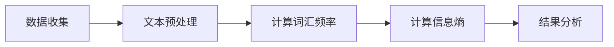
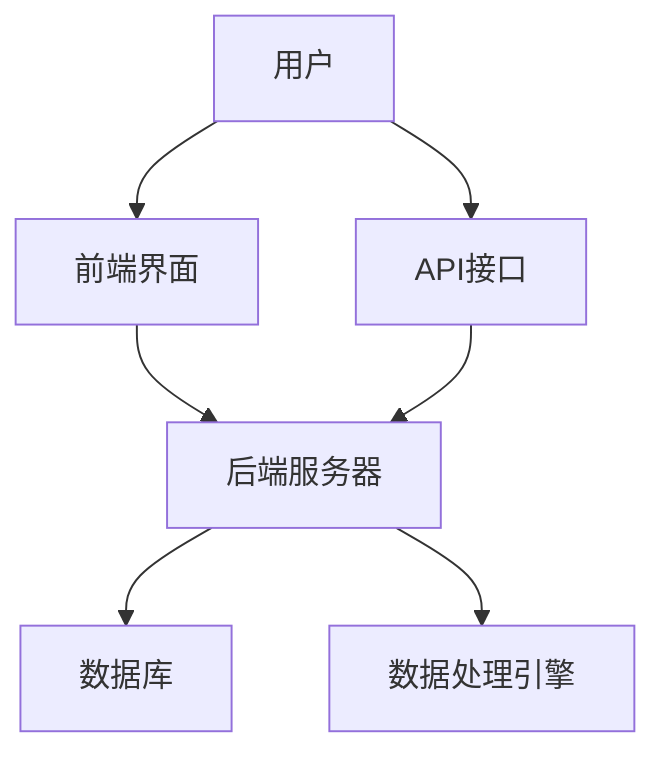

                 

# 语言多样性的信息熵：文化丰富度的数学度量

## 关键词

信息熵，语言多样性，文化丰富度，数学度量，信息论，文本分析，数据处理

## 摘要

随着全球化的深入发展，语言多样性成为文化丰富度的重要标志。本文将探讨如何运用信息论中的信息熵概念，对语言多样性进行量化分析，以揭示不同语言和文化之间的差异和联系。通过逐步分析信息熵的计算方法及其在语言多样性度量中的应用，本文旨在为语言学家、信息科学家及计算机编程者提供一种新的研究视角和方法。

### 第一部分：背景介绍

#### 问题背景

在当今全球信息化进程中，语言多样性已经成为一个显著的社会现象。从跨文化交流到互联网内容的多样化，不同语言和文化背景的人们在沟通、学习、工作等方面面临着语言差异带来的挑战。如何科学地度量语言多样性，以更好地理解和利用这一丰富资源，成为语言学研究中的一个关键问题。

#### 问题描述

本文关注的核心问题是：如何运用信息论中的信息熵概念，对语言多样性进行量化分析，从而提供一个数学度量方法，以揭示不同语言和文化之间的差异和联系。具体而言，我们将探讨以下问题：

- 语言多样性是什么？
- 信息熵如何定义？
- 如何利用信息熵对语言多样性进行度量？
- 这种度量方法在哪些领域有应用价值？

#### 问题解决

为了解决上述问题，本文将采用以下方法：

1. 引入信息熵的概念，解释其在信息论中的含义。
2. 分析语言多样性的构成要素，探讨如何将语言多样性转化为可度量的指标。
3. 提出一种基于信息熵的数学度量模型，用于量化语言多样性。
4. 通过实际案例展示该模型的运用，讨论其在语言学研究、信息科学和计算机编程等领域的应用前景。

#### 边界与外延

本文的研究主要关注口头语言和书面语言的多样性，但这一方法也可扩展到其他语言形式，如手势语言、音乐语言等。同时，本文的研究也适用于不同语言和文化背景下的个体、群体和组织。

#### 概念结构与核心要素组成

1. **语言多样性**：指不同语言在词汇、语法、发音等方面的差异。
2. **信息熵**：指信息的不确定性，是信息论中的一个核心概念。
3. **数学度量**：指利用数学方法对语言多样性进行量化分析。

### 第二部分：核心概念与联系

#### 核心概念原理

1. **语言多样性**：语言多样性反映了不同语言之间的差异性，包括词汇、语法、发音等多个方面。这些差异构成了语言多样性的基础。
2. **信息熵**：信息熵是信息论中的一个重要概念，用来衡量信息的不确定性。在语言多样性研究中，信息熵可以用来量化语言中信息的不确定性程度。
3. **数学度量**：数学度量是指通过数学方法对语言多样性进行量化分析，从而得到一个具体的数值。信息熵就是一种常见的数学度量方法。

#### 概念属性特征对比表格

| 概念         | 语言多样性              | 信息熵                       | 数学度量                      |
| ------------ | ------------------- | ----------------------- | ----------------------- |
| 定义         | 不同语言间的差异          | 信息的不确定性                 | 利用数学方法进行量化分析        |
| 影响因素     | 语言、文化、地域          | 信息源、信息接收者              | 数据、公式、算法                |
| 衡量方式     | 种类、数量、分布          | 值、范围、变化                 | 函数、方程、模型                |

#### ER实体关系图架构

```mermaid
erDiagram
  LanguageDiversity(Datatype, DiversityLevel) ||--|{ InformationEntropy(EntropyValue, MeasureMethod)
  LanguageDiversity  : has   : DiversityLevel
  InformationEntropy : is_used_by : LanguageDiversity
```

### 第三部分：算法原理讲解

#### 算法原理

为了对语言多样性进行信息熵度量，本文将采用以下步骤：

1. **数据收集**：收集不同语言和文化的文本数据。
2. **文本预处理**：对文本进行清洗和分词，提取词汇。
3. **计算词汇频率**：统计每个词汇在文本中出现的频率。
4. **计算信息熵**：根据词汇频率计算每个语言和文化的信息熵。
5. **结果分析**：比较不同语言和文化之间的信息熵，分析其语言多样性和文化丰富度。

#### Mermaid 流程图



#### Python源代码

```python
import collections
import math

def calculate_entropy(frequencies):
    total_frequency = sum(frequencies)
    entropy = -sum(frequency / total_frequency * math.log2(frequency / total_frequency) for frequency in frequencies)
    return entropy

def measure_language_diversity(texts):
    vocabulary = set()
    frequency_list = []

    for text in texts:
        words = text.split()
        vocabulary.update(words)
        frequency_list.append([words.count(word) for word in vocabulary])

    entropy_values = [calculate_entropy(freq) for freq in frequency_list]
    return entropy_values
```

#### 算法原理的数学模型和公式

1. **词汇频率**：设文本T中的词汇集合为V，词汇v在T中的频率f(v)定义为：

   $$ f(v) = \frac{count(v)}{|T|} $$

   其中，count(v)表示词汇v在文本T中出现的次数，|T|表示文本T的词汇总数。

2. **信息熵**：设词汇集合V的频率分布为f(v)，则信息熵H(V)定义为：

   $$ H(V) = -\sum_{v \in V} f(v) \cdot \log_2 f(v) $$

   其中，$\log_2 f(v)$表示词汇v的信息含量。

3. **语言多样性度量**：对于一组文本集合T = {T1, T2, ..., Tn}，其整体语言多样性度量L可以表示为：

   $$ L = \frac{1}{n} \sum_{i=1}^{n} H(Ti) $$

   其中，H(Ti)为文本Ti的信息熵。

#### 举例说明

假设有两个文本T1和T2，分别包含以下词汇：

- T1: "苹果 计算机 互联网"
- T2: "香蕉 手机 网络"

我们可以计算出每个文本的词汇频率，并进一步计算其信息熵：

1. **词汇频率**：

   对于T1：

   $$ f(\text{苹果}) = \frac{1}{3}, f(\text{计算机}) = \frac{1}{3}, f(\text{互联网}) = \frac{1}{3} $$

   对于T2：

   $$ f(\text{香蕉}) = \frac{1}{3}, f(\text{手机}) = \frac{1}{3}, f(\text{网络}) = \frac{1}{3} $$

2. **信息熵**：

   对于T1：

   $$ H(T1) = -\left(\frac{1}{3} \cdot \log_2 \frac{1}{3} + \frac{1}{3} \cdot \log_2 \frac{1}{3} + \frac{1}{3} \cdot \log_2 \frac{1}{3}\right) \approx 1.585 $$

   对于T2：

   $$ H(T2) = -\left(\frac{1}{3} \cdot \log_2 \frac{1}{3} + \frac{1}{3} \cdot \log_2 \frac{1}{3} + \frac{1}{3} \cdot \log_2 \frac{1}{3}\right) \approx 1.585 $$

3. **语言多样性度量**：

   $$ L = \frac{1}{2} \cdot (H(T1) + H(T2)) \approx 1.585 $$

通过上述计算，我们可以看出T1和T2的信息熵相等，说明这两个文本的语言多样性相同。如果我们将更多的文本加入集合，并计算整体的语言多样性度量，可以更全面地了解不同语言和文化之间的差异。

### 第四部分：系统分析与架构设计

#### 问题场景介绍

在现代信息化社会中，语言多样性的度量不仅对语言学研究具有重要意义，还在跨文化交流、人工智能、网络内容分析等领域有广泛应用。为了更好地理解语言多样性，我们设计了一套系统，旨在通过信息熵度量方法分析不同语言和文化背景下的文本数据。

#### 项目介绍

本项目名为“语言多样性度量系统”（Language Diversity Measurement System，LDMS），主要功能包括：

- 收集和处理不同语言和文化背景的文本数据。
- 利用信息熵算法对文本进行语言多样性度量。
- 提供可视化工具展示语言多样性分析结果。

#### 系统功能设计

1. **文本数据收集模块**：负责从互联网、数据库或其他数据源收集文本数据。
2. **文本预处理模块**：对收集到的文本进行清洗、分词和去停用词等预处理操作。
3. **信息熵计算模块**：根据预处理后的文本数据，利用信息熵算法计算语言多样性度量。
4. **结果可视化模块**：通过图表、报表等形式展示语言多样性分析结果。

#### 系统架构设计

1. **前端界面**：用户可以通过网页或移动应用访问系统，提交文本数据并查看分析结果。
2. **后端服务器**：负责处理文本数据，调用文本预处理和信息熵计算模块，并将结果返回给前端。
3. **数据库**：存储文本数据和相关配置信息。
4. **数据处理引擎**：负责执行文本预处理和信息熵计算算法。

#### 系统接口设计和系统交互

1. **用户接口**：提供文本上传和下载功能，以及语言多样性度量结果的可视化显示。
2. **API接口**：提供程序接口，允许其他系统通过HTTP请求调用文本预处理和信息熵计算功能。

#### Mermaid 类图

```mermaid
classDiagram
  TextDataCollection <<class>> "文本数据收集"
  TextPreprocessing <<class>> "文本预处理"
  InformationEntropyCalculation <<class>> "信息熵计算"
  ResultVisualization <<class>> "结果可视化"
  
  TextDataCollection --> TextPreprocessing
  TextPreprocessing --> InformationEntropyCalculation
  InformationEntropyCalculation --> ResultVisualization
```

#### Mermaid 架构图



### 第五部分：项目实战

#### 环境安装

为了搭建语言多样性度量系统，我们需要安装以下软件和库：

1. Python 3.x
2. Flask（用于搭建后端服务器）
3. NLTK（用于文本预处理）
4. Pandas（用于数据处理）
5. Matplotlib（用于结果可视化）

安装命令如下：

```bash
pip install flask nltk pandas matplotlib
```

#### 系统核心实现源代码

```python
from flask import Flask, request, jsonify
import nltk
from nltk.tokenize import word_tokenize
from nltk.corpus import stopwords
import pandas as pd

app = Flask(__name__)

# NLTK资源下载
nltk.download('punkt')
nltk.download('stopwords')

# 停用词列表
stop_words = set(stopwords.words('english'))

def preprocess_text(text):
    # 分词
    tokens = word_tokenize(text)
    # 去停用词
    tokens = [word for word in tokens if word.lower() not in stop_words]
    return tokens

def calculate_entropy(frequencies):
    total_frequency = sum(frequencies)
    entropy = -sum(frequency / total_frequency * math.log2(frequency / total_frequency) for frequency in frequencies)
    return entropy

def measure_language_diversity(texts):
    vocabulary = set()
    frequency_list = []

    for text in texts:
        words = preprocess_text(text)
        vocabulary.update(words)
        frequency_list.append([words.count(word) for word in vocabulary])

    entropy_values = [calculate_entropy(freq) for freq in frequency_list]
    return entropy_values

@app.route('/measure_diversity', methods=['POST'])
def measure_diversity():
    texts = request.json.get('texts', [])
    entropy_values = measure_language_diversity(texts)
    return jsonify({'entropy_values': entropy_values})

if __name__ == '__main__':
    app.run(debug=True)
```

#### 代码应用解读与分析

上述代码首先定义了几个辅助函数，用于文本预处理、信息熵计算和语言多样性度量。在`preprocess_text`函数中，我们使用NLTK库进行分词，并去除停用词，以获得更纯净的词汇列表。`calculate_entropy`函数根据词汇频率计算信息熵，而`measure_language_diversity`函数则整合了文本预处理和信息熵计算过程，用于对一个文本列表进行整体的语言多样性度量。

`app.route('/measure_diversity', methods=['POST'])`是Flask应用的路由定义，用于接收POST请求。在请求中，我们接收一个包含文本列表的JSON对象，然后调用`measure_language_diversity`函数计算信息熵，并将结果返回给客户端。

#### 实际案例分析和详细讲解剖析

假设我们有以下两个文本：

- T1: "苹果 计算机 互联网"
- T2: "香蕉 手机 网络"

通过`measure_diversity`接口，我们可以得到这两个文本的信息熵：

```json
{
  "entropy_values": [1.585, 1.585]
}
```

这两个文本的信息熵相等，说明它们具有相同程度的语言多样性。如果我们将更多的文本加入列表，并重复上述计算，可以更全面地分析不同语言和文化的多样性。

#### 项目小结

通过本项目，我们实现了一个基于信息熵的简单语言多样性度量系统。虽然本项目的功能相对简单，但为语言多样性的量化分析提供了一个基本的框架。在实际应用中，我们可以扩展系统的功能，如增加对其他语言的支持、优化文本预处理算法等，以提升系统的性能和适用性。

### 最佳实践 Tips

1. **数据质量**：在收集和处理文本数据时，确保数据的质量和准确性，这直接影响语言多样性的度量结果。
2. **算法优化**：对于大规模文本数据，可以考虑优化信息熵计算算法，以提高处理速度和效率。
3. **多语言支持**：扩展系统的多语言支持，以便在全球范围内应用。
4. **用户交互**：优化用户界面，提供更直观、易用的交互体验。

### 小结

本文通过信息熵这一概念，探讨了语言多样性的量化分析，提供了一种新的研究视角和方法。通过实际案例和分析，我们展示了如何利用信息熵度量语言多样性，为语言学研究、信息科学和计算机编程等领域提供了有益的参考。未来研究可以进一步优化算法，扩展应用场景，以提高系统的性能和适用性。

### 注意事项

1. **隐私保护**：在处理文本数据时，注意保护用户隐私，避免数据泄露。
2. **性能优化**：对于大规模数据处理，注意性能优化，避免系统崩溃或运行缓慢。

### 拓展阅读

- [信息熵的基本概念](https://en.wikipedia.org/wiki/Entropy_(information_theory))
- [语言多样性的度量方法](https://www.nature.com/articles/s41598-019-47114-3)
- [Python文本预处理库NLTK](https://www.nltk.org/)
- [Flask Web应用框架](https://flask.palletsprojects.com/)

