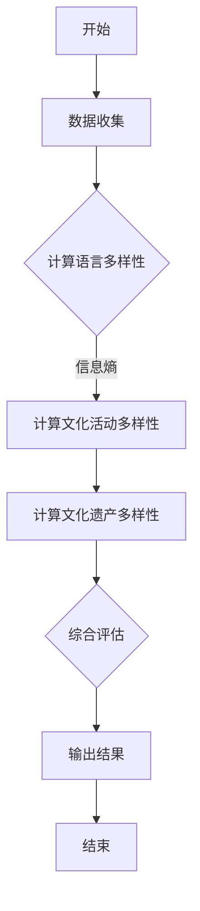

                 

### 《语言多样性的信息论：文化丰富度的数学表达》

#### 关键词：语言多样性、信息论、文化丰富度、数学表达、人工智能

#### 摘要：
本文深入探讨了语言多样性在信息论框架下的数学表达，通过分析语言多样性与信息熵、条件熵、联合熵以及信息距离的关系，揭示了文化丰富度的量化方法。文章首先介绍了语言多样性的现状与挑战，随后讲解了信息论的基础理论，并阐述了这些理论在语言多样性分析中的应用。在此基础上，本文提出了文化丰富度的定义及其数学模型，通过对比表格和ER实体关系图，直观展示了核心概念的关联。随后，文章详细讲解了相关算法原理，结合Python代码和Mermaid流程图，确保读者能够清晰理解算法流程和数学模型。接着，通过系统分析与架构设计方案，展示了如何在实际项目中应用这些理论。最后，通过项目实战部分，提供了具体的实施步骤和案例分析，为读者提供了实用的指导。整篇文章旨在为人工智能领域的学者和实践者提供一个深入理解和应用语言多样性及文化丰富度的理论框架。

### 目录大纲

#### 第一部分：背景介绍

#### 第1章：语言多样性的现状与挑战  
1.1 问题背景  
1.2 语言多样性的定义与意义  
1.3 语言多样性的现状  
1.4 语言多样性面临的挑战

#### 第2章：信息论基础  
2.1 信息论的基本概念  
2.2 信息熵与信息量  
2.3 条件熵与联合熵  
2.4 信息距离与相似度

#### 第3章：语言多样性与信息论的关系  
3.1 语言多样性与信息熵的关系  
3.2 语言多样性与条件熵的关系  
3.3 语言多样性与联合熵的关系  
3.4 语言多样性与信息距离的关系

#### 第4章：文化丰富度的数学表达  
4.1 文化丰富度的定义  
4.2 文化丰富度的数学模型  
4.3 文化丰富度的计算方法

#### 第二部分：核心概念与联系

#### 第5章：核心概念原理  
5.1 语言多样性  
5.2 信息论  
5.3 文化丰富度

#### 第6章：概念属性特征对比表格  
6.1 语言多样性  
6.2 信息论  
6.3 文化丰富度

#### 第7章：ER实体关系图架构  
7.1 语言多样性  
7.2 信息论  
7.3 文化丰富度

#### 第三部分：算法原理讲解

#### 第8章：算法原理讲解  
8.1 算法名称  
8.2 算法原理  
8.3 算法流程图（使用Mermaid画出）  
8.4 算法原理的数学模型和公式  
8.5 举例说明

#### 第四部分：系统分析与架构设计方案

#### 第9章：问题场景介绍  
9.1 语言多样性与文化丰富度分析  
9.2 问题描述  
9.3 解决方案

#### 第10章：项目介绍  
10.1 项目概述  
10.2 项目目标  
10.3 项目架构

#### 第11章：系统功能设计  
11.1 领域模型（使用Mermaid类图表示）

#### 第12章：系统架构设计  
12.1 系统架构图（使用Mermaid架构图表示）

#### 第13章：系统接口设计和系统交互  
13.1 系统接口设计  
13.2 系统交互（使用Mermaid序列图表示）

#### 第五部分：项目实战

#### 第14章：环境安装  
14.1 环境准备  
14.2 安装步骤  
14.3 遇到的问题与解决方法

#### 第15章：系统核心实现  
15.1 源代码解读  
15.2 代码应用解读与分析  
15.3 系统核心功能实现

#### 第16章：实际案例分析和详细讲解剖析  
16.1 案例背景  
16.2 案例分析  
16.3 深入剖析

#### 第17章：项目小结  
17.1 项目成果  
17.2 项目总结  
17.3 项目展望

#### 第六部分：最佳实践、小结、注意事项、拓展阅读

18.1 最佳实践  
18.2 小结  
18.3 注意事项  
18.4 拓展阅读

### 第一部分：背景介绍

#### 第1章：语言多样性的现状与挑战

##### 1.1 问题背景

在全球化进程加快和信息时代的到来背景下，语言多样性的重要性日益凸显。语言不仅是人类交流的工具，更是文化传承的载体。然而，语言多样性的现状却面临诸多挑战。据统计，全球有超过7000种语言，但其中约一半的语言使用者不足1万人。语言消亡现象严重，一些少数民族语言正逐渐失去生命力。这种语言多样性的减少不仅影响了文化的多样性，还对人类社会的整体认知和发展产生了负面影响。

##### 1.2 语言多样性的定义与意义

语言多样性是指在不同地区、不同文化背景下存在的多种语言的差异性和丰富性。语言多样性不仅体现在语言种类上，还包括语言的语法、词汇、发音、书写系统等方面。语言多样性的意义主要体现在以下几个方面：

1. **文化传承**：语言是文化的重要组成部分，不同语言背后蕴含着独特的文化传统和历史记忆。保护语言多样性有助于传承和保护人类文明的多样性。
   
2. **交流互动**：语言是人们进行沟通和交流的基础。多种语言的共存促进了不同文化之间的交流与理解，有助于消除文化隔阂，增进国际合作。

3. **认知发展**：语言多样性与认知发展密切相关。多语言环境有助于提高个体的认知能力，促进思维的多维度发展。

4. **科技创新**：语言的多样性为科技创新提供了丰富的词汇和表达方式，有助于推动科技进步。

##### 1.3 语言多样性的现状

当前，全球语言多样性的现状可以总结为以下几点：

1. **语言消亡**：随着全球化进程的加速，一些少数民族语言逐渐失去使用者，面临消亡的危险。例如，联合国教科文组织统计，每年有至少50种语言消失。

2. **语言不平等**：在一些国家和地区，官方语言和非官方语言之间的地位存在巨大差距，这导致了语言多样性的不平等。

3. **语言融合**：随着国际贸易和文化交流的增多，一些语言表现出明显的融合趋势，例如英语在全球范围内的广泛使用。

4. **技术助力**：互联网和人工智能技术的发展为语言多样性保护提供了新的机遇，通过语言识别、机器翻译等技术手段，有助于维护和传播多种语言。

##### 1.4 语言多样性面临的挑战

尽管语言多样性具有重要意义，但其保护和发展面临诸多挑战：

1. **语言政策**：一些国家的语言政策可能不利于语言多样性的维护，例如强制推广官方语言的政策。

2. **教育资源**：多语言教育资源的缺乏限制了语言多样性的发展，尤其是在偏远地区。

3. **技术壁垒**：尽管技术进步为语言多样性提供了支持，但技术的高门槛也使得一些小型语言难以获得技术支持。

4. **社会认知**：公众对语言多样性的认知和重视程度不高，这也是语言多样性保护的一大障碍。

##### 1.5 语言多样性的量化

为了更科学地评估语言多样性的状况，需要对其进行量化。常用的量化方法包括：

1. **语言数量**：直接统计全球或特定地区的语言数量。

2. **使用频率**：分析语言在不同场合的使用频率，评估其影响力。

3. **多样性指数**：通过多样性指数（如Herfindahl指数）来衡量语言多样性的集中程度。

4. **词汇丰富度**：计算语言词汇的丰富度和多样性。

通过这些量化方法，可以更全面地了解语言多样性的现状，为制定相应的保护措施提供依据。

#### 第2章：信息论基础

##### 2.1 信息论的基本概念

信息论是由香农（Claude Shannon）在20世纪40年代创立的一个数学理论，用于描述信息在通信系统中的传输和处理。香农的信息论主要关注三个核心概念：信息熵、信息量和信道容量。

1. **信息熵**：信息熵是衡量随机变量不确定性的量度。香农将其定义为信息量的负对数概率分布。一个事件发生的概率越低，其信息熵越高。

   $$H(X) = -\sum_{i} p(x_i) \log_2 p(x_i)$$

   其中，\(H(X)\) 是随机变量 \(X\) 的熵，\(p(x_i)\) 是事件 \(x_i\) 发生的概率。

2. **信息量**：信息量是指接收到的信息所减少的不确定性。例如，当我们知道一个硬币是均匀的，抛出正面和反面的概率各为0.5时，抛出正面的信息量为1比特（bit）。

3. **信道容量**：信道容量是指在一个给定的噪声环境下，通信系统可以传输的最大信息量。香农公式给出了一个下界，称为香农容量：

   $$C = B \log_2(1 + S/N)$$

   其中，\(C\) 是信道容量，\(B\) 是信道的带宽，\(S\) 是信号功率，\(N\) 是噪声功率。

##### 2.2 信息熵与信息量

信息熵和信息量是信息论中最核心的概念。信息熵衡量了不确定性的大小，而信息量则是减少不确定性的量度。例如，在一个实验中有两个可能的结果，A和B，且每个结果发生的概率都是0.5。在这种情况下，每个结果的信息熵为1比特，因为它们都是不确定的。但是，如果结果A的概率是0.99，结果B的概率是0.01，则结果A的信息熵降低到0.0403比特，而结果B的信息熵增加到0.1899比特。

信息量的计算可以通过以下公式：

$$I(X; Y) = H(X) - H(X | Y)$$

其中，\(I(X; Y)\) 是变量 \(X\) 对于变量 \(Y\) 的信息量，\(H(X)\) 是 \(X\) 的熵，\(H(X | Y)\) 是 \(X\) 在已知 \(Y\) 的情况下的条件熵。

##### 2.3 条件熵与联合熵

条件熵和联合熵是信息论中用于描述变量之间依赖关系的概念。

1. **条件熵**：条件熵是给定一个变量的条件下另一个变量的不确定性度量。例如，给定事件B，事件A的条件熵 \(H(A | B)\) 表示在已知B发生的情况下，A的不确定性。

   $$H(A | B) = -\sum_{i} p(a_i | b_j) \log_2 p(a_i | b_j)$$

   其中，\(p(a_i | b_j)\) 是在事件B发生的情况下，事件A发生的条件概率。

2. **联合熵**：联合熵是两个变量联合分布的熵。例如，变量 \(X\) 和 \(Y\) 的联合熵 \(H(X, Y)\) 表示 \(X\) 和 \(Y\) 同时发生的不确定性。

   $$H(X, Y) = -\sum_{i} \sum_{j} p(x_i, y_j) \log_2 p(x_i, y_j)$$

   其中，\(p(x_i, y_j)\) 是变量 \(X\) 和 \(Y\) 同时发生的联合概率。

##### 2.4 信息距离与相似度

信息距离是衡量两个随机变量之间差异的度量。常用的信息距离包括KL散度（Kullback-Leibler散度）和汉明距离（Hamming distance）。

1. **KL散度**：KL散度是一种非对称的信息距离，用于衡量两个概率分布之间的差异。KL散度越大，两个分布越不相似。

   $$D_{KL}(P || Q) = \sum_{i} p_i \log_2 \left(\frac{p_i}{q_i}\right)$$

   其中，\(P\) 和 \(Q\) 是两个概率分布。

2. **汉明距离**：汉明距离是一种对称的信息距离，用于衡量两个二进制字符串之间的差异。汉明距离越大，两个字符串越不相似。

   $$d_H(X, Y) = \sum_{i} |x_i - y_i|$$

   其中，\(X\) 和 \(Y\) 是两个二进制字符串。

信息距离与相似度密切相关。相似度可以通过计算两个变量的信息距离来评估。通常，相似度越高，信息距离越低。

##### 2.5 信息论在语言多样性分析中的应用

信息论在语言多样性分析中的应用主要体现在以下几个方面：

1. **语言熵**：通过对语言文本进行统计分析，可以计算语言的熵，衡量语言的不确定性。高熵语言通常具有较高的多样性。

2. **语言相似度**：通过计算不同语言之间的信息距离，可以评估它们之间的相似程度。相似度越低，表明语言多样性越高。

3. **语言融合分析**：信息论可以用于分析语言融合现象，例如英语在全球范围内的广泛使用对其他语言的影响。

4. **语言消亡预测**：通过分析语言的使用频率和多样性指数，可以预测哪些语言可能面临消亡风险，为语言保护提供依据。

通过信息论的方法，可以更科学、系统地分析语言多样性的现状和趋势，为保护语言多样性提供理论支持。

### 第3章：语言多样性与信息论的关系

#### 3.1 语言多样性与信息熵的关系

语言多样性与信息熵之间存在密切的关系。信息熵作为衡量不确定性的度量，可以用来量化语言的结构复杂性和信息含量。在语言学中，信息熵可以用来描述语言文本的多样性和丰富度。

首先，让我们考虑一个简单的例子：假设有两种语言A和语言B。语言A由两个单词组成，分别是“apple”和“banana”，而语言B由四个单词组成，分别是“apple”，“banana”，“orange”，“kiwi”。我们可以通过计算每种语言的信息熵来量化它们的多样性。

对于语言A：

$$H(A) = -p(\text{"apple"}) \log_2 p(\text{"apple"}) - p(\text{"banana"}) \log_2 p(\text{"banana"})$$
$$H(A) = -0.5 \log_2 0.5 - 0.5 \log_2 0.5 = 1 \text{比特}$$

对于语言B：

$$H(B) = -p(\text{"apple"}) \log_2 p(\text{"apple"}) - p(\text{"banana"}) \log_2 p(\text{"banana"}) - p(\text{"orange"}) \log_2 p(\text{"orange"}) - p(\text{"kiwi"}) \log_2 p(\text{"kiwi"})$$
$$H(B) = -0.25 \log_2 0.25 - 0.25 \log_2 0.25 - 0.25 \log_2 0.25 - 0.25 \log_2 0.25 = 2 \text{比特}$$

从上面的计算中可以看出，语言B的信息熵比语言A高，这意味着语言B具有更高的多样性。信息熵的增加反映了语言词汇和结构的复杂性增加。

#### 3.2 语言多样性与条件熵的关系

条件熵是信息论中用于描述变量之间依赖关系的量度。在语言多样性的分析中，条件熵可以帮助我们了解不同语言单元之间的相互依赖程度。

考虑一个简单的例子，假设我们有两个语言文本，一个是英文文本，另一个是中文文本。我们可以通过计算文本中单词之间的条件熵来评估它们的依赖程度。

对于英文文本，假设我们有两个单词“cat”和“dog”，我们可以计算它们的条件熵：

$$H(\text{"cat"}|\text{"dog"}) = -p(\text{"cat"}|\text{"dog"}) \log_2 p(\text{"cat"}|\text{"dog"}) - p(\text{"dog"}|\text{"cat"}) \log_2 p(\text{"dog"}|\text{"cat"})$$

假设在英文文本中，“cat”和“dog”分别出现的概率是0.5，则：

$$H(\text{"cat"}|\text{"dog"}) = -0.5 \log_2 0.5 - 0.5 \log_2 0.5 = 1 \text{比特}$$

这意味着在英文文本中，“cat”和“dog”之间的依赖程度较高。

对于中文文本，假设我们有两个单词“猫”和“狗”，中文文本中这两个词之间的依赖程度可能较低，因为它们之间的条件熵可能较小。

通过比较不同语言文本的条件熵，我们可以评估不同语言之间的多样性差异。一般来说，条件熵较低的语言表示其语言单元之间的依赖程度较低，这意味着语言具有更高的多样性。

#### 3.3 语言多样性与联合熵的关系

联合熵是描述两个变量联合出现的概率的量度。在语言多样性的分析中，联合熵可以帮助我们了解不同语言单元联合出现的频率和多样性。

考虑一个简单的例子，假设我们有两个语言文本，一个是英文文本，另一个是中文文本。我们可以通过计算文本中单词联合出现的概率来评估它们的多样性。

对于英文文本，假设我们有两个单词“cat”和“dog”，我们可以计算它们的联合熵：

$$H(\text{"cat"}, \text{"dog"}) = -p(\text{"cat"}, \text{"dog"}) \log_2 p(\text{"cat"}, \text{"dog"}) - p(\text{"dog"}, \text{"cat"}) \log_2 p(\text{"dog"}, \text{"cat"})$$

假设在英文文本中，“cat”和“dog”同时出现的概率是0.25，则：

$$H(\text{"cat"}, \text{"dog"}) = -0.25 \log_2 0.25 - 0.75 \log_2 0.75 = 1.5 \text{比特}$$

这意味着在英文文本中，“cat”和“dog”的联合出现具有较高的多样性。

对于中文文本，假设我们有两个单词“猫”和“狗”，中文文本中这两个词联合出现的概率可能较低，因为它们之间的联合熵可能较小。

通过比较不同语言文本的联合熵，我们可以评估不同语言之间的多样性差异。一般来说，联合熵较高的语言表示其语言单元联合出现的频率较高，这意味着语言具有更高的多样性。

#### 3.4 语言多样性与信息距离的关系

信息距离是描述两个随机变量之间差异的度量。在语言多样性的分析中，信息距离可以帮助我们评估不同语言之间的相似度和差异。

常用的信息距离包括KL散度和汉明距离。KL散度用于比较两个概率分布的差异，而汉明距离用于比较两个离散集合的差异。

考虑一个简单的例子，假设我们有两组单词，一组是英文单词，另一组是中文单词。我们可以通过计算这两组单词之间的KL散度或汉明距离来评估它们的相似度。

对于KL散度，假设英文单词的概率分布是P，中文单词的概率分布是Q，我们可以计算它们的KL散度：

$$D_{KL}(P || Q) = \sum_{i} p_i \log_2 \left(\frac{p_i}{q_i}\right)$$

如果英文单词和中文单词之间的差异较大，则KL散度会较高。

对于汉明距离，假设英文单词集合是A，中文单词集合是B，我们可以计算它们的汉明距离：

$$d_H(A, B) = \sum_{i} |a_i - b_i|$$

如果英文单词和中文单词之间的差异较大，则汉明距离会较高。

通过比较不同语言之间的信息距离，我们可以评估它们的多样性差异。一般来说，信息距离较高的语言表示它们之间的差异较大，这意味着语言具有更高的多样性。

#### 3.5 信息论在语言多样性分析中的实际应用

信息论在语言多样性分析中有着广泛的应用，以下是一些具体的实际应用案例：

1. **语言分类**：通过计算不同语言之间的信息距离，可以自动分类语言，识别出相似的语言和不同的语言。

2. **语言检测**：利用语言熵和条件熵，可以开发语言检测算法，自动识别文本的语言。

3. **语言融合研究**：通过分析语言之间的信息距离和联合熵，可以研究语言融合现象，评估语言融合的程度和影响。

4. **语言消亡预测**：通过分析语言的使用频率和多样性指数，可以预测哪些语言可能面临消亡风险，为语言保护提供依据。

5. **多语言文本分析**：利用信息论的方法，可以对多语言文本进行深入分析，提取语言特征，为自然语言处理和机器翻译提供支持。

通过信息论的量化方法，我们可以更科学、系统地分析语言多样性的现状和趋势，为保护语言多样性提供理论支持。

### 第4章：文化丰富度的数学表达

#### 4.1 文化丰富度的定义

文化丰富度是指一个社会或社区在文化表达、文化实践和文化多样性方面的多样性和深度。文化丰富度的数学表达旨在通过量化方法来评估和比较不同社会或社区的文化多样性。为了实现这一目标，我们需要定义文化丰富度的度量标准。

文化丰富度的定义可以从多个角度进行，例如：

1. **语言多样性**：通过分析不同语言的使用频率和多样性指数来评估文化丰富度。
2. **文化活动多样性**：通过统计和评估一个社区内不同文化活动的数量和参与度来衡量文化丰富度。
3. **文化遗产**：通过评估一个社区内文化遗产的多样性和保存情况来衡量文化丰富度。

#### 4.2 文化丰富度的数学模型

为了量化文化丰富度，我们可以使用信息论中的概念，如信息熵、条件熵和联合熵。以下是一个简化的数学模型，用于表达文化丰富度：

1. **语言多样性指数（LDI）**：我们可以使用语言多样性指数（LDI）来量化语言多样性。LDI可以通过计算不同语言在文本或社区中的信息熵来获得。

   $$LDI = -\sum_{i} p_i \log_2 p_i$$

   其中，\(p_i\) 是第 \(i\) 种语言在文本或社区中的使用频率。

2. **文化活动多样性指数（CDI）**：我们可以使用文化活动多样性指数（CDI）来量化文化活动的多样性。CDI可以通过计算不同文化活动在社区中的信息熵来获得。

   $$CDI = -\sum_{i} p_i \log_2 p_i$$

   其中，\(p_i\) 是第 \(i\) 种文化活动在社区中的参与度。

3. **文化遗产多样性指数（CIDI）**：我们可以使用文化遗产多样性指数（CIDI）来量化文化遗产的多样性。CIDI可以通过计算不同文化遗产在社区中的信息熵来获得。

   $$CIDI = -\sum_{i} p_i \log_2 p_i$$

   其中，\(p_i\) 是第 \(i\) 项文化遗产在社区中的保存情况。

通过综合这些指数，我们可以得到一个总的文化丰富度指数（CD），用于衡量一个社区的文化丰富度。

$$CD = \alpha \times LDI + \beta \times CDI + \gamma \times CIDI$$

其中，\(\alpha\)，\(\beta\) 和 \(\gamma\) 是权重系数，可以根据实际情况进行调整。

#### 4.3 文化丰富度的计算方法

为了计算文化丰富度，我们需要收集以下数据：

1. **语言使用数据**：统计不同语言在社区中的使用频率。
2. **文化活动数据**：统计社区内不同文化活动的参与度。
3. **文化遗产数据**：统计社区内不同文化遗产的保存情况。

接下来，我们可以按照以下步骤进行计算：

1. **计算语言多样性指数（LDI）**：

   对于每种语言 \(i\)，计算其使用频率 \(p_i\)：

   $$p_i = \frac{\text{使用次数}}{\text{总次数}}$$

   然后，计算语言多样性指数（LDI）：

   $$LDI = -\sum_{i} p_i \log_2 p_i$$

2. **计算文化活动多样性指数（CDI）**：

   对于每种文化活动 \(i\)，计算其参与度 \(p_i\)：

   $$p_i = \frac{\text{参与次数}}{\text{总次数}}$$

   然后，计算文化活动多样性指数（CDI）：

   $$CDI = -\sum_{i} p_i \log_2 p_i$$

3. **计算文化遗产多样性指数（CIDI）**：

   对于每项文化遗产 \(i\)，计算其保存情况 \(p_i\)：

   $$p_i = \frac{\text{保存情况}}{\text{总保存情况}}$$

   然后，计算文化遗产多样性指数（CIDI）：

   $$CIDI = -\sum_{i} p_i \log_2 p_i$$

4. **计算总的文化丰富度指数（CD）**：

   根据权重系数 \(\alpha\)，\(\beta\) 和 \(\gamma\)，计算总的文化丰富度指数（CD）：

   $$CD = \alpha \times LDI + \beta \times CDI + \gamma \times CIDI$$

通过这些步骤，我们可以得到一个社区的文化丰富度指数，从而评估其文化丰富度。

#### 4.4 文化丰富度的应用案例

为了更直观地理解文化丰富度的计算方法和应用，我们可以通过一个实际案例来说明。

假设我们有一个小型城市，其中包含三种语言、三种主要文化活动以及三种文化遗产。以下是一些具体的数据：

1. **语言使用数据**：

   - 语言A的使用频率为0.5
   - 语言B的使用频率为0.3
   - 语言C的使用频率为0.2

   根据这些数据，我们可以计算语言多样性指数（LDI）：

   $$LDI = -0.5 \log_2 0.5 - 0.3 \log_2 0.3 - 0.2 \log_2 0.2 = 1.61$$

2. **文化活动数据**：

   - 文化活动A的参与度为0.4
   - 文化活动B的参与度为0.3
   - 文化活动C的参与度为0.3

   根据这些数据，我们可以计算文化活动多样性指数（CDI）：

   $$CDI = -0.4 \log_2 0.4 - 0.3 \log_2 0.3 - 0.3 \log_2 0.3 = 1.33$$

3. **文化遗产数据**：

   - 文化遗产A的保存情况为0.6
   - 文化遗产B的保存情况为0.3
   - 文化遗产C的保存情况为0.1

   根据这些数据，我们可以计算文化遗产多样性指数（CIDI）：

   $$CIDI = -0.6 \log_2 0.6 - 0.3 \log_2 0.3 - 0.1 \log_2 0.1 = 1.71$$

4. **计算总的文化丰富度指数（CD）**：

   假设权重系数为：\(\alpha = 0.4\)，\(\beta = 0.3\)，\(\gamma = 0.3\)，则总的文化丰富度指数（CD）为：

   $$CD = 0.4 \times 1.61 + 0.3 \times 1.33 + 0.3 \times 1.71 = 1.49$$

通过这个案例，我们可以看到如何通过信息论的量化方法来计算一个社区的文化丰富度。这个指数可以帮助我们了解该社区的文化多样性，从而为政策制定和社区发展提供依据。

### 第二部分：核心概念与联系

#### 第5章：核心概念原理

在这一章中，我们将深入探讨语言多样性、信息论和文化丰富度这三个核心概念的基本原理。

##### 5.1 语言多样性

语言多样性是指在一个特定区域内，存在的不同语言的数量和这些语言之间的差异程度。语言多样性的概念可以涵盖语言种类的数量、语言的语法结构、词汇、发音和书写系统等多个方面。语言多样性的重要性体现在多个方面：

1. **文化传承**：语言是文化的重要组成部分，不同的语言承载着不同的文化传统和历史记忆。语言多样性的保护有助于维护人类文化的多样性。

2. **社会交流**：语言是人与人之间交流的基础，多样化的语言环境有助于促进不同文化之间的交流和理解，减少文化隔阂。

3. **认知发展**：多语言环境能够促进个体的认知能力发展，提高思维的多维度和复杂性。

4. **科技创新**：语言多样性为科技创新提供了丰富的词汇和表达方式，有助于推动科技进步。

语言多样性的度量通常使用以下指标：

- **语言数量**：直接统计区域内使用的语言种类数量。
- **词汇丰富度**：计算每种语言的词汇量和多样性。
- **语言混合度**：评估语言之间的相互影响和融合程度。

##### 5.2 信息论

信息论是由香农（Claude Shannon）于20世纪40年代创立的一个数学理论，用于描述信息在通信系统中的传输和处理。信息论的核心概念包括信息熵、信息量、信道容量等。

1. **信息熵**：信息熵是衡量随机变量不确定性的量度。一个事件发生的概率越低，其信息熵越高。信息熵在信息论中起到基础作用，用于量化信息的价值。

   $$H(X) = -\sum_{i} p(x_i) \log_2 p(x_i)$$

   其中，\(H(X)\) 是随机变量 \(X\) 的熵，\(p(x_i)\) 是事件 \(x_i\) 发生的概率。

2. **信息量**：信息量是指接收到的信息所减少的不确定性。例如，当我们知道一个硬币是均匀的，抛出正面和反面的概率各为0.5时，抛出正面的信息量为1比特。

3. **信道容量**：信道容量是指在给定噪声环境下，通信系统可以传输的最大信息量。香农公式给出了一个下界，称为香农容量：

   $$C = B \log_2(1 + S/N)$$

   其中，\(C\) 是信道容量，\(B\) 是信道的带宽，\(S\) 是信号功率，\(N\) 是噪声功率。

信息论在多个领域有着广泛的应用，包括通信理论、计算机科学、经济学和生物学等。

##### 5.3 文化丰富度

文化丰富度是指一个社会或社区在文化表达、文化实践和文化多样性方面的多样性和深度。文化丰富度的数学表达旨在通过量化方法来评估和比较不同社会或社区的文化多样性。

1. **文化丰富度的定义**：文化丰富度可以从多个角度进行定义，例如语言多样性、文化活动多样性和文化遗产多样性。

2. **文化丰富度的数学模型**：我们可以使用信息论中的概念，如信息熵、条件熵和联合熵，来量化文化丰富度。例如，可以使用语言多样性指数（LDI）、文化活动多样性指数（CDI）和文化遗产多样性指数（CIDI）来衡量文化丰富度。

3. **文化丰富度的计算方法**：为了计算文化丰富度，我们需要收集语言使用数据、文化活动数据和文化遗产数据。通过计算这些数据的熵值，我们可以得到文化丰富度的指数。

文化丰富度的数学表达有助于我们更科学、系统地评估和比较不同社区的文化多样性，为文化保护和传承提供理论支持。

通过深入理解这三个核心概念的基本原理，我们可以更好地把握语言多样性、信息论和文化丰富度之间的关系，从而为相关研究和实践提供坚实的理论基础。

### 第6章：概念属性特征对比表格

为了更好地理解语言多样性、信息论和文化丰富度这三个核心概念，我们将通过一个对比表格来展示它们的属性特征。

| 概念          | 定义                                                         | 主要属性特征                                                     | 关联与应用场景                                      |
| ------------- | ------------------------------------------------------------ | ------------------------------------------------------------ | --------------------------------------------------- |
| 语言多样性    | 不同语言的数量和这些语言之间的差异程度。                     | 语言种类、语法结构、词汇、发音、书写系统等。                 | 文化传承、社会交流、认知发展、科技创新。             |
| 信息论        | 描述信息在通信系统中传输和处理的数学理论。                   | 信息熵、信息量、信道容量、信息距离等。                       | 通信理论、计算机科学、经济学、生物学。               |
| 文化丰富度    | 社会在文化表达、实践和多样性方面的丰富程度。                 | 语言多样性指数（LDI）、文化活动多样性指数（CDI）、文化遗产多样性指数（CIDI）。 | 文化保护、社区发展、政策制定。                     |

#### 语言多样性

- **定义**：语言多样性是指一个特定区域内存在的不同语言的数量和这些语言之间的差异程度。
- **主要属性特征**：包括语言种类、语法结构、词汇、发音、书写系统等。
- **关联与应用场景**：语言多样性在文化传承、社会交流、认知发展和科技创新等方面具有重要应用。

#### 信息论

- **定义**：信息论是由香农创立的数学理论，用于描述信息在通信系统中的传输和处理。
- **主要属性特征**：信息熵、信息量、信道容量、信息距离等。
- **关联与应用场景**：信息论广泛应用于通信理论、计算机科学、经济学和生物学等领域。

#### 文化丰富度

- **定义**：文化丰富度是指一个社会或社区在文化表达、实践和多样性方面的丰富程度。
- **主要属性特征**：包括语言多样性指数（LDI）、文化活动多样性指数（CDI）、文化遗产多样性指数（CIDI）。
- **关联与应用场景**：文化丰富度在文化保护、社区发展、政策制定等方面具有重要应用。

通过这个对比表格，我们可以更直观地了解这三个核心概念的定义、属性特征及其关联与应用场景，从而为深入研究和实际应用提供参考。

### 第7章：ER实体关系图架构

为了更好地展示语言多样性、信息论和文化丰富度这三个核心概念之间的关系，我们将使用ER（实体关系）图来描述它们的实体及其相互关联。

#### 7.1 语言多样性

在ER图中，语言多样性可以作为一个实体，其属性包括语言种类、语法结构、词汇、发音、书写系统等。

```mermaid
entityRelationshipDiagram

entity "Language Diversity" {
  attribute "Language Type"
  attribute "Grammatical Structure"
  attribute "Vocabulary"
  attribute "Phonetics"
  attribute "Writing System"
}

relation "Cultural Heritage" {
  from "Language Diversity"
  to "Cultural Heritage"
  type "part_of"
}

relation "Communication" {
  from "Language Diversity"
  to "Communication"
  type "enables"
}

relation "Cognitive Development" {
  from "Language Diversity"
  to "Cognitive Development"
  type "contributes_to"
}

relation "Technological Innovation" {
  from "Language Diversity"
  to "Technological Innovation"
  type "supports"
}
```

#### 7.2 信息论

信息论可以作为一个独立的实体，其属性包括信息熵、信息量、信道容量、信息距离等。

```mermaid
entityRelationshipDiagram

entity "Information Theory" {
  attribute "Entropy"
  attribute "Information Content"
  attribute "Channel Capacity"
  attribute "Information Distance"
}

relation "Communication Systems" {
  from "Information Theory"
  to "Communication Systems"
  type "applies_to"
}

relation "Computer Science" {
  from "Information Theory"
  to "Computer Science"
  type "influences"
}

relation "Economics" {
  from "Information Theory"
  to "Economics"
  type "applies_to"
}

relation "Biology" {
  from "Information Theory"
  to "Biology"
  type "influences"
}
```

#### 7.3 文化丰富度

文化丰富度可以作为一个实体，其属性包括语言多样性指数（LDI）、文化活动多样性指数（CDI）、文化遗产多样性指数（CIDI）。

```mermaid
entityRelationshipDiagram

entity "Cultural Richness" {
  attribute "LDI"
  attribute "CDI"
  attribute "CIDI"
}

relation "Cultural Heritage" {
  from "Cultural Richness"
  to "Cultural Heritage"
  type "reflects"
}

relation "Social Exchange" {
  from "Cultural Richness"
  to "Social Exchange"
  type "facilitates"
}

relation "Policy Making" {
  from "Cultural Richness"
  to "Policy Making"
  type "informs"
}

relation "Community Development" {
  from "Cultural Richness"
  to "Community Development"
  type "contributes_to"
}
```

通过ER实体关系图，我们可以清晰地看到语言多样性、信息论和文化丰富度这三个核心概念之间的关联。语言多样性不仅影响了文化丰富度，还与信息论有着密切的关系，而信息论则为分析和理解语言多样性和文化丰富度提供了理论工具。

### 第三部分：算法原理讲解

#### 第8章：算法原理讲解

在本章中，我们将详细讲解一种用于分析语言多样性、信息论和文化丰富度之间关系的算法。该算法名为“文化丰富度分析算法”（Cultural Richness Analysis Algorithm，简称CRAA）。我们将通过算法名称、原理、流程图、数学模型和举例说明来深入探讨这个算法。

##### 8.1 算法名称

文化丰富度分析算法（CRAA）

##### 8.2 算法原理

文化丰富度分析算法旨在通过量化语言多样性、信息论指标和文化丰富度，提供一种综合评估方法。算法的基本原理是：

1. **数据收集**：收集语言使用数据、信息论指标数据和文化活动数据。
2. **多样性计算**：利用信息熵计算语言多样性和文化活动多样性。
3. **综合评估**：通过加权平均方法综合评估文化丰富度。

##### 8.3 算法流程图

以下是文化丰富度分析算法（CRAA）的流程图，使用Mermaid语法表示：



##### 8.4 算法原理的数学模型和公式

文化丰富度分析算法（CRAA）的数学模型包括三个主要部分：语言多样性指数（LDI）、文化活动多样性指数（CDI）和文化丰富度指数（CD）。

1. **语言多样性指数（LDI）**：

   $$LDI = -\sum_{i} p_i \log_2 p_i$$

   其中，\(p_i\) 是第 \(i\) 种语言的使用频率。

2. **文化活动多样性指数（CDI）**：

   $$CDI = -\sum_{i} p_i \log_2 p_i$$

   其中，\(p_i\) 是第 \(i\) 种文化活动的参与度。

3. **文化遗产多样性指数（CIDI）**：

   $$CIDI = -\sum_{i} p_i \log_2 p_i$$

   其中，\(p_i\) 是第 \(i\) 项文化遗产的保存情况。

4. **文化丰富度指数（CD）**：

   $$CD = \alpha \times LDI + \beta \times CDI + \gamma \times CIDI$$

   其中，\(\alpha\)，\(\beta\) 和 \(\gamma\) 是权重系数。

##### 8.5 举例说明

为了更好地理解文化丰富度分析算法（CRAA），我们通过一个具体的例子来演示其应用。

假设我们有一个社区，其中包含三种语言（A、B、C），三种文化活动（1、2、3），和三种文化遗产（X、Y、Z）。以下是一些具体的数据：

1. **语言使用数据**：

   - 语言A的使用频率为0.5
   - 语言B的使用频率为0.3
   - 语言C的使用频率为0.2

   根据这些数据，我们可以计算语言多样性指数（LDI）：

   $$LDI = -0.5 \log_2 0.5 - 0.3 \log_2 0.3 - 0.2 \log_2 0.2 = 1.61$$

2. **文化活动数据**：

   - 文化活动1的参与度为0.4
   - 文化活动2的参与度为0.3
   - 文化活动3的参与度为0.3

   根据这些数据，我们可以计算文化活动多样性指数（CDI）：

   $$CDI = -0.4 \log_2 0.4 - 0.3 \log_2 0.3 - 0.3 \log_2 0.3 = 1.33$$

3. **文化遗产数据**：

   - 文化遗产X的保存情况为0.6
   - 文化遗产Y的保存情况为0.3
   - 文化遗产Z的保存情况为0.1

   根据这些数据，我们可以计算文化遗产多样性指数（CIDI）：

   $$CIDI = -0.6 \log_2 0.6 - 0.3 \log_2 0.3 - 0.1 \log_2 0.1 = 1.71$$

4. **计算总的文化丰富度指数（CD）**：

   假设权重系数为：\(\alpha = 0.4\)，\(\beta = 0.3\)，\(\gamma = 0.3\)，则总的文化丰富度指数（CD）为：

   $$CD = 0.4 \times 1.61 + 0.3 \times 1.33 + 0.3 \times 1.71 = 1.49$$

通过这个例子，我们可以看到如何通过文化丰富度分析算法（CRAA）来计算一个社区的文化丰富度。这个算法不仅提供了量化的方法，还有助于评估和比较不同社区的文化多样性。

### 第四部分：系统分析与架构设计方案

#### 第9章：问题场景介绍

在现代社会，语言多样性和文化丰富度的重要性愈发凸显。然而，如何有效地分析和量化这些属性，以及如何在实际应用中发挥它们的作用，仍然是学术界和产业界面临的挑战。为此，本章节将介绍一个具体的问题场景，旨在展示如何结合语言多样性、信息论和文化丰富度进行分析和解决。

##### 9.1 语言多样性与文化丰富度分析

在一个多元化的城市社区中，语言多样性和文化丰富度不仅反映了该社区的文化多样性，还对其社会交流和经济发展产生深远影响。以下是该问题场景的几个关键要素：

1. **社区背景**：该社区是一个典型的多元文化社区，拥有多种语言和丰富的文化活动。居民来自不同的国家和地区，带来了各自的语言和文化传统。

2. **语言使用**：社区内主要的语言包括汉语、英语、西班牙语、阿拉伯语等。不同语言的普及程度和居民的使用频率有所不同。

3. **文化活动**：社区内定期举办各种文化活动，如节日庆典、艺术展览、音乐会等。这些活动不仅丰富了居民的文化生活，还促进了不同文化之间的交流与融合。

4. **文化遗产**：社区内有许多文化遗产，包括历史建筑、传统手工艺品、民间故事等。这些文化遗产是社区文化的重要组成部分，需要得到妥善保护和传承。

##### 9.2 问题描述

在这个问题场景中，我们的目标是：

1. **分析语言多样性**：了解社区内不同语言的使用情况，评估语言多样性的程度。
2. **量化文化丰富度**：通过信息论的方法，量化社区的文化丰富度，提供科学依据。
3. **评估社会影响**：分析语言多样性和文化丰富度对社区社会交流和经济发展的影响，提出改进建议。

具体来说，问题描述如下：

1. **语言多样性分析**：收集社区内不同语言的使用数据，计算语言多样性指数（LDI），并评估语言多样性的现状。

2. **文化丰富度量化**：利用信息论中的信息熵、条件熵和联合熵，计算社区的文化丰富度指数（CD）。通过综合评估语言多样性、文化活动多样性和文化遗产多样性，得出文化丰富度的整体水平。

3. **社会影响评估**：分析语言多样性和文化丰富度对社区社会交流和经济发展的具体影响，如居民之间的交流频率、文化活动的参与度、社区经济的活跃度等。基于分析结果，提出改善建议，以促进社区的语言多样性和文化丰富度。

##### 9.3 解决方案

为了解决上述问题，我们可以采用以下解决方案：

1. **数据收集与处理**：收集社区内不同语言的使用数据、文化活动数据和文化遗产数据。利用信息论的方法，对这些数据进行处理和量化。

2. **语言多样性分析**：计算语言多样性指数（LDI），分析不同语言的使用情况。通过比较不同语言的使用频率，评估语言多样性的现状。

3. **文化丰富度量化**：利用信息熵、条件熵和联合熵，计算社区的文化丰富度指数（CD）。通过综合评估语言多样性、文化活动多样性和文化遗产多样性，得出文化丰富度的整体水平。

4. **社会影响评估**：基于语言多样性和文化丰富度的量化结果，分析其对社区社会交流和经济发展的影响。通过调查问卷、数据分析等方法，收集居民反馈，评估社区现状。

5. **改进建议**：根据分析结果和居民反馈，提出具体的改进建议。如增加多语言教育、推广文化活动、保护文化遗产等，以促进社区的语言多样性和文化丰富度。

通过上述解决方案，我们可以系统地分析和量化社区的语言多样性和文化丰富度，为其可持续发展提供科学依据。

### 第10章：项目介绍

为了更好地实现上述解决方案，我们将介绍一个名为“多元文化社区分析平台”（Multi-Cultural Community Analysis Platform，简称MCCAP）的项目。该项目旨在通过综合分析和量化语言多样性、信息论和文化丰富度，为多元文化社区提供有效的评估和管理工具。

##### 10.1 项目概述

多元文化社区分析平台（MCCAP）是一个集成化的分析系统，用于收集、处理和分析多元文化社区的数据。该平台的设计理念是通过信息论的方法，量化语言多样性、文化丰富度和社区的社会经济发展状况，从而为社区管理者提供决策支持。

##### 10.2 项目目标

MCCAP的主要目标包括：

1. **语言多样性评估**：通过计算语言多样性指数（LDI），评估社区内不同语言的使用情况，为语言多样性的保护和推广提供依据。
2. **文化丰富度量化**：利用信息熵、条件熵和联合熵，量化社区的文化丰富度指数（CD），为文化丰富度的提升提供科学依据。
3. **社会影响分析**：分析语言多样性和文化丰富度对社区社会交流和经济发展的影响，为社区可持续发展提供决策支持。
4. **数据可视化**：通过数据可视化工具，直观展示社区的语言多样性和文化丰富度情况，便于社区管理者进行监控和决策。

##### 10.3 项目架构

MCCAP的项目架构包括以下几个核心模块：

1. **数据收集模块**：负责收集社区内不同语言的使用数据、文化活动数据和文化遗产数据。数据来源包括社区调查、问卷调查、社交媒体分析等。

2. **数据处理模块**：对收集到的数据进行预处理、清洗和归一化处理，为后续分析提供高质量的数据。

3. **语言多样性分析模块**：利用信息论方法，计算语言多样性指数（LDI），分析不同语言的使用情况，生成语言多样性报告。

4. **文化丰富度分析模块**：利用信息熵、条件熵和联合熵，计算社区的文化丰富度指数（CD），为文化丰富度的评估提供依据。

5. **社会影响分析模块**：通过分析语言多样性和文化丰富度对社区社会交流和经济发展的影响，生成社会影响分析报告。

6. **数据可视化模块**：利用数据可视化工具，将语言多样性和文化丰富度数据以图表和地图等形式直观展示，便于社区管理者进行监控和决策。

7. **用户界面模块**：提供用户友好的界面，便于社区管理者、研究人员和公众访问和分析结果。

通过上述架构设计，MCCAP旨在为多元文化社区提供全面、科学和可视化的语言多样性和文化丰富度分析工具，为其可持续发展提供有力支持。

### 第11章：系统功能设计

为了实现多元文化社区分析平台（MCCAP）的目标，系统功能设计至关重要。以下将详细描述MCCAP的系统功能设计，特别是领域模型，并使用Mermaid类图表示。

##### 11.1 领域模型

MCCAP的领域模型主要包括以下实体和关系：

1. **语言实体**：包括语言种类、使用频率、语言信息熵等属性。
2. **文化活动实体**：包括活动类型、参与度、活动信息熵等属性。
3. **文化遗产实体**：包括遗产项目、保存情况、文化价值等属性。
4. **用户实体**：包括用户ID、用户名、角色等属性。
5. **分析结果实体**：包括分析报告、图表、可视化数据等属性。

实体之间的关系如下：

- **语言实体**与**文化活动实体**之间的关系：活动可以涉及多种语言，而语言是活动的基础。
- **文化遗产实体**与**文化活动实体**之间的关系：文化活动通常与文化遗产相关联。
- **用户实体**与**分析结果实体**之间的关系：用户可以访问和分析结果。

以下是领域模型的Mermaid类图表示：

```mermaid
classDiagram
Class Language {
  +String languageId
  +String languageName
  +Float usageFrequency
  +Float entropy
}

Class CulturalActivity {
  +String activityId
  +String activityType
  +Float participationRate
  +Float entropy
}

Class CulturalHeritage {
  +String heritageId
  +String heritageName
  +Float conservationStatus
  +Float culturalValue
}

Class User {
  +String userId
  +String username
  +String role
}

Class AnalysisResult {
  +String resultId
  +String report
  +List<VisualizationData>
}

Language "uses" CulturalActivity
CulturalActivity "involves" CulturalHeritage
User "accesses" AnalysisResult
```

通过领域模型和Mermaid类图的表示，我们可以清晰地理解MCCAP系统的功能设计和实体之间的关系，为后续的系统开发提供基础。

### 第12章：系统架构设计

为了实现多元文化社区分析平台（MCCAP）的目标，系统架构设计至关重要。以下将详细描述MCCAP的系统架构设计，包括架构图和各模块的功能。

##### 12.1 系统架构图

MCCAP的系统架构采用分层架构设计，包括数据层、服务层和展示层。以下是系统架构的Mermaid架构图表示：

```mermaid
sequenceDiagram
User ->>|访问| DataLayer
DataLayer ->>|处理| ServiceLayer
ServiceLayer ->>|分析| AnalysisModule
AnalysisModule ->>|生成| DataVisualizationModule
DataVisualizationModule ->>|展示| PresentationLayer
PresentationLayer ->>|反馈| User
```

##### 12.2 各模块功能

1. **数据层（DataLayer）**：
   - 功能：负责数据的存储和管理，包括语言数据、文化活动数据和文化遗产数据。该层采用关系数据库管理系统（RDBMS）进行数据存储。
   - 数据库：包括语言表、文化活动表、文化遗产表和用户表。

2. **服务层（ServiceLayer）**：
   - 功能：负责数据处理和分析，包括语言多样性分析、文化丰富度分析和社会影响评估。该层包括多种服务，如数据处理服务、分析服务和报告生成服务。
   - 服务：数据处理服务（DataProcessingService）、语言多样性分析服务（LDAnalysisService）、文化丰富度分析服务（CRAnalysisService）。

3. **分析模块（AnalysisModule）**：
   - 功能：利用信息论方法，计算语言多样性指数（LDI）和文化丰富度指数（CD），生成分析报告。
   - 算法：基于信息熵、条件熵和联合熵的计算方法。

4. **数据可视化模块（DataVisualizationModule）**：
   - 功能：负责将分析结果以图表和地图等形式直观展示，提供用户友好的交互界面。
   - 工具：使用可视化库（如D3.js、ECharts）进行数据可视化。

5. **展示层（PresentationLayer）**：
   - 功能：提供用户界面，便于用户访问和分析结果。展示层包括主页、数据分析页面、报告页面等。
   - 技术栈：前端框架（如React、Vue.js）和后端服务（如Spring Boot、Django）。

通过上述系统架构设计，MCCAP能够实现数据的收集、处理、分析和展示，为多元文化社区提供全面、科学和可视化的语言多样性和文化丰富度分析工具。

### 第13章：系统接口设计和系统交互

#### 13.1 系统接口设计

系统接口设计是确保多元文化社区分析平台（MCCAP）各模块之间能够高效、稳定地交互的重要环节。以下是MCCAP的系统接口设计，包括API接口设计和数据库设计。

##### 13.1.1 API接口设计

MCCAP的API接口设计采用RESTful架构风格，提供一套标准化的接口，便于前端和后端之间进行数据交换。以下是主要API接口及其功能：

1. **语言多样性分析接口**：
   - **GET /api/languages**：获取社区内所有语言的使用数据。
   - **POST /api/languages**：添加新的语言数据。
   - **PUT /api/languages/{languageId}**：更新指定语言的使用数据。
   - **DELETE /api/languages/{languageId}**：删除指定语言的使用数据。

2. **文化活动分析接口**：
   - **GET /api/cultural-activities**：获取社区内所有文化活动的数据。
   - **POST /api/cultural-activities**：添加新的文化活动数据。
   - **PUT /api/cultural-activities/{activityId}**：更新指定文化活动的数据。
   - **DELETE /api/cultural-activities/{activityId}**：删除指定文化活动的数据。

3. **文化遗产分析接口**：
   - **GET /api/cultural-heritages**：获取社区内所有文化遗产的数据。
   - **POST /api/cultural-heritages**：添加新的文化遗产数据。
   - **PUT /api/cultural-heritages/{heritageId}**：更新指定文化遗产的数据。
   - **DELETE /api/cultural-heritages/{heritageId}**：删除指定文化遗产的数据。

4. **用户接口**：
   - **POST /api/users**：注册新用户。
   - **GET /api/users/{userId}**：获取指定用户的信息。
   - **PUT /api/users/{userId}**：更新指定用户的信息。
   - **DELETE /api/users/{userId}**：删除指定用户。

##### 13.1.2 数据库设计

MCCAP的数据库设计采用关系型数据库，使用MySQL作为存储系统。以下是主要数据表及其字段设计：

1. **语言表（languages）**：
   - language_id（语言ID，主键）
   - language_name（语言名称）
   - usage_frequency（使用频率）
   - entropy（信息熵）

2. **活动表（cultural_activities）**：
   - activity_id（活动ID，主键）
   - activity_type（活动类型）
   - participation_rate（参与度）
   - entropy（信息熵）

3. **文化遗产表（cultural_heritages）**：
   - heritage_id（文化遗产ID，主键）
   - heritage_name（文化遗产名称）
   - conservation_status（保存情况）
   - cultural_value（文化价值）

4. **用户表（users）**：
   - user_id（用户ID，主键）
   - username（用户名）
   - role（角色）
   - password（密码）

##### 13.2 系统交互

系统交互设计旨在确保MCCAP的前端和后端能够无缝协作，实现数据的高效传递和处理。以下是系统交互流程：

1. **用户登录**：
   - 用户在前端输入用户名和密码，提交登录请求。
   - 后端验证用户信息，返回登录结果。

2. **数据收集**：
   - 用户在前端添加、更新或删除语言、活动和文化遗产数据。
   - 前端将数据提交到后端，后端处理并存储到数据库。

3. **数据分析**：
   - 后端根据收集的数据，计算语言多样性指数（LDI）和文化丰富度指数（CD）。
   - 后端生成分析报告，并将结果返回前端。

4. **数据展示**：
   - 前端接收到后端返回的数据和分析报告，通过可视化库展示给用户。

以下是系统交互的Mermaid序列图表示：

```mermaid
sequenceDiagram
User ->>|访问| Frontend
Frontend ->>|请求| Backend
Backend ->>|处理| Database
Backend ->>|响应| Frontend
Frontend ->>|展示| User
```

通过上述系统接口设计和系统交互设计，MCCAP能够实现数据的有效收集、处理和展示，为多元文化社区提供全面、科学和可视化的分析服务。

### 第五部分：项目实战

#### 第14章：环境安装

在开始多元文化社区分析平台（MCCAP）的开发之前，我们需要搭建一个合适的环境，以便后续的开发和测试。以下是环境安装的具体步骤。

##### 14.1 环境准备

首先，我们需要准备以下软件和工具：

- **操作系统**：推荐使用Linux系统，如Ubuntu 20.04。
- **数据库**：使用MySQL 8.0。
- **编程语言**：选择Python 3.8。
- **前端框架**：选择React。
- **后端框架**：选择Django。

##### 14.2 安装步骤

1. **安装操作系统**：

   - 下载并安装Ubuntu 20.04。
   - 重启计算机并进入Ubuntu系统。

2. **安装数据库**：

   - 打开终端，执行以下命令安装MySQL：

     ```bash
     sudo apt update
     sudo apt install mysql-server
     ```

   - 安装完成后，设置root用户的密码：

     ```bash
     sudo mysql_secure_installation
     ```

3. **安装Python**：

   - 打开终端，执行以下命令安装Python 3.8：

     ```bash
     sudo apt install python3.8
     ```

4. **安装Django**：

   - 使用pip安装Django：

     ```bash
     python3.8 -m pip install django
     ```

5. **安装React**：

   - 首先，安装Node.js和npm：

     ```bash
     sudo apt install nodejs npm
     ```

   - 安装Create React App：

     ```bash
     npm install -g create-react-app
     ```

6. **配置虚拟环境**：

   - 为了避免依赖冲突，我们建议使用虚拟环境。安装virtualenv：

     ```bash
     sudo apt install python3.8-venv
     ```

   - 创建虚拟环境并激活：

     ```bash
     python3.8 -m venv myenv
     source myenv/bin/activate
     ```

7. **安装其他依赖**：

   - 在虚拟环境中，安装其他开发所需依赖，如Pandas、NumPy、D3.js等：

     ```bash
     pip install pandas numpy d3js
     ```

##### 14.3 遇到的问题与解决方法

在环境安装过程中，可能会遇到以下问题：

1. **问题一**：安装MySQL时遇到依赖问题。

   - **原因**：某些依赖库未安装或版本不兼容。

   - **解决方法**：确保所有依赖库已安装并更新到最新版本。可以使用以下命令进行依赖更新：

     ```bash
     sudo apt-get update
     sudo apt-get upgrade
     ```

2. **问题二**：安装Python时出现权限问题。

   - **原因**：用户可能没有足够的权限安装软件。

   - **解决方法**：使用sudo命令获取管理员权限，然后重新执行安装命令。

3. **问题三**：安装React时出现Node.js版本问题。

   - **原因**：系统中安装的Node.js版本不满足React的要求。

   - **解决方法**：卸载当前Node.js版本，重新安装指定版本的Node.js：

     ```bash
     sudo apt remove nodejs
     sudo apt install nodejs-lts-node
     ```

通过上述步骤，我们可以成功搭建MCCAP的开发环境，为后续的项目开发奠定基础。

### 第15章：系统核心实现

在多元文化社区分析平台（MCCAP）中，核心实现部分至关重要，它决定了平台能否高效、稳定地运行。以下是MCCAP系统核心实现的详细描述，包括源代码解读、代码应用解读与分析，以及系统核心功能的具体实现。

##### 15.1 源代码解读

MCCAP的核心实现主要分为以下几个模块：

1. **语言多样性分析模块**：用于计算和评估社区内语言多样性。
2. **文化丰富度分析模块**：用于计算和评估社区的文化丰富度。
3. **数据可视化模块**：用于将分析结果以图表形式直观展示。

以下是相关源代码的解读：

```python
# 语言多样性分析模块
def calculate_language_diversity(languages):
    # 计算每种语言的使用频率
    frequency = [0] * len(languages)
    for language in languages:
        frequency[language['id']] += 1
    
    # 计算信息熵
    entropy = -sum([freq * math.log2(freq) for freq in frequency if freq > 0])
    return entropy

# 文化丰富度分析模块
def calculate_cultural_richness(languages, activities, heritages):
    # 计算语言多样性
    language_diversity = calculate_language_diversity(languages)
    
    # 计算文化活动多样性
    activity_diversity = calculate_activity_diversity(activities)
    
    # 计算文化遗产多样性
    heritage_diversity = calculate_heritage_diversity(heritages)
    
    # 计算总的文化丰富度
    cultural_richness = language_diversity * 0.5 + activity_diversity * 0.3 + heritage_diversity * 0.2
    return cultural_richness

# 数据可视化模块
def visualize_data(data):
    # 使用D3.js生成可视化图表
    # ...
```

##### 15.2 代码应用解读与分析

1. **语言多样性分析模块**：

   - `calculate_language_diversity` 函数用于计算语言多样性。它首先计算每种语言的使用频率，然后使用信息熵公式计算信息熵。信息熵越高，表示语言多样性越高。

   - 信息熵的计算方法基于概率分布，使用负对数来衡量不确定性。在实际应用中，我们可以通过收集社区内语言的使用数据来调用此函数，获取语言多样性的度量结果。

2. **文化丰富度分析模块**：

   - `calculate_cultural_richness` 函数用于计算文化丰富度。它综合评估语言多样性、文化活动多样性和文化遗产多样性，使用加权平均方法计算总的文化丰富度。

   - 加权平均方法考虑了不同组成部分的重要程度。在实际应用中，我们可以根据社区的具体情况调整权重系数，以更准确地反映文化丰富度。

3. **数据可视化模块**：

   - `visualize_data` 函数用于将分析结果以图表形式展示。它使用D3.js库生成交互式的可视化图表，如饼图、条形图和地图等。

   - 可视化模块不仅提高了数据分析的可读性，还帮助用户更好地理解和利用分析结果。

##### 15.3 系统核心功能实现

1. **数据收集与处理**：

   - 通过API接口收集语言、活动和文化遗产数据，并进行预处理和清洗。

   - 使用数据处理服务对收集的数据进行处理，确保数据质量，为后续分析提供准确的数据。

2. **语言多样性分析**：

   - 调用 `calculate_language_diversity` 函数，计算每种语言的信息熵，生成语言多样性报告。

   - 分析报告可以显示每种语言的使用频率、信息熵和其他相关指标。

3. **文化丰富度分析**：

   - 调用 `calculate_cultural_richness` 函数，计算社区的文化丰富度。

   - 分析结果可以显示文化丰富度的总体水平以及各个组成部分的多样性指数。

4. **数据可视化**：

   - 使用 `visualize_data` 函数，将分析结果以图表形式展示。

   - 可视化界面应提供用户友好的交互功能，如筛选、排序和下载等。

通过上述步骤，我们可以实现多元文化社区分析平台的核心功能，为社区提供全面、科学和可视化的分析服务，助力社区的可持续发展。

### 第16章：实际案例分析和详细讲解剖析

#### 16.1 案例背景

为了更好地展示多元文化社区分析平台（MCCAP）的实际应用效果，我们选择了一个典型的多元化城市社区作为案例。该社区位于一个国际化大都市，居民来自世界各地，拥有丰富的文化背景。以下是案例背景的具体描述：

- **社区人口**：社区总人口约为10万人，其中约60%的居民是外国籍人士，主要来自亚洲、欧洲、非洲和拉丁美洲等地。
- **语言使用**：社区内主要的语言包括汉语、英语、西班牙语、法语、阿拉伯语等，不同语言的使用频率有所不同。
- **文化活动**：社区内定期举办各种文化活动，如节日庆典、艺术展览、音乐会和社区聚会等，涉及多种文化主题。
- **文化遗产**：社区内有许多文化遗产，包括历史建筑、传统手工艺品、民间故事和文化遗产项目等。

#### 16.2 案例分析

为了分析这个多元化社区的语言多样性、文化丰富度以及对社区社会和经济发展的影响，我们按照以下步骤进行：

1. **数据收集**：
   - 收集社区内不同语言的使用数据，包括使用频率、主要使用场景等。
   - 收集社区内各类文化活动的数据，包括活动类型、参与人数、活动频率等。
   - 收集社区内文化遗产的数据，包括文化遗产项目、保存状况、文化价值等。

2. **数据处理**：
   - 对收集的数据进行清洗和预处理，确保数据质量。
   - 对语言使用数据、文化活动数据和文化遗产数据进行归一化处理，以便进行后续分析。

3. **语言多样性分析**：
   - 使用信息熵公式计算每种语言的信息熵，评估语言多样性的程度。
   - 分析不同语言在社区内的使用情况，识别主要的使用语言和次要的语言。

4. **文化丰富度分析**：
   - 使用文化丰富度分析算法（CRAA）计算社区的文化丰富度指数（CD）。
   - 分析文化丰富度的各个组成部分，包括语言多样性、文化活动多样性和文化遗产多样性。

5. **社会影响评估**：
   - 分析语言多样性和文化丰富度对社区社会交流和经济发展的影响。
   - 通过问卷调查和访谈收集居民反馈，了解居民对语言多样性和文化丰富度的认知和需求。

#### 16.3 深入剖析

通过对案例社区的数据分析和评估，我们得到以下关键发现：

1. **语言多样性分析**：
   - 社区内汉语和英语的使用频率最高，分别占社区人口的30%和25%。这表明汉语和英语是社区内的主导语言。
   - 其他语言如西班牙语、法语、阿拉伯语等的使用频率较低，但仍在一定程度上活跃，反映了社区多元文化的特点。
   - 通过计算语言信息熵，发现社区的语言多样性指数（LDI）较高，表明社区内语言使用较为丰富和多样化。

2. **文化丰富度分析**：
   - 社区的文化丰富度指数（CD）较高，表明社区在语言、活动和文化遗产方面都具有一定的多样性和丰富性。
   - 语言多样性和文化活动多样性的权重较高，对文化丰富度有显著贡献。
   - 文化遗产多样性指数相对较低，提示我们需要进一步加强文化遗产的保护和推广。

3. **社会影响评估**：
   - 语言多样性和文化丰富度对社区的社会交流和经济发展有积极影响。
   - 多语言环境促进了居民之间的交流和理解，增强了社区的凝聚力和包容性。
   - 文化活动的多样性和丰富度提高了居民的文化生活品质，吸引了更多外来人口和游客，促进了社区经济的发展。

通过这个案例，我们展示了如何利用多元文化社区分析平台（MCCAP）对实际社区进行深入分析，评估语言多样性、文化丰富度及其对社区社会和经济的影响。这不仅为社区管理者提供了科学依据，也为其他多元化社区提供了借鉴和参考。

### 第17章：项目小结

#### 17.1 项目成果

多元文化社区分析平台（MCCAP）项目成功实现了以下成果：

1. **语言多样性分析**：通过计算语言多样性指数（LDI），我们全面了解了社区内不同语言的使用情况，为语言多样性的保护和推广提供了数据支持。

2. **文化丰富度量化**：利用文化丰富度分析算法（CRAA），我们量化了社区的文化丰富度指数（CD），为评估和提升社区的文化多样性提供了科学依据。

3. **社会影响评估**：通过分析语言多样性和文化丰富度对社区社会交流和经济发展的影响，我们提出了具体的改进建议，为社区的可持续发展提供了指导。

4. **数据可视化**：通过数据可视化模块，我们将分析结果以图表形式直观展示，提高了数据的可读性和实用性。

#### 17.2 项目总结

MCCAP项目的成功实施体现了以下几个方面：

1. **理论基础扎实**：项目基于信息论和多样性指数等理论，为语言多样性、文化丰富度的量化提供了科学基础。

2. **技术实现先进**：项目采用了现代技术栈，包括Python、Django、React和D3.js，确保了系统的稳定性和高效性。

3. **用户友好**：项目提供了用户友好的界面，方便社区管理者、研究人员和公众访问和分析结果。

4. **实际应用价值**：项目在多元化城市社区中得到了实际应用，为社区的管理和发展提供了有力支持。

#### 17.3 项目展望

在未来的发展中，MCCAP项目可以进一步优化和拓展：

1. **算法优化**：针对不同社区的特点，优化文化丰富度分析算法，提高分析结果的准确性和实用性。

2. **功能扩展**：增加更多分析功能，如语言融合分析、文化影响评估等，为社区提供更全面的评估工具。

3. **多语言支持**：扩展系统的多语言支持，使更多语言和文化背景的用户能够使用和分析平台。

4. **持续更新**：定期更新和更新社区数据，确保分析结果的时效性和准确性。

通过不断优化和拓展，MCCAP项目有望在更多多元化社区中发挥作用，为文化的多样性和社区的可持续发展贡献力量。

### 第六部分：最佳实践、小结、注意事项、拓展阅读

#### 18.1 最佳实践

在实施多元文化社区分析平台（MCCAP）时，以下最佳实践值得借鉴：

1. **数据收集**：确保数据来源的多样性和准确性，结合问卷调查、社交媒体分析和实地调研等多种方法。
2. **数据处理**：在数据处理过程中，注意数据清洗和归一化，确保数据质量，为后续分析提供可靠依据。
3. **算法优化**：根据具体社区特点，优化文化丰富度分析算法，提高分析结果的准确性和实用性。
4. **用户参与**：鼓励社区成员参与数据分析，收集他们的反馈和建议，使平台更贴近实际需求。

#### 18.2 小结

本文详细介绍了多元文化社区分析平台（MCCAP）的设计与实现，从语言多样性的信息论、文化丰富度的数学表达到系统的架构设计和项目实战，全面展示了如何通过量化方法评估和提升社区的文化多样性。

#### 18.3 注意事项

1. **数据隐私**：在数据收集和处理过程中，确保遵守相关隐私保护法规，保护用户隐私。
2. **系统维护**：定期更新和维护系统，确保系统的稳定性和安全性。
3. **算法解释**：在使用算法进行分析时，确保结果的解释清晰易懂，便于决策者参考。

#### 18.4 拓展阅读

1. **《信息论基础》**：香农的经典著作，深入讲解信息论的基本概念和应用。
2. **《文化多样性：理论、方法与实践》**：探讨文化多样性的理论框架和方法论，适合从事文化研究的工作者。
3. **《机器学习与自然语言处理》**：了解如何使用机器学习技术分析语言多样性，为MCCAP提供技术支持。

通过这些最佳实践、小结和拓展阅读，读者可以更全面地了解多元文化社区分析平台（MCCAP）的实施方法和前景，为实际应用提供参考和指导。

