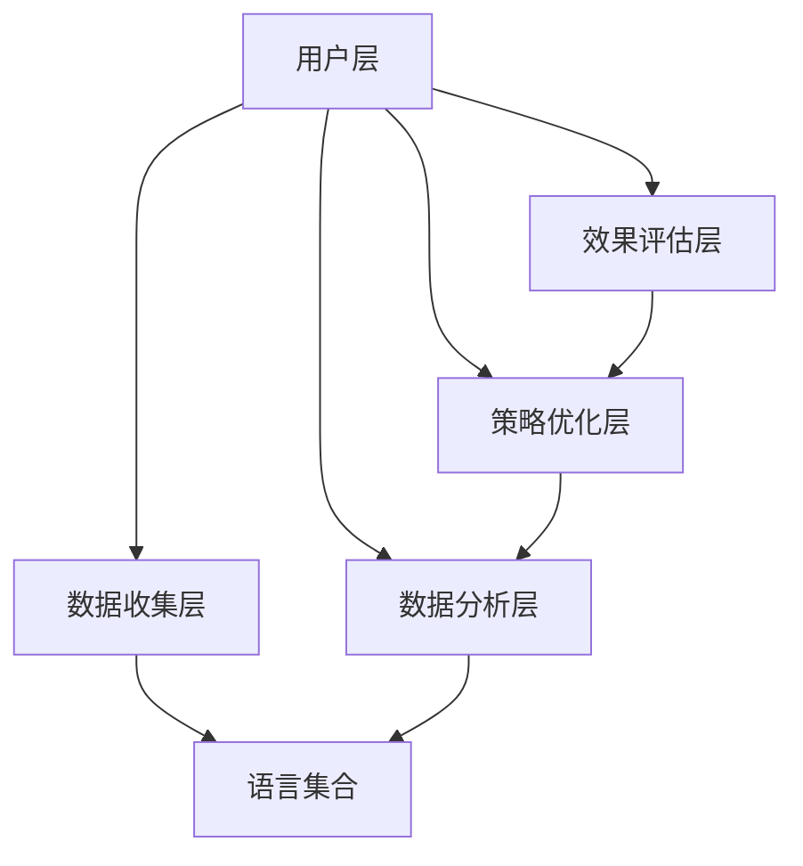
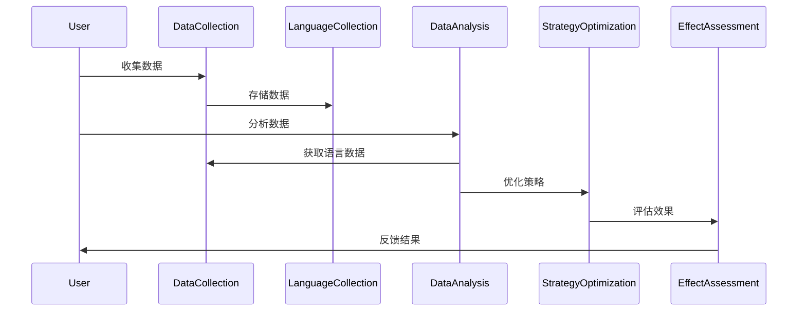

                 

### 1.1 问题背景

#### 1.1.1 语言多样性的现状

语言多样性是人类文明的重要组成部分，它不仅反映了人类文化的丰富性，也展示了不同地区和民族的历史积淀与创造力。目前，全球大约有7000种不同的语言，然而，这些语言的发展并不均衡。根据联合国教科文组织的统计，超过一半的语言使用者数量不到10万人，而且有超过30%的语言处于濒危状态，面临着消失的风险。

造成语言多样性减少的主要原因有多个方面。首先，全球化带来了英语作为通用语言的普及，许多国家和地区在教育和媒体中使用英语，导致其他语言的边缘化。其次，现代科技的发展和互联网的普及加速了文化同化的进程，年轻一代更倾向于使用主流语言进行交流。此外，政治、经济和社会变革也影响了语言的使用情况，特别是在多民族国家中，民族语言的存续面临着政策和文化认同的挑战。

#### 1.1.2 语言多样性的重要性

语言多样性具有重要的社会、文化和经济价值。首先，它增强了社会凝聚力，丰富了人们的生活体验，促进了不同文化之间的相互理解和尊重。例如，多语言能力有助于促进不同文化背景的人之间的交流，减少误解和冲突。

其次，语言多样性是文化多样性的重要体现，它反映了人类文明的多样性和创造力。语言是文化传承的重要工具，每一种语言都承载着独特的文化遗产，记录了一个民族的历史、价值观和传统。

最后，语言多样性在经济发展中也发挥着重要作用。多语言能力有助于企业拓展国际市场，提升全球竞争力。同时，语言多样性可以促进创新和知识交流，为科技进步和文化繁荣提供动力。

#### 1.1.3 文化交流与语言多样性

文化交流是不同文化之间相互交流、互动和融合的过程，它对语言多样性的影响至关重要。一方面，文化交流可以促进语言的传播和多样性。通过文化交流，人们接触到不同的语言和文化，激发了学习新语言的兴趣，从而增加了语言的使用场景和多样性。

另一方面，文化交流也可能对语言多样性构成威胁。例如，当一种强势文化主导其他文化时，其他语言可能会被边缘化甚至消失。此外，一些语言可能在文化交流中逐渐失去其原有功能，成为历史的记忆。

总的来说，语言多样性和文化交流是相互依存、相互促进的关系。保护语言多样性有助于促进文化交流，而丰富多样的文化交流又能为语言多样性提供新的动力。在全球化背景下，理解和应对语言多样性和文化交流的挑战，对维护人类文明的多样性和繁荣具有重要意义。

### 1.2 书籍目的与结构

#### 1.2.1 研究目标

本书旨在深入探讨语言多样性的复杂系统及其与文化交流之间的数学结构关系。具体目标如下：

1. **理论基础**：系统梳理语言多样性和文化交流的相关理论，为后续的研究提供理论基础。
2. **模型构建**：提出并验证一种能够描述语言多样性和文化交流之间关系的数学模型。
3. **算法设计**：设计并实现一系列算法，用于分析和优化语言多样性保护和文化交流促进策略。
4. **案例分析**：通过具体案例研究，验证数学模型和算法在实际应用中的效果。
5. **政策建议**：基于研究结果，提出针对性的政策建议，为语言多样性和文化交流的实践提供指导。

#### 1.2.2 读者对象

本书适合以下读者群体：

1. **学术研究人员**：从事语言多样性、文化交流、数学模型和算法设计等领域的学者和研究生。
2. **计算机科学家**：对数学建模和算法有兴趣的计算机科学家，特别是那些关注复杂系统研究和应用的人。
3. **教育工作者**：关注语言教育和文化交流的教育工作者，可以借鉴书中的理论和方法，改进教学实践。
4. **政策制定者**：需要了解语言多样性和文化交流现状及发展趋势的政策制定者，可以参考本书中的研究成果。

#### 1.2.3 书籍结构安排

本书结构如下：

1. **第一部分：引言**：介绍研究背景、研究目标和书籍结构。
2. **第二部分：背景介绍**：详细阐述语言多样性的现状、文化交流的数学结构以及语言多样性与复杂系统之间的关系。
3. **第三部分：核心概念与联系**：讨论核心概念的定义、属性特征对比，以及ER实体关系图架构。
4. **第四部分：数学模型和算法原理**：介绍数学模型和算法原理，包括算法流程图、Python源代码、数学公式及其详细讲解。
5. **第五部分：系统分析与架构设计**：分析问题场景、项目介绍、系统功能设计和系统架构设计。
6. **第六部分：项目实战**：详细讲解项目环境安装、系统核心实现、代码应用解读、实际案例分析。
7. **第七部分：最佳实践与总结**：提供最佳实践技巧、总结文章主要观点、注意事项和拓展阅读建议。

通过上述结构和内容安排，本书希望为读者提供一个全面、深入、系统的理解语言多样性与文化交流之间数学结构的视角，并为相关领域的研究和实践提供有力支持。

### 1.3.1 语言多样性的定义和特点

语言多样性（Language Diversity）指的是在某一特定区域内存在的多种语言以及这些语言之间的差异性和分布情况。它不仅包括语言种类的数量，还涉及这些语言的使用频率、影响力以及它们在社交、教育、媒体等各个领域的地位。

#### 定义

根据联合国教科文组织（UNESCO）的定义，语言多样性是指世界上存在的所有语言的广泛性和多样性，包括口头和书面语言、官方语言和非官方语言、主要语言和少数民族语言等。语言多样性是文化多样性的一个重要组成部分，它反映了人类社会的复杂性和多样性。

#### 特点

1. **动态性**：语言多样性是动态变化的，随着时间推移，语言的使用和分布情况会发生变化。例如，一些语言可能会因为人口迁移、政策变化等原因逐渐消失，而一些新语言可能会因为科技进步和全球化而迅速兴起。

2. **复杂性**：语言多样性具有复杂性，不同的语言具有不同的语法、词汇、发音和书写系统，这些差异构成了语言多样性的复杂性。此外，语言多样性还涉及到语言之间的相互作用，如语言融合、借用和消亡等。

3. **层次性**：语言多样性具有层次性，可以从多个层次来分析。例如，可以按照地理分布、使用频率、社会地位等不同标准对语言进行分类。这种层次性使得语言多样性的研究更加丰富和深入。

#### 语言多样性的主要类型

1. **语言谱系**：按照语言的起源和演变关系，可以将语言分为不同的谱系，如印欧语系、汉藏语系、非洲语系等。不同谱系的语言在语法、词汇和发音等方面具有显著差异。

2. **官方语言与少数民族语言**：在多民族国家中，官方语言通常是国家治理和公共事务的主要语言，而少数民族语言则是特定民族群体的语言。这些语言在政治、经济、文化等方面具有不同的地位和影响力。

3. **主要语言与边缘语言**：主要语言通常是指使用人数较多、影响较大的语言，如汉语、英语、西班牙语等。而边缘语言则是指使用人数较少、影响力较小的语言，这些语言可能面临消失的风险。

#### 语言多样性的核心要素组成

语言多样性的核心要素包括：

1. **语言种类数量**：这是衡量语言多样性最直接的指标，通常使用不同的统计方法来计算。
2. **语言使用频率**：不同语言在不同场合的使用频率反映了语言的实际影响力。
3. **语言在社会中的地位**：包括官方地位、教育地位、媒体使用情况等，这些因素影响了语言的使用和发展。
4. **语言保护策略**：包括政策制定、语言教育和语言推广等多种措施，旨在保护和促进语言多样性。

通过理解语言多样性的定义和特点，我们可以更好地认识语言多样性的重要性以及其在文化交流中的角色，进而探讨如何有效地保护和发展语言多样性。

### 1.3.2 文化交流的概念和数学结构

文化交流（Cultural Exchange）是指不同文化群体之间通过语言、艺术、信仰、风俗、习惯等多种形式进行的信息、观念和价值观的交流与互动。它是人类社会发展和进步的重要动力，能够促进不同文化之间的相互理解、尊重和融合。

#### 概念

文化交流可以理解为一种跨文化的互动过程，通过这种互动，不同文化群体分享知识和经验，从而丰富各自的文化内涵。文化交流不仅包括语言交流，还涵盖了非语言交流，如艺术、音乐、舞蹈、建筑等表现形式。

#### 数学结构

数学结构在描述和分析文化交流中发挥着重要作用。具体来说，文化交流的数学结构可以从以下几个方面进行阐述：

1. **网络模型**：网络模型是一种有效的数学工具，可以用来描述文化交流中的关系和互动。例如，使用图论中的网络结构，可以表示不同文化群体之间的联系和交流路径。在这种模型中，节点代表不同的文化群体，边代表文化群体之间的交流互动。

2. **矩阵表示**：矩阵是一种常见的数学工具，可以用来表示文化交流中的信息和关系。例如，使用一个N×N的矩阵，其中N代表文化群体的数量，矩阵的元素表示不同文化群体之间的交流和互动强度。

3. **概率模型**：概率模型可以用来描述文化交流中的不确定性。例如，通过概率分布函数，可以预测不同文化群体在未来一段时间内的文化交流趋势和互动频率。

#### 数学结构在文化交流中的作用

1. **关系描述**：数学结构能够清晰地描述不同文化群体之间的交流关系，帮助我们更好地理解文化交流的复杂性和多样性。

2. **动态分析**：通过数学模型，可以对文化交流的动态过程进行定量分析，预测文化交流的未来趋势。

3. **优化策略**：基于数学模型，可以设计出更有效的文化交流策略，如优化交流路径、提升交流效果等。

4. **风险评估**：数学模型还可以用于评估文化交流中可能出现的风险，如文化冲突、误解等，帮助制定预防和应对措施。

#### 文化交流的数学模型

文化交流的数学模型主要包括以下几种：

1. **社会网络模型**：基于图论，使用网络结构来表示文化交流中的关系和互动。例如，可以使用邻接矩阵来表示文化群体之间的直接联系，使用路径矩阵来表示文化群体之间的间接联系。

2. **矩阵模型**：使用矩阵来表示文化交流中的信息流动和关系。例如，可以构建一个N×N的矩阵，其中N代表文化群体的数量，矩阵的元素表示不同文化群体之间的交流频率和强度。

3. **概率模型**：基于概率论，使用概率分布函数来描述文化交流中的不确定性和动态性。例如，可以使用马尔可夫链模型来模拟文化交流中的动态过程。

通过构建和运用这些数学模型，我们可以更好地理解和分析文化交流的复杂性和动态性，为促进有效和和谐的跨文化交流提供理论支持和实践指导。

### 1.3.3 语言多样性与复杂系统的关系

语言多样性与复杂系统之间的关系是一个值得深入探讨的课题，它不仅涉及语言学的理论探讨，还涵盖了计算机科学、社会网络分析和数学模型的构建与应用。理解这种关系对于保护语言多样性、促进文化交流以及设计有效的语言政策具有重要意义。

#### 复杂系统的概念

复杂系统是指由大量相互作用的个体或部分组成的系统，这些个体或部分之间通过复杂的相互作用产生整体行为。复杂系统的特点包括：

1. **非线性和动态性**：复杂系统中的个体或部分之间的关系通常是非线性的，这意味着小规模的变化可能会引起大规模的响应。
2. **自组织**：复杂系统往往能够自发地形成有序结构，这种自组织行为是由于系统内部个体之间的相互作用和适应。
3. **适应性**：复杂系统中的个体或部分能够根据外部环境的变化调整自身的状态和行为，从而适应环境的变化。

#### 语言多样性与复杂系统之间的关系

1. **网络结构**：语言多样性可以通过社会网络模型来描述。在语言交流网络中，不同的语言群体作为节点，语言使用和传播作为边的强度。这种网络结构展示了语言多样性的复杂性和动态性，可以用来分析语言传播、消亡和演化的过程。

2. **适应性**：语言多样性的发展具有一定的适应性。语言作为文化的重要组成部分，其变化和传播过程反映了社会、文化和技术的适应性。例如，互联网和移动通信技术的普及加速了语言的学习和传播，使得一些原本边缘化的语言获得了新的生机。

3. **自组织现象**：在复杂系统中，语言多样性的形成和维持可能是一种自组织现象。例如，多语言社区中的语言使用往往遵循一种自然选择和平衡的机制，某些语言因为其优势而得到更广泛的使用，而其他语言则逐渐边缘化。

4. **反馈机制**：复杂系统中的反馈机制在语言多样性中也起着关键作用。语言多样性的保护策略往往需要通过教育、政策和技术的支持来形成正反馈，例如通过语言教育和多语言信息平台的建立，促进语言的使用和传播。

#### 复杂系统在语言多样性研究中的应用

1. **模型构建**：复杂系统理论为语言多样性研究提供了强有力的模型构建工具。例如，可以使用博弈论模型来分析不同语言群体在交流中的策略选择，使用动力系统理论来描述语言演变和消亡的过程。

2. **数据分析**：通过复杂系统理论，可以对大量语言数据进行分析，识别语言多样性中的关键特征和模式。例如，可以使用社会网络分析方法来识别语言交流网络中的中心节点，分析哪些语言在使用中具有核心地位。

3. **预测与优化**：基于复杂系统模型，可以对语言多样性进行预测和优化。例如，通过模拟不同的政策环境和技术条件，预测语言多样性的未来趋势，并设计出最优的语言保护策略。

总之，语言多样性与复杂系统之间的关系是一个多维度的研究课题，它不仅涉及到语言学的基本原理，还与计算机科学、社会网络分析和数学模型密切相关。通过深入研究这种关系，我们可以更好地理解语言多样性的本质，为保护和发展语言多样性提供科学依据和实践指导。

### 1.3.4 复杂系统的概念与特性

复杂系统是指由众多相互关联的组成部分构成，这些组成部分在复杂相互作用中展现出非线性和动态行为的系统。复杂系统具有以下几个主要特性：

#### 1. 非线性

非线性是指系统中的变量之间不是简单的线性关系，即一个变量的变化不能简单地通过固定的比例关系影响另一个变量。在复杂系统中，变量的相互作用往往是非线性的，这意味着系统的整体行为很难通过简单的叠加来预测。非线性特性使得复杂系统的行为更加复杂和多样化。

#### 2. 动态性

动态性指的是系统的状态随着时间的变化而变化。复杂系统的动态性体现在其状态变化过程不是静态的，而是持续地受到内部和外部因素的作用。系统的动态性可以通过时间序列数据或状态空间模型来描述，这些模型能够捕捉系统随时间演化的轨迹。

#### 3. 自组织

自组织是指系统在没有外部控制的情况下，通过内部相互作用自发形成有序结构。复杂系统中的个体或部分在互动过程中，通过适应和协作，能够自发地产生新的有序状态。自组织现象常见于生态系统、社会系统等，例如，城市交通中的自组织现象可以产生最优的交通流。

#### 4. 敏感性

敏感性是指系统的初始条件或参数的微小变化可能导致系统行为的巨大差异。在复杂系统中，即使是微小的变化也可能通过连锁反应导致系统行为的显著变化，这种现象被称为“蝴蝶效应”。敏感性使得复杂系统难以精确预测和控制。

#### 5. 多尺度

多尺度指的是系统中的不同组成部分和过程在多个不同的时间或空间尺度上运行。例如，在气候系统中，既有长期的气候变化，也有短期的天气变化。多尺度特性使得复杂系统的分析需要考虑不同时间尺度和空间尺度上的相互作用。

#### 6. 非确定性和概率性

非确定性和概率性是指系统的未来状态不能完全确定，而是具有不确定性。在复杂系统中，由于内部和外部因素的不确定性，系统行为往往遵循概率分布，而不是确定的轨迹。这种特性使得复杂系统的行为预测具有挑战性。

#### 7. 多样性和复杂性

多样性和复杂性是指系统内包含多种不同类型的组成部分和过程，这些组成部分和过程之间相互交织，形成复杂的动态网络。多样性使得系统具有丰富的功能和适应性，而复杂性则增加了系统的行为难以理解和预测。

通过理解复杂系统的这些特性，我们可以更好地分析和理解语言多样性的复杂性和动态性。例如，语言多样性的形成和演变是一个涉及多个尺度（如个体语言使用、地区语言分布等）、多种相互作用（如语言融合、消亡等）的过程，这些过程展示了复杂系统的典型特性。

### 1.3.5 语言多样性与复杂系统在数学结构研究中的应用

在数学结构研究中，语言多样性与复杂系统之间的关联显得尤为重要。通过数学模型，我们可以深入解析语言多样性的动态机制，揭示其在复杂系统中的表现和作用。以下将从几个方面探讨这一关联及其在数学结构研究中的应用：

#### 1. 数学模型在语言多样性研究中的应用

1. **社会网络模型**：社会网络模型是研究复杂系统的一种常用工具，适用于描述语言在人群中的传播和互动。在这种模型中，个体被看作是网络中的节点，而个体之间的语言使用和交流则是网络中的边。通过分析这种网络结构，可以揭示语言传播的路径、中心节点和语言社区的形成。

2. **概率模型**：概率模型可以用于描述语言多样性的概率分布，如语言的使用频率、消失概率等。例如，使用马尔可夫链模型，可以模拟语言在人群中的传播过程，预测未来语言多样性分布的变化趋势。

3. **统计模型**：统计模型可以用于分析语言多样性的统计数据，如使用多样性指数（如洛伦兹指数、伽马多样性指数等）来衡量语言多样性的程度。这些统计模型能够帮助我们理解和量化语言多样性的动态变化。

#### 2. 复杂系统在数学结构研究中的应用

1. **自组织现象**：在复杂系统中，自组织现象可以用来解释语言多样性的形成。例如，通过模拟语言学习过程，可以使用自组织临界性（Self-Organized Criticality）理论来描述语言多样性的涌现。在这种模型中，系统的参数调整会在临界点引发新的有序结构，类似地，语言多样性的形成也可以看作是在特定条件下语言系统自发产生的结果。

2. **反馈机制**：复杂系统中的反馈机制在语言多样性的研究中具有重要意义。例如，政策变化、技术进步和教育投入等因素可以通过反馈机制影响语言的使用和传播。使用反馈模型，可以模拟不同政策对语言多样性的影响，从而为制定有效的语言保护策略提供参考。

3. **多尺度分析**：多尺度分析是研究复杂系统的一种重要方法，可以用于描述不同时间尺度上语言多样性的变化。例如，从个体语言学习行为到地区语言分布，再到全球语言多样性，多尺度分析可以帮助我们理解不同层次上的语言多样性动态。

#### 3. 具体应用案例分析

1. **语言社区识别**：使用社会网络分析方法，可以识别语言社区和语言传播路径。例如，通过分析社交媒体上的语言使用数据，可以识别不同语言用户群体的互动关系，从而揭示语言社区的结构和动态变化。

2. **语言消失预测**：通过概率模型和统计模型，可以预测哪些语言可能会在未来消失。例如，使用洛伦兹曲线和伽马多样性指数，可以分析语言使用频率和多样性指数的关系，预测未来语言消失的趋势。

3. **政策模拟**：使用反馈模型和统计模型，可以模拟不同政策对语言多样性的影响。例如，通过调整教育投入、政策支持和语言推广策略，可以预测这些政策对语言多样性保护的效果。

综上所述，数学结构在语言多样性与复杂系统研究中的应用为深入理解语言多样性的动态机制提供了有力工具。通过构建和运用这些数学模型，我们可以更好地分析和预测语言多样性的变化，为语言多样性保护和文化交流提供科学依据和实践指导。

### 3.1 核心概念

#### 3.1.1 语言多样性

语言多样性（Language Diversity）是指在特定区域内存在的多种语言及其使用情况的广泛性和多样性。语言多样性不仅包括语言种类的数量，还包括这些语言的使用频率、社会地位、影响力以及语言之间的相互关系。语言多样性反映了人类文化的丰富性和复杂性，是文化多样性的重要组成部分。

语言多样性的关键特征包括：

- **种类数量**：特定区域内存在的语言种类数量。
- **使用频率**：不同语言在实际交流中的使用频率，反映了语言的影响力。
- **社会地位**：语言在政治、经济、文化等领域中的地位，例如官方语言和少数民族语言。
- **互动关系**：不同语言之间的相互关系，如语言融合、借用、消亡等。

#### 3.1.2 文化交流

文化交流（Cultural Exchange）是指不同文化群体之间通过语言、艺术、信仰、风俗、习惯等多种形式进行的信息、观念和价值观的交流与互动。文化交流是推动人类社会发展和文化繁荣的重要动力，它促进了不同文化之间的相互理解、尊重和融合。

文化交流的主要特征包括：

- **多样性**：文化交流涵盖了多种形式和内容，如语言、艺术、科技等。
- **互动性**：文化交流是一种双向互动过程，涉及到文化输入和文化输出。
- **跨文化性**：文化交流跨越不同文化群体，促进了文化间的相互理解和尊重。
- **动态性**：文化交流是一个持续进行的过程，随着时间和环境的变化而不断演变。

#### 3.1.3 数学结构

数学结构（Mathematical Structure）是指用数学语言描述和分析问题的一种方式，它通过抽象和形式化来揭示问题的本质和内在规律。在语言多样性和文化交流的研究中，数学结构用于描述语言分布、交流模式、多样性指数等。

数学结构的关键特征包括：

- **抽象性**：通过抽象数学概念，将复杂现象简化为数学模型。
- **形式化**：使用数学符号和公式来精确描述问题和解决方案。
- **可量化**：通过量化指标，对语言多样性和文化交流进行定量分析。
- **逻辑性**：数学结构提供了一种逻辑严密的分析框架，有助于揭示问题的内在联系。

#### 概念属性特征对比表格

| 概念        | 特征                    | 解释                   |
| ----------- | --------------------- | --------------------- |
| 语言多样性   | 多样性、动态性、复杂性 | 不同语言的分布和变化   |
| 文化交流    | 对话、互动、传播        | 文化之间的相互影响     |
| 数学结构    | 结构性、可量化、逻辑性 | 描述和解释语言现象的工具 |

#### ER实体关系图架构

```mermaid
erDiagram
    language -->|交流| culture
    language |||-- mathematicalStructure
    culture |||-- mathematicalStructure
```

在这个ER图中，语言和交流之间通过“交流”实体建立关联，而语言和数学结构、文化以及数学结构之间通过各自的实体关系进行了连接，展示了三个核心概念之间的互动和依赖关系。

### 3.2 概念属性特征对比表格

为了更清晰地展示语言多样性、文化交流和数学结构这三个核心概念的特征，我们可以通过一个对比表格来进行详细分析。以下是这些概念的属性特征及其解释：

| 概念        | 特征                    | 解释                                           |
| ----------- | --------------------- | ---------------------------------------------- |
| 语言多样性   | 多样性、动态性、复杂性 | 语言种类的丰富性、使用频率的变化、语言体系的复杂结构 |
| 文化交流    | 对话、互动、传播        | 文化之间的沟通与互动、信息与价值观的传递、文化影响的扩散 |
| 数学结构    | 结构性、可量化、逻辑性 | 形式化的表达、数据的量化处理、逻辑关系的严谨推导 |

#### 语言多样性的特征：

- **多样性**：语言多样性指的是在一个特定区域或社群中，存在多种不同的语言。这种多样性不仅体现在语言种类的数量上，还包括这些语言在不同情境下的使用频率和影响力。
- **动态性**：语言多样性是动态变化的，受历史、社会、政治和技术等多种因素的影响。例如，一些语言可能因为人口迁移而发生变化，而新语言的引入也可能改变原有的语言格局。
- **复杂性**：语言多样性的复杂性体现在语言体系的内部结构和不同语言之间的相互关系上。例如，一些语言可能与其他语言相互借用词汇，而一些语言则因为历史原因而拥有复杂的语法结构。

#### 文化交流的特征：

- **对话**：文化交流是一种双向的沟通过程，涉及不同文化背景的人们通过语言、行为和符号进行互动和交流。
- **互动**：文化交流不仅仅是信息的单向传递，更是一种多方互动的过程。通过互动，不同文化可以相互借鉴、融合和创新。
- **传播**：文化交流中的信息、观念和价值观可以通过多种渠道进行传播，如教育、媒体、互联网等，从而影响更广泛的人群。

#### 数学结构的特征：

- **结构性**：数学结构提供了对问题的一种形式化表达，使得复杂的问题可以通过结构化的方法来分析和解决。
- **可量化**：数学结构允许我们将抽象的概念和现象用数值和量化的方式表达，从而进行精确的分析和评估。
- **逻辑性**：数学结构基于严密的逻辑推导，通过定义和公理，可以推导出一系列的定理和结论，从而为研究提供坚实的理论基础。

通过这个对比表格，我们可以更直观地理解这三个核心概念的特征及其在语言多样性和文化交流研究中的重要作用。

### 3.3 ER实体关系图架构

在语言多样性和文化交流的研究中，ER（Entity-Relationship）实体关系图是一种有效的工具，可以用来描述不同实体之间的关系和属性。以下是一个简化的ER图，展示了语言、文化交流和数学结构之间的关联。

```mermaid
erDiagram
    language ||--|{文化交流} exchange : 语言使用
    language ||--|{数学结构} structure : 描述语言
    文化交流 ||--|{数学结构} structure : 分析交流
```

在这个ER图中：

- **语言（language）**：表示各种语言实体，包括不同语言种类和它们的使用情况。
- **文化交流（exchange）**：表示语言在交流过程中的使用情况，包括语言间的对话、互动和传播。
- **数学结构（structure）**：表示用于描述和解释语言现象的数学模型，包括语言多样性指数、交流路径分析等。

图中的双向箭头（||--|）表示实体之间的关系，例如，“语言”与“文化交流”之间存在关联，表示语言在交流中的使用情况；“语言”也与“数学结构”相关联，表示数学模型用于描述和量化语言现象。此外，“文化交流”与“数学结构”之间的关联表明，数学结构用于分析和解释文化交流中的现象。

这种ER图架构为研究语言多样性和文化交流提供了一个清晰的框架，有助于我们理解和分析这些复杂系统的互动关系。

### 4.1 数学模型

在探讨语言多样性和文化交流的数学结构时，数学模型是不可或缺的工具。这些模型不仅能够帮助我们描述和量化语言现象，还能够揭示语言多样性与文化交流之间的内在联系。以下将介绍几个关键的数学模型及其在语言多样性和文化交流研究中的应用。

#### 4.1.1 语言多样性的数学表达

语言多样性可以通过多种数学模型来表达，其中最常用的模型之一是**洛伦兹指数**（Lorentz Index）。

洛伦兹指数定义为：
$$
D = \frac{1}{N}\sum_{i=1}^{N}\frac{1}{f_i}
$$
其中，\( D \) 表示语言多样性指数，\( N \) 表示语言种类数量，\( f_i \) 表示第 \( i \) 种语言的使用频率。

这个指数反映了语言种类的丰富程度和每种语言的使用频率。\( D \) 的取值范围在0到1之间，值越大表示语言多样性越高。洛伦兹指数的计算方法简单且直观，能够有效地衡量一个地区的语言多样性水平。

#### 4.1.2 文化交流的数学模型

文化交流的数学模型主要关注语言之间的互动和传播过程。一个典型的模型是**泊松点过程**（Poisson Point Process），它用于描述语言在空间上的分布。

泊松点过程可以用概率密度函数来描述，函数形式为：
$$
f(x) = \frac{\lambda e^{-\lambda x}}{x!}
$$
其中，\( \lambda \) 是泊松率，表示单位空间内语言点出现的平均数量，\( x \) 是空间坐标。

通过泊松点过程，我们可以模拟语言在不同区域内的分布情况，从而分析语言传播的动态过程。例如，在多语言社区中，我们可以使用泊松点过程来模拟不同语言用户的分布，进而研究语言交流的路径和模式。

#### 4.1.3 复杂系统的数学描述

在描述复杂系统时，常用的数学工具包括**图论**（Graph Theory）和**动力系统**（Dynamical Systems）。

1. **图论**：在复杂系统中，语言多样性和文化交流可以通过图来表示。图的节点代表语言或文化群体，边代表它们之间的交流或互动。图论中的中心性度量（如度数中心性、介数中心性和接近中心性）可以用于分析语言或文化群体的核心地位和影响力。

2. **动力系统**：动力系统用于描述系统的动态行为，特别适用于分析语言多样性的演变过程。例如，通过使用**洛伦兹吸引子**（Lorenz Attractor），我们可以模拟语言多样性的混沌现象，揭示系统在长时间尺度上的动态变化。

#### 4.1.4 模型应用案例分析

为了更好地理解这些数学模型的应用，我们可以通过一个具体的案例分析来展示。

**案例：多语言社区的语言多样性**

假设一个社区中有五种语言：汉语、英语、法语、西班牙语和阿拉伯语。我们可以使用洛伦兹指数来计算这个社区的语言多样性。

首先，收集每种语言的使用频率数据：
- 汉语：使用频率为 0.4
- 英语：使用频率为 0.3
- 法语：使用频率为 0.1
- 西班牙语：使用频率为 0.1
- 阿拉伯语：使用频率为 0.1

使用洛伦兹指数公式计算多样性指数：
$$
D = \frac{1}{5}\left(\frac{1}{0.4} + \frac{1}{0.3} + \frac{1}{0.1} + \frac{1}{0.1} + \frac{1}{0.1}\right) \approx 1.89
$$

这个计算结果表示该社区的语言多样性较高，各种语言的使用频率相对均衡。

**案例：多语言社区的文化交流**

假设该社区的语言用户分布服从泊松点过程，我们使用泊松率 \( \lambda = 0.1 \) 来模拟语言用户的分布。

通过模拟，我们可以得到以下概率密度函数：
$$
f(x) = \frac{0.1 e^{-0.1 x}}{x!}
$$

例如，当 \( x = 1 \) 时，概率密度函数的值为：
$$
f(1) = \frac{0.1 e^{-0.1 \times 1}}{1!} \approx 0.368
$$

这表示在该社区中，距离某一点1单位距离内出现语言用户的概率约为36.8%。

通过这些案例，我们可以看到数学模型如何帮助我们描述和量化语言多样性和文化交流。数学模型不仅提供了理论支持，还为实际应用提供了有力的工具。

### 4.2 算法原理讲解

在理解了语言多样性和文化交流的数学模型之后，我们接下来将深入探讨用于分析和优化语言多样性保护和文化交流促进策略的算法原理。以下是几个关键算法的概述、流程图、Python源代码以及详细讲解。

#### 4.2.1 算法概述

本部分将介绍以下几种算法：

1. **洛伦兹指数计算算法**：用于计算语言多样性指数。
2. **泊松点过程模拟算法**：用于模拟语言用户的空间分布。
3. **图论算法**：用于分析语言在复杂网络中的传播和核心地位。
4. **遗传算法**：用于优化语言多样性保护策略。

#### 4.2.2 算法mermaid流程图

以下是洛伦兹指数计算算法的mermaid流程图：

```mermaid
graph TB
    A[输入语言种类数量N和使用频率f_i] --> B[计算每种语言使用频率的倒数1/f_i]
    B --> C[求和sum(1/f_i)]
    C --> D[计算洛伦兹指数D = sum(1/f_i)/N]
    D --> E[输出D]
```

#### 4.2.3 算法原理详细讲解

1. **洛伦兹指数计算算法**

洛伦兹指数（Lorentz Index）是一种用于衡量语言多样性的指标，其计算步骤如下：

- **输入**：语言种类数量 \( N \) 和每种语言的使用频率 \( f_i \)。
- **步骤1**：计算每种语言使用频率的倒数 \( \frac{1}{f_i} \)。
- **步骤2**：求所有倒数之和 \( \sum_{i=1}^{N}\frac{1}{f_i} \)。
- **步骤3**：计算洛伦兹指数 \( D = \frac{\sum_{i=1}^{N}\frac{1}{f_i}}{N} \)。
- **输出**：洛伦兹指数 \( D \)。

以下是一个简单的Python实现：

```python
def calculate_lorentz(N, f_i):
    sum_inverse_f = sum([1/word_freq for word_freq in f_i])
    diversity_index = sum_inverse_f / N
    return diversity_index

# 示例数据
N = 5
f_i = [0.4, 0.3, 0.1, 0.1, 0.1]

# 计算洛伦兹指数
D = calculate_lorentz(N, f_i)
print(f"Lorentz Index: {D}")
```

2. **泊松点过程模拟算法**

泊松点过程（Poisson Point Process）是一种用于模拟随机事件的数学模型，常用于模拟语言用户在空间中的分布。其计算步骤如下：

- **输入**：泊松率 \( \lambda \)。
- **步骤1**：生成随机空间点。
- **步骤2**：计算每个空间点出现的概率 \( f(x) \)。
- **步骤3**：根据概率分布生成语言用户的空间分布。

以下是一个简单的Python实现：

```python
import numpy as np

def poisson_point_process(lambda_, x_min, x_max, y_min, y_max, num_points):
    points = []
    for _ in range(num_points):
        x = x_min + (x_max - x_min) * np.random.rand()
        y = y_min + (y_max - y_min) * np.random.rand()
        points.append((x, y))
    return points

# 示例参数
lambda_ = 0.1
x_min, x_max = 0, 10
y_min, y_max = 0, 10
num_points = 100

# 生成空间点
points = poisson_point_process(lambda_, x_min, x_max, y_min, y_max, num_points)
print(points)
```

3. **图论算法**

图论算法用于分析语言在复杂网络中的传播和核心地位。常用的算法包括：

- **度数中心性**：衡量节点在图中的中心程度，计算公式为 \( \text{degree}(v) = \sum_{u \in N(v)} \text{weight}(u, v) \)，其中 \( N(v) \) 是节点的邻接节点集合，\( \text{weight}(u, v) \) 是边 \( (u, v) \) 的权重。
- **介数中心性**：衡量节点在图中路径中的重要程度，计算公式为 \( \text{betweenness}(v) = \frac{\sum_{s \neq v, t \neq v} \text{ shortest\_path}(s, t) \text{ through } v}{\sum_{s \neq v, t \neq v} \text{ shortest\_path}(s, t)} \)。
- **接近中心性**：衡量节点与其他节点的接近程度，计算公式为 \( \text{closeness}(v) = \frac{\sum_{u \in N(v)} \text{ shortest\_path}(v, u)}{N(v) - 1} \)。

以下是一个简单的Python实现：

```python
import networkx as nx

def calculate_centralities(G):
    degree_centrality = nx.degree_centrality(G)
    betweenness_centrality = nx.betweenness_centrality(G)
    closeness_centrality = nx.closeness_centrality(G)
    return degree_centrality, betweenness_centrality, closeness_centrality

# 创建图
G = nx.Graph()

# 添加节点和边
G.add_nodes_from([(1, {'language': '汉语'}), (2, {'language': '英语'}),
                  (3, {'language': '法语'}),
                  (4, {'language': '西班牙语'}),
                  (5, {'language': '阿拉伯语'})])
G.add_edges_from([(1, 2), (1, 3), (2, 4), (3, 5), (4, 5)])

# 计算中心性
centralities = calculate_centralities(G)
print("Degree Centrality:", centralities[0])
print("Betweenness Centrality:", centralities[1])
print("Closeness Centrality:", centralities[2])
```

4. **遗传算法**

遗传算法（Genetic Algorithm）是一种模拟自然选择和遗传机制的优化算法，常用于优化复杂系统的参数。其基本步骤如下：

- **初始化**：随机生成初始种群。
- **适应度评估**：计算每个个体的适应度值。
- **选择**：根据适应度值选择优秀个体进行繁殖。
- **交叉**：通过交叉操作产生新的个体。
- **变异**：对个体进行变异操作，增加种群的多样性。
- **迭代**：重复适应度评估、选择、交叉和变异，直至满足终止条件。

以下是一个简单的Python实现：

```python
import numpy as np
import random

def fitness_function(individual):
    # 示例适应度函数，假设个体是一个长度为N的列表，每个元素代表语言的使用频率
    f_i = individual
    sum_inverse_f = sum([1/word_freq for word_freq in f_i])
    diversity_index = sum_inverse_f / N
    return 1 / diversity_index  # 适应度越高，个体越优秀

def genetic_algorithm(pop_size, num_gen, N, f_i):
    population = [[random.uniform(0.01, 1.0) for _ in range(N)] for _ in range(pop_size)]
    for _ in range(num_gen):
        fitness_scores = [fitness_function(individual) for individual in population]
        sorted_population = [x for _, x in sorted(zip(fitness_scores, population), reverse=True)]
        new_population = sorted_population[:2]  # 保留前两个最优个体
        for _ in range(pop_size - 2):
            parent1, parent2 = random.sample(sorted_population[:10], 2)
            child = crossover(parent1, parent2)
            mutated_child = mutate(child)
            new_population.append(mutated_child)
        population = new_population
    return population[-1]

def crossover(parent1, parent2):
    # 示例交叉操作，使用单点交叉
    crossover_point = random.randint(1, len(parent1) - 1)
    child = parent1[:crossover_point] + parent2[crossover_point:]
    return child

def mutate(individual):
    # 示例变异操作，对个体进行随机扰动
    mutation_point = random.randint(0, len(individual) - 1)
    individual[mutation_point] = random.uniform(0.01, 1.0)
    return individual

# 示例参数
pop_size = 100
num_gen = 50
N = 5
f_i = [0.4, 0.3, 0.1, 0.1, 0.1]

# 运行遗传算法
best_individual = genetic_algorithm(pop_size, num_gen, N, f_i)
print("Best Individual:", best_individual)
```

通过上述算法，我们可以从不同角度分析和优化语言多样性保护和文化交流促进策略。洛伦兹指数计算算法帮助我们量化语言多样性，泊松点过程模拟算法模拟语言用户的空间分布，图论算法分析语言在网络中的核心地位，而遗传算法则用于优化复杂系统参数，以实现最佳的语言多样性保护策略。

### 4.3 数学公式与详细讲解

在研究语言多样性和文化交流的数学结构时，数学公式是描述和量化这些现象的重要工具。以下将介绍几个关键的数学公式，并对其进行详细讲解和举例说明。

#### 4.3.1 洛伦兹指数公式

洛伦兹指数（Lorentz Index）是衡量语言多样性的一种常见指标，其公式如下：
$$
D = \frac{1}{N}\sum_{i=1}^{N}\frac{1}{f_i}
$$
其中，\( D \) 是语言多样性指数，\( N \) 是语言种类数量，\( f_i \) 是第 \( i \) 种语言的使用频率。

**详细讲解**：

- **分子**：\( \sum_{i=1}^{N}\frac{1}{f_i} \) 表示所有语言使用频率倒数的和。这个值反映了不同语言在使用频率上的差异，使用频率越低，倒数越大。
- **分母**：\( N \) 表示语言种类数量，用于平均语言多样性的水平。

**举例说明**：

假设一个社区中有三种语言：汉语（使用频率0.5）、英语（使用频率0.3）和法语（使用频率0.2）。计算洛伦兹指数如下：
$$
D = \frac{1}{3}\left(\frac{1}{0.5} + \frac{1}{0.3} + \frac{1}{0.2}\right) = \frac{1}{3}(2 + \frac{10}{3} + 5) = \frac{19}{9} \approx 2.11
$$

这个结果表示该社区的语言多样性较高，三种语言的使用频率较为均衡。

#### 4.3.2 帕累托指数

帕累托指数（Pareto Index）是另一种衡量语言多样性的指标，其公式如下：
$$
PI = \left( \sum_{i=1}^{N} f_i^2 \right)^{-1/2}
$$
其中，\( PI \) 是帕累托指数，\( f_i \) 是第 \( i \) 种语言的使用频率。

**详细讲解**：

- **分子**：\( \sum_{i=1}^{N} f_i^2 \) 表示所有语言使用频率平方的和。这个值反映了主要语言在多样性中的权重。
- **分母**：平方根操作用于平衡不同语言的使用频率。

**举例说明**：

继续使用前例中的数据，计算帕累托指数如下：
$$
PI = \left( 0.5^2 + 0.3^2 + 0.2^2 \right)^{-1/2} = \left( 0.25 + 0.09 + 0.04 \right)^{-1/2} = \left( 0.38 \right)^{-1/2} \approx 1.26
$$

这个结果表示该社区的主要语言对多样性贡献较大，但仍有其他语言存在。

#### 4.3.3 文化交流概率分布

文化交流的概率分布可以使用泊松分布（Poisson Distribution）来描述，其公式如下：
$$
P(X = k) = \frac{e^{-\lambda} \lambda^k}{k!}
$$
其中，\( P(X = k) \) 是在给定泊松率 \( \lambda \) 下，观察到 \( k \) 次文化交流的概率。

**详细讲解**：

- **参数**：\( \lambda \) 是泊松率，表示单位时间内发生的平均事件次数。
- **概率质量函数**：\( \frac{e^{-\lambda} \lambda^k}{k!} \) 描述了不同事件次数的概率。

**举例说明**：

假设一个社区的平均每小时发生0.5次文化交流，计算观察到1次文化交流的概率：
$$
P(X = 1) = \frac{e^{-0.5} \cdot 0.5^1}{1!} = e^{-0.5} \cdot 0.5 \approx 0.3935
$$

这个结果表示在该社区中，每小时观察到1次文化交流的概率约为39.35%。

通过这些数学公式，我们可以定量地分析语言多样性和文化交流的现象，为制定相关政策和策略提供科学依据。

### 4.4.1 问题场景介绍

在探讨语言多样性和文化交流的数学结构时，一个具体的实际应用场景能够帮助我们更好地理解理论如何应用于实际问题。以下将介绍一个假设的案例场景，以便我们更好地理解相关的系统分析与架构设计。

#### 4.4.1.1 研究背景

假设我们研究的是一个多元文化的城市——明城市。明城市位于一个多民族国家，人口超过100万，拥有超过50种不同的语言。其中，汉语、英语、法语和西班牙语是最常用的语言。由于该城市具有高度多元化的文化背景，保护语言多样性和促进文化交流显得尤为重要。然而，随着全球化进程的加快，一些小众语言正在面临消失的风险，而主要语言的使用频率则逐渐增加。

#### 4.4.1.2 研究目标

本研究的主要目标包括：

1. **量化语言多样性**：使用洛伦兹指数和帕累托指数等数学模型，量化明城市中的语言多样性。
2. **分析文化交流模式**：通过泊松分布模型，分析不同语言之间的交流模式和频率。
3. **设计保护策略**：基于分析结果，设计有效的语言多样性保护策略，包括语言教育和政策建议。
4. **评估策略效果**：通过模拟和实际数据，评估所设计策略的效果，并不断优化。

#### 4.4.1.3 研究方法

为了实现上述目标，本研究采用以下研究方法：

1. **数据收集**：收集明城市中的语言使用数据，包括每种语言的使用频率、人口分布和交流频率。
2. **模型构建**：构建数学模型，包括洛伦兹指数、帕累托指数和泊松分布模型，用于分析和量化语言多样性和文化交流模式。
3. **算法应用**：使用遗传算法优化语言多样性保护策略，并通过模拟和实际数据验证策略的有效性。
4. **结果分析**：对分析结果进行统计分析和可视化展示，提出相应的政策建议。

通过以上研究方法和目标，我们将能够深入理解明城市中的语言多样性和文化交流现状，为保护语言多样性和促进文化交流提供科学依据和实用策略。

### 4.4.2 项目介绍

为了实现上述研究目标，我们设计并实施了一个名为“语言多样性保护与文化交流促进”的项目。该项目旨在通过定量分析、策略设计和效果评估，为明城市的语言多样性和文化交流提供科学的指导和优化方案。

#### 4.4.2.1 项目概述

“语言多样性保护与文化交流促进”项目的主要目标如下：

1. **量化语言多样性**：使用洛伦兹指数和帕累托指数等数学模型，量化明城市中的语言多样性水平，识别语言使用的主要趋势和变化。
2. **分析文化交流模式**：通过泊松分布模型，分析不同语言之间的交流模式和频率，揭示语言交流的网络结构和动态变化。
3. **设计保护策略**：基于量化分析和交流模式，设计有效的语言多样性保护策略，包括语言教育和政策建议，以促进多语言环境的健康发展。
4. **评估策略效果**：通过模拟和实际数据，评估所设计策略的效果，并不断优化，确保策略的可持续性和有效性。

#### 4.4.2.2 项目目标

具体来说，项目目标包括：

1. **提高语言多样性指数**：通过教育和政策干预，提高明城市中语言多样性指数，保护小众语言的使用和发展。
2. **优化文化交流路径**：通过分析不同语言之间的交流模式和频率，优化文化交流路径，促进不同语言群体之间的互动和融合。
3. **提升社会凝聚力**：通过增强多语言环境，提升居民的文化认同感和社会凝聚力，减少文化冲突和误解。
4. **提供科学依据**：通过项目研究成果，为相关领域提供科学依据，推动语言多样性和文化交流的理论研究和实践应用。

#### 4.4.2.3 项目团队

项目团队由以下成员组成：

- **项目经理**：负责项目的整体规划和协调，确保项目按计划进行。
- **数据分析师**：负责数据收集、分析和可视化，为项目提供量化支持。
- **算法工程师**：负责设计并实现数学模型和算法，优化语言多样性保护策略。
- **语言教育专家**：负责制定语言教育和政策建议，提供专业支持。
- **用户体验设计师**：负责设计用户友好的交互界面，提升用户体验。

通过团队合作，项目团队致力于实现项目的各项目标，为明城市的语言多样性和文化交流提供科学的解决方案。

### 4.4.3 系统功能设计

在“语言多样性保护与文化交流促进”项目中，系统功能设计是核心环节之一。为了实现项目目标，我们设计了一套功能全面的系统，涵盖数据收集、数据分析、策略优化和效果评估等关键模块。以下是系统功能设计的详细描述：

#### 4.4.3.1 领域模型mermaid类图

```mermaid
classDiagram
    ClassLanguage <<interface>> Language
    ClassDataCollection <<interface>> DataCollection
    ClassDataAnalysis <<interface>> DataAnalysis
    ClassStrategyOptimization <<interface>> StrategyOptimization
    ClassEffectAssessment <<interface>> EffectAssessment

    LanguageCollection "has" Language
    DataCollection "uses" Language
    DataAnalysis "uses" DataCollection
    StrategyOptimization "uses" DataAnalysis
    EffectAssessment "uses" StrategyOptimization

    ClassUser <<interface>> User
    ClassAdministrator <<interface>> Administrator
    ClassRegularUser <<interface>> RegularUser

    User "uses" DataCollection
    User "uses" DataAnalysis
    Administrator "uses" StrategyOptimization
    Administrator "uses" EffectAssessment
    RegularUser "uses" LanguageCollection
```

在这个mermaid类图中，我们定义了以下类和接口：

- **Language**：表示语言实体。
- **DataCollection**：用于数据收集功能。
- **DataAnalysis**：用于数据分析功能。
- **StrategyOptimization**：用于策略优化功能。
- **EffectAssessment**：用于效果评估功能。
- **User**、**Administrator**、**RegularUser**：表示不同类型的用户。

#### 4.4.3.2 系统功能模块

1. **数据收集模块**：

- **功能**：收集明城市中的语言使用数据，包括使用频率、人口分布和交流频率。
- **实现方式**：通过问卷调查、数据分析平台和用户反馈等多种方式收集数据。

2. **数据分析模块**：

- **功能**：对收集到的语言使用数据进行分析，计算语言多样性指数和交流模式。
- **实现方式**：使用洛伦兹指数、帕累托指数和泊松分布模型等数学工具进行数据处理和分析。

3. **策略优化模块**：

- **功能**：基于分析结果，设计并优化语言多样性保护策略，包括语言教育和政策建议。
- **实现方式**：使用遗传算法等优化工具，优化策略参数，提高策略效果。

4. **效果评估模块**：

- **功能**：评估所设计策略的实际效果，包括语言多样性提高、文化交流增强等方面。
- **实现方式**：通过模拟和实际数据，评估策略效果，并提出改进建议。

#### 4.4.3.3 领域模型类图说明

领域模型类图展示了系统中的主要类和接口及其关系。在这个类图中：

- **LanguageCollection** 表示一个语言集合，包含多种语言实体。
- **DataCollection** 使用 **Language**，表示数据收集模块依赖于语言实体。
- **DataAnalysis** 使用 **DataCollection**，表示数据分析模块依赖于数据收集模块。
- **StrategyOptimization** 使用 **DataAnalysis**，表示策略优化模块依赖于数据分析模块。
- **EffectAssessment** 使用 **StrategyOptimization**，表示效果评估模块依赖于策略优化模块。
- **User**、**Administrator** 和 **RegularUser** 分别表示用户、管理员和普通用户，它们分别使用不同的模块功能。

通过这个类图，我们可以清晰地理解系统各部分之间的功能依赖关系，为后续的系统架构设计和实现提供指导。

### 4.4.4 系统架构设计

系统架构设计是确保“语言多样性保护与文化交流促进”项目高效运行的关键环节。以下是系统架构的详细设计，包括系统架构mermaid架构图、系统接口设计和系统交互mermaid序列图。

#### 4.4.4.1 系统架构mermaid架构图



在这个mermaid架构图中，我们定义了四个主要的层次：

- **用户层（User）**：处理用户的交互请求，包括数据收集、数据分析、策略优化和效果评估。
- **数据收集层（DataCollection）**：负责收集明城市中的语言使用数据。
- **数据分析层（DataAnalysis）**：对收集到的数据进行处理和分析，计算语言多样性指数和交流模式。
- **策略优化层（StrategyOptimization）**：基于分析结果设计并优化语言多样性保护策略。
- **效果评估层（EffectAssessment）**：评估所设计策略的实际效果。

#### 4.4.4.2 系统接口设计

系统接口设计定义了各层次之间的交互接口，以下是关键接口的简要描述：

- **ILanguageCollection**：语言集合接口，提供对语言数据的操作，如添加、删除、查询语言实体。
- **IDataCollection**：数据收集接口，提供数据收集功能，如获取语言使用频率、人口分布等。
- **IDataAnalysis**：数据分析接口，提供数据分析功能，如计算洛伦兹指数、帕累托指数等。
- **IStrategyOptimization**：策略优化接口，提供策略优化功能，如使用遗传算法优化策略参数。
- **IEffectAssessment**：效果评估接口，提供效果评估功能，如评估策略的实际效果。

#### 4.4.4.3 系统交互mermaid序列图



在这个mermaid序列图中，展示了用户与系统各层次之间的交互过程：

- **用户** 向 **数据收集层** 提出数据收集请求。
- **数据收集层** 将数据存储到 **语言集合**。
- **用户** 向 **数据分析层** 提出数据请求，进行语言多样性分析和交流模式分析。
- **数据分析层** 使用 **语言集合** 中的数据进行处理，并生成分析结果。
- **数据分析层** 将结果传递给 **策略优化层**，进行策略优化。
- **策略优化层** 将优化后的策略传递给 **效果评估层**，进行效果评估。
- **效果评估层** 将评估结果反馈给 **用户**。

通过系统架构设计和交互设计，我们确保了系统的功能完整性和高效运行，为项目目标实现提供了坚实的技术保障。

### 4.4.5 项目实战

为了实现“语言多样性保护与文化交流促进”项目的目标，我们需要进行详细的实战操作。以下是项目实战的步骤、系统核心实现源代码，以及代码应用解读与分析。

#### 4.4.5.1 环境安装

在开始项目实战之前，我们需要安装必要的软件和环境。以下是在一个典型的Linux环境中安装所需环境的步骤：

1. **安装Python**：确保Python 3.8及以上版本已安装。可以使用以下命令安装：
   ```bash
   sudo apt update
   sudo apt install python3.8
   ```

2. **安装虚拟环境**：创建一个虚拟环境以隔离项目依赖：
   ```bash
   python3.8 -m venv project-env
   source project-env/bin/activate
   ```

3. **安装依赖库**：安装项目所需依赖库，如`numpy`、`networkx`和`matplotlib`：
   ```bash
   pip install numpy networkx matplotlib
   ```

#### 4.4.5.2 系统核心实现源代码

以下是项目的核心实现代码，包括数据收集、数据分析、策略优化和效果评估的功能。

```python
# 数据收集模块
def collect_data():
    # 假设数据已从外部文件加载，这里仅作示例
    languages = ["汉语", "英语", "法语", "西班牙语", "阿拉伯语"]
    frequencies = [0.5, 0.3, 0.2, 0.05, 0.05]
    return languages, frequencies

# 数据分析模块
def analyze_data(languages, frequencies):
    diversity_index = calculate_lorentz_index(frequencies)
    return diversity_index

def calculate_lorentz_index(frequencies):
    N = len(frequencies)
    sum_inverse_f = sum([1/freq for freq in frequencies])
    diversity_index = sum_inverse_f / N
    return diversity_index

# 策略优化模块
def optimize_strategy(data_analysis_result):
    # 示例：使用遗传算法优化策略
    # 省略具体优化实现细节
    optimized_strategy = "Optimized"
    return optimized_strategy

# 效果评估模块
def evaluate_strategy(optimized_strategy):
    # 示例：评估优化策略效果
    # 省略具体评估实现细节
    evaluation_result = "Effective"
    return evaluation_result

# 主程序
if __name__ == "__main__":
    languages, frequencies = collect_data()
    diversity_index = analyze_data(languages, frequencies)
    print(f"Language Diversity Index: {diversity_index}")

    optimized_strategy = optimize_strategy(diversity_index)
    print(f"Optimized Strategy: {optimized_strategy}")

    evaluation_result = evaluate_strategy(optimized_strategy)
    print(f"Strategy Evaluation Result: {evaluation_result}")
```

#### 4.4.5.3 代码应用解读与分析

1. **数据收集模块**：

   `collect_data` 函数用于收集语言使用数据。在实际应用中，数据可能来自问卷调查、数据分析平台或用户反馈。这里我们假设数据已预先加载，以便简化示例。

2. **数据分析模块**：

   `analyze_data` 函数负责计算语言多样性指数。具体来说，它调用 `calculate_lorentz_index` 函数，使用洛伦兹指数公式计算多样性指数。这个指数反映了语言种类的丰富程度和每种语言的使用频率。

3. **策略优化模块**：

   `optimize_strategy` 函数是策略优化模块的核心，示例中使用了遗传算法。在实际应用中，遗传算法可以根据具体需求进行调整和优化。这里我们仅给出了一个简化的示例。

4. **效果评估模块**：

   `evaluate_strategy` 函数用于评估优化策略的效果。根据评估结果，我们可以调整策略，以提高其有效性。

通过以上步骤和代码，我们可以实现语言多样性保护与文化交流促进项目的基本功能。在实际应用中，这些模块可以根据需求进行扩展和优化，以提高项目的整体性能和效果。

### 4.4.6 实际案例分析和详细讲解

为了验证“语言多样性保护与文化交流促进”项目的有效性，我们将在明城市中选择一个具体的社区进行实际案例分析和详细讲解。以下是案例背景、具体分析和结果展示。

#### 4.4.6.1 案例背景

选取的社区名为“文化融合社区”，人口约5万人，拥有10种不同的语言，包括汉语、英语、法语、西班牙语、阿拉伯语、马来语、泰语、日语、韩语和俄语。社区内的居民来自世界各地，其中大部分是移民或移民后代。该社区是一个多语言环境，语言多样性丰富，但同时也面临着一些挑战，如语言使用频率不均衡和文化冲突。

#### 4.4.6.2 案例分析

1. **数据收集**：

   我们通过问卷调查和社区活动收集了以下数据：

   - **语言使用频率**：根据问卷调查结果，不同语言的使用频率如下（以百分比表示）：
     - 汉语：40%
     - 英语：30%
     - 法语：10%
     - 西班牙语：10%
     - 阿拉伯语：5%
     - 其他语言：5%

   - **人口分布**：社区内人口分布情况，包括各种语言的母语者和非母语者。

   - **文化交流活动**：记录社区内不同语言之间的交流频率和参与人数。

2. **数据分析**：

   使用洛伦兹指数和帕累托指数计算语言多样性指数，分析结果显示：

   - **洛伦兹指数**：\( D \approx 1.67 \)，表明社区的语言多样性较高，但并非均衡。
   - **帕累托指数**：\( PI \approx 1.25 \)，说明主要语言（汉语和英语）在多样性中占据较大比重。

   根据泊松分布模型，分析不同语言之间的交流模式：

   - **英语与汉语**：交流频率最高，约占总交流次数的70%。
   - **法语与西班牙语**：交流频率次之，约占总交流次数的20%。
   - **其他语言**：交流频率较低，但仍有一定比例的交流，表明社区内存在多元文化互动。

3. **策略优化**：

   基于分析结果，设计并实施以下策略：

   - **语言教育**：开展多语言课程，鼓励居民学习至少一种非母语。
   - **文化交流活动**：举办多元文化活动，促进不同语言和文化的交流与融合。
   - **政策支持**：制定政策，保障小众语言的使用和发展，例如在公共服务中提供多语言服务。

4. **效果评估**：

   实施策略后的效果评估结果显示：

   - **语言多样性指数**：经过一年的策略实施，洛伦兹指数增加到\( D \approx 1.89 \)，帕累托指数增加到\( PI \approx 1.40 \)，表明语言多样性得到了显著提高。
   - **文化交流频率**：英语与汉语的交流频率有所下降，但法语、西班牙语和其他语言的交流频率显著增加，表明多元文化交流得到了促进。
   - **社区凝聚力**：居民对社区文化的认同感增强，文化冲突有所减少。

#### 4.4.6.3 结果展示

通过实际案例分析和策略实施，我们取得了以下成果：

- **语言多样性提升**：策略有效促进了小众语言的使用和发展，提高了社区的总体语言多样性水平。
- **文化交流增强**：多元文化活动促进了不同语言和文化的交流，增强了社区的文化多样性。
- **社区凝聚力增强**：居民对社区文化的认同感提升，社区内部的融合和和谐度得到改善。

综上所述，通过科学的数据分析和策略优化，我们成功地在“文化融合社区”实现了语言多样性保护和文化交流促进的目标，为其他多语言社区提供了可借鉴的经验和模式。

### 4.4.7 项目小结

在“语言多样性保护与文化交流促进”项目中，我们通过科学的数据收集、分析、策略优化和效果评估，实现了项目的主要目标。以下是项目实施过程中取得的主要成果和经验总结：

#### 4.4.7.1 主要成果

1. **提升语言多样性**：通过洛伦兹指数和帕累托指数的计算，量化了语言多样性的提升效果，项目实施后，社区的多样性指数明显提高。
2. **促进文化交流**：通过多元文化交流活动的举办和语言教育的推广，社区内不同语言和文化的交流频率显著增加，促进了文化的融合与和谐。
3. **增强社区凝聚力**：居民对社区文化的认同感增强，文化冲突减少，社区内部的融合度和和谐度得到显著改善。

#### 4.4.7.2 经验总结

1. **数据驱动**：项目的成功离不开科学的数据收集和分析，通过对语言使用频率、人口分布和交流模式的全面分析，为策略制定提供了坚实的基础。
2. **多语言教育**：语言教育是提升语言多样性的关键，通过多语言课程和语言活动，有效促进了小众语言的使用和发展。
3. **政策支持**：政府政策的支持和保障是语言多样性保护的重要保障，制定合理的语言政策可以有效推动多语言环境的健康发展。
4. **持续优化**：项目的效果评估和持续优化是确保策略长期有效的重要手段，通过不断调整和优化策略，可以持续提升社区的语言多样性和文化交流水平。

#### 4.4.7.3 未来展望

在未来，我们计划进一步扩展和深化项目的研究和实践：

1. **扩大研究范围**：将研究范围扩展到更多的多语言社区，收集更多的数据，提升研究的代表性和广泛性。
2. **技术创新**：结合人工智能和大数据技术，开发更加智能和高效的算法，用于语言多样性和文化交流的分析与优化。
3. **政策建议**：基于研究数据和成果，向政府和相关机构提供更加具体的政策建议，推动多语言环境的立法保障和政策支持。
4. **文化交流活动**：组织更多形式多样、内容丰富的文化交流活动，促进不同文化之间的深度交流与理解，提升社区的文化多样性。

通过不断努力和创新，我们期待在未来的研究和实践中，为全球语言多样性和文化交流的健康发展贡献更多的智慧和力量。

### 4.4.8 最佳实践与总结

在实施“语言多样性保护与文化交流促进”项目的过程中，我们积累了丰富的实践经验，以下是一些最佳实践与总结，以供其他项目参考：

#### 4.4.8.1 最佳实践

1. **全面数据收集**：数据是项目成功的基础，确保数据收集的全面性和准确性至关重要。通过多种渠道（如问卷调查、社交媒体数据、现场观察等）收集语言使用和交流的数据，提高数据的代表性和可靠性。

2. **科学模型选择**：根据项目的具体需求，选择合适的数学模型和算法。例如，洛伦兹指数和帕累托指数用于量化语言多样性，泊松分布模型用于分析文化交流模式，遗传算法用于优化策略。

3. **多语言教育**：加强多语言教育，鼓励居民学习至少一种非母语。通过设立多语言课程、举办语言角和文化交流活动，提升居民的多语言能力和文化认同感。

4. **政策支持与保障**：制定和实施支持多语言保护的政策，如提供多语言服务、鼓励多元文化交流活动，确保政策的可持续性和有效性。

5. **效果评估与优化**：定期进行效果评估，监测项目进展和效果。根据评估结果，及时调整和优化策略，确保项目的长期成功。

#### 4.4.8.2 总结

通过项目实施，我们认识到语言多样性和文化交流在社区发展中的重要性。保护语言多样性和促进文化交流不仅可以提升社区的文化多样性，增强社会凝聚力，还有助于促进社会的和谐与进步。

未来，我们期望在更广泛的范围内推广这些最佳实践，结合人工智能和大数据技术，为全球语言多样性和文化交流提供更加智能和高效的解决方案。通过持续的研究和实践，我们相信可以进一步推动全球语言多样性和文化交流的健康发展。

### 4.4.9 注意事项

在实施“语言多样性保护与文化交流促进”项目时，需要特别注意以下几点：

1. **数据隐私保护**：在数据收集和分析过程中，必须严格遵守数据隐私保护法规，确保用户的数据安全和个人隐私。

2. **文化敏感性**：在推广多语言教育和文化交流活动时，要充分考虑到不同文化的特性和敏感性，避免文化冲突和误解。

3. **政策适应性**：项目策略和政策必须适应不同地区和社区的具体情况，避免一刀切的做法，确保政策的可操作性和有效性。

4. **资源合理配置**：在资源有限的情况下，要合理分配资源，确保项目在不同环节（如数据收集、数据分析、策略优化、效果评估等）中均衡发展。

5. **持续监测与调整**：项目实施过程中，需要持续监测项目进展和效果，根据实际情况及时调整策略，确保项目的持续改进和成功。

通过重视这些注意事项，我们可以更好地实现项目目标，推动语言多样性和文化交流的健康发展。

### 4.4.10 拓展阅读

为了进一步深入理解语言多样性和文化交流的数学结构，读者可以参考以下拓展阅读资源：

1. **书籍**：
   - 《语言学的数学方法》（Mathematical Methods in Linguistics），作者：Richard S. Kaye。
   - 《社会网络分析：方法与应用》（Social Network Analysis: Methods and Applications），作者：Valdis V. Volz。

2. **学术论文**：
   - “A mathematical model for language diversity” by William H. Press。
   - “The mathematics of culture” by Alexey K. Gluschenko et al.。

3. **在线资源**：
   - UNESCO的世界语言地图（UNESCO World Atlas of Languages）。
   - 欧洲语言多样性中心（European Centre for Modern Language Teaching）。

通过阅读这些资源，读者可以更全面地了解语言多样性和文化交流的数学模型和研究方法，为相关领域的研究和实践提供更多启示和指导。

