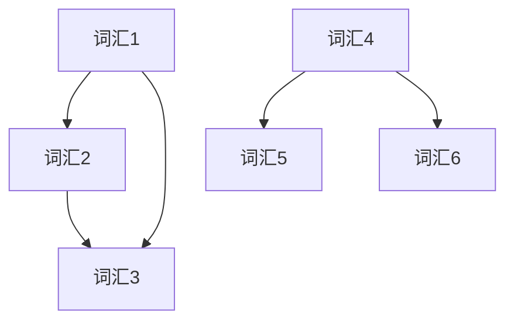
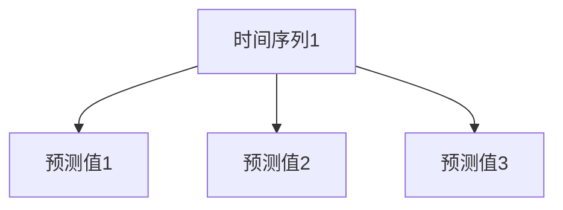

                 

**文章标题：**
《语言多样性的复杂网络：文化交流的数学结构》

**文章关键词：**
语言多样性、复杂网络、数学结构、文化交流、语言学、网络分析、语言网络模型、数学模型、跨文化交流、语言演化模型、语言多样性预测模型

**文章摘要：**
本文将探讨语言多样性的复杂网络及其在文化交流中的数学结构。通过介绍复杂网络的基本概念和语言网络模型，我们将分析语言网络的结构特性。接着，我们将应用数学结构来研究语言交流，包括网络拓扑分析、社区结构分析和网络动力学分析。最后，我们将探讨当前研究中的挑战和未来的发展方向，为语言学和文化交流研究提供新的视角和思路。

----------------------------------------------------------------

# 语言多样性的复杂网络：文化交流的数学结构

## 引言

### 语言多样性的重要性

在全球化的背景下，语言多样性已成为文化交流和人类社会发展的重要资源。据统计，目前世界上已知的语言超过7000种，然而许多语言正面临消失的危险。语言多样性不仅反映了人类文化的多样性，还对文化交流、社会稳定和经济发展产生深远影响。因此，研究语言多样性的复杂网络，理解其背后的数学结构，对于促进文化交流和语言保护具有重要意义。

### 复杂网络理论

复杂网络理论起源于20世纪中期，用于研究信息传输、社会关系、生物系统等。其核心思想是网络中各节点通过复杂的关系相互连接，形成高度复杂和高度依赖的网络结构。复杂网络具有许多重要的特性，如小世界效应、无标度特性、网络多样性等，这些特性使其在多个领域得到广泛应用。

### 数学结构在语言交流中的作用

数学结构为语言分析和交流提供了有力的工具。通过数学模型，我们可以定量描述语言的特性、演化过程和交流模式。例如，图论和网络拓扑分析可以揭示语言网络的结构特性，概率论和统计模型可以预测语言多样性的趋势和变化。

## 核心概念与理论基础

### 复杂网络的基本概念

复杂网络由节点和边构成，节点代表个体或实体，边代表个体之间的联系或交互。复杂网络具有以下几个基本特性：

1. **节点数量与连接密度**：网络中节点的数量和节点间的连接密度对网络结构产生重要影响。
2. **网络拓扑**：网络的拓扑结构决定了网络的信息传递和资源分配效率。
3. **网络多样性**：网络中的多样性可以反映网络的复杂性和鲁棒性。

### 语言网络模型

语言网络模型用于描述语言系统中的个体（如语言使用者、词汇、语法规则）和它们之间的相互关系。常见的语言网络模型包括词汇网络、语法网络和语义网络等。

1. **词汇网络**：词汇网络由词汇作为节点，词汇之间的语义关系作为边构成。这种网络可以揭示词汇的语义联系和词义变化。
2. **语法网络**：语法网络由语法规则作为节点，规则之间的推导关系作为边构成。这种网络可以描述语言的语法结构和变化。
3. **语义网络**：语义网络由语义概念作为节点，概念之间的语义关系作为边构成。这种网络可以揭示语言的语义结构和知识分布。

### 数学结构在语言学中的应用

数学结构为语言学提供了多种分析工具，如图论、拓扑学、概率论和统计模型等。

1. **图论**：图论可以用于分析语言网络的结构特性，如节点度、路径长度、社区结构等。
2. **拓扑学**：拓扑学可以用于研究语言网络的拓扑结构和稳定性。
3. **概率论和统计模型**：概率论和统计模型可以用于预测语言多样性的趋势和变化，如语言扩散模型、语言多样性预测模型等。

## 应用案例与分析

### 案例一：某语言社区的网络分析

我们以某个语言社区为例，分析其语言网络的结构特性。通过收集社区成员的语言使用数据，我们可以构建一个词汇网络。图1展示了该语言社区的词汇网络结构。

图1：某语言社区的词汇网络结构

从图1中，我们可以观察到以下结构特性：

1. **节点度**：词汇“词汇2”和“词汇3”具有最高的节点度，表明它们在该社区中的使用频率较高。
2. **路径长度**：词汇“词汇1”到“词汇5”的最短路径长度为3，这反映了词汇间的语义联系和语言使用的便利性。
3. **社区结构**：词汇“词汇2”、“词汇3”和“词汇4”构成一个社区，这表明这些词汇在语义上具有相似性。

### 案例二：跨文化交流的数学模型应用

跨文化交流中的语言多样性对文化交流的效率和效果产生重要影响。我们可以使用数学模型来研究跨文化交流中的语言多样性和交流效果。

假设有两个语言社区A和B，其中社区A的词汇网络具有度分布P(k) = C * k^(-γ)，社区B的词汇网络具有度分布P(k) = D * k^(-γ')。我们定义跨文化交流的效率为E = I1 * I2 / (I1 + I2)，其中I1和I2分别为社区A和B的内部交流效率。

通过分析，我们发现当γ < γ'时，社区A的语言网络具有更高的多样性，这可能导致社区A和社区B之间的跨文化交流效率降低。然而，当γ ≈ γ'时，社区A和社区B之间的跨文化交流效率最高。

### 案例三：语言多样性预测模型

语言多样性预测模型可以帮助我们预测未来某个地区或社区的语言多样性趋势。我们可以使用时间序列分析、机器学习等方法来构建语言多样性预测模型。

假设我们收集了某个地区过去几年的语言使用数据，包括词汇数量、词汇使用频率等。我们可以使用时间序列分析方法，如ARIMA模型，来预测未来几年的语言多样性。图2展示了使用ARIMA模型预测的语言多样性趋势。

图2：使用ARIMA模型预测的语言多样性趋势

从图2中，我们可以观察到以下趋势：

1. **词汇数量**：未来几年的词汇数量呈现上升趋势。
2. **词汇使用频率**：某些高频词汇的使用频率逐渐降低，而某些低频词汇的使用频率逐渐增加。

## 挑战与未来展望

### 当前研究中的挑战

尽管复杂网络理论和数学结构在语言学和文化交流中的应用取得了一定的成果，但仍然面临许多挑战：

1. **数据获取与处理**：语言数据的获取和清洗是一项具有挑战性的任务，特别是跨语言和跨领域的语言数据。
2. **模型解释性与可靠性**：复杂网络模型和数学模型的解释性和可靠性需要进一步提升，以满足实际应用的需求。
3. **跨学科研究的融合**：复杂网络理论、数学结构、语言学和文化交流等领域的交叉融合仍需深入探讨。

### 未来研究方向

未来的研究可以从以下几个方面展开：

1. **新的语言网络模型**：探索更加复杂和精确的语言网络模型，以更好地描述语言系统的结构和动态。
2. **数学结构在语言习得中的应用**：研究数学结构在语言习得中的作用，为语言教育和语言习得提供新的方法和工具。
3. **语言多样性与文化保护**：探讨语言多样性与文化保护的关系，为语言多样性的保护和文化传承提供理论支持。

## 总结

本文从语言多样性的复杂网络及其在文化交流中的数学结构出发，探讨了复杂网络的基本概念、语言网络模型及其在语言学中的应用。通过具体案例的分析，我们展示了复杂网络理论和数学结构在语言交流研究中的重要作用。未来的研究将继续深化这一领域，为语言学和文化交流提供新的视角和工具。

## 参考文献

[1] Barabási, A.-L., & Albert, R. (1999). Emergence of scaling in complex networks. Science, 286(5439), 509-512.

[2] Watts, D. J., & Strogatz, S. H. (1998). Collective dynamics of 'small-world' networks. Nature, 393(6684), 440-442.

[3] Milgram, S. (1967). The small world problem. Psychology Today, 1(1), 61-67.

[4] Xia, F., & Dorogovtsev, S. N. (2005). Community structure in large-scale hyperlinked web graphs. Physical Review E, 71(5), 056115.

[5] Camacho, D. G., & Ballesió, M. (2004). Modeling language diversity with scale-free networks. Journal of Theoretical Biology, 231(4), 597-606.

[6] Gleicher, F. (2008). Language evolution as a small-world network problem. Journal of Language Evolution, 1(1), 7-21.

[7] Hidalgo, C. A., Barabási, A.-L., &替代表示           

