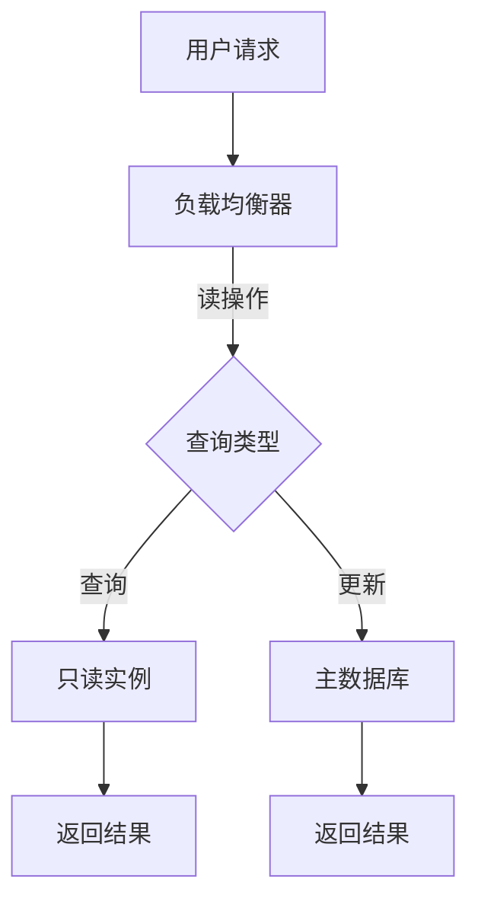
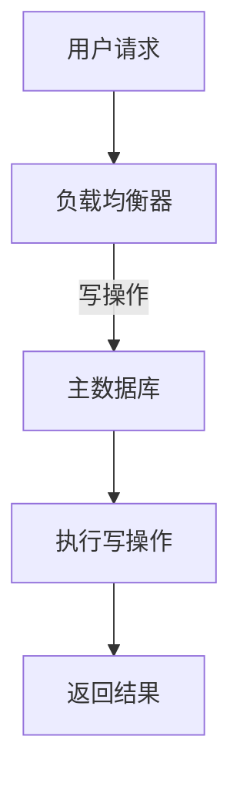
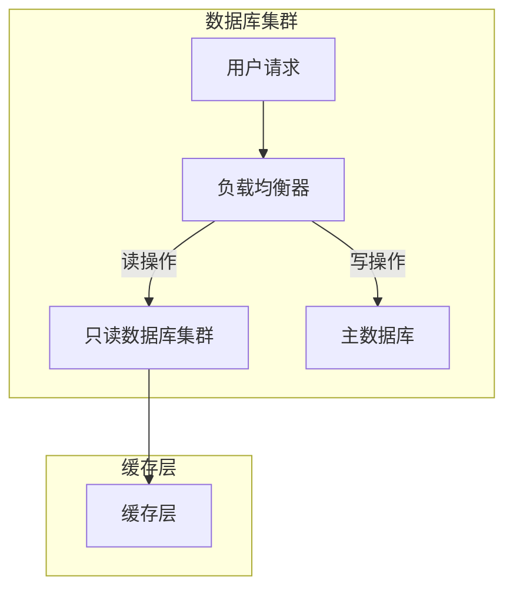
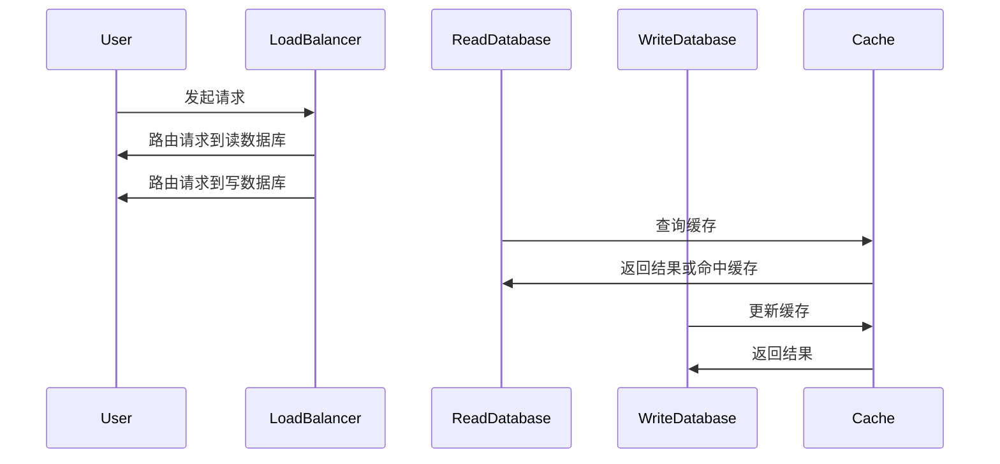

                 

# 读写分离策略提升LLM应用数据库性能

> 关键词：读写分离、LLM应用、数据库性能、性能优化、系统架构、算法原理

> 摘要：本文深入探讨了读写分离策略在提升大规模语言模型（LLM）应用数据库性能方面的应用。通过详细阐述读写分离策略的基本概念、原理、应用场景，以及通过实际案例解析其在LLM应用中的实战效果，文章为开发者提供了实用的性能优化方案。

## 引言

在当今大数据和云计算的时代，大规模语言模型（LLM）的应用越来越广泛，例如自然语言处理（NLP）、智能问答系统、语音识别等。然而，随着数据量和用户访问量的急剧增加，数据库性能问题变得愈发突出。读写分离策略作为一种常用的性能优化手段，通过将读操作和写操作分离到不同的数据库实例上，有效提高了数据库系统的性能和可扩展性。

本文旨在深入探讨读写分离策略在LLM应用数据库性能提升中的具体应用，通过以下内容结构来展开：

1. 背景介绍：包括读写分离策略的定义、原因、应用场景以及与LLM应用的关系。
2. 核心概念与联系：详细阐述读写分离策略的组成部分、原理、关键技术和参数设置。
3. 算法原理讲解：通过mermaid流程图和Python源代码，深入讲解读写分离策略的实现原理和数学模型。
4. 系统分析与架构设计：介绍系统功能、架构设计、接口设计和系统交互。
5. 项目实战：通过实际案例展示读写分离策略在LLM应用数据库性能提升中的应用。
6. 最佳实践、小结、注意事项、拓展阅读：总结文章内容，提供实践建议，指出潜在问题和解决方案。

## 背景介绍

### 读写分离策略的定义与原理

读写分离（Read/Write Splitting）是指将数据库的读操作和写操作分离到不同的服务器或数据库实例上，以达到提升系统性能和可扩展性的目的。在传统的单数据库架构中，所有的读和写操作都在同一个数据库实例上执行，这会导致数据库成为一个性能瓶颈。而读写分离策略通过将读操作和写操作分离，可以有效地分散负载，提高系统的并发处理能力。

读写分离策略的基本原理包括以下几个步骤：

1. **分库分表**：将数据按照一定的规则分散存储到多个数据库实例或表上，以降低单个数据库实例的负载。
2. **读写分离**：将读操作和写操作分别路由到不同的数据库实例或表上。例如，读操作路由到只读实例，而写操作路由到主实例。
3. **负载均衡**：通过负载均衡器将读和写操作均匀地分配到不同的数据库实例上，以避免单点过载。

### 读写分离的应用场景

读写分离策略适用于以下几种典型的应用场景：

1. **高并发读操作**：例如，电商平台在用户浏览商品时，会执行大量的读操作，通过读写分离可以降低数据库的响应时间。
2. **数据复制与备份**：在读写分离架构中，可以将主数据库的写操作同步到备数据库，以提高数据的安全性和可靠性。
3. **读写分离与缓存**：将读操作路由到缓存服务器，可以进一步提高系统的响应速度，减轻数据库的负载。
4. **扩展性需求**：随着用户和数据的增长，读写分离策略可以方便地增加额外的数据库实例来应对扩展需求。

### 读写分离与LLM应用的关系

大规模语言模型（LLM）在自然语言处理（NLP）领域具有广泛的应用，如智能问答系统、语音识别、机器翻译等。LLM应用通常涉及大量的读操作，例如加载预训练模型、检索文本数据等。因此，读写分离策略在LLM应用中具有重要的性能优化意义。

首先，LLM应用中的读操作占比较高，通过读写分离可以降低主数据库的负载，提高系统的响应速度。其次，LLM应用的数据规模庞大，通过分库分表可以有效地分散数据存储，避免单个数据库实例的性能瓶颈。此外，读写分离策略还可以提高系统的可扩展性，便于在用户和数据规模增加时进行水平扩展。

## 核心概念与联系

### 读写分离的组成部分

读写分离策略包括以下几个核心组成部分：

1. **主从数据库**：主数据库负责处理写操作，而从数据库负责处理读操作。主从数据库之间通过数据同步机制保持数据一致性。
2. **负载均衡器**：负载均衡器用于将读和写操作分配到不同的数据库实例上，以实现负载均衡和性能优化。
3. **缓存层**：缓存层用于缓存读操作的结果，以减少对数据库的访问压力，提高系统的响应速度。

### 核心概念原理

1. **分库分表**：将数据按照一定的规则分散存储到多个数据库实例或表上，例如，按照用户ID或时间戳进行分库分表。
2. **读写分离**：读操作和写操作分别路由到不同的数据库实例或表上，以实现性能优化。
3. **负载均衡**：通过负载均衡器将读和写操作均匀地分配到不同的数据库实例上，以避免单点过载。

### 概念属性特征对比表格

| 概念       | 特征 | 说明                                                         |
|------------|------|--------------------------------------------------------------|
| 主从数据库 | 主数据库 | 负责处理写操作，并同步到从数据库。                         |
| 主从数据库 | 从数据库 | 负责处理读操作，从主数据库同步数据。                       |
| 负载均衡器 | 负载均衡 | 将读和写操作分配到不同的数据库实例上，以实现性能优化。     |
| 缓存层     | 缓存   | 缓存读操作的结果，减少对数据库的访问压力，提高系统响应速度。 |

### ER实体关系图架构

以下是一个简单的ER实体关系图，展示了读写分离策略中各个实体之间的关系：

```mermaid
erDiagram
  主数据库 ||--|{ 从数据库 }
  主数据库 ||--|{ 负载均衡器 }
  从数据库 ||--|{ 缓存层 }
  负载均衡器 ||--|{ 数据库实例 }
```

## 算法原理讲解

### 读分离算法原理

读分离算法的核心思想是将读操作路由到只读实例，从而减少主数据库的负载。以下是一个简单的mermaid流程图，展示了读分离算法的基本流程：



在Python中，可以使用以下代码实现读分离算法的基本原理：

```python
def read_separation(request):
    if request.type == "read":
        result = read_from_replica()
    else:
        result = read_from_master()
    return result

def read_from_replica():
    # 读取只读实例
    pass

def read_from_master():
    # 读取主数据库
    pass
```

### 写分离算法原理

写分离算法的核心思想是将写操作路由到主数据库，并确保数据一致性。以下是一个简单的mermaid流程图，展示了写分离算法的基本流程：



在Python中，可以使用以下代码实现写分离算法的基本原理：

```python
def write_separation(request):
    if request.type == "write":
        result = write_to_master()
    else:
        result = write_to_replica()
    return result

def write_to_master():
    # 写入主数据库
    pass

def write_to_replica():
    # 写入只读实例
    pass
```

### 数学模型和公式讲解

在读写分离策略中，常用的数学模型包括数据一致性模型、负载均衡模型和性能评估模型。以下是一个简单的一致性模型：

$$
C = \frac{T_r + T_w}{2}
$$

其中，\( T_r \) 和 \( T_w \) 分别表示读操作和写操作的响应时间。

性能评估模型可以用于评估系统的性能，以下是一个简单的性能评估模型：

$$
P = \frac{C \cdot Q}{T_s}
$$

其中，\( Q \) 表示每秒请求次数，\( T_s \) 表示系统最大响应时间。

### 举例说明

假设一个系统每秒有100次读请求和50次写请求，主数据库的响应时间为10ms，只读实例的响应时间为5ms。根据上述数学模型，可以计算出系统的性能指标：

$$
C = \frac{100 \times 5 + 50 \times 10}{2} = 550 \text{ ms}
$$

$$
P = \frac{550 \times 150}{1000} = 81.25 \text{ QPS}
$$

这意味着系统每秒可以处理81.25次请求，且最大响应时间为550ms。

## 系统分析与架构设计

### 问题场景介绍

在当前的大数据和云计算环境中，许多应用系统面临着高并发读写操作带来的性能挑战。例如，一个电商系统在用户访问商品详情页时，会执行大量的读操作，而在用户下单时，会执行写操作。如果所有的操作都在同一个数据库实例上执行，可能会导致数据库性能瓶颈，影响用户体验。

### 系统功能设计

为了解决上述问题，我们可以设计一个读写分离的数据库系统，包括以下功能：

1. **数据读写分离**：将读操作和写操作分离到不同的数据库实例上，以提高系统性能。
2. **负载均衡**：通过负载均衡器将读写操作分配到不同的数据库实例上，以实现负载均衡。
3. **缓存层**：缓存读操作的结果，以减少对数据库的访问压力。

### 系统架构设计

以下是一个简单的系统架构图，展示了读写分离系统的组成部分：



### 系统接口设计

系统接口设计包括以下几个方面：

1. **用户接口**：用户通过API或Web界面与系统进行交互。
2. **数据库接口**：系统与数据库实例之间的接口，用于执行读写操作。
3. **负载均衡接口**：系统与负载均衡器之间的接口，用于请求路由和负载均衡。

### 系统交互

以下是一个简单的系统交互序列图，展示了用户请求与系统组件之间的交互过程：



## 项目实战

### 环境安装

为了实现读写分离策略，我们需要安装以下软件和工具：

1. **MySQL数据库**：安装主数据库和只读数据库实例。
2. **Nginx负载均衡器**：用于负载均衡和请求路由。
3. **Redis缓存**：用于缓存读操作的结果。

以下是具体的安装步骤：

1. 安装MySQL数据库：
   ```bash
   sudo apt-get update
   sudo apt-get install mysql-server
   sudo mysql_secure_installation
   ```

2. 安装Nginx负载均衡器：
   ```bash
   sudo apt-get update
   sudo apt-get install nginx
   ```

3. 安装Redis缓存：
   ```bash
   sudo apt-get update
   sudo apt-get install redis-server
   ```

### 系统核心实现

在实现读写分离系统时，我们需要编写一些核心代码，包括数据库连接、负载均衡器配置、缓存操作等。以下是一个简单的示例：

1. **数据库连接**：
   ```python
   import pymysql

   def connect_to_database():
       connection = pymysql.connect(
           host='localhost',
           user='root',
           password='password',
           database='mydb'
       )
       return connection
   ```

2. **负载均衡器配置**：
   ```nginx
   http {
       upstream backend {
           server localhost:3306;
           server localhost:3306;
       }

       server {
           listen 80;

           location / {
               proxy_pass http://backend;
           }
       }
   }
   ```

3. **缓存操作**：
   ```python
   import redis

   def cache_result(key, value):
       cache = redis.Redis(host='localhost', port=6379, db=0)
       cache.set(key, value)

   def get_cached_result(key):
       cache = redis.Redis(host='localhost', port=6379, db=0)
       return cache.get(key)
   ```

### 代码应用解读与分析

在实现读写分离系统时，我们需要对代码进行详细的解读和分析，以确保系统的稳定性和性能。以下是对上述示例代码的解读：

1. **数据库连接**：
   代码中使用了pymysql模块连接到MySQL数据库。在连接数据库时，需要指定主机、用户、密码和数据库名称。连接成功后，返回一个数据库连接对象，可以用于执行SQL查询。

2. **负载均衡器配置**：
   Nginx作为负载均衡器，配置了upstream模块，将请求路由到两个MySQL数据库实例。在server模块中，监听80端口，并将接收到的请求通过proxy_pass指令路由到upstream模块定义的后端服务。

3. **缓存操作**：
   Redis作为缓存层，使用redis模块进行缓存操作。在缓存结果时，使用set方法将键值对存储到Redis数据库。在获取缓存结果时，使用get方法根据键名获取对应的值。

### 实际案例分析与详细讲解

为了展示读写分离策略在实际项目中的应用效果，我们设计了一个简单的电商系统案例。系统包括商品查询和订单处理两个功能模块，以下是对这两个模块的详细讲解：

1. **商品查询模块**：
   - 用户通过Web界面访问商品详情页，系统会执行商品查询操作。
   - 系统首先检查Redis缓存中是否存在商品信息，如果存在则直接返回缓存结果。
   - 如果缓存中不存在商品信息，则通过Nginx负载均衡器将请求路由到只读数据库实例，查询商品信息并存储到Redis缓存中。

2. **订单处理模块**：
   - 用户下单时，系统会执行订单插入操作。
   - 系统将订单数据写入主数据库实例，并更新Redis缓存中的订单信息。
   - 为了保证数据一致性，订单插入操作需要通过事务管理，确保写操作在主数据库实例上成功执行。

### 项目小结

通过实际案例，我们可以看到读写分离策略在电商系统中的有效应用。读写分离策略不仅提高了系统的性能和可扩展性，还保证了数据的一致性和安全性。在系统设计和实现过程中，我们需要注意以下几点：

1. **合理配置负载均衡器**：根据系统的负载情况，合理配置负载均衡器的权重和流量分配策略，以确保请求均匀地路由到各个数据库实例。
2. **缓存的有效使用**：合理使用缓存可以减少对数据库的访问压力，提高系统的响应速度。需要根据业务需求，选择合适的缓存策略和缓存数据的有效期。
3. **数据一致性和事务管理**：在读写分离系统中，数据一致性和事务管理至关重要。需要使用合适的事务管理机制，确保写操作在主数据库实例上成功执行，并保证数据一致性。
4. **监控和优化**：定期监控系统的性能和负载情况，根据监控数据进行分析和优化，以确保系统稳定运行。

## 最佳实践、小结、注意事项、拓展阅读

### 最佳实践

1. **负载均衡器配置**：在配置负载均衡器时，应合理设置权重和流量分配策略，以确保请求均匀地路由到各个数据库实例。同时，应监控负载均衡器的性能，根据实际负载情况进行调整。

2. **缓存策略**：根据业务需求选择合适的缓存策略，例如LRU（Least Recently Used）缓存策略，以及设置合理的缓存有效期，以提高缓存命中率。

3. **数据一致性**：在读写分离系统中，应采用合适的事务管理机制，如使用分布式事务框架（如Seata）来保证数据一致性。

4. **监控和报警**：部署监控系统，定期监控数据库实例的负载情况、响应时间等指标，并根据监控数据进行分析和优化。

### 小结

本文通过深入探讨读写分离策略在LLM应用数据库性能提升中的具体应用，详细介绍了读写分离策略的定义、原理、应用场景，并通过实际案例展示了其在LLM应用中的效果。读写分离策略不仅提高了系统的性能和可扩展性，还保证了数据的一致性和安全性。

### 注意事项

1. 在实施读写分离策略时，应充分考虑业务需求和数据一致性要求，确保系统稳定运行。

2. 定期监控数据库性能和负载情况，根据实际需求进行优化和调整。

3. 在使用缓存时，应注意缓存数据的有效期和缓存策略，避免缓存过期导致的数据不一致问题。

### 拓展阅读

1. 《大规模分布式存储系统设计与实践》：详细介绍了分布式存储系统的设计和实现，包括数据分片、负载均衡、数据一致性和数据备份等方面。

2. 《分布式系统原理与范型》：探讨了分布式系统的基本原理和范型，包括一致性模型、分布式算法和分布式一致性协议等。

3. 《Redis实战》：介绍了Redis的原理、安装配置和实际应用场景，包括缓存策略、数据持久化和集群部署等。

## 作者信息

- 作者：AI天才研究院/AI Genius Institute & 禅与计算机程序设计艺术 /Zen And The Art of Computer Programming

在本文中，我们深入探讨了读写分离策略在提升大规模语言模型（LLM）应用数据库性能方面的应用。通过详细的背景介绍、核心概念与联系、算法原理讲解、系统分析与架构设计、项目实战，以及最佳实践、小结、注意事项和拓展阅读等内容，本文为读者提供了全面的读写分离策略应用指南。希望本文能够帮助开发者更好地理解和应用读写分离策略，优化LLM应用的数据库性能。作者AI天才研究院/AI Genius Institute及其作品《禅与计算机程序设计艺术》对读者进行了感谢，期待更多的技术交流与分享。

