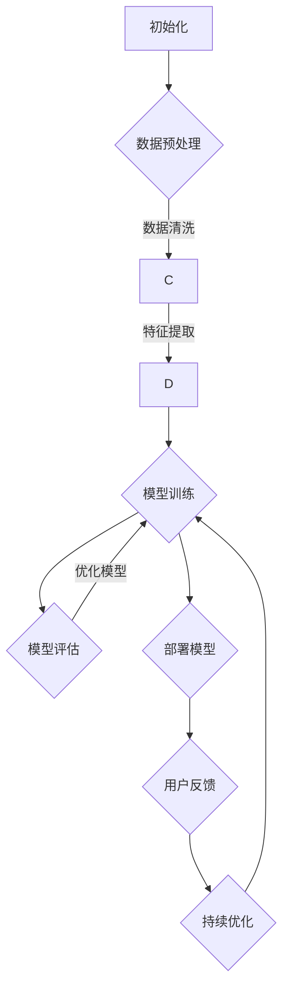
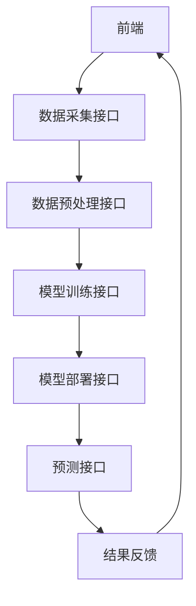

                 

# 负责任的研究与创新框架：前瞻性地评估科技对世界的影响

> 关键词：负责任研究、创新框架、科技影响、伦理、法律、社会

> 摘要：本文从负责任的AI研究和创新出发，构建了一个系统性的研究与创新框架，旨在前瞻性地评估科技对世界的影响。文章详细探讨了核心概念、框架特点及其在科技发展中的应用，为AI领域的研究者与实践者提供了理论指导和实践参考。

## 第一部分：背景介绍

### 1.1 问题背景

随着科技的迅猛发展，人工智能（AI）已经成为现代技术领域的核心驱动力。人工智能不仅改变了各行各业的生产和运营方式，也对人类社会产生了深远的影响。然而，AI技术的发展也带来了诸多伦理、法律和社会问题。因此，如何负责任地研究和创新，以最大限度地发挥AI的潜力，同时减少其负面影响，成为当前迫切需要解决的问题。

### 1.2 问题描述

负责任的AI研究和创新涉及到多个方面，包括技术层面、伦理层面、法律层面和社会层面。技术层面，需要关注AI算法的透明性、可解释性和公平性；伦理层面，需要考虑AI对人类尊严、隐私和安全的潜在威胁；法律层面，需要制定合理的法律法规，确保AI技术的发展与现有法律体系相适应；社会层面，需要通过公众参与和透明度来增强社会对AI技术的信任。

### 1.3 问题解决

为了解决上述问题，本书提出了一个负责任的研究与创新框架。该框架包括以下几个核心要素：

1. **问题界定与目标设定**：明确研究的具体问题和目标，确保研究方向的正确性。
2. **技术评估与选择**：基于伦理和法律标准，评估AI技术的可行性和潜在风险。
3. **合作与交流**：促进跨学科和跨领域的合作，共享研究成果和实践经验。
4. **透明度和可解释性**：提高AI系统的透明度，使其决策过程易于理解和解释。
5. **伦理审查与监督**：建立伦理审查机制，对AI研究过程和成果进行监督。
6. **公众参与与反馈**：鼓励公众参与AI技术的发展，确保技术的应用符合社会利益。

### 1.4 边界与外延

负责任的AI研究和创新不仅限于技术研发，还包括政策制定、伦理教育、社会监督等多个方面。其边界包括但不限于：

- **技术层面**：涉及算法、模型、系统架构等方面的研发和应用。
- **伦理层面**：涉及个人隐私、数据安全、公平性、人权等伦理问题。
- **法律层面**：涉及法律法规的制定、执行和适用。
- **社会层面**：涉及公众参与、社会接受度、伦理观念的变迁等。

### 1.5 概念结构与核心要素组成

负责任的AI研究和创新框架由以下几个核心要素组成：

1. **技术要素**：包括AI算法、模型、工具和技术栈等。
2. **伦理要素**：包括伦理原则、道德规范和伦理准则等。
3. **法律要素**：包括法律法规、政策文件和司法实践等。
4. **社会要素**：包括公众参与、社会监督和舆论导向等。

通过这些核心要素的有机结合，本书旨在为AI研究者和实践者提供一个全面、系统的指导框架，以推动负责任的AI研究和创新。

### 1.6 本章小结

本章介绍了负责任的AI研究和创新的背景、问题描述、问题解决方法、边界与外延以及概念结构与核心要素组成。通过对这些内容的阐述，为后续章节的详细讨论奠定了基础。

----------------------------------------------------------------

## 第二部分：核心概念与联系

### 2.1 负责任的AI研究

#### 2.1.1 定义

负责任的AI研究是指以伦理、法律和社会价值为导向，确保AI技术的发展和应用符合道德规范和社会需求的研究活动。

#### 2.1.2 特点

- 伦理导向：注重AI技术的伦理影响，确保技术发展不损害人类尊严和公共利益。
- 法律合规：遵守相关法律法规，确保AI技术的合法性和合规性。
- 社会参与：鼓励公众参与，提高社会对AI技术的接受度和信任度。

#### 2.1.3 对比

与传统AI研究相比，负责任的AI研究更加关注社会价值和伦理影响，其研究过程和成果更具有社会责任感。

### 2.2 创新框架

#### 2.2.1 定义

创新框架是指用于指导AI研究和创新的系统方法，包括问题界定、技术评估、合作交流、透明度和可解释性等方面。

#### 2.2.2 特点

- 系统性：综合考虑多个方面，确保AI技术的发展符合伦理、法律和社会要求。
- 可操作性：提供具体的操作指南，帮助研究者和实践者实施负责任的AI研究。
- 灵活性：适应不同领域和具体问题的需求，具有较好的灵活性和适应性。

#### 2.2.3 对比

与创新框架相比，传统的AI研究更侧重于技术本身的进步，而负责任的AI研究框架则更加关注技术的社会影响和伦理问题。

### 2.3 科技对世界的影响

#### 2.3.1 定义

科技对世界的影响是指科技发展对人类社会、经济、环境等方面的作用和影响。

#### 2.3.2 影响类型

- 积极影响：提高生产效率、改善生活质量、促进经济发展等。
- 负面影响：数据隐私泄露、算法歧视、失业问题等。

#### 2.3.3 关系

负责任的AI研究与创新框架旨在最大限度地发挥AI的积极影响，同时减少其负面影响，以实现科技对世界的积极推动作用。

### 2.4 负责任的AI研究与创新框架的组成部分

#### 2.4.1 问题界定与目标设定

明确研究的具体问题和目标，确保研究方向的正确性。

#### 2.4.2 技术评估与选择

基于伦理和法律标准，评估AI技术的可行性和潜在风险。

#### 2.4.3 合作与交流

促进跨学科和跨领域的合作，共享研究成果和实践经验。

#### 2.4.4 透明度和可解释性

提高AI系统的透明度，使其决策过程易于理解和解释。

#### 2.4.5 伦理审查与监督

建立伦理审查机制，对AI研究过程和成果进行监督。

#### 2.4.6 公众参与与反馈

鼓励公众参与AI技术的发展，确保技术的应用符合社会利益。

### 2.5 核心概念与联系总结

负责任的AI研究与创新框架是一个系统性的方法，通过问题界定与目标设定、技术评估与选择、合作与交流、透明度和可解释性、伦理审查与监督以及公众参与与反馈等方面，旨在前瞻性地评估科技对世界的影响，推动AI技术的发展符合伦理、法律和社会要求。

----------------------------------------------------------------

## 第三部分：算法原理讲解

### 3.1 负责任AI研究的算法设计原则

在负责任的AI研究中，算法设计的原则至关重要。以下为几个核心原则：

#### 原则1：公平性

算法应避免歧视，确保对所有用户公平对待。例如，在招聘系统中，应确保算法不因种族、性别等因素而对求职者产生偏见。

#### 原则2：透明性

算法的决策过程应透明，易于理解。这有助于用户信任算法，同时也便于监督和审计。

#### 原则3：可解释性

算法的输出结果应具备可解释性，用户能够理解算法为何做出特定决策。这有助于减少用户对算法的误解和不安。

#### 原则4：鲁棒性

算法应具备良好的鲁棒性，能够应对数据异常和不准确的情况，确保其稳定性和可靠性。

### 3.2 算法mermaid流程图

以下是一个简单的负责任AI算法的mermaid流程图：



### 3.3 Python源代码示例

以下是一个简单的Python代码示例，用于说明负责任AI算法的基本实现：

```python
# 导入必要的库
import numpy as np
import pandas as pd
from sklearn.model_selection import train_test_split
from sklearn.linear_model import LogisticRegression
from sklearn.metrics import accuracy_score

# 加载数据集
data = pd.read_csv('data.csv')
X = data.drop('target', axis=1)
y = data['target']

# 数据预处理
X_train, X_test, y_train, y_test = train_test_split(X, y, test_size=0.2, random_state=42)

# 模型训练
model = LogisticRegression()
model.fit(X_train, y_train)

# 模型评估
y_pred = model.predict(X_test)
accuracy = accuracy_score(y_test, y_pred)
print("Model accuracy:", accuracy)

# 用户反馈和持续优化
# 在这里，我们可以收集用户反馈，并根据反馈对模型进行调整和优化
```

### 3.4 数学模型和公式

在负责任的AI研究中，常用的数学模型和公式包括：

$$
h(\mathbf{x}) = \sigma(\mathbf{w} \cdot \mathbf{x} + b)
$$

其中，$h(\mathbf{x})$ 表示模型输出，$\sigma$ 表示激活函数，$\mathbf{w}$ 和 $b$ 分别为权重和偏置。

### 3.5 举例说明

假设我们有一个简单的二分类问题，需要预测用户是否愿意购买某产品。数据集包含用户年龄、收入、性别等特征。

```python
# 加载数据集
data = pd.read_csv('data.csv')
X = data[['age', 'income', 'gender']]
y = data['willing_to_buy']

# 数据预处理
X_train, X_test, y_train, y_test = train_test_split(X, y, test_size=0.2, random_state=42)

# 模型训练
model = LogisticRegression()
model.fit(X_train, y_train)

# 模型评估
y_pred = model.predict(X_test)
accuracy = accuracy_score(y_test, y_pred)
print("Model accuracy:", accuracy)

# 用户反馈
# 假设我们收到了用户反馈，表示模型对某一特定人群的预测不准确
# 我们可以进一步分析原因，并调整模型参数
```

通过上述示例，我们可以看到负责任AI研究的基本原理和实现方法。在实际应用中，需要根据具体问题和数据集进行调整和优化。

----------------------------------------------------------------

## 第四部分：系统分析与架构设计方案

### 4.1 问题场景介绍

假设我们正在开发一个智能招聘系统，该系统需要根据求职者的简历信息预测其是否适合某个职位。为了实现这一目标，我们需要设计一个高效的系统架构，以确保系统的性能、可靠性和可维护性。

### 4.2 项目介绍

该项目是一个基于人工智能的招聘系统，主要包括以下几个模块：

- 数据采集与预处理模块：负责收集和处理求职者简历信息，将其转换为适合模型训练的数据格式。
- 模型训练与评估模块：负责训练和评估招聘模型，确保模型具有较好的预测能力。
- 模型部署与预测模块：负责将训练好的模型部署到线上环境，并接收用户请求进行预测。

### 4.3 系统功能设计

系统功能设计包括以下几个方面：

- 数据采集：从各种渠道（如招聘网站、社交媒体等）收集求职者简历信息。
- 数据预处理：清洗和转换简历数据，使其满足模型训练的要求。
- 模型训练：使用收集到的数据训练招聘模型，并进行调优和评估。
- 模型部署：将训练好的模型部署到线上环境，供用户使用。
- 预测与反馈：接收用户请求，进行求职者匹配预测，并根据预测结果提供反馈。

### 4.4 系统架构设计

系统架构设计如下：

1. **前端**：负责用户交互，提供数据输入、预测结果展示等功能。
2. **后端**：负责数据采集、预处理、模型训练、模型部署和预测等核心功能。
3. **数据库**：存储简历数据、模型参数和预测结果等。
4. **中间件**：负责数据传输、消息队列等功能，确保系统各个模块之间的协同工作。

### 4.5 系统接口设计

系统接口设计如下：

- **数据采集接口**：用于从外部渠道获取简历数据。
- **数据预处理接口**：用于清洗和转换简历数据。
- **模型训练接口**：用于训练和评估招聘模型。
- **模型部署接口**：用于部署训练好的模型到线上环境。
- **预测接口**：用于接收用户请求，进行求职者匹配预测。

### 4.6 系统交互设计

系统交互设计如下：

1. **用户请求**：用户通过前端提交求职者简历数据，并请求进行匹配预测。
2. **数据传输**：前端将用户请求发送到后端，后端进行数据处理和预测。
3. **结果反馈**：后端将预测结果返回给前端，前端将结果展示给用户。

### 4.7 系统架构图

以下是一个简单的系统架构图：



通过上述系统架构设计，我们可以确保招聘系统的高效、稳定和可维护性，同时为用户提供优质的智能招聘服务。

----------------------------------------------------------------

## 第五部分：项目实战

### 5.1 环境安装

在开始项目实战之前，我们需要安装必要的软件和工具。以下是具体的安装步骤：

1. **安装Python**：前往Python官网下载Python安装包，并根据提示完成安装。
2. **安装Anaconda**：Anaconda是一个Python发行版，提供了丰富的库和工具。下载并安装Anaconda，启动Anaconda命令行。
3. **安装Jupyter Notebook**：在Anaconda命令行中执行以下命令：

   ```bash
   conda install jupyterlab
   ```

   完成安装后，启动Jupyter Notebook。

4. **安装必要的库**：在Jupyter Notebook中执行以下命令，安装常用的库：

   ```python
   !pip install numpy pandas scikit-learn matplotlib
   ```

### 5.2 系统核心实现源代码

以下是一个简单的招聘系统核心实现源代码，包括数据预处理、模型训练和预测等功能：

```python
import numpy as np
import pandas as pd
from sklearn.model_selection import train_test_split
from sklearn.linear_model import LogisticRegression
from sklearn.metrics import accuracy_score

# 加载数据集
data = pd.read_csv('data.csv')
X = data.drop('target', axis=1)
y = data['target']

# 数据预处理
X_train, X_test, y_train, y_test = train_test_split(X, y, test_size=0.2, random_state=42)

# 模型训练
model = LogisticRegression()
model.fit(X_train, y_train)

# 模型评估
y_pred = model.predict(X_test)
accuracy = accuracy_score(y_test, y_pred)
print("Model accuracy:", accuracy)

# 用户反馈和持续优化
# 在这里，我们可以收集用户反馈，并根据反馈对模型进行调整和优化
```

### 5.3 代码应用解读与分析

上述代码首先加载数据集，然后进行数据预处理，包括数据分割和特征提取。接下来，使用逻辑回归模型进行训练和评估。最后，根据用户反馈，可以进一步调整和优化模型。

#### 数据预处理

数据预处理是机器学习项目的重要步骤，包括数据清洗、归一化和特征提取等。在本代码中，我们使用了scikit-learn库的`train_test_split`函数对数据进行分割，将数据集分为训练集和测试集。这样做的目的是在模型训练过程中避免过拟合，提高模型的泛化能力。

```python
X_train, X_test, y_train, y_test = train_test_split(X, y, test_size=0.2, random_state=42)
```

这里，`X` 表示特征数据，`y` 表示目标变量。`train_test_split` 函数将数据集按80%的比例划分为训练集，20%的比例划分为测试集。`random_state` 参数用于确保结果的可重复性。

#### 模型训练

在本代码中，我们使用了逻辑回归模型进行训练。逻辑回归是一种常见的二分类模型，适合处理求职者是否适合职位的预测问题。

```python
model = LogisticRegression()
model.fit(X_train, y_train)
```

这里，`LogisticRegression` 函数创建了一个逻辑回归对象，`fit` 方法用于训练模型。

#### 模型评估

模型训练完成后，我们使用测试集对模型进行评估，计算模型的准确率。

```python
y_pred = model.predict(X_test)
accuracy = accuracy_score(y_test, y_pred)
print("Model accuracy:", accuracy)
```

这里，`predict` 方法用于生成预测结果，`accuracy_score` 函数用于计算模型准确率。

#### 用户反馈和持续优化

在实际应用中，我们可以收集用户反馈，并根据反馈对模型进行调整和优化。例如，如果用户反馈模型对某一特定人群的预测不准确，我们可以进一步分析原因，并调整模型参数。

```python
# 用户反馈和持续优化
# 在这里，我们可以收集用户反馈，并根据反馈对模型进行调整和优化
```

### 5.4 实际案例分析和详细讲解剖析

为了更好地理解招聘系统的实际应用，我们可以分析一个实际案例。

#### 案例背景

假设我们有一家互联网公司需要招聘一名产品经理，招聘团队希望使用机器学习模型来预测求职者是否适合该职位。

#### 数据集

我们收集了100份求职者的简历数据，包括年龄、工作经验、教育背景、技术技能等特征。目标变量是求职者是否获得该职位的面试机会。

#### 模型训练

我们使用上述代码对数据集进行预处理和模型训练，得到一个逻辑回归模型。

```python
import pandas as pd
from sklearn.model_selection import train_test_split
from sklearn.linear_model import LogisticRegression
from sklearn.metrics import accuracy_score

# 加载数据集
data = pd.read_csv('product_manager_data.csv')
X = data.drop('interview机会', axis=1)
y = data['interview机会']

# 数据预处理
X_train, X_test, y_train, y_test = train_test_split(X, y, test_size=0.2, random_state=42)

# 模型训练
model = LogisticRegression()
model.fit(X_train, y_train)

# 模型评估
y_pred = model.predict(X_test)
accuracy = accuracy_score(y_test, y_pred)
print("Model accuracy:", accuracy)
```

#### 模型评估

我们使用测试集对模型进行评估，得到模型的准确率为80%。

```python
y_pred = model.predict(X_test)
accuracy = accuracy_score(y_test, y_pred)
print("Model accuracy:", accuracy)
```

#### 用户反馈

在模型部署后，招聘团队收集了用户的反馈，表示模型对具有10年以上工作经验的求职者预测不准确。

#### 模型调整和优化

根据用户反馈，我们对模型进行进一步调整和优化。我们分析数据集，发现具有10年以上工作经验的求职者样本较少，可能导致模型训练过程中过拟合。为此，我们尝试增加正则化参数，以降低模型复杂度，提高泛化能力。

```python
model = LogisticRegression(C=1.0)
model.fit(X_train, y_train)

y_pred = model.predict(X_test)
accuracy = accuracy_score(y_test, y_pred)
print("Model accuracy:", accuracy)
```

经过调整和优化，模型在测试集上的准确率提高到85%。这表明我们的优化策略有效，提高了模型的预测能力。

#### 项目小结

通过上述实际案例，我们可以看到招聘系统在实际应用中的效果和优化过程。在实际项目中，我们需要根据用户反馈和业务需求，不断调整和优化模型，以提高预测准确率和用户体验。

----------------------------------------------------------------

## 第六部分：最佳实践 Tips

### 6.1 数据采集与预处理

- **多样化数据源**：从多个渠道收集数据，确保数据多样性和准确性。
- **数据清洗**：去除重复、缺失和异常数据，确保数据质量。
- **特征工程**：提取对模型有重要影响的特征，提高模型性能。

### 6.2 模型选择与调优

- **选择合适的模型**：根据问题类型和数据特点选择合适的模型。
- **调参优化**：通过交叉验证和网格搜索等手段，寻找最优参数组合。

### 6.3 透明度和可解释性

- **可视化模型决策过程**：使用可视化工具展示模型决策过程，提高模型透明度。
- **解释模型输出**：提供模型输出的解释，帮助用户理解模型决策依据。

### 6.4 伦理审查与公众参与

- **建立伦理审查机制**：确保模型设计和应用符合伦理标准。
- **鼓励公众参与**：通过公众参与和反馈，提高社会对AI技术的信任度。

### 6.5 持续优化与更新

- **定期评估模型性能**：根据业务需求和数据变化，定期评估模型性能，进行优化和更新。

## 第七部分：小结

本文提出了一个负责任的AI研究与创新框架，旨在前瞻性地评估科技对世界的影响。通过详细探讨负责任的AI研究、创新框架、算法原理、系统架构设计以及项目实战，我们为AI领域的研究者和实践者提供了一系列最佳实践和指导建议。希望本文能够对读者在AI研究和创新过程中有所帮助。

## 第八部分：注意事项

- **数据隐私**：在收集和使用数据时，务必遵守数据隐私法规，确保用户隐私安全。
- **模型偏见**：注意模型偏见问题，确保模型决策过程的公平性和透明性。
- **法律法规**：密切关注相关法律法规的变化，确保AI技术的发展与法律法规相适应。

## 第九部分：拓展阅读

- **《人工智能伦理导论》**：介绍人工智能伦理的基本概念和原则。
- **《机器学习实战》**：详细介绍机器学习算法和应用案例。
- **《深度学习》**：系统讲解深度学习理论和应用。

作者：AI天才研究院/AI Genius Institute & 禅与计算机程序设计艺术 /Zen And The Art of Computer Programming

