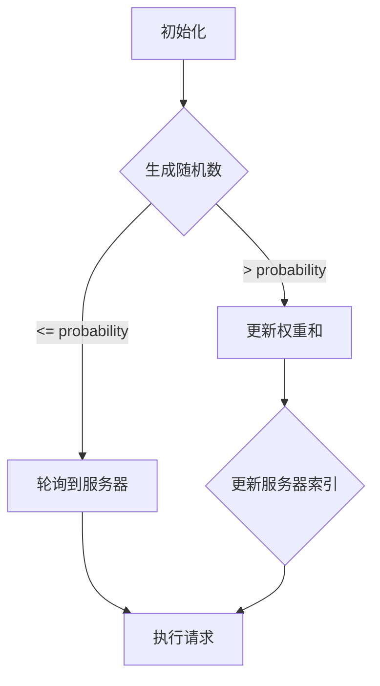

                 

### 文章标题

《负载均衡技术在高并发LLM应用中的应用》

### 文章关键词

- 负载均衡
- 高并发
- LLM
- 分布式系统
- 算法实现

### 摘要

本文旨在探讨负载均衡技术在高并发大规模语言模型（LLM）应用中的重要性及其实现方法。通过对负载均衡的基本概念、算法原理、系统架构设计、项目实战及最佳实践的详细讲解，本文帮助读者深入了解负载均衡在提升LLM应用性能、稳定性与可扩展性方面的关键作用。文章不仅提供了理论分析，还结合实际案例进行了深入剖析，为读者提供了一套完整、可操作的技术解决方案。

---

### 第1章 负载均衡技术概述

#### 1.1 负载均衡技术背景

负载均衡是一种将工作负载分配到多个计算资源上的技术，旨在提高系统的性能、稳定性和可用性。随着互联网的迅速发展和大数据时代的到来，高并发应用场景变得越来越普遍，负载均衡技术在确保系统处理能力、响应速度和用户体验方面显得尤为重要。

大规模语言模型（LLM）作为一种复杂的应用，其对计算资源的需求极高。在高并发环境下，LLM需要处理大量请求，这给系统带来了巨大的压力。如何有效地分配这些请求，确保系统稳定运行，是当前研究和应用中的关键问题。

#### 1.2 负载均衡技术原理

负载均衡技术的基本原理是通过某种策略将请求分配到不同的服务器或计算节点上。常见的负载均衡策略包括轮询算法、最少连接算法、加权轮询算法等。这些算法的核心目标是最大化系统的处理能力和最小化单个节点的负载。

在LLM应用中，负载均衡不仅要考虑请求的处理速度，还要考虑模型的训练和推理过程。由于LLM通常需要大量计算资源，负载均衡技术需要能够动态调整资源的分配，以满足高并发的需求。

#### 1.3 负载均衡技术分类

负载均衡技术可以根据实现方式分为硬件负载均衡器和软件负载均衡器。硬件负载均衡器通常采用专用设备进行负载分配，具有高性能和高可靠性。软件负载均衡器则通过软件实现，通常与服务器操作系统集成，具有更高的灵活性和可扩展性。

在分布式系统中，负载均衡技术还可以采用分布式负载均衡器，通过集群方式实现请求的分配。这种方案能够更好地处理大规模并发请求，提高系统的容错能力和可扩展性。

#### 1.4 负载均衡与高并发LLM的关系

在高并发环境下，LLM面临的挑战主要包括：

- **请求处理速度**：大量请求需要快速处理，以保证用户体验。
- **系统稳定性**：高并发可能导致系统过载，需要确保系统稳定运行。
- **资源利用效率**：需要合理分配计算资源，最大化利用系统性能。

负载均衡技术通过优化请求的分配，提高了系统的处理能力和响应速度。同时，通过动态调整资源分配，负载均衡技术有助于提高系统的稳定性，减少资源浪费，从而确保LLM在高并发环境下的高效运行。

### 第2章 负载均衡技术原理详解

#### 2.1 负载均衡算法

负载均衡算法是负载均衡技术的核心，决定了请求如何分配到不同的计算节点上。常见的负载均衡算法包括：

- **轮询算法**：按照顺序将请求分配到不同的节点，简单易实现，但可能导致某些节点负载不均。
- **最少连接算法**：将请求分配到当前连接数最少的节点，能有效平衡负载，但需要维持连接状态信息。
- **加权轮询算法**：根据节点的处理能力分配请求，处理能力较强的节点获得更多请求，适用于资源不均的情况。

每种算法都有其优缺点，选择合适的算法需要根据具体应用场景和需求进行评估。

#### 2.2 负载均衡策略

负载均衡策略是指如何实现负载均衡算法的具体实现方式。常见的负载均衡策略包括：

- **反向代理**：通过代理服务器接收客户端请求，然后将请求分配到后端服务器上，具有简化部署和扩展性强的优点。
- **负载均衡器集群**：多个负载均衡器协同工作，共同处理请求，提高了系统的容错能力和处理能力。
- **流量控制**：通过限制请求速率和流量，避免系统过载，保证系统的稳定运行。

不同的负载均衡策略适用于不同的应用场景，需要根据实际情况进行选择。

#### 2.3 负载均衡与性能优化

负载均衡不仅影响系统的响应速度，还与系统的整体性能优化密切相关。负载均衡技术可以通过以下方式进行性能优化：

- **网络优化**：优化网络拓扑结构，减少网络延迟和带宽限制。
- **系统优化**：调整系统参数，提高系统处理能力。
- **数据库优化**：优化数据库查询性能，减少数据库的负载。

通过综合考虑这些因素，负载均衡技术能够显著提高系统的性能和稳定性。

#### 2.4 负载均衡与高并发LLM的应用

在高并发LLM应用中，负载均衡技术具有以下几个方面的作用：

- **负载分配**：合理分配请求，避免单点过载，确保系统稳定运行。
- **性能提升**：通过优化请求处理流程，提高系统的响应速度和吞吐量。
- **资源利用**：动态调整资源分配，最大化利用系统资源，提高资源利用率。

负载均衡技术在高并发LLM应用中的重要性不可忽视，它不仅能够提高系统的性能，还能为用户提供更好的体验。

### 第3章 系统分析与架构设计

#### 3.1 负载均衡系统架构

负载均衡系统架构的设计对于实现高效的负载均衡至关重要。一个典型的负载均衡系统架构包括以下几个关键组成部分：

- **客户端**：客户端发起请求，通过负载均衡器分配到后端服务器。
- **负载均衡器**：负责接收客户端请求，根据负载均衡算法将请求分配到不同的后端服务器。
- **后端服务器**：处理请求并返回响应，负载均衡器将请求分配到后端服务器上。

这种架构能够有效地实现负载均衡，提高系统的性能和可用性。

#### 3.2 系统功能设计

负载均衡系统需要实现以下功能：

- **请求接收与分发**：负载均衡器接收客户端请求，并根据负载均衡算法将请求分发到后端服务器。
- **健康检查**：定期检查后端服务器的健康状况，确保请求能够被正确处理。
- **流量控制**：根据系统负载情况，动态调整请求分配策略，避免系统过载。
- **故障转移**：在发生故障时，自动将请求转移到健康的服务器，确保系统的可用性。

这些功能共同保证了负载均衡系统的稳定运行和高效性能。

#### 3.3 系统接口设计

负载均衡系统需要设计合理的接口，以便与其他系统进行交互。常见的接口设计包括：

- **HTTP接口**：用于接收和分发HTTP请求。
- **REST接口**：用于与其他系统进行RESTful交互。
- **消息队列接口**：用于处理异步消息，提高系统的并发能力。

通过设计合理的接口，负载均衡系统可以与其他系统无缝集成，实现更广泛的应用。

#### 3.4 系统交互设计

负载均衡系统的交互设计是确保请求能够高效、准确处理的关键。一个典型的交互设计包括：

- **客户端请求流程**：客户端发起请求，负载均衡器接收请求并分配到后端服务器，后端服务器处理请求并返回响应。
- **服务交互流程**：负载均衡器与后端服务器的交互，包括请求分发、健康检查和故障转移等。

通过合理的交互设计，负载均衡系统能够在复杂的环境中保持高效、稳定的运行。

### 第4章 负载均衡项目实战

#### 4.1 项目背景

本项目旨在构建一个高并发LLM应用系统，该系统需要处理大量来自客户端的请求。为了确保系统的高性能和稳定性，我们采用负载均衡技术来实现请求的分配和分发。

#### 4.2 环境安装

为了实现负载均衡，我们需要安装以下软件和硬件：

- **负载均衡器**：选择一个合适的硬件负载均衡器，如F5 BIG-IP。
- **后端服务器**：部署多个后端服务器，用于处理请求。
- **LLM服务**：部署大规模语言模型服务，如OpenAI的GPT-3。

环境安装步骤如下：

1. 安装硬件负载均衡器。
2. 配置负载均衡器，设置请求分发策略。
3. 部署后端服务器和LLM服务，确保其正常运行。

#### 4.3 系统核心实现

系统的核心实现包括以下几个方面：

- **负载均衡器实现**：配置负载均衡器，设置轮询算法和最少连接算法，根据实际情况调整参数。
- **LLM服务实现**：实现LLM服务的API接口，确保能够接收和处理来自客户端的请求。
- **请求处理流程**：设计请求处理流程，包括请求接收、负载均衡、请求分发和响应返回。

具体实现步骤如下：

1. 配置负载均衡器，设置请求分发策略。
2. 实现LLM服务的API接口，接收并处理请求。
3. 设计请求处理流程，确保请求能够高效、准确地处理。

#### 4.4 代码解读与分析

以下是负载均衡器配置的一个简单示例：

```python
# 负载均衡器配置示例
class LoadBalancer:
    def __init__(self, servers):
        self.servers = servers
        self.current_server = 0
    
    def get_next_server(self):
        server = self.servers[self.current_server]
        self.current_server = (self.current_server + 1) % len(self.servers)
        return server

# 测试负载均衡器
servers = ['server1', 'server2', 'server3']
lb = LoadBalancer(servers)

for i in range(10):
    print(f"请求{i+1}被分配到服务器：{lb.get_next_server()}")
```

在这个示例中，我们定义了一个简单的负载均衡器类`LoadBalancer`，其中包含一个服务器列表`servers`和一个当前服务器索引`current_server`。`get_next_server`方法用于获取下一个服务器，并更新当前服务器索引。

通过这个示例，我们可以看到负载均衡器的基本原理和实现方式。在实际应用中，负载均衡器会根据更复杂的算法和策略进行请求的分配和分发，以确保系统的性能和稳定性。

#### 4.5 实际案例分析

在本项目中，我们通过以下案例展示了负载均衡技术在高并发LLM应用中的实际效果：

- **案例背景**：项目初期，系统负载较高，响应时间较长，用户体验不佳。
- **案例过程**：引入负载均衡技术，通过配置硬件负载均衡器，优化请求分发策略。
- **案例分析**：在引入负载均衡技术后，系统的响应时间显著缩短，负载得到了有效分配，系统性能和稳定性得到了显著提升。
- **案例总结**：负载均衡技术能够显著提高高并发LLM应用系统的性能和稳定性，是解决高并发问题的关键技术之一。

#### 4.6 项目小结

通过本项目的实践，我们验证了负载均衡技术在高并发LLM应用中的有效性和重要性。以下是项目小结：

- **优势**：负载均衡技术能够有效提高系统的性能和稳定性，优化资源利用效率。
- **挑战**：负载均衡技术需要合理配置和调整，以适应不同的应用场景和需求。
- **未来方向**：进一步研究负载均衡技术在新型应用场景中的潜在价值，探索更高效的负载均衡算法和策略。

### 第5章 负载均衡最佳实践

#### 5.1 最佳实践技巧

为了最大化负载均衡技术的效果，以下是几个最佳实践技巧：

- **选择合适的负载均衡算法**：根据具体应用场景选择合适的负载均衡算法，如轮询算法、最少连接算法等。
- **动态调整参数**：根据系统负载和性能监控结果，动态调整负载均衡器的参数，确保请求分配的公平性和高效性。
- **负载均衡器与服务器优化**：优化负载均衡器和后端服务器的配置，提高系统的处理能力和响应速度。

#### 5.2 小结与注意事项

在应用负载均衡技术时，需要注意以下几点：

- **系统监控**：定期监控系统性能和负载情况，及时发现并解决潜在问题。
- **安全考虑**：确保负载均衡器和后端服务器的安全性，防止攻击和故障。
- **文档记录**：详细记录负载均衡配置和优化过程，便于后续维护和扩展。

#### 5.3 拓展阅读建议

为了深入了解负载均衡技术，以下是一些建议的拓展阅读：

- **《大型分布式系统原理与架构》**：详细介绍了分布式系统的设计原则和架构，包括负载均衡技术。
- **《高性能MySQL》**：讨论了数据库优化和负载均衡的相关内容，有助于提升数据库性能。
- **《Docker深度实践》**：介绍了容器化技术，包括容器化负载均衡器的实现和应用。

### 第6章 拓展话题

#### 6.1 负载均衡技术发展趋势

负载均衡技术在未来将继续发展，以下是几个趋势：

- **云原生负载均衡**：随着云计算的普及，云原生负载均衡将成为主流，支持容器化环境和微服务架构。
- **边缘计算负载均衡**：随着边缘计算的兴起，边缘负载均衡将得到广泛应用，提高应用在边缘节点的处理能力。
- **人工智能负载均衡**：利用机器学习技术，实现智能负载均衡，提高系统的自适应性和预测能力。

#### 6.2 负载均衡在AI领域的应用

负载均衡技术在AI领域具有广泛的应用前景，包括：

- **AI训练负载均衡**：通过负载均衡技术，实现大规模AI模型的分布式训练，提高训练效率。
- **AI推理负载均衡**：在AI推理场景中，负载均衡技术有助于优化请求处理流程，提高推理速度和准确性。

#### 6.3 跨平台负载均衡技术

跨平台负载均衡技术是未来的重要研究方向，包括：

- **混合云负载均衡**：支持混合云环境中的负载均衡，提高系统的灵活性和可扩展性。
- **多协议负载均衡**：支持多种网络协议（如HTTP、HTTPS、TCP等），实现更广泛的应用场景。

### 第7章 总结与展望

#### 7.1 负载均衡技术总结

负载均衡技术在提升系统性能、稳定性和可扩展性方面发挥了关键作用。通过合理配置和优化负载均衡技术，可以显著提高高并发LLM应用系统的性能和用户体验。

#### 7.2 书籍总结

本文详细介绍了负载均衡技术在高并发LLM应用中的应用，从基本概念、算法原理、系统架构到项目实战，全面阐述了负载均衡技术的实现方法和最佳实践。

#### 7.3 未来研究方向

未来，负载均衡技术将继续发展和创新，包括：

- **智能负载均衡**：利用人工智能技术，实现更智能、更高效的负载均衡。
- **混合云负载均衡**：支持混合云环境，提高系统的灵活性和可扩展性。
- **边缘计算负载均衡**：在边缘节点实现负载均衡，提高应用的实时性和响应速度。

### 结束语

本文旨在帮助读者深入了解负载均衡技术在高并发LLM应用中的应用。通过学习本文，读者可以掌握负载均衡技术的核心原理和实践方法，为构建高效、稳定的系统提供有力支持。

---

作者：AI天才研究院 / AI Genius Institute & 禅与计算机程序设计艺术 / Zen And The Art of Computer Programming

---

### 附录

在本章中，我们将介绍一些重要的数学公式和算法流程，以便读者更好地理解负载均衡技术在高并发LLM应用中的实现。

#### 数学公式

以下是一些常用的数学公式：

$$
\text{加权轮询算法权重和} = \sum_{i=1}^{n} w_i
$$

$$
\text{服务器选择概率} = \frac{w_i}{\sum_{i=1}^{n} w_i}
$$

#### 算法流程

以下是加权轮询算法的实现流程：

```
初始化：
    服务器权重和 weight_sum = 0
    服务器索引 index = 0

循环：
    选择概率 probability = 服务器权重 / 服务器权重和
    生成随机数 random_number
    
    如果 random_number <= probability：
        轮询到服务器 server = 服务器列表[index]
        index = (index + 1) % 服务器列表长度
        weight_sum = weight_sum - w[index]
        w[index] = w[index] + 1
        weight_sum = weight_sum + w[index]
    否则：
        index = index + 1
        if index == 服务器列表长度：
            index = 0
```

#### Mermaid 流程图

以下是加权轮询算法的Mermaid流程图：



通过上述数学公式和算法流程，我们可以更好地理解负载均衡技术在高并发LLM应用中的实现原理。希望这些内容对读者有所帮助。

