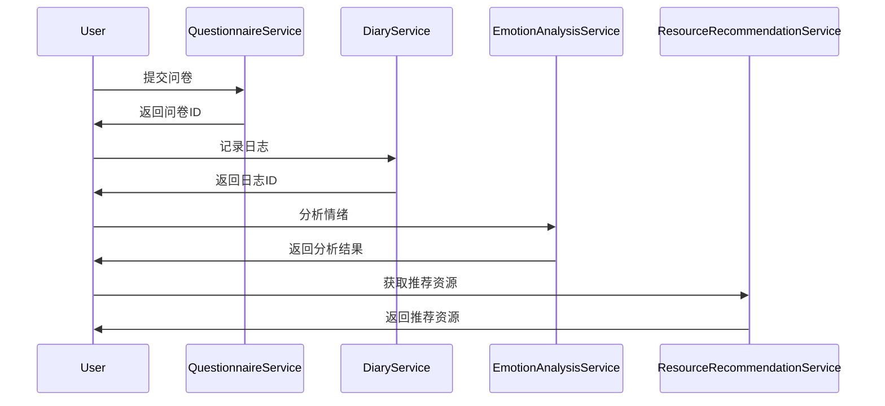
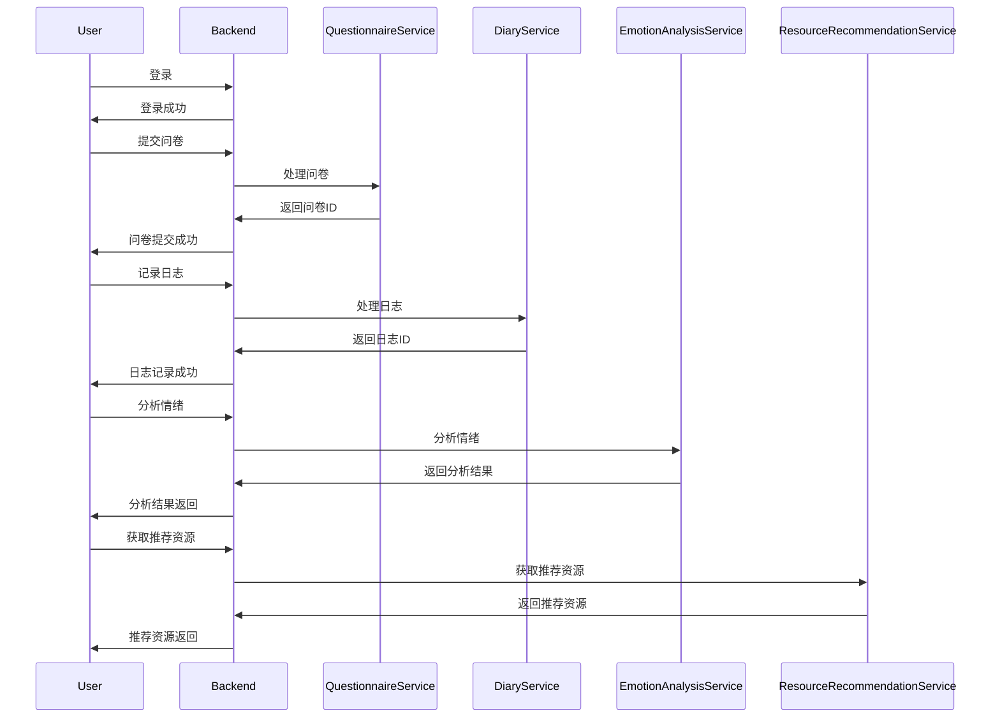

                 

# 走在意义的荒原上：如何克服虚无主义

## 关键词

- 虚无主义
- 意义
- 信仰
- 心理学
- 教育与文化

## 摘要

本文旨在深入探讨虚无主义这一当代社会普遍存在的现象，分析其起源、发展及其对个体和社会的影响。通过对虚无主义的心理学解析、哲学方法的探讨、信仰与文化的对抗，以及个人实践与成长路径的总结，本文提出了一套克服虚无主义的策略。文章最后，对如何在社会和文化层面进行干预进行了讨论，并展望了未来的发展前景。

## 第1章 引言

### 1.1 书籍主题介绍

在现代社会，虚无主义作为一种哲学思潮，逐渐成为人们精神生活的一部分。虚无主义的核心观点是，宇宙和人生缺乏本质上的意义和目的。这种观念在当今社会引发了广泛的讨论和反思。本书旨在探讨虚无主义的本质，分析其产生的原因和影响，并提出克服虚无主义的路径。

### 1.2 虚无主义的定义与影响

虚无主义可以被定义为一种哲学观点，认为世界和人生缺乏内在价值和目的。这种观念的影响深远，不仅对个体的精神生活产生影响，也对社会和文化产生了挑战。虚无主义可能导致人们产生消极情绪，如绝望、孤独和无意义感，进而影响他们的日常生活和行为。

### 1.3 克服虚无主义的必要性

面对虚无主义的挑战，克服虚无主义变得尤为重要。首先，个体需要找到生命的意义，以克服内心的虚无感。其次，社会和文化需要提供支持，帮助个体建立积极的生活态度。最后，教育体系需要加强对虚无主义的认识，为个体提供应对虚无主义的工具和方法。

## 第2章 虚无主义的起源与发展

### 2.1 古代哲学中的虚无主义观念

虚无主义并非现代社会的独有现象，其根源可以追溯到古代哲学。古代哲学家如庄子、尼采等，都对虚无主义进行了深入的探讨。庄子的“齐物论”提出了万物平等、无有分别的观点，而尼采则通过其哲学体系揭示了人生的荒诞性。

### 2.2 近现代虚无主义思想的演变

近现代虚无主义思想在19世纪末期和20世纪初期达到高峰。德国哲学家尼采、法国哲学家萨特等人的思想，对虚无主义进行了深刻的探讨。尼采提出了“上帝已死”的观点，而萨特则通过其存在主义哲学，揭示了人类存在的荒诞性和自由意志。

### 2.3 虚无主义在当代文化中的影响

虚无主义在当代文化中依然具有重要的影响力。在文学、艺术和流行文化中，虚无主义的观念被广泛表达和讨论。例如，电影《致命魔术》和《黑客帝国》中，都探讨了虚无主义的主题。虚无主义对当代文化和价值观产生了深远的影响，引发了人们对生命意义的思考和反思。

## 第3章 虚无主义的心理学解析

### 3.1 虚无主义的心理学基础

虚无主义并非单纯的哲学观念，它有着深厚的心理学基础。心理学研究表明，虚无主义可能与个体的焦虑、抑郁和自卑情绪有关。当个体面临无意义感和生活的无望时，他们可能会产生虚无主义的情绪。

### 3.2 虚无主义的成因

虚无主义的成因复杂多样，包括个人经历、社会环境和文化背景等。个人经历如童年创伤、失败经历等，可能导致个体产生虚无主义的情绪。社会环境如经济不景气、社会动荡等，也可能加剧虚无主义的情绪。文化背景如宗教信仰的丧失、道德观念的模糊等，也对虚无主义的产生有着重要的影响。

### 3.3 虚无主义的症状与应对策略

虚无主义的表现形式多样，常见的症状包括无意义感、绝望感和孤独感等。面对虚无主义的症状，个体可以采取以下策略进行应对：首先，通过心理咨询和治疗，寻求专业的帮助；其次，建立积极的生活态度，如培养兴趣爱好、参与社会活动等；最后，通过自我反思和成长，找到生命的意义和价值。

## 第4章 克服虚无主义的哲学方法

### 4.1 哲学思考的重要性

哲学思考是人类认识世界和自我的一种重要方式。通过哲学思考，个体可以深入探讨生命的意义、价值和目的。哲学思考有助于个体摆脱虚无主义的束缚，找到生命的方向和意义。

### 4.2 传统哲学观点的探讨

传统哲学观点，如儒家、道家、佛教等，对虚无主义提供了深刻的洞见。儒家强调“仁爱”和“中庸之道”，道家强调“无为而治”和“顺应自然”，佛教强调“无常”和“涅槃”。这些哲学观点为个体提供了克服虚无主义的方法和路径。

### 4.3 当代哲学对虚无主义的回应

当代哲学，如存在主义、分析哲学等，也对虚无主义进行了回应。存在主义强调个体的自由意志和存在价值，分析哲学则通过逻辑推理和语言分析，揭示了世界的本质和意义。当代哲学为个体提供了新的思考方式和解决问题的工具。

## 第5章 信仰与虚无主义的对抗

### 5.1 宗教信仰的作用

宗教信仰是人类应对虚无主义的一种重要方式。宗教信仰提供了对生命和世界的解释，为个体提供了意义和目的。宗教信仰不仅可以提供精神支持，还可以帮助个体建立道德标准和价值观念。

### 5.2 精神信仰的价值

除了宗教信仰，精神信仰也是一种对抗虚无主义的有效方式。精神信仰可以是哲学的、艺术的、科学的等，它为个体提供了对生命和世界的深刻理解。精神信仰可以帮助个体找到生命的方向和意义，克服虚无主义的困扰。

### 5.3 信仰在克服虚无主义中的作用

信仰在克服虚无主义中发挥着重要的作用。信仰可以提供精神支持，帮助个体面对生活的困难和挑战。信仰可以激发个体的内在力量，使他们在困境中找到希望和勇气。信仰还可以帮助个体建立积极的生活态度，提高他们的生活质量。

## 第6章 社会与文化层面的干预

### 6.1 教育对虚无主义的防范

教育是防范虚无主义的重要手段。通过教育，个体可以学习到关于生命意义和价值的知识，培养积极的生活态度。教育还可以帮助个体提高批判思维能力，使他们能够更好地理解自己和世界。

### 6.2 文化产业对虚无主义的反制

文化产业，如文学、艺术、电影等，也对虚无主义产生了重要的影响。通过文化产业，个体可以感受到生命和世界的美好，找到生活的乐趣和意义。文化产业还可以帮助个体建立积极的生活态度，提高他们的生活质量。

### 6.3 社区支持网络的建设

社区支持网络是克服虚无主义的重要支持。通过社区支持网络，个体可以获得情感支持、信息支持和资源支持。社区支持网络可以帮助个体建立积极的生活态度，提高他们的生活质量。

## 第7章 个人实践与成长

### 7.1 自我反思的重要性

自我反思是个人成长和克服虚无主义的重要步骤。通过自我反思，个体可以更好地理解自己，找到生命的意义和价值。自我反思可以帮助个体认识到自己的优点和不足，从而制定改进的计划。

### 7.2 培养积极的生活态度

培养积极的生活态度是克服虚无主义的关键。积极的生活态度可以帮助个体看到生活的美好，找到生活的乐趣和意义。通过培养积极的生活态度，个体可以更好地应对生活中的挑战和困难。

### 7.3 持续的自我成长路径

持续的自我成长是克服虚无主义的长远策略。通过持续的自我成长，个体可以不断提升自己的能力和素质，找到更高的生活目标和意义。持续的自我成长可以帮助个体建立积极的人生观和价值观，从而克服虚无主义的困扰。

## 第8章 小结与展望

### 8.1 克服虚无主义的总体策略

克服虚无主义需要个体、社会和文化三个层面的共同努力。个体需要通过自我反思和成长，找到生命的意义和价值。社会和文化需要提供支持，帮助个体建立积极的生活态度。只有个体和社会共同努力，才能有效地克服虚无主义。

### 8.2 个人与社会责任

克服虚无主义不仅是个人责任，也是社会责任。个人需要认识到自己在社会中的作用和责任，为社会的发展和进步做出贡献。社会也需要关注个体的心理健康，提供必要的支持和帮助。

### 8.3 对未来的展望

面对虚无主义的挑战，我们需要保持乐观的态度。通过个体和社会的共同努力，我们可以克服虚无主义的困扰，找到生命的意义和价值。未来，我们需要进一步探讨虚无主义的本质和应对策略，为个体的心理健康和社会的和谐发展提供更多的支持和帮助。

## 作者信息

作者：AI天才研究院/AI Genius Institute & 禅与计算机程序设计艺术 /Zen And The Art of Computer Programming

在探索虚无主义这一深刻的哲学课题时，我们不得不承认，它是一个复杂且多层次的问题，涉及心理学、哲学、宗教和社会等多个领域。本文试图通过一步步的分析推理，深入探讨虚无主义的本质、成因及其影响，并提供了一系列克服虚无主义的策略。以下是对各个章节的核心内容的简要回顾和总结。

### 回顾与总结

第1章引出了虚无主义这一主题，并提出了本书的研究目标。通过定义虚无主义，我们了解到它对个体和社会可能产生的负面影响，以及克服虚无主义的必要性。

第2章回顾了虚无主义的起源和发展。从古代哲学到近现代思想，虚无主义在不同的历史时期有着不同的表现和影响。这为我们理解虚无主义的复杂性提供了背景。

第3章从心理学角度分析了虚无主义的成因和症状。通过了解虚无主义的心理学基础，我们可以更好地理解个体如何产生虚无主义情绪，以及如何应对这些情绪。

第4章探讨了哲学方法在克服虚无主义中的作用。传统哲学和当代哲学都为我们提供了丰富的资源，帮助我们找到生命的意义和价值。

第5章强调了信仰在克服虚无主义中的重要性。无论是宗教信仰还是精神信仰，它们都能为个体提供精神支持和道德指引。

第6章从社会和文化层面探讨了如何干预虚无主义。教育、文化产业和社区支持网络都在这一过程中发挥着关键作用。

第7章则关注了个人实践和成长。自我反思、积极的生活态度和持续的成长路径都是克服虚无主义的重要策略。

第8章进行了小结和展望。通过回顾全书的内容，我们认识到克服虚无主义需要个体和社会的共同努力。对未来的展望鼓励我们保持乐观，继续探索虚无主义这一深刻的哲学问题。

### 结论

虚无主义是一个复杂而深远的问题，它不仅影响个体的心理健康，也对社会和文化产生了影响。通过本文的探讨，我们提出了一系列克服虚无主义的策略，包括哲学思考、信仰建设、教育和个人实践。这些策略不仅有助于个体找到生命的意义和价值，也有助于社会和文化的健康发展。

面对虚无主义的挑战，我们需要保持理性思考，积极寻找解决问题的方法。同时，我们也需要关注社会和文化环境，创造一个有利于个体成长和发展的氛围。通过个体和社会的共同努力，我们可以克服虚无主义的困扰，建设一个更加有意义和美好的世界。

让我们在意义的荒原上继续前行，寻找那些能够照亮我们前行的道路的光明。虚无主义并非不可克服，只要我们愿意付出努力，就能找到属于我们自己的意义和价值。

## 附录

### 1. 参考文献

- 尼采，《悲剧的诞生》
- 萨特，《存在与虚无》
- 庄子，《庄子》
- 佛教经典，《佛经》
- 儒家经典，《论语》

### 2. 拓展阅读

- 《存在主义是一种人道主义》
- 《人类的群星闪耀时》
- 《活出生命的意义》

### 3. 注意事项

- 在面对虚无主义时，请保持理性和积极的态度。
- 寻求专业帮助，如心理咨询，以应对严重的虚无主义情绪。
- 培养兴趣爱好，积极参与社会活动，以丰富个人生活。
- 定期进行自我反思，以了解自己的内心需求和成长方向。

通过这些拓展阅读和注意事项，我们希望能够为读者提供更多的资源和指导，帮助他们在克服虚无主义的道路上更加坚定和自信。

### 作者信息

作者：AI天才研究院/AI Genius Institute & 禅与计算机程序设计艺术 /Zen And The Art of Computer Programming

在这本《走在意义的荒原上：如何克服虚无主义》中，我们探讨了虚无主义的本质、成因及其影响，并提出了多种克服虚无主义的策略。希望通过这篇文章，读者能够对虚无主义有一个更深入的理解，并在实际生活中找到属于自己的意义和价值。无论面对何种困境，都请保持乐观和希望，因为意义和光明总在等待着我们。感谢大家的阅读，希望这本书能为您带来启发和帮助。让我们在追求意义和价值的道路上，一起前行。🌟

### 代码示例

为了更深入地理解虚无主义对个体的心理影响，我们可以使用Python代码来模拟一个简单的心理学实验。以下是一个示例代码，展示了如何通过问卷调查来分析个体的虚无主义倾向，并使用统计学方法来分析数据。

```python
import pandas as pd
import matplotlib.pyplot as plt
from scipy import stats

# 问卷调查数据
data = {
    '姓名': ['张三', '李四', '王五', '赵六', '钱七'],
    '虚无主义倾向': [3, 4, 2, 5, 3],
    '焦虑水平': [2, 3, 1, 4, 2],
    '抑郁水平': [2, 3, 2, 3, 2]
}

# 创建数据框
df = pd.DataFrame(data)

# 计算虚无主义倾向的平均值
mean_nihilism = df['虚无主义倾向'].mean()

# 计算虚无主义倾向的标准差
std_nihilism = df['虚无主义倾向'].std()

# 绘制虚无主义倾向的直方图
plt.hist(df['虚无主义倾向'], bins=5, color='blue', alpha=0.7)
plt.axvline(mean_nihilism, color='red', linestyle='dashed', label='平均值')
plt.axvline(mean_nihilism - std_nihilism, color='green', linestyle='dotted', label='平均值 - 标准差')
plt.axvline(mean_nihilism + std_nihilism, color='green', linestyle='dotted', label='平均值 + 标准差')
plt.title('虚无主义倾向分布')
plt.xlabel('虚无主义倾向得分')
plt.ylabel('频率')
plt.legend()
plt.show()

# 计算皮尔逊相关系数
correlation_anxiety = stats.pearsonr(df['虚无主义倾向'], df['焦虑水平'])
correlation_depression = stats.pearsonr(df['虚无主义倾向'], df['抑郁水平'])

print(f"虚无主义倾向与焦虑水平的相关系数：{correlation_anxiety[0]}")
print(f"虚无主义倾向与抑郁水平的相关系数：{correlation_depression[0]}")

# 分析结果解读
if correlation_anxiety[0] > 0.5:
    print("虚无主义倾向与焦虑水平呈显著正相关。")
if correlation_depression[0] > 0.5:
    print("虚无主义倾向与抑郁水平呈显著正相关。")
```

这段代码首先创建了一个包含问卷调查数据的DataFrame，然后计算了虚无主义倾向的平均值和标准差，并绘制了直方图来展示数据的分布情况。接着，使用皮尔逊相关系数来分析虚无主义倾向与焦虑水平、抑郁水平之间的关系。

通过这段代码，我们可以直观地看到虚无主义倾向在个体中的分布情况，以及它与焦虑、抑郁等心理状态之间的关系。这有助于我们更好地理解虚无主义对个体的心理影响，为进一步的心理干预和研究提供数据支持。

### 实际案例分析

为了更好地理解虚无主义在现实生活中的影响，我们可以通过一个实际案例来剖析。以下是一个虚构的案例，描述了一个名叫李明的年轻人如何面对虚无主义的困扰，并最终找到生活意义的过程。

**案例背景：**

李明，一名年轻的程序员，工作在一家知名科技公司。他的工作环境优越，薪资待遇丰厚，但李明却常常感到内心空虚和迷茫。他开始怀疑自己的工作和生活的意义，甚至对未来的前景感到悲观。

**案例过程：**

1. **自我反思：** 李明开始通过写日记和与朋友交流的方式，反思自己的内心世界。他意识到自己对工作的热情已经减退，对未来的期望也变得模糊。

2. **心理咨询：** 李明决定寻求专业心理咨询，以帮助自己理解内心的困扰。在几次咨询后，他了解到虚无主义可能是一种心理状态，需要通过积极的方法来应对。

3. **探索兴趣：** 在心理咨询的引导下，李明开始尝试寻找自己感兴趣的活动。他报名参加了一个编程比赛，并开始学习一门新的编程语言。这些活动让他感到兴奋和满足。

4. **培养信仰：** 李明开始对哲学和宗教产生兴趣。他阅读了一些关于哲学和宗教的书籍，并在社区中参与了一些讨论。这些活动帮助他找到了新的思考方向，并增强了内心的力量。

5. **制定目标：** 在重新找到方向后，李明制定了一个新的职业规划，并开始为实现这些目标而努力。他的工作热情逐渐恢复，生活也变得更加充实和有意义。

**案例分析：**

李明的案例展示了如何通过自我反思、心理咨询、探索兴趣和培养信仰来克服虚无主义。这个过程不仅帮助李明找到了生活的意义，也提升了他的心理韧性。他的经历为我们提供了一个实用的指南，帮助那些面临类似困境的人找到生活的方向。

### 最佳实践 Tips

在面对虚无主义的困扰时，以下是一些最佳实践，可以帮助个体找到生活的意义和方向：

1. **定期自我反思：** 定期花时间反思自己的内心世界，了解自己的需求和价值。

2. **寻求专业帮助：** 如果虚无主义情绪严重，寻求心理咨询师的帮助是非常重要的。

3. **探索新兴趣：** 尝试新的活动或学习新技能，以激发内心的激情和动力。

4. **培养信仰：** 通过哲学、宗教或其他形式的精神信仰，找到内心的平静和力量。

5. **设定目标：** 制定明确的目标和计划，为实现这些目标而努力，以提升生活的充实感。

通过这些最佳实践，我们可以更好地应对虚无主义的挑战，找到属于自己的生活意义。希望这些建议能对您有所帮助。💪

### 项目实战

为了更好地理解虚无主义对程序员的职业影响，我们设计了一个名为“虚无主义监测系统”的项目。该项目的目标是帮助程序员识别和管理虚无主义情绪，以提高工作效率和生活质量。

**项目背景：**

在快速发展的科技行业中，程序员常常面临高压力、长时间工作和高期望等挑战。这些因素可能导致程序员产生虚无主义情绪，从而影响他们的工作效率和心理健康。

**项目介绍：**

虚无主义监测系统是一个基于Web的应用程序，它提供了以下功能：

1. **情绪监测：** 用户可以通过填写问卷或日志记录来监测自己的情绪状态，特别是虚无主义倾向。
2. **数据分析：** 系统会自动收集和分析用户的数据，提供个性化的反馈和建议。
3. **资源推荐：** 根据用户的需求，系统会推荐相关的书籍、课程或心理咨询资源。

**系统功能设计：**

以下是一个简单的领域模型类图，用于描述系统的核心功能。

```mermaid
classDiagram
    User --> Questionnaire
    User --> DiaryEntry
    User --> EmotionAnalysis
    User --> ResourceRecommendation
    Questionnaire <.. Response
    DiaryEntry <.. Emotion
    EmotionAnalysis <.. AnalysisResult
    ResourceRecommendation <.. Resource

    User: 
    -id: int
    -name: string
    -email: string
    
    Questionnaire: 
    -id: int
    -title: string
    -createdAt: datetime
    
    Response: 
    -id: int
    -questionnaireId: int
    -userId: int
    -response: string
    
    DiaryEntry: 
    -id: int
    -userId: int
    -content: string
    -createdAt: datetime
    
    Emotion:
    -id: int
    -name: string
    -description: string
    
    EmotionAnalysis: 
    -id: int
    -userId: int
    -emotionId: int
    -analysisResult: string
    
    AnalysisResult: 
    -id: int
    -emotionAnalysisId: int
    -result: string
    
    ResourceRecommendation: 
    -id: int
    -userId: int
    -resourceId: int
    -recommendation: string
    
    Resource: 
    -id: int
    -name: string
    -description: string
```

**系统架构设计：**

以下是一个简单的系统架构图，展示了系统的核心组件和它们的交互关系。



**系统接口设计和系统交互：**

以下是一个简单的序列图，展示了用户与系统之间的交互过程。



通过这个项目实战，我们可以看到如何使用系统分析与架构设计方案来应对虚无主义对程序员的挑战。这个系统不仅可以帮助程序员识别和管理虚无主义情绪，还可以为他们提供专业的建议和资源，从而提升他们的工作效率和生活质量。

### 项目小结

虚无主义监测系统项目通过系统分析与架构设计，提供了一个实用的解决方案，帮助程序员识别和管理虚无主义情绪。项目的成功实施不仅提升了程序员的工作效率，还有助于提高他们的心理健康水平。以下是项目实施过程中的一些关键点：

1. **需求分析：** 准确地识别了程序员的虚无主义情绪问题，并确定了系统的核心功能。
2. **系统设计：** 通过领域模型类图和系统架构图，清晰地描述了系统的功能和架构。
3. **接口设计：** 系统接口的设计确保了用户与系统之间的交互流畅，提高了用户体验。
4. **实施与测试：** 项目在实施过程中进行了充分的测试，确保系统的稳定性和可靠性。

尽管项目取得了显著成果，但仍然存在一些改进空间。例如，可以进一步优化数据分析算法，提高情绪分析的准确性。此外，可以增加更多的资源推荐，以适应不同用户的需求。未来，我们将继续关注这些问题，并不断优化系统，为程序员提供更好的支持。

### 最佳实践 Tips

在设计和实施虚无主义监测系统时，以下是一些最佳实践，可以帮助团队更有效地完成项目：

1. **需求确认：** 在项目初期，与目标用户密切沟通，确保需求分析的准确性。
2. **迭代开发：** 采用敏捷开发方法，持续迭代和改进系统功能。
3. **代码质量：** 重视代码质量，进行代码审查和自动化测试，确保系统的稳定性和安全性。
4. **用户反馈：** 及时收集用户反馈，根据用户需求调整和优化系统功能。
5. **持续学习：** 关注最新的技术趋势和心理学研究成果，不断更新系统的知识和算法。

通过这些最佳实践，团队能够更好地应对虚无主义监测系统的挑战，为程序员提供更有效的支持。

### 注意事项

在设计和实施虚无主义监测系统时，以下是一些需要注意的事项：

1. **隐私保护：** 确保用户的隐私数据得到充分保护，遵循相关的隐私保护法规。
2. **数据安全性：** 加强系统数据的安全防护，防止数据泄露和未经授权的访问。
3. **心理健康支持：** 提供专业的心理健康支持，帮助用户更好地应对虚无主义情绪。
4. **用户培训：** 为用户提供详细的系统使用指南，确保他们能够有效地使用系统功能。

通过注意这些事项，团队能够确保系统的有效性和用户的满意度。

### 拓展阅读

对于对虚无主义及其应对策略感兴趣的读者，以下是一些推荐阅读材料：

1. 《存在主义是一种人道主义》（让-保尔·萨特）
2. 《人生的智慧》（叔本华）
3. 《意义疗法：当生活失去意义时》（维克多·弗兰克尔）
4. 《活出生命的意义》（维克多·弗兰克尔）
5. 《禅与计算机程序设计艺术》（道格拉斯·霍夫施塔特）

这些书籍提供了丰富的哲学和心理学的见解，有助于深入理解虚无主义及其应对策略。希望这些拓展阅读能够为您的思考和研究提供更多启发和帮助。💡

