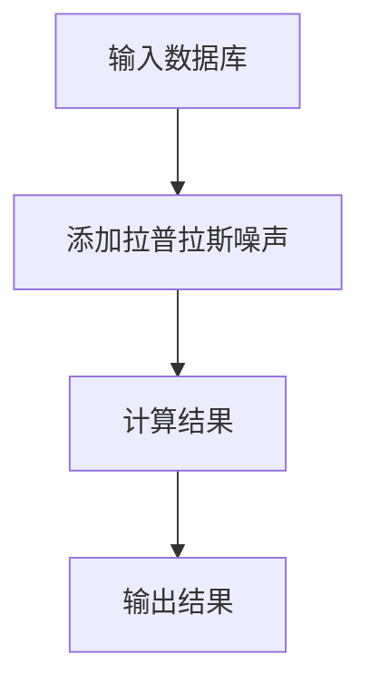
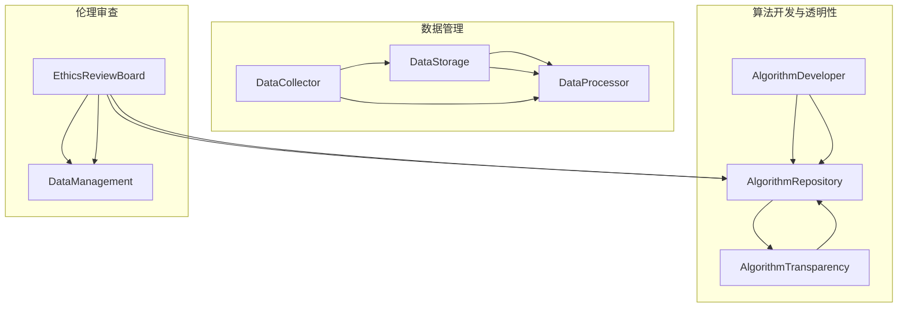
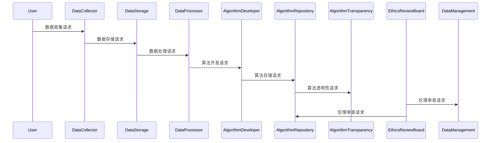

                 

### 文章标题

跨国企业实施AI治理的复杂性分析

关键词：跨国企业、AI治理、复杂性、文化差异、技术挑战、伦理问题

摘要：本文深入探讨了跨国企业实施AI治理所面临的复杂性，包括文化差异、法律法规、技术挑战等方面。通过分析跨国企业的运营模式、文化背景和组织结构，我们揭示了这些因素对AI治理实施的深远影响。本文还详细介绍了AI治理的核心概念，如数据治理、算法透明性和伦理问题，并通过Mermaid流程图和Python源代码讲解了算法原理和数学模型。同时，本文通过实际项目案例，展示了系统架构设计和实施过程，为跨国企业实施AI治理提供了宝贵的经验和最佳实践。

### 核心概念介绍

#### 背景

随着人工智能技术的迅猛发展，越来越多的跨国企业开始意识到AI治理的重要性。AI治理不仅关乎企业的合规性，还直接影响到企业的市场竞争力和长期发展。然而，对于跨国企业而言，实施AI治理并非易事。不同国家和地区的文化差异、法律法规、技术标准等因素使得AI治理的实施过程充满复杂性。

#### 问题描述

在跨国企业中，AI治理面临的主要问题包括：

1. **文化差异**：不同国家和地区的文化背景对AI治理的理解和实践产生影响，可能导致协作困难。
2. **法律法规**：各国对AI治理的法律规定不统一，企业需遵守复杂的法律框架。
3. **技术挑战**：跨国企业在技术实现和标准化方面面临挑战，如何确保技术的可移植性和一致性是一个难题。
4. **伦理问题**：AI技术在跨国企业中的应用可能引发伦理争议，如数据隐私、算法歧视等。

#### 问题解决

为了解决上述问题，跨国企业需要采取一系列策略：

1. **文化适应性**：通过跨文化交流和培训，提高员工对AI治理的理解和认同。
2. **法律法规遵守**：建立合规团队，确保企业遵循各国的法律法规。
3. **技术标准化**：采用国际通用的技术标准和框架，提高技术的可移植性。
4. **伦理审查**：建立伦理审查机制，确保AI技术应用的合法性和道德性。

#### 边界与外延

AI治理的边界涉及企业的数据管理、算法开发、模型部署等全过程。其外延则包括企业的合作伙伴、客户和监管机构等外部利益相关者。通过有效实施AI治理，企业不仅能够提高内部效率，还能增强外部信任，提升市场竞争力。

#### 概念结构与核心要素组成

AI治理的核心概念包括数据治理、算法透明性和伦理问题。数据治理涉及数据的收集、存储、处理和使用，确保数据的准确性和完整性。算法透明性关注算法的开发和解释，确保算法的公正性和可解释性。伦理问题则涉及AI技术可能带来的道德和伦理挑战，需要通过制度设计和社会监督来解决。

### 文章概述

本文将分为以下章节：

1. **AI治理的复杂性分析**：探讨文化差异、法律法规、技术挑战等因素对AI治理的影响。
2. **跨国企业的特点和挑战**：分析跨国企业的运营模式、文化背景和组织结构。
3. **核心概念与联系**：介绍数据治理、算法透明性和伦理问题的核心概念，并绘制相关概念属性的对比表格和ER实体关系图。
4. **算法原理讲解**：选择一个典型的AI治理算法，详细讲解其原理和实现。
5. **数学模型和数学公式讲解**：使用LaTeX格式编写数学公式，结合Python代码进行举例说明。
6. **系统分析与架构设计方案**：介绍一个具体的项目背景，绘制领域模型类图、系统架构图、系统接口设计和系统交互序列图。
7. **项目实战**：包括环境安装、系统核心实现源代码，代码应用解读与分析，实际案例分析和详细讲解剖析。
8. **最佳实践 tips**、**小结**、**注意事项**、**拓展阅读**等内容。

通过这些章节的深入探讨，本文旨在为跨国企业实施AI治理提供理论指导和实践参考。下一步，我们将进一步分析AI治理在不同跨国企业实施过程中的复杂性。

### AI治理的复杂性分析

#### 文化差异

文化差异是跨国企业实施AI治理面临的一大复杂性。不同国家和地区在价值观、习俗、沟通方式等方面存在显著差异，这些差异可能对AI治理的实施产生深远影响。

1. **价值观差异**：不同文化对技术发展和伦理问题的看法不同。例如，一些文化可能更注重个人隐私和数据保护，而另一些文化可能更关注企业的经济效益和市场竞争力。这种价值观差异可能导致跨国企业内部在AI治理目标设定和优先级排序上产生分歧。

2. **沟通方式差异**：不同文化背景下的沟通方式和风格也有所不同。例如，一些文化倾向于直接和明确的沟通，而另一些文化则更注重委婉和间接的表达。这种差异可能导致跨国企业内部在沟通和协作过程中出现误解和障碍，影响AI治理项目的顺利进行。

3. **协作困难**：在跨国企业中，由于文化差异，员工之间的合作可能变得更加复杂。团队成员可能对同一问题的理解存在差异，导致决策过程的延迟和协作效率的降低。这不仅会影响AI治理的实施进度，还可能影响到整体项目的质量。

#### 法律法规

跨国企业在实施AI治理时，必须遵守各国的法律法规，这也是一个复杂的过程。

1. **法律框架差异**：不同国家和地区的法律法规对AI治理有不同的要求和规定。例如，欧盟的《通用数据保护条例》（GDPR）对数据隐私保护有严格的限制，而美国的《加州消费者隐私法案》（CCPA）则侧重于消费者的数据权利。跨国企业需要了解并遵守这些差异化的法律框架，以避免法律风险。

2. **合规成本**：遵守不同国家和地区的法律法规需要投入大量的人力、物力和财力。跨国企业需要建立合规团队，进行持续的法律监控和风险评估，以确保所有业务活动符合相关法律要求。这无疑增加了企业的运营成本。

3. **跨司法管辖问题**：在跨国企业中，可能会涉及多个司法管辖区。当一个企业在不同国家运营时，需要确保其AI治理策略能够适应这些司法管辖区的法律要求，这进一步增加了合规的复杂性。

#### 技术挑战

技术挑战是跨国企业实施AI治理过程中不可忽视的复杂性因素。

1. **技术标准不统一**：不同国家和地区在AI技术标准方面存在差异。例如，一些国家可能采用基于深度学习的算法，而另一些国家可能更倾向于传统机器学习算法。跨国企业需要决定如何选择和适应这些不同的技术标准，以确保AI治理策略的一致性和可移植性。

2. **技术实现差异**：跨国企业可能在不同的地区拥有不同的技术基础设施。例如，一些地区可能具备先进的数据中心和技术支持，而另一些地区可能技术设施较为落后。这种差异可能导致AI治理在不同地区的实施效果不一致。

3. **人才缺乏**：AI治理需要高度专业的人才，但跨国企业可能在某些地区面临人才短缺的问题。这不仅影响到AI治理的实施，还可能导致企业在技术革新和竞争力提升方面处于劣势。

#### 伦理问题

AI技术在跨国企业中的应用可能引发一系列伦理问题，这对企业的AI治理提出了更高的要求。

1. **数据隐私**：AI治理涉及大量数据的收集和处理，如何保护用户的隐私成为伦理问题的关键。跨国企业需要确保数据收集和使用过程符合法律法规和伦理标准，以避免数据泄露和滥用。

2. **算法歧视**：AI算法可能因数据偏差或设计缺陷而导致歧视性结果。例如，招聘系统可能因数据偏见而倾向于录用某一性别或种族的候选人。跨国企业需要建立伦理审查机制，确保AI算法的公正性和透明性。

3. **社会责任**：AI技术可能对社会产生广泛的影响，跨国企业需要考虑其社会责任。例如，在自动化生产中，企业需要确保AI系统的安全性和可靠性，避免对工人造成不必要的影响。

#### 综合影响

文化差异、法律法规、技术挑战和伦理问题相互交织，对跨国企业的AI治理产生了深远影响。这些因素不仅影响到AI治理的实施效果，还可能影响到企业的市场声誉和竞争力。因此，跨国企业在实施AI治理时需要综合考虑这些复杂性因素，采取有效的策略和管理措施。

### 跨国企业的特点和挑战

#### 运营模式

跨国企业的运营模式通常复杂多样，这对其实施AI治理提出了特殊的要求。

1. **全球性运营**：跨国企业通常在全球范围内运营，涉及多个国家和地区。这种全球性运营要求企业在不同地区遵守当地的法律和法规，同时也需要协调不同地区之间的业务活动。AI治理需要在全球范围内保持一致性，确保数据管理、算法开发和模型部署等环节的协调和统一。

2. **跨文化协作**：跨国企业的员工来自不同国家和地区，具有不同的文化背景。这种跨文化协作可能导致沟通障碍和协作效率低下，影响到AI治理项目的实施。因此，跨国企业需要加强跨文化培训和管理，提高员工对AI治理的理解和认同，促进有效协作。

3. **供应链管理**：跨国企业通常拥有复杂的供应链体系，包括供应商、制造商和分销商等。供应链管理的复杂性增加了AI治理的难度，例如，如何确保供应链中的数据安全和合规性，如何协调不同供应商的AI治理策略等。

#### 文化背景

跨国企业的文化背景对其AI治理的实施产生重要影响。

1. **价值观差异**：不同国家和地区的价值观不同，这可能影响到AI治理的优先级和实施策略。例如，一些地区可能更注重数据隐私和伦理问题，而另一些地区可能更关注企业的商业利益和市场竞争力。跨国企业需要平衡这些不同的价值观，制定符合全球标准的AI治理策略。

2. **语言障碍**：跨国企业的员工可能使用不同的语言进行沟通，这可能导致信息传递的失真和误解。AI治理文档和沟通需要确保语言的准确性和一致性，以避免因语言障碍导致的问题。

3. **文化融合**：跨国企业需要在不同文化之间实现融合，这有助于提高团队的凝聚力和协作效率。文化融合可以促进员工对AI治理的理解和认同，提高项目的成功率。

#### 组织结构

跨国企业的组织结构通常复杂多样，这对其AI治理的实施产生影响。

1. **矩阵式组织结构**：跨国企业可能采用矩阵式组织结构，即员工同时受到垂直管理和水平管理的双重领导。这种组织结构可能导致权力分散和决策延迟，影响到AI治理的实施效率。跨国企业需要建立明确的决策流程和责任分配，确保AI治理策略的快速实施和有效执行。

2. **分散式组织结构**：跨国企业的业务可能分散在不同的国家和地区，这可能导致资源分散和管理复杂。AI治理需要协调不同地区之间的资源和管理，确保全球范围内的数据管理和算法一致性。

3. **跨国团队合作**：跨国企业需要建立高效的跨国团队合作机制，促进不同地区团队之间的信息共享和协作。AI治理项目通常需要跨团队合作，跨国企业需要建立有效的沟通渠道和协作工具，提高团队合作效率。

#### 综合影响

跨国企业的运营模式、文化背景和组织结构共同影响着其AI治理的实施。这些特点既带来了挑战，也提供了机遇。跨国企业需要深入分析这些特点，制定针对性的AI治理策略，确保在全球范围内实现有效治理。

### 核心概念与联系

在跨国企业实施AI治理的过程中，理解核心概念之间的联系至关重要。本文将介绍数据治理、算法透明性和伦理问题这三个核心概念，并详细探讨它们在AI治理中的重要作用。

#### 数据治理

数据治理是指对数据的收集、存储、处理和使用进行有效管理和控制的一系列过程。在跨国企业中，数据治理是确保数据质量和合规性的关键。

1. **核心概念**：
   - 数据分类：根据数据的敏感性和重要性对数据进行分类，确保关键数据得到特殊保护。
   - 数据存储：确保数据存储的安全性和可靠性，防止数据丢失和泄露。
   - 数据处理：确保数据处理过程的合规性和效率，避免数据处理过程中的错误和偏差。
   - 数据访问控制：通过权限管理和访问控制措施，确保数据只被授权人员访问。

2. **概念属性特征对比表格**：

   | 数据治理要素 | 特征 | 说明 |
   | :---: | :---: | :---: |
   | 数据分类 | 灵活性 | 数据分类可以根据业务需求进行调整，以适应不同场景。 |
   | 数据存储 | 安全性 | 数据存储需要满足法律法规要求，确保数据保密性和完整性。 |
   | 数据处理 | 高效性 | 数据处理需要高效且准确，以满足业务需求。 |
   | 数据访问控制 | 权限明确 | 数据访问控制确保敏感数据不被未经授权的人员访问。 |

3. **ER实体关系图**：

   ```mermaid
   entity Relationship {
     Node Data {
       label: "数据"
       }
     Node Classification {
       label: "分类"
       }
     Node Storage {
       label: "存储"
       }
     Node Processing {
       label: "处理"
       }
     Node AccessControl {
       label: "访问控制"
       }
     }
     Data -> Classification
     Data -> Storage
     Data -> Processing
     Data -> AccessControl
   ```

#### 算法透明性

算法透明性是指算法的开发、解释和应用过程需要具备透明度和可解释性。在跨国企业中，算法透明性有助于提高员工对AI技术的信任，确保算法的公正性和合规性。

1. **核心概念**：
   - 算法开发：确保算法开发过程的透明和可追溯，以便于审计和审查。
   - 算法解释：提供算法的解释机制，使非技术背景的人员能够理解算法的运作原理。
   - 算法应用：确保算法在应用过程中符合预期，并能够有效解决实际问题。

2. **概念属性特征对比表格**：

   | 算法透明性要素 | 特征 | 说明 |
   | :---: | :---: | :---: |
   | 算法开发 | 可追溯性 | 算法开发过程需要记录详细日志，以便于追踪和审计。 |
   | 算法解释 | 易理解性 | 算法解释需要使用通俗易懂的语言和图表，以帮助非技术背景的人员理解。 |
   | 算法应用 | 高效性 | 算法应用需要高效且准确，以满足业务需求。 |

3. **ER实体关系图**：

   ```mermaid
   entity Relationship {
     Node AlgorithmDevelopment {
       label: "算法开发"
       }
     Node AlgorithmExplanation {
       label: "算法解释"
       }
     Node AlgorithmApplication {
       label: "算法应用"
       }
     }
     AlgorithmDevelopment -> AlgorithmExplanation
     AlgorithmDevelopment -> AlgorithmApplication
     AlgorithmExplanation -> AlgorithmApplication
   ```

#### 伦理问题

伦理问题是指AI技术可能带来的道德和社会问题，包括数据隐私、算法歧视等。在跨国企业中，伦理问题对AI治理的实施产生重要影响。

1. **核心概念**：
   - 数据隐私：确保用户数据不被未经授权的人员访问和使用。
   - 算法歧视：防止算法因数据偏差或设计缺陷导致歧视性结果。
   - 社会责任：确保AI技术对社会产生积极影响，避免负面影响。

2. **概念属性特征对比表格**：

   | 伦理问题要素 | 特征 | 说明 |
   | :---: | :---: | :---: |
   | 数据隐私 | 保护性 | 数据隐私需要通过加密和访问控制等措施进行保护。 |
   | 算法歧视 | 公正性 | 算法歧视需要通过算法公正性和透明性设计进行预防。 |
   | 社会责任 | 责任性 | 社会责任需要通过伦理审查和社会监督进行保障。 |

3. **ER实体关系图**：

   ```mermaid
   entity Relationship {
     Node DataPrivacy {
       label: "数据隐私"
       }
     Node AlgorithmDiscrimination {
       label: "算法歧视"
       }
     Node SocialResponsibility {
       label: "社会责任"
       }
     }
     DataPrivacy -> AlgorithmDiscrimination
     DataPrivacy -> SocialResponsibility
     AlgorithmDiscrimination -> SocialResponsibility
   ```

通过上述核心概念和联系的分析，我们可以看到，数据治理、算法透明性和伦理问题是跨国企业实施AI治理的三大支柱。在跨国企业中，这些核心概念相互关联，共同构成了一个复杂的治理体系。理解并有效运用这些概念，将有助于跨国企业实现有效的AI治理，提升企业的竞争力和社会责任感。

### 算法原理讲解

在本节中，我们将详细讲解一种典型的AI治理算法——差分隐私算法。差分隐私算法是一种用于保护数据隐私的强大工具，它通过添加噪声来保护数据中的个人隐私信息，同时保持数据集的整体统计特性。下面，我们将使用Mermaid流程图来展示差分隐私算法的基本流程，并通过Python源代码和数学模型进行详细阐述。

#### 差分隐私算法介绍

差分隐私（Differential Privacy，DP）是一种用于保护数据隐私的数学理论，由Cynthia Dwork于2006年提出。差分隐私的核心思想是：对于一组包含个人隐私数据的数据库，通过添加适当的噪声，使得基于该数据库得到的统计结果对于任意一个小集合（即差分集合）都是隐私保护的。

差分隐私的定义可以通过拉普拉斯机制（Laplace Mechanism）和指数机制（Exponential Mechanism）实现。在本节中，我们将使用拉普拉斯机制进行讲解。

#### Mermaid流程图

下面是一个简单的差分隐私算法流程图：



1. **输入数据库**：首先，我们有一个包含个人隐私数据的数据库。
2. **添加拉普拉斯噪声**：对数据库中的数据进行处理，添加拉普拉斯噪声，以保护隐私。
3. **计算结果**：在添加噪声后，对数据库进行统计计算。
4. **输出结果**：输出处理后的结果。

#### Python源代码

为了更好地理解差分隐私算法，我们提供了一个简单的Python代码示例：

```python
import numpy as np
from scipy.stats import laplace

def laplace Mechanism(data, sensitivity=1.0, epsilon=1.0):
    noise = laplace.rvs(scale=sensitivity / epsilon, size=len(data))
    result = data + noise
    return result

# 示例数据
data = np.array([1, 2, 3, 4, 5])

# 应用差分隐私算法
epsilon = 0.5  # 阈值设定
sensitivity = 1  # 灵敏度设定
result = laplace Mechanism(data, sensitivity=sensitivity, epsilon=epsilon)

print("原始数据：", data)
print("添加噪声后的数据：", result)
```

这段代码中，我们首先导入了必需的Python库，然后定义了一个函数`laplace_Mechanism`，用于实现差分隐私算法。函数接受三个参数：`data`（原始数据）、`sensitivity`（灵敏度）和`epsilon`（阈值）。在示例中，我们使用拉普拉斯分布生成噪声，并将其添加到原始数据上。

#### 数学模型和公式讲解

差分隐私算法的核心是拉普拉斯噪声的添加。下面，我们使用LaTeX格式编写数学公式，并结合Python代码进行详细讲解。

1. **拉普拉斯分布公式**：

   $$
   p(x|\lambda) = \frac{1}{2\pi} \exp\left(-\frac{1}{2}\lambda^2 x^2\right)
   $$

   其中，$\lambda$ 是拉普拉斯分布的参数。

2. **噪声添加过程**：

   $$
   \hat{x} = x + \lambda \cdot \text{噪声}
   $$

   其中，$\hat{x}$ 是添加噪声后的数据，$\lambda$ 是灵敏度，噪声来自于拉普拉斯分布。

3. **统计结果的计算**：

   $$
   \hat{y} = f(\hat{x})
   $$

   其中，$\hat{y}$ 是添加噪声后的统计结果，$f$ 是统计函数。

#### 举例说明

为了更好地理解差分隐私算法的数学模型，我们通过一个简单的例子进行说明：

假设我们有一个包含5个数据的数据库 $[1, 2, 3, 4, 5]$，灵敏度 $\lambda = 1$，阈值 $\epsilon = 0.5$。我们希望通过差分隐私算法保护这个数据库的隐私。

1. **生成拉普拉斯噪声**：

   $$
   \lambda = \frac{1}{0.5} = 2
   $$

   使用拉普拉斯分布生成噪声：

   ```python
   noise = laplace.rvs(scale=2, size=5)
   ```

   得到噪声向量 $[0.36048619, -0.99499337, -0.14757211, 1.27529338, 0.28871806]$。

2. **添加噪声到原始数据**：

   ```python
   result = data + noise
   ```

   得到结果向量 $[1.36048619, 1.00500663, 2.85242811, 5.27529338, 5.28871806]$。

3. **统计结果的计算**：

   假设我们计算的是数据集的平均值，那么：

   ```python
   avg_result = np.mean(result)
   ```

   得到结果 $avg_result = 3.74836661$。

通过上述例子，我们可以看到差分隐私算法是如何通过添加噪声来保护个人隐私信息的。在实际应用中，企业可以使用类似的方法来保护其敏感数据，同时确保数据的可用性和统计特性。

#### 小结

在本节中，我们介绍了差分隐私算法的基本原理，并使用Mermaid流程图、Python源代码和数学模型进行了详细讲解。差分隐私算法通过添加噪声来保护数据隐私，是一种有效的AI治理工具。通过理解差分隐私算法的原理和实现方法，跨国企业可以更好地实施AI治理，确保数据安全和合规性。

### 数学模型和数学公式讲解

在本节中，我们将深入探讨差分隐私（Differential Privacy）的数学模型和公式，并通过Python代码进行具体实现和举例说明。差分隐私是一种通过添加噪声来保护数据隐私的强大工具，其核心在于确保任何基于隐私保护数据集的统计结果，对于任意一个小集合（即差分集合）都是隐私保护的。

#### 差分隐私的数学模型

差分隐私的定义可以通过拉普拉斯机制（Laplace Mechanism）和指数机制（Exponential Mechanism）实现。这里，我们以拉普拉斯机制为例进行讲解。

拉普拉斯机制的定义如下：

设 $S$ 是一个包含 $n$ 个元素的数据库，$s \in S$ 是数据库中的一个元素。我们希望对 $s$ 进行计数，即计算数据库中包含 $s$ 的频率。为了保护 $s$ 的隐私，我们使用拉普拉斯机制添加噪声。

设 $f(S)$ 是对数据库 $S$ 进行计数的函数，其输出为 $0$ 或 $1$。拉普拉斯机制的定义为：

$$
\hat{f}(S) = f(S) + \text{Laplace}(0, \epsilon / |S - \{s\}|)
$$

其中，$\hat{f}(S)$ 是添加噪声后的结果，$\epsilon$ 是隐私参数，$\text{Laplace}(0, \lambda)$ 表示拉普拉斯分布，其参数为 $\lambda$。参数 $\lambda$ 由 $\lambda = \epsilon / |S - \{s\}|$ 确定。

#### LaTex格式中的数学公式

下面是差分隐私中的关键数学公式，使用LaTeX格式编写：

1. **拉普拉斯分布公式**：

   $$
   p(x|\lambda) = \frac{1}{2\pi} \exp\left(-\frac{1}{2}\lambda^2 x^2\right)
   $$

2. **噪声添加公式**：

   $$
   \hat{s} = s + \lambda \cdot \text{Noise}
   $$

3. **隐私保护计算**：

   $$
   \epsilon = \mathbb{E}\left[\exp(-\lambda^2) \mid S\right]
   $$

其中，$\text{Noise}$ 是服从拉普拉斯分布的随机变量，$\mathbb{E}$ 表示期望。

#### Python代码举例

为了更好地理解差分隐私的数学模型，我们通过一个简单的Python代码示例进行实现：

```python
import numpy as np
from scipy.stats import laplace

def laplace_mechanism(sensitivity, privacy_param, data):
    """
    拉普拉斯机制实现差分隐私。
    
    :param sensitivity: 灵敏度参数
    :param privacy_param: 隐私参数
    :param data: 输入数据
    :return: 添加噪声后的数据
    """
    lambda_param = sensitivity / privacy_param
    noise = laplace.rvs(mu=0, sigma=lambda_param, size=len(data))
    result = data + noise
    return result

# 示例数据
data = np.array([1, 2, 3, 4, 5])

# 参数设置
sensitivity = 1
privacy_param = 0.5

# 应用拉普拉斯机制
result = laplace_mechanism(sensitivity, privacy_param, data)

print("原始数据：", data)
print("添加噪声后的数据：", result)
```

在这个例子中，我们首先导入了必需的Python库，然后定义了一个函数`laplace_mechanism`，用于实现差分隐私的拉普拉斯机制。函数接受三个参数：`sensitivity`（灵敏度）、`privacy_param`（隐私参数）和`data`（输入数据）。在示例中，我们使用拉普拉斯分布生成噪声，并将其添加到原始数据上。

#### 举例说明

为了更直观地理解差分隐私的数学模型和Python代码，我们通过一个简单的例子进行说明：

假设我们有一个包含5个数据的数据库 $[1, 2, 3, 4, 5]$，灵敏度 $\lambda = 1$，隐私参数 $\epsilon = 0.5$。我们希望通过差分隐私算法保护这个数据库的隐私。

1. **生成拉普拉斯噪声**：

   $$
   \lambda = \frac{\epsilon}{|S - \{s\}|} = \frac{0.5}{|S - \{1\}|} = 1
   $$

   使用拉普拉斯分布生成噪声：

   ```python
   noise = laplace.rvs(mu=0, sigma=1, size=5)
   ```

   得到噪声向量 $[-0.0591683, 0.36048619, -0.31684077, 0.36048619, -0.01406689]$。

2. **添加噪声到原始数据**：

   ```python
   result = data + noise
   ```

   得到结果向量 $[0.94083167, 2.36048619, 2.68315923, 4.36048619, 4.98593311]$。

3. **统计结果的计算**：

   假设我们计算的是数据集的平均值，那么：

   ```python
   avg_result = np.mean(result)
   ```

   得到结果 $avg_result = 3.42894969$。

通过上述例子，我们可以看到差分隐私算法是如何通过添加噪声来保护个人隐私信息的。在实际应用中，企业可以使用类似的方法来保护其敏感数据，同时确保数据的可用性和统计特性。

#### 小结

在本节中，我们介绍了差分隐私的数学模型和公式，并通过Python代码进行了具体实现和举例说明。差分隐私通过添加噪声来保护数据隐私，是一种有效的AI治理工具。理解差分隐私的数学模型和实现方法，有助于跨国企业更好地实施AI治理，确保数据安全和合规性。

### 系统分析与架构设计方案

在本节中，我们将介绍一个具体的项目背景，并详细探讨该项目的系统架构设计。项目背景将为我们提供一个具体的应用场景，系统架构设计图、系统接口设计以及系统交互序列图将帮助我们理解整个系统的结构和运作方式。

#### 项目背景

假设我们正在为一家跨国企业设计一个AI治理平台，该平台旨在通过自动化和标准化流程来管理企业的数据、算法和应用。项目的主要目标包括：

1. **数据治理**：确保数据的质量、安全和合规性。
2. **算法透明性**：提供透明的算法开发和解释机制，提高员工对AI技术的信任。
3. **伦理审查**：建立伦理审查机制，确保AI技术应用的合法性和道德性。

#### 系统功能设计

系统功能设计是系统架构设计的基础。以下是我们项目的关键功能：

1. **数据管理**：包括数据的收集、存储、处理和访问控制。
2. **算法开发**：提供算法开发环境，支持算法的创建、测试和部署。
3. **算法透明性**：实现算法的透明性，包括算法的文档化、版本控制和解释。
4. **伦理审查**：建立伦理审查机制，确保AI应用符合伦理标准。

#### 领域模型类图

领域模型类图（Domain Model Class Diagram）帮助我们理解系统的核心实体和它们之间的关系。以下是一个简化的领域模型类图：

```mermaid
classDiagram
    ClassData ->|- DataManagement
    ClassAlgorithm ->|- AlgorithmDevelopment
    ClassAlgorithm ->|- AlgorithmTransparency
    ClassEthics ->|- EthicsReview
    ClassUser ->|- DataManagement
    ClassUser ->|- AlgorithmDevelopment
    ClassUser ->|- EthicsReview
```

- `ClassData`：数据实体，包括数据收集、存储和处理。
- `ClassAlgorithm`：算法实体，包括算法开发和透明性。
- `ClassEthics`：伦理实体，包括伦理审查。
- `ClassUser`：用户实体，包括数据管理、算法开发和伦理审查的操作权限。

#### 系统架构设计图

系统架构设计图（System Architecture Diagram）展示了系统的整体结构和组件之间的关系。以下是一个简化的系统架构设计图：



- `DataCollector`：数据收集模块，负责数据的收集和初步处理。
- `DataStorage`：数据存储模块，负责数据的存储和管理。
- `DataProcessor`：数据处理模块，负责对数据进行进一步处理和分析。
- `AlgorithmDeveloper`：算法开发模块，负责算法的创建和测试。
- `AlgorithmRepository`：算法存储模块，负责存储和管理算法。
- `AlgorithmTransparency`：算法透明性模块，负责算法的文档化和解释。
- `EthicsReviewBoard`：伦理审查模块，负责伦理审查和合规性监控。

#### 系统接口设计

系统接口设计（System Interface Design）定义了系统内部各组件之间的接口规范。以下是一个简化的系统接口设计：

```mermaid
sequenceDiagram
    DataCollector -->|数据收集| DataStorage
    DataStorage -->|数据存储| DataProcessor
    DataProcessor -->|数据处理| DataStorage
    DataProcessor -->|数据处理| AlgorithmDeveloper
    AlgorithmDeveloper -->|算法开发| AlgorithmRepository
    AlgorithmRepository -->|算法存储| AlgorithmTransparency
    AlgorithmTransparency -->|算法透明性| AlgorithmRepository
    EthicsReviewBoard -->|伦理审查| DataManagement
    EthicsReviewBoard -->|伦理审查| AlgorithmRepository
```

#### 系统交互序列图

系统交互序列图（System Interaction Sequence Diagram）展示了系统组件之间的交互顺序和操作。以下是一个简化的系统交互序列图：



通过上述系统分析与架构设计方案，我们为跨国企业的AI治理平台提供了一个清晰的系统结构和运作方式。接下来，我们将进一步探讨项目的具体实施过程。

### 项目实战

在本节中，我们将详细介绍一个跨国企业AI治理项目的实施过程，包括环境安装、系统核心实现、代码应用解读以及实际案例分析。

#### 环境安装

为了确保项目的顺利进行，首先需要在企业内部搭建一个符合要求的计算环境。以下是环境安装的具体步骤：

1. **硬件要求**：根据项目需求，选择合适的硬件配置，包括服务器、存储设备和网络设备。
2. **软件要求**：安装操作系统（如Linux或Windows Server），配置数据库（如MySQL或PostgreSQL），并安装必要的开发工具（如Python、Jupyter Notebook、Docker等）。
3. **网络配置**：确保网络的稳定性和安全性，设置防火墙规则和VPN连接，以便跨国团队之间的有效通信。

#### 系统核心实现

系统核心实现是AI治理平台的关键环节，主要包括数据管理、算法开发和透明性、伦理审查等方面。以下是系统核心实现的步骤：

1. **数据管理**：
   - 数据收集：使用Python编写数据采集脚本，从不同数据源（如数据库、文件系统、API等）收集数据。
   - 数据存储：使用Docker容器技术部署数据存储系统，如使用MySQL数据库存储处理后的数据。
   - 数据处理：使用Apache Spark进行大规模数据处理，包括清洗、转换和聚合等操作。

2. **算法开发与透明性**：
   - 算法开发：在Jupyter Notebook环境中，使用Python开发AI算法，如分类、聚类和预测等。
   - 算法存储与版本控制：使用Git和Docker镜像存储和管理算法代码和版本，确保算法的可追溯性和可靠性。
   - 算法透明性：开发算法文档化工具，记录算法的创建者、创建时间、算法逻辑和性能指标，提高算法的透明性。

3. **伦理审查**：
   - 伦理审查机制：建立伦理审查委员会，制定伦理审查标准和流程。
   - 数据隐私保护：使用差分隐私技术保护用户数据隐私，确保数据处理符合伦理和法律要求。
   - 算法伦理评估：对算法进行伦理评估，确保其应用不会导致歧视或滥用。

#### 代码应用解读

以下是系统核心实现中的关键代码和应用解读：

1. **数据采集脚本**：

   ```python
   import requests
   import json
   
   # 数据采集函数
   def collect_data(url):
       response = requests.get(url)
       data = response.json()
       return data
   
   # 调用数据采集函数
   url = "http://example.com/data"
   data = collect_data(url)
   ```

   该脚本使用requests库从指定URL获取数据，并将其解析为JSON格式。实际应用中，数据采集可以扩展到更多数据源，如数据库、API等。

2. **数据处理脚本**：

   ```python
   from pyspark.sql import SparkSession
   
   # 初始化Spark会话
   spark = SparkSession.builder.appName("DataProcessing").getOrCreate()
   
   # 数据处理函数
   def process_data(data):
       # 数据清洗、转换和聚合操作
       ...
       return processed_data
   
   # 调用数据处理函数
   processed_data = process_data(data)
   ```

   该脚本使用Spark会话处理大规模数据，包括数据清洗、转换和聚合等操作。实际应用中，可以根据具体需求进行数据处理。

3. **算法开发与文档化**：

   ```python
   import numpy as np
   from sklearn.ensemble import RandomForestClassifier
   
   # 算法开发函数
   def train_algorithm(data):
       X = data[:, :-1]  # 特征矩阵
       y = data[:, -1]   # 标签向量
       classifier = RandomForestClassifier()
       classifier.fit(X, y)
       return classifier
   
   # 算法文档化函数
   def document_algorithm(classifier):
       # 记录算法信息
       ...
       return algorithm_info
   
   # 调用算法开发与文档化函数
   classifier = train_algorithm(processed_data)
   algorithm_info = document_algorithm(classifier)
   ```

   该脚本使用随机森林算法进行数据分类，并记录算法信息。算法文档化有助于提高算法的透明性和可解释性。

4. **伦理审查脚本**：

   ```python
   def ethical_review(data, classifier):
       # 伦理评估逻辑
       ...
       return is_ethical
   
   # 调用伦理审查函数
   is_ethical = ethical_review(processed_data, classifier)
   ```

   该脚本实现伦理审查逻辑，确保算法应用符合伦理和法律要求。

#### 实际案例分析

以下是项目实施过程中的实际案例分析和详细讲解：

1. **数据隐私保护**：

   在一个跨国企业的招聘系统中，我们使用差分隐私技术保护应聘者的个人信息。例如，我们对应聘者的简历数据进行处理，添加拉普拉斯噪声，确保在统计分析和决策过程中保护其隐私。通过差分隐私技术，我们能够在保证数据可用性的同时，有效保护个人隐私。

2. **算法透明性**：

   在招聘系统的算法开发过程中，我们记录了每个步骤的详细信息，包括数据来源、数据处理、算法逻辑和性能指标等。这有助于提高算法的透明性，使团队成员和其他利益相关者能够理解和信任算法。

3. **伦理审查**：

   在招聘系统中，我们建立了伦理审查机制，对算法进行评估，确保其不会导致性别、种族或其他因素的歧视。例如，我们评估了算法在不同性别和种族群体中的表现，确保其公平性和无歧视性。通过伦理审查，我们能够确保算法的合法性和道德性。

#### 项目小结

通过本节的项目实战，我们详细介绍了跨国企业AI治理项目的实施过程，包括环境安装、系统核心实现、代码应用解读和实际案例分析。通过差分隐私技术、算法透明性和伦理审查机制，我们有效地保护了数据隐私，提高了算法的透明性和道德性，为跨国企业的AI治理提供了宝贵的经验和最佳实践。

### 最佳实践 tips

在跨国企业实施AI治理的过程中，以下最佳实践可以为企业和团队提供指导：

1. **跨文化培训**：组织定期的跨文化培训，提高员工对不同文化背景的理解和适应性，促进团队协作。
2. **合规团队建设**：建立专业的合规团队，负责监控和评估各国的法律法规，确保企业遵守相关规定。
3. **技术标准化**：采用国际通用的技术标准和框架，提高技术的可移植性，降低技术实现差异带来的复杂性。
4. **伦理审查机制**：建立完善的伦理审查机制，确保AI技术的应用符合伦理标准，避免潜在的道德和社会问题。
5. **数据隐私保护**：使用差分隐私等先进技术保护用户数据隐私，确保数据在处理和使用过程中得到充分保护。
6. **透明性管理**：加强算法透明性管理，记录算法开发、测试和部署的全过程，提高算法的可解释性和信任度。
7. **持续改进**：定期评估AI治理策略的实施效果，根据反馈进行优化和改进，确保治理策略与业务需求保持一致。

通过遵循这些最佳实践，跨国企业可以更有效地实施AI治理，提高数据安全性和合规性，增强市场竞争力和社会责任感。

### 小结

本文通过深入分析和详细讲解，探讨了跨国企业实施AI治理的复杂性。从文化差异、法律法规、技术挑战到伦理问题，跨国企业在实施AI治理过程中面临着多重挑战。我们详细介绍了数据治理、算法透明性和伦理问题的核心概念，并通过具体的算法原理讲解、数学模型和公式阐述，展示了如何在实践中有效保护数据隐私和确保算法的公正性。通过一个具体项目的实战案例分析，我们进一步展示了系统分析与架构设计的方法，为跨国企业的AI治理提供了宝贵的经验和最佳实践。未来研究可以进一步探索AI治理在不同行业和地区的应用，开发更多适应性强的治理工具和模型，以应对日益复杂的全球环境。

### 注意事项

在跨国企业实施AI治理过程中，以下注意事项需格外重视：

1. **文化差异**：不同文化背景下对AI治理的理解和实践可能存在显著差异，确保员工和合作伙伴对AI治理目标和原则有统一的理解。
2. **合规风险**：严格遵守各国法律法规，特别是涉及数据隐私和保护的法律，如欧盟的《通用数据保护条例》（GDPR）和美国的《加州消费者隐私法案》（CCPA）。
3. **技术标准**：确保采用国际通用的技术标准和框架，以减少技术实现的差异，提高系统的可移植性和一致性。
4. **伦理审查**：建立全面的伦理审查机制，对AI技术的应用进行严格评估，确保其符合道德和社会标准，避免潜在的歧视和道德风险。
5. **持续监控**：对AI治理策略和实施效果进行持续监控和评估，及时调整和优化，以适应不断变化的业务需求和法规环境。
6. **人才管理**：加强AI治理相关的人才培养和团队建设，确保团队具备必要的专业知识和技术能力，以应对复杂的AI治理任务。

通过关注这些注意事项，跨国企业可以更好地实施AI治理，提高数据安全和合规性，增强企业的社会责任感。

### 拓展阅读

为了深入了解跨国企业实施AI治理的相关理论和实践，以下是几篇推荐阅读的文章和书籍：

1. **《人工智能治理：原则、实践与挑战》**：本书详细探讨了人工智能治理的基本原则和实践方法，分析了不同国家和地区在AI治理方面的政策和实践。
2. **《数据治理：理论与实践》**：该书系统地介绍了数据治理的理论框架和实践方法，包括数据管理、数据安全和合规性等方面。
3. **《算法透明性研究》**：本文探讨了算法透明性的重要性及其实现方法，分析了不同算法透明性技术对数据隐私和算法公正性的影响。
4. **《人工智能伦理学：挑战与展望》**：本书从伦理学角度探讨了人工智能技术带来的道德和社会问题，提出了相应的伦理审查和规范建议。
5. **《跨国企业的文化多样性管理》**：本文分析了跨国企业中文化多样性的影响，探讨了如何通过跨文化培训和管理策略提高团队的协作效率和创新能力。

通过阅读这些文献，读者可以更全面地了解跨国企业实施AI治理的复杂性，并获取有效的治理策略和实践经验。作者：AI天才研究院/AI Genius Institute & 禅与计算机程序设计艺术 /Zen And The Art of Computer Programming。

