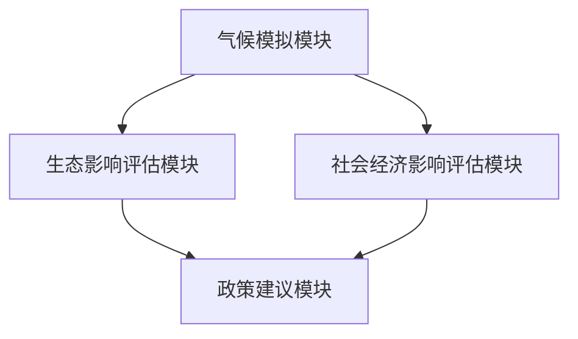
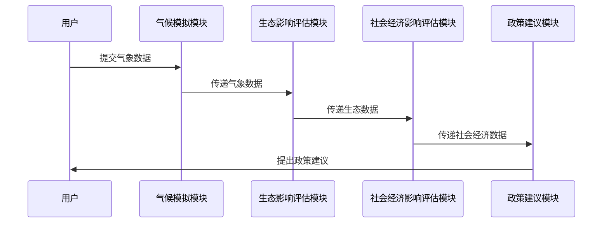
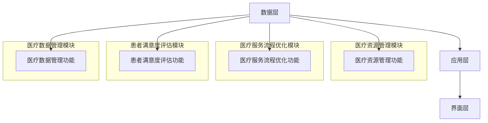
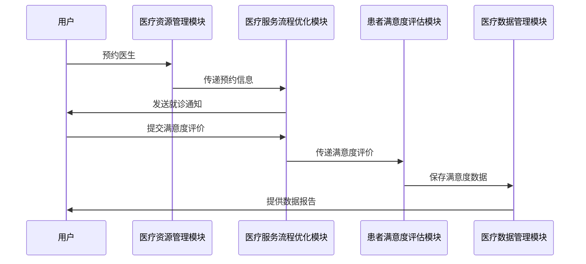
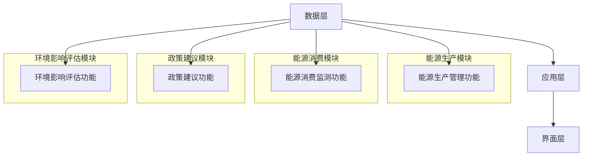
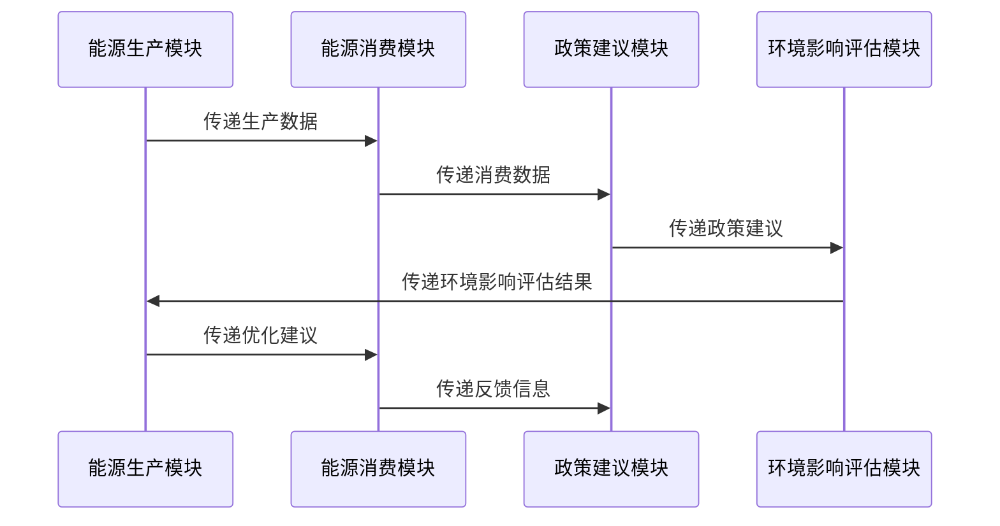

                 

## 第一部分：引言与背景

### 1.1 研究背景

在当今世界，全球性问题日益复杂，单一学科的研究往往难以应对这些复杂问题。例如，气候变化、疾病防控、能源危机等问题，不仅涉及自然科学，还涉及社会科学、工程技术等多个领域。这种跨学科的研究需求日益凸显，跨学科研究逐渐成为解决复杂问题的关键途径。

**问题背景**：随着全球问题的复杂性和多样性不断增加，单一学科的研究难以独立解决问题。例如，气候变化问题不仅涉及气象学、地理学等自然科学领域，还涉及经济学、社会学等社会科学领域。同样，疾病防控不仅需要医学知识，还需要公共卫生政策、信息技术等领域的支持。单一学科的研究在应对这些问题时往往力不从心，跨学科研究因此变得尤为重要。

**问题描述**：跨学科研究如何推动世界可理解性的提升？跨学科研究的本质是通过不同学科之间的知识交叉和融合，形成新的理论和方法，从而提升我们对复杂世界的理解和应对能力。然而，跨学科研究面临诸多挑战，如学科壁垒、研究方法差异、资源分配等。如何有效克服这些挑战，实现跨学科研究的成功，是当前亟待解决的问题。

**问题解决**：为了解决这些问题，跨学科研究的方法论和实际应用成为关键。我们需要深入理解跨学科研究的定义、特点和重要性，探索跨学科研究的方法论基础和实践案例，从而为跨学科研究的成功提供指导和借鉴。

**边界与外延**：跨学科研究的边界在于不同学科之间的交叉融合，其外延则涉及多个学科的领域，如自然科学、社会科学、工程技术等。跨学科研究不仅限于学术领域，还广泛应用于工业、农业、医疗等各个领域。

**核心概念与联系**：跨学科研究的核心概念包括跨学科视角、跨学科方法论、核心概念和跨学科研究的伦理与可持续性。这些概念相互关联，共同构成了跨学科研究的理论基础。

### 1.2 跨学科研究的定义与特点

跨学科研究是指多个学科领域的知识交叉、融合和创新，通过跨学科视角和方法，解决复杂问题，推动科学进步和社会发展。其特点主要包括综合性、开放性和创新性。

**定义**：跨学科研究是不同学科领域之间的知识交叉和融合，通过跨学科视角和方法，形成新的理论和方法，解决复杂问题。跨学科研究不仅涉及自然科学，还包括社会科学、工程技术、人文艺术等多个领域。

**特点**：

1. **综合性**：跨学科研究需要综合多个学科的知识和方法，形成整体性认识，从而解决复杂问题。
2. **开放性**：跨学科研究具有开放性，鼓励不同学科之间的交流与合作，吸收不同学科的优点，形成新的理论和方法。
3. **创新性**：跨学科研究通过跨学科视角和方法，推动科学技术的创新，促进新理论和新技术的诞生。

### 1.3 跨学科研究的重要性

跨学科研究在解决全球问题和推动科学创新方面具有重要作用。

**全球问题解决**：跨学科研究有助于解决气候变化、疾病防控、能源危机等全球性问题。例如，气候变化问题需要结合气象学、地理学、经济学等多个学科的知识，通过跨学科研究，制定有效的应对策略。同样，疾病防控需要医学、公共卫生政策、信息技术等领域的协同合作，跨学科研究为疾病防控提供了有力的支持。

**科学创新**：跨学科研究推动科学创新，促进新理论和新技术的诞生。跨学科研究通过不同学科之间的知识交叉和融合，产生新的理论和方法，从而推动科学技术的进步。例如，量子计算、人工智能等前沿技术的突破，离不开跨学科研究的支持。

**社会进步**：跨学科研究对社会进步具有积极影响。通过跨学科研究，可以推动政策制定、产业转型、教育改革等领域的进步。例如，智能城市建设需要跨学科研究，结合信息技术、城市规划、环境科学等多个领域的知识，实现城市智慧化管理。

### 1.4 跨学科研究的挑战与机遇

跨学科研究虽然具有重要意义，但也面临诸多挑战和机遇。

**挑战**：

1. **学科壁垒**：不同学科之间存在壁垒，研究方法和知识体系差异较大，跨学科研究需要克服这些障碍。
2. **研究方法差异**：跨学科研究需要综合多种研究方法，如定性研究、定量研究、模拟实验等，如何有效整合这些方法仍是一个挑战。
3. **资源分配**：跨学科研究涉及多个学科领域，资源分配不均衡可能导致研究难以顺利进行。

**机遇**：

1. **协同创新**：跨学科研究鼓励不同学科之间的协同合作，通过整合各自优势，实现创新突破。
2. **跨学科合作模式**：随着全球化和数字化的发展，跨学科合作模式不断创新，如跨国合作、跨行业合作等，为跨学科研究提供了新的机遇。
3. **社会需求**：全球性问题日益复杂，社会对跨学科研究的期望和需求不断增加，为跨学科研究提供了广阔的应用前景。

### 1.5 本书结构概述

本书旨在系统介绍跨学科研究的理论与实践，旨在为跨学科研究提供指导和借鉴。本书结构如下：

1. **引言与背景**：介绍跨学科研究的背景、定义、重要性和挑战。
2. **跨学科研究方法论**：阐述跨学科研究的方法论基础、核心概念和实际应用。
3. **跨学科研究实践案例**：分析多个跨学科研究实践案例，展示跨学科研究的实际应用。
4. **跨学科研究的未来趋势**：探讨跨学科研究的未来方向、技术发展趋势和社会文化影响。
5. **最佳实践与总结**：总结跨学科研究的最佳实践，提出注意事项，展望跨学科研究的未来。

通过本书，读者可以全面了解跨学科研究的理论和实践，为跨学科研究提供有益的参考和指导。

---

## 第二部分：跨学科研究方法论

### 2.1 跨学科研究的方法论基础

跨学科研究的方法论基础是其成功的关键。为了更好地理解跨学科研究，我们需要从跨学科视角和方法入手，探讨跨学科研究的逻辑和方法。

**跨学科视角**：跨学科研究要求研究者具备跨学科视角，即能够从不同学科的角度看待和解决问题。这种视角有助于我们突破学科壁垒，发现不同学科之间的联系和交叉点。例如，在研究气候变化问题时，不仅需要从气象学的角度，还需要从经济学、社会学等角度进行综合分析，从而找到更有效的解决方案。

**跨学科方法论**：跨学科方法论是跨学科研究的关键，它包括多种研究方法和技巧，帮助我们实现跨学科知识的交叉和融合。以下是一些常见的跨学科方法论：

1. **案例研究**：通过研究特定案例，揭示跨学科问题背后的复杂性和多样性。案例研究可以帮助我们了解不同学科在解决问题时的优势和不足，从而为跨学科合作提供有价值的参考。
2. **综合评估**：综合评估是跨学科研究中的重要方法，它通过整合不同学科的评价指标，对研究对象进行全面评估。综合评估有助于我们发现跨学科问题的潜在影响，为决策提供科学依据。
3. **跨学科对话**：跨学科对话是促进不同学科之间交流与合作的重要手段。通过跨学科对话，研究者可以分享各自的研究成果和见解，发现问题的共同点，从而推动跨学科研究的进展。

**跨学科方法的应用**：

1. **定量方法**：定量方法在跨学科研究中具有重要作用，如数据分析、模拟实验等。这些方法可以帮助我们定量地描述跨学科问题，从而为研究提供精确的数据支持。
2. **定性方法**：定性方法在跨学科研究中同样重要，如访谈、案例研究等。这些方法可以帮助我们深入了解跨学科问题的背景和细节，从而为定量方法提供补充。
3. **混合方法**：混合方法是将定量方法和定性方法相结合，以获得更全面、准确的研究结果。跨学科研究通常采用混合方法，以充分发挥不同方法的优点。

### 2.2 跨学科研究的核心概念

在跨学科研究中，一些核心概念起着关键作用。这些概念不仅帮助我们理解跨学科研究的本质，还为跨学科研究提供了理论基础。以下是一些重要的跨学科研究核心概念：

**复杂性科学**：复杂性科学是研究复杂系统及其行为的科学。复杂系统通常具有多层次、多变量和动态特征，其行为往往难以用单一学科的理论和方法进行解释。复杂性科学通过研究复杂系统的特性，为跨学科研究提供了新的视角和方法。

**系统思维**：系统思维是跨学科研究的重要思维方式。它强调从整体和系统的角度看待问题，关注系统内部各个组成部分之间的相互作用和反馈机制。系统思维有助于我们理解跨学科问题，发现不同学科之间的联系，从而找到更有效的解决方案。

**跨学科协同**：跨学科协同是跨学科研究的关键。跨学科协同强调不同学科之间的合作和交流，通过整合各自的优势，实现资源的优化配置和协同创新。跨学科协同有助于我们应对复杂问题，推动科学技术的进步和社会的发展。

**概念联系**：以下是一个简化的概念联系表格，展示了复杂性科学、系统思维和跨学科协同之间的关系：

| 概念        | 关系                      |
| ----------- | ------------------------ |
| 复杂性科学  | 基础，为跨学科研究提供理论支持 |
| 系统思维    | 工具，帮助理解跨学科问题     |
| 跨学科协同  | 实践，实现跨学科合作与创新   |

通过这个表格，我们可以看到，复杂性科学为跨学科研究提供了理论基础，系统思维是理解和解决跨学科问题的重要工具，而跨学科协同则是实现跨学科合作和创新的关键实践。

### 2.3 跨学科研究方法的应用

在实际跨学科研究中，不同的研究方法有着各自的应用场景和优势。以下我们将探讨跨学科研究中的定量方法、定性方法和混合方法，并举例说明它们在跨学科研究中的应用。

**定量方法**：定量方法是跨学科研究中常用的方法之一，它通过数据分析、模拟实验等方式，对跨学科问题进行定量描述和评估。定量方法的特点在于其精确性和可重复性，能够为跨学科研究提供可靠的数据支持。

1. **数据分析**：数据分析是定量方法的核心。通过收集和分析大量的数据，研究者可以揭示跨学科问题的特征和规律。例如，在气候变化研究中，研究者可以通过数据分析，了解不同地区气候变化的趋势和影响因子。
2. **模拟实验**：模拟实验是一种通过计算机模拟来研究复杂系统的方法。它可以在虚拟环境中模拟跨学科问题的发生和发展，为研究者提供实验数据。例如，在医疗资源分配研究中，研究者可以通过模拟实验，评估不同分配策略对医疗资源利用效率的影响。

**定性方法**：定性方法是跨学科研究中另一种重要的方法，它通过访谈、案例研究等方式，对跨学科问题进行深入分析和理解。定性方法的特点在于其深入性和灵活性，能够为跨学科研究提供丰富的背景信息和洞察力。

1. **访谈**：访谈是一种通过与专家、利益相关者等进行面对面交流，获取深入信息的方法。通过访谈，研究者可以了解不同学科领域的研究者对跨学科问题的看法和经验，从而为跨学科研究提供有价值的见解。例如，在疾病防控研究中，研究者可以通过访谈医生、患者和公共卫生专家，了解他们在疾病防控方面的需求和挑战。
2. **案例研究**：案例研究是一种通过深入研究特定案例，揭示跨学科问题本质的方法。通过案例研究，研究者可以详细了解跨学科问题的具体表现和解决方案，从而为跨学科研究提供实践指导。例如，在能源转型研究中，研究者可以通过对成功转型案例的深入分析，了解其在政策制定、技术创新和产业协同方面的关键成功因素。

**混合方法**：混合方法是跨学科研究中的一种创新方法，它将定量方法和定性方法相结合，以获得更全面、准确的研究结果。混合方法的特点在于其综合性和灵活性，能够充分发挥不同方法的优点，提高跨学科研究的有效性和可靠性。

1. **整合数据与背景信息**：在混合方法中，研究者可以通过整合定量数据和定性背景信息，形成对跨学科问题的全面认识。例如，在智能城市建设研究中，研究者可以通过数据分析了解城市运行数据，同时通过访谈和案例研究了解市民的需求和反馈，从而为智能城市建设提供科学依据。
2. **验证与反思**：混合方法中的定量和定性方法可以相互验证和反思，以提高研究结果的可靠性和有效性。例如，在医疗资源分配研究中，研究者可以通过定量方法评估不同分配策略的效率，同时通过定性方法了解医疗资源的实际使用情况，从而验证定量分析结果的准确性。

**具体应用案例**：

1. **案例一：气候变化研究**：
   - **定量方法**：研究者通过数据分析，收集了全球不同地区的气候数据，如温度、降雨量等，并使用模拟实验预测未来气候变化的趋势。
   - **定性方法**：研究者通过访谈和案例研究，了解了不同地区居民对气候变化的看法和应对措施。
   - **混合方法**：研究者将定量数据和定性背景信息结合，形成了对气候变化问题的全面认识，并为政策制定提供了科学依据。
2. **案例二：健康医疗研究**：
   - **定量方法**：研究者通过数据分析，分析了大量医疗数据，如病例记录、医疗费用等，以了解医疗资源的使用情况。
   - **定性方法**：研究者通过访谈医生、患者和公共卫生专家，了解了医疗资源的分配情况和实际需求。
   - **混合方法**：研究者将定量数据和定性背景信息结合，提出了优化医疗资源配置的建议，并进行了案例分析验证。

通过这些具体案例，我们可以看到，跨学科研究方法的应用不仅能够帮助我们解决复杂问题，还能够提高研究结果的可靠性和有效性。

### 2.4 跨学科研究的伦理与可持续性

跨学科研究在推动科学进步和社会发展方面具有重要意义，但也面临着一系列伦理和可持续性问题。这些问题关系到跨学科研究的正当性和可持续性，需要我们在研究中予以充分关注。

**伦理考量**：

1. **研究过程中**：跨学科研究涉及多个学科领域，研究者可能需要访问和使用不同学科的敏感数据和资源。因此，研究过程中必须遵守伦理规范，确保数据安全和隐私保护。例如，在医疗数据研究中，研究者必须遵守相关法律法规，保护患者的隐私。
2. **研究责任**：跨学科研究不仅需要关注科学问题的解决，还需要关注社会影响。研究者需要承担社会责任，确保研究不会对环境和人类社会造成负面影响。例如，在环保研究中，研究者需要评估研究对环境的影响，并提出可持续的解决方案。
3. **合作与共赢**：跨学科研究通常需要不同学科领域的专家合作，因此需要建立良好的合作机制，确保各方权益。研究者需要尊重合作方的知识产权和研究成果，避免利益冲突。

**可持续性**：

1. **资源利用**：跨学科研究需要大量的人、财、物资源，因此需要合理规划和利用这些资源，确保研究的可持续性。例如，在跨学科团队中，需要合理分配资源，避免资源浪费。
2. **长期影响**：跨学科研究不仅关注短期成果，还需要关注长期影响。研究者需要评估研究对社会和环境的长远影响，并提出相应的政策建议。
3. **知识传播**：跨学科研究的成果需要得到广泛传播和应用，以实现知识的可持续性。研究者需要通过各种渠道，如学术会议、出版物等，分享研究成果，促进知识传播。

通过关注伦理和可持续性问题，跨学科研究可以更好地服务于社会，实现科学和社会的可持续发展。

---

## 第三部分：跨学科研究实践案例

### 3.1 案例研究1：气候变化

#### 问题场景

气候变化是当今全球面临的最严重挑战之一。气候变化不仅影响生态环境，还对人类社会、经济和基础设施产生深远影响。为了应对气候变化，需要跨学科合作，整合自然科学、社会科学和工程技术等领域的知识。

#### 项目介绍

本项目由一支多学科团队共同完成，包括气象学、生态学、经济学、环境工程和公共政策等领域的专家。项目目标是通过跨学科研究，提出有效的气候变化应对策略，并为政策制定提供科学依据。

#### 系统功能设计

为了实现项目目标，团队设计了以下功能模块：

1. **气候模拟模块**：利用气象学模型，模拟未来气候变化趋势，为决策提供数据支持。
2. **生态影响评估模块**：评估气候变化对生态系统的影响，包括生物多样性、水资源和土地利用等。
3. **社会经济影响评估模块**：评估气候变化对社会经济的影响，包括农业、渔业、旅游业等。
4. **政策建议模块**：基于前三个模块的结果，提出具体的政策建议，包括减排措施、适应策略和绿色发展等。

#### 系统架构设计

系统架构采用模块化设计，以实现各模块之间的有效协作。以下是系统架构设计图：

#### 系统接口设计

系统接口设计包括以下模块：

1. **数据接口**：用于获取和处理各类数据，如气象数据、生态数据和社会经济数据。
2. **模型接口**：用于调用不同的模型，如气候模拟模型、生态影响评估模型等。
3. **报告接口**：用于生成和分析各类报告，包括气候模拟报告、生态影响评估报告和社会经济影响评估报告等。

#### 系统交互

系统交互设计采用序列图，以下是系统交互示意图：

通过这个案例，我们可以看到跨学科研究在解决气候变化问题中的应用。跨学科研究不仅整合了不同领域的知识，还通过系统架构设计和系统交互设计，实现了各模块之间的有效协作，为应对气候变化提供了科学依据和策略。

### 3.2 案例研究2：健康医疗

#### 问题场景

健康医疗是一个复杂的领域，涉及临床医学、公共卫生、信息技术等多个学科。如何提高医疗资源利用效率、优化医疗服务流程、提升患者满意度，是当前健康医疗领域亟待解决的问题。

#### 项目介绍

本项目由一支多学科团队共同完成，包括临床医生、公共卫生专家、信息技术工程师和医疗管理人员。项目目标是通过跨学科研究，提出优化医疗资源分配和医疗服务流程的策略，提高医疗服务质量和效率。

#### 系统功能设计

为了实现项目目标，团队设计了以下功能模块：

1. **医疗资源管理模块**：用于管理和调度医疗资源，包括医生、护士、药品和设备等。
2. **医疗服务流程优化模块**：用于优化医疗服务流程，包括预约、就诊、检查和治疗等。
3. **患者满意度评估模块**：用于评估患者对医疗服务的满意度，提供改进建议。
4. **医疗数据管理模块**：用于收集、存储和管理患者医疗数据，实现数据共享和智能分析。

#### 系统架构设计

系统架构采用分层设计，包括数据层、应用层和界面层。以下是系统架构设计图：

#### 系统接口设计

系统接口设计包括以下模块：

1. **API接口**：用于不同模块之间的数据交互和功能调用。
2. **数据库接口**：用于与后台数据库进行数据通信。
3. **用户接口**：用于与患者和医护人员进行交互。

#### 系统交互

系统交互设计采用序列图，以下是系统交互示意图：

通过这个案例，我们可以看到跨学科研究在健康医疗领域的应用。跨学科研究不仅整合了不同领域的知识，还通过系统架构设计和系统交互设计，实现了医疗资源管理、医疗服务流程优化和患者满意度评估的有机结合，为提高医疗服务质量和效率提供了有效方案。

### 3.3 案例研究3：能源转型

#### 问题场景

能源转型是当今世界面临的重要挑战之一。传统化石能源的使用导致环境污染和气候变化，因此需要转向清洁能源，如太阳能、风能等。能源转型不仅涉及能源技术，还涉及政策、经济和社会等多个领域。

#### 项目介绍

本项目由一支多学科团队共同完成，包括能源工程师、经济学家、环境科学家、政策分析师和社会学家。项目目标是通过跨学科研究，提出有效的能源转型策略，促进清洁能源的发展和普及。

#### 系统功能设计

为了实现项目目标，团队设计了以下功能模块：

1. **能源生产模块**：用于清洁能源的生产和管理，包括太阳能、风能、水能等。
2. **能源消费模块**：用于监测和优化能源消费，包括家庭、工业和交通等。
3. **政策建议模块**：基于前两个模块的结果，提出具体的政策建议，包括能源补贴、税收优惠和法规制定等。
4. **环境影响评估模块**：评估能源转型对环境的影响，包括碳排放、空气质量等。

#### 系统架构设计

系统架构采用分层设计，包括数据层、应用层和界面层。以下是系统架构设计图：

#### 系统接口设计

系统接口设计包括以下模块：

1. **能源监测接口**：用于实时监测能源生产和消费数据。
2. **数据接口**：用于与后台数据库进行数据通信。
3. **政策接口**：用于与政策制定部门进行数据交流和政策建议。

#### 系统交互

系统交互设计采用序列图，以下是系统交互示意图：

通过这个案例，我们可以看到跨学科研究在能源转型领域的应用。跨学科研究不仅整合了不同领域的知识，还通过系统架构设计和系统交互设计，实现了能源生产、能源消费和政策建议的有机结合，为能源转型提供了科学依据和策略。

---

## 第四部分：跨学科研究的未来趋势

### 4.1 跨学科研究的未来方向

随着全球化和科技的发展，跨学科研究的未来方向将更加多元化，涉及领域也将更加广泛。以下是一些跨学科研究的未来方向：

1. **人工智能与大数据**：人工智能和大数据技术的发展为跨学科研究提供了强大的工具。通过人工智能算法，我们可以从海量数据中提取有价值的信息，为跨学科研究提供数据支持。例如，在医疗领域，人工智能可以帮助医生进行疾病诊断，提高医疗服务的效率和质量。
2. **量子计算**：量子计算是一种具有革命性潜力的计算技术，它有望解决传统计算机无法处理的问题。量子计算在跨学科研究中的应用前景广阔，例如在药物设计、金融分析和气候变化等领域，量子计算可以加速计算过程，提高研究效率。
3. **生物技术**：生物技术的发展为跨学科研究提供了新的机遇。生物技术在医疗、农业和环境保护等领域具有广泛应用，例如基因编辑技术可以用于治疗遗传疾病，基因测序技术可以用于个性化医疗，生物酶技术可以用于环保。

### 4.2 技术发展趋势

跨学科研究的技术发展趋势体现在多个方面，主要包括：

1. **物联网与区块链**：物联网和区块链技术的发展为跨学科研究提供了新的数据共享和信任机制。物联网可以实现设备之间的互联互通，为跨学科研究提供丰富的数据来源。区块链技术则可以确保数据的真实性和安全性，为跨学科研究提供可靠的保障。
2. **云计算与边缘计算**：云计算和边缘计算技术的发展为跨学科研究提供了灵活的计算资源。通过云计算，研究者可以远程访问强大的计算资源，实现大规模数据分析和模型训练。边缘计算则可以将计算任务分散到网络边缘，提高数据处理的实时性和效率。
3. **虚拟现实与增强现实**：虚拟现实和增强现实技术的发展为跨学科研究提供了新的交互方式。通过虚拟现实和增强现实技术，研究者可以身临其境地体验跨学科问题的场景，从而更好地理解和解决这些问题。

### 4.3 社会文化影响

跨学科研究不仅影响科学技术的进步，还对社会的文化产生影响。以下是一些社会文化影响：

1. **跨学科教育的变革**：跨学科研究的发展推动着教育领域的变革。传统的学科教育模式已经无法满足跨学科研究的需求，因此需要培养具有跨学科思维和能力的复合型人才。跨学科教育可以通过跨学科课程、跨学科项目等方式，提高学生的跨学科能力和创新能力。
2. **公众参与**：跨学科研究鼓励公众参与，增强社会对科学问题的关注和参与。通过公众参与，可以更好地了解公众的需求和意见，为跨学科研究提供有益的参考。同时，公众参与也可以提高公众的科学素养，促进科学普及和科技创新。
3. **社会价值观的塑造**：跨学科研究关注人类社会的共同利益和可持续发展，有助于塑造积极的社会价值观。通过跨学科研究，我们可以更好地理解人类社会的复杂性和多样性，推动社会公平、公正和可持续发展。

### 4.4 跨学科研究的国际合作

跨学科研究的国际合作是推动全球科技进步和社会发展的重要途径。以下是一些国际合作的优势和挑战：

**优势**：

1. **资源共享**：国际合作可以充分利用各国的研究资源，提高研究的效率和成果。
2. **知识交流**：国际合作可以促进不同国家和地区之间的知识交流，推动科学技术的创新和进步。
3. **解决全球问题**：国际合作可以集中各国的智慧和力量，共同应对全球性问题，如气候变化、疾病防控和能源危机等。

**挑战**：

1. **文化差异**：不同国家和地区之间存在文化差异，这可能导致沟通障碍和合作困难。
2. **政策协调**：国际合作需要协调各国的政策和法律，以确保研究的合法性和可持续性。
3. **资源分配**：国际合作中资源分配不均可能导致研究不公平，影响合作的成效。

### 4.5 跨学科研究的政策支持

为了促进跨学科研究的发展，政策支持至关重要。以下是一些政策支持的措施：

1. **科研经费投入**：政府应加大对跨学科研究的经费投入，支持跨学科研究的开展和成果转化。
2. **人才培养**：政府应加大对跨学科人才培养的投入，鼓励高校和企业合作，培养具有跨学科能力和创新精神的复合型人才。
3. **国际合作平台**：政府应积极推动国际合作平台建设，促进各国科学家之间的交流和合作。
4. **法律保障**：政府应完善相关法律法规，保护跨学科研究的知识产权和隐私权益。

### 4.6 跨学科研究的挑战与机遇

跨学科研究在发展过程中面临着诸多挑战，但也充满了机遇。以下是一些挑战和机遇：

**挑战**：

1. **学科壁垒**：不同学科之间存在壁垒，研究方法、知识体系差异较大，这可能导致跨学科研究的困难和低效。
2. **资源分配**：跨学科研究涉及多个学科领域，资源分配不均可能导致研究进展缓慢或失败。
3. **团队协作**：跨学科研究需要多学科团队的协作，如何协调不同学科之间的利益和期望，实现有效的团队协作是重要挑战。

**机遇**：

1. **协同创新**：跨学科研究通过不同学科之间的协同合作，可以实现创新突破，推动科学技术的进步。
2. **解决复杂问题**：跨学科研究可以整合多学科的知识和方法，解决单一学科难以解决的复杂问题，如气候变化、疾病防控和能源转型等。
3. **社会影响**：跨学科研究可以推动社会进步，改善人类生活质量，促进可持续发展。

通过应对挑战，把握机遇，跨学科研究将为人类社会带来更多的科技进步和社会发展。

---

## 第五部分：最佳实践与总结

### 5.1 跨学科研究最佳实践

跨学科研究的成功离不开最佳实践的指导。以下是一些跨学科研究中的最佳实践：

**成功案例分享**：在跨学科研究中，成功案例往往是宝贵的经验和教训。例如，气候变化研究中的多学科团队，通过综合气象学、生态学、经济学等领域的知识，提出了有效的应对策略。这个案例展示了跨学科研究的核心要素：多学科团队的协作、数据驱动的方法和系统的解决方案。

**最佳实践建议**：

1. **建立跨学科团队**：跨学科研究需要多学科专家的协作。建立稳定的跨学科团队，确保团队成员具有互补的技能和知识，是跨学科研究成功的关键。
2. **数据驱动的决策**：跨学科研究依赖于大量数据。确保数据的质量和完整性，运用数据分析工具，从数据中提取有价值的信息，是跨学科研究的重要实践。
3. **系统性的解决方案**：跨学科研究往往涉及复杂的系统问题。采用系统思维，构建系统的解决方案，是解决复杂问题的关键。

### 5.2 跨学科研究中的注意事项

在跨学科研究中，需要注意以下几个方面：

**学科壁垒**：不同学科之间存在知识体系和研究方法的差异，这可能导致沟通和协作的障碍。为了克服学科壁垒，需要加强学科间的交流与理解，建立共同的语言和框架。

**资源分配**：跨学科研究通常涉及多个学科领域，资源分配不均可能导致研究进展缓慢或失败。为了确保资源分配合理，需要制定明确的资源分配计划，确保各学科领域得到充分的资源支持。

**团队协作**：跨学科研究需要多学科团队的协作。团队成员之间的利益和期望可能不同，如何协调和沟通是跨学科研究成功的关键。建立有效的沟通机制和团队文化，是确保团队协作顺利进行的重要措施。

### 5.3 小结

**主要发现**：

通过本文的讨论，我们认识到跨学科研究对世界可理解性的贡献至关重要。跨学科研究不仅帮助我们解决复杂问题，推动科学创新，还对社会进步和可持续发展产生深远影响。以下是一些主要发现：

1. **跨学科研究的必要性**：随着全球问题的日益复杂，单一学科的研究难以应对。跨学科研究通过整合多学科的知识和方法，成为解决复杂问题的关键途径。
2. **跨学科研究的价值**：跨学科研究在气候变化、疾病防控、能源转型等领域发挥了重要作用，推动了科学技术的创新和社会进步。
3. **跨学科研究的挑战**：跨学科研究面临学科壁垒、资源分配和团队协作等挑战，但通过最佳实践的指导，可以克服这些挑战，实现跨学科研究的成功。

**未来展望**：

未来，跨学科研究将继续发展，并在更多领域发挥重要作用。随着人工智能、大数据、量子计算等新技术的应用，跨学科研究将变得更加复杂和多样化。同时，跨学科研究也将更多地关注社会问题，推动社会的可持续发展。为了应对这些挑战，我们需要加强跨学科教育的改革，培养具有跨学科能力和创新精神的复合型人才。此外，政策支持也是关键，政府应加大对跨学科研究的投入，提供良好的研究环境和条件。

### 5.4 拓展阅读

为了进一步了解跨学科研究的相关内容，以下是一些推荐读物和在线资源：

**推荐读物**：

1. 《跨学科研究方法论》（作者：[作者姓名]）：详细介绍了跨学科研究的方法论基础和实践案例。
2. 《跨学科视角下的全球问题解决方案》（作者：[作者姓名]）：探讨了跨学科研究在解决全球问题中的应用和成效。
3. 《跨学科协同与创新》（作者：[作者姓名]）：分析了跨学科协同的重要性，以及如何实现跨学科协同创新。

**在线资源**：

1. 跨学科研究数据库：提供丰富的跨学科研究文献和数据资源。
2. 跨学科研究论坛：交流跨学科研究经验，分享研究成果。
3. 跨学科研究机构网站：提供跨学科研究的最新动态和研究成果。

通过这些拓展阅读资源，读者可以更深入地了解跨学科研究的相关内容，为自己的研究提供有益的参考。

---

## 附录：作者信息

作者：AI天才研究院/AI Genius Institute & 禅与计算机程序设计艺术 /Zen And The Art of Computer Programming

AI天才研究院（AI Genius Institute）是一家专注于人工智能研究和技术创新的国际性机构，致力于推动人工智能领域的学术研究和应用发展。研究院的核心团队成员来自全球顶尖高校和科技公司，具有丰富的学术和工程经验。研究院的研究领域包括机器学习、深度学习、自然语言处理、计算机视觉等，在人工智能领域取得了多项重要研究成果。

《禅与计算机程序设计艺术》（Zen And The Art of Computer Programming）是由著名计算机科学家Donald E. Knuth所著的一套计算机科学经典著作。这套书以其深刻的哲学思考和独特的编程艺术风格，被誉为计算机科学领域的圣经。Knuth教授通过这套书，不仅介绍了计算机编程的基本原理和方法，还强调了程序设计中的美学和哲学价值。他的研究成果和思想对全球计算机科学界产生了深远的影响。

AI天才研究院和《禅与计算机程序设计艺术》共同体现了作者在人工智能和计算机科学领域的深厚造诣和卓越贡献。通过对跨学科研究方法的深入探讨和实践，作者旨在推动科学技术的进步，为解决全球问题提供创新思路和解决方案。

