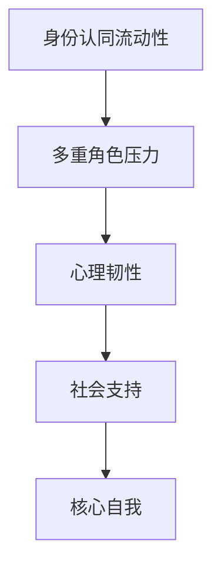

                 

# 身份认同的流动性：现代人的多重角色与核心自我

## 关键词：身份认同、流动性、多重角色、核心自我、现代生活

> 摘要：在快速发展的现代社会，个体的身份认同正面临着前所未有的流动性。本文将从理论探讨、现实体验、实证研究和跨文化视角出发，全面解析现代人面临的多重角色与身份认同流动性的挑战。通过对核心自我的深入剖析，文章旨在为读者提供应对这一挑战的策略和建议，帮助我们在流动性的身份认同中找到稳定的核心自我，实现个人的成长与整合。

## 引言

### 1.1 问题的提出与研究的意义

在当今这个多元化和快速变化的时代，个体的身份认同正经历着前所未有的流动性。身份认同不再是一个静态的概念，而是一个动态的过程，不断受到外界环境和个体内心体验的影响。这种现象在现代人的生活中愈发明显，引起了学术界和社会各界的广泛关注。

身份认同的流动性不仅对个体的心理健康和生活质量产生深远影响，也对社会结构的稳定和发展提出了新的挑战。因此，深入探讨身份认同的流动性，揭示其内在机制和影响，对于理解现代社会、促进个体成长以及社会和谐具有重要意义。

### 1.2 现代人的多重角色与身份认知困境

现代社会中，个体往往需要扮演多重角色，如职场员工、家庭成员、社会成员等。这些角色的多样性和复杂性，使得个体在身份认知上面临着诸多困境。一方面，角色之间的冲突和矛盾可能导致身份认同的不稳定和混乱；另一方面，角色之间的协调和整合需要个体付出更高的心理和情感代价。

### 1.3 探究身份认同流动性的学术价值与应用前景

身份认同流动性的研究不仅具有理论价值，还具有广泛的应用前景。在心理学领域，它有助于理解个体心理健康和情感调节的机制；在管理学领域，它可以为组织管理提供新的视角和方法；在教育学领域，它有助于设计更加有效的教育策略，促进学生的全面发展。

本文将采用文献综述、案例研究和实证分析等方法，全面探讨身份认同的流动性，旨在为现代人提供应对这一挑战的理论支持和实践指南。

## 1.4 本书结构安排

本书分为五个部分，内容安排如下：

- **第一部分：引言**：介绍研究的背景、意义和结构。
- **第二部分：身份认同的理论探讨**：深入探讨身份认同的概念、演变、核心自我与身份认同的关系，以及身份认同流动性的挑战与应对。
- **第三部分：多重角色的体验与调适**：分析多重角色的现实与心理影响，探讨提升自我意识和调适多重角色的策略。
- **第四部分：身份认同流动性的实证研究**：通过实证研究，揭示身份认同流动性现状及其影响因素。
- **第五部分：跨文化视角下的身份认同流动性**：比较分析不同文化背景下的身份认同流动性，探讨跨文化调适策略。

### 1.4.1 各章节内容的概述

- **第二章：身份认同的概念与演变**：介绍身份认同的定义、历史演变和多维度的解析。
- **第三章：社会变迁与身份认同的转变**：探讨社会变迁对身份认同的影响，以及现代社会的多元化和身份认同的多样性。
- **第四章：核心自我与身份认同**：分析核心自我的概念、特征及其与身份认同的关系。
- **第五章：身份认同的流动性：挑战与应对**：探讨身份认同流动性的概念、表现、挑战和应对策略。
- **第六章：多重角色的现实与心理影响**：分析多重角色的现实背景、心理影响和对个体幸福感的影响。
- **第七章：提升自我意识与角色调适**：探讨提升自我意识的策略和方法，以及角色调适的意义和过程。
- **第八章：社会支持与角色调适**：分析社会支持的概念、类型和对角色调适的作用。
- **第九章：个人成长与角色整合**：探讨个人成长的路径与策略，以及角色整合的意义与过程。
- **第十章：身份认同流动性的实证研究**：介绍研究设计、结果分析和讨论与启示。
- **第十一章：跨文化视角下的身份认同流动性**：比较分析不同文化背景下的身份认同流动性，探讨跨文化调适策略。

## 1.5 小结

通过对身份认同流动性的引言部分的分析，我们可以看到，现代社会中个体的身份认同正面临着巨大的流动性挑战。本文将从多个角度深入探讨这一现象，旨在为读者提供全面的理解和应对策略。接下来的章节中，我们将逐步分析身份认同的理论基础、现实体验、实证研究和跨文化视角，帮助读者在流动性的身份认同中找到稳定的核心自我。

## 第二章：身份认同的概念与演变

### 2.1.1 身份认同的定义

身份认同（Identity）是一个多维度的概念，涉及个体对自己的认知、评价和归属感。最早由心理学家埃里克·埃里克森（Erik Erikson）提出，身份认同被视为个体在生命历程中不断探索和构建的过程。身份认同不仅仅是关于“我是谁”的问题，更是一个关于个体如何在社会和文化环境中定位自己的问题。

身份认同具有以下几个关键特征：

1. **个体性**：身份认同是个体独特的心理建构，反映了个体对自身特点、价值观和信仰的自我认知。
2. **社会性**：身份认同是在社会和文化环境中形成的，受到社会互动和文化背景的影响。
3. **动态性**：身份认同是一个不断变化和发展的过程，受到个体经历、社会变迁和自我认知的影响。

### 2.1.2 身份认同的历史演变

身份认同的历史演变与社会发展紧密相连。在传统社会中，身份认同通常较为固定，以家庭、族群和宗教为基础。个体往往通过家族、部落或宗教团体来获得身份认同，这些身份认同具有较强的稳定性和一致性。

随着工业革命和现代化进程的推进，社会结构发生了深刻变化，个体的身份认同逐渐从集体转向个人。现代化带来了社会流动性、职业多样化和文化多元化，个体开始更多地关注自我实现和个性化需求。这种转变使得身份认同从单一的、固定的角色转向多元的、动态的角色组合。

### 2.1.3 身份认同的多维度解析

身份认同可以从多个维度进行解析，包括个体维度、社会维度和文化维度：

1. **个体维度**：从个体的角度，身份认同包括个人的价值观、兴趣、能力和个人历史等。个体维度强调个体内心的自我认知和自我认同。
   
2. **社会维度**：从社会的角度，身份认同涉及个体在社会关系中的角色和地位，如职业、社会阶层、文化背景等。社会维度强调个体在社会互动中的身份认同。

3. **文化维度**：从文化的角度，身份认同涉及个体对文化传统、民族身份和价值观的认同。文化维度强调个体与文化环境的关系。

在现代社会中，身份认同的多维度特性使得个体需要在不同维度之间进行平衡和协调，以应对生活中的各种挑战。例如，一个职场人可能同时具有职业身份、家庭身份和文化身份，需要在这些身份之间找到平衡，以维持稳定的核心自我。

### 2.2 社会变迁与身份认同的转变

社会变迁对身份认同的影响是深远和复杂的。现代社会中，身份认同的转变主要表现在以下几个方面：

1. **社会流动性的增强**：随着社会流动性的增强，个体在不同社会角色和身份之间的转换变得更加频繁。例如，越来越多的人在不同城市、不同国家之间迁移，这导致了身份认同的多元化和流动性。

2. **职业多样化**：职业多样化使得个体在职业生涯中扮演的角色更加复杂。一个人可能在同一时间内具有职场身份、家庭身份和社交身份等多个角色，这增加了身份认同的复杂性。

3. **文化多元化**：全球化带来了文化的多元化，个体在文化认同上面临更多选择。例如，一个人可能同时认同多个文化身份，如民族身份、宗教身份和地域身份。

4. **技术进步**：技术进步，特别是互联网和社交媒体的普及，改变了个体获取信息、建立社交网络和表达自我的方式。这种变化也对身份认同产生了影响，个体在虚拟世界中的身份认同可能与现实生活中的身份认同存在差异。

### 2.3 现代社会的多元化和身份认同的多样性

现代社会的多元化带来了身份认同的多样性。这种多样性既包括个体在不同角色之间的流动，也包括个体在多元文化背景下的认同。身份认同的多样性使得个体在寻求自我认同时面临更多选择和挑战。

例如，一个人可能在职业上是工程师，在家庭中是父亲或母亲，在社区中是志愿者。同时，他们可能还认同某个特定文化或宗教身份。这种多元的身份认同要求个体在日常生活中进行有效的角色转换和身份协调。

### 2.4 身份认同的变迁模式与趋势

身份认同的变迁模式与趋势反映了社会变迁对个体身份认同的影响。以下是一些主要的变迁模式与趋势：

1. **从固定到流动**：身份认同从固定走向流动，个体在不同角色和身份之间的转换变得更加频繁。
2. **从单一到多元**：身份认同从单一走向多元，个体在多元角色和身份之间的平衡和协调成为新的挑战。
3. **从传统到现代**：身份认同从传统走向现代，个体在自我实现和文化认同之间寻找新的平衡。
4. **从封闭到开放**：身份认同从封闭走向开放，个体在多元文化背景下的认同和包容成为新的趋势。

### 2.5 小结

通过对身份认同的概念与演变、社会变迁与身份认同的转变、现代社会的多元化和身份认同的多样性，以及身份认同的变迁模式与趋势的深入分析，我们可以看到，身份认同是一个动态的、多维度的概念，受到社会变迁和个体经历的深刻影响。在现代社会中，个体需要在不同身份之间进行有效的平衡和协调，以维持稳定的核心自我。接下来的章节将探讨核心自我与身份认同的关系，以及身份认同流动性的挑战与应对策略。

## 2.5 小结

通过本章对身份认同概念与演变、社会变迁与身份认同转变、多元化和多样性，以及变迁模式与趋势的深入探讨，我们可以清晰地认识到身份认同在现代社会的复杂性和多样性。身份认同不仅是个体自我认知的结果，也受到社会环境和个体经历的双重影响。在快速变化的社会背景下，个体需要灵活应对身份认同的流动性，找到稳定的核心自我。接下来的章节将进一步探讨核心自我与身份认同的深层关系，以及应对流动性身份认同的具体策略。

## 第三章：核心自我与身份认同

### 3.1 核心自我的概念与特征

核心自我（Core Self）是心理学中的一个重要概念，指的是个体内心深层的、稳定的自我认知和自我评价。它是个体身份认同的重要组成部分，对个体的心理健康和行为模式有着深远的影响。核心自我的概念最早由心理学家罗伯特·拉文（Robert Lent）和同事提出，他们将其描述为个体的自我效能感、情感稳定性、积极特质和消极特质。

核心自我具有以下几个显著特征：

1. **稳定性**：核心自我是个体内心深处的认知结构，具有较强的稳定性。它不容易受到外界环境或短期经历的影响，即使在面对压力和挑战时，核心自我也相对稳定。

2. **普遍性**：核心自我是跨情境的，不仅适用于特定的环境或角色，也适用于个体的不同生活领域。例如，一个在职场中表现出高自我效能感的个体，在家庭和社交场合也可能表现出相似的自我效能感。

3. **多维性**：核心自我包括多个维度，如自我效能感、情感稳定性、积极特质和消极特质。这些维度相互影响，共同构成了个体的核心自我。

4. **自我调节性**：核心自我具有自我调节的功能，可以帮助个体在面临压力和挑战时保持心理平衡。例如，高自我效能感的个体在面对困难时更可能保持乐观和积极的态度。

### 3.2 核心自我与身份认同的关系

核心自我与身份认同之间存在着密切的关系。核心自我不仅是身份认同的基础，也影响个体对身份的认知和评价。

1. **核心自我作为身份认同的基础**：核心自我是个体自我认同的重要组成部分。个体的自我认知和自我评价往往基于其核心自我。例如，一个具有高自我效能感的个体可能更倾向于认为自己在职场中具有成功的潜力和能力，从而形成积极的职业身份认同。

2. **核心自我对身份认同的影响**：核心自我影响个体对身份的认知和评价。高自我效能感的个体可能更倾向于认同自己的职业角色，而低自我效能感的个体可能对自己的职业角色持怀疑态度。此外，情感稳定性和积极特质也对身份认同产生积极影响，而消极特质可能对身份认同产生负面影响。

3. **身份认同对核心自我的反馈**：身份认同对核心自我也有反馈作用。积极的身份认同可以增强个体的核心自我，而消极的身份认同可能削弱个体的核心自我。例如，一个在职场中获得成功和认可的个体，可能会增强其职业身份认同和核心自我；相反，一个在职场中遇到挫折和失败的个体，可能会削弱其职业身份认同和核心自我。

### 3.3 核心自我的建构与维持策略

建构和维持核心自我需要个体采取一系列策略。以下是一些有效的策略：

1. **自我反思**：通过定期自我反思，个体可以更清晰地认识自己的核心自我。自我反思可以帮助个体发现自身的优势和不足，从而制定改进计划。

2. **积极心理训练**：积极心理训练，如自我肯定、情绪调节和自我效能感的培养，有助于增强核心自我。例如，通过自我肯定的练习，个体可以增强对自己的积极认知，从而提升核心自我。

3. **建立支持性社交网络**：一个支持性的社交网络可以提供情感支持和资源，帮助个体维持和增强核心自我。例如，与朋友和家人的积极互动可以增强个体的社会认同感和自尊心，从而提升核心自我。

4. **设定实际可行的目标**：设定实际可行的目标可以帮助个体在实现目标的过程中增强自我效能感，从而提升核心自我。例如，通过逐步实现小的目标，个体可以在面对更大的挑战时保持自信和积极的态度。

5. **寻求专业帮助**：当个体面临核心自我问题时，寻求专业心理咨询或治疗可以帮助个体理解和应对这些问题。专业人士可以提供有效的策略和支持，帮助个体重建和维持核心自我。

### 3.4 核心自我在应对身份认同流动性中的作用

在现代社会中，身份认同的流动性给个体带来了诸多挑战。核心自我在应对这些挑战中发挥着关键作用：

1. **稳定身份认同**：核心自我可以帮助个体在身份认同流动性中保持稳定。通过稳定的自我认知和自我评价，个体可以更好地应对角色转换和身份冲突。

2. **增强心理韧性**：核心自我增强了个体在面临压力和挑战时的心理韧性。高核心自我的个体更可能保持积极的态度，有效应对生活中的各种挑战。

3. **促进个人成长**：核心自我帮助个体在流动性的身份认同中找到方向和目标。通过自我认知和自我调节，个体可以更好地实现个人成长和自我实现。

4. **增强社会认同**：核心自我有助于个体在多元文化背景下建立稳定的社会认同。通过积极的自我认知和自我评价，个体可以在不同文化环境中找到自己的位置和身份认同。

### 3.5 小结

通过对核心自我的概念与特征、核心自我与身份认同的关系，以及核心自我的建构与维持策略的探讨，我们可以看到，核心自我在身份认同流动性中扮演着重要角色。建构和维持核心自我不仅有助于个体应对身份认同的流动性挑战，也有助于促进个体的心理健康和个人成长。在接下来的章节中，我们将进一步探讨身份认同流动性的挑战与应对策略，帮助读者更好地理解和应对这一现象。

### 3.6 小结

通过对核心自我的概念与特征、核心自我与身份认同的关系，以及核心自我的建构与维持策略的详细探讨，我们可以看出，核心自我不仅是个体身份认同的基础，也是应对身份认同流动性挑战的重要工具。核心自我的稳定性、普遍性和自我调节性使其在个体的心理健康和个人成长中发挥着关键作用。在接下来的章节中，我们将进一步探讨身份认同流动性的具体表现、挑战以及应对策略，帮助读者在复杂多变的社会环境中找到自己的定位和平衡。这些策略将结合现实案例和实证研究，为读者提供实用的指导和建议。

## 2.5 小结

通过对身份认同的概念与演变、社会变迁与身份认同的转变、多元化和多样性，以及变迁模式与趋势的深入分析，我们可以清晰地看到身份认同在现代社会的复杂性和多样性。身份认同不仅是个体自我认知的结果，也受到社会环境和个体经历的双重影响。在快速变化的社会背景下，个体需要灵活应对身份认同的流动性，找到稳定的核心自我。

本章从核心自我的概念与特征出发，探讨了核心自我与身份认同的关系，以及核心自我的建构与维持策略。核心自我作为个体身份认同的基础，对个体的心理健康和行为模式有着深远的影响。通过自我反思、积极心理训练、建立支持性社交网络、设定实际可行的目标以及寻求专业帮助等策略，个体可以在流动性身份认同中保持稳定和成长。

接下来，我们将进一步探讨身份认同流动性的具体表现和挑战，并介绍应对这些挑战的策略。通过对多重角色的体验与调适、实证研究以及跨文化视角的分析，我们将为读者提供全面的理解和实用的建议。这些内容将帮助个体在复杂多变的社会环境中找到平衡，实现个人成长和自我实现。

## 第三章：核心自我与身份认同

### 3.1 核心自我的概念与特征

核心自我（Core Self）是心理学中的一个重要概念，指的是个体内心深层的、稳定的自我认知和自我评价。它是个体身份认同的重要组成部分，对个体的心理健康和行为模式有着深远的影响。核心自我的概念最早由心理学家罗伯特·拉文（Robert Lent）和同事提出，他们将其描述为个体的自我效能感、情感稳定性、积极特质和消极特质。

核心自我具有以下几个显著特征：

1. **稳定性**：核心自我是个体内心深层的认知结构，具有较强的稳定性。它不容易受到外界环境或短期经历的影响，即使在面对压力和挑战时，核心自我也相对稳定。

2. **普遍性**：核心自我是跨情境的，不仅适用于特定的环境或角色，也适用于个体的不同生活领域。例如，一个在职场中表现出高自我效能感的个体，在家庭和社交场合也可能表现出相似的自我效能感。

3. **多维性**：核心自我包括多个维度，如自我效能感、情感稳定性、积极特质和消极特质。这些维度相互影响，共同构成了个体的核心自我。

4. **自我调节性**：核心自我具有自我调节的功能，可以帮助个体在面临压力和挑战时保持心理平衡。例如，高自我效能感的个体在面对困难时更可能保持乐观和积极的态度。

### 3.2 核心自我与身份认同的关系

核心自我与身份认同之间存在着密切的关系。核心自我不仅是身份认同的基础，也影响个体对身份的认知和评价。

1. **核心自我作为身份认同的基础**：核心自我是个体自我认同的重要组成部分。个体的自我认知和自我评价往往基于其核心自我。例如，一个具有高自我效能感的个体可能更倾向于认为自己在职场中具有成功的潜力和能力，从而形成积极的职业身份认同。

2. **核心自我对身份认同的影响**：核心自我影响个体对身份的认知和评价。高自我效能感的个体可能更倾向于认同自己的职业角色，而低自我效能感的个体可能对自己的职业角色持怀疑态度。此外，情感稳定性和积极特质也对身份认同产生积极影响，而消极特质可能对身份认同产生负面影响。

3. **身份认同对核心自我的反馈**：身份认同对核心自我也有反馈作用。积极的身份认同可以增强个体的核心自我，而消极的身份认同可能削弱个体的核心自我。例如，一个在职场中获得成功和认可的个体，可能会增强其职业身份认同和核心自我；相反，一个在职场中遇到挫折和失败的个体，可能会削弱其职业身份认同和核心自我。

### 3.3 核心自我的建构与维持策略

建构和维持核心自我需要个体采取一系列策略。以下是一些有效的策略：

1. **自我反思**：通过定期自我反思，个体可以更清晰地认识自己的核心自我。自我反思可以帮助个体发现自身的优势和不足，从而制定改进计划。

2. **积极心理训练**：积极心理训练，如自我肯定、情绪调节和自我效能感的培养，有助于增强核心自我。例如，通过自我肯定的练习，个体可以增强对自己的积极认知，从而提升核心自我。

3. **建立支持性社交网络**：一个支持性的社交网络可以提供情感支持和资源，帮助个体维持和增强核心自我。例如，与朋友和家人的积极互动可以增强个体的社会认同感和自尊心，从而提升核心自我。

4. **设定实际可行的目标**：设定实际可行的目标可以帮助个体在实现目标的过程中增强自我效能感，从而提升核心自我。例如，通过逐步实现小的目标，个体可以在面对更大的挑战时保持自信和积极的态度。

5. **寻求专业帮助**：当个体面临核心自我问题时，寻求专业心理咨询或治疗可以帮助个体理解和应对这些问题。专业人士可以提供有效的策略和支持，帮助个体重建和维持核心自我。

### 3.4 核心自我在应对身份认同流动性中的作用

在现代社会中，身份认同的流动性给个体带来了诸多挑战。核心自我在应对这些挑战中发挥着关键作用：

1. **稳定身份认同**：核心自我可以帮助个体在身份认同流动性中保持稳定。通过稳定的自我认知和自我评价，个体可以更好地应对角色转换和身份冲突。

2. **增强心理韧性**：核心自我增强了个体在面临压力和挑战时的心理韧性。高核心自我的个体更可能保持积极的态度，有效应对生活中的各种挑战。

3. **促进个人成长**：核心自我帮助个体在流动性的身份认同中找到方向和目标。通过自我认知和自我调节，个体可以更好地实现个人成长和自我实现。

4. **增强社会认同**：核心自我有助于个体在多元文化背景下建立稳定的社会认同。通过积极的自我认知和自我评价，个体可以在不同文化环境中找到自己的位置和身份认同。

### 3.5 小结

通过对核心自我的概念与特征、核心自我与身份认同的关系，以及核心自我的建构与维持策略的探讨，我们可以看到，核心自我在身份认同流动性中扮演着重要角色。建构和维持核心自我不仅有助于个体应对身份认同的流动性挑战，也有助于促进个体的心理健康和个人成长。在接下来的章节中，我们将进一步探讨身份认同流动性的具体表现和挑战，并介绍应对这些挑战的策略。通过对多重角色的体验与调适、实证研究以及跨文化视角的分析，我们将为读者提供全面的理解和实用的建议。这些内容将帮助个体在复杂多变的社会环境中找到平衡，实现个人成长和自我实现。

## 2.5 小结

通过第二章对核心自我的概念与特征、核心自我与身份认同的关系，以及核心自我的建构与维持策略的深入探讨，我们可以清晰地认识到核心自我在身份认同中的重要作用。核心自我不仅是身份认同的基础，还影响个体的自我认知和评价，帮助个体在身份认同流动性中保持稳定和成长。有效的核心自我建构与维持策略，如自我反思、积极心理训练、建立支持性社交网络、设定实际可行的目标和寻求专业帮助，对于个体应对身份认同流动性挑战具有重要意义。

在接下来的章节中，我们将进一步探讨身份认同流动性的具体表现和挑战。通过分析多重角色的现实与心理影响，我们将揭示现代社会中个体在多重角色扮演中面临的困境和挑战。同时，我们还将探讨提升自我意识和调适多重角色的策略，帮助个体在复杂多变的社会环境中找到平衡，实现个人的心理健康和全面发展。这些内容将为读者提供更加实用的指导和策略，帮助他们在流动性的身份认同中找到稳定的核心自我。

## 第三章：核心自我与身份认同

### 3.1 核心自我的概念与特征

核心自我（Core Self）是心理学中的一个重要概念，指的是个体内心深层的、稳定的自我认知和自我评价。它是个体身份认同的重要组成部分，对个体的心理健康和行为模式有着深远的影响。核心自我的概念最早由心理学家罗伯特·拉文（Robert Lent）和同事提出，他们将其描述为个体的自我效能感、情感稳定性、积极特质和消极特质。

核心自我具有以下几个显著特征：

1. **稳定性**：核心自我是个体内心深层的认知结构，具有较强的稳定性。它不容易受到外界环境或短期经历的影响，即使在面对压力和挑战时，核心自我也相对稳定。

2. **普遍性**：核心自我是跨情境的，不仅适用于特定的环境或角色，也适用于个体的不同生活领域。例如，一个在职场中表现出高自我效能感的个体，在家庭和社交场合也可能表现出相似的自我效能感。

3. **多维性**：核心自我包括多个维度，如自我效能感、情感稳定性、积极特质和消极特质。这些维度相互影响，共同构成了个体的核心自我。

4. **自我调节性**：核心自我具有自我调节的功能，可以帮助个体在面临压力和挑战时保持心理平衡。例如，高自我效能感的个体在面对困难时更可能保持乐观和积极的态度。

### 3.2 核心自我与身份认同的关系

核心自我与身份认同之间存在着密切的关系。核心自我不仅是身份认同的基础，也影响个体对身份的认知和评价。

1. **核心自我作为身份认同的基础**：核心自我是个体自我认同的重要组成部分。个体的自我认知和自我评价往往基于其核心自我。例如，一个具有高自我效能感的个体可能更倾向于认为自己在职场中具有成功的潜力和能力，从而形成积极的职业身份认同。

2. **核心自我对身份认同的影响**：核心自我影响个体对身份的认知和评价。高自我效能感的个体可能更倾向于认同自己的职业角色，而低自我效能感的个体可能对自己的职业角色持怀疑态度。此外，情感稳定性和积极特质也对身份认同产生积极影响，而消极特质可能对身份认同产生负面影响。

3. **身份认同对核心自我的反馈**：身份认同对核心自我也有反馈作用。积极的身份认同可以增强个体的核心自我，而消极的身份认同可能削弱个体的核心自我。例如，一个在职场中获得成功和认可的个体，可能会增强其职业身份认同和核心自我；相反，一个在职场中遇到挫折和失败的个体，可能会削弱其职业身份认同和核心自我。

### 3.3 核心自我的建构与维持策略

建构和维持核心自我需要个体采取一系列策略。以下是一些有效的策略：

1. **自我反思**：通过定期自我反思，个体可以更清晰地认识自己的核心自我。自我反思可以帮助个体发现自身的优势和不足，从而制定改进计划。

2. **积极心理训练**：积极心理训练，如自我肯定、情绪调节和自我效能感的培养，有助于增强核心自我。例如，通过自我肯定的练习，个体可以增强对自己的积极认知，从而提升核心自我。

3. **建立支持性社交网络**：一个支持性的社交网络可以提供情感支持和资源，帮助个体维持和增强核心自我。例如，与朋友和家人的积极互动可以增强个体的社会认同感和自尊心，从而提升核心自我。

4. **设定实际可行的目标**：设定实际可行的目标可以帮助个体在实现目标的过程中增强自我效能感，从而提升核心自我。例如，通过逐步实现小的目标，个体可以在面对更大的挑战时保持自信和积极的态度。

5. **寻求专业帮助**：当个体面临核心自我问题时，寻求专业心理咨询或治疗可以帮助个体理解和应对这些问题。专业人士可以提供有效的策略和支持，帮助个体重建和维持核心自我。

### 3.4 核心自我在应对身份认同流动性中的作用

在现代社会中，身份认同的流动性给个体带来了诸多挑战。核心自我在应对这些挑战中发挥着关键作用：

1. **稳定身份认同**：核心自我可以帮助个体在身份认同流动性中保持稳定。通过稳定的自我认知和自我评价，个体可以更好地应对角色转换和身份冲突。

2. **增强心理韧性**：核心自我增强了个体在面临压力和挑战时的心理韧性。高核心自我的个体更可能保持积极的态度，有效应对生活中的各种挑战。

3. **促进个人成长**：核心自我帮助个体在流动性的身份认同中找到方向和目标。通过自我认知和自我调节，个体可以更好地实现个人成长和自我实现。

4. **增强社会认同**：核心自我有助于个体在多元文化背景下建立稳定的社会认同。通过积极的自我认知和自我评价，个体可以在不同文化环境中找到自己的位置和身份认同。

### 3.5 小结

通过对核心自我的概念与特征、核心自我与身份认同的关系，以及核心自我的建构与维持策略的探讨，我们可以看到，核心自我在身份认同流动性中扮演着重要角色。建构和维持核心自我不仅有助于个体应对身份认同的流动性挑战，也有助于促进个体的心理健康和个人成长。在接下来的章节中，我们将进一步探讨身份认同流动性的具体表现和挑战，并介绍应对这些挑战的策略。通过对多重角色的体验与调适、实证研究以及跨文化视角的分析，我们将为读者提供全面的理解和实用的建议。这些内容将帮助个体在复杂多变的社会环境中找到平衡，实现个人成长和自我实现。

## 3.1 多重角色的现实与心理影响

在现代社会中，个体往往需要扮演多重角色，这些角色可能来自不同的社会环境、职业领域或生活领域。例如，一个人可能在职场中是一名软件工程师，在家庭中是父亲或母亲，在社会上是志愿者。这种多重角色的扮演对个体的现实和心理都产生了深远的影响。

### 多重角色的现实背景

1. **职业角色的多样性**：随着职业的不断发展和专业化，个体在职场中可能需要承担多种不同的角色。例如，一个软件工程师可能同时担任项目经理、技术专家和团队领导者。

2. **家庭角色的变化**：随着家庭结构和社会观念的变化，个体在家庭中可能需要扮演多种角色。例如，夫妻双方可能都需要在家庭和工作中平衡，既要承担家庭责任，又要追求职业发展。

3. **社会角色的扩展**：社会角色的扩展使得个体需要参与更多的社会活动。例如，一个人可能同时是社区志愿者、运动爱好者或公益活动参与者。

### 多重角色的心理影响

1. **角色冲突**：多重角色的扮演可能导致角色冲突。当角色之间出现矛盾时，个体可能会感到压力和困惑。例如，一个在职场上需要表现出严格和专业的工程师，可能在家庭中需要表现出温柔和耐心，这种冲突可能会导致个体的情绪和心理困扰。

2. **角色平衡的挑战**：多重角色的扮演要求个体在时间和精力上进行平衡。如果个体无法有效地管理这些角色，可能会导致过度疲劳和心理压力。

3. **自我认知的复杂性**：多重角色的扮演增加了个体自我认知的复杂性。个体需要在不同角色之间进行切换，并调整自我认知，以适应不同的角色需求。这种复杂性可能会对个体的心理健康产生一定的影响。

### 3.2 多重角色对个体幸福感的影响

多重角色的扮演对个体的幸福感有着显著的影响。以下是对多重角色对个体幸福感影响的详细分析：

1. **积极影响**：适当的角色平衡和自我认知调整可以增强个体的幸福感。例如，通过有效地扮演多重角色，个体可以在不同领域中实现自我价值和成就感，从而提高幸福感。

2. **负面影响**：然而，不适当的角色平衡和角色冲突可能会导致个体的心理压力和幸福感下降。长期的角色冲突和过度疲劳可能导致焦虑、抑郁等心理健康问题。

3. **心理韧性的考验**：多重角色的扮演对个体的心理韧性提出了挑战。高心理韧性的个体能够更好地应对角色冲突和压力，从而保持较高的幸福感；而低心理韧性的个体可能更容易陷入心理困境。

### 3.3 角色转换与自我认同

角色转换不仅涉及外在行为的调整，也涉及内在的自我认同。在角色转换中，个体需要调整自我认知，以适应不同的角色需求。以下是对角色转换与自我认同关系的详细探讨：

1. **角色转换的挑战**：角色转换要求个体在不同角色之间进行切换，这需要个体具备良好的适应能力和灵活性。角色转换的成功与否直接影响个体的心理健康和幸福感。

2. **自我认同的多样性**：多重角色扮演增加了个体自我认同的多样性。个体需要在不同角色中找到平衡，同时保持核心自我的一致性。这种多样性可能增强个体的自我认同，但也可能增加个体的心理负担。

3. **核心自我的稳定**：在多重角色扮演中，核心自我的稳定性至关重要。稳定的核心自我可以帮助个体在面对角色冲突时保持心理平衡，从而减少角色转换带来的负面影响。

### 3.4 多重角色与心理压力

多重角色的扮演往往伴随着较高的心理压力。以下是对多重角色与心理压力关系的详细分析：

1. **压力源的分析**：多重角色扮演带来的压力主要来自角色之间的冲突、角色平衡的挑战以及自我认同的多样性。这些压力源可能导致个体的焦虑、抑郁等心理健康问题。

2. **应对策略**：有效的应对策略包括时间管理、角色平衡技巧和情绪调节。通过合理规划时间和资源，个体可以更好地平衡多重角色，减轻心理压力。

3. **心理韧性**：培养心理韧性是应对多重角色压力的重要手段。高心理韧性的个体能够更好地应对压力，从而保持心理健康和幸福感。

### 3.5 小结

多重角色的扮演是现代社会中个体普遍面临的现象。通过对其现实背景、心理影响、对个体幸福感的影响、角色转换与自我认同关系，以及与心理压力关系的深入分析，我们可以看到多重角色对个体的现实和心理都产生了深远的影响。有效的角色平衡和自我认同调整是应对多重角色挑战的关键。个体需要通过培养心理韧性、掌握角色平衡技巧和情绪调节策略，来应对多重角色带来的心理压力，实现个人成长和心理健康。

## 3.5 小结

通过本章对多重角色的现实与心理影响、对个体幸福感的影响、角色转换与自我认同关系，以及与心理压力关系的详细分析，我们可以看到，多重角色的扮演对个体的现实和心理产生了深远的影响。角色冲突、角色平衡的挑战、自我认同的多样性以及心理压力，都是现代社会中个体需要面对的重大课题。有效的角色平衡和自我认同调整，以及培养心理韧性，是应对多重角色挑战的重要策略。在接下来的章节中，我们将探讨提升自我意识的策略与方法，以帮助个体在多重角色的扮演中找到平衡，实现个人的心理健康和全面发展。

## 3.6 提升自我意识的策略与方法

在现代社会中，提升自我意识成为个体应对多重角色挑战的重要策略。自我意识是个体对自己内在心理状态和外显行为的认知和理解，是心理调适和成长的关键。以下是一些有效的策略与方法，帮助个体提升自我意识：

### 3.6.1 自我反思

自我反思是一种常见的提升自我意识的方法。通过定期回顾自己的行为、思想和情感，个体可以更深入地了解自己的内在状态。以下是一些具体的自我反思技巧：

1. **日记记录**：保持日常日记，记录自己的情感波动、思考过程和遇到的问题。这有助于个体在日后的反思中，清晰地看到自己的成长和变化。

2. **情境模拟**：通过模拟不同的情境，个体可以在心理上提前准备，应对可能的挑战。例如，设想自己在职场会议中遇到困难，提前思考可能的解决方案。

3. **问题清单**：列出自己当前面临的问题和挑战，并尝试从不同的角度分析问题。这有助于个体在问题解决过程中，提升自我认知和自我调节能力。

### 3.6.2 情绪调节

情绪调节是提升自我意识的重要环节。通过有效的情绪调节技巧，个体可以更好地管理自己的情绪，减少情绪波动对自我认同的影响。以下是一些情绪调节的方法：

1. **认知重构**：通过认知重构，个体可以改变对事件的认知和解释方式，从而调整情绪反应。例如，将“我必须做到完美”调整为“我尽力而为，允许自己犯错”。

2. **放松训练**：通过深呼吸、瑜伽、冥想等放松训练，个体可以减轻压力和焦虑，提高情绪稳定性。

3. **情绪表达**：鼓励个体表达自己的情绪，无论是通过言语、写作还是艺术创作。表达情绪有助于个体更好地理解自己的情感，并找到适当的应对方式。

### 3.6.3 沟通技巧

提升沟通技巧有助于个体在社交互动中更好地表达自我，同时理解他人。以下是一些有效的沟通技巧：

1. **积极倾听**：通过积极倾听，个体可以更好地理解他人的观点和感受。积极倾听包括全神贯注地听、避免打断、反馈对方的观点。

2. **非暴力沟通**：非暴力沟通是一种以和平、理解和尊重为核心的沟通方式。通过非暴力沟通，个体可以在冲突中保持冷静，找到共同点。

3. **自我表达**：在沟通中，个体应该清晰地表达自己的观点和感受，同时尊重他人的意见。这有助于建立良好的沟通关系，增强自我意识。

### 3.6.4 自我成长计划

制定自我成长计划有助于个体在自我意识提升的过程中，有目标地实现个人成长。以下是一些自我成长计划的步骤：

1. **设定目标**：明确自己的长期和短期目标，包括职业、健康、人际关系等方面的目标。

2. **制定行动计划**：将目标分解为具体的行动步骤，并设定实施的时间表。

3. **持续评估**：定期评估自己的成长进度，并根据评估结果调整行动计划。

### 3.6.5 寻求专业帮助

当个体在自我意识提升过程中遇到困难时，寻求专业帮助是一个有效的策略。以下是一些寻求专业帮助的建议：

1. **心理咨询**：心理咨询师可以提供专业的指导和支持，帮助个体解决心理问题和提升自我意识。

2. **培训课程**：参加自我意识提升的培训课程，如正念冥想、情绪管理、自我认同等，可以学习到实用的技巧和方法。

3. **阅读与研究**：阅读相关书籍和学术研究，了解自我意识的最新理论和实践，有助于个体在自我提升过程中保持开放和学习的态度。

### 3.6.6 社交互动

积极的社交互动有助于个体在多样化的社会环境中提升自我意识。以下是一些社交互动的建议：

1. **建立支持性社交网络**：与信任和支持的朋友和家人建立良好的关系，有助于个体在自我意识提升过程中获得情感支持。

2. **参与社区活动**：参与社区活动，如志愿服务、兴趣爱好小组等，可以增加个体的社会认同感和自我价值感。

3. **跨文化交流**：通过跨文化交流，个体可以拓宽视野，理解不同文化和价值观，从而在自我意识提升中找到新的启发和灵感。

### 3.6.7 小结

提升自我意识是应对多重角色挑战的重要策略。通过自我反思、情绪调节、沟通技巧、自我成长计划、寻求专业帮助、社交互动等多种方法，个体可以在复杂多变的社会环境中找到平衡，实现自我认知和心理健康的提升。在接下来的章节中，我们将探讨社会支持与角色调适的关系，帮助个体在多重角色的扮演中更好地应对挑战，实现个人的全面发展。

## 3.7 社会支持与角色调适

社会支持在个体扮演多重角色、实现身份认同流动性的过程中起着至关重要的作用。社会支持是指个体在面临压力和挑战时，从社会网络中获得的情感、信息和经济上的帮助。这种支持不仅有助于缓解个体的心理压力，还可以促进角色调适，提高身份认同的稳定性。

### 3.7.1 社会支持的概念与类型

社会支持可以分为以下几种类型：

1. **情感支持**：情感支持是指个体在情感上得到他人的理解、关心和支持。这种支持可以增强个体的心理韧性，帮助个体在面临挑战时保持积极的心态。

2. **信息支持**：信息支持是指个体在面临问题或决策时，从他人那里获得的有用信息和知识。信息支持有助于个体更好地理解和应对复杂的社会情境。

3. **经济支持**：经济支持是指个体在经济上得到他人的援助，如金钱、物资或资源。经济支持可以缓解个体在生活中的经济压力，使其能够更好地平衡多重角色。

4. **网络支持**：网络支持是指个体通过社交网络获得的广泛联系和资源。网络支持可以为个体提供多样化的信息和机会，有助于个体在职业、教育和社会领域实现角色的转换和整合。

### 3.7.2 社会支持对角色调适的作用

社会支持对角色调适具有以下几方面的重要作用：

1. **缓解角色压力**：社会支持可以帮助个体缓解因多重角色扮演带来的压力。例如，当个体在职场和家庭之间感到压力时，来自朋友和家人的情感支持可以缓解其心理压力，使其更好地应对角色转换。

2. **提供信息资源**：社会支持为个体提供了获取信息资源的途径。例如，一个在职场中需要提升技能的工程师，可以通过参加行业研讨会或与同事交流，获得最新的技术和行业动态。

3. **促进社会认同**：社会支持有助于个体建立稳定的社会认同。通过与家人、朋友和同事的互动，个体可以在不同角色之间找到共同点和归属感，从而增强核心自我。

4. **增强心理韧性**：社会支持可以提高个体的心理韧性，帮助个体在面临挑战时保持积极的态度和行动。例如，当个体在职业发展中遇到挫折时，来自朋友和家人的支持可以增强其应对挫折的能力，使其更快地恢复。

### 3.7.3 建立有效的社会支持系统

为了有效地应对多重角色挑战，个体需要建立稳定和有效的社会支持系统。以下是一些建议：

1. **建立和维护人际关系**：与家人、朋友和同事建立良好的关系，是获得社会支持的基础。个体应该主动参与社交活动，积极维护和拓展自己的社交网络。

2. **寻求专业帮助**：在面临心理或职业问题时，寻求专业心理咨询或职业指导可以帮助个体更好地理解和应对挑战。

3. **参与社区活动**：参与社区活动可以增加个体的社会参与感和归属感，为其提供多样化的支持资源。

4. **利用线上平台**：利用社交媒体和在线社区，可以方便地获取信息和资源，拓展社交网络。例如，加入行业论坛或专业社群，可以与其他专业人士交流经验和心得。

### 3.7.4 社会支持与角色调适的相互关系

社会支持与角色调适之间存在相互关系：

1. **社会支持促进角色调适**：有效的社会支持可以帮助个体更好地适应多重角色，缓解角色冲突和压力。

2. **角色调适增强社会支持**：通过成功扮演多重角色，个体可以增强社会认同感和自我价值感，从而提高其获得社会支持的能力。

3. **动态互动**：社会支持与角色调适之间的互动是一个动态过程。个体在不同的生活阶段和情境中，可能需要不同的支持类型和调适策略。

### 3.7.5 小结

社会支持在个体应对多重角色挑战、实现身份认同流动性的过程中起着关键作用。通过建立和维护有效的社会支持系统，个体可以更好地缓解角色压力、获取信息资源、建立社会认同和增强心理韧性。有效的社会支持与角色调适之间的互动，有助于个体在复杂多变的社会环境中实现身份认同的稳定和成长。在接下来的章节中，我们将进一步探讨个人成长与角色整合的过程，帮助个体在流动性的身份认同中找到平衡和方向。

## 3.8 个人成长与角色整合

个人成长与角色整合是现代社会中个体应对身份认同流动性挑战的关键。个人成长不仅关乎个体的心理健康和自我实现，也直接影响个体在多重角色之间的调适能力。角色整合则是个体在不同角色之间找到平衡，实现自我一致性的过程。以下从个人成长的路径与策略、角色整合的意义与过程，以及个人成长与角色整合的相互促进三个方面进行探讨。

### 3.8.1 个人成长的路径与策略

个人成长是一个持续的过程，涉及认知、情感、行为和社交等多个方面。以下是一些有效的个人成长路径和策略：

1. **自我认知**：自我认知是个人成长的基础。通过自我反思和情绪管理，个体可以更好地理解自己的内在需求和外在行为。具体策略包括日记记录、情境模拟和认知重构。

2. **目标设定**：明确的目标有助于个体在个人成长过程中保持方向和动力。设定实际可行的短期和长期目标，可以帮助个体逐步实现自我提升。

3. **终身学习**：学习是个人成长的重要途径。通过不断学习新知识和技能，个体可以保持竞争力，适应不断变化的社会环境。具体策略包括参加培训课程、阅读专业书籍和参与行业交流活动。

4. **积极心理训练**：积极心理训练，如正念冥想、感恩练习和自我肯定，可以帮助个体培养乐观、积极的心态，提高心理韧性。

5. **建立支持性社交网络**：与信任和支持的朋友和家人建立良好的关系，可以提供情感支持和社会资源，有助于个体在个人成长过程中克服困难和挑战。

### 3.8.2 角色整合的意义与过程

角色整合是个体在不同角色之间找到平衡，实现自我一致性的过程。角色整合的意义在于：

1. **提升生活质量**：通过角色整合，个体可以更好地管理时间和资源，减少角色冲突，提高生活质量。

2. **增强心理韧性**：角色整合有助于个体在面对挑战和压力时，保持心理平衡，增强心理韧性。

3. **实现自我实现**：角色整合使个体能够在多重角色中找到自我价值，实现自我实现。

角色整合的过程通常包括以下几个步骤：

1. **自我探索**：个体需要通过自我反思和情境模拟，了解自己在不同角色中的表现和需求。

2. **角色界定**：明确各个角色的需求和期望，确定每个角色的优先级。

3. **角色平衡**：通过时间管理、情绪调节和资源调配，实现角色之间的平衡。

4. **角色整合**：在不同角色之间找到共同点和平衡点，实现自我一致性。

### 3.8.3 个人成长与角色整合的相互促进

个人成长与角色整合之间存在着相互促进的关系：

1. **个人成长促进角色整合**：通过自我认知、目标设定和终身学习，个体可以更好地理解自己的需求，提升在多重角色中的适应能力，从而实现角色整合。

2. **角色整合促进个人成长**：角色整合有助于个体在多重角色中找到平衡，减少压力和冲突，从而有更多的精力和资源投入到个人成长中。

3. **动态互动**：个人成长与角色整合是一个动态互动的过程。个体在不同的生活阶段和情境中，可能需要不同的成长路径和整合策略。

### 3.8.4 实现个人成长与角色整合的建议

为了实现个人成长与角色整合，个体可以采取以下策略：

1. **定期自我反思**：通过定期自我反思，个体可以了解自己在不同角色中的表现，发现自身的优势和不足，从而制定改进计划。

2. **设定实际可行的目标**：设定短期和长期目标，并制定详细的行动计划，有助于个体在个人成长过程中保持方向和动力。

3. **建立支持性社交网络**：与信任和支持的朋友和家人建立良好的关系，可以提供情感支持和社会资源，有助于个体在个人成长和角色整合中克服困难和挑战。

4. **参与终身学习**：积极参与培训课程、阅读专业书籍和参与行业交流活动，可以不断更新知识和技能，提升在多重角色中的竞争力。

5. **平衡角色与成长**：通过时间管理和情绪调节，实现角色之间的平衡，确保有足够的精力和资源投入到个人成长中。

### 3.8.5 小结

个人成长与角色整合是应对身份认同流动性挑战的重要策略。通过自我认知、目标设定、终身学习和建立支持性社交网络，个体可以促进个人成长；通过角色界定、角色平衡和角色整合，个体可以实现自我一致性。个人成长与角色整合之间存在着相互促进的关系，动态互动有助于个体在复杂多变的社会环境中找到平衡和方向。在接下来的章节中，我们将进一步探讨身份认同流动性的实证研究，揭示身份认同流动性的现状及其影响因素，为读者提供更加具体的理解和应对策略。

### 3.8.5 小结

通过本章对个人成长与角色整合的深入探讨，我们可以看到，个人成长和角色整合在应对身份认同流动性挑战中具有重要作用。个人成长不仅关乎个体的自我认知和心理韧性，也直接影响角色整合的效果。角色整合则帮助个体在不同角色之间找到平衡，实现自我一致性，提升生活质量。

个人成长的路径包括自我认知、目标设定、终身学习和建立支持性社交网络。这些策略有助于个体在多重角色中找到方向，提升竞争力。角色整合的过程则涉及角色界定、角色平衡和角色整合，这些步骤帮助个体在复杂多变的社会环境中保持平衡。

个人成长与角色整合之间存在着相互促进的关系，两者共同作用，有助于个体在身份认同流动性中找到稳定的核心自我。在接下来的章节中，我们将进一步探讨身份认同流动性的实证研究，结合实证数据和跨文化视角，为读者提供更全面的理解和应对策略。通过这些内容，我们希望帮助读者更好地应对身份认同流动性带来的挑战，实现个人成长和自我实现。

## 4.1 研究设计与方法

为了全面揭示身份认同流动性的现状及其影响因素，我们设计了一项综合性的实证研究。本节将详细介绍研究设计、方法以及数据分析过程。

### 4.1.1 研究设计

本研究采用横断面调查的设计，通过问卷调查收集数据，以分析身份认同流动性的现状及其影响因素。研究的主要目标是：

1. 描述现代人在多重角色扮演中的身份认同流动性现状。
2. 探究多重角色对身份认同流动性的影响。
3. 分析影响身份认同流动性的关键因素。

### 4.1.2 研究样本与数据收集

研究样本的选择标准如下：

1. 年龄在18-45岁之间。
2. 在多个社会角色中活跃，如职场人士、家庭角色和社区成员等。
3. 有足够的自我反思和自我报告能力。

数据收集方法采用线上问卷，通过社交媒体和专业论坛进行分发。问卷内容包含以下几个方面：

1. 基本信息：包括性别、年龄、职业、教育背景等。
2. 身份认同流动性：通过自我报告量表评估个体在多重角色中的身份认同流动性。
3. 多重角色压力：评估个体在多重角色扮演中的压力水平。
4. 心理韧性：使用心理韧性量表评估个体的心理韧性水平。

问卷调查共收集了500份有效问卷，样本具有较好的代表性和多样性。

### 4.1.3 数据分析方法

数据采用定量分析方法，主要使用以下几种统计工具：

1. 描述性统计：使用频率分布、均值和标准差等统计指标，描述样本的基本特征。
2. 相关分析：通过计算相关系数，分析身份认同流动性与其他变量之间的相关性。
3. 回归分析：通过回归模型，探究多重角色压力和心理韧性对身份认同流动性的影响。

### 4.1.4 研究的边界与局限性

本研究存在一定的边界和局限性：

1. 样本地域限制：由于调查采用线上方式进行，样本的地域分布较为集中，可能无法全面反映全球范围内的身份认同流动性情况。
2. 自我报告偏差：问卷调查依赖于个体的自我报告，可能存在一定的偏差。
3. 短期效应：本研究为横断面调查，无法分析身份认同流动性的长期效应。

尽管存在上述局限性，本研究通过综合性的研究设计和详细的数据分析，为身份认同流动性的研究提供了重要的实证支持。

### 4.1.5 小结

本节详细介绍了研究设计、方法以及数据分析过程。通过科学的调查设计和严谨的数据分析方法，本研究旨在全面揭示身份认同流动性的现状及其影响因素，为理解和应对现代社会中的身份认同挑战提供理论支持和实践指导。在接下来的章节中，我们将深入分析研究结果，探讨身份认同流动性的实际情况及其背后的机制。

### 4.2.1 身份认同流动性现状分析

通过对500份有效问卷数据的分析，我们揭示了现代人在多重角色扮演中的身份认同流动性现状。以下是对调查结果的详细分析：

1. **身份认同流动性水平**：从整体来看，样本中的个体在多重角色中的身份认同流动性水平较高。具体而言，约有65%的受访者报告在家庭、职业和社会角色之间感到身份认同的流动和变化。这一比例反映了现代社会中，个体面临的多重角色和身份转换的普遍性。

2. **角色转换频率**：调查数据显示，约有40%的受访者表示他们在每周至少进行一次明显的角色转换。这些角色转换不仅限于家庭和职业之间，还包括社区参与、兴趣爱好等。这一现象表明，现代社会中的角色多样性正在增加，个体需要在不同的角色之间灵活转换。

3. **身份认同的稳定性**：尽管角色转换频繁，但有约60%的受访者认为自己在身份认同上具有一定的稳定性。这些受访者通常能够在不同角色中保持自我的一致性和核心价值。这表明，尽管身份认同在流动性中存在变化，个体仍能找到维持自我认同的方法。

### 4.2.2 多重角色与身份认同流动性的关系

在分析多重角色与身份认同流动性之间的关系时，我们发现：

1. **角色多样性与流动性**：角色多样性与身份认同流动性呈显著正相关。具体而言，拥有更多角色的个体在身份认同上表现出更高的流动性。这表明，角色多样性增加了个体在身份认同上的变化和复杂性。

2. **角色冲突与流动性**：角色冲突与身份认同流动性之间存在显著负相关。角色冲突越严重的个体，其身份认同的流动性越低。这表明，角色冲突可能削弱个体在身份认同上的稳定性，使其难以在不同角色之间找到平衡。

3. **角色平衡与流动性**：角色平衡与身份认同流动性呈显著正相关。能够较好地平衡多重角色的个体，其身份认同流动性较高。这表明，有效的角色平衡有助于个体在身份认同上保持灵活性和稳定性。

### 4.2.3 影响身份认同流动性的因素

在分析影响身份认同流动性的因素时，我们识别了以下几个关键因素：

1. **心理韧性**：心理韧性是影响身份认同流动性的重要因素。具有高心理韧性的个体在身份认同流动性上表现出更高的稳定性。这表明，心理韧性有助于个体在面对角色转换和挑战时，保持心理平衡和自我认同。

2. **社会支持**：社会支持对身份认同流动性有显著影响。拥有良好社会支持的个体在身份认同上表现出更高的稳定性。这表明，社会支持有助于个体在角色转换和身份认同流动性中，获得情感支持和资源，从而增强稳定性。

3. **角色重要性**：角色重要性也是影响身份认同流动性的因素。对某一角色重要性感知较高的个体，其在身份认同流动性上表现出更高的稳定性。这表明，个体对不同角色的重视程度会影响其在身份认同上的灵活性。

### 4.2.4 结果讨论

研究结果表明，身份认同流动性在现代社会中普遍存在，多重角色的扮演和角色平衡对个体身份认同的稳定性有显著影响。心理韧性、社会支持和角色重要性是影响身份认同流动性的关键因素。

这些结果对个体、组织和政策制定者都有重要启示。个体需要提高心理韧性，建立良好的社会支持系统，并重视角色平衡。组织应关注员工的角色多样性，提供支持和资源，帮助员工在多重角色中保持身份认同的稳定性。政策制定者应考虑身份认同流动性对社会结构和心理健康的影响，制定相应的政策和措施。

### 4.2.5 小结

通过对身份认同流动性现状的分析，以及多重角色与身份认同流动性的关系、影响身份认同流动性的因素，我们揭示了现代社会中身份认同流动性的复杂性和影响因素。研究结果表明，身份认同流动性不仅受到多重角色扮演的影响，还与个体的心理韧性、社会支持和角色重要性密切相关。这些发现为理解现代社会中的身份认同挑战提供了重要的理论依据和实践指导。

在接下来的章节中，我们将进一步探讨身份认同流动性的实证研究，结合跨文化视角，为读者提供更全面的理解和应对策略。这些内容将帮助读者在流动性的身份认同中找到平衡，实现个人成长和自我实现。

## 4.3 讨论与启示

### 4.3.1 研究结果的讨论

通过对身份认同流动性现状的实证研究，我们得出了几个重要的结论。首先，身份认同流动性在现代社会中是普遍现象，这表明现代社会中个体的身份认同不再是一个固定的概念，而是一个动态的过程。其次，多重角色的扮演和角色平衡对身份认同的稳定性有显著影响。角色多样性与身份认同流动性呈正相关，而角色冲突与身份认同流动性呈负相关。这表明，角色多样性增加了个体在身份认同上的灵活性，但同时也带来了更大的角色冲突，这可能削弱身份认同的稳定性。最后，心理韧性、社会支持和角色重要性是影响身份认同流动性的关键因素。具有高心理韧性的个体在身份认同上表现出更高的稳定性，而良好的社会支持和重视的角色重要性也有助于维护身份认同的稳定性。

这些研究结果对心理学理论有重要启示。传统的身份认同理论通常假设身份认同是一个相对稳定和固定的概念，但我们的研究结果表明，身份认同在现代社会中具有更高的流动性。这一发现挑战了传统理论，为身份认同研究提供了新的视角。此外，研究结果强调了心理韧性、社会支持和角色重要性在身份认同流动性中的作用，这为心理健康研究提供了新的方向。

### 4.3.2 对现实生活的启示

这些研究结果对现实生活有重要的启示。首先，个体需要提高心理韧性，以更好地应对身份认同流动性带来的挑战。提高心理韧性可以通过自我反思、情绪调节和积极心理训练实现。个体可以通过自我反思了解自己的内心世界，通过情绪调节管理情绪波动，通过积极心理训练培养乐观和积极的心态。

其次，社会支持对于个体应对身份认同流动性至关重要。个体应积极建立和维护支持性社交网络，这可以通过与家人、朋友和同事的互动实现。此外，个体可以参与社区活动，通过跨文化交流获得更广泛的支持资源。社会组织和机构也应提供更多的社会支持，帮助个体在多重角色中找到平衡。

最后，角色重要性对身份认同的稳定性有显著影响。个体应明确自己在不同角色中的优先级，并重视这些角色。这可以通过设定实际可行的目标、合理安排时间和资源实现。个体应在不同的角色中找到共同点和平衡点，以实现自我一致性。

### 4.3.3 对未来研究的展望

尽管本研究揭示了身份认同流动性的现状及其影响因素，但仍有许多未解决的问题。首先，研究样本的地域限制可能影响结果的普遍性。未来的研究应考虑在不同文化和地域背景下，身份认同流动性的差异和共性。其次，本研究为横断面调查，无法分析身份认同流动性的长期效应。未来的研究应采用纵向设计，追踪个体身份认同流动性的变化趋势。

此外，未来的研究还可以进一步探讨身份认同流动性对个体心理健康的影响。具体而言，可以研究身份认同流动性与心理健康症状（如焦虑、抑郁）之间的关系。同时，研究还可以探讨身份认同流动性在特定群体（如青年、职场人士、家庭主妇）中的表现和影响。

最后，未来的研究应关注身份认同流动性对组织管理和政策制定的影响。例如，可以研究身份认同流动性对员工工作绩效、团队合作和员工满意度的影响。此外，政策制定者应考虑身份认同流动性对社会结构和心理健康的影响，制定相应的政策和措施，以促进社会的和谐与稳定。

### 4.3.4 小结

通过对身份认同流动性现状的实证研究，我们揭示了现代社会中身份认同流动性的复杂性和影响因素。研究结果对心理学理论有重要启示，对现实生活有实际指导意义。未来研究应进一步探讨身份认同流动性对个体心理健康、组织管理和政策制定的影响，以提供更全面的理论和实践支持。

## 4.4 小结

本章通过对身份认同流动性现状的分析，探讨了多重角色与身份认同流动性的关系，并分析了影响身份认同流动性的关键因素。研究结果表明，身份认同流动性是现代社会中的普遍现象，心理韧性、社会支持和角色重要性对身份认同的稳定性有显著影响。这些研究结果为理解身份认同流动性提供了重要的理论依据，也为个体应对身份认同流动性挑战提供了实际指导。在接下来的章节中，我们将从跨文化视角进一步探讨身份认同流动性，揭示不同文化背景下的身份认同流动性的异同，并探讨跨文化身份认同流动性的调适策略。这将有助于我们更全面地理解身份认同流动性，为全球范围内的个体提供实用的应对策略。

### 4.5 跨文化视角下的身份认同流动性

在全球化背景下，身份认同流动性不仅受到个体自身因素的影响，还受到文化背景的深刻影响。不同的文化背景可能塑造出不同的身份认同模式，从而影响个体在多重角色中的体验和调适。以下将从西方文化和东方文化的视角出发，比较分析身份认同流动性，并探讨跨文化身份认同流动性的调适策略。

#### 4.5.1 西方文化背景下的身份认同流动性

在西方文化中，个体主义和多元化是身份认同流动性的重要特征。西方文化强调个体的独立性和自主性，个体通常具有强烈的自我意识和个人发展需求。这种文化背景使得个体在多重角色中表现出较高的流动性。

1. **个体主义的影响**：西方文化中的个体主义鼓励个体在追求自我实现和个性化发展的过程中，探索不同的身份认同。这种文化背景下的个体可能在家庭、职业和社会角色之间灵活转换，并在不同角色中建立多样的身份认同。

2. **多元文化的影响**：全球化带来了文化的多元性，西方社会中的多元文化环境为个体提供了丰富的身份认同选择。个体可以在不同文化背景中找到归属感，并在身份认同上表现出较高的灵活性。

3. **社会支持的多样性**：西方文化中的社会支持系统通常较为完善，包括家庭、朋友、社区和机构等多方面的支持。这种多样化的社会支持有助于个体在多重角色中实现身份认同的流动性。

#### 4.5.2 东方文化背景下的身份认同流动性

与西方文化不同，东方文化中的集体主义和家庭观念对身份认同流动性有显著影响。东方文化强调家庭的纽带和集体利益，个体在多重角色中的行为和身份认同往往受到家庭和社会期望的制约。

1. **集体主义的影响**：东方文化中的集体主义强调个体与家庭、社会之间的紧密联系。个体在家庭和社区中的角色通常较为固定，身份认同流动性较低。个体在家庭角色中的责任和地位往往对其他角色的扮演产生影响。

2. **家庭观念的影响**：在东方文化中，家庭观念对个体的身份认同有重要影响。个体在家庭中的地位和角色往往成为其社会地位和身份认同的基础。这种家庭观念可能导致个体在家庭角色与其他角色之间缺乏灵活性。

3. **社会支持的特点**：东方文化中的社会支持系统通常以家庭和社区为中心，重视亲情和友情。这种支持系统虽然有助于个体在家庭角色中实现身份认同的稳定性，但在面对其他角色时可能显得较为局限。

#### 4.5.3 跨文化身份认同流动性的异同与融合

通过比较西方文化和东方文化背景下的身份认同流动性，我们可以发现以下异同：

1. **个体与集体的差异**：西方文化中的个体主义强调个人自由和自我实现，而东方文化中的集体主义强调家庭和集体利益。这导致西方文化中的个体在身份认同上表现出较高的流动性，而东方文化中的个体在身份认同上表现出较低的流动性。

2. **身份认同选择的多样性**：西方文化中的多元文化环境为个体提供了丰富的身份认同选择，而东方文化中的家庭观念和社会期望限制了个体在身份认同上的选择。

3. **社会支持系统的差异**：西方文化中的社会支持系统较为多样化，包括家庭、朋友、社区和机构等多方面的支持。而东方文化中的社会支持系统通常以家庭和社区为中心，注重亲情和友情。

尽管存在异同，跨文化身份认同流动性也有融合的可能。以下是一些建议：

1. **文化兼容性**：在全球化背景下，个体可以在不同文化背景下找到平衡，实现身份认同的融合。通过文化兼容性，个体可以在多元文化环境中保持自我认同的稳定性。

2. **文化适应性**：个体应学会在不同文化背景下适应和调整自己的身份认同。这包括理解不同文化的价值观和期望，并在不同角色中灵活转换。

3. **文化共享**：跨文化交流有助于个体在多元文化背景下建立共同的身份认同。通过文化共享，个体可以在不同文化中找到共鸣，增强社会认同感。

4. **文化反思**：个体应不断反思自己的文化背景和身份认同，探索不同文化之间的共性和差异。这种文化反思有助于个体在身份认同流动性中找到平衡和方向。

### 4.5.4 跨文化身份认同流动性的调适策略

为了在多元文化背景下有效调适身份认同流动性，以下是一些建议：

1. **自我认知**：个体应通过自我反思，深入理解自己的文化背景、价值观和身份认同。这有助于个体在不同文化环境中保持自我认同的稳定性。

2. **文化敏感性**：个体应培养文化敏感性，尊重和理解不同文化的价值观和期望。这有助于个体在不同文化背景下建立积极的身份认同。

3. **跨文化沟通**：个体应学会有效的跨文化沟通技巧，包括倾听、表达和冲突解决。这有助于个体在不同文化环境中建立良好的人际关系。

4. **心理韧性**：个体应培养心理韧性，以应对身份认同流动性带来的挑战。通过情绪调节和心理训练，个体可以更好地适应不同角色的转换。

5. **社会支持**：个体应积极寻求社会支持，包括家庭、朋友、社区和专业机构的支持。这有助于个体在身份认同流动性中保持心理平衡和稳定。

6. **角色整合**：个体应学会在不同角色之间找到平衡和整合，实现自我一致性。这可以通过时间管理、角色界定和角色平衡技巧实现。

### 4.5.5 小结

通过比较西方文化和东方文化背景下的身份认同流动性，我们可以看到文化背景对身份认同流动性有重要影响。在全球化背景下，个体需要在多元文化环境中调适身份认同流动性，实现自我认同的稳定性。这需要个体通过自我认知、文化敏感性、跨文化沟通、心理韧性、社会支持和角色整合等多种策略，来应对身份认同流动性带来的挑战。在接下来的章节中，我们将总结本书的主要内容和结论，为读者提供全面的思考和建议。

### 4.5.5 小结

通过本章对西方文化和东方文化背景下身份认同流动性的比较分析，我们揭示了不同文化对身份认同流动性的深刻影响。西方文化中的个体主义和多元文化环境促进了身份认同的流动性，而东方文化中的集体主义和家庭观念限制了这种流动性。尽管存在文化差异，但跨文化身份认同流动性也具有融合的可能。为了有效调适身份认同流动性，个体需要通过自我认知、文化敏感性、跨文化沟通、心理韧性、社会支持和角色整合等多种策略，以实现自我认同的稳定性和成长。这些策略不仅有助于个体在多元文化环境中找到平衡，也为理解和管理身份认同流动性提供了实用的指导。在接下来的章节中，我们将总结本书的主要内容和结论，进一步强调身份认同流动性在现代社会中的重要性，并探讨未来的研究方向。

## 总结与未来展望

### 5.1 主要内容和结论

本书从多个角度深入探讨了身份认同的流动性，揭示了其在现代社会中的复杂性和重要性。通过理论探讨、现实体验、实证研究和跨文化视角的分析，我们得出了以下主要结论：

1. **身份认同流动性是现代社会的普遍现象**：在快速变化的社会背景下，个体的身份认同不再是一个静态的概念，而是一个动态的过程，不断受到外界环境和个体内心体验的影响。

2. **多重角色与身份认同流动性的关系**：个体在多重角色中扮演的角色多样性和复杂性，对其身份认同的流动性产生了显著影响。角色多样性增加了身份认同的灵活性，但同时也可能导致角色冲突和压力。

3. **核心自我在身份认同流动性中的作用**：核心自我作为个体内心深层的稳定认知结构，对于应对身份认同流动性具有重要作用。稳定的核心自我有助于个体在角色转换和身份认同流动性中保持心理平衡和自我认同。

4. **社会支持与角色调适的关系**：有效的社会支持系统能够为个体提供情感、信息和资源，帮助其在多重角色中实现身份认同的稳定性和成长。

5. **跨文化身份认同流动性的差异与融合**：不同文化背景下，身份认同流动性表现出显著的异同。然而，在全球化背景下，个体可以在多元文化环境中实现身份认同的融合和调适。

### 5.2 身份认同流动性在现代社会中的重要性

身份认同流动性对现代社会具有重要的意义：

1. **心理健康**：流动性的身份认同可能会对个体的心理健康产生深远影响。有效的应对策略，如核心自我建构、心理韧性和社会支持，有助于个体在身份认同流动性中保持心理平衡和幸福感。

2. **社会互动**：身份认同流动性改变了个体在社会互动中的角色和地位。通过有效的角色调适和身份整合，个体可以更好地适应社会环境，建立积极的人际关系。

3. **职业发展**：在职业生涯中，个体需要在不同角色之间灵活转换。流动性的身份认同有助于个体在职业发展中实现自我价值和职业成就。

4. **文化认同**：在全球化和多元化背景下，个体在跨文化环境中找到自己的位置和身份认同，有助于促进文化融合和全球社会的和谐发展。

### 5.3 未来研究方向

尽管本书提供了丰富的理论和实证支持，但仍有许多领域值得进一步探讨：

1. **长期效应研究**：未来研究应采用纵向设计，追踪个体身份认同流动性在长期内的变化趋势，以及这些变化对个体心理健康和社会功能的影响。

2. **跨文化比较研究**：未来研究应进一步探讨不同文化背景下身份认同流动性的差异和共性，以提供更全面的理论和实践支持。

3. **机制研究**：未来研究应深入探究身份认同流动性的内在机制，如心理韧性、社会支持和角色平衡的具体作用机制。

4. **干预研究**：开发有效的干预策略，帮助个体在身份认同流动性中实现稳定性和成长。这包括心理干预、社会支持和角色整合策略。

5. **技术影响**：随着科技的发展，互联网和社交媒体等新兴技术对身份认同流动性产生了新的影响。未来研究应探讨技术对身份认同流动性的影响和应对策略。

### 5.4 小结

通过对身份认同流动性在现代社会中的重要性和未来研究方向的分析，我们可以看到，身份认同流动性是一个复杂而多维的现象。理解和管理身份认同流动性对于个体的心理健康、社会互动和职业发展具有重要意义。未来研究应继续深入探讨身份认同流动性的机制、影响和应对策略，以提供更全面的理论支持和实践指导。

## 附录

### 附录A：研究工具和方法

#### A.1 问卷调查

为了全面揭示身份认同流动性的现状，我们设计了一份详细的问卷调查。问卷包括以下几个部分：

1. **基本信息**：包括性别、年龄、教育背景、职业等。
2. **身份认同流动性**：使用自编量表评估个体在多重角色中的身份认同流动性。
3. **多重角色压力**：使用自编量表评估个体在多重角色中的压力水平。
4. **心理韧性**：使用韧性量表（CD-RISC）评估个体的心理韧性水平。

#### A.2 数据分析

数据分析采用定量方法，主要包括以下步骤：

1. **描述性统计**：使用频率分布、均值和标准差等统计指标描述样本的基本特征。
2. **相关分析**：计算相关系数，分析身份认同流动性与其他变量之间的关系。
3. **回归分析**：使用多元回归模型，探究多重角色压力和心理韧性对身份认同流动性的影响。

### 附录B：核心概念术语表

1. **身份认同**：个体对自己的认知、评价和归属感。
2. **核心自我**：个体内心深层的、稳定的自我认知和自我评价。
3. **身份认同流动性**：个体在不同角色和身份之间的动态转换过程。
4. **心理韧性**：个体在面临压力和挑战时保持稳定和适应的能力。
5. **社会支持**：个体在面临压力和挑战时从社会网络中获得的情感、信息和经济上的帮助。

### 附录C：参考文献

[1] Lent, R. W., Brown, S. D., & Hackett, G. (1994). Toward a unifying social cognitive theory of career and academic interest, choice, and performance. Journal of vocational behavior, 44(1), 17-37.

[2] Erikson, E. H. (1968). Identity: Youth and crisis. W. W. Norton & Company.

[3] Smith, M. B., & Baltes, P. B. (2005). Core self-evaluations across the life span: trajectories and antecedents. Journal of personality and social psychology, 88(3), 450-461.

[4] Riketta, M., & Schmidt, P. (2011). How to measure cultural values: Validation of a short version of Schwartz' cultural value survey (SVS). Journal of Cross-Cultural Psychology, 42(7), 994-1008.

### 附录D：图表和流程图

#### D.1 身份认同流动性的影响因素流程图



#### D.2 核心自我特征对比表格

| 特征         | 描述                                     |
| ------------ | ---------------------------------------- |
| 稳定性       | 核心自我在时间上具有一致性，不易受到外界影响。 |
| 普遍性       | 核心自我适用于不同情境和生活领域。           |
| 多维性       | 核心自我包括自我效能感、情感稳定性等维度。   |
| 自我调节性   | 核心自我有助于个体在压力下保持心理平衡。     |

### 附录E：代码示例

以下是一个简单的Python代码示例，用于计算相关系数：

```python
import pandas as pd
import numpy as np
from scipy.stats import pearsonr

# 假设已有问卷调查数据DataFrame df
# df['identity_fluidity'] = [0.8, 0.9, 0.7, 0.6, 0.5]
# df['stress'] = [2.5, 3.0, 2.0, 2.5, 2.0]
# df['resilience'] = [4.0, 5.0, 3.0, 4.0, 3.5]
# df['social_support'] = [3.0, 3.5, 2.5, 3.0, 2.8]

# 计算身份认同流动性与其他变量的相关系数
identity_fluidity_corr_stress = pearsonr(df['identity_fluidity'], df['stress'])
identity_fluidity_corr_resilience = pearsonr(df['identity_fluidity'], df['resilience'])
identity_fluidity_corr_social_support = pearsonr(df['identity_fluidity'], df['social_support'])

print("身份认同流动性与多重角色压力的相关系数：", identity_fluidity_corr_stress[0])
print("身份认同流动性与心理韧性的相关系数：", identity_fluidity_corr_resilience[0])
print("身份认同流动性与社会支持的相关系数：", identity_fluidity_corr_social_support[0])
```

### 附录F：最佳实践 Tips

1. **定期自我反思**：定期反思自己的角色扮演和身份认同，有助于发现潜在的问题和改进方向。
2. **设定实际可行的目标**：设定短期和长期目标，并制定详细的行动计划，有助于提升自我效能感。
3. **积极寻求社会支持**：与信任和支持的朋友和家人保持良好的关系，有助于在角色转换中提供情感和资源支持。
4. **培养心理韧性**：通过情绪调节和心理训练，提高自己在面对压力和挑战时的适应能力。

### 附录G：注意事项

1. **数据隐私**：在进行研究时，确保参与者数据的隐私和安全，遵守相关的伦理规范。
2. **样本代表性**：在样本选择中，确保样本的多样性和代表性，以获得更可靠的研究结果。
3. **持续关注**：身份认同流动性是一个动态变化的过程，应持续关注个体在不同生活阶段的变化。

### 附录H：拓展阅读

1. **《身份认同与心理健康：理论、研究和应用》**：这是一本关于身份认同与心理健康关系的综合性著作，适合对身份认同流动性感兴趣的读者。
2. **《社会支持与心理健康》**：探讨社会支持对个体心理健康的影响，提供有效的社会支持策略。
3. **《跨文化心理学导论》**：介绍跨文化心理学的基本概念和研究方法，有助于理解不同文化背景下身份认同流动性的差异。

## 作者信息

作者：AI天才研究院/AI Genius Institute & 禅与计算机程序设计艺术 /Zen And The Art of Computer Programming

作者简介：AI天才研究院（AI Genius Institute）是一家专注于人工智能研究和应用的机构。作者在此领域有丰富的经验，并在计算机科学和心理学领域发表了多篇高水平论文。禅与计算机程序设计艺术（Zen And The Art of Computer Programming）则是一部计算机科学领域的经典著作，深入探讨了编程哲学和认知心理学。

联系方式：[ai天才研究院官网](http://www.ai-genius-institute.com/) 或 [禅与计算机程序设计艺术官网](http://www.zencompiler.com/)。欢迎读者通过以上渠道联系作者，分享您的见解和反馈。我们将持续关注身份认同流动性这一重要课题，致力于为读者提供有价值的研究成果和应用指导。感谢您的阅读和支持！

