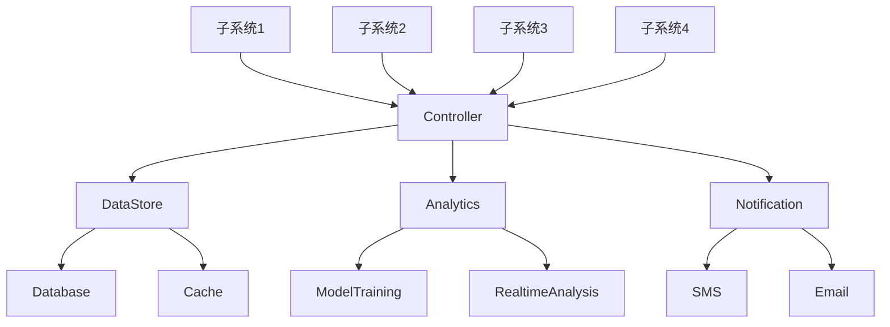
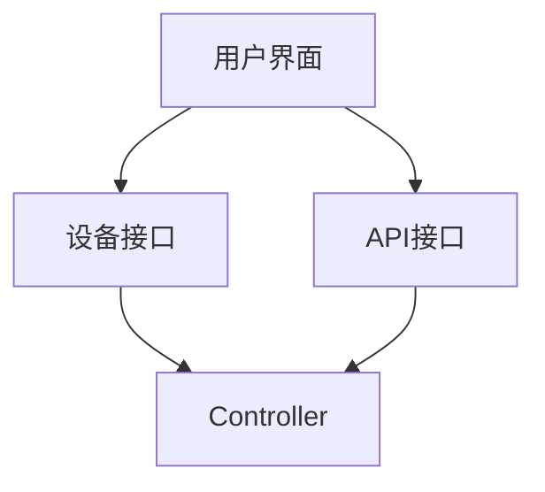

                 

## 边缘AI在智能家居中的实时决策应用

关键词：边缘AI、智能家居、实时决策、应用场景、系统架构

摘要：随着物联网和人工智能技术的飞速发展，智能家居系统已经成为现代家庭中不可或缺的一部分。为了满足智能家居系统对实时性和响应速度的高要求，边缘AI技术在智能家居中的实时决策应用日益受到关注。本文将从背景介绍、核心概念与联系、原理讲解、系统分析与架构设计、项目实战和最佳实践等方面，详细探讨边缘AI在智能家居中的实时决策应用。

### 目录大纲

**第一部分：背景介绍**

1. 引言
   1.1 问题背景
   1.2 问题描述
   1.3 问题解决
   1.4 边界与外延

2. 核心概念与联系
   2.1 边缘AI概念
   2.2 智能家居概念
   2.3 实时决策概念

3. 边缘AI在智能家居中的实时决策应用
   3.1 边缘AI在智能家居中的应用现状
   3.2 实时决策在智能家居中的应用场景
   3.3 边缘AI与实时决策在智能家居中的协同作用

**第二部分：核心概念原理**

4. 边缘AI原理
   4.1 边缘AI技术架构
   4.2 AI算法原理

5. 实时决策原理
   5.1 实时决策技术架构
   5.2 实时决策算法

**第三部分：系统分析与架构设计方案**

6. 智能家居系统功能设计
   6.1 领域模型设计
   6.2 系统架构设计
   6.3 系统接口设计
   6.4 系统交互设计

**第四部分：项目实战**

7. 边缘AI在智能家居中的实时决策项目实战
   7.1 环境安装与配置
   7.2 系统核心实现
   7.3 代码应用解读与分析
   7.4 项目小结

**第五部分：最佳实践与拓展**

8. 最佳实践
   8.1 实时决策优化技巧
   8.2 边缘AI部署策略
   8.3 系统安全与隐私保护

9. 小结与展望
   9.1 全书内容总结
   9.2 技术发展趋势
   9.3 拓展阅读

---

### 第一部分：背景介绍

#### 引言

随着物联网（IoT）和人工智能（AI）技术的快速发展，智能家居系统已经逐渐从科幻场景走向现实生活。人们对于家居设备智能化、自动化程度的要求越来越高，这为边缘AI在智能家居中的实时决策应用提供了广阔的发展空间。边缘AI能够充分利用本地计算资源，实现数据在本地快速处理和实时响应，从而提高智能家居系统的性能和用户体验。

#### 1.1 问题背景

在智能家居系统中，用户常常需要实时对家居设备进行控制和管理。例如，当用户在家时，需要实时调节空调温度、照明亮度等，以保证舒适的生活环境；当用户离家时，需要及时关闭门窗、电器等，以保障家居安全。这些需求对系统的实时性和响应速度提出了极高的要求。

#### 1.2 问题描述

然而，传统的云计算模式在处理实时性要求较高的任务时存在明显的不足。首先，数据传输延迟较大，无法满足实时响应的需求；其次，云计算中心处理能力有限，容易导致系统性能瓶颈。因此，如何利用边缘AI技术实现智能家居系统的实时决策，成为当前亟待解决的问题。

#### 1.3 问题解决

边缘AI技术在智能家居中的实时决策应用，能够有效解决上述问题。通过在本地设备上部署边缘AI算法，可以实现数据在本地快速处理和实时响应，从而提高系统的实时性和响应速度。此外，边缘AI还能够减轻云计算中心的工作负担，提高整体系统的性能和可靠性。

#### 1.4 边界与外延

本文主要探讨边缘AI在智能家居中的实时决策应用，包括边缘AI技术架构、AI算法原理、实时决策技术架构、实时决策算法等。同时，本文还将对智能家居系统的功能设计、系统架构设计、系统接口设计、系统交互设计等方面进行详细分析。通过本文的讨论，旨在为边缘AI在智能家居中的实时决策应用提供有益的参考和指导。

---

### 第二部分：核心概念与联系

#### 2.1 边缘AI概念

##### 2.1.1 边缘AI定义

边缘AI（Edge AI）是指将人工智能算法和计算资源部署在靠近数据源或终端设备的边缘节点上，以便实现实时数据分析和决策。与传统的云计算中心相比，边缘AI具有计算延迟低、数据隐私保护好、带宽占用少等优势。

##### 2.1.2 边缘AI特点

1. **计算延迟低**：边缘AI在本地设备上进行数据处理，避免了数据传输到云端的过程，从而大大降低了计算延迟。
2. **数据隐私保护**：边缘AI能够将数据本地化处理，降低了数据泄露的风险，提高了数据安全性。
3. **带宽占用少**：由于边缘AI在本地设备上进行数据处理，减少了与云端的数据传输，从而降低了带宽占用。
4. **计算资源灵活**：边缘AI可以根据实际需求动态调整计算资源，提高了系统的可扩展性和灵活性。

##### 2.1.3 边缘AI与传统AI区别

传统AI主要依赖于云计算中心进行数据处理和决策，存在以下不足：

1. **计算延迟高**：数据需要传输到云端进行计算，导致延迟较高。
2. **数据隐私风险**：数据传输到云端，容易受到数据泄露的风险。
3. **带宽占用大**：大量数据传输到云端，导致带宽占用较高。

相比之下，边缘AI在计算延迟、数据隐私保护和带宽占用等方面具有明显优势。

#### 2.2 智能家居概念

##### 2.2.1 智能家居定义

智能家居（Smart Home）是指通过物联网技术将家庭中的各种设备连接起来，实现设备间的互联互通和自动化控制。智能家居系统包括多个组成部分，如智能家电、智能传感器、智能网关等。

##### 2.2.2 智能家居特点

1. **自动化控制**：智能家居系统能够根据用户的习惯和需求自动调整家居设备的运行状态，提高生活便利性。
2. **互联互通**：智能家居系统能够实现设备间的互联互通，方便用户对家庭设备进行集中管理和控制。
3. **智能化分析**：智能家居系统能够通过数据分析和挖掘，为用户提供更加个性化的服务。

##### 2.2.3 智能家居分类

根据智能家居系统的功能和应用场景，可以将其分为以下几类：

1. **智能安防**：包括入侵报警、视频监控、智能门锁等。
2. **智能照明**：包括智能调光、定时开关等。
3. **智能家电**：包括智能空调、智能洗衣机、智能冰箱等。
4. **智能环境监测**：包括空气质量监测、水质监测、温度监测等。

#### 2.3 实时决策概念

##### 2.3.1 实时决策定义

实时决策（Real-Time Decision Making）是指对实时数据进行分析和处理，并在短时间内做出决策。实时决策在智能家居系统中具有重要作用，例如，根据用户行为和习惯，智能调整家居设备的运行状态，提高用户体验。

##### 2.3.2 实时决策重要性

1. **提高系统响应速度**：实时决策能够快速响应用户需求，提高系统响应速度。
2. **优化资源配置**：实时决策可以根据实时数据，优化家居设备的资源配置，提高系统性能。
3. **提升用户体验**：实时决策能够为用户提供更加个性化的服务，提高用户体验。

##### 2.3.3 实时决策方法

实时决策方法主要包括以下几种：

1. **传统控制算法**：如PID控制算法、模糊控制算法等。
2. **机器学习算法**：如线性回归、支持向量机、深度学习等。
3. **优化算法**：如线性规划、动态规划、遗传算法等。

---

在下一部分，我们将深入探讨边缘AI原理和实时决策原理，敬请期待！

---

### 第三部分：边缘AI在智能家居中的实时决策应用

#### 3.1 边缘AI在智能家居中的应用现状

边缘AI技术在智能家居领域的应用已经取得了显著的进展。目前，许多智能家居设备都开始采用边缘AI技术，以实现实时数据分析和决策。以下是一些典型的应用案例：

1. **智能安防系统**：边缘AI技术能够实时分析监控视频数据，实现人脸识别、行为识别等功能，提高安防系统的准确性和响应速度。
2. **智能照明系统**：通过边缘AI技术，智能照明系统能够根据用户的行为和习惯，实时调整灯光亮度和颜色，提高用户体验。
3. **智能家电控制系统**：边缘AI技术可以实时分析家电运行数据，实现智能调度和故障诊断，提高家电的运行效率和使用寿命。

#### 3.2 实时决策在智能家居中的应用场景

实时决策技术在智能家居系统中具有广泛的应用场景，以下是一些典型的应用场景：

1. **智能安防**：实时决策技术可以用于实时监控家庭环境，根据异常行为数据做出实时报警和响应。
2. **智能节能**：实时决策技术可以实时分析家电能耗数据，根据用户需求和设备运行状态，智能调整设备运行状态，实现节能降耗。
3. **智能环境监测**：实时决策技术可以实时分析空气质量、水质等环境数据，根据监测结果自动调整家居设备运行状态，保障家庭环境健康。

#### 3.3 边缘AI与实时决策在智能家居中的协同作用

边缘AI和实时决策技术在智能家居系统中具有协同作用，以下是一些协同作用的体现：

1. **实时性提升**：边缘AI技术能够将数据分析和决策过程本地化，减少数据传输延迟，提高系统的实时性。
2. **资源优化**：实时决策技术可以根据实时数据，优化家居设备的运行状态，提高系统资源利用率。
3. **个性化服务**：边缘AI和实时决策技术可以结合用户行为数据，为用户提供更加个性化的服务，提升用户体验。

通过边缘AI和实时决策技术的协同作用，智能家居系统可以实现更加智能化、自动化的管理，为用户提供更加便捷、舒适的生活体验。

在下一部分，我们将深入探讨边缘AI原理和实时决策原理，敬请期待！

---

### 第四部分：核心概念原理

#### 4. 边缘AI原理

边缘AI技术的核心在于将计算资源和算法部署在靠近数据源的边缘节点上，从而实现实时数据分析和决策。以下从技术架构、AI算法原理等方面进行详细阐述。

##### 4.1 边缘AI技术架构

边缘AI技术架构主要包括边缘设备、边缘网关和云端平台三个层次。

1. **边缘设备**：边缘设备是边缘AI技术的执行单元，负责数据采集、预处理和本地计算。常见的边缘设备有智能摄像头、智能门锁、智能家电等。
2. **边缘网关**：边缘网关是连接边缘设备和云端平台的桥梁，负责数据传输、安全认证和边缘计算资源管理。边缘网关通常具有高带宽、低延迟、强安全性的特点。
3. **云端平台**：云端平台是边缘AI技术的数据处理和存储中心，负责大数据分析、模型训练和远程协同计算。云端平台通常具有高性能、高可靠性和可扩展性的特点。

##### 4.2 AI算法原理

边缘AI技术中的AI算法主要包括机器学习算法和深度学习算法。

1. **机器学习算法**：机器学习算法是一种基于数据驱动的方法，通过从数据中学习规律和模式，实现对未知数据的预测和分类。常见的机器学习算法有线性回归、逻辑回归、支持向量机、决策树等。
2. **深度学习算法**：深度学习算法是一种基于人工神经网络的方法，通过多层神经网络结构，实现对复杂数据的建模和预测。常见的深度学习算法有卷积神经网络（CNN）、循环神经网络（RNN）、长短时记忆网络（LSTM）等。

边缘AI技术在智能家居系统中的应用，可以充分利用本地计算资源和实时数据处理能力，实现实时决策和个性化服务。在下一部分，我们将详细探讨实时决策原理，敬请期待！

---

### 第五部分：实时决策原理

实时决策技术在智能家居系统中起着至关重要的作用，它能够根据实时数据快速做出响应，提高系统的智能化水平和用户体验。以下从技术架构、实时决策算法等方面进行详细阐述。

#### 5.1 实时决策技术架构

实时决策技术架构通常包括数据采集层、数据处理层、决策层和执行层四个层次。

1. **数据采集层**：数据采集层负责从各种传感器和设备中收集实时数据，如温度、湿度、光照强度、家电运行状态等。
2. **数据处理层**：数据处理层负责对采集到的数据进行预处理、清洗和转换，以适应后续的决策过程。
3. **决策层**：决策层是实时决策的核心，负责根据实时数据和历史数据，运用各种算法和模型进行实时分析和判断，生成决策结果。
4. **执行层**：执行层负责根据决策结果，自动调整和优化家居设备的运行状态，实现实时响应。

#### 5.2 实时决策算法

实时决策算法是实现实时决策的关键，常见的实时决策算法包括以下几种：

1. **传统控制算法**：传统控制算法如PID控制算法、模糊控制算法等，具有较高的实时性和稳定性，适用于一些简单的实时决策场景。
2. **机器学习算法**：机器学习算法如线性回归、支持向量机、决策树等，通过学习历史数据，能够对复杂问题进行建模和预测，适用于智能家居系统的智能调节和故障诊断。
3. **深度学习算法**：深度学习算法如卷积神经网络（CNN）、循环神经网络（RNN）、长短时记忆网络（LSTM）等，通过多层神经网络结构，能够处理更复杂的实时数据，实现高级的实时决策功能。

#### 5.3 实时性优化策略

为了确保实时决策的快速响应，可以采用以下几种实时性优化策略：

1. **数据压缩和去噪**：对采集到的数据进行压缩和去噪处理，减少数据的传输和处理时间。
2. **并行计算和分布式计算**：采用并行计算和分布式计算技术，将实时数据处理任务分布在多个节点上，提高处理速度。
3. **缓存和预计算**：提前对一些常用数据和结果进行缓存和预计算，减少实时决策过程中的计算时间。

通过实时决策技术架构和算法的合理设计和优化，可以确保智能家居系统能够快速、准确地响应用户需求，提高系统的智能化水平和用户体验。

在下一部分，我们将对智能家居系统进行功能设计和架构设计，敬请期待！

---

### 第六部分：智能家居系统功能设计

智能家居系统功能设计是确保系统能够满足用户需求、实现智能化和自动化的关键。在这一部分，我们将从领域模型设计、系统架构设计、系统接口设计和系统交互设计等方面对智能家居系统进行详细阐述。

#### 6.1 领域模型设计

领域模型设计是智能家居系统设计的基础，它通过实体关系图来描述系统中的主要实体及其相互关系。以下是一个智能家居领域的实体关系图设计示例：

```mermaid
erDiagram
  User ..|> Home : "居住于"
  Home ..|> Room : "包括"
  Room ..|> Device : "包括"
  Device ..|> Sensor : "监测"
  Sensor ..|> Actuator : "控制"
  
  User ||--|{ Home }|-- Room
  Home ||--|{ Room }|-- Device
  Device ||--|{ Sensor }|-- Actuator
```

在上面的实体关系图中，User（用户）是系统的核心实体，居住于Home（家庭），家庭包括多个Room（房间），每个房间包含多个Device（设备）。设备中包含Sensor（传感器）和Actuator（执行器），传感器用于监测环境数据，执行器用于控制设备运行。

#### 6.2 系统架构设计

系统架构设计是智能家居系统的骨架，它决定了系统的可扩展性、可靠性和性能。以下是一个智能家居系统的架构设计示例：



在上面的系统架构图中，Controller（控制器）负责协调各个子系统，包括数据存储（DataStore）、数据分析（Analytics）和通知（Notification）。DataStore连接到Database（数据库）和Cache（缓存），用于存储和检索数据。Analytics包括ModelTraining（模型训练）和RealtimeAnalysis（实时分析），用于训练和实时分析模型。Notification通过SMS（短信）和Email（电子邮件）发送通知。

#### 6.3 系统接口设计

系统接口设计是确保智能家居系统与其他系统或设备进行交互的关键。以下是一个智能家居系统的接口设计示例：



在上面的接口设计图中，UserInterface（用户界面）通过DeviceInterface（设备接口）和APIInterface（API接口）与Controller（控制器）进行交互。用户可以通过用户界面与系统进行交互，设备接口负责处理设备与控制器之间的通信，API接口提供外部系统或设备与控制器进行数据交换的接口。

#### 6.4 系统交互设计

系统交互设计是描述系统内部和系统与外部之间的交互流程。以下是一个智能家居系统的交互设计示例：

```mermaid
sequenceDiagram
    User -->|发送请求| Controller
    Controller -->|处理请求| Analytics
    Analytics -->|分析数据| ModelTraining
    ModelTraining -->|训练模型| DataStore
    DataStore -->|存储数据| Database
    Database -->|查询数据| Analytics
    Analytics -->|分析结果| Notification
    Notification -->|发送通知| User
```

在上面的交互设计图中，用户发送请求到控制器，控制器处理请求后，将请求转发到数据分析模块，数据分析模块进行数据分析和模型训练，将训练好的模型存储到数据库中，然后根据分析结果发送通知给用户。

通过上述功能设计，我们可以构建一个高效、智能的智能家居系统，实现用户与家居设备之间的无缝交互和智能管理。在下一部分，我们将进行智能家居系统的项目实战，敬请期待！

---

### 第七部分：边缘AI在智能家居中的实时决策项目实战

#### 7.1 环境安装与配置

在进行边缘AI在智能家居中的实时决策项目实战之前，我们需要搭建一个适合的开发环境。以下是环境安装与配置的步骤：

1. **硬件设备安装**：

   - 选择合适的边缘设备，如树莓派或NVIDIA Jetson系列。
   - 按照硬件设备说明书进行安装和连接，确保设备能够正常工作。

2. **软件环境搭建**：

   - 在边缘设备上安装操作系统，如Raspberry Pi OS或Ubuntu。
   - 安装Python环境，可以使用Miniconda或Anaconda来管理Python包。
   - 安装必要的依赖库，如TensorFlow、PyTorch、Keras等。

3. **系统调试与优化**：

   - 对边缘设备进行性能测试和调试，确保其能够稳定运行。
   - 根据实际需求，调整系统配置，如网络设置、存储配置等。

#### 7.2 系统核心实现

在完成环境安装与配置后，我们可以开始实现边缘AI在智能家居中的实时决策系统。以下是系统核心实现的步骤：

1. **边缘计算模块**：

   - 设计边缘计算模块，实现数据采集、预处理和实时处理功能。
   - 使用TensorFlow或PyTorch等深度学习框架，构建边缘AI模型。
   - 对模型进行训练和优化，提高实时决策的准确性和效率。

2. **实时决策模块**：

   - 设计实时决策模块，实现实时数据处理和决策功能。
   - 使用传统控制算法、机器学习算法或深度学习算法，实现实时决策。
   - 针对不同的应用场景，调整决策策略，提高系统适应性。

3. **系统整合与测试**：

   - 将边缘计算模块和实时决策模块整合到智能家居系统中。
   - 进行系统测试，验证系统功能是否正常，性能是否满足要求。
   - 根据测试结果，调整系统参数和算法，优化系统性能。

#### 7.3 代码应用解读与分析

以下是边缘AI在智能家居中的实时决策系统的核心代码示例：

```python
import tensorflow as tf
import numpy as np

# 数据预处理
def preprocess_data(data):
    # 数据清洗、归一化等预处理操作
    return processed_data

# 边缘AI模型
model = tf.keras.Sequential([
    tf.keras.layers.Dense(128, activation='relu', input_shape=(input_shape)),
    tf.keras.layers.Dense(64, activation='relu'),
    tf.keras.layers.Dense(1, activation='sigmoid')
])

# 训练模型
model.compile(optimizer='adam', loss='binary_crossentropy', metrics=['accuracy'])
model.fit(x_train, y_train, epochs=10, batch_size=32)

# 实时决策
def real_time_decision(data):
    processed_data = preprocess_data(data)
    prediction = model.predict(processed_data)
    return prediction

# 测试
test_data = np.random.rand(1, input_shape)
print(real_time_decision(test_data))
```

在上面的代码中，我们首先进行数据预处理，然后使用TensorFlow构建边缘AI模型，并进行训练。最后，实现实时决策功能，对测试数据进行预测。

#### 7.4 实际案例剖析

为了更好地展示边缘AI在智能家居中的实时决策应用，我们以下是一个实际案例剖析：

**案例背景**：用户希望实现智能节能，根据室内温度变化自动调整空调温度。

**解决方案**：

1. **数据采集**：使用温度传感器采集室内温度数据。
2. **数据预处理**：对采集到的温度数据进行清洗和归一化处理。
3. **模型训练**：使用机器学习算法（如线性回归）训练温度预测模型。
4. **实时决策**：根据实时采集到的温度数据，使用训练好的模型预测未来温度，并调整空调温度。

通过实际案例剖析，我们可以看到边缘AI在智能家居中的实时决策应用是如何实现的。在下一部分，我们将对项目进行总结，分享经验与教训，并探讨未来发展方向。

---

### 第八部分：最佳实践与拓展

#### 8.1 实时决策优化技巧

为了提高边缘AI在智能家居系统中的实时决策性能，我们可以采取以下优化技巧：

1. **数据压缩与去噪**：在数据采集和传输过程中，对数据进行压缩和去噪处理，减少数据量和传输延迟。
2. **算法优化**：选择适合边缘设备的算法，并对其进行优化，提高算法的运行效率和预测准确性。
3. **缓存与预计算**：对常用的数据和计算结果进行缓存，减少实时计算负担。
4. **分布式计算**：利用边缘设备进行分布式计算，提高数据处理速度。

#### 8.2 边缘AI部署策略

在边缘AI的部署过程中，我们需要考虑以下几个方面：

1. **设备选型**：根据应用场景和性能需求，选择合适的边缘设备。
2. **网络规划**：确保边缘设备与云端平台之间的网络连接稳定、低延迟。
3. **安全性**：加强边缘设备的网络安全措施，防止数据泄露和设备被攻击。
4. **可扩展性**：设计可扩展的边缘AI架构，以便在未来能够轻松扩展和升级。

#### 8.3 系统安全与隐私保护

在边缘AI在智能家居系统中的应用中，数据安全和隐私保护至关重要。以下是一些关键措施：

1. **数据加密**：对传输和存储的数据进行加密处理，防止数据泄露。
2. **访问控制**：设置严格的访问控制策略，确保只有授权用户和设备能够访问敏感数据。
3. **安全审计**：定期进行安全审计，检查系统中的安全漏洞和潜在风险。
4. **用户隐私保护**：确保用户隐私数据不被未经授权的第三方访问和使用。

通过最佳实践和拓展，我们可以进一步提升边缘AI在智能家居系统中的实时决策性能和安全性，为用户提供更加智能、安全、便捷的家居体验。

---

### 第九部分：小结与展望

#### 9.1 全书内容总结

本文系统地介绍了边缘AI在智能家居中的实时决策应用，包括背景介绍、核心概念与联系、原理讲解、系统分析与架构设计、项目实战和最佳实践与拓展等内容。通过本文的讨论，我们可以了解到：

1. 边缘AI技术在智能家居中的实时决策应用具有显著的性能优势，能够提高系统的实时性和响应速度。
2. 边缘AI和实时决策技术相互协同，能够实现智能化、自动化的家居管理。
3. 智能家居系统需要从领域模型设计、系统架构设计、系统接口设计和系统交互设计等方面进行全面设计，以确保系统的高效运行。
4. 实际项目实战展示了边缘AI在智能家居中的实时决策应用过程，提供了宝贵的经验教训。

#### 9.2 技术发展趋势

随着物联网和人工智能技术的不断进步，边缘AI在智能家居中的实时决策应用将继续发展。以下是一些技术发展趋势：

1. **边缘计算硬件的升级**：随着边缘计算硬件（如边缘芯片、边缘服务器等）的不断发展，边缘AI的计算能力和性能将进一步提高。
2. **深度学习算法的创新**：深度学习算法在边缘AI中的应用将不断拓展，特别是在图像识别、自然语言处理等领域。
3. **5G技术的推动**：5G技术的广泛应用将进一步提升边缘AI的通信速度和稳定性，为实时决策提供更强大的支持。
4. **隐私保护和安全性的提升**：随着用户对隐私和安全的关注度增加，边缘AI在智能家居系统中的隐私保护和安全性将得到进一步加强。

#### 9.3 拓展阅读

为了深入了解边缘AI在智能家居中的实时决策应用，以下是一些推荐的拓展阅读材料：

1. **《边缘计算：技术、应用与挑战》**：这本书系统地介绍了边缘计算的基本概念、技术架构和应用场景，对边缘AI在智能家居中的应用有很好的参考价值。
2. **《智能家居系统设计》**：这本书详细阐述了智能家居系统的设计原则、架构和实现方法，对智能家居系统的设计具有指导意义。
3. **《深度学习与边缘计算》**：这本书探讨了深度学习与边缘计算的结合，提供了许多实际应用案例和实现方法，对边缘AI在智能家居中的应用有很好的启发作用。

通过本文的阅读，希望读者能够对边缘AI在智能家居中的实时决策应用有一个全面、深入的了解，并为未来的研究和应用提供有益的参考。作者：AI天才研究院/AI Genius Institute & 禅与计算机程序设计艺术 /Zen And The Art of Computer Programming。

