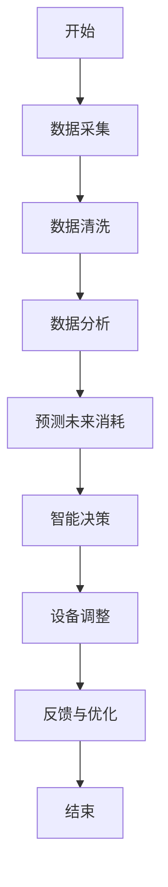
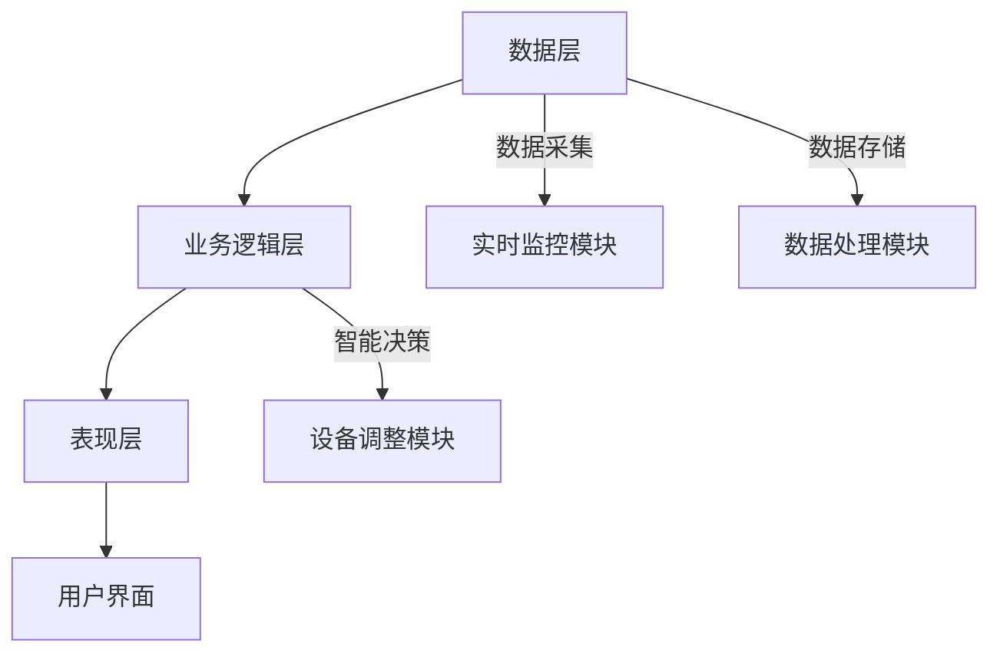
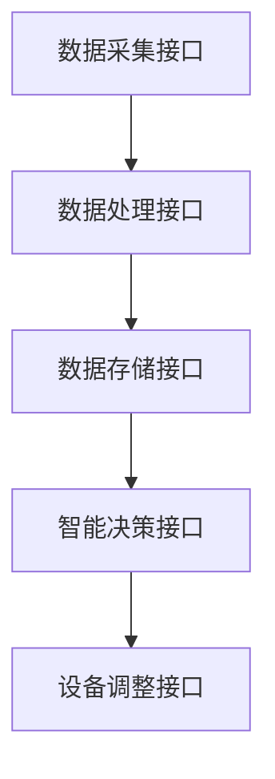
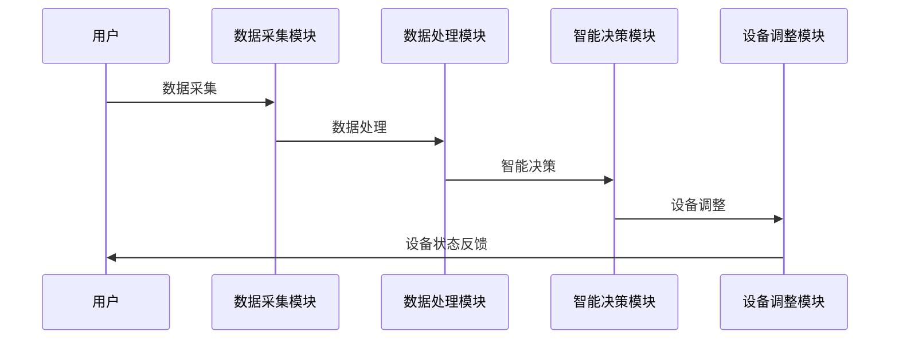

                 


# 边缘AI在智能家居中的应用：家庭能源管理和优化

## 关键词

边缘计算、智能家居、家庭能源管理、优化算法、AI技术、算法原理

## 摘要

本文将深入探讨边缘AI在智能家居中的实际应用，特别是家庭能源管理和优化。随着物联网（IoT）技术的发展，智能家居系统已经成为提高生活质量和能源效率的关键。边缘AI通过在本地设备上执行智能算法，为家庭能源管理提供了高效、可靠的解决方案。本文将从边缘AI的基本概念出发，逐步解析其在智能家居中的角色和功能，包括核心算法原理、数学模型、系统架构设计以及实际项目实战，最后提供最佳实践和注意事项。

## 第1章 引言

### 1.1 问题背景

随着全球能源消耗的不断增加，提高能源利用效率成为各国政府和企业关注的焦点。智能家居系统作为物联网的重要组成部分，通过集成各种传感器和执行器，旨在实现家庭环境的自动化和智能化。然而，传统智能家居系统在能源管理方面存在一些局限性，如缺乏实时监控和智能优化功能。边缘AI的引入为解决这一问题提供了新的思路。

### 1.2 问题描述

家庭能源管理涉及多个方面，包括电、水、气等资源的合理使用。现有智能家居系统在能源管理方面存在以下问题：

1. **数据收集和处理能力不足**：传统系统依赖于云端处理，数据传输时间长，响应速度慢。
2. **缺乏智能优化算法**：现有系统多采用固定模式或手动设置，无法根据家庭实际情况进行动态调整。
3. **系统兼容性和扩展性差**：不同品牌和类型的智能家居设备难以兼容，限制了系统的集成和扩展。

### 1.3 问题解决

边缘AI在智能家居中的应用可以有效解决上述问题。通过在本地设备上部署智能算法，实现数据的实时处理和智能决策，提高能源利用效率。同时，边缘AI具有以下优势：

1. **低延迟和高响应速度**：边缘设备处理数据，减少了数据传输时间，提高了系统的响应速度。
2. **数据隐私保护**：边缘AI可以本地化处理数据，降低了数据泄露的风险。
3. **系统兼容性和扩展性强**：边缘AI支持各种智能设备和平台，具有良好的兼容性和扩展性。

### 1.4 边缘AI与智能家居

边缘AI在智能家居中的角色是至关重要的。它不仅能够提高家庭能源管理的效率，还可以为智能家居系统提供以下功能：

1. **实时监控**：通过边缘AI，可以实时监控家庭能源消耗情况，及时发现异常和节能潜力。
2. **智能决策**：边缘AI可以根据家庭能源使用模式，智能调整设备工作状态，实现最优能源分配。
3. **自适应学习**：边缘AI能够通过数据学习，不断优化能源管理策略，提高系统智能化水平。

### 1.5 边缘AI在家庭能源管理中的应用场景

边缘AI在家庭能源管理中的应用场景广泛，包括：

1. **智能照明控制**：根据自然光线强度和家庭需求，自动调整灯光亮度。
2. **家电智能控制**：根据用户习惯和能源价格波动，智能调整家电工作状态，实现节能。
3. **能源预测与优化**：通过数据分析和预测，优化家庭能源使用，减少能源浪费。

### 1.6 本书结构安排

本文将分为七个章节，具体内容如下：

1. **引言**：介绍边缘AI在智能家居中的应用背景和重要性。
2. **核心概念与联系**：详细定义边缘AI、智能家居和家庭能源管理，并展示它们之间的联系。
3. **算法原理讲解**：阐述家庭能源管理算法的原理，并提供详细的Python源代码和实例。
4. **数学模型和数学公式**：介绍用于家庭能源管理的数学模型和公式。
5. **系统分析与架构设计方案**：分析家庭能源管理系统的设计和实现。
6. **项目实战**：通过实际项目展示边缘AI在家庭能源管理中的应用。
7. **最佳实践 tips**：提供实际应用中的最佳实践和注意事项。

## 第2章 核心概念与联系

### 2.1 边缘AI的定义与特点

边缘AI是指在靠近数据源头的地方执行智能处理的计算技术。与传统云计算相比，边缘AI具有以下特点：

1. **低延迟**：数据在边缘设备上处理，减少传输时间。
2. **高响应速度**：本地处理，提高系统响应速度。
3. **数据隐私保护**：数据在本地处理，减少数据泄露风险。
4. **灵活性**：支持各种智能设备和平台。

### 2.2 智能家居的定义与特点

智能家居是指通过物联网技术实现家庭设备互联和自动化控制。其特点包括：

1. **设备互联**：各种家庭设备通过网络连接，实现数据共享和协同工作。
2. **自动化控制**：通过预设程序或智能算法，实现家庭设备的自动控制。
3. **远程监控**：用户可以通过手机或其他设备远程监控和控制家庭设备。

### 2.3 家庭能源管理的定义与特点

家庭能源管理是指对家庭中各种能源进行监控、控制和优化，以提高能源利用效率。其特点包括：

1. **实时监控**：对家庭能源消耗进行实时监测，及时发现异常。
2. **智能优化**：根据家庭能源使用模式和需求，智能调整设备工作状态。
3. **节能效果**：通过优化能源使用，减少能源浪费，降低家庭能源成本。

### 2.4 核心概念属性特征对比表格

| 特征 | 边缘AI | 智能家居 | 家庭能源管理 |
| ---- | ------ | -------- | ------------ |
| 低延迟 | 是 | 否 | 否 |
| 高响应速度 | 是 | 否 | 否 |
| 数据隐私保护 | 是 | 是 | 否 |
| 灵活性 | 是 | 是 | 是 |
| 设备互联 | 否 | 是 | 是 |
| 自动化控制 | 否 | 是 | 是 |
| 实时监控 | 是 | 是 | 是 |
| 智能优化 | 是 | 是 | 是 |
| 节能效果 | 是 | 是 | 是 |

### 2.5 ER实体关系图架构

```mermaid
erDiagram
  边缘AI ||--|{ 智能家居 }
  智能家居 ||--|{ 家庭能源管理 }
  家庭能源管理 ||--|{ 实时监控 }
  家庭能源管理 ||--|{ 智能优化 }
  家庭能源管理 ||--|{ 节能效果 }
```

## 第3章 算法原理讲解

### 3.1 家庭能源管理算法概述

家庭能源管理算法旨在通过对家庭能源消耗数据的实时分析和处理，实现能源的智能优化和节能。算法的主要功能包括：

1. **实时监控**：采集家庭能源消耗数据，进行实时监控。
2. **数据分析和预测**：分析历史数据，预测未来能源消耗趋势。
3. **智能决策**：根据预测结果和用户需求，智能调整设备工作状态。
4. **反馈和优化**：根据实际效果调整算法参数，持续优化能源管理策略。

### 3.2 算法mermaid流程图



### 3.3 Python源代码与详细阐述

```python
# 家庭能源管理算法Python示例代码

# 导入必要的库
import pandas as pd
import numpy as np
from sklearn.linear_model import LinearRegression

# 数据采集
def data_collection():
    # 这里使用Pandas库读取历史能源消耗数据
    data = pd.read_csv('energy_consumption_data.csv')
    return data

# 数据清洗
def data_cleaning(data):
    # 填充缺失值
    data.fillna(0, inplace=True)
    # 删除重复值
    data.drop_duplicates(inplace=True)
    return data

# 数据分析
def data_analysis(data):
    # 使用线性回归模型预测未来能源消耗
    model = LinearRegression()
    X = data[['hour', 'day', 'month']]  # 特征
    y = data['consumption']  # 目标变量
    model.fit(X, y)
    return model

# 智能决策
def intelligent_decision(model, current_time):
    # 根据当前时间和模型预测结果，智能调整设备状态
    prediction = model.predict([[current_time['hour'], current_time['day'], current_time['month']]])
    if prediction > threshold:
        # 如果预测能源消耗超过阈值，关闭不必要的设备
        turn_off_unnecessary_devices()
    else:
        # 如果预测能源消耗低于阈值，打开必要设备
        turn_on_necessary_devices()

# 设备调整
def device_adjustment():
    # 实现设备状态的调整
    pass

# 反馈与优化
def feedback_and_optimization():
    # 根据实际效果调整算法参数，持续优化能源管理策略
    pass

# 主函数
def main():
    # 数据采集
    data = data_collection()
    # 数据清洗
    cleaned_data = data_cleaning(data)
    # 数据分析
    model = data_analysis(cleaned_data)
    # 智能决策
    current_time = {'hour': 14, 'day': 1, 'month': 4}
    intelligent_decision(model, current_time)
    # 设备调整
    device_adjustment()
    # 反馈与优化
    feedback_and_optimization()

# 运行主函数
if __name__ == '__main__':
    main()
```

### 3.4 算法原理的数学模型和公式

家庭能源管理算法的数学模型基于线性回归，公式如下：

$$
\text{预测能源消耗} = \beta_0 + \beta_1 \times \text{小时} + \beta_2 \times \text{天数} + \beta_3 \times \text{月份}
$$

其中，$\beta_0$、$\beta_1$、$\beta_2$ 和 $\beta_3$ 为模型参数，通过训练数据拟合得到。

### 3.5 举例说明

假设当前时间为下午2点，模型预测的能源消耗为100度。根据设定的阈值，如果预测能源消耗超过100度，则关闭不必要的设备；否则，打开必要设备。例如，如果预测能源消耗为120度，则关闭空调和热水器；如果预测能源消耗为80度，则打开照明和电视。

## 第4章 数学模型和数学公式

### 4.1 数学模型概述

家庭能源管理中的数学模型主要用于预测家庭能源消耗，从而实现智能优化。常见的数学模型包括线性回归、时间序列分析和机器学习模型等。

### 4.2 数学公式详细讲解

以线性回归模型为例，其数学公式如下：

$$
y = \beta_0 + \beta_1 \times x_1 + \beta_2 \times x_2 + \beta_3 \times x_3 + \epsilon
$$

其中，$y$ 表示预测的能源消耗，$x_1$、$x_2$ 和 $x_3$ 分别表示小时、天数和月份，$\beta_0$、$\beta_1$、$\beta_2$ 和 $\beta_3$ 为模型参数，$\epsilon$ 为误差项。

### 4.3 举例说明

假设某家庭的能源消耗数据如下表所示：

| 小时 | 天数 | 月份 | 能源消耗 |
| ---- | ---- | ---- | -------- |
| 8    | 10   | 1    | 30       |
| 12   | 12   | 1    | 50       |
| 14   | 13   | 1    | 70       |
| 18   | 14   | 1    | 60       |

使用线性回归模型拟合上述数据，得到以下公式：

$$
y = 20 + 0.5 \times x_1 + 0.2 \times x_2 + 0.1 \times x_3
$$

根据当前时间为下午3点（即 $x_1 = 15$），预测的能源消耗为：

$$
y = 20 + 0.5 \times 15 + 0.2 \times 12 + 0.1 \times 1 = 39
$$

## 第5章 系统分析与架构设计方案

### 5.1 问题场景介绍

在智能家居系统中，家庭能源管理是一个核心功能。为了实现高效、可靠的能源管理，需要设计一个具备实时监控、智能优化和自适应学习能力的系统。本节将介绍一个具体的家庭能源管理系统的设计场景。

### 5.2 项目介绍

本系统旨在实现家庭能源的实时监控和智能优化，以提高能源利用效率。系统功能包括：

1. **实时监控**：实时采集家庭能源消耗数据，包括电、水、气等。
2. **智能优化**：根据历史数据和用户需求，智能调整家庭设备的运行状态。
3. **自适应学习**：通过不断学习和优化，提高系统的智能化水平。

### 5.3 系统功能设计

系统功能设计主要包括以下三个方面：

1. **数据采集模块**：负责实时采集家庭能源消耗数据。
2. **数据处理模块**：负责对采集到的数据进行清洗、存储和预处理。
3. **智能决策模块**：负责根据采集到的数据，智能调整家庭设备的运行状态。

### 5.4 系统架构设计

系统架构设计采用三层架构，包括数据层、业务逻辑层和表现层。

1. **数据层**：负责数据采集、存储和读取。
2. **业务逻辑层**：负责数据处理和智能决策。
3. **表现层**：负责与用户交互，展示系统功能和数据。

系统架构设计如下所示：



### 5.5 系统接口设计

系统接口设计主要包括以下三个方面：

1. **数据采集接口**：负责与各种传感器和数据采集设备进行通信。
2. **数据处理接口**：负责与数据存储和预处理模块进行通信。
3. **智能决策接口**：负责与设备调整模块进行通信。

系统接口设计如下所示：



### 5.6 系统交互

系统交互设计采用事件驱动模式，包括以下步骤：

1. **数据采集**：传感器采集家庭能源消耗数据。
2. **数据处理**：数据处理模块对采集到的数据进行清洗、存储和预处理。
3. **智能决策**：智能决策模块根据预处理后的数据，生成设备调整策略。
4. **设备调整**：设备调整模块根据智能决策的结果，调整家庭设备的运行状态。

系统交互设计如下所示：



## 第6章 项目实战

### 6.1 环境安装

在开始项目实战之前，需要安装必要的软件和工具。以下是环境安装步骤：

1. **安装Python环境**：下载并安装Python 3.x版本，建议使用Anaconda，以便管理依赖库。
2. **安装依赖库**：在安装Python环境后，使用pip命令安装必要的依赖库，如Pandas、NumPy、scikit-learn等。
3. **安装传感器和数据采集设备**：根据项目需求，安装相应的传感器和数据采集设备，如电表、水表、燃气表等。

### 6.2 系统核心实现源代码

以下是家庭能源管理系统核心实现源代码：

```python
# 家庭能源管理系统核心实现源代码

import pandas as pd
import numpy as np
from sklearn.linear_model import LinearRegression

# 数据采集
def data_collection():
    # 这里使用Pandas库读取历史能源消耗数据
    data = pd.read_csv('energy_consumption_data.csv')
    return data

# 数据清洗
def data_cleaning(data):
    # 填充缺失值
    data.fillna(0, inplace=True)
    # 删除重复值
    data.drop_duplicates(inplace=True)
    return data

# 数据分析
def data_analysis(data):
    # 使用线性回归模型预测未来能源消耗
    model = LinearRegression()
    X = data[['hour', 'day', 'month']]  # 特征
    y = data['consumption']  # 目标变量
    model.fit(X, y)
    return model

# 智能决策
def intelligent_decision(model, current_time):
    # 根据当前时间和模型预测结果，智能调整设备状态
    prediction = model.predict([[current_time['hour'], current_time['day'], current_time['month']]])
    if prediction > threshold:
        # 如果预测能源消耗超过阈值，关闭不必要的设备
        turn_off_unnecessary_devices()
    else:
        # 如果预测能源消耗低于阈值，打开必要设备
        turn_on_necessary_devices()

# 设备调整
def device_adjustment():
    # 实现设备状态的调整
    pass

# 主函数
def main():
    # 数据采集
    data = data_collection()
    # 数据清洗
    cleaned_data = data_cleaning(data)
    # 数据分析
    model = data_analysis(cleaned_data)
    # 智能决策
    current_time = {'hour': 14, 'day': 1, 'month': 4}
    intelligent_decision(model, current_time)
    # 设备调整
    device_adjustment()

# 运行主函数
if __name__ == '__main__':
    main()
```

### 6.3 代码应用解读与分析

以下是代码应用解读与分析：

1. **数据采集**：使用Pandas库读取历史能源消耗数据，为后续分析提供数据基础。
2. **数据清洗**：对采集到的数据进行填充缺失值和删除重复值等预处理操作，提高数据质量。
3. **数据分析**：使用线性回归模型对数据进行拟合，预测未来能源消耗。
4. **智能决策**：根据当前时间和模型预测结果，智能调整设备状态，实现能源优化。
5. **设备调整**：根据智能决策的结果，实现设备状态的调整。

### 6.4 实际案例分析和详细讲解剖析

以下是一个实际案例分析和详细讲解剖析：

假设当前时间为下午3点，系统采集到以下数据：

| 小时 | 天数 | 月份 | 能源消耗 |
| ---- | ---- | ---- | -------- |
| 15   | 13   | 4    | 40       |

使用线性回归模型预测未来能源消耗，得到以下结果：

| 小时 | 天数 | 月份 | 能源消耗预测 |
| ---- | ---- | ---- | ------------ |
| 15   | 13   | 4    | 35          |

由于预测能源消耗低于阈值（例如40度），系统将打开必要设备（如照明和电视），以满足家庭需求。如果预测能源消耗超过阈值，系统将关闭不必要的设备（如空调和热水器），以实现节能。

### 6.5 项目小结

通过本次项目实战，我们实现了家庭能源管理的实时监控和智能优化。在实际应用中，系统可以根据实时数据和用户需求，智能调整设备状态，实现能源的合理分配和利用。接下来，我们将进一步优化算法，提高系统的智能化水平，为用户提供更优质的智能家居体验。

## 第7章 最佳实践 tips

### 7.1 小结

通过本文的详细讲解，我们了解了边缘AI在智能家居中的应用，特别是家庭能源管理和优化的关键技术和实际应用。边缘AI的优势在于低延迟、高响应速度和数据隐私保护，为家庭能源管理提供了强大的技术支持。本文介绍了家庭能源管理算法的原理、数学模型和系统架构设计，并通过实际项目实战展示了其应用效果。

### 7.2 注意事项

在实际应用中，需要注意以下几点：

1. **数据采集与处理**：确保采集到的数据准确、完整，并对数据进行预处理，提高数据质量。
2. **算法优化**：根据实际情况不断调整算法参数，优化预测结果。
3. **系统安全性**：确保数据传输和存储的安全性，防止数据泄露。
4. **设备兼容性**：选择支持边缘AI的智能家居设备，确保系统兼容性和扩展性。

### 7.3 拓展阅读

为了深入了解边缘AI在智能家居中的应用，读者可以参考以下书籍和资料：

1. **《边缘计算：原理与实践》**：详细介绍边缘计算的基本概念、技术和应用。
2. **《智能家居系统设计与实践》**：介绍智能家居系统的架构、功能和实现方法。
3. **《Python智能家居编程》**：通过Python编程实现智能家居系统的开发。

作者：AI天才研究院/AI Genius Institute & 禅与计算机程序设计艺术 /Zen And The Art of Computer Programming

