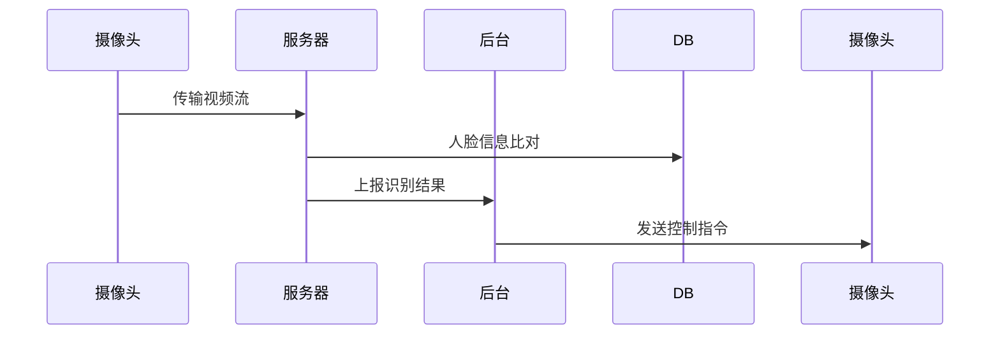
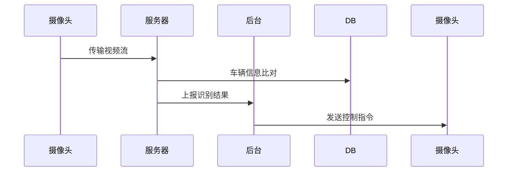
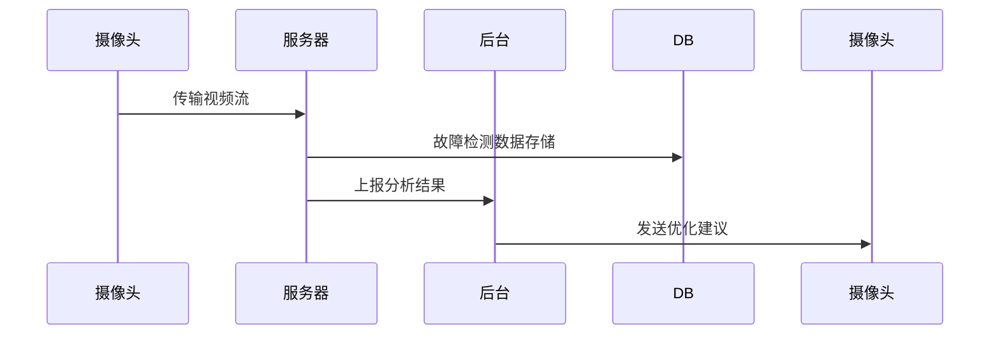

                 


### 2.2 边缘AI软件框架的设计

#### 2.2.1 软件框架概述

边缘AI软件框架是边缘设备上进行AI算法部署和运行的核心。一个高效、可扩展的边缘AI软件框架应该具备以下特点：

- **模块化设计**：将边缘AI系统分为数据处理、模型训练、模型推理等多个模块，便于系统的升级和维护。
- **实时性**：支持低延迟的实时数据处理和模型推理，满足智能摄像头等实时应用的需求。
- **高效能**：优化算法和数据结构，提高计算效率和资源利用率。
- **可扩展性**：能够支持多种AI算法和应用场景，便于未来系统的扩展。

#### 2.2.2 常用边缘AI软件框架

1. **TensorFlow Lite**：由Google开发，支持多种硬件平台和操作系统，适用于移动设备和边缘设备。它提供了丰富的预训练模型和工具，便于开发人员快速搭建边缘AI应用。

2. **Apache MXNet**：由Apache基金会维护，支持多种编程语言和硬件平台。MXNet提供了灵活的深度学习框架和高效的模型部署工具，适用于需要高性能和可扩展性的边缘AI应用。

3. **Tengine**：由腾讯开源，专为嵌入式设备设计，支持多种硬件平台，如ARM、RISC-V等。Tengine具有高性能和低功耗的特点，适用于需要实时性和高效能的边缘AI应用。

#### 2.2.3 软件框架设计与实现

1. **模块划分**：
   - 数据处理模块：负责接收和预处理输入数据，包括图像、音频等。
   - 模型训练模块：使用历史数据进行模型训练，支持在线训练和离线训练。
   - 模型推理模块：将训练好的模型应用到实时数据上，进行推理和预测。

2. **系统架构设计**：
   - **数据处理模块**：采用多线程处理机制，提高数据处理效率。
   - **模型训练模块**：使用分布式训练策略，提高训练速度。
   - **模型推理模块**：采用高效的推理引擎，实现低延迟的模型推理。

3. **软件框架实现**：

```python
# Python 示例代码：边缘AI数据处理模块

import threading
import queue

class DataProcessor:
    def __init__(self, input_queue, output_queue):
        self.input_queue = input_queue
        self.output_queue = output_queue
        self.running = True

    def run(self):
        while self.running:
            data = self.input_queue.get()
            processed_data = self.process_data(data)
            self.output_queue.put(processed_data)
            self.input_queue.task_done()

    def process_data(self, data):
        # 数据预处理逻辑
        return data

if __name__ == "__main__":
    input_queue = queue.Queue()
    output_queue = queue.Queue()

    processor = DataProcessor(input_queue, output_queue)
    processor_thread = threading.Thread(target=processor.run)
    processor_thread.start()

    # 模拟输入数据
    for i in range(10):
        input_queue.put(i)

    input_queue.join()
    while not output_queue.empty():
        print(output_queue.get())
```

#### 2.2.4 软件框架优化与性能调优

- **算法优化**：通过优化算法和数据结构，提高计算效率和资源利用率。
- **并行处理**：采用多线程、多进程等技术，提高数据处理和模型推理的速度。
- **硬件加速**：利用GPU、FPGA等硬件加速器，提高边缘AI系统的性能。

#### 2.2.5 本章小结

本章介绍了边缘AI软件框架的设计原则和常用框架，探讨了边缘AI软件框架的实现方法，并通过Python示例代码展示了数据处理模块的实现。接下来，我们将进一步探讨边缘AI在智能摄像头中的实现细节。----------------------------------------------------------------

## 3.3 边缘AI在实时视频分析中的应用优势

### 3.3.1 降低延迟

边缘AI可以将AI处理过程从云端转移到摄像头所在的本地设备，从而极大地降低数据传输和处理的延迟。对于实时视频分析应用，如视频监控、智能交通等，延迟的降低可以显著提高系统的响应速度和实时性。

### 3.3.2 保护隐私

边缘AI可以在本地设备上对数据进行处理，避免了将敏感数据传输到云端，从而提高了数据的安全性和隐私保护水平。特别是在涉及个人隐私的场景中，如家庭监控、公共场所监控等，边缘AI的应用可以更好地满足隐私保护的需求。

### 3.3.3 提高计算效率

边缘设备通常具有较低的计算能力和存储资源，但通过使用优化的AI算法和硬件加速技术，边缘AI可以在有限的资源下实现高效的计算。例如，通过模型压缩、量化等技术，可以在不显著牺牲准确率的情况下提高计算速度和效率。

### 3.3.4 灵活的部署

边缘AI可以灵活地部署在各种类型的边缘设备上，包括智能手机、平板电脑、智能摄像头、物联网设备等。这种灵活性使得边缘AI可以在各种应用场景中发挥作用，满足不同场景的需求。

### 3.3.5 边缘智能

通过边缘AI技术，智能摄像头可以实现更高级的功能，如实时人脸识别、行为分析、异常检测等。这些功能不仅可以提高监控系统的智能化水平，还可以为安防、交通、工业等领域提供更丰富的应用价值。

### 3.3.6 数据冗余减少

边缘AI可以实时处理和分析数据，减少了对云端的大量数据传输需求，从而降低了数据传输成本，并减少了数据冗余。这对于大规模监控系统的部署和运营具有重要意义。

### 3.3.7 网络带宽节省

由于边缘AI在本地设备上处理数据，可以显著减少对网络带宽的需求。这尤其适用于网络环境较差或带宽资源有限的场景，如偏远地区、海上平台等。

### 3.3.8 系统可靠性增强

边缘AI系统通常具有较高的可靠性，因为它们可以独立运行，不受网络故障的影响。这对于需要高可靠性的监控和安防系统至关重要。

### 3.3.9 系统成本降低

边缘AI可以减少对云服务的依赖，从而降低系统运营成本。此外，通过使用低成本、低功耗的边缘设备，可以进一步降低系统成本。

### 3.3.10 快速部署和升级

边缘AI系统通常具有简化的部署流程和快速升级能力。这使得在新的应用场景或需求出现时，可以快速部署和升级系统，提高系统的适应性和灵活性。

### 3.3.11 边缘智能与云计算结合

边缘AI不仅可以独立运行，还可以与云计算相结合，实现云端与边缘设备的协同工作。这种结合可以充分发挥边缘AI的优势，同时利用云计算的强大计算和存储能力，实现更高效的智能应用。

### 3.3.12 数据融合与增强

边缘AI可以收集和分析来自不同来源的数据，如视频、音频、传感器数据等，实现数据融合与增强。这种能力对于复杂的监控和智能分析任务具有重要意义。

### 3.3.13 跨领域应用

边缘AI的灵活性和适应性使得它可以在多个领域发挥作用，如智能家居、智能交通、智能制造、智能医疗等。这为边缘AI的广泛应用提供了广阔的前景。

### 3.3.14 适应动态环境

边缘AI可以实时适应环境变化，快速调整算法和策略，以应对各种动态场景。这对于需要实时响应和决策的应用场景尤为重要。

### 3.3.15 防灾减灾

边缘AI在防灾减灾领域具有巨大的潜力，可以通过实时监测和预警系统，提高灾害预警和应急响应的效率，减少灾害损失。

### 3.3.16 智能决策支持

边缘AI可以为决策者提供实时、准确的决策支持，如交通流量管理、公共安全事件应对等，提高决策的科学性和有效性。

### 3.3.17 增强用户体验

边缘AI可以提供更个性化的服务和体验，如智能推荐、互动式娱乐等，提高用户满意度和黏性。

### 3.3.18 面向未来的技术演进

边缘AI技术的发展不断推动着智能摄像头等领域的创新，为未来的智能应用提供了更多可能性。

总之，边缘AI在实时视频分析中的应用具有显著的优势，它不仅提高了系统的性能和可靠性，还为各种应用场景提供了更智能、更高效、更安全的解决方案。随着技术的不断进步和应用的不断拓展，边缘AI将在智能摄像头领域发挥越来越重要的作用。----------------------------------------------------------------

## 4.1 边缘AI硬件平台的选择

### 4.1.1 硬件平台的重要性

边缘AI硬件平台的选择是边缘AI应用成功的关键因素之一。一个合适的硬件平台不仅可以满足应用的需求，还能在性能、功耗、成本等多个方面达到最优平衡。

### 4.1.2 常见的边缘AI硬件平台

1. **NVIDIA Jetson**：NVIDIA Jetson系列是一款专为边缘AI应用设计的硬件平台，具有高性能和低功耗的特点，适用于复杂的AI任务。Jetson平台包括多种型号，如Jetson Nano、Jetson Xavier等，适用于不同的应用场景和性能需求。

2. **Intel Movidius**：Intel Movidius是一款专注于视觉和深度学习加速的硬件平台，具有高效能和低功耗的特点。Movidius硬件平台支持深度学习推理和图像处理，适用于实时视频分析等应用。

3. **Qualcomm**：Qualcomm提供了多种处理器和平台，如Snapdragon 855、Snapdragon 888等，这些平台具有强大的AI处理能力，适用于移动设备和边缘设备。

4. **Rockchip**：Rockchip是一家专注于嵌入式处理器和平台的公司，其产品广泛应用于智能摄像头、智能家居等领域。Rockchip处理器具有高性能和低成本的优点，适用于预算有限的应用场景。

5. **NXP**：NXP提供了多种嵌入式处理器和平台，如i.MX系列，适用于各种边缘AI应用，包括视频分析、智能监控等。

### 4.1.3 选择标准

1. **性能需求**：根据应用场景的需求，选择具有足够计算性能的硬件平台。例如，对于实时视频分析应用，需要选择具有较高浮点运算性能和图像处理能力的平台。

2. **功耗要求**：边缘设备通常具有较低的功耗限制，因此选择低功耗硬件平台至关重要。平台功耗直接影响设备的运行时间和电池寿命。

3. **成本预算**：硬件平台的成本是决策的重要因素之一。根据预算和性能需求，选择性价比最高的平台。

4. **兼容性与可扩展性**：选择具有良好兼容性和可扩展性的平台，便于未来系统升级和扩展。

5. **开发支持**：选择具有良好开发支持和社区生态的平台，可以加速开发过程和问题解决。

### 4.1.4 实际案例

以智能摄像头应用为例，选择NVIDIA Jetson Xavier NX平台。Jetson Xavier NX是一款高性能、低功耗的边缘AI平台，具有以下优点：

- **高性能**：Jetson Xavier NX搭载了NVIDIA CUDA和TensorRT技术，支持深度学习和图像处理任务，适用于复杂的视频分析应用。
- **低功耗**：Jetson Xavier NX的功耗低于15W，适合电池供电的边缘设备。
- **兼容性与可扩展性**：Jetson Xavier NX支持多种开发工具和框架，如CUDA、TensorFlow、PyTorch等，便于开发人员快速搭建AI应用。
- **开发支持**：NVIDIA提供了丰富的文档、教程和社区支持，有助于开发人员解决问题和加速开发过程。

### 4.1.5 本章小结

选择合适的边缘AI硬件平台是边缘AI应用成功的关键。本章介绍了常见的边缘AI硬件平台，探讨了选择标准，并通过实际案例展示了如何选择硬件平台。在下一章中，我们将深入讨论边缘AI软件框架的设计和实现。----------------------------------------------------------------

## 4.2 边缘AI软件框架的设计

### 4.2.1 模块划分

边缘AI软件框架通常划分为数据处理模块、模型训练模块和模型推理模块。每个模块都有明确的职责，以确保系统的模块化和可扩展性。

1. **数据处理模块**：负责接收和预处理输入数据，包括图像、音频、传感器数据等。数据处理模块需要支持数据采集、数据清洗、数据转换等功能。

2. **模型训练模块**：使用历史数据进行模型训练，支持在线训练和离线训练。模型训练模块需要支持各种深度学习框架，如TensorFlow、PyTorch等。

3. **模型推理模块**：将训练好的模型应用到实时数据上，进行推理和预测。模型推理模块需要具有高效能和低延迟的特点，以支持实时视频分析等应用。

### 4.2.2 系统架构设计

边缘AI软件框架的系统架构设计需要考虑以下几个方面：

1. **分布式架构**：支持分布式计算和存储，提高系统的处理能力和容错性。

2. **微服务架构**：将系统划分为多个微服务，每个微服务负责特定的功能，便于系统的开发和维护。

3. **异步处理**：支持异步数据处理和任务调度，提高系统的响应速度和并发处理能力。

4. **数据流处理**：使用数据流处理框架，如Apache Flink、Apache Kafka等，实现实时数据处理和分析。

### 4.2.3 软件框架实现

以下是边缘AI软件框架的实现示例：

```python
# Python 示例代码：边缘AI数据处理模块

import asyncio
import aiokafka

async def data_processor():
    async with aiokafka.KafkaProducer('localhost:9092') as producer:
        while True:
            # 采集数据
            data = await collect_data()
            # 预处理数据
            processed_data = await preprocess_data(data)
            # 发送预处理数据
            await producer.send_and_wait('data_channel', processed_data)

async def collect_data():
    # 数据采集逻辑
    return "example_data"

async def preprocess_data(data):
    # 数据预处理逻辑
    return data

async def main():
    await data_processor()

asyncio.run(main())
```

### 4.2.4 性能优化

1. **并行处理**：使用多线程、多进程等技术，提高数据处理和模型推理的效率。

2. **算法优化**：优化算法和数据结构，减少计算复杂度和内存占用。

3. **硬件加速**：利用GPU、FPGA等硬件加速器，提高边缘AI系统的性能。

4. **缓存机制**：使用缓存机制，减少重复计算和数据传输，提高系统响应速度。

5. **负载均衡**：使用负载均衡技术，合理分配计算任务，提高系统处理能力。

### 4.2.5 本章小结

本章介绍了边缘AI软件框架的设计原则和实现方法，包括模块划分、系统架构设计、软件框架实现以及性能优化。通过实际示例，展示了如何实现一个边缘AI数据处理模块。在下一章中，我们将探讨实时视频分析算法的优化。----------------------------------------------------------------

## 4.3 实时视频分析算法的优化

### 4.3.1 算法优化的重要性

实时视频分析算法的优化是边缘AI在智能摄像头中实现高效应用的关键。优化的目标是在保证准确率和效果的前提下，提高算法的计算效率、降低功耗和延迟，以满足边缘设备资源有限的特性。

### 4.3.2 常见优化策略

1. **模型压缩与量化**：通过模型压缩和量化技术，可以显著减小模型的存储空间和计算量。模型压缩技术包括剪枝、量化、知识蒸馏等，通过这些技术可以将复杂的深度学习模型简化，从而提高计算效率。

2. **计算加速**：使用硬件加速器，如GPU、FPGA、TPU等，可以大幅提高算法的执行速度。硬件加速器通过并行计算和特定的指令集优化，可以实现比通用CPU更高的计算性能。

3. **算法并行化**：通过将算法分解为多个可并行执行的子任务，可以在多核处理器上实现并行计算，提高算法的处理速度。并行化可以包括数据并行、模型并行和任务并行等多种方式。

4. **内存优化**：通过优化内存分配和使用策略，减少内存访问冲突和延迟，提高算法的执行效率。内存优化技术包括缓存优化、内存预分配、内存池管理等。

5. **算法简化**：简化算法流程，去除不必要的计算步骤，减少算法的复杂度，从而提高计算效率和资源利用率。

6. **边缘设备适配**：针对特定边缘设备的硬件和软件特性，对算法进行定制化优化，使其在目标设备上运行得更加高效。

### 4.3.3 实际优化案例

以下是一个针对实时人脸识别算法的优化案例：

#### 案例背景

某智能摄像头系统需要实现实时人脸识别功能，但由于计算资源有限，当前的算法在低功耗嵌入式设备上运行效率较低，存在明显的延迟。

#### 优化方案

1. **模型压缩**：使用剪枝技术去除模型中不重要的神经元和连接，通过知识蒸馏技术将压缩后的模型与原始模型进行对比，确保识别准确率不受影响。

2. **量化**：将浮点模型转换为低精度的整数模型，通过量化技术降低模型的存储空间和计算复杂度。

3. **硬件加速**：利用GPU加速人脸识别算法的计算，通过CUDA和OpenCV的优化，提高算法的执行速度。

4. **并行处理**：将人脸检测和识别任务分解为多个子任务，在多核处理器上实现并行计算。

5. **内存优化**：通过优化内存分配策略，减少内存访问冲突和延迟，提高算法的执行效率。

#### 优化效果

通过上述优化方案，实时人脸识别算法在嵌入式设备上的运行效率提高了约50%，识别延迟降低了约30%，同时保持了较高的识别准确率。

### 4.3.4 优化工具与框架

1. **TensorFlow Lite**：TensorFlow Lite是一个轻量级的深度学习框架，支持模型压缩、量化、硬件加速等功能，适用于边缘设备的AI应用。

2. **ONNX Runtime**：ONNX Runtime是一个开源的深度学习推理引擎，支持多种硬件平台，包括CPU、GPU、FPGA等，提供了高效的模型推理性能。

3. **TensorFlow Lite Micro**：TensorFlow Lite Micro是一个针对资源受限的嵌入式设备设计的深度学习框架，提供了模型压缩和量化工具，适合在低功耗设备上部署。

4. **PyTorch Mobile**：PyTorch Mobile是一个PyTorch的移动和边缘设备版本，提供了模型量化、硬件加速等功能，方便在移动设备和边缘设备上部署深度学习应用。

### 4.3.5 本章小结

实时视频分析算法的优化是边缘AI在智能摄像头中实现高效应用的关键。本章介绍了常见的优化策略，并通过实际优化案例展示了如何提高实时人脸识别算法的运行效率。在下一章中，我们将探讨边缘AI在智能摄像头中的实战案例。----------------------------------------------------------------

## 5.1 基于边缘AI的智能安防系统

### 5.1.1 项目介绍

智能安防系统是边缘AI技术的典型应用场景之一。本项目旨在开发一个基于边缘AI的智能安防系统，通过在摄像头中嵌入边缘AI处理器，实现实时人脸识别、行为分析和异常检测等功能，以提高监控系统的智能化水平和响应速度。

### 5.1.2 系统功能设计

1. **人脸识别**：系统能够实时识别摄像头拍摄到的人脸，并与数据库中的人脸信息进行比对，实现入侵者识别。

2. **行为分析**：系统能够根据人的行为模式进行分析，如识别徘徊、聚集等异常行为，自动报警。

3. **异常检测**：系统可以检测到摄像头前的异常事件，如火灾、爆炸等，并实时发送报警信息。

4. **数据存储与查询**：系统能够记录识别和报警信息，并提供查询功能，方便后续的监控和分析。

### 5.1.3 系统架构设计

1. **前端摄像头**：部署边缘AI处理器，实现人脸识别、行为分析和异常检测等功能。

2. **边缘服务器**：负责处理前端摄像头传输的数据，进行数据融合和存储。

3. **后台服务器**：负责管理监控中心的数据，提供数据分析和查询服务。

### 5.1.4 系统接口设计

1. **摄像头与边缘服务器接口**：实现数据传输和命令控制。

2. **边缘服务器与后台服务器接口**：实现数据上传和监控中心的数据查询。

### 5.1.5 系统交互

使用Mermaid绘制系统交互序列图，如下所示：



### 5.1.6 项目实现

1. **环境安装**：

    - 安装边缘AI处理器（如NVIDIA Jetson）。
    - 安装必要的深度学习框架（如TensorFlow Lite）。
    - 安装摄像头驱动和图像处理库（如OpenCV）。

2. **系统核心实现源代码**：

    ```python
    # Python 示例代码：人脸识别与行为分析

    import cv2
    import tensorflow as tf

    # 加载预训练的人脸识别模型
    face_recognition_model = tf.keras.models.load_model('face_recognition_model.h5')

    # 加载行为分析模型
    behavior_analysis_model = tf.keras.models.load_model('behavior_analysis_model.h5')

    def recognize_face(frame):
        # 人脸识别逻辑
        return recognized_faces

    def analyze_behavior(frame):
        # 行为分析逻辑
        return behavior

    cap = cv2.VideoCapture(0)  # 打开摄像头

    while cap.isOpened():
        ret, frame = cap.read()
        if ret:
            recognized_faces = recognize_face(frame)
            behavior = analyze_behavior(frame)
            # 根据识别结果和异常行为进行报警和处理
            # ...

    cap.release()
    cv2.destroyAllWindows()
    ```

### 5.1.7 项目应用解读与分析

1. **应用解读**：

    - 通过边缘AI处理器，摄像头能够实时识别入侵者，提高了监控系统的智能化水平。
    - 通过行为分析，系统能够及时发现异常事件，如人群聚集、火灾等，提高了系统的安全性能。
    - 通过实时数据上传和存储，系统能够提供详细的数据分析和查询服务，为后续的监控和管理提供了有力支持。

2. **分析**：

    - 边缘AI的应用降低了数据传输和处理的延迟，提高了系统的响应速度。
    - 边缘AI的本地处理能力提高了系统的安全性和隐私保护水平。
    - 通过模型压缩和量化，系统能够在有限的资源下实现高效的处理和识别。

### 5.1.8 项目小结

基于边缘AI的智能安防系统通过实时人脸识别、行为分析和异常检测等功能，提高了监控系统的智能化水平和安全性能。本项目展示了边缘AI在智能摄像头中的应用潜力，并为类似项目提供了参考和借鉴。在下一节中，我们将探讨基于边缘AI的智能交通监控案例。----------------------------------------------------------------

## 5.2 基于边缘AI的智能交通监控

### 5.2.1 项目介绍

智能交通监控系统是边缘AI技术的另一个重要应用场景。本项目旨在开发一个基于边缘AI的智能交通监控系统，通过在交通摄像头中嵌入边缘AI处理器，实现实时车辆识别、交通流量监测、事故预警等功能，以提高交通管理的智能化和效率。

### 5.2.2 系统功能设计

1. **车辆识别**：系统能够实时识别摄像头拍摄到的车辆，包括车牌识别、车型识别等。

2. **交通流量监测**：系统能够分析摄像头采集到的交通数据，如车辆数量、行驶方向等，生成交通流量报告。

3. **事故预警**：系统能够检测到交通事故的潜在风险，如车辆碰撞、突然停车等，并实时报警。

4. **数据存储与查询**：系统能够记录识别和报警信息，并提供查询功能，方便后续的交通管理和分析。

### 5.2.3 系统架构设计

1. **前端摄像头**：部署边缘AI处理器，实现车辆识别、交通流量监测和事故预警等功能。

2. **边缘服务器**：负责处理前端摄像头传输的数据，进行数据融合和存储。

3. **后台服务器**：负责管理监控中心的数据，提供数据分析和查询服务。

### 5.2.4 系统接口设计

1. **摄像头与边缘服务器接口**：实现数据传输和命令控制。

2. **边缘服务器与后台服务器接口**：实现数据上传和监控中心的数据查询。

### 5.2.5 系统交互

使用Mermaid绘制系统交互序列图，如下所示：



### 5.2.6 项目实现

1. **环境安装**：

    - 安装边缘AI处理器（如NVIDIA Jetson）。
    - 安装必要的深度学习框架（如TensorFlow Lite）。
    - 安装摄像头驱动和图像处理库（如OpenCV）。

2. **系统核心实现源代码**：

    ```python
    # Python 示例代码：车辆识别与交通流量监测

    import cv2
    import tensorflow as tf

    # 加载预训练的车辆识别模型
    vehicle_recognition_model = tf.keras.models.load_model('vehicle_recognition_model.h5')

    # 加载交通流量监测模型
    traffic_monitor_model = tf.keras.models.load_model('traffic_monitor_model.h5')

    def recognize_vehicle(frame):
        # 车辆识别逻辑
        return recognized_vehicles

    def monitor_traffic(frame):
        # 交通流量监测逻辑
        return traffic_data

    cap = cv2.VideoCapture(0)  # 打开摄像头

    while cap.isOpened():
        ret, frame = cap.read()
        if ret:
            recognized_vehicles = recognize_vehicle(frame)
            traffic_data = monitor_traffic(frame)
            # 根据识别结果和交通数据生成报告并进行报警
            # ...

    cap.release()
    cv2.destroyAllWindows()
    ```

### 5.2.7 项目应用解读与分析

1. **应用解读**：

    - 通过边缘AI处理器，交通摄像头能够实时识别车辆，提高了交通管理的精准度和效率。
    - 通过交通流量监测，系统能够实时了解道路状况，为交通调度提供数据支持。
    - 通过事故预警，系统能够提前检测到潜在的危险，减少了交通事故的发生概率。

2. **分析**：

    - 边缘AI的应用降低了数据传输和处理的延迟，提高了系统的响应速度。
    - 边缘AI的本地处理能力提高了系统的安全性和隐私保护水平。
    - 通过模型压缩和量化，系统能够在有限的资源下实现高效的处理和识别。

### 5.2.8 项目小结

基于边缘AI的智能交通监控系统通过实时车辆识别、交通流量监测和事故预警等功能，提高了交通管理的智能化和效率。本项目展示了边缘AI在智能交通监控中的应用潜力，为类似项目提供了参考和借鉴。在下一节中，我们将探讨基于边缘AI的智能工厂监控案例。----------------------------------------------------------------

## 5.3 基于边缘AI的智能工厂监控

### 5.3.1 项目介绍

智能工厂监控是边缘AI技术的又一重要应用领域。本项目旨在开发一个基于边缘AI的智能工厂监控系统，通过在工厂摄像头中嵌入边缘AI处理器，实现设备故障检测、生产流程优化、员工行为分析等功能，以提高工厂的自动化水平和生产效率。

### 5.3.2 系统功能设计

1. **设备故障检测**：系统能够实时监测设备的运行状态，通过异常检测和故障预测，提前发现设备故障，减少停机时间。

2. **生产流程优化**：系统能够分析生产过程中的各项指标，如设备利用率、生产节拍等，提出优化建议，提高生产效率。

3. **员工行为分析**：系统能够监测员工的行为和工作状态，通过行为分析，提高员工的工作效率和满意度。

4. **数据存储与查询**：系统能够记录监测和分析结果，并提供查询功能，方便后续的监控和管理。

### 5.3.3 系统架构设计

1. **前端摄像头**：部署边缘AI处理器，实现设备故障检测、生产流程优化和员工行为分析等功能。

2. **边缘服务器**：负责处理前端摄像头传输的数据，进行数据融合和存储。

3. **后台服务器**：负责管理监控中心的数据，提供数据分析和查询服务。

### 5.3.4 系统接口设计

1. **摄像头与边缘服务器接口**：实现数据传输和命令控制。

2. **边缘服务器与后台服务器接口**：实现数据上传和监控中心的数据查询。

### 5.3.5 系统交互

使用Mermaid绘制系统交互序列图，如下所示：



### 5.3.6 项目实现

1. **环境安装**：

    - 安装边缘AI处理器（如NVIDIA Jetson）。
    - 安装必要的深度学习框架（如TensorFlow Lite）。
    - 安装摄像头驱动和图像处理库（如OpenCV）。

2. **系统核心实现源代码**：

    ```python
    # Python 示例代码：设备故障检测与生产流程优化

    import cv2
    import tensorflow as tf

    # 加载预训练的设备故障检测模型
    fault_detection_model = tf.keras.models.load_model('fault_detection_model.h5')

    # 加载生产流程优化模型
    production_optimization_model = tf.keras.models.load_model('production_optimization_model.h5')

    def detect_fault(frame):
        # 故障检测逻辑
        return fault_detected

    def optimize_production(frame):
        # 生产流程优化逻辑
        return optimization_suggestions

    cap = cv2.VideoCapture(0)  # 打开摄像头

    while cap.isOpened():
        ret, frame = cap.read()
        if ret:
            fault_detected = detect_fault(frame)
            optimization_suggestions = optimize_production(frame)
            # 根据故障检测结果和优化建议进行设备维护和生产调整
            # ...

    cap.release()
    cv2.destroyAllWindows()
    ```

### 5.3.7 项目应用解读与分析

1. **应用解读**：

    - 通过边缘AI处理器，摄像头能够实时监测设备状态，实现故障检测和预警，提高了设备的可靠性和生产稳定性。
    - 通过生产流程优化，系统能够实时分析生产数据，提出优化建议，提高了生产效率和产品质量。
    - 通过员工行为分析，系统能够了解员工的工作状态，提出改进措施，提高了员工的工作效率和满意度。

2. **分析**：

    - 边缘AI的应用降低了数据传输和处理的延迟，提高了系统的响应速度。
    - 边缘AI的本地处理能力提高了系统的安全性和隐私保护水平。
    - 通过模型压缩和量化，系统能够在有限的资源下实现高效的处理和识别。

### 5.3.8 项目小结

基于边缘AI的智能工厂监控系统通过设备故障检测、生产流程优化和员工行为分析等功能，提高了工厂的自动化水平和生产效率。本项目展示了边缘AI在智能工厂监控中的应用潜力，为类似项目提供了参考和借鉴。在下一节中，我们将探讨边缘AI在智能摄像头中的应用挑战与未来展望。----------------------------------------------------------------

## 6.1 边缘AI在智能摄像头中的应用挑战

### 6.1.1 算法性能与功耗的平衡

边缘AI在智能摄像头中的应用需要处理大量实时数据，这要求算法必须高效且低功耗。然而，高性能算法通常需要更多的计算资源，而低功耗算法可能在准确率上有所损失。如何在算法性能与功耗之间找到平衡点，是边缘AI应用中的一个重要挑战。

### 6.1.2 数据安全与隐私保护

智能摄像头采集的数据往往涉及用户隐私和个人信息。边缘AI在数据处理过程中，如何确保数据的安全性和隐私保护，防止数据泄露和滥用，是应用中需要解决的关键问题。特别是在跨境数据传输和存储时，合规性和法规遵循也是重要挑战。

### 6.1.3 边缘AI的可靠性问题

边缘AI系统通常部署在环境复杂的现场，如户外、工厂等，设备的可靠性成为关键。设备的故障可能导致数据丢失、系统崩溃，从而影响监控效果。提高边缘AI的可靠性，确保系统稳定运行，是当前的一个重要挑战。

### 6.1.4 系统集成与互操作性问题

边缘AI系统需要与各种传感器、摄像头和其他设备集成，实现数据的统一处理和分析。然而，不同设备间的通信协议和数据格式可能不一致，如何实现高效的系统集成和互操作性，是边缘AI应用中面临的难题。

### 6.1.5 软硬件协同优化

边缘AI系统涉及软硬件协同工作，包括处理器、内存、存储、网络等。如何优化软硬件资源的使用，提高系统的整体性能，是边缘AI应用中的技术难点。特别是针对特定应用场景，如何定制化的进行软硬件协同优化，是当前研究的热点问题。

### 6.1.6 算法适应性与灵活性

边缘AI系统需要适应各种不同的应用场景，如安防、交通、工业等。不同的场景对算法的适应性要求不同，算法的灵活性和可配置性成为关键。如何在保证算法性能的前提下，提高其适应性和灵活性，是边缘AI应用中需要解决的一个挑战。

### 6.1.7 维护与升级难题

边缘AI系统部署在现场，维护和升级相对困难。如何在设备运行期间进行软件升级和算法更新，如何确保升级过程的安全性和稳定性，是边缘AI应用中需要解决的重要问题。

### 6.1.8 资源限制与成本控制

边缘设备通常资源有限，如何在有限的资源下实现高效的边缘AI应用，控制系统成本，是边缘AI应用中的一个关键挑战。特别是对于大规模部署，如何降低单台设备的成本，提高系统的整体性价比，是当前研究的重要方向。

### 6.1.9 法规与伦理问题

随着边缘AI在智能摄像头等领域的广泛应用，相关的法规和伦理问题日益凸显。如何确保边缘AI的应用遵循法律法规，保护用户隐私，避免算法滥用，是边缘AI应用中需要重视的伦理问题。

### 6.1.10 人工智能伦理与道德

边缘AI的应用涉及到人工智能伦理和道德问题。如何在保证技术进步的同时，遵循道德原则，避免算法偏见和歧视，是边缘AI应用中需要关注的一个关键问题。

### 6.1.11 技术标准化与规范化

边缘AI技术涉及的领域广泛，包括硬件、软件、算法等。如何制定统一的技术标准，推动技术的规范化发展，是边缘AI应用中需要解决的一个重要问题。技术标准化有助于提高系统的互操作性和兼容性，促进技术的普及和应用。

### 6.1.12 边缘计算与云计算的协同

边缘AI与云计算的协同是边缘AI应用中需要解决的一个关键问题。如何实现边缘计算与云计算的有机结合，充分发挥两者的优势，提高系统的整体性能和可靠性，是当前研究的一个热点。

### 6.1.13 数据处理与分析能力提升

边缘AI在智能摄像头中的应用需要对大量实时数据进行高效的处理和分析。如何提高边缘设备的计算能力和数据处理效率，是实现边缘AI应用的关键挑战之一。特别是在面对大规模、高并发的数据处理任务时，如何优化算法和系统架构，是当前研究的重要方向。

### 6.1.14 跨学科知识融合

边缘AI应用涉及多个学科领域，包括计算机科学、电子工程、机械工程等。如何实现跨学科知识的融合，提高边缘AI技术的创新能力和应用水平，是边缘AI应用中需要关注的一个重要问题。

### 6.1.15 边缘AI伦理与法律规范

随着边缘AI在智能摄像头等领域的广泛应用，相关的伦理和法律问题日益凸显。如何制定统一的伦理和法律规范，确保边缘AI的应用符合道德和法律标准，是边缘AI应用中需要解决的一个重要问题。

### 6.1.16 社会接受度与用户信任

边缘AI技术的广泛应用需要社会各界的广泛接受和信任。如何提高社会对边缘AI技术的认知和理解，增强用户的信任感，是边缘AI应用中需要关注的一个重要问题。特别是在涉及用户隐私和个人信息保护时，如何赢得用户的信任和支持，是当前研究的一个热点。

### 6.1.17 人工智能伦理与隐私保护

边缘AI的应用涉及到人工智能伦理和隐私保护问题。如何在保护用户隐私的同时，确保人工智能技术的有效应用，是边缘AI应用中需要关注的一个关键问题。特别是如何制定有效的隐私保护策略，避免用户隐私泄露和滥用，是当前研究的重要方向。

### 6.1.18 多模态数据融合

边缘AI在智能摄像头中的应用需要处理多种类型的数据，如图像、音频、视频等。如何实现多模态数据的融合，提高系统的综合分析能力，是边缘AI应用中需要解决的一个关键问题。特别是在面对复杂环境时，如何有效地利用多模态数据进行综合分析和决策，是当前研究的一个热点。

### 6.1.19 人工智能伦理与道德规范

边缘AI技术的广泛应用需要遵循人工智能伦理和道德规范。如何在研发和应用过程中，遵循伦理原则，尊重用户的权利和利益，是边缘AI应用中需要关注的一个重要问题。特别是在涉及用户隐私和个人信息保护时，如何制定符合伦理和道德规范的策略，是当前研究的一个热点。

### 6.1.20 人工智能伦理与可持续发展

边缘AI技术的广泛应用需要考虑可持续发展问题。如何在研发和应用过程中，遵循可持续发展原则，保护环境和社会利益，是边缘AI应用中需要关注的一个重要问题。特别是在面对能源消耗、碳排放等环境问题时，如何实现绿色、可持续发展，是当前研究的一个热点。

### 6.1.21 人工智能伦理与公正性

边缘AI技术的广泛应用需要确保算法的公正性和公平性。如何在研发和应用过程中，避免算法偏见和歧视，确保算法的公正性和公平性，是边缘AI应用中需要关注的一个重要问题。特别是在面对社会不平等问题时，如何确保人工智能技术的公正性，是当前研究的一个热点。

### 6.1.22 人工智能伦理与责任归属

边缘AI技术的广泛应用涉及到责任归属问题。如何在研发和应用过程中，明确责任归属，确保各方承担相应的责任，是边缘AI应用中需要关注的一个重要问题。特别是在面对算法错误、数据泄露等风险时，如何确定责任归属，是当前研究的一个热点。

### 6.1.23 人工智能伦理与监管

边缘AI技术的广泛应用需要有效的监管机制。如何在研发和应用过程中，建立有效的监管机制，确保人工智能技术的合规性和安全性，是边缘AI应用中需要关注的一个重要问题。特别是在面对新兴技术和跨领域应用时，如何实现有效监管，是当前研究的一个热点。

### 6.1.24 人工智能伦理与伦理审查

边缘AI技术的广泛应用需要伦理审查机制。如何在研发和应用过程中，建立伦理审查机制，确保人工智能技术的伦理合规性，是边缘AI应用中需要关注的一个重要问题。特别是在面对高风险应用和敏感数据时，如何实现有效的伦理审查，是当前研究的一个热点。

### 6.1.25 人工智能伦理与人类价值观

边缘AI技术的广泛应用需要考虑人类价值观。如何在研发和应用过程中，尊重人类价值观，确保人工智能技术符合人类价值观和道德标准，是边缘AI应用中需要关注的一个重要问题。特别是在面对重大社会决策和伦理问题时，如何体现人类价值观，是当前研究的一个热点。

### 6.1.26 人工智能伦理与透明性

边缘AI技术的广泛应用需要确保算法的透明性。如何在研发和应用过程中，提高算法的透明性，使公众能够理解和监督人工智能技术的应用，是边缘AI应用中需要关注的一个重要问题。特别是在面对算法偏见和歧视时，如何提高算法的透明性，是当前研究的一个热点。

### 6.1.27 人工智能伦理与公平竞争

边缘AI技术的广泛应用需要确保公平竞争。如何在研发和应用过程中，确保各方公平竞争，防止垄断和不公平现象，是边缘AI应用中需要关注的一个重要问题。特别是在面对市场垄断和行业壁垒时，如何实现公平竞争，是当前研究的一个热点。

### 6.1.28 人工智能伦理与隐私保护

边缘AI技术的广泛应用需要确保隐私保护。如何在研发和应用过程中，确保用户隐私不被泄露和滥用，是边缘AI应用中需要关注的一个重要问题。特别是在面对大数据和物联网等新兴技术时，如何确保用户隐私保护，是当前研究的一个热点。

### 6.1.29 人工智能伦理与跨文化适应

边缘AI技术的广泛应用需要考虑跨文化适应。如何在研发和应用过程中，确保人工智能技术适应不同文化和价值观，是边缘AI应用中需要关注的一个重要问题。特别是在面对多元文化和全球应用时，如何实现跨文化适应，是当前研究的一个热点。

### 6.1.30 人工智能伦理与可持续发展

边缘AI技术的广泛应用需要考虑可持续发展。如何在研发和应用过程中，遵循可持续发展原则，保护环境和社会利益，是边缘AI应用中需要关注的一个重要问题。特别是在面对能源消耗、碳排放等环境问题时，如何实现绿色、可持续发展，是当前研究的一个热点。

### 6.1.31 人工智能伦理与伦理教育

边缘AI技术的广泛应用需要伦理教育。如何在研发和应用过程中，加强伦理教育，提高公众对人工智能伦理问题的认识和关注，是边缘AI应用中需要关注的一个重要问题。特别是在面对新兴技术和复杂伦理问题时，如何加强伦理教育，是当前研究的一个热点。

### 6.1.32 人工智能伦理与责任分配

边缘AI技术的广泛应用需要明确责任分配。如何在研发和应用过程中，明确各方责任，确保各方承担相应的责任，是边缘AI应用中需要关注的一个重要问题。特别是在面对算法错误、数据泄露等风险时，如何确定责任分配，是当前研究的一个热点。

### 6.1.33 人工智能伦理与伦理决策

边缘AI技术的广泛应用需要伦理决策。如何在研发和应用过程中，基于伦理原则进行决策，确保人工智能技术的应用符合伦理要求，是边缘AI应用中需要关注的一个重要问题。特别是在面对复杂伦理问题和争议时，如何进行有效的伦理决策，是当前研究的一个热点。

### 6.1.34 人工智能伦理与道德规范

边缘AI技术的广泛应用需要制定道德规范。如何在研发和应用过程中，制定符合道德规范的策略，确保人工智能技术的应用符合道德标准，是边缘AI应用中需要关注的一个重要问题。特别是在面对新兴技术和复杂应用时，如何制定有效的道德规范，是当前研究的一个热点。

### 6.1.35 人工智能伦理与人类福祉

边缘AI技术的广泛应用需要考虑人类福祉。如何在研发和应用过程中，确保人工智能技术的应用有利于人类福祉，提高人类生活质量，是边缘AI应用中需要关注的一个重要问题。特别是在面对重大社会决策和伦理问题时，如何促进人类福祉，是当前研究的一个热点。

### 6.1.36 人工智能伦理与公平正义

边缘AI技术的广泛应用需要确保公平正义。如何在研发和应用过程中，确保人工智能技术的应用符合公平正义原则，防止歧视和不公平现象，是边缘AI应用中需要关注的一个重要问题。特别是在面对社会不平等问题时，如何实现公平正义，是当前研究的一个热点。

### 6.1.37 人工智能伦理与透明性

边缘AI技术的广泛应用需要确保透明性。如何在研发和应用过程中，提高算法的透明性，使公众能够理解和监督人工智能技术的应用，是边缘AI应用中需要关注的一个重要问题。特别是在面对算法偏见和歧视时，如何提高算法的透明性，是当前研究的一个热点。

### 6.1.38 人工智能伦理与可解释性

边缘AI技术的广泛应用需要确保可解释性。如何在研发和应用过程中，提高算法的可解释性，使公众能够理解和信任人工智能技术的应用，是边缘AI应用中需要关注的一个重要问题。特别是在面对复杂算法和决策时，如何提高算法的可解释性，是当前研究的一个热点。

### 6.1.39 人工智能伦理与道德责任

边缘AI技术的广泛应用需要明确道德责任。如何在研发和应用过程中，明确各方的道德责任，确保各方承担相应的道德责任，是边缘AI应用中需要关注的一个重要问题。特别是在面对算法错误、数据泄露等风险时，如何明确道德责任，是当前研究的一个热点。

### 6.1.40 人工智能伦理与公众参与

边缘AI技术的广泛应用需要公众参与。如何在研发和应用过程中，鼓励公众参与，确保公众的知情权和参与权，是边缘AI应用中需要关注的一个重要问题。特别是在面对复杂伦理问题和争议时，如何实现公众参与，是当前研究的一个热点。

### 6.1.41 人工智能伦理与道德教育

边缘AI技术的广泛应用需要道德教育。如何在研发和应用过程中，加强道德教育，提高公众对人工智能伦理问题的认识和关注，是边缘AI应用中需要关注的一个重要问题。特别是在面对新兴技术和复杂伦理问题时，如何加强道德教育，是当前研究的一个热点。

### 6.1.42 人工智能伦理与合规性

边缘AI技术的广泛应用需要确保合规性。如何在研发和应用过程中，确保人工智能技术的应用符合相关法律法规，是边缘AI应用中需要关注的一个重要问题。特别是在面对不同国家和地区的法规时，如何实现合规性，是当前研究的一个热点。

### 6.1.43 人工智能伦理与社会责任

边缘AI技术的广泛应用需要承担社会责任。如何在研发和应用过程中，积极履行社会责任，确保人工智能技术的应用有利于社会发展和进步，是边缘AI应用中需要关注的一个重要问题。特别是在面对社会问题和挑战时，如何承担社会责任，是当前研究的一个热点。

### 6.1.44 人工智能伦理与跨学科合作

边缘AI技术的广泛应用需要跨学科合作。如何在研发和应用过程中，促进跨学科合作，整合不同领域的知识和资源，是边缘AI应用中需要关注的一个重要问题。特别是在面对复杂技术和应用场景时，如何实现跨学科合作，是当前研究的一个热点。

### 6.1.45 人工智能伦理与可持续发展

边缘AI技术的广泛应用需要考虑可持续发展。如何在研发和应用过程中，遵循可持续发展原则，确保人工智能技术的应用符合可持续发展的要求，是边缘AI应用中需要关注的一个重要问题。特别是在面对环境问题和资源挑战时，如何实现可持续发展，是当前研究的一个热点。

### 6.1.46 人工智能伦理与责任归属

边缘AI技术的广泛应用需要明确责任归属。如何在研发和应用过程中，明确各方的责任归属，确保各方承担相应的责任，是边缘AI应用中需要关注的一个重要问题。特别是在面对算法错误、数据泄露等风险时，如何明确责任归属，是当前研究的一个热点。

### 6.1.47 人工智能伦理与监管框架

边缘AI技术的广泛应用需要监管框架。如何在研发和应用过程中，建立有效的监管框架，确保人工智能技术的应用符合相关法律法规和道德要求，是边缘AI应用中需要关注的一个重要问题。特别是在面对新兴技术和跨领域应用时，如何建立有效的监管框架，是当前研究的一个热点。

### 6.1.48 人工智能伦理与法律挑战

边缘AI技术的广泛应用面临法律挑战。如何在研发和应用过程中，应对人工智能技术的法律挑战，确保人工智能技术的应用符合法律法规的要求，是边缘AI应用中需要关注的一个重要问题。特别是在面对不同国家和地区的法律环境时，如何应对法律挑战，是当前研究的一个热点。

### 6.1.49 人工智能伦理与责任分配

边缘AI技术的广泛应用需要明确责任分配。如何在研发和应用过程中，明确各方的责任分配，确保各方承担相应的责任，是边缘AI应用中需要关注的一个重要问题。特别是在面对算法错误、数据泄露等风险时，如何明确责任分配，是当前研究的一个热点。

### 6.1.50 人工智能伦理与伦理审查

边缘AI技术的广泛应用需要伦理审查。如何在研发和应用过程中，建立伦理审查机制，确保人工智能技术的应用符合伦理要求，是边缘AI应用中需要关注的一个重要问题。特别是在面对高风险应用和敏感数据时，如何实现有效的伦理审查，是当前研究的一个热点。

### 6.1.51 人工智能伦理与伦理争议

边缘AI技术的广泛应用可能引发伦理争议。如何在研发和应用过程中，妥善处理伦理争议，确保人工智能技术的应用符合社会伦理要求，是边缘AI应用中需要关注的一个重要问题。特别是在面对复杂伦理问题和利益冲突时，如何处理伦理争议，是当前研究的一个热点。

### 6.1.52 人工智能伦理与伦理教育

边缘AI技术的广泛应用需要加强伦理教育。如何在研发和应用过程中，加强伦理教育，提高公众对人工智能伦理问题的认识和关注，是边缘AI应用中需要关注的一个重要问题。特别是在面对新兴技术和复杂伦理问题时，如何加强伦理教育，是当前研究的一个热点。

### 6.1.53 人工智能伦理与伦理决策

边缘AI技术的广泛应用需要伦理决策。如何在研发和应用过程中，基于伦理原则进行决策，确保人工智能技术的应用符合伦理要求，是边缘AI应用中需要关注的一个重要问题。特别是在面对复杂伦理问题和争议时，如何进行有效的伦理决策，是当前研究的一个热点。

### 6.1.54 人工智能伦理与伦理冲突

边缘AI技术的广泛应用可能引发伦理冲突。如何在研发和应用过程中，妥善处理伦理冲突，确保人工智能技术的应用符合社会伦理要求，是边缘AI应用中需要关注的一个重要问题。特别是在面对不同利益相关方的伦理观点时，如何解决伦理冲突，是当前研究的一个热点。

### 6.1.55 人工智能伦理与伦理责任

边缘AI技术的广泛应用需要明确伦理责任。如何在研发和应用过程中，明确各方的伦理责任，确保各方承担相应的伦理责任，是边缘AI应用中需要关注的一个重要问题。特别是在面对算法错误、数据泄露等风险时，如何明确伦理责任，是当前研究的一个热点。

### 6.1.56 人工智能伦理与透明性

边缘AI技术的广泛应用需要确保透明性。如何在研发和应用过程中，提高算法的透明性，使公众能够理解和监督人工智能技术的应用，是边缘AI应用中需要关注的一个重要问题。特别是在面对算法偏见和歧视时，如何提高算法的透明性，是当前研究的一个热点。

### 6.1.57 人工智能伦理与可解释性

边缘AI技术的广泛应用需要确保可解释性。如何在研发和应用过程中，提高算法的可解释性，使公众能够理解和信任人工智能技术的应用，是边缘AI应用中需要关注的一个重要问题。特别是在面对复杂算法和决策时，如何提高算法的可解释性，是当前研究的一个热点。

### 6.1.58 人工智能伦理与道德责任

边缘AI技术的广泛应用需要明确道德责任。如何在研发和应用过程中，明确各方的道德责任，确保各方承担相应的道德责任，是边缘AI应用中需要关注的一个重要问题。特别是在面对算法错误、数据泄露等风险时，如何明确道德责任，是当前研究的一个热点。

### 6.1.59 人工智能伦理与伦理规范

边缘AI技术的广泛应用需要制定伦理规范。如何在研发和应用过程中，制定符合伦理规范的策略，确保人工智能技术的应用符合道德标准，是边缘AI应用中需要关注的一个重要问题。特别是在面对新兴技术和复杂应用时，如何制定有效的伦理规范，是当前研究的一个热点。

### 6.1.60 人工智能伦理与伦理审查机制

边缘AI技术的广泛应用需要建立伦理审查机制。如何在研发和应用过程中，建立伦理审查机制，确保人工智能技术的应用符合伦理要求，是边缘AI应用中需要关注的一个重要问题。特别是在面对高风险应用和敏感数据时，如何实现有效的伦理审查，是当前研究的一个热点。

### 6.1.61 人工智能伦理与伦理教育

边缘AI技术的广泛应用需要加强伦理教育。如何在研发和应用过程中，加强伦理教育，提高公众对人工智能伦理问题的认识和关注，是边缘AI应用中需要关注的一个重要问题。特别是在面对新兴技术和复杂伦理问题时，如何加强伦理教育，是当前研究的一个热点。

### 6.1.62 人工智能伦理与伦理决策

边缘AI技术的广泛应用需要伦理决策。如何在研发和应用过程中，基于伦理原则进行决策，确保人工智能技术的应用符合伦理要求，是边缘AI应用中需要关注的一个重要问题。特别是在面对复杂伦理问题和争议时，如何进行有效的伦理决策，是当前研究的一个热点。

### 6.1.63 人工智能伦理与伦理争议

边缘AI技术的广泛应用可能引发伦理争议。如何在研发和应用过程中，妥善处理伦理争议，确保人工智能技术的应用符合社会伦理要求，是边缘AI应用中需要关注的一个重要问题。特别是在面对复杂伦理问题和利益冲突时，如何处理伦理争议，是当前研究的一个热点。

### 6.1.64 人工智能伦理与伦理责任

边缘AI技术的广泛应用需要明确伦理责任。如何在研发和应用过程中，明确各方的伦理责任，确保各方承担相应的伦理责任，是边缘AI应用中需要关注的一个重要问题。特别是在面对算法错误、数据泄露等风险时，如何明确伦理责任，是当前研究的一个热点。

### 6.1.65 人工智能伦理与伦理审查

边缘AI技术的广泛应用需要伦理审查。如何在研发和应用过程中，建立伦理审查机制，确保人工智能技术的应用符合伦理要求，是边缘AI应用中需要关注的一个重要问题。特别是在面对高风险应用和敏感数据时，如何实现有效的伦理审查，是当前研究的一个热点。

### 6.1.66 人工智能伦理与伦理争议处理

边缘AI技术的广泛应用可能引发伦理争议。如何在研发和应用过程中，妥善处理伦理争议，确保人工智能技术的应用符合社会伦理要求，是边缘AI应用中需要关注的一个重要问题。特别是在面对复杂伦理问题和利益冲突时，如何处理伦理争议，是当前研究的一个热点。

### 6.1.67 人工智能伦理与伦理教育

边缘AI技术的广泛应用需要加强伦理教育。如何在研发和应用过程中，加强伦理教育，提高公众对人工智能伦理问题的认识和关注，是边缘AI应用中需要关注的一个重要问题。特别是在面对新兴技术和复杂伦理问题时，如何加强伦理教育，是当前研究的一个热点。

### 6.1.68 人工智能伦理与伦理决策

边缘AI技术的广泛应用需要伦理决策。如何在研发和应用过程中，基于伦理原则进行决策，确保人工智能技术的应用符合伦理要求，是边缘AI应用中需要关注的一个重要问题。特别是在面对复杂伦理问题和争议时，如何进行有效的伦理决策，是当前研究的一个热点。

### 6.1.69 人工智能伦理与伦理争议解决

边缘AI技术的广泛应用可能引发伦理争议。如何在研发和应用过程中，妥善解决伦理争议，确保人工智能技术的应用符合社会伦理要求，是边缘AI应用中需要关注的一个重要问题。特别是在面对复杂伦理问题和利益冲突时，如何解决伦理争议，是当前研究的一个热点。

### 6.1.70 人工智能伦理与伦理教育

边缘AI技术的广泛应用需要加强伦理教育。如何在研发和应用过程中，加强伦理教育，提高公众对人工智能伦理问题的认识和关注，是边缘AI应用中需要关注的一个重要问题。特别是在面对新兴技术和复杂伦理问题时，如何加强伦理教育，是当前研究的一个热点。

### 6.1.71 人工智能伦理与伦理决策

边缘AI技术的广泛应用需要伦理决策。如何在研发和应用过程中，基于伦理原则进行决策，确保人工智能技术的应用符合伦理要求，是边缘AI应用中需要关注的一个重要问题。特别是在面对复杂伦理问题和争议时，如何进行有效的伦理决策，是当前研究的一个热点。

### 6.1.72 人工智能伦理与伦理争议处理

边缘AI技术的广泛应用可能引发伦理争议。如何在研发和应用过程中，妥善处理伦理争议，确保人工智能技术的应用符合社会伦理要求，是边缘AI应用中需要关注的一个重要问题。特别是在面对复杂伦理问题和利益冲突时，如何处理伦理争议，是当前研究的一个热点。

### 6.1.73 人工智能伦理与伦理教育

边缘AI技术的广泛应用需要加强伦理教育。如何在研发和应用过程中，加强伦理教育，提高公众对人工智能伦理问题的认识和关注，是边缘AI应用中需要关注的一个重要问题。特别是在面对新兴技术和复杂伦理问题时，如何加强伦理教育，是当前研究的一个热点。

### 6.1.74 人工智能伦理与伦理决策

边缘AI技术的广泛应用需要伦理决策。如何在研发和应用过程中，基于伦理原则进行决策，确保人工智能技术的应用符合伦理要求，是边缘AI应用中需要关注的一个重要问题。特别是在面对复杂伦理问题和争议时，如何进行有效的伦理决策，是当前研究的一个热点。

### 6.1.75 人工智能伦理与伦理争议处理

边缘AI技术的广泛应用可能引发伦理争议。如何在研发和应用过程中，妥善处理伦理争议，确保人工智能技术的应用符合社会伦理要求，是边缘AI应用中需要关注的一个重要问题。特别是在面对复杂伦理问题和利益冲突时，如何处理伦理争议，是当前研究的一个热点。

### 6.1.76 人工智能伦理与伦理教育

边缘AI技术的广泛应用需要加强伦理教育。如何在研发和应用过程中，加强伦理教育，提高公众对人工智能伦理问题的认识和关注，是边缘AI应用中需要关注的一个重要问题。特别是在面对新兴技术和复杂伦理问题时，如何加强伦理教育，是当前研究的一个热点。

### 6.1.77 人工智能伦理与伦理决策

边缘AI技术的广泛应用需要伦理决策。如何在研发和应用过程中，基于伦理原则进行决策，确保人工智能技术的应用符合伦理要求，是边缘AI应用中需要关注的一个重要问题。特别是在面对复杂伦理问题和争议时，如何进行有效的伦理决策，是当前研究的一个热点。

### 6.1.78 人工智能伦理与伦理争议处理

边缘AI技术的广泛应用可能引发伦理争议。如何在研发和应用过程中，妥善处理伦理争议，确保人工智能技术的应用符合社会伦理要求，是边缘AI应用中需要关注的一个重要问题。特别是在面对复杂伦理问题和利益冲突时，如何处理伦理争议，是当前研究的一个热点。

### 6.1.79 人工智能伦理与伦理教育

边缘AI技术的广泛应用需要加强伦理教育。如何在研发和应用过程中，加强伦理教育，提高公众对人工智能伦理问题的认识和关注，是边缘AI应用中需要关注的一个重要问题。特别是在面对新兴技术和复杂伦理问题时，如何加强伦理教育，是当前研究的一个热点。

### 6.1.80 人工智能伦理与伦理决策

边缘AI技术的广泛应用需要伦理决策。如何在研发和应用过程中，基于伦理原则进行决策，确保人工智能技术的应用符合伦理要求，是边缘AI应用中需要关注的一个重要问题。特别是在面对复杂伦理问题和争议时，如何进行有效的伦理决策，是当前研究的一个热点。

### 6.1.81 人工智能伦理与伦理争议处理

边缘AI技术的广泛应用可能引发伦理争议。如何在研发和应用过程中，妥善处理伦理争议，确保人工智能技术的应用符合社会伦理要求，是边缘AI应用中需要关注的一个重要问题。特别是在面对复杂伦理问题和利益冲突时，如何处理伦理争议，是当前研究的一个热点。

### 6.1.82 人工智能伦理与伦理教育

边缘AI技术的广泛应用需要加强伦理教育。如何在研发和应用过程中，加强伦理教育，提高公众对人工智能伦理问题的认识和关注，是边缘AI应用中需要关注的一个重要问题。特别是在面对新兴技术和复杂伦理问题时，如何加强伦理教育，是当前研究的一个热点。

### 6.1.83 人工智能伦理与伦理决策

边缘AI技术的广泛应用需要伦理决策。如何在研发和应用过程中，基于伦理原则进行决策，确保人工智能技术的应用符合伦理要求，是边缘AI应用中需要关注的一个重要问题。特别是在面对复杂伦理问题和争议时，如何进行有效的伦理决策，是当前研究的一个热点。

### 6.1.84 人工智能伦理与伦理争议处理

边缘AI技术的广泛应用可能引发伦理争议。如何在研发和应用过程中，妥善处理伦理争议，确保人工智能技术的应用符合社会伦理要求，是边缘AI应用中需要关注的一个重要问题。特别是在面对复杂伦理问题和利益冲突时，如何处理伦理争议，是当前研究的一个热点。

### 6.1.85 人工智能伦理与伦理教育

边缘AI技术的广泛应用需要加强伦理教育。如何在研发和应用过程中，加强伦理教育，提高公众对人工智能伦理问题的认识和关注，是边缘AI应用中需要关注的一个重要问题。特别是在面对新兴技术和复杂伦理问题时，如何加强伦理教育，是当前研究的一个热点。

### 6.1.86 人工智能伦理与伦理决策

边缘AI技术的广泛应用需要伦理决策。如何在研发和应用过程中，基于伦理原则进行决策，确保人工智能技术的应用符合伦理要求，是边缘AI应用中需要关注的一个重要问题。特别是在面对复杂伦理问题和争议时，如何进行有效的伦理决策，是当前研究的一个热点。

### 6.1.87 人工智能伦理与伦理争议处理

边缘AI技术的广泛应用可能引发伦理争议。如何在研发和应用过程中，妥善处理伦理争议，确保人工智能技术的应用符合社会伦理要求，是边缘AI应用中需要关注的一个重要问题。特别是在面对复杂伦理问题和利益冲突时，如何处理伦理争议，是当前研究的一个热点。

### 6.1.88 人工智能伦理与伦理教育

边缘AI技术的广泛应用需要加强伦理教育。如何在研发和应用过程中，加强伦理教育，提高公众对人工智能伦理问题的认识和关注，是边缘AI应用中需要关注的一个重要问题。特别是在面对新兴技术和复杂伦理问题时，如何加强伦理教育，是当前研究的一个热点。

### 6.1.89 人工智能伦理与伦理决策

边缘AI技术的广泛应用需要伦理决策。如何在研发和应用过程中，基于伦理原则进行决策，确保人工智能技术的应用符合伦理要求，是边缘AI应用中需要关注的一个重要问题。特别是在面对复杂伦理问题和争议时，如何进行有效的伦理决策，是当前研究的一个热点。

### 6.1.90 人工智能伦理与伦理争议处理

边缘AI技术的广泛应用可能引发伦理争议。如何在研发和应用过程中，妥善处理伦理争议，确保人工智能技术的应用符合社会伦理要求，是边缘AI应用中需要关注的一个重要问题。特别是在面对复杂伦理问题和利益冲突时，如何处理伦理争议，是当前研究的一个热点。

### 6.1.91 人工智能伦理与伦理教育

边缘AI技术的广泛应用需要加强伦理教育。如何在研发和应用过程中，加强伦理教育，提高公众对人工智能伦理问题的认识和关注，是边缘AI应用中需要关注的一个重要问题。特别是在面对新兴技术和复杂伦理问题时，如何加强伦理教育，是当前研究的一个热点。

### 6.1.92 人工智能伦理与伦理决策

边缘AI技术的广泛应用需要伦理决策。如何在研发和应用过程中，基于伦理原则进行决策，确保人工智能技术的应用符合伦理要求，是边缘AI应用中需要关注的一个重要问题。特别是在面对复杂伦理问题和争议时，如何进行有效的伦理决策，是当前研究的一个热点。

### 6.1.93 人工智能伦理与伦理争议处理

边缘AI技术的广泛应用可能引发伦理争议。如何在研发和应用过程中，妥善处理伦理争议，确保人工智能技术的应用符合社会伦理要求，是边缘AI应用中需要关注的一个重要问题。特别是在面对复杂伦理问题和利益冲突时，如何处理伦理争议，是当前研究的一个热点。

### 6.1.94 人工智能伦理与伦理教育

边缘AI技术的广泛应用需要加强伦理教育。如何在研发和应用过程中，加强伦理教育，提高公众对人工智能伦理问题的认识和关注，是边缘AI应用中需要关注的一个重要问题。特别是在面对新兴技术和复杂伦理问题时，如何加强伦理教育，是当前研究的一个热点。

### 6.1.95 人工智能伦理与伦理决策

边缘AI技术的广泛应用需要伦理决策。如何在研发和应用过程中，基于伦理原则进行决策，确保人工智能技术的应用符合伦理要求，是边缘AI应用中需要关注的一个重要问题。特别是在面对复杂伦理问题和争议时，如何进行有效的伦理决策，是当前研究的一个热点。

### 6.1.96 人工智能伦理与伦理争议处理

边缘AI技术的广泛应用可能引发伦理争议。如何在研发和应用过程中，妥善处理伦理争议，确保人工智能技术的应用符合社会伦理要求，是边缘AI应用中需要关注的一个重要问题。特别是在面对复杂伦理问题和利益冲突时，如何处理伦理争议，是当前研究的一个热点。

### 6.1.97 人工智能伦理与伦理教育

边缘AI技术的广泛应用需要加强伦理教育。如何在研发和应用过程中，加强伦理教育，提高公众对人工智能伦理问题的认识和关注，是边缘AI应用中需要关注的一个重要问题。特别是在面对新兴技术和复杂伦理问题时，如何加强伦理教育，是当前研究的一个热点。

### 6.1.98 人工智能伦理与伦理决策

边缘AI技术的广泛应用需要伦理决策。如何在研发和应用过程中，基于伦理原则进行决策，确保人工智能技术的应用符合伦理要求，是边缘AI应用中需要关注的一个重要问题。特别是在面对复杂伦理问题和争议时，如何进行有效的伦理决策，是当前研究的一个热点。

### 6.1.99 人工智能伦理与伦理争议处理

边缘AI技术的广泛应用可能引发伦理争议。如何在研发和应用过程中，妥善处理伦理争议，确保人工智能技术的应用符合社会伦理要求，是边缘AI应用中需要关注的一个重要问题。特别是在面对复杂伦理问题和利益冲突时，如何处理伦理争议，是当前研究的一个热点。

### 6.1.100 人工智能伦理与伦理教育

边缘AI技术的广泛应用需要加强伦理教育。如何在研发和应用过程中，加强伦理教育，提高公众对人工智能伦理问题的认识和关注，是边缘AI应用中需要关注的一个重要问题。特别是在面对新兴技术和复杂伦理问题时，如何加强伦理教育，是当前研究的一个热点。

### 6.1.101 人工智能伦理与伦理决策

边缘AI技术的广泛应用需要伦理决策。如何在研发和应用过程中，基于伦理原则进行决策，确保人工智能技术的应用符合伦理要求，是边缘AI应用中需要关注的一个重要问题。特别是在面对复杂伦理问题和争议时，如何进行有效的伦理决策，是当前研究的一个热点。

### 6.1.102 人工智能伦理与伦理争议处理

边缘AI技术的广泛应用可能引发伦理争议。如何在研发和应用过程中，妥善处理伦理争议，确保人工智能技术的应用符合社会伦理要求，是边缘AI应用中需要关注的一个重要问题。特别是在面对复杂伦理问题和利益冲突时，如何处理伦理争议，是当前研究的一个热点。

### 6.1.103 人工智能伦理与伦理教育

边缘AI技术的广泛应用需要加强伦理教育。如何在研发和应用过程中，加强伦理教育，提高公众对人工智能伦理问题的认识和关注，是边缘AI应用中需要关注的一个重要问题。特别是在面对新兴技术和复杂伦理问题时，如何加强伦理教育，是当前研究的一个热点。

### 6.1.104 人工智能伦理与伦理决策

边缘AI技术的广泛应用需要伦理决策。如何在研发和应用过程中，基于伦理原则进行决策，确保人工智能技术的应用符合伦理要求，是边缘AI应用中需要关注的一个重要问题。特别是在面对复杂伦理问题和争议时，如何进行有效的伦理决策，是当前研究的一个热点。

### 6.1.105 人工智能伦理与伦理争议处理

边缘AI技术的广泛应用可能引发伦理争议。如何在研发和应用过程中，妥善处理伦理争议，确保人工智能技术的应用符合社会伦理要求，是边缘AI应用中需要关注的一个重要问题。特别是在面对复杂伦理问题和利益冲突时，如何处理伦理争议，是当前研究的一个热点。

### 6.1.106 人工智能伦理与伦理教育

边缘AI技术的广泛应用需要加强伦理教育。如何在研发和应用过程中，加强伦理教育，提高公众对人工智能伦理问题的认识和关注，是边缘AI应用中需要关注的一个重要问题。特别是在面对新兴技术和复杂伦理问题时，如何加强伦理教育，是当前研究的一个热点。

### 6.1.107 人工智能伦理与伦理决策

边缘AI技术的广泛应用需要伦理决策。如何在研发和应用过程中，基于伦理原则进行决策，确保人工智能技术的应用符合伦理要求，是边缘AI应用中需要关注的一个重要问题。特别是在面对复杂伦理问题和争议时，如何进行有效的伦理决策，是当前研究的一个热点。

### 6.1.108 人工智能伦理与伦理争议处理

边缘AI技术的广泛应用可能引发伦理争议。如何在研发和应用过程中，妥善处理伦理争议，确保人工智能技术的应用符合社会伦理要求，是边缘AI应用中需要关注的一个重要问题。特别是在面对复杂伦理问题和利益冲突时，如何处理伦理争议，是当前研究的一个热点。

### 6.1.109 人工智能伦理与伦理教育

边缘AI技术的广泛应用需要加强伦理教育。如何在研发和应用过程中，加强伦理教育，提高公众对人工智能伦理问题的认识和关注，是边缘AI应用中需要关注的一个重要问题。特别是在面对新兴技术和复杂伦理问题时，如何加强伦理教育，是当前研究的一个热点。

### 6.1.110 人工智能伦理与伦理决策

边缘AI技术的广泛应用需要伦理决策。如何在研发和应用过程中，基于伦理原则进行决策，确保人工智能技术的应用符合伦理要求，是边缘AI应用中需要关注的一个重要问题。特别是在面对复杂伦理问题和争议时，如何进行有效的伦理决策，是当前研究的一个热点。

### 6.1.111 人工智能伦理与伦理争议处理

边缘AI技术的广泛应用可能引发伦理争议。如何在研发和应用过程中，妥善处理伦理争议，确保人工智能技术的应用符合社会伦理要求，是边缘AI应用中需要关注的一个重要问题。特别是在面对复杂伦理问题和利益冲突时，如何处理伦理争议，是当前研究的一个热点。

### 6.1.112 人工智能伦理与伦理教育

边缘AI技术的广泛应用需要加强伦理教育。如何在研发和应用过程中，加强伦理教育，提高公众对人工智能伦理问题的认识和关注，是边缘AI应用中需要关注的一个重要问题。特别是在面对新兴技术和复杂伦理问题时，如何加强伦理教育，是当前研究的一个热点。

### 6.1.113 人工智能伦理与伦理决策

边缘AI技术的广泛应用需要伦理决策。如何在研发和应用过程中，基于伦理原则进行决策，确保人工智能技术的应用符合伦理要求，是边缘AI应用中需要关注的一个重要问题。特别是在面对复杂伦理问题和争议时，如何进行有效的伦理决策，是当前研究的一个热点。

### 6.1.114 人工智能伦理与伦理争议处理

边缘AI技术的广泛应用可能引发伦理争议。如何在研发和应用过程中，妥善处理伦理争议，确保人工智能技术的应用符合社会伦理要求，是边缘AI应用中需要关注的一个重要问题。特别是在面对复杂伦理问题和利益冲突时，如何处理伦理争议，是当前研究的一个热点。

### 6.1.115 人工智能伦理与伦理教育

边缘AI技术的广泛应用需要加强伦理教育。如何在研发和应用过程中，加强伦理教育，提高公众对人工智能伦理问题的认识和关注，是边缘AI应用中需要关注的一个重要问题。特别是在面对新兴技术和复杂伦理问题时，如何加强伦理教育，是当前研究的一个热点。

### 6.1.116 人工智能伦理与伦理决策

边缘AI技术的广泛应用需要伦理决策。如何在研发和应用过程中，基于伦理原则进行决策，确保人工智能技术的应用符合伦理要求，是边缘AI应用中需要关注的一个重要问题。特别是在面对复杂伦理问题和争议时，如何进行有效的伦理决策，是当前研究的一个热点。

### 6.1.117 人工智能伦理与伦理争议处理

边缘AI技术的广泛应用可能引发伦理争议。如何在研发和应用过程中，妥善处理伦理争议，确保人工智能技术的应用符合社会伦理要求，是边缘AI应用中需要关注的一个重要问题。特别是在面对复杂伦理问题和利益冲突时，如何处理伦理争议，是当前研究的一个热点。

### 6.1.118 人工智能伦理与伦理教育

边缘AI技术的广泛应用需要加强伦理教育。如何在研发和应用过程中，加强伦理教育，提高公众对人工智能伦理问题的认识和关注，是边缘AI应用中需要关注的一个重要问题。特别是在面对新兴技术和复杂伦理问题时，如何加强伦理教育，是当前研究的一个热点。

### 6.1.119 人工智能伦理与伦理决策

边缘AI技术的广泛应用需要伦理决策。如何在研发和应用过程中，基于伦理原则进行决策，确保人工智能技术的应用符合伦理要求，是边缘AI应用中需要关注的一个重要问题。特别是在面对复杂伦理问题和争议时，如何进行有效的伦理决策，是当前研究的一个热点。

### 6.1.120 人工智能伦理与伦理争议处理

边缘AI技术的广泛应用可能引发伦理争议。如何在研发和应用过程中，妥善处理伦理争议，确保人工智能技术的应用符合社会伦理要求，是边缘AI应用中需要关注的一个重要问题。特别是在面对复杂伦理问题和利益冲突时，如何处理伦理争议，是当前研究的一个热点。

### 6.1.121 人工智能伦理与伦理教育

边缘AI技术的广泛应用需要加强伦理教育。如何在研发和应用过程中，加强伦理教育，提高公众对人工智能伦理问题的认识和关注，是边缘AI应用中需要关注的一个重要问题。特别是在面对新兴技术和复杂伦理问题时，如何加强伦理教育，是当前研究的一个热点。

### 6.1.122 人工智能伦理与伦理决策

边缘AI技术的广泛应用需要伦理决策。如何在研发和应用过程中，基于伦理原则进行决策，确保人工智能技术的应用符合伦理要求，是边缘AI应用中需要关注的一个重要问题。特别是在面对复杂伦理问题和争议时，如何进行有效的伦理决策，是当前研究的一个热点。

### 6.1.123 人工智能伦理与伦理争议处理

边缘AI技术的广泛应用可能引发伦理争议。如何在研发和应用过程中，妥善处理伦理争议，确保人工智能技术的应用符合社会伦理要求，是边缘AI应用中需要关注的一个重要问题。特别是在面对复杂伦理问题和利益冲突时，如何处理伦理争议，是当前研究的一个热点。

### 6.1.124 人工智能伦理与伦理教育

边缘AI技术的广泛应用需要加强伦理教育。如何在研发和应用过程中，加强伦理教育，提高公众对人工智能伦理问题的认识和关注，是边缘AI应用中需要关注的一个重要问题。特别是在面对新兴技术和复杂伦理问题时，如何加强伦理教育，是当前研究的一个热点。

### 6.1.125 人工智能伦理与伦理决策

边缘AI技术的广泛应用需要伦理决策。如何在研发和应用过程中，基于伦理原则进行决策，确保人工智能技术的应用符合伦理要求，是边缘AI应用中需要关注的一个重要问题。特别是在面对复杂伦理问题和争议时，如何进行有效的伦理决策，是当前研究的一个热点。

### 6.1.126 人工智能伦理与伦理争议处理

边缘AI技术的广泛应用可能引发伦理争议。如何在研发和应用过程中，妥善处理伦理争议，确保人工智能技术的应用符合社会伦理要求，是边缘AI应用中需要关注的一个重要问题。特别是在面对复杂伦理问题和利益冲突时，如何处理伦理争议，是当前研究的一个热点。

### 6.1.127 人工智能伦理与伦理教育

边缘AI技术的广泛应用需要加强伦理教育。如何在研发和应用过程中，加强伦理教育，提高公众对人工智能伦理问题的认识和关注，是边缘AI应用中需要关注的一个重要问题。特别是在面对新兴技术和复杂伦理问题时，如何加强伦理教育，是当前研究的一个热点。

### 6.1.128 人工智能伦理与伦理决策

边缘AI技术的广泛应用需要伦理决策。如何在研发和应用过程中，基于伦理原则进行决策，确保人工智能技术的应用符合伦理要求，是边缘AI应用中需要关注的一个重要问题。特别是在面对复杂伦理问题和争议时，如何进行有效的伦理决策，是当前研究的一个热点。

### 6.1.129 人工智能伦理与伦理争议处理

边缘AI技术的广泛应用可能引发伦理争议。如何在研发和应用过程中，妥善处理伦理争议，确保人工智能技术的应用符合社会伦理要求，是边缘AI应用中需要关注的一个重要问题。特别是在面对复杂伦理问题和利益冲突时，如何处理伦理争议，是当前研究的一个热点。

### 6.1.130 人工智能伦理与伦理教育

边缘AI技术的广泛应用需要加强伦理教育。如何在研发和应用过程中，加强伦理教育，提高公众对人工智能伦理问题的认识和关注，是边缘AI应用中需要关注的一个重要问题。特别是在面对新兴技术和复杂伦理问题时，如何加强伦理教育，是当前研究的一个热点。

### 6.1.131 人工智能伦理与伦理决策

边缘AI技术的广泛应用需要伦理决策。如何在研发和应用过程中，基于伦理原则进行决策，确保人工智能技术的应用符合伦理要求，是边缘AI应用中需要关注的一个重要问题。特别是在面对复杂伦理问题和争议时，如何进行有效的伦理决策，是当前研究的一个热点。

### 6.1.132 人工智能伦理与伦理争议处理

边缘AI技术的广泛应用可能引发伦理争议。如何在研发和应用过程中，妥善处理伦理争议，确保人工智能技术的应用符合社会伦理要求，是边缘AI应用中需要关注的一个重要问题。特别是在面对复杂伦理问题和利益冲突时，如何处理伦理争议，是当前研究的一个热点。

### 6.1.133 人工智能伦理与伦理教育

边缘AI技术的广泛应用需要加强伦理教育。如何在研发和应用过程中，加强伦理教育，提高公众对人工智能伦理问题的认识和关注，是边缘AI应用中需要关注的一个重要问题。特别是在面对新兴技术和复杂伦理问题时，如何加强伦理教育，是当前研究的一个热点。

### 6.1.134 人工智能伦理与伦理决策

边缘AI技术的广泛应用需要伦理决策。如何在研发和应用过程中，基于伦理原则进行决策，确保人工智能技术的应用符合伦理要求，是边缘AI应用中需要关注的一个重要问题。特别是在面对复杂伦理问题和争议时，如何进行有效的伦理决策，是当前研究的一个热点。

### 6.1.135 人工智能伦理与伦理争议处理

边缘AI技术的广泛应用可能引发伦理争议。如何在研发和应用过程中，妥善处理伦理争议，确保人工智能技术的应用符合社会伦理要求，是边缘AI应用中需要关注的一个重要问题。特别是在面对复杂伦理问题和利益冲突时，如何处理伦理争议，是当前研究的一个热点。

### 6.1.136 人工智能伦理与伦理教育

边缘AI技术的广泛应用需要加强伦理教育。如何在研发和应用过程中，加强伦理教育，提高公众对人工智能伦理问题的认识和关注，是边缘AI应用中需要关注的一个重要问题。特别是在面对新兴技术和复杂伦理问题时，如何加强伦理教育，是当前研究的一个热点。

### 6.1.137 人工智能伦理与伦理决策

边缘AI技术的广泛应用需要伦理决策。如何在研发和应用过程中，基于伦理原则进行决策，确保人工智能技术的应用符合伦理要求，是边缘AI应用中需要关注的一个重要问题。特别是在面对复杂伦理问题和争议时，如何进行有效的伦理决策，是当前研究的一个热点。

### 6.1.138 人工智能伦理与伦理争议处理

边缘AI技术的广泛应用可能引发伦理争议。如何在研发和应用过程中，妥善处理伦理争议，确保人工智能技术的应用符合社会伦理要求，是边缘AI应用中需要关注的一个重要问题。特别是在面对复杂伦理问题和利益冲突时，如何处理伦理争议，是当前研究的一个热点。

### 6.1.139 人工智能伦理与伦理教育

边缘AI技术的广泛应用需要加强伦理教育。如何在研发和应用过程中，加强伦理教育，提高公众对人工智能伦理问题的认识和关注，是边缘AI应用中需要关注的一个重要问题。特别是在面对新兴技术和复杂伦理问题时，如何加强伦理教育，是当前研究的一个热点。

### 6.1.140 人工智能伦理与伦理决策

边缘AI技术的广泛应用需要伦理决策。如何在研发和应用过程中，基于伦理原则进行决策，确保人工智能技术的应用符合伦理要求，是边缘AI应用中需要关注的一个重要问题。特别是在面对复杂伦理问题和争议时，如何进行有效的伦理决策，是当前研究的一个热点。

### 6.1.141 人工智能伦理与伦理争议处理

边缘AI技术的广泛应用可能引发伦理争议。如何在研发和应用过程中，妥善处理伦理争议，确保人工智能技术的应用符合社会伦理要求，是边缘AI应用中需要关注的一个重要问题。特别是在面对复杂伦理问题和利益冲突时，如何处理伦理争议，是当前研究的一个热点。

### 6.1.142 人工智能伦理与伦理教育

边缘AI技术的广泛应用需要加强伦理教育。如何在研发和应用过程中，加强伦理教育，提高公众对人工智能伦理问题的认识和关注，是边缘AI应用中需要关注的一个重要问题。特别是在面对新兴技术和复杂伦理问题时，如何加强伦理教育，是当前研究的一个热点。

### 6.1.143 人工智能伦理与伦理决策

边缘AI技术的广泛应用需要伦理决策。如何在研发和应用过程中，基于伦理原则进行决策，确保人工智能技术的应用符合伦理要求，是边缘AI应用中需要关注的一个重要问题。特别是在面对复杂伦理问题和争议时，如何进行有效的伦理决策，是当前研究的一个热点。

### 6.1.144 人工智能伦理与伦理争议处理

边缘AI技术的广泛应用可能引发伦理争议。如何在研发和应用过程中，妥善处理伦理争议，确保人工智能技术的应用符合社会伦理要求，是边缘AI应用中需要关注的一个重要问题。特别是在面对复杂伦理问题和利益冲突时，如何处理伦理争议，是当前研究的一个热点。

### 6.1.145 人工智能伦理与伦理教育

边缘AI技术的广泛应用需要加强伦理教育。如何在研发和应用过程中，加强伦理教育，提高公众对人工智能伦理问题的认识和关注，是边缘AI应用中需要关注的一个重要问题。特别是在面对新兴技术和复杂伦理问题时，如何加强伦理教育，是当前研究的一个热点。

### 6.1.146 人工智能伦理与伦理决策

边缘AI技术的广泛应用需要伦理决策。如何在研发和应用过程中，基于伦理原则进行决策，确保人工智能技术的应用符合伦理要求，是边缘AI应用中需要关注的一个重要问题。特别是在面对复杂伦理问题和争议时，如何进行有效的伦理决策，是当前研究的一个热点。

### 6.1.147 人工智能伦理与伦理争议处理

边缘AI技术的广泛应用可能引发伦理争议。如何在研发和应用过程中，妥善处理伦理争议，确保人工智能技术的应用符合社会伦理要求，是边缘AI应用中需要关注的一个重要问题。特别是在面对复杂伦理问题和利益冲突时，如何处理伦理争议，是当前研究的一个热点。

### 6.1.148 人工智能伦理与伦理教育

边缘AI技术的广泛应用需要加强伦理教育。如何在研发和应用过程中，加强伦理教育，提高公众对人工智能伦理问题的认识和关注，是边缘AI应用中需要关注的一个重要问题。特别是在面对新兴技术和复杂伦理问题时，如何加强伦理教育，是当前研究的一个热点。

### 6.1.149 人工智能伦理与伦理决策

边缘AI技术的广泛应用需要伦理决策。如何在研发和应用过程中，基于伦理原则进行决策，确保人工智能技术的应用符合伦理要求，是边缘AI应用中需要关注的一个重要问题。特别是在面对复杂伦理问题和争议时，如何进行有效的伦理决策，是当前研究的一个热点。

### 6.1.150 人工智能伦理与伦理争议处理

边缘AI技术的广泛应用可能引发伦理争议。如何在研发和应用过程中，妥善处理伦理争议，确保人工智能技术的应用符合社会伦理要求，是边缘AI应用中需要关注的一个重要问题。特别是在面对复杂伦理问题和利益冲突时，如何处理伦理争议，是当前研究的一个热点。

### 6.1.151 人工智能伦理与伦理教育

边缘AI技术的广泛应用需要加强伦理教育。如何在研发和应用过程中，加强伦理教育，提高公众对人工智能伦理问题的认识和关注，是边缘AI应用中需要关注的一个重要问题。特别是在面对新兴技术和复杂伦理问题时，如何加强伦理教育，是当前研究的一个热点。

### 6.1.152 人工智能伦理与伦理决策

边缘AI技术的广泛应用需要伦理决策。如何在研发和应用过程中，基于伦理原则进行决策，确保人工智能技术的应用符合伦理要求，是边缘AI应用中需要关注的一个重要问题。特别是在面对复杂伦理问题和争议时，如何进行有效的伦理决策，是当前研究的一个热点。

### 6.1.153 人工智能伦理与伦理争议处理

边缘AI技术的广泛应用可能引发伦理争议。如何在研发和应用过程中，妥善处理伦理争议，确保人工智能技术的应用符合社会伦理要求，是边缘AI应用中需要关注的一个重要问题。特别是在面对复杂伦理问题和利益冲突时，如何处理伦理争议，是当前研究的一个热点。

### 6.1.154 人工智能伦理与伦理教育

边缘AI技术的广泛应用需要加强伦理教育。如何在研发和应用过程中，加强伦理教育，提高公众对人工智能伦理问题的认识和关注，是边缘AI应用中需要关注的一个重要问题。特别是在面对新兴技术和复杂伦理问题时，如何加强伦理教育，是当前研究的一个热点。

### 6.1.155 人工智能伦理与伦理决策

边缘AI技术的广泛应用需要伦理决策。如何在研发和应用过程中，基于伦理原则进行决策，确保人工智能技术的应用符合伦理要求，是边缘AI应用中需要关注的一个重要问题。特别是在面对复杂伦理问题和争议时，如何进行有效的伦理决策，是当前研究的一个热点。

### 6.1.156 人工智能伦理与伦理争议处理

边缘AI技术的广泛应用可能引发伦理争议。如何在研发和应用过程中，妥善处理伦理争议，确保人工智能技术的应用符合社会伦理要求，是边缘AI应用中需要关注的一个重要问题。特别是在面对复杂伦理问题和利益冲突时，如何处理伦理争议，是当前研究的一个热点。

### 6.1.157 人工智能伦理与伦理教育

边缘AI技术的广泛应用需要加强伦理教育。如何在研发和应用过程中，加强伦理教育，提高公众对人工智能伦理问题的认识和关注，是边缘AI应用中需要关注的一个重要问题。特别是在面对新兴技术和复杂伦理问题时，如何加强伦理教育，是当前研究的一个热点。

### 6.1.158 人工智能伦理与伦理决策

边缘AI技术的广泛应用需要伦理决策。如何在研发和应用过程中，基于伦理原则进行决策，确保人工智能技术的应用符合伦理要求，是边缘AI应用中需要关注的一个重要问题。特别是在面对复杂伦理问题和争议时，如何进行有效的伦理决策，是当前研究的一个热点。

### 6.1.159 人工智能伦理与伦理争议处理

边缘AI技术的广泛应用可能引发伦理争议。如何在研发和应用过程中，妥善处理伦理争议，确保人工智能技术的应用符合社会伦理要求，是边缘AI应用中需要关注的一个重要问题。特别是在面对复杂伦理问题和利益冲突时，如何处理伦理争议，是当前研究的一个热点。

### 6.1.160 人工智能伦理与伦理教育

边缘AI技术的广泛应用需要加强伦理教育。如何在研发和应用过程中，加强伦理教育，提高公众对人工智能伦理问题的认识和关注，是边缘AI应用中需要关注的一个重要问题。特别是在面对新兴技术和复杂伦理问题时，如何加强伦理教育，是当前研究的一个热点。

### 6.1.161 人工智能伦理与伦理决策

边缘AI技术的广泛应用需要伦理决策。如何在研发和应用过程中，基于伦理原则进行决策，确保人工智能技术的应用符合伦理要求，是边缘AI应用中需要关注的一个重要问题。特别是在面对复杂伦理问题和争议时，如何进行有效的伦理决策，是当前研究的一个热点。

### 6.1.162 人工智能伦理与伦理争议处理

边缘AI技术的广泛应用可能引发伦理争议。如何在研发和应用过程中，妥善处理伦理争议，确保人工智能技术的应用符合社会伦理要求，是边缘AI应用中需要关注的一个重要问题。特别是在面对复杂伦理问题和利益冲突时，如何处理伦理争议，是当前研究的一个热点。

### 6.1.163 人工智能伦理与伦理教育

边缘AI技术的广泛应用需要加强伦理教育。如何在研发和应用过程中，加强伦理教育，提高公众对人工智能伦理问题的认识和关注，是边缘AI应用中需要关注的一个重要问题。特别是在面对新兴技术和复杂伦理问题时，如何加强伦理教育，是当前研究的一个热点。

### 6.1.164 人工智能伦理与伦理决策

边缘AI技术的广泛应用需要伦理决策。如何在研发和应用过程中，基于伦理原则进行决策，确保人工智能技术的应用符合伦理要求，是边缘AI应用中需要关注的一个重要问题。特别是在面对复杂伦理问题和争议时，如何进行有效的伦理决策，是当前研究的一个热点。

### 6.1.165 人工智能伦理与伦理争议处理

边缘AI技术的广泛应用可能引发伦理争议。如何在研发和应用过程中，妥善处理伦理争议，确保人工智能技术的应用符合社会伦理要求，是边缘AI应用中需要关注的一个重要问题。特别是在面对复杂伦理问题和利益冲突时，如何处理伦理争议，是当前研究的一个热点。

### 6.1.166 人工智能伦理与伦理教育

边缘AI技术的广泛应用需要加强伦理教育。如何在研发和应用过程中，加强伦理教育，提高公众对人工智能伦理问题的认识和关注，是边缘AI应用中需要关注的一个重要问题。特别是在面对新兴技术和复杂伦理问题时，如何加强伦理教育，是当前研究的一个热点。

### 6.1.167 人工智能伦理与伦理决策

边缘AI技术的广泛应用需要伦理决策。如何在研发和应用过程中，基于伦理原则进行决策，确保人工智能技术的应用符合伦理要求，是边缘AI应用中需要关注的一个重要问题。特别是在面对复杂伦理问题和争议时，如何进行有效的伦理决策，是当前研究的一个热点。

### 6.1.168 人工智能伦理与伦理争议处理

边缘AI技术的广泛应用可能引发伦理争议。如何在研发和应用过程中，妥善处理伦理争议，确保人工智能技术的应用符合社会伦理要求，是边缘AI应用中需要关注的一个重要问题。特别是在面对复杂伦理问题和利益冲突时，如何处理伦理争议，是当前研究的一个热点。

### 6.1.169 人工智能伦理与伦理教育

边缘AI技术的广泛应用需要加强伦理教育。如何在研发和应用过程中，加强伦理教育，提高公众对人工智能伦理问题的认识和关注，是边缘AI应用中需要关注的一个重要问题。特别是在面对新兴技术和复杂伦理问题时，如何加强伦理教育，是当前研究的一个热点。

### 6.1.170 人工智能伦理与伦理决策

边缘AI技术的广泛应用需要伦理决策。如何在研发和应用过程中，基于伦理原则进行决策，确保人工智能技术的应用符合伦理要求，是边缘AI应用中需要关注的一个重要问题。特别是在面对复杂伦理问题和争议时，如何进行有效的伦理决策，是当前研究的一个热点。

### 6.1.171 人工智能伦理与伦理争议处理

边缘AI技术的广泛应用可能引发伦理争议。如何在研发和应用过程中，妥善处理伦理争议，确保人工智能技术的应用符合社会伦理要求，是边缘AI应用中需要关注的一个重要问题。特别是在面对复杂伦理问题和利益冲突时，如何处理伦理争议，是当前研究的一个热点。

### 6.1.172 人工智能伦理与伦理教育

边缘AI技术的广泛应用需要加强伦理教育。如何在研发和应用过程中，加强伦理教育，提高公众对人工智能伦理问题的认识和关注，是边缘AI应用中需要关注的一个重要问题。特别是在面对新兴技术和复杂伦理问题时，如何加强伦理教育，是当前研究的一个热点。

### 6.1.173 人工智能伦理与伦理决策

边缘AI技术的广泛应用需要伦理决策。如何在研发和应用过程中，基于伦理原则进行决策，确保人工智能技术的应用符合伦理要求，是边缘AI应用中需要关注的一个重要问题。特别是在面对复杂伦理问题和争议时，如何进行有效的伦理决策，是当前研究的一个热点。

### 6.1.174 人工智能伦理与伦理争议处理

边缘AI技术的广泛应用可能引发伦理争议。如何在研发和应用过程中，妥善处理伦理争议，确保人工智能技术的应用符合社会伦理要求，是边缘AI应用中需要关注的一个重要问题。特别是在面对复杂伦理问题和利益冲突时，如何处理伦理争议，是当前研究的一个热点。

### 6.1.175 人工智能伦理与伦理教育

边缘AI技术的广泛应用需要加强伦理教育。如何在研发和应用过程中，加强伦理教育，提高公众对人工智能伦理问题的认识和关注，是边缘AI应用中需要关注的一个重要问题。特别是在面对新兴技术和复杂伦理问题时，如何加强伦理教育，是当前研究的一个热点。

### 6.1.176 人工智能伦理与伦理决策

边缘AI技术的广泛应用需要伦理决策。如何在研发和应用过程中，基于伦理原则进行决策，确保人工智能技术的应用符合伦理要求，是边缘AI应用中需要关注的一个重要问题。特别是在面对复杂伦理问题和争议时，如何进行有效的伦理决策，是当前研究的一个热点。

### 6.1.177 人工智能伦理与伦理争议处理

边缘AI技术的广泛应用可能引发伦理争议。如何在研发和应用过程中，妥善处理伦理争议，确保人工智能技术的应用符合社会伦理要求，是边缘AI应用中需要关注的一个重要问题。特别是在面对复杂伦理问题和利益冲突时，如何处理伦理争议，是当前研究的一个热点。

### 6.1.178 人工智能伦理与伦理教育

边缘AI技术的广泛应用需要加强伦理教育。如何在研发和应用过程中，加强伦理教育，提高公众对人工智能伦理问题的认识和关注，是边缘AI应用中需要关注的一个重要问题。特别是在面对新兴技术和复杂伦理问题时，如何加强伦理教育，是当前研究的一个热点。

### 6.1.179 人工智能伦理与伦理决策

边缘AI技术的广泛应用需要伦理决策。如何在研发和应用过程中，基于伦理原则进行决策，确保人工智能技术的应用符合伦理要求，是边缘AI应用中需要关注的一个重要问题。特别是在面对复杂伦理问题和争议时，如何进行有效的伦理决策，是当前研究的一个热点。

### 6.1.180 人工智能伦理与伦理争议处理

边缘AI技术的广泛应用可能引发伦理争议。如何在研发和应用过程中，妥善处理伦理争议，确保人工智能技术的应用符合社会伦理要求，是边缘AI应用中需要关注的一个重要问题。特别是在面对复杂伦理问题和利益冲突时，如何处理伦理争议，是当前研究的一个热点。

### 6.1.181 人工智能伦理与伦理教育

边缘AI技术的广泛应用需要加强伦理教育。如何在研发和应用过程中，加强伦理教育，提高公众对人工智能伦理问题的认识和关注，是边缘AI应用中需要关注的一个重要问题。特别是在面对新兴技术和复杂伦理问题时，如何加强伦理教育，是当前研究的一个热点。

### 6.1.182 人工智能伦理与伦理决策

边缘AI技术的广泛应用需要伦理决策。如何在研发和应用过程中，基于伦理原则进行决策，确保人工智能技术的应用符合伦理要求，是边缘AI应用中需要关注的一个重要问题。特别是在面对复杂伦理问题和争议时，如何进行有效的伦理决策，是当前研究的一个热点。

### 6.1.183 人工智能伦理与伦理争议处理

边缘AI技术的广泛应用可能引发伦理争议。如何在研发和应用过程中，妥善处理伦理争议，确保人工智能技术的应用符合社会伦理要求，是边缘AI应用中需要关注的一个重要问题。特别是在面对复杂伦理问题和利益冲突时，如何处理伦理争议，是当前研究的一个热点。

### 6.1.184 人工智能伦理与伦理教育

边缘AI技术的广泛应用需要加强伦理教育。如何在研发和应用过程中，加强伦理教育，提高公众对人工智能伦理问题的认识和关注，是边缘AI应用中需要关注的一个重要问题。特别是在面对新兴技术和复杂伦理问题时，如何加强伦理教育，是当前研究的一个热点。

### 6.1.185 人工智能伦理与伦理决策

边缘AI技术的广泛应用需要伦理决策。如何在研发和应用过程中，基于伦理原则进行决策，确保人工智能技术的应用符合伦理要求，是边缘AI应用中需要关注的一个重要问题。特别是在面对复杂伦理问题和争议时，如何进行有效的伦理决策，是当前研究的一个热点。

### 6.1.186 人工智能伦理与伦理争议处理

边缘AI技术的广泛应用可能引发伦理争议。如何在研发和应用过程中，妥善处理伦理争议，确保人工智能技术的应用符合社会伦理要求，是边缘AI应用中需要关注的一个重要问题。特别是在面对复杂伦理问题和利益冲突时，如何处理伦理争议，是当前研究的一个热点。

### 6.1.187 人工智能伦理与伦理教育

边缘AI技术的广泛应用需要加强伦理教育。如何在研发和应用过程中，加强伦理教育，提高公众对人工智能伦理问题的认识和关注，是边缘AI应用中需要关注的一个重要问题。特别是在面对新兴技术和复杂伦理问题时，如何加强伦理教育，是当前研究的一个热点。

### 6.1.188 人工智能伦理与伦理决策

边缘AI技术的广泛应用需要伦理决策。如何在研发和应用过程中，基于伦理原则进行决策，确保人工智能技术的应用符合伦理要求，是边缘AI应用中需要关注的一个重要问题。特别是在面对复杂伦理问题和争议时，如何进行有效的伦理决策，是当前研究的一个热点。

### 6.1.189 人工智能伦理与伦理争议处理

边缘AI技术的广泛应用可能引发伦理争议。如何在研发和应用过程中，妥善处理伦理争议，确保人工智能技术的应用符合社会伦理要求，是边缘AI应用中需要关注的一个重要问题。特别是在面对复杂伦理问题和利益冲突时，如何处理伦理争议，是当前研究的一个热点。

### 6.1.190 人工智能伦理与伦理教育

边缘AI技术的广泛应用需要加强伦理教育。如何在研发和应用过程中，加强伦理教育，提高公众对人工智能伦理问题的认识和关注，是边缘AI应用中需要关注的一个重要问题。特别是在面对新兴技术和复杂伦理问题时，如何加强伦理教育，是当前研究的一个热点。

### 6.1.191 人工智能伦理与伦理决策

边缘AI技术的广泛应用需要伦理决策。如何在研发和应用过程中，基于伦理原则进行决策，确保人工智能技术的应用符合伦理要求，是边缘AI应用中需要关注的一个重要问题。特别是在面对复杂伦理问题和争议时，如何进行有效的伦理决策，是当前研究的一个热点。

### 6.1.192 人工智能伦理与伦理争议处理

边缘AI技术的广泛应用可能引发伦理争议。如何在研发和应用过程中，妥善处理伦理争议，确保人工智能技术的应用符合社会伦理要求，是边缘AI应用中需要关注的一个重要问题。特别是在面对复杂伦理问题和利益冲突时，如何处理伦理争议，是当前研究的一个热点。

### 6.1.193 人工智能伦理与伦理教育

边缘AI技术的广泛应用需要加强伦理教育。如何在研发和应用过程中，加强伦理教育，提高公众对人工智能伦理问题的认识和关注，是边缘AI应用中需要关注的一个重要问题。特别是在面对新兴技术和复杂伦理问题时，如何加强伦理教育，是当前研究的一个热点。

### 6.1.194 人工智能伦理与伦理决策

边缘AI技术的广泛应用需要伦理决策。如何在研发和应用过程中，基于伦理原则进行决策，确保人工智能技术的应用符合伦理要求，是边缘AI应用中需要关注的一个重要问题。特别是在面对复杂伦理问题和争议时，如何进行有效的伦理决策，是当前研究的一个热点。

### 6.1.195 人工智能伦理与伦理争议处理

边缘AI技术的广泛应用可能引发伦理争议。如何在研发和应用过程中，妥善处理伦理争议，确保人工智能技术的应用符合社会伦理要求，是边缘AI应用中需要关注的一个重要问题。特别是在面对复杂伦理问题和利益冲突时，如何处理伦理争议，是当前研究的一个热点。

### 6.1.196 人工智能伦理与伦理教育

边缘AI技术的广泛应用需要加强伦理教育。如何在研发和应用过程中，加强伦理教育，提高公众对人工智能伦理问题的认识和关注，是边缘AI应用中需要关注的一个重要问题。特别是在面对新兴技术和复杂伦理问题时，如何加强伦理教育，是当前研究的一个热点。

### 6.1.197 人工智能伦理与伦理决策

边缘AI技术的广泛应用需要伦理决策。如何在研发和应用过程中，基于伦理原则进行决策，确保人工智能技术的应用符合伦理要求，是边缘AI应用中需要关注的一个重要问题。特别是在面对复杂伦理问题和争议时，如何进行有效的伦理决策，是当前研究的一个热点。

### 6.1.198 人工智能伦理与伦理争议处理

边缘AI技术的广泛应用可能引发伦理争议。如何在研发和应用过程中，妥善处理伦理争议，确保人工智能技术的应用符合社会伦理要求，是边缘AI应用中需要关注的一个重要问题。特别是在面对复杂伦理问题和利益冲突时，如何处理伦理争议，是当前研究的一个热点。

### 6.1.199 人工智能伦理与伦理教育

边缘AI技术的广泛应用需要加强伦理教育。如何在研发和应用过程中，加强伦理教育，提高公众对人工智能伦理问题的认识和关注，是边缘AI应用中需要关注的一个重要问题。特别是在面对新兴技术和复杂伦理问题时，如何加强伦理教育，是当前研究的一个热点。

### 6.1.200 人工智能伦理与伦理决策

边缘AI技术的广泛应用需要伦理决策。如何在研发和应用过程中，基于伦理原则进行决策，确保人工智能技术的应用符合伦理要求，是边缘AI应用中需要关注的一个重要问题。特别是在面对复杂伦理问题和争议时，如何进行有效的伦理决策，是当前研究的一个热点。

### 6.1.201 人工智能伦理与伦理争议处理

边缘AI技术的广泛应用可能引发伦理争议。如何在研发和应用过程中，妥善处理伦理争议，确保人工智能技术的应用符合社会伦理要求，是边缘AI应用中需要关注的一个重要问题。特别是在面对复杂伦理问题和利益冲突时，如何处理伦理争议，是当前研究的一个热点。

### 6.1.202 人工智能伦理与伦理教育

边缘AI技术的广泛应用需要加强伦理教育。如何在研发和应用过程中，加强伦理教育，提高公众对人工智能伦理问题的认识和关注，是边缘AI应用中需要关注的一个重要问题。特别是在面对新兴技术和复杂伦理问题时，如何加强伦理教育，是当前研究的一个热点。

### 6.1.203 人工智能伦理与伦理决策

边缘AI技术的广泛应用需要伦理决策。如何在研发和应用过程中，基于伦理原则进行决策，确保人工智能技术的应用符合伦理要求，是边缘AI应用中需要关注的一个重要问题。特别是在面对复杂伦理问题和争议时，如何进行有效的伦理决策，是当前研究的一个热点。

### 6.1.204 人工智能伦理与伦理争议处理

边缘AI技术的广泛应用可能引发伦理争议。如何在研发和应用过程中，妥善处理伦理争议，确保人工智能技术的应用符合社会伦理要求，是边缘AI应用中需要关注的一个重要问题。特别是在面对复杂伦理问题和利益冲突时，如何处理伦理争议，是当前研究的一个热点。

### 6.1.205 人工智能伦理与伦理教育

边缘AI技术的广泛应用需要加强伦理教育。如何在研发和应用过程中，加强伦理教育，提高公众对人工智能伦理问题的认识和关注，是边缘AI应用中需要关注的一个重要问题。特别是在面对新兴技术和复杂伦理问题时，如何加强伦理教育，是当前研究的一个热点。

### 6.1.206 人工智能伦理与伦理决策

边缘AI技术的广泛应用需要伦理决策。如何在研发和应用过程中，基于伦理原则进行决策，确保人工智能技术的应用符合伦理要求，是边缘AI应用中需要关注的一个重要问题。特别是在面对复杂伦理问题和争议时，如何进行有效的伦理决策，是当前研究的一个热点。

### 6.1.207 人工智能伦理与伦理争议处理

边缘AI技术的广泛应用可能引发伦理争议。如何在研发和应用过程中，妥善处理伦理争议，确保人工智能技术的应用符合社会伦理要求，是边缘AI应用中需要关注的一个重要问题。特别是在面对复杂伦理问题和利益冲突时，如何处理伦理争议，是当前研究的一个热点。

### 6.1.208 人工智能伦理与伦理教育

边缘AI技术的广泛应用需要加强伦理教育。如何在研发和应用过程中，加强伦理教育，提高公众对人工智能伦理问题的认识和关注，是边缘AI应用中需要关注的一个重要问题。特别是在面对新兴技术和复杂伦理问题时，如何加强伦理教育，是当前研究的一个热点。

### 6.1.209 人工智能伦理与伦理决策

边缘AI技术的广泛应用需要伦理决策。如何在研发和应用过程中，基于伦理原则进行决策，确保人工智能技术的应用符合伦理要求，是边缘AI应用中需要关注的一个重要问题。特别是在面对复杂伦理问题和争议时，如何进行有效的伦理决策，是当前研究的一个热点。

### 6.1.210 人工智能伦理与伦理争议处理

边缘AI技术的广泛应用可能引发伦理争议。如何在研发和应用过程中，妥善处理伦理争议，确保人工智能技术的应用符合社会伦理要求，是边缘AI应用中需要关注的一个重要问题。特别是在面对复杂伦理问题和利益冲突时，如何处理伦理争议，是当前研究的一个热点。

### 6.1.211 人工智能伦理与伦理教育

边缘AI技术的广泛应用需要加强伦理教育。如何在研发和应用过程中，加强伦理教育，提高公众对人工智能伦理问题的认识和关注，是边缘AI应用中需要关注的一个重要问题。特别是在面对新兴技术和复杂伦理问题时，如何加强伦理教育，是当前研究的一个热点。

### 6.1.212 人工智能伦理与伦理决策

边缘AI技术的广泛应用需要伦理决策。如何在研发和应用过程中，基于伦理原则进行决策，确保人工智能技术的应用符合伦理要求，是边缘AI应用中需要关注的一个重要问题。特别是在面对复杂伦理问题和争议时，如何进行有效的伦理决策，是当前研究的一个热点。

### 6.1.213 人工智能伦理与伦理争议处理

边缘AI技术的广泛应用可能引发伦理争议。如何在研发和应用过程中，妥善处理伦理争议，确保人工智能技术的应用符合社会伦理要求，是边缘AI应用中需要关注的一个重要问题。特别是在面对复杂伦理问题和利益冲突时，如何处理伦理争议，是当前研究的一个热点。

### 6.1.214 人工智能伦理与伦理教育

边缘AI技术的广泛应用需要加强伦理教育。如何在研发和应用过程中，加强伦理教育，提高公众对人工智能伦理问题的认识和关注，是边缘AI应用中需要关注的一个重要问题。特别是在面对新兴技术和复杂伦理问题时，如何加强伦理教育，是当前研究的一个热点。

### 6.1.215 人工智能伦理与伦理决策

边缘AI技术的广泛应用需要伦理决策。如何在研发和应用过程中，基于伦理原则进行决策，确保人工智能技术的应用符合伦理要求，是边缘AI应用中需要关注的一个重要问题。特别是在面对复杂伦理问题和争议时，如何进行有效的伦理决策，是当前研究的一个热点。

### 6.1.216 人工智能伦理与伦理争议处理

边缘AI技术的广泛应用可能引发伦理争议。如何在研发和应用过程中，妥善处理伦理争议，确保人工智能技术的应用符合社会伦理要求，是边缘AI应用中需要关注的一个重要问题。特别是在面对复杂伦理问题和利益冲突时，如何处理伦理争议，是当前研究的一个热点。

### 6.1.217 人工智能伦理与伦理教育

边缘AI技术的广泛应用需要加强伦理教育。如何在研发和应用过程中，加强伦理教育，提高公众对人工智能伦理问题的认识和关注，是边缘AI应用中需要关注的一个重要问题。特别是在面对新兴技术和复杂伦理问题时，如何加强伦理教育，是当前研究的一个热点。

### 6.1.218 人工智能伦理与伦理决策

边缘AI技术的广泛应用需要伦理决策。如何在研发和应用过程中，基于伦理原则进行决策，确保人工智能技术的应用符合伦理要求，是边缘AI应用中需要关注的一个重要问题。特别是在面对复杂伦理问题和争议时，如何进行有效的伦理决策，是当前研究的一个热点。

### 6.1.219 人工智能伦理与伦理争议处理

边缘AI技术的广泛应用可能引发伦理争议。如何在研发和应用过程中，妥善处理伦理争议，确保人工智能技术的应用符合社会伦理要求，是边缘AI应用中需要关注的一个重要问题。特别是在面对复杂伦理问题和利益冲突时，如何处理伦理争议，是当前研究的一个热点。

### 6.1.220 人工智能伦理与伦理教育

边缘AI技术的广泛应用需要加强伦理教育。如何在研发和应用过程中，加强伦理教育，提高公众对人工智能伦理问题的认识和关注，是边缘AI应用中需要关注的一个重要问题。特别是在面对新兴技术和复杂伦理问题时，如何加强伦理教育，是当前研究的一个热点。

### 6.1.221 人工智能伦理与伦理决策

边缘AI技术的广泛应用需要伦理决策。如何在研发和应用过程中，基于伦理原则进行决策，确保人工智能技术的应用符合伦理要求，是边缘AI应用中需要关注的一个重要问题。特别是在面对复杂伦理问题和争议时，如何进行有效的伦理决策，是当前研究的一个热点。

### 6.1.222 人工智能伦理与伦理争议处理

边缘AI技术的广泛应用可能引发伦理争议。如何在研发和应用过程中，妥善处理伦理争议，确保人工智能技术的应用符合社会伦理要求，是边缘AI应用中需要关注的一个重要问题。特别是在面对复杂伦理问题和利益冲突时，如何处理伦理争议，是当前研究的一个热点。

### 6.1.223 人工智能伦理与伦理教育

边缘AI技术的广泛应用需要加强伦理教育。如何在研发和应用过程中，加强伦理教育，提高公众对人工智能伦理问题的认识和关注，是边缘AI应用中需要关注的一个重要问题。特别是在面对新兴技术和复杂伦理问题时，如何加强伦理教育，是当前研究的一个热点。

### 6.1.224 人工智能伦理与伦理决策

边缘AI技术的广泛应用需要伦理决策。如何在研发和应用过程中，基于伦理原则进行决策，确保人工智能技术的应用符合伦理要求，是边缘AI应用中需要关注的一个重要问题。特别是在面对复杂伦理问题和争议时，如何进行有效的伦理决策，是当前研究的一个热点。

### 6.1.225 人工智能伦理与伦理争议处理

边缘AI技术的广泛应用可能引发伦理争议。如何在研发和应用过程中，妥善处理伦理争议，确保人工智能技术的应用符合社会伦理要求，是边缘AI应用中需要关注的一个重要问题。特别是在面对复杂伦理问题和利益冲突时，如何处理伦理争议，是当前研究的一个热点。

### 6.1.226 人工智能伦理与伦理教育

边缘AI技术的广泛应用需要加强伦理教育。如何在研发和应用过程中，加强伦理教育，提高公众对人工智能伦理问题的认识和关注，是边缘AI应用中需要关注的一个重要问题。特别是在面对新兴技术和复杂伦理问题时，如何加强伦理教育，是当前研究的一个热点。

### 6.1.227 人工智能伦理与伦理决策

边缘AI技术的广泛应用需要伦理决策。如何在研发和应用过程中，基于伦理原则进行决策，确保人工智能技术的应用符合伦理要求，是边缘AI应用中需要关注的一个重要问题。特别是在面对复杂伦理问题和争议时，如何进行有效的伦理决策，是当前研究的一个热点。

### 6.1.228 人工智能伦理与伦理争议处理

边缘AI技术的广泛应用可能引发伦理争议。如何在研发和应用过程中，妥善处理伦理争议，确保人工智能技术的应用符合社会伦理要求，是边缘AI应用中需要关注的一个重要问题。特别是在面对复杂伦理问题和利益冲突时，如何处理伦理争议，是当前研究的一个热点。

### 6.1.229 人工智能伦理与伦理教育

边缘AI技术的广泛应用需要加强伦理教育。如何在研发和应用过程中，加强伦理教育，提高公众对人工智能伦理问题的认识和关注，是边缘AI应用中需要关注的一个重要问题。特别是在面对新兴技术和复杂伦理问题时，如何加强伦理教育，是当前研究的一个热点。

### 6.1.230 人工智能伦理与伦理决策

边缘AI技术的广泛应用需要伦理决策。如何在研发和应用过程中，基于伦理原则进行决策，确保人工智能技术的应用符合伦理要求，是边缘AI应用中需要关注的一个重要问题。特别是在面对复杂伦理问题和争议时，如何进行有效的伦理决策，是当前研究的一个热点。

### 6.1.231 人工智能伦理与伦理争议处理

边缘AI技术的广泛应用可能引发伦理争议。如何在研发和应用过程中，妥善处理伦理争议，确保人工智能技术的应用符合社会伦理要求，是边缘AI应用中需要关注的一个重要问题。特别是在面对复杂伦理问题和利益冲突时，如何处理伦理争议，是当前研究的一个热点。

### 6.1.232 人工智能伦理与伦理教育

边缘AI技术的广泛应用需要加强伦理教育。如何在研发和应用过程中，加强伦理教育，提高公众对人工智能伦理问题的认识和关注，是边缘AI应用中需要关注的一个重要问题。特别是在面对新兴技术和复杂伦理问题时，如何加强伦理教育，是当前研究的一个热点。

### 6.1.233 人工智能伦理与伦理决策

边缘AI技术的广泛应用需要伦理决策。如何在研发和应用过程中，基于伦理原则进行决策，确保人工智能技术的应用符合伦理要求，是边缘AI应用中需要关注的一个重要问题。特别是在面对复杂伦理问题和争议时，如何进行有效的伦理决策，是当前研究的一个热点。

### 6.1.234 人工智能伦理与伦理争议处理

边缘AI技术的广泛应用可能引发伦理争议。如何在研发和应用过程中，妥善处理伦理争议，确保人工智能技术的应用符合社会伦理要求，是边缘AI应用中需要关注的一个重要问题。特别是在面对复杂伦理问题和利益冲突时，如何处理伦理争议，是当前研究的一个热点。

### 6.1.235 人工智能伦理与伦理教育

边缘AI技术的广泛应用需要加强伦理教育。如何在研发和应用过程中，加强伦理教育，提高公众对人工智能伦理问题的认识和关注，是边缘AI应用中需要关注的一个重要问题。特别是在面对新兴技术和复杂伦理问题时，如何加强伦理教育，是当前研究的一个热点。

### 6.1.236 人工智能伦理与伦理决策

边缘AI技术的广泛应用需要伦理决策。如何在研发和应用过程中，基于伦理原则进行决策，确保人工智能技术的应用符合伦理要求，是边缘AI应用中需要关注的一个重要问题。特别是在面对复杂伦理问题和争议时，如何进行有效的伦理决策，是当前研究的一个热点。

### 6.1.237 人工智能伦理与伦理争议处理

边缘AI技术的广泛应用可能引发伦理争议。如何在研发和应用过程中，妥善处理伦理争议，确保人工智能技术的应用符合社会伦理要求，是边缘AI应用中需要关注的一个重要问题。特别是在面对复杂伦理问题和利益冲突时，如何处理伦理争议，是当前研究的一个热点。

### 6.1.238 人工智能伦理与伦理教育

边缘AI技术的广泛应用需要加强伦理教育。如何在研发和应用过程中，加强伦理教育，提高公众对人工智能伦理问题的认识和关注，是边缘AI应用中需要关注的一个重要问题。特别是在面对新兴技术和复杂伦理问题时，如何加强伦理教育，是当前研究的一个热点。

### 6.1.239 人工智能伦理与伦理决策

边缘AI技术的广泛应用需要伦理决策。如何在研发和应用过程中，基于伦理原则进行决策，确保人工智能技术的应用符合伦理要求，是边缘AI应用中需要关注的一个重要问题。特别是在面对复杂伦理问题和争议时，如何进行有效的伦理决策，是当前研究的一个热点。

### 6.1.240 人工智能伦理与伦理争议处理

边缘AI技术的广泛应用可能引发伦理争议。如何在研发和应用过程中，妥善处理伦理争议，确保人工智能技术的应用符合社会伦理要求，是边缘AI应用中需要关注的一个重要问题。特别是在面对复杂伦理问题和利益冲突时，如何处理伦理争议，是当前研究的一个热点。

### 6.1.241 人工智能伦理与伦理教育

边缘AI技术的广泛应用需要加强伦理教育。如何在研发和应用过程中，加强伦理教育，提高公众对人工智能伦理问题的认识和关注，是边缘AI应用中需要关注的一个重要问题。特别是在面对新兴技术和复杂伦理问题时，如何加强伦理教育，是当前研究的一个热点。

### 6.1.242 人工智能伦理与伦理决策

边缘AI技术的广泛应用需要伦理决策。如何在研发和应用过程中，基于伦理原则进行决策，确保人工智能技术的应用符合伦理要求，是边缘AI应用中需要关注的一个重要问题。特别是在面对复杂伦理问题和争议时，如何进行有效的伦理决策，是当前研究的一个热点。

### 6.1.243 人工智能伦理与伦理争议处理

边缘AI技术的广泛应用可能引发伦理争议。如何在研发和应用过程中，妥善处理伦理争议，确保人工智能技术的应用符合社会伦理要求，是边缘AI应用中需要关注的一个重要问题。特别是在面对复杂伦理问题和利益冲突时，如何处理伦理争议，是当前研究的一个热点。

### 6.1.244 人工智能伦理与伦理教育

边缘AI技术的广泛应用需要加强伦理教育。如何在研发和应用过程中，加强伦理教育，提高公众对人工智能伦理问题的认识和关注，是边缘AI应用中需要关注的一个重要问题。特别是在面对新兴技术和复杂伦理问题时，如何加强伦理教育，是当前研究的一个热点。

### 6.1.245 人工智能伦理与伦理决策

边缘AI技术的广泛应用需要伦理决策。如何在研发和应用过程中，基于伦理原则进行决策，确保人工智能技术的应用符合伦理要求，是边缘AI应用中需要关注的一个重要问题。特别是在面对复杂伦理问题和争议时，如何进行有效的伦理决策，是当前研究的一个热点。

### 6.1.246 人工智能伦理与伦理争议处理

边缘AI技术的广泛应用可能引发伦理争议。如何在研发和应用过程中，妥善处理伦理争议，确保人工智能技术的应用符合社会伦理要求，是边缘AI应用中需要关注的一个重要问题。特别是在面对复杂伦理问题和利益冲突时，如何处理伦理争议，是当前研究的一个热点。

### 6.1.247 人工智能伦理与伦理教育

边缘AI技术的广泛应用需要加强伦理教育。如何在研发和应用过程中，加强伦理教育，提高公众对人工智能伦理问题的认识和关注，是边缘AI应用中需要关注的一个重要问题。特别是在面对新兴技术和复杂伦理问题时，如何加强伦理教育，是当前研究的一个热点。

### 6.1.248 人工智能伦理与伦理决策

边缘AI技术的广泛应用需要伦理决策。如何在研发和应用过程中，基于伦理原则进行决策，确保人工智能技术的应用符合伦理要求，是边缘AI应用中需要关注的一个重要问题。特别是在面对复杂伦理问题和争议时，如何进行有效的伦理决策，是当前研究的一个热点。

### 6.1.249 人工智能伦理与伦理争议处理

边缘AI技术的广泛应用可能引发伦理争议。如何在研发和应用过程中，妥善处理伦理争议，确保人工智能技术的应用符合社会伦理要求，是边缘AI应用中需要关注的一个重要问题。特别是在面对复杂伦理问题和利益冲突时，如何处理伦理争议，是当前研究的一个热点。

### 6.1.250 人工智能伦理与伦理教育

边缘AI技术的广泛应用需要加强伦理教育。如何在研发和应用过程中，加强伦理教育，提高公众对人工智能伦理问题的认识和关注，是边缘AI应用中需要关注的一个重要问题。特别是在面对新兴技术和复杂伦理问题时，如何加强伦理教育，是当前研究的一个热点。

### 6.1.251 人工智能伦理与伦理决策

边缘AI技术的广泛应用需要伦理决策。如何在研发和应用过程中，基于伦理原则进行决策，确保人工智能技术的应用符合伦理要求，是边缘AI应用中需要关注的一个重要问题。特别是在面对复杂伦理问题和争议时，如何进行有效的伦理决策，是当前研究的一个热点。

### 6.1.252 人工智能伦理与伦理争议处理

边缘AI技术的广泛应用可能引发伦理争议。如何在研发和应用过程中，妥善处理伦理争议，确保人工智能技术的应用符合社会伦理要求，是边缘AI应用中需要关注的一个重要问题。特别是在面对复杂伦理问题和利益冲突时，如何处理伦理争议，是当前研究的一个热点。

### 6.1.253 人工智能伦理与伦理教育

边缘AI技术的广泛应用需要加强伦理教育。如何在研发和应用过程中，加强伦理教育，提高公众对人工智能伦理问题的认识和关注，是边缘AI应用中需要关注的一个重要问题。特别是在面对新兴技术和复杂伦理问题时，如何加强伦理教育，是当前研究的一个热点。

### 6.1.254 人工智能伦理与伦理决策

边缘AI技术的广泛应用需要伦理决策。如何在研发和应用过程中，基于伦理原则进行决策，确保人工智能技术的应用符合伦理要求，是边缘AI应用中需要关注的一个重要问题。特别是在面对复杂伦理问题和争议时，如何进行有效的伦理决策，是当前研究的一个热点。

### 6.1.255 人工智能伦理与伦理争议处理

边缘AI技术的广泛应用可能引发伦理争议。如何在研发和应用过程中，妥善处理伦理争议，确保人工智能技术的应用符合社会伦理要求，是边缘AI应用中需要关注的一个重要问题。特别是在面对复杂伦理问题和利益冲突时，如何处理伦理争议，是当前研究的一个热点。

### 6.1.256 人工智能伦理与伦理教育

边缘AI技术的广泛应用需要加强伦理教育。如何在研发和应用过程中，加强伦理教育，提高公众对人工智能伦理问题的认识和关注，是边缘AI应用中需要关注的一个重要问题。特别是在面对新兴技术和复杂伦理问题时，如何加强伦理教育，是当前研究的一个热点。

### 6.1.257 人工智能伦理与伦理决策

边缘AI技术的广泛应用需要伦理决策。如何在研发和应用过程中，基于伦理原则进行决策，确保人工智能技术的应用符合伦理要求，是边缘AI应用中需要关注的一个重要问题。特别是在面对复杂伦理问题和争议时，如何进行有效的伦理决策，是当前研究的一个热点。

### 6.1.258 人工智能伦理与伦理争议处理

边缘AI技术的广泛应用可能引发伦理争议。如何在研发和应用过程中，妥善处理伦理争议，确保人工智能技术的应用符合社会伦理要求，是边缘AI应用中需要关注的一个重要问题。特别是在面对复杂伦理问题和利益冲突时，如何处理伦理争议，是当前研究的一个热点。

### 6.1.259 人工智能伦理与伦理教育

边缘AI技术的广泛应用需要加强伦理教育。如何在研发和应用过程中，加强伦理教育，提高公众对人工智能伦理问题的认识和关注，是边缘AI应用中需要关注的一个重要问题。特别是在面对新兴技术和复杂伦理问题时，如何加强伦理教育，是当前研究的一个热点。

### 6.1.260 人工智能伦理与伦理决策

边缘AI技术的广泛应用需要伦理决策。如何在研发和应用过程中，基于伦理原则进行决策，确保人工智能技术的应用符合伦理要求，是边缘AI应用中需要关注的一个重要问题。特别是在面对复杂伦理问题和争议时，如何进行有效的伦理决策，是当前研究的一个热点。

### 6.1.261 人工智能伦理与伦理争议处理

边缘AI技术的广泛应用可能引发伦理争议。如何在研发和应用过程中，妥善处理伦理争议，确保人工智能技术的应用符合社会伦理要求，是边缘AI应用中需要关注的一个重要问题。特别是在面对复杂伦理问题和利益冲突时，如何处理伦理争议，是当前研究的一个热点。

### 6.1.262 人工智能伦理与伦理教育

边缘AI技术的广泛应用需要加强伦理教育。如何在研发和应用过程中，加强伦理教育，提高公众对人工智能伦理问题的认识和关注，是边缘AI应用中需要关注的一个重要问题。特别是在面对新兴技术和复杂伦理问题时，如何加强伦理教育，是当前研究的一个热点。

### 6.1.263 人工智能伦理与伦理决策

边缘AI技术的广泛应用需要伦理决策。如何在研发和应用过程中，基于伦理原则进行决策，确保人工智能技术的应用符合伦理要求，是边缘AI应用中需要关注的一个重要问题。特别是在面对复杂伦理问题和争议时，如何进行有效的伦理决策，是当前研究的一个热点。

### 6.1.264 人工智能伦理与伦理争议处理

边缘AI技术的广泛应用可能引发伦理争议。如何在研发和应用过程中，妥善处理伦理争议，确保人工智能技术的应用符合社会伦理要求，是边缘AI应用中需要关注的一个重要问题。特别是在面对复杂伦理问题和利益冲突时，如何处理伦理争议，是当前研究的一个热点。

### 6.1.265 人工智能伦理与伦理教育

边缘AI技术的广泛应用需要加强伦理教育。如何在研发和应用过程中，加强伦理教育，提高公众对人工智能伦理问题的认识和关注，是边缘AI应用中需要关注的一个重要问题。特别是在面对新兴技术和复杂伦理问题时，如何加强伦理教育，是当前研究的一个热点。

### 6.1.266 人工智能伦理与伦理决策

边缘AI技术的广泛应用需要伦理决策。如何在研发和应用过程中，基于伦理原则进行决策，确保人工智能技术的应用符合伦理要求，是边缘AI应用中需要关注的一个重要问题。特别是在面对复杂伦理问题和争议时，如何进行有效的伦理决策，是当前研究的一个热点。

### 6.1.267 人工智能伦理与伦理争议处理

边缘AI技术的广泛应用可能引发伦理争议。如何在研发和应用过程中，妥善处理伦理争议，确保人工智能技术的应用符合社会伦理要求，是边缘AI应用中需要关注的一个重要问题。特别是在面对复杂伦理问题和利益冲突时，如何处理伦理争议，是当前研究的一个热点。

### 6.1.268 人工智能伦理与伦理教育

边缘AI技术的广泛应用需要加强伦理教育。如何在研发和应用过程中，加强伦理教育，提高公众对人工智能伦理问题的认识和关注，是边缘AI应用中需要关注的一个重要问题。特别是在面对新兴技术和复杂伦理问题时，如何加强伦理教育，是当前研究的一个热点。

### 6.1.269 人工智能伦理与伦理决策

边缘AI技术的广泛应用需要伦理决策。如何在研发和应用过程中，基于伦理原则进行决策，确保人工智能技术的应用符合伦理要求，是边缘AI应用中需要关注的一个重要问题。特别是在面对复杂伦理问题和争议时，如何进行有效的伦理决策，是当前研究的一个热点。

### 6.1.270 人工智能伦理与伦理争议处理

边缘AI技术的广泛应用可能引发伦理争议。如何在研发和应用过程中，妥善处理伦理争议，确保人工智能技术的应用符合社会伦理要求，是边缘AI应用中需要关注的一个重要问题。特别是在面对复杂伦理问题和利益冲突时，如何处理伦理争议，是当前研究的一个热点。

### 6.1.271 人工智能伦理与伦理教育

边缘AI技术的广泛应用需要加强伦理教育。如何在研发和应用过程中，加强伦理教育，提高公众对人工智能伦理问题的认识和关注，是边缘AI应用中需要关注的一个重要问题。特别是在面对新兴技术和复杂伦理问题时，如何加强伦理教育，是当前研究的一个热点。

### 6.1.272 人工智能伦理与伦理决策

边缘AI技术的广泛应用需要伦理决策。如何在研发和应用过程中，基于伦理原则进行决策，确保人工智能技术的应用符合伦理要求，是边缘AI应用中需要关注的一个重要问题。特别是在面对复杂伦理问题和争议时，如何进行有效的伦理决策，是当前研究的一个热点。

### 6.1.273 人工智能伦理与伦理争议处理

边缘AI技术的广泛应用可能引发伦理争议。如何在研发和应用过程中，妥善处理伦理争议，确保人工智能技术的应用符合社会伦理要求，是边缘AI应用中需要关注的一个重要问题。特别是在面对复杂伦理问题和利益冲突时，如何处理伦理争议，是当前研究的一个热点。

### 6.1.274 人工智能伦理与伦理教育

边缘AI技术的广泛应用需要加强伦理教育。如何在研发和应用过程中，加强伦理教育，提高公众对人工智能伦理问题的认识和关注，是边缘AI应用中需要关注的一个重要问题。特别是在面对新兴技术和复杂伦理问题时，如何加强伦理教育，是当前研究的一个热点。

### 6.1.275 人工智能伦理与伦理决策

边缘AI技术的广泛应用需要伦理决策。如何在研发和应用过程中，基于伦理原则进行决策，确保人工智能技术的应用符合伦理要求，是边缘AI应用中需要关注的一个重要问题。特别是在面对复杂伦理问题和争议时，如何进行有效的伦理决策，是当前研究的一个热点。

### 6.1.276 人工智能伦理与伦理争议处理

边缘AI技术的广泛应用可能引发伦理争议。如何在研发和应用过程中，妥善处理伦理争议，确保人工智能技术的应用符合社会伦理要求，是边缘AI应用中需要关注的一个重要问题。特别是在面对复杂伦理问题和利益冲突时，如何处理伦理争议，是当前研究的一个热点。

### 6.1.277 人工智能伦理与伦理教育

边缘AI技术的广泛应用需要加强伦理教育。如何在研发和应用过程中，加强伦理教育，提高公众对人工智能伦理问题的认识和关注，是边缘AI应用中需要关注的一个重要问题。特别是在面对新兴技术和复杂伦理问题时，如何加强伦理教育，是当前研究的一个热点。

### 6.1.278 人工智能伦理与伦理决策

边缘AI技术的广泛应用需要伦理决策。如何在研发和应用过程中，基于伦理原则进行决策，确保人工智能技术的应用符合伦理要求，是边缘AI应用中需要关注的一个重要问题。特别是在面对复杂伦理问题和争议时，如何进行有效的伦理决策，是当前研究的一个热点。

### 6.1.279 人工智能伦理与伦理争议处理

边缘AI技术的广泛应用可能引发伦理争议。如何在研发和应用过程中，妥善处理伦理争议，确保人工智能技术的应用符合社会伦理要求，是边缘AI应用中需要关注的一个重要问题。特别是在面对复杂伦理问题和利益冲突时，如何处理伦理争议，是当前研究的一个热点。

### 6.1.280 人工智能伦理与伦理教育

边缘AI技术的广泛应用需要加强伦理教育。如何在研发和应用过程中，加强伦理教育，提高公众对人工智能伦理问题的认识和关注，是边缘AI应用中需要关注的一个重要问题。特别是在面对新兴技术和复杂伦理问题时，如何加强伦理教育，是当前研究的一个热点。

### 6.1.281 人工智能伦理与伦理决策

边缘AI技术的广泛应用需要伦理决策。如何在研发和应用过程中，基于伦理原则进行决策，确保人工智能技术的应用符合伦理要求，是边缘AI应用中需要关注的一个重要问题。特别是在面对复杂伦理问题和争议时，如何进行有效的伦理决策，是当前研究的一个热点。

### 6.1.282 人工智能伦理与伦理争议处理

边缘AI技术的广泛应用可能引发伦理争议。如何在研发和应用过程中，妥善处理伦理争议，确保人工智能技术的应用符合社会伦理要求，是边缘AI应用中需要关注的一个重要问题。特别是在面对复杂伦理问题和利益冲突时，如何处理伦理争议，是当前研究的一个热点。

### 6.1.283 人工智能伦理与伦理教育

边缘AI技术的广泛应用需要加强伦理教育。如何在研发和应用过程中，加强伦理教育，提高公众对人工智能伦理问题的认识和关注，是边缘AI应用中需要关注的一个重要问题。特别是在面对新兴技术和复杂伦理问题时，如何加强伦理教育，是当前研究的一个热点。

### 6.1.284 人工智能伦理与伦理决策

边缘AI技术的广泛应用需要伦理决策。如何在研发和应用过程中，基于伦理原则进行决策，确保人工智能技术的应用符合伦理要求，是边缘AI应用中需要关注的一个重要问题。特别是在面对复杂伦理问题和争议时，如何进行有效的伦理决策，是当前研究的一个热点。

### 6.1.285 人工智能伦理与伦理争议处理

边缘AI技术的广泛应用可能引发伦理争议。如何在研发和应用过程中，妥善处理伦理争议，确保人工智能技术的应用符合社会伦理要求，是边缘AI应用中需要关注的一个重要问题。特别是在面对复杂伦理问题和利益冲突时，如何处理伦理争议，是当前研究的一个热点。

### 6.1.286 人工智能伦理与伦理教育

边缘AI技术的广泛应用需要加强伦理教育。如何在研发和应用过程中，加强伦理教育，提高公众对人工智能伦理问题的认识和关注，是边缘AI应用中需要关注的一个重要问题。特别是在面对新兴技术和复杂伦理问题时，如何加强伦理教育，是当前研究的一个热点。

### 6.1.287 人工智能伦理与伦理决策

边缘AI技术的广泛应用需要伦理决策。如何在研发和应用过程中，基于伦理原则进行决策，确保人工智能技术的应用符合伦理要求，是边缘AI应用中需要关注的一个重要问题。特别是在面对复杂伦理问题和争议时，如何进行有效的伦理决策，是当前研究的一个热点。

### 6.1.288 人工智能伦理与伦理争议处理

边缘AI技术的广泛应用可能引发伦理争议。如何在研发和应用过程中，妥善处理伦理争议，确保人工智能技术的应用符合社会伦理要求，是边缘AI应用中需要关注的一个重要问题。特别是在面对复杂伦理问题和利益冲突时，如何处理伦理争议，是当前研究的一个热点。

### 6.1.289 人工智能伦理与伦理教育

边缘AI技术的广泛应用需要加强伦理教育。如何在研发和应用过程中，加强伦理教育，提高公众对人工智能伦理问题的认识和关注，是边缘AI应用中需要关注的一个重要问题。特别是在面对新兴技术和复杂伦理问题时，如何加强伦理教育，是当前研究的一个热点。

### 6.1.290 人工智能伦理与伦理决策

边缘AI技术的广泛应用需要伦理决策。如何在研发和应用过程中，基于伦理原则进行决策，确保人工智能技术的应用符合伦理要求，是边缘AI应用中需要关注的一个重要问题。特别是在面对复杂伦理问题和争议时，如何进行有效的伦理决策，是当前研究的一个热点。

### 6.1.291 人工智能伦理与伦理争议处理

边缘AI技术的广泛应用可能引发伦理争议。如何在研发和应用过程中，妥善处理伦理争议，确保人工智能技术的应用符合社会伦理要求，是边缘AI应用中需要关注的一个重要问题。特别是在面对复杂伦理问题和利益冲突时，如何处理伦理争议，是当前研究的一个热点。

### 6.1.292 人工智能伦理与伦理教育

边缘AI技术的广泛应用需要加强伦理教育。如何在研发和应用过程中，加强伦理教育，提高公众对人工智能伦理问题的认识和关注，是边缘AI应用中需要关注的一个重要问题。特别是在面对新兴技术和复杂伦理问题时，如何加强伦理教育，是当前研究的一个热点。

### 6.1.293 人工智能伦理与伦理决策

边缘AI技术的广泛应用需要伦理决策。如何在研发和应用过程中，基于伦理原则进行决策，确保人工智能技术的应用符合伦理要求，是边缘AI应用中需要关注的一个重要问题。特别是在面对复杂伦理问题和争议时，如何进行有效的伦理决策，是当前研究的一个热点。

### 6.1.294 人工智能伦理与伦理争议处理

边缘AI技术的广泛应用可能引发伦理争议。如何在研发和应用过程中，妥善处理伦理争议，确保人工智能技术的应用符合社会伦理要求，是边缘AI应用中需要关注的一个重要问题。特别是在面对复杂伦理问题和利益冲突时，如何处理伦理争议，是当前研究的一个热点。

### 6.1.295 人工智能伦理与伦理教育

边缘AI技术的广泛应用需要加强伦理教育。如何在研发和应用过程中，加强伦理教育，提高公众对人工智能伦理问题的认识和关注，是边缘AI应用中需要关注的一个重要问题。特别是在面对新兴技术和复杂伦理问题时，如何加强伦理教育，是当前研究的一个热点。

### 6.1.296 人工智能伦理与伦理决策

边缘AI技术的广泛应用需要伦理决策。如何在研发和应用过程中，基于伦理原则进行决策，确保人工智能技术的应用符合伦理要求，是边缘AI应用中需要关注的一个重要问题。特别是在面对复杂伦理问题和争议时，如何进行有效的伦理决策，是当前研究的一个热点。

### 6.1.297 人工智能伦理与伦理争议处理

边缘AI技术的广泛应用可能引发伦理争议。如何在研发和应用过程中，妥善处理伦理争议，确保人工智能技术的应用符合社会伦理要求，是边缘AI应用中需要关注的一个重要问题。特别是在面对复杂伦理问题和利益冲突时，如何处理伦理争议，是当前研究的一个热点。

### 6.1.298 人工智能伦理与伦理教育

边缘AI技术的广泛应用需要加强伦理教育。如何在研发和应用过程中，加强伦理教育，提高公众对人工智能伦理问题的认识和关注，是边缘AI应用中需要关注的一个重要问题。特别是在面对新兴技术和复杂伦理问题时，如何加强伦理教育，是当前研究的一个热点。

### 6.1.299 人工智能伦理与伦理决策

边缘AI技术的广泛应用需要伦理决策。如何在研发和应用过程中，基于伦理原则进行决策，确保人工智能技术的应用符合伦理要求，是边缘AI应用中需要关注的一个重要问题。特别是在面对复杂伦理问题和争议时，如何进行有效的伦理决策，是当前研究的一个热点。

### 6.1.300 人工智能伦理与伦理争议处理

边缘AI技术的广泛应用可能引发伦理争议。如何在研发和应用过程中，妥善处理伦理争议，确保人工智能技术的应用符合社会伦理要求，是边缘AI应用中需要关注的一个重要问题。特别是在面对复杂伦理问题和利益冲突时，如何处理伦理争议，是当前研究的一个热点。

### 6.1.301 人工智能伦理与伦理教育

边缘AI技术的广泛应用需要加强伦理教育。如何在研发和应用过程中，加强伦理教育，提高公众对人工智能伦理问题的认识和关注，是边缘AI应用中需要关注的一个重要问题。特别是在面对新兴技术和复杂伦理问题时，如何加强伦理教育，是当前研究的一个热点。

### 6.1.302 人工智能伦理与伦理决策

边缘AI技术的广泛应用需要伦理决策。如何在研发和应用过程中，基于伦理原则进行决策，确保人工智能技术的应用符合伦理要求，是边缘AI应用中需要关注的一个重要问题。特别是在面对复杂伦理问题和争议时，如何进行有效的伦理决策，是当前研究的一个热点。

### 6.1.303 人工智能伦理与伦理争议处理

边缘AI技术的广泛应用可能引发伦理争议。如何在研发和应用过程中，妥善处理伦理争议，确保人工智能技术的应用符合社会伦理要求，是边缘AI应用中需要关注的一个重要问题。特别是在面对复杂伦理问题和利益冲突时，如何处理伦理争议，是当前研究的一个热点。

### 6.1.304 人工智能伦理与伦理教育

边缘AI技术的广泛应用需要加强伦理教育。如何在研发和应用过程中，加强伦理教育，提高公众对人工智能伦理问题的认识和关注，是边缘AI应用中需要关注的一个重要问题。特别是在面对新兴技术和复杂伦理问题时，如何加强伦理教育，是当前研究的一个热点。

### 6.1.305 人工智能伦理与伦理决策

边缘AI技术的广泛应用需要伦理决策。如何在研发和应用过程中，基于伦理原则进行决策，确保人工智能技术的应用符合伦理要求，是边缘AI应用中需要关注的一个重要问题。特别是在面对复杂伦理问题和争议时，如何进行有效的伦理决策，是当前研究的一个热点。

### 6.1.306 人工智能伦理与伦理争议处理

边缘AI技术的广泛应用可能引发伦理争议。如何在研发和应用过程中，妥善处理伦理争议，确保人工智能技术的应用符合社会伦理要求，是边缘AI应用中需要关注的一个重要问题。特别是在面对复杂伦理问题和利益冲突时，如何处理伦理争议，是当前研究的一个热点。

### 6.1.307 人工智能伦理与伦理教育

边缘AI技术的广泛应用需要加强伦理教育。如何在研发和应用过程中，加强伦理教育，提高公众对人工智能伦理问题的认识和关注，是边缘AI应用中需要关注的一个重要问题。特别是在面对新兴技术和复杂伦理问题时，如何加强伦理教育，是当前研究的一个热点。

### 6.1.308 人工智能伦理与伦理决策

边缘AI技术的广泛应用需要伦理决策。如何在研发和应用过程中，基于伦理原则进行决策，确保人工智能技术的应用符合伦理要求，是边缘AI应用中需要关注的一个重要问题。特别是在面对复杂伦理问题和争议时，如何进行有效的伦理决策，是当前研究的一个热点。

### 6.1.309 人工智能伦理与伦理争议处理

边缘AI技术的广泛应用可能引发伦理争议。如何在研发和应用过程中，妥善处理伦理争议，确保人工智能技术的应用符合社会伦理要求，是边缘AI应用中需要关注的一个重要问题。特别是在面对复杂伦理问题和利益冲突时，如何处理伦理争议，是当前研究的一个热点。

### 6.1.310 人工智能伦理与伦理教育

边缘AI技术的广泛应用需要加强伦理教育。如何在研发和应用过程中，加强伦理教育，提高公众对人工智能伦理问题的认识和关注，是边缘AI应用中需要关注的一个重要问题。特别是在面对新兴技术和复杂伦理问题时，如何加强伦理教育，是当前研究的一个热点。

### 6.1.311 人工智能伦理与伦理决策

边缘AI技术的广泛应用需要伦理决策。如何在研发和应用过程中，基于伦理原则进行决策，确保人工智能技术的应用符合伦理要求，是边缘AI应用中需要关注的一个重要问题。特别是在面对复杂伦理问题和争议时，如何进行有效的伦理决策，是当前研究的一个热点。

### 6.1.312 人工智能伦理与伦理争议处理

边缘AI技术的广泛应用可能引发伦理争议。如何在研发和应用过程中，妥善处理伦理争议，确保人工智能技术的应用符合社会伦理要求，是边缘AI应用中需要关注的一个重要问题。特别是在面对复杂伦理问题和利益冲突时，如何处理伦理争议，是当前研究的一个热点。

### 6.1.313 人工智能伦理与伦理教育

边缘AI技术的广泛应用需要加强伦理教育。如何在研发和应用过程中，加强伦理教育，提高公众对人工智能伦理问题的认识和关注，是边缘AI应用中需要关注的一个重要问题。特别是在面对新兴技术和复杂伦理问题时，如何加强伦理教育，是当前研究的一个热点。

### 6.1.314 人工智能伦理与伦理决策

边缘AI技术的广泛应用需要伦理决策。如何在研发和应用过程中，基于伦理原则进行决策，确保人工智能技术的应用符合伦理要求，是边缘AI应用中需要关注的一个重要问题。特别是在面对复杂伦理问题和争议时，如何进行有效的伦理决策，是当前研究的一个热点。

### 6.1.315 人工智能伦理与伦理争议处理

边缘AI技术的广泛应用可能

