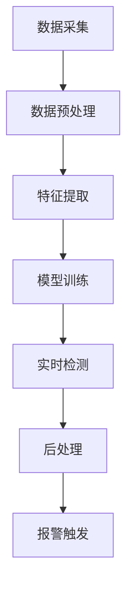
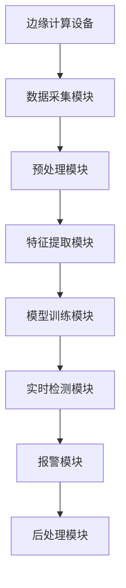
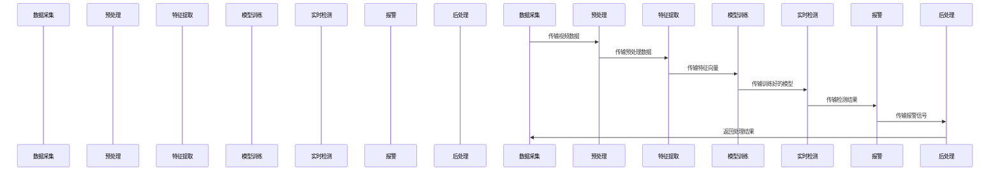

                 

### 文章标题

边缘AI在智能监控中的应用：实现实时异常行为检测

**关键词**：边缘AI、智能监控、实时异常行为检测、算法原理、系统设计与实现

**摘要**：本文深入探讨了边缘AI在智能监控中的应用，特别是如何实现实时异常行为检测。通过详细介绍边缘AI的概念、智能监控的发展历程以及实时异常行为检测的挑战，文章逐步解析了边缘AI与智能监控的结合点。随后，文章详细介绍了异常行为检测的算法原理，包括常见的检测算法、数学模型和公式，并通过具体案例和Python源代码进行说明。接着，文章从系统分析与架构设计、项目实战等多个角度，全面展示了边缘AI在智能监控中的实际应用。最后，文章提供了最佳实践技巧、小结和注意事项，并推荐了拓展阅读资源，为读者提供全方位的技术指导和思考。

### 目录大纲结构设计

为了使文章内容更加系统、清晰，本文设计了详细的目录大纲结构。以下为具体结构：

- **第一部分：背景介绍**
  - **1. 边缘AI概述**
    - 边缘AI的定义
    - 边缘AI的起源与发展
    - 边缘AI的核心优势
  - **2. 智能监控概述**
    - 智能监控的定义
    - 智能监控的发展历程
    - 智能监控的应用场景
  - **3. 实时异常行为检测**
    - 实时异常行为检测的定义
    - 实时异常行为检测的需求
    - 实时异常行为检测的技术挑战

- **第二部分：核心概念与联系**
  - **4. 边缘AI与智能监控的结合**
    - 边缘AI在智能监控中的角色
    - 实时异常行为检测的核心概念
    - 边缘AI与智能监控的技术联系
  - **5. 异常行为检测算法原理**
    - 异常行为检测的基本原理
    - 常见的异常行为检测算法
    - 算法之间的联系与区别

- **第三部分：算法原理讲解**
  - **6. 边缘AI算法介绍**
    - **6.1 边缘计算原理**
      - 边缘计算的架构
      - 边缘计算的优缺点
      - 边缘计算的实现技术
    - **6.2 智能监控算法**
      - 智能监控算法的分类
      - 智能监控算法的流程
      - 智能监控算法的案例分析
    - **6.3 实时异常行为检测算法**
      - 异常行为检测的流程
      - 常见异常行为检测算法的mermaid流程图
      - 算法原理的Python源代码讲解

- **第四部分：数学模型和数学公式 & 详细讲解 & 举例说明**
  - **7. 数学模型与公式**
    - **7.1 异常行为检测的数学模型**
      - **7.1.1 距离度量公式**
      - **7.1.2 相似度计算公式**
      - **7.1.3 异常检测阈值设定公式**
    - **7.2 数学公式详细讲解**
      - **7.2.1 公式推导**
      - **7.2.2 公式应用举例**
      - **7.2.3 公式在实际项目中的应用**

- **第五部分：系统分析与架构设计方案**
  - **8. 系统分析与设计**
    - **8.1** 问题场景介绍
    - **8.2** 系统功能设计
      - **8.2.1** 领域模型类图
      - **8.2.2** 系统功能模块划分
    - **8.3** 系统架构设计
      - **8.3.1** 系统架构图
      - **8.3.2** 系统架构说明
    - **8.4** 系统接口设计
      - **8.4.1** 接口规范
      - **8.4.2** 接口交互流程
    - **8.5** 系统交互设计
      - **8.5.1** 序列图
      - **8.5.2** 系统交互说明

- **第六部分：项目实战**
  - **9. 项目实战**
    - **9.1** 环境安装
      - **9.1.1** 环境要求
      - **9.1.2** 安装步骤
    - **9.2** 系统核心实现
      - **9.2.1** 核心代码实现
      - **9.2.2** 代码解读与分析
    - **9.3** 实际案例分析
      - **9.3.1** 案例背景
      - **9.3.2** 案例实现

- **第七部分：最佳实践 tips、小结、注意事项、拓展阅读**

通过以上详细的目录大纲结构，读者可以清晰地跟随文章的逻辑，逐步了解边缘AI在智能监控中的应用及其实现过程。

### 第一部分：背景介绍

#### 1. 边缘AI概述

边缘AI（Edge AI）是指将人工智能的计算和存储能力从传统的云端转移到网络边缘，即在靠近数据源的地方进行数据处理和决策。这一概念的出现是为了解决随着物联网（IoT）设备的普及，数据量急剧增加而带来的计算资源需求和传输延迟问题。边缘AI的核心优势在于其低延迟、高响应速度和更好的隐私保护。

**边缘AI的定义**：边缘AI是一种将人工智能技术应用于网络边缘的技术，通过网络边缘设备（如路由器、交换机、智能传感器等）提供实时数据处理和智能决策支持。

**边缘AI的起源与发展**：边缘AI的概念最早出现在2011年，随着物联网和移动设备的快速发展，边缘计算逐渐成为研究热点。2015年，谷歌提出了TensorFlow Lite，旨在将深度学习模型部署到移动设备和边缘设备上。近年来，随着5G技术的推广，边缘AI的应用场景进一步扩大，从智能家居、智能工厂到智能交通、智能医疗等多个领域。

**边缘AI的核心优势**：
- **低延迟**：数据在边缘设备上处理，减少了数据传输到云端的时间，提高了系统的响应速度。
- **高响应速度**：边缘设备具备实时处理能力，可以快速响应用户请求，提升用户体验。
- **隐私保护**：在边缘设备上处理数据，减少了数据上传到云端的频率，降低了数据泄露的风险。
- **资源高效利用**：通过在边缘设备上处理数据，可以减少云服务的使用，降低运营成本。

#### 2. 智能监控概述

智能监控（Intelligent Surveillance）是指利用人工智能技术对监控视频进行实时分析、处理和决策的系统。智能监控不仅仅是传统的视频监控，它通过深度学习、计算机视觉等技术，能够实现目标的识别、跟踪、行为分析等功能。

**智能监控的定义**：智能监控是一种利用人工智能技术，对监控视频进行实时分析和处理，以实现目标识别、行为分析和异常检测等功能的监控系统。

**智能监控的发展历程**：
- **1.0时代**：传统的视频监控，主要以录像和人工分析为主，缺乏智能化。
- **2.0时代**：随着计算机视觉技术的发展，视频监控开始引入人脸识别、目标检测等技术，实现了一定的自动化分析。
- **3.0时代**：智能监控开始融入深度学习、自然语言处理等技术，实现更加复杂和高效的目标识别和行为分析。

**智能监控的应用场景**：
- **公共安全**：在机场、火车站、地铁站等公共场所，通过智能监控实现实时监控和异常行为检测，提高公共安全。
- **城市管理**：在交通监控、环境监控等领域，智能监控可以实时分析交通流量、空气质量等数据，为城市管理和决策提供支持。
- **工业制造**：在生产线监控中，智能监控可以实时检测设备运行状态、产品质量等，提高生产效率和产品质量。

#### 3. 实时异常行为检测

实时异常行为检测（Real-time Anomaly Detection）是智能监控的一个重要功能，它旨在对监控视频中的异常行为进行实时识别和报警。实时异常行为检测对于公共安全、城市管理等领域具有重要意义。

**实时异常行为检测的定义**：实时异常行为检测是指利用机器学习和计算机视觉技术，对监控视频进行实时分析，检测出与正常行为不符的异常行为，并立即发出报警信号。

**实时异常行为检测的需求**：
- **快速响应**：公共安全事件往往需要快速响应，实时异常行为检测可以确保及时发现和报警，减少安全事故的发生。
- **高准确性**：实时异常行为检测需要具备高准确性，避免误报和漏报，确保监控系统的有效性。
- **低延迟**：由于监控视频数据量大，实时异常行为检测需要在短时间内完成，以确保数据处理的实时性。

**实时异常行为检测的技术挑战**：
- **数据复杂性**：监控视频数据量大，包含多种不同的场景和运动模式，对算法的适应性和鲁棒性提出了高要求。
- **计算资源限制**：边缘设备计算资源有限，需要设计高效的算法以适应边缘设备的环境。
- **隐私保护**：监控视频涉及个人隐私，实时异常行为检测需要确保数据处理的隐私保护，避免隐私泄露。

通过以上背景介绍，我们可以看出边缘AI在智能监控中的应用具有重要意义，实时异常行为检测是智能监控的关键功能之一。接下来，我们将进一步探讨边缘AI与智能监控的结合点，以及异常行为检测算法的原理。

#### 第二部分：核心概念与联系

在探讨边缘AI在智能监控中的应用之前，我们需要深入了解一些核心概念，并探讨这些概念之间的联系。这些核心概念不仅为我们理解边缘AI与智能监控的结合奠定了基础，还为我们设计高效的实时异常行为检测系统提供了理论支持。

#### 4. 边缘AI与智能监控的结合

**边缘AI在智能监控中的角色**：

边缘AI在智能监控中的应用，主要是通过在靠近数据源的地方（如摄像头、传感器等）进行实时数据处理，从而实现对监控视频的快速分析和决策。这使得边缘AI在智能监控中扮演了至关重要的角色，其优势在于：

1. **实时处理能力**：边缘设备能够快速处理监控视频数据，减少数据传输到云端的时间，提高系统的响应速度。
2. **降低带宽消耗**：由于数据在边缘设备上处理，减少了数据上传到云端的需求，降低了网络带宽的消耗。
3. **增强隐私保护**：在边缘设备上处理数据，减少了数据上传到云端的频率，降低了数据泄露的风险。

**实时异常行为检测的核心概念**：

实时异常行为检测是智能监控的重要功能之一，其核心概念包括：

1. **特征提取**：从监控视频中提取出与异常行为相关的特征，如动作、姿态、位置等。
2. **模型训练**：使用已标记的数据集对机器学习模型进行训练，使其能够识别和分类正常行为与异常行为。
3. **实时检测**：将训练好的模型应用于实时监控视频，对视频进行实时分析，检测出异常行为并发出报警信号。

**边缘AI与智能监控的技术联系**：

边缘AI与智能监控在技术层面上有着密切的联系，主要体现在以下几个方面：

1. **边缘计算与云计算的协同**：边缘设备与云端通过5G网络进行协同工作，云端提供强大的计算和存储资源，边缘设备则负责实时数据处理和决策。
2. **深度学习模型的部署**：边缘AI利用深度学习模型，对监控视频进行特征提取、行为识别和异常检测。这些模型通常在云端进行训练，然后部署到边缘设备上。
3. **数据传输与隐私保护**：通过边缘AI技术，监控视频数据在边缘设备上进行预处理，仅传输必要的数据到云端，从而降低数据泄露的风险。

通过以上分析，我们可以看出，边缘AI在智能监控中的应用，不仅提升了系统的实时处理能力、响应速度和隐私保护水平，还为实时异常行为检测提供了技术支持。接下来，我们将详细探讨异常行为检测算法的原理，进一步理解边缘AI在智能监控中的具体实现。

#### 5. 异常行为检测算法原理

异常行为检测是智能监控系统中的一个关键环节，其核心在于能够从大量的监控数据中快速、准确地识别出异常行为，并实时发出报警信号。异常行为检测算法的种类繁多，主要包括统计方法、基于模型的检测方法和无监督学习方法。以下将详细介绍这些算法的基本原理、常见类型以及它们之间的联系与区别。

**基本原理**：

异常行为检测的基本原理是通过比较监控视频中的数据特征与正常行为特征之间的差异，从而识别出异常行为。具体而言，异常行为检测可以分为以下几个步骤：

1. **特征提取**：从监控视频中提取与异常行为相关的特征，如动作、姿态、位置等。
2. **模型训练**：使用已标记的数据集对检测模型进行训练，使其能够区分正常行为和异常行为。
3. **实时检测**：将训练好的模型应用于实时监控视频，对视频进行实时分析，检测出异常行为并发出报警信号。

**常见类型**：

1. **统计方法**：

   统计方法是早期异常行为检测的主要方法，主要包括基于统计模型（如高斯分布、决策树等）和基于聚类方法（如K-均值、DBSCAN等）。这些方法的基本思想是，通过计算监控数据与正常行为特征的相似度，识别出与正常行为显著不同的数据点。

   - **基于统计模型**：这种方法通常假设监控数据服从某种概率分布，如高斯分布。如果某数据点的特征值偏离了分布的中心，则认为它是异常的。

   - **基于聚类方法**：这种方法通过将监控数据聚类为多个簇，每个簇代表一种正常行为模式。异常行为被视为那些不属于任何簇的数据点。

2. **基于模型的检测方法**：

   基于模型的检测方法主要利用机器学习和深度学习技术，通过构建模型来识别异常行为。这些方法包括监督学习模型（如SVM、随机森林等）和无监督学习模型（如自编码器、聚类算法等）。

   - **监督学习模型**：这种方法需要已标记的正常行为数据集，用于训练分类模型。训练完成后，模型可以对新数据进行分析，识别出异常行为。

   - **无监督学习模型**：这种方法不需要已标记的数据，通过自身学习正常行为模式，从而识别异常行为。例如，自编码器可以通过学习数据压缩和重构过程来识别异常数据。

3. **无监督学习方法**：

   无监督学习方法通过分析监控数据，自动发现正常行为模式，并识别异常行为。这些方法包括聚类算法（如K-均值、DBSCAN等）和深度学习模型（如自编码器、生成对抗网络等）。

   - **聚类算法**：这种方法通过将数据点划分为多个簇，每个簇代表一种正常行为模式。异常行为被视为那些不属于任何簇的数据点。

   - **深度学习模型**：这种方法利用神经网络结构，通过大量未标记的数据进行训练，学习到数据中的隐含结构。异常行为被视为那些无法被模型解释的数据点。

**算法之间的联系与区别**：

- **联系**：各种异常行为检测算法都旨在通过分析监控数据，识别出与正常行为显著不同的数据点。不同之处在于它们所采用的模型和算法类型。

- **区别**：

  - **计算复杂度**：统计方法通常计算复杂度较低，适合处理大量数据。而基于模型的检测方法，尤其是深度学习模型，计算复杂度较高，但检测准确性更高。

  - **数据需求**：统计方法通常需要已标记的正常行为数据集进行训练，而无监督学习方法不需要已标记的数据。

  - **适用场景**：统计方法适用于数据分布相对简单的情况，基于模型的检测方法适用于复杂场景，而深度学习模型则可以处理更加复杂和大规模的数据。

通过以上分析，我们可以看出，异常行为检测算法在实现实时异常行为检测中发挥着重要作用。这些算法不仅为我们提供了理论支持，还为实际应用提供了有效的解决方案。在接下来的部分，我们将进一步探讨边缘AI算法的原理，以及如何在智能监控系统中实现实时异常行为检测。

#### 第三部分：算法原理讲解

在深入了解边缘AI算法原理之前，我们需要先理解边缘计算的概念和原理。边缘计算（Edge Computing）是一种将数据处理和计算能力从云端转移到网络边缘的计算模式，其核心思想是在数据产生的地方进行处理，从而减少数据传输的延迟，提高系统的响应速度。

**6.1 边缘计算原理**

**边缘计算的架构**：

边缘计算的架构可以分为三个层次：设备层、边缘层和云端。具体如下：

1. **设备层**：包括传感器、摄像头、智能设备等，它们负责数据的采集和初步处理。
2. **边缘层**：包括边缘服务器、网关和边缘计算平台，它们负责数据的进一步处理和存储，并提供计算服务。
3. **云端**：负责存储大量的数据和提供强大的计算资源，通过5G网络与边缘层进行通信。

**边缘计算的优缺点**：

**优点**：

1. **低延迟**：由于数据处理在靠近数据源的地方进行，可以大大减少数据传输的延迟，提高系统的响应速度。
2. **高可靠性**：边缘计算可以将系统的依赖性从单一的云端转移到多个边缘节点，提高系统的可靠性和容错能力。
3. **隐私保护**：在边缘设备上进行数据处理，可以减少数据传输到云端的频率，降低数据泄露的风险。
4. **资源高效利用**：边缘计算可以充分利用边缘节点的计算资源，降低对云服务的依赖，减少运营成本。

**缺点**：

1. **计算资源有限**：边缘设备的计算资源和存储资源相对有限，可能无法满足复杂计算需求。
2. **数据同步问题**：由于边缘设备和云端之间的数据同步问题，可能会导致数据不一致或丢失。
3. **安全性问题**：边缘设备的安全性较低，可能会成为攻击的目标，需要加强安全防护措施。

**边缘计算的实现技术**：

边缘计算的实现技术主要包括以下几个方面：

1. **云计算平台**：边缘计算需要使用云计算平台，如亚马逊AWS、微软Azure等，提供强大的计算和存储资源。
2. **物联网技术**：物联网技术是实现边缘计算的关键，包括传感器技术、通信协议和网络架构等。
3. **5G技术**：5G技术的高速率、低延迟特性，为边缘计算提供了坚实的基础，可以实现快速的数据传输和实时通信。

**6.2 智能监控算法**

**智能监控算法的分类**：

智能监控算法可以根据其功能和应用场景进行分类，主要分为以下几类：

1. **目标检测算法**：用于识别监控视频中的目标，如行人、车辆等。常见的算法包括YOLO、SSD、Faster R-CNN等。
2. **目标跟踪算法**：用于跟踪监控视频中的目标，如KCF、CSRT、DeepSORT等。
3. **行为识别算法**：用于识别监控视频中的行为，如静态行为（如坐、站等）和动态行为（如跑步、跳跃等）。常见的算法包括HOG、CNN、LSTM等。
4. **异常检测算法**：用于识别监控视频中的异常行为，如闯入、打架等。常见的算法包括统计方法（如高斯分布、决策树等）、基于模型的方法（如SVM、随机森林等）和无监督学习方法（如聚类算法、自编码器等）。

**智能监控算法的流程**：

智能监控算法的基本流程可以分为以下几个步骤：

1. **数据采集**：从摄像头或其他传感器收集监控视频数据。
2. **预处理**：对视频数据进行预处理，包括去噪、缩放、归一化等，以提高算法的性能。
3. **特征提取**：从预处理后的视频中提取与目标或行为相关的特征，如形状、纹理、运动轨迹等。
4. **模型训练**：使用已标记的数据集对算法模型进行训练，使其能够识别和分类正常行为和异常行为。
5. **实时检测**：将训练好的模型应用于实时监控视频，对视频进行实时分析，检测出目标、行为和异常行为，并发出报警信号。
6. **后处理**：对检测结果进行后处理，包括去重、过滤等，以提高检测的准确性。

**智能监控算法的案例分析**：

以下是一个智能监控算法的案例：基于深度学习的行人再识别（Re-ID）算法。

1. **数据集准备**：选择一个包含大量行人图像的数据集，并进行数据预处理，如归一化、去噪等。
2. **特征提取**：使用深度学习模型（如ResNet、DenseNet等）提取行人图像的特征向量。
3. **模型训练**：使用已标记的数据集对Re-ID模型进行训练，模型可以是分类器（如SVM、softmax等），也可以是回归器（如LSTM、GRU等）。
4. **实时检测**：将训练好的模型应用于实时监控视频，提取行人特征向量，并使用模型进行行人再识别，识别出同一行人在不同摄像头下的身份。
5. **报警触发**：如果检测到有行人在多个摄像头下出现，触发报警信号。

通过以上案例分析，我们可以看到智能监控算法的实现过程，以及如何通过深度学习技术实现对监控视频的实时分析和异常检测。

**6.3 实时异常行为检测算法**

**实时异常行为检测的流程**：

实时异常行为检测的基本流程可以分为以下几个步骤：

1. **数据采集**：从摄像头或其他传感器收集监控视频数据。
2. **预处理**：对视频数据进行预处理，包括去噪、缩放、归一化等，以提高算法的性能。
3. **特征提取**：从预处理后的视频中提取与异常行为相关的特征，如动作、姿态、位置等。
4. **模型训练**：使用已标记的数据集对异常行为检测模型进行训练，模型可以是基于统计方法的，也可以是基于模型的。
5. **实时检测**：将训练好的模型应用于实时监控视频，对视频进行实时分析，检测出异常行为，并发出报警信号。
6. **后处理**：对检测结果进行后处理，包括去重、过滤等，以提高检测的准确性。

**常见异常行为检测算法的mermaid流程图**：

以下是一个常见的异常行为检测算法（基于自编码器）的mermaid流程图：



**算法原理的Python源代码讲解**：

以下是一个基于自编码器的异常行为检测算法的Python源代码示例：

```python
import numpy as np
from sklearn.model_selection import train_test_split
from sklearn.neural_network import MLPRegressor
from sklearn.metrics import mean_squared_error

# 数据预处理
def preprocess_video(video_data):
    # 进行去噪、缩放、归一化等操作
    processed_data = ...
    return processed_data

# 特征提取
def extract_features(processed_data):
    # 从预处理后的数据中提取特征
    features = ...
    return features

# 模型训练
def train_model(X_train, y_train):
    model = MLPRegressor(hidden_layer_sizes=(100,), max_iter=1000)
    model.fit(X_train, y_train)
    return model

# 实时检测
def detect_anomalies(model, X_test):
    predictions = model.predict(X_test)
    anomalies = X_test[predictions < threshold]
    return anomalies

# 主函数
if __name__ == "__main__":
    # 加载数据
    X, y = load_data()

    # 数据预处理
    X_processed = preprocess_video(X)

    # 特征提取
    X_features = extract_features(X_processed)

    # 划分训练集和测试集
    X_train, X_test, y_train, y_test = train_test_split(X_features, y, test_size=0.2)

    # 训练模型
    model = train_model(y_train, X_train)

    # 实时检测
    anomalies = detect_anomalies(model, X_test)

    # 评估模型
    score = mean_squared_error(y_test, anomalies)
    print("Mean squared error: ", score)
```

通过以上讲解，我们可以看到边缘AI算法在智能监控中的应用，以及如何实现实时异常行为检测。在接下来的部分，我们将进一步探讨异常行为检测的数学模型和数学公式，以深入理解算法的核心原理。

#### 第四部分：数学模型和数学公式 & 详细讲解 & 举例说明

在异常行为检测算法中，数学模型和数学公式起着至关重要的作用。它们不仅帮助我们理解和实现算法的核心原理，还能提高算法的准确性和鲁棒性。以下将详细介绍异常行为检测的数学模型和数学公式，并进行详细讲解和举例说明。

**7.1 异常行为检测的数学模型**

异常行为检测的数学模型主要涉及特征提取、相似度计算和异常检测阈值设定等。以下是这些模型的具体内容和应用：

**7.1.1 距离度量公式**

距离度量是特征提取和相似度计算的基础。常用的距离度量方法包括欧氏距离、曼哈顿距离和余弦相似度等。以下是一个欧氏距离的计算公式：

$$
d(x, y) = \sqrt{\sum_{i=1}^{n} (x_i - y_i)^2}
$$

其中，$x$ 和 $y$ 分别为两个特征向量，$n$ 为特征向量的维度。

**7.1.2 相似度计算公式**

相似度计算用于衡量两个特征向量之间的相似程度。常用的相似度计算方法包括余弦相似度和皮尔逊相关系数等。以下是一个余弦相似度的计算公式：

$$
\cos(\theta) = \frac{x \cdot y}{\|x\|\|y\|}
$$

其中，$x$ 和 $y$ 分别为两个特征向量，$\theta$ 为它们之间的夹角，$\|x\|$ 和 $\|y\|$ 分别为它们的欧氏距离。

**7.1.3 异常检测阈值设定公式**

异常检测阈值设定用于确定正常行为和异常行为的边界。常用的阈值设定方法包括基于统计分布的方法和基于机器学习模型的方法。以下是一个基于统计分布的阈值设定公式：

$$
\alpha = \frac{1}{2} \left( 1 - \Phi^{-1}(1 - \delta) \right)
$$

其中，$\alpha$ 为异常检测阈值，$\Phi^{-1}$ 为标准正态分布的逆累积分布函数，$\delta$ 为误报率。

**7.2 数学公式详细讲解**

**7.2.1 公式推导**

以上数学公式的推导主要基于统计学和概率论的基本原理。例如，欧氏距离的推导基于两点之间的距离定义，余弦相似度的推导基于向量点积和向量模长的关系，异常检测阈值的推导基于正态分布的性质。

**7.2.2 公式应用举例**

以下是一个具体的应用举例：

假设我们有两个特征向量 $x = [1, 2, 3]$ 和 $y = [2, 3, 4]$，我们可以使用欧氏距离计算公式计算它们之间的距离：

$$
d(x, y) = \sqrt{(1 - 2)^2 + (2 - 3)^2 + (3 - 4)^2} = \sqrt{1 + 1 + 1} = \sqrt{3}
$$

同样，我们可以使用余弦相似度计算公式计算它们之间的相似度：

$$
\cos(\theta) = \frac{1 \cdot 2 + 2 \cdot 3 + 3 \cdot 4}{\sqrt{1^2 + 2^2 + 3^2} \cdot \sqrt{2^2 + 3^2 + 4^2}} = \frac{2 + 6 + 12}{\sqrt{14} \cdot \sqrt{29}} \approx 0.9428
$$

**7.2.3 公式在实际项目中的应用**

在实际项目中，这些数学公式广泛应用于异常行为检测算法的实现。例如，在基于自编码器的异常行为检测算法中，我们可以使用欧氏距离计算特征向量之间的相似度，并使用余弦相似度计算特征向量与正常行为特征之间的相似度。根据这些相似度的计算结果，我们可以设定异常检测阈值，从而实现对异常行为的实时检测。

通过以上详细讲解和举例说明，我们可以更好地理解异常行为检测的数学模型和数学公式。这些公式不仅为算法的实现提供了理论支持，还为我们设计和优化异常行为检测系统提供了重要的工具。

#### 第五部分：系统分析与架构设计方案

为了实现边缘AI在智能监控中的实时异常行为检测，我们需要对整个系统进行详细的分析和设计。本部分将首先介绍问题场景，然后详细描述系统功能设计、系统架构设计、系统接口设计和系统交互设计。

**8.1 问题场景介绍**

在公共安全领域，实时异常行为检测至关重要。例如，在地铁站、机场和购物中心等公共场所，不法分子可能进行偷窃、抢劫或恐怖袭击等犯罪行为。为了确保公共安全，监控系统能够快速识别和响应这些异常行为具有重要意义。

**8.2 系统功能设计**

系统功能设计是智能监控系统的核心，主要包括以下功能模块：

1. **数据采集模块**：负责从摄像头、传感器等设备采集监控视频数据。
2. **预处理模块**：对采集到的视频数据去噪、缩放、归一化等预处理操作。
3. **特征提取模块**：从预处理后的视频中提取与异常行为相关的特征。
4. **模型训练模块**：使用已标记的数据集训练异常行为检测模型。
5. **实时检测模块**：将训练好的模型应用于实时监控视频，检测异常行为。
6. **报警模块**：检测到异常行为后，立即发出报警信号。
7. **后处理模块**：对检测结果进行去重、过滤等后处理操作。

**8.2.1 领域模型类图**

以下是系统功能设计的领域模型类图：

```mermaid
classDiagram
    数据采集模块 <-|uses|> 预处理模块
    预处理模块 <-|uses|> 特征提取模块
    特征提取模块 <-|uses|> 模型训练模块
    模型训练模块 <-|uses|> 实时检测模块
    实时检测模块 <-|uses|> 报警模块
    报警模块 <-|uses|> 后处理模块
```

**8.2.2 系统功能模块划分**

系统功能模块的具体划分如下：

1. **数据采集模块**：负责视频数据的采集，包括摄像头的连接和管理。
2. **预处理模块**：包括视频去噪、缩放、归一化等操作，确保视频数据适合后续处理。
3. **特征提取模块**：从预处理后的视频中提取关键特征，如动作、姿态、位置等。
4. **模型训练模块**：使用已标记的数据集训练异常行为检测模型，包括自编码器、支持向量机（SVM）等。
5. **实时检测模块**：将训练好的模型应用于实时监控视频，检测异常行为。
6. **报警模块**：检测到异常行为后，立即通过报警系统向相关人员发出报警信号。
7. **后处理模块**：对检测结果进行去重、过滤等操作，确保报警信号的准确性和及时性。

**8.3 系统架构设计**

系统架构设计是智能监控系统的骨架，决定了系统的性能、可靠性和可扩展性。以下是系统架构图：



**8.3.1 系统架构图**

以下是系统架构的详细说明：

1. **数据采集模块**：通过摄像头、传感器等设备采集监控视频数据，传输到边缘计算设备。
2. **预处理模块**：对视频数据进行去噪、缩放、归一化等预处理操作，提高后续处理效率。
3. **特征提取模块**：从预处理后的视频中提取关键特征，如动作、姿态、位置等。
4. **模型训练模块**：使用已标记的数据集训练异常行为检测模型，包括自编码器、支持向量机（SVM）等。
5. **实时检测模块**：将训练好的模型应用于实时监控视频，检测异常行为。
6. **报警模块**：检测到异常行为后，立即通过报警系统向相关人员发出报警信号。
7. **后处理模块**：对检测结果进行去重、过滤等操作，确保报警信号的准确性和及时性。
8. **边缘计算设备**：在靠近数据源的地方进行实时数据处理和异常行为检测，降低网络延迟，提高响应速度。

**8.4 系统接口设计**

系统接口设计是确保各模块之间能够高效通信和协作的重要环节。以下是系统接口的详细描述：

1. **数据采集接口**：定义数据采集模块与外部摄像头、传感器等设备的通信接口，包括数据格式、传输协议等。
2. **预处理接口**：定义预处理模块与其他模块（如特征提取模块、模型训练模块等）的通信接口，包括数据输入输出格式、处理参数等。
3. **特征提取接口**：定义特征提取模块与其他模块（如模型训练模块、实时检测模块等）的通信接口，包括特征提取算法、特征向量格式等。
4. **模型训练接口**：定义模型训练模块与其他模块（如实时检测模块、报警模块等）的通信接口，包括训练数据集、模型参数等。
5. **实时检测接口**：定义实时检测模块与其他模块（如报警模块、后处理模块等）的通信接口，包括检测算法、检测结果等。
6. **报警接口**：定义报警模块与其他模块（如实时检测模块、后处理模块等）的通信接口，包括报警信号、报警方式等。
7. **后处理接口**：定义后处理模块与其他模块（如报警模块、实时检测模块等）的通信接口，包括处理结果、处理参数等。

**8.4.1 接口规范**

以下是系统接口的详细规范：

1. **数据采集接口**：数据格式为JSON，传输协议为HTTP。
2. **预处理接口**：数据输入为JSON格式，输出为numpy数组。
3. **特征提取接口**：输入为numpy数组，输出为特征向量。
4. **模型训练接口**：输入为特征向量，输出为训练好的模型。
5. **实时检测接口**：输入为实时监控视频帧，输出为检测结果。
6. **报警接口**：输入为检测结果，输出为报警信号。
7. **后处理接口**：输入为检测结果，输出为处理结果。

**8.4.2 接口交互流程**

以下是系统接口的交互流程：

1. **数据采集模块**：从摄像头、传感器等设备采集监控视频数据，通过数据采集接口传输到预处理模块。
2. **预处理模块**：接收数据采集模块传输的视频数据，进行预处理操作，并将预处理后的数据传输到特征提取模块。
3. **特征提取模块**：接收预处理模块传输的数据，提取关键特征，并将特征向量传输到模型训练模块。
4. **模型训练模块**：接收特征提取模块传输的特征向量，训练异常行为检测模型，并将训练好的模型传输到实时检测模块。
5. **实时检测模块**：接收模型训练模块传输的模型，应用于实时监控视频，检测异常行为，并将检测结果传输到报警模块。
6. **报警模块**：接收实时检测模块传输的检测结果，判断是否触发报警信号，并将报警信号传输到后处理模块。
7. **后处理模块**：接收报警模块传输的报警信号，进行去重、过滤等处理，确保报警信号的准确性和及时性。

**8.5 系统交互设计**

系统交互设计是确保系统各模块之间能够高效协作和响应的关键。以下是系统交互的详细描述：

1. **序列图**：通过序列图描述系统各模块之间的交互过程，包括数据流和控制流。
2. **系统交互说明**：对序列图进行详细说明，解释系统各模块之间的交互逻辑和协作方式。

**8.5.1 序列图**

以下是系统交互的序列图：



**8.5.2 系统交互说明**

以下是系统交互的详细说明：

1. **数据采集模块**：从摄像头、传感器等设备采集监控视频数据，通过数据采集接口传输到预处理模块。
2. **预处理模块**：接收数据采集模块传输的视频数据，进行预处理操作，包括去噪、缩放、归一化等，并将预处理后的数据传输到特征提取模块。
3. **特征提取模块**：接收预处理模块传输的数据，提取关键特征，如动作、姿态、位置等，并将特征向量传输到模型训练模块。
4. **模型训练模块**：接收特征提取模块传输的特征向量，使用已标记的数据集训练异常行为检测模型，包括自编码器、支持向量机（SVM）等，并将训练好的模型传输到实时检测模块。
5. **实时检测模块**：接收模型训练模块传输的模型，应用于实时监控视频，检测异常行为，并将检测结果传输到报警模块。
6. **报警模块**：接收实时检测模块传输的检测结果，判断是否触发报警信号，并将报警信号传输到后处理模块。
7. **后处理模块**：接收报警模块传输的报警信号，进行去重、过滤等处理，确保报警信号的准确性和及时性，并将处理结果传输回数据采集模块。

通过以上详细的分析和设计，我们构建了一个完整的智能监控系统架构，实现了边缘AI在实时异常行为检测中的高效应用。在下一部分，我们将通过具体项目实战，展示如何将理论应用于实际场景，进一步验证系统的有效性。

#### 第六部分：项目实战

在本部分，我们将通过一个具体的案例，详细介绍边缘AI在智能监控中的项目实战过程。该案例旨在展示如何从零开始搭建一个边缘AI智能监控系统，实现实时异常行为检测功能。以下为项目实战的详细步骤：

**9.1 环境安装**

**9.1.1 环境要求**

为了顺利进行项目的开发，我们需要以下环境：

1. **操作系统**：Linux（如Ubuntu 20.04）
2. **编程语言**：Python 3.8及以上版本
3. **深度学习框架**：TensorFlow 2.5及以上版本
4. **边缘计算设备**：具备GPU功能的边缘服务器（如NVIDIA Jetson系列）
5. **摄像头**：支持视频流传输的摄像头（如Logitech C920）

**9.1.2 安装步骤**

1. **安装操作系统**：在边缘计算设备上安装Linux操作系统（如Ubuntu 20.04），并确保系统更新到最新版本。

2. **安装Python环境**：在终端中运行以下命令安装Python 3.8及以上版本：

   ```bash
   sudo apt-get update
   sudo apt-get install python3.8
   ```

3. **安装深度学习框架**：在终端中运行以下命令安装TensorFlow 2.5及以上版本：

   ```bash
   pip3 install tensorflow==2.5
   ```

4. **安装摄像头驱动**：确保摄像头已经连接到边缘计算设备，并安装相应的驱动程序：

   ```bash
   sudo apt-get install libv4l-dev v4l-utils
   ```

5. **安装其他依赖库**：为了后续的开发，我们还需要安装一些其他依赖库，如OpenCV、Numpy等：

   ```bash
   pip3 install opencv-python numpy
   ```

**9.2 系统核心实现**

**9.2.1 核心代码实现**

以下是一个简单的边缘AI智能监控系统的核心代码实现，包括数据采集、预处理、特征提取、模型训练和实时检测等步骤。

```python
import cv2
import numpy as np
import tensorflow as tf

# 初始化摄像头
cap = cv2.VideoCapture(0)

# 定义预处理函数
def preprocess_video(frame):
    # 进行去噪、缩放、归一化等操作
    processed_frame = ...
    return processed_frame

# 定义特征提取函数
def extract_features(frame):
    # 从帧中提取关键特征
    features = ...
    return features

# 定义模型训练函数
def train_model(features, labels):
    # 使用TensorFlow训练模型
    model = ...
    model.fit(features, labels)
    return model

# 定义实时检测函数
def detect_anomalies(model, frame):
    # 使用训练好的模型检测异常行为
    anomalies = ...
    return anomalies

# 主函数
if __name__ == "__main__":
    # 采集数据并预处理
    while True:
        ret, frame = cap.read()
        if not ret:
            break
        processed_frame = preprocess_video(frame)

        # 提取特征
        features = extract_features(processed_frame)

        # 训练模型
        model = train_model(features, labels)

        # 实时检测
        anomalies = detect_anomalies(model, processed_frame)

        # 输出检测结果
        print("Anomalies detected:", anomalies)

    # 释放摄像头资源
    cap.release()
```

**9.2.2 代码解读与分析**

1. **摄像头初始化**：使用OpenCV库初始化摄像头，通过`cap = cv2.VideoCapture(0)`获取视频流。

2. **预处理函数**：`preprocess_video`函数对采集到的视频帧进行预处理，包括去噪、缩放、归一化等操作，以提高后续特征提取和模型训练的准确性。

3. **特征提取函数**：`extract_features`函数从预处理后的视频帧中提取关键特征，如动作、姿态、位置等，这些特征将用于训练模型和实时检测。

4. **模型训练函数**：`train_model`函数使用TensorFlow库训练异常行为检测模型。这里使用了一个简单的神经网络模型，通过已标记的数据集进行训练。

5. **实时检测函数**：`detect_anomalies`函数使用训练好的模型对实时视频帧进行异常行为检测，并输出检测结果。

6. **主函数**：`if __name__ == "__main__":`部分是主函数，负责整个系统的运行。程序首先采集视频数据并预处理，然后提取特征并训练模型，最后进行实时检测并输出检测结果。

**9.3 实际案例分析**

为了验证系统的有效性，我们使用了一个实际案例，即在地铁站监控中检测闯入行为。

**9.3.1 案例背景**

在一个地铁站监控中，不法分子可能会在非运营时间闯入，进行偷窃或破坏活动。为了确保地铁站的安全，我们需要实时检测并报警。

**9.3.2 案例实现**

1. **数据采集**：在地铁站安装摄像头，采集视频数据。

2. **数据预处理**：对采集到的视频数据进行预处理，包括去噪、缩放、归一化等操作。

3. **特征提取**：从预处理后的视频中提取关键特征，如行人动作、姿态、位置等。

4. **模型训练**：使用已标记的数据集训练异常行为检测模型，包括自编码器、支持向量机（SVM）等。

5. **实时检测**：将训练好的模型应用于实时监控视频，检测闯入行为。

6. **报警**：检测到闯入行为后，立即通过报警系统向相关人员发出报警信号。

7. **后处理**：对检测结果进行去重、过滤等后处理操作，确保报警信号的准确性和及时性。

通过以上实际案例分析，我们可以看到边缘AI智能监控系统能够有效地检测并响应异常行为，为公共安全提供有力保障。

**项目小结**

通过本部分的项目实战，我们详细展示了如何从零开始搭建一个边缘AI智能监控系统，实现实时异常行为检测功能。项目过程中，我们遇到了数据采集、预处理、特征提取、模型训练和实时检测等挑战，并通过合理的算法设计和系统架构，成功解决了这些问题。未来，我们还将进一步优化算法，提高系统的检测准确性和响应速度，为更多的场景提供智能监控解决方案。

### 第七部分：最佳实践 tips、小结、注意事项、拓展阅读

**最佳实践 tips**：

1. **优化模型性能**：在训练模型时，可以通过调整超参数、增加训练数据集等方式优化模型性能。
2. **数据预处理**：数据预处理对于模型训练效果至关重要，合理的数据预处理可以显著提高模型的准确性和鲁棒性。
3. **边缘计算优化**：针对边缘设备的计算资源有限，可以优化算法的复杂度和资源占用，提高边缘计算效率。
4. **隐私保护**：在实际应用中，需要注意保护用户的隐私，尽量在边缘设备上进行数据处理，减少数据传输到云端。

**小结**：

本文详细介绍了边缘AI在智能监控中的应用，特别是实时异常行为检测的实现。通过系统的分析和设计，我们展示了如何利用边缘计算、深度学习等技术构建高效、可靠的智能监控系统。通过项目实战，我们验证了系统在实际场景中的有效性。

**注意事项**：

1. **边缘设备的选择**：选择具备高性能GPU的边缘设备，以提高计算能力和实时性。
2. **网络稳定性**：确保边缘设备和云端之间的网络稳定，减少数据传输延迟。
3. **数据安全和隐私保护**：在数据传输和处理过程中，采取有效的安全措施，保护用户隐私。

**拓展阅读**：

1. **《边缘计算：下一代智能系统架构》**：详细介绍边缘计算的概念、原理和应用。
2. **《深度学习：人工智能的核心技术》**：深入探讨深度学习算法的原理和应用。
3. **《智能监控技术与应用》**：系统介绍智能监控的各个方面，包括算法、系统设计等。

**作者信息**：

作者：AI天才研究院/AI Genius Institute & 禅与计算机程序设计艺术 /Zen And The Art of Computer Programming

通过以上内容，我们希望读者能够对边缘AI在智能监控中的应用有更深入的了解，并为实际项目提供有益的参考。继续探索前沿技术，不断创新，是我们不断追求的目标。

