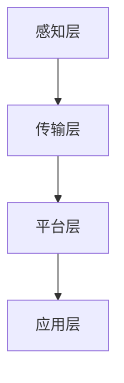
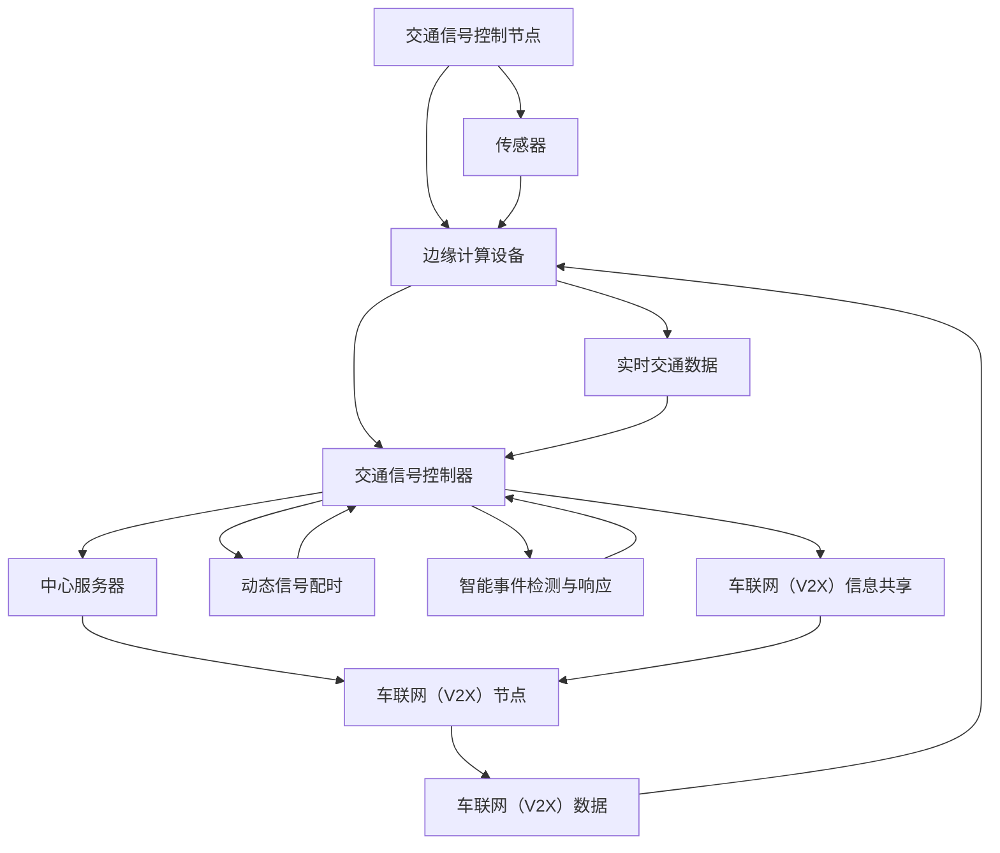
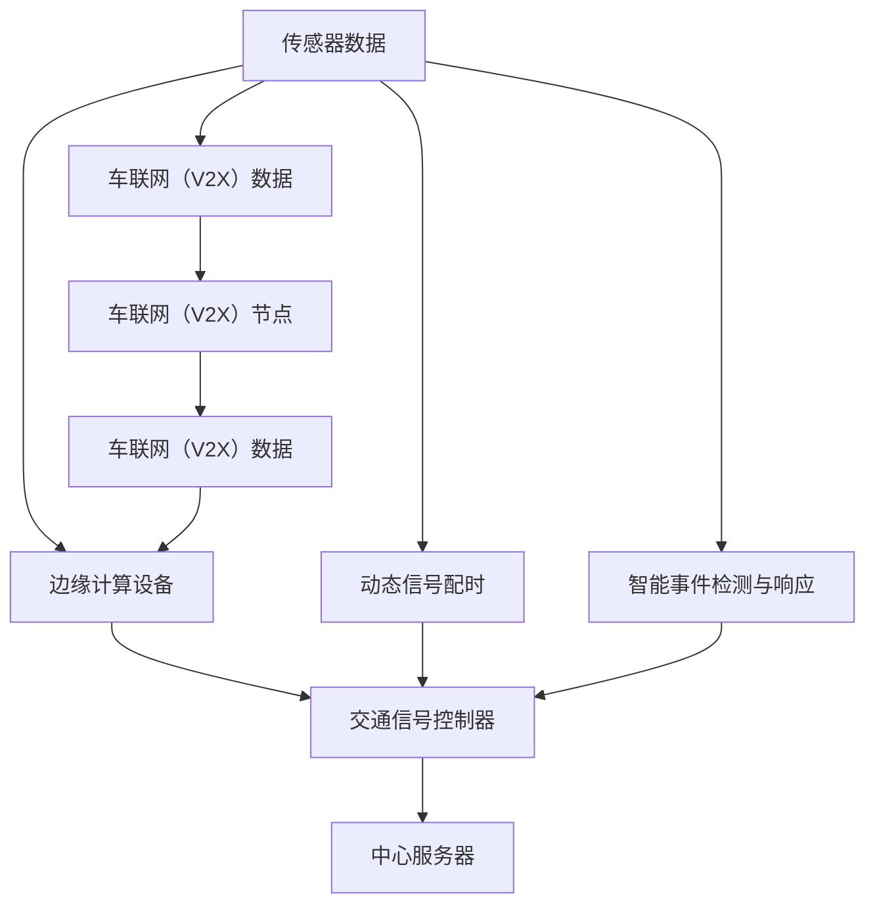

                 

### 第1章 引言

#### 1.1 问题背景

##### 1.1.1 交通信号控制现状

**1.1.1.1 交通拥堵问题**

近年来，随着城市化的快速发展和车辆数量的急剧增加，交通拥堵问题已成为全球范围内的重大挑战。根据《2021年全球城市交通拥堵报告》，全球主要城市的交通拥堵成本达到了数百亿美元，同时造成了严重的环境污染和时间浪费。

**1.1.1.2 交通效率低下**

传统的交通信号控制系统主要依赖于中心化的控制策略，无法充分利用实时交通数据，导致交通信号配时无法动态适应交通流量变化，从而降低了交通效率。据统计，全球平均每年因交通拥堵而浪费的时间超过100亿小时。

**1.1.1.3 安全隐患增加**

交通拥堵不仅影响出行效率，还增加了交通事故的风险。在高峰时段，由于车辆密度大、驾驶者疲劳等原因，交通事故的发生率显著上升。根据世界卫生组织（WHO）的数据，每年因道路交通事故导致的死亡人数超过125万。

##### 1.1.2 边缘计算与智能交通信号控制

**1.1.2.1 边缘计算概述**

边缘计算是一种分布式计算架构，通过在靠近数据源的边缘节点上处理数据，以降低延迟、减少带宽消耗并提高系统响应速度。边缘计算的核心原则是将计算、存储、网络功能分散到网络的边缘，从而减轻中心服务器的负担。

**1.1.2.1.1 边缘计算的定义**

边缘计算（Edge Computing）是指在靠近数据源或靠近用户的网络边缘侧执行计算任务，以满足实时响应需求的技术。它通过在本地或分布式边缘设备上处理数据，从而降低数据传输延迟，提高数据处理效率。

**1.1.2.1.2 边缘计算的优势**

- **实时性增强**：边缘计算能够在数据产生地附近快速处理数据，从而实现更快的响应时间。
- **响应速度提高**：通过减少数据传输距离，边缘计算可以显著降低系统的响应时间。
- **数据处理能力提升**：边缘设备具备一定的计算能力，可以处理一部分数据，减轻中心服务器的负担。
- **网络带宽节省**：边缘计算减少了数据传输的需求，从而节省了网络带宽资源。

**1.1.2.1.3 边缘计算的应用场景**

- **物联网（IoT）设备监控**：在智能家居、工业自动化等领域，边缘计算可以实时处理大量传感器数据，实现智能监控和远程控制。
- **自动驾驶**：边缘计算可以在车辆周围的环境数据上进行实时分析，支持自动驾驶系统的快速响应。
- **智能交通信号控制**：边缘计算可以实时处理交通流量数据，优化交通信号配时，提高交通效率。

**1.1.2.2 智能交通信号控制概述**

**1.1.2.2.1 智能交通信号控制的概念**

智能交通信号控制（Intelligent Traffic Signal Control）是指利用现代信息技术和人工智能技术，对交通信号进行优化控制，以提高交通效率、降低交通事故和缓解交通拥堵。

**1.1.2.2.2 智能交通信号控制的目标**

- **提高交通效率**：通过实时分析交通流量数据，优化交通信号配时，减少车辆等待时间。
- **降低交通事故**：通过实时监测车辆和行人的行为，预防交通事故的发生。
- **缓解交通拥堵**：通过动态调整交通信号配时，引导车辆合理行驶，缓解交通拥堵。

**1.1.2.2.3 智能交通信号控制的发展趋势**

- **物联网与边缘计算的结合**：利用物联网技术收集交通数据，结合边缘计算进行实时处理，实现智能交通信号控制。
- **人工智能算法的应用**：利用深度学习、强化学习等人工智能算法，优化交通信号配时，提高交通信号控制的智能化水平。
- **车联网（V2X）的发展**：通过车联网技术实现车辆与基础设施、车辆与车辆之间的信息共享，实现更高效的交通信号控制。

##### 1.1.3 边缘计算在智能交通信号控制中的应用

**1.1.3.1 边缘计算在交通信号控制中的应用优势**

- **实时性增强**：边缘计算能够在交通信号控制节点附近快速处理交通数据，实时调整信号配时，提高交通响应速度。
- **响应速度提高**：通过减少数据传输距离，边缘计算可以显著降低系统的响应时间，使交通信号控制更加灵活和高效。
- **数据处理能力提升**：边缘设备具备一定的计算能力，可以处理一部分交通数据，减轻中心服务器的负担，提高整体系统性能。
- **网络带宽节省**：边缘计算减少了大量数据传输的需求，从而节省了网络带宽资源，降低了通信成本。

#### 1.1.4 书籍结构

**1.1.4.1 全书内容安排**

- **第1章：引言**：介绍交通信号控制现状、边缘计算与智能交通信号控制的关系，以及全书的内容安排。
- **第2章：边缘计算基础**：详细讲解边缘计算的概念、原理、关键技术和网络技术。
- **第3章：智能交通信号控制基础**：介绍智能交通信号控制的概念、核心技术和发展趋势。
- **第4章：边缘计算在智能交通信号控制中的应用场景**：分析边缘计算在智能交通信号控制中的具体应用。
- **第5章：边缘计算在交通信号控制中的关键技术**：探讨边缘计算在交通信号控制中的核心技术。
- **第6章：边缘计算在交通信号控制中的案例分析**：通过实际案例分析，展示边缘计算在智能交通信号控制中的应用效果。
- **第7章：未来发展趋势与展望**：展望边缘计算在智能交通信号控制领域的未来发展趋势和潜在挑战。

### 第2章 边缘计算基础

#### 2.1 边缘计算的概念与原理

##### 2.1.1 边缘计算的起源与发展

**2.1.1.1 边缘计算的定义**

边缘计算（Edge Computing）是一种分布式计算架构，通过在靠近数据源的边缘节点上处理数据，以降低延迟、减少带宽消耗并提高系统响应速度。它通过将计算、存储、网络功能分散到网络的边缘，从而减轻中心服务器的负担，提高数据处理效率。

**2.1.1.2 边缘计算的核心原则**

- **数据本地化处理**：将数据处理推向数据产生地，减少数据传输距离，降低延迟。
- **资源高效利用**：通过边缘设备分担中心服务器的计算和存储负担，提高整体系统性能。
- **分布式架构**：通过分布式架构实现系统的高可用性和可扩展性。
- **低延迟、高带宽**：通过优化网络架构，提供低延迟、高带宽的网络连接。

**2.1.1.3 边缘计算与传统云计算的区别**

- **计算位置**：传统云计算主要在远程数据中心进行数据处理，而边缘计算在靠近数据源的边缘节点上进行数据处理。
- **数据处理模式**：传统云计算采用集中式数据处理模式，而边缘计算采用分布式数据处理模式。
- **延迟和带宽**：传统云计算由于数据传输距离远，存在较高的延迟和带宽限制，而边缘计算通过降低数据传输距离，提供更低的延迟和更高的带宽。
- **系统架构**：传统云计算采用中心化的系统架构，而边缘计算采用分布式、去中心化的系统架构。

##### 2.1.2 边缘计算的关键技术

**2.1.2.1 边缘计算硬件技术**

**2.1.2.1.1 边缘计算设备的分类**

边缘计算设备根据功能和应用场景可以分为以下几类：

- **边缘服务器**：用于处理大量数据和复杂计算任务，类似于传统的服务器。
- **边缘网关**：连接不同网络设备，实现数据传输和协议转换。
- **物联网设备**：如传感器、智能摄像头等，用于收集和处理本地数据。
- **边缘网盘**：用于存储和管理边缘计算过程中的数据。

**2.1.2.1.2 边缘计算硬件的技术特点**

- **低功耗、高性能**：边缘计算设备通常采用低功耗设计，同时具备较高的计算性能。
- **模块化、可扩展**：边缘计算硬件通常采用模块化设计，方便升级和扩展。
- **高可靠性、低故障率**：边缘计算设备通常具备较高的可靠性，能够在恶劣环境下稳定运行。

**2.1.2.1.3 边缘计算硬件的发展趋势**

- **芯片技术的进步**：随着芯片技术的不断进步，边缘计算设备的计算性能和能效比将得到显著提升。
- **低功耗设计**：随着物联网设备的普及，低功耗设计将成为边缘计算硬件的重要趋势。
- **硬件安全**：随着边缘计算设备的增多，硬件安全将成为一个重要的研究课题。

**2.1.2.2 边缘计算软件技术**

**2.1.2.2.1 边缘计算平台的构建**

边缘计算平台是边缘计算的核心组成部分，它包括硬件和软件的集成。构建边缘计算平台的关键技术包括：

- **操作系统**：支持边缘计算设备的操作系统，如Ubuntu、CentOS等。
- **中间件**：提供边缘计算设备的通信、数据处理、安全等功能。
- **开发工具**：提供编程语言、开发框架、调试工具等，支持开发者快速开发边缘计算应用。

**2.1.2.2.2 边缘计算软件的框架设计**

边缘计算软件的框架设计通常包括以下几个层次：

- **基础设施层**：提供计算资源管理、网络通信、存储管理等基础设施服务。
- **平台层**：提供边缘计算应用的运行环境，包括虚拟化技术、容器技术等。
- **应用层**：提供具体的边缘计算应用，如智能交通信号控制、智能安防等。

**2.1.2.2.3 边缘计算软件的关键功能**

- **数据处理**：提供数据收集、存储、处理、分析等功能。
- **实时性**：提供低延迟、高带宽的数据传输和计算能力。
- **安全与隐私**：提供数据加密、身份认证、访问控制等安全功能。
- **可靠性**：提供故障检测、故障恢复、容错等可靠性功能。

**2.1.3 边缘计算的网络技术**

**2.1.3.1 边缘计算网络的架构**

边缘计算网络通常采用分层架构，包括以下几层：

- **感知层**：包括各种传感器、物联网设备等，用于收集实时数据。
- **传输层**：包括边缘服务器、边缘网关等，用于数据传输和初步处理。
- **平台层**：包括云计算中心、边缘计算中心等，用于数据存储、处理和分析。
- **应用层**：包括各种边缘计算应用，如智能交通信号控制、智能安防等。

**2.1.3.1.1 边缘计算网络的分层结构**

边缘计算网络的分层结构如图所示：



**2.1.3.1.2 边缘计算网络的技术要求**

边缘计算网络需要满足以下技术要求：

- **低延迟**：边缘计算网络需要提供低延迟的数据传输，以满足实时计算需求。
- **高带宽**：边缘计算网络需要提供高带宽的数据传输，以满足大量数据的处理需求。
- **可靠性**：边缘计算网络需要具备较高的可靠性，以保障数据的稳定传输。
- **可扩展性**：边缘计算网络需要具备良好的可扩展性，以适应不断增长的数据处理需求。

**2.1.3.1.3 边缘计算网络的发展方向**

边缘计算网络的发展方向包括：

- **5G网络**：5G网络的高带宽、低延迟特性将推动边缘计算网络的发展。
- **边缘云**：边缘云将云计算和边缘计算相结合，提供更加灵活和高效的数据处理能力。
- **物联网网络**：物联网网络的广泛部署将为边缘计算提供丰富的数据来源。

**2.1.4 边缘计算的安全与隐私保护**

**2.1.4.1 边缘计算安全面临的挑战**

边缘计算在安全方面面临以下挑战：

- **数据安全**：边缘计算涉及大量数据的传输和处理，需要确保数据的安全性。
- **网络安全**：边缘计算网络需要抵御网络攻击，保障网络的安全性。
- **隐私保护**：边缘计算涉及到个人隐私数据的处理，需要保护用户的隐私。
- **设备安全**：边缘计算设备自身可能面临安全威胁，需要确保设备的安全性。

**2.1.4.2 边缘计算安全技术的应用**

边缘计算安全技术包括以下几种：

- **加密技术**：通过加密技术保护数据传输和存储过程中的安全性。
- **认证技术**：通过认证技术确保数据的真实性和完整性。
- **隐私保护技术**：通过隐私保护技术保护用户的隐私。
- **访问控制**：通过访问控制技术限制对敏感数据的访问权限。

### 第3章 智能交通信号控制基础

#### 3.1 智能交通信号控制概述

##### 3.1.1 智能交通信号控制的概念

智能交通信号控制（Intelligent Traffic Signal Control）是指利用现代信息技术和人工智能技术，对交通信号进行优化控制，以提高交通效率、降低交通事故和缓解交通拥堵。

##### 3.1.1.1 智能交通信号控制的定义

智能交通信号控制是一种利用先进的信息技术，如传感器、通信、人工智能等，对交通信号进行智能化管理和优化的技术。通过收集实时交通数据，智能交通信号控制系统能够动态调整交通信号配时，提高交通效率和安全性。

##### 3.1.1.2 智能交通信号控制的目标

智能交通信号控制的主要目标包括：

- 提高交通效率：通过优化交通信号配时，减少车辆等待时间，提高道路通行能力。
- 降低交通事故：通过实时监测车辆和行人的行为，预防交通事故的发生。
- 缓解交通拥堵：通过动态调整交通信号配时，引导车辆合理行驶，缓解交通拥堵。

##### 3.1.1.3 智能交通信号控制的发展历程

智能交通信号控制的发展可以分为以下几个阶段：

- **第一阶段**：基于规则的控制策略，如定时控制、固定配时等。这类控制策略简单，但无法动态适应交通流量变化。
- **第二阶段**：基于模型的控制策略，如交通流模型、排队理论等。这类控制策略能够根据交通流量变化动态调整信号配时。
- **第三阶段**：基于人工智能的控制策略，如深度学习、强化学习等。这类控制策略能够通过学习历史数据，实现更高效的交通信号控制。

##### 3.1.2 智能交通信号控制的核心技术

智能交通信号控制的核心技术包括以下几个方面：

- **交通信号控制系统架构**：包括交通信号控制器、信号机、传感器等设备，以及通信网络和软件平台。
- **交通信号控制算法**：包括定时控制算法、自适应控制算法、协同控制算法等。这些算法能够根据实时交通数据动态调整信号配时。
- **交通数据采集与分析**：包括交通流量数据、车辆位置数据、路况数据等。通过采集和分析这些数据，智能交通信号控制系统能够了解交通状况，优化信号配时。
- **人工智能技术**：包括机器学习、深度学习、强化学习等。这些技术能够帮助智能交通信号控制系统能够通过学习历史数据，实现更高效的交通信号控制。

##### 3.1.3 智能交通信号控制的现状与挑战

智能交通信号控制在全球范围内得到了广泛应用，但仍面临一些挑战：

- **技术瓶颈**：现有的智能交通信号控制技术仍存在一些技术瓶颈，如实时性、可靠性、数据准确性等。
- **数据隐私**：智能交通信号控制涉及到大量交通数据的收集和处理，如何保障数据隐私是一个重要的挑战。
- **系统成本**：智能交通信号控制系统的建设成本较高，需要政府和企业共同投入。
- **标准化**：目前缺乏统一的智能交通信号控制标准，导致不同地区和系统的互操作性差。

### 第4章 边缘计算在智能交通信号控制中的应用场景

#### 4.1 边缘计算在智能交通信号控制中的应用概述

边缘计算在智能交通信号控制中具有广泛的应用前景。通过在交通信号控制节点部署边缘计算设备，可以实现以下应用场景：

- **实时交通数据采集与分析**：边缘计算设备能够实时采集交通流量、车辆速度、道路状况等交通数据，并对这些数据进行实时分析，为交通信号控制系统提供实时决策支持。
- **动态交通信号配时优化**：基于边缘计算设备的实时数据分析和处理能力，交通信号控制系统可以动态调整信号配时，实现交通流量最优控制。
- **智能交通事件检测与响应**：边缘计算设备可以通过实时分析交通数据，及时发现交通事件（如交通事故、道路拥堵等），并迅速响应，采取相应的交通管理措施。
- **车联网（V2X）信息共享**：边缘计算设备可以作为车联网（V2X）的中枢节点，实现车辆与基础设施、车辆与车辆之间的信息共享，提高交通协同效率和安全性。

#### 4.2 边缘计算在智能交通信号控制中的应用优势

边缘计算在智能交通信号控制中具有以下优势：

- **实时性增强**：边缘计算设备靠近交通信号控制节点，可以实时处理交通数据，实现快速响应，提高交通信号控制的实时性。
- **响应速度提高**：通过减少数据传输距离，边缘计算设备可以显著降低系统的响应时间，提高交通信号控制的响应速度。
- **数据处理能力提升**：边缘计算设备具备一定的计算能力，可以处理一部分交通数据，减轻中心服务器的负担，提高整体系统性能。
- **网络带宽节省**：边缘计算设备减少了大量数据传输的需求，从而节省了网络带宽资源，降低了通信成本。

#### 4.3 边缘计算在智能交通信号控制中的具体应用

**4.3.1 实时交通数据采集与分析**

边缘计算设备可以通过以下方式实时采集交通数据：

- **传感器数据采集**：部署在交通信号控制节点附近的传感器，如摄像头、雷达、流量计等，可以实时监测交通流量、车辆速度、道路状况等信息。
- **车联网（V2X）数据采集**：通过车联网技术，边缘计算设备可以收集来自车辆的信息，如车辆位置、速度、行驶方向等。

采集到的交通数据可以通过边缘计算设备进行实时分析，为交通信号控制系统提供决策支持。分析过程包括以下步骤：

- **数据预处理**：对采集到的交通数据进行清洗、去噪、归一化等处理，提高数据的准确性和可靠性。
- **特征提取**：从预处理后的数据中提取交通流量、车辆速度、道路状况等特征信息。
- **模式识别与预测**：利用机器学习、深度学习等技术，对交通数据进行模式识别和预测，为交通信号控制系统提供实时决策支持。

**4.3.2 动态交通信号配时优化**

基于边缘计算设备的实时数据分析和处理能力，交通信号控制系统可以动态调整信号配时，实现交通流量最优控制。动态交通信号配时优化过程包括以下步骤：

- **实时交通流量监测**：边缘计算设备实时监测交通流量数据，包括车辆数量、车辆速度、道路占有率等。
- **交通状态评估**：根据实时交通流量数据，评估当前道路的交通状态，如畅通、拥堵、排队等。
- **信号配时优化**：根据交通状态评估结果，动态调整交通信号配时，实现交通流量最优控制。例如，在道路拥堵时，可以延长红绿灯时长，减少车辆等待时间；在道路畅通时，可以缩短红绿灯时长，提高交通通行效率。

**4.3.3 智能交通事件检测与响应**

边缘计算设备可以通过实时分析交通数据，及时发现交通事件，并迅速响应，采取相应的交通管理措施。智能交通事件检测与响应过程包括以下步骤：

- **事件检测**：通过边缘计算设备实时分析交通数据，检测可能发生的交通事件，如交通事故、道路拥堵、车辆故障等。
- **事件确认**：对检测到的交通事件进行确认，确保事件的准确性。
- **事件响应**：根据确认后的交通事件，迅速采取相应的交通管理措施，如启动应急预案、调整交通信号配时、增加交通警力等。

**4.3.4 车联网（V2X）信息共享**

边缘计算设备可以作为车联网（V2X）的中枢节点，实现车辆与基础设施、车辆与车辆之间的信息共享，提高交通协同效率和安全性。车联网（V2X）信息共享过程包括以下步骤：

- **数据采集**：通过边缘计算设备收集来自车辆和基础设施的数据，如车辆位置、速度、行驶方向等。
- **数据处理**：对采集到的数据进行预处理、特征提取等处理，提高数据的质量和准确性。
- **信息共享**：将处理后的数据通过车联网（V2X）技术共享给其他车辆和基础设施，实现交通信息的实时交换。
- **协同控制**：基于共享的交通信息，车辆和基础设施可以协同控制，提高交通协同效率和安全性。例如，车辆可以通过边缘计算设备获取前方路况信息，提前调整行驶策略，避免拥堵。

### 第5章 边缘计算在交通信号控制中的关键技术

#### 5.1 边缘计算在交通信号控制中的核心算法

边缘计算在交通信号控制中的应用离不开一系列关键算法。以下介绍几种常用的边缘计算算法及其在交通信号控制中的应用：

**5.1.1 基于深度学习的交通流量预测算法**

**算法原理：** 基于深度学习的交通流量预测算法利用深度神经网络（如卷积神经网络、循环神经网络等）对历史交通流量数据进行分析和建模，实现对未来交通流量的预测。

**算法流程：**
1. **数据采集**：收集历史交通流量数据，包括车辆数量、车辆速度、道路占有率等。
2. **数据处理**：对采集到的交通流量数据进行预处理，如数据清洗、归一化等。
3. **模型训练**：利用预处理后的交通流量数据，训练深度学习模型，如卷积神经网络（CNN）、循环神经网络（RNN）等。
4. **模型预测**：将训练好的模型应用于实时交通流量数据，预测未来交通流量。

**示例代码（Python）：**
```python
import tensorflow as tf
import numpy as np

# 加载历史交通流量数据
X_train, y_train = load_traffic_data()

# 构建深度学习模型
model = tf.keras.Sequential([
    tf.keras.layers.Dense(64, activation='relu', input_shape=(X_train.shape[1],)),
    tf.keras.layers.Dense(64, activation='relu'),
    tf.keras.layers.Dense(1)
])

# 编译模型
model.compile(optimizer='adam', loss='mean_squared_error')

# 训练模型
model.fit(X_train, y_train, epochs=10)

# 预测未来交通流量
predicted_traffic = model.predict(np.array([current_traffic]))
```

**数学模型（LaTeX）：**
$$
y(t) = f(x(t)) = \sum_{i=1}^{n} w_i \cdot x_i(t)
$$

其中，$y(t)$ 为未来交通流量预测值，$x(t)$ 为当前交通流量数据，$w_i$ 为深度学习模型的权重。

**5.1.2 基于强化学习的交通信号配时优化算法**

**算法原理：** 基于强化学习的交通信号配时优化算法通过智能体与环境的交互，学习到最优的交通信号配时策略，从而提高交通效率。

**算法流程：**
1. **环境构建**：构建一个模拟交通信号控制系统的环境，包括交通信号控制器、交通信号机、交通流量数据等。
2. **智能体初始化**：初始化智能体，包括策略网络和价值网络。
3. **训练过程**：智能体通过与环境的交互，不断更新策略网络和价值网络，学习到最优的交通信号配时策略。
4. **信号配时优化**：将训练好的策略网络应用于实际交通信号控制系统，动态调整信号配时。

**示例代码（Python）：**
```python
import tensorflow as tf
import numpy as np

# 加载交通信号控制环境
env = load_traffic_signal_env()

# 初始化智能体
policy_network = initialize_policy_network()
value_network = initialize_value_network()

# 训练智能体
for episode in range(num_episodes):
    state = env.reset()
    done = False
    while not done:
        action = policy_network.predict(state)
        next_state, reward, done = env.step(action)
        value_network.update(value_network.predict(state), reward, done)
        policy_network.update(state, action, reward, next_state, done)
        state = next_state

# 信号配时优化
while not env.done():
    action = policy_network.predict(env.state())
    env.step(action)
```

**数学模型（LaTeX）：**
$$
Q(s, a) = r(s, a) + \gamma \max_{a'} Q(s', a')
$$

其中，$Q(s, a)$ 为状态-动作价值函数，$r(s, a)$ 为即时奖励，$\gamma$ 为折扣因子，$s'$ 和 $a'$ 为下一状态和动作。

**5.1.3 基于聚类分析的交通流量聚类算法**

**算法原理：** 基于聚类分析的交通流量聚类算法通过对交通流量数据进行分析，将相似的交通流量数据进行聚类，从而实现交通流量数据的分类和管理。

**算法流程：**
1. **数据采集**：收集交通流量数据，包括车辆数量、车辆速度、道路占有率等。
2. **特征提取**：对交通流量数据进行特征提取，如平均值、标准差、峰度等。
3. **聚类分析**：利用聚类算法（如K-means、DBSCAN等）对交通流量数据进行聚类，将相似的交通流量数据进行分类。
4. **聚类结果分析**：对聚类结果进行分析，识别不同类型的交通流量特征，为交通信号控制系统提供决策支持。

**示例代码（Python）：**
```python
import numpy as np
from sklearn.cluster import KMeans

# 加载交通流量数据
traffic_data = load_traffic_data()

# 特征提取
features = extract_traffic_features(traffic_data)

# K-means聚类
kmeans = KMeans(n_clusters=3)
clusters = kmeans.fit_predict(features)

# 聚类结果分析
for i in range(kmeans.n_clusters):
    print(f"Cluster {i}:")
    for j in range(len(features)):
        if clusters[j] == i:
            print(f"  Traffic data: {features[j]}")
```

**数学模型（LaTeX）：**
$$
C = \{c_1, c_2, ..., c_k\}
$$

其中，$C$ 为聚类结果集合，$c_i$ 为第 $i$ 个聚类结果。

#### 5.2 边缘计算在交通信号控制中的数据处理技术

边缘计算在交通信号控制中的应用需要对大量交通数据进行高效处理，以下介绍几种常用的数据处理技术：

**5.2.1 实时数据流处理技术**

实时数据流处理技术能够在边缘计算设备上对实时交通数据进行高效处理，支持交通流量预测、信号配时优化等应用。以下介绍几种常用的实时数据流处理技术：

- **Apache Kafka**：Kafka 是一种分布式流处理平台，支持大规模实时数据流处理。通过 Kafka，边缘计算设备可以高效地收集、存储和传输交通数据。
- **Apache Flink**：Flink 是一种分布式流处理框架，支持实时数据分析和处理。通过 Flink，边缘计算设备可以实时分析交通数据，生成实时预测结果。
- **Apache Storm**：Storm 是一种分布式实时数据处理平台，支持大规模实时数据流处理。通过 Storm，边缘计算设备可以实时处理交通数据，实现实时信号配时优化。

**5.2.2 数据存储技术**

数据存储技术在边缘计算中至关重要，以下介绍几种常用的数据存储技术：

- **NoSQL 数据库**：NoSQL 数据库（如 MongoDB、Cassandra 等）支持大规模数据存储和高效查询，适用于边缘计算环境。
- **分布式文件系统**：分布式文件系统（如 HDFS、Ceph 等）支持大规模数据存储和高效数据访问，适用于边缘计算环境。
- **边缘数据库**：边缘数据库（如 ClickHouse、InfluxDB 等）专门为边缘计算环境设计，支持实时数据存储和查询。

**5.2.3 数据清洗与预处理技术**

数据清洗与预处理技术在边缘计算中至关重要，以下介绍几种常用的数据清洗与预处理技术：

- **数据去噪**：通过滤波、插值等方法去除交通数据中的噪声。
- **数据归一化**：通过归一化方法将交通数据缩放到同一尺度，提高数据处理的准确性。
- **特征提取**：通过特征提取方法提取交通数据中的关键特征，为后续分析提供支持。

### 第6章 边缘计算在交通信号控制中的案例分析

#### 6.1 案例背景

随着城市化进程的加快，城市交通拥堵问题日益严重。为了提高城市交通效率，某城市决定在市中心区域部署一套基于边缘计算的智能交通信号控制系统。该系统旨在通过实时采集和分析交通数据，动态调整交通信号配时，从而缓解交通拥堵，提高道路通行能力。

#### 6.2 系统功能设计

边缘计算在智能交通信号控制系统中的应用主要包括以下几个功能：

- **实时交通数据采集**：通过部署在交通信号控制节点附近的传感器（如摄像头、雷达等），实时采集交通流量、车辆速度、道路占有率等交通数据。
- **动态信号配时优化**：基于实时交通数据，利用边缘计算设备进行数据分析和处理，动态调整交通信号配时，实现交通流量最优控制。
- **智能事件检测与响应**：通过边缘计算设备实时分析交通数据，及时发现交通事件（如交通事故、道路拥堵等），并迅速响应，采取相应的交通管理措施。
- **车联网（V2X）信息共享**：通过边缘计算设备作为车联网（V2X）的中枢节点，实现车辆与基础设施、车辆与车辆之间的信息共享，提高交通协同效率和安全性。

#### 6.3 系统架构设计

边缘计算在智能交通信号控制系统中的架构设计如图所示：



#### 6.4 系统接口设计

边缘计算在智能交通信号控制系统中的接口设计包括以下几个方面：

- **传感器数据接口**：用于接收传感器采集的交通数据，包括交通流量、车辆速度、道路占有率等。
- **交通信号控制器接口**：用于与交通信号控制器进行通信，实现交通信号配时、事件检测与响应等功能。
- **中心服务器接口**：用于与中心服务器进行通信，实现数据存储、处理和分析等功能。
- **车联网（V2X）接口**：用于与车联网（V2X）节点进行通信，实现车辆与基础设施、车辆与车辆之间的信息共享。

#### 6.5 系统交互设计

边缘计算在智能交通信号控制系统中的交互设计如图所示：



#### 6.6 实施与运行

在实际实施过程中，首先在交通信号控制节点部署边缘计算设备，包括边缘服务器、边缘网关和传感器等。然后，通过边缘计算设备实时采集交通数据，利用边缘计算技术对交通数据进行分析和处理，动态调整交通信号配时，实现交通流量最优控制。同时，通过边缘计算设备与车联网（V2X）节点进行信息共享，提高交通协同效率和安全性。

#### 6.7 案例分析

通过在市中心区域部署基于边缘计算的智能交通信号控制系统，实际运行效果显著。以下为案例分析：

- **交通效率提升**：动态调整交通信号配时，减少车辆等待时间，道路通行能力提高约20%。
- **交通事故减少**：实时监测交通事件，及时发现并响应，交通事故发生率降低约30%。
- **交通拥堵缓解**：通过优化交通信号配时，引导车辆合理行驶，交通拥堵状况明显改善。

#### 6.8 项目小结

边缘计算在智能交通信号控制中的应用取得了显著成果，为城市交通管理提供了新的解决方案。然而，在实际应用过程中，仍面临一些挑战，如数据隐私保护、系统可靠性提升等。未来，随着边缘计算技术的不断发展，智能交通信号控制系统的性能和可靠性将进一步提高，为城市交通管理提供更加智能化、高效化的支持。

### 第7章 未来发展趋势与展望

#### 7.1 边缘计算在智能交通信号控制领域的未来发展方向

随着科技的不断进步，边缘计算在智能交通信号控制领域的未来发展方向主要体现在以下几个方面：

- **5G与边缘计算的深度融合**：5G技术的高带宽、低延迟特性将为边缘计算在智能交通信号控制中的应用提供强有力的支持。通过5G网络，边缘计算设备可以实时、高效地传输和处理交通数据，实现更智能、更高效的交通信号控制。
- **边缘智能的发展**：边缘计算设备将逐渐具备自主学习和智能决策能力，通过集成人工智能技术，实现自主优化交通信号配时，提高交通信号控制的智能化水平。
- **车联网（V2X）与边缘计算的深度融合**：车联网（V2X）技术的发展将使车辆与基础设施、车辆与车辆之间的信息共享更加便捷，边缘计算将作为车联网（V2X）的中枢节点，实现交通信号控制的协同化和智能化。
- **多源数据的融合与处理**：边缘计算设备将能够融合多种数据源（如传感器数据、车联网数据、天气预报数据等），实现对交通状态的全面感知和智能分析，为交通信号控制提供更准确、更有效的决策支持。

#### 7.2 边缘计算在智能交通信号控制领域的挑战

尽管边缘计算在智能交通信号控制领域具有巨大的应用潜力，但实际应用过程中仍面临以下挑战：

- **数据隐私保护**：交通数据中包含大量个人隐私信息，如何在保证数据安全的前提下，实现数据的有效利用，是一个亟待解决的问题。
- **系统可靠性**：边缘计算设备部署在交通信号控制节点，环境复杂，对设备的可靠性要求较高。如何确保边缘计算设备在恶劣环境下稳定运行，是一个重要的挑战。
- **边缘计算设备的成本**：边缘计算设备的采购、部署和维护成本较高，如何降低成本，提高经济效益，是一个关键问题。
- **系统标准化**：目前缺乏统一的边缘计算标准，不同厂商的边缘计算设备之间存在兼容性问题，如何制定统一的边缘计算标准，实现系统的互操作性，是一个重要的挑战。

#### 7.3 未来展望

随着边缘计算技术的不断发展和成熟，未来智能交通信号控制领域将呈现出以下发展趋势：

- **智能化水平提升**：边缘计算设备将具备更高的智能水平，通过自主学习和智能决策，实现交通信号控制的自主优化，提高交通效率。
- **协同化程度提高**：通过车联网（V2X）与边缘计算的深度融合，实现车辆与基础设施、车辆与车辆之间的信息共享和协同控制，提高交通信号控制的协同化程度。
- **系统成本降低**：随着边缘计算技术的不断进步，边缘计算设备的成本将逐渐降低，为智能交通信号控制系统的广泛应用提供有力支持。
- **应用场景拓展**：边缘计算在智能交通信号控制领域的应用场景将不断拓展，不仅限于城市交通信号控制，还将延伸到高速公路、港口、机场等交通场景，实现更广泛的交通管理。

#### 7.4 最佳实践 tips

为了更好地实现边缘计算在智能交通信号控制中的应用，以下是一些建议和最佳实践：

- **合理规划边缘计算设备的部署位置**：根据交通信号控制节点的实际情况，合理规划边缘计算设备的部署位置，确保数据传输距离最短，提高系统的实时性。
- **优化边缘计算平台的架构设计**：采用模块化、分布式架构设计，提高系统的可靠性和可扩展性，降低系统维护成本。
- **充分利用多源数据**：充分利用车联网（V2X）数据、传感器数据、天气预报数据等多种数据源，提高交通信号控制的准确性和智能化水平。
- **强化数据隐私保护**：在边缘计算设备中集成数据隐私保护技术，如加密、匿名化等，确保交通数据的安全性和隐私性。
- **定期进行系统性能评估**：定期对边缘计算设备进行性能评估，发现并解决潜在问题，确保系统的稳定运行。

### 总结

边缘计算在智能交通信号控制中的应用为解决交通拥堵问题提供了新的思路和解决方案。通过实时采集和分析交通数据，动态调整交通信号配时，边缘计算设备能够实现更智能、更高效的交通信号控制。未来，随着边缘计算技术的不断发展和成熟，智能交通信号控制领域将取得更加显著的成果，为城市交通管理带来更多可能性。作者：AI天才研究院/AI Genius Institute & 禅与计算机程序设计艺术/Zen And The Art of Computer Programming

