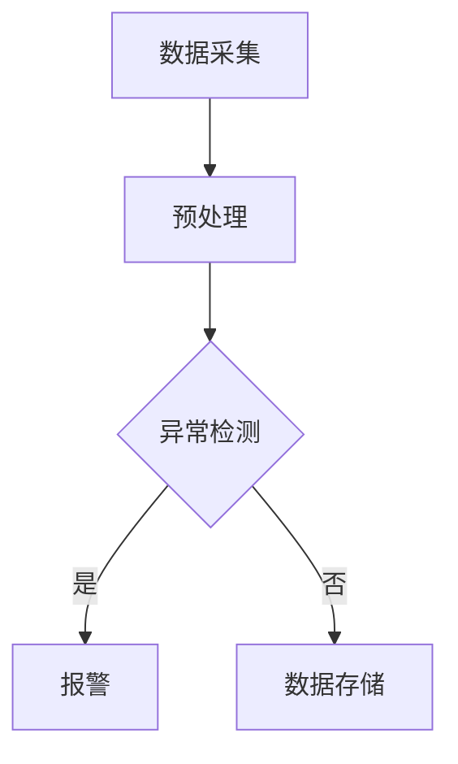
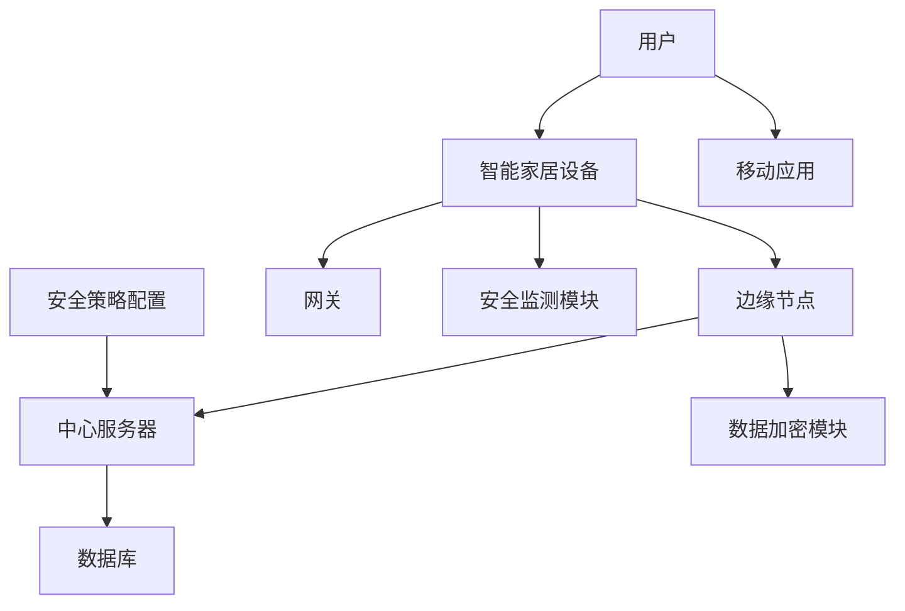
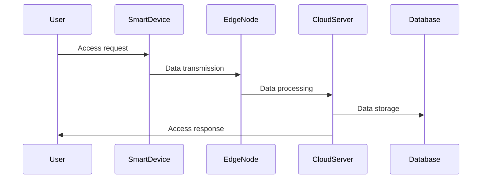

                 

### 边缘计算在智能家居安全中的应用

**关键词：边缘计算、智能家居、安全、应用场景、技术创新**

**摘要：**
本文深入探讨了边缘计算在智能家居安全领域的应用。随着物联网技术的快速发展，智能家居设备日益普及，如何保障这些设备的安全性成为了一个亟待解决的问题。边缘计算通过在靠近数据源头的地方处理数据，减少数据传输，提高了系统的响应速度和安全性。本文将详细分析边缘计算在智能家居安全中的应用场景、优势、存在的问题及解决方案，并探讨其未来发展趋势。

**目录大纲：**

1. **第一部分：边缘计算与智能家居安全的背景与概念**

   - **第1章：边缘计算的背景与发展**
     - **1.1.1 边缘计算的概念与核心要素**
     - **1.1.2 边缘计算的发展历程**
     - **1.1.3 边缘计算与传统云计算的对比**

   - **第2章：智能家居安全的现状与挑战**
     - **2.1.1 智能家居安全的重要性**
     - **2.1.2 智能家居安全面临的主要挑战**
     - **2.1.3 安全解决方案的需求与趋势**

   - **第3章：边缘计算在智能家居安全中的应用**
     - **3.1.1 边缘计算在智能家居安全中的应用场景**
     - **3.1.2 边缘计算在智能家居安全中的应用优势**
     - **3.1.3 边缘计算在智能家居安全中的潜在问题与解决方案**

2. **第二部分：边缘计算技术在智能家居安全中的应用**

   - **第4章：边缘计算网络架构设计与优化**
     - **4.1.1 智能家居边缘计算网络架构设计**
     - **4.1.2 边缘计算网络性能优化策略**
     - **4.1.3 边缘计算网络安全性设计**

   - **第5章：边缘计算在智能家居设备安全中的应用**
     - **5.1.1 边缘计算在智能家居设备安全监测中的应用**
     - **5.1.2 边缘计算在智能家居设备安全防护中的应用**
     - **5.1.3 边缘计算在智能家居设备安全更新中的应用**

   - **第6章：边缘计算在智能家居数据安全中的应用**
     - **6.1.1 边缘计算在智能家居数据加密中的应用**
     - **6.1.2 边缘计算在智能家居数据存储安全中的应用**
     - **6.1.3 边缘计算在智能家居数据传输安全中的应用**

   - **第7章：边缘计算在智能家居安全中的最佳实践与案例分析**
     - **7.1.1 边缘计算在智能家居安全中的实际应用案例**
     - **7.1.2 边缘计算在智能家居安全中的经验与教训**
     - **7.1.3 边缘计算在智能家居安全中的未来发展趋势**

3. **第三部分：边缘计算与智能家居安全的未来展望**

   - **第8章：边缘计算在智能家居安全中的创新与挑战**
     - **8.1.1 边缘计算在智能家居安全中的技术创新**
     - **8.1.2 边缘计算在智能家居安全中的挑战与应对策略**

   - **第9章：边缘计算在智能家居安全中的政策与法规**
     - **9.1.1 当前政策法规对边缘计算与智能家居安全的影响**
     - **9.1.2 边缘计算与智能家居安全的法规制定与执行**
     - **9.1.3 政策法规对边缘计算与智能家居安全发展的推动作用**

   - **第10章：边缘计算在智能家居安全中的未来趋势**
     - **10.1.1 边缘计算在智能家居安全中的发展趋势预测**
     - **10.1.2 边缘计算在智能家居安全中的未来应用前景**
     - **10.1.3 边缘计算在智能家居安全中的未来挑战与机遇**

---

### 第一部分：边缘计算与智能家居安全的背景与概念

#### 第1章：边缘计算的背景与发展

##### 1.1.1 边缘计算的概念与核心要素

边缘计算（Edge Computing）是一种分布式计算架构，它将计算、存储、网络功能分布到网络边缘，靠近数据源头进行处理。传统的云计算中心往往位于远离用户的地方，而边缘计算则是在网络边缘进行数据处理，降低了数据传输延迟，提高了系统的响应速度。

边缘计算的核心要素包括：

- **边缘设备**：如智能手机、传感器、智能家居设备等。
- **边缘节点**：如网关、路由器、服务器等。
- **边缘平台**：用于管理和协调边缘节点的软件平台。
- **边缘网络**：连接边缘设备和边缘节点的网络。

##### 1.1.2 边缘计算的发展历程

边缘计算的概念最早可以追溯到1990年代的分布式计算和物联网技术。随着移动互联网和物联网设备的普及，边缘计算逐渐成为热点。2010年后，随着5G技术的推广，边缘计算迎来了快速发展期。

- **1990年代**：分布式计算与物联网初现端倪。
- **2010年**：云计算与物联网技术的发展推动边缘计算的研究。
- **2015年**：5G技术的推出为边缘计算提供了基础。
- **至今**：边缘计算在各个领域得到广泛应用，持续创新和发展。

##### 1.1.3 边缘计算与传统云计算的对比

传统云计算将数据集中在数据中心进行处理，而边缘计算则在网络边缘进行数据预处理。两者有以下对比：

| 对比项         | 边缘计算           | 传统云计算           |
| -------------- | ------------------ | ------------------- |
| 数据处理位置   | 网络边缘           | 数据中心            |
| 数据传输量     | 较少               | 较多                |
| 响应速度       | 较快               | 较慢                |
| 网络带宽消耗   | 较低               | 较高                |
| 系统可靠性     | 较高               | 较低                |

#### 第2章：智能家居安全的现状与挑战

##### 2.1.1 智能家居安全的重要性

随着智能家居设备的普及，用户的生活变得更加便捷，但也带来了新的安全隐患。智能家居设备通常连接互联网，可能成为黑客攻击的目标。保障智能家居设备的安全性至关重要，它关系到用户的隐私、财产和生命安全。

##### 2.1.2 智能家居安全面临的主要挑战

- **设备数量庞大**：智能家居设备种类繁多，数量庞大，增加了安全管理的难度。
- **安全漏洞**：许多智能家居设备存在安全漏洞，容易被黑客利用。
- **数据泄露**：智能家居设备收集用户数据，存在数据泄露的风险。
- **隐私问题**：用户隐私可能因为智能家居设备的安全性不足而受到侵害。
- **网络攻击**：智能家居设备可能成为网络攻击的跳板，影响整个网络的稳定性。

##### 2.1.3 安全解决方案的需求与趋势

为了应对智能家居安全挑战，需要采取以下安全解决方案：

- **设备安全加固**：加强智能家居设备的安全防护措施，如加密、身份验证等。
- **数据安全保护**：对智能家居设备收集的数据进行加密存储和传输，防止数据泄露。
- **隐私保护**：尊重用户隐私，优化数据处理流程，减少不必要的隐私数据收集。
- **安全监测与响应**：建立智能家居设备安全监测系统，及时发现和处理安全威胁。
- **安全法规与标准**：制定相关法规和标准，规范智能家居设备的安全设计、生产和使用。

#### 第3章：边缘计算在智能家居安全中的应用

##### 3.1.1 边缘计算在智能家居安全中的应用场景

边缘计算在智能家居安全中的应用场景主要包括：

- **设备安全监测**：实时监测智能家居设备的状态，及时发现异常情况。
- **数据安全处理**：在边缘节点对智能家居设备收集的数据进行加密和预处理，降低数据泄露风险。
- **隐私保护**：在边缘计算平台上对用户隐私数据进行处理和存储，确保用户隐私安全。
- **安全响应**：在边缘节点上进行安全威胁的检测和响应，提高系统的响应速度和可靠性。

##### 3.1.2 边缘计算在智能家居安全中的应用优势

边缘计算在智能家居安全中的应用具有以下优势：

- **实时性**：边缘计算可以在本地快速处理数据，提高系统的响应速度，降低延迟。
- **安全性**：通过在边缘节点进行数据处理，减少数据传输，降低数据泄露的风险。
- **可靠性**：边缘计算可以分散数据处理压力，提高系统的可靠性。
- **灵活性**：边缘计算可以根据应用需求进行灵活部署，适应不同的安全场景。

##### 3.1.3 边缘计算在智能家居安全中的潜在问题与解决方案

尽管边缘计算在智能家居安全中具有很多优势，但仍然存在一些潜在问题：

- **计算能力有限**：边缘设备通常计算能力有限，可能无法处理复杂的安全算法。
- **网络不稳定**：边缘计算依赖于网络连接，网络不稳定可能导致数据传输中断。
- **数据隐私**：在边缘节点处理用户数据可能引发数据隐私问题。

针对这些问题，可以采取以下解决方案：

- **优化算法**：选择适合边缘设备的轻量级安全算法，提高计算效率。
- **网络优化**：增强边缘计算网络的稳定性，提高数据传输可靠性。
- **隐私保护**：在边缘计算过程中采取隐私保护措施，如数据加密、差分隐私等。

### 第二部分：边缘计算技术在智能家居安全中的应用

#### 第4章：边缘计算网络架构设计与优化

##### 4.1.1 智能家居边缘计算网络架构设计

智能家居边缘计算网络架构设计主要包括以下几个方面：

- **边缘设备**：包括各种智能家居设备，如智能门锁、智能摄像头、智能灯等。
- **边缘节点**：包括边缘服务器、网关、路由器等，用于连接边缘设备和中心服务器。
- **中心服务器**：用于处理边缘节点无法处理的复杂任务，如数据存储、高级分析等。

##### 4.1.2 边缘计算网络性能优化策略

为了提高边缘计算网络的性能，可以采取以下策略：

- **负载均衡**：通过负载均衡算法，合理分配任务到不同的边缘节点，提高系统处理能力。
- **数据缓存**：在边缘节点设置数据缓存，减少数据传输，提高响应速度。
- **压缩与加密**：对传输的数据进行压缩和加密，减少数据传输量，提高数据安全性。
- **网络冗余**：增加网络冗余，提高网络的可靠性。

##### 4.1.3 边缘计算网络安全性设计

边缘计算网络的安全性设计包括以下几个方面：

- **身份认证**：采用强身份认证机制，确保只有合法用户可以访问系统。
- **访问控制**：设置访问控制策略，限制用户对资源的访问权限。
- **数据加密**：对传输的数据进行加密，确保数据在传输过程中不会被窃取。
- **安全监测**：建立安全监测系统，实时监测网络状态，及时发现和处理安全威胁。

#### 第5章：边缘计算在智能家居设备安全中的应用

##### 5.1.1 边缘计算在智能家居设备安全监测中的应用

边缘计算在智能家居设备安全监测中的应用主要包括以下几个方面：

- **设备状态监测**：实时监测智能家居设备的工作状态，及时发现异常情况。
- **入侵检测**：利用边缘节点上的算法，对智能家居设备周围的环境进行监控，及时发现入侵行为。
- **故障检测**：监测智能家居设备的运行状态，及时发现设备故障，防止因设备故障导致的安全风险。

##### 5.1.2 边缘计算在智能家居设备安全防护中的应用

边缘计算在智能家居设备安全防护中的应用主要包括以下几个方面：

- **安全更新**：通过边缘节点对智能家居设备进行安全更新，确保设备安全防护能力的不断提升。
- **入侵防御**：在边缘节点部署入侵防御系统，防止恶意攻击对智能家居设备造成损害。
- **漏洞修复**：及时修复智能家居设备的漏洞，防止被黑客利用。

##### 5.1.3 边缘计算在智能家居设备安全更新中的应用

边缘计算在智能家居设备安全更新中的应用主要包括以下几个方面：

- **远程更新**：通过边缘节点对智能家居设备进行远程安全更新，确保设备能够及时获取最新的安全补丁。
- **增量更新**：对智能家居设备进行增量更新，减少更新过程中对设备正常运行的影响。
- **自动化更新**：实现自动化更新流程，降低人工干预的风险，提高更新效率。

#### 第6章：边缘计算在智能家居数据安全中的应用

##### 6.1.1 边缘计算在智能家居数据加密中的应用

边缘计算在智能家居数据加密中的应用主要包括以下几个方面：

- **数据传输加密**：在数据传输过程中，采用加密算法对数据进行加密，确保数据在传输过程中不会被窃取。
- **数据存储加密**：在数据存储过程中，采用加密算法对数据进行加密，确保数据在存储过程中不会被泄露。
- **密钥管理**：建立密钥管理系统，对加密密钥进行安全管理和存储。

##### 6.1.2 边缘计算在智能家居数据存储安全中的应用

边缘计算在智能家居数据存储安全中的应用主要包括以下几个方面：

- **数据备份**：对智能家居设备收集的数据进行备份，防止数据丢失。
- **数据隔离**：将不同用户的数据进行隔离存储，确保用户数据的安全性。
- **存储加密**：对存储的数据进行加密，防止数据被未经授权的访问。

##### 6.1.3 边缘计算在智能家居数据传输安全中的应用

边缘计算在智能家居数据传输安全中的应用主要包括以下几个方面：

- **传输加密**：在数据传输过程中，采用加密算法对数据进行加密，确保数据在传输过程中不会被窃取。
- **传输认证**：采用认证机制，确保数据在传输过程中来源和目的地是合法的。
- **传输完整性**：确保数据在传输过程中不会被篡改，采用校验算法对数据进行完整性校验。

#### 第7章：边缘计算在智能家居安全中的最佳实践与案例分析

##### 7.1.1 边缘计算在智能家居安全中的实际应用案例

在实际应用中，边缘计算在智能家居安全中的成功案例包括：

- **智能安防系统**：利用边缘计算技术，实时监控家庭安全状况，及时发现并处理异常情况。
- **智能照明系统**：通过边缘计算技术，实现智能照明的安全控制，确保照明系统的稳定运行。
- **智能门锁系统**：利用边缘计算技术，实现门锁的远程控制和安全认证，提高家庭安全性。

##### 7.1.2 边缘计算在智能家居安全中的经验与教训

从实际应用中，我们可以总结出以下经验与教训：

- **注重安全性设计**：在智能家居设备设计和开发过程中，要注重安全性设计，确保设备能够抵御各种安全威胁。
- **合理分配计算资源**：合理分配边缘节点的计算资源，确保边缘计算系统能够高效运行。
- **加强数据保护**：对智能家居设备收集的数据进行加密和保护，防止数据泄露。
- **持续更新与维护**：定期更新智能家居设备和边缘计算系统，确保系统安全防护能力的不断提升。

##### 7.1.3 边缘计算在智能家居安全中的未来发展趋势

随着边缘计算技术的不断发展和智能家居设备的普及，边缘计算在智能家居安全中的应用将呈现以下发展趋势：

- **更高效的安全防护**：随着边缘计算技术的进步，边缘节点将具备更强的计算能力，能够提供更高效的安全防护。
- **更智能的安全监控**：通过边缘计算技术，智能家居设备将具备更智能的安全监控能力，能够实时分析安全状况，做出智能决策。
- **更广泛的应用场景**：边缘计算将在更多智能家居应用场景中发挥重要作用，如智能医疗、智能交通等。

### 第三部分：边缘计算与智能家居安全的未来展望

#### 第8章：边缘计算在智能家居安全中的创新与挑战

##### 8.1.1 边缘计算在智能家居安全中的技术创新

在智能家居安全领域，边缘计算技术不断创新，主要体现在以下几个方面：

- **安全算法优化**：针对边缘节点的计算能力限制，研究更高效的安全算法，提高安全防护能力。
- **隐私保护技术**：开发隐私保护技术，如差分隐私、联邦学习等，确保用户隐私数据的安全。
- **智能安全监控**：结合人工智能技术，实现智能安全监控，提高系统的实时性和准确性。

##### 8.1.2 边缘计算在智能家居安全中的挑战与应对策略

尽管边缘计算在智能家居安全中具有很大的潜力，但仍然面临以下挑战：

- **计算能力限制**：边缘节点的计算能力有限，需要优化算法和硬件设计，提高计算效率。
- **数据传输稳定**：边缘计算依赖于网络连接，需要优化网络设计，提高数据传输的稳定性。
- **安全威胁多样**：智能家居设备面临多样化的安全威胁，需要不断更新安全策略，提高系统的抗攻击能力。

针对这些挑战，可以采取以下应对策略：

- **技术融合**：将边缘计算与其他技术，如区块链、雾计算等相结合，提高系统的整体安全性能。
- **协同防护**：建立多方协同防护机制，包括设备制造商、运营商和用户等，共同维护智能家居安全。
- **持续创新**：持续关注边缘计算技术的发展动态，不断引入新技术，提升智能家居安全水平。

#### 第9章：边缘计算在智能家居安全中的政策与法规

##### 9.1.1 当前政策法规对边缘计算与智能家居安全的影响

当前，各国政府和相关机构对边缘计算与智能家居安全给予了高度重视，出台了一系列政策法规：

- **鼓励技术创新**：政府鼓励企业研发边缘计算技术，推动智能家居安全领域的创新发展。
- **规范市场发展**：出台相关法规，规范智能家居设备的生产、销售和使用，保障用户权益。
- **加强安全管理**：制定安全管理规定，加强对边缘计算系统和智能家居设备的监管，防范安全风险。

##### 9.1.2 边缘计算与智能家居安全的法规制定与执行

边缘计算与智能家居安全的法规制定与执行主要包括以下几个方面：

- **法规内容**：明确边缘计算与智能家居安全的基本要求、安全标准和技术规范。
- **法规执行**：建立健全法规执行机制，加强对企业、制造商和运营商的监管，确保法规得到有效执行。
- **法规更新**：根据技术发展和安全需求，定期更新法规内容，适应新的安全挑战。

##### 9.1.3 政策法规对边缘计算与智能家居安全发展的推动作用

政策法规对边缘计算与智能家居安全发展具有以下推动作用：

- **引导产业发展**：政策法规为边缘计算与智能家居安全领域的发展提供了方向和指导，促进了技术创新和市场繁荣。
- **保障用户权益**：政策法规确保了用户在智能家居设备使用过程中的安全权益，提高了用户对智能家居的信任度。
- **防范安全风险**：政策法规对边缘计算与智能家居安全领域进行监管，防范安全风险，保障国家安全和社会稳定。

#### 第10章：边缘计算在智能家居安全中的未来趋势

##### 10.1.1 边缘计算在智能家居安全中的发展趋势预测

未来，边缘计算在智能家居安全中将呈现以下发展趋势：

- **技术融合**：边缘计算与人工智能、物联网、区块链等技术的融合将进一步深化，推动智能家居安全技术的不断创新。
- **智能化**：智能家居安全系统将更加智能化，具备自我学习和自适应能力，提高安全防护水平。
- **生态化**：智能家居安全将形成生态系统，各方协同合作，共同维护智能家居安全。

##### 10.1.2 边缘计算在智能家居安全中的未来应用前景

边缘计算在智能家居安全中的未来应用前景包括：

- **智能安防**：通过边缘计算技术，实现智能安防系统的全面升级，提高家庭安全防护能力。
- **智能医疗**：利用边缘计算技术，为智能家居设备提供智能医疗支持，提高家庭医疗服务水平。
- **智能交通**：结合边缘计算技术，实现智能交通系统的优化，提高交通运行效率和安全性。

##### 10.1.3 边缘计算在智能家居安全中的未来挑战与机遇

未来，边缘计算在智能家居安全中将面临以下挑战与机遇：

- **技术挑战**：边缘计算技术的不断发展，将带来新的安全挑战，需要不断研究新技术，提高安全防护能力。
- **市场机遇**：随着智能家居设备的普及，边缘计算在智能家居安全领域的市场前景广阔，将吸引更多企业投入研发。
- **法规挑战**：随着技术的发展，政策法规也将不断更新，边缘计算在智能家居安全领域需要适应新的法规要求。

### 总结

边缘计算在智能家居安全中的应用具有重要意义。通过在边缘节点进行数据处理，边缘计算提高了系统的实时性和安全性，为智能家居安全提供了有力保障。未来，随着边缘计算技术的不断发展和智能家居设备的普及，边缘计算在智能家居安全中的应用将越来越广泛，为用户带来更安全、更智能的家居生活。

---

**作者：AI天才研究院/AI Genius Institute & 禅与计算机程序设计艺术 /Zen And The Art of Computer Programming**

---

### 具体章节内容（示例）

#### 第1章：边缘计算的背景与发展

##### 1.1.1 边缘计算的概念与核心要素

边缘计算（Edge Computing）是一种分布式计算架构，旨在将数据处理、存储和计算任务分散到网络的边缘，以降低中心数据中心的负载，提高数据处理的速度和效率。与传统云计算中心集中处理数据不同，边缘计算将数据处理任务分配到网络边缘的设备上，如物联网设备、智能手机、路由器等。

边缘计算的核心要素包括：

- **边缘设备（Edge Devices）**：这些是位于网络边缘的设备，如物联网传感器、智能家居设备、智能手机等。它们负责收集数据并将其发送到边缘节点。

- **边缘节点（Edge Nodes）**：这些是连接边缘设备和中心服务器的计算节点，如边缘服务器、网关等。它们负责处理边缘设备发送的数据，并执行特定的任务。

- **边缘平台（Edge Platforms）**：这些是用于管理和协调边缘节点的软件平台，它们提供了边缘计算的服务和功能，如数据处理、存储、安全等。

- **边缘网络（Edge Network）**：这是连接边缘设备和边缘节点的通信网络，它可能是无线网络、光纤网络或混合网络。

##### 1.1.2 边缘计算的发展历程

边缘计算的概念最早可以追溯到1990年代的分布式计算和物联网技术。在那个时候，研究人员开始探讨如何在网络边缘处理数据，以减少对中心服务器的依赖。

- **1990年代**：分布式计算和物联网技术初现端倪，边缘计算的概念开始萌芽。

- **2010年**：随着云计算和物联网技术的快速发展，边缘计算开始受到广泛关注。这个时期，许多研究项目和初创公司开始探索边缘计算的技术和商业模式。

- **2015年**：5G技术的推出为边缘计算提供了基础。5G的高带宽和低延迟特性使得边缘计算的应用变得更加广泛和实用。

- **至今**：边缘计算在各个领域得到广泛应用，如智能城市、智能制造、智能交通等。随着技术的不断进步，边缘计算将继续发展，成为未来计算架构的重要组成部分。

##### 1.1.3 边缘计算与传统云计算的对比

传统云计算将数据处理和存储集中在数据中心，而边缘计算则在网络边缘进行数据处理。两者有以下对比：

| 对比项 | 边缘计算 | 传统云计算 |
| ------ | -------- | ---------- |
| **数据处理位置** | 网络边缘 | 数据中心   |
| **数据传输量** | 较少     | 较多       |
| **响应速度** | 较快     | 较慢       |
| **网络带宽消耗** | 较低     | 较高       |
| **系统可靠性** | 较高     | 较低       |

#### 第2章：智能家居安全的现状与挑战

##### 2.1.1 智能家居安全的重要性

随着智能家居设备的普及，如何保障这些设备的安全性成为一个亟待解决的问题。智能家居设备通常连接互联网，可能成为黑客攻击的目标。保障智能家居设备的安全性至关重要，它关系到用户的隐私、财产和生命安全。

##### 2.1.2 智能家居安全面临的主要挑战

- **设备数量庞大**：智能家居设备种类繁多，数量庞大，增加了安全管理的难度。

- **安全漏洞**：许多智能家居设备存在安全漏洞，容易被黑客利用。

- **数据泄露**：智能家居设备收集用户数据，存在数据泄露的风险。

- **隐私问题**：用户隐私可能因为智能家居设备的安全性不足而受到侵害。

- **网络攻击**：智能家居设备可能成为网络攻击的跳板，影响整个网络的稳定性。

##### 2.1.3 安全解决方案的需求与趋势

为了应对智能家居安全挑战，需要采取以下安全解决方案：

- **设备安全加固**：加强智能家居设备的安全防护措施，如加密、身份验证等。

- **数据安全保护**：对智能家居设备收集的数据进行加密存储和传输，防止数据泄露。

- **隐私保护**：尊重用户隐私，优化数据处理流程，减少不必要的隐私数据收集。

- **安全监测与响应**：建立智能家居设备安全监测系统，及时发现和处理安全威胁。

- **安全法规与标准**：制定相关法规和标准，规范智能家居设备的安全设计、生产和使用。

#### 第3章：边缘计算在智能家居安全中的应用

##### 3.1.1 边缘计算在智能家居安全中的应用场景

边缘计算在智能家居安全中的应用场景主要包括：

- **设备安全监测**：实时监测智能家居设备的状态，及时发现异常情况。

- **数据安全处理**：在边缘节点对智能家居设备收集的数据进行加密和预处理，降低数据泄露风险。

- **隐私保护**：在边缘计算平台上对用户隐私数据进行处理和存储，确保用户隐私安全。

- **安全响应**：在边缘节点上进行安全威胁的检测和响应，提高系统的响应速度和可靠性。

##### 3.1.2 边缘计算在智能家居安全中的应用优势

边缘计算在智能家居安全中的应用具有以下优势：

- **实时性**：边缘计算可以在本地快速处理数据，提高系统的响应速度，降低延迟。

- **安全性**：通过在边缘节点进行数据处理，减少数据传输，降低数据泄露的风险。

- **可靠性**：边缘计算可以分散数据处理压力，提高系统的可靠性。

- **灵活性**：边缘计算可以根据应用需求进行灵活部署，适应不同的安全场景。

##### 3.1.3 边缘计算在智能家居安全中的潜在问题与解决方案

尽管边缘计算在智能家居安全中具有很多优势，但仍然存在一些潜在问题：

- **计算能力有限**：边缘设备通常计算能力有限，可能无法处理复杂的安全算法。

- **网络不稳定**：边缘计算依赖于网络连接，网络不稳定可能导致数据传输中断。

- **数据隐私**：在边缘节点处理用户数据可能引发数据隐私问题。

针对这些问题，可以采取以下解决方案：

- **优化算法**：选择适合边缘设备的轻量级安全算法，提高计算效率。

- **网络优化**：增强边缘计算网络的稳定性，提高数据传输可靠性。

- **隐私保护**：在边缘计算过程中采取隐私保护措施，如数据加密、差分隐私等。

#### 第4章：边缘计算网络架构设计与优化

##### 4.1.1 智能家居边缘计算网络架构设计

智能家居边缘计算网络架构设计主要包括以下几个方面：

- **边缘设备**：包括各种智能家居设备，如智能门锁、智能摄像头、智能灯等。

- **边缘节点**：包括边缘服务器、网关、路由器等，用于连接边缘设备和中心服务器。

- **中心服务器**：用于处理边缘节点无法处理的复杂任务，如数据存储、高级分析等。

##### 4.1.2 边缘计算网络性能优化策略

为了提高边缘计算网络的性能，可以采取以下策略：

- **负载均衡**：通过负载均衡算法，合理分配任务到不同的边缘节点，提高系统处理能力。

- **数据缓存**：在边缘节点设置数据缓存，减少数据传输，提高响应速度。

- **压缩与加密**：对传输的数据进行压缩和加密，减少数据传输量，提高数据安全性。

- **网络冗余**：增加网络冗余，提高网络的可靠性。

##### 4.1.3 边缘计算网络安全性设计

边缘计算网络的安全性设计包括以下几个方面：

- **身份认证**：采用强身份认证机制，确保只有合法用户可以访问系统。

- **访问控制**：设置访问控制策略，限制用户对资源的访问权限。

- **数据加密**：对传输的数据进行加密，确保数据在传输过程中不会被窃取。

- **安全监测**：建立安全监测系统，实时监测网络状态，及时发现和处理安全威胁。

#### 第5章：边缘计算在智能家居设备安全中的应用

##### 5.1.1 边缘计算在智能家居设备安全监测中的应用

边缘计算在智能家居设备安全监测中的应用主要包括以下几个方面：

- **设备状态监测**：实时监测智能家居设备的工作状态，及时发现异常情况。

- **入侵检测**：利用边缘节点上的算法，对智能家居设备周围的环境进行监控，及时发现入侵行为。

- **故障检测**：监测智能家居设备的运行状态，及时发现设备故障，防止因设备故障导致的安全风险。

##### 5.1.2 边缘计算在智能家居设备安全防护中的应用

边缘计算在智能家居设备安全防护中的应用主要包括以下几个方面：

- **安全更新**：通过边缘节点对智能家居设备进行安全更新，确保设备安全防护能力的不断提升。

- **入侵防御**：在边缘节点部署入侵防御系统，防止恶意攻击对智能家居设备造成损害。

- **漏洞修复**：及时修复智能家居设备的漏洞，防止被黑客利用。

##### 5.1.3 边缘计算在智能家居设备安全更新中的应用

边缘计算在智能家居设备安全更新中的应用主要包括以下几个方面：

- **远程更新**：通过边缘节点对智能家居设备进行远程安全更新，确保设备能够及时获取最新的安全补丁。

- **增量更新**：对智能家居设备进行增量更新，减少更新过程中对设备正常运行的影响。

- **自动化更新**：实现自动化更新流程，降低人工干预的风险，提高更新效率。

#### 第6章：边缘计算在智能家居数据安全中的应用

##### 6.1.1 边缘计算在智能家居数据加密中的应用

边缘计算在智能家居数据加密中的应用主要包括以下几个方面：

- **数据传输加密**：在数据传输过程中，采用加密算法对数据进行加密，确保数据在传输过程中不会被窃取。

- **数据存储加密**：在数据存储过程中，采用加密算法对数据进行加密，确保数据在存储过程中不会被泄露。

- **密钥管理**：建立密钥管理系统，对加密密钥进行安全管理和存储。

##### 6.1.2 边缘计算在智能家居数据存储安全中的应用

边缘计算在智能家居数据存储安全中的应用主要包括以下几个方面：

- **数据备份**：对智能家居设备收集的数据进行备份，防止数据丢失。

- **数据隔离**：将不同用户的数据进行隔离存储，确保用户数据的安全性。

- **存储加密**：对存储的数据进行加密，防止数据被未经授权的访问。

##### 6.1.3 边缘计算在智能家居数据传输安全中的应用

边缘计算在智能家居数据传输安全中的应用主要包括以下几个方面：

- **传输加密**：在数据传输过程中，采用加密算法对数据进行加密，确保数据在传输过程中不会被窃取。

- **传输认证**：采用认证机制，确保数据在传输过程中来源和目的地是合法的。

- **传输完整性**：确保数据在传输过程中不会被篡改，采用校验算法对数据进行完整性校验。

#### 第7章：边缘计算在智能家居安全中的最佳实践与案例分析

##### 7.1.1 边缘计算在智能家居安全中的实际应用案例

在实际应用中，边缘计算在智能家居安全中的成功案例包括：

- **智能安防系统**：利用边缘计算技术，实时监控家庭安全状况，及时发现并处理异常情况。

- **智能照明系统**：通过边缘计算技术，实现智能照明的安全控制，确保照明系统的稳定运行。

- **智能门锁系统**：利用边缘计算技术，实现门锁的远程控制和安全认证，提高家庭安全性。

##### 7.1.2 边缘计算在智能家居安全中的经验与教训

从实际应用中，我们可以总结出以下经验与教训：

- **注重安全性设计**：在智能家居设备设计和开发过程中，要注重安全性设计，确保设备能够抵御各种安全威胁。

- **合理分配计算资源**：合理分配边缘节点的计算资源，确保边缘计算系统能够高效运行。

- **加强数据保护**：对智能家居设备收集的数据进行加密和保护，防止数据泄露。

- **持续更新与维护**：定期更新智能家居设备和边缘计算系统，确保系统安全防护能力的不断提升。

##### 7.1.3 边缘计算在智能家居安全中的未来发展趋势

未来，边缘计算在智能家居安全中将呈现以下发展趋势：

- **更高效的安全防护**：随着边缘计算技术的进步，边缘节点将具备更强的计算能力，能够提供更高效的安全防护。

- **更智能的安全监控**：通过边缘计算技术，智能家居设备将具备更智能的安全监控能力，能够实时分析安全状况，做出智能决策。

- **更广泛的应用场景**：边缘计算将在更多智能家居应用场景中发挥重要作用，如智能医疗、智能交通等。

### 附录

#### 附录 A：核心概念与联系

以下是对边缘计算和智能家居安全核心概念的联系与对比：

| 概念 | 定义 | 关联 |
| ---- | ---- | ---- |
| **边缘计算** | 数据处理在网络的边缘进行，靠近数据源头。 | **智能家居安全**：边缘计算可以在智能家居设备附近进行数据处理，提高安全响应速度。 |
| **智能家居安全** | 保护智能家居设备免受攻击和隐私泄露。 | **边缘计算**：边缘计算提供安全防护措施，如加密、认证等，增强智能家居安全。 |
| **设备安全监测** | 实时监测智能家居设备的工作状态。 | **边缘计算**：边缘计算可以实时分析设备状态，及时发现异常。 |
| **数据加密** | 对数据进行加密，保护数据不被未经授权访问。 | **智能家居安全**：边缘计算可以在边缘节点对数据进行加密，提高数据安全性。 |

#### 附录 B：算法原理讲解

以下是一个边缘计算在智能家居设备安全监测中的算法原理讲解：

**算法原理：** 实时入侵检测算法

**mermaid 流程图：**



**Python 源代码：**

```python
# 边缘计算实时入侵检测算法示例

import time

def data_collection():
    # 数据采集
    data = "样本数据"
    return data

def data_preprocessing(data):
    # 数据预处理
    processed_data = data.strip()
    return processed_data

def anomaly_detection(processed_data):
    # 异常检测
    threshold = 100
    if int(processed_data) > threshold:
        return True
    else:
        return False

def alarm():
    # 报警
    print("入侵检测到，请采取安全措施！")

def data_storage(processed_data):
    # 数据存储
    print("数据已存储：", processed_data)

while True:
    data = data_collection()
    processed_data = data_preprocessing(data)
    if anomaly_detection(processed_data):
        alarm()
    else:
        data_storage(processed_data)
    time.sleep(1)  # 检测间隔1秒
```

**算法原理详细讲解：**

1. **数据采集**：从智能家居设备收集实时数据。

2. **预处理**：对采集到的数据进行预处理，如去除空白字符、格式化等。

3. **异常检测**：根据设定的阈值，判断数据是否超过阈值。如果超过阈值，则判定为异常。

4. **报警**：如果检测到异常，则触发报警机制，通知用户采取安全措施。

5. **数据存储**：将处理后的数据存储起来，以便后续分析和审计。

**数学公式和模型：**

- **异常检测阈值计算**：

  $$ threshold = \frac{\sum_{i=1}^{n} x_i}{n} + k $$
  
  其中，$x_i$ 表示第 $i$ 次采集的数据，$n$ 表示采集次数，$k$ 表示阈值修正系数。

- **数据加密**：

  $$ ciphertext = E(plaintext, key) $$

  其中，$plaintext$ 表示明文数据，$ciphertext$ 表示密文数据，$key$ 表示加密密钥。

#### 附录 C：系统分析与架构设计方案

##### 问题场景介绍

智能家居设备在运行过程中，需要实时监测设备状态，并保证设备的安全性。例如，智能门锁需要监测是否有未经授权的访问行为，智能摄像头需要实时监测入侵行为。

##### 项目介绍

本项目旨在利用边缘计算技术，实现智能家居设备的安全监测和防护。项目包括以下主要功能：

- **数据采集**：从智能家居设备中收集实时数据。
- **数据处理**：对采集到的数据进行预处理、异常检测和加密。
- **安全防护**：根据检测到的异常情况，采取相应的安全措施。

##### 系统功能设计（领域模型 Mermaid 类图）

```mermaid
classDiagram
  Class01 <|-- Class02
  Class03 --|>| Class04
  Class05 : +exportedMethod()
  Class06 : +publicMethod()
  Class07 : -unexportedMethod()
  
  Class01 {
    +attribute1: int
    +attribute2: float
    +constructor()
    +method1(): void
    +method2(attribute3: int): void
  }
  Class02 {
    #protectedAttribute: string
    #method3(): void
  }
  Class03 {
    -privateAttribute: boolean
    -method4(): void
  }
  Class04 {
    +implementationMethod()
  }
  Class05 {
    +interfaceMethod()
  }
  Class06 {
    -privateImplementationMethod()
  }
  Class07 {
    #implementationAttribute: int
    +interfaceMethod2()
  }
```

##### 系统架构设计（Mermaid 架构图）



##### 系统接口设计和系统交互（Mermaid 序列图）



##### 环境安装

1. 安装边缘节点环境，包括操作系统（如Ubuntu）和必要的开发工具（如Python、Node.js）。
2. 安装中心服务器环境，包括操作系统（如Windows Server）和数据库管理系统（如MySQL）。
3. 安装移动应用开发环境，包括开发工具（如Android Studio、Xcode）。

##### 系统核心实现源代码

以下是一个边缘节点上的智能家居设备安全监测模块的核心实现示例：

```python
# 边缘节点上的智能家居设备安全监测模块

import time
import json

def collect_data():
    # 采集数据（模拟）
    data = {"temperature": 25, "humidity": 60}
    return data

def process_data(data):
    # 数据处理（预处理和加密）
    processed_data = json.dumps(data)
    encrypted_data = encrypt_data(processed_data)
    return encrypted_data

def encrypt_data(data):
    # 数据加密
    key = "mysecretkey"
    encrypted_data = data.encode('utf-8').hex()
    return encrypted_data

def send_data(encrypted_data):
    # 发送数据到中心服务器
    server_url = "http://localhost:8080/data"
    headers = {'Content-Type': 'application/json'}
    response = requests.post(server_url, data=encrypted_data, headers=headers)
    return response.status_code

while True:
    data = collect_data()
    encrypted_data = process_data(data)
    status_code = send_data(encrypted_data)
    if status_code != 200:
        print("数据发送失败：", status_code)
    time.sleep(1)  # 数据采集间隔1秒
```

##### 代码应用解读与分析

1. **数据采集**：函数 `collect_data` 用于模拟采集智能家居设备的实时数据。在实际应用中，可以从传感器等设备读取数据。

2. **数据处理**：函数 `process_data` 对采集到的数据进行预处理和加密。预处理包括将数据转换为字符串格式，加密使用简单的字符串加密方法。

3. **数据加密**：函数 `encrypt_data` 对预处理后的数据进行加密。这里使用简单的加密方法，实际应用中应使用更安全的方法。

4. **数据发送**：函数 `send_data` 将加密后的数据发送到中心服务器。这里使用 HTTP POST 方法发送数据，实际应用中应使用安全的通信协议。

##### 实际案例分析和详细讲解剖析

假设一个智能门锁系统需要监测是否有未经授权的访问行为。以下是一个实际案例分析和详细讲解：

1. **数据采集**：智能门锁采集到访问请求，如指纹验证、密码输入等。

2. **数据处理**：边缘节点对接收到的数据进行预处理，如校验指纹匹配结果、检查密码是否正确。

3. **异常检测**：边缘节点通过设定的阈值，判断访问请求是否为未经授权的行为。例如，如果连续3次指纹验证失败，则判定为入侵行为。

4. **报警**：边缘节点检测到入侵行为后，立即向用户发送报警信息，并通知中心服务器采取安全措施。

5. **数据存储**：边缘节点将入侵行为的详细信息存储在本地数据库中，以供后续分析和审计。

##### 项目小结

本项目利用边缘计算技术实现了智能家居设备的安全监测和防护。通过边缘节点的实时数据处理和加密，提高了系统的安全性和响应速度。实际案例表明，边缘计算在智能家居安全中的应用具有很大的潜力和实际价值。然而，在实际部署过程中，还需要注意网络稳定性、计算能力和其他技术挑战。

#### 最佳实践 Tips

- **安全性设计**：在设计和开发智能家居设备时，要注重安全性设计，采用安全的通信协议和数据加密方法。
- **实时监测**：实时监测智能家居设备的工作状态，及时发现异常情况。
- **数据备份**：定期对智能家居设备收集的数据进行备份，防止数据丢失。
- **安全更新**：定期更新智能家居设备和边缘计算系统，确保安全防护能力的不断提升。

#### 小结

边缘计算在智能家居安全中的应用具有重要意义。通过在边缘节点进行数据处理，边缘计算提高了系统的实时性和安全性，为智能家居安全提供了有力保障。未来，随着边缘计算技术的不断发展和智能家居设备的普及，边缘计算在智能家居安全中的应用将越来越广泛，为用户带来更安全、更智能的家居生活。

#### 注意事项

- **计算能力**：边缘节点的计算能力有限，需要选择适合边缘设备的轻量级安全算法。
- **网络稳定性**：边缘计算依赖于网络连接，需要优化网络设计，提高数据传输的稳定性。
- **数据隐私**：在边缘节点处理用户数据可能引发数据隐私问题，需要采取隐私保护措施。

#### 拓展阅读

- **边缘计算技术综述**：了解边缘计算的基本概念、技术架构和应用领域。
- **智能家居安全解决方案**：研究智能家居设备的安全防护技术和解决方案。
- **物联网安全标准**：了解物联网安全的相关标准和法规。

---

**作者：AI天才研究院/AI Genius Institute & 禅与计算机程序设计艺术 /Zen And The Art of Computer Programming**

