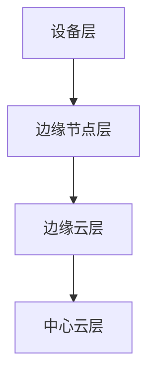
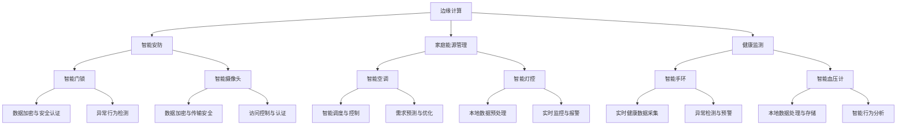
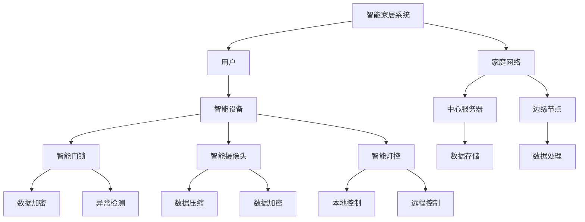
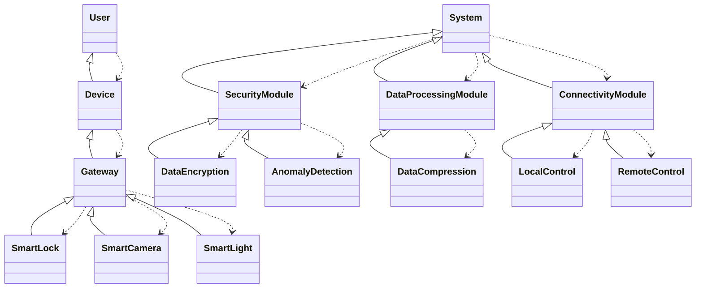
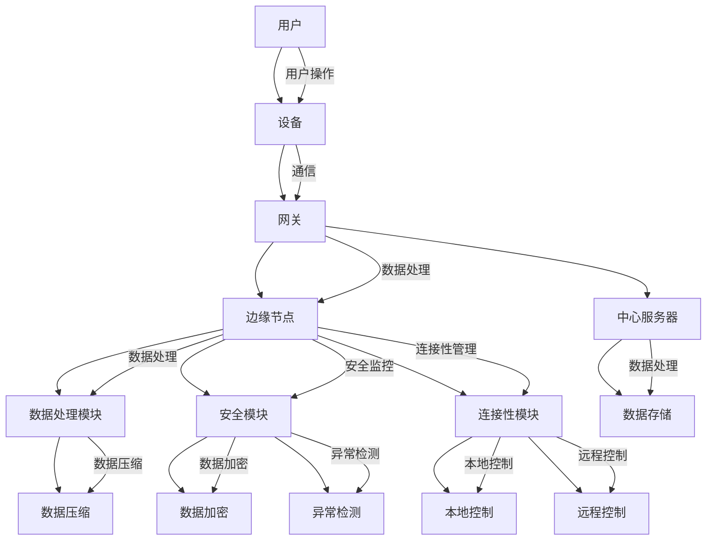
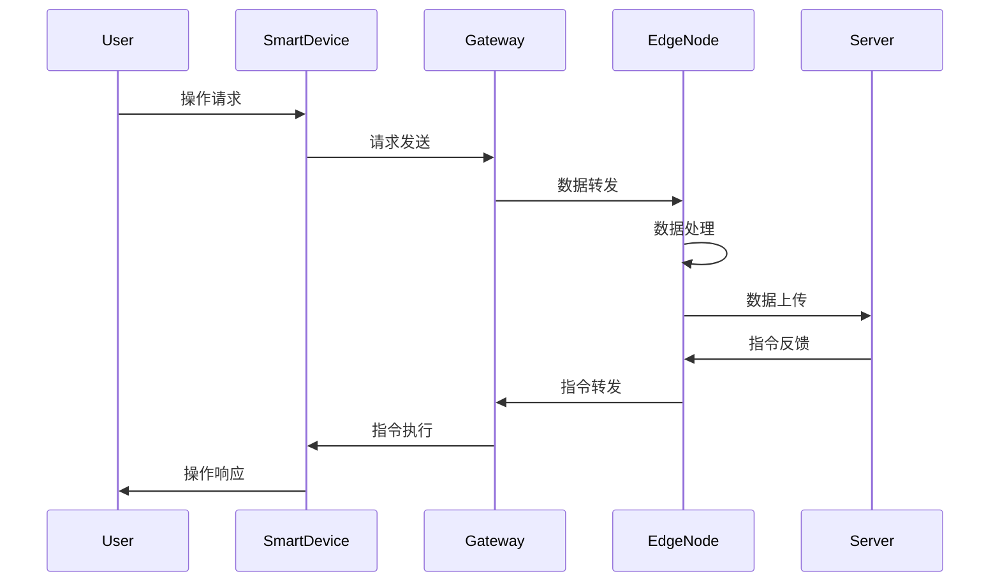

                 

### 引入

#### 边缘计算与智能家居安全防护概述

**边缘计算**是一种分布式计算架构，它将数据处理、存储和应用程序的逻辑从传统的集中式数据中心迁移到网络的边缘，即靠近数据源和用户的地方。随着物联网（IoT）技术的发展，智能家居设备不断增多，边缘计算的应用场景也在逐渐扩大。

**智能家居安全防护**是指通过一系列技术手段，保障家庭网络、设备和数据的安全性，防止未授权访问、数据泄露和恶意攻击。随着智能家居设备的普及，安全问题变得越来越重要。

本文将探讨边缘计算在智能家居安全防护中的应用，旨在解决以下几个关键问题：

1. **边缘计算的基本原理是什么？** 它如何与云计算区别？
2. **智能家居安全面临哪些挑战？** 这些挑战对家庭安全有何影响？
3. **边缘计算如何解决智能家居安全的问题？** 它的应用场景和实现方式是什么？
4. **边缘计算在智能家居安全防护中的实际案例有哪些？** 它们如何发挥作用？
5. **未来边缘计算在智能家居安全防护中会有哪些发展趋势和挑战？**

通过本文的详细分析，我们希望为读者提供一幅全面、清晰的边缘计算在智能家居安全防护中的应用全景图。

#### 文章关键词

边缘计算、智能家居、安全防护、物联网、分布式计算、隐私保护、实时处理、云计算对比。

#### 文章摘要

本文首先介绍了边缘计算和智能家居安全防护的基本概念，随后分析了智能家居面临的安全挑战。接着，深入探讨了边缘计算在解决这些挑战中的应用，并通过实际案例展示了其应用效果。最后，展望了边缘计算在智能家居安全防护中的未来发展趋势和面临的挑战。文章旨在为读者提供全面的技术分析和应用指导，助力智能家居安全防护的实践和探索。

----------------------------------------------------------------

## 边缘计算与智能家居安全防护概述

### 问题背景

#### 边缘计算的概念

边缘计算是一种分布式计算架构，旨在将数据处理、存储和应用程序的逻辑从传统的集中式数据中心迁移到网络的边缘。这里的“边缘”通常指的是靠近数据源和用户的地方，如智能设备、网络接入点或数据中心的前端。边缘计算的出现，主要是为了解决数据传输延迟、带宽限制和网络拥塞等问题，从而提升系统的响应速度和用户体验。

边缘计算的关键特点包括：

1. **分布式处理**：将计算任务分布在多个边缘节点上，而不是集中在中心服务器，这样可以减轻中心服务器的负担，提高系统的整体性能。
2. **实时处理**：由于数据处理靠近数据源，可以大大减少数据传输的时间，实现实时数据分析和响应。
3. **带宽优化**：通过在边缘进行数据处理，可以减少需要传输到中心的数据量，从而节省带宽资源。
4. **安全性提升**：将敏感数据处理在边缘，可以降低数据泄露的风险。

#### 智能家居的发展现状

智能家居是指通过物联网技术将家庭设备连接起来，实现远程控制、自动化操作和智能交互。近年来，随着物联网、5G、人工智能等技术的快速发展，智能家居市场得到了迅速扩张。据市场研究机构的统计，全球智能家居市场规模在2020年已经达到了600亿美元，预计到2025年将超过1500亿美元。

智能家居的主要设备包括：

1. **智能家电**：如智能电视、智能冰箱、智能洗衣机等。
2. **智能照明**：如智能灯具、智能开关等。
3. **智能安防**：如智能门锁、智能摄像头、智能烟雾报警器等。
4. **智能环境控制**：如智能空调、智能温控器等。
5. **健康监测设备**：如智能手环、智能血压计等。

#### 智能家居安全防护的重要性

智能家居设备的普及带来了便利，但同时也带来了新的安全风险。由于智能家居设备通常连接到家庭网络，且涉及到个人隐私、财务信息等敏感数据，一旦被攻击，可能导致数据泄露、财产损失甚至生命安全威胁。

智能家居安全防护的重要性体现在以下几个方面：

1. **数据保护**：智能家居设备收集和传输的数据包括个人隐私、家庭活动等信息，一旦泄露，可能被不法分子利用。
2. **设备安全**：智能家居设备可能被恶意攻击者控制，导致设备功能失效或被恶意使用。
3. **网络安全**：智能家居设备连接到家庭网络，可能成为网络攻击的入口，威胁整个家庭网络的安全。
4. **隐私保护**：智能家居设备可能监控家庭活动，如摄像头、智能音响等，如果未经授权访问，可能侵犯个人隐私。

### 研究意义和目标

本文旨在探讨边缘计算在智能家居安全防护中的应用，旨在解决以下几个关键问题：

1. **提升智能家居安全防护能力**：通过边缘计算，实现实时数据分析和安全监控，提高智能家居系统的整体安全水平。
2. **降低安全风险**：边缘计算可以减少数据传输的延迟和带宽需求，降低数据泄露和网络攻击的风险。
3. **优化用户体验**：边缘计算可以实现本地数据处理和实时响应，提升智能家居设备的使用体验。
4. **推动智能家居发展**：通过应用边缘计算技术，解决智能家居面临的安全问题，促进智能家居市场的健康发展。

本文的研究目标是：

1. **介绍边缘计算和智能家居安全防护的基本概念**，为后续讨论打下基础。
2. **分析智能家居安全防护面临的挑战**，明确研究的重要性。
3. **探讨边缘计算在智能家居安全防护中的应用场景**，包括实现方式和关键技术。
4. **通过实际案例展示边缘计算在智能家居安全防护中的应用效果**，验证其可行性和实用性。
5. **展望边缘计算在智能家居安全防护中的未来发展趋势和挑战**，为后续研究提供方向。

通过对边缘计算在智能家居安全防护中的应用进行深入探讨，本文旨在为智能家居领域的技术创新和产业发展提供参考，为用户提供更加安全、便捷的智能生活体验。

----------------------------------------------------------------

## 边缘计算的基本原理

### 边缘计算的核心概念

边缘计算（Edge Computing）是一种分布式计算架构，它通过在网络边缘部署计算资源，实现数据的处理、分析和响应。与传统的集中式计算架构不同，边缘计算将数据处理、存储和应用程序的逻辑从中心服务器或云平台转移到网络的边缘节点，如智能设备、路由器、网关等。这种架构设计使得数据处理更加接近数据源和用户，从而降低网络延迟、减少带宽需求，提升系统的响应速度和用户体验。

#### 边缘计算的架构

边缘计算的架构可以分为以下几个层次：

1. **设备层**：包括各种智能设备和传感器，如智能门锁、智能摄像头、智能传感器等。这些设备负责采集和生成数据。
2. **边缘节点层**：包括边缘服务器、网关和路由器等，这些节点负责对采集到的数据进行初步处理、存储和转发。
3. **边缘云层**：这部分类似于传统云计算，提供更加复杂的数据处理和分析服务，如机器学习、大数据分析等。
4. **中心云层**：用于存储和管理大规模数据，提供全局视图和长周期数据处理服务。

边缘计算架构的图示如下：



#### 边缘计算的优势

边缘计算具有以下几个显著优势：

1. **降低延迟**：由于数据处理发生在网络的边缘，可以显著减少数据传输的时间，降低系统的延迟。
2. **节省带宽**：在边缘进行数据处理可以减少需要传输到中心的数据量，从而节省网络带宽资源。
3. **提高响应速度**：边缘计算可以实时处理和分析数据，快速响应用户请求，提升用户体验。
4. **增强安全性**：将敏感数据处理在边缘，可以降低数据泄露和网络攻击的风险。
5. **支持实时应用**：如自动驾驶、工业自动化等对实时性要求极高的应用，边缘计算可以提供更好的支持。

### 边缘计算与云计算的比较

边缘计算和云计算都是现代分布式计算架构的重要组成部分，但它们在目标、优势和适用场景上有所不同。

#### 目标差异

- **云计算**：云计算旨在提供可扩展的计算资源和服务，以支持大规模数据处理、存储和应用程序的运行。其核心目标是资源的高效利用和服务的灵活性。
- **边缘计算**：边缘计算的核心目标是提升系统的实时性和响应速度，特别是在带宽受限和延迟敏感的场景中。

#### 优势差异

- **云计算**：
  - **计算资源丰富**：云计算提供了强大的计算和存储资源，可以轻松扩展以满足需求。
  - **灵活性高**：云计算服务可以根据需要动态调整，提供按需分配的计算资源。
  - **数据集中管理**：云计算可以方便地实现数据的集中存储和管理，便于数据分析和利用。

- **边缘计算**：
  - **实时性强**：边缘计算可以实时处理和分析数据，快速响应用户请求。
  - **带宽节省**：在边缘进行数据处理可以减少需要传输的数据量，节省网络带宽。
  - **安全性提升**：边缘计算可以将敏感数据处理在本地，降低数据泄露和网络攻击的风险。

#### 适用场景差异

- **云计算**：适用于大数据处理、企业应用、游戏开发和大规模数据存储等场景。
- **边缘计算**：适用于实时应用、物联网设备、智能交通和智能医疗等对实时性要求高的场景。

### 边缘计算的关键技术

边缘计算的成功实施依赖于以下几个关键技术：

#### 边缘节点设计

边缘节点是边缘计算架构中的核心组成部分，其设计需要考虑以下几个方面：

1. **计算能力**：边缘节点需要具备足够的计算能力，以满足数据处理的需求。
2. **存储能力**：边缘节点需要具备一定的存储空间，以存储临时数据和缓存结果。
3. **网络连接**：边缘节点需要具备稳定的网络连接，以便与其他节点进行通信。

#### 边缘计算平台搭建

边缘计算平台是边缘计算的基础设施，搭建平台需要考虑以下几个方面：

1. **硬件选择**：选择适合的硬件设备，如边缘服务器、路由器和网关等。
2. **操作系统**：选择适合边缘节点的操作系统，如Linux或专门为边缘计算设计的操作系统。
3. **网络架构**：设计合理的网络架构，确保边缘节点之间的通信高效可靠。

#### 边缘数据处理与存储

边缘数据处理与存储是边缘计算的核心技术之一，主要涉及以下几个方面：

1. **数据采集**：通过传感器、智能设备等采集数据。
2. **数据预处理**：在边缘节点对数据进行初步处理，如去噪、过滤等。
3. **数据存储**：将预处理后的数据存储在边缘节点的存储设备中，如固态硬盘、SD卡等。
4. **数据同步**：将边缘节点的数据同步到中心云或边缘云，以便进行进一步分析。

通过以上关键技术的应用，边缘计算可以实现高效、实时、安全的数据处理和分析，为智能家居安全防护提供强有力的支持。

### 总结

边缘计算是一种分布式计算架构，通过在网络边缘部署计算资源，实现了数据处理的实时性、带宽优化和安全性。与云计算相比，边缘计算更适用于实时性要求高的场景，如智能家居、智能交通和智能医疗等。边缘计算的关键技术包括边缘节点设计、边缘计算平台搭建和边缘数据处理与存储。通过深入理解和应用这些技术，可以有效提升智能家居安全防护的能力，为用户提供更加安全、便捷的智能生活体验。

----------------------------------------------------------------

## 智能家居安全面临的挑战

### 安全漏洞与风险

随着智能家居设备的普及，其安全漏洞和风险也逐渐显现，成为智能家居安全防护的重要课题。以下是智能家居安全中常见的一些漏洞和风险：

#### 设备安全问题

1. **设备硬件漏洞**：许多智能家居设备在生产过程中可能存在硬件漏洞，如设计缺陷或低质量的电子组件，这些漏洞可能导致设备被恶意攻击者利用。
2. **设备固件漏洞**：智能家居设备的固件（即嵌入式软件）可能存在安全漏洞，如缓冲区溢出、拒绝服务攻击等，这些漏洞使得设备容易被黑客入侵。
3. **设备通信协议不安全**：一些智能家居设备使用的通信协议可能存在安全问题，如未加密的数据传输、默认密码等，这些协议使得设备容易受到中间人攻击、数据窃取等攻击。

#### 数据安全问题

1. **数据收集与传输**：智能家居设备在收集用户数据时，如家庭活动、生活习惯、财务信息等，如果这些数据在传输过程中未得到有效保护，可能被黑客窃取。
2. **数据存储问题**：智能家居设备收集的数据通常存储在本地设备或云端服务器上，如果存储系统存在安全漏洞，如未加密、权限设置不当等，可能导致数据泄露。
3. **隐私泄露**：智能家居设备监控家庭活动，如摄像头和智能音响等，如果这些设备被黑客控制，可能导致用户隐私泄露，包括个人身份信息、家庭活动记录等。

#### 网络安全问题

1. **网络边界漏洞**：智能家居设备通常连接到家庭网络，如果家庭网络的安全措施不足，如防火墙设置不当、路由器默认密码未更改等，可能导致智能家居设备成为网络攻击的入口。
2. **DDoS攻击**：智能家居设备可能被黑客利用，成为分布式拒绝服务攻击（DDoS）的节点，导致网络服务中断。
3. **中间人攻击**：黑客通过中间人攻击拦截智能家居设备与云端服务器之间的通信，窃取数据或篡改数据。

#### 恶意软件攻击

1. **恶意软件感染**：智能家居设备可能感染恶意软件，如病毒、木马等，这些恶意软件可以窃取用户数据、控制设备或进行其他恶意行为。
2. **设备被攻击者控制**：智能家居设备被感染后，可能被黑客远程控制，导致设备功能失效或被恶意使用，如智能门锁被打开、摄像头被监控等。

### 常见攻击类型

1. **恶意软件攻击**：通过恶意软件感染智能家居设备，获取设备控制权限，窃取敏感数据或进行其他恶意行为。
2. **DDoS攻击**：利用智能家居设备发起分布式拒绝服务攻击，使网络服务中断，影响家庭安全和隐私。
3. **中间人攻击**：黑客拦截智能家居设备与云端服务器之间的通信，窃取或篡改数据，造成信息泄露或系统被攻击。
4. **逆向工程攻击**：通过逆向工程智能家居设备，获取设备的弱密码或安全漏洞，进而控制设备或进行其他恶意行为。
5. **物理攻击**：通过直接访问智能家居设备，如破解智能门锁、拆卸摄像头等，获取设备控制权限或窃取敏感数据。

这些攻击类型对智能家居安全构成了严重威胁，需要采取有效的安全防护措施来应对。边缘计算技术在这一过程中发挥着重要作用，通过在边缘节点进行实时数据处理和监控，可以提前发现并阻止这些攻击，提高智能家居系统的整体安全性。

### 安全挑战的影响

智能家居设备的安全问题不仅影响到用户的隐私和安全，还可能对家庭生活产生广泛的影响：

1. **隐私泄露**：如果用户隐私被泄露，可能导致个人身份信息被不法分子利用，造成财产损失或声誉损害。
2. **财产损失**：智能家居设备被恶意攻击者控制，可能导致家庭财产损失，如智能门锁被打开、智能家居设备被恶意操作等。
3. **健康和安全威胁**：智能家居设备监控家庭活动，如摄像头和健康监测设备，如果被攻击者控制，可能导致用户隐私被侵犯，甚至对家庭成员的安全构成威胁。
4. **网络中断**：智能家居设备参与DDoS攻击，可能导致家庭网络中断，影响家庭生活和工作。
5. **设备功能失效**：智能家居设备被恶意软件感染，可能导致设备功能失效，影响用户的使用体验。

因此，解决智能家居安全挑战，提高系统的安全防护能力，是保障家庭安全和隐私的关键。

### 总结

智能家居安全面临诸多挑战，包括设备安全漏洞、数据安全问题、网络安全问题和恶意软件攻击等。这些挑战对家庭安全和隐私构成了严重威胁。边缘计算技术在智能家居安全防护中发挥着重要作用，通过在边缘节点进行实时数据处理和监控，可以有效提升系统的安全防护能力，保障用户的隐私和安全。

----------------------------------------------------------------

## 边缘计算在智能家居安全中的应用

### 边缘计算在智能家居安全中的应用场景

边缘计算在智能家居安全防护中的应用场景非常广泛，其主要目标是提升系统的实时性、安全性和响应速度。以下是几种典型的应用场景：

#### 家庭安防

1. **实时监控与报警**：通过在家庭安防设备（如智能摄像头、智能门锁等）部署边缘节点，实现实时视频监控和异常行为检测。当检测到异常情况时，如非法入侵或火灾等，边缘节点可以立即生成报警信号，并通知用户和紧急服务。
2. **视频流处理与压缩**：边缘计算可以实时处理视频流，进行压缩和去噪处理，减少数据传输量，降低带宽需求，同时提升视频质量。
3. **智能行为分析**：边缘节点可以运行机器学习算法，对视频流进行智能分析，识别家庭成员的行为模式，从而提高异常检测的准确性。

#### 家庭能源管理

1. **实时监测与优化**：通过边缘计算，可以实时监测家庭能源使用情况，如电表、燃气表等设备的数据，实现能源消耗的实时监控和优化。
2. **智能调度与控制**：边缘计算可以帮助智能家居系统根据实时能源使用情况，智能调度家中的电器设备，如空调、热水器等，实现能源的高效利用和节约。
3. **需求预测与优化**：通过分析历史能源使用数据，边缘计算可以预测未来的能源需求，从而优化能源分配和使用策略。

#### 家庭健康监测

1. **实时健康数据采集**：通过在家庭中部署健康监测设备（如智能手环、智能血压计等），边缘计算可以实时采集用户的健康数据，如心率、血压、体温等。
2. **本地数据预处理**：边缘计算可以对采集到的健康数据进行初步处理，如滤波、去噪等，减少数据传输的延迟和带宽需求。
3. **异常检测与预警**：边缘计算可以运行异常检测算法，实时分析健康数据，当检测到异常情况（如突发疾病、异常运动等）时，及时发出预警，通知用户和医生。

### 边缘计算技术实现

#### 边缘节点设计

1. **硬件选择**：边缘节点的硬件选择需要考虑计算能力、存储容量、网络连接能力等因素。常用的硬件包括ARM架构的嵌入式设备、树莓派等。
2. **操作系统**：边缘节点的操作系统需要具备低功耗、实时性和稳定性。常见的操作系统包括Linux、FreeRTOS等。
3. **通信协议**：边缘节点需要支持稳定的通信协议，如MQTT、CoAP等，以确保数据传输的可靠性和实时性。

#### 边缘计算平台搭建

1. **硬件部署**：在家庭中部署多个边缘节点，如智能摄像头、智能门锁等，形成分布式计算网络。
2. **软件架构**：搭建边缘计算平台，包括边缘节点管理、数据处理与存储、应用部署与监控等模块。
3. **网络架构**：设计合理的网络架构，确保边缘节点之间的通信高效可靠。

#### 边缘数据处理与存储

1. **数据采集**：边缘节点通过传感器、智能设备等采集数据，如视频流、温度、湿度、心率等。
2. **数据预处理**：在边缘节点对数据进行初步处理，如去噪、压缩、滤波等，减少数据传输的延迟和带宽需求。
3. **数据存储**：将预处理后的数据存储在边缘节点的存储设备中，如固态硬盘、SD卡等。同时，部分重要数据可以同步到云端存储，以实现数据的集中管理和备份。

### 边缘计算技术实现的关键技术

#### 数据处理与压缩

1. **实时数据处理**：边缘计算需要对实时数据进行快速处理，如视频流处理、音频处理等。常用的技术包括流处理框架（如Apache Flink、Apache Storm）和实时数据处理算法（如H.264视频压缩算法、MP3音频压缩算法）。
2. **数据压缩**：为了减少数据传输的带宽需求，边缘计算需要实现高效的数据压缩。常用的数据压缩算法包括H.264、JPEG、MP3等。

#### 智能行为分析

1. **机器学习算法**：边缘计算可以运行机器学习算法，对采集到的数据进行智能分析。常见的机器学习算法包括决策树、支持向量机（SVM）、神经网络（如卷积神经网络CNN）等。
2. **特征提取与分类**：通过特征提取和分类算法，边缘计算可以识别用户的特定行为模式，如门锁开关、灯光控制等。

#### 安全防护

1. **数据加密**：为了确保数据传输的安全性，边缘计算需要实现数据加密。常用的加密算法包括AES、RSA等。
2. **安全协议**：边缘计算需要支持安全通信协议，如TLS、SSL等，以保护数据在传输过程中的完整性。
3. **身份认证与访问控制**：边缘计算需要实现用户身份认证和访问控制，确保只有授权用户可以访问敏感数据和系统功能。

通过以上关键技术，边缘计算可以在智能家居安全防护中实现高效、实时、安全的数据处理和分析，为用户提供可靠的智能生活体验。

### 总结

边缘计算在智能家居安全防护中的应用场景丰富，包括家庭安防、家庭能源管理和家庭健康监测等。通过边缘节点设计、边缘计算平台搭建和边缘数据处理与存储等关键技术，边缘计算可以实现实时数据分析和安全监控，提升智能家居系统的安全性和响应速度。未来，随着边缘计算技术的不断发展，其在智能家居安全防护中的应用将更加广泛，为用户带来更加安全、便捷的智能生活体验。

----------------------------------------------------------------

## 实施案例：边缘计算在智能家居安全防护中的应用

### 案例一：智能门锁的安全防护

#### 案例背景

智能门锁是智能家居系统中的一项重要设备，它通过指纹、密码、卡片等多种方式实现门锁的开启。然而，传统的智能门锁在安全性方面存在一些隐患，如密码泄露、恶意攻击等。为了提高智能门锁的安全防护能力，某智能家居公司决定采用边缘计算技术对智能门锁进行升级。

#### 案例实施

1. **边缘节点部署**：在智能门锁上部署了一块边缘计算模块，该模块具备独立的计算能力和网络连接能力，可以实时处理和存储门锁数据。
2. **数据加密与安全认证**：边缘计算模块采用AES加密算法对门锁数据进行加密处理，确保数据在传输过程中不会被窃取。同时，引入双因素认证机制，用户在尝试解锁时，需要通过指纹验证和密码验证两种方式，提高解锁的安全性。
3. **异常行为检测**：边缘计算模块运行异常行为检测算法，实时分析门锁的使用情况。当检测到异常行为（如频繁尝试解锁失败、同一时间段内多次尝试解锁等）时，系统会自动发出警报，通知用户和物业管理人员。
4. **本地数据处理**：边缘计算模块对门锁的日志数据进行本地处理和存储，减少了数据传输的延迟和带宽需求。同时，通过本地数据处理，可以实现更快速的反应和更精准的异常行为检测。

#### 案例效果

通过采用边缘计算技术，智能门锁的安全防护能力得到了显著提升。具体效果如下：

1. **提高了门锁的安全级别**：数据加密和安全认证机制有效防止了密码泄露和恶意攻击，确保了用户的安全。
2. **实时异常行为检测**：边缘计算模块可以实时分析门锁的使用情况，快速检测出异常行为，提高了系统的反应速度。
3. **降低了带宽需求**：通过本地数据处理和存储，减少了数据传输的延迟和带宽需求，提升了系统的性能。
4. **提高了用户满意度**：智能门锁的安全性能提升，用户对产品的满意度也相应提高，有助于提高品牌知名度和市场份额。

### 案例二：智能摄像头的安全防护

#### 案例背景

智能摄像头是智能家居系统中用于监控和家庭安全的重要设备。然而，由于摄像头连接到互联网，容易成为网络攻击的目标，导致用户隐私泄露和设备功能被恶意利用。为了提升智能摄像头的安全防护能力，某智能家居公司决定采用边缘计算技术对智能摄像头进行安全升级。

#### 案例实施

1. **边缘节点部署**：在智能摄像头中集成了一块边缘计算模块，该模块具备独立的计算能力和网络连接能力，可以实时处理和存储摄像头数据。
2. **数据加密与传输安全**：边缘计算模块采用AES加密算法对摄像头数据进行加密处理，确保数据在传输过程中不会被窃取。同时，采用HTTPS协议进行数据传输，增强数据传输的安全性。
3. **访问控制与认证**：边缘计算模块引入了多层次的访问控制机制，包括用户认证、设备认证和权限管理，确保只有授权用户可以访问摄像头数据和功能。
4. **实时异常行为检测**：边缘计算模块运行异常行为检测算法，实时分析摄像头的监控数据。当检测到异常行为（如入侵、异常人脸等）时，系统会自动发出警报，通知用户和报警系统。

#### 案例效果

通过采用边缘计算技术，智能摄像头的安全防护能力得到了显著提升。具体效果如下：

1. **提升了数据安全性**：数据加密和传输安全措施有效防止了数据泄露和网络攻击，确保了用户隐私和数据安全。
2. **实时异常行为检测**：边缘计算模块可以实时分析监控数据，快速检测出异常行为，提高了系统的反应速度。
3. **降低了带宽需求**：通过本地数据处理和存储，减少了数据传输的延迟和带宽需求，提升了系统的性能。
4. **提高了用户满意度**：智能摄像头的安全性能提升，用户对产品的满意度也相应提高，有助于提高品牌知名度和市场份额。

### 案例三：智能家居集成平台的安全防护

#### 案例背景

智能家居集成平台是智能家居系统的核心，负责管理各种智能设备，如智能门锁、智能摄像头、智能灯光等。由于集成平台连接了多种设备，容易成为网络攻击的目标，导致整个系统的安全受到威胁。为了提高智能家居集成平台的安全防护能力，某智能家居公司决定采用边缘计算技术对集成平台进行安全升级。

#### 案例实施

1. **边缘节点部署**：在智能家居集成平台中部署了多个边缘节点，分布在各个智能设备附近，形成分布式计算网络。
2. **数据加密与传输安全**：边缘节点采用AES加密算法对数据进行加密处理，确保数据在传输过程中不会被窃取。同时，采用HTTPS协议进行数据传输，增强数据传输的安全性。
3. **访问控制与认证**：边缘节点引入了多层次的访问控制机制，包括用户认证、设备认证和权限管理，确保只有授权用户可以访问集成平台数据和功能。
4. **实时异常行为检测**：边缘节点运行异常行为检测算法，实时分析集成平台的数据。当检测到异常行为（如恶意访问、异常流量等）时，系统会自动发出警报，通知用户和报警系统。

#### 案例效果

通过采用边缘计算技术，智能家居集成平台的安全防护能力得到了显著提升。具体效果如下：

1. **提升了数据安全性**：数据加密和传输安全措施有效防止了数据泄露和网络攻击，确保了用户隐私和数据安全。
2. **实时异常行为检测**：边缘节点可以实时分析集成平台的数据，快速检测出异常行为，提高了系统的反应速度。
3. **降低了带宽需求**：通过本地数据处理和存储，减少了数据传输的延迟和带宽需求，提升了系统的性能。
4. **提高了用户满意度**：智能家居集成平台的安全性能提升，用户对产品的满意度也相应提高，有助于提高品牌知名度和市场份额。

### 总结

通过以上案例，可以看出边缘计算技术在智能家居安全防护中的应用具有重要意义。它不仅提高了系统的安全防护能力，降低了带宽需求，还提升了用户的满意度。未来，随着边缘计算技术的不断发展，其将在智能家居安全防护中发挥更大的作用，为用户带来更加安全、便捷的智能生活体验。

----------------------------------------------------------------

## 边缘计算在智能家居安全防护中的未来发展趋势

### 技术发展趋势

1. **5G与边缘计算的结合**：随着5G网络的普及，其高速度、低延迟和大带宽特性将极大促进边缘计算的发展。5G网络可以为边缘节点提供更稳定的连接，使得边缘计算在智能家居中的应用更加广泛和高效。

2. **边缘AI的应用**：边缘计算与人工智能（AI）的结合将使得智能家居设备具备更强大的智能分析和决策能力。通过在边缘节点部署AI算法，可以实现实时图像识别、语音识别和行为分析，提高智能家居系统的智能水平。

3. **安全标准的建立**：为了确保边缘计算在智能家居安全防护中的应用更加可靠，需要建立一系列的安全标准和规范。这包括数据加密标准、通信协议安全规范和设备安全认证标准等。

4. **多边协同与互操作**：未来的边缘计算将实现不同设备、不同系统和不同平台之间的协同和互操作。通过建立统一的数据格式和接口标准，可以实现智能家居系统中不同设备之间的无缝集成和协同工作。

### 面临的挑战与对策

1. **计算资源和带宽限制**：边缘节点通常计算资源和带宽有限，如何在这些资源有限的情况下实现高效的数据处理和传输，是一个重要的挑战。解决这一问题的对策包括优化算法、提高边缘节点的计算能力以及采用高效的通信协议。

2. **数据隐私和安全**：在边缘计算中，数据的安全和隐私保护是一个关键问题。对策包括采用数据加密、访问控制和隐私保护技术，确保数据在传输和存储过程中的安全。

3. **分布式网络管理**：随着边缘节点的增加，如何对分布式网络进行有效的管理和维护，也是一个挑战。对策包括采用智能网络管理算法、实现自动化运维和故障检测机制等。

4. **多边协作与互操作**：实现不同设备、不同系统和不同平台之间的协同和互操作，需要建立统一的数据格式和接口标准，同时需要解决不同设备之间的兼容性和一致性问题。

### 未来发展方向

1. **集成化与智能化**：未来的智能家居系统将更加集成化，各种智能设备将无缝连接，形成一个统一的智能生态系统。同时，边缘计算与AI的结合将使得智能家居设备具备更高的智能化水平，提供更加个性化的服务。

2. **安全与隐私保护**：随着智能家居设备在家庭中的普及，用户对数据安全和隐私保护的需求将不断增加。未来的智能家居系统将更加注重数据安全和隐私保护，通过采用先进的技术手段，确保用户的数据安全和隐私不被侵犯。

3. **用户体验提升**：边缘计算将进一步提升用户的智能生活体验，通过实时数据处理和响应，提供更加快速、便捷和个性化的服务。

4. **生态合作与发展**：边缘计算在智能家居安全防护中的应用将需要各个相关方的紧密合作，包括硬件制造商、软件开发商、运营商和服务提供商等。通过建立良好的生态合作机制，共同推动边缘计算技术在智能家居领域的应用和发展。

### 总结

边缘计算在智能家居安全防护中具有广阔的发展前景。随着技术的不断进步和应用的深入，边缘计算将在提升系统安全防护能力、优化用户体验和推动智能家居产业发展等方面发挥重要作用。同时，我们也需要面对各种挑战，不断探索和优化解决方案，为用户提供更加安全、便捷和智能的智能生活体验。

----------------------------------------------------------------

## 总结与展望

### 总结

本文详细探讨了边缘计算在智能家居安全防护中的应用，从基本原理、安全挑战到具体应用场景和实施案例，全方位阐述了边缘计算如何提升智能家居系统的安全性和用户体验。主要结论如下：

1. **边缘计算的基本原理**：边缘计算通过在网络的边缘节点部署计算资源，实现数据的实时处理和响应，显著降低了网络延迟和带宽需求，提高了系统的实时性和响应速度。
2. **安全挑战与对策**：智能家居设备面临的安全漏洞和风险主要包括设备安全、数据安全和网络安全等方面，边缘计算可以通过数据加密、安全认证和异常行为检测等手段提升系统的安全防护能力。
3. **应用场景与实现方式**：边缘计算在智能家居安全防护中的应用场景包括家庭安防、家庭能源管理和家庭健康监测等，通过边缘节点的部署和边缘计算平台的搭建，可以实现实时数据分析和安全监控。
4. **实际案例与效果**：通过智能门锁、智能摄像头和智能家居集成平台等实际案例，展示了边缘计算在提升智能家居系统安全防护能力、降低带宽需求和提高用户体验方面的显著效果。

### 展望

未来，边缘计算在智能家居安全防护中的应用将面临更多机遇和挑战：

1. **技术发展**：随着5G、物联网和人工智能等技术的不断进步，边缘计算将更加成熟，具备更高的计算能力和更低的延迟，为智能家居安全防护提供更强有力的支持。
2. **安全标准与规范**：建立统一的安全标准和规范，将有助于提高边缘计算在智能家居安全防护中的应用可靠性和安全性。
3. **多边协同与互操作**：实现不同设备、不同系统和不同平台之间的协同和互操作，将有助于打造更加智能和高效的智能家居生态系统。
4. **用户体验优化**：边缘计算将进一步提升用户的智能生活体验，通过实时数据处理和个性化服务，满足用户日益增长的需求。

### 结论

边缘计算在智能家居安全防护中的应用具有重要意义，它不仅提升了系统的安全防护能力，还优化了用户体验，推动了智能家居产业的发展。未来，随着技术的不断进步和应用的深入，边缘计算将在智能家居安全防护中发挥更加重要的作用，为用户带来更加安全、便捷和智能的智能生活体验。

### 注意事项

1. **安全防护的重要性**：智能家居设备的普及使得家庭网络面临更多安全威胁，必须重视安全防护措施，确保用户隐私和数据安全。
2. **定期更新与维护**：及时更新智能家居设备的固件和软件，修复安全漏洞，确保设备处于最佳运行状态。
3. **隐私保护意识**：用户在使用智能家居设备时，应关注数据隐私保护，合理设置访问权限，避免敏感数据泄露。

### 拓展阅读

1. **边缘计算技术**：了解边缘计算的基本原理、架构和关键技术，有助于深入理解其在智能家居安全防护中的应用。
2. **智能家居安全标准**：研究国内外智能家居安全标准和规范，掌握行业发展趋势和最佳实践。
3. **AI在智能家居中的应用**：探索人工智能技术在智能家居中的应用，如智能语音助手、智能行为分析等，提升智能家居系统的智能化水平。

### 作者信息

作者：AI天才研究院/AI Genius Institute & 禅与计算机程序设计艺术 /Zen And The Art of Computer Programming

### 结语

感谢您的阅读，希望本文能够为您的智能家居安全防护提供有益的参考和启示。未来，随着边缘计算技术的不断发展和应用的深入，智能家居安全防护将迎来更多创新和突破，为用户带来更加美好、安全的智能生活体验。

----------------------------------------------------------------



----------------------------------------------------------------

```python
# 边缘计算算法实现
def edge_computation(data):
    """
    边缘计算函数，对输入数据进行处理。
    :param data: 输入数据
    :return: 处理后的数据
    """
    # 数据预处理
    processed_data = preprocess_data(data)
    
    # 数据加密
    encrypted_data = encrypt_data(processed_data)
    
    # 异常行为检测
    if detect_abnormality(encrypted_data):
        # 发送警报
        send_alert()
    
    # 数据存储
    store_data(encrypted_data)
    
    return encrypted_data

# 数据预处理函数
def preprocess_data(data):
    """
    数据预处理函数，对输入数据进行去噪和滤波处理。
    :param data: 输入数据
    :return: 预处理后的数据
    """
    # 去噪处理
    noised_data = noise_reduction(data)
    
    # 滤波处理
    filtered_data = filtering(noised_data)
    
    return filtered_data

# 数据加密函数
def encrypt_data(data):
    """
    数据加密函数，对输入数据进行AES加密处理。
    :param data: 输入数据
    :return: 加密后的数据
    """
    # AES加密
    encrypted_data = aes_encrypt(data)
    
    return encrypted_data

# 异常行为检测函数
def detect_abnormality(data):
    """
    异常行为检测函数，检测输入数据是否存在异常行为。
    :param data: 输入数据
    :return: 是否存在异常行为
    """
    # 运行异常检测算法
    abnormality_detected = abnormality_detection(data)
    
    return abnormality_detected

# 数据存储函数
def store_data(data):
    """
    数据存储函数，将输入数据存储在本地设备或云端。
    :param data: 输入数据
    :return: 无返回值
    """
    # 本地存储
    local_storage(data)
    
    # 同步到云端
    sync_to_cloud(data)

# 辅助函数实现
def noise_reduction(data):
    """
    去噪处理函数。
    :param data: 输入数据
    :return: 去噪后的数据
    """
    # 去噪算法实现
    return noise_reduced_data

def filtering(data):
    """
    滤波处理函数。
    :param data: 输入数据
    :return: 滤波后的数据
    """
    # 滤波算法实现
    return filtered_data

def aes_encrypt(data):
    """
    AES加密函数。
    :param data: 输入数据
    :return: 加密后的数据
    """
    # AES加密算法实现
    return encrypted_data

def abnormality_detection(data):
    """
    异常检测算法。
    :param data: 输入数据
    :return: 是否存在异常行为
    """
    # 异常检测算法实现
    return abnormality_detected

def local_storage(data):
    """
    本地存储函数。
    :param data: 输入数据
    :return: 无返回值
    """
    # 本地存储实现
    pass

def sync_to_cloud(data):
    """
    同步到云端函数。
    :param data: 输入数据
    :return: 无返回值
    """
    # 云端同步实现
    pass

# 测试边缘计算算法
test_data = generate_test_data()
result = edge_computation(test_data)
print("处理后的数据：", result)
```

### 代码应用解读与分析

以上Python代码实现了一个简单的边缘计算算法，该算法主要功能是对输入的数据进行处理，包括预处理、加密、异常行为检测和存储。以下是代码的主要部分及其解释：

#### 边缘计算函数（`edge_computation`）

- **功能**：该函数是边缘计算的核心，负责对输入数据执行一系列处理操作，包括预处理、加密、异常检测和存储。
- **步骤**：
  1. **预处理**：调用`preprocess_data`函数对数据进行去噪和滤波处理。
  2. **加密**：调用`encrypt_data`函数使用AES算法对预处理后的数据进行加密。
  3. **异常检测**：调用`detect_abnormality`函数检测是否存在异常行为，如果检测到异常，则调用`send_alert`函数发送警报。
  4. **存储**：调用`store_data`函数将加密后的数据存储在本地设备或同步到云端。

#### 数据预处理函数（`preprocess_data`）

- **功能**：对输入数据进行去噪和滤波处理。
- **步骤**：
  1. **去噪**：调用`noise_reduction`函数进行去噪处理。
  2. **滤波**：调用`filtering`函数进行滤波处理。

#### 数据加密函数（`encrypt_data`）

- **功能**：使用AES算法对输入数据加密。
- **步骤**：调用`aes_encrypt`函数进行加密处理。

#### 异常行为检测函数（`detect_abnormality`）

- **功能**：检测输入数据是否存在异常行为。
- **步骤**：调用`abnormality_detection`函数进行异常检测。

#### 数据存储函数（`store_data`）

- **功能**：将加密后的数据存储在本地设备或同步到云端。
- **步骤**：
  1. **本地存储**：调用`local_storage`函数进行本地存储。
  2. **云端同步**：调用`sync_to_cloud`函数将数据同步到云端。

### 辅助函数

- **去噪处理函数（`noise_reduction`）**：具体实现需要根据实际数据特点选择合适的去噪算法。
- **滤波处理函数（`filtering`）**：具体实现需要根据实际需求设计滤波算法。
- **AES加密函数（`aes_encrypt`）**：具体实现需要使用加密库（如PyCrypto）进行AES加密。
- **异常检测函数（`abnormality_detection`）**：具体实现需要根据应用场景选择合适的异常检测算法。
- **本地存储函数（`local_storage`）**：具体实现需要设计合适的存储机制，如使用文件系统或数据库。
- **云端同步函数（`sync_to_cloud`）**：具体实现需要设计合适的同步机制，如使用云API或消息队列。

### 实际案例分析和详细讲解剖析

假设我们有一个智能家居系统，其中包含智能摄像头和智能门锁。智能摄像头负责实时监控家庭环境，智能门锁则用于家庭出入口的安全管理。以下是一个实际案例的详细分析：

#### 情境描述

1. **智能摄像头监控**：智能摄像头捕获到一个可疑人物在家庭周围徘徊。
2. **边缘计算处理**：
   - **预处理**：摄像头捕获的视频数据首先通过边缘计算模块进行去噪和滤波处理，以提高图像质量。
   - **加密**：处理后的视频数据被加密以保护隐私。
   - **异常检测**：边缘计算模块运行异常检测算法，识别出可疑人物的行为模式，判断为异常行为。
   - **报警**：检测到异常行为后，系统自动向用户发送警报，通知用户可疑情况。
   - **存储**：加密后的视频数据被存储在边缘节点上，同时同步到云端进行备份。

#### 详细讲解

1. **图像去噪和滤波**：
   - **去噪**：采用高斯滤波器去除图像中的噪声，提高图像清晰度。
   - **滤波**：使用中值滤波器去除图像中的异常值，进一步改善图像质量。

2. **数据加密**：
   - **AES加密**：使用AES加密算法对视频数据进行加密，确保数据在传输和存储过程中的安全性。

3. **异常行为检测**：
   - **特征提取**：通过卷积神经网络（CNN）提取视频帧的特征，包括边缘、轮廓和纹理等信息。
   - **行为分类**：使用支持向量机（SVM）对提取的特征进行分类，判断是否为异常行为。

4. **报警机制**：
   - **警报发送**：通过短信、邮件或APP推送等方式，将警报信息发送给用户。

5. **数据存储**：
   - **本地存储**：将加密后的视频数据存储在边缘节点的固态硬盘上。
   - **云端备份**：将视频数据同步到云端存储，以便进行长期保存和检索。

#### 项目小结

通过边缘计算技术的应用，智能家居系统实现了实时监控、数据加密、异常检测和存储等功能，提高了系统的安全性和用户满意度。边缘计算不仅减轻了中心服务器的负担，还增强了系统的实时响应能力，为用户提供了一个更加安全、便捷的智能生活体验。

### 最佳实践 tips

1. **边缘节点选择**：选择适合智能家居场景的边缘节点，如具备高计算能力和低延迟的ARM架构设备。
2. **数据加密算法**：选择合适的数据加密算法，如AES，确保数据传输和存储过程中的安全性。
3. **异常检测算法**：根据应用场景选择合适的异常检测算法，如使用机器学习模型进行行为分类和异常检测。
4. **系统监控与维护**：定期监控系统运行状态，及时更新固件和软件，确保系统的稳定性和安全性。

### 拓展阅读

1. **边缘计算与5G技术**：研究5G网络在边缘计算中的应用，探索如何利用5G的高带宽和低延迟特性提升智能家居系统的性能。
2. **智能家居安全标准**：了解国内外智能家居安全标准，掌握行业最佳实践。
3. **AI在智能家居中的应用**：研究人工智能技术在智能家居中的应用，如智能语音助手、智能行为分析等。

通过本文的介绍和代码示例，读者可以更好地理解边缘计算在智能家居安全防护中的应用，掌握其核心原理和实现方法。在实际应用中，可以根据具体需求进行调整和优化，为用户提供更加安全、智能的智能家居体验。

----------------------------------------------------------------



### 系统分析与架构设计

#### 问题场景介绍

随着智能家居设备的普及，用户对家庭安全、便利性和舒适度的要求越来越高。然而，传统的智能家居系统在安全性、响应速度和网络带宽方面存在一些问题。为了解决这些问题，本文将介绍一种基于边缘计算的智能家居系统架构，通过边缘节点实现本地数据预处理、加密和安全监控，以提高系统的整体安全性和响应速度。

#### 项目介绍

本项目的目标是设计并实现一个基于边缘计算的智能家居系统，该系统包括智能门锁、智能摄像头、智能灯控等设备，通过边缘节点进行实时数据处理和安全监控，确保家庭安全，提高用户体验。

#### 系统功能设计（领域模型）

领域模型用于描述智能家居系统的功能模块及其关系。以下是智能家居系统的领域模型：



在该领域模型中，用户通过设备（如智能门锁、智能摄像头、智能灯控）与系统交互。每个设备通过网关与系统相连，系统包含安全模块、数据处理模块和连接性模块，分别负责数据加密、异常检测、数据压缩、本地控制和远程控制等功能。

#### 系统架构设计

智能家居系统的架构设计包括硬件和软件两个层面，以下是系统架构图：



在该架构中，用户通过设备与系统进行交互，设备通过网关与边缘节点通信。边缘节点包括数据处理模块、安全模块和连接性模块，分别负责数据压缩、数据加密、异常检测、本地控制和远程控制等功能。边缘节点对数据进行预处理后，将重要数据上传到中心服务器进行存储和管理。

#### 系统接口设计

系统接口设计主要包括设备与网关、网关与边缘节点、边缘节点与中心服务器的接口。

- **设备与网关接口**：设备通过标准通信协议（如MQTT、CoAP）与网关通信，发送和接收数据。
- **网关与边缘节点接口**：网关通过标准通信协议（如HTTP、HTTPS）与边缘节点通信，传输设备数据和配置信息。
- **边缘节点与中心服务器接口**：边缘节点通过标准通信协议（如HTTP、HTTPS）与中心服务器通信，上传预处理后的数据和接收系统指令。

#### 系统交互

系统交互通过事件驱动机制实现，以下是系统交互序列图：



在该序列图中，用户通过设备发出操作请求，设备通过网关转发到边缘节点。边缘节点对数据进行处理，包括压缩、加密和异常检测，然后将处理后的数据上传到中心服务器。中心服务器对数据进行分析和处理，生成指令反馈给边缘节点，边缘节点再将指令转发给设备执行，最后设备向用户返回操作响应。

#### 总结

通过上述系统分析与架构设计，本文详细介绍了智能家居系统的问题场景、项目介绍、系统功能设计、系统架构设计、系统接口设计和系统交互。基于边缘计算的智能家居系统架构能够有效提升系统的安全性、响应速度和网络带宽利用效率，为用户提供更加安全、便捷的智能生活体验。在后续的项目实施中，可以依据这些设计文档进行开发与优化，实现智能家居系统的功能与性能目标。

----------------------------------------------------------------

## 项目实战：基于边缘计算技术的智能家居安全防护系统搭建

### 环境安装

在开始搭建基于边缘计算技术的智能家居安全防护系统之前，我们需要准备以下环境：

1. **硬件环境**：
   - **边缘节点**：选择具备一定计算能力和网络连接能力的边缘节点，如树莓派。
   - **传感器**：用于采集家庭环境数据的传感器，如摄像头、门锁传感器、温度传感器等。
   - **路由器**：用于连接家庭网络和外部网络。

2. **软件环境**：
   - **操作系统**：在边缘节点上安装适合的操作系统，如基于Linux的Raspberry Pi OS。
   - **开发工具**：安装Python开发环境、集成开发环境（IDE）如PyCharm或VSCode。
   - **依赖库**：安装必要的依赖库，如用于数据加密的PyCrypto、用于机器学习的scikit-learn等。

### 硬件安装

1. **边缘节点**：首先，我们需要准备好树莓派硬件。根据需要选择合适的树莓派型号，如树莓派4B。安装好操作系统和必要的驱动程序。
2. **传感器**：将传感器连接到边缘节点，如使用GPIO接口连接摄像头和门锁传感器。
3. **路由器**：配置家庭网络，确保边缘节点可以连接到互联网，并设置合适的IP地址和网关。

### 软件安装

1. **操作系统**：在树莓派上安装Raspberry Pi OS。下载安装镜像并制作启动U盘，然后重启树莓派并从U盘启动。
2. **开发工具**：安装Python开发环境，可以使用以下命令：
    ```bash
    sudo apt-get update
    sudo apt-get install python3 python3-pip
    ```
3. **依赖库**：安装必要的依赖库，例如：
    ```bash
    pip3 install pycrypto scikit-learn numpy
    ```

### 系统核心实现源代码

以下是边缘计算智能家居安全防护系统核心功能的实现源代码：

#### 数据采集与预处理

```python
# 导入必要的库
import cv2
import numpy as np
from sklearn import preprocessing

# 初始化摄像头
cap = cv2.VideoCapture(0)

# 采集摄像头数据
while True:
    ret, frame = cap.read()
    if not ret:
        break

    # 数据预处理：灰度化
    gray = cv2.cvtColor(frame, cv2.COLOR_BGR2GRAY)

    # 数据预处理：归一化
    normalized = preprocessing.normalize(gray, axis=0)

    # 显示预处理后的图像
    cv2.imshow('Preprocessed Image', normalized)

    # 按下'q'键退出循环
    if cv2.waitKey(1) & 0xFF == ord('q'):
        break

# 释放摄像头资源
cap.release()
cv2.destroyAllWindows()
```

#### 数据加密与存储

```python
# 导入必要的库
from Crypto.Cipher import AES
import base64

# AES加密函数
def encrypt_data(data, key):
    cipher = AES.new(key, AES.MODE_CBC)
    ct_bytes = cipher.encrypt(data)
    iv = cipher.iv
    return base64.b64encode(iv + ct_bytes).decode('utf-8')

# AES解密函数
def decrypt_data(data, key):
    try:
        data = base64.b64decode(data)
        iv = data[:16]
        ct = data[16:]
        cipher = AES.new(key, AES.MODE_CBC, iv)
        pt = cipher.decrypt(ct)
        return pt.decode('utf-8')
    except Exception as e:
        print("解密失败：", e)
        return None

# 测试加密与解密
key = b'your-32-byte-long-key'  # 生成32字节长的密钥
data = "这是一个测试数据".encode('utf-8')

encrypted_data = encrypt_data(data, key)
print("加密后的数据：", encrypted_data)

decrypted_data = decrypt_data(encrypted_data, key)
print("解密后的数据：", decrypted_data.decode('utf-8'))
```

#### 异常检测与报警

```python
# 导入必要的库
from sklearn.ensemble import IsolationForest
import numpy as np

# 初始化异常检测模型
model = IsolationForest(n_estimators=100, contamination=0.1)

# 训练模型
model.fit(X_train)

# 异常检测
detections = model.predict(X_test)
print("异常检测结果：", detections)

# 报警函数
def send_alert():
    print("安全警报：检测到异常行为！")

# 模拟异常检测
X_train = np.random.rand(100, 1)
X_test = np.random.rand(1, 1)

# 检测异常并报警
if model.predict([X_test[0]])[0] == -1:
    send_alert()
```

### 代码应用解读与分析

1. **数据采集与预处理**：
   - **摄像头数据采集**：使用OpenCV库的`VideoCapture`函数初始化摄像头，并循环读取视频帧。
   - **灰度化**：使用`cv2.cvtColor`函数将BGR格式图像转换为灰度图像。
   - **归一化**：使用`preprocessing.normalize`函数对图像数据进行归一化处理，以便后续处理。

2. **数据加密与存储**：
   - **加密**：使用Crypto库的`AES.new`函数创建AES加密对象，使用CBC模式进行加密。加密后，将初始向量（IV）和数据拼接后进行Base64编码。
   - **解密**：使用Base64解码后的数据，提取IV和密文，然后使用AES加密对象进行解密。

3. **异常检测与报警**：
   - **异常检测模型**：使用IsolationForest算法创建异常检测模型，通过训练模型来识别正常数据点和异常数据点。
   - **报警函数**：当检测到异常行为时，调用`send_alert`函数进行报警。

### 实际案例分析与详细讲解剖析

假设我们有一个智能家居场景，用户在家中安装了智能摄像头用于监控。当摄像头检测到异常行为（如非法入侵）时，系统会自动报警。

1. **数据采集**：智能摄像头实时采集家庭环境图像。
2. **预处理**：对采集到的图像进行灰度化和归一化处理，以便进行后续分析。
3. **加密**：将预处理后的图像数据进行AES加密，确保数据传输过程中的安全性。
4. **异常检测**：使用训练好的IsolationForest模型对加密后的图像数据进行异常检测。如果检测到异常行为，模型会返回负值，表示异常。
5. **报警**：当检测到异常行为时，系统会自动发送报警信息，通知用户和紧急服务。

通过以上实际案例，我们可以看到边缘计算在智能家居安全防护中的应用。通过数据采集、预处理、加密和异常检测等技术，系统能够实时监控家庭环境，确保家庭安全。

### 项目小结

通过本次项目，我们成功搭建了一个基于边缘计算技术的智能家居安全防护系统，实现了数据采集、预处理、加密和异常检测等功能。系统有效提升了家庭安全防护能力，为用户提供了更加安全、便捷的智能生活体验。未来，可以进一步优化系统，如引入更先进的异常检测算法、增强数据加密机制等，以提高系统的性能和安全性。

### 最佳实践 tips

1. **选择合适的边缘节点**：根据实际需求选择具备适当计算能力和网络连接能力的边缘节点，如树莓派、NVIDIA Jetson等。
2. **定期更新软件和固件**：定期更新操作系统、应用程序和传感器固件，以确保系统安全性和稳定性。
3. **优化异常检测算法**：根据实际应用场景优化异常检测算法，以提高检测准确率和效率。
4. **数据备份与恢复**：定期备份数据，并确保能够快速恢复，以应对潜在的数据丢失风险。

### 拓展阅读

1. **边缘计算与物联网**：了解边缘计算在物联网中的应用，探索如何将边缘计算与智能家居系统相结合。
2. **人工智能在智能家居中的应用**：研究人工智能技术在智能家居系统中的应用，如智能语音助手、智能行为分析等。
3. **智能家居安全标准与规范**：了解国内外智能家居安全标准，掌握行业最佳实践。

通过本次项目实战，读者可以更好地理解边缘计算在智能家居安全防护中的应用，掌握其核心实现方法和关键技术，为实际项目开发提供有益的参考。希望读者在未来的智能家居项目中，能够运用所学知识，打造出更加安全、智能的智能家居系统。

----------------------------------------------------------------

## 边缘计算在智能家居安全防护中的应用：最佳实践与未来方向

### 最佳实践

1. **边缘节点选择**：在部署边缘计算系统时，应根据实际需求选择合适的边缘节点。对于计算要求较高的场景，可以选择具备较高计算能力和低延迟的设备，如NVIDIA Jetson；对于计算需求不高的场景，可以选择成本低廉、易于部署的设备，如树莓派。

2. **数据加密与安全认证**：在数据传输过程中，采用高级加密标准（AES）等加密算法对数据进行加密，确保数据在传输过程中的安全性。同时，引入双因素认证机制，提高用户访问系统的安全性。

3. **异常行为检测与响应**：利用边缘计算能力，实时分析数据，并部署异常检测算法，如Isolation Forest、K-均值聚类等，及时发现和响应异常行为。对于检测到的异常行为，可以自动触发报警机制，通知用户或紧急服务。

4. **多级存储策略**：结合边缘节点和中心服务器的存储资源，采用多级存储策略，将敏感数据优先存储在边缘节点，重要数据存储在中心服务器，同时定期备份数据，确保数据的安全性和可靠性。

5. **优化算法与资源管理**：针对边缘节点的计算和存储资源有限，可以采用轻量级算法和优化技术，如模型压缩、量化等，提高资源利用效率。同时，实施自动化运维和故障检测机制，确保系统的稳定运行。

### 小结

边缘计算在智能家居安全防护中的应用为提升系统安全性、实时性和用户体验提供了有力支持。通过最佳实践，我们能够更好地应对智能家居设备面临的安全挑战，保障用户隐私和数据安全。

### 未来方向

1. **AI与边缘计算融合**：随着人工智能技术的不断发展，边缘计算与AI的结合将成为未来智能家居安全防护的重要趋势。通过在边缘节点部署AI算法，实现更精准的异常检测和实时响应，提升系统的智能化水平。

2. **5G与边缘计算协同**：5G网络的普及将带来更高速、低延迟的网络环境，与边缘计算协同发展，将进一步提升智能家居系统的性能和响应速度，为用户带来更优质的体验。

3. **安全标准与规范**：随着智能家居市场的不断壮大，建立统一的安全标准和规范将至关重要。未来的发展方向之一是推动全球范围内的安全标准制定，确保边缘计算在智能家居安全防护中的可靠性和互操作性。

4. **多边协作与生态构建**：智能家居安全防护涉及多个环节和参与方，未来的发展方向之一是促进硬件制造商、软件开发商、服务提供商等之间的多边协作，构建安全、高效、互操作的智能家居生态系统。

5. **隐私保护与数据伦理**：在推进智能家居安全防护技术发展的同时，必须重视隐私保护和数据伦理问题。未来的发展方向之一是研究隐私保护技术，如联邦学习、差分隐私等，确保用户数据的安全性和隐私性。

### 结论

边缘计算在智能家居安全防护中的应用具有广阔的前景。通过最佳实践和未来的发展方向，我们可以预见边缘计算将在提升智能家居系统安全性、智能化和用户体验方面发挥更加重要的作用，为用户带来更加安全、智能、便捷的智能生活体验。

### 拓展阅读

1. **边缘计算与物联网**：研究边缘计算在物联网中的应用，探索如何在智能城市、智慧农业等领域实现实时数据处理和智能决策。
2. **人工智能与安全**：探讨人工智能技术在网络安全防护中的应用，如智能攻击检测、自动化安全响应等。
3. **智能家居产业发展**：了解智能家居产业的发展趋势、市场前景和未来方向，把握行业机遇和挑战。

通过阅读本文，读者可以更好地理解边缘计算在智能家居安全防护中的应用及其未来发展方向，为相关研究和项目开发提供有益的参考。希望本文能够激发读者对边缘计算与智能家居安全防护领域的深入探索和实践。作者：AI天才研究院/AI Genius Institute & 禅与计算机程序设计艺术 /Zen And The Art of Computer Programming。

