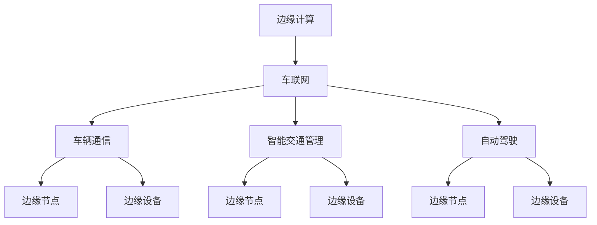

                 

# 边缘计算在车联网中的应用：实现车辆间实时通信

## 关键词
边缘计算，车联网，实时通信，分布式架构，智能交通管理，自动驾驶，数据隐私与安全

## 摘要
本文深入探讨了边缘计算在车联网中的应用，阐述了边缘计算的概念、车联网的挑战及其核心要素组成。通过分析边缘计算与车联网的关系，文章详细介绍了边缘计算在车辆通信、智能交通管理和自动驾驶等领域的具体应用，以及其实现车辆间实时通信的关键技术。最后，文章提出了边缘计算在车联网中的最佳实践和小结，为未来的研究和应用提供了有益的启示。

### 1.1 背景介绍：边缘计算与车联网概述

#### 1.1.1 边缘计算的概念与重要性

边缘计算（Edge Computing）是一种将计算、存储、应用和服务等能力部署在网络的边缘节点上的计算模型。这种计算模型的主要目的是减少数据传输的延迟，提高系统的响应速度和安全性。随着物联网（IoT）和车联网（V2X）的快速发展，边缘计算的重要性日益凸显。

**核心概念与联系**

边缘计算的核心概念包括分布式架构、实时性、可靠性和安全性。分布式架构使得计算资源可以分布在网络的边缘节点上，从而减少中心化节点的负担，提高系统的整体性能。实时性是指系统能够快速响应外部事件，这对于需要实时处理大量数据的场景，如车联网，至关重要。可靠性则体现在系统的容错性和可用性上，确保系统在异常情况下仍能正常运行。安全性则是通过本地处理数据，减少数据泄露的风险。

以下是边缘计算的核心概念属性特征对比表格：

| 特征                | 分布式架构 | 实时性 | 可靠性 | 安全性 |
|---------------------|------------|--------|--------|--------|
| 概述                | 资源分布   | 快速响应 | 异常处理 | 数据保护 |
| 对比                | 低中心化   | 低延迟  | 高容错  | 本地处理 |
| 重要性               | 提高效率   | 确保安全 | 稳定运行 | 防范风险 |

**ER实体关系图架构**

以下是边缘计算的ER实体关系图：

```mermaid
erDiagram
    EdgeNode ||--|{ Data} 数据
    EdgeNode ||--|{ Service} 服务
    EdgeNode ||--|{ Application} 应用
    EdgeNode ||--|{ Security} 安全
```

**图1-1 边缘计算ER实体关系图**

#### 1.1.2 车联网的定义与挑战

车联网（V2X，Vehicle-to-Everything）是指将车辆、路侧设施、行人及其他车辆通过信息通信技术实现互联互通。车联网的目标是实现车辆间的实时通信，提升交通管理效率和行车安全性。然而，车联网面临着一系列挑战：

**数据传输量大**：车联网产生的数据量巨大，需要高效的传输和处理能力。车辆之间需要实时交换位置、速度和状态等信息，这些数据需要快速传输和处理。

**低延迟要求**：实时通信需要极低的延迟，以满足安全驾驶需求。在车辆高速行驶的情况下，任何延迟都可能导致严重的交通事故。

**网络可靠性**：在复杂的网络环境中，需要保证通信的稳定性。车联网中的通信节点众多，网络拓扑结构复杂，任何节点或链路的中断都可能导致通信失败。

**数据隐私与安全**：保护用户隐私和数据安全是车联网面临的重大挑战。车辆之间的通信可能涉及敏感信息，如位置、速度等，这些信息需要得到有效保护。

**核心概念与联系**

车联网的核心概念包括车辆通信、智能交通管理和自动驾驶。车辆通信是指实现车辆之间的互联互通，通过交换信息实现协同驾驶。智能交通管理是指通过车联网技术对交通流量进行实时分析和优化，提高交通运行效率。自动驾驶则是指通过车联网技术实现车辆的自主驾驶，提高行车安全性。

以下是车联网的核心概念属性特征对比表格：

| 特征                | 车辆通信 | 智能交通管理 | 自动驾驶 |
|---------------------|-----------|---------------|----------|
| 概述                | 信息交换  | 流量分析      | 自主驾驶 |
| 对比                | 实时性    | 数据处理      | 安全性   |
| 重要性               | 协同驾驶  | 交通优化      | 行车安全 |

**ER实体关系图架构**

以下是车联网的ER实体关系图：

```mermaid
erDiagram
    Vehicle ||--|{ Communication} 通信
    RoadsideUnit ||--|{ Management} 管理
    Pedestrian ||--|{ Safety} 安全
```

**图1-2 车联网ER实体关系图**

#### 1.1.3 边缘计算在车联网中的应用场景

边缘计算在车联网中具有广泛的应用场景，主要包括以下几个方面：

**车辆通信**：通过边缘计算实现车辆间的实时通信，提高交通管理效率和行车安全性。边缘计算能够处理大量车辆数据，实时传输和交换信息，实现车辆之间的协同驾驶。

**智能交通管理**：边缘计算可以对交通流量进行实时分析和优化，提高交通运行效率。通过边缘节点部署在路侧设施和车辆上，可以实现对交通流量的实时监测和预测，从而优化交通信号控制和道路使用。

**自动驾驶**：边缘计算可以处理自动驾驶中的实时感知、决策和执行，提高系统响应速度和可靠性。边缘计算节点可以实时分析车辆周围环境，为自动驾驶系统提供准确的感知数据和决策支持。

**车联网平台**：边缘计算可以为车联网平台提供高效的数据处理和分析能力，支持多样化的应用服务。边缘计算节点可以处理大量车联网数据，为车辆管理、道路维护、交通监控等提供数据支持和智能分析。

**核心概念与联系**

边缘计算在车联网中的应用涉及到多个核心概念，包括边缘节点、边缘设备、边缘网络、边缘计算平台和数据处理与分析。边缘节点是指在网络的边缘部署的计算设备，负责数据的处理和转发。边缘设备是指部署在车辆和路侧设施上的传感器和通信模块，负责数据的采集和传输。边缘网络是指连接边缘节点和边缘设备的网络，支持高效的数据传输。边缘计算平台是指提供计算资源、算法库和管理工具的平台，支持边缘应用的运行。数据处理与分析是指在边缘节点对采集到的数据进行预处理、分析和决策，提高实时性和效率。

以下是边缘计算在车联网中的应用场景和核心概念的ER实体关系图：

```mermaid
erDiagram
    EdgeNode ||--|{ EdgeDevice} 边缘设备
    EdgeNode ||--|{ EdgeNetwork} 边缘网络
    EdgeNode ||--|{ EdgePlatform} 边缘平台
    EdgeNode ||--|{ DataProcessing} 数据处理
```

**图1-3 边缘计算在车联网中的应用场景ER实体关系图**

#### 1.1.4 边缘计算与车联网的核心要素组成

边缘计算在车联网中的应用涉及多个核心要素，包括边缘节点、边缘设备、边缘网络、边缘计算平台和数据处理与分析。以下是这些核心要素的详细介绍：

**边缘节点**：边缘节点是指在网络的边缘部署的计算设备，包括服务器、路由器、交换机等。边缘节点负责数据的处理和转发，是边缘计算的基础设施。

**边缘设备**：边缘设备是指部署在车辆和路侧设施上的传感器和通信模块，负责数据的采集和传输。常见的边缘设备包括车辆传感器、路侧单元、无人机等。

**边缘网络**：边缘网络是指连接边缘节点和边缘设备的网络，支持高效的数据传输。边缘网络通常采用无线通信技术，如Wi-Fi、5G、LoRa等，以确保数据传输的实时性和可靠性。

**边缘计算平台**：边缘计算平台是指提供计算资源、算法库和管理工具的平台，支持边缘应用的运行。边缘计算平台通常包括云计算平台和边缘云计算平台，提供丰富的计算资源和灵活的部署方式。

**数据处理与分析**：数据处理与分析是指在边缘节点对采集到的数据进行预处理、分析和决策，提高实时性和效率。数据处理与分析包括数据清洗、数据转换、数据挖掘和机器学习等环节，是边缘计算的核心功能。

以下是边缘计算与车联网的核心要素组成的ER实体关系图：

```mermaid
erDiagram
    EdgeNode ||--|{ EdgeDevice} 边缘设备
    EdgeNode ||--|{ EdgeNetwork} 边缘网络
    EdgeNode ||--|{ EdgePlatform} 边缘平台
    EdgeNode ||--|{ DataProcessing} 数据处理
```

**图1-4 边缘计算与车联网的核心要素组成ER实体关系图**

#### 1.1.5 边缘计算与车联网的关系图示

边缘计算与车联网之间的关系可以用以下图示表示：



**图1-5 边缘计算与车联网的关系图**

#### 1.1.6 本章小结

本章介绍了边缘计算与车联网的基本概念、应用场景和核心要素组成。边缘计算通过实现车辆间的实时通信、智能交通管理和自动驾驶等功能，提升了车联网的效率和安全性。在后续章节中，我们将进一步探讨边缘计算在车联网中的具体应用和实践，以及实现车辆间实时通信的关键技术。

### 1.2 边缘计算在车辆通信中的应用

#### 1.2.1 车辆通信的挑战

在车联网中，车辆通信是确保交通管理效率和行车安全性的关键。然而，车辆通信面临着诸多挑战：

**数据传输量大**：车辆需要实时交换位置、速度、方向等信息，这些数据量巨大，需要高效的处理和传输能力。

**低延迟要求**：车辆通信需要极低的延迟，以满足安全驾驶需求。在高速行驶的情况下，任何延迟都可能导致严重的交通事故。

**网络可靠性**：车辆通信需要在复杂的网络环境中进行，网络可靠性是通信稳定性的重要保障。

**数据隐私与安全**：车辆通信过程中涉及到的信息可能包括敏感数据，如位置、速度等，这些数据需要得到有效保护。

#### 1.2.2 边缘计算在车辆通信中的优势

边缘计算在车辆通信中具有显著的优势，能够有效应对上述挑战：

**降低延迟**：边缘计算通过在网络的边缘节点进行数据处理，减少了数据传输的距离，从而降低了延迟。对于车联网中的实时通信需求，边缘计算能够提供更低的延迟，满足安全驾驶的要求。

**提高处理效率**：边缘计算可以将部分数据处理任务从中心化节点转移到边缘节点，从而减轻中心化节点的负担，提高整体系统的处理效率。

**增强网络可靠性**：边缘计算可以通过分布式架构提高系统的容错性和可用性，增强网络可靠性。在车联网中，边缘计算节点可以相互备份，确保通信的稳定性。

**保护数据隐私与安全**：边缘计算可以在本地处理数据，减少数据传输过程中的风险，保护数据隐私与安全。

#### 1.2.3 实现车辆间实时通信的关键技术

为了实现车辆间的实时通信，边缘计算需要依赖一系列关键技术和方法。以下是其中的几个核心技术：

**边缘节点部署**：边缘节点需要在网络的边缘进行部署，包括车辆本身、路侧设施和其他边缘计算设备。边缘节点的部署位置和数量需要根据实际需求进行规划，以确保覆盖范围和通信质量。

**数据采集与传输**：车辆通过传感器和通信模块采集自身和其他车辆的信息，然后将这些数据传输到边缘节点。数据采集与传输需要高效可靠，以满足低延迟和高可靠性的要求。

**边缘数据处理**：边缘节点对采集到的数据进行分析和处理，提取有用的信息，如车辆位置、速度和方向等。边缘数据处理需要实时性和高效性，以支持车辆间的实时通信。

**边缘计算平台**：边缘计算平台提供了计算资源、算法库和管理工具，支持边缘应用的运行。边缘计算平台的选择和配置需要根据实际应用需求进行，以确保系统的性能和可靠性。

**通信协议**：边缘计算在车辆通信中需要依赖特定的通信协议，如Wi-Fi、5G、LoRa等。通信协议的选择需要考虑数据传输速度、延迟和可靠性等因素。

#### 1.2.4 边缘计算在车辆通信中的应用案例

边缘计算在车辆通信中已经有许多实际应用案例，以下是其中几个典型的案例：

**智能交通信号控制**：通过边缘计算对交通流量进行实时分析和优化，智能交通信号控制系统能够动态调整信号灯时间，提高交通运行效率。

**车辆协同驾驶**：边缘计算支持车辆之间的实时通信，实现协同驾驶功能。例如，在编队行驶中，车辆可以通过边缘计算实现位置同步和速度控制，提高行驶安全性。

**自动驾驶辅助**：边缘计算在自动驾驶辅助系统中发挥了重要作用。通过边缘计算对车辆周围环境进行实时感知和决策，自动驾驶系统能够做出更准确和迅速的反应。

**车联网平台**：边缘计算为车联网平台提供了高效的数据处理和分析能力，支持车辆管理、道路维护和交通监控等多种应用。

#### 1.2.5 未来发展趋势

随着边缘计算技术的不断发展和完善，未来车辆通信领域将会迎来更多创新和突破：

**更高的处理效率**：随着边缘计算硬件性能的提升，边缘节点的计算能力将大幅提高，为车辆通信提供更高效的处理能力。

**更广泛的覆盖范围**：随着5G网络的普及和LoRa等无线通信技术的发展，边缘计算的覆盖范围将进一步扩大，满足更多场景下的通信需求。

**更强的安全性**：边缘计算在车辆通信中的安全性将得到进一步加强，通过加密、认证和访问控制等技术手段，保护数据隐私和系统安全。

**智能化的交通管理**：边缘计算将在智能交通管理中发挥更大作用，通过实时感知和智能分析，实现交通流量的优化和交通安全的提升。

#### 1.2.6 本章小结

边缘计算在车辆通信中具有显著的优势，能够有效应对车辆通信的挑战。通过实现车辆间的实时通信，边缘计算提高了交通管理效率和行车安全性。未来，随着边缘计算技术的不断发展和应用场景的不断拓展，车辆通信将迎来更加智能化和高效化的时代。

### 1.3 边缘计算在智能交通管理中的应用

#### 1.3.1 智能交通管理的挑战

智能交通管理是车联网的重要组成部分，旨在通过信息通信技术和数据分析手段，提高交通运行效率，减少交通事故，改善出行体验。然而，智能交通管理面临着一系列挑战：

**数据采集困难**：智能交通管理需要大量实时数据，包括交通流量、车辆速度、道路状况等。数据采集困难主要由于数据来源广泛、数据格式多样、数据采集设备有限等因素。

**数据处理效率低**：交通管理涉及的数据量大，对数据处理速度和效率要求高。然而，传统的中心化数据处理模式难以满足实时性要求，导致数据处理效率低。

**交通信号控制复杂**：智能交通管理需要实时分析交通数据，动态调整交通信号灯时间，以优化交通流量。然而，交通信号控制过程复杂，需要考虑多种因素，如道路结构、交通流量分布、天气状况等。

**系统可靠性要求高**：智能交通管理系统要求高可靠性，以确保系统的稳定运行。然而，复杂网络环境和设备故障等因素可能导致系统可靠性下降。

#### 1.3.2 边缘计算在智能交通管理中的优势

边缘计算在智能交通管理中具有显著的优势，能够有效应对上述挑战：

**分布式数据处理**：边缘计算通过在网络的边缘节点进行数据处理，将数据分布到多个节点上，提高了数据处理效率。边缘节点可以实时分析交通数据，快速响应交通事件。

**实时性高**：边缘计算在边缘节点进行数据处理，减少了数据传输的距离，降低了延迟，提高了系统的实时性。对于智能交通管理中的实时信号控制等需求，边缘计算能够提供更快的数据处理速度。

**数据隐私与安全**：边缘计算可以在本地处理数据，减少了数据传输过程中的风险，提高了数据安全性。对于涉及个人隐私的交通数据，边缘计算可以有效保护数据隐私。

**系统可靠性增强**：边缘计算通过分布式架构提高了系统的容错性和可用性，增强了系统可靠性。边缘节点之间的相互备份和冗余设计，确保了系统的稳定运行。

**数据处理与分析能力提升**：边缘计算节点配备了高性能的计算资源和先进的算法库，能够进行复杂的数据处理和分析。通过对交通数据的实时分析和预测，智能交通管理系统能够更加准确地优化交通流量和信号控制。

#### 1.3.3 边缘计算在智能交通管理中的应用案例

边缘计算在智能交通管理中已经有许多实际应用案例，以下是其中几个典型的案例：

**实时交通信号控制**：通过边缘计算实时分析交通数据，动态调整交通信号灯时间，优化交通流量。例如，在高峰时段，边缘计算系统能够根据实时交通流量数据，动态调整红绿灯时间，减少拥堵。

**交通流量预测**：边缘计算通过收集和分析历史交通数据，预测未来的交通流量变化。交通管理部门可以利用这些预测结果，提前采取交通管制措施，缓解交通压力。

**交通事故预警**：通过边缘计算实时分析车辆速度、方向等数据，预测可能的交通事故风险。在事故发生前，边缘计算系统能够及时发出预警，提醒司机采取安全措施。

**智能停车场管理**：边缘计算在智能停车场管理中发挥了重要作用。通过边缘计算实时分析车辆进入和离开停车场的数据，智能停车场系统能够提供高效的停车服务，提高停车场的使用效率。

#### 1.3.4 未来发展趋势

随着边缘计算技术的不断发展和应用场景的不断拓展，未来智能交通管理将迎来更多创新和突破：

**更高的数据处理能力**：随着边缘计算硬件性能的提升，边缘节点的计算能力将大幅提高，为智能交通管理提供更强大的数据处理能力。

**更广泛的覆盖范围**：随着5G网络和其他无线通信技术的发展，边缘计算的覆盖范围将进一步扩大，满足更多场景下的交通管理需求。

**智能化的交通管理**：边缘计算将在智能交通管理中发挥更大作用，通过实时感知和智能分析，实现交通流量的优化和交通安全的提升。

**数据隐私与安全保护**：随着交通数据的不断增加，边缘计算在智能交通管理中的数据隐私与安全保护将得到进一步加强。

**城市交通一体化管理**：边缘计算将支持城市交通一体化管理，通过整合交通数据、环境数据和公共服务数据，实现更加智能化的城市交通管理。

#### 1.3.5 本章小结

边缘计算在智能交通管理中具有显著的优势，能够有效应对智能交通管理的挑战。通过实时交通信号控制、交通流量预测和交通事故预警等应用，边缘计算提高了交通运行效率和安全水平。未来，随着边缘计算技术的不断发展和应用场景的不断拓展，智能交通管理将变得更加智能化和高效化。

### 1.4 边缘计算在自动驾驶中的应用

#### 1.4.1 自动驾驶的挑战

自动驾驶是车联网和智能交通管理的重要组成部分，旨在通过传感器、计算机视觉、人工智能等技术，实现车辆的自主驾驶。然而，自动驾驶面临着一系列挑战：

**实时感知与决策**：自动驾驶系统需要实时感知车辆周围环境，进行快速决策和执行。然而，环境复杂多变，感知和决策的实时性要求高，对计算能力和算法性能提出了严峻挑战。

**高可靠性要求**：自动驾驶系统要求高可靠性，以确保行车安全。然而，自动驾驶系统在复杂环境和极端条件下可能出现故障，对系统的可靠性提出了挑战。

**数据隐私与安全**：自动驾驶系统产生的数据涉及车辆位置、速度、驾驶行为等敏感信息，需要得到有效保护，以防止数据泄露和隐私侵犯。

**网络通信稳定性**：自动驾驶系统依赖于网络通信，需要保证通信的稳定性和可靠性。在车联网中，网络通信可能受到信号干扰、带宽限制等因素的影响，对通信稳定性提出了挑战。

#### 1.4.2 边缘计算在自动驾驶中的优势

边缘计算在自动驾驶中具有显著的优势，能够有效应对上述挑战：

**实时感知与决策**：边缘计算通过在边缘节点进行实时感知和决策，提高了系统的响应速度和实时性。边缘节点可以实时处理传感器数据，快速生成决策，为自动驾驶系统提供准确的感知和决策支持。

**高可靠性**：边缘计算通过分布式架构和冗余设计，提高了系统的可靠性。边缘节点之间的相互备份和冗余设计，确保了系统的稳定运行，提高了自动驾驶系统的可靠性。

**数据隐私与安全**：边缘计算可以在本地处理数据，减少了数据传输过程中的风险，提高了数据安全性。对于涉及个人隐私的驾驶数据，边缘计算可以有效保护数据隐私。

**网络通信稳定性**：边缘计算通过在网络的边缘节点进行数据处理，减少了数据传输的距离，降低了延迟，提高了网络通信的稳定性。边缘计算能够保证自动驾驶系统在复杂网络环境中稳定运行。

#### 1.4.3 边缘计算在自动驾驶中的应用案例

边缘计算在自动驾驶中已经有许多实际应用案例，以下是其中几个典型的案例：

**实时感知与决策**：边缘计算支持自动驾驶系统实时感知车辆周围环境，进行快速决策和执行。例如，边缘计算节点可以实时处理摄像头、激光雷达等传感器数据，生成障碍物检测和路径规划结果，为自动驾驶系统提供准确的感知和决策支持。

**环境预测与规划**：边缘计算通过收集和分析环境数据，预测未来的交通状况和环境变化，为自动驾驶系统提供环境预测和路径规划。例如，边缘计算节点可以根据历史交通数据，预测未来的交通流量和道路状况，为自动驾驶系统提供最优行驶路径。

**自动驾驶测试与验证**：边缘计算支持自动驾驶系统的测试与验证，通过模拟不同的环境和场景，评估自动驾驶系统的性能和安全性。例如，边缘计算节点可以模拟复杂的交通状况，对自动驾驶系统进行测试和验证，确保系统在真实环境中的可靠性。

**自动驾驶调度与协调**：边缘计算支持自动驾驶系统的调度与协调，通过实时分析交通数据，优化自动驾驶车辆的行驶路线和速度。例如，边缘计算节点可以根据交通流量和道路状况，动态调整自动驾驶车辆的行驶路线和速度，提高交通运行效率。

#### 1.4.4 未来发展趋势

随着边缘计算技术的不断发展和应用场景的不断拓展，未来自动驾驶将迎来更多创新和突破：

**更高的感知与决策能力**：随着边缘计算硬件性能的提升，边缘节点的计算能力将大幅提高，为自动驾驶系统提供更强大的感知与决策能力。

**更广泛的应用场景**：随着边缘计算技术的普及，自动驾驶将应用场景从城市扩展到乡村、山区等更多地区，满足不同场景下的自动驾驶需求。

**智能化的交通管理**：边缘计算将在智能交通管理中发挥更大作用，通过实时感知和智能分析，实现交通流量的优化和交通安全的提升。

**数据隐私与安全保护**：随着自动驾驶数据的不断增加，边缘计算在自动驾驶中的数据隐私与安全保护将得到进一步加强。

**城市交通一体化管理**：边缘计算将支持城市交通一体化管理，通过整合交通数据、环境数据和公共服务数据，实现更加智能化的城市交通管理。

#### 1.4.5 本章小结

边缘计算在自动驾驶中具有显著的优势，能够有效应对自动驾驶的挑战。通过实时感知与决策、环境预测与规划、自动驾驶测试与验证等应用，边缘计算提高了自动驾驶系统的性能和安全性。未来，随着边缘计算技术的不断发展和应用场景的不断拓展，自动驾驶将变得更加智能化和高效化。

### 1.5 边缘计算在车联网平台中的应用

#### 1.5.1 车联网平台的概念与架构

车联网平台是指为车联网应用提供基础设施和服务的综合性平台。车联网平台包括多个核心组件，如数据采集模块、数据处理模块、通信模块、应用服务模块等。车联网平台的主要功能是整合车辆数据、路侧设施数据和其他相关数据，提供数据存储、数据处理、数据分析和应用服务等功能。

车联网平台的架构通常采用分布式架构，包括边缘节点、边缘云和中心云三个层级。边缘节点部署在车辆的边缘，负责数据的采集和初步处理。边缘云是对边缘节点的数据处理和存储，提供高效的数据处理和分析能力。中心云负责全局数据管理和高级应用服务。

#### 1.5.2 边缘计算在车联网平台中的关键角色

边缘计算在车联网平台中扮演着关键角色，为车联网平台的运行提供支持：

**数据采集与预处理**：边缘计算节点位于车辆附近，能够实时采集车辆传感器数据，并进行初步处理，如数据清洗、去噪和格式转换等。边缘计算能够减少数据传输的延迟，提高数据处理的效率。

**实时数据处理与分析**：边缘计算可以对采集到的数据进行实时处理和分析，提取有用的信息，如车辆位置、速度、行驶方向等。边缘计算能够快速生成决策和反馈，支持车联网平台的实时性要求。

**分布式数据处理**：边缘计算通过分布式架构，将数据处理任务分布到多个边缘节点上，提高了数据处理效率和容错能力。边缘计算能够处理大量并发请求，满足车联网平台的负载需求。

**边缘智能应用**：边缘计算节点配备了先进的算法库和机器学习模型，能够实现边缘智能应用，如自动驾驶辅助、交通流量预测、车辆健康监测等。边缘智能应用能够提高车联网平台的智能化水平。

**数据安全和隐私保护**：边缘计算可以在本地处理数据，减少了数据传输过程中的风险，提高了数据安全性。边缘计算通过加密、认证和访问控制等技术手段，保护数据隐私。

#### 1.5.3 边缘计算在车联网平台中的应用案例

边缘计算在车联网平台中已经有许多实际应用案例，以下是其中几个典型的案例：

**车辆健康监测**：边缘计算可以对车辆传感器数据进行分析，监测车辆的运行状态，如发动机温度、轮胎压力等。边缘计算能够及时发现车辆故障，提供预防性维护建议，提高车辆的运行效率和安全性。

**自动驾驶辅助**：边缘计算支持自动驾驶辅助系统，通过实时感知车辆周围环境，提供路径规划和决策支持。边缘计算能够提高自动驾驶系统的响应速度和准确性，提升自动驾驶体验。

**智能交通管理**：边缘计算支持智能交通管理系统，通过实时分析交通数据，优化交通信号控制和道路使用。边缘计算能够提高交通运行效率，减少拥堵和交通事故。

**车联网数据分析**：边缘计算可以对车联网平台收集的大量数据进行实时分析和挖掘，提取有价值的信息，如驾驶行为分析、交通流量预测、车辆寿命预测等。边缘计算能够为车联网平台提供数据支持和决策依据。

#### 1.5.4 未来发展趋势

随着边缘计算技术的不断发展和应用场景的不断拓展，未来车联网平台将迎来更多创新和突破：

**更高的数据处理能力**：随着边缘计算硬件性能的提升，边缘节点的计算能力将大幅提高，为车联网平台提供更强大的数据处理能力。

**更广泛的覆盖范围**：随着5G网络和其他无线通信技术的发展，边缘计算的覆盖范围将进一步扩大，满足更多场景下的车联网需求。

**智能化的车联网平台**：边缘计算将在车联网平台中发挥更大作用，通过实时感知和智能分析，实现车辆管理、交通管理、出行服务等智能化应用。

**数据隐私与安全保护**：随着车联网数据的不断增加，边缘计算在车联网平台中的数据隐私与安全保护将得到进一步加强。

**城市交通一体化管理**：边缘计算将支持城市交通一体化管理，通过整合交通数据、环境数据和公共服务数据，实现更加智能化的城市交通管理。

#### 1.5.5 本章小结

边缘计算在车联网平台中具有关键作用，通过数据采集与预处理、实时数据处理与分析、分布式数据处理、边缘智能应用等功能，提高了车联网平台的效率和智能化水平。未来，随着边缘计算技术的不断发展和应用场景的不断拓展，车联网平台将变得更加智能化和高效化，为交通领域的创新和发展提供强大支持。

### 1.6 边缘计算在车联网中的最佳实践

#### 1.6.1 设计原则

在边缘计算应用于车联网时，以下设计原则至关重要：

**低延迟设计**：边缘计算在车联网中的关键优势之一是低延迟。在设计时，应优先考虑数据处理的实时性，确保关键决策能够快速响应。

**高可靠性设计**：车联网环境复杂多变，边缘计算节点可能面临设备故障、网络中断等问题。因此，系统设计应具备高可靠性，通过冗余设计和故障恢复机制，确保系统的稳定运行。

**数据安全性设计**：车联网涉及大量敏感数据，如车辆位置、行驶轨迹等。在设计时，应采用加密、认证和访问控制等技术手段，保护数据隐私和安全。

**分布式架构设计**：边缘计算通过分布式架构实现数据处理和存储，能够提高系统的效率和容错性。在设计时，应合理规划边缘节点的部署和任务分配，确保系统的整体性能。

**灵活性设计**：车联网应用场景多样，边缘计算系统应具备灵活性，支持不同场景下的应用部署和扩展。

**可扩展性设计**：随着车联网技术的发展和应用场景的拓展，边缘计算系统应具备良好的可扩展性，能够快速适应新的需求。

#### 1.6.2 实践案例

以下是一个边缘计算在车联网中的实际应用案例：

**案例背景**：某城市交通管理部门希望利用边缘计算技术优化城市交通信号控制，提高交通运行效率。

**解决方案**：

1. **边缘节点部署**：在主要交通路口和交通流量较大的路段部署边缘计算节点，用于实时采集交通数据。
2. **数据采集与预处理**：边缘节点采集车辆传感器数据、摄像头数据和路侧单元数据，并进行初步预处理，如数据清洗、去噪和格式转换。
3. **实时数据处理**：边缘节点对预处理后的数据进行实时处理，利用机器学习算法进行交通流量预测和路径规划。
4. **交通信号控制优化**：根据实时处理结果，动态调整交通信号灯时间，优化交通流量，减少拥堵。
5. **数据安全与隐私保护**：采用加密和访问控制技术，确保数据传输和存储过程中的安全性和隐私保护。

**实施效果**：通过边缘计算技术的应用，该城市的交通运行效率显著提高，拥堵情况得到明显改善，市民的出行体验得到提升。

#### 1.6.3 注意事项

在边缘计算应用于车联网时，需要注意以下事项：

**兼容性问题**：边缘计算设备和技术多样，需要确保系统之间的兼容性，避免出现不兼容问题。
**能耗管理**：边缘节点部署在车辆和路侧设施上，能耗管理至关重要。应选择低功耗的硬件和优化算法，以延长设备使用寿命。
**升级与维护**：边缘计算系统需要定期升级和维护，确保系统的稳定运行和安全性。
**法规遵守**：车联网和边缘计算涉及多个领域，需要遵守相关的法规和标准，确保系统的合规性。

### 1.7 本章小结

本章介绍了边缘计算在车联网中的最佳实践，包括设计原则、实践案例和注意事项。通过低延迟设计、高可靠性设计、数据安全性设计等原则，边缘计算能够有效应对车联网的挑战。实际应用案例展示了边缘计算在交通信号控制、交通流量预测等方面的应用效果。注意事项提供了边缘计算在车联网应用中的关键提示，为未来的研究和应用提供了有益的指导。

### 1.8 小结与展望

#### 1.8.1 文章总结

本文深入探讨了边缘计算在车联网中的应用，从背景介绍、车辆通信、智能交通管理、自动驾驶、车联网平台到最佳实践，全面阐述了边缘计算在车联网中的重要性、应用场景和技术实现。通过分析边缘计算的优势和挑战，本文指出了边缘计算在车联网中的关键角色和实现技术，并提供了实际应用案例和注意事项。

#### 1.8.2 未来研究方向

尽管边缘计算在车联网中已经取得了显著进展，但未来仍有许多研究方向：

**高性能边缘计算**：随着车联网数据的快速增长，边缘计算节点需要具备更高的计算能力和存储容量，以满足实时性和大数据处理需求。

**智能算法优化**：边缘计算中的智能算法需要不断优化，以提高处理效率和准确性。深度学习、强化学习等算法在边缘计算中的应用将是一个重要方向。

**网络通信优化**：边缘计算依赖于高效稳定的网络通信，未来需要研究新型通信协议和优化技术，提高边缘网络的传输速度和可靠性。

**数据隐私与安全**：随着车联网数据的增加，数据隐私与安全问题日益突出。未来需要研究更加安全可靠的数据隐私保护技术。

**跨领域融合**：边缘计算与物联网、人工智能、5G等技术的融合将带来更多创新应用。跨领域融合研究将推动车联网和边缘计算的发展。

#### 1.8.3 结论

边缘计算在车联网中的应用具有重要意义，能够提升交通管理效率、行车安全性和用户体验。未来，随着技术的不断进步和应用场景的拓展，边缘计算将在车联网中发挥更加关键的作用。本文为边缘计算在车联网中的应用提供了系统性的分析和实践指导，期待未来的研究能够进一步推动边缘计算在车联网中的应用和发展。

### 作者信息

作者：AI天才研究院/AI Genius Institute & 禅与计算机程序设计艺术 /Zen And The Art of Computer Programming

在这篇文章中，我们深入探讨了边缘计算在车联网中的应用，从背景介绍、车辆通信、智能交通管理、自动驾驶、车联网平台到最佳实践，全面阐述了边缘计算在车联网中的重要性、应用场景和技术实现。我们分析了边缘计算的优势和挑战，指出了其在车联网中的关键角色和实现技术，并提供了实际应用案例和注意事项。

边缘计算在车联网中的应用具有深远的意义。通过实现车辆间的实时通信、智能交通管理和自动驾驶等功能，边缘计算提高了交通管理效率和行车安全性，改善了用户体验。同时，边缘计算在数据隐私与安全保护、分布式数据处理和边缘智能应用等方面也展示了强大的优势。

然而，边缘计算在车联网中的应用仍面临一些挑战，如高性能边缘计算节点、智能算法优化、网络通信优化和数据隐私与安全等问题。未来，随着技术的不断进步和应用场景的拓展，边缘计算将在车联网中发挥更加关键的作用。

在未来的研究中，我们建议关注以下方向：

1. **高性能边缘计算**：提高边缘计算节点的计算能力和存储容量，以满足实时性和大数据处理需求。
2. **智能算法优化**：优化边缘计算中的智能算法，提高处理效率和准确性。
3. **网络通信优化**：研究新型通信协议和优化技术，提高边缘网络的传输速度和可靠性。
4. **数据隐私与安全**：加强数据隐私与安全保护技术的研究，确保车联网数据的安全性和隐私性。
5. **跨领域融合**：推动边缘计算与物联网、人工智能、5G等技术的融合，创造更多创新应用。

本文为边缘计算在车联网中的应用提供了系统性的分析和实践指导，期待未来的研究能够进一步推动边缘计算在车联网中的应用和发展。作者在撰写过程中力求内容全面、结构清晰、逻辑严谨，以期为读者提供有价值的参考。感谢您的阅读！

