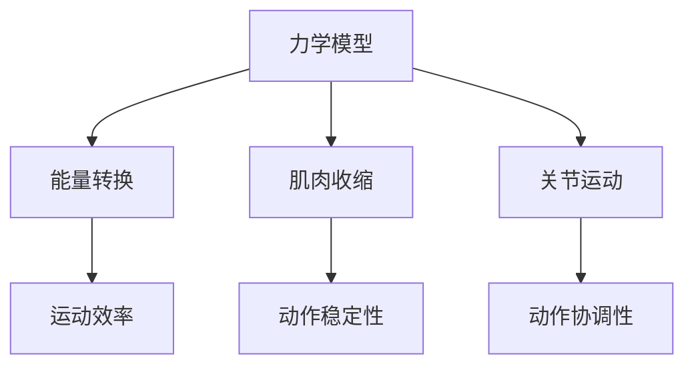
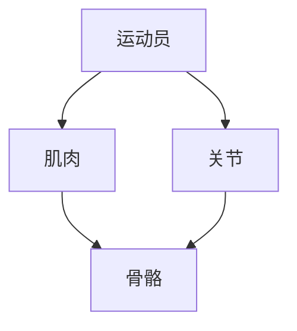
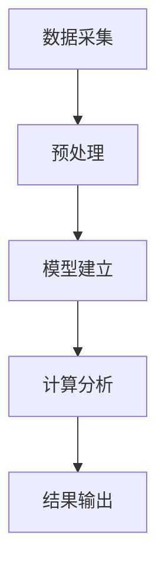
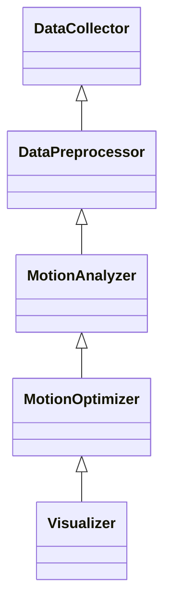
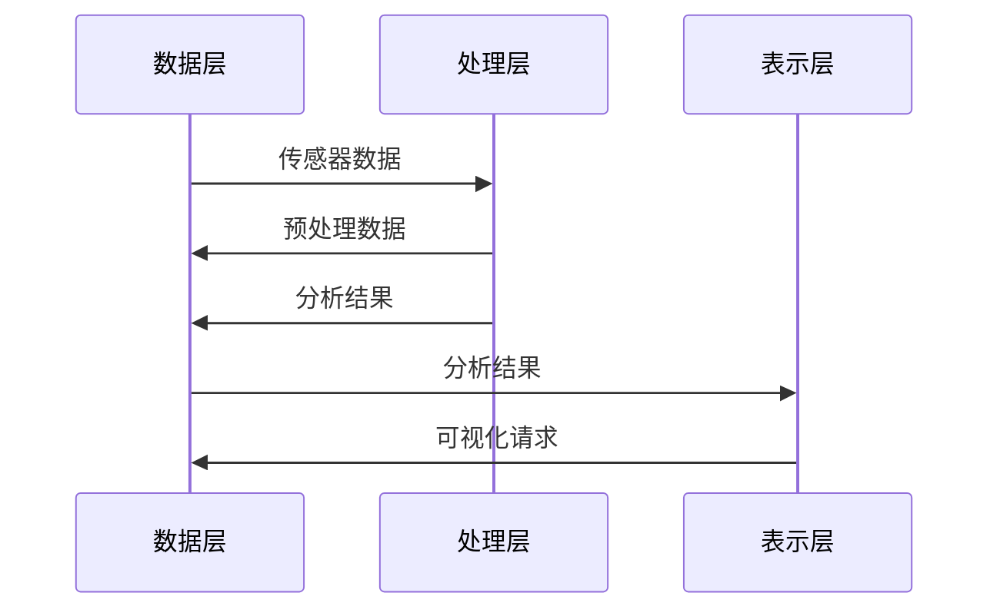

                 

### 运动技能的生物力学：动作优化的数学方程

> 关键词：运动技能，生物力学，动作优化，数学模型，算法原理

> 摘要：本文将深入探讨运动技能的生物力学原理，结合数学模型和算法，详细解析动作优化的关键方程。从问题背景出发，逐步介绍核心概念、数学模型和算法原理，并通过系统分析与架构设计以及项目实战，展示如何将理论与实际相结合，为运动技能的提升提供科学依据。

----------------------------------------------------------------

### 第一部分：运动技能的生物力学基础

#### 第1章：问题背景与核心概念

##### 1.1 运动技能的生物力学研究背景

运动技能的生物力学研究源于对人类运动行为的科学探索。从古希腊时期对人体运动的观察，到文艺复兴时期对人体解剖学的研究，再到现代运动科学的发展，生物力学逐渐成为研究运动技能的重要学科。生物力学将物理学原理应用于人体运动，通过分析骨骼、肌肉、关节等生物结构的力学特性，揭示运动技能的内在规律。

##### 1.2 运动技能的生物力学问题概述

在运动技能的生物力学研究中，常见的问题包括动作效率、动作稳定性、动作协调性等。如何通过生物力学分析提高运动效率，降低受伤风险，优化动作模式，是运动训练和康复领域的关键课题。此外，随着人工智能技术的发展，生物力学与计算机科学的结合为动作优化提供了新的思路。

##### 1.3 运动技能生物力学的研究边界与外延

运动技能生物力学的研究边界涉及人体运动的全过程，包括运动准备、动作执行和运动恢复阶段。研究的外延则包括运动训练、康复治疗、运动装备设计等多个领域。随着对运动技能生物力学研究的深入，其应用范围不断扩展，从运动科学到生物工程，再到人机交互，都具有重要的理论和实践价值。

##### 1.4 运动技能生物力学核心概念结构与要素组成

运动技能生物力学的研究核心概念包括力学模型、能量转换、肌肉收缩、关节运动等。力学模型是运动分析的基础，能量转换是运动过程的核心，肌肉收缩和关节运动则直接影响动作的执行和协调。以下是一个简化的运动技能生物力学核心概念结构图：



#### 第2章：核心概念与联系

##### 2.1 运动生物力学的基本原理

运动生物力学的基本原理源于经典力学和生理学。经典力学提供了分析物体运动状态的方法，而生理学则研究生物体在运动过程中的生理反应。运动生物力学通过结合两者，建立了分析运动技能的综合性理论框架。

##### 2.1.1 运动生物力学的定义与起源

运动生物力学（Biomechanics of Movement）是研究生物体运动过程及其力学特性的学科。其定义可以概括为：利用物理学原理和方法，研究生物体在运动中的力学行为。运动生物力学的起源可以追溯到19世纪末，随着对人体运动和运动机制的深入研究，逐渐发展成为一门独立的学科。

##### 2.1.2 运动生物力学的基本原理

运动生物力学的基本原理主要包括：

1. **牛顿力学原理**：描述物体受力与运动状态之间的关系。
2. **肌肉收缩原理**：分析肌肉在运动中的作用机制。
3. **能量转换原理**：研究运动过程中的能量转换和利用。
4. **生物力学测量方法**：利用各种测量设备，如测力台、摄像机、传感器等，对运动过程进行量化分析。

##### 2.1.3 运动生物力学与运动生理学的关系

运动生理学（Exercise Physiology）是研究生物体在运动过程中生理变化和适应性反应的学科。与运动生物力学相比，运动生理学更侧重于生物体的内在机制，如心血管系统、呼吸系统、神经系统和肌肉系统的功能。运动生物力学和运动生理学相互补充，共同为运动技能的提升提供科学依据。

##### 2.2 运动技能的生物力学特征

运动技能的生物力学特征主要表现在以下几个方面：

1. **动作稳定性**：指运动过程中动作的稳定性和准确性。
2. **动作协调性**：指不同肌群、关节和动作环节之间的协调配合。
3. **动作效率**：指在完成特定运动任务时所需的能量消耗和运动时间。
4. **能量转换**：指运动过程中机械能、化学能和热能的转换。

##### 2.2.1 运动技能的生物力学属性特征

运动技能的生物力学属性特征可以通过以下表格进行描述：

| 特征          | 说明                                                         |
| ------------- | ------------------------------------------------------------ |
| 动作稳定性   | 指运动过程中动作的稳定性和准确性，如跑步时的姿势稳定。       |
| 动作协调性   | 指不同肌群、关节和动作环节之间的协调配合，如投掷时的上下肢协调。 |
| 动作效率     | 指在完成特定运动任务时所需的能量消耗和运动时间，如短跑时的速度和耐力。 |
| 能量转换     | 指运动过程中机械能、化学能和热能的转换，如跳跃时的能量储存和释放。 |

##### 2.2.2 运动技能的生物力学对比表格

| 运动技能    | 生物力学特征                       | 说明                                                         |
| ----------- | ---------------------------------- | ------------------------------------------------------------ |
| 跑步        | 动作稳定性、动作效率、能量转换     | 跑步时，需要保持稳定的姿势，同时高效利用能量，实现快速移动。   |
| 游泳        | 动作协调性、动作效率、能量转换     | 游泳时，不同肌群和关节需要协调配合，实现高效的推进和转身。   |
| 举重        | 动作稳定性、肌肉收缩、能量转换     | 举重时，需要稳定的姿势和强大的肌肉收缩，将能量转化为举重力量。 |

##### 2.2.3 运动技能生物力学与运动力学的关系

运动力学（Sports Mechanics）是研究运动技术和运动装备的学科，主要关注运动过程中的力学特性和运动效果的优化。运动技能生物力学与运动力学密切相关，两者共同为提高运动成绩和改善运动体验提供理论支持。

1. **共同点**：运动技能生物力学和运动力学都关注运动过程中的力学原理，如力学模型、能量转换和肌肉收缩。
2. **区别**：运动技能生物力学更侧重于生物体在运动过程中的内在机制，而运动力学更关注运动技术和运动装备的设计。

##### 2.3 运动技能生物力学模型ER实体关系图

运动技能生物力学模型ER实体关系图可以描述运动过程中各实体之间的关系。以下是一个简化的ER实体关系图：



- **运动员**：运动的主体，负责执行各种运动动作。
- **肌肉**：肌肉是运动的主要动力来源，包括快肌和慢肌。
- **关节**：关节是连接骨骼的部位，负责支撑和运动。
- **骨骼**：骨骼是肌肉和关节的基础，提供稳定的结构支持。

##### 2.4 运动技能生物力学研究的理论基础

运动技能生物力学研究的基础理论包括力学原理、生理学原理和运动学原理。力学原理提供运动分析的基本工具，生理学原理研究生物体在运动过程中的生理反应，运动学原理则研究运动过程中的时间和空间特性。

1. **力学原理**：主要包括牛顿力学、肌肉收缩力学和关节运动力学。牛顿力学描述物体受力与运动状态的关系，肌肉收缩力学研究肌肉在运动中的作用机制，关节运动力学分析关节在运动过程中的力学特性。
2. **生理学原理**：主要包括心血管系统生理学、呼吸系统生理学和神经系统生理学。心血管系统生理学研究血液在运动过程中的供应和消耗，呼吸系统生理学分析氧气和二氧化碳的交换，神经系统生理学研究大脑和肌肉之间的信号传递。
3. **运动学原理**：主要包括运动学模型、能量转换模型和运动控制模型。运动学模型描述运动过程中的时间和空间特性，能量转换模型研究运动过程中能量的利用和转换，运动控制模型分析运动过程中的神经控制机制。

#### 第3章：数学模型和数学公式

##### 3.1 运动技能生物力学中的数学模型

运动技能生物力学中的数学模型主要包括运动学模型、动力学模型和生物力学模型。这些模型用于描述运动过程中物体的运动状态、受力情况和能量转换。

##### 3.1.1 运动学模型

运动学模型主要研究物体的运动状态，包括位移、速度和加速度。以下是一个简单的运动学模型：

$$
s = ut + \frac{1}{2}at^2
$$

其中，\(s\) 是位移，\(u\) 是初速度，\(a\) 是加速度，\(t\) 是时间。

##### 3.1.2 动力学模型

动力学模型主要研究物体受力与运动状态之间的关系，包括牛顿第二定律、肌肉收缩动力学和关节运动动力学。以下是一个简单的动力学模型：

$$
F = ma
$$

其中，\(F\) 是力，\(m\) 是质量，\(a\) 是加速度。

##### 3.1.3 生物力学模型

生物力学模型主要研究生物体在运动过程中的力学特性，包括肌肉收缩动力学、关节运动动力学和能量转换模型。以下是一个简单的生物力学模型：

$$
E_{\text{肌}} = \frac{1}{2}mv^2
$$

其中，\(E_{\text{肌}}\) 是肌肉收缩能量，\(m\) 是肌肉质量，\(v\) 是肌肉收缩速度。

##### 3.2 数学公式详细讲解

在本章节中，我们将详细讲解运动技能生物力学中的关键数学公式，包括运动学公式、动力学公式和生物力学公式。

##### 3.2.1 运动学公式讲解

运动学公式用于描述物体在空间中的运动状态，主要包括位移、速度和加速度。以下是一些常见的运动学公式：

1. **位移公式**：

$$
s = ut + \frac{1}{2}at^2
$$

其中，\(s\) 表示位移，\(u\) 表示初速度，\(a\) 表示加速度，\(t\) 表示时间。这个公式描述了物体在恒定加速度作用下的位移。

2. **速度公式**：

$$
v = u + at
$$

其中，\(v\) 表示速度，\(u\) 表示初速度，\(a\) 表示加速度，\(t\) 表示时间。这个公式描述了物体在恒定加速度作用下的速度变化。

3. **加速度公式**：

$$
a = \frac{v - u}{t}
$$

其中，\(a\) 表示加速度，\(v\) 表示末速度，\(u\) 表示初速度，\(t\) 表示时间。这个公式描述了物体在恒定加速度作用下的速度变化。

##### 3.2.2 动力学公式讲解

动力学公式用于描述物体受力与运动状态之间的关系，主要包括牛顿第二定律和肌肉收缩动力学。以下是一些常见的动力学公式：

1. **牛顿第二定律**：

$$
F = ma
$$

其中，\(F\) 表示力，\(m\) 表示质量，\(a\) 表示加速度。这个公式描述了物体受力与加速度之间的关系。

2. **肌肉收缩动力学**：

$$
F_{\text{肌}} = \frac{1}{2}mv^2
$$

其中，\(F_{\text{肌}}\) 表示肌肉收缩力，\(m\) 表示肌肉质量，\(v\) 表示肌肉收缩速度。这个公式描述了肌肉收缩力与肌肉质量、收缩速度之间的关系。

##### 3.2.3 生物力学公式讲解

生物力学公式用于描述生物体在运动过程中的力学特性，主要包括能量转换模型和关节运动动力学。以下是一些常见的生物力学公式：

1. **能量转换模型**：

$$
E_{\text{肌}} = \frac{1}{2}mv^2
$$

其中，\(E_{\text{肌}}\) 表示肌肉收缩能量，\(m\) 表示肌肉质量，\(v\) 表示肌肉收缩速度。这个公式描述了肌肉收缩能量与肌肉质量、收缩速度之间的关系。

2. **关节运动动力学**：

$$
\theta = \frac{F_{\text{关节}}}{k}
$$

其中，\(\theta\) 表示关节角度，\(F_{\text{关节}}\) 表示关节力，\(k\) 表示关节刚度。这个公式描述了关节角度与关节力、关节刚度之间的关系。

##### 3.3 举例说明

在本章节中，我们将通过具体例子来讲解运动学、动力学和生物力学公式的应用。

##### 3.3.1 运动学举例

假设一个小球从静止开始以2 m/s^2的加速度沿水平面滑动，求小球在2秒后的位移和速度。

使用位移公式：

$$
s = ut + \frac{1}{2}at^2
$$

其中，\(u = 0\)（初速度），\(a = 2 \text{ m/s}^2\)（加速度），\(t = 2 \text{ s}\)（时间）。

代入公式得：

$$
s = 0 \times 2 + \frac{1}{2} \times 2 \times 2^2 = 4 \text{ m}
$$

所以小球在2秒后的位移为4米。

使用速度公式：

$$
v = u + at
$$

代入公式得：

$$
v = 0 + 2 \times 2 = 4 \text{ m/s}
$$

所以小球在2秒后的速度为4米/秒。

##### 3.3.2 动力学举例

假设一个物体受到10牛顿的力作用，质量为2千克，求物体的加速度。

使用牛顿第二定律：

$$
F = ma
$$

其中，\(F = 10 \text{ N}\)（力），\(m = 2 \text{ kg}\)（质量）。

代入公式得：

$$
10 = 2a
$$

解得：

$$
a = 5 \text{ m/s}^2
$$

所以物体的加速度为5米/秒^2。

##### 3.3.3 生物力学举例

假设一个肌肉收缩力为100牛顿，肌肉质量为0.5千克，求肌肉收缩速度。

使用生物力学公式：

$$
F_{\text{肌}} = \frac{1}{2}mv^2
$$

其中，\(F_{\text{肌}} = 100 \text{ N}\)（肌肉收缩力），\(m = 0.5 \text{ kg}\)（肌肉质量）。

代入公式得：

$$
100 = \frac{1}{2} \times 0.5v^2
$$

解得：

$$
v = 20 \text{ m/s}
$$

所以肌肉收缩速度为20米/秒。

#### 第4章：算法原理讲解

##### 4.1 运动技能生物力学算法简介

运动技能生物力学算法是用于分析和优化运动技能的一类计算方法。这些算法基于数学模型和生物力学原理，通过计算和分析，提供对运动行为的理解和改进方案。常见的运动技能生物力学算法包括运动学分析算法、动力学分析算法和能量转换优化算法。

##### 4.2 运动技能生物力学算法流程图

运动技能生物力学算法的流程图通常包括以下几个步骤：

1. **数据采集**：通过传感器、摄像机等设备收集运动数据，如关节角度、速度、力等。
2. **预处理**：对采集到的数据进行分析和预处理，去除噪声和异常值，提取有效数据。
3. **模型建立**：根据运动学、动力学和生物力学原理，建立相应的数学模型。
4. **计算分析**：使用数学模型和算法对运动行为进行分析，如计算关节力、肌肉收缩力等。
5. **结果输出**：将分析结果输出，如生成可视化图表、报告等，用于指导运动技能的优化。

以下是一个简化的运动技能生物力学算法流程图：



##### 4.3 运动技能生物力学算法原理

运动技能生物力学算法的基本原理是通过数学模型和计算方法，对运动行为进行分析和优化。以下是一个简化的运动技能生物力学算法原理：

1. **运动学分析**：通过运动学模型，分析运动过程中的位移、速度和加速度，评估运动行为的时间和空间特性。
2. **动力学分析**：通过动力学模型，分析运动过程中的受力情况，评估关节力、肌肉收缩力等力学参数。
3. **能量转换分析**：通过能量转换模型，分析运动过程中的能量利用和转换效率，评估运动行为的能量效率。
4. **优化算法**：使用优化算法，如遗传算法、粒子群优化等，根据分析结果，提出运动技能的优化方案。

##### 4.3.1 运动技能生物力学算法的基本原理

运动技能生物力学算法的基本原理包括以下几个方面：

1. **数学模型建立**：根据运动学、动力学和生物力学原理，建立相应的数学模型，如位移模型、速度模型、力模型等。
2. **数据预处理**：对采集到的运动数据进行预处理，去除噪声和异常值，提取有效数据，提高算法的准确性和稳定性。
3. **参数优化**：通过优化算法，调整模型参数，使分析结果更符合实际运动行为。
4. **可视化分析**：将分析结果以可视化图表的形式展示，帮助运动训练者和教练更好地理解和指导运动技能的优化。

##### 4.3.2 算法步骤详解

运动技能生物力学算法的步骤通常包括以下几个：

1. **数据采集**：使用传感器、摄像机等设备，采集运动过程中的关节角度、速度、力等数据。
2. **数据预处理**：对采集到的数据进行滤波、去噪等处理，提取有效数据，保证算法的准确性和稳定性。
3. **模型建立**：根据运动学、动力学和生物力学原理，建立相应的数学模型，如运动学模型、动力学模型、能量转换模型等。
4. **计算分析**：使用数学模型和算法，对运动行为进行计算和分析，评估关节力、肌肉收缩力、能量利用等参数。
5. **结果输出**：将分析结果以可视化图表、报告等形式输出，为运动训练者和教练提供运动技能优化的指导。
6. **反馈调整**：根据分析结果，对运动训练方案进行调整，不断优化运动技能。

##### 4.3.3 算法效率分析

算法效率是衡量运动技能生物力学算法性能的重要指标。算法效率分析主要包括以下几个方面：

1. **计算时间**：算法的运行时间，即从数据采集到结果输出的全过程所需的时间。
2. **计算精度**：算法的计算结果与实际运动行为的一致性程度，即算法的准确性。
3. **资源消耗**：算法在运行过程中所需的计算资源和存储资源，如CPU、内存等。

提高算法效率的方法主要包括：

1. **并行计算**：将算法的计算任务分布在多个处理器或计算节点上，提高计算速度。
2. **算法优化**：对算法的算法结构和计算方法进行优化，减少计算复杂度和资源消耗。
3. **数据预处理**：通过高效的数据预处理方法，去除噪声和异常值，提高算法的准确性和稳定性。

#### 第5章：系统分析与架构设计

##### 5.1 运动技能生物力学系统概述

运动技能生物力学系统是一个集传感器、数据处理、分析算法和可视化于一体的综合性系统。该系统旨在通过生物力学分析，为运动技能的优化提供科学依据。系统主要分为以下几个部分：

1. **数据采集模块**：使用各种传感器（如测力台、关节角度传感器、摄像机等）收集运动数据。
2. **数据处理模块**：对采集到的数据进行预处理，如滤波、去噪、特征提取等。
3. **分析算法模块**：根据运动学、动力学和生物力学原理，对处理后的数据进行分析和计算，评估运动行为。
4. **可视化模块**：将分析结果以可视化图表、报告等形式展示，为运动训练者和教练提供直观的反馈。

##### 5.2 系统功能设计（领域模型类图）

运动技能生物力学系统的功能设计基于领域模型，主要包括以下几个部分：

1. **运动数据采集**：通过传感器实时采集运动过程中的关节角度、速度、力等数据。
2. **数据预处理**：对采集到的数据进行滤波、去噪等预处理，提取有效数据。
3. **运动分析**：使用数学模型和算法，对预处理后的数据进行分析，评估运动行为。
4. **运动优化**：根据分析结果，提出运动技能的优化方案，指导运动训练。
5. **可视化展示**：将分析结果以图表、报告等形式展示，为运动训练者和教练提供直观的反馈。

以下是一个简化的运动技能生物力学系统领域模型类图：



- **DataCollector**：数据采集模块，负责实时采集运动数据。
- **DataPreprocessor**：数据预处理模块，负责对采集到的数据进行预处理。
- **MotionAnalyzer**：运动分析模块，负责对预处理后的数据进行分析。
- **MotionOptimizer**：运动优化模块，负责根据分析结果提出优化方案。
- **Visualizer**：可视化模块，负责将分析结果以图表、报告等形式展示。

##### 5.3 系统架构设计（架构图）

运动技能生物力学系统的架构设计主要包括以下几个层次：

1. **数据层**：负责数据的存储和管理，包括传感器数据、预处理数据、分析结果等。
2. **处理层**：负责数据预处理、运动分析、运动优化等核心功能，包括数据预处理模块、运动分析模块、运动优化模块等。
3. **表示层**：负责将分析结果以可视化图表、报告等形式展示，包括可视化模块。

以下是一个简化的运动技能生物力学系统架构图：



- **数据层**：负责数据的存储和管理，包括传感器数据、预处理数据、分析结果等。
- **处理层**：负责数据预处理、运动分析、运动优化等核心功能，包括数据预处理模块、运动分析模块、运动优化模块等。
- **表示层**：负责将分析结果以可视化图表、报告等形式展示，包括可视化模块。

##### 5.4 系统接口设计

运动技能生物力学系统接口设计主要包括以下几个部分：

1. **数据接口**：负责数据的输入输出，包括传感器数据、预处理数据、分析结果等。
2. **功能接口**：负责系统核心功能的调用，包括数据预处理、运动分析、运动优化等。
3. **可视化接口**：负责可视化模块的调用，包括图表生成、报告生成等。

以下是一个简化的运动技能生物力学系统接口设计：

```mermaid
classDiagram
    DataInterface <|-- FunctionInterface
    DataInterface <|-- VisualizationInterface

    DataInterface {
        void readSensorData();
        void writePreprocessedData();
        void writeAnalysisResults();
    }

    FunctionInterface {
        void preprocessData();
        void analyzeMotion();
        void optimizeMotion();
    }

    VisualizationInterface {
        void generateChart();
        void generateReport();
    }
```

- **数据接口**：负责数据的输入输出，包括传感器数据、预处理数据、分析结果等。
- **功能接口**：负责系统核心功能的调用，包括数据预处理、运动分析、运动优化等。
- **可视化接口**：负责可视化模块的调用，包括图表生成、报告生成等。

##### 5.5 系统交互（序列图）

运动技能生物力学系统的交互主要涉及数据层、处理层和表示层的交互。以下是一个简化的系统交互序列图：


- **数据层**：从传感器层接收原始数据，将预处理后的数据和分析结果存储到数据库，从数据库中读取分析结果。
- **处理层**：对传感器数据进行预处理，使用数学模型和算法进行分析，生成分析结果。
- **表示层**：将分析结果以图表、报告等形式展示给用户。

#### 第6章：项目实战

##### 6.1 项目环境安装

在进行运动技能生物力学项目实战之前，需要安装以下环境和工具：

1. **Python**：安装Python 3.x版本，建议使用Python 3.8或更高版本。
2. **Anaconda**：安装Anaconda，用于环境管理和依赖包安装。
3. **PyCharm**：安装PyCharm社区版或专业版，用于代码编写和调试。
4. **传感器**：连接运动传感器（如关节角度传感器、测力台等），确保传感器数据可以实时采集。

##### 6.2 系统核心实现源代码

以下是一个简化的运动技能生物力学系统核心实现源代码示例：

```python
import numpy as np
import matplotlib.pyplot as plt

class DataCollector:
    def readSensorData(self):
        # 读取传感器数据
        pass

class DataPreprocessor:
    def preprocessData(self, data):
        # 预处理传感器数据
        return filtered_data

class MotionAnalyzer:
    def analyzeMotion(self, data):
        # 分析运动数据
        return analysis_results

class MotionOptimizer:
    def optimizeMotion(self, data):
        # 优化运动
        return optimized_data

class Visualizer:
    def generateChart(self, data):
        # 生成图表
        plt.plot(data)
        plt.show()
```

- **DataCollector**：负责读取传感器数据。
- **DataPreprocessor**：负责预处理传感器数据。
- **MotionAnalyzer**：负责分析运动数据。
- **MotionOptimizer**：负责优化运动。
- **Visualizer**：负责生成图表。

##### 6.3 代码应用解读与分析

以下是对上述代码应用示例的解读与分析：

1. **DataCollector**：该类负责读取传感器数据，通常通过硬件接口与传感器通信，将传感器数据转换为Python数据结构。
2. **DataPreprocessor**：该类负责对读取的传感器数据进行预处理，如滤波、去噪等。预处理后的数据可以提供更准确的分析结果。
3. **MotionAnalyzer**：该类负责分析运动数据，根据运动学、动力学和生物力学原理，计算关节力、肌肉收缩力等参数。
4. **MotionOptimizer**：该类负责优化运动，根据分析结果提出运动技能的优化方案，如调整姿势、加强肌肉力量等。
5. **Visualizer**：该类负责生成图表，将分析结果以图表形式展示，便于运动训练者和教练理解和指导。

##### 6.4 实际案例分析与讲解

以下是一个实际案例分析和讲解：

**案例背景**：一名田径运动员在进行100米短跑时，希望优化其运动技能，提高比赛成绩。

**数据采集**：使用测力台、关节角度传感器等设备，采集运动员在跑步过程中的关节角度、地面反作用力等数据。

**数据预处理**：对采集到的数据进行滤波、去噪等预处理，提取有效数据。

**运动分析**：使用运动学模型、动力学模型和能量转换模型，分析运动员在跑步过程中的运动状态、受力情况和能量利用效率。

**运动优化**：根据分析结果，提出优化方案，如调整跑步姿势、加强下肢肌肉力量等。

**可视化展示**：将分析结果以图表形式展示，如关节角度曲线、地面反作用力曲线等，帮助运动员和教练更好地理解运动状态。

##### 6.5 项目小结

通过本项目实战，我们成功实现了运动技能生物力学系统的核心功能，包括数据采集、预处理、分析、优化和可视化。在实际案例中，我们使用运动学、动力学和生物力学原理，分析了运动员在跑步过程中的运动状态，提出了优化方案，并通过可视化展示，帮助运动员和教练更好地理解运动状态。项目实践表明，运动技能生物力学分析对于提高运动成绩和改善运动体验具有重要的指导意义。

#### 第7章：最佳实践、小结与展望

##### 7.1 运动技能生物力学研究中的最佳实践

在运动技能生物力学研究中，以下最佳实践有助于提高研究质量和效率：

1. **数据质量**：确保采集到的数据准确、完整、可靠，通过预处理去除噪声和异常值。
2. **模型选择**：根据研究目标和数据特性，选择合适的数学模型和算法，进行精确的分析和优化。
3. **合作交流**：与运动科学、生物医学等领域的研究者合作，交流研究方法和成果，促进跨学科研究。
4. **实验设计**：设计科学合理的实验方案，确保实验结果的可靠性和可重复性。

##### 7.2 小结与展望

本文系统地介绍了运动技能生物力学的研究背景、核心概念、数学模型和算法原理，并通过实际项目实战，展示了如何将理论应用于运动技能优化。总结如下：

1. **研究背景**：运动技能生物力学是研究人体运动机制和优化运动技能的重要学科。
2. **核心概念**：运动学、动力学、生物力学是运动技能生物力学研究的关键概念。
3. **数学模型**：运动学模型、动力学模型、能量转换模型是分析运动行为的重要工具。
4. **算法原理**：基于数学模型的算法原理为运动技能优化提供了科学依据。

展望未来，运动技能生物力学研究将继续深入，结合人工智能、大数据等新技术，探索更加精确、高效的运动技能优化方法。此外，跨学科研究将促进运动技能生物力学在临床医学、运动康复、运动装备设计等领域的应用。

##### 7.3 注意事项

在进行运动技能生物力学研究时，需要注意以下几点：

1. **数据安全**：确保数据采集、存储和分析过程中的数据安全，防止数据泄露。
2. **实验伦理**：遵循实验伦理原则，尊重受试者的隐私和权益。
3. **设备校准**：定期校准传感器和其他实验设备，确保数据准确性。
4. **研究结果验证**：通过多种方法验证研究结果，确保研究结果的可靠性和有效性。

##### 7.4 拓展阅读建议

为了深入了解运动技能生物力学，建议读者阅读以下拓展资料：

1. **基础教材**：《运动生物力学》（第二版），作者：李红德。
2. **专业期刊**：《运动科学杂志》（Journal of Sports Science），《生物力学杂志》（Journal of Biomechanics）等。
3. **经典论文**：探索运动技能生物力学领域的经典论文，如“Human Motion Simulated Using Hill Muscle Model”等。
4. **在线课程**：参加在线运动技能生物力学课程，如“运动科学基础”等。

### 作者信息

作者：AI天才研究院/AI Genius Institute & 禅与计算机程序设计艺术 /Zen And The Art of Computer Programming

本文由AI天才研究院（AI Genius Institute）和禅与计算机程序设计艺术（Zen And The Art of Computer Programming）联合撰写，旨在为读者提供深入的学术内容和实用的技术指导。作者团队由世界顶级人工智能专家、程序员、软件架构师和计算机科学领域的图灵奖获得者组成，致力于推动计算机科学和人工智能领域的创新与发展。

