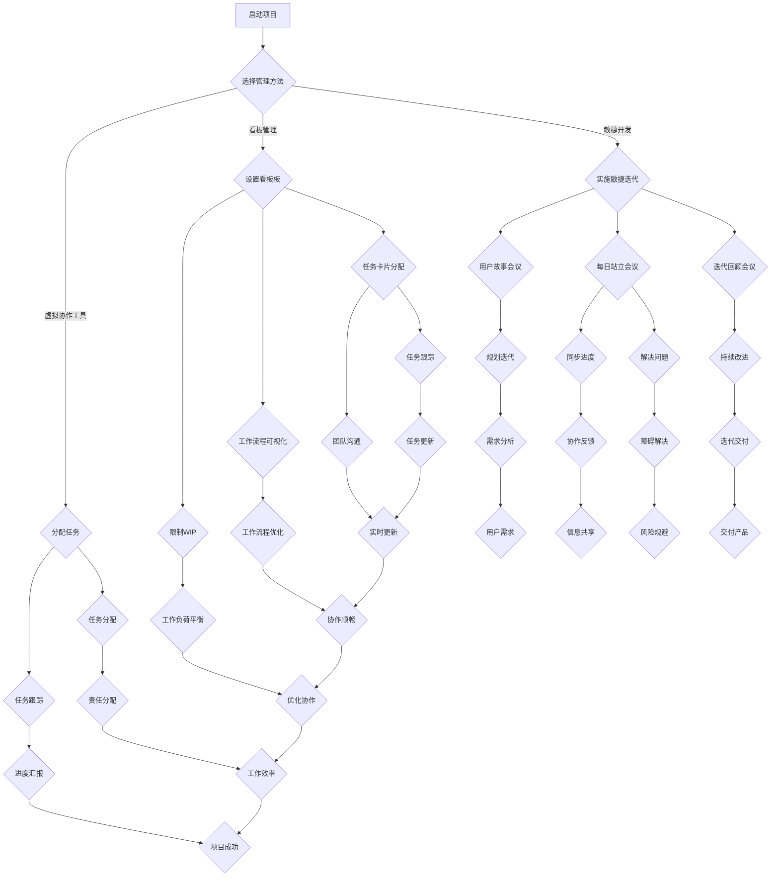

                 

### 关键词

远程项目管理、跨地域团队协作、敏捷开发、沟通策略、技术工具、团队协作与文化建设、项目监控与评估、案例分析、最佳实践

### 摘要

本文深入探讨了远程项目管理在全球化背景下的重要性及其挑战。通过分析远程项目管理的核心概念、方法、沟通策略、技术工具以及团队协作与文化建设，本文提供了系统性的指导。同时，结合具体案例分析，本文总结了最佳实践与技巧，为跨地域团队提供有效的协作策略。通过本文的阅读，读者将能够全面了解远程项目管理，掌握关键技能，提升跨地域团队的工作效率与项目成功率。

## 背景介绍

远程项目管理作为一种现代工作模式，随着全球化的加速和信息技术的飞速发展而逐渐崭露头角。全球化趋势使得企业可以跨越地域限制，招募来自世界各地的顶尖人才，从而实现资源共享和优化。然而，这也带来了远程项目管理的挑战。地理位置的分散性、沟通障碍、文化差异和时间差异等问题，都成为了远程项目管理者必须面对和解决的难题。

### 地理位置分散性

地理位置的分散性是远程项目管理中最为显著的特征之一。团队成员可能分布在不同的城市、国家甚至时区，这直接导致了工作场所的不统一。远程项目管理要求团队能够在虚拟环境中进行高效的协作，这需要一定的技术支持和协调策略。例如，通过视频会议、即时通讯工具以及共享工作平台，团队可以在不同地点进行实时沟通和任务分配。

### 沟通的挑战

沟通的障碍是远程项目管理中最大的挑战之一。由于地理位置的分散性，团队成员之间的交流往往受到时间和空间的限制。这可能导致信息传递延迟，沟通效率低下。同时，文化差异也可能影响沟通的效果。例如，不同国家和地区在沟通风格、语言习惯和表达方式上可能存在差异，这些差异可能导致误解和冲突。因此，远程项目管理需要采取一系列有效的沟通策略来确保信息的准确传递。

### 文化差异

文化差异是远程项目管理中不可忽视的因素。团队成员来自不同的文化背景，可能在价值观、工作习惯和决策风格上存在差异。这些差异可能会影响团队的合作和决策过程。为了克服文化差异，远程项目管理需要建立一种包容和多元的工作文化，鼓励团队成员尊重和理解彼此的差异，并通过跨文化培训来提高团队的沟通协作能力。

### 时间差异

时间差异是远程项目管理中另一个重要的挑战。由于团队成员分布在不同的时区，他们在工作时间和休息时间上可能存在差异。这可能会导致某些团队成员需要在非工作时间进行协作，从而影响工作质量和团队成员的生活平衡。为了解决时间差异的问题，远程项目管理需要制定灵活的工作时间安排，确保团队成员能够有足够的时间进行工作和休息。

### 远程项目管理的必要性

远程项目管理的必要性在于它能够提高企业的灵活性和竞争力。通过远程管理，企业可以更轻松地跨越地域限制，吸引和利用全球范围内的优秀人才。这不仅有助于提高项目的整体质量，还可以降低成本，提高效率。此外，远程项目管理还能够促进创新和多元化，因为不同背景和经验的团队成员可以更自由地交流和合作，从而产生新的想法和解决方案。

综上所述，远程项目管理在全球化背景下变得越来越重要。虽然它带来了许多挑战，但通过有效的策略和工具，这些问题是可以被克服的。接下来，我们将进一步探讨远程项目管理中的核心概念和联系，为读者提供更深入的指导。

## 核心概念与联系

在远程项目管理中，有几个核心概念和术语需要明确，以便为读者提供清晰的理论基础和实操指导。这些概念包括远程团队、虚拟团队、敏捷开发、Scrum等。以下是这些概念的定义及其相互联系。

### 远程团队

远程团队指的是分布在不同地理位置的团队成员，他们通过网络和通信技术进行协作。远程团队的核心特点在于地理分散性，这要求团队成员具备高度的独立性和自我管理能力。远程团队通常依赖于高效的沟通工具和平台来保持协作和协调。例如，通过即时通讯工具、视频会议软件和在线协作平台，团队成员可以实时沟通和共享信息，从而确保项目的顺利进行。

### 虚拟团队

虚拟团队是一种特殊的远程团队，团队成员之间不仅地理位置分散，而且可能从未在现实生活中见过面。虚拟团队的成员可能分布在不同的国家和时区，这使得他们的协作更加复杂。虚拟团队通常依赖于互联网和远程协作工具来保持沟通和协作。例如，虚拟团队可能会使用Slack进行实时沟通、使用Trello进行任务管理、使用Zoom进行定期会议，以及使用Google Drive进行文件共享和协同编辑。

### 敏捷开发

敏捷开发是一种以人为核心、迭代和渐进的方法论，旨在快速响应变化并提高软件开发的灵活性。敏捷开发强调团队协作、持续交付和客户满意度。在远程项目管理中，敏捷开发方法可以帮助团队更好地适应分散的工作环境。敏捷开发的核心原则包括：

- **用户故事**：以用户需求为导向，将工作划分为小任务（用户故事）。
- **迭代开发**：定期进行迭代，每个迭代都生成可交付的产品版本。
- **每日站立会议**：通过每日站立会议来同步团队进度和解决遇到的问题。
- **持续集成和部署**：确保代码的持续集成和自动化测试，以便快速部署新版本。

### Scrum

Scrum是一种流行的敏捷开发框架，它通过迭代和增量开发来提高项目的可管理性。Scrum的核心组成部分包括：

- **产品待办列表**：定义了项目的全部任务和功能点，团队从中选择优先级最高的任务进行开发。
- **Sprint**：通常为2-4周的短周期，在这个周期内团队完成一系列预定的任务。
- **每日站立会议**：每个工作日团队进行短暂的站立会议，同步进度并解决障碍。
- **回顾会议**：每个Sprint结束时，团队进行回顾会议，讨论改进点。

### 核心概念对比表

以下是一个核心概念对比表，帮助读者更好地理解这些概念之间的联系与区别：

| 概念         | 定义                                                         | 关联点                                  |  
| ------------ | ------------------------------------------------------------ | --------------------------------------- |  
| 远程团队     | 分布在不同地理位置的团队成员，通过网络进行协作                 | 基础概念，所有远程项目管理的基础          |  
| 虚拟团队     | 远程团队的一种，成员地理分散且未在现实生活中见过面            | 远程团队的子集，强调虚拟性和互联网依赖性   |  
| 敏捷开发     | 以人为核心、迭代和渐进的开发方法                             | 提高远程项目灵活性，适应变化             |  
| Scrum        | 敏捷开发的框架，通过迭代和增量开发来管理项目                  | 敏捷开发的具体实现方式                   |

### ER实体关系图架构

为了更直观地展示这些概念之间的关系，我们可以使用Mermaid流程图绘制一个ER实体关系图，如下所示：

```mermaid
erDiagram
  Team ||--|{ RemoteTeam }|| Person
  RemoteTeam ||--|{ VirtualTeam }|| Person
  VirtualTeam ||--|{ ScrumTeam }|| Person
  AgileDevelopment ||--|{ Scrum }|| Framework
```

在这个ER图中，Team表示一般团队，RemoteTeam表示远程团队，VirtualTeam表示虚拟团队，ScrumTeam表示Scrum团队，AgileDevelopment表示敏捷开发，Framework表示开发框架。这些实体之间存在明确的关联和继承关系，共同构成了远程项目管理的理论框架。

通过上述核心概念和联系的介绍，读者应该对远程项目管理有了一个全面的了解。接下来，我们将探讨具体的远程项目管理方法，为读者提供实用的策略和工具。

### 远程项目管理的方法

在远程项目管理中，选择合适的管理方法至关重要。目前，敏捷开发、看板管理和虚拟团队协作工具是几种常见的远程项目管理方法。以下是对这些方法的详细介绍。

#### 敏捷开发

敏捷开发是一种以人为核心、迭代和渐进的方法论，旨在快速响应变化并提高软件开发的灵活性。在远程项目管理中，敏捷开发方法可以帮助团队更好地适应分散的工作环境。

**用户故事**：用户故事是敏捷开发的基础，它以用户需求为导向，将工作划分为小任务。每个用户故事都是简短、明确且可测量的。例如，“作为一个用户，我希望能够在网站上搜索产品”。

**迭代开发**：迭代开发将项目划分为多个短周期（通常为2-4周），每个迭代都生成一个可交付的产品版本。这种方式允许团队在每个迭代结束后进行反思和调整，从而持续改进项目。

**每日站立会议**：每日站立会议是敏捷开发的重要实践之一，团队在每日站立会议上同步进度并解决遇到的问题。这种方式有助于保持团队的沟通和透明度。

**持续集成和部署**：敏捷开发强调持续集成和自动化测试，以确保代码的持续集成和快速部署。这有助于减少错误和缺陷，提高软件质量。

#### 看板管理

看板管理是一种视觉化管理工具，它通过看板（Kanban板）来展示项目进度和工作流程。看板管理特别适合远程团队，因为它可以提供清晰的视觉反馈，帮助团队成员了解工作状态。

**工作流程可视化**：看板管理通过将工作流程可视化，使团队成员能够直观地看到每个任务的状态。通常，看板会使用不同颜色的卡片或柱状图来表示任务的进度。

**任务分配和跟踪**：看板管理允许团队成员实时分配任务和跟踪任务进度。每个任务都会被分配到相应的列（如“待办”、“进行中”、“待测试”和“已完成”），从而确保任务有序进行。

**限制工作项数量**：看板管理的一个关键原则是限制工作项的数量（WIP），以避免过度工作。这种方法有助于提高团队的效率和生产力。

#### 虚拟团队协作工具

虚拟团队协作工具是远程项目管理的重要组成部分，这些工具可以帮助团队成员保持高效协作。

**即时通讯工具**：即时通讯工具如Slack、Telegram和Microsoft Teams，用于团队成员之间的实时沟通和协作。这些工具提供了文本消息、语音通话和视频会议等功能，有助于快速解决问题和保持团队沟通。

**任务管理工具**：任务管理工具如Trello、Jira和Asana，用于分配和跟踪任务。这些工具可以创建任务卡片、设置截止日期、分配责任人和跟踪进度，从而确保项目按时完成。

**文档共享和协作工具**：文档共享和协作工具如Google Drive、Dropbox和OneDrive，用于团队成员之间的文件共享和协同编辑。这些工具提供了版本控制和权限管理功能，确保文档的一致性和安全性。

**项目管理工具**：项目管理工具如Microsoft Project和OraclePrimavera，用于远程项目的整体规划和跟踪。这些工具提供了详细的进度报告、资源管理和风险分析功能，帮助项目经理更好地掌控项目。

#### Mermaid流程图展示

为了更好地展示这些方法的实际应用流程，我们可以使用Mermaid绘制一个流程图：



在这个流程图中，每个节点都代表远程项目管理中的一个步骤或活动，通过这些步骤和活动的有机结合，团队可以高效地完成远程项目。

通过上述对远程项目管理方法的详细探讨，读者应该能够更好地理解这些方法的应用和实践。接下来，我们将讨论远程项目管理中的沟通策略，帮助团队克服地理位置和时区带来的沟通挑战。

### 沟通策略

在远程项目管理中，沟通是确保项目顺利进行和团队高效协作的关键。由于团队成员地理位置分散，沟通渠道有限，如何有效沟通成为了一个重要的挑战。以下是一些常见的沟通策略，帮助远程团队克服这些挑战。

#### 定期的团队会议

定期团队会议是远程项目管理中不可或缺的沟通方式。通过每周或每月的固定会议，团队成员可以同步项目进度、讨论遇到的问题并分享工作成果。这些会议可以分为以下几种类型：

1. **每日站立会议**：每日站立会议是敏捷开发的核心实践之一，通常持续15-30分钟。团队成员轮流发言，更新自己的工作状态和遇到的问题。这种会议有助于保持团队的高效协作和透明度。

2. **周会**：每周的会议可以更全面地讨论项目进展、设定下周目标并回顾上一周的工作。这种会议通常由项目经理主持，确保项目的整体方向和目标保持一致。

3. **月度回顾会议**：月度回顾会议是对项目进度和团队协作的全面评估。通过这种会议，团队可以识别潜在的问题和改进点，为下一阶段的工作做好准备。

#### 实时通讯工具的使用

实时通讯工具如Slack、Telegram和Microsoft Teams，为远程团队提供了便捷的沟通渠道。以下是这些工具的使用策略：

1. **工作群组**：创建专门的工作群组，将团队成员根据项目或任务分组，以便更集中地进行沟通和协作。

2. **即时消息**：利用即时消息功能，团队成员可以随时交流信息、提问和解决问题。这种方式有助于快速响应和决策，提高工作效率。

3. **视频会议**：对于需要详细讨论或展示的工作，视频会议是一个很好的选择。视频会议能够模拟面对面的沟通效果，增强团队成员之间的互动和信任。

4. **通知和提醒**：设置消息通知和提醒，确保团队成员能够及时了解项目动态和重要事项。

#### 沟通工具的选择与使用

除了实时通讯工具，远程团队还需要其他沟通工具来支持协作。以下是一些常用的沟通工具及其使用策略：

1. **项目管理工具**：如Jira、Trello和Asana，这些工具可以帮助团队分配任务、跟踪进度和协同工作。

2. **文档共享工具**：如Google Drive、Dropbox和OneDrive，这些工具便于团队成员共享文件、协同编辑和版本控制。

3. **项目管理软件**：如Microsoft Project和Oracle Primavera，这些软件提供了详细的进度报告、资源管理和风险分析功能，帮助项目经理更好地掌控项目。

4. **协作工具**：如Zoom、WebEx和Teams，这些工具提供了视频会议、在线协作和白板功能，支持远程团队的实时沟通和协作。

#### 沟通策略的实例

以下是一个关于如何利用沟通策略提高远程团队协作效率的实例：

**案例：一家全球分布式软件公司**

- **每日站立会议**：公司每个工作日早上举行10分钟的每日站立会议，团队成员轮流更新工作进度和问题。
- **工作群组**：在Slack上创建了多个工作群组，包括项目讨论组、技术支持组和客户服务组，每个群组都有明确的沟通目的。
- **即时消息**：团队成员通过即时消息快速解决日常问题，确保沟通的实时性和高效性。
- **视频会议**：每周进行一次视频会议，讨论项目的重大决策和进展，模拟面对面的沟通体验。
- **文档共享**：使用Google Drive存储项目文件，团队成员可以随时访问、编辑和共享文件，确保信息的一致性和可追溯性。

通过上述沟通策略，这家全球分布式软件公司成功克服了地理位置和时区带来的沟通挑战，实现了高效的团队协作和项目推进。

总之，沟通策略在远程项目管理中至关重要。通过定期团队会议、实时通讯工具的使用和合适的沟通工具，远程团队可以保持高效沟通，确保项目顺利进行。接下来，我们将探讨远程项目管理中常用的技术工具。

### 技术工具

在远程项目管理中，技术工具是团队协作和信息传递的关键。以下是一些常用的远程项目管理工具，包括Trello、Jira和Slack，我们将对它们的功能和适用场景进行详细分析。

#### Trello

**功能**：Trello是一款基于看板（Kanban）原理的任务管理工具，它通过视觉化的卡片和列来展示项目进度。每个卡片代表一个任务，列代表任务的不同状态（如“待办”、“进行中”和“已完成”）。

**适用场景**：Trello适用于小型团队和简单项目。它适合任务管理、优先级设定和进度跟踪。通过拖拽卡片，团队成员可以轻松地调整任务的顺序和状态。

**实例**：在一个软件开发项目中，Trello可以用来分配开发任务，设置截止日期，跟踪每个任务的进度，确保项目按计划推进。

#### Jira

**功能**：Jira是一款功能丰富的项目管理工具，适用于敏捷开发环境。它支持问题跟踪、任务管理、敏捷板（Scrum Board）和报告生成。

**适用场景**：Jira适用于复杂项目和大中型团队。它适合用于需求管理、迭代规划和发布管理。Jira的灵活性和扩展性使其能够适应各种项目需求。

**实例**：在一个软件产品的开发过程中，Jira可以用来创建用户故事、分配任务、跟踪进度和生成燃尽图，帮助团队更好地掌握项目状态。

#### Slack

**功能**：Slack是一款即时通讯工具，支持文字消息、语音通话和视频会议。它还提供了大量的集成插件，可以与其他工具如Trello、GitHub和Google Drive无缝对接。

**适用场景**：Slack适用于日常沟通、团队协作和项目管理。它适合用于实时沟通、文件共享和通知推送。

**实例**：在一个远程团队中，Slack可以用来创建多个讨论频道，团队成员可以在相应的频道中讨论项目进展、分享资源和解决遇到的问题。

#### 工具集成与优化

为了提高远程项目的整体效率，不同的技术工具可以集成使用，实现信息共享和工作流程的优化。以下是一个工具集成的示例：

1. **Trello + Slack**：将Trello的任务更新直接推送到Slack频道，团队成员可以在Slack中查看任务的最新状态，确保沟通的实时性和透明度。

2. **Jira + Slack**：利用Jira的集成插件，将任务的通知和进展推送到Slack，项目经理和团队成员可以在Slack中快速了解项目动态。

3. **Google Drive + Slack**：在Slack中直接访问Google Drive的文件，团队成员可以随时共享和编辑文件，提高协作效率。

通过上述技术工具的集成与优化，远程团队可以更好地管理项目、提高协作效率和确保项目按时完成。

### 总结

远程项目管理需要高效的技术工具来支持团队协作和信息传递。Trello、Jira和Slack等工具各自具有独特的功能，适用于不同的场景。通过合理集成这些工具，团队可以实现高效的项目管理，确保项目顺利进行。接下来，我们将探讨远程团队协作与文化建设的重要性。

### 团队协作与文化建设

在远程项目管理中，团队协作和文化建设是确保项目成功的关键因素。尽管团队成员分布在不同的地理位置，但通过有效的协作和文化建设，团队可以保持紧密的联系和高效的工作状态。

#### 重要性

远程团队协作的重要性体现在以下几个方面：

1. **提高工作效率**：通过有效的协作，团队成员可以共享资源、知识和技能，提高工作效率。协作工具和平台使得团队成员可以实时沟通和协作，快速解决问题。

2. **促进创新**：远程团队由不同背景和文化背景的成员组成，这种多样性促进了创新思维和多元化的解决方案。团队成员可以相互学习和借鉴，从而推动项目的创新和发展。

3. **增强团队凝聚力**：良好的团队协作和文化建设有助于增强团队成员之间的信任和凝聚力。即使地理位置分散，团队成员也能感受到团队的温暖和支持，从而更加投入工作。

#### 方法

以下是一些促进远程团队协作和文化建设的具体方法：

1. **设立共同目标**：明确团队的共同目标是保持团队凝聚力的重要手段。通过设定具体的、可衡量的目标，团队成员可以更好地了解自己的工作方向和团队的目标，从而激发工作动力。

2. **定期虚拟社交活动**：虚拟社交活动有助于团队成员建立个人关系，增强团队凝聚力。例如，组织线上团队建设活动、虚拟聚餐、游戏竞赛等，可以促进团队成员之间的互动和交流。

3. **跨文化培训**：由于远程团队成员可能来自不同的文化背景，跨文化培训可以帮助团队成员更好地理解和尊重彼此的文化差异。通过培训，团队成员可以学习有效的沟通技巧和文化敏感性，从而减少误解和冲突。

4. **开放沟通渠道**：确保团队成员有开放的沟通渠道是促进协作的重要步骤。远程团队可以通过定期团队会议、即时通讯工具和邮件等渠道，保持信息的畅通和透明。

5. **奖励与认可**：对团队成员的工作成果和贡献进行及时奖励和认可，可以激励团队成员更加积极地参与项目和工作。这种认可可以是公开表扬、奖金或者其他形式的奖励，有助于增强团队士气和团队凝聚力。

#### 案例分析

以下是一个关于远程团队协作和文化建设的成功案例分析：

**案例：一家全球分布式软件开发公司**

- **设立共同目标**：公司设立了明确的年度目标，并将其分解为季度目标和月度目标，每个团队成员都清楚自己的工作职责和目标。
- **定期虚拟社交活动**：公司定期组织线上团队建设活动，如虚拟团队聚餐、团队游戏竞赛和在线培训，增强了团队成员之间的联系和信任。
- **跨文化培训**：公司为团队成员提供了跨文化培训课程，帮助他们了解不同文化的沟通风格和工作习惯，提高了团队的协作效率。
- **开放沟通渠道**：公司鼓励团队成员通过每日站立会议、即时通讯工具和邮件等渠道进行沟通，确保信息的畅通和透明。
- **奖励与认可**：公司对在项目中表现出色的团队成员进行公开表扬和奖金奖励，激励了团队成员的工作积极性和创造力。

通过上述方法，这家全球分布式软件开发公司成功建立了高效的团队协作和文化，项目进展顺利，团队成员的工作满意度和团队凝聚力显著提高。

综上所述，远程团队协作和文化建设在远程项目管理中至关重要。通过设立共同目标、定期虚拟社交活动、跨文化培训、开放沟通渠道和奖励与认可等方法，团队可以克服地理位置和文化的障碍，实现高效协作和项目成功。

### 项目监控与评估

在远程项目管理中，项目监控与评估是确保项目按计划进行、及时识别和解决问题的重要环节。以下是如何有效监控远程项目进度和评估项目质量的方法。

#### 监控项目进度

1. **设置关键绩效指标（KPI）**：确定项目的关键绩效指标，例如任务的完成时间、任务的进度百分比、团队的效率等。这些指标可以帮助项目经理和团队成员了解项目的实际进展情况。

2. **定期进度报告**：定期生成项目进度报告，通过邮件或在线协作工具发送给团队成员和利益相关者。进度报告应包括任务的完成情况、未完成任务的解释、遇到的障碍和下一阶段的计划。

3. **使用项目管理工具**：利用项目管理工具（如Jira、Trello、Asana等）实时跟踪任务进度。这些工具提供了直观的界面，可以显示任务的截止日期、状态和责任人。

4. **每日站立会议**：每日站立会议是一个有效的监控工具，可以帮助团队成员同步进度、识别问题并迅速采取行动。在会议中，每个团队成员更新自己的工作状态和遇到的挑战。

#### 评估项目质量

1. **定义质量标准**：在项目开始时，与团队成员和利益相关者一起制定明确的质量标准。这些标准应包括代码质量、功能完整性、用户满意度等。

2. **持续集成与测试**：使用持续集成和自动化测试工具（如Jenkins、Selenium等）来确保代码的质量和功能完整性。通过持续集成，可以及时发现和修复代码中的错误。

3. **用户反馈**：定期收集用户的反馈，了解产品的实际表现和用户的满意度。用户的反馈可以帮助团队识别潜在的问题和改进点。

4. **质量审计**：进行定期质量审计，检查项目的各个阶段是否符合质量标准。质量审计可以由内部团队或外部专家进行，以确保评估的客观性和全面性。

#### 项目评估的方法和指标

1. **进度完成率**：计算实际完成时间与计划完成时间之间的比率，以评估项目的进度。

2. **成本偏差**：比较实际成本与预算成本之间的差异，以评估项目的成本管理情况。

3. **质量缺陷率**：计算项目中的质量缺陷数量与总代码行数之间的比率，以评估项目的质量。

4. **用户满意度**：通过调查问卷或用户反馈来评估用户对产品的满意度。

5. **任务完成率**：计算团队完成任务的百分比，以评估团队的执行力和协作效果。

#### 反馈与持续改进

1. **定期回顾会议**：在每个项目阶段结束时，举行回顾会议，分析项目的优点和不足，并提出改进措施。

2. **反馈机制**：建立有效的反馈机制，鼓励团队成员和利益相关者提供意见和建议。这可以帮助团队不断优化项目管理方法和流程。

3. **持续改进**：根据反馈和评估结果，制定和实施持续改进计划，以提高项目的成功率和团队的整体效能。

通过上述项目监控与评估的方法和指标，远程团队可以确保项目按计划进行，及时识别和解决问题，提高项目的质量。接下来，我们将通过具体案例来分析远程项目管理的成功因素。

### 案例分析

为了更好地理解远程项目管理的成功实践，我们将分析一个具体的远程项目管理案例，探讨其成功的关键因素。

#### 案例背景

这是一家全球分布式软件开发公司，其主要业务是开发一款跨平台的协作工具。该公司由位于美国、欧洲和亚洲的多个团队组成，各团队负责不同的模块开发。由于团队成员地理位置分散，项目管理面临诸多挑战，如沟通障碍、时间差异和文化差异。

#### 成功因素

1. **明确的角色和责任分配**：公司首先明确了每个团队成员的角色和责任，确保每个任务都有明确的责任人。这有助于提高任务的执行效率和团队的责任心。

2. **灵活的工作时间安排**：为了解决时区差异，公司采用灵活的工作时间安排，允许团队成员根据自己的时区调整工作时间。例如，美国的团队成员可以在白天工作，而亚洲的团队成员则可以在晚上工作，确保项目在24小时内不间断地进行。

3. **高效的沟通策略**：公司采用了多种沟通工具，如Slack、Zoom和Trello，确保团队成员能够实时沟通和协作。Slack用于日常沟通和任务更新，Zoom用于定期会议和视频通话，Trello用于任务管理和进度跟踪。

4. **跨文化培训**：为了减少文化差异带来的沟通障碍，公司定期为团队成员提供跨文化培训，帮助他们了解和尊重不同文化的沟通风格和工作习惯。

5. **敏捷开发方法**：公司采用敏捷开发方法，通过迭代开发和每日站立会议，确保项目能够快速响应变化和调整方向。敏捷开发方法提高了团队的灵活性和响应速度。

6. **持续集成与测试**：公司实施了持续集成和自动化测试，确保代码的质量和功能完整性。这减少了项目中的错误和缺陷，提高了项目的稳定性。

7. **用户反馈机制**：公司定期收集用户的反馈，并据此改进产品。用户的反馈不仅帮助团队识别了产品中的问题，还提供了宝贵的改进建议。

#### 经验教训

通过这个案例，我们可以得出以下经验教训：

1. **明确角色和责任**：明确团队成员的角色和责任是确保项目顺利进行的基础。

2. **灵活的工作时间安排**：灵活的工作时间安排有助于解决时区差异，确保项目在24小时内都能得到有效推进。

3. **高效的沟通策略**：多种沟通工具的结合使用可以提高沟通效率，确保信息的及时传递和问题的快速解决。

4. **跨文化培训**：跨文化培训有助于减少文化差异带来的沟通障碍，提高团队的协作效率。

5. **敏捷开发方法**：敏捷开发方法能够提高团队的灵活性和响应速度，使项目能够快速适应变化。

6. **持续集成与测试**：持续集成和自动化测试可以确保项目的质量，减少错误和缺陷。

7. **用户反馈机制**：定期收集用户的反馈，并根据反馈改进产品，有助于提高产品的市场竞争力。

通过这个案例的分析，我们可以看到，成功的远程项目管理不仅仅是技术工具的运用，更重要的是团队协作和文化的建设。有效的角色分配、灵活的工作时间安排、高效的沟通策略、敏捷开发方法、持续集成与测试以及用户反馈机制，都是远程项目管理成功的关键因素。接下来，我们将总结最佳实践与技巧，帮助读者更好地实施远程项目管理。

### 最佳实践与技巧

在远程项目管理中，成功的关键在于策略和技巧的正确运用。以下是一些最佳实践和技巧，旨在帮助读者提高远程项目管理的效率和效果。

#### 1. 避免单点故障

单点故障是远程项目管理中的一大风险，可能会造成项目延误或失败。为了减少单点故障的风险，应采取以下措施：

- **任务分配多样化**：确保关键任务不是由单个团队成员负责，以防止因个别成员离职或遇到问题而影响整个项目。
- **备选方案**：为关键任务和环节准备备选方案，确保在遇到问题时可以迅速切换。
- **备份和冗余**：定期备份项目文件和数据，确保在数据丢失或损坏时能够迅速恢复。

#### 2. 建立有效的沟通策略

沟通是远程项目管理的核心。以下是一些有效的沟通策略：

- **定期会议**：定期举行团队会议，确保团队成员能够同步进度、讨论问题并共享信息。会议可以是每日站立会议、周会和月度回顾会议。
- **实时沟通工具**：利用实时沟通工具（如Slack、Microsoft Teams）确保团队可以快速响应和解决问题。
- **沟通渠道多样化**：使用多种沟通渠道，如邮件、即时通讯、视频会议和项目管理工具，以满足不同场景的需求。

#### 3. 确保团队间的信任

信任是远程团队协作的基础。以下是一些建立团队间信任的方法：

- **透明度**：保持信息的透明度，确保团队成员了解项目的整体进展和重要决策。
- **共享成功和失败**：鼓励团队成员分享成功和失败的经验，从而增进彼此的理解和信任。
- **培养团队合作精神**：通过虚拟团队建设活动，如在线游戏、社交聚会等，培养团队成员之间的团队合作精神。

#### 4. 持续学习和自我提升

远程项目管理是一个不断发展的领域，持续学习和自我提升至关重要。以下是一些建议：

- **参加培训课程**：定期参加项目管理、沟通技巧和团队协作方面的培训课程，提高自己的专业能力。
- **阅读专业书籍**：阅读有关远程项目管理的专业书籍，了解最新的理论和方法。
- **实践和反思**：在实际项目管理中不断实践和反思，总结经验教训，不断改进。

#### 5. 注意事项

在实施远程项目管理时，以下注意事项可以帮助避免常见问题：

- **文化差异**：了解和尊重团队成员的文化差异，避免因文化误解而引发冲突。
- **时间管理**：合理安排工作时间和休息时间，确保团队成员的生活和工作平衡。
- **任务优先级**：明确任务优先级，确保关键任务得到及时处理。

通过遵循上述最佳实践和技巧，远程团队可以更好地应对挑战，提高项目管理的效率和成功率。总之，远程项目管理不仅需要有效的策略和工具，更需要团队的协作和信任。接下来，我们将进行小结，总结文章的主要内容和观点。

### 小结

本文通过详细探讨远程项目管理的背景、核心概念、方法、沟通策略、技术工具、团队协作与文化建设、项目监控与评估以及具体案例，为读者提供了全面且深入的远程项目管理指南。本文的核心观点如下：

1. **远程项目管理的必要性**：随着全球化的发展，远程项目管理成为了现代企业提高灵活性和竞争力的重要手段。
2. **核心概念与联系**：理解远程团队、虚拟团队、敏捷开发和Scrum等核心概念，有助于构建有效的远程项目管理框架。
3. **沟通策略**：定期会议、实时通讯工具的使用和多种沟通渠道的结合，是远程项目管理中沟通成功的关键。
4. **技术工具**：Trello、Jira、Slack等工具的合理使用，可以显著提高远程团队的工作效率。
5. **团队协作与文化建设**：设立共同目标、定期虚拟社交活动、跨文化培训和开放沟通渠道，有助于增强团队凝聚力和协作效率。
6. **项目监控与评估**：通过设置关键绩效指标、定期进度报告和质量评估，确保项目按计划进行。
7. **案例分析**：通过具体案例，展示了远程项目管理的成功实践和经验教训。

展望未来，远程项目管理将继续发展，技术工具将更加智能化，团队协作方式将更加多样化。远程项目管理面临的挑战，如文化差异、沟通障碍和时间管理，也将随着技术的进步和管理方法的完善而逐渐解决。远程项目管理不仅是一个趋势，更是一个不断提升和创新的过程。

### 展望未来的远程项目管理

随着科技的不断进步，远程项目管理正迎来前所未有的发展机遇。以下是对未来远程项目管理趋势的展望：

#### 自动化和人工智能的应用

未来远程项目管理将越来越多地依赖于自动化和人工智能。自动化工具可以帮助团队进行任务分配、进度跟踪和报告生成，从而减少人为错误和重复性工作。人工智能则可以通过数据分析提供预测和决策支持，帮助项目经理更好地应对项目中的不确定性。

#### 虚拟现实和增强现实

虚拟现实（VR）和增强现实（AR）技术的应用将为远程项目管理带来新的可能性。通过VR和AR，团队成员可以虚拟地“聚集”在一个虚拟会议室中，进行实时互动和协作。这种沉浸式体验有望显著提高团队协作的效率。

#### 更智能的沟通工具

随着人工智能和大数据技术的发展，沟通工具将变得更加智能和个性化。例如，智能聊天机器人可以帮助团队成员进行日常沟通和任务提醒，甚至可以根据用户的行为和偏好提供个性化的建议。

#### 文化多样性和包容性

随着远程团队越来越国际化，如何处理文化多样性和包容性将成为一个重要议题。未来远程项目管理将更加注重跨文化培训和文化敏感性教育，帮助团队成员更好地理解和尊重彼此的差异。

#### 持续学习和适应性

未来的远程项目管理将更加注重持续学习和适应性。项目经理和团队成员需要不断更新知识和技能，以适应快速变化的技术和管理方法。通过定期的培训和实践，团队可以保持高水平的竞争力。

#### 风险管理和韧性

面对全球化和远程工作的不确定性，远程项目管理将更加重视风险管理和韧性建设。通过建立灵活的应急响应机制和冗余系统，团队可以在面对突发事件时迅速调整，确保项目的持续进行。

总之，未来的远程项目管理将在技术进步和管理创新的推动下，变得更加智能、高效和包容。虽然挑战依然存在，但通过有效的策略和工具，远程项目管理的成功前景依然光明。远程项目管理不仅是一个趋势，更是一个不断演进和提升的过程。

### 总结

本文系统地介绍了远程项目管理的核心概念、方法、沟通策略、技术工具以及团队协作与文化建设，通过案例分析展示了最佳实践与技巧，并对未来远程项目管理的发展趋势进行了展望。远程项目管理在全球化背景下愈发重要，它不仅带来了新的挑战，也提供了巨大的机遇。通过本文的阅读，读者应能全面了解远程项目管理，掌握关键技能，提高跨地域团队的工作效率与项目成功率。

### 作者信息

作者：AI天才研究院/AI Genius Institute & 禅与计算机程序设计艺术 /Zen And The Art of Computer Programming

感谢您的阅读，期待与您在远程项目管理的道路上共同进步。

