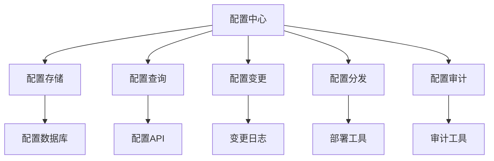

                 

# 配置中心设计简化LLM应用的配置管理

> 关键词：配置管理、配置中心、LLM应用、架构设计、性能优化

> 摘要：本文将深入探讨配置中心在简化大型语言模型（LLM）应用的配置管理方面的作用。通过逐步分析配置管理的基础、配置中心的设计与实现，以及其在实际应用中的优化策略，为开发者提供一套完整的解决方案。

## 引言

在当今快速发展的技术时代，配置管理作为软件工程中不可或缺的一环，正变得越来越重要。对于大型语言模型（LLM）这样的复杂应用，配置管理的挑战尤为突出。LLM应用通常涉及大量的参数和配置项，这些配置项对于模型的性能和功能至关重要。因此，如何有效地管理这些配置成为了一个亟待解决的问题。

本文将分以下几个部分进行探讨：

1. 配置管理基础
   - 配置管理的背景与重要性
   - 配置管理的基本概念

2. 配置中心设计
   - 配置中心设计概述
   - 配置中心实现

3. 配置中心应用与优化
   - 配置中心应用案例
   - 配置中心优化策略

4. 配置管理的最佳实践
   - 最佳实践总结
   - 注意事项与建议

5. 配置管理的拓展阅读

通过以上结构化的分析，我们将逐步揭示配置中心如何简化LLM应用的配置管理，提高其效率和可靠性。

## 第一部分：配置管理基础

### 第1章：配置管理的背景与重要性

#### 1.1 配置管理概述

配置管理是软件工程中的一个关键概念，它涉及到对软件系统中各种配置项的识别、记录、控制和审计。在LLM应用中，配置管理尤为重要，因为LLM的复杂性和参数的多样性使得手动管理变得极为困难。

**问题背景与问题描述：** 
在现代软件开发中，配置管理的主要挑战包括：
- **配置项繁多：** LLM应用通常有大量的配置项，包括模型参数、训练数据设置、环境变量等。
- **版本控制：** 随着项目的演进，配置项可能会发生变更，版本控制成为确保系统稳定性的关键。
- **环境差异：** 不同开发、测试和生产环境可能需要不同的配置，这增加了管理的复杂性。

**问题解决思路与边界与外延：** 
配置管理旨在通过自动化和集中化的方式，简化配置项的管理，确保配置的一致性和可追踪性。边界与外延涉及配置管理的范围，包括但不限于：
- **配置项范围：** 包括哪些配置需要管理。
- **变更管理：** 如何处理配置变更。
- **环境适配：** 如何在不同环境中应用配置。

#### 1.2 配置管理的重要性

**配置管理在企业中的应用：**
- **提高效率：** 自动化配置管理可以节省人力和时间成本。
- **降低风险：** 系统配置的一致性和可追踪性可以降低配置错误导致的风险。
- **支持持续集成和持续部署（CI/CD）：** 配置管理是CI/CD流程中不可或缺的一部分，有助于确保每次部署都是可靠的。

**配置管理对于LLM应用的影响：**
- **模型性能优化：** 合适的配置可以显著提高LLM的性能和效果。
- **可维护性和可扩展性：** 有效的配置管理可以提高系统的可维护性和可扩展性。
- **团队协作：** 集中化的配置管理可以提高团队协作效率，减少因配置不一致导致的问题。

#### 1.3 配置管理的核心概念与联系

**核心概念原理：**
- **配置项（Configuration Item, CI）：** 软件系统中的任何可配置的元素，如参数、文件、环境变量等。
- **配置管理数据库（CMDB）：** 存储和管理所有配置项的中央数据库。
- **配置变更管理（CCM）：** 管理配置变更的过程，确保变更的影响得到评估和控制。

**概念属性特征对比表格：**

| 概念     | 属性特征 |
|----------|---------|
| 配置项   | 可识别、可命名、可修改 |
| CMDB     | 中心化、可查询、可更新 |
| CCM      | 版本控制、变更审批、审计 |

**ER实体关系图架构：**

```mermaid
erDiagram
    ConfigItem ||--|{ CMDB } CMDB
    ConfigItem ||--|{ CCM } CCM
    CCM ||--|{ ChangeLog } ChangeLog
```

## 第二部分：配置中心设计

### 第2章：配置管理的基本概念

#### 2.1 配置对象

**配置对象的分类：**
- **系统配置：** 与系统运行环境相关的配置，如JVM参数、数据库连接信息等。
- **应用配置：** 与具体应用相关的配置，如模型参数、API接口设置等。

**配置对象的属性：**
- **名称：** 配置项的唯一标识。
- **值：** 配置项的具体设置。
- **描述：** 配置项的说明信息。
- **版本：** 配置项的版本号。

#### 2.2 配置中心

**配置中心的定义：**
配置中心是一个集中化的管理平台，用于存储、管理和分发配置项。它提供了一套标准化的接口，方便开发者管理和获取配置项。

**配置中心的功能：**
- **配置存储：** 存储和管理所有配置项。
- **配置查询：** 允许开发者根据需要查询配置项。
- **配置变更：** 支持配置项的变更和版本控制。
- **配置分发：** 将配置项分发到各个环境。

#### 2.3 配置管理流程

**配置管理流程概述：**
配置管理流程通常包括以下主要环节：
1. **配置识别：** 识别系统中需要管理的配置项。
2. **配置定义：** 定义配置项的名称、值、描述等信息。
3. **配置存储：** 将配置项存储到配置管理数据库。
4. **配置变更：** 对配置项进行修改和版本控制。
5. **配置分发：** 将配置项分发到目标环境。
6. **配置审计：** 审核配置项的变更和分发过程。

### 第3章：配置中心设计概述

#### 3.1 配置中心设计的目标

**设计原则：**
- **标准化：** 使用统一的接口和协议，简化配置管理流程。
- **可扩展性：** 设计可扩展的架构，以适应不断增长的需求。
- **高可用性：** 确保配置中心的稳定性和可靠性。

**设计目标：**
- **简化配置管理：** 降低配置管理的复杂度，提高开发效率和系统稳定性。
- **提高配置灵活性：** 支持快速配置变更，适应不同的应用场景。
- **提升系统性能：** 通过优化配置中心的架构和算法，提高配置查询和分发的速度。

#### 3.2 配置中心架构设计

**系统功能设计（领域模型mermaid类图）：**

```mermaid
classDiagram
    ConfigCenter <<interface>>
    ConfigItem <<class>>
    ConfigDB <<class>>
    ConfigManager <<class>>

    ConfigCenter ^.. ConfigItem : manage
    ConfigCenter ^.. ConfigDB : store
    ConfigCenter ^.. ConfigManager : access

    ConfigDB "1" -- "1" ConfigItem : contains
    ConfigManager "1" -- "1" ConfigItem : manages
```

**系统架构设计（mermaid架构图）：**



#### 3.3 配置中心接口设计

**接口规范：**
- **查询接口：** 提供查询配置项的功能，包括按名称、标签、版本等查询。
- **变更接口：** 提供配置项的修改和版本控制功能。
- **分发接口：** 提供配置项的分发功能，包括手动和自动分发。

**接口设计：**

```mermaid
interface ConfigInterface {
    function getConfigByKey(key: String): ConfigItem?
    function updateConfig(config: ConfigItem): Boolean
    function distributeConfig(config: ConfigItem, environment: String): Boolean
}
```

## 第三部分：配置中心实现

### 第4章：配置中心实现

#### 4.1 环境准备

**环境安装：**
配置中心的实现通常依赖于一些基础软件和库，如数据库（如MySQL、PostgreSQL）、消息队列（如RabbitMQ）和分布式存储（如Zookeeper）。

**环境配置：**
配置中心的配置文件通常包括数据库连接信息、消息队列地址、分布式锁配置等。配置文件可以使用YAML、JSON等格式进行编写。

### 第5章：配置中心核心实现源代码

**代码架构：**
配置中心的核心实现通常包括以下几个模块：
- **配置存储模块：** 负责配置项的存储和管理。
- **配置查询模块：** 提供配置项的查询接口。
- **配置变更模块：** 处理配置项的修改和版本控制。
- **配置分发模块：** 负责配置项的分发和同步。

**代码解析：**
以下是配置存储模块的一个简单示例：

```python
class ConfigStore:
    def __init__(self, db_connection):
        self.db_connection = db_connection

    def save_config(self, config_item):
        with self.db_connection.cursor() as cursor:
            cursor.execute(
                "INSERT INTO config (key, value, description, version) VALUES (%s, %s, %s, %s)",
                (config_item.key, config_item.value, config_item.description, config_item.version)
            )
            self.db_connection.commit()

    def get_config_by_key(self, key):
        with self.db_connection.cursor() as cursor:
            cursor.execute("SELECT * FROM config WHERE key = %s", (key,))
            result = cursor.fetchone()
            if result:
                return ConfigItem(result[0], result[1], result[2], result[3])
            else:
                return None
```

### 第6章：配置中心应用与优化

#### 5.1 配置中心应用案例

**案例一：配置中心在LLM应用中的实际应用**

在一个LLM应用中，配置中心可以用于管理以下配置项：
- **模型参数：** 如学习率、批量大小、迭代次数等。
- **训练数据：** 如数据集路径、数据预处理规则等。
- **环境变量：** 如GPU配置、内存限制等。

通过配置中心，开发者可以方便地调整这些配置项，而无需修改代码或重新部署应用。

**案例二：配置中心在其他领域的应用**

除了LLM应用，配置中心在其他领域也有广泛的应用，如：
- **微服务架构：** 管理各个微服务的配置项，如API网关的限流策略、服务发现等。
- **云计算平台：** 管理虚拟机、容器等资源的配置项，如CPU、内存、存储等。

#### 5.2 配置中心优化策略

**性能优化：**
- **缓存策略：** 缓存常见的配置项，减少数据库查询次数。
- **分库分表：** 将配置项分散存储到多个数据库或表中，提高查询效率。

**可靠性优化：**
- **分布式存储：** 使用分布式存储系统，确保配置中心的高可用性和数据持久性。
- **备份和恢复：** 定期备份配置项，以便在出现故障时快速恢复。

**可维护性优化：**
- **配置项规范化：** 制定统一的配置项命名规范，便于管理和查询。
- **自动化测试：** 开发自动化测试脚本，确保配置变更不会影响系统稳定性。

## 第四部分：配置管理的最佳实践

### 第6章：配置管理的最佳实践

#### 6.1 配置管理最佳实践总结

**设计最佳实践：**
- **模块化设计：** 将配置项按功能模块划分，便于管理和维护。
- **配置项命名规范：** 使用统一的命名规范，确保配置项的可读性和一致性。
- **版本控制：** 使用版本控制系统，记录配置项的变更历史。

**实现最佳实践：**
- **分布式存储：** 使用分布式存储系统，提高配置中心的可靠性和性能。
- **缓存策略：** 利用缓存技术，减少数据库查询次数。
- **自动化部署：** 使用自动化部署工具，简化配置项的分发和同步。

**应用最佳实践：**
- **配置项监控：** 实时监控配置项的变更和异常情况。
- **权限管理：** 实现严格的权限管理，确保配置项的安全性和可控性。
- **文档管理：** 编写详细的配置文档，方便开发者理解和使用配置项。

#### 6.2 小结与注意事项

**配置管理中常见问题与解决方案：**
- **配置不一致：** 使用版本控制系统和自动化部署工具，确保配置的一致性。
- **配置错误：** 实施配置项的审核和验证机制，减少配置错误。

**注意事项与建议：**
- **定期备份：** 定期备份配置项，防止数据丢失。
- **权限管理：** 实施严格的权限管理，防止未经授权的修改。

#### 6.3 拓展阅读

**相关书籍推荐：**
- 《软件配置管理实践指南》
- 《配置管理：大规模软件开发的最佳实践》

**相关论文推荐：**
- “Configuration Management for Software Systems: A Comprehensive Survey”
- “Practical Configuration Management for Large Software Projects”

**网络资源推荐：**
- GitHub上的配置管理项目
- 配置管理相关的博客和论坛

## 结束语

配置中心在简化LLM应用的配置管理方面具有重要作用。通过本文的逐步分析，我们了解了配置管理的核心概念、配置中心的设计与实现，以及优化策略。希望本文能为开发者提供有益的参考，帮助他们在实际项目中更好地管理配置项，提高系统的稳定性和可靠性。

### 作者

**作者：AI天才研究院/AI Genius Institute & 禅与计算机程序设计艺术 /Zen And The Art of Computer Programming**

