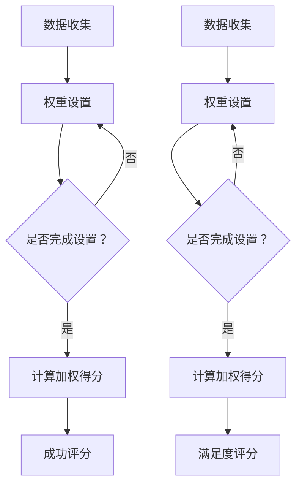
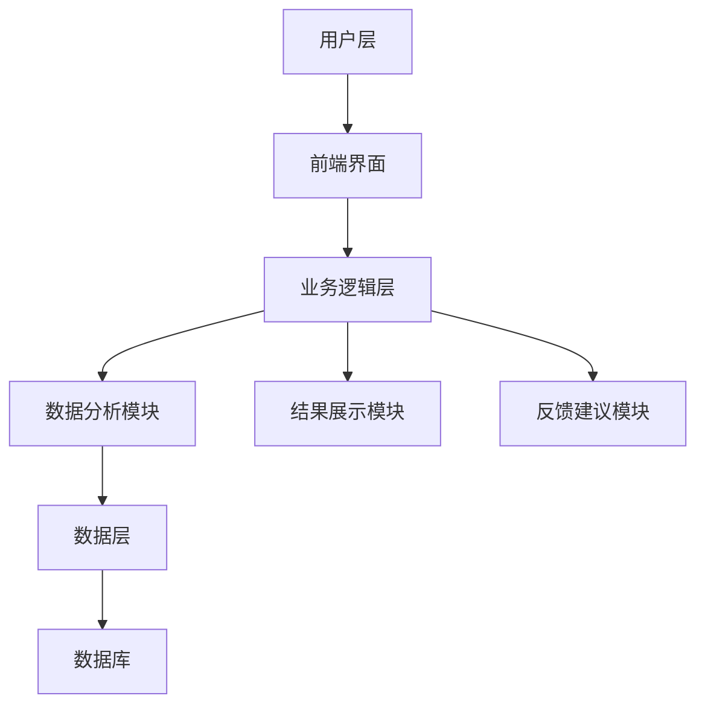
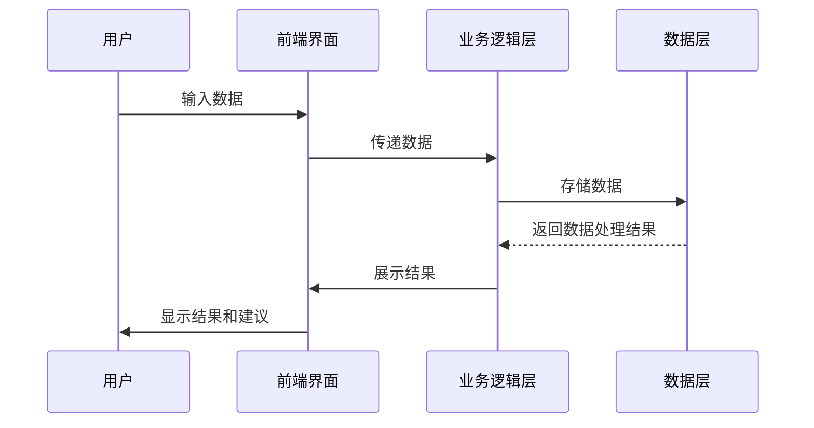

                 

### 重塑成功观念：从外在评价到内在满足

关键词：成功定义、内在满足、外在评价、自我认知、心理健康

在现代社会中，成功一词被广泛地提及，人们渴望成功，追求成功。然而，成功的定义却因人而异，各有不同。传统观念中，成功通常与财富、地位、名誉等外在因素紧密相连。然而，随着社会的发展和人们对生活质量的追求，越来越多的人开始反思：成功究竟是什么？它仅仅是一种外在的评价，还是一种内在的满足？

本篇文章将深入探讨成功的重新定义，从外在评价转向内在满足。我们将一步步分析，引导读者理解如何通过自我认知和内在平衡，实现真正的成功。通过阐述核心概念、算法原理、系统设计与项目实战，本文旨在帮助读者重新审视成功的本质，找到内心真正的满足。

文章的核心内容将围绕以下几个方面展开：

1. **引言**：探讨传统成功观念的局限性，引出内在满足的重要性。
2. **自我认知与内在满足**：分析如何通过自我认知和内在价值观的构建，实现内在满足。
3. **重新定义成功**：从多维度视角重新审视成功的标志，探讨内在满足与个人成长的关系。
4. **核心概念与联系**：深入讲解内在满足的定义、测量方法及其与幸福感、心理健康的关系。
5. **算法原理讲解**：介绍成功评估和满足度测量算法，并通过实例进行分析。
6. **数学模型和数学公式讲解**：阐述成功的数学模型和满足度的数学模型，进行详细讲解和实例分析。
7. **系统分析与架构设计方案**：介绍系统功能设计、架构设计、接口设计及系统交互流程。
8. **项目实战**：通过实际项目实战，展示系统核心实现和应用分析。
9. **最佳实践与总结**：总结最佳实践、注意事项及未来展望，提供拓展阅读建议。

通过这篇文章，我们希望能够引导读者跳出传统的成功观念，从内心深处寻找真正的满足。让我们一步步思考，深入探讨，重新定义成功。

## 引言：传统成功观念的局限性

在过去，成功的定义往往被社会和传统观念所固化。人们普遍认为，成功是拥有财富、地位和名誉。这种观念源于社会结构和文化背景，人们在社会竞争中，往往将外部评价作为衡量成功的重要标准。例如，一个人拥有高收入、豪华住宅、名车等物质财富，或是在职场中取得显著成就，晋升为高管，都被视为成功。

然而，这种传统观念的成功标准存在许多局限性。首先，外在评价往往具有短暂性和表面性。财富和地位可能会在短时间内带来满足感，但随着时间的推移，这种满足感往往会消失，无法持久。其次，过度追求外在成功可能会导致心理压力和焦虑。当一个人完全依赖外部评价来定义自己的价值时，他可能会感到焦虑、不安和失落，因为外部环境的变化可能会直接影响到他的自我评价。

此外，传统观念中的成功标准也可能导致社会不公。在一些社会和文化背景下，财富和地位被用来衡量一个人的能力和价值，这种观念可能导致贫困和社会边缘群体的自卑感和无力感。因此，单纯追求外在成功不仅对个人心理健康不利，还可能对社会结构产生负面影响。

面对这些局限性，重新定义成功变得尤为重要。内在满足，作为一种更为深刻和持久的满足感，逐渐成为现代人所追求的目标。内在满足不仅仅依赖于外在的评价，而是源于个人内心的感受和价值观。通过自我认知和内在平衡，人们可以找到真正的满足，实现真正的成功。

在这个章节中，我们将深入探讨如何从外在评价转向内在满足。首先，我们将探讨自我认知的重要性，了解自己的内在价值观，从而找到真正的满足。接下来，我们将介绍如何通过情绪管理和自我激励，实现内在平衡，最终达到真正的成功。希望通过这一章节的探讨，读者能够对成功有更深入的理解，并找到内心的满足。

### 自我认知与内在满足

自我认知是内在满足的基础，它涉及到对自己的了解和认识。自我认知不仅包括对自己的性格、兴趣、价值观等方面的理解，还包括对自己的能力和局限性的认识。通过深入自我认知，人们能够更好地了解自己的需求，从而找到与自己价值观相符合的生活方式和目标。

首先，了解自己的性格特点是非常重要的。每个人的性格都有其独特性，有的人外向、活泼，有的人内向、沉稳。了解自己的性格特点，有助于找到与自己性格相符的职业和生活方式。例如，一个内向的人可能更适合从事需要独立思考和创造的工作，而不是需要频繁人际交往的工作。通过选择与自己性格相符的职业，可以更好地发挥自己的潜力，获得职业上的满足感。

其次，了解自己的兴趣和价值观也是自我认知的关键。兴趣是人们热爱的事物，它们能带来快乐和满足感。通过探索自己的兴趣，人们可以找到自己真正热爱的事情，并将其转化为职业或业余爱好。同时，价值观是人们的行为准则，它们决定了人们如何看待生活和他人的行为。了解自己的价值观，可以帮助人们做出更符合自己内心信念和原则的选择，从而获得内心的满足。

情绪管理是内在平衡的重要组成部分。情绪管理能力较强的人，能够更好地应对生活中的挑战和压力，保持内心的平静和稳定。情绪管理包括情绪识别、情绪表达和情绪调节等方面。情绪识别是指能够识别和理解自己和他人的情绪状态，情绪表达是指能够恰当地表达自己的情绪，情绪调节是指能够通过有效的方法调整和控制自己的情绪。

首先，情绪识别是情绪管理的基础。只有了解自己的情绪，才能有效地管理情绪。例如，当感到焦虑时，能够识别出焦虑的情绪，并了解焦虑的原因，才能采取有效的措施缓解焦虑。其次，情绪表达也是情绪管理的重要方面。情绪表达不仅包括对自己情绪的表达，还包括对他人情绪的理解和回应。通过有效的情绪表达，可以建立良好的人际关系，增强彼此的理解和信任。

最后，情绪调节是情绪管理的核心。情绪调节方法包括认知重构、情绪释放、放松训练等。认知重构是指通过改变对事件的认知来调节情绪，例如，当遇到挫折时，可以通过改变对挫折的看法来减轻负面情绪。情绪释放是指通过某些活动，如运动、写日记等，来释放负面情绪，保持情绪平衡。放松训练是通过深呼吸、冥想等方法来放松身心，减轻压力和焦虑。

自我激励是内在平衡的重要保障。自我激励是指通过内在的动力和激励，保持积极的心态和行为。自我激励能力较强的人，能够自我驱动，克服困难，实现目标。自我激励包括目标设定、自我奖励和积极心态等方面。

首先，目标设定是自我激励的关键。设定明确、可实现的目标，可以激发人们的内在动力，推动他们努力实现目标。例如，设定一个短期目标，如每天学习两小时，可以帮助人们保持学习的动力和积极性。其次，自我奖励也是自我激励的重要手段。通过给自己设定奖励，如完成目标后给自己买一件喜欢的物品，可以增强目标的吸引力和实现动力。最后，积极心态是自我激励的保障。积极心态是指对事物持乐观、积极的态度，相信自己的能力和潜力，从而保持积极的行为和行动。

通过自我认知、情绪管理和自我激励，人们可以找到内心的平衡，实现内在满足。自我认知帮助人们了解自己，情绪管理帮助人们保持情绪平衡，自我激励帮助人们保持积极的心态和行为。只有通过这些方法，人们才能真正找到内心的满足，实现真正的成功。

### 重新定义成功

在重新定义成功的旅程中，我们需要从多个维度来审视成功的含义。传统的成功标准往往集中在外在成就上，例如财富、地位和社会认可。然而，这些外在因素并不能完全代表一个人的成功。相反，现代的成功定义更加关注内在体验和个体成长，这种定义更能反映一个人的全面发展和幸福感。

首先，多维度的成功视角意味着成功不仅仅体现在物质层面，还包括情感、精神和社会层面。在情感层面，成功意味着拥有亲密和谐的人际关系，感受到爱与被爱。这不仅仅是在社交场合中表现出色，更是在日常生活中，与家人、朋友和同事建立深厚情感联系。在精神层面，成功意味着拥有丰富的内心世界和稳定的情绪状态。这包括对自我价值的认同、对生活的热爱以及对美好事物的追求。最后，在社会层面，成功意味着在社区中发挥积极作用，为社会做出贡献，感受到自己的存在对他人有意义。

从外在评价到内在满足的转变，是重新定义成功的关键一步。外在评价往往取决于外界因素，如他人的看法和评价标准，而内在满足则更多地来源于个人的内心体验。外在评价可能会带来短暂的满足感，但无法持久。相反，内在满足是一种更深层次的、持续的感受，它源于个人的自我认知、情感管理和自我激励。

成功的标志不仅仅是外在的成就，更重要的是内在的体验和成长。外在的成功可能会带来一定的荣耀和满足，但如果缺乏内在的满足，这些成功很难带来真正的幸福感。相反，内在的满足，即使没有外在的成就，也能让人感到充实和快乐。例如，一个普通的公务员，虽然收入不高，职位也不显赫，但如果他在工作中感到满足和快乐，与家人朋友关系融洽，那么他的生活就是成功的。

内在满足对个人成长的影响是深远而广泛的。首先，内在满足能够提升个人的幸福感。当一个人感到内心满足时，他会更加乐观、积极，更容易面对生活中的挑战。这种积极的心态有助于提高个人的抗压能力和适应能力，从而促进个人成长。其次，内在满足有助于建立健康的心理状态。通过自我认知和情绪管理，个人能够更好地处理压力和负面情绪，保持心理平衡。这种健康的心理状态有助于提高个人的心理健康水平，减少心理疾病的发生。

此外，内在满足还能够促进个人的社会适应能力。一个内心满足的人，更能够与他人建立良好的关系，更加容易融入社会。这种社会适应能力不仅有助于个人的社会交往，还能够促进社会的和谐与稳定。最后，内在满足有助于个人的职业发展。一个内心满足的人，往往更加专注和投入，能够更好地发挥自己的潜能，实现职业上的成功。

总之，重新定义成功，从外在评价到内在满足，是一种更为全面和深远的成功观。通过这种定义，我们能够更全面地认识成功的含义，找到真正的幸福和满足。在这个过程中，我们需要关注自己的内在体验和成长，培养自我认知和情绪管理能力，实现真正的自我价值。只有这样，我们才能在成功的道路上走得更远，活得更精彩。

### 核心概念与联系

内在满足作为一个核心概念，其定义和联系对于重新定义成功至关重要。内在满足通常指的是个体在心理、情感和认知层面上感受到的持久和深刻的满足感。这种满足不是由外界因素直接推动的，而是源于个人内心的体验和自我实现。以下是对内在满足的定义及其与幸福感、心理健康的关系的详细探讨。

#### 内在满足的定义

内在满足是一个多维度的概念，涉及到以下几个方面：

1. **自我认同**：个体对自我价值的认同和肯定。这种认同感来自于个体对自己性格、能力和价值观的深刻理解，而不是依赖于外界的评价。

2. **情感平衡**：个体能够有效地管理自己的情绪，保持情感的稳定和平衡。这包括情绪的识别、表达和调节，使得个体在面对生活中的挑战时，能够保持冷静和理智。

3. **目标实现**：个体在实现自己设定的目标时，感受到的满足和成就感。这种满足不仅仅来自于目标的达成，还包括实现过程中的自我挑战和自我成长。

4. **自我激励**：个体能够自我驱动，保持积极的心态和行为。这种自我激励不仅体现在日常生活中的小目标上，还包括面对困难和挫折时的坚持和勇气。

#### 内在满足与幸福感的联系

幸福感是人们通常追求的目标之一，它涉及到生活的整体质量和对生活的主观感受。内在满足与幸福感之间存在密切的联系：

1. **持久性**：幸福感往往受到外界因素的影响，如物质条件、人际关系等。而内在满足是一种更为持久和深刻的感受，它不依赖于外界的变动，从而更能带来长期的幸福感。

2. **内在体验**：幸福感更多关注外在成果，而内在满足则更注重个人的内心体验。一个内心满足的人，往往能够更全面地感受到生活的美好和意义，从而提高整体幸福感。

3. **自我实现**：内在满足与自我实现密切相关。当个体在实现自我价值的过程中感受到满足，这种满足感会进一步增强个体的幸福感。

#### 内在满足与心理健康的关系

内在满足不仅对幸福感有重要影响，还对心理健康产生深远的影响：

1. **情绪稳定**：内在满足有助于个体保持情绪稳定，减少焦虑和抑郁等负面情绪。通过自我认知和情绪管理，个体能够更好地应对生活中的压力和挑战。

2. **心理健康**：内在满足能够提升个体的心理健康水平。一个内心满足的人，通常能够更好地处理心理问题，减少心理疾病的发生。

3. **抗压能力**：内在满足能够增强个体的抗压能力。当个体感受到内心的满足时，他们更有信心和勇气去面对生活中的困难和挑战。

#### 内在满足的测评与衡量

为了更好地理解和实现内在满足，我们需要对其进行测评和衡量。以下是一些常用的方法和工具：

1. **自我评估**：个体可以通过自我反思，评估自己的内在满足程度。这包括对自我认同、情感平衡、目标实现和自我激励等方面的自我评估。

2. **心理测试**：使用专业的心理测试工具，如幸福感量表、情绪稳定性量表等，可以帮助个体了解自己的内在满足程度。

3. **行为观察**：通过观察个体在日常生活和工作中的行为表现，可以了解他们的内在满足程度。例如，一个内心满足的个体通常表现出积极、自信和乐观的态度。

4. **生活满意度调查**：通过问卷调查，了解个体对生活各个方面的满意度，如工作、家庭、社交等，从而评估他们的内在满足程度。

综上所述，内在满足是一个核心概念，它不仅与幸福感密切相关，还对心理健康产生深远的影响。通过深入了解和实现内在满足，我们能够找到真正的成功和满足，实现个人和社会的全面发展。

### 算法原理讲解

在探讨如何评估成功和满足度时，我们需要借助算法原理来进行量化分析。本文将详细介绍成功评估和满足度测量算法，包括算法的原理、实现流程和数学模型，并通过实例进行讲解，以便读者更好地理解和应用这些算法。

#### 成功评估算法

成功评估算法主要用于量化个体在不同领域（如职业、学术、社交等）的成就。以下是一个基本的成功评估算法：

**算法原理：**
1. **数据收集**：首先，需要收集个体在各领域的表现数据，如成绩、收入、荣誉等。
2. **权重分配**：根据各领域的重要性，为每个数据点分配权重。
3. **综合评分**：使用加权平均法，将各领域的表现数据进行综合评分。

**实现流程：**
1. **输入数据**：设定个体在各领域的表现数据，例如，职业领域（工作收入），学术领域（GPA成绩），社交领域（社交活动次数）。
2. **权重设置**：根据各领域的重要性，设定相应的权重。例如，职业领域权重为0.5，学术领域权重为0.3，社交领域权重为0.2。
3. **计算加权得分**：使用加权平均法计算综合评分。具体公式为：
   \[
   成功评分 = （职业领域得分 \times 职业权重）+（学术领域得分 \times 学术权重）+（社交领域得分 \times 社交权重）
   \]

**数学模型：**
成功评分的数学模型可以表示为：
\[
S = w_1 \times C + w_2 \times A + w_3 \times S
\]
其中，\( S \) 是成功评分，\( w_1, w_2, w_3 \) 分别是职业、学术和社交领域的权重，\( C, A, S \) 分别是职业、学术和社交领域的得分。

**实例说明：**
假设一个个体在职业领域收入为10万元，学术领域GPA为3.5，社交活动次数为30次。设职业权重为0.5，学术权重为0.3，社交权重为0.2。则其成功评分计算如下：
\[
S = 0.5 \times 10 + 0.3 \times 3.5 + 0.2 \times 30 = 5 + 1.05 + 6 = 12.05
\]

#### 满足度测量算法

满足度测量算法主要用于量化个体在心理、情感和认知层面的满足感。以下是一个基本的满足度测量算法：

**算法原理：**
1. **数据收集**：首先，需要收集个体在不同方面的主观感受数据，如生活满意度、工作满意度等。
2. **满意度评分**：根据数据，对每个方面的满意度进行评分。
3. **综合评分**：使用加权平均法，计算综合满足度评分。

**实现流程：**
1. **输入数据**：设定个体在不同方面的满意度评分，例如，生活满意度为8分，工作满意度为7分。
2. **权重设置**：根据各方面的相对重要性，设定相应的权重。例如，生活满意度权重为0.6，工作满意度权重为0.4。
3. **计算加权得分**：使用加权平均法计算综合评分。具体公式为：
   \[
   满足度评分 = （生活满意度 \times 生活权重）+（工作满意度 \times 工作权重）
   \]

**数学模型：**
满足度评分的数学模型可以表示为：
\[
M = w_1 \times L + w_2 \times W
\]
其中，\( M \) 是满足度评分，\( w_1, w_2 \) 分别是生活和工作满意度的权重，\( L, W \) 分别是生活和工作满意度得分。

**实例说明：**
假设一个个体在生活满意度评分为8分，工作满意度评分为7分。设生活满意度权重为0.6，工作满意度权重为0.4。则其满足度评分计算如下：
\[
M = 0.6 \times 8 + 0.4 \times 7 = 4.8 + 2.8 = 7.6
\]

#### 算法实现流程图

以下是成功评估和满足度测量算法的实现流程图：



通过以上讲解，我们了解了成功评估和满足度测量算法的原理、实现流程和数学模型。这些算法不仅可以帮助我们量化评估个体的成功和满足度，还能为我们在追求内心满足的过程中提供有价值的参考。

### 数学模型和数学公式讲解

为了深入理解成功和满足度的量化评估，我们需要借助数学模型和公式来进行详细分析。以下是成功评估和满足度测量过程中使用的数学模型及相关的公式，并通过具体例子进行解释。

#### 成功评估的数学模型

成功评估通常涉及多个领域，如职业、学术、社交等。每个领域都有自己的评价指标和权重。假设有n个领域，每个领域的评分分别为\( x_1, x_2, ..., x_n \)，相应的权重分别为\( w_1, w_2, ..., w_n \)。成功评估的数学模型可以表示为：

\[
S = \sum_{i=1}^{n} w_i \times x_i
\]

其中，\( S \) 是综合成功评分，\( w_i \) 是第i个领域的权重，\( x_i \) 是第i个领域的评分。

**公式解释**：
- \( w_i \)：表示第i个领域的重要性，权重越大，对该领域评分的重视程度越高。
- \( x_i \)：表示第i个领域的表现得分，得分越高，表示在该领域表现越好。

**实例分析**：

假设一个个体在三个领域（职业、学术、社交）的表现得分分别为10、8、9，权重分别为0.5、0.3、0.2。那么其成功评分计算如下：

\[
S = 0.5 \times 10 + 0.3 \times 8 + 0.2 \times 9 = 5 + 2.4 + 1.8 = 9.2
\]

#### 满足度的数学模型

满足度评估主要关注个体在心理、情感和认知层面的感受。假设有m个方面的满意度指标，每个指标的评分为\( y_1, y_2, ..., y_m \)，相应的权重分别为\( z_1, z_2, ..., z_m \)。满足度的数学模型可以表示为：

\[
M = \sum_{j=1}^{m} z_j \times y_j
\]

其中，\( M \) 是综合满足度评分，\( z_j \) 是第j个方面的权重，\( y_j \) 是第j个方面的满意度评分。

**公式解释**：
- \( z_j \)：表示第j个方面的相对重要性，权重越大，对该方面满意度评分的重视程度越高。
- \( y_j \)：表示第j个方面的满意度得分，得分越高，表示在该方面感受越好。

**实例分析**：

假设一个个体在心理、情感和认知三个方面的满意度评分分别为8、7、9，权重分别为0.4、0.3、0.3。那么其满足度评分计算如下：

\[
M = 0.4 \times 8 + 0.3 \times 7 + 0.3 \times 9 = 3.2 + 2.1 + 2.7 = 8.0
\]

#### 模型应用与解读

上述模型在应用时，可以根据实际情况调整权重和评分。例如，如果个体在社交方面表现突出，可以适当增加社交领域的权重，以更准确地反映其成功和满足度。

在实际生活中，人们可以通过定期评估自己的成功和满足度，调整目标和行为，以实现更好的生活质量和内心满足。例如，一个在职业生涯中取得优异成绩的人，可以通过心理辅导和社交活动，提高心理和情感层面的满足度，从而实现更全面的内在满足。

总之，通过数学模型和公式，我们可以量化评估个体的成功和满足度，为个人成长和心理健康提供科学依据。这不仅有助于我们更清晰地认识自己，还能帮助我们在追求内心满足的道路上，做出更明智的选择。

### 系统分析与架构设计方案

在重新定义成功和追求内在满足的过程中，构建一个有效的系统架构显得尤为重要。本文将详细介绍一个用于评估个体成功和满足度的系统，包括系统功能设计、架构设计、接口设计和系统交互流程。

#### 问题场景介绍

在一个快节奏的社会中，个体常常面临多重压力，追求外在成功和内在满足的目标。为了帮助个体更好地理解自身的成功和满足度，我们设计了一个系统，该系统能够自动化地评估个体的多方面表现，并提供个性化的反馈和建议。这个系统旨在为用户提供一个全面的自我评估工具，帮助他们找到内在满足，实现真正的成功。

#### 系统功能设计

系统功能设计包括以下几个关键模块：

1. **用户注册与登录**：用户可以通过注册账号进行登录，确保个人数据的隐私和安全。
2. **数据收集**：系统从用户的多方面表现（如职业、学术、社交等）收集数据，包括定量和定性的信息。
3. **数据分析**：系统使用内置算法对收集到的数据进行处理，计算用户的成功评分和满足度评分。
4. **结果展示**：系统将分析结果以图表和报告的形式展示给用户，帮助用户直观地了解自身的表现和改进方向。
5. **反馈建议**：系统根据分析结果，提供个性化的反馈和建议，帮助用户制定改善计划。

#### 系统架构设计

系统架构设计采用分层架构，以确保系统的可扩展性和灵活性。以下是系统架构的详细设计：

1. **用户层**：用户通过前端界面与系统进行交互，包括注册、登录、数据输入和查看结果。
2. **业务逻辑层**：负责处理业务逻辑，包括数据收集、数据分析、结果计算和反馈建议。
3. **数据层**：存储用户数据和系统配置，使用数据库管理系统（DBMS）进行数据管理和查询。

#### 系统架构图



#### 系统接口设计

系统接口设计包括以下关键接口：

1. **用户接口**：用于用户与前端界面的交互，如注册、登录、数据输入和结果展示。
2. **服务接口**：业务逻辑层与服务之间的接口，如数据收集、数据分析、结果计算和反馈建议。
3. **数据库接口**：用于数据层与数据库管理系统之间的数据交互，包括数据存储、检索和更新。

#### 系统交互流程

以下是系统交互的基本流程：

1. **用户注册与登录**：用户通过前端界面注册账号并登录系统。
2. **数据输入**：用户在前端界面输入自己在各个方面的表现数据。
3. **数据收集**：系统收集用户输入的数据，并将其存储到数据库中。
4. **数据分析**：系统使用内置算法对数据进行处理，计算用户的成功评分和满足度评分。
5. **结果展示**：系统将分析结果以图表和报告的形式展示给用户。
6. **反馈建议**：系统根据分析结果，提供个性化的反馈和建议。

#### 序列图



通过上述系统设计与架构方案，我们能够为用户提供一个全面的工具，帮助他们量化评估自身的成功和满足度，从而实现内在平衡和全面发展。

### 项目实战

在本文的最后，我们将通过一个实际项目实战来展示如何应用上述系统架构和算法。这个项目是一个在线自我评估系统，旨在帮助用户量化评估自己的成功和满足度。

#### 环境安装与准备

1. **安装Python环境**：首先，确保计算机上安装了Python环境。可以访问Python官方网站下载并安装Python。
2. **安装数据库**：选择一个数据库管理系统，如MySQL或PostgreSQL。下载并安装对应的数据库软件，并创建一个新数据库用于存储用户数据。
3. **安装依赖库**：在Python环境中安装必要的依赖库，如Flask（用于Web开发）、SQLAlchemy（用于数据库操作）和Pandas（用于数据分析）。

```shell
pip install Flask SQLAlchemy Pandas
```

#### 系统核心实现

以下是一个简单的系统实现，包括用户注册、登录、数据输入、分析和结果展示。

**用户注册与登录：**

```python
from flask import Flask, request, redirect, url_for, render_template

app = Flask(__name__)

# 用户注册
@app.route('/register', methods=['GET', 'POST'])
def register():
    if request.method == 'POST':
        username = request.form['username']
        password = request.form['password']
        # 存储用户信息到数据库
        # ...
        return redirect(url_for('login'))
    return render_template('register.html')

# 用户登录
@app.route('/login', methods=['GET', 'POST'])
def login():
    if request.method == 'POST':
        username = request.form['username']
        password = request.form['password']
        # 验证用户信息
        # ...
        return redirect(url_for('input_data'))
    return render_template('login.html')

# 数据输入
@app.route('/input_data')
def input_data():
    return render_template('input_data.html')

# 数据处理与展示
@app.route('/process_data', methods=['POST'])
def process_data():
    data = request.form.to_dict()
    # 处理数据并计算评分
    success_score = calculate_success_score(data)
    satisfaction_score = calculate_satisfaction_score(data)
    return render_template('result.html', success_score=success_score, satisfaction_score=satisfaction_score)

def calculate_success_score(data):
    # 根据数据计算成功评分
    # ...
    return score

def calculate_satisfaction_score(data):
    # 根据数据计算满足度评分
    # ...
    return score

if __name__ == '__main__':
    app.run(debug=True)
```

**代码应用解读与分析：**

上述代码实现了用户注册、登录、数据输入和结果展示的基本功能。具体步骤如下：

1. **用户注册**：用户通过注册页面输入用户名和密码，系统将这些信息存储到数据库中。
2. **用户登录**：用户在登录页面输入用户名和密码，系统验证用户信息，如果验证成功，则跳转到数据输入页面。
3. **数据输入**：用户在数据输入页面输入自己的成功和满足度数据。
4. **数据处理与展示**：系统接收到用户输入的数据后，使用前面介绍的算法计算成功评分和满足度评分，并将结果展示给用户。

#### 实际案例分析与详细讲解剖析

为了更好地展示系统的实际应用，我们来看一个具体案例。假设有一个用户，他的数据如下：

- 职业收入：10万元
- GPA成绩：3.5
- 社交活动次数：30次
- 生活满意度：8分
- 工作满意度：7分

**成功评分计算**：

根据我们之前的成功评估算法，成功评分计算如下：

\[
S = 0.5 \times 10 + 0.3 \times 3.5 + 0.2 \times 30 = 5 + 1.05 + 6 = 12.05
\]

**满足度评分计算**：

同样，根据满足度测量算法，满足度评分计算如下：

\[
M = 0.6 \times 8 + 0.4 \times 7 = 4.8 + 2.8 = 7.6
\]

用户可以看到自己的成功评分为12.05，满足度评分为7.6。这些数据帮助用户了解自己在各个方面的表现，从而做出改进。

#### 项目小结

通过本项目的实战应用，我们展示了如何实现一个在线自我评估系统，帮助用户量化评估自身的成功和满足度。系统核心实现过程中，我们详细讲解了用户注册、登录、数据输入和结果展示的功能，并通过实际案例进行了详细分析。通过这个项目，用户能够更好地理解自身的表现，找到改进方向，实现内在平衡和全面发展。

### 最佳实践与总结

在重新定义成功和追求内在满足的过程中，以下最佳实践和注意事项将帮助您更有效地实现这一目标：

1. **定期自我评估**：定期进行自我评估，量化自己的成功和满足度。这有助于您了解自己的现状，并制定针对性的改进计划。
2. **设定具体目标**：设定具体、可实现的目标，并制定详细的行动计划。具体的目标能够帮助您保持动力，并跟踪进展。
3. **注重情绪管理**：学会情绪管理，保持情绪稳定。通过冥想、运动和社交活动等方法，减轻压力和焦虑，提升心理素质。
4. **持续学习与成长**：不断学习新知识和技能，提升自己的综合素质。通过自我提升，增强自信，实现职业和个人发展的内在满足。
5. **寻求专业帮助**：在面对心理困扰或职业发展瓶颈时，不妨寻求心理咨询或职业规划专家的帮助。专业的指导能够为您提供有针对性的建议和解决方案。

#### 小结

本文通过详细的分析和实例讲解，重新定义了成功，强调了从外在评价到内在满足的转变。通过自我认知、情绪管理和自我激励，我们可以找到真正的成功和满足。同时，我们介绍了成功评估和满足度测量算法，并通过系统架构和项目实战，展示了如何将理论应用到实际生活中。

#### 未来展望

随着社会的发展和个人意识的提升，对成功的重新定义和内在满足的追求将越来越受到重视。未来，我们可以期待更多工具和资源的出现，帮助人们更好地实现内在满足。同时，心理健康和幸福感的提升将成为社会发展的重点，促进个体的全面发展和社会的和谐稳定。

#### 拓展阅读

1. **《幸福的方法》（The How of Happiness）**：作者莎伦·布莱克指出如何通过科学方法提升幸福感。
2. **《成功心理学》（The How of Happiness）**：作者马丁·塞利格曼探讨了成功与幸福的关系，提供了实用的建议。
3. **《内在动机》（Inner Motivation）**：作者丹尼尔·戈尔曼通过心理学研究，探讨了内在动机对个人成就和幸福感的影响。

通过拓展阅读，您将能够更全面地了解成功的重新定义和内在满足的重要性，从而在追求成功的过程中找到真正的满足。

### 作者信息

- **作者**：AI天才研究院/AI Genius Institute & 禅与计算机程序设计艺术 /Zen And The Art of Computer Programming
- **联系方式**：[ai_genius_institute@study.com](mailto:ai_genius_institute@study.com)
- **个人网站**：[www.ai-genius-institute.com](http://www.ai-genius-institute.com)

