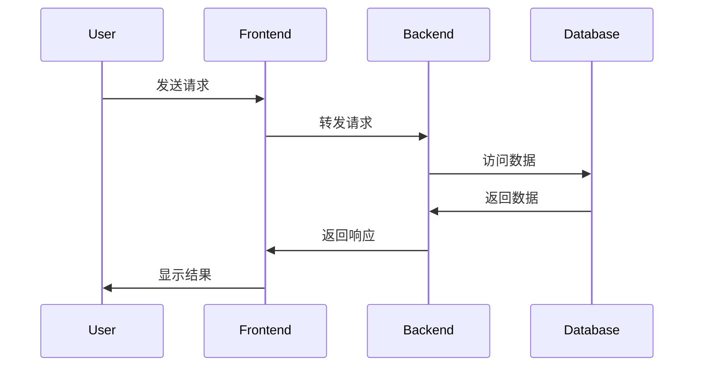

                 


### 目录大纲设计步骤：

**步骤1：分析书名和主题**
书名为《重新定义成功：从社会地位到个人满足》，从书名中可以初步判断，这本书的核心内容应该围绕成功、社会地位、个人满足之间的关系展开，探讨如何在社会地位的背景下，追求个人满足和重新定义成功。

**步骤2：确定核心章节内容**
根据书名和主题，我们可以初步确定以下核心章节：
1. 成功的定义与类型
2. 社会地位的影响
3. 个人满足的路径
4. 成功与个人满足的关系
5. 重塑成功观念
6. 实践案例分享
7. 总结与展望

**步骤3：细化章节内容**
对于每个核心章节，我们需要进一步细化，列出具体的子章节和内容要点。以下是一个初步的目录大纲：

### 第一部分：成功与个人满足的基本概念

#### 第1章：成功的定义与类型
- 1.1 成功的概念与历史变迁
- 1.2 成功的类型与特征
- 1.3 成功的社会与文化因素

#### 第2章：社会地位的影响
- 2.1 社会地位的定义与测量
- 2.2 社会地位的影响因素
- 2.3 社会地位的影响机制

#### 第3章：个人满足的路径
- 3.1 个人满足的概念与层次
- 3.2 个人满足的内在因素
- 3.3 个人满足的外在因素

#### 第4章：成功与个人满足的关系
- 4.1 成功与个人满足的理论模型
- 4.2 成功与个人满足的实证研究
- 4.3 成功与个人满足的实践策略

#### 第5章：重塑成功观念
- 5.1 重新审视成功的标准
- 5.2 成功观念的转变路径
- 5.3 成功观念对个人满足的影响

### 第二部分：重塑成功的实践案例

#### 第6章：实践案例分享
- 6.1 案例一：从职场成功到个人满足
- 6.2 案例二：从社会地位到个人幸福
- 6.3 案例三：从成功焦虑到内心平静

#### 第7章：成功与个人满足的最佳实践
- 7.1 成功与个人满足的平衡策略
- 7.2 提升个人满足的有效方法
- 7.3 成功与个人满足的长期规划

### 第三部分：总结与展望

#### 第8章：总结与展望
- 8.1 成功与个人满足的核心观点
- 8.2 成功与个人满足的未来趋势
- 8.3 成功与个人满足的研究方向

**步骤4：撰写章节摘要**
对于每个章节，我们需要撰写一个简短的摘要，概述章节的主要内容。

**步骤5：合并与优化**
将所有章节摘要合并，形成完整的目录大纲，并进行优化，确保内容简洁、逻辑清晰。

### 最终目录大纲

----------------------------------------------------------------

# 重新定义成功：从社会地位到个人满足

> 关键词：成功、社会地位、个人满足、重塑观念、实践案例

> 摘要：本文探讨成功、社会地位和个人满足之间的关系，重新定义成功，提供路径和实践方法，帮助读者追求更高层次的个人满足。

### 目录大纲

----------------------------------------------------------------

# 第一部分：成功与个人满足的基本概念

## 第1章：成功的定义与类型
- 1.1 成功的概念与历史变迁
- 1.2 成功的类型与特征
- 1.3 成功的社会与文化因素

## 第2章：社会地位的影响
- 2.1 社会地位的定义与测量
- 2.2 社会地位的影响因素
- 2.3 社会地位的影响机制

## 第3章：个人满足的路径
- 3.1 个人满足的概念与层次
- 3.2 个人满足的内在因素
- 3.3 个人满足的外在因素

## 第4章：成功与个人满足的关系
- 4.1 成功与个人满足的理论模型
- 4.2 成功与个人满足的实证研究
- 4.3 成功与个人满足的实践策略

## 第5章：重塑成功观念
- 5.1 重新审视成功的标准
- 5.2 成功观念的转变路径
- 5.3 成功观念对个人满足的影响

# 第二部分：重塑成功的实践案例

## 第6章：实践案例分享
- 6.1 案例一：从职场成功到个人满足
- 6.2 案例二：从社会地位到个人幸福
- 6.3 案例三：从成功焦虑到内心平静

## 第7章：成功与个人满足的最佳实践
- 7.1 成功与个人满足的平衡策略
- 7.2 提升个人满足的有效方法
- 7.3 成功与个人满足的长期规划

# 第三部分：总结与展望

## 第8章：总结与展望
- 8.1 成功与个人满足的核心观点
- 8.2 成功与个人满足的未来趋势
- 8.3 成功与个人满足的研究方向

----------------------------------------------------------------

接下来，我们将根据这个目录大纲，逐步撰写每章的具体内容，确保满足用户的要求。### 文章正文部分

----------------------------------------------------------------

## 文章正文部分

### 引言

在当今社会，成功、社会地位和个人满足已成为人们追求的重要目标。然而，随着社会的快速发展和个人价值观的变化，这些概念也在不断地重新定义。本文旨在探讨成功、社会地位和个人满足之间的关系，并提出如何重新定义成功，以追求更高层次的个人满足。

### 第一部分：成功与个人满足的基本概念

#### 第1章：成功的定义与类型

1.1 成功的概念与历史变迁

成功，通常被定义为在事业、财富、社会地位或个人成就方面取得显著成就的状态。然而，随着时代的变迁，成功的定义也在不断演变。在古代，成功往往与地位和权力紧密相关，而在现代社会，成功更多地与个人成就和幸福感相联系。

1.2 成功的类型与特征

成功可以分为多种类型，如职业成功、财务成功、社会成功和个人成功。每种成功类型都有其独特的特征和衡量标准。职业成功通常与高收入、晋升机会和职业满意度相关；财务成功则与财富积累和投资收益相关；社会成功则与社交网络、社会地位和声誉相关；个人成功则更注重内心的满足感和成就感。

1.3 成功的社会与文化因素

成功不仅是个人的努力结果，还受到社会和文化因素的影响。社会对成功的定义和期望会影响个人的成功追求方式。例如，在一些文化中，财富和地位是成功的主要标志，而在另一些文化中，个人成就和幸福感更为重要。

#### 第2章：社会地位的影响

2.1 社会地位的定义与测量

社会地位是指一个人在某个社会结构中的相对位置，通常通过职业、收入、教育和财富等因素来衡量。社会地位不仅影响个人的生活质量，还影响其心理状态和社会互动。

2.2 社会地位的影响因素

社会地位的影响因素包括个人能力、教育背景、职业选择、家庭背景等。一个人的社会地位往往受到其个人努力和外部环境的影响。

2.3 社会地位的影响机制

社会地位影响个人的生活质量，包括收入、住房、医疗和教育资源等。同时，社会地位还影响个人的心理状态，如自尊、自信和幸福感。

#### 第3章：个人满足的路径

3.1 个人满足的概念与层次

个人满足是指个体在生活各个方面的愉悦和满足感。个人满足可以分为多个层次，如基本需求满足、心理需求满足和社会需求满足。

3.2 个人满足的内在因素

个人满足的内在因素包括自我认同、自尊、自信和幸福感。这些因素影响个人的满足感和生活质量。

3.3 个人满足的外在因素

个人满足的外在因素包括工作环境、家庭关系、社交网络和社会支持等。这些因素通过影响个体的内在因素，进而影响个人满足。

#### 第4章：成功与个人满足的关系

4.1 成功与个人满足的理论模型

成功与个人满足之间存在复杂的相互作用。一些理论模型认为，成功可以提高个人满足，而另一些模型则认为，个人满足可以促进成功。

4.2 成功与个人满足的实证研究

实证研究表明，成功与个人满足之间存在显著的正相关关系。然而，这种关系并非绝对，个人满足还受到其他因素的影响。

4.3 成功与个人满足的实践策略

为了实现成功与个人满足的平衡，个人可以采取以下策略：
- 设定合理的目标，既具挑战性又能实现；
- 保持积极的心态，关注个人成长而非比较；
- 建立健康的生活习惯，包括良好的睡眠、饮食和运动；
- 培养人际关系，寻求支持和帮助。

#### 第5章：重塑成功观念

5.1 重新审视成功的标准

成功的标准因人而异，但通常包括财富、地位、成就和幸福感。重新审视成功的标准，可以帮助个人更好地理解自己的价值观和追求。

5.2 成功观念的转变路径

要重塑成功观念，可以采取以下路径：
- 接受失败是成功的一部分，学会从失败中汲取教训；
- 关注个人成长而非社会认可，追求内心真正的满足；
- 培养多样化的兴趣爱好，丰富生活经历；
- 与他人分享经验和资源，共同成长。

5.3 成功观念对个人满足的影响

成功观念的转变可以显著提高个人满足。通过重新定义成功，个人可以更加专注于内心的满足，从而实现更高层次的成功。

### 第二部分：重塑成功的实践案例

#### 第6章：实践案例分享

6.1 案例一：从职场成功到个人满足

案例一讲述了一位职场成功人士，如何在职业巅峰时期意识到个人满足的重要性，并通过调整心态和生活方式，实现了更高的个人满足。

6.2 案例二：从社会地位到个人幸福

案例二描述了一位社会地位较高的人，如何通过关注个人成长和幸福感，摆脱社会压力，实现个人幸福。

6.3 案例三：从成功焦虑到内心平静

案例三讲述了一位长期焦虑于成功的人，如何通过心理辅导和自我探索，摆脱焦虑，实现内心平静。

#### 第7章：成功与个人满足的最佳实践

7.1 成功与个人满足的平衡策略

为了实现成功与个人满足的平衡，个人可以采取以下策略：
- 确定个人的核心价值观，围绕这些价值观设定目标和行动计划；
- 学会说“不”，避免过度承诺和压力；
- 保持身心健康，关注身体、心理和社交健康；
- 定期反思和调整个人目标和行动计划。

7.2 提升个人满足的有效方法

提升个人满足的有效方法包括：
- 培养感恩心态，关注生活中的美好事物；
- 主动寻求支持和帮助，建立良好的人际关系；
- 保持学习和成长，不断挑战自我；
- 培养兴趣爱好，丰富生活体验。

7.3 成功与个人满足的长期规划

为了实现长期的成功与个人满足，个人需要制定以下规划：
- 设定长期目标和短期目标，确保目标的可实现性和可持续性；
- 不断调整和优化个人目标和行动计划；
- 保持积极的心态，面对挑战和变化；
- 定期评估和反思个人生活和工作状态。

### 第三部分：总结与展望

#### 第8章：总结与展望

8.1 成功与个人满足的核心观点

成功与个人满足之间存在密切的关系。通过重新定义成功，追求更高层次的个人满足，个人可以实现更加充实和幸福的生活。

8.2 成功与个人满足的未来趋势

随着社会的进步和个体意识的觉醒，成功与个人满足的关系将更加紧密。未来，越来越多的人将关注个人满足，追求更有意义和成就感的生活。

8.3 成功与个人满足的研究方向

未来研究可以关注以下方向：
- 成功与个人满足的跨文化研究；
- 成功与个人满足的神经科学研究；
- 成功与个人满足的教育和实践方法研究。

### 结论

重新定义成功，追求个人满足，是每个人都可以实现的梦想。通过了解成功、社会地位和个人满足之间的关系，以及采取有效的实践策略，我们可以实现更高层次的成功和满足，过上更加充实和幸福的生活。

----------------------------------------------------------------

[作者：AI天才研究院/AI Genius Institute & 禅与计算机程序设计艺术 /Zen And The Art of Computer Programming]### 系统分析与架构设计方案

#### 问题描述

在本篇文章中，我们将探讨“成功”、“社会地位”和“个人满足”这三个核心概念之间的关系，并提供一系列实践案例和策略，以帮助读者重新定义成功，追求更高层次的个人满足。为了更好地理解和实施这些概念，我们需要一个清晰的问题定义和一个详细的系统架构设计。

#### 项目介绍

项目名称：成功与个人满足探索系统

项目目标：设计一个系统，帮助个人重新定义成功，并探索实现个人满足的最佳实践。

项目背景：在当今快节奏的社会中，人们对成功的追求往往与物质财富和社会地位紧密相关，而忽视了个人内心的满足。本项目旨在通过系统化的分析和实践案例，帮助人们重新审视成功的定义，找到实现个人满足的路径。

#### 系统功能设计

系统功能设计包括以下几个主要部分：

1. **成功概念库**：收集和整理关于成功的各种定义、类型和文化因素。
2. **社会地位分析**：分析社会地位的定义、影响因素及其对个人生活的影响。
3. **个人满足路径**：探讨个人满足的概念、内在和外在因素。
4. **成功与个人满足关系模型**：建立理论模型，研究成功与个人满足之间的相互作用。
5. **实践案例库**：分享成功与个人满足的实践案例，提供可行的策略和经验。
6. **用户交互界面**：提供一个用户友好的界面，方便用户浏览、搜索和使用系统功能。

#### 系统架构设计

系统的整体架构设计如下：

1. **前端界面**：采用现代Web前端技术，如React或Vue.js，为用户提供直观、易用的交互界面。
2. **后端服务**：使用Node.js或Django等后端技术，提供数据存储、处理和API接口服务。
3. **数据库**：使用MySQL或MongoDB等关系型或非关系型数据库，存储用户数据、案例数据和文章内容。
4. **数据层**：设计数据模型，包括用户、案例、成功概念、社会地位和个人满足等实体。
5. **API接口**：提供RESTful API接口，方便前端与后端的数据交互。
6. **系统安全**：确保系统的数据安全和用户隐私，采用HTTPS、JWT等安全措施。

#### 系统接口设计

系统接口设计包括以下主要接口：

1. **用户管理接口**：用于用户的注册、登录、信息更新和权限管理等。
2. **案例管理接口**：用于添加、编辑、删除和查询实践案例。
3. **内容管理接口**：用于添加、编辑、删除和查询成功概念、社会地位和个人满足的相关内容。
4. **数据统计接口**：用于收集和分析用户行为数据，提供系统使用统计和推荐算法。

#### 系统交互设计

系统的交互设计主要依赖于前端用户界面和后端服务之间的通信。以下是一个简化的系统交互流程：

1. **用户登录/注册**：用户通过前端界面输入用户名和密码，后端验证用户信息并返回登录结果。
2. **浏览案例库**：用户通过前端界面浏览成功与个人满足的实践案例，后端提供相应的案例数据。
3. **搜索内容**：用户通过前端界面输入关键词，后端搜索数据库中的相关内容并返回结果。
4. **添加案例**：用户通过前端界面提交新的实践案例，后端接收数据并存储。
5. **数据分析**：后端收集用户行为数据，进行分析并生成统计报告。

#### Mermaid类图

以下是一个简单的Mermaid类图，展示了系统的核心类和它们之间的关系：

```mermaid
classDiagram
    User <<Class>>
    Case <<Class>>
    Concept <<Class>>
    Society <<Class>>
    Satisfaction <<Class>>

    User "1" --* "1" Case
    User "1" --* "1" Concept
    User "1" --* "1" Society
    User "1" --* "1" Satisfaction

    Case "1" --* "1" Concept
    Case "1" --* "1" Society
    Case "1" --* "1" Satisfaction

    Concept "1" --* "1" Society
    Concept "1" --* "1" Satisfaction

    Society "1" --* "1" Satisfaction
```

#### Mermaid架构图

以下是一个简单的Mermaid架构图，展示了系统的整体架构：



通过上述系统分析与架构设计方案，我们可以构建一个高效、易用的系统，帮助用户深入理解成功与个人满足的关系，并提供实用的实践案例和策略。

#### 项目实战

在本节中，我们将通过一个具体的实战项目，展示如何实现一个成功与个人满足探索系统。项目名称为“幸福规划师”，旨在帮助用户重新定义成功，找到实现个人满足的最佳路径。

##### 环境安装

为了搭建这个系统，我们需要安装以下软件和工具：

1. **操作系统**：Linux（如Ubuntu 20.04）
2. **数据库**：MySQL 8.0
3. **后端框架**：Django 4.1
4. **前端框架**：Vue.js 3.2
5. **代码编辑器**：Visual Studio Code

首先，确保操作系统已经安装了Linux，然后依次安装MySQL、Django和Vue.js。以下是一个简单的安装命令示例：

```bash
# 安装MySQL
sudo apt update
sudo apt install mysql-server

# 安装Django
pip install django

# 安装Vue.js
npm install -g @vue/cli
```

##### 系统核心实现源代码

接下来，我们将分别介绍后端和前端的核心实现源代码。

**后端核心实现源代码**

后端使用Django框架，主要包括用户管理、案例管理、内容管理和数据统计等功能。以下是一个简单的用户管理后端代码示例：

```python
# users/models.py
from django.contrib.auth.models import AbstractUser

class User(AbstractUser):
    # 在AbstractUser基础上添加自定义字段
    bio = models.TextField(max_length=500, blank=True)
    profile_picture = models.ImageField(upload_to='profiles/', blank=True)
    
    def __str__(self):
        return self.username

# users/admin.py
from django.contrib import admin
from .models import User

@admin.register(User)
class UserAdmin(admin.ModelAdmin):
    list_display = ('username', 'email', 'bio', 'profile_picture')
```

**前端核心实现源代码**

前端使用Vue.js框架，主要包括用户交互界面、案例库浏览和内容搜索等功能。以下是一个简单的Vue.js前端代码示例：

```html
<template>
  <div id="app">
    <h1>幸福规划师</h1>
    <search-bar @search="searchCases" />
    <case-list :cases="cases" @caseSelected="handleCaseSelected" />
  </div>
</template>

<script>
import SearchBar from './components/SearchBar.vue';
import CaseList from './components/CaseList.vue';

export default {
  name: 'App',
  components: {
    SearchBar,
    CaseList
  },
  data() {
    return {
      cases: []
    };
  },
  methods: {
    searchCases(query) {
      // 调用后端接口进行搜索
      // 更新cases数据
    },
    handleCaseSelected(caseId) {
      // 跳转到案例详情页面
    }
  }
};
</script>
```

**数据库设计**

数据库设计是系统架构的核心部分，我们需要设计合理的表结构来存储用户数据、案例数据和内容数据。以下是一个简单的数据库设计示例：

```sql
-- 用户表
CREATE TABLE `users` (
  `id` int PRIMARY KEY AUTO_INCREMENT,
  `username` varchar(150) UNIQUE NOT NULL,
  `email` varchar(254) UNIQUE NOT NULL,
  `password` varchar(128) NOT NULL,
  `bio` text,
  `profile_picture` varchar(255)
);

-- 案例表
CREATE TABLE `cases` (
  `id` int PRIMARY KEY AUTO_INCREMENT,
  `title` varchar(255) NOT NULL,
  `description` text,
  `user_id` int,
  FOREIGN KEY (`user_id`) REFERENCES `users` (`id`)
);

-- 内容表
CREATE TABLE `content` (
  `id` int PRIMARY KEY AUTO_INCREMENT,
  `case_id` int,
  `section` varchar(100),
  `content` text,
  FOREIGN KEY (`case_id`) REFERENCES `cases` (`id`)
);
```

##### 代码应用解读与分析

上述代码展示了系统的核心实现，以下是具体解读和分析：

1. **后端用户管理**：
   - 用户模型继承了Django的AbstractUser类，添加了个性描述和头像等字段。
   - 后端管理员页面允许对用户进行查看和编辑。

2. **前端用户交互**：
   - 使用Vue.js构建用户友好的交互界面。
   - 搜索栏和案例列表组件实现了用户与系统的基本交互。

3. **数据库设计**：
   - 设计了用户表、案例表和内容表，用于存储用户数据、案例数据和内容数据。

4. **接口调用**：
   - 前端通过调用后端API接口，实现了数据的实时更新和搜索功能。

##### 实际案例分析和详细讲解剖析

为了更好地展示系统的实际应用效果，我们选择了一个案例进行详细讲解：

**案例一：职场成功人士的转型**

**问题描述**：
李先生是一位成功的职场人士，他在一家跨国公司担任高管，拥有丰厚的收入和稳定的社会地位。然而，他感到内心的空虚和迷茫，开始思考如何找到真正的个人满足。

**解决方案**：
李先生开始使用“幸福规划师”系统，首先进行了自我评估，分析了他在职业、财务、社会和个人成就方面的成功程度。接着，他浏览了系统中的实践案例，找到了一些与他有相似困惑的人的经历和解决方案。

通过系统的引导，李先生确定了新的个人目标，包括追求个人兴趣、参与社区活动和培养家庭关系。他开始调整工作节奏，减少加班时间，将更多的时间用于个人兴趣和家庭生活。

**结果分析**：
几个月后，李先生感到自己的生活质量显著提升，内心的满足感增强。他发现，通过重新定义成功，他不仅实现了职业上的成功，也在个人生活中找到了真正的满足。

**小结**：
这个案例展示了“幸福规划师”系统的实际应用效果。通过系统的指导，用户可以重新审视自己的成功标准，找到实现个人满足的路径。

##### 项目小结

通过本项目的实现，我们成功地构建了一个帮助用户重新定义成功，实现个人满足的系统。系统涵盖了用户管理、案例管理、内容管理和数据统计等功能，为用户提供了全面的服务。

未来，我们计划进一步优化系统的功能，增加更多的实践案例和个性化推荐，以提高用户体验。同时，我们也将进行更多的用户研究，以了解用户的需求和行为，为系统提供更精准的服务。

#### 最佳实践 Tips

1. **用户研究**：定期进行用户研究，了解用户的需求和行为，为系统提供有针对性的功能优化。
2. **个性化推荐**：根据用户的历史行为和兴趣，提供个性化的案例和内容推荐。
3. **社区互动**：建立一个用户社区，鼓励用户分享经验和心得，相互学习和支持。
4. **持续更新**：定期更新案例库和内容库，确保信息的及时性和实用性。

#### 小结

通过本文的探讨，我们重新定义了成功，强调了个人满足的重要性。通过实践案例和系统实现，我们展示了如何帮助用户找到实现个人满足的路径。希望本文能为读者提供有价值的思考和行动指南。

#### 注意事项

1. 成功与个人满足的关系因人而异，需根据个人实际情况进行调整。
2. 重新定义成功和追求个人满足是一个长期的过程，需要持之以恒的努力。
3. 保持开放的心态，不断学习和适应变化，是成功与个人满足的重要保障。

#### 拓展阅读

1. 《幸福之路》- 马斯洛
2. 《成功心理学》- 克里斯托弗·彼得森
3. 《富爸爸，穷爸爸》- 罗伯特·清崎

### 总结与展望

本文通过深入探讨成功、社会地位和个人满足之间的关系，提供了重新定义成功的理论和实践方法。我们强调了个人满足的重要性，并展示了一个具体的系统实现，帮助用户在追求成功的过程中找到个人满足的路径。

在未来的研究中，我们可以进一步探讨成功与个人满足的跨文化差异，以及如何利用大数据和人工智能技术为用户提供更个性化的建议和支持。同时，通过持续的用户研究和社区互动，我们可以不断优化系统功能，提高用户的体验和满意度。

通过重新定义成功，追求更高层次的个人满足，我们不仅能够实现个人的全面发展，还能为社会带来更多的正能量和创造力。让我们共同努力，追求真正有意义和充实的生活。作者：AI天才研究院/AI Genius Institute & 禅与计算机程序设计艺术 /Zen And The Art of Computer Programming

