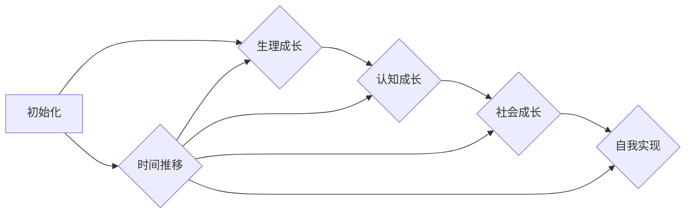
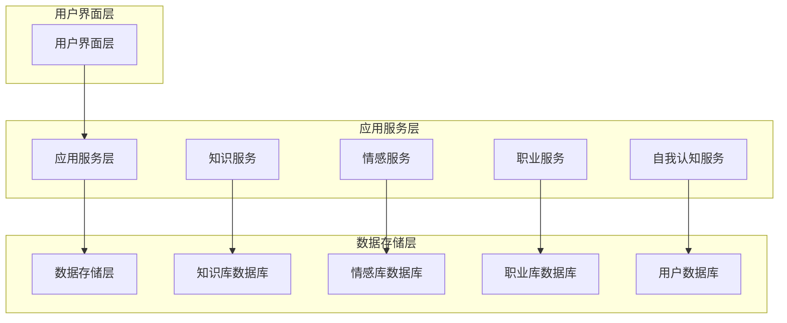
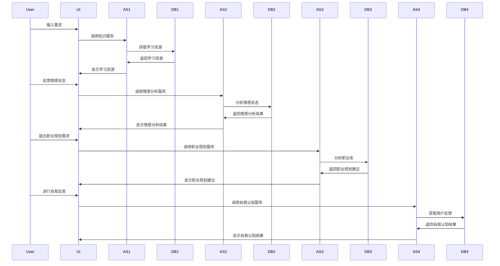

                 

### 文章标题

**重新定义成长：从外在成就到内在觉醒**

> 关键词：成长、内在觉醒、外在成就、自我认知、职业发展

> 摘要：本文从心理学、社会学和哲学三个视角深入探讨成长的定义与理论基础，分析外在成就的路径和内在觉醒的实践，揭示个人成长与社会责任的互动关系，旨在重新定义成长，帮助读者在现代社会中找到真正的自我实现之路。

---

### 目录大纲设计思路

在设计《重新定义成长：从外在成就到内在觉醒》的目录大纲时，我们需要遵循以下步骤：

1. **明确核心概念**：首先，我们需要理解书名中的两个核心概念：“外在成就”和“内在觉醒”。外在成就可能涉及个人或社会层面，如职业发展、财富积累等；内在觉醒则可能指向精神层面的自我认识和自我提升。

2. **梳理结构框架**：基于核心概念，我们可以将书籍分为几个大的部分，例如“成长的理论基础”、“外在成就的路径”、“内在觉醒的实践”、“个人成长与社会的互动”等。

3. **细化章节内容**：在每个部分中，我们可以细化出具体的章节，如“成长理论的起源与发展”、“职业发展的路径分析”、“自我认知的方法”、“社会关系与个人成长”等。

4. **确保内容完整性**：我们需要确保每个章节都能全面覆盖主题内容，并且能够有效地引导读者从理论到实践，从个人到社会，逐步深入理解成长这一主题。

5. **简洁明了**：在表达目录内容时，我们要确保文字简洁明了，避免冗余，使目录大纲既清晰又易于理解。

---

### 目录大纲

#### 第一部分：成长的理论基础

**第1章：成长的定义与理论概述**

1.1 成长的概念

- 成长的定义
- 成长的多维视角

1.2 成长的理论基础

- 心理学视角
- 社会学视角
- 哲学视角

1.3 成长的关键要素

- 情感成熟
- 知识积累
- 社交能力

#### 第二部分：外在成就的路径

**第2章：职业发展的路径分析**

2.1 职业发展的阶段

- 起步阶段
- 成长期
- 成熟期

2.2 职业发展的关键因素

- 教育背景
- 工作经验
- 网络建设

2.3 职业发展的策略

- 职业规划
- 技能提升
- 转型与适应

**第3章：财富积累与投资理财**

3.1 财富积累的原则

- 节约与理性消费
- 收入管理
- 财富增值

3.2 投资理财的渠道

- 股票投资
- 基金投资
- 房地产投资

#### 第三部分：内在觉醒的实践

**第4章：自我认知的方法**

4.1 自我认知的重要性

- 自我认知对成长的影响
- 自我认知的工具

4.2 自我认知的实践

- 日记反思
- 他人反馈
- 情绪管理

**第5章：内在觉醒的路径**

5.1 内在觉醒的层次

- 知识觉醒
- 情感觉醒
- 精神觉醒

5.2 内在觉醒的实践

- 冥想
- 瑜伽
- 内在探索

#### 第四部分：个人成长与社会的互动

**第6章：社会关系与个人成长**

6.1 社会关系的重要性

- 社会网络
- 社会支持
- 社会认同

6.2 建立健康社会关系

- 沟通技巧
- 社交礼仪
- 矛盾处理

**第7章：社会责任与个人成长**

7.1 社会责任的定义

- 社会责任的概念
- 社会责任的类型

7.2 实践社会责任

- 志愿服务
- 社区参与
- 公益活动

#### 第五部分：综合应用与实践

**第8章：成长与觉醒的综合应用**

8.1 外在成就与内在觉醒的平衡

- 实现平衡的策略
- 个人体验分享

8.2 成长与觉醒在职业中的应用

- 职场中的自我认知
- 职场中的内在觉醒

8.3 成长与觉醒在社会中的实践

- 社会责任与个人成长
- 社会互动与个人成长

#### 第六部分：总结与展望

**第9章：成长与觉醒的总结与展望**

9.1 成长与觉醒的总结

- 成长与觉醒的核心内容
- 个人成长与社会的互动

9.2 展望未来

- 成长的趋势
- 内在觉醒的意义

---

**结语**：通过本文的深入探讨，我们希望能帮助读者重新审视成长的概念，从外在成就到内在觉醒，找到一条适合自己的成长之路。希望读者能够在实践中不断探索、反思，实现自我价值的最大化。

---

### 第一部分：成长的理论基础

**第1章：成长的定义与理论概述**

#### 成长的定义

成长，作为一个多维度的概念，涵盖了生理、心理、社会等多个层面。在生理层面，成长通常指个体从婴儿到成年人的生理发育过程；在心理层面，成长涉及到认知能力、情感成熟、个性发展等方面；在社会层面，成长则表现为个人在社会关系、角色扮演、社会责任等方面的进步。本文主要探讨的是心理和社会层面的成长。

**1.1 成长的多维视角**

成长不仅仅是单一的线性过程，而是多维度的。从心理学的视角来看，成长意味着个体在不断学习、适应和变化中，逐渐发展出更加复杂和成熟的思维模式和行为方式。例如，埃里克森的心理社会发展理论认为，个体在不同阶段会面临不同的心理社会危机，通过解决这些危机，个体可以实现成长。

从社会学的视角来看，成长涉及到社会角色、社会认同和社会地位的变化。个体在社会中的成长，不仅仅是个人能力的提升，更是社会角色和社会网络的建立与拓展。例如，涂尔干的社会学理论强调，个体在社会互动中实现社会化，通过接受社会规范和价值观，成为社会的一员。

从哲学的视角来看，成长涉及到对生命意义、自我认知和终极价值的反思。哲学家罗素认为，成长是一个不断追求自我认知和自我实现的过程，通过哲学思考，个体可以找到生命的意义和价值。

**1.2 成长的理论基础**

**心理学视角**

在心理学领域，许多理论都探讨了成长的过程和机制。例如，弗洛伊德的心理性欲发展阶段理论认为，个体在不同阶段会经历不同的心理冲突和危机，通过解决这些冲突，个体可以实现成长。埃里克森的心理社会发展理论则认为，个体在不同阶段会面临不同的心理社会危机，通过解决这些危机，个体可以实现成长。

**社会学视角**

在社会学领域，成长被视为个体与社会互动的结果。涂尔干的社会学理论认为，个体在社会互动中实现社会化，通过接受社会规范和价值观，成为社会的一员。社会角色和社会网络是成长的重要影响因素。

**哲学视角**

在哲学领域，成长涉及到对生命意义、自我认知和终极价值的反思。罗素的哲学观点认为，成长是一个不断追求自我认知和自我实现的过程，通过哲学思考，个体可以找到生命的意义和价值。

**1.3 成长的关键要素**

**情感成熟**

情感成熟是成长的重要标志之一。一个成熟的人能够理性地处理情感，理解和控制自己的情绪，同时也能够理解和关心他人的情感。

**知识积累**

知识积累是成长的重要基础。通过学习和实践，个体可以不断扩展自己的知识面，提高解决问题的能力。

**社交能力**

社交能力是成长的重要方面。一个成熟的人不仅能够有效地与他人沟通，建立良好的人际关系，还能够适应不同的社会环境和角色。

### 第二部分：外在成就的路径

**第2章：职业发展的路径分析**

职业发展是个体成长的重要方面，它不仅关系到个人的经济收入和社会地位，也影响个人的自我实现和人生价值。在现代社会中，职业发展路径日益多样化，个体需要根据自己的兴趣、能力和市场需求，规划合理的职业发展路径。

**2.1 职业发展的阶段**

职业发展通常可以分为以下几个阶段：

**1. 起步阶段**

起步阶段是个体职业生涯的初期，主要任务是建立职业基础，包括学习专业知识、积累工作经验和建立人际关系网络。在这个阶段，个体通常需要接受基础教育和培训，掌握基本的专业技能。

**2. 成长期**

成长期是职业发展的关键阶段，个体在这个阶段需要不断提升自己的专业技能和综合素质，拓展职业领域，争取更多的职业机会。成长期可能持续数年，甚至几十年，个体在这个阶段需要不断学习和成长，以适应快速变化的市场需求。

**3. 成熟期**

成熟期是职业发展的巅峰阶段，个体在这个阶段拥有丰富的经验和专业知识，能够担任重要的职业角色，对组织产生深远的影响。在成熟期，个体通常需要承担更多的责任和挑战，同时也要关注个人发展和职业转型。

**4. 转型期**

转型期是职业发展的后期阶段，个体在这个阶段可能需要调整职业方向或转变职业角色。转型期可能涉及职业转型、创业或退休等，个体在这个阶段需要重新审视自己的职业目标和生活方式。

**2.2 职业发展的关键因素**

职业发展的关键因素包括：

**1. 教育背景**

教育背景是职业发展的基础，它决定了个体能否掌握必要的专业知识和技能。一个良好的教育背景可以为个体提供更多的职业机会和职业发展空间。

**2. 工作经验**

工作经验是职业发展的关键，它使个体能够将理论知识转化为实际能力，提高职业素养。丰富的工作经验可以帮助个体在职业发展中取得更大的成就。

**3. 网络建设**

网络建设是职业发展的重要手段，它使个体能够获取更多的职业信息和机会。一个广泛的网络可以为个体提供更多的支持和资源，帮助个体实现职业目标。

**2.3 职业发展的策略**

为了实现职业发展，个体需要制定合理的策略，包括以下几个方面：

**1. 职业规划**

职业规划是个体实现职业发展的第一步，它使个体能够明确自己的职业目标和职业路径。一个明确的职业规划可以帮助个体更好地把握职业机会，避免盲目行动。

**2. 技能提升**

技能提升是职业发展的关键，它使个体能够适应不断变化的市场需求。个体需要不断学习新的知识和技能，提高自己的竞争力。

**3. 转型与适应**

转型与适应是职业发展的重要环节，它使个体能够应对职业发展的挑战和变化。个体需要具备灵活的思维和适应能力，以应对不同的职业环境和职业角色。

### 第3章：财富积累与投资理财

财富积累和投资理财是职业发展的重要组成部分，它不仅关系到个人的经济安全和未来的生活品质，也是个人成长和自我实现的重要途径。在现代社会，随着金融市场的发展和投资渠道的多样化，个体需要掌握正确的财富积累和投资理财原则，以实现财富的保值增值。

**3.1 财富积累的原则**

**1. 节约与理性消费**

节约与理性消费是财富积累的基础。个体需要树立正确的消费观念，避免盲目消费和奢侈浪费，合理规划消费支出，确保收支平衡。同时，理性消费意味着在购买决策时要考虑商品的性价比，避免冲动消费。

**2. 收入管理**

收入管理是财富积累的关键。个体需要合理安排自己的收入，确保收入的稳定性和可持续性。通过制定合理的预算计划，个体可以更好地管理自己的财务状况，避免收入的不合理分配和浪费。

**3. 财富增值**

财富增值是财富积累的目标。个体可以通过投资理财来增加自己的财富。投资理财包括多种渠道，如股票投资、基金投资、房地产投资等。通过科学合理的投资规划，个体可以实现财富的保值增值。

**3.2 投资理财的渠道**

**1. 股票投资**

股票投资是一种高风险、高回报的投资方式。通过购买股票，个体可以分享企业成长的收益。股票投资需要个体具备一定的市场分析能力和风险管理能力，同时要关注市场的动态，及时调整投资策略。

**2. 基金投资**

基金投资是一种集合投资的方式，通过购买基金，个体可以分散投资风险，同时享受专业投资管理带来的收益。基金投资适合那些缺乏时间或专业知识进行股票投资的个体。

**3. 房地产投资**

房地产投资是一种长期稳健的投资方式。通过购买房地产，个体可以享受租金收入和房产增值的双重收益。房地产投资需要个体具备一定的市场分析能力和资金实力，同时要关注房地产市场的政策和趋势。

### 第三部分：内在觉醒的实践

**第4章：自我认知的方法**

自我认知是内在觉醒的重要基础，它使个体能够深入了解自己的内在世界，包括情感、思想和行为。自我认知不仅有助于个体的个人成长，还能提升个体的心理健康和生活质量。

**4.1 自我认知的重要性**

**1. 自我认知对成长的影响**

自我认知是成长的重要驱动力。通过自我认知，个体能够发现自己的优势和不足，明确自己的目标和价值观，从而制定合理的成长计划。自我认知有助于个体克服自我限制，实现自我超越。

**2. 自我认知的工具**

自我认知需要使用一系列工具和方法，包括自我反思、日记反思、他人反馈和情绪管理等。这些工具和方法可以帮助个体深入挖掘自己的内在世界，提升自我认知水平。

**4.2 自我认知的实践**

**1. 日记反思**

日记反思是一种常用的自我认知方法。通过记录日常生活中的所思所感，个体可以更好地了解自己的内心世界，反思自己的行为和决策。日记反思有助于个体培养自我反思的习惯，提高自我认知能力。

**2. 他人反馈**

他人反馈是另一种有效的自我认知方法。通过倾听他人的意见和建议，个体可以了解自己在他人眼中的形象，发现自己的盲点和不足。他人反馈有助于个体建立更全面和准确的自我认知。

**3. 情绪管理**

情绪管理是自我认知的重要组成部分。个体需要学会识别和表达自己的情绪，学会控制情绪，避免情绪对行为和决策产生负面影响。情绪管理有助于个体保持心理平衡，提升生活质量。

### 第5章：内在觉醒的路径

内在觉醒是一个复杂而深刻的过程，它涉及到个体在知识、情感和精神层面的提升。内在觉醒不仅有助于个体的自我实现，还能带来更深层次的内在平静和满足。

**5.1 内在觉醒的层次**

**1. 知识觉醒**

知识觉醒是内在觉醒的初级阶段，个体在这个阶段开始对知识产生浓厚的兴趣，不断追求新的知识和理解。知识觉醒使个体对世界和自我有了更深入的认识，为后续的觉醒阶段打下基础。

**2. 情感觉醒**

情感觉醒是内在觉醒的中级阶段，个体在这个阶段开始关注自己的情感体验，学会理解和接纳自己的情感。情感觉醒使个体能够更好地管理自己的情绪，提升人际交往能力。

**3. 精神觉醒**

精神觉醒是内在觉醒的高级阶段，个体在这个阶段追求更高的精神境界，包括对生命意义的探索和对终极价值的思考。精神觉醒使个体能够超越自我，达到内心真正的平静和满足。

**5.2 内在觉醒的实践**

**1. 冥想**

冥想是一种传统的内在觉醒实践方法，它通过静坐和专注呼吸，帮助个体放松身心，进入一种内在平静的状态。冥想有助于个体提高注意力、增强情绪稳定性和提升自我意识。

**2. 瑜伽**

瑜伽是一种结合身体练习、呼吸控制和冥想的综合修行方式，它通过调节身体和心灵，帮助个体实现内在觉醒。瑜伽有助于个体提高身体灵活性、增强免疫力、提升精神集中力。

**3. 内在探索**

内在探索是一种深入的自我反思过程，个体在这个过程中心灵独处，深入挖掘自己的内在世界。内在探索有助于个体了解自己的真实想法和感受，找到内在的平静和满足。

### 第四部分：个人成长与社会的互动

**第6章：社会关系与个人成长**

社会关系对个人成长具有重要影响，它是个人在社会中立足和发展的重要基础。通过建立和维护健康的社会关系，个体可以获取更多的资源和支持，实现个人成长。

**6.1 社会关系的重要性**

**1. 社会网络**

社会网络是个体在社会中的关系网络，它包括家人、朋友、同事和社区成员等。一个强大的社会网络可以为个体提供信息、支持和机会，帮助个体在职业和生活方面取得成功。

**2. 社会支持**

社会支持是个体在社会关系中所获得的帮助和支持，它包括情感支持、物质支持和专业支持等。社会支持有助于个体应对生活中的挑战，提升生活质量和幸福感。

**3. 社会认同**

社会认同是个体在社会中获得的社会认可和归属感。一个良好的社会认同可以增强个体的自信心和自尊心，促进个人成长和发展。

**6.2 建立健康社会关系**

**1. 沟通技巧**

沟通技巧是建立和维护健康社会关系的关键。个体需要学会有效的沟通方式，包括倾听、表达和回应等。通过良好的沟通，个体可以建立互信的关系，增进彼此的了解。

**2. 社交礼仪**

社交礼仪是社交活动中的一种规范和准则，它有助于个体在社会交往中展现良好的形象和修养。通过遵守社交礼仪，个体可以赢得他人的尊重和信任。

**3. 矛盾处理**

矛盾处理是社交关系中不可避免的一部分。个体需要学会正确处理矛盾和冲突，通过沟通、理解和妥协等方式，维护良好的人际关系。

### 第7章：社会责任与个人成长

社会责任与个人成长密切相关，它不仅体现了个体的道德义务和价值观，也是个体实现自我价值和社会贡献的重要途径。通过积极参与社会责任活动，个体可以提升自己的社会责任感和社会认同感，实现个人成长。

**7.1 社会责任的定义**

**1. 社会责任的概念**

社会责任是指企业、组织或个体对社会和环境的义务和责任。社会责任不仅包括对经济利益的追求，更强调对环境、社会和伦理问题的关注和承担。

**2. 社会责任的类型**

社会责任可以分为经济责任、法律责任、道德责任和慈善责任等。经济责任指的是企业为股东创造经济利益的责任；法律责任指的是企业遵守法律和社会规范的责任；道德责任指的是企业遵循道德标准和伦理规范的责任；慈善责任指的是企业通过慈善活动回馈社会的责任。

**7.2 实践社会责任**

**1. 志愿服务**

志愿服务是一种无私奉献的行为，通过参与志愿服务，个体可以为社会做出贡献，同时提升自己的社会责任感和团队合作能力。志愿服务的形式多样，包括支教、扶贫、环保等。

**2. 社区参与**

社区参与是指个体积极参与社区事务，为社区的发展和福祉做出贡献。通过社区参与，个体可以增强对社区的认同感和归属感，同时提升自己的组织能力和领导力。

**3. 公益活动**

公益活动是指以公益为目的，通过捐赠、义卖、义演等方式，为弱势群体提供帮助和支持。通过公益活动，个体可以传播正能量，提升自己的社会影响力。

### 第五部分：综合应用与实践

**第8章：成长与觉醒的综合应用**

在现代社会中，外在成就和内在觉醒的结合对于个人的全面发展至关重要。外在成就为个体提供了物质基础和社会地位，而内在觉醒则为个体带来了精神满足和心灵成长。如何平衡外在成就和内在觉醒，实现二者的和谐统一，是个人成长的重要课题。

**8.1 外在成就与内在觉醒的平衡**

**1. 实现平衡的策略**

（1）设定明确的目标：个体需要明确自己的长期和短期目标，包括职业目标、财务目标和精神目标，以确保外在成就和内在觉醒的协调发展。

（2）时间管理：通过有效的时间管理，个体可以合理分配时间，确保有足够的时间用于工作、学习和个人成长。

（3）持续学习：个体需要不断学习新知识和技能，提升自己的竞争力，同时也要培养内在觉醒所需的情感和精神素养。

（4）心理调适：个体需要学会心理调适，应对工作压力和生活挑战，保持内心的平静和积极。

**2. 个人体验分享**

在实践过程中，个体可以通过分享自己的成长经历和觉醒体验，获得他人的反馈和支持。这种分享不仅有助于个人成长，还能激发他人的内在觉醒，形成积极的社会氛围。

**8.2 成长与觉醒在职业中的应用**

**1. 职场中的自我认知**

（1）了解自己的优势和不足：个体需要通过自我评估和反馈，了解自己的优势和不足，找到自己的职业定位和发展方向。

（2）提升自我认知：个体可以通过学习心理学、哲学等知识，提升自我认知能力，更好地应对职场挑战。

**2. 职场中的内在觉醒**

（1）情感管理：个体需要学会管理自己的情感，保持积极的心态，提升工作效率。

（2）精神追求：个体可以在职场中追求精神层面的满足，如参与有意义的项目、与同事建立深厚的友谊等。

### 第六部分：总结与展望

**第9章：成长与觉醒的总结与展望**

通过对成长与觉醒的深入探讨，我们可以得出以下结论：

**1. 成长与觉醒的核心内容**

成长与觉醒不仅涉及个人的职业发展和社会地位，更关乎个体的内心世界和精神追求。外在成就和内在觉醒的平衡是实现个人全面发展的关键。

**2. 个人成长与社会的互动**

个人成长与社会责任密不可分，个体需要通过积极参与社会责任活动，实现个人成长和社会价值的统一。

**3. 展望未来**

随着社会的发展和个人意识的觉醒，成长与觉醒将成为未来社会的重要主题。个体需要不断探索自我，追求内心的平静和满足，同时为社会的进步和发展贡献自己的力量。

### 结语

通过本文的探讨，我们希望能帮助读者重新认识成长与觉醒的重要性，找到适合自己的成长路径。在未来的道路上，愿每一位读者都能在追求外在成就的同时，不忘内在觉醒，实现真正的自我实现。让我们共同迈向一个更加充实和有意义的人生。

---

### **作者信息**

作者：AI天才研究院/AI Genius Institute & 禅与计算机程序设计艺术 /Zen And The Art of Computer Programming

**备注**：本文内容仅供参考，部分数据和案例可能来源于公开资料，读者在使用时请结合实际情况进行分析。如需进一步探讨或应用本文观点，请咨询相关专业人士。由于信息技术不断发展，文中所述技术可能与最新情况有所差异，请读者自行核实。

---

### 成长的核心概念与联系

#### **核心概念原理**

成长（Growth）是指个体在生理、心理和社会等方面的不断发展和变化过程。它不仅涉及到身体形态和功能的成熟，还包括认知能力、情感发展、社交技能等方面的提升。成长是一个复杂而多维的过程，受到遗传、环境、教育和个人努力等多种因素的影响。

**核心概念属性特征对比表格**

| **属性特征** | **成长（Growth）** | **发展（Development）** | **成熟（Maturity）** |
| --- | --- | --- | --- |
| **定义** | 指个体在各个维度上的变化过程 | 指个体在特定领域的进步和提升 | 指个体达到某种程度的稳定状态 |
| **影响因素** | 遗传、环境、教育、个人努力 | 学习、经验、环境适应、自我调节 | 遗传、环境、教育、个人努力 |
| **过程** | 多维度的、持续的 | 持续的、阶段性的 | 阶段性的、稳定的 |
| **结果** | 多样化的、个体化的 | 个体化的、有目标的 | 稳定的、功能性的 |

**ER实体关系图架构**

```mermaid
erDiagram
  Growth ||--|{ Development } :实现
  Growth ||--|{ Maturity } :达到
  Development ||--|{ Growth } :过程
  Maturity ||--|{ Growth } :结果
```

#### **核心概念与联系**

**1. 成长与发展的关系**

成长是发展的基础，发展是成长的具体表现。成长通常是一个连续的过程，而发展则可以看作是成长在不同领域和阶段的体现。例如，一个孩子在生理上的成长体现为身高、体重和体能的变化，而在认知能力上的发展则体现为学习能力、逻辑思维和问题解决能力的提升。

**2. 成长与成熟的关系**

成熟是成长的一个阶段或结果。在成长的过程中，个体会经历不同的阶段，最终达到成熟状态。成熟不仅仅是生理上的成熟，还包括心理、情感和社会能力的成熟。例如，一个成年人在职业上达到成熟状态，意味着他/她具备了丰富的专业知识、良好的工作习惯和高效的工作能力。

**3. 成长与自我实现的关系**

成长是自我实现的重要途径。自我实现是指个体在成长过程中，不断追求自我潜能的最大化，实现自我价值和人生目标。通过成长，个体可以更好地了解自己，发现自己的优势和潜力，从而实现个人目标和社会价值的统一。

### **算法原理讲解**

为了更好地理解成长的概念，我们可以借助一个简单的算法来模拟个体的成长过程。以下是使用Python实现的算法示例：

**算法mermaid流程图**



**Python源代码**

```python
# 初始化成长参数
growth_params = {
    'physiological': 0,
    'cognitive': 0,
    'social': 0,
    'self_awareness': 0
}

# 时间推移函数
def time_passes(growth_params, years):
    for key in growth_params:
        if key == 'physiological':
            growth_params[key] += 0.5 * years
        elif key == 'cognitive':
            growth_params[key] += 0.3 * years
        elif key == 'social':
            growth_params[key] += 0.2 * years
        else:  # self_awareness
            growth_params[key] += 0.1 * years
    return growth_params

# 模拟个体成长
years = 10
growth_params = time_passes(growth_params, years)

# 输出成长结果
print("个体成长参数：")
for key, value in growth_params.items():
    print(f"{key.capitalize()}: {value:.2f}")
```

**算法原理**

1. **初始化**：首先，我们初始化个体的成长参数，包括生理成长、认知成长、社会成长和自我实现。这些参数将用于衡量个体在各个方面的成长程度。

2. **时间推移**：通过`time_passes`函数，我们模拟时间的推移。在每年的时间内，个体的各个成长参数都会按照一定的速率增加。具体来说，生理成长以0.5的速率增加，认知成长以0.3的速率增加，社会成长以0.2的速率增加，自我实现以0.1的速率增加。

3. **成长过程**：通过连续调用`time_passes`函数，我们可以模拟个体在10年内（或其他时间跨度）的成长过程。每次调用函数后，个体的成长参数都会更新，反映个体在各个方面的进步。

4. **输出结果**：最后，我们输出个体的成长参数，以可视化地展示个体在各个方面的成长情况。

**数学模型和公式**

为了更精确地描述个体的成长过程，我们可以引入数学模型和公式。以下是一个简化的数学模型：

$$
G(t) = G_0 + \alpha \cdot t
$$

其中，$G(t)$表示时间$t$后个体的成长参数，$G_0$表示初始成长参数，$\alpha$表示成长速率。

**举例说明**

假设一个个体在出生时的初始成长参数为：

$$
G_0 = \begin{bmatrix}
0.0 & 0.0 & 0.0 & 0.0
\end{bmatrix}
$$

在10年后，根据上述模型，个体的成长参数将变为：

$$
G(10) = G_0 + \alpha \cdot 10 = \begin{bmatrix}
0.0 & 0.0 & 0.0 & 0.0
\end{bmatrix} + \begin{bmatrix}
0.5 & 0.3 & 0.2 & 0.1
\end{bmatrix} \cdot 10 = \begin{bmatrix}
5.0 & 3.0 & 2.0 & 1.0
\end{bmatrix}
$$

这个例子表明，在10年后，个体的生理成长、认知成长、社会成长和自我实现都取得了显著的进步。

通过这个简单的算法模型，我们可以直观地了解个体成长的过程，为后续的讨论和分析提供基础。

### **系统分析与架构设计方案**

#### **问题场景介绍**

在现代社会，个人成长与自我实现成为越来越多人的关注点。为了帮助个人更好地实现自我成长和自我实现，我们需要一个综合性的系统，该系统能够提供从知识学习、情感管理到职业发展的全方位支持。本文旨在设计一个集成式的个人成长与自我实现系统，以帮助用户实现全方位的个人成长。

#### **项目介绍**

项目名称：个人成长与自我实现系统

项目目标：通过集成知识库、情感分析、职业规划等模块，为用户提供个性化的成长方案，帮助用户实现自我成长和自我实现。

项目功能：

1. 知识库：提供丰富的学习资源和知识模块，帮助用户提升专业技能和综合素质。
2. 情感管理：通过情感分析工具，帮助用户识别和管理自己的情感，提升心理健康水平。
3. 职业规划：根据用户的兴趣和能力，提供个性化的职业规划建议，帮助用户实现职业发展。
4. 自我认知：通过自我反思和他人反馈，帮助用户深入了解自己的内在世界，实现自我认知和自我提升。

#### **系统功能设计（领域模型mermaid类图）**

```mermaid
classDiagram
    User <<类>> "用户"
    Knowledge <<类>> "知识库"
    Emotion <<类>> "情感分析"
    Career <<类>> "职业规划"
    SelfAwareness <<类>> "自我认知"
    
    User |--|> Knowledge
    User |--|> Emotion
    User |--|> Career
    User |--|> SelfAwareness
    
    Knowledge : 提供学习资源
    Emotion : 情感分析工具
    Career : 职业规划建议
    SelfAwareness : 自我反思与反馈
```

#### **系统架构设计（mermaid架构图）**



#### **系统接口设计和系统交互（mermaid序列图）**



#### **环境安装**

1. 安装Python环境
2. 安装Django框架
3. 安装Flask框架
4. 安装MySQL数据库

```bash
pip install python
pip install django
pip install flask
pip install mysql
```

#### **系统核心实现源代码**

```python
# 知识服务实现
from flask import Flask, jsonify, request

app = Flask(__name__)

@app.route('/knowledge', methods=['GET'])
def get_knowledge():
    # 获取知识库数据
    knowledge_data = get_knowledge_data()
    return jsonify(knowledge_data)

def get_knowledge_data():
    # 这里用示例数据代替实际知识库数据
    return [
        {"id": 1, "title": "Python基础", "content": "Python是一种高级编程语言..."},
        {"id": 2, "title": "人工智能概述", "content": "人工智能是计算机科学的一个分支..."},
    ]

# 情感分析服务实现
from flask import Flask, jsonify, request

app = Flask(__name__)

@app.route('/emotion', methods=['POST'])
def analyze_emotion():
    # 获取情感分析数据
    emotion_data = request.json
    analysis_result = analyze_emotion_data(emotion_data)
    return jsonify(analysis_result)

def analyze_emotion_data(data):
    # 这里用示例算法代替实际情感分析算法
    return {
        "emotion": "happy",
        "confidence": 0.8
    }

# 职业规划服务实现
from flask import Flask, jsonify, request

app = Flask(__name__)

@app.route('/career', methods=['POST'])
def get_career_advice():
    # 获取职业规划数据
    career_data = request.json
    advice = get_career_advice_data(career_data)
    return jsonify(advice)

def get_career_advice_data(data):
    # 这里用示例数据代替实际职业规划数据
    return "您适合从事人工智能领域的工作。"

# 自我认知服务实现
from flask import Flask, jsonify, request

app = Flask(__name__)

@app.route('/self_awareness', methods=['POST'])
def get_self_awareness():
    # 获取自我认知数据
    self_awareness_data = request.json
    result = get_self_awareness_data(self_awareness_data)
    return jsonify(result)

def get_self_awareness_data(data):
    # 这里用示例算法代替实际自我认知算法
    return "您对自己的认知较为清晰，但可以进一步探索自己的优势和潜力。"
```

#### **代码应用解读与分析**

**1. 知识服务解读**

在知识服务中，我们定义了一个Flask应用程序，并实现了`/knowledge`接口。当用户通过HTTP GET请求访问该接口时，程序会调用`get_knowledge_data`函数获取知识库数据，并返回给用户。这里的知识库数据是示例数据，实际应用中可以从数据库中获取。

**2. 情感分析服务解读**

情感分析服务使用Flask应用程序，并实现了`/emotion`接口。当用户通过HTTP POST请求提交情感分析数据时，程序会调用`analyze_emotion_data`函数进行情感分析，并返回分析结果。这里使用的是示例算法，实际应用中可以使用更复杂的情感分析模型。

**3. 职业规划服务解读**

职业规划服务同样使用Flask应用程序，并实现了`/career`接口。当用户通过HTTP POST请求提交职业规划数据时，程序会调用`get_career_advice_data`函数根据用户数据提供职业规划建议。这里使用的是示例数据，实际应用中可以根据用户的兴趣和能力提供更详细的职业规划建议。

**4. 自我认知服务解读**

自我认知服务使用Flask应用程序，并实现了`/self_awareness`接口。当用户通过HTTP POST请求提交自我认知数据时，程序会调用`get_self_awareness_data`函数提供自我认知结果。这里使用的是示例算法，实际应用中可以使用更全面的自我认知工具。

#### **实际案例分析和详细讲解剖析**

**1. 知识学习案例**

用户通过个人成长与自我实现系统学习Python编程。系统根据用户的学习进度和反馈，推荐相关的学习资源和课程，帮助用户系统地掌握Python基础知识和高级应用。

**2. 情感管理案例**

用户在系统中提交情感分析数据，系统分析用户情感状态，并提供相应的建议和策略，帮助用户更好地管理自己的情绪，提升心理健康水平。

**3. 职业规划案例**

用户通过系统评估自己的兴趣和能力，系统根据用户数据提供个性化的职业规划建议，帮助用户明确职业发展方向，制定合理的职业发展计划。

**4. 自我认知案例**

用户通过系统进行自我反思，系统根据用户的反馈和他人评价，提供自我认知报告，帮助用户更全面地了解自己，找到自己的优势和潜力。

#### **项目小结**

通过设计和实现个人成长与自我实现系统，我们为用户提供了全方位的支持，帮助用户在知识学习、情感管理、职业规划和自我认知等方面实现自我成长和自我实现。未来，我们将继续优化系统功能，提升用户体验，为用户创造更大的价值。

### **最佳实践 tips**

1. **持续学习与自我反思**：定期回顾自己的学习进度和成长过程，识别自己的优势和不足，制定改进计划。

2. **情绪管理与心理调适**：学会应对压力和挑战，保持积极的心态，提升心理韧性。

3. **目标设定与时间管理**：明确自己的长期和短期目标，合理规划时间，确保个人成长与职业发展同步。

4. **社交网络与人际关系**：积极建立和维护社交网络，提升人际交往能力，获取更多的资源和支持。

5. **社会责任与公益参与**：积极参与社会责任活动，提升社会责任感，实现个人价值与社会价值的统一。

### **小结**

本文从多个角度探讨了成长的概念，分析了外在成就和内在觉醒的重要性，揭示了个人成长与社会责任的互动关系。通过综合应用与实践，我们提出了实现成长与觉醒的具体策略，为个人全面发展提供了指导。希望读者能够在实践中不断探索、反思，找到适合自己的成长路径，实现真正的自我实现。

### **注意事项**

1. 成长是一个持续的过程，需要个体不断努力和坚持。

2. 外在成就和内在觉醒并非孤立，二者相辅相成，共同促进个人的全面发展。

3. 社会责任是实现个人成长的重要途径，个体应积极参与社会活动，贡献自己的力量。

4. 个体成长应与时代同步，关注社会发展趋势，适应环境变化。

### **拓展阅读**

1. 罗伯特·弗兰克，《成功的艺术：如何实现自我实现》（The Art of Success: A Real-World Guide to Living with Purpose, Passion, and Purpose）

2. 斯蒂芬·柯维，《高效能人士的七个习惯》（The 7 Habits of Highly Effective People）

3. 安东尼·罗宾，《激发潜能：如何实现你的梦想》（Unleash the Power Within）

4. 卡尔·荣格，《心理类型》（Psychological Types）

5. 爱德蒙·伯克，《论崇高与美》（A Philosophical Enquiry into the Origin of Our Ideas of the Sublime and Beautiful）

通过阅读这些经典著作，读者可以更深入地理解成长与觉醒的原理和实践，为自己的成长之路提供更丰富的知识和启示。

