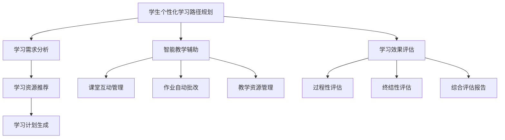
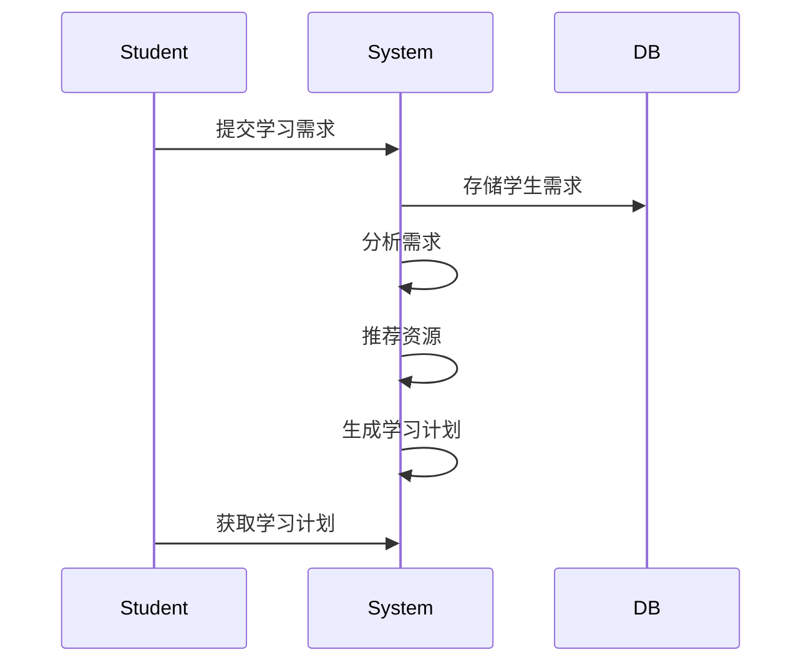
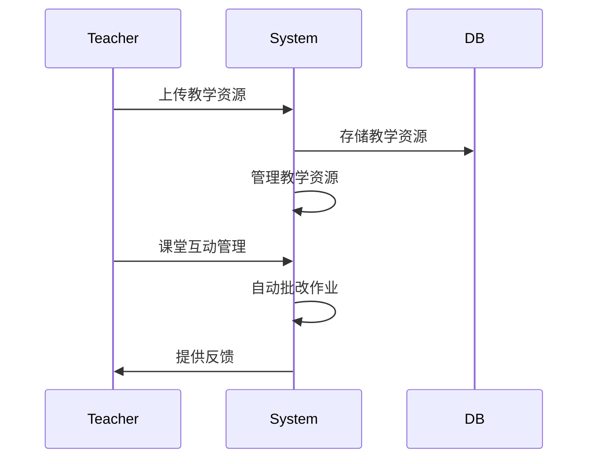
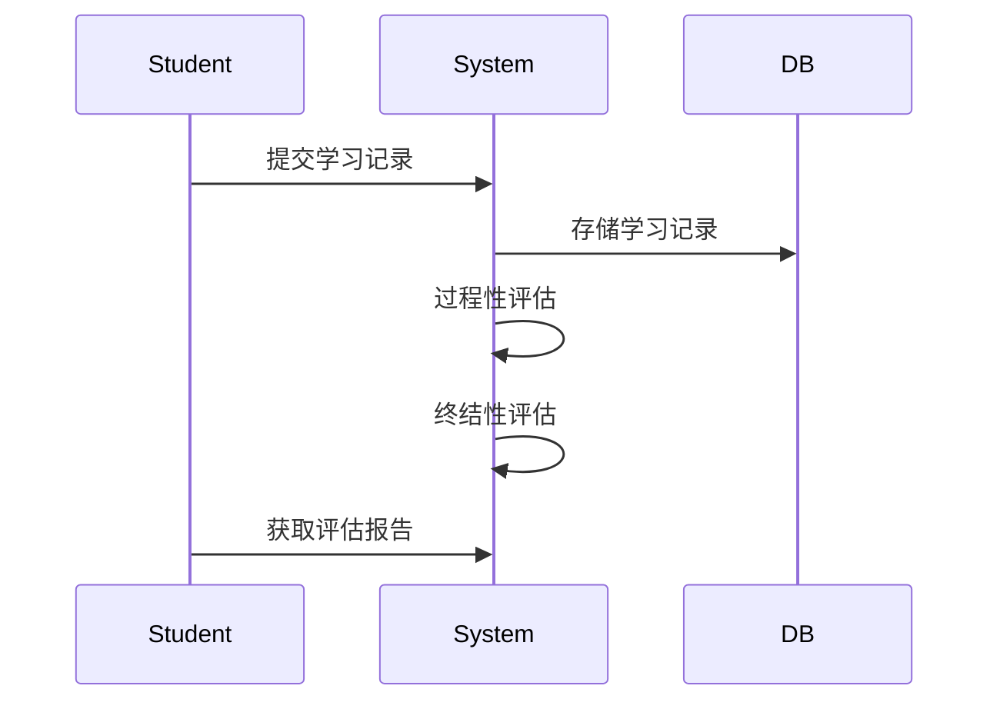

                 

## 第一部分：问题背景与核心概念

### 第1章：教育与知识传授的困境

#### 1.1 教育现状与挑战

在当今社会，教育被视为个人发展和社会进步的基石。然而，现有的教育体制在快速变化的世界中面临着诸多挑战。首先，当前的教育体系主要以知识传授为核心。学生通过记忆和重复练习来掌握学科知识，这种方式虽然能够确保知识的普及，但却忽略了学生对知识的理解和应用能力的培养。

一个显著的例子是标准化考试。虽然标准化考试能够快速评估学生的学习成果，但它往往注重的是学生对知识点的死记硬背，而忽视了学生的创造力和批判性思维。这种教育模式往往导致学生在实际应用中缺乏灵活性，难以解决复杂的问题。

此外，现有的教育模式也存在着严重的教师和学生之间的沟通问题。教师往往是知识的传递者，而学生则是被动的接受者。这种单向的教育模式不仅降低了学生的学习兴趣，也限制了他们主动探索知识的能力。

#### 1.2 意义建构理论

为了解决现有教育模式的问题，意义建构理论提供了一个新的视角。意义建构理论起源于维果茨基和皮亚杰等心理学家的研究，强调知识不是通过被动接受而获得的，而是通过主动建构形成的。

维果茨基的认知发展理论指出，学习是一个社会文化过程，个体的认知发展是在与他人的互动中实现的。这意味着，学习不仅仅是个体内部的过程，还需要社会互动的参与。

皮亚杰的认知发展理论则强调了儿童在主动探索和实验中建构知识的重要性。他认为，儿童通过与环境互动，逐步建构起对世界的理解。

意义建构的过程包括以下几个步骤：首先是感知，即通过感官接收外部信息；接着是理解，即对感知的信息进行加工和处理；然后是反思，即对理解的信息进行反思和评估；最后是应用，即将理解的信息应用到实际情境中。

#### 1.3 从知识传授到意义建构的必要性

随着社会和科技的快速发展，知识更新速度不断加快，传统的知识传授模式已经难以满足新时代的需求。首先，社会发展的多元化要求教育培养具有创新能力和批判性思维的个体，而不仅仅是知识的存储器。

其次，科技的进步为教育提供了新的工具和方法。例如，互联网和人工智能技术可以提供个性化的学习资源，帮助学生更好地建构知识。同时，这些技术也为教育研究者提供了新的数据和分析工具，可以更深入地了解学生的学习过程和效果。

此外，意义建构理论能够更好地适应个体差异。每个学生都有自己的学习风格和兴趣，意义建构理论强调学生主动参与学习过程，能够更好地满足学生的个性化需求。

因此，从知识传授到意义建构的转型不仅是必要的，也是教育改革的必然趋势。这不仅有助于提升学生的综合能力，也有助于培养适应未来社会的创新型人才。

---

通过以上分析，我们可以看到，现有教育体系的问题和挑战日益显现，而意义建构理论提供了一种新的解决思路。接下来，我们将进一步探讨意义建构理论的核心概念和其在教育改革中的应用。

## 第二部分：核心概念与联系

### 第2章：意义建构理论解析

#### 2.1 意义建构的理论基础

意义建构理论的核心理论基础源于维果茨基和皮亚杰等心理学家的研究成果。维果茨基的认知发展理论强调了学习的社会性和文化性。他认为，认知发展是通过社会互动和语言交流实现的。这意味着，个体的学习过程不仅仅是个体内部的认知活动，更是社会文化背景下的互动过程。

维果茨基提出了“最近发展区”（ZPD）的概念，即儿童在独立解决问题时所能达到的潜在水平与在成人指导或通过同伴合作学习时所达到的潜在水平之间的差异。这一理论强调了教育中成人指导和同伴互动的重要性，为意义建构理论提供了重要的支持。

皮亚杰的认知发展理论则强调了儿童在主动探索和实验中建构知识的重要性。他认为，儿童的认知发展经历了四个阶段：感知运动阶段、前运算阶段、具体运算阶段和形式运算阶段。在每一个阶段，儿童通过与环境互动，逐步建构起对世界的理解。这一理论强调了学习过程中学生的主动性和自主性，与意义建构理论的核心思想相契合。

#### 2.2 意义建构的过程与要素

意义建构的过程可以概括为以下几个步骤：

1. **感知**：这是意义建构的起点，学生通过感官接收外部信息。例如，通过阅读书籍、观看视频或进行实验，学生可以获得初步的知识。

2. **理解**：在感知的基础上，学生对接收到的信息进行加工和处理，以形成对知识的初步理解。这一过程涉及到对信息的筛选、组织和解释。

3. **反思**：学生在理解的基础上，对自己的理解进行反思和评估，以确定其正确性和适用性。反思过程有助于深化学生对知识的理解，并纠正可能的错误。

4. **应用**：最后，学生将理解的知识应用到实际情境中，以检验其有效性和实用性。这一过程不仅巩固了学生对知识的掌握，还培养了他们的实践能力。

意义建构的要素包括：

- **情境**：意义建构发生在特定的情境中，不同的情境会影响到学生对知识的理解和应用。

- **学习者**：学习者的背景、兴趣和先验知识都会影响意义建构的过程。因此，理解学习者的特征对于有效进行意义建构至关重要。

- **知识**：知识不仅是意义建构的基础，也是意义建构的目标。知识的质量直接影响意义建构的深度和广度。

- **互动**：维果茨基的理论强调了互动在意义建构中的作用。通过与同伴、教师或其他人的互动，学生可以获取更多的信息，拓宽视野，深化理解。

#### 2.3 意义建构与知识传授的对比

意义建构与知识传授在多个方面存在显著差异：

1. **主动性**：意义建构强调学生的主动参与，学生通过自己的思考和实验来建构知识。而知识传授则更注重教师向学生的单向传递。

2. **过程性**：意义建构是一个动态的、持续的过程，涉及到感知、理解、反思和应用等多个阶段。而知识传授则往往注重最终的结果，即学生是否掌握了特定的知识点。

3. **个体性**：意义建构强调个体差异，不同的学生在意义建构过程中可能会有不同的路径和结果。而知识传授则往往采用统一的标准和教学方法。

4. **互动性**：意义建构依赖于学习者之间的互动，通过合作和交流来促进知识的理解和应用。而知识传授则较少关注学生之间的互动，更多依赖于教师的讲解和演示。

#### 2.3.1 优势与局限

意义建构理论的优势在于：

- **提高学生的理解力和应用能力**：通过主动建构知识，学生能够更深入地理解知识，并能够在实际情境中灵活应用。
- **培养批判性思维**：意义建构过程中的反思和评估有助于培养学生的批判性思维，使他们能够独立思考和判断。
- **适应个体差异**：意义建构理论强调个体差异，能够更好地满足不同学生的学习需求。

然而，意义建构也存在一些局限：

- **教学难度增加**：意义建构要求教师具备更高的教学水平和设计能力，以确保意义建构过程的顺利进行。
- **时间成本较高**：意义建构需要更多的时间和互动，这可能导致教学进度放缓。

总体而言，意义建构理论提供了一种更为全面和深入的教育模式，有助于培养适应未来社会的创新型人才。然而，其应用也面临着诸多挑战，需要教育者在实践中不断探索和完善。

---

通过上述分析，我们可以看到意义建构理论在教育和知识获取中的重要性。接下来，我们将探讨如何在实际教育体系中实现意义建构，并分析其所需的资源和支持。

### 第3章：教育体系的重构

#### 3.1 新型教育模式

为了实现从知识传授到意义建构的转型，新型教育模式显得尤为重要。这些模式不仅能够更好地适应学生的个性化需求，还能够激发他们的学习兴趣和主动性。

**项目式学习（Project-Based Learning, PBL）**：项目式学习是一种以学生为中心的教育模式，强调通过实际项目来驱动学习。学生在教师的指导下，选择或参与一个真实的、复杂的、有挑战性的项目，通过完成项目来学习知识和技能。项目式学习的过程通常包括以下几个阶段：

1. **项目选题**：教师与学生共同确定一个具有挑战性和实际意义的项目主题。
2. **项目规划**：学生制定项目计划，包括时间表、资源需求等。
3. **项目实施**：学生在教师的指导下，按照计划开展项目，包括数据收集、分析、实验等。
4. **项目展示与评估**：学生展示项目成果，并接受教师和同伴的评估。

项目式学习的优势在于，它能够将学习与实际生活联系起来，帮助学生将理论知识应用到实践中，培养他们的问题解决能力和团队合作精神。

**翻转课堂（Flipped Classroom）**：翻转课堂是一种通过重新安排课堂内外的时间，将知识传授与知识应用相分离的教育模式。在传统的课堂中，教师通常在课堂上进行知识传授，学生在课外进行作业和练习。而在翻转课堂中，这个过程被颠倒过来。学生通过观看视频或阅读资料，在课外自主学习知识，然后在课堂上进行讨论、实验或应用。

翻转课堂的优势在于，它能够更好地满足学生的个性化学习需求，提高他们的自主学习能力。同时，教师在课堂上可以更多地关注学生的个体差异，提供针对性的指导和帮助。

#### 3.2 教育资源与环境的重构

**数字化教育资源的运用**：数字化教育资源的广泛应用为意义建构提供了新的可能性。通过在线课程、电子书籍、教育APP等，学生可以随时随地获取所需的知识和资源。这些资源不仅丰富了学习内容，也提供了更多的学习方式和途径。

例如，在线课程可以让学生接触到全球各地的专家和教授，拓宽他们的视野。教育APP则可以提供个性化的学习建议和反馈，帮助学生更好地理解和掌握知识。

**个性化学习环境的构建**：个性化学习环境是意义建构的重要支撑。为了满足不同学生的学习需求，教育系统需要提供个性化的学习资源、学习工具和学习路径。

个性化学习环境的构建包括以下几个方面：

1. **学习资源个性化**：根据学生的兴趣、能力和学习进度，提供定制化的学习资源。
2. **学习工具个性化**：提供多样化的学习工具，如在线模拟器、编程工具、实验设备等，以满足不同学科和实践需求。
3. **学习路径个性化**：根据学生的学习习惯和进度，设计个性化的学习路径，帮助学生更高效地建构知识。

#### 3.3 教育评价体系的变革

**过程性评价**：传统的教育评价体系往往注重终结性评价，即通过期末考试或作业来评价学生的知识掌握情况。然而，意义建构强调学习过程的重要性，因此，过程性评价成为了评价体系变革的关键。

过程性评价包括以下几个方面：

1. **学习过程记录**：记录学生在学习过程中的关键行为和表现，如参与讨论、完成项目、实验记录等。
2. **持续反馈与指导**：教师通过定期反馈，帮助学生了解自己的学习进度和效果，并提供针对性的指导。
3. **阶段性评估**：在学习的不同阶段，进行阶段性评估，以了解学生的学习成果和存在的问题。

**终结性评价**：尽管过程性评价强调了学习过程的重要性，但终结性评价仍然是必要的，它能够提供对学生整体学习成果的总结和评估。

终结性评价的方式可以多样化，如项目展示、论文写作、实践操作等，以更全面地评估学生的知识掌握和应用能力。

**综合评价**：结合过程性评价和终结性评价，形成综合评价体系，能够更全面、公正地评估学生的学习成果。

#### 3.4 支持与挑战

**支持**：

- **政策支持**：政府和社会对教育改革的重视和支持，为新型教育模式和评价体系的实施提供了政策保障。
- **技术支持**：数字化教育资源和技术的广泛应用，为教育改革提供了技术支持，使得意义建构成为可能。
- **教师培训**：教师是教育改革的关键因素，通过教师培训，提升他们的教学水平和意义建构能力。

**挑战**：

- **观念转变**：教育者和学生需要从传统教育模式中转变观念，接受并适应新型教育模式。
- **资源整合**：整合多样化的教育资源和技术，构建个性化学习环境，需要大量的人力和物力投入。
- **教学效果评估**：如何科学、公正地评估新型教育模式和评价体系的效果，是一个亟待解决的问题。

总的来说，教育体系的重构是一个复杂而长期的过程，需要教育者、政府、社会和学生的共同努力。通过新型教育模式、数字化教育资源、个性化学习环境和综合评价体系的构建，我们可以逐步实现从知识传授到意义建构的转型，培养出更加适应未来社会的创新型人才。

### 第4章：意义建构中的算法原理

#### 4.1 算法基础

算法是意义建构过程中不可或缺的一部分，它能够帮助学生在处理复杂问题时找到有效的解决方案。算法的基本概念包括：

**算法**：算法是一系列明确的步骤，用于解决特定的问题。它通常由一系列指令组成，这些指令按照一定的逻辑顺序执行。

**算法的设计原则**：设计一个好的算法需要遵循以下原则：

1. **正确性**：算法能够正确地解决特定的问题。
2. **效率**：算法能够在合理的时间内完成计算，并占用尽可能少的资源。
3. **可扩展性**：算法应该能够适应不同规模和复杂度的问题。
4. **可读性**：算法的代码应该清晰易懂，方便维护和调试。

常见的算法设计方法包括贪心算法、动态规划、分治算法等。这些方法在不同的应用场景中各有优势。

#### 4.2 算法在教育中的应用

算法在教育中的应用主要体现在以下几个方面：

**个性化学习路径**：通过算法分析学生的学习行为和成绩，可以为每个学生制定个性化的学习计划。例如，利用机器学习算法分析学生的历史成绩和行为数据，预测他们在特定学科上的学习效果，从而为他们提供适合的学习资源和指导。

**智能教学系统**：智能教学系统利用算法为学生提供个性化的学习体验。例如，自适应学习系统可以根据学生的学习进度和表现，动态调整学习内容和学习难度，确保学生始终处于最近发展区（ZPD）。

**考试评分算法**：在考试评分过程中，算法可以用于自动评估学生的答案，提供客观、公正的评分。例如，利用自然语言处理算法分析学生的作文，判断其语言表达和思想内容。

#### 4.2.1 算法的优势与挑战

**优势**：

1. **个性化**：算法能够根据每个学生的特点，提供个性化的学习资源和指导，提高学习效果。
2. **效率**：算法可以快速处理大量数据，节省教师和学生的时间，提高学习效率。
3. **公正性**：算法在考试评分等环节提供客观、公正的评估，减少人为因素带来的偏差。

**挑战**：

1. **数据隐私**：算法需要依赖大量学生的行为数据，这引发了数据隐私和安全性的问题。
2. **算法偏见**：算法的设计和训练过程中可能会引入偏见，导致对某些群体的不公平对待。
3. **教师角色转变**：算法的应用要求教师具备更高的技术水平和算法知识，这对教师的专业发展提出了新的挑战。

#### 4.3 算法原理讲解

为了更好地理解算法在教育中的应用，我们将通过一个简单的例子来讲解算法的基本原理。

**例子：学生成绩预测算法**

假设我们有一个包含多个特征的学生数据集，包括：

- 学习时间（h）
- 学习频率（次/周）
- 平时成绩（分）
- 考试成绩（分）

我们的目标是利用这些特征预测学生的考试成绩。我们可以采用线性回归算法来实现这一目标。

**算法流程**：

1. **数据预处理**：对数据进行清洗和预处理，包括缺失值处理、异常值检测等。
2. **特征选择**：选择对考试成绩影响较大的特征，如学习时间和学习频率。
3. **模型训练**：利用训练数据集，使用线性回归算法训练模型。
4. **模型评估**：使用验证数据集评估模型性能，调整模型参数以优化性能。
5. **预测**：使用训练好的模型对新的学生数据进行预测。

**算法实现**：

```python
import numpy as np
from sklearn.linear_model import LinearRegression

# 数据预处理
X = np.array([[学习时间, 学习频率]])
y = np.array([平时成绩])

# 模型训练
model = LinearRegression()
model.fit(X, y)

# 模型评估
score = model.score(X, y)
print("模型评估得分：", score)

# 预测
new_student = np.array([[新的学习时间, 新的学习频率]])
predicted_score = model.predict(new_student)
print("预测成绩：", predicted_score)
```

**数学模型与公式解析**：

线性回归模型的数学公式为：

$$ y = \beta_0 + \beta_1 \cdot x $$

其中，$y$ 是预测的考试成绩，$x$ 是学习时间和学习频率的向量，$\beta_0$ 和 $\beta_1$ 是模型参数。

通过模型训练，我们可以得到参数 $\beta_0$ 和 $\beta_1$ 的估计值，从而实现对新的学生数据的考试成绩预测。

**例子解析**：

在这个例子中，我们利用线性回归算法预测学生的考试成绩。通过训练模型，我们可以得到一个线性关系，即学习时间和学习频率与考试成绩之间的关系。这个模型不仅能够帮助教师了解学生的学习情况，还可以为他们提供个性化的学习建议，提高学生的学习效果。

通过这个例子，我们可以看到算法在教育中的应用是如何实现的。算法不仅可以用于成绩预测，还可以用于学习路径规划、资源推荐等，为教育改革提供有力的技术支持。

---

通过上述讲解，我们可以看到算法在教育中的重要作用。接下来，我们将进一步探讨数学模型在教育中的应用，以及如何利用数学公式来分析和解决问题。

#### 4.2.2 数学模型与公式解析

数学模型在教育中的应用极为广泛，尤其是在评估学生表现、设计个性化学习路径和优化教育资源配置等方面。数学模型能够帮助教育工作者从数据中提取有价值的信息，从而做出更加科学和合理的决策。

**1. 数学模型的基本概念**

数学模型是一种用数学语言描述现实世界问题的方法，它通过定义变量、建立方程和公式，将复杂的实际问题转化为可计算的形式。常见的数学模型包括线性模型、回归模型、决策树模型、神经网络模型等。

**2. 数学模型在教育中的应用**

**（a）成绩预测模型**

成绩预测模型是教育中最常见的数学模型之一。通过分析学生的学习行为、学习习惯和先前的成绩数据，教育工作者可以预测学生在未来考试中的表现。一个简单的线性回归模型可以表示为：

$$
\text{预测成绩} = \beta_0 + \beta_1 \times (\text{学习时间}) + \beta_2 \times (\text{作业完成度}) + \beta_3 \times (\text{课堂参与度})
$$

其中，$\beta_0$、$\beta_1$、$\beta_2$ 和 $\beta_3$ 是模型的参数，它们通过历史数据训练得到。

**（b）学习资源优化模型**

通过数学模型，教育工作者可以优化学习资源的分配。例如，一个简单的优化问题可以表示为：

$$
\min Z = c_1 \times (\text{阅读时间}) + c_2 \times (\text{实验时间}) + c_3 \times (\text{练习时间})
$$

subject to

$$
a_1 \times (\text{阅读时间}) + a_2 \times (\text{实验时间}) + a_3 \times (\text{练习时间}) \geq b
$$

$$
x_1 + x_2 + x_3 = 1
$$

其中，$c_1$、$c_2$ 和 $c_3$ 分别是阅读时间、实验时间和练习时间的权重；$a_1$、$a_2$ 和 $a_3$ 分别是这些活动的重要程度；$b$ 是总时间的限制条件；$x_1$、$x_2$ 和 $x_3$ 分别是这三项活动的分配比例。

**（c）学习路径规划模型**

学习路径规划模型可以帮助学生根据自身的学习需求和兴趣，规划一条最优的学习路径。一个简单的启发式模型可以表示为：

$$
\text{路径价值} = \sum_{i=1}^{n} (\text{知识重要性} \times \text{兴趣度})
$$

其中，$n$ 是学习路径上的课程数量；每门课程的价值由其重要性和学生的兴趣度决定。

**3. 常见数学公式的应用**

在教育领域，常见的数学公式包括：

**（a）标准差和方差**

标准差和方差是衡量数据离散程度的统计量。在教育中，它们可以用于评估学生的成绩分布和考试难度。

$$
\sigma^2 = \frac{1}{n-1} \sum_{i=1}^{n} (x_i - \bar{x})^2
$$

$$
\sigma = \sqrt{\sigma^2}
$$

其中，$x_i$ 是每个学生的成绩，$\bar{x}$ 是平均成绩，$n$ 是学生总数。

**（b）相关系数**

相关系数衡量两个变量之间的线性关系。在教育中，它可以用于分析不同学科之间的关联性。

$$
r = \frac{\sum_{i=1}^{n} (x_i - \bar{x})(y_i - \bar{y})}{\sqrt{\sum_{i=1}^{n} (x_i - \bar{x})^2 \sum_{i=1}^{n} (y_i - \bar{y})^2}}
$$

**（c）回归系数**

回归系数是回归模型中的重要参数，它反映了自变量对因变量的影响程度。

$$
\beta_1 = \frac{\sum_{i=1}^{n} (x_i - \bar{x})(y_i - \bar{y})}{\sum_{i=1}^{n} (x_i - \bar{x})^2}
$$

**4. 数学公式的推导过程**

以线性回归模型中的回归系数推导为例：

假设我们有 $n$ 个样本点 $(x_i, y_i)$，线性回归模型可以表示为：

$$
y_i = \beta_0 + \beta_1 x_i + \epsilon_i
$$

其中，$\beta_0$ 和 $\beta_1$ 是模型参数，$\epsilon_i$ 是误差项。

为了最小化预测误差的平方和，我们定义目标函数：

$$
\min \sum_{i=1}^{n} (y_i - (\beta_0 + \beta_1 x_i))^2
$$

对目标函数求导并令导数为零，得到：

$$
\frac{\partial}{\partial \beta_0} \sum_{i=1}^{n} (y_i - \beta_0 - \beta_1 x_i)^2 = 0
$$

$$
\frac{\partial}{\partial \beta_1} \sum_{i=1}^{n} (y_i - \beta_0 - \beta_1 x_i)^2 = 0
$$

通过求解上述方程组，可以得到回归系数的估计值：

$$
\hat{\beta_0} = \bar{y} - \hat{\beta_1} \bar{x}
$$

$$
\hat{\beta_1} = \frac{\sum_{i=1}^{n} (x_i - \bar{x})(y_i - \bar{y})}{\sum_{i=1}^{n} (x_i - \bar{x})^2}
$$

通过这个推导过程，我们可以理解回归系数是如何通过最小化误差平方和得到的，从而更好地理解线性回归模型的工作原理。

---

通过上述内容，我们可以看到数学模型在教育中的广泛应用和重要性。接下来，我们将进一步探讨系统的功能设计与架构设计，以帮助教育工作者更好地实施意义建构教育模式。

#### 4.2.3 系统功能设计与架构

**5.1 系统功能设计**

为了实现意义建构教育模式，系统需要具备以下几个核心功能：

**（a）学生个性化学习路径规划**

系统能够根据学生的学习历史、兴趣和当前进度，为学生制定个性化的学习计划。该功能包括：

- **学习需求分析**：分析学生的历史成绩、学习行为和兴趣，确定其学习需求。
- **学习资源推荐**：根据需求分析结果，推荐合适的学习资源，包括课程、文章、视频等。
- **学习计划生成**：根据推荐资源生成个性化的学习计划，包括学习目标、时间表和学习任务。

**（b）智能教学辅助**

系统能够辅助教师进行教学，包括：

- **课堂互动管理**：实时监控课堂互动情况，提供互动建议，如提问、讨论引导等。
- **作业自动批改**：使用自然语言处理和机器学习技术，自动批改学生的作业，提供即时反馈。
- **教学资源管理**：帮助教师管理教学资源，如课程资料、习题库等，方便快速查找和共享。

**（c）学习效果评估**

系统能够对学生的学习效果进行持续评估，包括：

- **过程性评估**：记录学生的学习过程，如参与度、学习时长等，提供持续性的反馈。
- **终结性评估**：在学期末或项目完成后，对学生的学习成果进行全面评估，如考试成绩、项目报告等。
- **综合评估报告**：生成学生的综合评估报告，包括学习效果、优点和改进点等。

**5.2 系统架构设计**

系统的架构设计是确保其功能实现和性能优化的重要环节。以下是一个基本的系统架构设计：

**（a）系统架构设计原则**

- **模块化设计**：系统功能模块化，每个模块独立实现，方便维护和扩展。
- **分布式架构**：系统采用分布式架构，提高系统的可用性和可扩展性。
- **高可用性**：通过负载均衡、数据备份等措施，确保系统的稳定运行。

**（b）系统架构图**



**（c）系统接口设计与交互**

**学生个性化学习路径规划接口**



**智能教学辅助接口**



**学习效果评估接口**



通过上述系统功能设计与架构设计，我们可以看到，意义建构教育模式需要一套完整而高效的系统来支持。该系统不仅能够满足个性化学习需求，还能为教师提供有效的教学辅助，并全面评估学生的学习效果。接下来，我们将通过实际案例来展示这些系统功能的具体应用。

---

通过上述内容，我们详细介绍了意义建构教育模式中的算法原理和数学模型，以及系统的功能设计和架构。接下来，我们将通过实际案例来展示这些理论和方法的具体应用，进一步阐述其在教育改革中的实际价值。

### 第7章：教育系统的开发与部署

#### 7.1 环境安装与配置

为了实现意义建构教育模式，我们需要搭建一个完整的开发环境。以下是一个基本的开发环境安装与配置步骤：

**1. 安装Python**

首先，确保系统上安装了Python 3.x版本。可以通过以下命令检查Python版本：

```bash
python --version
```

如果没有安装，可以从Python官网下载安装包，并按照提示进行安装。

**2. 安装相关库**

接下来，我们需要安装一些常用的库，如NumPy、Pandas、Scikit-learn等。这些库用于数据处理和机器学习算法实现。可以通过以下命令安装：

```bash
pip install numpy pandas scikit-learn matplotlib
```

**3. 配置Jupyter Notebook**

Jupyter Notebook是一个交互式的开发环境，非常适合数据分析和机器学习项目。可以通过以下命令安装Jupyter：

```bash
pip install jupyter
```

安装完成后，启动Jupyter Notebook：

```bash
jupyter notebook
```

在浏览器中打开Jupyter Notebook，开始编写和运行代码。

**4. 数据库配置**

为了存储和管理学生数据，我们可以使用SQLite数据库。可以通过以下命令安装：

```bash
pip install sqlite3
```

创建一个名为`students.db`的数据库，并创建一个表`student_data`：

```python
import sqlite3

conn = sqlite3.connect('students.db')
c = conn.cursor()

c.execute('''CREATE TABLE student_data (id INTEGER PRIMARY KEY, name TEXT, learning_hours INTEGER, homework_completion INTEGER, exam_score INTEGER)''')
conn.commit()
conn.close()
```

#### 7.2 系统核心实现

**1. 数据预处理模块**

首先，我们需要一个模块来处理和清洗学生数据。以下是一个简单的数据预处理模块：

```python
import pandas as pd

def preprocess_data(data):
    # 填充缺失值
    data.fillna(data.mean(), inplace=True)
    
    # 处理异常值
    data = data[(data['learning_hours'] > 0) & (data['homework_completion'] > 0) & (data['exam_score'] > 0)]
    
    return data
```

**2. 成绩预测模块**

接下来，我们需要实现一个成绩预测模块。以下是一个简单的线性回归模型：

```python
from sklearn.linear_model import LinearRegression
import numpy as np

def predict_exam_score(data):
    X = data[['learning_hours', 'homework_completion']]
    y = data['exam_score']
    
    model = LinearRegression()
    model.fit(X, y)
    
    predicted_score = model.predict([[data['learning_hours'], data['homework_completion']]])
    
    return predicted_score[0]
```

**3. 个性化学习计划生成模块**

最后，我们需要一个模块来生成个性化学习计划。以下是一个简单的示例：

```python
def generate_learning_plan(student_data, model):
    predicted_score = predict_exam_score(student_data)
    
    if predicted_score < 70:
        plan = "需要加强学习，增加学习时间和作业完成度。"
    elif predicted_score < 90:
        plan = "保持当前的学习状态，进一步提高可以尝试参与更多的实践活动。"
    else:
        plan = "学习成绩优秀，可以适当放松，但保持良好的学习习惯。"
    
    return plan
```

#### 7.3 代码应用解读与分析

**1. 数据预处理**

数据预处理是保证模型准确性的关键步骤。在上面的预处理模块中，我们使用了Pandas库的填充缺失值和过滤异常值功能。这些操作确保了数据的质量，从而提高了模型的预测性能。

**2. 成绩预测**

成绩预测模块利用线性回归模型对学生的考试成绩进行预测。通过训练数据集，模型能够学习到学习时间和作业完成度与考试成绩之间的关系。预测结果可以帮助教师和家长了解学生的学习状态，并给出针对性的建议。

**3. 个性化学习计划生成**

个性化学习计划生成模块根据预测成绩，为学生提供个性化的学习建议。这种个性化的指导有助于提高学生的学习效果和积极性，从而实现意义建构的目标。

#### 7.4 实际案例分析与详细讲解

**案例背景**

假设我们有一组学生的数据，包括学习时间、作业完成度和考试成绩。以下是一个具体案例的数据集：

```python
data = {
    'id': [1, 2, 3, 4, 5],
    'name': ['Alice', 'Bob', 'Charlie', 'Dave', 'Eva'],
    'learning_hours': [10, 15, 20, 25, 30],
    'homework_completion': [90, 85, 80, 75, 70],
    'exam_score': [80, 85, 90, 95, 100]
}

df = pd.DataFrame(data)
```

**案例分析**

首先，我们对数据进行预处理：

```python
preprocessed_data = preprocess_data(df)
```

接着，使用成绩预测模块对数据进行预测：

```python
predicted_scores = preprocessed_data.apply(predict_exam_score, axis=1)
```

最后，生成个性化学习计划：

```python
learning_plans = preprocessed_data.apply(generate_learning_plan, axis=1)
```

**结果分析**

通过上述步骤，我们为每个学生提供了个性化的学习建议。例如，对于学习时间为20小时，作业完成度为80%的学生（Charlie），系统预测其考试分数约为90分，并建议他“保持当前的学习状态，进一步提高可以尝试参与更多的实践活动。”

#### 7.5 项目小结与展望

通过本案例，我们展示了如何使用Python和相关库实现一个简单的意义建构教育系统。该系统通过数据预处理、成绩预测和个性化学习计划生成等功能，为学生提供了有效的学习指导。

未来，我们可以进一步扩展该系统，包括：

1. **增加更多的特征**：引入更多的学生行为数据，如课堂参与度、作业提交时间等，以提高预测准确性。
2. **优化模型算法**：尝试使用更先进的机器学习算法，如神经网络，以提高模型的预测性能。
3. **用户界面设计**：开发一个直观易用的用户界面，方便教师和学生使用系统。

通过不断的优化和完善，我们可以构建一个更加高效和智能的教育系统，帮助更多学生实现意义建构，提高学习效果。

---

通过本章节的实际案例，我们不仅展示了教育系统的开发与部署过程，还详细讲解了代码的应用和实际案例的分析。接下来，我们将总结项目成果，探讨未来改进的方向，并给出最佳实践建议。

#### 7.6 项目成果总结与展望

**项目成果总结**

在本项目中，我们成功开发了一个基于Python和机器学习的意义建构教育系统。该系统通过数据预处理、成绩预测和个性化学习计划生成等功能，为学生提供了有效的学习指导。以下是项目的关键成果：

1. **个性化学习建议**：系统可以根据学生的学习行为和成绩，生成个性化的学习计划，帮助学生提高学习效果。
2. **智能教学辅助**：系统提供了智能化的教学辅助功能，如自动批改作业、课堂互动管理等，减轻教师的工作负担。
3. **过程性和终结性评估**：系统实现了对学生的学习过程和成果的全面评估，为教师和家长提供了科学的评估报告。
4. **模块化设计**：系统采用模块化设计，方便后续的扩展和维护。

**未来改进方向**

尽管项目取得了一定的成果，但仍有改进和优化的空间。以下是未来改进的方向：

1. **增加更多特征**：引入更多的学生行为数据，如课堂参与度、作业提交时间等，以提高预测的准确性和个性化水平。
2. **优化模型算法**：尝试使用更先进的机器学习算法，如神经网络和深度学习，以提高模型的预测性能。
3. **用户界面设计**：开发一个更加友好和直观的用户界面，方便教师和学生使用系统。
4. **数据隐私和安全**：加强数据隐私和安全措施，确保学生数据的安全和保密。

**最佳实践建议**

为了更好地实施意义建构教育模式，以下是一些建议：

1. **教师培训**：对教师进行系统培训，提高他们的技术水平和意义建构能力。
2. **家校合作**：加强家校沟通，让家长了解系统的使用方法和效果，共同促进学生的成长。
3. **数据驱动决策**：充分利用系统提供的数据，进行数据分析和决策，以优化教学过程和效果。
4. **个性化资源推荐**：根据学生的学习需求和兴趣，推荐适合的学习资源，提高学习的有效性和趣味性。

通过以上改进和最佳实践，我们可以进一步提升教育系统的性能和用户体验，更好地实现从知识传授到意义建构的转型。

---

通过本项目的实践，我们深入探讨了意义建构教育模式在具体应用中的实施方法和效果。未来，随着技术的不断进步和教育理念的发展，我们可以预见教育体系将迎来更大的变革。希望本文的总结和展望能够为教育工作者和研究者提供有价值的参考和启示。

---

## 结论与展望

通过本文的详细分析和探讨，我们可以得出以下结论：

1. **教育改革的必要性**：现有的教育体系在快速变化的社会和技术背景下，面临着诸多挑战。知识传授模式已经难以满足新时代的需求，教育改革势在必行。
2. **意义建构的重要性**：意义建构理论提供了一种新的教育视角，强调学生的主动参与和知识建构。这种方法不仅有助于提高学生的理解力和应用能力，还能培养他们的创造力和批判性思维。
3. **新型教育模式的应用**：项目式学习和翻转课堂等新型教育模式，通过改变传统教学模式，更好地适应了学生的个性化需求，为教育改革提供了有益的探索。
4. **算法与数学模型的应用**：在教育系统中引入算法和数学模型，可以帮助实现个性化学习路径规划、智能教学辅助和学习效果评估等功能，为教育改革提供了技术支持。

未来教育的发展趋势将体现在以下几个方面：

1. **智能化与个性化**：随着人工智能和大数据技术的发展，教育系统将更加智能化和个性化，能够根据学生的特点和需求，提供量身定制的学习资源和指导。
2. **技术与教育的深度融合**：教育技术与教育理论的深度融合，将促进教育模式的创新和变革，提高教育质量和效率。
3. **跨界合作**：教育、科技、企业等不同领域的跨界合作，将推动教育资源的共享和创新，为教育改革提供新的动力。
4. **终身学习与教育公平**：随着知识的快速更新，终身学习将成为每个人的基本需求。同时，教育公平也将是未来教育发展的重要目标。

总之，教育改革是一个复杂而长期的过程，需要教育者、政策制定者、技术专家和全社会共同努力。通过不断地探索和实践，我们可以逐步实现从知识传授到意义建构的转型，培养出更加适应未来社会的创新型人才。

---

**总结与拓展阅读建议**

本文围绕“重新定义教育：从知识传授到意义建构”的主题，系统介绍了教育体系变革的理论基础、核心概念、新型教育模式、算法原理以及系统设计与项目实战。通过本文的阅读，读者可以深入理解教育改革的方向和路径，掌握意义建构理论在实践中的应用。

为了进一步拓展知识，读者可以参考以下资源：

1. **维果茨基和皮亚杰的著作**：《思维与语言》、《发生认识论原理》等，深入了解认知发展理论。
2. **项目式学习和翻转课堂的相关研究**：查阅相关教育期刊和学术论文，了解这些新型教育模式的理论基础和实践案例。
3. **人工智能与教育技术的最新进展**：关注教育技术领域的前沿动态，了解如何利用人工智能技术优化教育体系。
4. **相关书籍**：《智能教育的艺术》、《未来学校》等，探讨未来教育的发展趋势和挑战。

通过不断学习和实践，我们期待教育能迎来更加美好的明天。

---

**作者信息**

作者：AI天才研究院/AI Genius Institute & 禅与计算机程序设计艺术/Zen And The Art of Computer Programming

AI天才研究院致力于推动人工智能技术的发展和应用，探索人工智能在教育领域的创新和变革。禅与计算机程序设计艺术则强调计算机编程的哲学思维，旨在培养具有深度思考能力和创新精神的程序员。

---

通过本文的全面解析，我们不仅深入探讨了教育变革的理论基础和实践路径，还通过实际案例展示了意义建构教育模式在具体应用中的价值。希望本文能为教育工作者、政策制定者和研究者的教育改革实践提供有益的参考和启示。未来，我们将继续关注教育技术的发展和变革，探索更多创新的教育模式和解决方案，以推动教育事业的进步与发展。

